# 6. 自编码器

在本章中，你将了解自编码器神经网络及其不同类型的自编码器。你还将学习如何使用自编码器来检测异常，以及如何使用自编码器实现异常检测。

简而言之，本章涵盖了以下主题：

+   什么是自编码器？

+   简单自编码器

+   稀疏自编码器

+   深度自编码器

+   卷积自编码器

+   去噪自编码器

+   变分自编码器

备注

代码示例提供在 Python 3.8 中。本书的代码仓库可在[`https://github.com/apress/beginning-anomaly-detection-python-deep-learning-2e/tree/master`](https://github.com/apress/beginning-anomaly-detection-python-deep-learning-2e/tree/master)找到。

仓库还包括一个 requirements.txt 文件，用于检查你的包及其版本。

本章剩余部分的所有笔记本如下：

+   **简单、稀疏和深度自编码器**：[`https://github.com/apress/beginning-anomaly-detection-python-deep-learning-2e/blob/master/Chapter%206%20Autoencoders/chapter6_autoencoder.ipynb`](https://github.com/apress/beginning-anomaly-detection-python-deep-learning-2e/blob/master/Chapter%206%20Autoencoders/chapter6_autoencoder.ipynb)

+   **卷积自编码器**：[`https://github.com/apress/beginning-anomaly-detection-python-deep-learning-2e/blob/master/Chapter%206%20Autoencoders/chapter6_cnnautoencoder.ipynb`](https://github.com/apress/beginning-anomaly-detection-python-deep-learning-2e/blob/master/Chapter%206%20Autoencoders/chapter6_cnnautoencoder.ipynb)

+   **去噪自编码器**：[`https://github.com/apress/beginning-anomaly-detection-python-deep-learning-2e/blob/master/Chapter%206%20Autoencoders/chapter6_denoisingautoencoder.ipynb`](https://github.com/apress/beginning-anomaly-detection-python-deep-learning-2e/blob/master/Chapter%206%20Autoencoders/chapter6_denoisingautoencoder.ipynb)

+   **变分自编码器**：[`https://github.com/apress/beginning-anomaly-detection-python-deep-learning-2e/blob/master/Chapter%206%20Autoencoders/chapter6_variationalautoencoder.ipynb`](https://github.com/apress/beginning-anomaly-detection-python-deep-learning-2e/blob/master/Chapter%206%20Autoencoders/chapter6_variationalautoencoder.ipynb)

这些链接也提供在每个相应的部分中，你将需要笔记本。

导航到“第六章 自编码器”，然后点击你想要尝试的任何笔记本。代码也以 .py 文件的形式提供，尽管它是笔记本的导出版本。

我们将使用 JupyterLab 来展示所有的代码示例。

## 什么是自编码器？

第五章介绍了神经网络的基本功能。基本概念是神经网络计算输入的加权计算以产生输出。输入位于输入层，输出位于输出层，输入层和输出层之间有一个或多个隐藏层。反向传播是一种在尝试调整权重以最小化错误的同时训练网络的技术。自编码器以特殊的方式利用神经网络的这一特性，以实现一些非常高效的训练网络的方法，从而帮助在异常发生时检测到异常。图 6-1 显示了典型的神经网络。

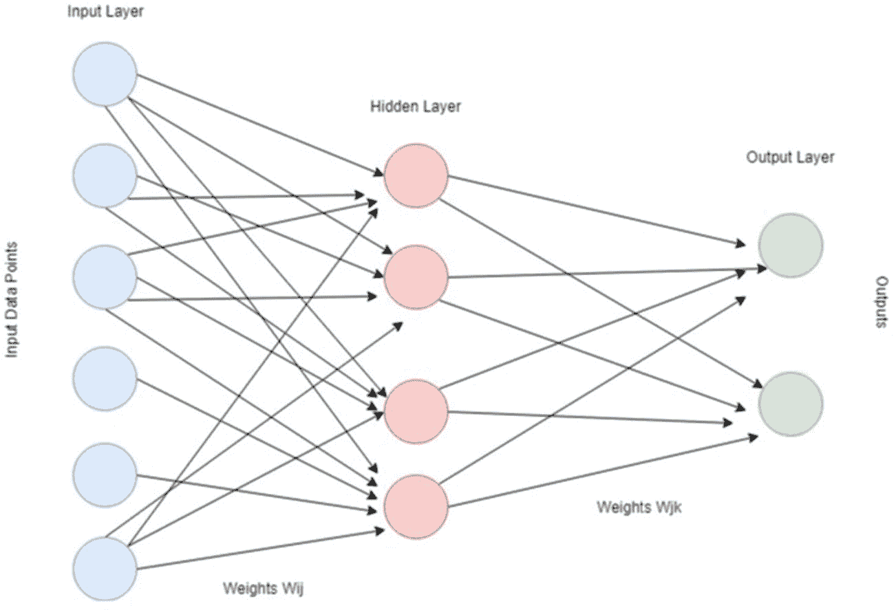

典型神经网络的结构包括输入层中的 6 个输入数据点，通过权重 Wij 映射到隐藏层中的 4 个节点，这些节点再通过权重 Wjk 映射到输出层中的 2 个节点。

图 6-1

典型神经网络

**自编码器**是一种具有发现高维数据低维表示和从输出重建输入能力的神经网络。自编码器由神经网络的两部分组成：编码器和解码器。编码器将高维数据集的维度降低到低维数据集，而解码器将低维数据扩展到高维数据。这个过程的目标是尝试重建原始输入。如果神经网络表现良好，那么从编码数据中重建原始输入的可能性就很高。这一内在原则对于构建异常检测模块至关重要。

注意，如果您的训练样本在每个输入点包含少量维度/特征，自编码器并不很有用。自编码器在五个或更多维度上表现良好。如果您只有一个维度/特征，您只是在进行线性变换，这并不有用。

自编码器在许多用例中非常有用。以下是一些自编码器的流行应用：

+   深度学习网络的训练

+   压缩

+   分类

+   异常检测

+   生成模型

本章的重点是使用自编码器进行异常检测。

## 简单自编码器

自编码器神经网络实际上是一对相互连接的子网络：编码器和解码器。编码器网络接收输入并将其转换为更小、更密集的表示（也称为输入的潜在表示），解码器网络尽可能将其转换回原始输入。图 6-2 显示了具有编码器和解码器子网络的自动编码器示例。

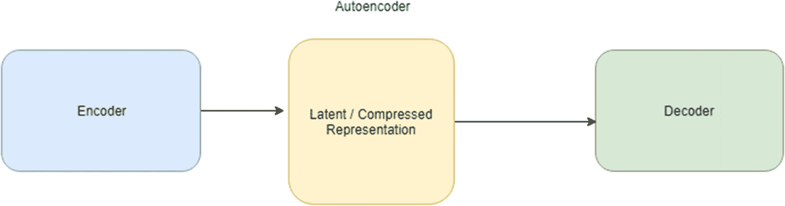

简单自编码器的架构包括编码器、潜在或压缩表示的自编码器和解码器。

图 6-2

自编码器的描述

自编码器使用一种数据压缩逻辑，其中由神经网络实现的压缩和解压缩函数是有损的，并且大多数情况下是无监督的，不需要太多干预。图 6-3 展示了自编码器的扩展视图

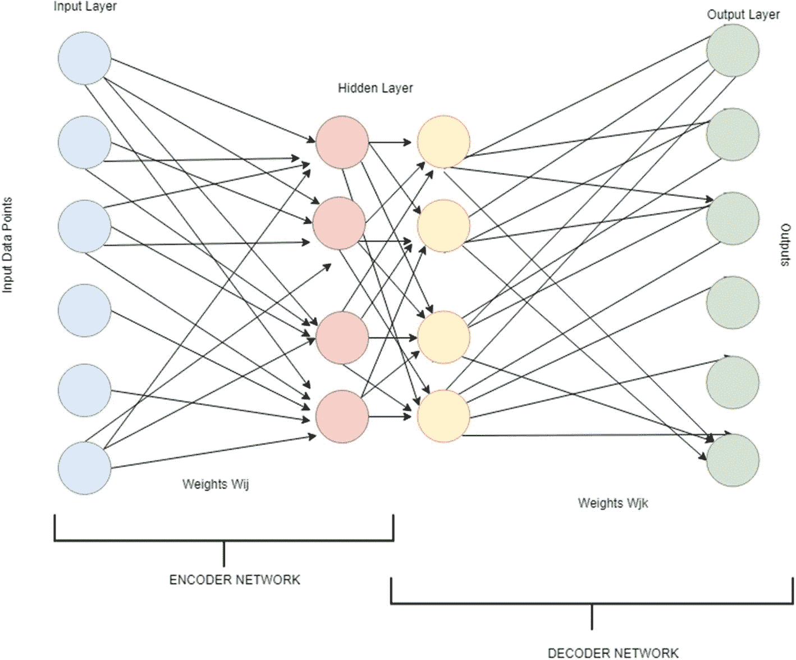

自编码器的网络包括一个编码器网络，输入层有 6 个输入数据点，通过权重 W i j 映射到隐藏层的 4 个节点，并通过权重 W j k 映射到隐藏层的 4 个节点，这些节点映射到解码器网络的输出层的 6 个节点。

图 6-3

自编码器的扩展视图

整个网络通常作为一个整体进行训练。损失函数通常是输出和输入之间的均方误差或交叉熵，称为*重建损失*，它惩罚网络生成与输入不同的输出。因为编码（这仅仅是中间隐藏层的输出）的单元远少于输入，编码器必须选择丢弃信息。编码器学习在有限的编码中尽可能保留相关信息，并智能地丢弃无关部分。解码器学习从编码中提取并正确地将其重建为输入。如果你正在处理图像，那么输出就是图像。如果输入是音频文件，输出就是音频文件。如果输入是某些特征工程数据集，输出也是一个数据集。我们将使用信用卡交易示例来在本章中说明自编码器。

为什么还要费力学习原始输入的表示，只是为了尽可能好地重建输出呢？答案是，当你有具有许多特征的数据输入时，通过神经网络隐藏层生成压缩表示可以帮助压缩训练样本的输入。因此，当神经网络遍历所有训练数据并微调所有隐藏层节点的权重时，真正发生的事情是权重将真正代表我们通常看到的那种输入类型——没有噪声或其他伪影。结果，如果你尝试输入其他类型的数据，例如带有一些噪声的数据，自编码器网络将能够检测噪声并在生成输出时至少移除一部分噪声。这是非常棒的，因为它使我们能够从例如猫和狗的图像中潜在地移除噪声。作为一个现实世界的例子，安全监控摄像头在夜间或恶劣天气时经常捕捉到模糊、不清晰的图片，导致图像噪声。自编码器网络可以帮助至少移除其中的一些噪声。

去噪自编码器背后的逻辑是，通过在干净、正常的图像上训练，可以检测并从噪声图像中去除噪声，因为这种噪声不是数据的一些显著特征。对于代码，你可以在 GitHub 上找到笔记本[`github.com/apress/beginning-anomaly-detection-python-deep-learning-2e/blob/master/Chapter%206%20Autoencoders/chapter6_autoencoder.ipynb`](https://github.com/apress/beginning-anomaly-detection-python-deep-learning-2e/blob/master/Chapter%206%20Autoencoders/chapter6_autoencoder.ipynb)。

图 6-4 显示了在 Jupyter Notebook 中导入所有必要包的基本代码。

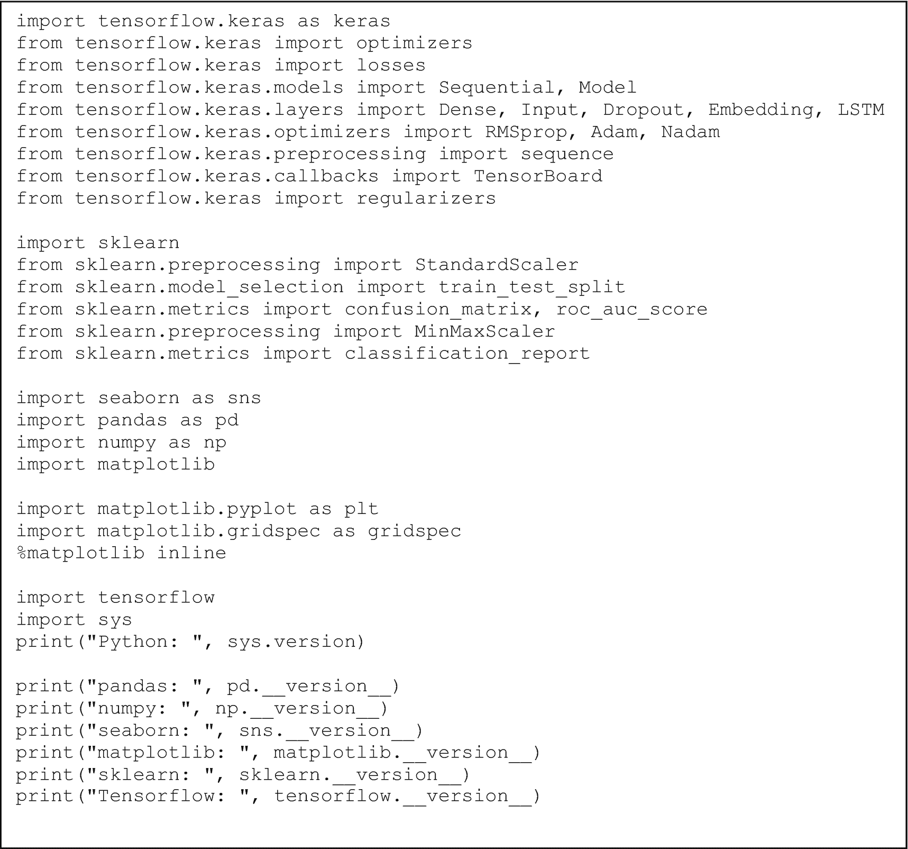

一段代码，在 Jupyter Notebook 中导入所有必要的包，包含从 tensorflow.dot.keras 导入 8 个库，从 sklearn 导入 5 个库，从 seaborn 导入 s n s，从 pandas 导入 p d，从 numpy 导入 n p，从 matplotlib 导入 2 个库，以及 sys，并打印它们的版本，共有 31 行。

图 6-4

在 Jupyter Notebook 中导入包

输出如下：

```py
Python:  3.8.12 (default, Oct 12 2021, 03:01:40) [MSC v.1916 64 bit (AMD64)]
pandas:  2.0.0
numpy:  1.22.2
seaborn:  0.11.2
matplotlib:  3.7.1
sklearn:  1.2.2
Tensorflow:  2.7.0
```

下面是代码，通过混淆矩阵、异常图表和错误图表（预测值与真实值之间的差异）来可视化训练结果。下面（图 6-5）是`Visualization`辅助类。

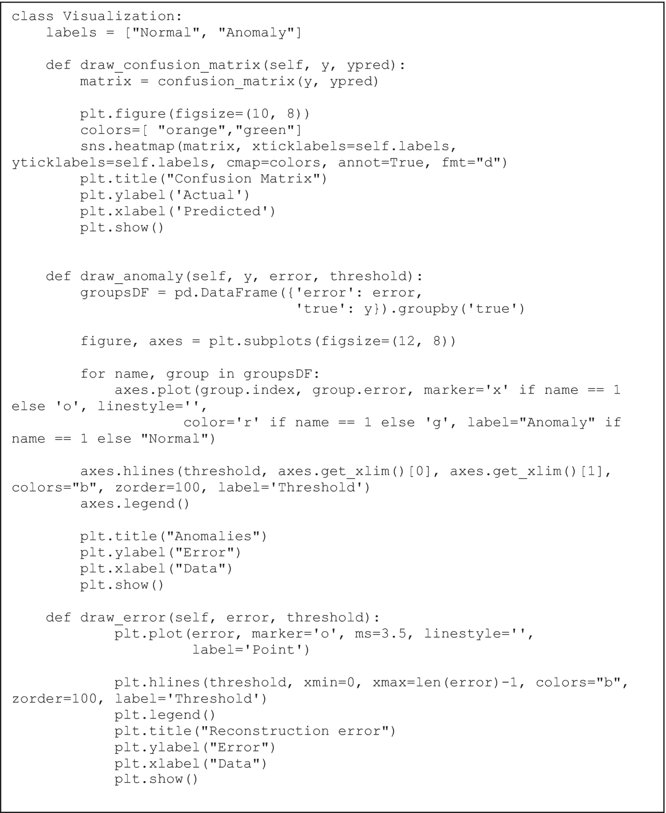

一段代码，创建名为 Visualization 的类，定义了绘制混淆矩阵、绘制异常和绘制错误函数，并绘制热图、图形、标题、y 轴标签、x 轴标签和图例。

图 6-5

可视化辅助工具

我们将使用信用卡数据的例子来检测交易是否正常/预期或异常/异常。图 6-6 显示了数据被加载到 Pandas 数据框中。您可以在[`www.kaggle.com/datasets/mlg-ulb/creditcardfraud`](https://www.kaggle.com/datasets/mlg-ulb/creditcardfraud)下载此数据集。

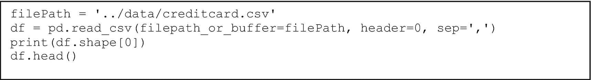

一段代码读取包含信用卡数据的文件路径，包括`df = pd.read_csv(filepath_or_buffer=filepath, header=0, sep=',\'')`，打印`df.shape[0]`和`df.head()`。

图 6-6

pandas 数据框

该数据集也托管在[`github.com/apress/beginning-anomaly-detection-python-deep-learning-2e/blob/master/data/creditcard.csv.zip`](https://github.com/apress/beginning-anomaly-detection-python-deep-learning-2e/blob/master/data/creditcard.csv.zip)。只需在本地解压缩.zip 文件即可获得 creditcard.csv。

执行图 6-6 中的代码后，你应该看到表 6-1 中所示的那种输出。

表 6-1

图 6-6 中代码的`df.head()`的截断输出

|   | 时间 | V1 | V2 | … | V27 | V28 | 金额 | 类别 |
| --- | --- | --- | --- | --- | --- | --- | --- | --- |
| **0** | 0.0 | -1.359807 | -0.072781 | ... | 0.133558 | -0.021053 | 149.62 | 0 |
| **1** | 0.0 | 1.191857 | 0.266151 | ... | -0.008983 | 0.014724 | 2.69 | 0 |
| **2** | 1.0 | -1.358354 | -1.340163 | ... | -0.055353 | -0.059752 | 378.66 | 0 |
| **3** | 1.0 | -0.966272 | -0.185226 | ... | 0.062723 | 0.061458 | 123.50 | 0 |
| **4** | 2.0 | -1.158233 | 0.877737 | ... | 0.219422 | 0.215153 | 69.99 | 0 |

我们将收集 20,000 个正常记录和 400 个异常记录。你可以选择不同的比例，但通常，使用比异常数据更多的正常数据示例更好，因为你想教会自动编码器正常数据看起来是什么样子。训练数据中异常数据过多将训练自动编码器学习异常实际上是正常的，这与我们的目标相悖。图 6-7 展示了选择大多数正常数据来采样数据框。

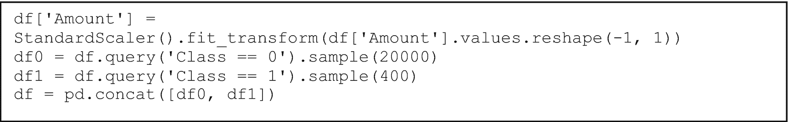

一段包含 5 行的代码。描述了使用标准缩放方法对金额的 d f 进行缩放，以及将值重塑为（负 1，1），d f 0 有 20000 个样本，d f 1 有 400 个样本，d f = p d dot concat (d f 0, d f 1)。

图 6-7

从数据框中选择大多数正常数据来采样

将数据框拆分为训练数据和测试数据（80-20 拆分），如图 6-8 所示。

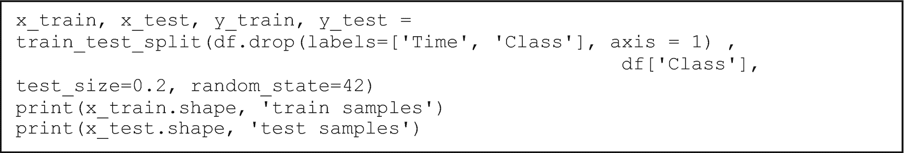

一段代码，用于根据标签时间类别将数据框拆分为训练数据和测试数据，设置测试大小为 0.2，随机状态为 42，并打印训练和测试形状。

图 6-8

使用 20%作为保留测试数据来拆分数据

你应该看到打印出的输出如下：

```py
(16320, 29) train samples
(4080, 29) test samples
```

现在是时候创建一个简单的神经网络模型，仅包含编码器层和解码器层了。我们将使用编码器将输入信用卡数据集的 29 列编码成 12 个特征。解码器将这 12 个特征扩展回 29 个特征。图 6-9 展示了创建神经网络的相关代码。

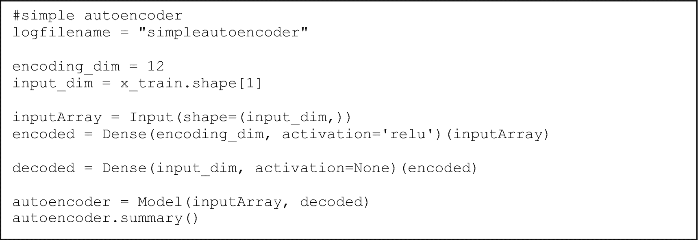

代码包括日志文件名 = simple autoencoder，编码维度 = 12，输入维度 = x train dot shape of 1，输入数组 = 输入维度的输入，使用密集方法编码和解码，自动编码器 = 模型（输入数组，解码），以及自动编码器. summary 左右括号。

图 6-9

创建简单的自动编码器神经网络

你应该看到以下输出：

```py
Model: "model"
_________________________________________________________________
Layer (type)                Output Shape              Param #
=================================================================
input_1 (InputLayer)        [(None, 29)]              0
dense (Dense)               (None, 12)                360
dense_1 (Dense)             (None, 29)                377
=================================================================
Total params: 737
Trainable params: 737
Non-trainable params: 0
```

如果你查看上面的代码，你会看到我们使用了以下激活函数：

+   **ReLU**：在深度学习模型中，Rectified Linear Unit 是最常用的激活函数。如果它接收到任何负输入，则函数返回 0，但对于任何正值 xx，它返回该值。因此，它可以写成

    f(x) = max(0, x).

可用的激活函数有几个，你可以参考 Keras 文档查看选项：[`https://keras.io/activations/`](https://keras.io/activations/)。

现在，使用 RMSprop 作为优化器以及均方误差进行损失计算来编译模型。RMSprop 优化器与具有动量的梯度下降算法类似。度量函数类似于损失函数，只不过在训练模型时不会使用评估度量函数的结果。你可以使用任何在[`keras.io/losses/`](https://keras.io/losses/)中列出的损失函数作为度量函数。图 6-10 展示了使用平均绝对误差 (MAE) 和准确率作为度量来编译模型的代码。

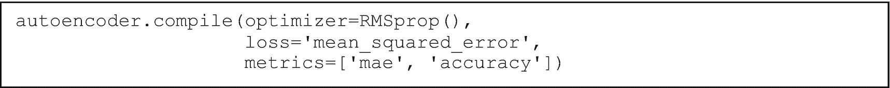

代码读取，autoencoder dot compile left parenthesis optimizer = R M S prop left and right parentheses, loss = single quotation mean underscore squared error single quotation, metrics = left square bracket m a e comma accuracy right square bracket and parenthesis.

图 6-10

编译模型

现在，我们可以开始使用训练数据集来训练模型，并使用测试数据集在每个步骤中验证模型。我们选择了 32 作为批大小和 20 个 epoch。图 6-11 展示了训练模型的代码，这是代码中最耗时的部分。

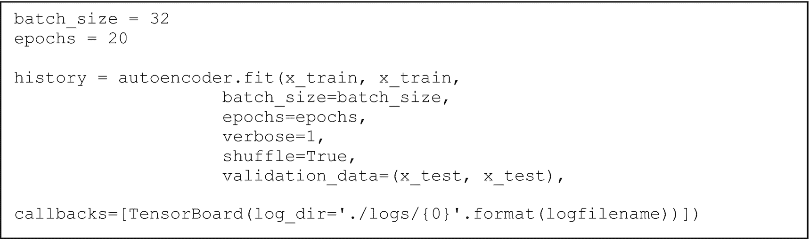

代码包括批大小 = 32、epoch = 20 和 history = autoencoder dot fit left parenthesis x train, x train, batch size = batch size, epochs = epochs, verbose = 1, shuffle = True, validation data = ( x test, x test) comma, statement for callbacks with tensorboard, right parenthesis.

图 6-11

训练模型

正如你所见，训练过程在每个 epoch 输出损失、准确率以及验证损失和验证准确率。下面（图 6-12）展示了训练步骤的输出。

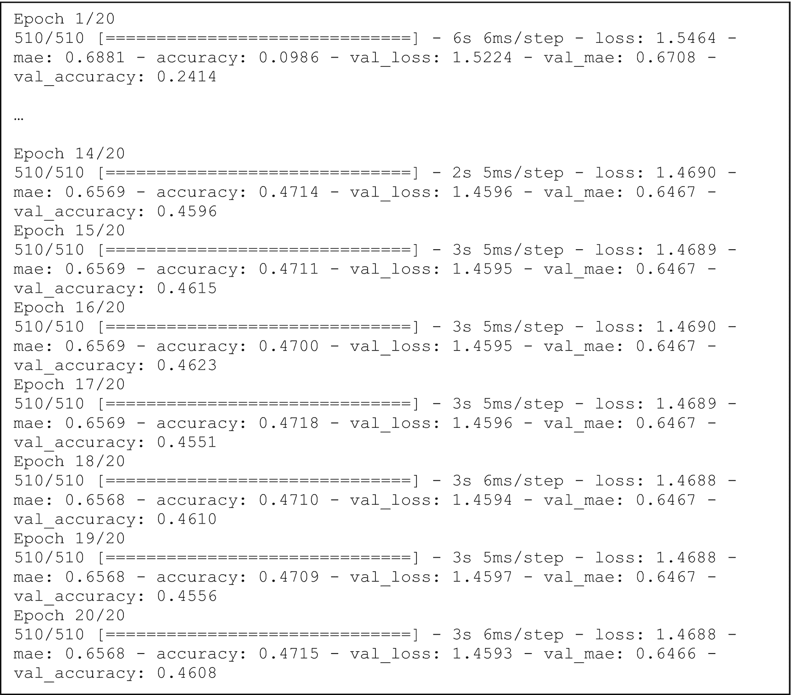

包含 m a e、准确率、验证损失、验证 m a e 和验证准确率的输出，对于 20 个 epoch 中的 1 到 20，包括第 20 个 epoch 的验证准确率为 0.2414，第 15 个 epoch 的验证准确率为 0.4615，以及第 20 个 epoch 的验证准确率为 0.4608。

图 6-12

训练阶段进度

你可能已经注意到了 TensorBoard 回调。TensorBoard 是一个通常与 TensorFlow 一起自动安装的实用工具。它允许你可视化与每个模型的训练过程相关的不同度量。在这里，使用指定的 `log_dir` 路径，TensorBoard 在同一文件夹内创建一个名为 logs 的文件夹。要启动 TensorBoard，请在命令提示符窗口中执行以下操作：

```py
tensorboard –logdir=log_file_path
```

如果你正在使用 Conda，请确保你处于正确的 Conda 环境中。如果你有 Jupyter Notebook 或 JupyterLab，你可以打开一个终端实例并输入以下命令，确保 `log_file_path` 指向日志文件夹：

```py
tensorboard --logdir=./logs
```

一旦命令提示符输出告诉你 TensorBoard 正在某个 URL（例如 `http://localhost:6006/`）上托管，导航到该网站以访问 TensorBoard UI，在那里你可以找到你的训练运行输出。

图 6-13 展示了通过 TensorBoard（在“图形”选项卡中）可视化的模型图。

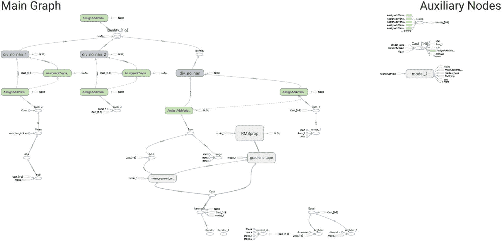

一个主图网络，包含节点、链接和辅助节点。主图中的节点包括 div no nan 1、身份 1 到 5、div no nan 2、身份、R M S prop、梯度带和均方误差。

图 6-13

TensorBoard 中显示的模型图。它很大且非常详细，因此如果你想分析你的模型的计算图，请在你的 TensorBoard UI 中查看你的模型图。

图 6-14 展示了通过训练过程中的训练轮次来绘制训练过程中的准确率绘图。

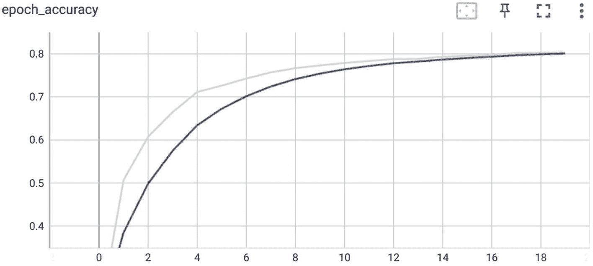

准确率与训练轮次的关系图。两条曲线，一条平滑，另一条粗糙，具有向下凹的趋势，最初急剧增加，然后缓慢增加。粗糙曲线从 (0.5, 0) 开始，到 (18, 0.8) 结束。平滑曲线从 (0.8, 0) 开始，到 (18, 0.8) 结束。数值是近似的。

图 6-14

TensorBoard 中显示的准确率绘图

图 6-15 展示了通过训练过程中的训练轮次来绘制训练过程中的平均绝对误差绘图。

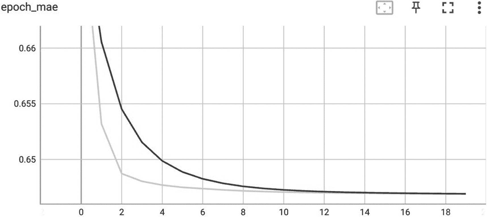

均方绝对误差与训练轮次的关系图。两条曲线，一条平滑，另一条粗糙，具有向上凹的趋势，最初急剧下降，然后缓慢下降。粗糙曲线位于 (0.3, 0.66) 和 (18, 0.641) 之间。平滑曲线位于 (1, 0.66) 和 (18, 0.641) 之间。数值是估计的。

图 6-15

TensorBoard 中显示的 MAE 绘图

图 6-16 展示了通过训练过程中的训练轮次来绘制训练过程中的损失绘图。

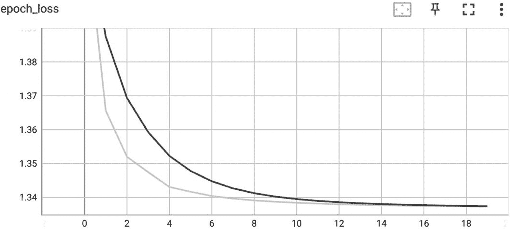

损失与训练轮次的关系图。绘制了两个具有向上凹的下降趋势的曲线。其中一条曲线平滑，另一条曲线粗糙。粗糙曲线从 (0.5, 1.39) 开始，到 (18, 1.335) 结束。平滑曲线从 (0.8, 1.39) 开始，到 (18, 1.335) 结束。数值是近似的。

图 6-16

TensorBoard 中显示的损失绘图

图 6-17 展示了通过训练过程中的训练轮次来绘制验证准确率。

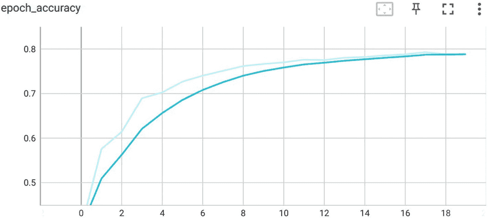

验证准确率与训练轮次的关系图。两条曲线，一条平滑，另一条粗糙，具有向下凹的趋势，最初急剧增加，然后缓慢增加。粗糙曲线位于 (0.4, 0) 和 (18, 0.79) 之间。平滑曲线位于 (0.5, 0) 和 (18, 0.79) 之间。数值是估计的。

图 6-17

TensorBoard 中显示的验证准确率绘图

图 6-18 展示了在训练过程中通过训练的各个时期绘制验证损失。

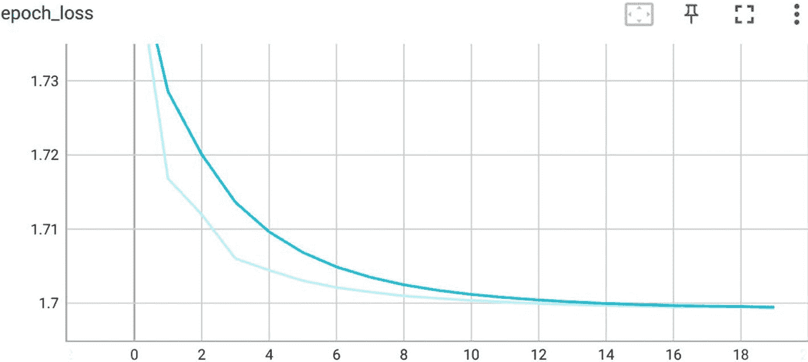

验证损失与时期的关系图。2 条曲线，一条平滑，另一条粗糙，起初下降趋势陡峭，然后逐渐平缓。粗糙曲线位于 (0.7, 1.73) 和 (18, 1.7) 之间。平滑曲线位于 (1, 1.73) 和 (18, 1.7) 之间。数值是近似的。

图 6-18

TensorBoard 中显示的验证损失绘图

现在训练过程已完成，让我们运行图 6-19 中显示的代码来评估模型的损失和准确性。

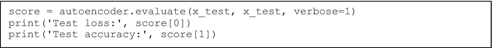

评估模型损失和准确性的代码包括 score = autoencoder dot evaluate (x underscore test, x underscore test, verbose = 1), print (Test loss colon in quotes, score at index 0), 和 print (Test accuracy colon inquotes, score at index 1)。

图 6-19

评估模型的代码

您应该看到这样的输出，精确度相当不错，为 0.79：

```py
128/128 [==============================] - 0s 3ms/step - loss: 1.6993 - mae: 0.6686 - accuracy: 0.7892
Test loss: 1.6993268728256226
Test accuracy: 0.6685927510261536
```

下一步是计算误差，检测异常，然后绘制异常和误差。我们选择了阈值为 10。图 6-20 展示了基于阈值测量异常的代码。

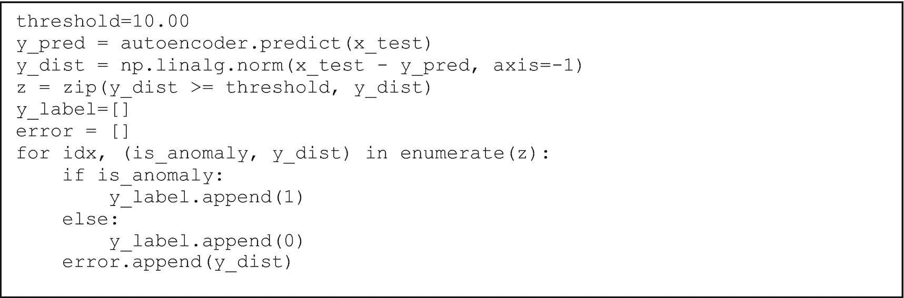

一段代码包括 threshold = 10.00, y pred = autoencoder dot predict (x test), y label 和 error = left and right square brackets, if is anomaly colon y label dot append at index 1, else y label dot append at index 0, 和 error dot append of, y dist.

图 6-20

基于阈值的异常测量

让我们深入探讨图 6-20 中显示的代码，因为我们将在本章中将数据点分类为异常或正常时使用它。如您所见，这是基于一个称为阈值的特殊参数。我们只是在查看误差（实际值与预测值之间的差异）并将其与阈值进行比较。首先计算 `threshold`=10 的精确度和召回率。图 6-21a 展示了显示精确度和召回率的代码。

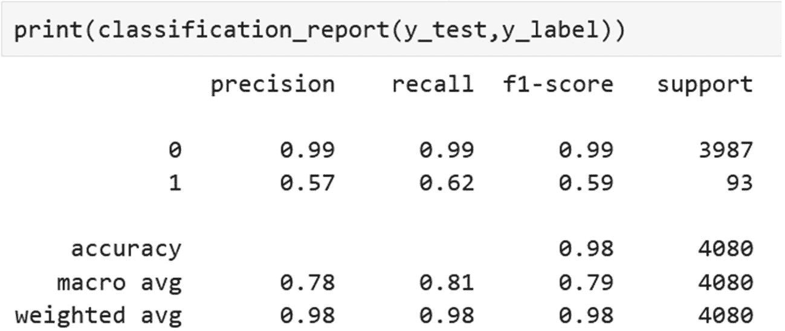

一段代码读取 print left parenthesis classification underscore report left parenthesis y underscore test, y underscore label double right parentheses。包括一个具有精确度、召回率、f 1 分数和支持的列输出，包括 0、1、准确度、宏平均和加权平均。

图 6-21a

显示精确度和召回率的代码

让我们使用图 6-20 中显示的代码来计算 `threshold`=1.0 和 `threshold`=5.0 的精确度和召回率。图 6-21b 和 6-21c 展示了相应阈值下的输出。注意：由于神经网络权重的随机初始化，您精确的精确度和召回率值可能与图中所示的不符。您也可以尝试 `threshold`=15.0。

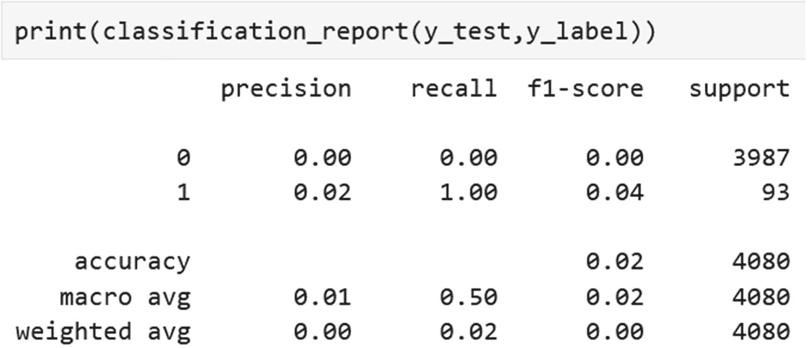

代码读取为：print left parenthesis classification underscore report left parenthesis y underscore test, y underscore label double right parentheses。包括具有精确度、召回率、f 1 分数和支持的输出，包括 0、1、准确度、宏平均和加权平均。

图 6-21b

显示 `threshold=1.0` 的精确度和召回率的代码

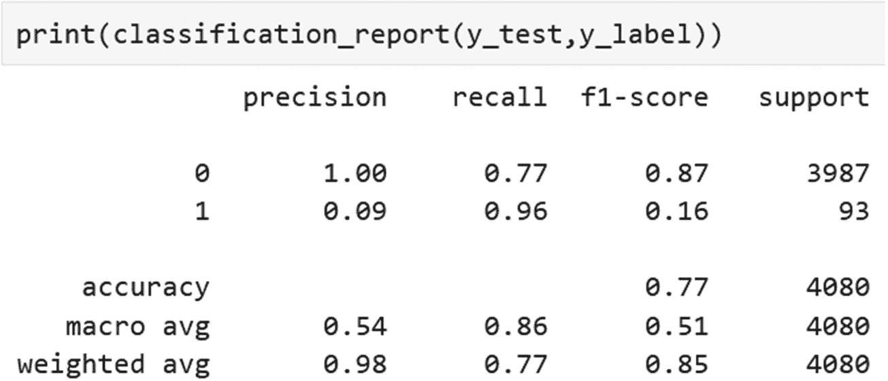

代码读取为：print left parenthesis classification underscore report left parenthesis y underscore test, y underscore label double right parentheses。包括具有精确度、召回率、f 1 分数和支持的输出，包括 0、1、准确度、宏平均和加权平均。

图 6-21c

显示 `threshold=5.0` 的精确度和召回率的代码

如果你观察三个分类报告，你可以看到对于 `threshold=1` 和 `threshold=5`，精确度和召回率列不好（第 0 行和第 1 行的值非常低）。对于 `threshold=10`，它们看起来更好。我们希望尽可能高地提高第 0 行和第 1 行的精确度和召回率。实际上，`threshold=10` 的表现最好，比 `threshold=1` 或 `threshold=5` 的精确度和召回率都要好。然而，作为一个如此简单的模型，其性能还有待提高。

在这个和其他模型中，选择阈值是一个实验过程，并且根据训练的数据而变化。

图 6-21d 显示了计算曲线下面积 (AUC) 分数（0.0 到 1.0）的代码和 0.806 的输出。

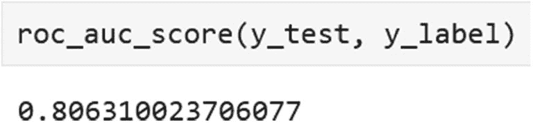

两个代码行的代码。第 1 行读取为：roc underscore auc underscore score left parenthesis y underscore test, y underscore label right parenthesis。第 2 行读取为：0.806310023706077。

图 6-21d

显示 AUC 的代码

我们现在可以可视化混淆矩阵，以查看模型的表现如何，如图 6-22 所示。

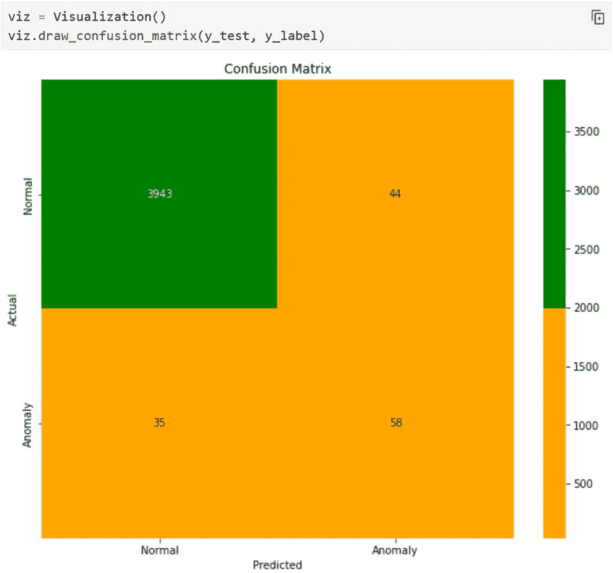

实际数据与预测数据对比的阴影混淆矩阵，有 2 行和 2 列。列和行标题是正常和异常。第 1 行条目是 3943 和 44。第 2 行条目是 35 和 58。矩阵附近给出了一个颜色图。矩阵上方打印了一段代码。

图 6-22

混淆矩阵

现在，使用标签的预测（正常或异常），我们可以将异常值与正常数据点进行比较。图 6-23 显示了基于阈值的异常值。

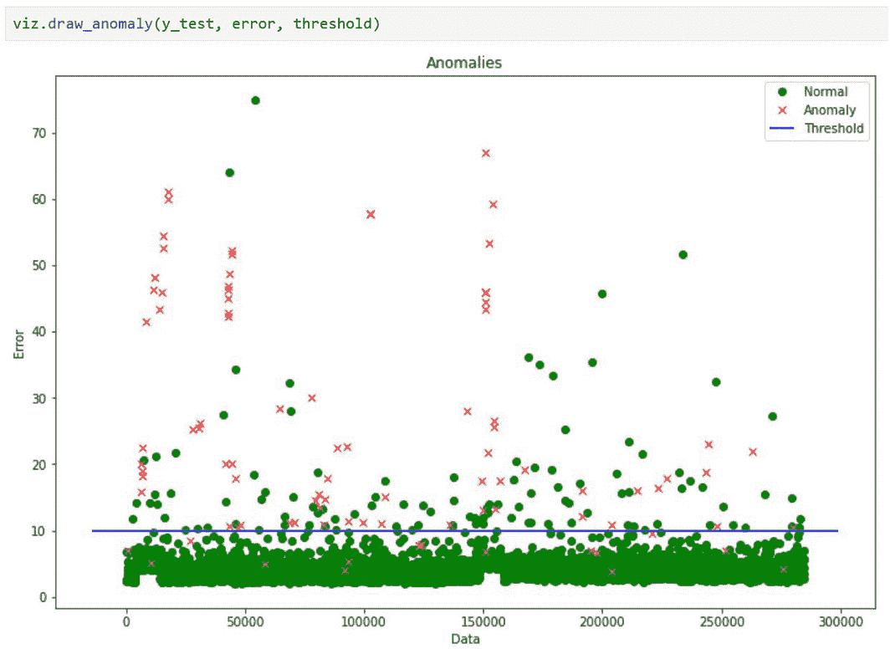

错误与数据点的散点图。正常图大多聚集在水平阈值大约 10 以下，一些异常图在上方。散点图上方的一段代码读取为：viz dot draw underscore anomaly left parenthesis y underscore test, error, threshold right parenthesis。

图 6-23

基于阈值的异常值

## 稀疏自动编码器

在上一节简单自编码器的例子中，表示被限制只由隐藏层的大小（12）决定。在这种情况下，通常发生的情况是隐藏层正在学习主成分分析（PCA）的近似。但另一种将表示约束为紧凑的方法是在隐藏表示的活动上添加稀疏性约束，这样在给定时间内就会少有单元被激活。在 Keras 中，这可以通过向我们的 `Dense` 层添加 `activity_regularizer` 来实现。

简单自编码器和稀疏自编码器之间的区别主要在于在训练期间添加到损失函数中的正则化项。

在本节中，我们将使用与简单自编码器示例中相同的信用卡数据集。我们将使用信用卡数据的例子来检测交易是否为正常/预期或异常/异常。下面是数据被加载到 Pandas 数据框中的情况。

然后，我们将收集 20,000 个正常记录和 400 个异常记录。你可以选择不同的比例，但一般来说，使用比异常数据更多的正常数据示例更好，因为你想教会你的自编码器正常数据看起来是什么样子。过多的异常数据在训练中会训练自编码器学习异常实际上是正常的，这与我们的目标相悖。将数据框拆分为训练数据和测试数据（80-20 分割）。对于代码，你可以在 GitHub 上的笔记本中找到，网址为[`https://github.com/apress/beginning-anomaly-detection-python-deep-learning-2e/blob/master/Chapter%206%20Autoencoders/chapter6_autoencoder.ipynb`](https://github.com/apress/beginning-anomaly-detection-python-deep-learning-2e/blob/master/Chapter%206%20Autoencoders/chapter6_autoencoder.ipynb)。

简单地重新运行上一节中的步骤，但使用图 6-24 中的新模型定义。

现在是时候创建一个只有编码器和解码器层的神经网络模型了。我们将使用编码器将输入信用卡数据集的 29 列编码为 12 个特征。解码器将这 12 个特征扩展回 29 个特征。与简单自编码器相比的关键区别是活动正则化器以适应稀疏自编码器。图 6-24 展示了创建神经网络所需的代码。

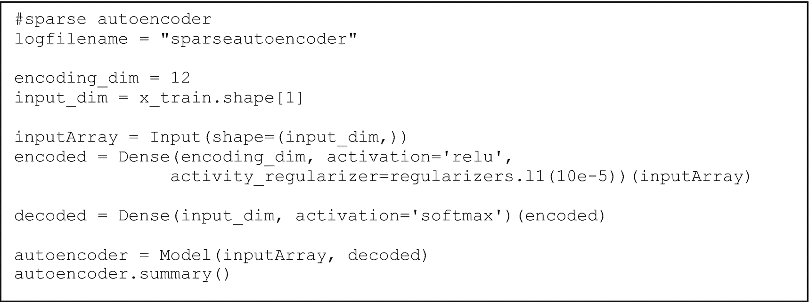

神经网络代码包括双引号中的日志文件名，编码维度 = 12，输入维度 = x train dot shape at 1，autoencoder = 输入数组模型，decoded，以及 autoencoder dot summary 左右括号。

图 6-24

创建神经网络的代码

模型输出应类似于以下内容：

```py
Model: "model_1"
_________________________________________________________________
Layer (type)                Output Shape              Param #
=================================================================
input_2 (InputLayer)        [(None, 29)]              0
dense_2 (Dense)             (None, 12)                360
dense_3 (Dense)             (None, 29)                377
=================================================================
Total params: 737
Trainable params: 737
Non-trainable params: 0
```

图 6-25 展示了由 TensorBoard 可视化的模型图。

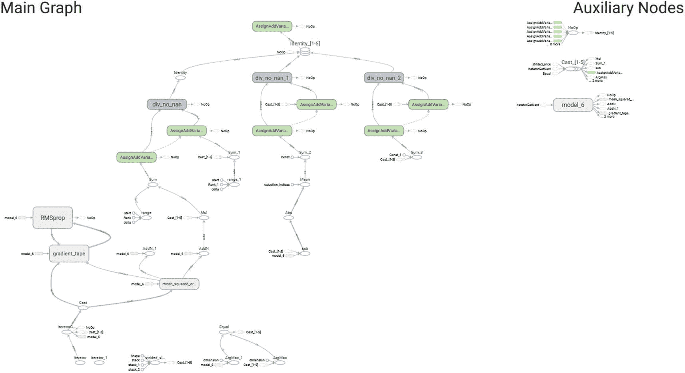

主图网络包含节点和链接以及辅助节点。主图中的节点包括 div no nan 1，identity 1 to 5，div no nan 2，identity，R M S prop，gradient tape，和 mean squared error。

图 6-25

TensorBoard 创建的模型图

## 深度自动编码器

我们可以不仅仅将编码器或解码器限制在单层，而可以使用层叠的层。使用过多的隐藏层（以避免可能的过拟合）不是一个好主意，而最优的层数取决于具体的应用场景，因此你必须进行实验以确定最优的层数和压缩比。

唯一真正改变的是层数的数量。

我们将使用信用卡数据的例子来检测交易是否正常/预期或异常/异常。下面是数据被加载到 Pandas Dataframe 中的情况。

我们将收集 20,000 个正常记录和 400 个异常记录。再次强调，你可以选择不同的比例，但一般来说，使用比异常数据更多的正常数据示例会更好，因为你想教会你的自动编码器正常数据是什么样的。训练数据中过多的异常数据会导致自动编码器学习到异常实际上是正常的，这与我们的目标相悖。将数据框拆分为训练数据和测试数据（80-20 拆分）。对于代码，你可以在 GitHub 上的笔记本中找到它：[`https://github.com/apress/beginning-anomaly-detection-python-deep-learning-2e/blob/master/Chapter%206%20Autoencoders/chapter6_autoencoder.ipynb`](https://github.com/apress/beginning-anomaly-detection-python-deep-learning-2e/blob/master/Chapter%206%20Autoencoders/chapter6_autoencoder.ipynb)。

现在是时候创建一个具有三个编码器层和三个解码器层的深度神经网络模型了。我们将使用编码器将输入信用卡数据集的 29 列编码为 16 个特征，然后是 8 个特征，最后是 4 个特征。解码器将这 4 个特征扩展回 8 个特征，然后是 16 个特征，最后是 29 个特征。图 6-26 显示了创建神经网络的代码。

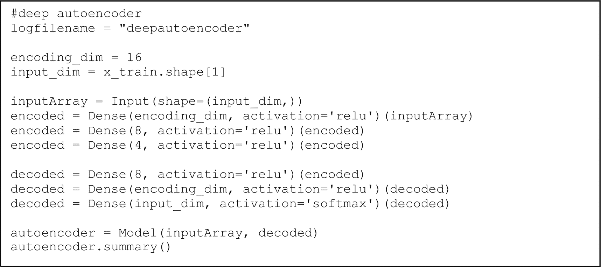

代码包括日志文件名=“deep autoencoder”，编码维度=16，输入维度=x train dot shape at 1，输入数组、编码和解码的语句，自动编码器=输入数组的模型、解码和自动编码器. summary 左右括号。

图 6-26

创建神经网络的代码

图 6-27 显示了 TensorBoard 可视化的模型图。

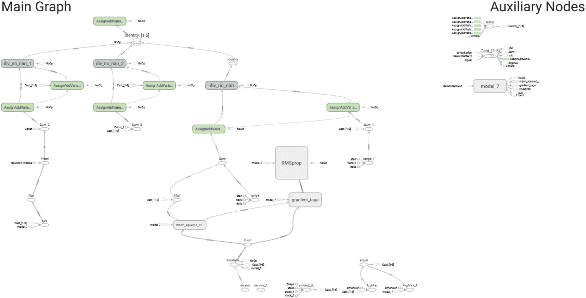

主图网络包含节点和链接以及辅助节点。主图中的节点包括 div no nan 1，identity 1 to 5，div no nan 2，identity，R M S prop，gradient tape，和 mean squared error。

图 6-27

TensorBoard 中显示的模型图

## 卷积自动编码器

当我们的输入是图像时，使用卷积神经网络（convnets 或 CNNs）作为编码器和解码器是有意义的。在实际设置中，应用于图像的自动编码器总是卷积自动编码器，因为它们简单地表现得更好。

让我们实现一个由 `Conv2D` 和 `MaxPooling2D` 层（用于空间下采样）堆叠组成的编码器，以及一个由 `Conv2D` 和 `UpSampling2D` 层堆叠组成的解码器。

对于代码，你可以在 GitHub 上的笔记本中找到，网址为[`https://github.com/apress/beginning-anomaly-detection-python-deep-learning-2e/blob/master/Chapter%206%20Autoencoders/chapter6_cnnautoencoder.ipynb`](https://github.com/apress/beginning-anomaly-detection-python-deep-learning-2e/blob/master/Chapter%206%20Autoencoders/chapter6_cnnautoencoder.ipynb).

图 6-28 展示了导入所有必要包的基本代码。同时请注意我们使用的各种包的版本。

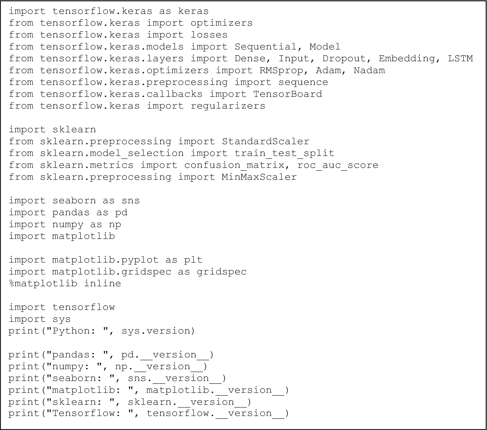

在 Jupyter Notebook 中导入包的代码包括：import tensorflow.dot.keras as keras, import sklearn, import seaborn as sns, import pandas as pd, import numpy as np, import matplotlib, import matplotlib.dot.pyplot as plt, 和 import matplotlib.dot.gridspec as gridspec.

图 6-28

在 Jupyter Notebook 中导入包

我们将使用 MNIST 图像数据集来完成此目的。MNIST 包含 0 到 9 的数字图像，并用于许多不同的用例。图 6-29 展示了加载 MNIST 数据的代码。

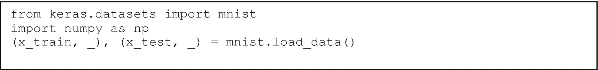

加载 MNIST 数据的代码包括：from keras.dot.datasets import mnist, import numpy as np, and (x_train, x_test) = mnist.dot.load_data().

图 6-29

加载 MNIST 数据的代码

将数据集分为训练集和测试集，并将 MNIST 数据重塑为 28×28 图像，如图 6-30 所示。

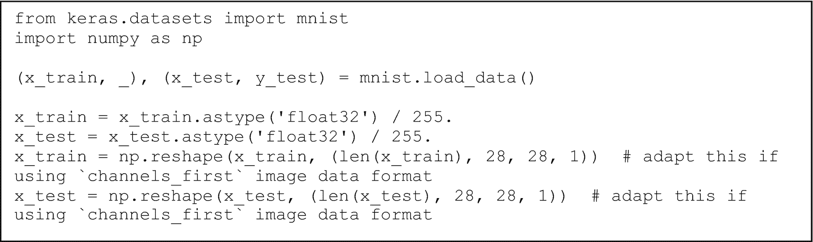

重塑 MNIST 数据的代码包括：from keras.dot.datasets import mnist, import numpy as np, 和 x_train = np.dot.reshape(x_train, (length of x_train), 28, 28, 1), 以及 x_test 的语句。

图 6-30

转换 MNIST 图像的代码

使用卷积和 MaxPool 层创建一个 CNN（卷积神经网络）模型。图 6-31 展示了创建神经网络的代码。

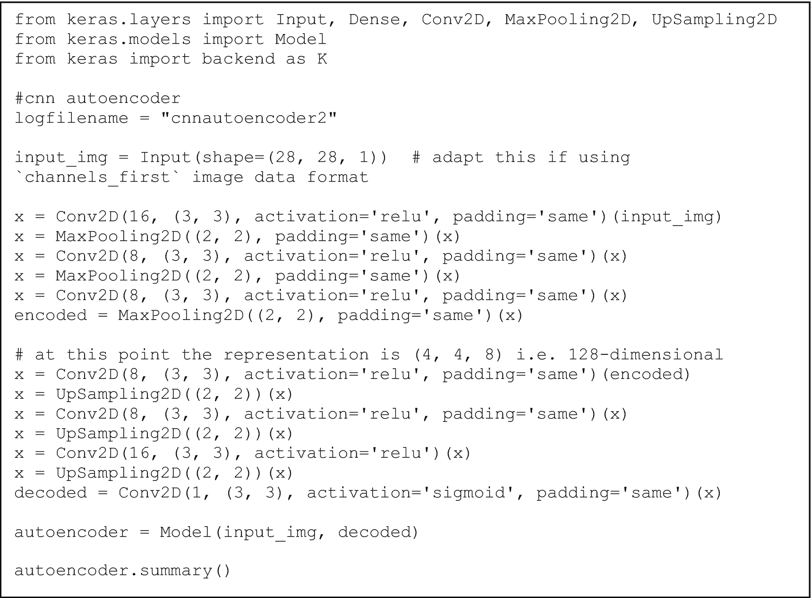

包含以下内容的代码：from keras.dot.layers import Input, Dense, Conv2D, MaxPooling2D, UpSampling2D, from keras.dot.models import Model, from keras import backend as K, log filename = cnn autoencoder 2, statements for input img, x, encoded, and decoded, and autoencoder, and a call for summary.

图 6-31

创建神经网络的代码

使用 RMSprop 作为优化器以及均方误差进行损失计算来编译模型。RMSprop 优化器与带有动量的梯度下降算法类似。图 6-32 展示了编译模型的代码。

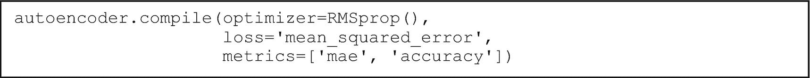

代码读取，自动编码器点编译左括号优化器 = R M S prop 左右括号，损失 = 单引号均方 underscore 方程 underscore 单引号，度量 = 左方括号 m a e，准确率右方括号和括号。

图 6-32

编译模型的代码

现在，我们可以开始使用训练数据集来训练模型，并使用测试数据集在每一步验证模型。我们选择了 32 作为批量大小和 20 个周期。如您所见，训练过程在每个周期输出损失、准确率以及验证损失和验证准确率。下面（图 6-33）展示了正在训练的模型。


代码包括批量大小 = 32、周期 = 20 和历史 = 自动编码器点 fit 左括号 x train、x train、批量大小 = 批量大小、周期 = 周期、verbose = 1、shuffle = True、验证数据 = (x test、x test)、以及回调语句。

图 6-33

正在训练的模型

现在训练过程已完成，让我们评估模型的损失和准确率，如图 6-34 所示。

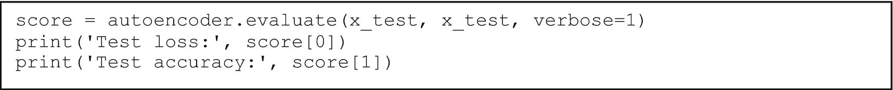

评估模型损失和准确率的代码包括 score = 自动编码器点 evaluate of、x test、x test、verbose = 1、print Test loss colon in quotes comma score at index 0、和 print Test accuracy colon in quotes comma score at index 1。

图 6-34

评估模型的代码

输出应如下所示，准确率相当不错，为 0.81：

```py
313/313 [==============================] - 2s 5ms/step - loss: 0.0110 - mae: 0.0353 - accuracy: 0.8126
Test loss: 0.011009062640368938
Test accuracy: 0.035254064947366714
```

下一步是使用模型为测试子集生成输出图像。这将显示重建阶段进行得如何。图 6-35a 展示了基于模型进行预测的代码。

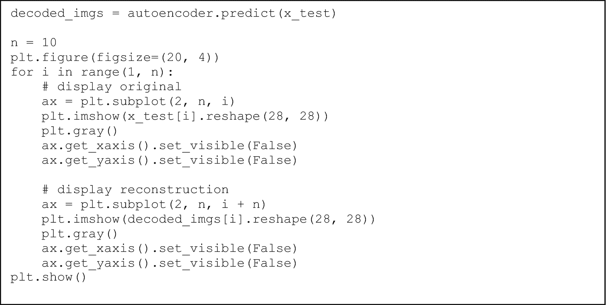

基于模型进行预测的代码包括解码 underscore i m g s = 自动编码器点 predict of x test、n = 10、p l t dot figure of fig size = (20, 4)、for i in range (1, n) colon、显示原始图像和重建图像的语句。

图 6-35a

基于模型进行预测的代码

图 6-35b 展示了原始图像（顶部行）和重建图像（底部行）。

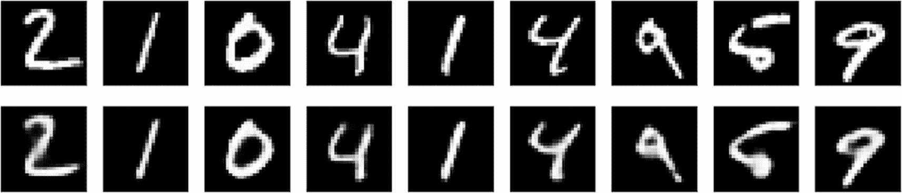

两行包含原始图像和重建图像。数字是 2、1、0、4、1、4、9、6 和 9。

图 6-35b

图 6-35a 生成的模型输出重建

我们也可以通过显示此阶段的测试子集图像来查看编码器阶段的工作情况。图 6-36a 和图 6-36b 展示了编码图像本身。

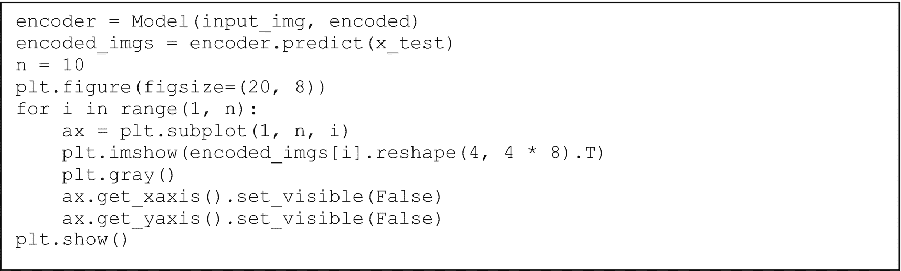

一段代码包括编码器 = 模型，输入图像，编码，编码图像 = 编码器预测 x 测试，n = 10，plt.figure(figsize=(20, 8))，for i in range(1, n): colon，和 plt.gray() left and right parentheses.

图 6-36a

显示编码图像的代码

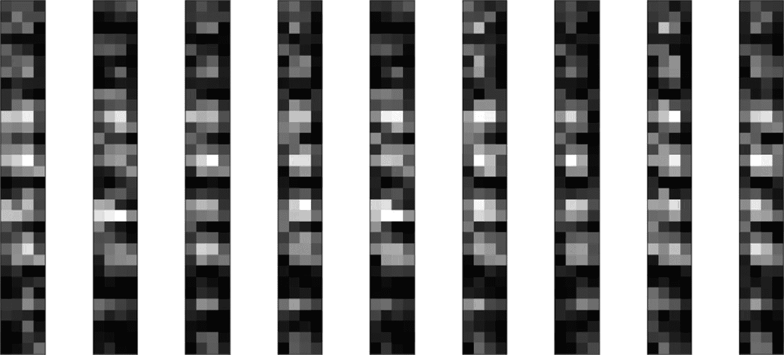

九个不同强度的垂直像素化条形。

图 6-36b

显示的编码图像

图 6-37 展示了 TensorBoard 创建的模型图。

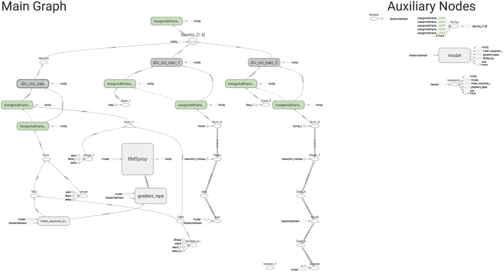

一个主图网络，包含节点和链接以及辅助节点。主图中的节点包括 div no nan 1，identity 1 to 5，div no nan 2，identity，RMS prop，gradient tape，和 mean squared error。

图 6-37

TensorBoard 中显示的模型图

图 6-38 展示了通过训练时代展示的训练过程中的准确率绘图。

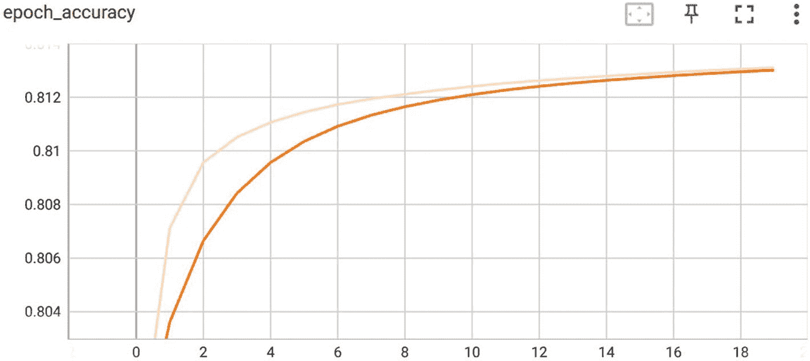

训练准确率与时代对比图，呈现先急剧上升后缓慢上升的向下凹趋势。粗糙曲线从(0.5, 0.803)开始，到(18, 0.813)结束。平滑曲线从(0.9, 0.803)开始，到(18, 0.813)结束。数值为估算值。

图 6-38

TensorBoard 中显示的准确率绘图

图 6-39 展示了通过训练时代展示的训练过程中的损失绘图。

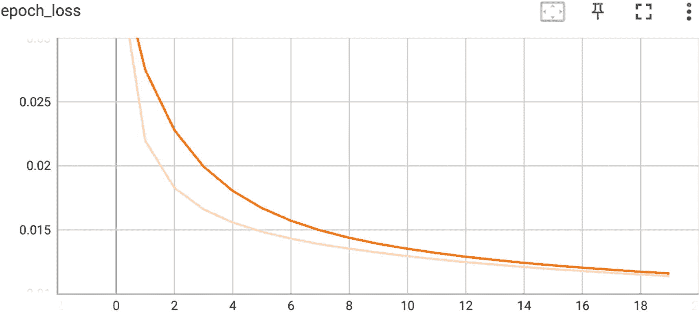

训练损失与时代对比图，呈现先急剧下降后缓慢下降的向上凹趋势。粗糙曲线从(0.5, 0.03)开始，到(18, 0.012)结束。平滑曲线从(0.9, 0.03)开始，到(18, 0.012)结束。数值为近似值。

图 6-39

TensorBoard 中显示的损失绘图

图 6-40 展示了通过训练时代展示的训练过程中的验证准确率绘图。

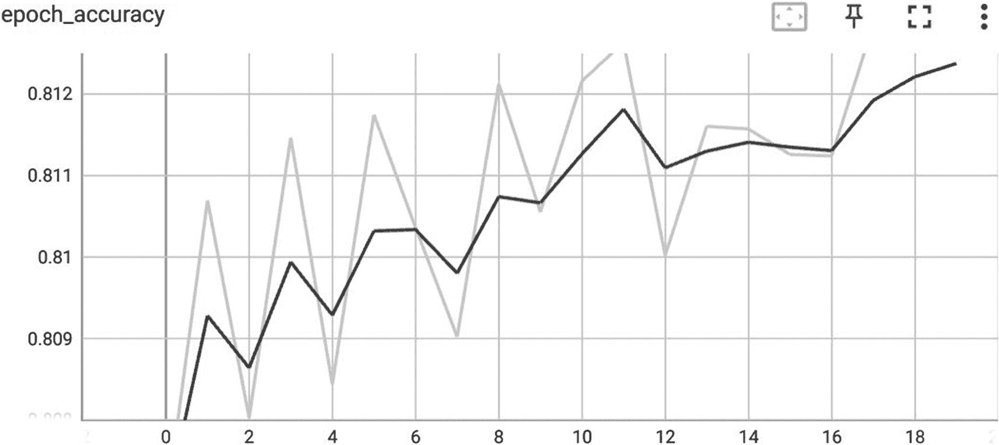

验证准确率与时代对比图。它绘制了两条趋势增加的曲线，有波动。曲线 1 从(0.4, 0)开始，到(16.5, 0.812)结束。曲线 2 从(0.5, 0)开始，到(18, 0.8125)结束。数值为近似值。

图 6-40

TensorBoard 中显示的验证准确率绘图

图 6-41 展示了通过训练时代展示的训练过程中的验证损失绘图。

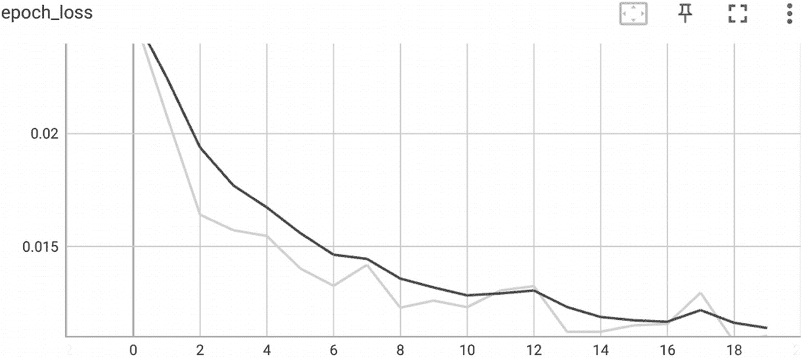

验证损失与时代之间的图表。它绘制了两种趋势下降的曲线，有波动。曲线 1 从 (1, 0.029) 到 (19, 0.005)。曲线 2 从 (0.99, 0.029) 和 (19, 0.000)。数值是近似的。

图 6-41

TensorBoard 中显示的验证损失绘图

## 噪声自编码器

我们可以通过向其输入添加随机噪声并使其恢复原始的无噪声数据来强制自编码器学习有用的特征。这样，自编码器就不能简单地将其输入复制到输出，因为输入也包含随机噪声。自编码器将去除噪声并产生底层有意义的数据。这被称为 *去噪自编码器**.* 图 6-42 描述了一个去噪自编码器。

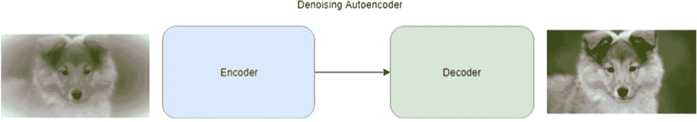

噪声自编码器的流程图包括原始图像作为编码器、去噪自编码器、解码器的输入，输出图像。输入略微模糊。输出具有狗和草背景的鲜明对比。

图 6-42

噪声自编码器的描述

作为现实世界的例子，安全监控摄像头在夜间或恶劣天气时经常捕捉到模糊、不清晰的图片，导致图像噪声。自编码器网络可以帮助去除至少一些噪声。

噪声自编码器背后的逻辑是，通过在干净、正常的图像上训练，可以检测并从噪声图像中去除噪声，因为这种噪声不是数据的一些显著特征。

对于代码，你可以在 GitHub 上的笔记本中找到，网址为[`https://github.com/apress/beginning-anomaly-detection-python-deep-learning-2e/blob/master/Chapter%206%20Autoencoders/chapter6_denoisingautoencoder.ipynb`](https://github.com/apress/beginning-anomaly-detection-python-deep-learning-2e/blob/master/Chapter%206%20Autoencoders/chapter6_denoisingautoencoder.ipynb)

图 6-43 展示了导入所有必要包的基本代码。同时请注意我们使用的各种包的版本。

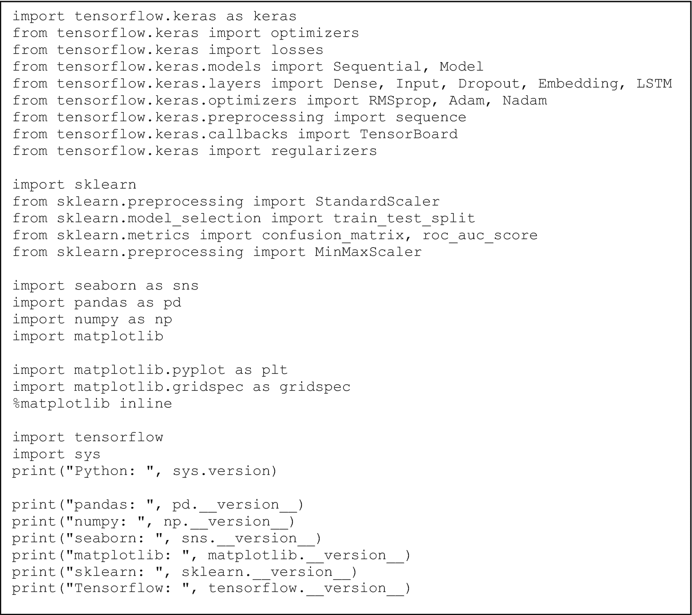

导入所有包的代码包括 import tensor flow dot keras as keras，导入 s k learn，导入 seaborn as s n s，导入 pandas as p d，导入 numpy as n p，导入 mat plot lib，导入 mat plot lib dot py plot as p l t，以及导入 mat plot lib dot grid spec as grid spec。

图 6-43

导入包的代码

我们将使用 MNIST 图像数据集来完成此目的。MNIST 包含 0 到 9 的数字图像，并用于许多不同的用例。图 6-44 展示了加载 MNIST 图像的代码。

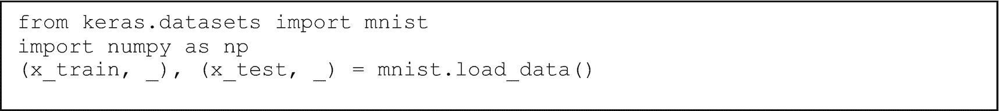

加载 M NIST 图像的代码包括从 keras.dot.datasets 导入 m n i s t，导入 numpy as n p，以及左括号 x underscore train，下划线右括号，左括号 x underscore test，下划线右括号 = m n i s t dot load underscore data 左右括号。

图 6-44

加载 MNIST 图像的代码

将数据集分为训练集和测试集，并将 MNIST 数据重塑为 28×28 图像，如图 6-45 所示。

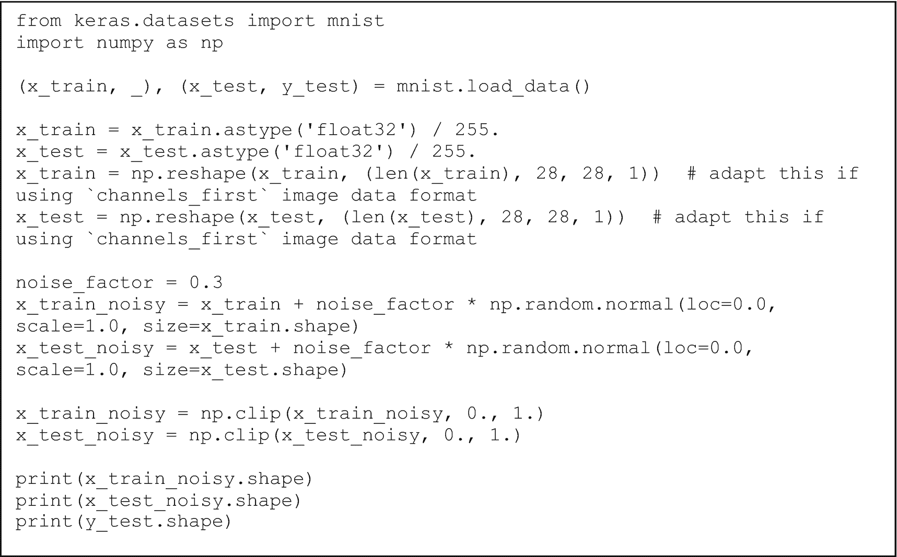

重新塑造 MNIST 数据的代码包括从 keras dot datasets 导入 m n i s t，导入 numpy as n p，噪声因子 = 0.3，print (x train noisy dot shape)，print (x test noisy dot shape)，和 print (y test dot shape)。

图 6-45

加载和重塑图像的代码

输出应如下所示：

```py
(60000, 28, 28, 1)
(10000, 28, 28, 1)
(10000,)
```

图 6-46a 显示了显示图像的代码。

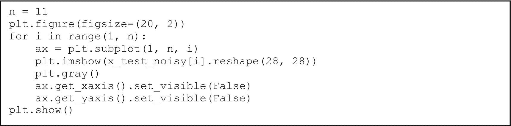

显示图像的代码包括 n = 11，p l t dot figure of fig size = (20, 2)，for i in range (1, n) colon，a x = p l t dot sub plot (1, n, i)，和 p l t dot i m show left parenthesis x test noisy i dot reshape (28, 28) right parenthesis。

图 6-46a

显示图像的代码

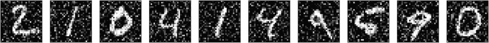

输出包括一系列数字，如 2, 1, 0, 4, 1, 4, 9, 5, 9 和 0，在嘈杂的背景中排列。

图 6-46b

图 6-46a 显示的输出

使用卷积和 MaxPool 层创建 CNN 模型。图 6-47 显示了创建神经网络的代码。

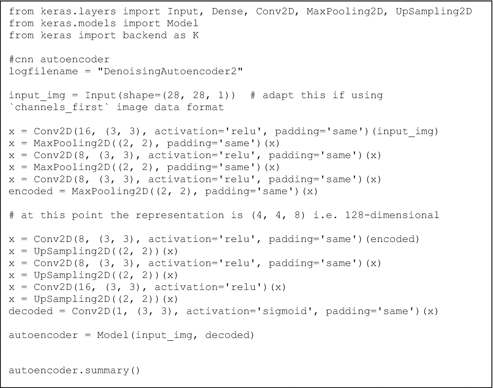

创建神经网络的代码包括日志文件名 = denoising autoencoder 2，输入 i m g = 形状为 (28, 28, 1) 的输入，以及自动编码器 = 输入下划线 i m g，解码。

图 6-47

创建神经网络的代码

使用 RMSprop 作为优化器并使用均方误差进行损失计算来编译模型。RMSprop 优化器类似于具有动量的梯度下降算法。图 6-48 显示了编译模型的代码。

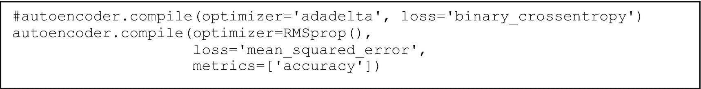

编译模型的代码包括 autoencoder dot compile of，optimizer = R M S prop left and right parentheses，loss = mean squared error，metrics = left square bracket，accuracy in quotes，right square bracket。

图 6-48

编译模型的代码

现在，我们可以开始使用训练数据集训练模型，并使用测试数据集在每一步验证模型。我们选择了 32 作为批量大小和 20 个周期。如您所见，训练过程在每个周期输出损失、准确率以及验证损失和验证准确率。下面（图 6-49）显示的是开始训练模型的代码。

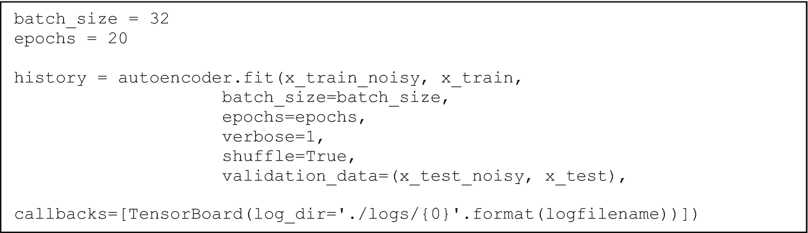

开始训练模型的代码包括批量大小 = 32，周期 = 20，和 history = autoencoder dot fit of x train noisy，x train，批量大小 = 批量大小，周期 = 周期，verbose = 1，shuffle = True，验证数据 = x test noisy，x test，以及回调语句。

图 6-49

开始训练模型的代码

现在训练过程已经完成，让我们评估模型的损失和准确率，如图 6-50 所示。

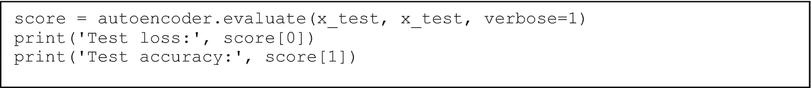

代码读取 score = autoencoder dot evaluate of, x test, x test, verbose = 1。接下来的行包括 print Test loss colon in quotes, score at index 0, 和 print Test accuracy colon in quotes, score at index 1)。

图 6-50

评估模型的代码

输出应该看起来像这样，具有相当好的准确率 0.81，表明大多数像素能够被重建：

```py
313/313 [==============================] - 1s 4ms/step - loss: 0.0115 - accuracy: 0.8123
Test loss: 0.011469859629869461
Test accuracy: 0.8122942447662354
```

下一步是使用模型生成测试子集的输出图像。这将显示重建阶段进行得如何。图 6-51a 展示了显示去噪图像的代码。

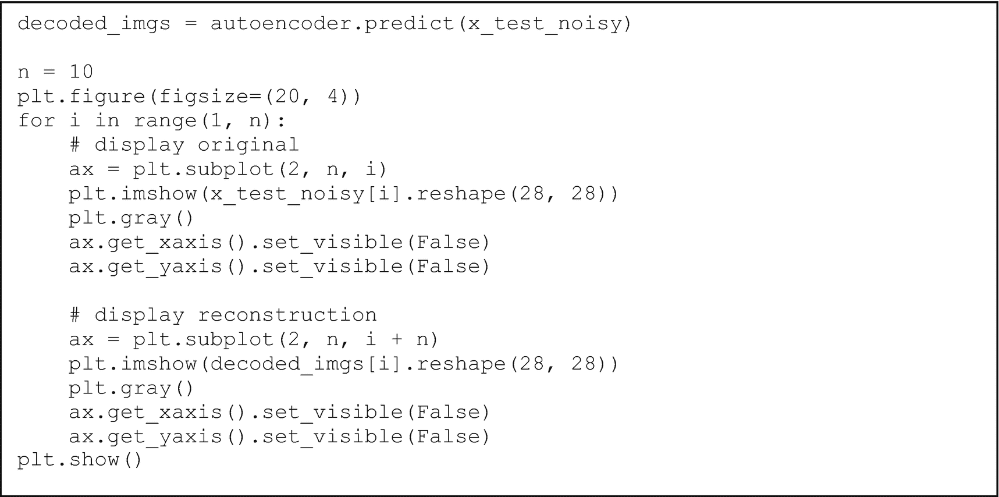

代码包括 decoded underscore i m g s = autoencoder dot predict of, x test noisy, n = 10, p l t dot figure of fig size = (20, 4), for i in range of 1, n, to display original and reconstruction, and p l t dot show left and right parentheses。

图 6-51a

显示去噪图像的代码

去噪后的图像显示在图 6-51b 中。

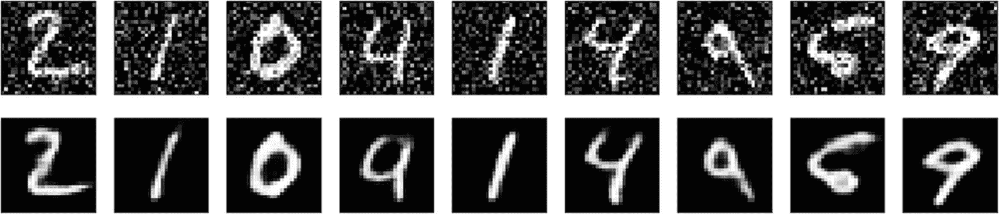

两行包含原始图像和重建图像。数字包括 2, 1, 0, 4, 1, 4, 9, 6, 和 9。

图 6-51b

显示的去噪图像

通过显示该阶段的测试子集图像，我们还可以看到编码器阶段是如何工作的。图 6-52a 展示了显示编码图像的代码。

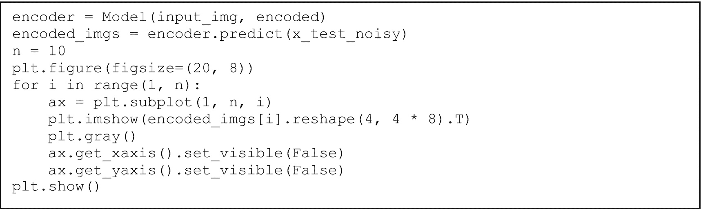

代码读取 encoder = model of, input i m g, encoded, encoded i m g s = encoder dot predict of, x test noisy, n = 10, p l t dot figure of fig size = (20, 8), and for i in range (1, n), statements to display encoded images。

图 6-52a

显示编码图像的代码

编码图像显示在图 6-52b 中。

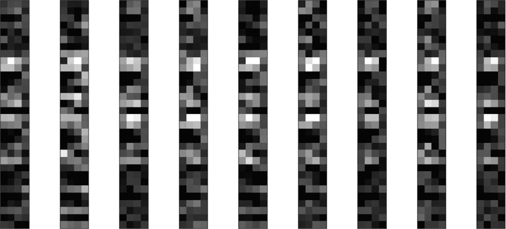

九个不同强度的垂直像素化条。

图 6-52b

可视化编码图像

图 6-53 展示了 TensorBoard 可视化的模型图。

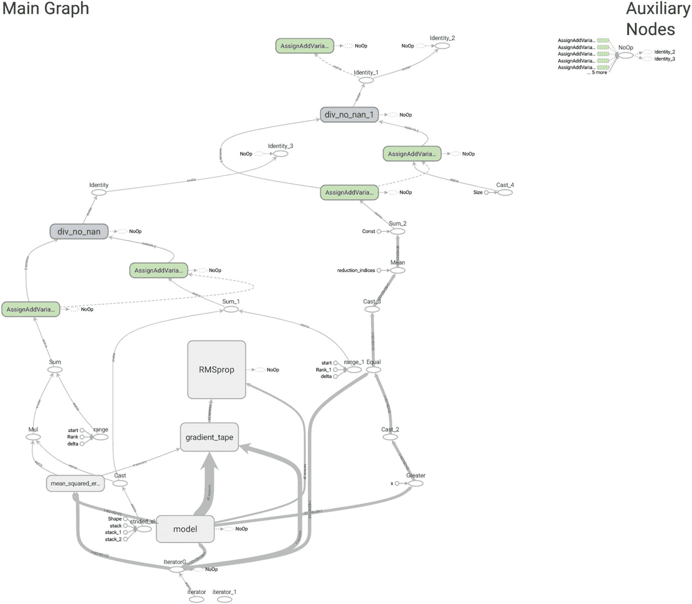

一个主要图网络，包含如 include div no nan, div underscore no nan 1, identity 1, identity 2, identity 3, cast 2, cast 3, cast 4, greater, sum 1, sum 2, R M S prop, gradient tape, 和 mean squared error 等节点，通过不同粗细的箭头与模型连接。

图 6-53

TensorBoard 中显示的模型图

图 6-54 展示了通过训练过程中的各个训练周期来绘制准确率。

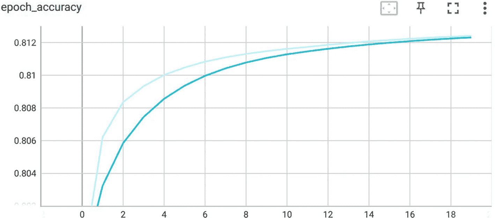

训练准确率与迭代次数的图表。两条曲线以向下凹的趋势增加，最初具有陡峭的斜率，然后变为平缓的斜率。粗糙曲线从 (0.5, 0.802) 开始，到 (18, 0.8122) 结束。平滑曲线从 (0.9, 0.802) 开始，到 (18, 0.8122) 结束。数值为估计值。

图 6-54

TensorBoard 中显示的准确率绘图

图 6-55 展示了通过训练迭代次数绘制的训练过程中的损失图。

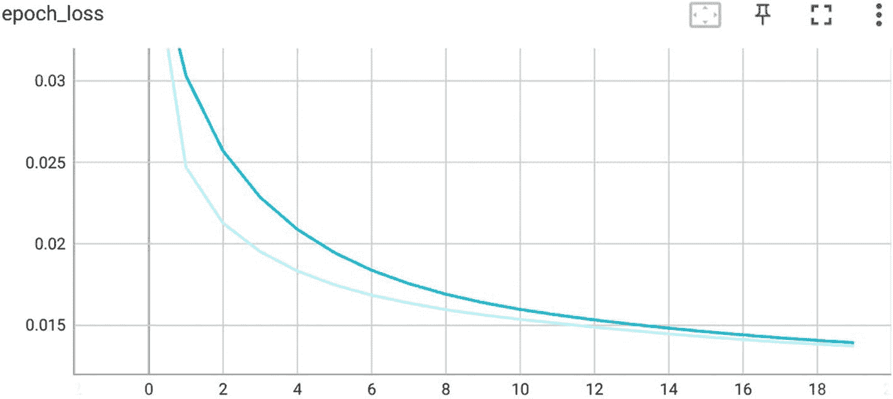

训练损失与迭代次数的图表。两条曲线呈现向上凹的下降趋势。粗糙曲线从 (0.5, 0.03) 开始，到 (18, 0.014) 结束。平滑曲线从 (1, 0.03) 开始，到 (18, 0.014) 结束。数值为近似值。

图 6-55

TensorBoard 中显示的损失绘图

图 6-56 展示了通过训练迭代次数绘制的训练过程中的验证准确率图。

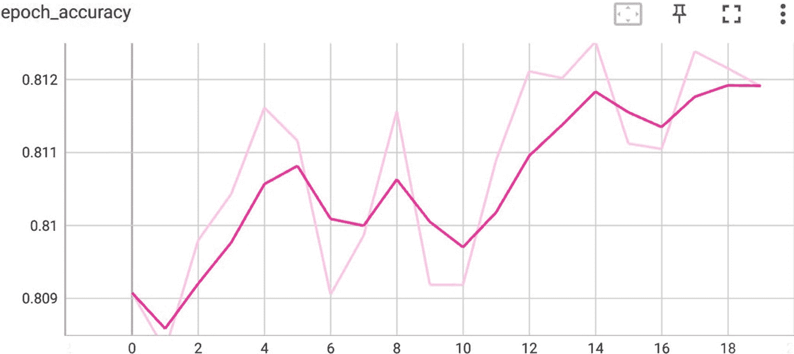

验证准确率的图表。它绘制了两条趋势呈上升趋势且带有波动的曲线。两条曲线均从 (0, 0.809) 开始，到 (18.5, 0.8119) 结束。数值为近似值。

图 6-56

TensorBoard 中显示的验证准确率绘图

图 6-57 展示了通过训练迭代次数绘制的训练过程中的验证损失图。

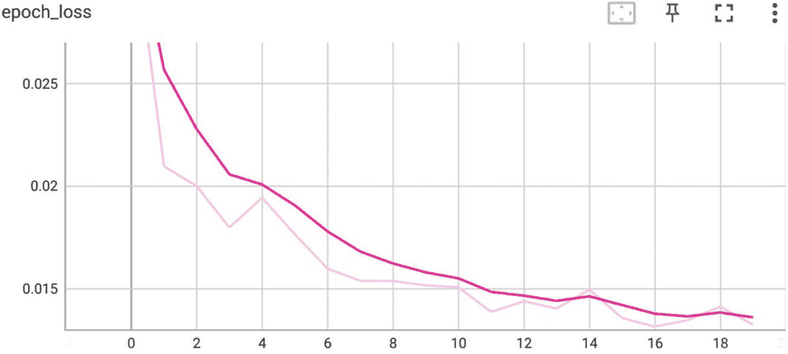

验证损失的图表。它绘制了两条趋势呈下降模式且带有波动的曲线。曲线 1 通过 (0.8, 0.025) 和 (10, 0.015)。曲线 2 通过 (1.2, 0.025) 和 (4, 0.02)。数值为近似值。

图 6-57

TensorBoard 中显示的验证损失绘图

## 变分自编码器

变分自编码器是一种添加了对学习到的编码表示的约束的自编码器。更确切地说，它是一种学习其输入数据的潜在变量模型的自动编码器。因此，您不是让您的神经网络学习任意函数，而是学习建模您数据的概率分布的参数。如果您从这个分布中采样点，您可以生成新的输入数据样本。这就是为什么变分自编码器被认为是生成模型的原因。

实际上，变分自编码器试图确保来自某些已知概率分布的编码可以被解码以产生合理的输出，**即使它们不是实际图像的编码**。

在许多实际应用场景中，我们有一大堆数据要查看（可能是图像、音频或文本……好吧，可能是任何东西），但需要处理的基本数据可能比实际数据维度低。因此，许多机器学习模型涉及某种形式的降维。一个非常流行的技术是奇异值分解或主成分分析。同样，在深度学习领域，变分自动编码器执行降维的任务。

在我们深入探讨变分自动编码器的机制之前，让我们快速回顾一下本章中已经介绍过的正常自动编码器。自动编码器基本上使用一个编码器层和一个解码器层，至少是这样。编码器层将输入数据特征降低到潜在表示，解码器层将潜在表示扩展以生成输出，目标是训练模型以足够好的方式来重现输入作为输出。输入和输出之间的任何差异都可能表明某种异常行为或偏离正常情况，这通常被称为异常检测。从某种意义上说，输入被压缩成一个更小的表示，其维度少于输入，称为 *瓶颈*，然后从瓶颈中重建输入。

相比之下，使用变分自动编码器，我们不是将输入映射到一个固定向量，而是将输入映射到一个分布，因此，与正常顺序中在四分之一中看到的瓶颈向量不同，我们通过观察分布并取样本的潜在向量为实际瓶颈来用均值向量和标准差向量替换。显然，这与正常的自动编码器非常不同，在正常的自动编码器中，输入直接产生潜在向量。

首先，一个编码器网络将输入样本 `x` 转换为潜在空间中的两个参数，我们将它们称为 `z_mean` 和 `z_log_sigma`。然后，编码器网络从假设生成数据的潜在正态分布中随机采样相似点 `z`，通过 `z = z_mean + exp(z_log_sigma) * epsilon`，其中 `epsilon` 是一个随机正态张量。最后，一个解码器网络将这些潜在空间点映射回原始输入数据。图 6-58 描述了变分编码器神经网络。

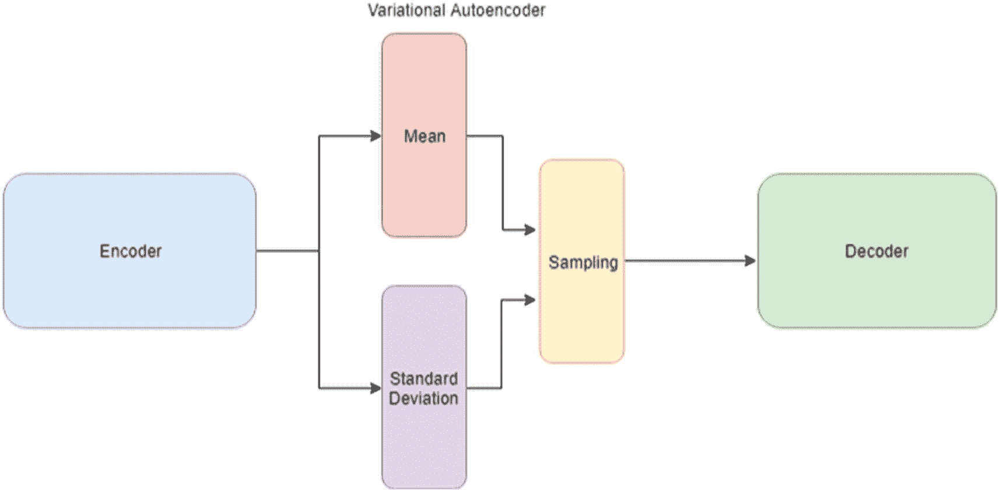

变分编码器神经网络架构包括一个编码器、均值和标准差的变分自动编码器、采样和一个解码器。

图 6-58

变分编码器神经网络的描述

模型的参数通过两个损失函数进行训练：一个重建损失，迫使解码样本与初始输入匹配（就像之前介绍的自动编码器一样），以及学习到的潜在分布与先验分布之间的 KL 散度，作为正则化项。实际上，您可以完全去掉这个后项，尽管它有助于学习良好的潜在空间并减少对训练数据的过拟合。

由这个潜在空间学习到的分布与高斯分布并不太不同。然而，在我们训练变分自编码器之前，我们必须解决采样问题。我们从潜在空间中采样一些向量，并将其传递到解码器。然而，这打破了从输入到输出的数据流，因为采样过程是随机的且不可微，所以我们不能像在常规神经网络中那样直接进行反向传播。

变分自编码器可以说是神经网络和图模型的混合体。关于变分自编码器的第一篇论文试图创建一个图模型，然后将图模型转换为神经网络。变分自编码器基于变分推断。

在变分推断中，假设存在两个不同的概率分布 p(x) 和 q(x)。然后我们可以使用 KL 散度来衡量这两个分布之间的差异。我们还可以将这个相同的概念应用到变分自编码器上。回想一下，采样步骤在执行反向传播时引入了困难。我们将应用所谓的“重新参数化技巧”，即从标准正态分布中采样，这是一个可微的采样过程，并使用学习到的潜在变量对其进行缩放。利用这一点，我们可以计算 KL 损失并进行反向传播。背后的数学可能非常复杂，但这是绕过采样可能引入的问题的一种方法。

理解变分自编码器需求的最佳方式是，在一般的自动编码器中，编码/瓶颈过于依赖输入，而没有强调理解数据的本质。变分自编码器是拟合某些潜在变量的分布，试图捕捉输入数据的结构以及任何不确定性。这也使得 VAEs 在生成新数据方面可能很有用，因为它们试图模拟数据的分布。

对于代码，您可以在 GitHub 上找到笔记本[`github.com/apress/beginning-anomaly-detection-python-deep-learning-2e/blob/master/Chapter%206%20Autoencoders/chapter6_variationalautoencoder.ipynb`](https://github.com/apress/beginning-anomaly-detection-python-deep-learning-2e/blob/master/Chapter%206%20Autoencoders/chapter6_variationalautoencoder.ipynb)。

图 6-59 显示了导入所有必要包的基本代码。同时请注意我们使用的各种包的版本。

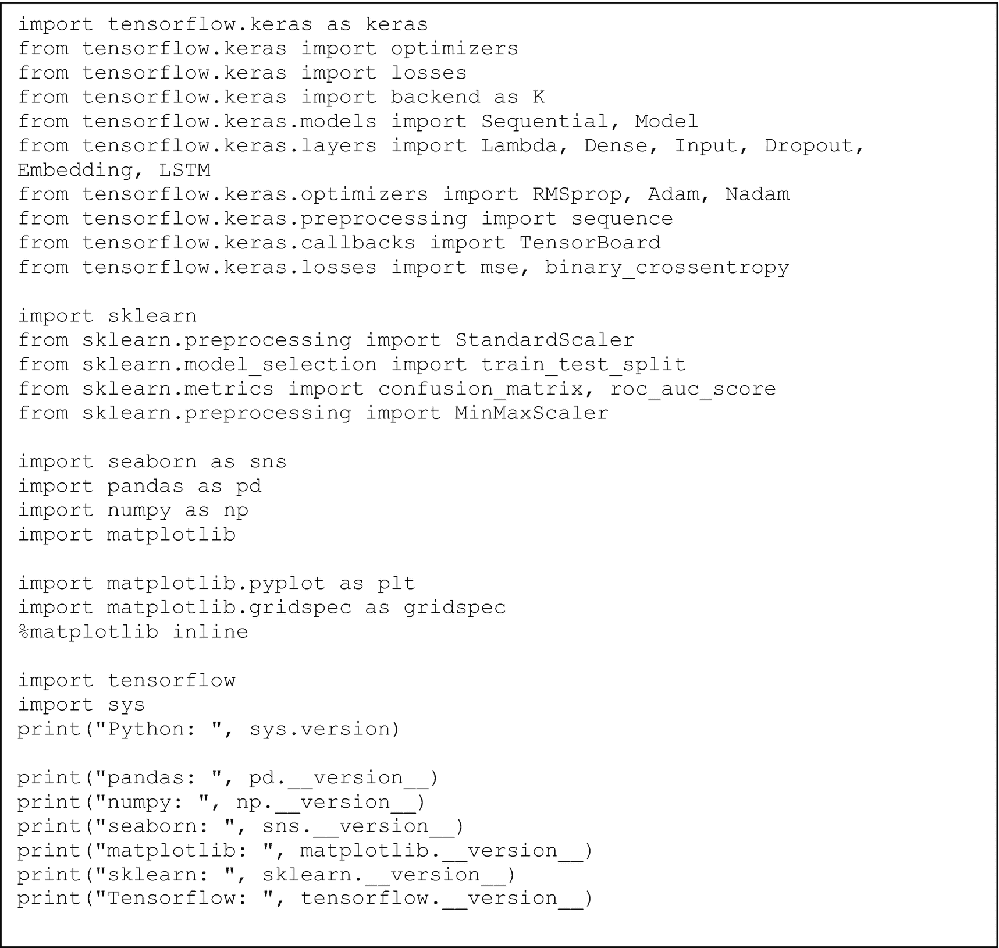

导入所有必要包的代码包括 `import tensorflow.dot.keras as keras`, `import sklearn`, `import seaborn as sns`, `import pandas as pd`, `import numpy as np`, `import matplotlib`, `import matplotlib.dot.pyplot as plt`, 和 `import matplotlib.dot.gridspec as gridspec`.

图 6-59

在 Jupyter Notebook 中导入包

下面是用于在训练过程中通过混淆矩阵、异常图表和错误图表（预测值与真实值之间的差异）可视化结果的代码。下面（图 6-60）是可视化结果的代码。

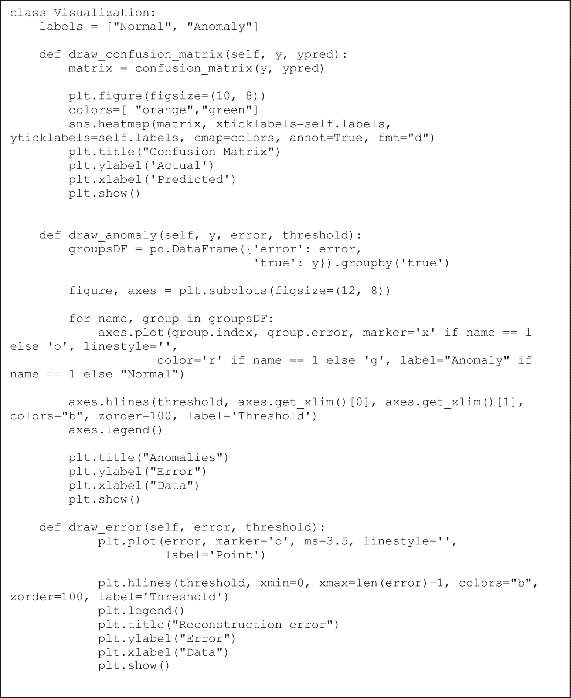

可视化类的代码，定义了绘制混淆矩阵、绘制异常和绘制错误的函数，用于绘制热图、图表、图例、标题、y 轴标签和 x 轴标签。

图 6-60

可视化结果的代码

我们将使用信用卡数据的例子来检测交易是否为正常/预期或异常/异常。图 6-61 显示数据被加载到一个 Pandas 数据帧中。

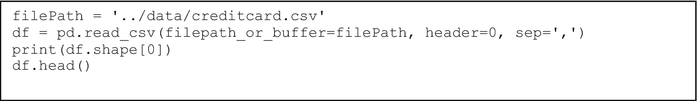

读取包含信用卡数据的文件路径的代码，包括 `df = pd.read_csv(file_path_underscore_or_underscore_buffer = file_path, header = 0, sep = comma in single quotes, print(df.shape[0]), and df.head(left and right parentheses)`.

图 6-61

使用 pandas 加载数据集的代码

我们将收集 20,000 个正常记录和 400 个异常记录。你可以选择不同的比例，但通常使用比异常数据更多的正常数据示例更好，因为你想教会你的自动编码器正常数据看起来是什么样子。训练数据中异常数据过多将训练自动编码器学习异常实际上是正常的，这与我们的目标相悖。图 6-62 显示了获取大多数正常数据记录和较少异常记录的代码。

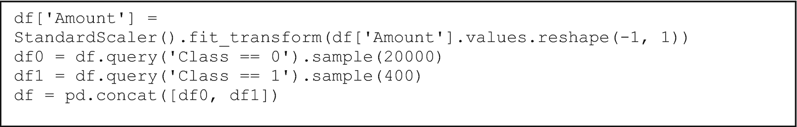

使用标准缩放方法对数据帧中的金额列进行标准化的代码。包括 `df0 = df.query("class == 0").sample(20000), df1 = df.query("class == 1").sample(400), and df = pd.concat([df0, df1])`.

图 6-62

获取大多数正常数据记录和较少异常记录的代码

将数据帧拆分为训练数据和测试数据（80-20 分割），如图 6-63 所示。

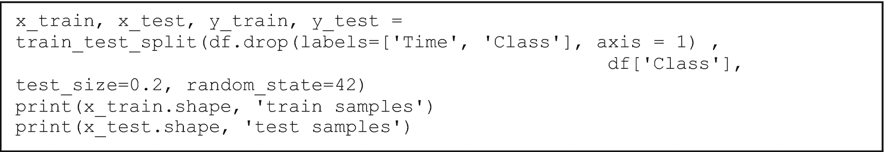

根据时间标签和类别标签将数据帧拆分为训练数据和测试数据的代码，设置测试大小为 0.2，随机状态为 42，并打印 x_train 和 x_test 的形状。

图 6-63

将数据拆分为训练集和测试集的代码

标准自编码器和变分自编码器之间最大的区别在于，这里我们不仅仅接受输入原样；相反，我们接受输入数据的分布，然后采样分布。图 6-64 展示了实现这种采样策略的代码。

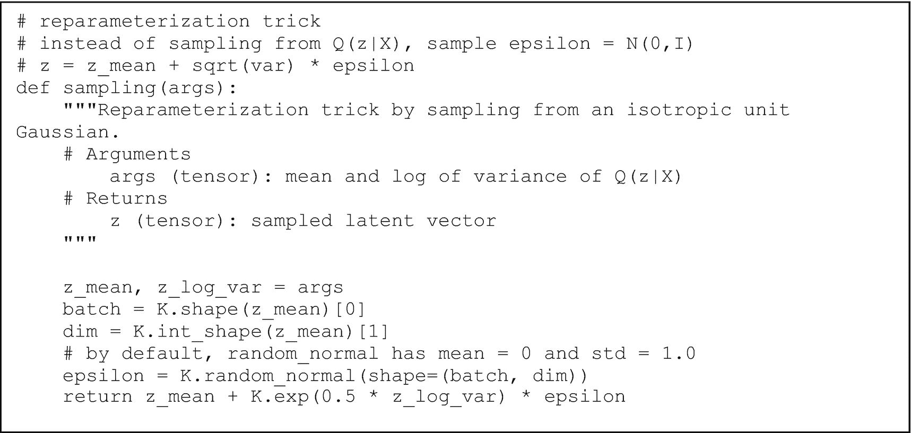

样本分布的代码包括重新参数化技巧，通过从各向同性单位高斯分布中采样进行重新参数化，参数包括，返回值，张量的 z 为采样潜在向量，默认情况下随机正态分布具有均值 = 0 和 s t d = 1.0。

图 6-64

采样分布的代码

现在是时候创建一个简单的神经网络模型，具有编码器阶段和解码器阶段了。我们将使用编码器将输入信用卡数据集的 29 列编码为 12 个特征。编码器使用特殊的分布采样逻辑生成两个并行层，然后将采样输出（图 6-64）作为 Layer 对象包装。

解码器阶段使用这个潜在向量重构输入。在这个过程中，它还测量重构误差以最小化它。图 6-65 展示了创建神经网络的代码。

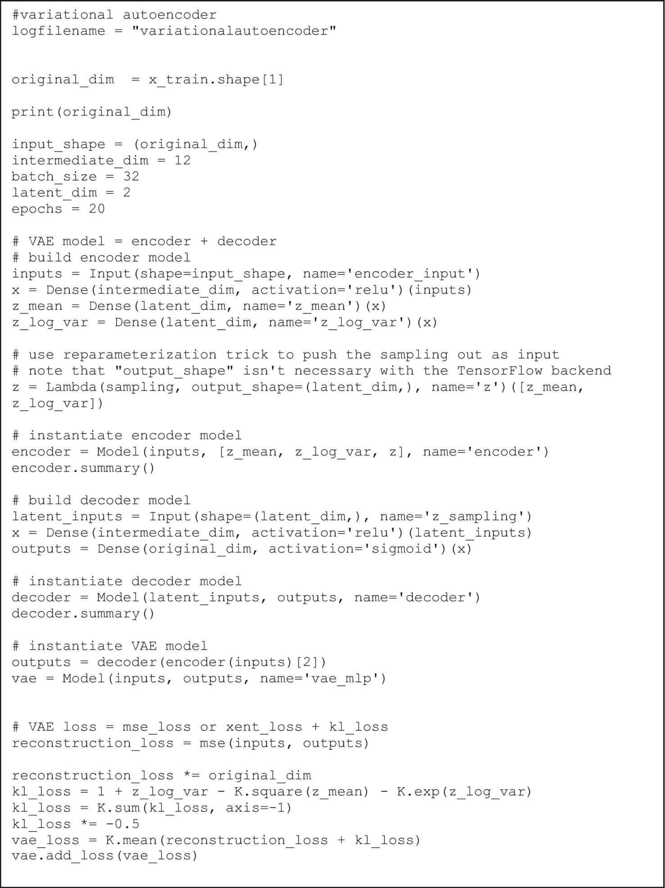

代码包括日志文件名 = variational autoencoder，V A E 模型 = encoder + decoder，构建编码器模型，使用重新参数化技巧将采样输出作为输入，实例化编码器模型，构建和实例化解码器模型，实例化 V A E 模型，并计算 V A E 损失。

图 6-65

创建神经网络的代码

图 6-66 展示了由图 6-65 显示的编码器和解码器架构。

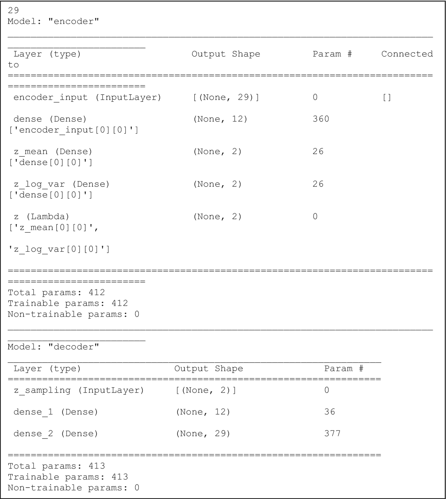

两个表格，一个用于编码器模型，包含 5 行，列有层类型、输出形状、参数哈希和连接；另一个用于解码器模型，包含 3 行。在编码器中，总参数为 412，可训练参数为 412，不可训练参数为 0；在解码器中分别为 413、413 和 0。

图 6-66

显示神经网络的代码

使用 Adam 作为优化器，均方误差作为损失计算来编译模型。如第五章所述，Adam 是一种优化算法，可以用作经典随机梯度下降过程的替代，基于训练数据迭代地更新网络权重。图 6-67 展示了编译模型的代码。

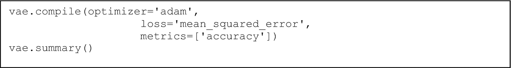

一段代码读取 v a e dot compile left parenthesis optimizer = adam in single quotes, loss = mean squared error in single quotes, metrics = left square bracket, accuracy in quotes, right square bracket, and v a e dot summary left and right parentheses。

图 6-67

编译模型的代码

现在，我们可以开始使用训练数据集来训练模型，并使用测试数据集在每一步验证模型。我们选择了 32 作为批量大小和 20 个周期。正如你所见，训练过程在每个周期输出损失、准确率以及验证损失和验证准确率。下面（图 6-68）展示了训练模型的代码。

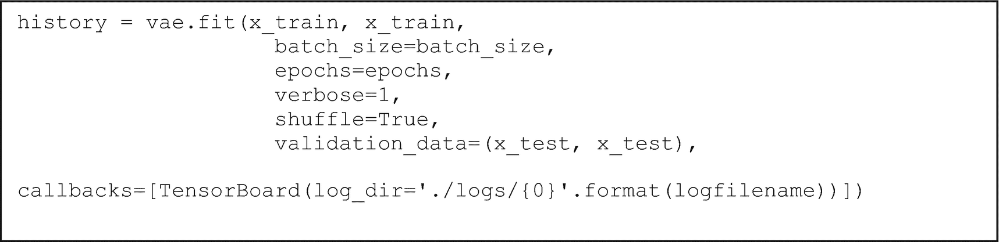

训练模型的代码包括 history = v a e dot fit (x train, x train, batch size = batch size, epochs = epochs, verbose = 1, shuffle = True, and validation data = (x test, x test)，以及一个回调语句。

图 6-68

训练模型的代码

现在训练过程已完成，让我们评估模型的损失和准确率，如图 6-69 所示。

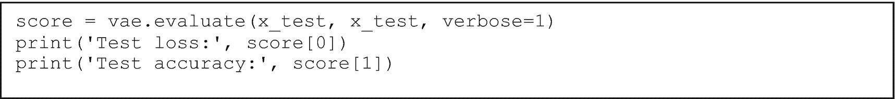

代码读取 score = v a e dot evaluate of, x test, x test, verbose = 1, print Test loss colon in single quotes, score at index 0, and print Test accuracy colon in single quotes, score at 1。

图 6-69

评估模型的代码

你应该看到类似这样的输出，准确率为 0.35：

```py
128/128 [==============================] - 0s 3ms/step - loss: 46.3963 - accuracy: 0.3449
Test loss: 46.39627456665039
Test accuracy: 0.3448529541492462
```

下一步是计算误差、检测异常，然后绘制异常和误差。图 6-70 展示了基于 10.00 阈值值预测异常的代码。

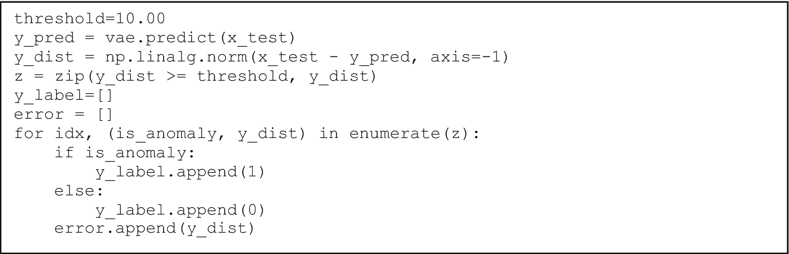

代码读取 threshold = 10, y pred = v a e dot predict of x test, if is anomaly colon, y label dot append of 1, else colon, y label dot append of 0, and error dot append of y dist。

图 6-70

基于阈值预测异常的代码

图 6-71 展示了计算 AUC 分数（0.0 到 1.0）和输出 0.92 的代码，这是一个非常高的分数。

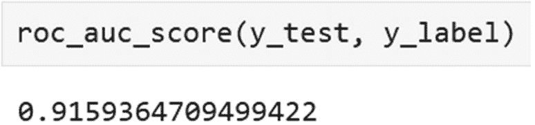

2 行代码。第 1 行读取，r o c underscore a u c underscore score left parenthesis y underscore test comma y underscore label right parenthesis。第 2 行读取，0.9159364709499422。

图 6-71

计算 AUC 的代码

我们现在可以可视化混淆矩阵，以查看模型的表现如何，如图 6-72 所示。

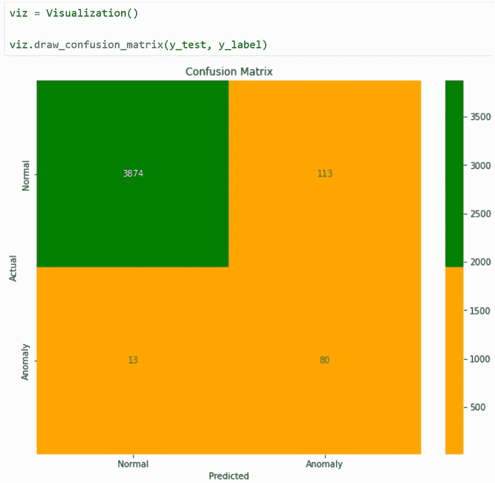

实际与预测的混淆矩阵，使用颜色代码表示 2 行和 2 列。列和行标题是正常和异常。第 1 行条目是 3874 和 113。第 2 行条目是 13 和 80。矩阵附近提供了一个颜色图。矩阵上方打印了一个代码。

图 6-72

混淆矩阵

现在，使用标签（正常或异常）的预测，我们可以绘制异常与正常数据点的对比。图 6-73 显示了与阈值相关的异常。

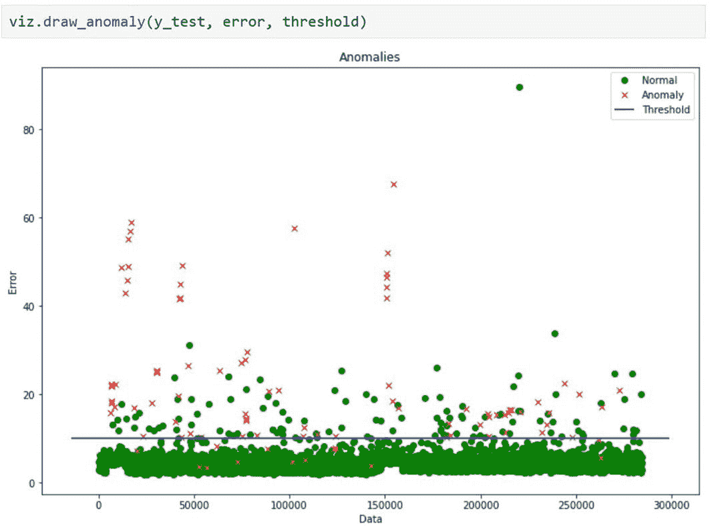

错误与数据对比的散点图。正常点聚集在约 10 的水平阈值下方，一些异常点位于上方。散点图上方的代码为，viz dot draw underscore anomaly left parenthesis y test, error, threshold right parenthesis。

图 6-73

与阈值相关的异常

图 6-74 展示了通过 TensorBoard 可视化的模型图表。

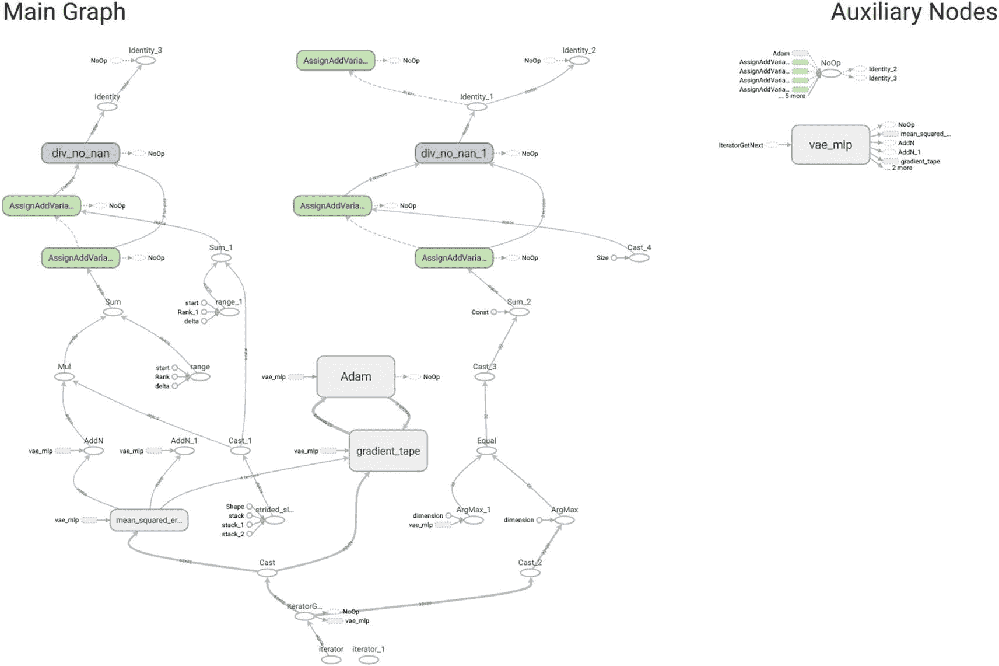

包含节点和链接的主图网络以及辅助节点。主图中的节点包括 div no nan, div no nan 1, identity 1, identity 2, identity 3, assign add variance, cast 3, cast 4, Adam, gradient tape, model, 和 mean squared error。

图 6-74

TensorBoard 中显示的模型图

图 6-75 展示了通过 TensorBoard 特殊可视化的 vae_mlp 模型的图表（双击 vae_mlp 节点）。

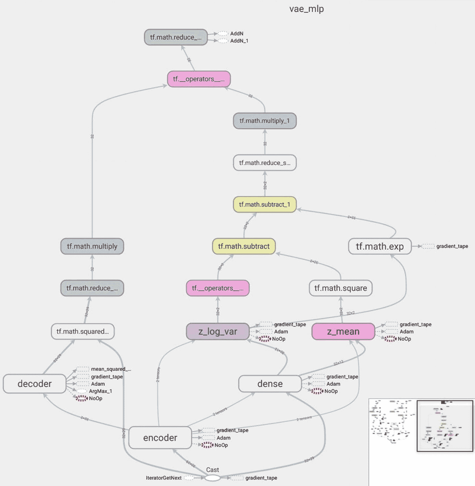

包含节点和链接的模型图包括 t f dot math reduce underscore, Add N, Add N 1, t f dot operators underscore, t f dot math dot multiply 1, t f dot math dot reduce S, decoder, dense, encoder, gradient tape, Adam, cast, 和 iterator Get Next。

图 6-75

TensorBoard 中显示的模型图

图 6-76 展示了通过训练过程中的训练轮次绘制的准确率绘图。

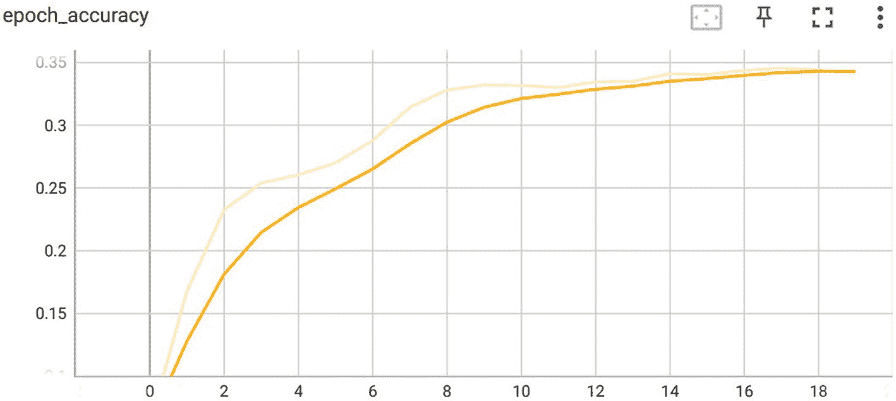

准确率与训练轮次对比的图表。绘制了两条呈上升趋势的曲线。其中一条曲线平滑，另一条曲线粗糙。粗糙曲线从 (0.3, 0.10) 开始，到 (18, 0.349) 结束。平滑曲线从 (0.5, 0.10) 开始，到 (18, 0.349) 结束。数值为估算值。

图 6-76

TensorBoard 中显示的准确率绘图

图 6-77 展示了通过训练过程中的训练轮次绘制的损失绘图。

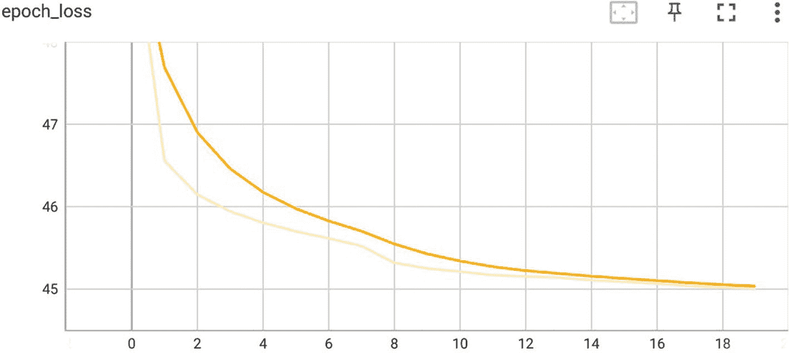

训练损失与训练轮次对比的图表。绘制了两条呈下降趋势的曲线。其中一条曲线平滑，另一条曲线粗糙。粗糙曲线从 (0.5, 48) 开始，到 (18, 45) 结束。平滑曲线从 (0.9, 48) 开始，到 (18, 45) 结束。数值为近似值。

图 6-77

TensorBoard 中显示的损失绘图

图 6-78 展示了通过训练过程中的训练轮次绘制的验证准确率绘图。

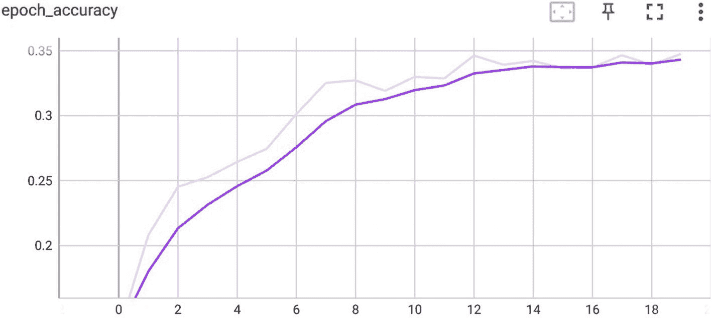

验证准确率的图表。绘制了两条呈上升趋势的曲线。其中一条曲线平滑，另一条曲线粗糙。粗糙曲线从 (0.3, 0.15) 开始，到 (18, 0.345) 结束。平滑曲线从 (0.5, 0.15) 开始，到 (18, 0.345) 结束。数值为近似值。

图 6-78

TensorBoard 中显示的验证准确率绘图

图 6-79 展示了通过训练过程中的训练轮次绘制的验证损失绘图。

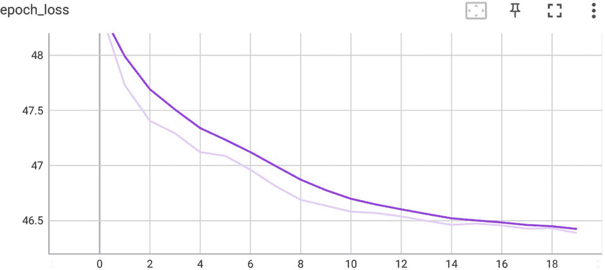

验证损失与时代对比图。绘制了两条呈下降趋势的曲线。其中一条曲线平滑，另一条曲线粗糙。粗糙曲线从(0.8, 48)开始，到(18, 46.45)结束。平滑曲线从(1, 48)开始，到(18, 46.45)结束。数值为近似值。

图 6-79

TensorBoard 中显示的验证损失绘图

## 摘要

在本章中，我们讨论了各种类型的自编码器以及它们如何被用来构建异常检测引擎。我们研究了实现一个简单的自编码器、一个稀疏自编码器、一个深度自编码器、一个卷积自编码器和去噪自编码器。我们还探讨了变分自编码器作为检测异常的手段。

在第七章中，我们将探讨另一种异常检测方法，即使用生成对抗网络。
