# 7. 生成对抗网络

在本章中，你将了解生成对抗网络以及如何使用它们来实现异常检测。

简而言之，本章涵盖了以下内容：

+   什么是生成对抗网络？

+   使用生成对抗网络进行异常检测

注意

代码示例以 Python 3.8 版本提供。本书的代码仓库可在[`https://github.com/apress/beginning-anomaly-detection-python-deep-learning-2e/tree/master`](https://github.com/apress/beginning-anomaly-detection-python-deep-learning-2e/tree/master)找到。

仓库还包括一个 requirements.txt 文件，用于检查你的包及其版本。

本章的笔记本可在[`https://github.com/apress/beginning-anomaly-detection-python-deep-learning-2e/blob/master/Chapter%207%20Generative%20Adversarial%20Networks/chapter7_gan.ipynb`](https://github.com/apress/beginning-anomaly-detection-python-deep-learning-2e/blob/master/Chapter%207%20Generative%20Adversarial%20Networks/chapter7_gan.ipynb)找到。

导航到“第七章 生成对抗网络”并点击笔记本。代码也以.py 文件的形式提供，尽管它是笔记本的导出版本。

我们将使用 JupyterLab 来展示所有的代码示例。

## 什么是生成对抗网络？

生成对抗网络（GAN）是一类神经网络，其中两个模型，一个**生成器**和一个**判别器**，是协同训练的。在典型的 GAN 设置中，**生成器**的作用是生成与某些真实数据集相似的数据点。然后，它将这些生成数据点传递给**判别器**，其任务是将这些生成点分类为真实或虚假。

对于生成器来说，理想的目标是生成数据，使得判别器预测这些数据都是真实的。那么，对于判别器来说，理想的目标就是预测生成数据都是虚假的。为了教会判别器什么是真实数据，判别器在整个训练过程中也会展示真实数据。因此，生成器和判别器陷入了一场对抗性的猫捉老鼠游戏，两个模型都在不断地尝试改进并击败对方。

这是一个简单的概念，却非常强大。GAN 能够创建图像、语音和艺术等领域的逼真示例。实际上，它们在这些任务上已经非常出色，以至于 GAN 最近成为了争议的焦点，因为它们能够创建出令人信服地描绘真实人物的图像、视频和声音。你可以想象，如果恶意实体滥用这项技术，其潜在的危险性是何等之大。

话虽如此，GANs 有很多好的用途：

+   **AI 生成的艺术**：用户可以通过输入提示将任何类型的概念变为现实。结果是高质量的艺术作品，只需几秒钟就能创建。然而，一些模型最近因训练数据来源的问题而成为争议的焦点。例如，一些版本的这些模型使用了艺术家在线上上传但未经许可用于训练的数据。在某些情况下，模型被专门训练来复制特定艺术家的风格，而没有原始艺术家的知情或许可。

    由 GAN 生成的艺术是它自己的创作，还是抄袭？这些问题很棘手，政策尚未解决。在模型被训练来复制特定艺术家的风格的情况下，将其标记为抄袭很容易。但如果模型是在多种风格下训练的，并且输出了一些类似于多人艺术风格组合的东西，那这是直接抄袭吗？由 GAN 生成的艺术是它自己的、新颖的创作吗？神经网络被训练来泛化其训练数据，而不是复制粘贴，它们的学习方式与人类创作特定风格的艺术相似。因此，在这种情况下，这是对人类艺术家作品的抄袭吗？

+   **照片修改**：与 AI 生成的艺术类似，GANs 可以用来从照片中移除物体、修复损坏的照片、用其他东西填充区域等等。

+   **配音**：在电影中，演员可以用自己的母语配音，看起来就像他们实际上在用嘴唇说出这些话，极大地增强了观众的沉浸感。不同的 GAN 模型可以用来再生包含演员嘴巴部分的帧以及生成母语中的声音。

+   **超分辨率**：这就像间谍电影中古老的“增强”情节复活了。现在 AI 可以以逼真的方式提升图像并填充细节。这对于医学影像、监控或卫星来说很有用，也可以将旧媒体提升到 4K 质量。

+   **药物发现**：GANs 可以生成新的分子结构以发现新药。

这个列表并不全面；GANs 可以做更多的事情。几乎任何人类可以做的生成任务都可以由 GAN 完成。歌曲创作、诗歌、艺术和其他创造性活动长期以来一直被认为是人类独有的领域，计算机无法进入。然而，我们在能够正确自动化家务机器人之前，就已经能够通过 AI 自动化这些任务。

结果表明，生成对抗网络（GANs）在异常检测方面也很擅长。训练生成对抗网络的过程教会了生成器和判别器正常数据的分布是什么样的。异常数据位于这个分布之外，这使得我们可以直接从正常数据中定位到异常数据。

更具体地说，我们可以使用 GAN 设置让生成器创建属于正常数据分布的逼真样本。那么，判别器的任务就是识别这些点是否真实。一旦生成器和判别器都得到了适当的训练，判别器就可以用来识别异常，因为它会将它们分类为“假”。

使用 GAN 进行异常检测有以下优点：

+   **灵活性**：生成器和判别器的确切架构是完全抽象的。你可以有一个 LSTM、自动编码器、转换器、卷积神经网络，或者任何其他类型的模型作为生成器，也可以作为判别器。

    此外，GANs 可以应用于任何数据类型，包括时间序列数据、地理空间数据、图像数据、文本数据等等。

+   **生成建模**：生成器创建符合正常数据分布的新数据点。当你想要合成额外的数据样本用于其他训练任务，或者更好地理解原始数据的潜在分布时，这可能很有用。

    +   这也意味着，通过适当的设置，你可以控制你想要生成的样本类型。在图像生成领域，一个例子就是控制生成人物的颜色、肤色、发型等。

    在异常检测的任务中，你可以训练 GAN 生成特定类型的异常，这些异常是现有的异常检测器难以检测的。然后，你可以使用这个新合成的异常数据集来补充你的训练集，并提高你的异常检测器对特定类型异常的性能。

+   **无监督学习**：生成器可以在完全无监督的方式下进行训练，无需使用任何标签。判别器只需要看到数据本身，并被告知它是真实的——实际上并没有进行任何标签化操作。

相反，GANs 也有一些严重的缺点：

+   **训练敏感性**：GANs 以其难以训练而闻名，因为训练完全是平衡行为。你不想让判别器不断压倒生成器，也不想让生成器压倒判别器并开始产生垃圾。这是一个对抗性竞争，而不是一边倒的打击，但这可能很难实现。

    平衡 GAN 可能需要调整多个超参数，重新定义生成器和判别器的架构以及参数数量等等。

+   **模式坍塌**：这是指生成器只产生有限的输出，这些输出仍然能欺骗判别器，但无法正确地表示原始数据分布。

+   **计算能力**：当你训练一个 GAN 时，你实际上是在同时训练两个或更多模型。这可能比涉及一个模型的典型训练设置需要更多的内存和处理能力。

+   **数据饥渴**：正确且精确地建模数据分布需要向 GAN 提供大量的真实数据样本。

+   **长训练**：由于 GAN 非常敏感，它们通常使用比通常更低的训练速率进行训练。这意味着收敛可能需要许多迭代。使用更高的学习率加快这个过程可能导致不稳定、振荡和训练设置的崩溃。

尽管使用 GAN 可能存在一些缺点，但它们仍然是一类值得探索的模型，用于异常检测。但在我们开始之前，我们需要查看 GAN 的架构是什么样的。

### 生成对抗网络架构

图 7-1 展示了 GAN 的架构。

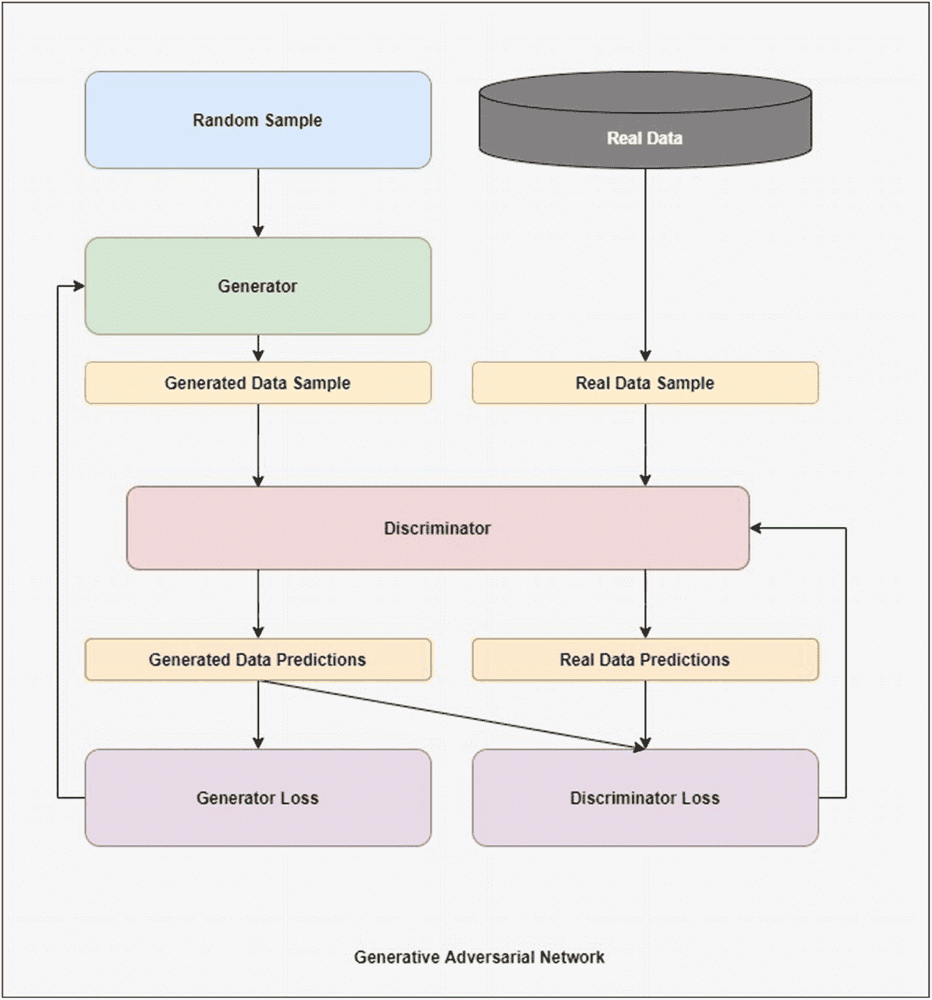

生成对抗网络的流程图定义了随机样本如何经过生成器。生成的样本和真实数据样本被输入到判别器中，判别器给出生成器和判别器的损失。

图 7-1

生成对抗网络的高级架构

生成器从一个称为**潜在空间**的空间中抽取一个随机样本。这可能是一组来自正态分布或均匀分布的随机数字，具体取决于其设置。使用这个样本，生成器产生输出，理想情况下应该看起来像我们的真实数据。然后，这个输出由判别器评估，以确定它是真实的还是合成的。

判别器也会看到一个真实数据的样本，它必须将其预测为 1（真实）或 0（伪造）。使用这些标签，我们可以计算判别器对合成输出的预测损失，以及对其真实输出的预测损失。

相反，生成器希望判别器对所有合成样本预测 1。因此，在损失函数中，我们取判别器对合成数据的预测，并使用 1 作为真实标签。

记住，优化器试图最小化损失，但在这个情况下，我们有两个相互竞争的损失函数：一个用于生成器的损失，一个用于判别器的损失，两者在合成输出的真实标签应该是什么方面存在分歧。

我们可以使用的一个简单损失函数是二元交叉熵，我们可以假设判别器的最后一层使用 sigmoid 作为激活函数。

然而，存在上述 GAN 设置的问题，如**模式坍塌**和**训练不稳定/发散**。为了解决这些问题并进一步稳定 GAN 的训练，我们将引入所谓的**Wasserstein 损失**，将我们的 GAN 设置转换为 WGAN。

### 水平生成对抗网络

水平生成对抗网络（WGAN）是一种使用 Wasserstein 损失作为损失函数的 GAN，同时对训练循环进行了一些其他修改。本质上，WGAN 试图

+   **稳定梯度**：Wasserstein 损失函数允许计算更有意义且更稳定的梯度。在传统的 GAN 设置中，如果训练过程不平衡，梯度可能会消失或爆炸。

+   **缓解模式崩溃**：由于梯度稳定性的提高，生成器可以从判别器那里获得更一致的反馈，从而减少了模式崩溃的可能性，在这种崩溃中，一个或两个一致的输出会持续生成。

+   **强制** **Lipschitz 约束**：Wasserstein 损失函数的结构是这样的，使得判别器是 Lipschitz 连续的，通常通过权重裁剪或添加梯度惩罚来强制执行，以确保在梯度更新后判别器不会过多地调整其权重，从而剧烈改变其行为。这些变化是为了保持判别器以稳定的速率修改其行为，而不是可能压倒生成器。

**Lipschitz 约束**是指批评者（判别器的 WGAN 术语）必须是一个 1-Lipschitz 函数，这实际上对批评者的梯度施加了限制，从而避免了批评者快速变化率，并稳定了训练。

在 WGAN 设置中，判别器被称为**批评者**，因为它不是通过判别和分配真实或假的标签，而是给出样本的真实性或虚假性的分数。而判别器有 sigmoid 作为激活函数，而批评者没有应用激活函数（线性激活）。这是因为，我们想要的不是概率，而是判别器输出一个分数，其符号决定了真实或假的预测，其幅度决定了置信度。

在这个背景设定好之后，让我们来看看这个损失函数是什么样的。

批评者损失的计算如下：

批评损失 = 真实样本的平均分数 - 生成样本的平均分数

生成器损失如下：

生成器损失 = -1 * 生成样本的平均分数

这里的真实标签是 1，而假标签是-1。就这些损失函数定义背后的直觉而言，优化器的任务是再次最小化损失。对于生成器来说，优化器希望使该值尽可能负，因此生成样本的分数必须是大的、正的输出，因为负号会使它们成为大振幅的负输出。

优化器还希望最小化批评者损失。在这里，生成样本的分数也被激励产生大振幅的正输出，因为减法会使其变为负，就像在生成器损失中一样。判别器唯一能改进并进一步最小化这个损失的方法是产生真实样本的负分数，从而为批评者损失产生两个负项，最小化它。

因此，通过激励生成样本的分数为负且幅度大，生成器损失定义与评论家损失协同工作，引导判别器最优地学习如何区分真实和假输出。如果分数为负，模型预测数据是真实的。如果分数为正，模型预测数据是假的。

WGAN 论文^(1) 还建议比生成器更频繁地训练评论家，但在我们的设置中，这是一个更直接的基于 Wasserstein 损失和梯度惩罚原则的基 GAN 的扩展，我们没有包含这一点。

在 WGAN 中执行另一个步骤是权重裁剪。判别器的权重可以在参数 **clip_value** 的某个 +– 范围内裁剪。然而，我们实现了 **梯度惩罚 (GP)** 方法，使我们的实现成为 **WGAN-GP** 的一个例子。

### WGAN-GP

梯度惩罚方法是强制执行 Lipschitz 约束并稳定训练的一种方式。以下是它是如何工作的：

1.  计算一对随机真实 (x[real]) 和假 (x[fake]) 数据之间的随机插值：

    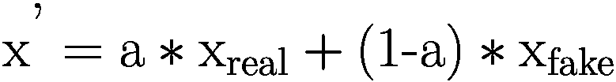

    其中，a 是在范围 [0, 1] 内均匀采样的某个值。

1.  使用插值样本作为输入，计算评论家分数的梯度。

1.  计算梯度的 2 范数，减去 1，然后平方差：

    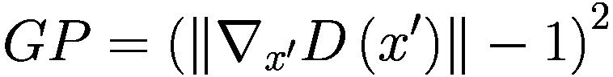

    在这里，x’ 是真实和假数据之间的插值，D 是判别器/评论家。因此，D(x’), 是判别器使用 x’ 作为输入数据时的输出。

1.  将惩罚应用于评论家损失，如下所示：

    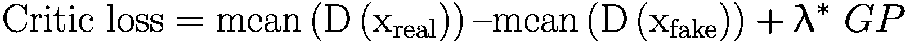

其中 GP 如上定义，λ 是一个超参数（通常设置为 10）。

通过这种方式，我们可以稳定学习并强制执行 1-Lipschitz 约束。现在我们已经定义了一些理论和概念，让我们开始实现 WGAN-GP 以执行异常检测。

### 使用 GAN 进行异常检测

我们将应用 GAN 到 KDDCUP 1999 数据集以执行**半监督异常检测**。尽管 GAN 可以是完全无监督的，但我们的将是半监督的，因为我们想教会生成器生成严格正常的数据，并让判别器/评论家预测真实或伪造的数据。想法是判别器能够将异常识别为伪造的，并将真实正常点分类为真实。由于我们的实现基于 WGAN-GP，我们将指定一个评分为正数的异常，评分为负数的数据点为真实数据点。

这个任务属于半监督学习，因为在训练已知为正常标签的数据时，我们仍然需要异常标签来执行最终的评估。通过让判别器在前一种情况下接收标签反馈，可以将此任务修改为监督学习或无监督学习。在后一种情况下，我们将所有数据一起传递，假设异常数据与正常数据看起来不同，并且它们很少见。如果是这种情况，生成器可能会学会仅对正常数据进行建模，因为判别器更容易将异常识别为伪造的，因为它与正常数据明显不同，无论我们是否将此异常标记为真实。

生成器让最小化损失的最简单路径就是只产生正常数据。然而，由于没有保证，生成器仍然可能学会产生看起来真实的异常数据，而判别器可能会学会这些数据是真实数据分布的典型，尽管它们是异常的。

这就是为什么半监督方法可能更受欢迎——至少我们知道 GAN 只训练正常数据，并且生成器和判别器将了解正常数据的样子。

让我们来看代码。笔记本提供在[`https://github.com/apress/beginning-anomaly-detection-python-deep-learning-2e/blob/master/Chapter%207%20Generative%20Adversarial%20Networks/chapter7_gan.ipynb`](https://github.com/apress/beginning-anomaly-detection-python-deep-learning-2e/blob/master/Chapter%207%20Generative%20Adversarial%20Networks/chapter7_gan.ipynb)。

数据也提供在 GitHub 上，链接为[`https://github.com/apress/beginning-anomaly-detection-python-deep-learning-2e/blob/master/data/kddcup.data.gz`](https://github.com/apress/beginning-anomaly-detection-python-deep-learning-2e/blob/master/data/kddcup.data.gz)。只需下载文件并解压，即可看到 kddcup.data.corrected 文件，这是我们将要加载的文件。

由于损失函数的复杂性质需要自定义训练循环，训练一个生成对抗网络（GAN）并不像调用`model.fit()`那样简单。TensorFlow 提供了一个卷积 GAN 的指南，展示了如何训练 GAN，如果你对 GAN 有一般的好奇心，这是一个很好的资源：[`https://www.tensorflow.org/tutorials/generative/dcgan`](https://www.tensorflow.org/tutorials/generative/dcgan)。

我们对代码进行了少量修改以创建训练循环，尽管我们修改了它以使用 Wasserstein 损失和梯度惩罚。

首先，我们必须导入所有必要的包，如图 7-2 所示。

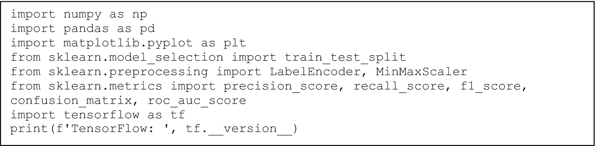

一组程序代码的截图。它导入所有必要的包，例如 n p, p l t, train test split, Label Encoder, Min Max Scaler, precision score, recall score, f 1 score, 和 t f，并打印出 tensor flow。

图 7-2

导入一些必要的包以开始我们的代码

你应该看到以下输出：

```py
Seaborn:  0.12.2
TensorFlow:  2.7.0
```

现在，让我们定义 KDDCUP 数据集的所有列并导入它（图 7-3）。

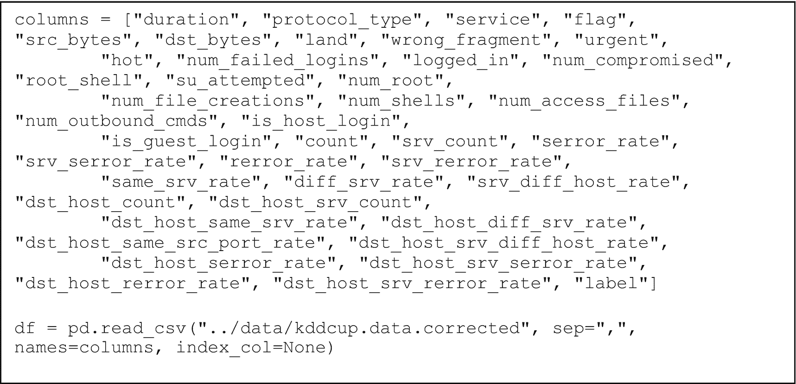

一组程序代码的截图。它定义了 K D D C U P 数据集的所有列并将它们导入。

图 7-3

定义读取数据集的代码

我们想要过滤数据，只包括 HTTP 攻击，如图 7-4 所示。

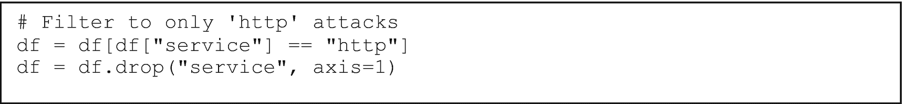

一组程序代码的截图。它定义了如何过滤数据，包括 HTTP 攻击。

图 7-4

仅使用 HTTP 攻击数据

让我们也把标签列转换为 0，对于正常点，以及 1，对于任何没有正常标签的点，如图 7-5 所示。

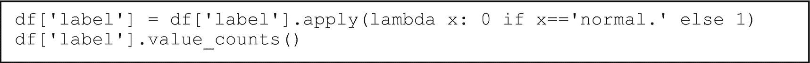

一组程序代码的截图。它将标签列转换为 0，对于正常点，以及 1，对于没有正常标签的值。

图 7-5

对标签列进行编码并将标签压缩为‘正常’和‘异常’

输出应该看起来像这样：

```py
label
0    619046
1      4045
Name: count, dtype: int64
```

我们需要将所有分类列进行数值编码。参见图 7-6。

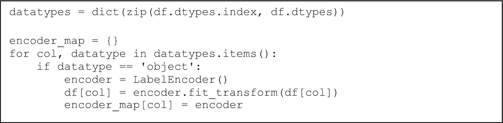

一组程序代码的截图。它调用数据类型并对所有分类列进行数值编码。

图 7-6

对分类列进行标签编码并将它们保存在字典中，以防我们以后想使用它们

接下来，我们想要选择与标签列有较强相关性的列。参见图 7-7。

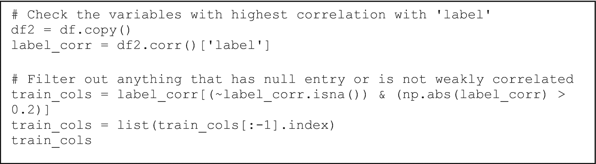

一组程序代码的截图。它选择与标签具有最高相关性的变量所在的列，并过滤掉任何有缺失值或不是弱相关的项。

图 7-7

选择仅与标签列弱相关列的代码

你应该看到如下输出：

```py
['src_bytes',
'hot',
'num_compromised',
'count',
'serror_rate',
'srv_serror_rate',
'same_srv_rate',
'diff_srv_rate',
'dst_host_srv_count',
'dst_host_same_srv_rate',
'dst_host_diff_srv_rate',
'dst_host_serror_rate',
'dst_host_srv_serror_rate']
```

然而，为了使训练稍微容易一些，我们将移除“hot”和“num_compromised”，因为它们与“src_bytes”高度相关。我们希望使生成任务对生成器来说更容易，因此移除任何不必要的列将有所帮助。参见图 7-8。

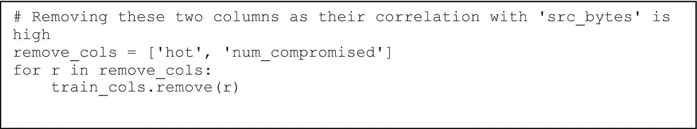

一组程序代码的截图。它移除了具有高相关性的源字节的列。

图 7-8

移除不必要的列

我们现在将数值列缩放到范围 [0, 1]，如图 7-9 所示。这又是为了提高数据质量，以帮助生成器的学习任务。

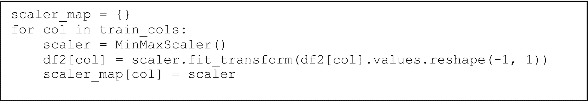

一组程序代码的截图。它将数值列缩放到特定的范围内。

图 7-9

将数值列进行 min-max 缩放并将其保存到字典中的代码

现在定义训练、验证和测试分割，如图 7-10 所示。我们希望区分正常数据和包含异常数据的验证和测试分割，它们都将包含一些异常数据。在验证和测试分割中包含异常数据的原因是，我们可以使用验证数据来进行种子搜索或其他超参数调整，因为在每个 epoch 结束时，我们可以评估判别器/批评家的性能。如果需要，我们还可以执行早期停止以最大化验证性能。

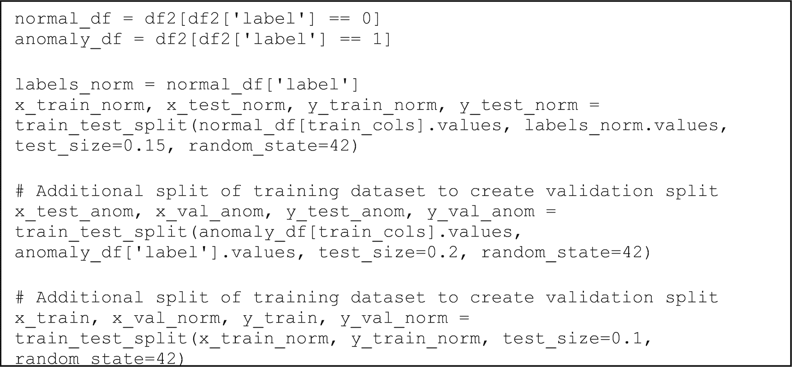

一组程序代码的截图。它调用正常和异常标签以及训练数据集的额外分割来创建验证分割。

图 7-10

定义训练、测试和验证数据分割

现在通过连接正常和异常数据的相应分割来创建最终的测试和验证集。参见图 7-11。

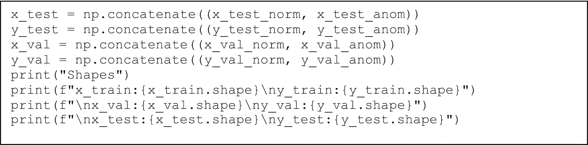

一组程序代码的截图。它通过连接正常和异常数据的相应分割来创建最终的测试和验证集，并打印形状。

图 7-11

创建包含正常和异常数据的最终测试和验证分割

你应该看到如下输出：

```py
Shapes
x_train:(473570, 11)
y_train:(473570,)
x_val:(53428, 11)
y_val:(53428,)
x_test:(96093, 11)
y_test:(96093,)
```

在完成数据准备后，让我们开始定义模型架构。我们正在设置一个随机种子，这意味着我们希望模型训练的输出在架构之间是确定的，并且以特定方式初始化权重。在某些情况下，不同的种子可能导致不同的性能。在 GAN 的情况下，种子搜索可以是一种找到最佳权重初始化设置以实现最佳性能的有效方法。改变这一点可能导致无法收敛和性能不佳，或者甚至可能是一个更好的收敛。

通过种子搜索算法找到了种子，该算法的代码可以在本节前面提到的笔记本中访问。如图 7-12 所示，找到了超过 100 个不同的种子，其中 seed=10 被认为是最好的。

让我们先设置导入和 seed = 10，如图 7-12 所示。

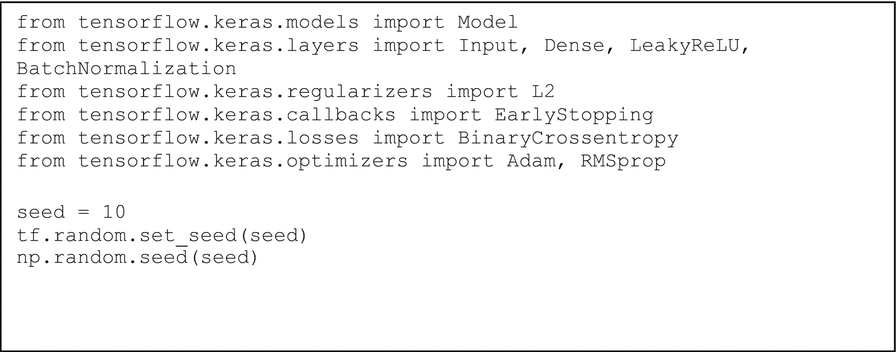

一组程序代码的截图。它导入模型、输入、密集层、Leaky ReLU、批量归一化、L2、早停、二元交叉熵、Adam、RMS prop，并设置种子。

图 7-12

定义模型特定的导入和设置随机种子以保持一致性

现在，我们可以定义生成器，如图 7-13 所示。

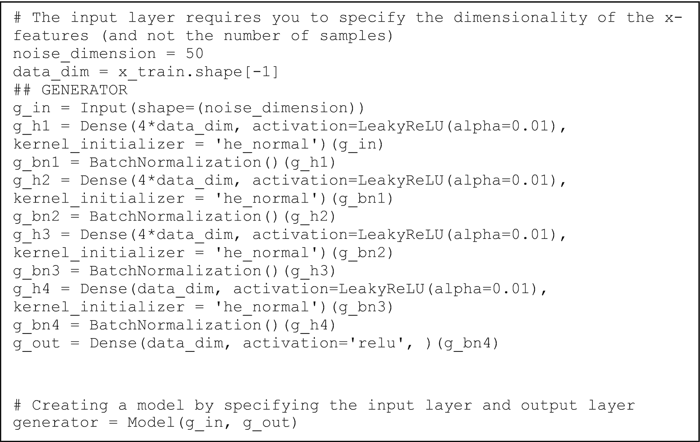

一组程序代码的截图。它调用输入层，指定 x-特征的空间维度，并通过指定输入层和输出层生成器创建了一个模型。

图 7-13

定义生成器的架构

对于生成器，我们采样一个 50 维的噪声向量。然后它通过几个线性层，其中包含 `BatchNormalization` 层（以归一化层的输出并进一步稳定网络训练）。

接下来，让我们定义判别器，如图 7-14 所示。

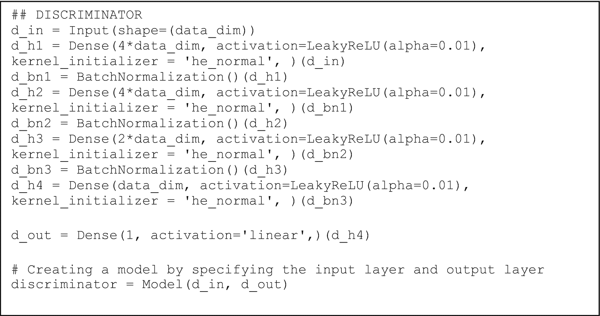

一组程序代码的截图。它定义了判别器，并通过指定输入层和输出层判别器创建了一个模型。

图 7-14

定义判别器。输出层使用线性激活函数，因为实际上这个判别器是 WGAN 设置中的评论家，并将输出无界分数预测。

我们现在必须定义生成器和判别器的优化器。我们使用 RMSProp，生成器学习率为 5e-5，判别器学习率为 1e-5。我们还定义批大小为 4096（以加快训练速度）。改变这一点也可能改变模型的性能。参见图 7-15。

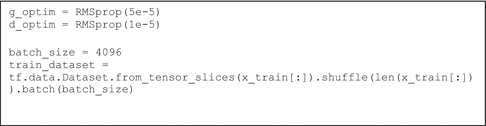

一组程序代码的截图。它使用 R M S Prop 并将生成器学习率设为 5 e-5，将评论家学习率设为 1 e-5，并将批大小设为 4096 来定义生成器和评论家的优化器。

图 7-15

定义优化器以及批处理训练数据集

在此之后，我们将定义梯度惩罚函数。请参考图 7-16。

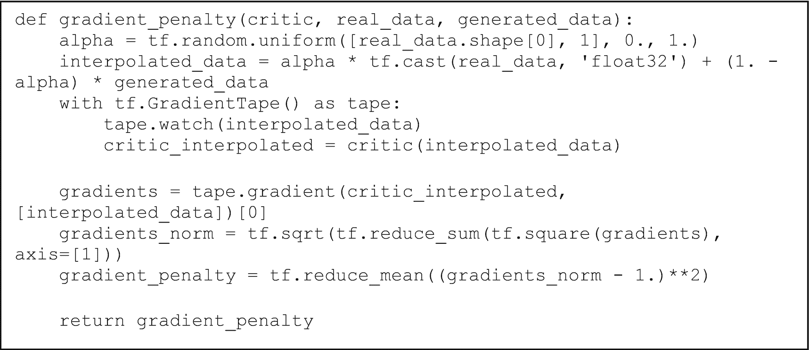

一组程序代码的截图。它定义了评论家、真实数据和生成数据的梯度惩罚函数。

图 7-16

定义梯度惩罚函数

最后，我们有训练循环，所有内容都在这里汇聚。请参考图 7-17 了解一些超参数设置。

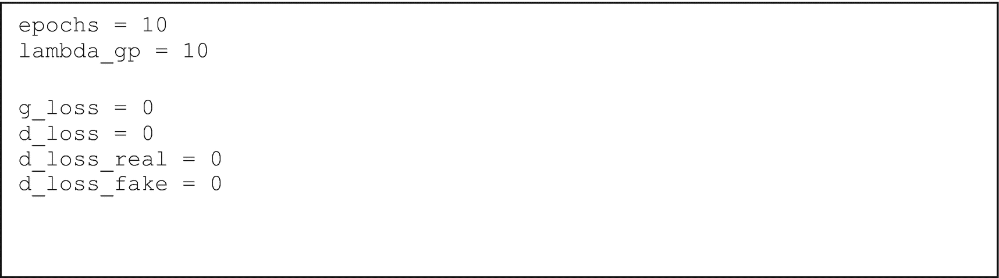

一组程序代码的截图。它设置了超参数值，例如将周期数设为 10，lambda 设为 10，g 损失设为 0，d 损失设为 0，d 损失真实设为 0，d 损失伪造设为 0。

图 7-17

设置一些训练超参数

图 7-18 展示了定义训练循环的代码。

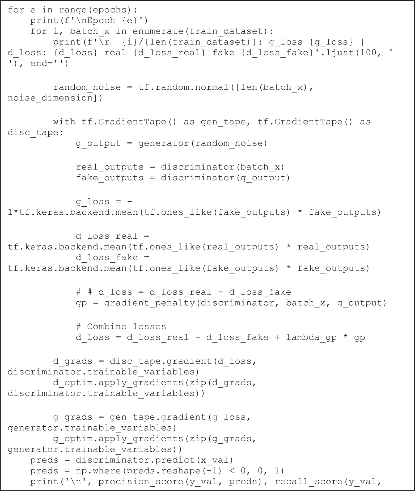

一组程序代码的截图。它定义了训练循环，计算 g 损失、d 损失、d 损失真实和 d 损失伪造，合并损失并打印精确度分数。

图 7-18

定义 GAN 的训练循环。在每个训练周期结束时，我们在验证数据上预测并打印精确度、召回率和 F1 分数

你的训练输出应该类似于图 7-19。

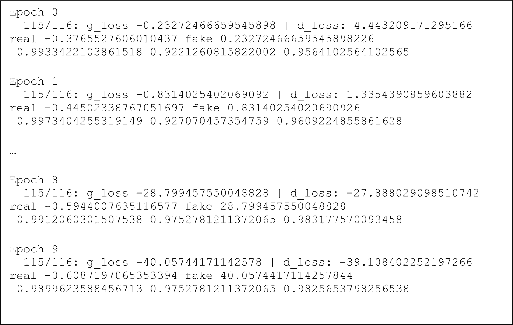

一组程序代码的截图。它定义了从第 0 个训练周期到第 9 个训练周期的训练输出。

图 7-19

训练输出。在每个训练周期末尾的三个输出依次是精确度、召回率和 F1 测度。在整个训练过程中，F1 分数往往会提高

一旦训练完成，让我们在测试数据上进行预测。请参考图 7-20。

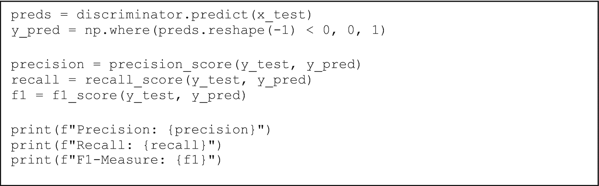

一组程序代码的截图。它预测测试数据并打印精确度分数、召回率和 F1 测度。

图 7-20

使用评论家在测试集上进行预测并打印计算出的精确度、召回率和 F1 分数

如果训练过程中一切顺利，你应该看到一些类似这样的输出：

```py
Precision: 0.995598868280415
Recall: 0.9786773794808405
F1-Measure: 0.9870656069814555
```

最后，让我们绘制混淆矩阵，如图 7-21 所示。

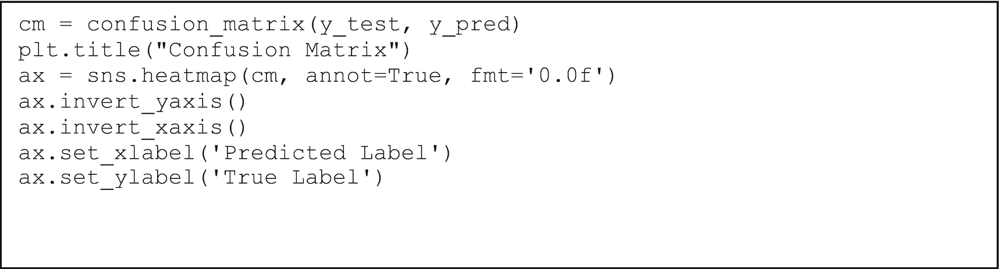

一组程序代码的截图。它通过将 x 轴标记为预测标签，y 轴标记为真实标签来绘制混淆矩阵。

图 7-21

绘制混淆矩阵的代码

你应该看到类似图 7-22 的内容。

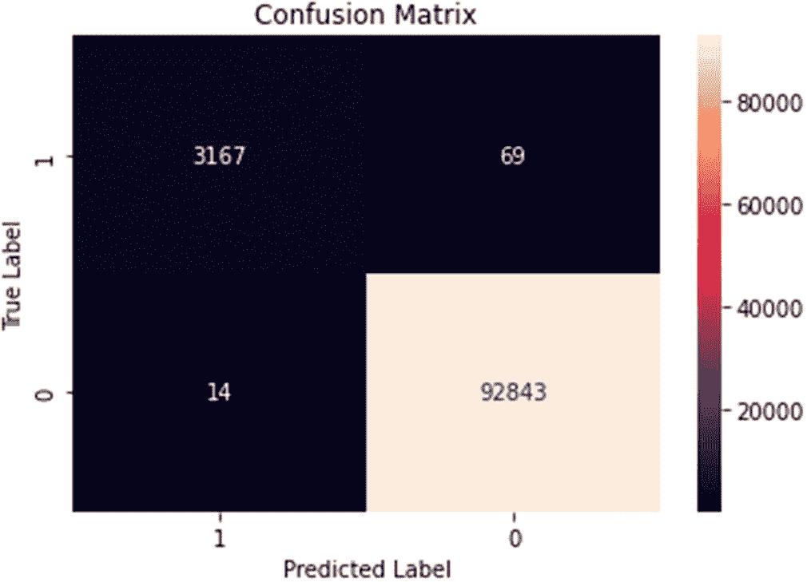

一个 2x2 的混淆矩阵，y 轴为真实标签，x 轴为预测标签。颜色渐变从 0 到 80000。它读取以下元素。第 1 行。3167，69。第 2 行。14，92843。92843 被轻微着色，其余的则是深色。

图 7-22

混淆矩阵。误分类很少——判别器/评论员将 69 个异常误分类为正常，同时将 14 个正常点预测为异常。

正如我们在图 7-22 中可以看到的，尽管 GAN 只在对正常数据进行训练的情况下，仍然在预测异常方面做得很好。其精确度为 0.9955，这意味着它在具体预测异常方面非常准确。其召回率为 0.9786，这仍然是一个强劲的数字，表明如果预测更多新数据，它可能捕捉到绝大多数的真实异常。

你可以进行大量实验，包括不同的超参数设置、不同的损失函数、神经网络架构、数据分割等等。

总体来说，这是一个半监督异常检测的例子，因为我们只在对正常数据进行训练的情况下训练模型，并成功地以高比率预测了异常。

## 摘要

在本章中，我们讨论了生成对抗网络如何应用于异常检测任务。在第八章中，我们将探讨时间序列设置中的异常检测。
