# 8. 长短期记忆模型

在本章中，你将了解循环神经网络（RNN）和长短期记忆（LSTM）模型。你还将了解 LSTM 的工作原理，如何使用它们来检测异常，以及如何使用 LSTM 实现异常检测。你将通过几个不同类型数据的时间序列数据集，如 CPU 利用率、出租车需求等，来展示如何检测异常。本章通过 LSTM 介绍了许多概念，以便你能够使用书中提供的 Jupyter 笔记本进一步探索。

简而言之，本章涵盖了以下主题：

+   序列和时间序列分析

+   什么是 RNN？

+   什么是 LSTM？

+   LSTM 应用

注意

代码示例使用 Python 3.8 编写。本书的代码库可在[`github.com/apress/beginning-anomaly-detection-python-deep-learning-2e/tree/master`](https://github.com/apress/beginning-anomaly-detection-python-deep-learning-2e/tree/master)找到。

仓库还包括一个 requirements.txt 文件，用于检查你的包及其版本。

本章的笔记本可以在[`github.com/apress/beginning-anomaly-detection-python-deep-learning-2e/blob/master/Chapter%208%20Long-Short%20Term%20Memory%20Models/chapter8_​lstm.ipynb`](https://github.com/apress/beginning-anomaly-detection-python-deep-learning-2e/blob/master/Chapter%208%20Long-Short%20Term%20Memory%20Models/chapter8_lstm.ipynb)找到。

导航到“第八章 长短期记忆模型”并点击笔记本。代码也以.py 文件的形式提供，尽管它是笔记本的导出版本。

我们将使用 JupyterLab 来展示所有的代码示例。

## 序列和时间序列分析

**时间序列**是一系列按时间顺序索引的数据点。最常见的是，时间序列是在时间上连续等间距的点上的序列。因此，它是一系列离散时间数据。时间序列的例子包括 ECG 数据、天气传感器和股价。

图 8-1 展示了时间序列的一个示例。


值与日期时间的折线图表示具有波动的时序。最高值在 2015 年 11 月为 39000，最低值在 2015 年 1 月为 0。值是估算的。

图 8-1

描述纽约市所有出租车在一段时间内总接单数的时序数据集

图 8-2 展示了大西洋多年代振荡（AMO）指数在 157 年时间段内的月度值（AMO 衡量北大西洋海表温度的变化）。

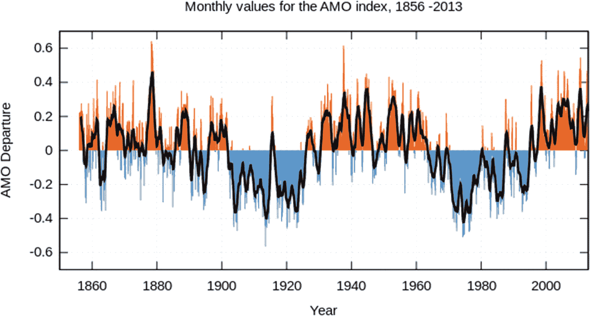

A M O（北大西洋多年代振荡）的出发年份图表，显示了从 1856 年到 2013 年的月度值。它有一个波动正弦波形，具有正负周期。

图 8-2

随时间变化的 AMO 指数的月度值

图 8-3 显示了 20 年期间 BP 股票价格的图表。

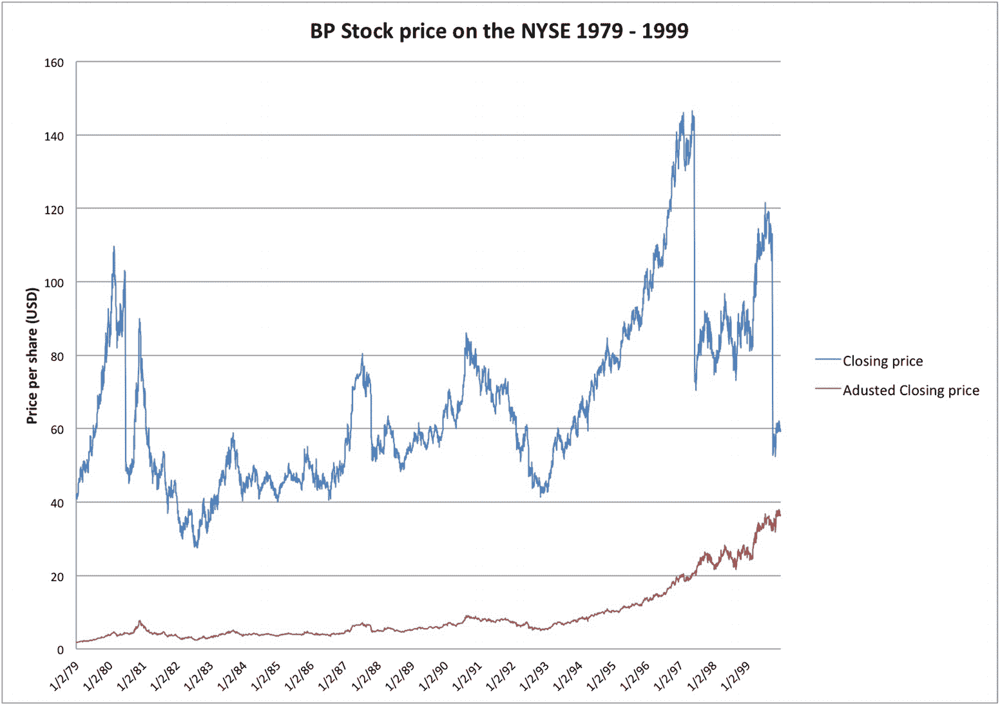

一条线图显示了从 1979 年到 1999 年在纽约证券交易所（NYSE）的 B P 股票每股美元价格。它有两个曲线。带有峰值的波动波形表示收盘价，其中 1996 年 2 月 1 日的收盘价最高。略有上升且波动的曲线是调整后的收盘价。

图 8-3

20 年间的 BP 股票收盘价每股

**时间序列分析**，因此，是指对一段时间内数据趋势变化的分析。时间序列分析包括分析时间序列数据的方法，以提取数据的统计和其他特征，并且有各种应用。其中一种应用是基于过去值预测物品的未来价值。未来股票价格预测可能是此类应用的最好例子。

另一个非常重要的用例是检测异常的能力。通过分析和学习时间序列，从历史数据中理解趋势和变化，我们可以检测时间序列中的异常或异常数据点。图 8-4 是一个包含异常的时间序列。它用绿色表示正常数据，用红色表示可能异常的数据。

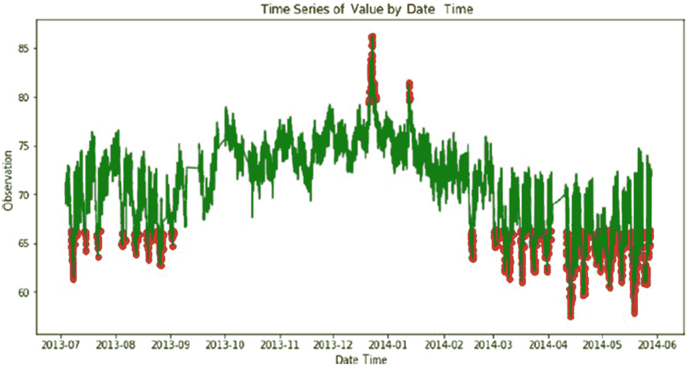

观察值与日期时间的图表显示了从 2013 年 7 月到 2014 年 6 月的时间序列。它在 2013 年 12 月到 2014 年 1 月之间有一个大约 87 的最高峰的波动波形。垂直图沿着峰值和谷值分布。

图 8-4

包含异常的时间序列。绿色线代表整体数据，无论是正常还是异常。绿色线上方绘制的红色点代表异常预测。这些是某些方法预测为异常的时间序列中的点。它们往往出现在时间序列的最高和最低峰值处，因为意外的高或低幅值可能是异常的。

## 什么是 RNN？

你在书中已经看到了几种类型的神经网络，所以你知道神经网络的较高层次表示看起来像图 8-5。


水平流程图。输入传递到神经网络以生成输出。

图 8-5

神经网络的较高层次表示

显然，神经网络处理输入并产生输出，并且它可以在具有不同特征的各种输入数据上工作。然而，一个需要注意的关键点是，这个神经网络没有事件（输入）发生时间的概念，只知道输入已经到来。那么，对于长时间内作为流进入的事件（输入）会发生什么？图 8-5 中所示的神经网络如何处理事件的趋势、事件的季节性等问题？它如何从过去学习并将其应用于现在和未来？循环神经网络通过逐步构建神经网络，将来自先前时间戳的信号引入当前网络来尝试解决这个问题。图 8-6 描述了一个 RNN。

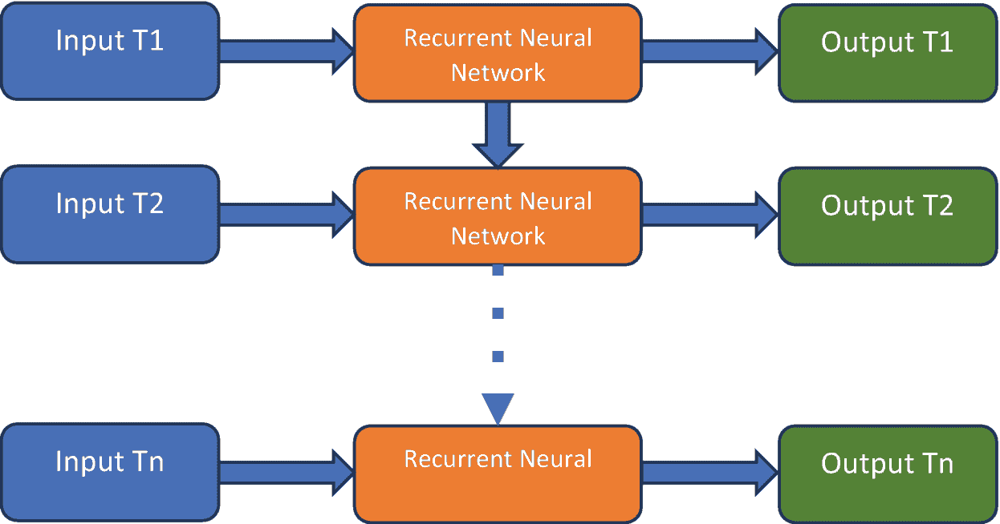

循环神经网络的流程图包括输入 T 1 到 T n 和输出 T 1 到 T n。循环神经网络从上到下连接。

图 8-6

循环神经网络

你可以看到，RNN 是一个具有多个层或阶段的神经网络。每个阶段代表一个时间，T；T+1 时的 RNN 将 T 时的 RNN 视为一个信号。每个阶段将其输出传递给下一个阶段。从阶段传递到下一个阶段的隐藏状态是 RNN 工作得如此之好的关键，这个隐藏状态类似于某种记忆保持。RNN 层（或阶段）作为编码器，在处理输入序列并返回其自身内部状态时起作用。这个状态作为下一阶段解码器的输入，该解码器被训练来预测目标序列的下一个点，给定目标序列的先前点。具体来说，它被训练将目标序列转换为相同的序列，但未来一个时间步长偏移。

在训练 RNN 时，使用反向传播，就像在其他神经网络中一样，但在 RNN 中还有一个时间维度。在反向传播中，我们计算损失相对于每个参数的导数（梯度）。使用这些信息（损失），我们可以将参数向相反方向移动，目标是最小化损失。由于我们在时间上移动，我们可以在每个时间步长都有一个损失，我们可以将时间上的损失相加以得到每个时间步长的损失。这等同于时间上梯度的求和。

由常规神经网络节点构成的先前 RNN 的问题在于，当我们试图模拟由大量其他值分隔的序列值之间的依赖关系时，时间步 T 的梯度依赖于 T-1 的梯度，T-1 的梯度又依赖于 T-2 的梯度，依此类推。这导致最早梯度对贡献越来越小，因为我们沿着时间步移动，梯度链变得越来越长。这就是所谓的梯度消失问题。这意味着那些早期层的梯度会越来越小，因此网络无法学习长期依赖。RNN 因此变得有偏见，只能处理短期数据点。LSTM 网络是解决 RNN 中这个问题的方法之一。

## 什么是 LSTM？

LSTM 网络是一种循环神经网络。正如前文所述，RNN 是一种试图模拟时间或序列相关行为的神经网络，例如语言、股票价格、天气传感器等。这是通过将时间 T 时刻神经网络层的输出反馈到时间 T+1 时刻同一网络层的输入来实现的。LSTM 在 RNN 的基础上进行了扩展，增加了一个记忆组件，旨在帮助将时间 T 时刻学习到的信息传播到未来的 T+1、T+2 等时刻。主要思想是 LSTM 可以在选择性更新状态的同时，忘记之前状态中的不相关部分，然后输出与未来相关的状态部分。这如何解决 RNN 中的梯度消失问题呢？好吧，现在我们正在丢弃状态的一部分，更新状态的一部分，并向前传播状态的一部分，这样我们就不再像在 RNN 中那样有一个长长的反向传播链。因此，LSTMs 比典型的 RNNs 要高效得多。

图 8-7 展示了带有 tanh 激活的 RNN。

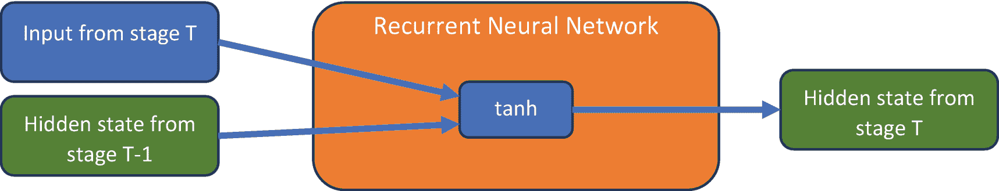

流程图。来自阶段 T 的输入和来自阶段 T-1 的隐藏状态导致循环神经网络的切线 h，进而导致阶段 T 的隐藏状态。

图 8-7

带有 tanh 激活的 RNN，这是 RNN 中常用的激活函数

tanh 函数被称为**激活函数**。（关于激活函数的入门，请参阅第五章。）有几种类型的激活函数有助于在神经网络中每个节点上应用非线性变换。图 8-8 显示了常见的激活函数。

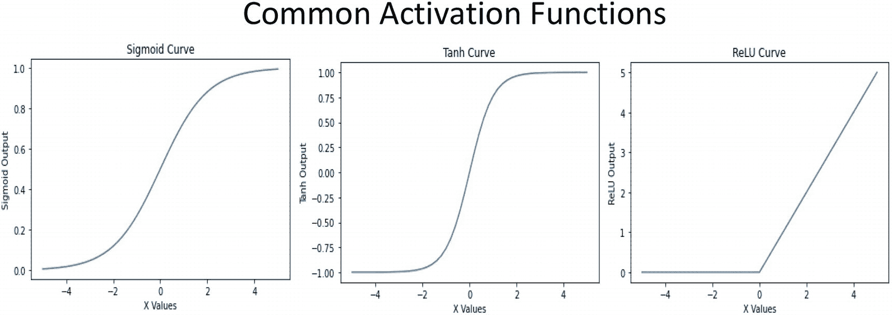

3 条线图。1，Sigmoid 输出与 X 值的关系，在（负 5，0）和（5，1）之间呈增加的 S 形曲线。2，切线 h 输出与 X 值的关系，在（负 5，负 1）和（5，1）之间呈增加的 S 曲线。3，ReLU 输出通过（负 5，0），（0，0）和（5，5）的直线。数据已估计。

图 8-8

常见激活函数

激活函数背后的关键思想是为数据添加非线性，以便更好地与现实世界问题和现实世界数据对齐。在图 8-9 中，左图显示线性，右图显示非线性。

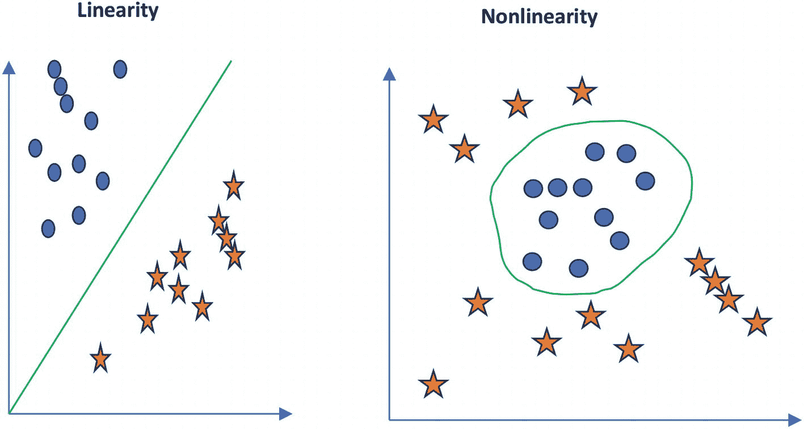

两个散点图，有两种类型的图形。左图线性图左侧有圆形图，右侧有星形图，由对角线分开。非线性图的右图有一个不规则圆形的圆形图，周围环绕着星形图。

图 8-9

线性和非线性数据图

显然，没有线性方程可以处理非线性，因此我们需要一个激活函数来处理这个特性。不同的激活函数列在[`www.tensorflow.org/api_docs/python/tf/keras/activations`](https://www.tensorflow.org/api_docs/python/tf/keras/activations)。

在时间序列数据中，数据分布在一段时间内，而不是像第四章中自动编码器所看到的那种瞬时集合。因此，不仅需要查看某个时间 T 的瞬时数据，而且还需要将这个点左侧的较老历史数据通过时间步骤传播。由于我们需要历史数据点的信号在很长时间内保持存活，我们需要一个可以在接近零之前维持信息更长时间的激活函数。tanh 是此目的的理想激活函数，如图 8-10 所示。

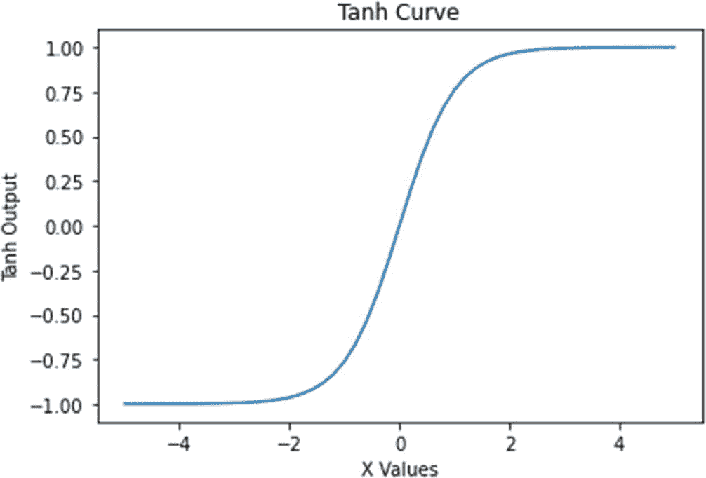

正切 h 输出与 X 值的线图，有一个在（负 5，负 1）和（5，1）之间延伸的 S 形曲线。标题为“正切 h 曲线”。数值是近似的。


tanh 激活

我们还需要 sigmoid（另一种激活函数）作为记住或忘记信息的方式。sigmoid 激活函数如图 8-11 所示。

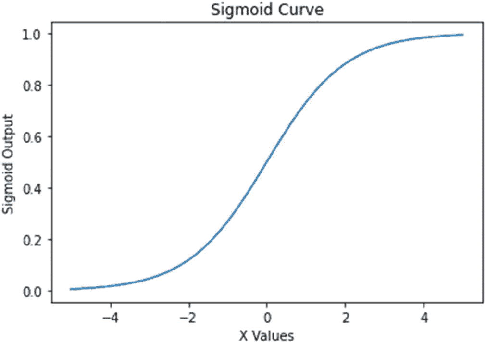

sigmoid 输出与 X 值的线图，有一个在（负 5，0）和（5，1）之间延伸的 S 形曲线。标题为“sigmoid 曲线”。数值是近似的。


一个 sigmoid 激活函数

传统循环神经网络（RNN）倾向于记住所有东西，包括不必要的输入，这导致它们无法从长序列中学习。相比之下，长短期记忆网络（LSTMs）会选择性地记住重要的输入，这使得它们能够处理短期和长期依赖。LSTMs 通过使用三个重要的门在隐藏状态和细胞状态之间释放信息来实现这一点。一个常见的 LSTM 单元由一个细胞、一个输入门、一个输出门和一个遗忘门组成。细胞在任意时间间隔内记住值，而三个门调节信息流入和流出细胞的信息流。

更详细的 LSTM 架构如图 8-12 所示。使用的关键函数是 tanh 和 sigmoid 激活函数。F[t] 是遗忘门，I[t] 是输入门，O[t] 是输出门。

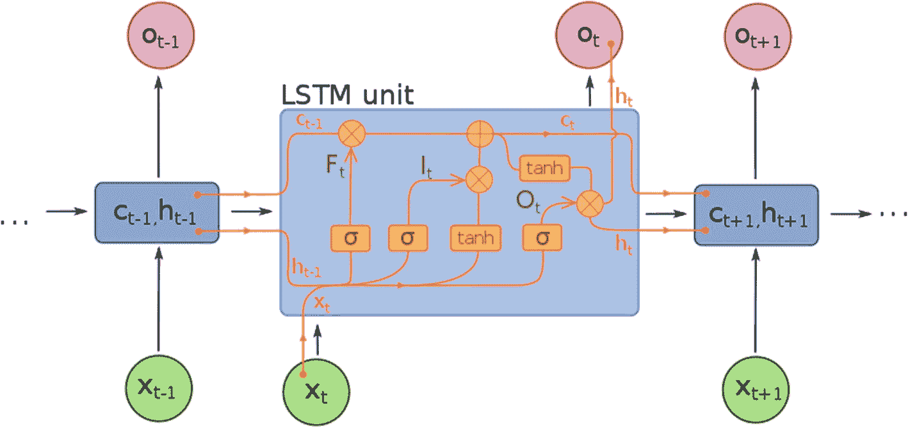

长短期记忆模型的结构包括 c 下标 t 减 1，h 下标 t 减 1，LSTM 单元，和 c 下标 t 加 1，h 下标 t 加 1。输入是 x 下标 t 减 1，x 下标 t，和 x 下标 t 加 1。输出是 o 下标 t 减 1，o t，和 o t 加 1。

图 8-12

一个详细的 LSTM 网络图（来源：[`commons.wikimedia.org/wiki/File:Long_Short-Term_Memory.svg`](https://commons.wikimedia.org/wiki/File:Long_Short-Term_Memory.svg)）

遗忘门是 LSTM 阶段的第一部分，它决定了从前一个阶段应该记住或忘记多少信息。这是通过将前一个隐藏状态 hT-1 和当前输入 xT 通过 sigmoid 函数传递来实现的。

输入门通过使用 sigmoid 函数和 tanh 函数帮助决定传递到当前阶段的信息量。

输出门控制隐藏状态将保留多少信息并传递到下一个阶段。同样，当前状态通过 tanh 函数传递。

仅作信息参考，以下是一个带有遗忘门的 LSTM 单元前向传递方程的紧凑形式，其中初始值是 c0 = 0 和 h0 = 0，下标表示时间步：

![$$ {F}_t=\sigma \left({W}_f\bullet \left[{h}_{t-1},{x}_t\right]+{b}_f\right) $$](img/483137_2_En_8_Chapter/483137_2_En_8_Chapter_TeX_Equa.png)

![$$ {I}_t=\sigma \left({W}_i\bullet \left[{h}_{t-1},{x}_t\right]+{b}_i\right) $$](img/483137_2_En_8_Chapter/483137_2_En_8_Chapter_TeX_Equb.png)

![$$ {\overset{\sim }{C}}_t=\mathit{\tanh}\left({W}_C\bullet \left[{h}_{t-1},{x}_t\right]+{b}_C\right) $$](img/483137_2_En_8_Chapter/483137_2_En_8_Chapter_TeX_Equc.png)

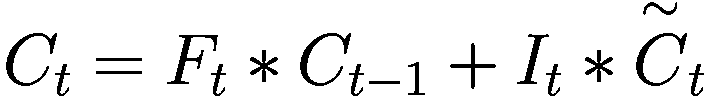

![$$ {O}_t=\sigma \left({W}_o\bullet \left[{h}_{t-1},{x}_t\right]+{b}_o\right) $$](img/483137_2_En_8_Chapter/483137_2_En_8_Chapter_TeX_Eque.png)

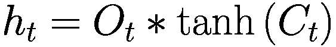

在这里，F[t]，I[t]，O[t]，和 C[t] 分别对应图 8-12 中的对应部分。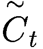是 tanh 门的输出。

以下列表总结了所有变量：

+   X[t]：LSTM 单元的输入向量。

+   F[t]：遗忘门的激活向量。

+   I[t]：输入/更新门的激活向量。

+   O[t]：输出门的激活向量。

+   h[t]：隐藏状态向量，也称为整个 LSTM 单元的输出向量。

+   c[t]：细胞状态/上下文向量。

+   W, b：权重矩阵和偏置向量。每个 W 矩阵和 b 向量组合及其独特的下标代表一组必须在训练期间学习的可学习参数。

对于 *σ*，这是 sigmoid 激活函数。

## 用于异常检测的 LSTM

本节介绍了使用时间序列数据作为示例的一些用例的 LSTM 实现。有几个不同的时间序列数据集可供使用，以尝试使用 LSTM 检测异常。它们都有时间戳和可以轻松在 Python 中绘制的值。

基本想法是在正常的时间序列数据序列上训练一个 LSTM。在这种情况下，序列的前半部分将是我们训练集，序列的后半部分将是测试集。我们将数据集处理成 T 个时间步长的滚动窗口，其中前 T-1 个时间步长将被传递到 LSTM 中，以预测第 T 个时间步长的值。

然后，我们将使用 LSTM 预测整个时间序列序列，包括训练和测试分割。在预测每个点时，我们将使用平均绝对误差计算 LSTM 的预测输出和实际真实输出之间的损失。为了预测异常，我们将设置预测误差阈值，如果超过此阈值，则表示自动标记为异常。我们使用 95% 分位数的训练误差，或最高 5% 的误差。

此阈值将使用 top n^(th) 百分比训练预测误差来设置。然后，将此边界应用于其余的测试数据，这次，任何高于此边界的预测误差都将被计为异常。我们使用 95^(th) 分位数的训练误差，或最高 5% 的误差。

只在序列的前半部分进行训练的理由是，在我们用异常值预测后半部分之前，让模型了解正常时间序列值的样子。想法是预测值不会与异常值匹配，产生更高的误差，并被标记为异常。由于异常检测不需要标签，这是一个无监督学习任务。这个通用公式是我们将在几个不同的时间序列数据集上应用，以无监督方式执行异常检测。

图 8-13 展示了导入所有必要包的基本代码。

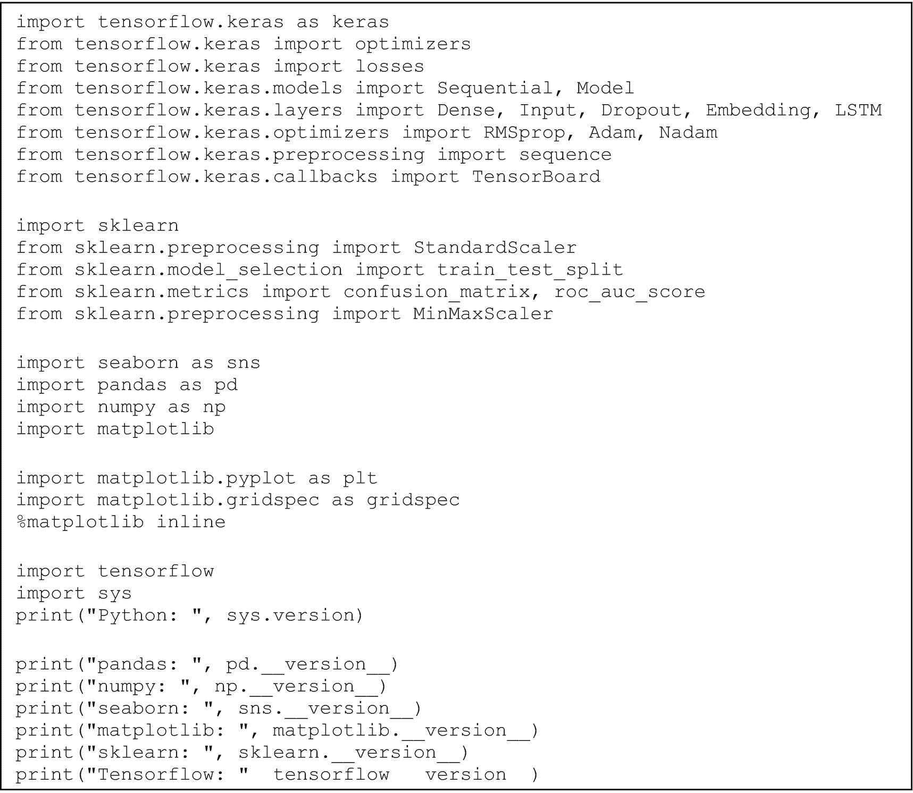

一个用于导入包并打印 pandas、numpy、seaborn、matplotlib、sklearn 和 tensorflow 的 MATLAB 代码。

图 8-13

导入包的代码

必要的各种包的版本如下：

```py
Python:  3.8.12 (default, Oct 12 2021, 03:01:40) [MSC v.1916 64 bit (AMD64)]
pandas:  2.0.0
numpy:  1.22.2
seaborn:  0.12.2
matplotlib:  3.7.1
sklearn:  1.2.2
Tensorflow:  2.7.0
```

图 8-14 展示了通过图表可视化结果，包括异常图表和误差图表（预测值与真实值之间的差异），在训练过程中。

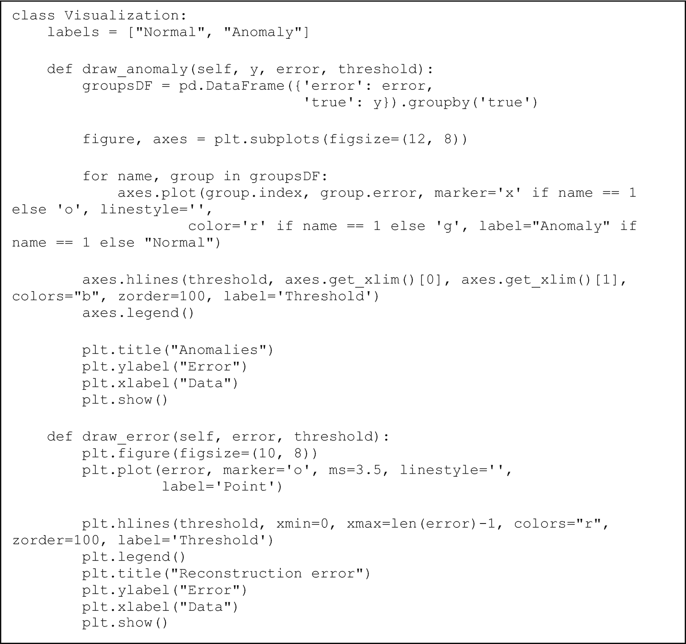

MATLAB 代码中的类可视化包括两个异常和重建误差与数据对比的图表。

图 8-14

可视化错误和异常的代码

您将使用不同类型的时间序列数据来检测一个点是否正常/预期或异常/异常。图 8-15 展示了数据被加载到 Pandas 数据框中。它还显示了数据集路径列表。

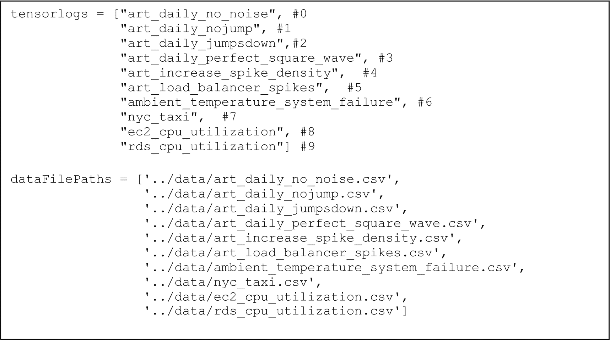

数据集路径列表包括十个张量日志和十个数据文件路径。

图 8-15

数据集路径列表

您可以在 [`github.com/apress/beginning-anomaly-detection-python-deep-learning-2e/tree/master/data`](https://github.com/apress/beginning-anomaly-detection-python-deep-learning-2e/tree/master/data) 找到所有数据。

现在，您将更详细地处理一个数据集。该数据集是 nyc_taxi，它基本上由时间戳和出租车需求组成。此数据集显示了从 2014-07-01 到 2015-01-31 的纽约市出租车需求，每半小时有一个观测值。在此数据集中几乎没有可检测的异常：感恩节、圣诞节、新年、暴风雪等。图 8-16 展示了选择数据集的代码。

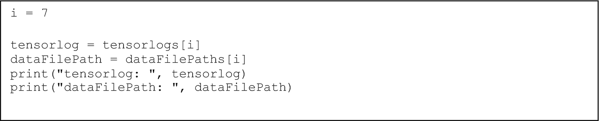

一段代码将 i 赋值为 7，并指示张量日志和数据文件路径以打印张量日志和数据文件路径。

图 8-16

选择 nyc_taxi 数据集的代码

您可以使用 Pandas 将数据从 dataFilePath 以 csv 文件的形式加载。图 8-17 展示了将 csv 数据文件读取到 Pandas 的代码。

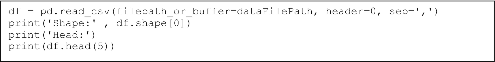

一段代码指示了 csv 数据文件的路径，并打印了 5 的形状、头部和 d f dot head。

图 8-17

读取 csv 数据文件到 Pandas 的代码

图 8-17 的输出应如下所示：

```py
Shape: 10320
Head:
timestamp  value
0  2014-07-01 00:00:00  10844
1  2014-07-01 00:30:00   8127
2  2014-07-01 01:00:00   6210
3  2014-07-01 01:30:00   4656
4  2014-07-01 02:00:00   3820
```

图 8-18a 展示了时间序列的绘图，x 轴为月份，y 轴为值。它还展示了生成时间序列图表的代码。


一段代码指示了日期时间数据文件，并打印了 3 的 d f dot head。它绘制了值与日期时间的图表，标题为按日期时间值的时间序列。

图 8-18a

绘制时间序列

图 8-18b 展示了生成的图表。

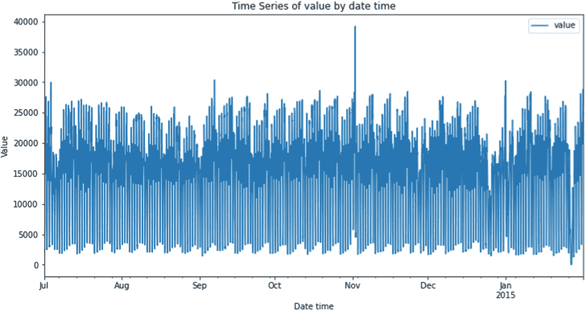

值与日期时间的线图表示了值的时间序列。它在 11 月份有一个大约 39500 的最高峰值，波动密集。

图 8-18b

绘制的时间序列

让我们进一步深入了解数据。您可以使用 `describe()` 命令查看值列。图 8-19 展示了描述值列的代码。

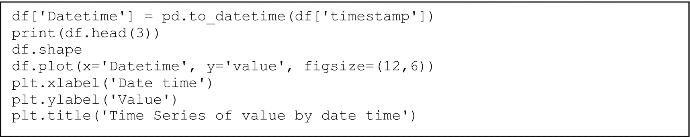

一段代码指示了日期时间数据文件，并打印了 3 的 d f dot head。它绘制了值与日期时间的图表，标题为按日期时间值的时间序列。

图 8-19

描述值列

您应该看到类似以下内容：

```py
count    10320.000000
mean     15137.569380
std       6939.495808
min          8.000000
25%      10262.000000
50%      16778.000000
75%      19838.750000
max      39197.000000
Name: value, dtype: float64
```

你也可以使用 seaborn 核密度估计（KDE）图来绘制数据，如图 8-20a 和图 8-20b 所示。

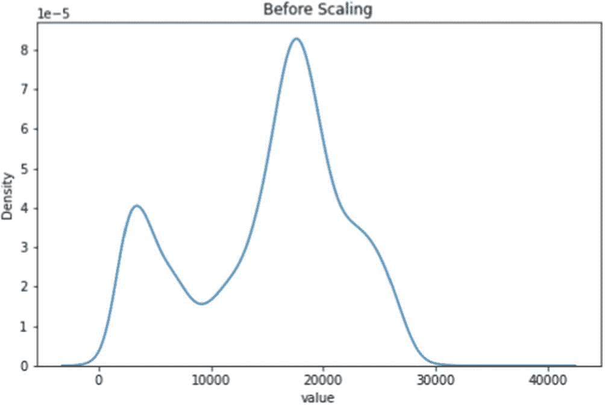

密度与值之间的线图表示一个双峰分布的曲线。峰值大约在(3000, 4)和(17500, 8.5)。

图 8-20b

使用 KDE 绘制值列。

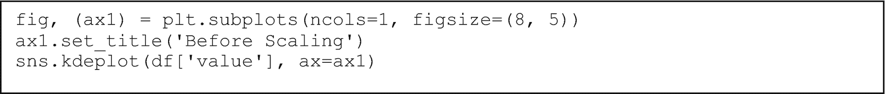

创建未缩放前的 kde 图的代码。

图 8-20a

显示数据的 KDE 图的代码。

数据点的最小值为 8，最大值为 39,197，范围较广。你可以使用缩放来归一化数据。缩放的公式是(x-Min) / (Max-Min)。图 8-21 显示了缩放数据的代码。

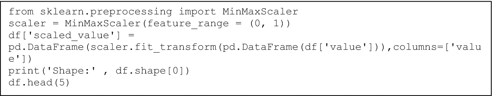

一段代码导入最小最大缩放器，特征范围为(0, 1)，创建数据框，并打印其形状。

图 8-21

缩放数据的代码。

你的输出表应该看起来像表 8-1。

表 8-1

显示原始数据框的归一化版本。

|   | 时间戳 | 值 | 日期时间 | 缩放值 |
| --- | --- | --- | --- | --- |
| **0** | 2014-07-01 00:00:00 | 10844 | 2014-07-01 00:00:00 | 0.276506 |
| **1** | 2014-07-01 00:30:00 | 8127 | 2014-07-01 00:30:00 | 0.207175 |
| **2** | 2014-07-01 01:00:00 | 6210 | 2014-07-01 01:00:00 | 0.158259 |
| **3** | 2014-07-01 01:30:00 | 4656 | 2014-07-01 01:30:00 | 0.118605 |
| **4** | 2014-07-01 02:00:00 | 3820 | 2014-07-01 02:00:00 | 0.097272 |

现在数据已经缩放，你可以再次绘制数据。你可以使用 seaborn kde 图来绘制数据，如图 8-22a 和图形输出图 8-22b 所示。

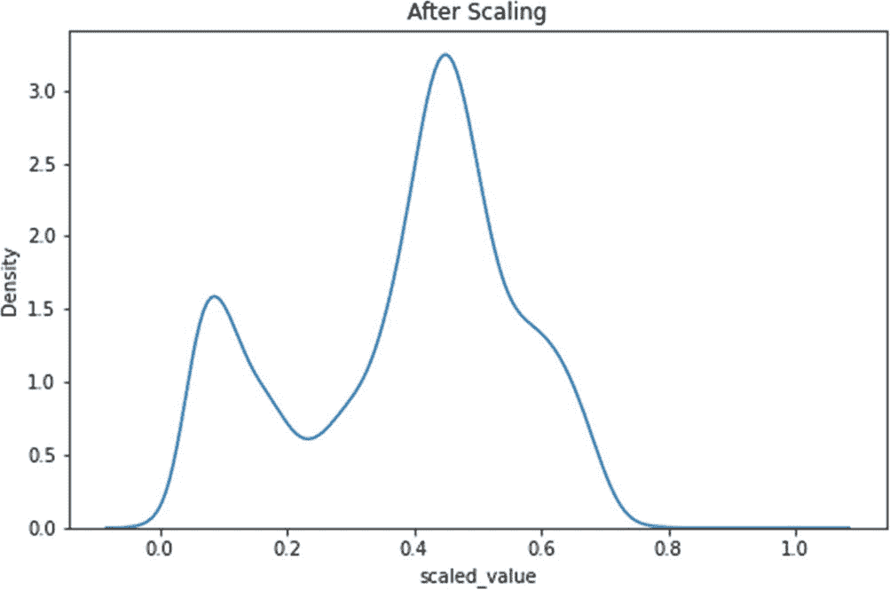

缩放后的密度与值之间的线图表示一个双峰分布的曲线。峰值大约在(0.08, 1.6)和(0.45, 3.3)。

图 8-22b

使用 kde 绘制缩放值列。

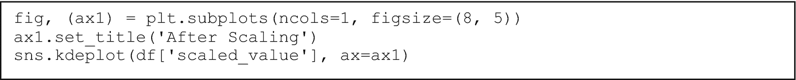

创建缩放后 kde 图的代码。

图 8-22a

绘制缩放值列的 kde 的代码。

在对缩放值列进行缩放后，你现在可以查看数据框了。图 8-23 显示了包含时间戳、值以及缩放值和日期时间的数据框（来自表 8-1）。

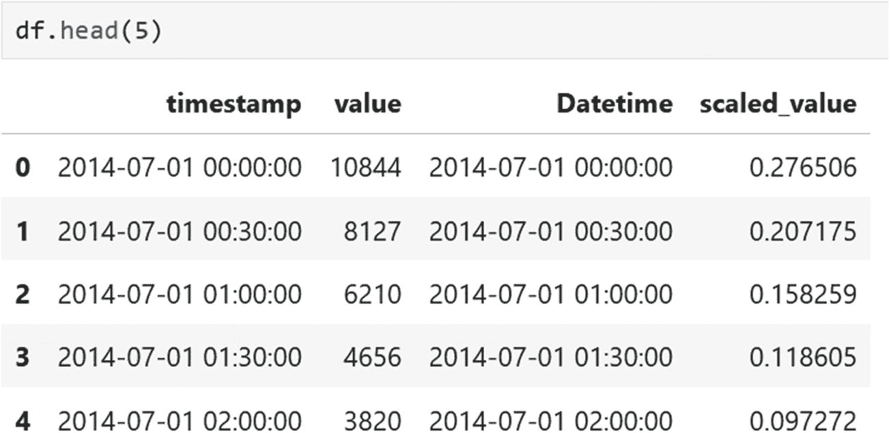

一个表有 4 列和 5 行。列标题是时间戳、值、日期时间和缩放值。行号从上到下编号为 0 到 4。

图 8-23

修改后的数据框。

序列中有 10,320 个数据点，你的目标是找到异常值。这意味着你试图找出数据点何时异常。如果你可以根据直到 T-1 的历史数据预测时间 T 的数据点，那么你就有了一种方法来比较预期值和实际值，以查看你是否在时间 T 的预期值范围内。如果你预测 2015 年 1 月 1 日需要 y_pred 数量的出租车，那么你可以将这个 y_pred 与实际的 y_actual 进行比较。y_pred 和 y_actual 之间的差异给出了误差，当你得到序列中所有点的误差时，你最终得到一个仅包含误差的分布。

为了实现这一点，你将使用 Keras 的序列模型。该模型由两个 LSTM 层组成，最后的 LSTM 层是输出层。第一个 LSTM 层接受时间序列数据作为输入，并学习如何随时间学习值。最后的 LSTM 层是输出层，它将接受前一个 LSTM 层的输出并将其转换为对下一个时间步的单个预测。然后，你对这个 LSTM 层应用 sigmoid 激活函数，使得最终输出介于 0 和 1 之间。

你还使用了 Adam 优化器和平均绝对误差作为损失函数。图 8-24a 展示了构建 LSTM 模型的代码。

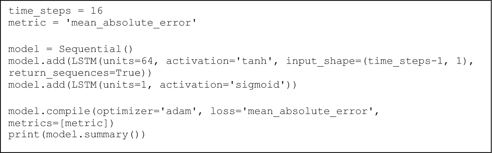

代码表示时间步、指标和模型，并打印模型总结。

图 8-24a

构建 LSTM 模型的代码

模型总结看起来像图 8-24b。

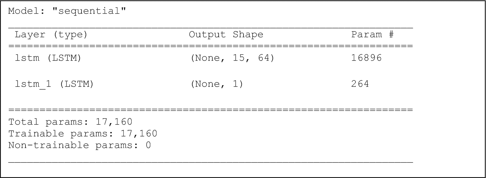

序列模型的表格有 3 列和 2 行。列标题是层、输出形状和参数。总参数数 = 17160。可训练参数数 = 17160。不可训练参数数 = 0。

图 8-24b

图 8-24a 中创建的模型的文本总结

如上图所示，你使用了 LSTM 层。让我们看看 LSTM 层函数的详细信息，包括所有可能的参数（来源：[`www.tensorflow.org/api_docs/python/tf/keras/layers/LSTM`](https://www.tensorflow.org/api_docs/python/tf/keras/layers/LSTM)）：

```py
tf.keras.layers.LSTM(
units,
activation='tanh',
recurrent_activation='sigmoid',
use_bias=True,
kernel_initializer='glorot_uniform',
recurrent_initializer='orthogonal',
bias_initializer='zeros',
unit_forget_bias=True,
kernel_regularizer=None,
recurrent_regularizer=None,
bias_regularizer=None,
activity_regularizer=None,
kernel_constraint=None,
recurrent_constraint=None,
bias_constraint=None,
dropout=0.0,
recurrent_dropout=0.0,
return_sequences=False,
return_state=False,
go_backwards=False,
stateful=False,
time_major=False,
unroll=False,
**kwargs
)
```

以下是对参数的总结：

+   `units`: 正整数，表示输出空间的维度。

+   `activation`: 要使用的激活函数。默认：双曲正切函数 (`tanh`)。如果你传递 `None`，则不应用激活函数（即，“线性”激活：`a(x) = x`）。

+   `recurrent_activation`: 用于循环步骤的激活函数。默认：sigmoid (`sigmoid`)。如果你传递 `None`，则不应用激活函数（即，“线性”激活：`a(x) = x`）。

+   `use_bias`: 布尔值（默认 `True`），表示层是否使用偏置向量。

+   `kernel_initializer`: `kernel` 权重矩阵的初始化器，用于输入的线性变换。默认：`glorot_uniform`。

+   `recurrent_initializer`: `recurrent_kernel` 权重矩阵的初始化器，用于循环状态的线性变换。默认值：`orthogonal`。

+   `bias_initializer`: 偏置向量的初始化器。默认值：`zeros`。

+   `unit_forget_bias`: 布尔值（默认 `True`）。如果为 `True`，则在初始化时将 `1` 添加到遗忘门的偏置。将其设置为 `True` 还会强制 `bias_initializer="zeros"`。这在 Jozefowicz 等人的研究中被推荐。

+   `kernel_regularizer`: 应用于 `kernel` 权重矩阵的正则化函数。默认值：`None`。

+   `recurrent_regularizer`: 应用于 `recurrent_kernel` 权重矩阵的正则化函数。默认值：`None`。

+   `bias_regularizer`: 应用于偏置向量的正则化函数。默认值：`None`。

+   `activity_regularizer`: 应用于层输出（其“激活”）的正则化函数。默认值：`None`。

+   `kernel_constraint`: 应用于 `kernel` 权重矩阵的约束函数。默认值：`None`。

+   `recurrent_constraint`: 应用于 `recurrent_kernel` 权重矩阵的约束函数。默认值：`None`。

+   `bias_constraint`: 应用于偏置向量的约束函数。默认值：`None`。

+   `dropout`: 介于 `0` 和 `1` 之间的浮点数。用于输入线性变换的单元丢弃比例。默认值：`0`。

+   `recurrent_dropout`: 介于 `0` 和 `1` 之间的浮点数。用于循环状态线性变换的单元丢弃比例。默认值：`0`。

+   `return_sequences`: 布尔值。表示是否返回输出序列中的最后一个输出，或整个序列。默认值：`False`。

+   `return_state`: 布尔值。表示是否返回最后一个状态以及输出。默认值：`False`。

+   `go_backwards`: 布尔值（默认 `False`）。如果为 `True`，则反向处理输入序列并返回反转的序列。

+   `stateful`: 布尔值（默认 `False`）。如果为 `True`，则每个样本在批次中索引 i 的最后一个状态将用作下一个批次中索引 i 的样本的初始状态。

+   `time_major`: `inputs` 和 `outputs` 张量的形状格式。如果为 `True`，输入和输出将具有形状 `[timesteps, batch, feature]`，而在 `False` 的情况下，它将是 `[batch, timesteps, feature]`。使用 `time_major = True` 会稍微高效一些，因为它避免了 RNN 计算开始和结束时的转置。然而，大多数 TensorFlow 数据是批次主序，因此默认情况下此函数接受输入并以批次主序形式发出输出。

+   `unroll`: 布尔值（默认 `False`）。如果为 `True`，网络将被展开，否则将使用符号循环。展开可以加快 RNN 的速度，尽管它通常更占用内存。展开仅适用于短序列。

注意，图 8-24a 中显示的代码中的 LSTM 调用包含一个参数 `time_steps = 16`。这是用于训练 LSTM 的序列中的步数。在这里，16 表示 8 小时，因为数据点是 30 分钟间隔。如果它是 48，那么就是 24 小时。你可以尝试将其更改为 64 或 128，看看输出会有什么变化。

图 8-25 展示了将序列拆分为长度为 15 的滚动窗口子序列的代码，第 16 个点作为真实预测的基准。注意输出形状：有 10,305 个连续的 16 长度窗口，以及 10,305 个相应的 y_actual 值，这些值是上述窗口的第 16 个元素。对于每个窗口，前 15 个值作为 x 点，最后一个 16 个值作为 y 点。

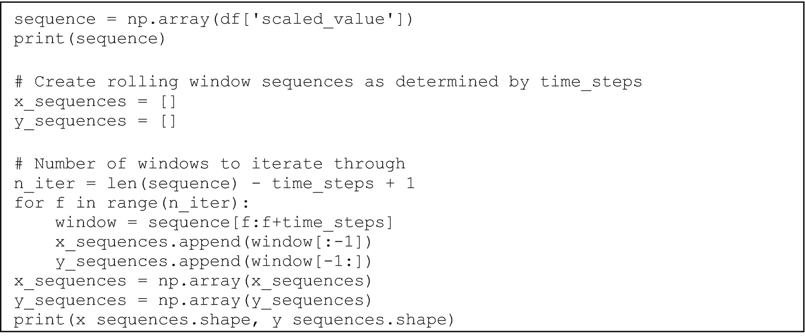

一段代码创建由时间步长确定的滚动窗口序列，并确定要迭代的窗口数量。它打印 x 和 y 序列。

图 8-25

通过滚动窗口创建子序列的代码

你应该看到一些类似以下内容的输出：

```py
[0.27650616 0.20717548 0.1582587  ... 0.69664957 0.6783281  0.67059634]
(10305, 15) (10305, 1)
```

现在，让我们用训练集作为验证数据，训练模型 5 个周期（尽管你可能需要训练更长的时间），图 8-26a 展示了训练模型的代码。

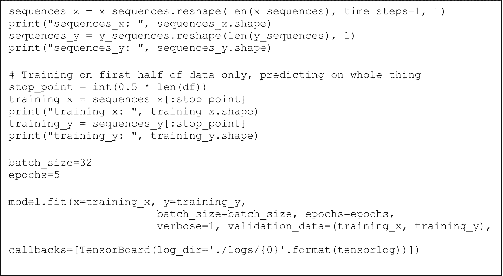

仅对数据集的前一半进行训练的代码，对整个数据集进行预测，打印序列 x 和 y，以及训练 x 和 y。批大小 = 32，周期 = 5。它还指示了停止点和回调。

图 8-26a

训练模型的代码

你会看到一些类似图 8-26b 的训练输出。

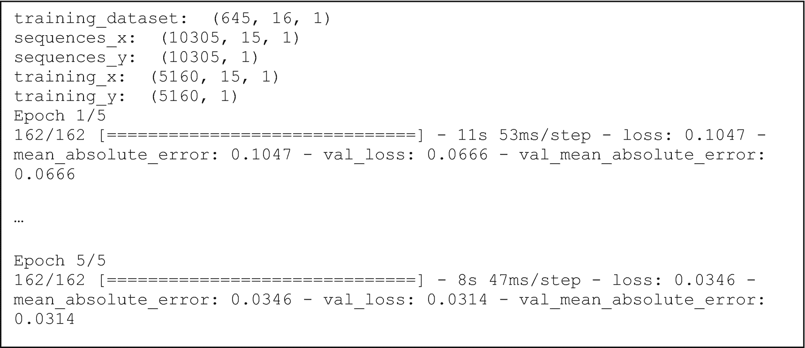

输出窗口显示了训练数据集、序列 x、序列 y、训练 x、训练 y 和平均绝对误差。

图 8-26b

训练输出的一个示例。为了便于显示，省略了大部分输出。

图 8-27 展示了通过训练周期绘制训练过程中的损失。

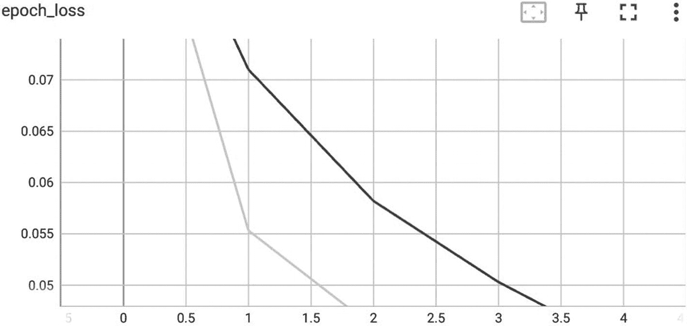

一条带有两条下降线的折线图表示周期损失。实线从 (0.9, 0.074) 下降到 (3.35, 0.048)。隐藏的线从 (0.55, 0.074) 下降到 (1.75, 0.048)。数值是近似的。

图 8-27

TensorBoard 中损失的图表

图 8-28 展示了通过训练周期绘制训练过程中的平均绝对误差。

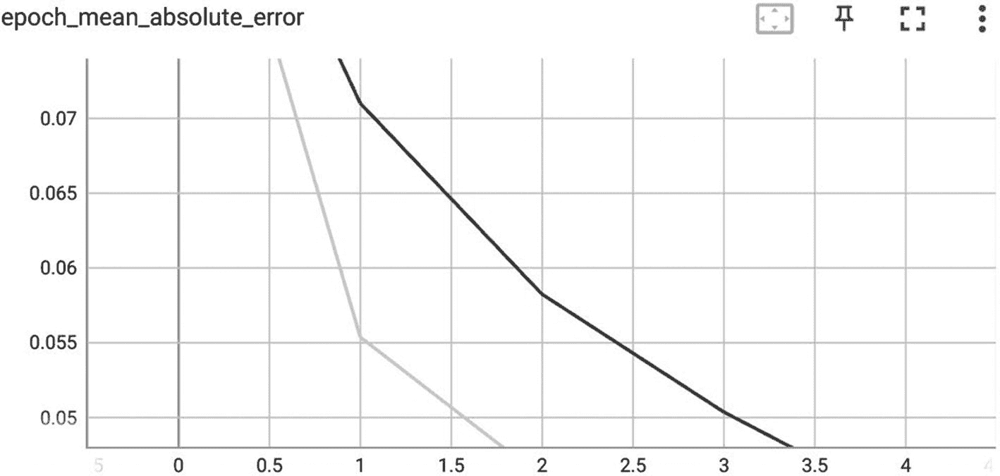

一条带有两条下降线的折线图表示周期平均绝对误差。实线从 (0.9, 0.074) 下降到 (3.35, 0.048)。隐藏的线从 (0.55, 0.074) 下降到 (1.75, 0.048)。数值是近似的。

图 8-28

TensorBoard 中平均绝对误差的图表

图 8-29 显示了通过训练过程中的 epochs 来绘制验证损失的图表。

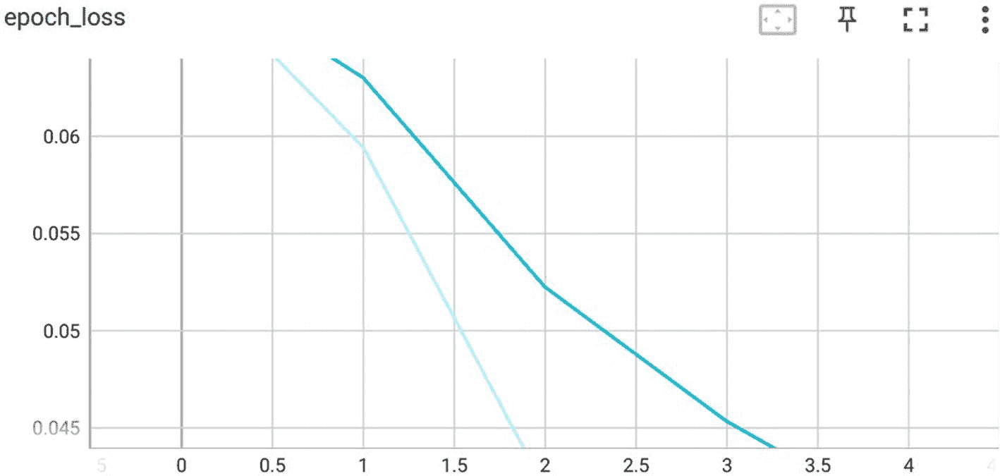

两条下降的线表示的折线图表明了每个 epoch 的损失。实线从（0.8，0.065）下降到（3.25，0.043）。隐藏线从（0.5，0.065）下降到（1.85，0.043）。这些值是近似的。

图 8-29

TensorBoard 中验证损失的图表

图 8-30 显示了通过训练过程中的 epochs 来绘制验证平均绝对误差的图表。

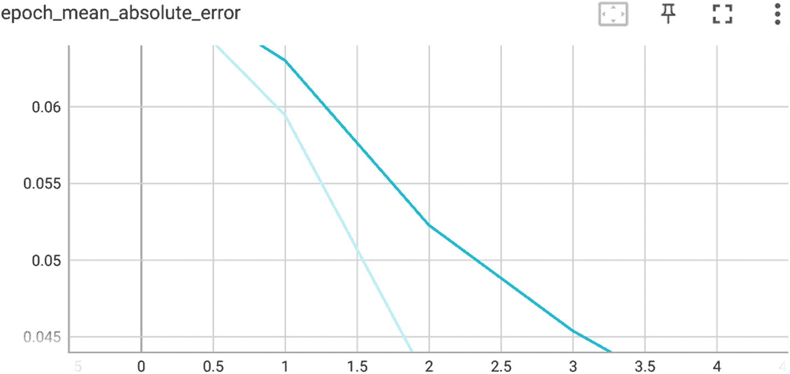

两条下降的线表示的折线图表明了每个 epoch 的平均绝对误差。实线从（0.8，0.065）下降到（3.25，0.043）。隐藏线从（0.5，0.065）下降到（1.85，0.043）。这些值是近似的。

图 8-30

TensorBoard 中验证平均绝对误差的图表

图 8-31 显示了 TensorBoard 可视化的模型图表。

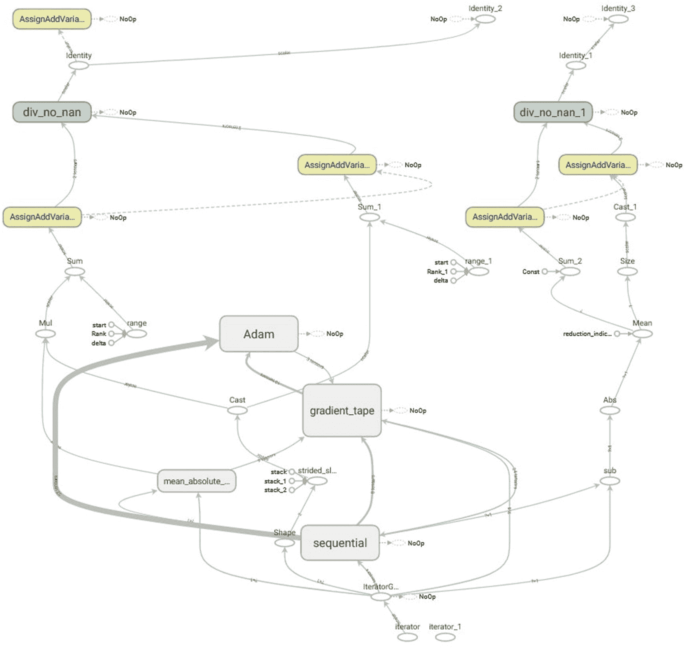

LSTM 模型的流程图包括标记为 assign add variables、Adam、gradient tape、mean absolute error 和 sequential 的块。椭圆形连接器表示开始、排名、delta、stacks、cast、size、sum、mean 和 iterators。

图 8-31

TensorBoard 可视化的模型图表

一旦模型训练完成，您可以对分割成与训练数据集相同长度（`time_steps`）的子序列的测试数据集进行预测。一旦完成，您就可以计算均方根误差（RMSE）。

图 8-32 显示了在测试数据集上进行预测的代码。

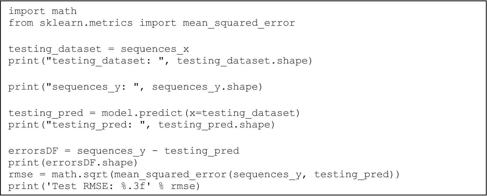

一段代码导入 math 并打印测试数据集、序列 y、测试预测、错误 D F dot shape 和测试 RMSE。

图 8-32

用于在测试数据集上进行预测的代码

您的输出应该类似于以下内容：

```py
testing_dataset:  (10305, 15, 1)
sequences_y:  (10305, 1)
testing_pred:  (10305, 1)
(10305, 1)
Test RMSE: 0.050
```

RMSE 为 0.050，相当低，这从训练阶段 5 个 epoch 后的低损失中也可以明显看出：

```py
loss: 0.0346 - mean_absolute_error: 0.0346 - val_loss: 0.0314 - val_mean_absolute_error: 0.0314
```

现在，您可以使用预测数据集和测试数据集来计算差值，记为 diff，然后将其通过向量范数传递。计算向量的长度或大小通常在机器学习中直接作为正则化方法使用。然后，您可以对分数/差值进行排序，并使用截止值来选择阈值。这显然可以根据您选择的参数而变化，尤其是截止值，如图 8-33 所示，其值为 0.999。该图还显示了计算阈值的代码。

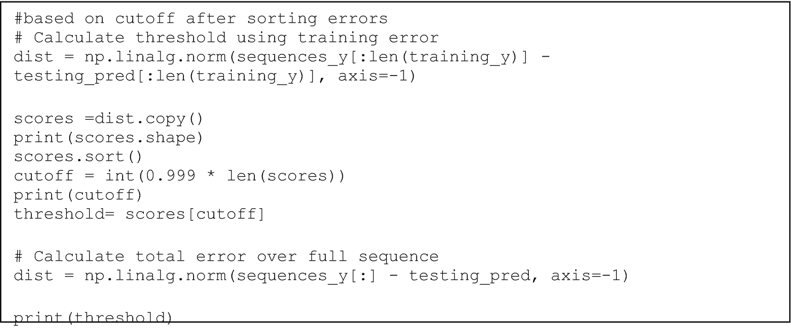

一段代码使用排序后的错误和截止值后的训练错误来计算阈值，并计算整个序列的总错误。

图 8-33

计算阈值的代码

您应该看到如下输出：

```py
(5160,)
5154
0.205043275900064
```

您得到的阈值为 0.205；任何高于此值的都被视为异常。图 8-34a 显示了绘制测试数据集（绿色）和相应的预测数据集（红色）的代码，图 8-34b 显示了生成的图表。

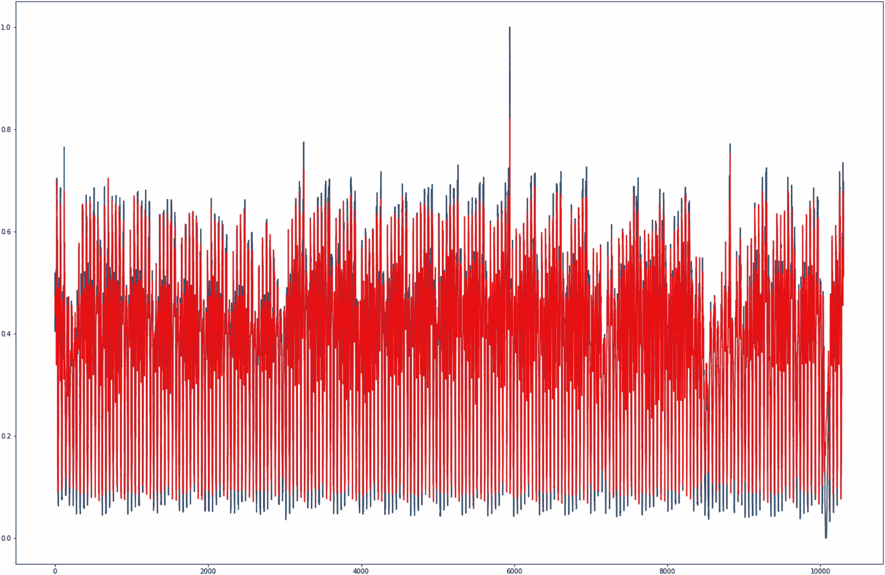

图形具有密集的波动波形，在最高和最低峰值处有三个不同的图表。大约的最高值是（6000，1）。

图 8-34b

绘制训练、测试和预测数据集

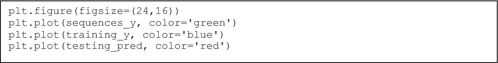

代码绘制了一个包含序列 y（绿色）、训练 y（蓝色）和测试预测（红色）的图表。

图 8-34a

代码用于绘制模型从中学到的训练序列（蓝色），包括测试数据的总序列（绿色），以及预测值（红色）

图 8-35 显示了将数据点分类为异常或正常的代码。

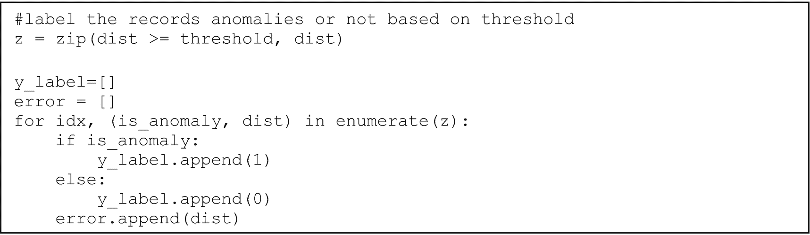

代码根据阈值将记录标记为异常或不异常。它表示 y 标签和误差函数。它用 1 表示异常，用 0 表示无异常。

图 8-35

代码用于将数据点分类为异常或正常

图 8-36a 显示了根据阈值绘制数据点的代码，图 8-36b 显示了生成的图表。

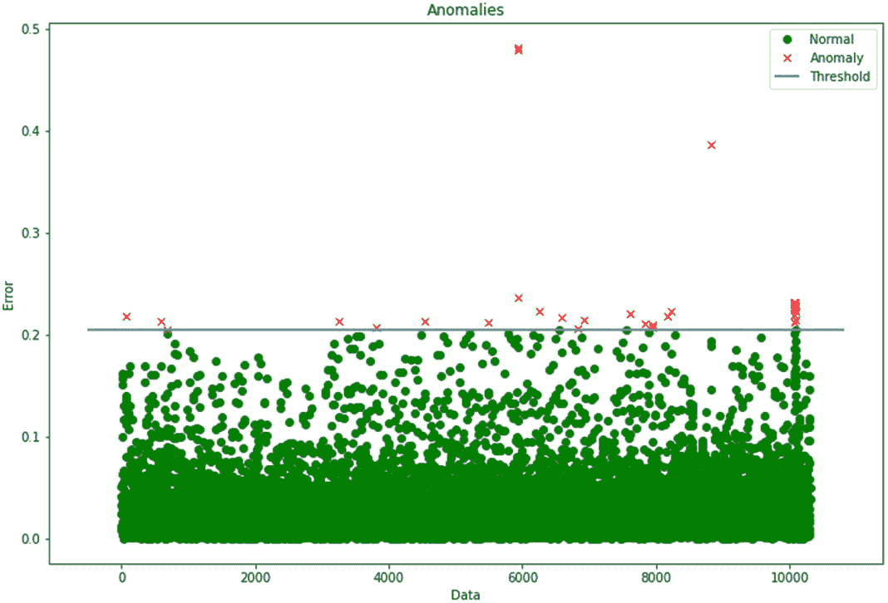

错误与数据的散点图具有密集的圆形图，标记为正常，在底部和一条标记阈值为 0.2 的水平线。高于阈值的交叉图表示异常。

图 8-36b

根据阈值绘制数据点的图表

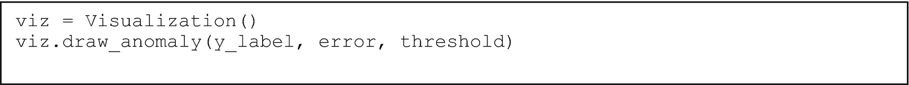

代码表示用于绘制具有 y 标签、误差和阈值的异常可视化的代码。

图 8-36a

代码用于根据阈值绘制数据点

图 8-37 显示了将异常标记附加到数据帧的代码。

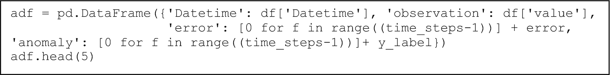

代码表示包含日期时间、观测、误差和异常的数据帧。

图 8-37

代码用于将异常标记附加到数据帧。由于模型必须使用第一个窗口来实际开始预测，我们不能使用前`time_steps–1`个数据点，因此我们需要填充数据帧的误差和异常部分

您的 dataframe 输出应类似于表 8-2。由于我们如何填充它，前`time_steps-1`行错误为 0。

表 8-2

带有异常标记的数据帧

|   | Datetime | observation | error | anomaly |
| --- | --- | --- | --- | --- |
| **0** | 2014-07-01 00:00:00 | 10844 | 0.0 | 0 |
| **1** | 2014-07-01 00:30:00 | 8127 | 0.0 | 0 |
| **2** | 2014-07-01 01:00:00 | 6210 | 0.0 | 0 |
| **3** | 2014-07-01 01:30:00 | 4656 | 0.0 | 0 |
| **4** | 2014-07-01 02:00:00 | 3820 | 0.0 | 0 |

图 8-38a 显示了生成显示异常的图形的代码。

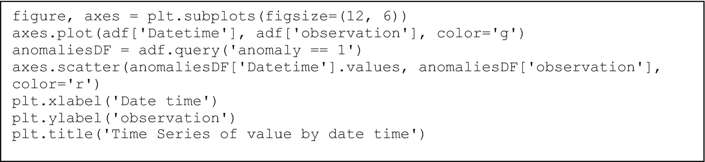

代码创建了一个观察值与日期时间相关的散点图，标题为“按日期时间的时间序列值”。

图 8-38a

绘制异常的代码

在图 8-38b 中显示的图形中，你可以在感恩节前后、除夕前后以及一月份可能的大雪天气中找到异常。

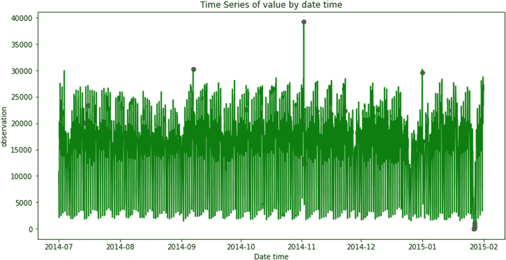

观察值与日期时间的图形表示了值的时序。它具有密集的波动波形，在最高和最低峰值处有几个点。这些点包括 2014 年 9 月的 30000 个点，2014 年 11 月的 40000 个点，2015 年 1 月的 30000 个点，以及 2015 年 2 月的 0 个点。数据是估计的。

图 8-38b

显示异常的图形。你的图形可能不会完全匹配，但你应该看到红色点，这些点表示时间序列似乎偏离了正常模式。

如果你调整了一些参数，例如时间步数、阈值截止值、神经网络的周期、批量大小和隐藏层，你会看到不同的结果。

提高检测的一种好方法是整理好的正常数据，使用已识别的异常，并将其混合在一起，以便调整参数直到在已识别的异常上获得良好的匹配。

## 时间序列示例

在本节中展示的所有示例中，我们使用相同的笔记本，但通过使用“i=0”参数来切换加载数据集。所有超参数都保持不变，尽管你可以自由实验。对于每个数据集，我们将构建一个 LSTM 模型并检查是否存在异常。

### art_daily_no_noise.csv

此数据集没有噪声或异常，是一个正常的时间序列数据集。如图 8-39 所示，时间序列在不同的时间戳上有值。

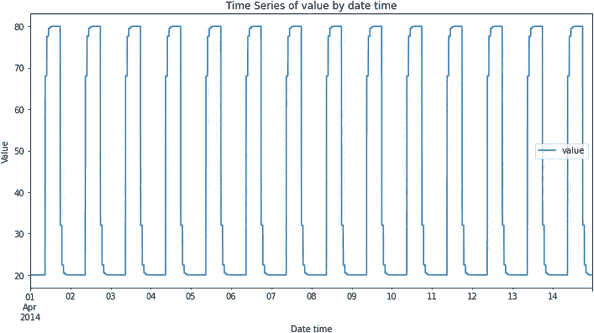

值与日期时间的线图显示了从 2014 年 4 月 1 日到 14 日的值的时间序列，具有均匀的波动波形。波形在 20 到 80 之间延伸。

图 8-39

显示时间序列的图形

在加载此数据集时选择`i=0`。

使用可视化类，你可以绘制新的时间序列。如图 8-40 所示，时间序列显示了日期时间与值列之间的关系。

使用相同的参数，该模型应该很好地拟合此数据集。你可以自由调整超参数以获得更好的拟合模型。

按照第“LSTM 用于异常检测”部分（或使用自定义调整的超参数和模型架构）中的代码运行，但加载此数据集以运行异常检测。图 8-40 显示了运行完整训练脚本后的异常。

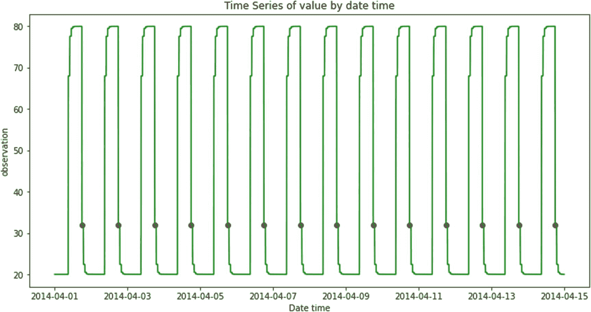

值与日期时间的折线图表示了从 2014 年 4 月 1 日到 15 日的值的时间序列，具有均匀的波动波形。波的幅度在 20 到 80 之间。它还包括在约 32 的下降边缘的圆形图。

图 8-40

显示异常的图表

通常，这个数据集中不应该有任何异常值。你在图 8-40 中看到的红色“异常值”是我们计算异常值的方式的结果。由于我们找到了 0.999 的分数并将其设置为正常点的最大阈值，因此自然会有 0.001%的数据被定义为异常值。从某种意义上说，我们正在迫使这些红色异常值成为异常值。

### art_daily_nojump.csv

这个数据集没有噪声或异常值，是一个正常的时间序列数据集。正如你在图 8-41 中看到的那样，时间序列在不同的时间戳上有值。

使用可视化，你现在可以绘制时间序列图。为此工作，你需要将时间戳转换为日期时间，并删除时间戳列。如下所示，时间序列显示了日期时间与值列的关系。

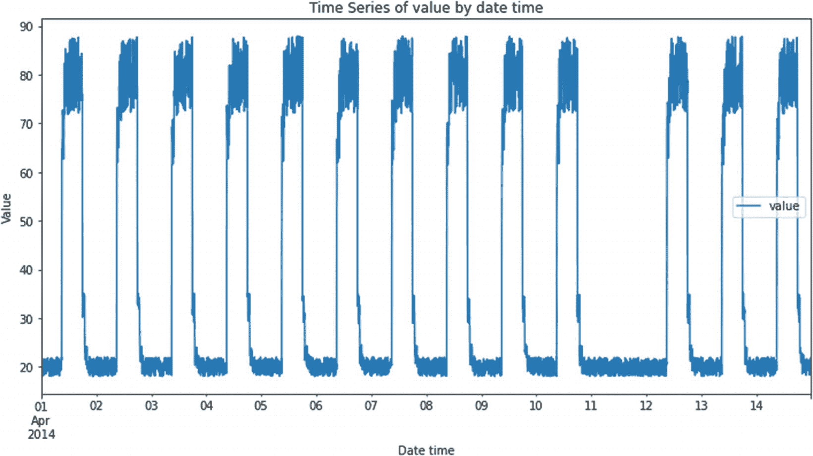

值与日期时间的折线图表示了从 2014 年 4 月 1 日到 14 日的值的时间序列，具有均匀的波动波形。波的幅度在 20 到 85 之间。波峰和波谷处的波密集。

图 8-41

显示时间序列的图表

让我们在原始数据框中添加异常列并准备一个新的数据框。使用可视化，你现在可以绘制新的时间序列图。如下所示，时间序列显示了日期时间与值列的关系。图 8-42 显示了生成的显示预测异常的图表。

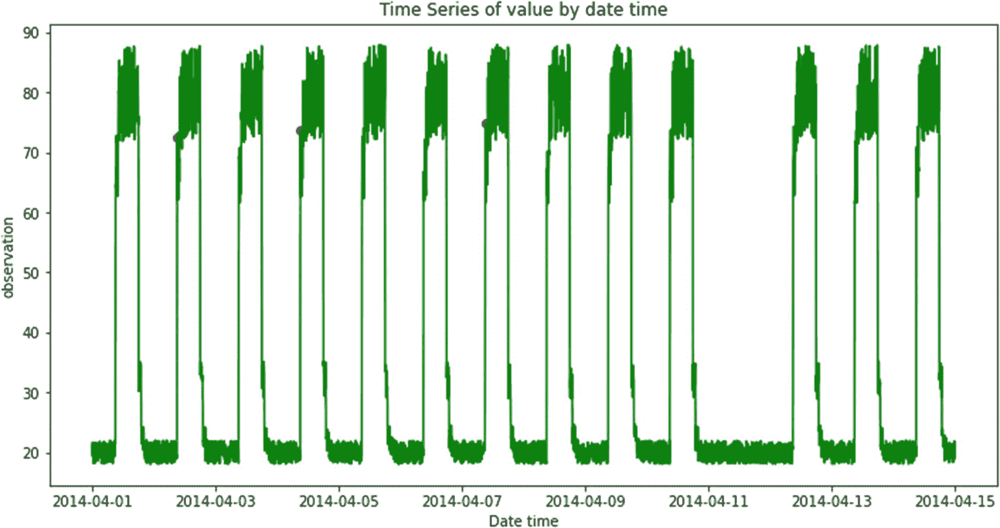

值与日期时间的折线图表示了从 2014 年 4 月 1 日到 15 日的值的时间序列，具有均匀的波动波形。波的幅度在 20 到 85 之间。波峰和波谷处的波密集。

图 8-42

显示异常的图表

由于这个数据集没有噪声或异常值，是一个正常的时间序列数据集，因此没有真正的异常值。以下是对红色数据点的解释。你也会发现模型拟合得相当好，因为预测与实际数据非常吻合。

你会注意到在图 8-42 中显示了红色点。与前面的例子一样，这是由于阈值处理的结果，它假设最高的重建误差很可能是异常值。如果数据集是正常的，那么它将被迫选择这些最高点作为异常值，即使它们并不是。

### art_daily_jumpsdown.csv

这个数据集包含正常数据和异常值的混合。正如你在图 8-43 中看到的那样，时间序列在不同的时间戳上有值。

使用可视化，你现在可以绘制时间序列。为此工作，你需要将时间戳转换为日期时间，并删除时间戳列。如下所示，时间序列显示了日期时间与值列的关系。

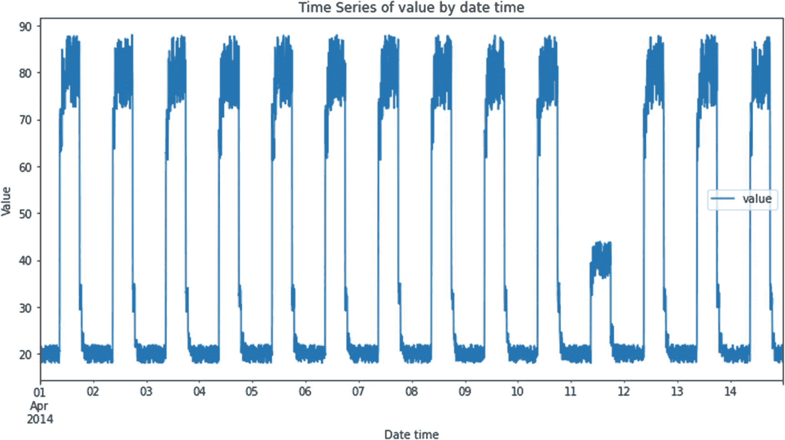

值与日期时间的折线图显示了从 2014 年 4 月 1 日到 14 日的值的时间序列，波形波动。波的幅度在 20 到 85 之间。波峰和波谷处的波密集。振幅均匀，除了（11.5，40）。

图 8-43

展示时间序列的图表

让我们在原始数据框中添加异常列并准备一个新的数据框。使用可视化，你现在可以绘制新的时间序列。如下所示，时间序列显示了日期时间与值列的关系。正常数据点以绿色显示，异常点以红色显示。图 8-44a 显示了生成的表示异常的图表。

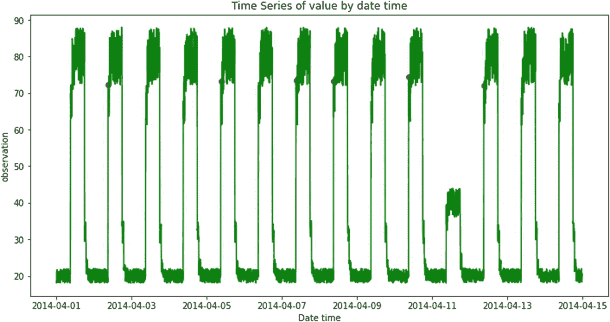

值与日期时间的折线图显示了从 2014 年 4 月 1 日到 15 日的值的时间序列，波形波动。波的幅度在 20 到 85 之间。波峰和波谷处的波密集。振幅均匀，除了（11.5，40）。

图 8-44a

展示检测到的异常的图表

这里的异常应该是 4 月 11 日之后不久发生的尖峰，因为它没有像其他尖峰那样强烈地触发。然而，根据模型当前的预测方式（给定过去 15 个时间步，预测第 16 个时间步），它似乎没有达到足够高的预测误差，以注册为前 0.1%的错误。

观察预测结果，如图 8-44b 所示，我们可以看到网络显然未能预测出这个特定异常尖峰的正确值。

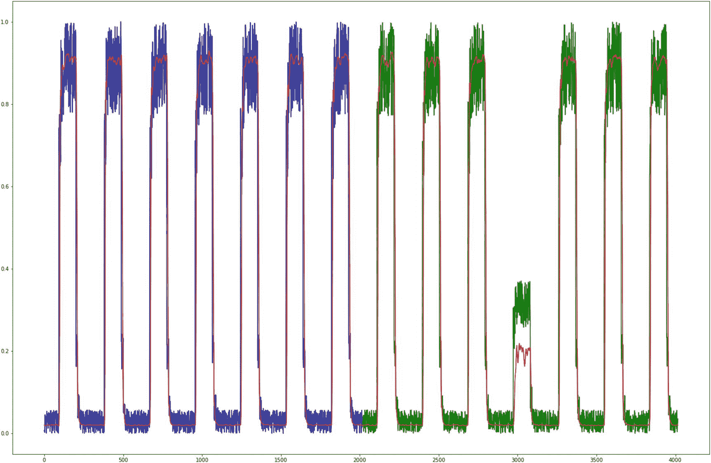

值与日期时间的折线图显示了从 2014 年 4 月 1 日到 14 日的值的时间序列，波形波动和重叠的波。波的幅度在 0 到 1 之间。波峰和波谷处的波密集。振幅均匀，除了（3000，0.35）。

图 8-44b

模型的训练数据（蓝色）、总序列（绿色）和预测序列（红色）。对于尖峰的预测并不好，因此我们应该预期这里的错误率比平常要高

观察图 8-44b，我们预计会看到比平常更高的预测误差。然而，查看每个点的实际预测误差（图 8-44c），我们可以看到，对于这个异常尖峰，确实存在比平常更高的重建损失。然而，由于网络保守的预测，存在大量的噪声，因为它似乎不是建模单个尖峰，而是尖峰的一般趋势。

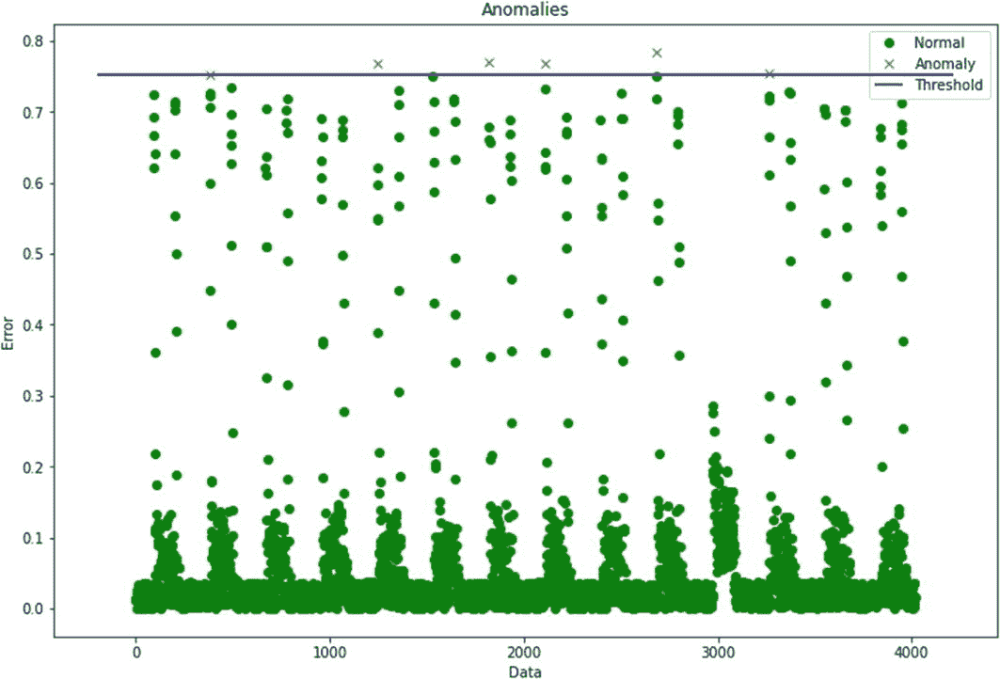

错误与数据散点图由标记为正常的圆形图组成，这些图在底部密集，并在大约 0.75 处有一个标记为阈值的水平线。高于阈值的交叉图表示异常。

图 8-44c

绘制预测误差以及阈值。异常尖峰的误差可以在 x 轴的 3000 刻度处找到。虽然误差高于正常值，但噪声太多，误差太大，导致它们被识别为异常。

您可以尝试几种不同的策略来尝试减轻损失，如下所示（以及其他策略）：

+   增加训练轮数

+   增加时间步数

+   通过增加神经元或更多层来增加模型容量

这些策略也可以相互结合使用，以产生更强大的 LSTM 网络。假设我们可以正确地拟合模型，我们可以期望看到异常尖峰本身成为前 0.01%的重建误差。

### art_daily_perfect_square_wave.csv

此数据集没有噪声或异常，是一个正常的时间序列数据集。如图 8-45 所示，时间序列在不同的时间戳上有值。使用可视化，你现在可以绘制时间序列。为此工作，您将转换时间戳为日期时间，并删除时间戳列。如下所示，时间序列显示了日期时间与值列。

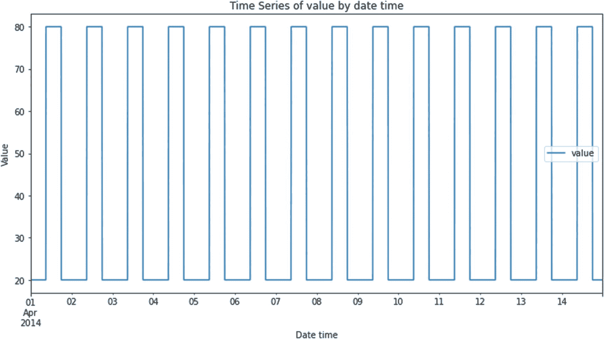

值与日期时间的线图表示从 2014 年 4 月 1 日到 14 日的值的时间序列，具有均匀的矩形波形。它介于 20 到 80 之间。在谷底处的脉冲宽度大于在峰值处。

图 8-45

展示时间序列的图表

让我们将异常列添加到原始数据框中，并准备一个新的数据框。使用可视化，你现在可以绘制新的时间序列。如下所示，时间序列显示了日期时间与值列。图 8-46 显示了异常。

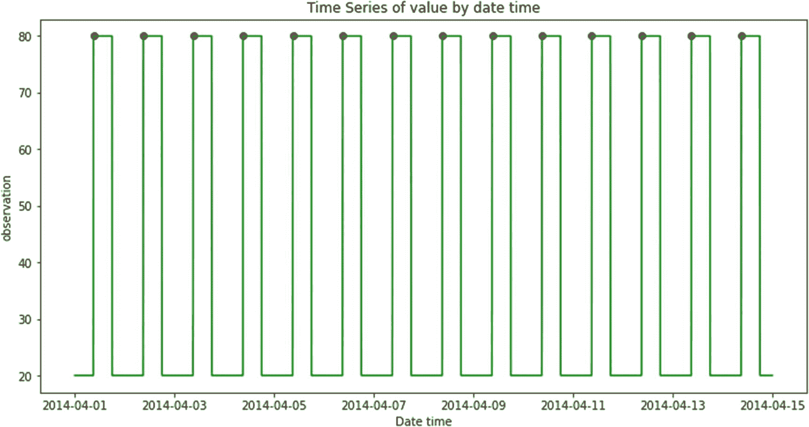

观察值与日期时间的线图表示从 2014 年 4 月 1 日到 15 日的值的时间序列，具有均匀的矩形波形。它介于 20 到 80 之间。在谷底处的脉冲宽度大于在峰值处。在上升边缘的圆形图在 80 处。

图 8-46

展示异常的图表

再次强调，由于不完美拟合导致的重建误差，即使拟合很强，我们也会看到由于阈值化而产生的标记异常。

### art_load_balancer_spikes.csv

此数据集包含正常数据和异常的混合。如图 8-47 所示，时间序列在不同的时间戳上有值。使用可视化，你现在可以绘制时间序列。为此工作，您将转换时间戳为日期时间，并删除时间戳列。如下所示，时间序列显示了日期时间与值列。

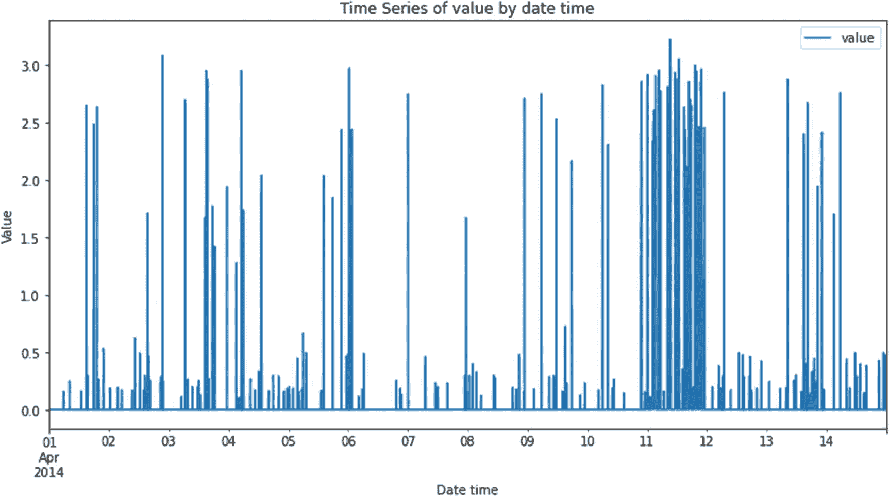

值与日期时间的线图具有沿垂直线峰值的波动波形。大约最高值是 (11.5, 3.25)。

图 8-47

展示时间序列的图表

让我们将异常列添加到原始数据框中，并准备一个新的数据框。使用可视化，你现在可以绘制新的时间序列图。如下所示，时间序列显示了日期时间与值列的关系。正常数据点以绿色显示，异常值以红色显示。图 8-48 展示了异常值。

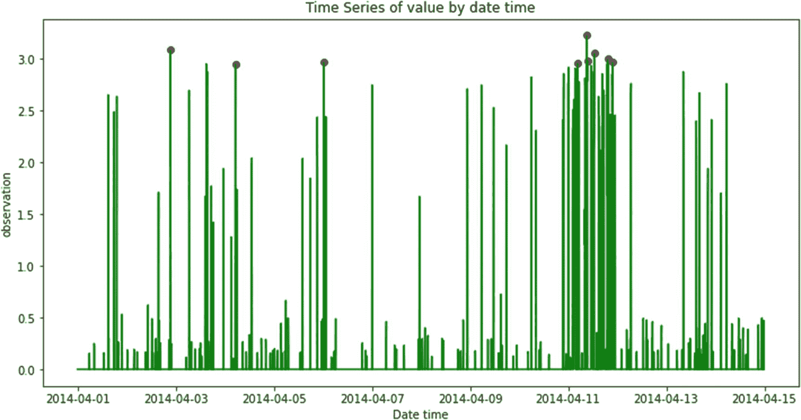

观察值与日期时间的线图具有沿垂直线的波动波形。大约最高值是 (11.5, 3.25)。九个图表位于垂直线的峰值处。

图 8-48

展示异常的图表

由于这个数据集存在一些噪声或异常值，存在异常值，请参见以下对红色显示的数据点的解释，而其他所有正常的数据点都是绿色的。

### ambient_temperature_system_failure.csv

此数据集包含正常数据和异常值的混合。如图 8-49 所示，时间序列在不同的时间戳处有值。使用可视化，你现在可以绘制时间序列图。为此工作，您将转换时间戳为日期时间，并删除时间戳列。如下所示，时间序列显示了日期时间与值列的关系。

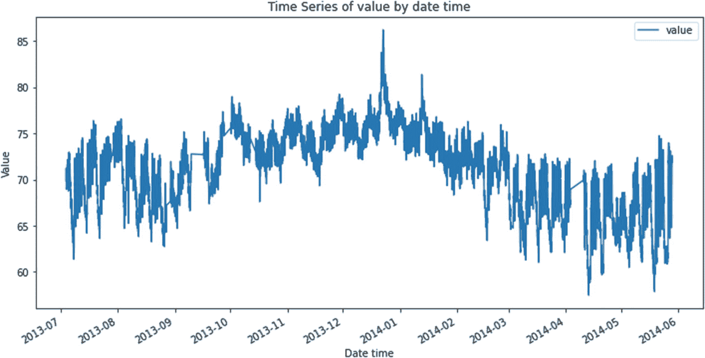

值与日期时间的线图表示具有密集波动波形的时间序列，两端低，中心高。最高值大约在 2013 年 12 月至 2014 年 1 月之间为 87。

图 8-49

展示时间序列的图表

让我们将异常列添加到原始数据框中，并准备一个新的数据框。使用可视化，你现在可以绘制新的时间序列图。如下所示，时间序列显示了日期时间与值列的关系。正常数据点以绿色显示，异常值以红色显示。图 8-50 展示了异常值。

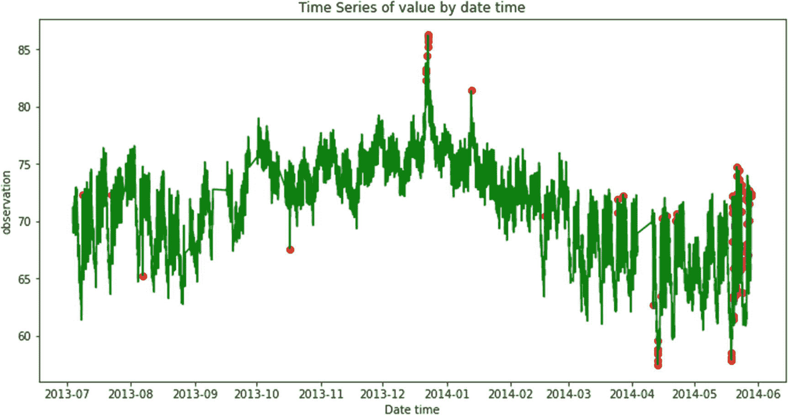

观察值与日期时间的线图表示具有密集波动波形的时间序列，两端低，中心高。最高值大约在 2013 年 12 月至 2014 年 1 月之间为 87。一些图表位于峰值的高点和低点。

图 8-50

展示异常的图表

由于这个数据集存在一些噪声或异常值，存在异常值，请参见以下对红色显示的数据点的解释，而其他所有正常的数据点都是绿色的。

### ec2_cpu_utilization.csv

这个数据集包含正常数据和异常值的混合。如图 8-51 所示，时间序列在不同的时间戳上有值。使用可视化，你现在可以绘制时间序列。你将为此工作将时间戳转换为日期时间，并删除时间戳列。如下所示，时间序列显示了日期时间与值列的关系。

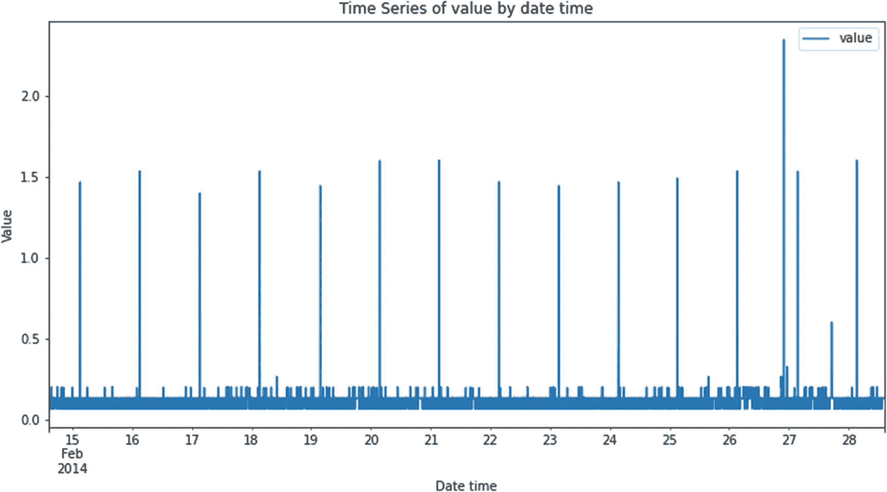

值与日期时间的线图表示了从 2014 年 2 月 15 日到 28 日的值的时间序列。在固定间隔内，峰值非常高。大约的最高值是(27, 2.4)。

图 8-51

展示时间序列的图表

让我们将异常列添加到原始数据框中，并准备一个新的数据框。使用可视化，你现在可以绘制新的时间序列。如下所示，时间序列显示了日期时间与值列的关系。正常数据点以绿色显示，异常值以红色显示。图 8-52 显示了异常值。

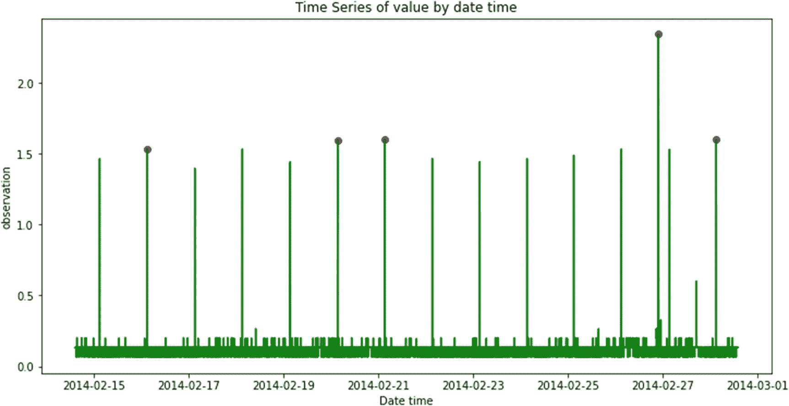

观察值与日期时间的线图表示了从 2014 年 2 月 15 日到 3 月 1 日的值的时间序列。在固定间隔内，峰值非常高。大约的最高值是(27, 2.4)。五个图在垂直线的峰值处。

图 8-52

展示异常值的图表

由于这个数据集存在一些噪声或异常值，可以看到以下对红色显示的数据点的解释，而其他所有正常的数据都是绿色的。

### rds_cpu_utilization.csv

这个数据集包含正常数据和异常值的混合。如图 8-53 所示，时间序列在不同的时间戳上有值。使用可视化，你现在可以绘制时间序列。你将为此工作将时间戳转换为日期时间，并删除时间戳列。如下所示，时间序列显示了日期时间与值列的关系。

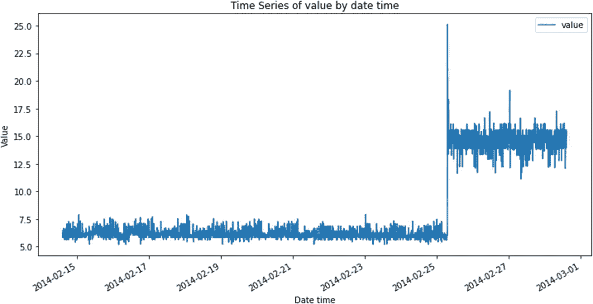

值与日期时间的线图表示了从 2014 年 2 月 15 日到 3 月 1 日的值的时间序列。它有一个密集的波动波形，直到 2014 年 2 月 25 日保持稳定，然后急剧增加到 25，下降到 15，并一直保持稳定到结束。

图 8-53

展示时间序列的图表

让我们将异常列添加到原始数据框中，并准备一个新的数据框。使用可视化，你现在可以绘制新的时间序列。如下所示，时间序列显示了日期时间与值列的关系。正常数据点以绿色显示，异常值以红色显示。图 8-54 展示了显示异常值的图表。

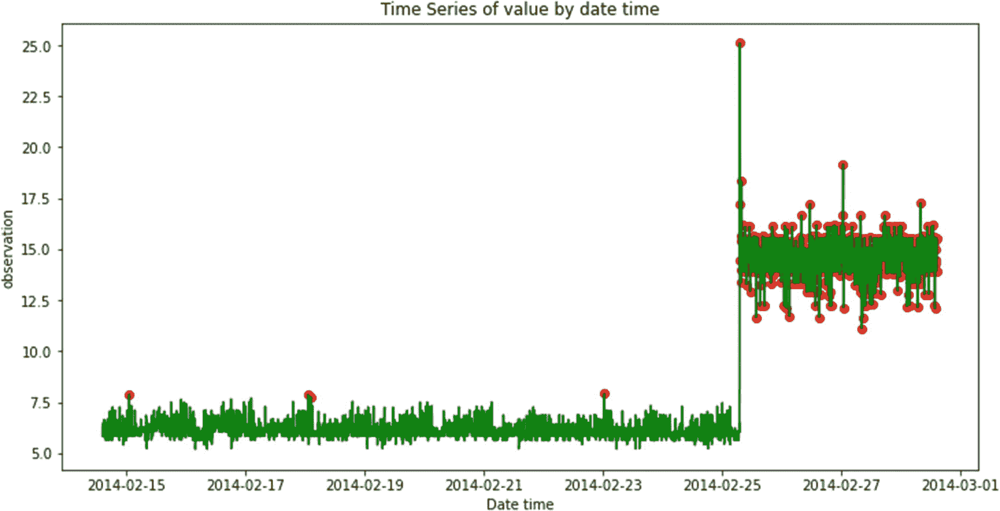

观测值与日期时间的图表表示了从 2014 年 2 月 15 日到 3 月 1 日的值的时间序列。它有一个密集的波动波形，直到 2014 年 2 月 25 日保持稳定，然后急剧增加到 25，下降到 15，并保持稳定到结束。一些图表位于波峰和波谷。

图 8-54

展示异常的图表

由于这个数据集有一些噪声或异常，存在异常，请参见以下对红色数据点的解释，以及所有其他正常的数据点都是绿色的。

## 摘要

在本章中，我们讨论了循环神经网络和长短期记忆模型。我们还探讨了将 LSTM 作为检测异常的手段。我们还通过几个不同异常的时间序列数据示例，展示了如何开始检测异常。在第九章中，我们将探讨使用时间卷积网络进行时间序列异常检测的另一种方法。
