# 9. 时间卷积网络

在本章中，你将了解时间卷积网络（TCNs）。你将学习 TCNs 是如何工作的，如何使用它们来检测异常，以及如何使用 TCN 实现异常检测。

简而言之，本章涵盖了以下主题：

+   什么是时间卷积网络？

+   扩展时间卷积网络

+   编码器-解码器时间卷积网络

+   TCN 应用

注意

代码示例提供的是 Python 3.8。本书的代码仓库可在[`github.com/apress/beginning-anomaly-detection-python-deep-learning-2e/tree/master`](https://github.com/apress/beginning-anomaly-detection-python-deep-learning-2e/tree/master)找到。

仓库还包括一个 requirements.txt 文件，用于检查你的包及其版本。

本章的两个笔记本如下：

+   **扩展 TCN**: [`github.com/apress/beginning-anomaly-detection-python-deep-learning-2e/blob/master/Chapter%209%20Temporal%20Convolutional%20Networks/chapter9_tcn.ipynb`](https://github.com/apress/beginning-anomaly-detection-python-deep-learning-2e/blob/master/Chapter%209%20Temporal%20Convolutional%20Networks/chapter9_tcn.ipynb)

+   **ED-TCN**: [`github.com/apress/beginning-anomaly-detection-python-deep-learning-2e/blob/master/Chapter%209%20Temporal%20Convolutional%20Networks/chapter9_ed_tcn.ipynb`](https://github.com/apress/beginning-anomaly-detection-python-deep-learning-2e/blob/master/Chapter%209%20Temporal%20Convolutional%20Networks/chapter9_ed_tcn.ipynb)

导航到“第九章 时间卷积网络”，然后点击笔记本。代码也以.py 文件的形式提供，尽管它是笔记本的导出版本。

我们将使用 JupyterLab 来展示所有的代码示例。

## 什么是时间卷积网络？

时间卷积网络是一组包含一维卷积层的架构。更具体地说，这些卷积是**因果的**，这意味着未来信息不会泄露到过去。换句话说，模型只处理时间向前流动的信息。在语言翻译的背景下，循环神经网络（在第八章中介绍）的一个问题是它们按时间顺序从左到右读取句子，这导致在某些情况下，句子的顺序被改变以创造强调，从而产生误译。为了解决这个问题，RNNs 使用双向编码器，但这意味着未来信息被考虑在当前。TCNs 没有这个问题，因为与 RNNs 不同，它们不依赖于先前时间步的信息，这得益于它们的因果性。此外，TCNs 可以将任何长度的输入序列映射到相同长度的输出序列，就像 RNNs 可以做到的那样。

基本上，TCNs 似乎是对 RNNs 的一个很好的替代品。具体来说，TCNs 的优势在于，特别是考虑到 RNNs 的一般情况：

+   **并行计算**：卷积网络与 GPU 训练配合良好，尤其是由于卷积层的矩阵密集计算非常适合 GPU 的结构，GPU 被配置为执行图形处理中的一部分矩阵计算。因此，TCNs 的训练速度可以比 RNNs 快得多。

+   **灵活性**：TCNs 可以通过改变输入大小、改变滤波器大小、增加膨胀因子、堆叠更多层等，轻松应用于各种领域。

+   **一致的梯度**：由于 TCNs 由卷积层组成，它们的反向传播方式与 RNNs 不同，因此所有梯度都被保存。RNNs 有一个称为“梯度爆炸”或“梯度消失”的问题，有时计算出的梯度要么非常大，要么非常小，导致调整后的权重要么变化过于极端，要么相对不存在。为了解决这个问题，开发了诸如 LSTM、GRU 和 HF-RNN 等类型的 RNN。

+   **减轻记忆负担**：LSTMs 将信息存储在其细胞门中，因此如果输入序列很长，LSTM 网络将使用更多的内存。相比之下，TCNs 相对简单，因为它们由几个层组成，每个层都有自己的相应滤波器。与 LSTMs 相比，TCNs 在训练过程中的内存使用上运行起来要轻得多。

然而，TCNs 确实有一些缺点：

+   **评估模式下的内存使用**：RNNs 只需要知道一些输入 x[t]来生成预测，因为它们通过其隐藏状态向量维护了它们所学到的一切的摘要。相比之下，TCNs 需要从当前点再次获取整个序列来做出评估，这可能导致在预测时比 RNNs 使用更多的内存。

+   **迁移学习的问题**：**迁移学习**是指一个模型已经针对一个特定任务（例如，分类车辆）进行了训练，并且最后几层被取出并完全重新训练，以便模型可以用于新的分类任务（例如，分类动物）。

转移学习的概念非常强大且有用。在计算机视觉中，有一些非常强大的模型，例如 ResNet152 模型，这些模型已经在强大的 GPU 上训练了一段时间，以实现它们的性能。我们不必从头开始训练自己的 CNN（而且我们大多数人没有 GPU 硬件或时间花费那么长时间训练像 ResNet152 这样极其深层的模型），我们可以简单地取 ResNet152，例如，它非常擅长从图像中提取特征，并训练它将提取的特征与一组全新的类别相关联。这个过程花费的时间要少得多，因为整个网络的权重已经非常优化，所以我们只关心找到我们正在重新训练的层的最佳权重。

正是因为迁移学习是一个如此有价值的流程；它允许我们使用预训练的、高性能的模型，并简单地用我们的硬件重新训练最后一层（或几层），并教会模型一个新的分类任务（对于 CNN）。

回到 TCN，模型可能需要记住不同级别的序列历史来做出预测。如果旧模型需要一些任意长度的历史来做出预测，但在新任务中，它突然需要显著不同长度的历史来做出预测，这可能会引起问题并导致性能不佳。迁移学习不再有意义 - 你将不得不重新训练整个网络，因为在这个新任务上表现良好的唯一方法是具有不同的历史长度作为输入。相比之下，图像要稳定得多，通常总是固定长度，而一维序列则不然。

在一维卷积层中，我们仍然有一个参数 **k** 来确定我们的内核或滤波器的大小。

作为一维卷积操作的一个例子，假设我们有一个如图 9-1 所示的输入向量和一个如图 9-2 所示的初始化滤波器。

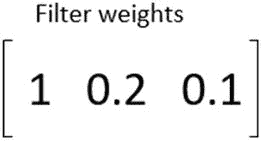

用于滤波器权重的输入向量读取如下。左方括号 1 0.2 0.1 右方括号。

图 9-2

与此一维卷积层相关的滤波器权重

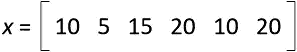

X 等于左方括号 10 5 15 20 10 20 右方括号。

图 9-1

使用对应值的输入向量 x 定义

卷积层的输出计算如图 9-3、图 9-4、图 9-5 和图 9-6 所示。

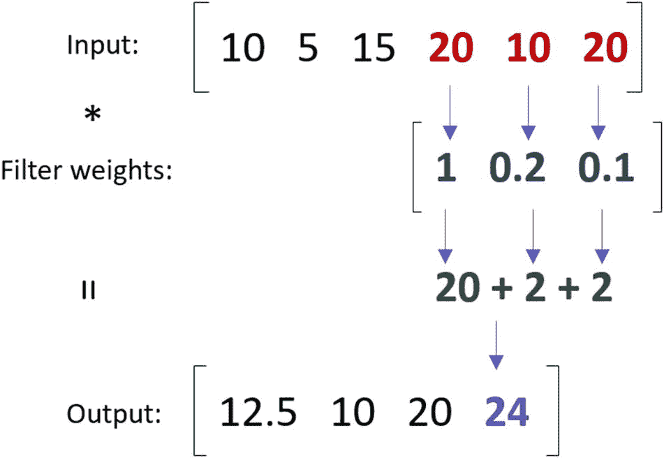

滤波器权重的输入和输出向量的示意图。输入包括 10、5、15、20、10 和 20 的值。滤波器权重包括 1、0.2 和 0.1。过滤后的总和包括 20 加 2 加 2。输出包括 12.5、10、20 和 24。

图 9-6

使用滤波器权重计算输出向量最后一个元素的方法

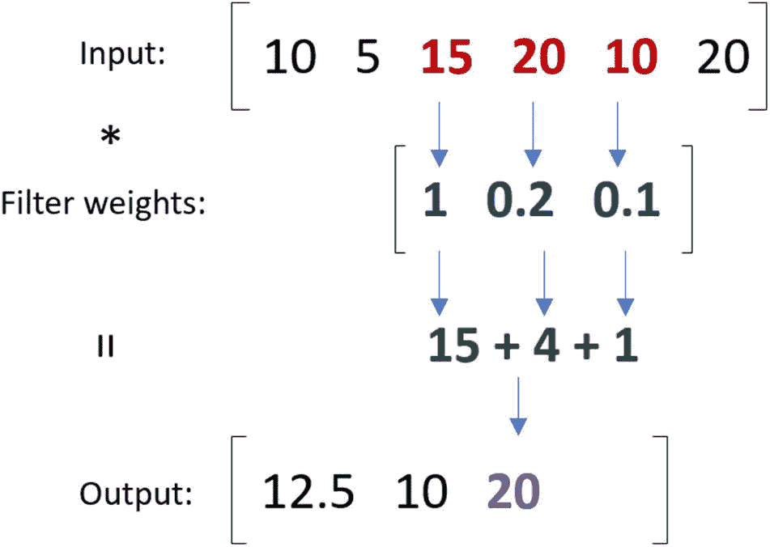

滤波器权重的输入和输出向量的示意图。输入包括 10、5、15、20、10 和 20 的值。滤波器权重包括 1、0.2 和 0.1。过滤后的总和包括 15 加 4 加 1。输出包括 12.5、10 和 20。

图 9-5

使用滤波器权重计算输出向量第三个元素的方法

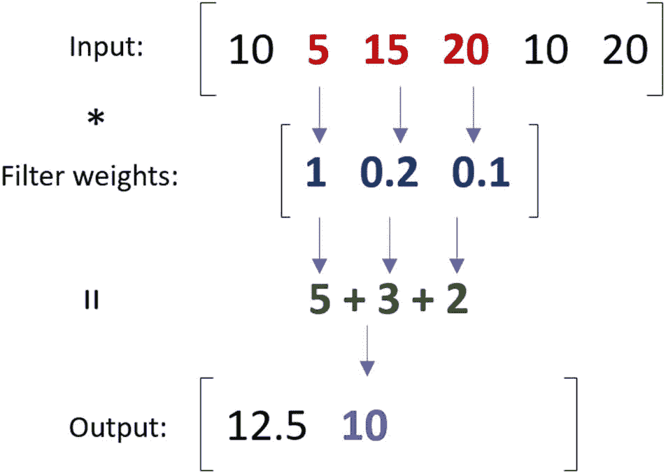

滤波器权重的输入和输出向量的示意图。输入包括 10、5、15、20、10 和 20 的值。滤波器权重包括 1、0.2 和 0.1。过滤后的总和包括 5 加 3 加 2。输出包括 12.5 和 10。

图 9-4

使用滤波器权重计算输出向量的第二个条目的方法。该过程与图 9-3 中的相同，但滤波器权重向右移动了一个位置。

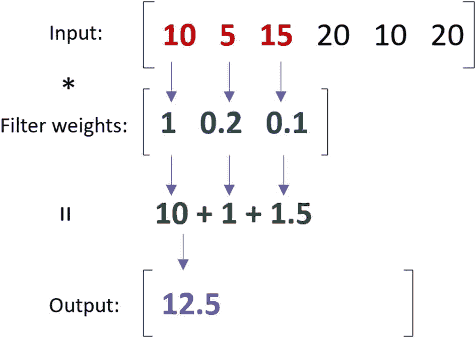

滤波器权重的输入和输出向量的示意图。输入包括 10、5、15、20、10 和 20 的值。滤波器权重包括 1、0.2 和 0.1。过滤后的总和值包括 10 加上 1 加上 1.5。输出包括 12.5。

图 9-3

使用滤波器权重计算输出向量的第一个条目的方法。滤波器权重与输入的前三个条目逐元素相乘，然后将结果相加以产生输出值。

现在，我们有一维卷积层的输出。这些一维卷积层与二维卷积层的工作方式非常相似，并且构成了我们将要查看的两个不同 TCN 的几乎全部：**膨胀时间卷积网络**和**编码器-解码器时间卷积网络**。重要的是要注意，这两个模型都涉及**监督异常检测**，尽管编码器-解码器 TCN 能够进行半监督异常检测，因为它是一个自编码器。

## 膨胀时间卷积网络

在这种类型的 TCN 中，我们处理一种称为**膨胀**的新属性。基本上，当膨胀因子大于 1 时，我们在输出数据中引入与膨胀因子相对应的间隔。为了更好地理解膨胀的概念，让我们看看它对于一个**二维卷积层**是如何工作的。

这是一个标准卷积，与我们第三章中看到的是等效的。你也可以将标准卷积层视为具有**膨胀因子**为 1（参见图 9-7）。

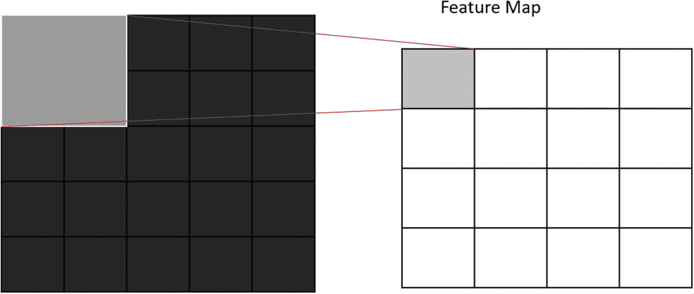

在左侧，有一个 5x5 的网格，1 列和 2 列以及 1 行和 2 行的部分被突出显示。在右侧是相应的 4x4 布局的特征图。右侧 1 列 1 行的突出显示框是左侧突出显示框的示意图。

图 9-7

膨胀因子为 1 的标准卷积

现在，让我们看看当我们将膨胀因子增加到 2 时会发生什么。

对于特征图中的第一个条目，卷积看起来像图 9-8。

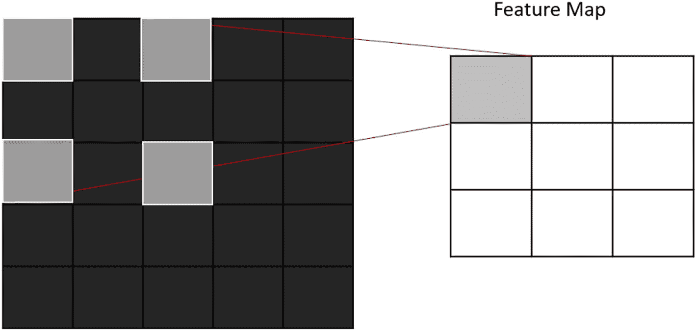

在左侧，有一个 5x5 的网格，1 列和 3 列以及 1 行和 3 行的部分被突出显示。在右侧是相应的 3x3 布局的特征图。右侧 1 列 1 行的突出显示框是左侧突出显示框的示意图。

图 9-8

使用膨胀因子为 2 的标准卷积定义特征图中的第一个条目

注意到每个采样条目之间的间隔在所有方向上增加了 1。垂直、水平和对角线上，采样条目都间隔一个条目。本质上，这个间隔是通过找到**d – 1**来确定的，其中**d**是**膨胀因子**。对于 3 的膨胀因子，这个间隔将是两个条目。现在，对于第二个条目，卷积过程按正常进行，如图 9-9 所示。

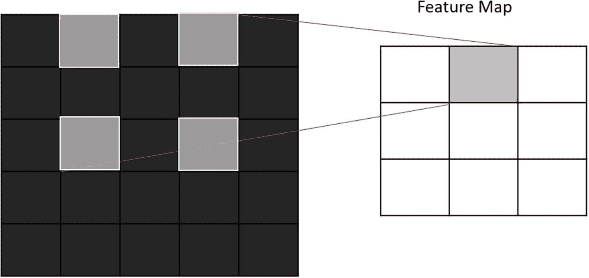

在左侧，有一个 5 乘 5 的网格，列 2 和列 4 以及行 1 和行 3 的部分被突出显示。在右侧是一个相应的 3 乘 3 布局的特征图。右侧列 2，行 1 中突出显示的框是左侧突出显示框的说明。

图 9-9

定义特征图第二个条目的具有 2 倍膨胀因子的卷积

一旦过程结束，我们将得到我们的特征图。注意特征图维度的减少，这是增加膨胀因子的直接结果。在标准的二维卷积层中，由于膨胀因子为 1，我们有一个 4×4 的特征图，但现在在将这个因子增加到 2 后，我们有一个 3×3 的特征图。

一维膨胀卷积类似。让我们回顾一下之前的一维卷积示例，并稍作修改来阐述这个概念。

假设现在新的输入向量和滤波器权重如图 9-10 和图 9-11 所示。

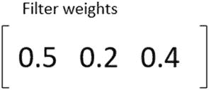

滤波器权重的输入向量读作如下。左方括号 0.5 0.2 0.4 右方括号。

图 9-11

新的滤波器权重

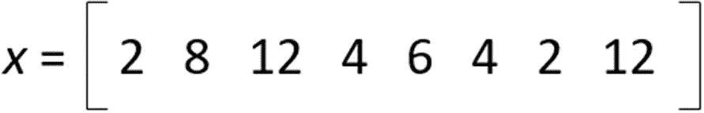

X 等于左方括号 2 8 12 4 6 4 2 12 右方括号。

图 9-10

新的输入向量权重

现在也假设膨胀因子是 2，而不是 1。新的输出向量如下，使用具有 2 倍膨胀因子的膨胀一维卷积（图 9-12、图 9-13、图 9-14 和图 9-15）。

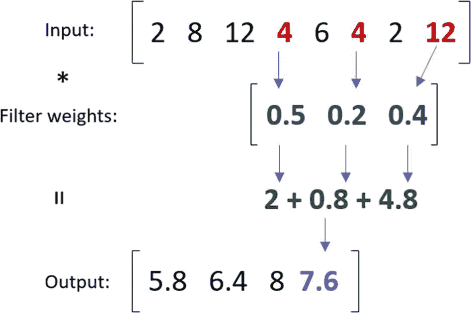

滤波器权重的输入和输出向量的示意图。输入包括 2 8 12 4 6 4 2 12 的值。滤波器权重包括 0.5、0.2 和 0.4。过滤后的总和包括 2 加 0.8 加 4.8。输出包括 5.8、6.4、8 和 7.6。

图 9-15

最后的三组输入向量值与滤波器权重相乘，以产生最后一个输出向量值

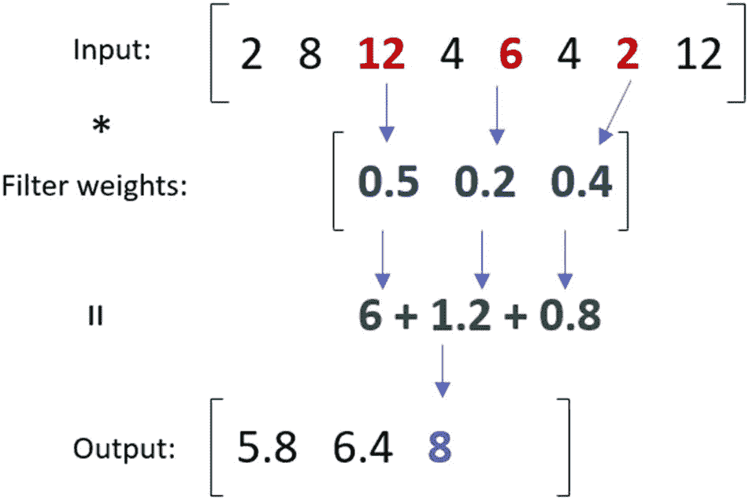

过滤器权重输入和输出向量的示意图。输入包括 2、8、12、4、6、4、2、12 的值。值之间的间隔为 1。过滤器权重包括 0.5、0.2 和 0.4。过滤后的总和值为 6 加 1.2 加 0.8。输出包括 5.8、6.4 和 8。

图 9-14

第三组三个输入向量值与过滤器权重相乘，以产生下一个输出向量值

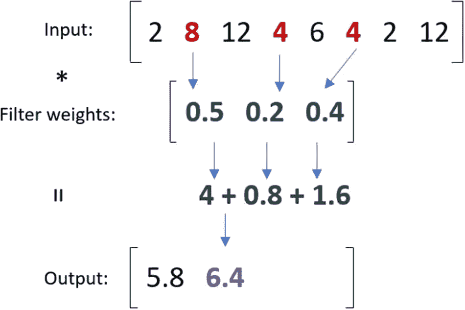

过滤器权重输入和输出向量的示意图。输入包括 2、8、12、4、6、4、2、12 的值。过滤器权重包括 0.5、0.2 和 0.4。过滤后的总和值为 4 加 0.8 加 1.6。输出包括 5.8 和 6.4。

图 9-13

接下来的三个输入向量值与过滤器权重相乘，以产生下一个输出向量值

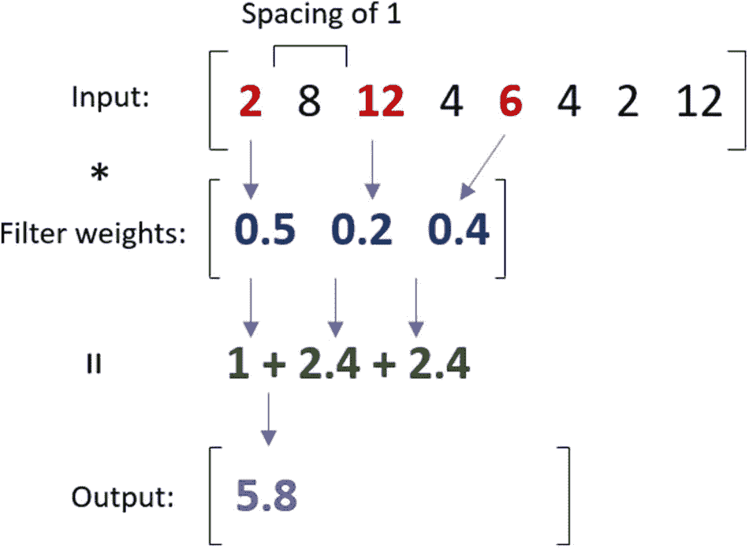

过滤器权重输入和输出向量的示意图。输入包括 2、8、12、4、6、4、2、12 的值。值之间的间隔为 1。过滤器权重包括 0.5、0.2 和 0.4。过滤后的总和值为 1 加 2.4 加 2.4。输出包括 5.8。

图 9-12

使用扩张因子为 2 的一维扩张卷积计算输出因子的第一个条目

现在我们已经讨论了在单维卷积的上下文中扩张卷积的样子，让我们看看无因果和因果扩张卷积之间的区别。为了说明这个概念，假设以下两个例子都是指一组扩张单维卷积层。

有了这个前提，图 9-16 展示了无因果扩张网络的样子。

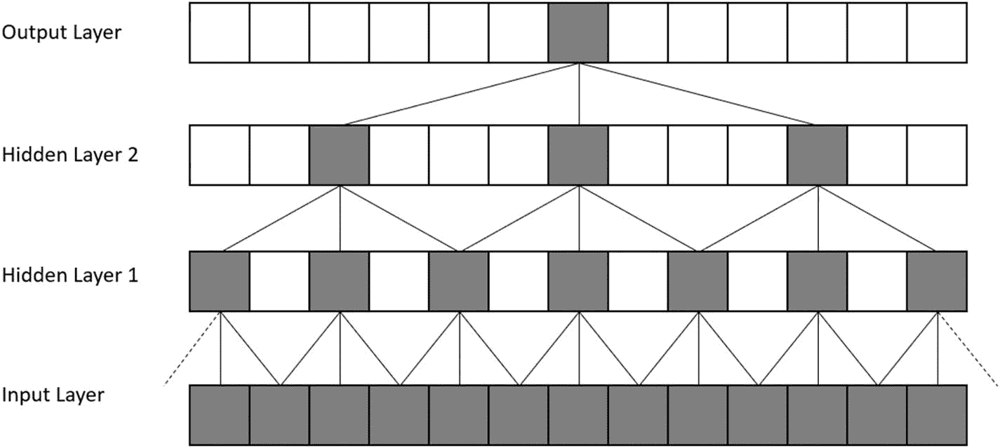

一个无因果扩张网络有四层，这些层在水平矩形的各个部分形成不同的节点，节点被突出显示。从顶部开始，这些层组织如下。输出层、隐藏层 2、隐藏层 1 和输入层。

图 9-16

无因果扩张网络。第一隐藏层的扩张因子为 2，第二隐藏层的扩张因子为 4。注意输入“按序列向前”如何对下一层的节点做出贡献

从架构的结构来看，可能不是很明显，但如果你把输入层想象成一些数据按时间顺序向前推进的序列，你可能能够看到在选择输出时将考虑未来的信息。在因果网络中，我们只想了解我们直到现在的信息，所以模型预测中不会考虑未来的任何信息。图 9-17 展示了因果扩张网络的样子。

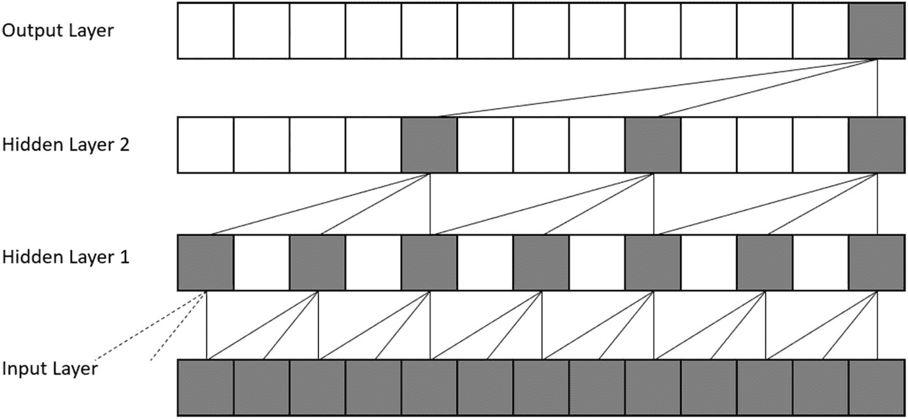

无因果扩张网络有四层，形成在水平矩形部分中突出显示的独立节点。从顶部开始，这些层组织如下。输出层、隐藏层 2、隐藏层 1 和输入层。

图 9-17

因果扩张网络。第一隐藏层具有 2 的扩张因子，第二隐藏层具有 4 的扩张因子。注意在序列中没有任何输入向前传递以贡献给下一层的节点。如果目标是保留数据集中某种类型的流动，那么这种结构是理想的，在我们的例子中是时间。

这显示了模型中时间的线性性质是如何被保留的，以及模型不会学习到未来的任何信息。在因果网络中，模型只考虑从过去到现在的信息。我们所说的扩张时间卷积网络具有类似的模型架构，在每个输出层之前的每一层都利用扩张因果卷积。

TCN 可以用于监督、半监督和无监督任务，就像一般的 LSTM 和 RNNs 一样，对于任何涉及序列的任务，无论是时间序列、视频帧序列，甚至是地理空间坐标数据。

### 使用扩张 TCN 进行异常检测

现在你已经了解了 TCN 是什么以及它是如何工作的，让我们尝试将扩张 TCN 应用于纽约出租车数据集，看看它在时间序列设置中的**无监督异常检测**表现如何。与第八章中的 LSTM 示例类似，TCN 将被训练来预测第 T 个时间步的值，给定从 1 到 T-1 的时间步值，其中 T 是某个窗口大小。一个例子是使用前 15 个值来预测第 16 个值。同样，我们将在严格正常数据的时间序列的前半部分对其进行训练。我们将设置训练预测误差的误差阈值（训练集的第 95 百分位误差，即最大的 5%误差）作为异常阈值。任何预测误差（预测时间序列值与实际时间序列值之间的平均绝对误差）高于此阈值的点都被计为异常。由于训练不需要标签，这是一个无监督学习任务。

仅在序列的前半部分进行训练的理由是，在我们用异常值预测后半部分之前，教会模型正常时间序列值看起来像什么。想法是预测值不会与异常值匹配，产生更高的错误并被标记为异常。由于异常检测不需要标签，这是一个无监督学习任务。

访问提供的笔记本，网址为[`https://github.com/apress/beginning-anomaly-detection-python-deep-learning-2e/blob/master/Chapter%209%20Temporal%20Convolutional%20Networks/chapter9_tcn.ipynb`](https://github.com/apress/beginning-anomaly-detection-python-deep-learning-2e/blob/master/Chapter%209%20Temporal%20Convolutional%20Networks/chapter9_tcn.ipynb)。

数据也提供在 GitHub 上，网址为[`https://github.com/apress/beginning-anomaly-detection-python-deep-learning-2e/tree/master/data`](https://github.com/apress/beginning-anomaly-detection-python-deep-learning-2e/tree/master/data)。

首先，如图 9-18 所示，导入所有必要的包。

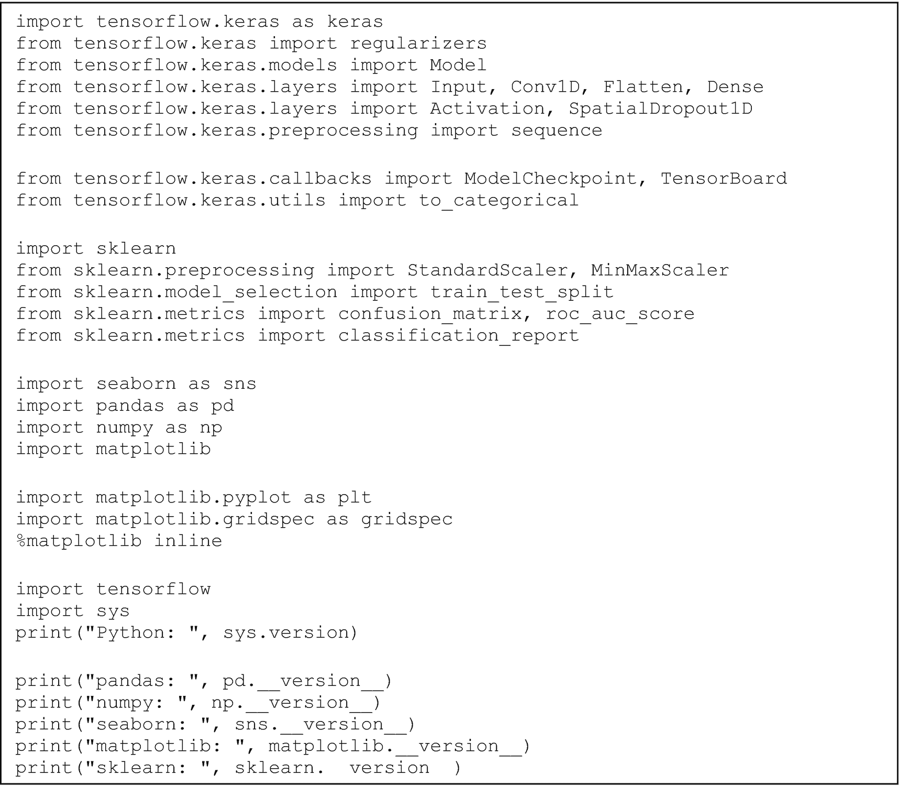

一段 28 行的代码，用于从 TensorFlow、Keras 和 s k learn 导入库和模块以构建和训练神经网络模型。代码检查并打印 Python、pandas、numpy、seaborn、mat plot lib 和 s k learn 的版本。

图 9-18

导入所有必要的包

你应该看到以下输出：

```py
Python:  3.8.12 (default, Oct 12 2021, 03:01:40) [MSC v.1916 64 bit (AMD64)]
pandas:  2.0.0
numpy:  1.22.2
seaborn:  0.12.2
matplotlib:  3.7.1
sklearn:  1.2.2
Tensorflow:  2.7.0
```

之后，我们继续定义我们的`Visualization`类，如图 9-19 所示。


`Visualization`类的 38 行代码提供了一套生成有洞察力的可视化方法，例如混淆矩阵、异常图和重建误差图表。

图 9-19

定义`Visualization`类

接下来，让我们定义加载我们数据的机制，如图 9-20 所示。

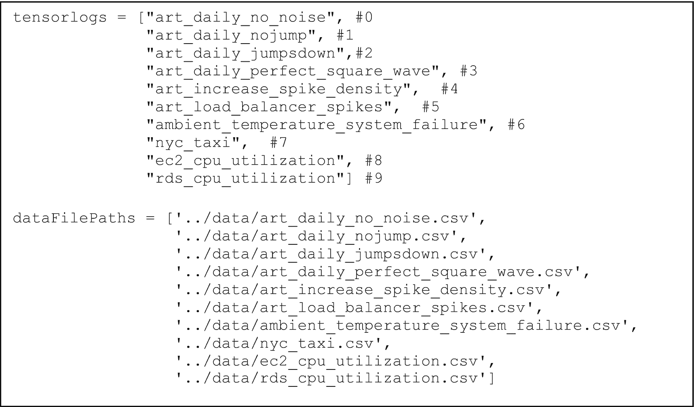

一段 20 行的代码，用于初始化两个列表，tensor logs 和数据文件路径，分别包含时间序列数据集及其对应文件路径的标识符。tensor logs 列表包含不同时间序列数据集的名称。

图 9-20

定义数据集路径以便于轻松切换

让我们现在选择我们的数据集（图 9-21）。

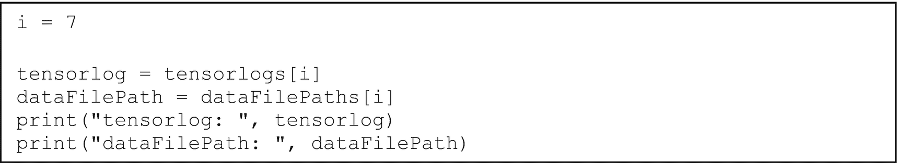

一段 5 行的代码，用于将变量`i`初始化为 7。然后使用这个值来索引张量日志和数据文件路径列表，提取索引 7 处的数据集名称和相应的文件路径。代码将这些变量的值打印到控制台。

图 9-21

选择我们的数据集。我们选择了`i = 7`，这将加载纽约出租车数据集

你的输出应该看起来像这样：

```py
tensorlog:  nyc_taxi
dataFilePath:  ../data/nyc_taxi.csv
```

让我们继续实际加载我们选择的数据集，如图 9-22 所示。


一段 4 行的代码，使用 p d 库读取由数据文件路径变量指定的 CSV 文件到 df 中。然后打印 df 中的行数，并使用 df 的`.head(5)`显示 df 的前五行。

图 9-22

加载所选数据集的代码

你的输出应该看起来像这样：

```py
Shape: 10320
Head:
timestamp  value
0  2014-07-01 00:00:00  10844
1  2014-07-01 00:30:00   8127
2  2014-07-01 01:00:00   6210
3  2014-07-01 01:30:00   4656
4  2014-07-01 02:00:00   3820
```

让我们绘制我们的时间序列数据。请参阅图 9-23a 和图 9-23b。


按日期时间绘制的值时间序列图。（七月，30000），（八月，25000），（九月，32000），（十月，29000），（十一月，40000），（十二月，27000），以及（2015 年一月，32000）。值是估计的。

图 9-23b

绘制的时间序列数据集。这是纽约出租车数据集


一段 7 行的代码向 d f 添加一个名为 Date time 的新列，使用 p d 将时间戳列转换为日期时间格式。然后显示更新后的数据框的前三行。使用 Matplotlib 生成了一个时间序列图。

图 9-23a

绘制时间序列数据集的代码

我们应该将数据集缩放到下一个范围。请参阅图 9-24。

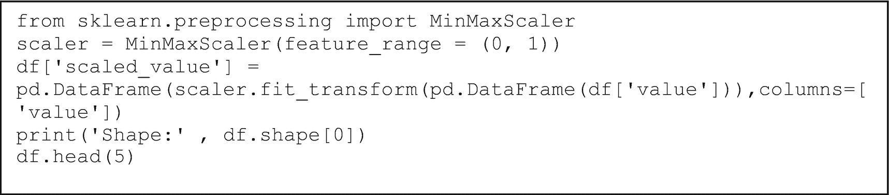

一段 7 行的代码使用 s k learn 中的 Min-Max Scaler 对 d f 中的值列进行归一化，并创建一个名为 scaled value 的新列。然后代码打印出 d f 的点形状的行数，并显示前五行。

图 9-24

将数据集缩放到 0 到 1 范围的代码

输出数据框应类似于表 9-1。

表 9-1

数据框中的缩放值

|   | timestamp | value | Datetime | scaled_value |
| --- | --- | --- | --- | --- |
| **0** | 2014-07-01 00:00:00 | 10844 | 2014-07-01 00:00:00 | 0.276506 |
| **1** | 2014-07-01 00:30:00 | 8127 | 2014-07-01 00:30:00 | 0.207175 |
| **2** | 2014-07-01 01:00:00 | 6210 | 2014-07-01 01:00:00 | 0.158259 |
| **3** | 2014-07-01 01:30:00 | 4656 | 2014-07-01 01:30:00 | 0.118605 |
| **4** | 2014-07-01 02:00:00 | 3820 | 2014-07-01 02:00:00 | 0.097272 |

现在让我们创建训练数据集。我们将使用滚动窗口方法，窗口大小为 `time_steps`，在本解释中我们将简称为 **T**。我们将以窗口长度 T 为一次迭代通过数据集，取前 T-1 个值作为 x，T^(th) 个值作为 y。我们将教会模型读取 T-1 个值的输入并预测 T^(th)。请参阅图 9-25。


一段 15 行的代码从 d f 中的时间序列数据列 scaled value 生成滚动窗口序列。变量 time steps 设置为 16。代码遍历时间序列数据，创建长度为 time steps 的窗口。然后打印出结果数组。

图 9-25

创建滚动窗口特征以供模型使用

现在我们已经创建了数据，让我们定义模型架构。请参阅图 9-26。

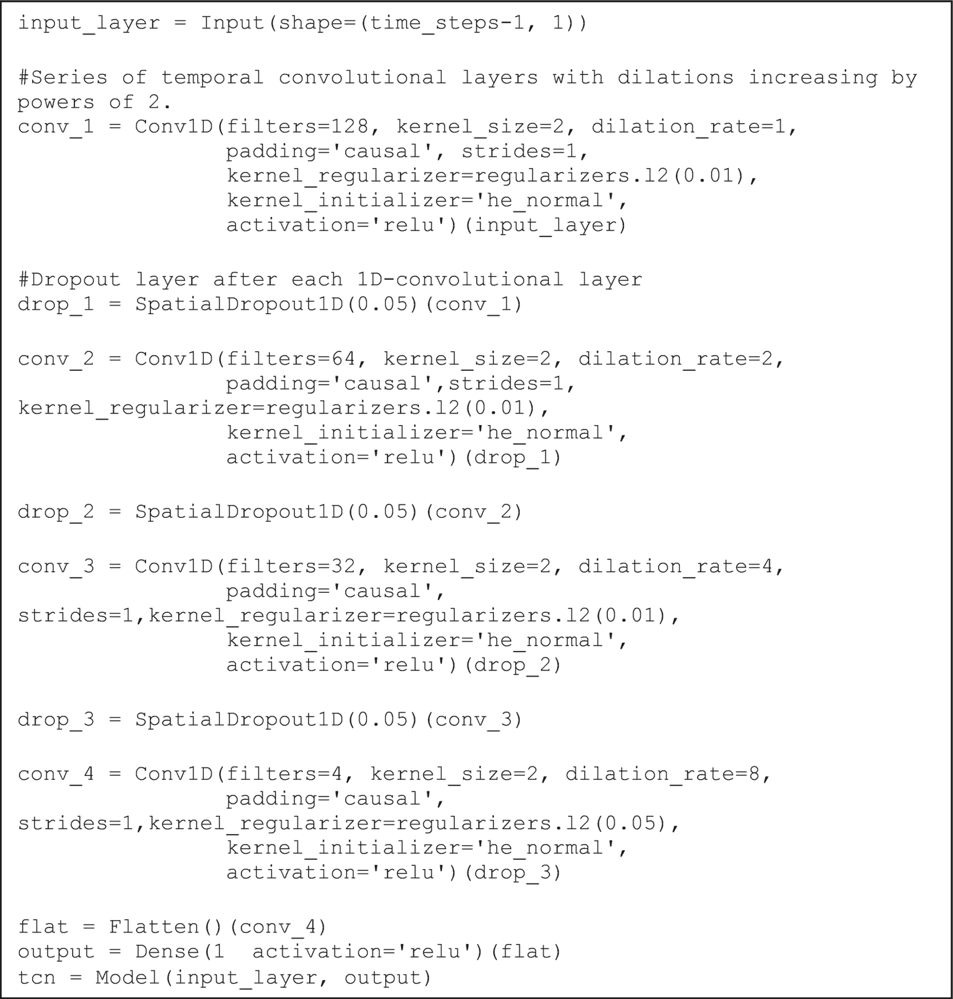

一段 30 行的代码使用核定义了用于处理时间序列数据的 T C N 模型。该模型由一系列 Conv 1 D 组成。在每个卷积层之后，应用一个 dropout 层，即 Spatial Dropout 1 D。卷积层包括滤波器大小、膨胀率等参数。

图 9-26

定义 TCN 架构

有很多新的参数需要指定：

+   `kernel_size`：这控制了应用于数据的每个滤波器的长度。

+   `dilation_rate`：这控制了 d，即膨胀大小。

+   `padding`：设置为 `'causal'`，这指定了我们想要一个因果层，而不是非因果层。

+   `strides`：步长长度。设置为 `1`，这意味着每个滤波器在其计算完成后会移动输入数据的一个值。这就像之前提到的滚动窗口代码，其中每个连续窗口相隔一个步长或值。

+   `kernel_regularizer`：指定 L2 正则化可以防止过拟合。

+   `kernel_initializer`：设置为 `'he_normal'`，我们使用 Kaiming/He 正态方法初始化权重。这有助于依赖于 ReLU 激活函数的网络的训练稳定性。

我们还添加了 `SpatialDropout1D` 层，这些层作为一维 CNN 设置中的 dropout 层，有助于模型的正则化。

`Flatten` 层简单地将前一层所有输出连接起来，使其成为一维的 (batch_size, 1) 形状。

现在我们来编译模型并打印其架构。参见图 9-27a。


一段 4 行的代码配置和编译了一个先前定义的 T C N 模型。选择的优化器是 adam，训练的损失函数设置为平均绝对误差。代码使用 summary 方法打印了 T C N 模型的摘要。

图 9-27a

编译模型以使用 Adam 优化器和平均绝对误差作为损失函数

你应该看到图 9-27b 中所示的那种输出。

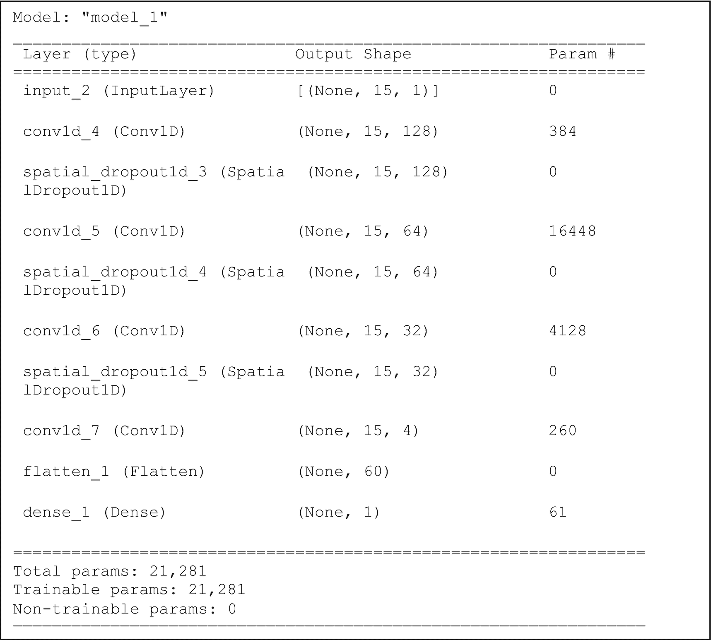

输出架构代表了名为 Model 1 的模型对时间序列数据进行处理的总结。该总结提供了关于模型中每个层的详细信息，包括其类型、输出形状和参数数量。

图 9-27b

打印出的输出架构

让我们开始训练过程。参见图 9-28。

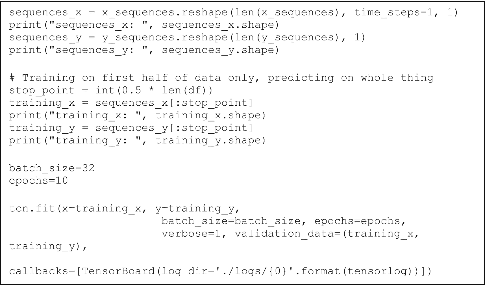

一段 17 行的代码在时间序列数据上准备和训练了一个 T C N 模型。训练过程通过 fit 方法启动，指定训练输入训练 x 和目标输出 timing y，以及批大小、epoch 数和验证数据集等参数。

图 9-28

将训练数据集指定为总数据集的一半，以在稍后对整个数据集进行预测之前教会模型什么是正常情况。这也指定了训练循环

输出应该看起来类似于图 9-29。

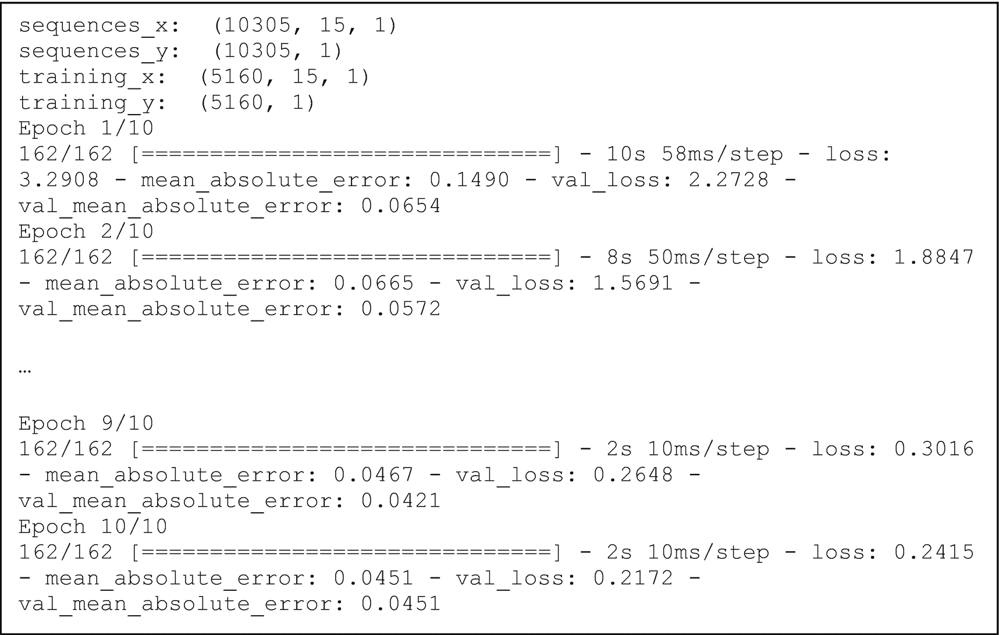

输出提供了数据形状和 T C N 模型训练进度的概述。它包括关键指标，如损失和平均绝对误差，提供了模型在训练和验证期间性能的见解。

图 9-29

训练代码的输出，其中一些输出已被移除以获得更清晰的显示

关于 TCN/一维 CNN 的一般注意事项是，它们往往比较敏感，这意味着有时训练完全失败，CNN 只会产生直线输出。He 正则化初始化技术应该有助于对抗这种崩溃，但有时您可能需要重新训练模型以实现收敛。

如果您的结果不满意或失败，如果需要，请随意多次重新运行模型训练。因为神经网络通常依赖于随机权重初始化，这些初始化并不了解损失曲线的几何形状，它们可能会陷入达到次优收敛甚至发散。

训练完成后，让我们继续进行预测。执行图 9-30 中所示的代码。

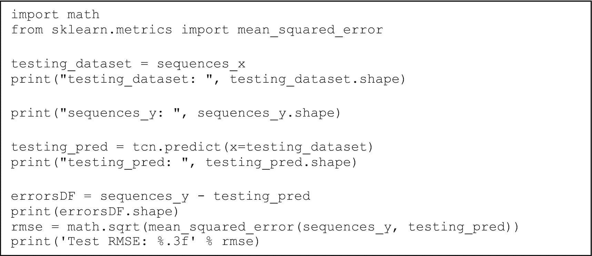

11 行代码评估了训练好的 T C N 模型在测试数据集上的性能。它使用均方误差 (M S E) 指标来量化序列 y 和测试预测之间的差异。代码通过从实际值中减去预测值来计算误差。

图 9-30

使用训练好的模型进行预测

如果训练过程中一切顺利，输出应该看起来像以下这样：

```py
testing_dataset:  (10305, 15, 1)
sequences_y:  (10305, 1)
testing_pred:  (10305, 1)
(10305, 1)
Test RMSE: 0.060
```

现在我们来计算距离截止值以确定异常阈值。参见图 9-31。

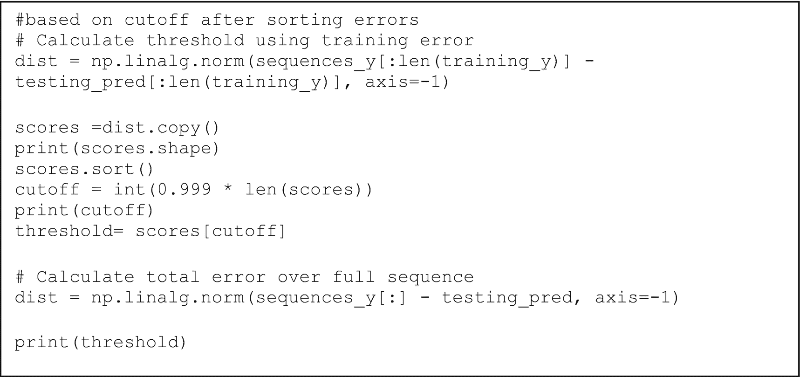

基于排序后误差的 13 行代码用于使用训练误差计算阈值并计算整个序列的总误差。

图 9-31

计算最大预测误差阈值的阈值

您应该看到如下输出：

```py
(5160,)
5154
0.16645004726088353
```

您确定的阈值可能不同，因为这完全取决于模型训练过程。

现在我们来绘制模型的预测结果。参见图 9-32a 和图 9-32b。

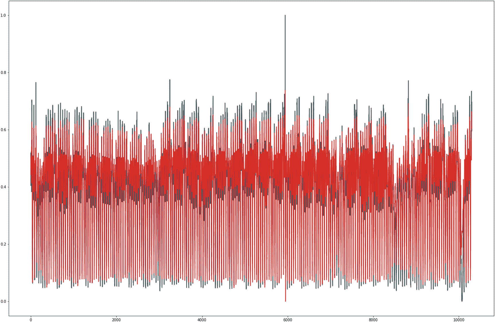

频率图具有以下值：(0, 0.8), (2000, 0.7), (4000, 0.78), (6000, 1.0), (8000, 0.7), (10000, 0.8)。值为估计值。

图 9-32b

结果图表。模型似乎已经为数据集学习到了一个相当好的拟合。

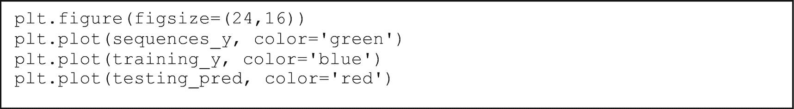

4 行代码用于创建一个比较序列 y 与训练和测试数据集上预测值的图表。该图表以 24x16 的大图尺寸显示。

图 9-32a

绘制时间序列序列的代码，颜色编码以便`绿色`代表整个值序列的真实值，`蓝色`仅代表训练集分割，`红色`代表模型对整个数据集时间序列值的预测

让我们开始使用我们计算出的阈值来预测异常。请参阅图 9-33。

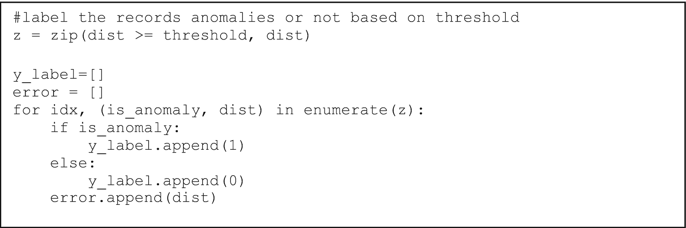

10 行代码将标签分配给记录，根据指定的阈值确定是否为异常。该代码使用 zip 函数遍历布尔值和距离的配对。生成的异常标签存储在 y-label 列表中，距离存储在 error 列表中。

图 9-33

计算每个数据点的异常标签的代码

我们可以可视化这个错误阈值并找出哪些点超出了它。请参阅图 9-34 以获取绘制此阈值图的代码。


2 行代码创建 Visualization 类的实例并调用其 draw_anomaly 方法。该方法接受三个参数：y label、error 和 threshold。draw_anomaly 方法生成散点图以可视化数据中的异常。

图 9-34

绘制错误阈值图的代码

图 9-35 显示了生成的图表。

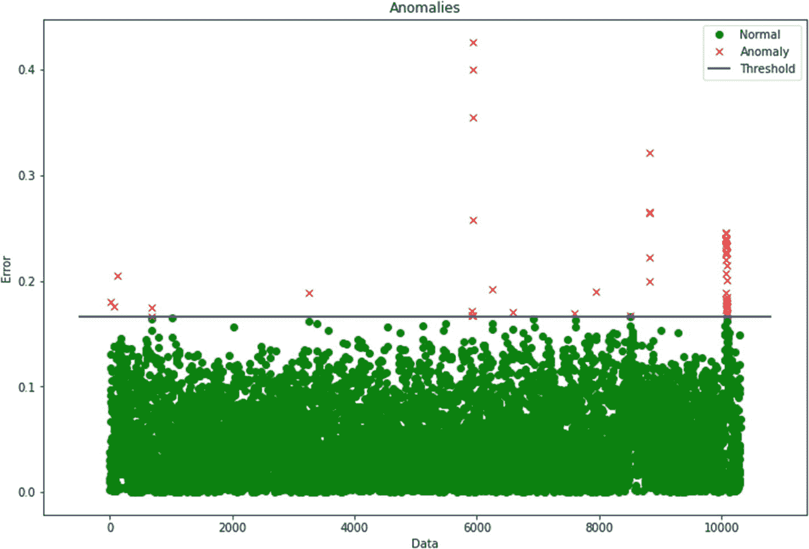

标题为“异常”的散点图绘制错误与数据的关系。正常值的图表位于水平轴的 0 到 10000 范围内，垂直轴的 0.0 到 0.19 范围内。阈值线是线性的，从垂直轴的 0.17 开始。

图 9-35

显示超出错误阈值的点的图表，因此被分类为异常

让我们创建一个异常预测数据框，以便更容易地绘制确认为异常的确切点。请参阅图 9-36。

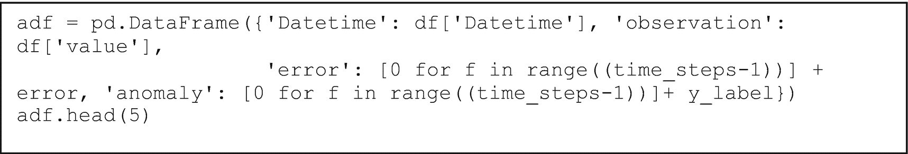

5 行代码创建一个新的数据框，包含 datetime、observation、error 和 anomaly 列。错误和 anomaly 列的初始记录初始化为零。使用 head(5) 方法显示此新数据框的前五行。

图 9-36

创建包含原始值以及观测预测错误和异常标志的数据框

输出应类似于表 9-2。

表 9-2

图 9-36 中的代码生成结果数据框

|   | 时间戳 | 观测值 | 错误 | 异常 |
| --- | --- | --- | --- | --- |
| **0** | 2014-07-01 00:00:00 | 10844 | 0.0 | 0 |
| **1** | 2014-07-01 00:30:00 | 8127 | 0.0 | 0 |
| **2** | 2014-07-01 01:00:00 | 6210 | 0.0 | 0 |
| **3** | 2014-07-01 01:30:00 | 4656 | 0.0 | 0 |
| **4** | 2014-07-01 02:00:00 | 3820 | 0.0 | 0 |

由于采用了滚动窗口方法，我们对于前`time_steps-1`个数据点没有预测，这就是为什么它们被填充为零。现在让我们绘制最终的图形，直观地展示异常情况。请参考图 9-37 中的代码。

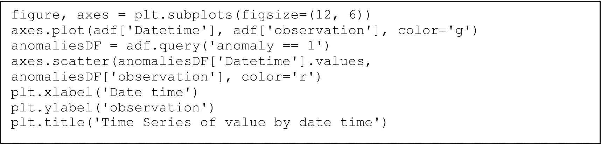

8 行代码创建了一个时间序列图来可视化随时间变化的观察值。该图显示在一个 12×6 尺寸的图形中。数据中的异常，通过异常列的值为 1 来识别，在图上用散点表示。

图 9-37

在原始时间序列序列上绘制异常点的代码

结果看起来就像图 9-38 所示。

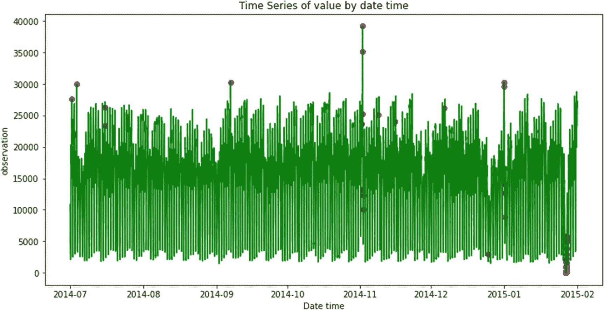

标题名为“按日期时间值的时间序列”的散点图绘制观察值与日期时间的对比。（2014-07，30000），（2014-08，31000），（2014-11，40000），（2015-01，32000）和（2015-02，3000）。值是估计的。

图 9-38

使用 TCN 预测识别出的异常

图 9-38 显示，相当多的点被标记为异常。最重要的是，模型成功地预测了感恩节、圣诞节、除夕和类似暴风雪的天气异常，以及其他一些点。

总体来说，这是一个**无监督异常检测**的例子。我们取了原始序列的一个子集，训练模型在给定滚动窗口的情况下输出预测，并通过计算一个阈值来识别异常。在这个过程中，没有任何步骤涉及到训练标签。

在下一个例子中，我们将实现编码器-解码器时间卷积网络，本质上是将 TCN 与自动编码器的概念相结合，以执行无监督异常检测。

## 编码器-解码器时间卷积网络

我们将要探索的编码器-解码器 TCN（ED-TCN）版本涉及一维因果卷积和池化层的组合，以涵盖编码阶段，以及一系列上采样和一维因果卷积层，以组成解码阶段。这个模型中的卷积层没有扩张，但它们仍然算作 TCN 的层。为了更好地理解这个模型的结构，请参考图 9-39。

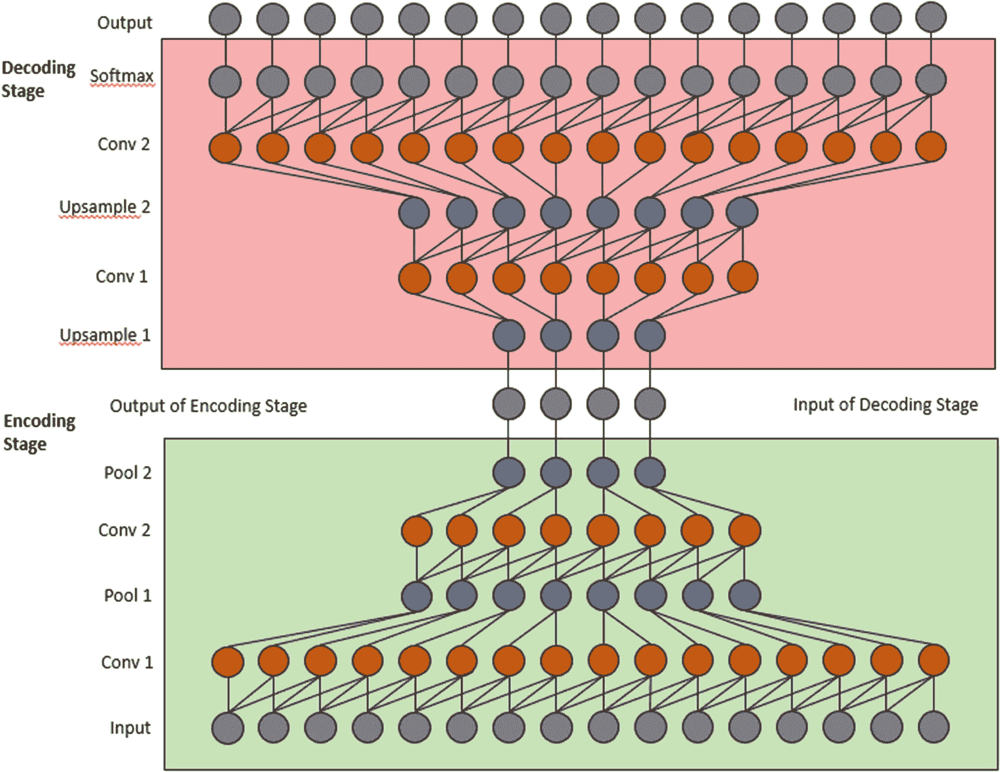

解码和编码阶段的相互连接链接图。该图有六个输出层，解码阶段有 softmax、con v 2、up sample 2、con v 1 和 up sample 1。在编码阶段，有五个层：pool 2、con v 2、pool 1、con v 1 和输入。

图 9-39

在编码和解码阶段，模型由因果卷积层组成，并且结构是这样的，即层总是因果的。

这个图可能看起来相当复杂，所以让我们一层层地分解它。

首先，看看编码阶段，并从最底层的输入层开始。从这个层开始，我们执行输入的**因果卷积**，作为第一卷积层的一部分。我们称之为 `conv_1` 的第一卷积层的输出现在成为第一个**最大池化层**的输入，我们称之为 `pool_1`。

回想第三章的内容，池化层强调它通过区域的最大值，通过选择最大值有效地泛化输入。从这里，我们又有另一组因果卷积和最大池化，层 `conv_2` 和 `pool_2`。注意数据在编码阶段通过时尺寸的逐渐减小，这是自动编码器的特征之一。最后，我们在两个阶段中间有一个密集层，代表编码阶段的最终、编码输出，以及解码阶段的编码输入。

在这种情况下，解码阶段略有不同，因为我们使用了所谓的**上采样**。上采样是一种技术，我们将数据重复 n 次以将其按 n 倍放大。在最大池化层中，数据减少了 2 倍。因此，为了以相同的 2 倍因子上采样并增加数据，我们需要将数据重复两次。在这种情况下，我们使用一维上采样，因此该层将根据时间轴重复每个步骤 n 次。为了更好地理解上采样做什么，让我们应用如图 9-40 和图 9-41 所示的一维上采样。

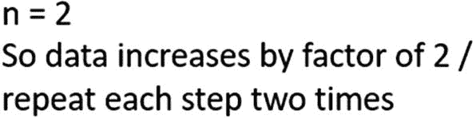

一个三行文本的读取方式如下。第 1 行，n 等于 2。第 2 行，所以数据增加 2 倍。第 3 行，重复每个步骤两次。

图 9-41

上采样因子 n

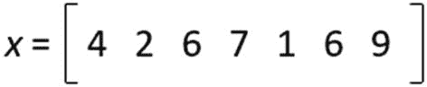

X 等于左方括号 4 2 6 7 1 6 9 右方括号。

图 9-40

定义了相应值的向量 x

记住每个单独的时间步骤重复两次，我们会看到如图 9-42、图 9-43 和图 9-44 所示的程序。

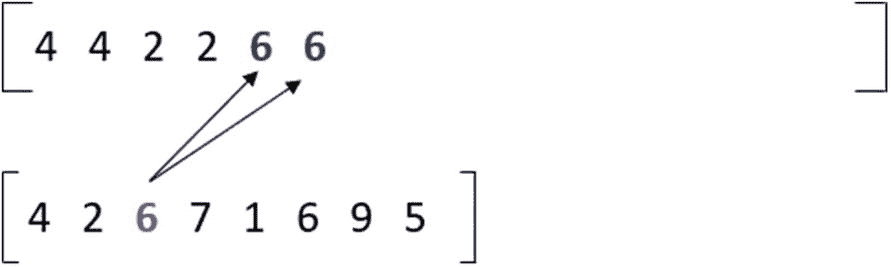

一个两行向量输入的读取方式如下。第 1 行，左方括号 4 4 2 2 6 6 右方括号。第 2 行，左方括号 4 2 6 7 1 6 9 5 右方括号。从第 2 行的 6 出发的一条箭头分支并指向第 1 行的 6 6。

图 9-44

此过程与输入向量的第三个条目重复，以形成输出向量中的下一个第三个条目对。

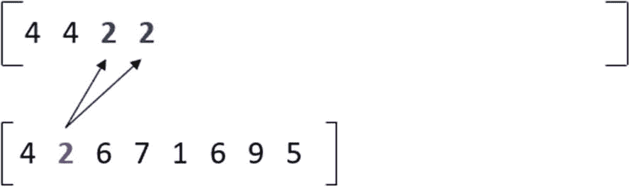

一个两行向量输入的读取方式如下。第 1 行，左方括号 4 4 2 2 右方括号。第 2 行，左方括号 4 2 6 7 1 6 9 5 右方括号。从第 2 行的 2 出发的一条箭头分支并指向第 1 行的 2 2。

图 9-43

下一个条目被重复两次，以形成上采样操作输出向量中的下一个两个条目

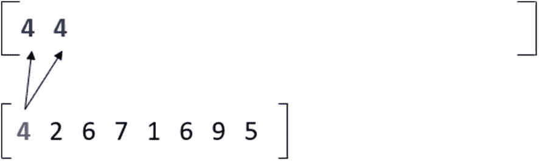

一个两行向量输入的读取方式如下。第 1 行，左方括号 4 4 右方括号。第 2 行，左方括号 4 2 6 7 1 6 9 5 右方括号。从第 2 行的 4 出发，箭头分裂并指向第 1 行的 4 4。

图 9-42

输入的第一个条目被重复两次，以形成上采样输出向量的前两个条目

这一直持续到我们最终得到图 9-45 所示的结果。

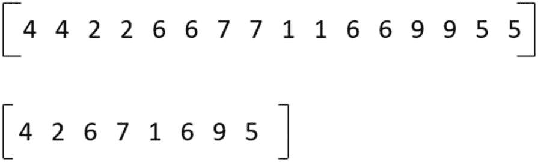

一个两行向量输入的读取方式如下。第 1 行，左方括号 4 4 2 2 6 6 7 7 1 1 6 6 9 9 5 5 右方括号。第 2 行，左方括号 4 2 6 7 1 6 9 5 右方括号。

图 9-45

与下面原始输入向量相比，上采样操作后的输出向量

回到模型，每个上采样层随后连接到一个一维卷积层，上采样层和一维卷积层的这对组合再次重复，直到最终输出通过 `softmax()` 函数传递，从而得到输出/预测。

### 使用 ED-TCN 进行异常检测

让我们将这个模型应用于信用卡数据集进行测试。再次强调，这个例子将是另一个**无监督学习**的实例，因此我们不会有任何异常或正常数据被标记。请参考笔记本 [`github.com/apress/beginning-anomaly-detection-python-deep-learning-2e/blob/master/Chapter%209%20Temporal%20Convolutional%20Networks/chapter9_ed_tcn.ipynb`](https://github.com/apress/beginning-anomaly-detection-python-deep-learning-2e/blob/master/Chapter%209%20Temporal%20Convolutional%20Networks/chapter9_ed_tcn.ipynb)。

数据也可在 GitHub 上找到。以下代码的大部分与之前扩展的 TCN 示例非常相似。

首先，导入所有必要的包，如图 9-46 所示。

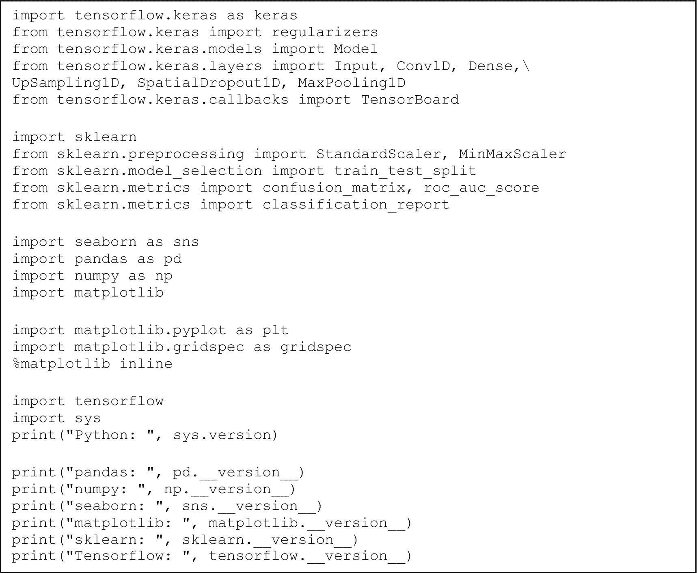

一段 27 行的代码导入各种库并检查它们的版本。它包括 Tensor Flow 模块、s k-learn 以及 Mat plot lib 和 Seaborn 等库。代码检查并打印 Python 和 TensorFlow 的版本。使用 percent mat plot lib 内联魔法命令进行内联绘图。

图 9-46

导入所有必要的包

你应该看到如下输出：

```py
Python:  3.8.12 (default, Oct 12 2021, 03:01:40) [MSC v.1916 64 bit (AMD64)]
pandas:  2.0.0
numpy:  1.22.2
seaborn:  0.12.2
matplotlib:  3.7.1
sklearn:  1.2.2
Tensorflow:  2.7.0
```

之后，我们继续定义我们的 `Visualization` 类，如图 9-47 所示。

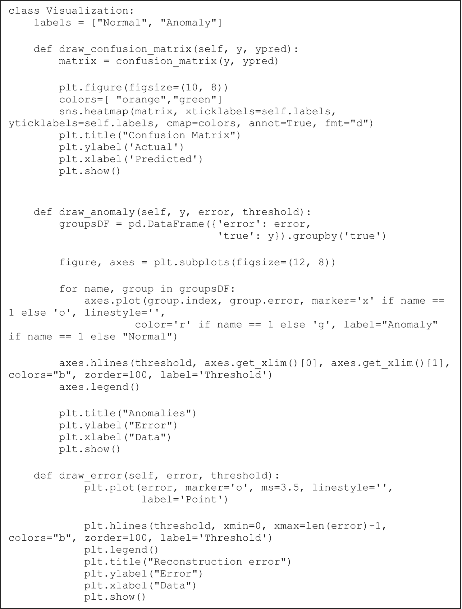

一段 38 行的代码定义了一个名为 Visualization 的类，该类封装了与异常检测相关的可视化方法。

图 9-47

定义 `Visualization` 类

接下来，让我们定义加载我们数据的机制，如图 9-48 所示。

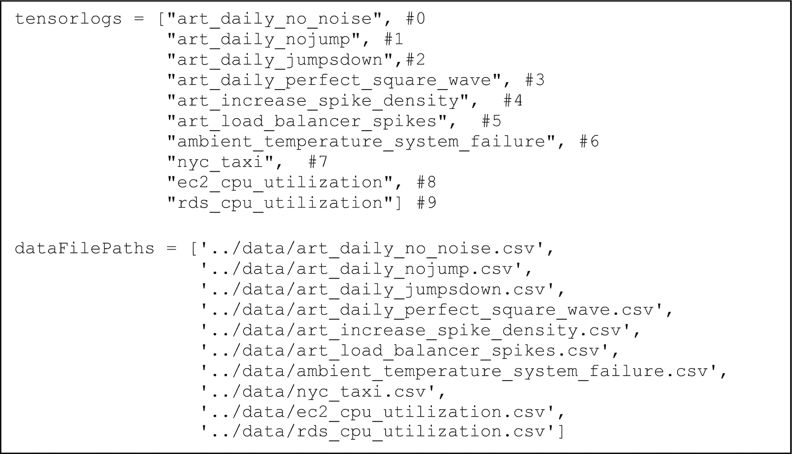

一段 20 行代码定义了两个列表，tensorlogs 和 data FilePaths。tensorlogs 包含不同时间序列数据集的字符串标识符，每个标识符与索引 0 到 9 相关联。Data File Paths 包含与 tensorlogs 中的数据集对应的文件路径。

图 9-48

定义数据集路径以便能够轻松地在它们之间切换

让我们现在选择我们的数据集（图 9-49）。


一段 5 行代码使用索引检索特定时间序列数据集的信息。索引 i 设置为 7，数据集名称存储在变量 tensor log 中，文件路径存储在变量 data File Path 中。

图 9-49

选择我们的数据集。我们选择了`i = 7`，这将加载纽约出租车数据集

你的输出应该看起来像这样：

```py
tensorlog:  nyc_taxi
dataFilePath:  ../data/nyc_taxi.csv
```

让我们继续实际加载所选数据集，如图 9-50 所示。


一段 4 行代码使用存储在变量 data File Path 中的文件路径将 C S V 文件读取到 d f 中。然后，代码使用 d f 的点操作符 shape 0 打印数据框中的行数，并使用 d f 的点操作符 head 5 显示数据框的前五行。

图 9-50

加载所选数据集的代码

你的输出应该看起来像这样：

```py
Shape: 10320
Head:
timestamp  value
0  2014-07-01 00:00:00  10844
1  2014-07-01 00:30:00   8127
2  2014-07-01 01:00:00   6210
3  2014-07-01 01:30:00   4656
4  2014-07-01 02:00:00   3820
```

让我们绘制我们的时间序列数据。参见图 9-51a 和图 9-51b。

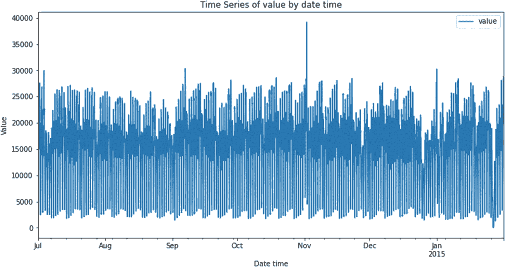

时间序列图绘制了值与日期时间的对应关系。（七月，30000），（八月，27000），（九月，25000），（十月，29000），（十一月，40000），（十二月，21000），（2015 年一月，34000）。值为估算值。

图 9-51b

绘制的时间序列数据集。这是纽约出租车数据集

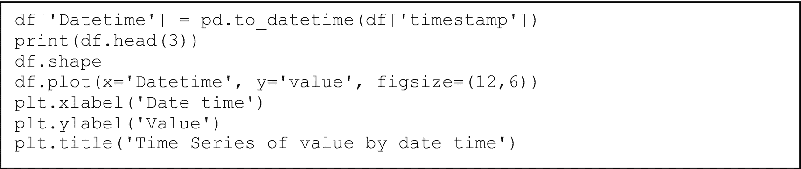

一段 7 行代码处理代表时间序列数据的 d f。它将时间戳列转换为日期时间格式，显示数据框的前三行，然后使用 Mat plot lib 创建时间序列图。该图显示了日期时间和值列之间的关系。

图 9-51a

绘制时间序列数据集的代码

我们应该将数据集进行缩放。参见图 9-52。

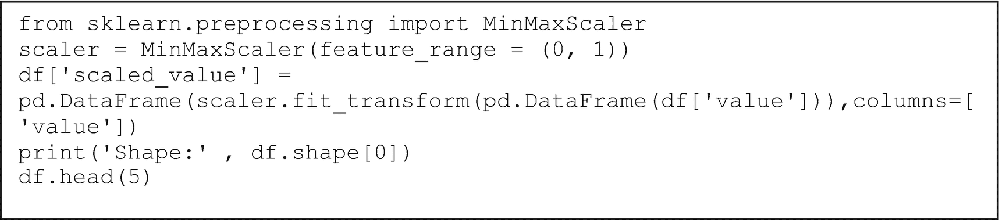

一段 7 行代码使用 s k-learn 的 MinMaxScaler 将数据框 d f 的值列缩放到 0 到 1 之间。缩放值被添加为名为 scaled value 的新列。然后打印数据框的形状，并显示前五行。

图 9-52

代码用于将数据集缩放到 0 到 1 的范围

输出数据框应该看起来像表 9-3。

表 9-3

数据框中的缩放值

|   | 时间戳 | 值 | 日期时间 | 缩放值 |
| --- | --- | --- | --- | --- |
| **0** | 2014-07-01 00:00:00 | 10844 | 2014-07-01 00:00:00 | 0.276506 |
| **1** | 2014-07-01 00:30:00 | 8127 | 2014-07-01 00:30:00 | 0.207175 |
| **2** | 2014-07-01 01:00:00 | 6210 | 2014-07-01 01:00:00 | 0.158259 |
| **3** | 2014-07-01 01:30:00 | 4656 | 2014-07-01 01:30:00 | 0.118605 |
| **4** | 2014-07-01 02:00:00 | 3820 | 2014-07-01 02:00:00 | 0.097272 |

现在我们来创建训练数据集。我们不是使用前 T-1 个值来预测 T^(th) 值，而是直接根据 T 值预测 T 值。换句话说，我们正在教模型如何高效地将 T 值编码到某个低维空间，以便它们可以以最小的误差重建。

因此，我们不会有一个 y 集合，而只有 x 集合。参见图 9-53。

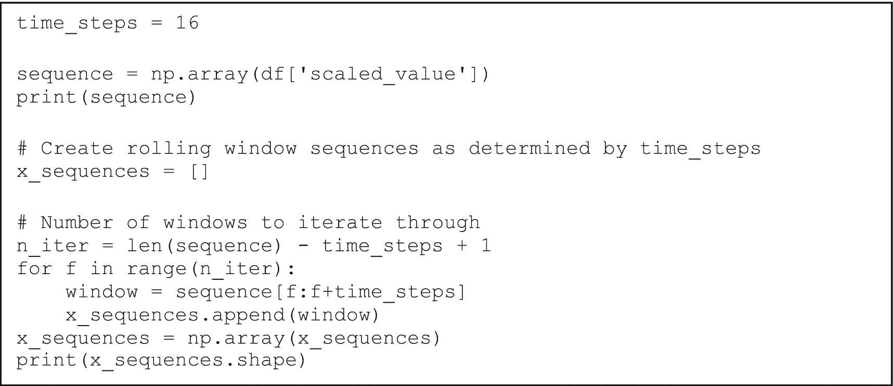

一段 12 行的代码用于创建由时间下划线步数确定的滚动窗口序列，并创建要迭代的窗口数量。

图 9-53

创建滚动窗口特征以输入到模型中

你的输出应该看起来像以下这样：

```py
[0.27650616 0.20717548 0.1582587  ... 0.69664957 0.6783281  0.67059634]
(10305, 16)
```

现在我们已经创建了数据，让我们定义模型架构。参见图 9-54a 和图 9-54b。

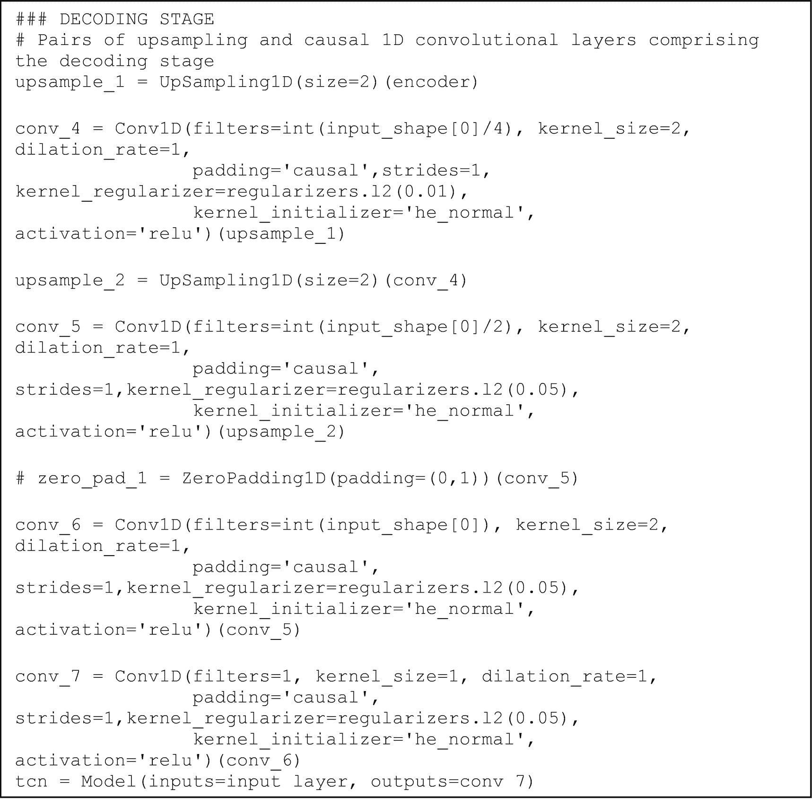

解码阶段的 30 行代码用于配对 upsampling 和因果 1-D 卷积层，这些层构成了解码阶段。

图 9-54b

定义 ED-TCN 架构的解码部分以及最终模型

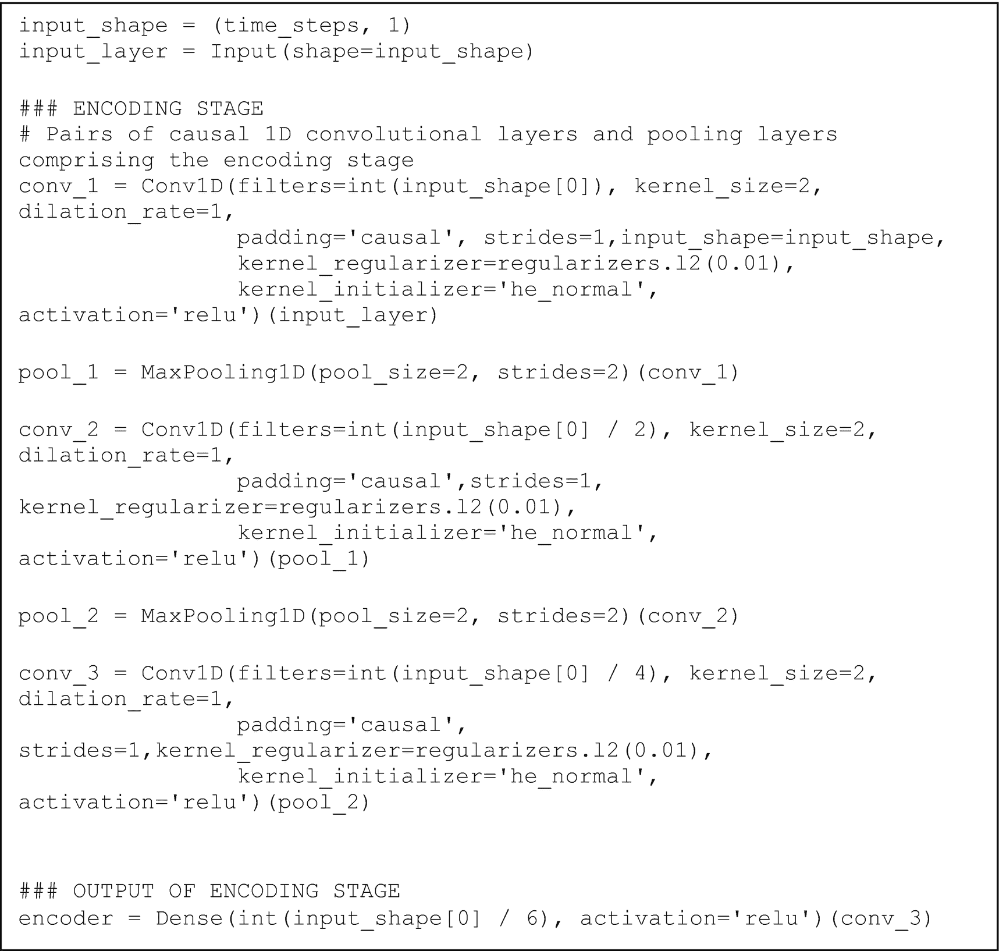

一段 27 行的代码用于配对编码阶段的因果 1-D 卷积层和池化层。编码阶段的输出已提供。

图 9-54a

定义 ED-TCN 架构的编码部分

`MaxPooling1D` 层应用长度为 `pool_size=2` 的过滤器，每次移动两个数据点（如 `strides=2` 所指定）。它选择过滤器中的最大值传递到下一层。它具有将数据维度减半（不是过滤器）的效果，因此我们不仅降低了过滤器维度空间，也降低了数据维度空间本身。

解码器部分有一个 `UpSampling1D` 层，其功能与我们描述的 ED-TCN 编码部分之前的 UpSampling 类似。

现在我们来编译模型并打印架构。参见图 9-55a。

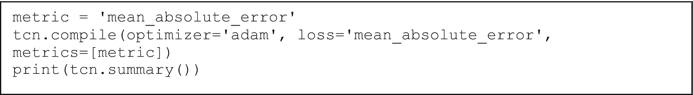

一段 4 行代码配置了一个用于训练的 T C N 模型。它使用 Adam 优化器和平均绝对误差作为损失函数。然后调用 compile 方法来最终确定模型配置。使用 t c n dot summary 将模型摘要打印到控制台。

图 9-55a

将模型编译为使用 Adam 优化器和平均绝对误差作为损失函数

你应该看到如图 9-55b 所示的输出。

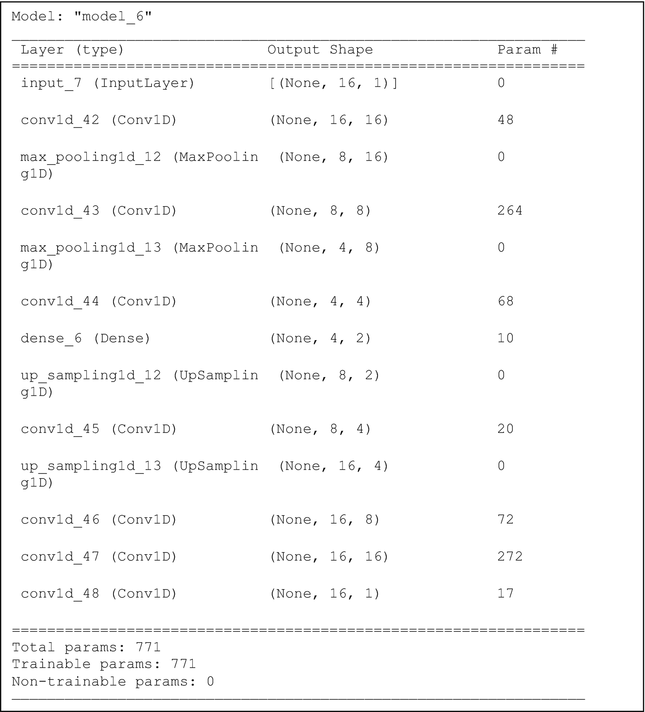

输出摘要代表一个 T C N 架构。名为 model 6 的模型接受形状为(16, 1)的输入序列。它由 Conv 1 D 最大池化层、密集层和上采样层组成。提供了层类型、输出形状和参数数量的概述。

图 9-55b

打印出的输出架构

如您所见，在整个模型中发生了维度的压缩和扩展。我们通过让模型学习输入的有效表示来重建原始输入，从而让模型学习时间序列模型的属性。想法是它将学习构成正常时间序列数据集的属性，当将这些学习的属性应用于编码和解码异常序列时，它将具有高重建误差，这将将这些序列标记为异常。

让我们开始训练过程。参见图 9-56。

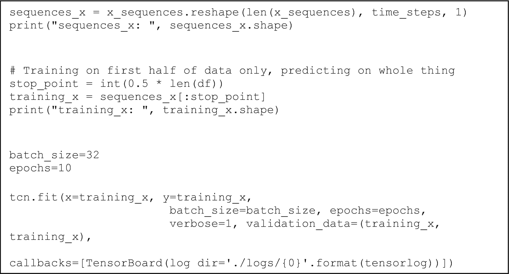

一段 13 行的代码将输入序列 x 序列重塑为适合训练 T C N 的 3-D 数组序列 x。重塑后的数组具有相应的维度。重塑后，打印出新创建数组的形状。

图 9-56

将训练数据集指定为总数据集的一半，以在稍后对整个数据集进行预测之前教会模型什么是正常的。这也指定了训练循环

输出应类似于图 9-57。

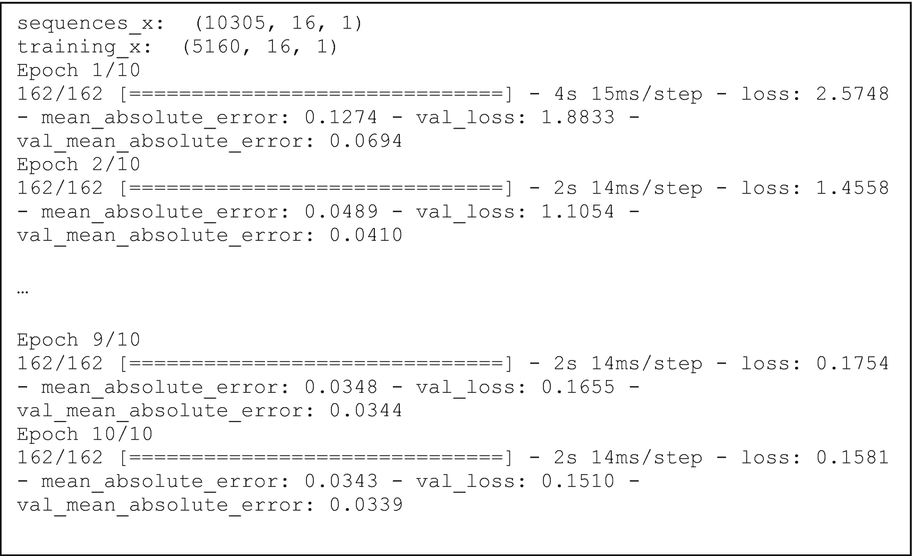

代码摘要首先打印出两个数组的形状。序列 x 的维度为(10305, 16, 1)和训练 x 的维度为(5160, 16, 1)。随后的输出显示了 TCN 训练过程中每个 epoch 的训练进度。

图 9-57

训练代码的输出，为了更清晰地显示，删除了一些输出

由于这个模型也是基于 TCN/1D-CNN，它也可能在训练过程中失败并产生单行输出。在这种情况下，重新运行模型训练，尽管我们已经初始化了权重以 He Normal 来提高稳定性。

训练完成后，让我们继续进行预测。执行图 9-58 中的代码。

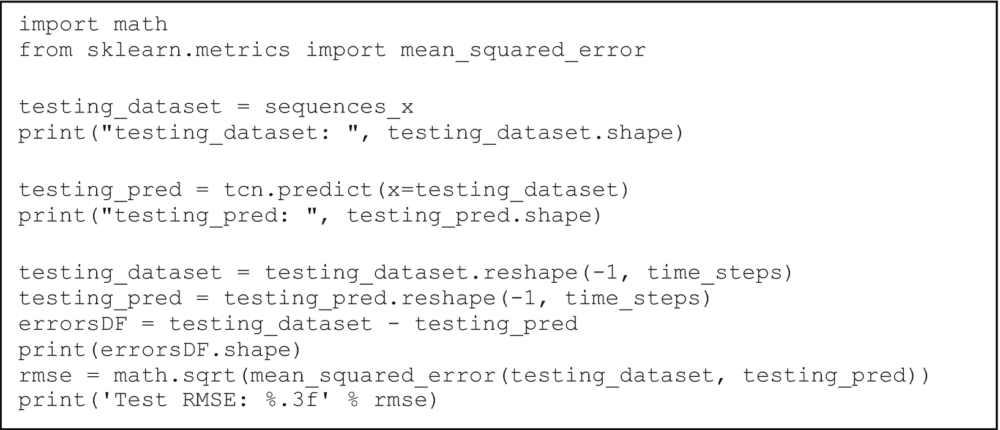

一段 12 行的代码评估了 T C N 模型在测试数据集上的性能。它首先打印出测试数据集序列 x 的形状。然后使用模型预测测试数据集上的值，并将预测值重塑以与原始结构对齐。

图 9-58

使用训练好的模型进行预测

如果训练过程中一切顺利，输出应类似于以下内容：

```py
testing_dataset:  (10305, 16, 1)
testing_pred:  (10305, 16, 1)
(10305, 16)
Test RMSE: 0.052
```

现在让我们计算距离截止值以确定异常阈值。参见图 9-59。

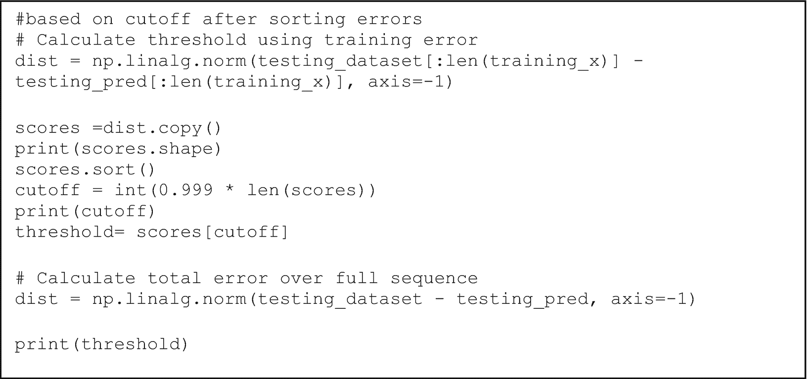

一段 13 行的代码，使用训练误差计算阈值，并根据排序后的误差计算整个序列的总误差。

图 9-59

计算最大预测误差阈值，使其仍然正常

您应该看到如下输出：

```py
(5160,)
5154
0.380293597408704
```

您确定的阈值可能不同，因为这完全取决于模型训练过程。

在我们绘制预测之前，我们必须将滚动窗口序列处理成与原始连续值序列一致。为此，运行图 9-60 中的代码。

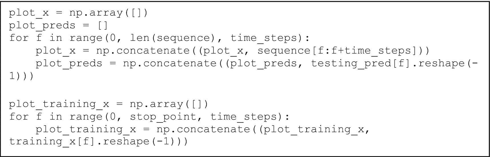

一段 10 行的代码通过连接原始序列、预测值和训练数据的片段创建数组（plot x、plot preds 和 plot training x）。

图 9-60

将预测序列处理成与原始连续序列一致以便绘图

现在让我们绘制模型的预测结果。参见图 9-61a 和图 9-61b。

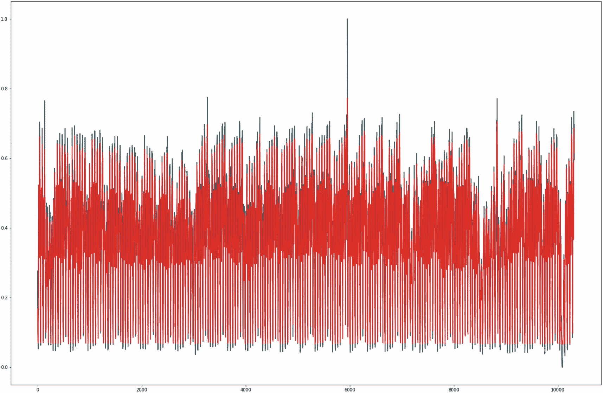

频率图具有以下值：(0, 0.78)，(2000, 0.7)，(4000, 0.73)，(6000, 1.0)，(8000, 0.68) 和 (10000, 0.77)。值是估计的。

图 9-61b

生成的图表。模型似乎已经为数据集学习到了一个非常好的拟合。

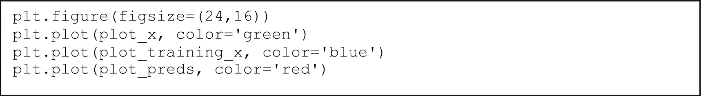

一段 4 行的代码使用 Mat plot lib 库生成一个图表。它设置了一个具有特定大小的图形，然后在同一张图上绘制三条线。图形大小调整为 24 单位宽和 16 单位高。

图 9-61a

绘制时间序列序列的代码，使用颜色编码，其中‘绿色’代表整个值序列的真实值，‘蓝色’仅代表训练集，‘红色’代表模型对整个数据集时间序列值的预测。

让我们开始使用计算出的阈值来预测异常。参见图 9-62。


一段 10 行的代码，根据阈值将记录标记为异常或非异常。

图 9-62

计算每个数据点的异常标签的代码

我们可以可视化这个误差阈值，并找出哪些点超出了它。参见图 9-63 以查看绘制此阈值图的代码。

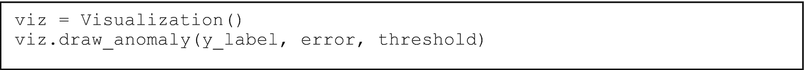

一行代码创建了一个 Visualization 类的实例，并调用其 draw anomaly 方法。draw anomaly 方法接受三个参数，即 y 标签、误差和阈值。

图 9-63

绘制误差阈值图的代码

参见图 9-64 以查看生成的图表。

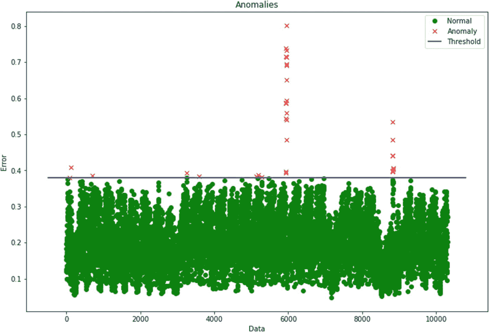

一个标题为异常的散点图，绘制误差与数据的关系。正常值的图表位于水平轴 0 到 10000 和垂直轴 0.0 到 0.19 的范围内。阈值线是线性的，从垂直轴的 0.17 开始。

图 9-64

显示超出误差阈值的点的图表，因此被分类为异常

让我们创建一个异常预测数据框，以便更容易地绘制确认为异常的确切点。请参阅图 9-65。


5 行代码创建了一个数据框 a d f。它包括四个列。时间戳、观测值、误差和异常，对于初始时间步长包含零，然后根据提供的 y 标签参数标记的异常。

图 9-65

创建一个包含原始值以及观测预测误差和异常标记的数据框

输出应类似于表 9-4。

表 9-4

图 9-65 中的代码结果数据框

|   | 时间戳 | 观测值 | 误差 | 异常 |
| --- | --- | --- | --- | --- |
| **0** | 2014-07-01 00:00:00 | 10844 | 0.0 | 0 |
| **1** | 2014-07-01 00:30:00 | 8127 | 0.0 | 0 |
| **2** | 2014-07-01 01:00:00 | 6210 | 0.0 | 0 |
| **3** | 2014-07-01 01:30:00 | 4656 | 0.0 | 0 |
| **4** | 2014-07-01 02:00:00 | 3820 | 0.0 | 0 |

由于滚动窗口方法，我们没有前 `time_steps-1` 个数据点的预测，这就是为什么它们被填充为零。现在让我们绘制最终的图表，直观地显示异常。有关此代码，请参阅图 9-66。


8 行代码利用 Matplotlib 创建时间序列图。它生成一个图形和坐标轴，然后绘制数据框 a d f 中的原始观测值与时间戳。

图 9-66

代码用于在原始时间序列序列上绘制异常点

结果看起来类似于图 9-67。

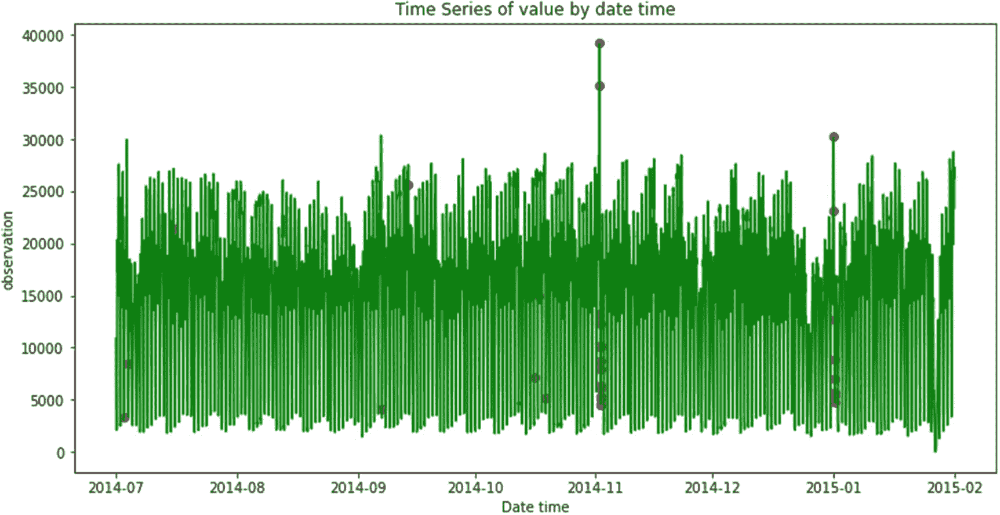

散点图绘制观测值与日期时间的对应关系。（2014-07，10000），（2014-08，28000），（2014-09，27000），（2014-11，40000），（2014-12，25000），（2015-01，32000），以及（2015-02，30000）。值是估计的。

图 9-67

使用 TCN 预测识别的异常

图 9-67 显示，相当多的点被标记为异常。错误数量比扩展 TCN 图中的要多，但最重要的是，模型在感恩节和新年除夕周围的峰值预测非常严重。

它确实错过了圣诞节和一月底的暴风雪事件。尝试调整模型架构和参数，以及 `time_steps` 参数，以获得更好的预测。

最后，这又是一个**无监督异常检测**的例子。我们取了原始序列的一个子集，训练模型对每个滚动窗口序列进行编码和解码，并计算了一个阈值，通过这个阈值我们可以识别出异常。在这个过程中，没有任何步骤涉及到训练标签。

## 摘要

在本章中，我们讨论了时间卷积网络，并看到了它们在应用于异常检测时的表现。

在第十章中，我们将探讨异常检测的实际应用案例。
