# 10. 转换器

在本章中，你将了解转换器网络以及如何使用转换器实现异常检测。

简而言之，本章涵盖了以下主题：

+   什么是转换器？

+   使用转换器进行异常检测

注意

代码示例提供在 Python 3.8 中。本书的代码仓库可在[`github.com/apress/beginning-anomaly-detection-python-deep-learning-2e/tree/master`](https://github.com/apress/beginning-anomaly-detection-python-deep-learning-2e/tree/master)找到。

仓库还包括一个 requirements.txt 文件，用于检查您的包及其版本。

本章的笔记本可在[`github.com/apress/beginning-anomaly-detection-python-deep-learning-2e/blob/master/Chapter%2010%20Transformers/chapter10_transformer.ipynb`](https://github.com/apress/beginning-anomaly-detection-python-deep-learning-2e/blob/master/Chapter%2010%20Transformers/chapter10_transformer.ipynb)找到。

导航到“第十章 转换器”，然后点击笔记本。代码也以 .py 文件的形式提供，尽管它是笔记本的导出版本。

我们将使用 JupyterLab 来展示所有的代码示例。

## 什么是转换器？

转换器是一类深度学习架构，它彻底改变了自然语言处理（NLP）领域。继基于循环神经网络（RNN）的架构，如 LSTM 模型之后，转换器网络能够扩展到极其大的参数和数据集大小，这得益于它们并行训练和推理的能力。这种并行化能力之所以可能，是因为网络的层依赖于自注意力的概念。

**自注意力**，从高层次来看，是模型学习根据特定被评估的标记，在序列中为标记分配重要性权重的机制。例如，考虑句子“狗吃了些食物，它变得饱了”，假设模型正在尝试评估在这个上下文中“它”的含义。单词“它”可能指的是“狗”或“食物”。模型通过从所有训练中识别出的语言模式，学习在这种情况下将更高的重要性分配给“狗”而不是“食物”，因此更关注“狗”。

在模型操作的数值术语中，当模型评估“它”的嵌入表示以理解序列时，它对“狗”的嵌入表示赋予更高的权重。在非常高的层次上，自注意力基本上意味着模型关注输入的具体细节以理解上下文。由于这个过程可以一次性在整个序列上操作，它能够准确地捕捉长距离依赖关系，避免梯度消失/爆炸，并避免在非常长的序列中丢失上下文。

转换器网络在许多 NLP 任务上优于基于 RNN 的对应物，例如文本分类、问答、情感分析、机器翻译等等。也许最新和最激动人心的转换器模型类型是大型语言模型（LLM）。在大量文本数据上训练的 LLM 执行文本生成、问答、摘要、翻译、代码编写甚至头脑风暴等任务。一些 LLM 可以被调整以作为对话聊天机器人，能够以类似人类的方式执行多个这些任务。在这些 LLM 中最著名和最成功的是 ChatGPT，这个模型非常强大，以至于一些研究人员将其基础模型 GPT4 描述为通往实现通用人工智能的关键点。

虽然我们不会在本章中创建任何有感知的 AI，但我们可以利用转换器模型在基于序列的任务上表现良好的能力来执行时间序列异常检测。与 RNN 相比，转换器模型具有以下优势：

+   **并行化**：转换器模型能够并行处理序列的能力，使其能够更充分地利用 GPU 计算能力，允许它在比基于 RNN 的网络更短的时间内并行训练和进行推理。

+   **长序列**：由于自注意力机制，转换器一次关注序列中的每个标记，无论距离多远。这允许更好地、更准确地建模序列中任何位置的标记之间的关系。

+   **可扩展性**：由于转换器的并行化，我们可以扩展到比基于 RNN 的网络可行的大得多的规模。

+   **梯度消失**：尽管转换器非常深，但它们在块之间使用残差跳跃连接，允许梯度在必要时更深入地通过网络传播，从而稳定训练，通过使网络更深来实现易于扩展。

+   **丰富的特征学习**：转换器可以有多个注意力头，每个注意力头都可以根据输入数据学习一组特定的特征。这有点类似于 CNN 滤波器可以学习不同的核，例如一个滤波器学习水平边缘检测，而另一个滤波器学习垂直边缘检测。拥有多个注意力头使转换器能够更深入、更好地理解给定的输入。

考虑到所有这些优势，很容易理解为什么转换器已经超越了 RNN，尽管一些 RNN 已经被修改以使用注意力机制。

话虽如此，转换器确实有一些缺点：

+   **计算需求**：转换器扩展得很好，但由于参数数量庞大，它们在计算上极其昂贵。它们需要大量的 GPU 内存，这既资源密集又昂贵。

+   **数据饥渴**：变压器也需要大量数据来训练，如果没有适当的计算资源，这可能很麻烦。

+   **过拟合**：变压器有大量参数，这意味着它们的模型容量非常高。虽然这使得它们能够非常强大地执行，但也可能导致对较小数据集的严重过拟合。

+   **顺序推理**：尽管变压器并行执行序列处理，但它们是顺序生成标记的——一次生成一个，使用之前的标记。只是序列处理本身是并行的，而在 LSTM 中仍然是顺序的。

+   **幻觉**：更适用于文本生成任务，变压器可以“产生”听起来合理但实际上是错误的输出。这在倾向于自信地编造错误信息的 LLM 中是明显的。

### 变压器架构

图 10-1 展示了变压器的架构看起来是什么样子^(1)。

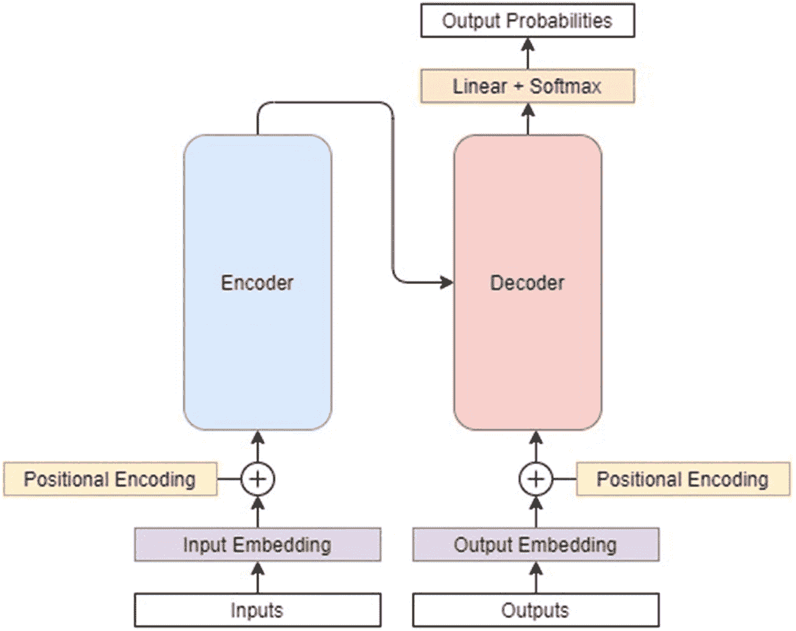

变压器的架构图显示了一个编码器连接到具有输出概率的解码器。编码器有输入和输入嵌入，解码器有输出和输出嵌入。

图 10-1

变压器的整体架构，由编码器（蓝色块）和解码器（红色块）组成

在高层次上，编码器的任务是学习以某种方式编码输入序列，从而允许对原始输入序列有丰富的理解。然后解码器处理输出嵌入和解码器的编码输出，进行处理，并输出某种类型的值。这可能是文本生成模型中的单词标记，或者回归模型中的实值输出。在图 10-1 以及从该图改编的原始论文中，解码器输出通过线性层和 `softmax()` 层进行处理，以创建确定输出单词标记的概率。

输入嵌入是原始输入标记的表示，旨在捕捉其含义。输入嵌入可以预先初始化为特定的学习嵌入，或者它们可以通过模型在训练过程中学习。输出嵌入也是如此。由于模型没有递归并且并行处理整个序列，变压器无法理解序列中标记的顺序。这就是为什么我们必须包含位置嵌入，它有助于编码序列中所有标记的相对位置。

### 变压器编码器

接下来，让我们详细看看编码器。参见图 10-2。

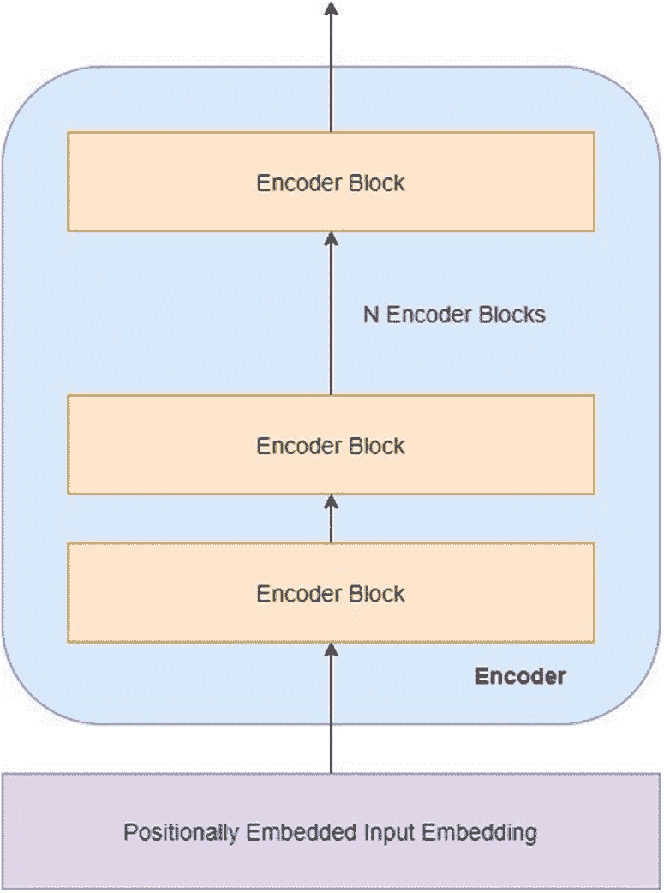

逆流程图如下。位置嵌入的输入嵌入导致 N 个编码器块。编码器块是编码器的一部分。

图 10-2

编码器接收组合的输入嵌入和位置嵌入，并通过一系列 N 个编码器块传递。

编码器本身由一系列编码器块组成，输入通过这些块。在整个编码器结束时，输出序列应该是一种编码嵌入，它代表了原始输入序列。

那么，这个编码器块中到底包含什么呢？请参阅图 10-3。

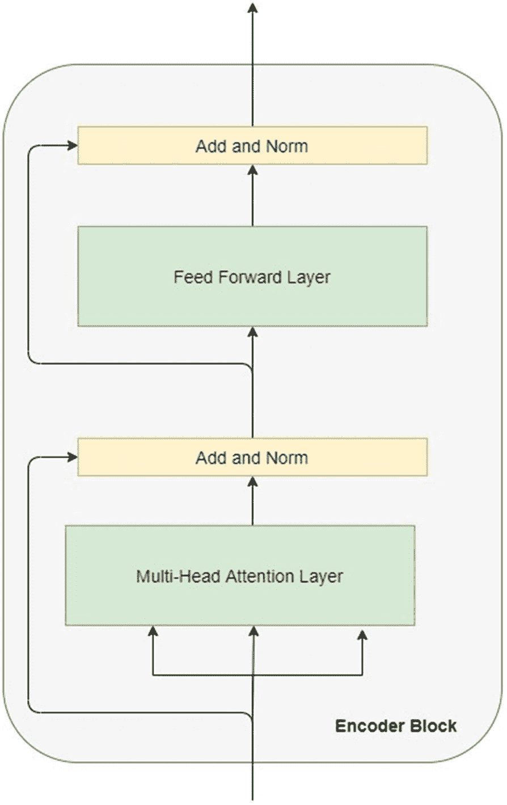

流程图包含编码器块的组件如下。多头注意力层，加和归一化，和前馈层。通往注意力层的路径连接到加和归一化。从第一个加和归一化到第二个加和归一化的路径连接。

图 10-3

一个编码器块

编码器块通过一个多头注意力层传递输入，该层负责计算注意力权重，并为每个注意力头学习不同的特征，这些特征通过前馈层进行聚合。所谓的“加和归一化”步骤基本上是将多头注意力层之前的输入加到多头注意力层的输出上，然后对其进行归一化。这被称为 *残差跳跃连接*，因为在反向传播过程中，梯度可以更直接地向上传播网络，如果需要，可以跳过多头注意力层。由于梯度可以跳过多头注意力层，因此避免了梯度消失的问题，因为链式法则会添加更多要乘以梯度的值，并可能减小其幅度（如果这些乘数的大小也小于 1）。这使得 Transformer 可以变得非常深，因为梯度信号可以向上传播更远，而不会减小幅度。

前馈层是一个常规的神经网络层，那么多头注意力层是什么呢？请参阅图 10-4。

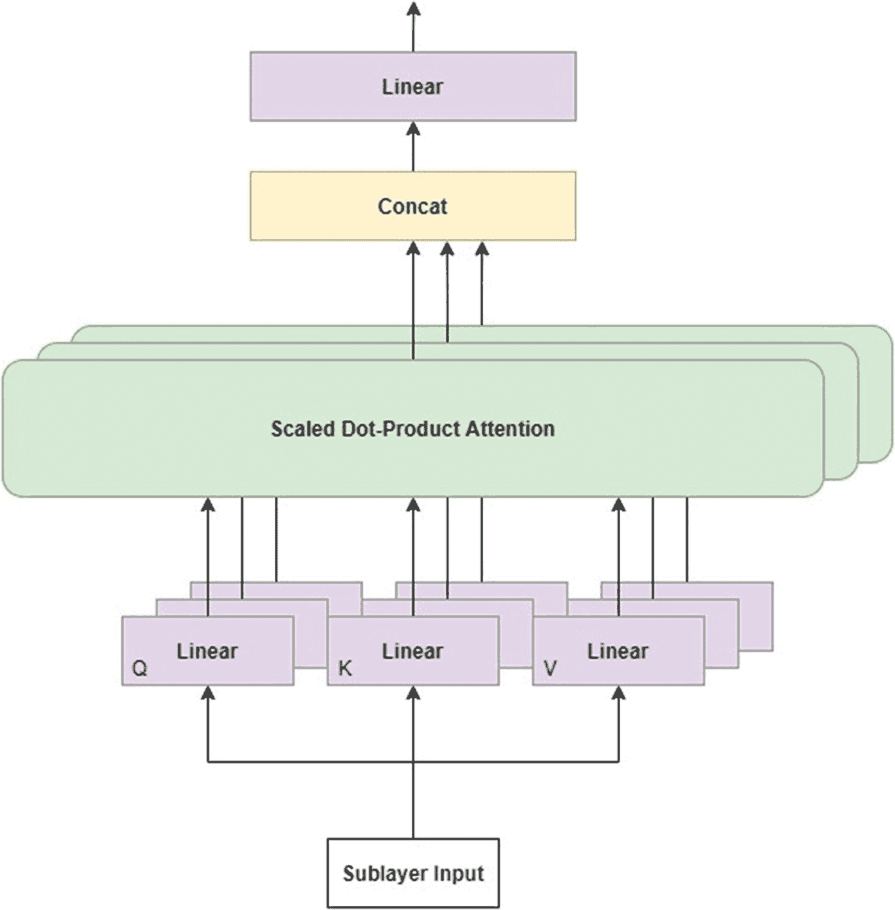

流程图如下。子层输入指向 Q 线性，K 线性，和 V 线性，它们指向缩放点积注意力，连接和线性。

图 10-4

放大查看多头注意力层

子层指的是多头注意力子层。专注于这个多头注意力层的一个特定头，子层输入通过三个独立的线性层传递，每个层负责计算 **查询 (Q)**、**键 (K)** 和 **值 (V)** 矩阵。让我们放大缩放点积注意力块本身，看看 Q、K 和 V 矩阵是如何使用的。请参阅图 10-5。

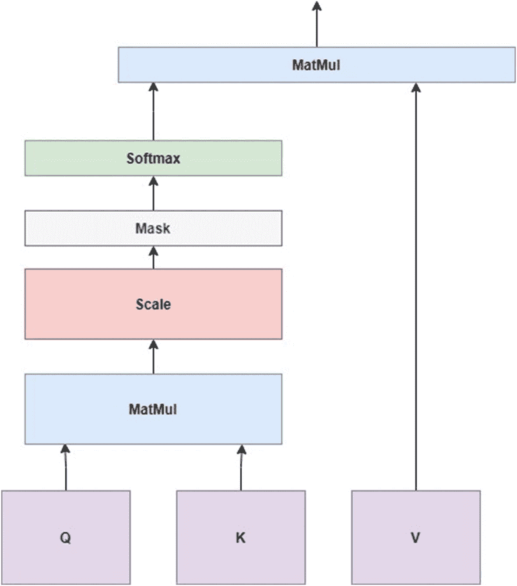

流程图如下。Q 和 K，矩阵乘法，缩放，掩码，Soft Max，矩阵乘法。V 指向第二个矩阵乘法。从第二个矩阵乘法延伸出一个向外箭头。

图 10-5

在缩放点积注意力头中如何使用 Q、K 和 V 矩阵。掩码是可选的

图 10-5 描述了在由各自的线性层输出的 Q、K 和 V 矩阵的条件下，缩放点积注意力层中发生的情况。这些线性层是没有激活函数的神经网络层。

让我们关注一下高层次的内容。Q、K 和 V 可以这样理解：

+   **Q (Query)**: 关于输入中某些部分的“问题”。不同的注意力头可以关注输入的不同部分，从而对输入提出不同的问题。例如：在输入“the animal is eating food”（这只动物正在吃食物）中，“the animal”（这只动物）这个短语最相关的是什么？

+   **K (Key)**: “参考”材料，以特定方式转换输入。当计算 Q、K 的缩放点积并随后应用`softmax()`时，我们得到注意力分数，这些分数“回答”了问题，并给出了对哪些标记需要给予“关注”的重要性的加权。例如：“eating”（吃）可能在输入“the animal is eating food”（这只动物正在吃食物）中具有最高的注意力分数。

+   **V (Value)**: “答案”和输入的不同转换。当与注意力分数相乘时，我们得到缩放点积注意力机制的最终输出嵌入。例如：Q 和 K 告诉我们“eating”（吃）与“the animal”（这只动物）最相关。生成的嵌入是对输入句子的一种解释，专注于“the animal”（这只动物）和“eating”（吃），然后由后续层进一步转换。

请记住，由于存在多个注意力头，每个头都会学会提出不同的问题，最终产生对原始输入更丰富和多样化的理解。当这些模型在大量多样化的数据上进行扩展时，它们可以学会在不同领域之间建立概念和想法的联系，使得像 ChatGPT 这样的 LLM 能够在广泛的领域内产生更有说服力、信息丰富和准确的回答（尽管 LLM 有时会产生自信但事实上不准确的答案）。

回到多头注意力层，每个缩放点积注意力头的输出被连接起来，并通过一个线性层传递。现在，我们应该到达图 10-3 中的加和归一化步骤。将这个多头注意力层的输出加到其输入上并归一化后，我们通过一个前馈层（一个带有激活函数的神经网络层）传递，然后重复另一个加和归一化步骤。

在所有前面的讨论之后，我们已经探讨了编码器块的工作原理。编码器层只是 N 个这样的编码器块的序列，其最终输出是生成的最终编码。

### Transformer 解码器

解码器架构与编码器非常相似，但有一些关键的不同之处。让我们看一下解码器架构的高层次概述，如图 10-6 所示。

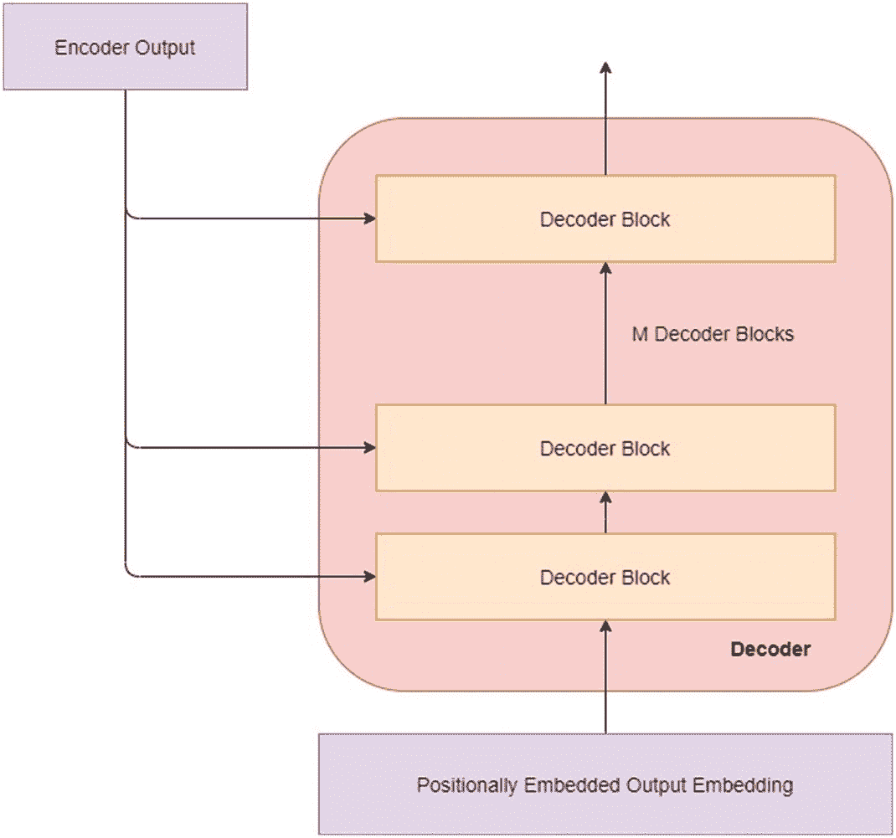

流程图如下。位置嵌入输出嵌入和 M 个解码器块。从编码器输出指向每个解码器块的三条箭头。解码器块是解码器的组成部分。

图 10-6

Transformer 中解码器的高级概述

解码器由 M 个解码器块组成，每个块都将编码器的最终输出作为前一个解码器块输出的附加输入（如果是第一个解码器块，则为带有位置编码的输出嵌入）。

这些解码器块看起来是什么样子？请参考图 10-7a。

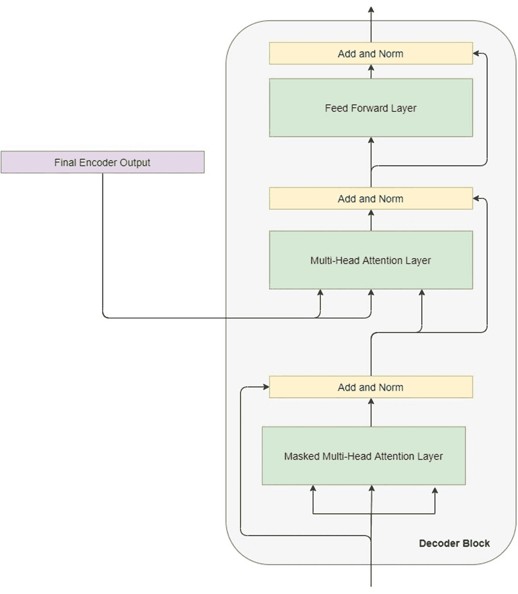

流程图如下。遮蔽多头注意力层、加和归一化、多头注意力层、加和归一化、前馈层和加和归一化。最终的编码器输出指向多头注意力层。

图 10-7a

解码器有一个额外的多头注意力层，该层执行交叉注意力（关注编码器最终输出的自注意力）

被遮蔽的多头注意力层执行与编码器中的多头注意力层相同的功能，除了它应用了一个因果掩码，因此注意力是在前一个标记上计算的，而不是在未来的标记上。

对于第二个多头注意力层，这个层没有被遮蔽。查询来自被遮蔽的多头注意力层的输出，但键和值矩阵是使用最终编码器层的输出计算的。这允许在编码器对原始输入序列的表示的上下文中计算注意力分数。

例如，在从英语到法语的语言翻译任务中，编码器可以处理英语句子并输出一些编码。这种编码可以看作是一种“思维”矩阵，代表初始英语句子。在翻译成法语时，模型使用这个思维矩阵来关注英语句子的相关部分。解码器块的其余部分与编码器块中的情况相同。

解码器的最终输出可以根据需要传递到进一步的层。在图 10-1 中，它被传递到一个线性层，然后通过 softmax 得到一个输出标记的概率分布。

总体而言，Transformer 架构看起来如图 10-7b 所示。

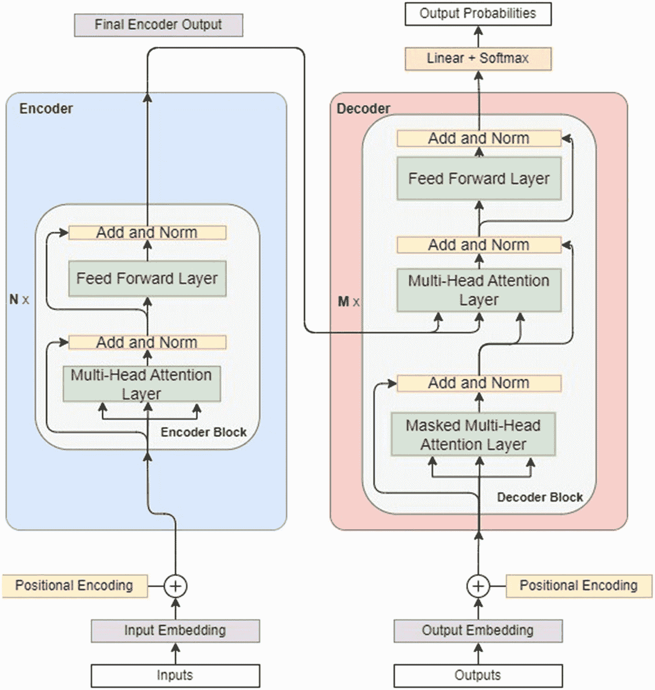

架构流程如下。编码器有输入、输入嵌入和一个编码器块，该块包含一个加和归一化层，指向解码器的多头注意力层。解码器有输出、输出嵌入和一个解码器块，该块包含多个层，最终输出概率。

图 10-7b

包括编码器块和解码器块在内的完整 Transformer 架构。N 和 M 可能相等，正如在原始的《Attention Is All You Need》中那样。

### Transformer 推理

使用转换器进行推理是自回归的。以下是在机器翻译设置中的工作方式：

1.  使用编码器对输入句子进行编码。

1.  使用 `<sos>` 作为标记来指示解码器句子的开始。

1.  使用 `<sos>` 和编码，获取下一个单词的概率分布。

    +   使用选择技术选择一个单词——贪婪搜索算法选择概率最高的单词，但您也可以采样前 K 个标记或进行束搜索。

1.  取下一个单词，将其添加到输出序列中，以获得 `<sos>` 和 `<first_output>`，其中 `<first_output>` 指的是所选的第一个单词。

1.  重复此过程，直到达到截止长度或达到序列的结束标记 `<eos>`，表示句子的结束。

这样，你应该对转换器网络的工作原理有一个高级的理解。现在我们可以开始实现转换器并使用它来进行时间序列异常检测。

### 使用转换器进行异常检测

让我们尝试将一个转换器应用于纽约出租车数据集，看看它在时间序列设置中如何执行**无监督异常检测**。就像在前两章中的 LSTM 和 TCN 示例一样，我们将训练转换器以接受时间步长 1 到 T-1 的输入序列，并预测第 T 个时间序列值。再次，时间序列数据的前一半将被设置为训练集，因为它不应该包含后一半中出现的异常。预测误差的第 95 百分位数（由预测值和实际时间序列值之间的平均绝对误差给出）用作确定异常的错误阈值。如果一个预测误差高于此阈值，则将其标记为异常。

只在序列的前半部分进行训练的理由是，在我们用异常预测后半部分之前，教模型正常时间序列值看起来是什么样子。想法是预测值不会匹配异常，产生更高的误差，并被标记为异常。由于异常检测不需要标签，这是一个无监督学习任务。

访问提供的笔记本[`github.com/apress/beginning-anomaly-detection-python-deep-learning-2e/blob/master/Chapter%2010%20Transformers/chapter10_transformer.ipynb`](https://github.com/apress/beginning-anomaly-detection-python-deep-learning-2e/blob/master/Chapter%2010%20Transformers/chapter10_transformer.ipynb)。

数据也提供在 GitHub 上，在[`github.com/apress/beginning-anomaly-detection-python-deep-learning-2e/tree/master/data`](https://github.com/apress/beginning-anomaly-detection-python-deep-learning-2e/tree/master/data)。

需要注意的一点是，Keras 中没有现成的 transformer 层的实现，因此必须从头开始实现和定义。TensorFlow 提供了一个实现基本 transformer 的指南，请参阅[`www.tensorflow.org/text/tutorials/transformer`](https://www.tensorflow.org/text/tutorials/transformer)。在本节中，我们包含该代码并对代码进行了一些小的修改以适应我们的任务，因为我们不是进行机器翻译（它期望单词的标记表示），而是在直接值上操作。

首先，如图 10-8 所示，导入所有必要的包。

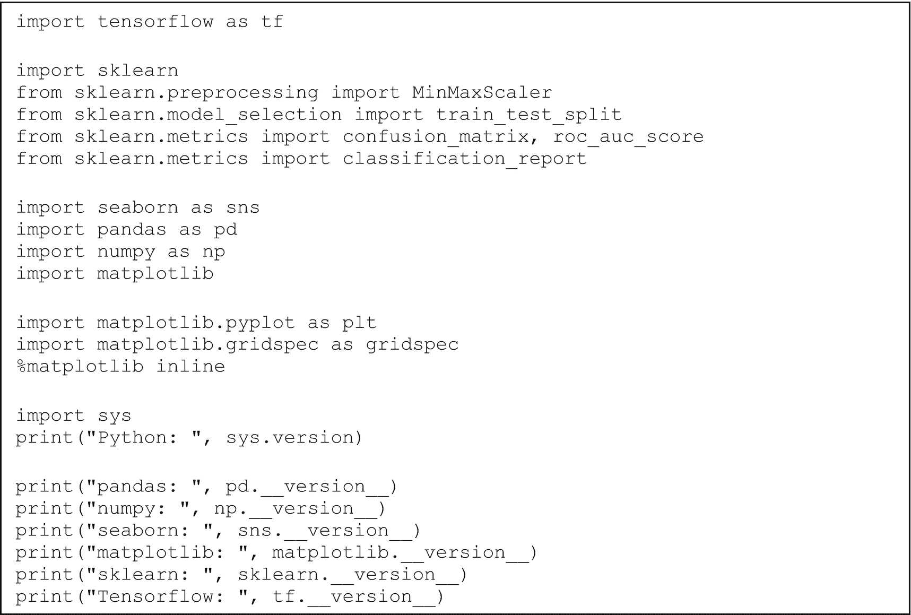

一组导入 TensorFlow 的代码，使用像 import, print 这样的函数以及其他像 mat plot lib dot p y plot, confusion underscore matrix, 和 classification underscore report 这样的元素。

图 10-8

导入所有必要的包

你应该看到以下输出：

```py
Python:  3.8.12 (default, Oct 12 2021, 03:01:40) [MSC v.1916 64 bit (AMD64)]
pandas:  2.0.0
numpy:  1.22.2
seaborn:  0.12.2
matplotlib:  3.7.1
sklearn:  1.2.2
Tensorflow:  2.7.0
```

之后，我们继续定义我们的 `Visualization` 类，如图 10-9 所示。

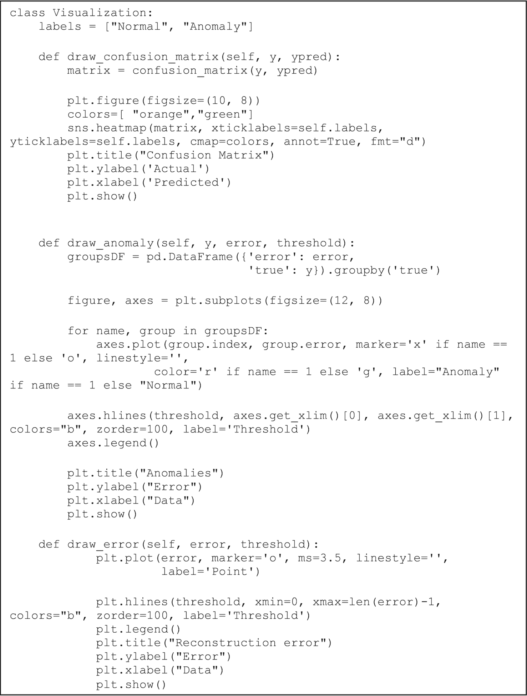

一组用于类可视化的代码具有像 labels, def, for, else, if 这样的函数和一些像 p l t dot title, p l t dot y label, p l t dot x label, 和 p l t dot show 这样的变量。

图 10-9

定义可视化类

接下来，让我们定义加载我们数据的机制，如图 10-10 所示。

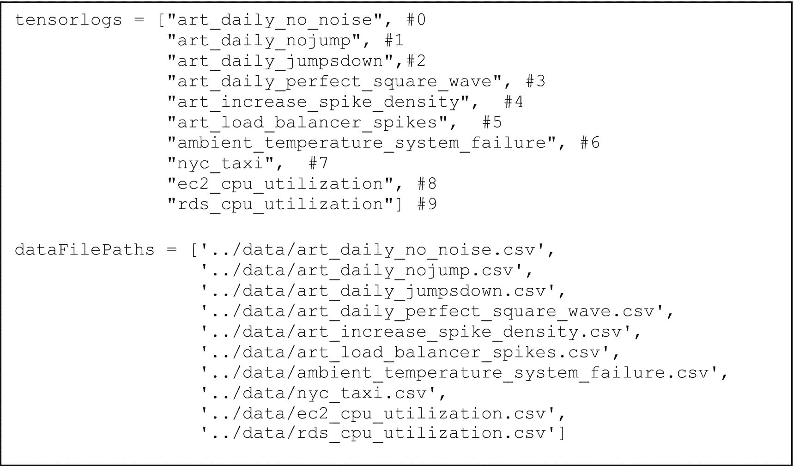

一个算法在 tensor logs 和数据文件路径下有一组代码。

图 10-10

定义数据集路径以便能够轻松地在它们之间切换

现在让我们选择我们的数据集（图 10-11）。

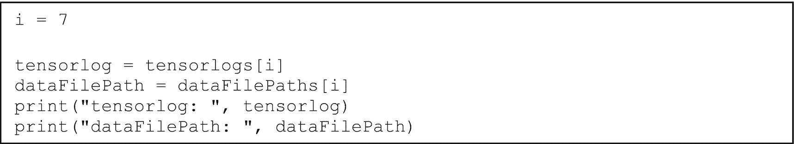

一组代码具有像 i = 7, tensor log, 和数据文件路径这样的变量，以及像 print 这样的函数。

图 10-11

选择我们的数据集。我们选择了 `i = 7`，这将加载纽约出租车数据集

你的输出应该看起来像这样：

```py
tensorlog:  nyc_taxi
dataFilePath:  ../data/nyc_taxi.csv
```

让我们继续加载我们选择的数据集（图 10-12）。

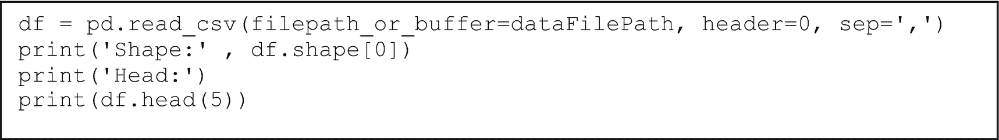

一组代码具有像 d f 和 print 这样的函数以及像 p d dot read underscore c s v, d f dot shape, 和 d f dot head 这样的变量。

图 10-12

加载所选数据集的代码

你的输出应该看起来像这样：

```py
Shape: 10320
Head:
timestamp  value
0  2014-07-01 00:00:00  10844
1  2014-07-01 00:30:00   8127
2  2014-07-01 01:00:00   6210
3  2014-07-01 01:30:00   4656
4  2014-07-01 02:00:00   3820
```

让我们绘制我们的时间序列数据。请参阅图 10-13a 和图 10-13b。


按日期时间绘制的值时间序列图将值与日期时间进行比较，并具有密集波动的曲线，具有尖锐的高点和低点。

图 10-13b

绘制的时间序列数据集。这是纽约出租车数据集

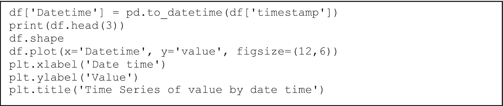

一组代码具有如 d f 和 print 等函数，以及一些变量，如 p d dot to underscore date time、d f dot shape、d f dot head、p l t dot x label、p l t dot y label 和 p l t dot title。

图 10-13a

绘制时间序列数据集的代码

我们应该接下来对数据集进行缩放。参见图 10-14。

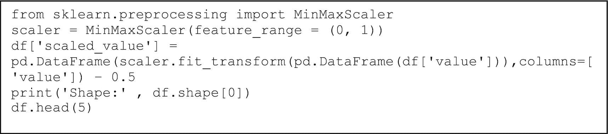

一组代码具有如 from、import 和 print 等函数，以及一些变量，如 p d dot data frame、d f dot head 和 s k learn dot preprocessing。

图 10-14

将数据集缩放到 0 到 1 范围内的代码。然后，我们将所有值向下移动 0.5，使得范围在 –0.5 到 0.5 之间，这使得模型更容易训练，因为输出是零中心的

输出数据框应类似于表 10-1。

表 10-1

数据框中的缩放值

|   | 时间戳 | 值 | 日期时间 | 缩放值 |
| --- | --- | --- | --- | --- |
| **0** | 2014-07-01 00:00:00 | 10844 | 2014-07-01 00:00:00 | 0.276506 |
| **1** | 2014-07-01 00:30:00 | 8127 | 2014-07-01 00:30:00 | 0.207175 |
| **2** | 2014-07-01 01:00:00 | 6210 | 2014-07-01 01:00:00 | 0.158259 |
| **3** | 2014-07-01 01:30:00 | 4656 | 2014-07-01 01:30:00 | 0.118605 |
| 4 | 2014-07-01 02:00:00 | 3820 | 2014-07-01 02:00:00 | 0.097272 |

现在让我们创建训练数据集。我们将使用滚动窗口方法，窗口大小为 `time_steps`，我们将在此解释中简写为 **T**。我们将以 T 长度的窗口一次迭代通过数据集，将前 T-1 个值作为 x，将 T^(th) 个值作为 y。我们将教会模型读取 T-1 个值的输入并预测 T^(th)。参见图 10-15。

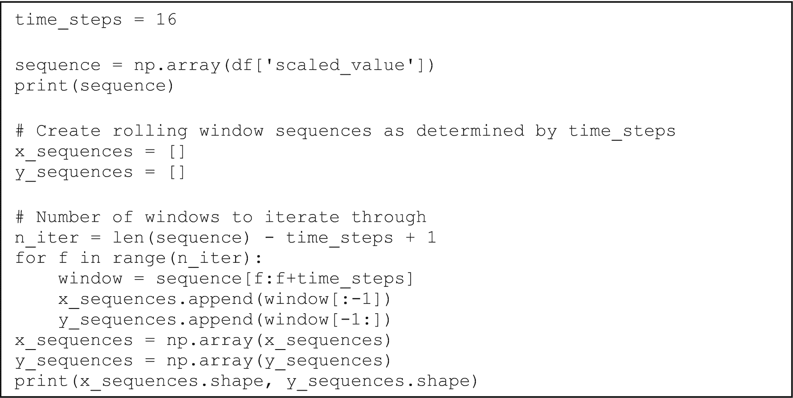

一组代码用于根据时间下划线步骤和要迭代的窗口数量创建滚动窗口序列。

图 10-15

创建滚动窗口特征以输入到模型中

你应该看到以下类似的内容：

```py
[0.27650616 0.20717548 0.1582587  ... 0.69664957 0.6783281  0.67059634]
(10305, 15) (10305, 1)
```

让我们创建我们的训练序列。参见图 10-16。

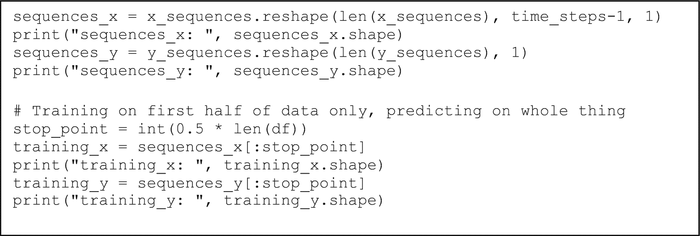

一组代码具有一些函数如 print 和 len，以及一些变量如 sequences underscore x、sequences underscore y、stop underscore point 和 training underscore x。注释为，仅在数据的前一半进行训练，在整个数据上进行预测。

图 10-16

定义训练数据

你应该看到如下输出：

```py
sequences_x:  (10305, 15, 1)
sequences_y:  (10305, 1)
training_x:  (5160, 15, 1)
training_y:  (5160, 1)
```

在数据准备完成之后，让我们开始定义模型架构。首先，让我们定义位置嵌入代码。参见图 10-17。

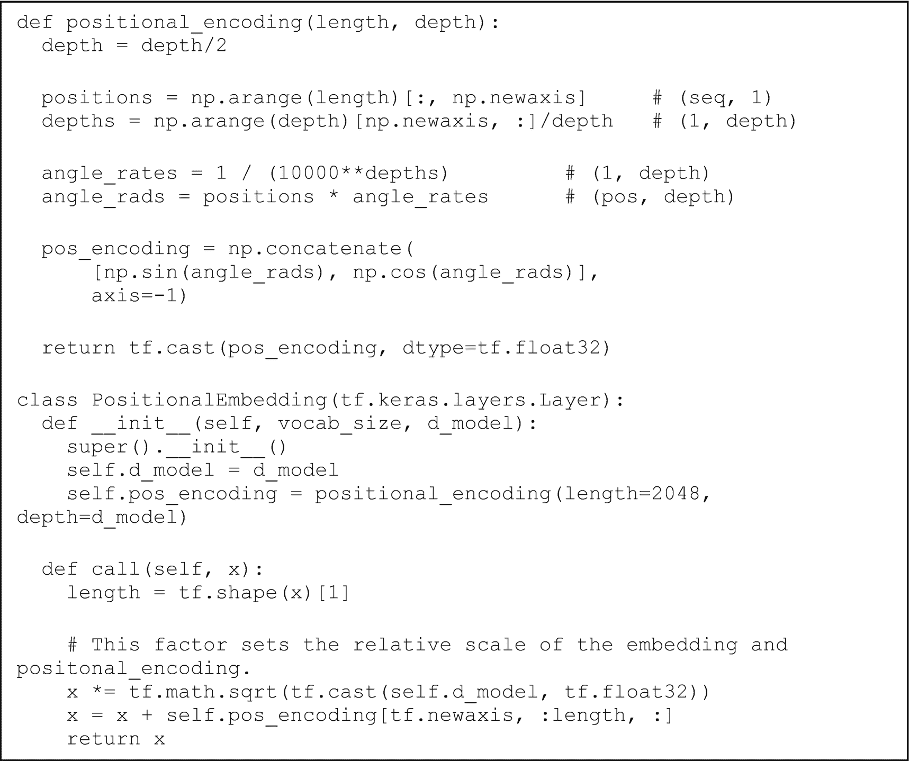

一组用于设置嵌入和位置编码相对比例的代码具有如 def、return、class 等函数，以及一些变量，如位置下划线编码、n p dot arrange 和 t f dot cast。

图 10-17

位置编码代码的定义

如果你正在跟随 TensorFlow 的教程，你会注意到这里已经移除了对嵌入层的调用。这是因为我们传递了实值输入，我们并不试图嵌入它们。话虽如此，我们仍然想要位置编码这些输入，因此我们需要位置编码来告诉 Transformer 输入序列中每个元素的相对顺序。

接下来，我们将定义注意力层。参见图 10-18。

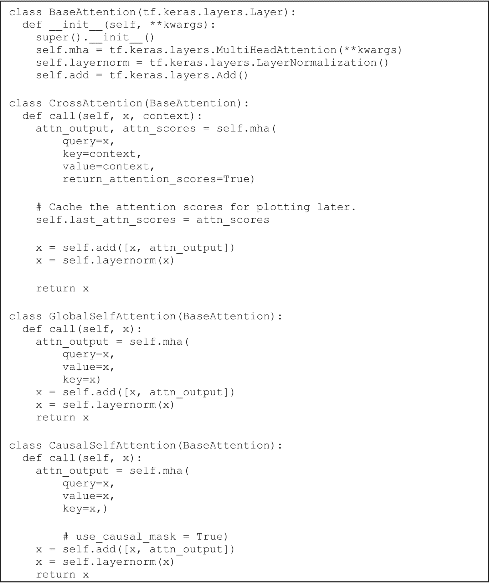

一组用于缓存注意力分数以便稍后绘图并使用因果掩码的代码。

图 10-18

定义注意力层

对于 TensorFlow 2.7.0 专门，我们必须从 `CausalSelfAttention` 类中移除 `use_causal_mask=True` 参数。

接下来，让我们定义前馈块，如图 10-19 所示。

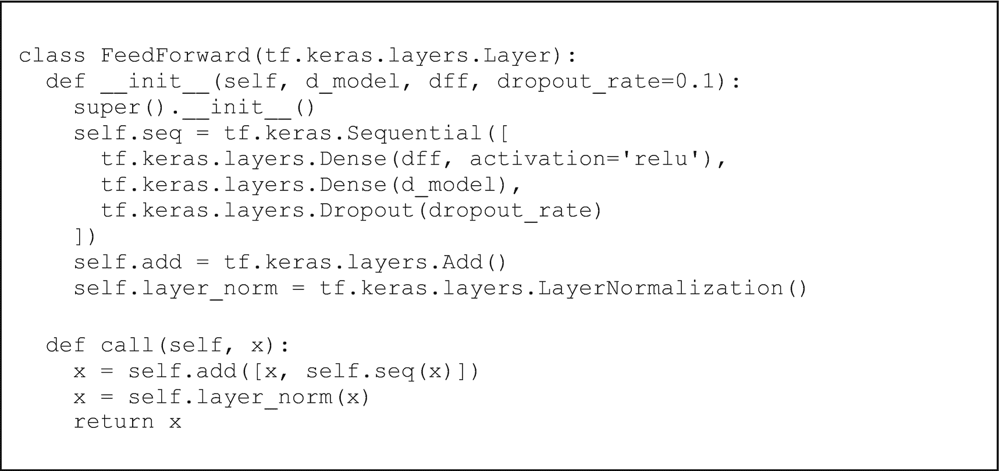

一组代码包含一些函数，如类、def 和 return，以及一些变量，如 self 点 s e q、self 点 add 和 self 点 layer 下划线 norm。

图 10-19

前馈块

我们现在可以定义编码层。参见图 10-20。

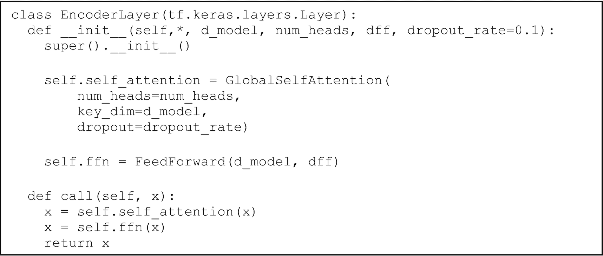

一组代码包含一些函数，如类、def 和 return，以及一些变量，如 self 点 f f n、self 点 self 下划线 attention 和 self 点 f f n of x。

图 10-20

编码层的定义

在定义了编码层代码后，让我们为整个编码器本身做同样的操作。参见图 10-21。

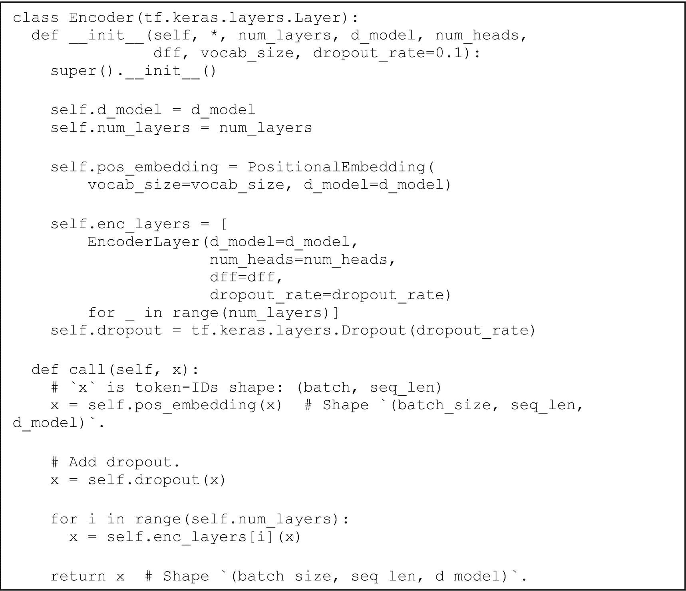

一组代码包含一些函数，如类、def、for 和 return，以及一些变量，如 self 点 d 下划线模型、self 点 e n c 下划线层、self 点 dropout 和 self 点 e n c 下划线层。

图 10-21

编码器的定义

我们必须为解码器做同样的事情。要定义解码器层，请参见图 10-22。

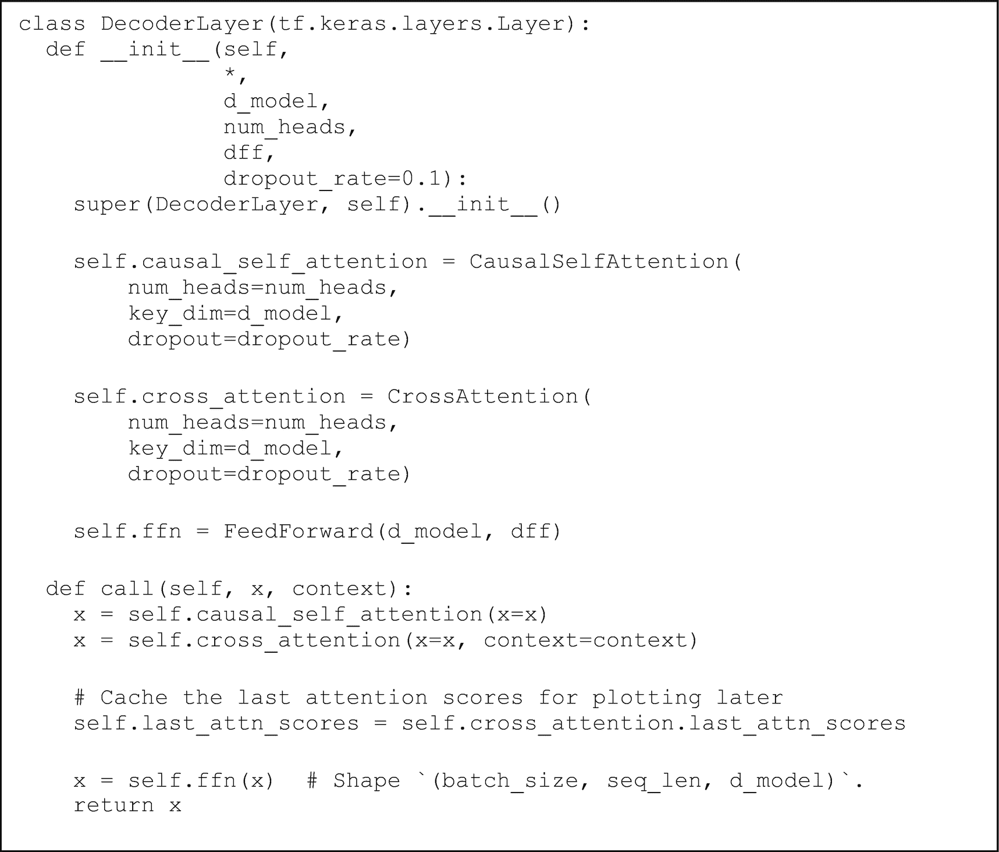

一组用于缓存最后注意力分数以便稍后绘图的代码包含一些函数，如类、def 和 return，以及一些变量，如 self 点 causal 下划线 self 下划线 attention、num 下划线 heads、key 下划线 dim 和 self 点 f f n。

图 10-22

解码器层定义

图 10-23 显示了解码器的完整定义。

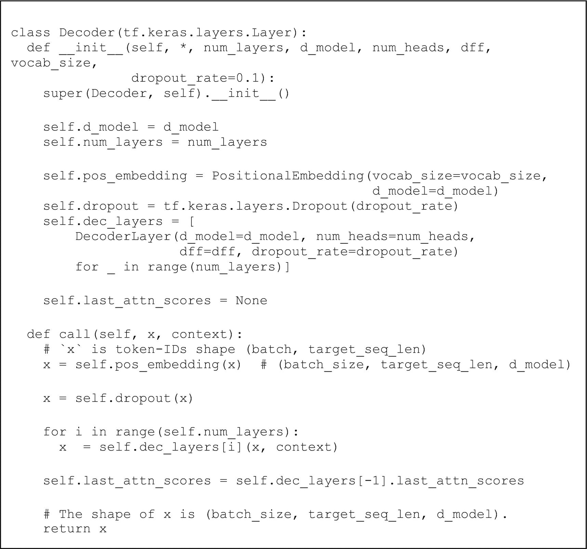

一组代码包含一些函数，如类、def 和 return，以及一些变量，如 dropout 下划线率、self 点 d 下划线模型、self 点 dropout 和 self 点 d e c 下划线层。

图 10-23

解码器的定义

在定义了所有 Transformer 的组件后，我们现在可以定义 Transformer 模型代码本身。参见图 10-24。

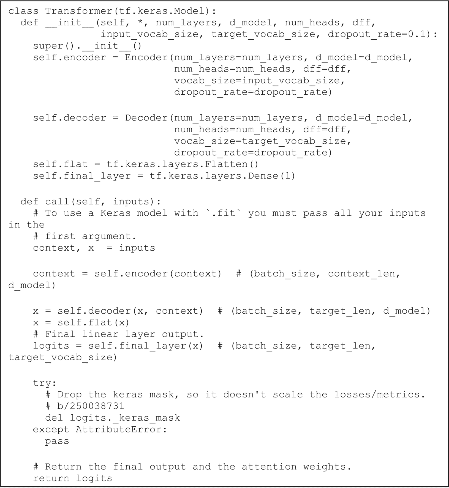

使用 Keras 模型并使用点 fit 的代码必须将所有输入传递到第一个参数中，以丢弃 Keras 遮罩，这样它就不会缩放损失/指标并返回最终输出和注意力权重。

图 10-24

转换器模型定义

现在我们可以开始训练了。让我们设置随机种子，以便训练更加一致，并让我们用一些超参数实例化我们的模型。参见图 10-25。

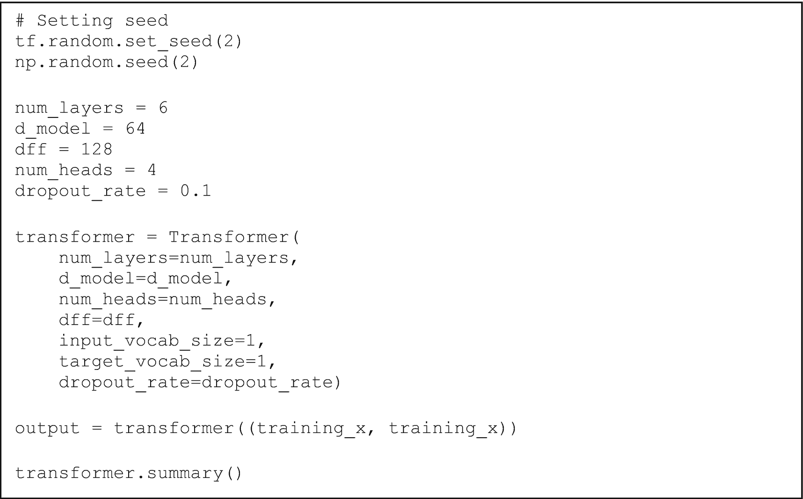

设置随机种子的代码包含一些变量，如 t f 点 random 点 set underscore seed、num underscore layers、dropout underscore rate、input underscore vocab underscore size 和 transformer 点 summary。

图 10-25

设置随机种子、实例化和构建转换器网络。`output = 转换器((training_x, training_x))` 构建转换器对象，以便我们可以打印摘要并在后续步骤中使用它。

你应该看到如图 10-26 所示的输出。

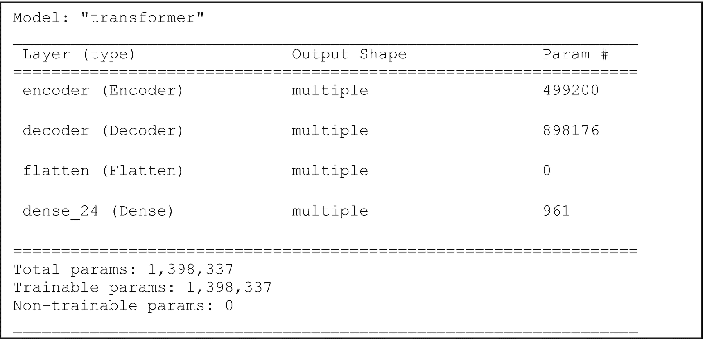

模型转换器的表格有 3 列，即层类型、输出形状和参数数量。提供了总参数、可训练参数和非可训练参数的数据。

图 10-26

转换器网络架构摘要

该模型有超过一百万个参数！现在让我们编译我们的模型。参见图 10-27。

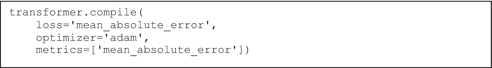

一组代码包含变量如转换器点编译、损失、优化器和指标。

图 10-27

编译模型以使用 Adam 优化器和平均绝对误差作为损失函数

让我们开始训练过程。参见图 10-28。


一行代码如下。history = 转换器点 fit，左括号左括号，training underscore x，逗号 training underscore x，右括号，逗号 training underscore y，epochs = 8，逗号，右括号。

图 10-28

开始训练过程。x 输入是一个元组 `(training_x, training_x)`。我们正在告诉转换器应该对训练输入进行编码，并让解码器以相同的方式解码它。然后，基于解码器的输出，我们预测下一个时间步。

训练输出应该看起来像图 10-29。

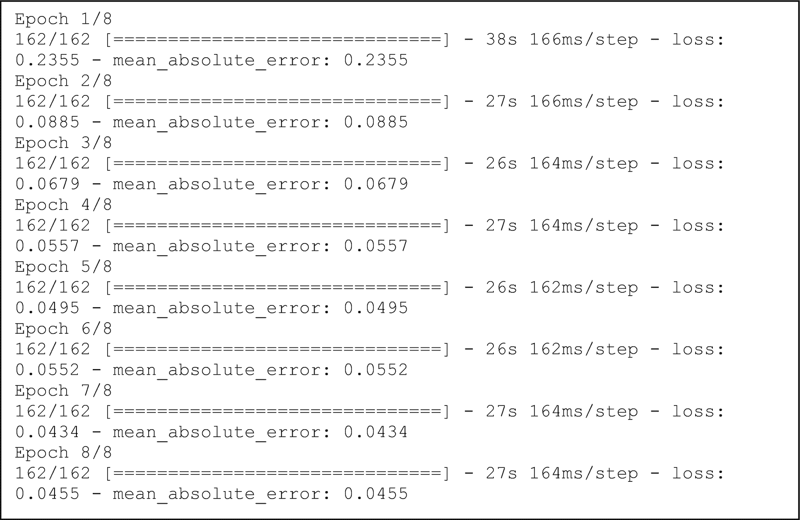

一组代码具有 8 个周期中的 1 个、2 个、3 个、4 个、5 个、6 个、7 个和 8 个周期的输出数据。

图 10-29

训练代码的输出

如果你没有看到损失值下降并与图 10-29 显示的（由损失和平均绝对误差指标给出）相匹配，并且它卡在约 0.15 的损失上，你应该重新启动训练过程。对于这个特定的数据集，如果 epoch 一直产生约 0.15 的损失，这表明转换器没有学习，并且只产生直线或其他错误输出。如果你希望，可以使用后续的代码块来可视化这一点。

给定种子设置和缩放数据的零中心化，训练应该是一致的，并且你的模型应该能够学习任务。

训练完成后，让我们继续进行预测。执行图 10-30 中的代码。

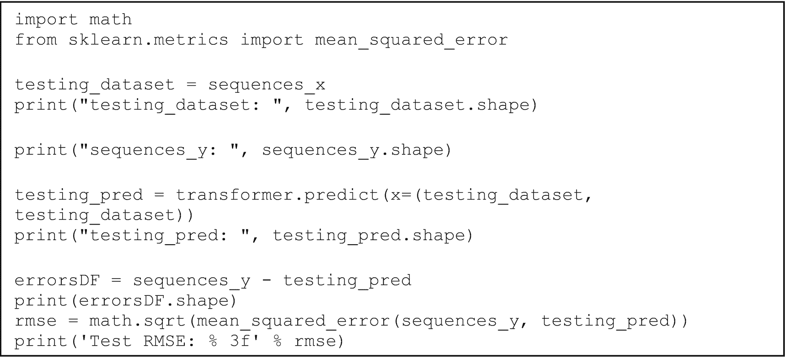

一组代码具有类似 import、print、testing underscore dataset、testing underscore p r e d、math dot s q r t 的函数。

图 10-30

使用训练模型进行预测

如果训练过程中一切顺利，输出应该看起来像这样：

```py
testing_dataset:  (10305, 15, 1)
sequences_y:  (10305, 1)
testing_pred:  (10305, 1)
(10305, 1)
Test RMSE: 0.039
```

现在让我们计算距离截止值以确定异常阈值。参见图 10-31。

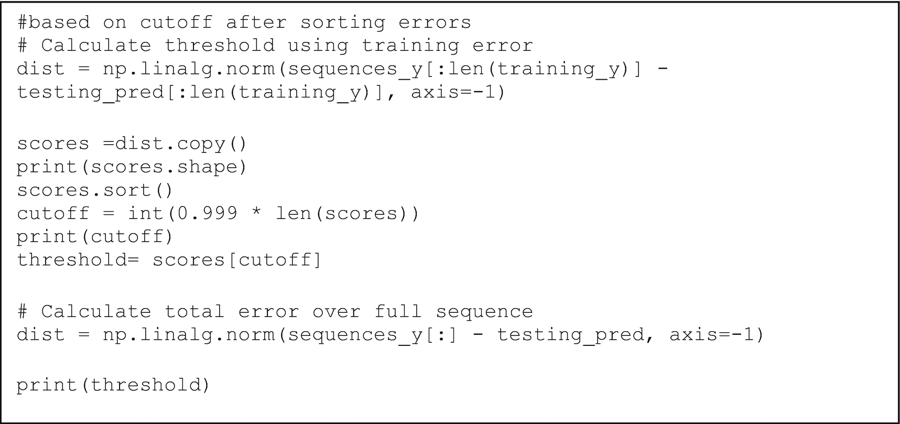

一组代码，用于使用训练误差计算阈值，并在整个序列上计算总误差。

图 10-31

计算最大预测误差阈值，使其仍然处于正常范围

你应该看到类似这样的输出：

```py
(5160,)
5154
0.13164996056429368
```

你确定的阈值可能不同，因为这完全取决于模型训练过程。

现在让我们绘制模型的预测。参见图 10-32a 和图 10-32b。

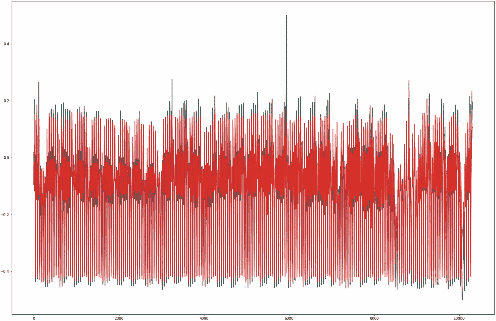

图形具有密集波动且高点和低点尖锐的曲线。

图 10-32b

生成的图表。模型似乎已经为数据集学习到了一个相当好的拟合。

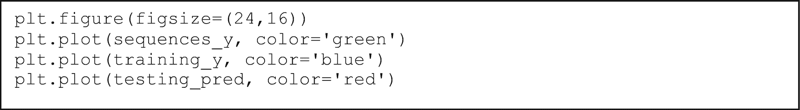

一组代码具有类似 p l t dot figure 和 p l t dot plot 的变量。

图 10-32a

代码用于绘制时间序列序列，颜色编码，其中 `绿色` 代表整个值序列的真实值，`蓝色` 仅代表训练分割，`红色` 代表模型对整个数据集时间序列值的预测。

让我们开始使用计算出的阈值来预测异常。参见图 10-33。

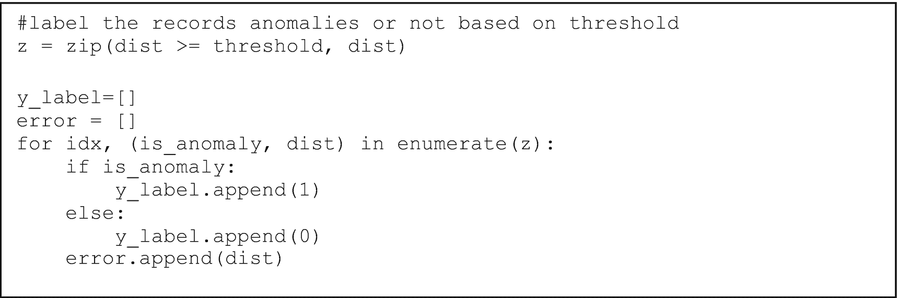

一组代码，根据阈值标记记录是否为异常。

图 10-33

代码用于计算每个数据点的异常标签

我们可以可视化这个误差阈值并找出哪些点超出了它。参见图 10-34 中的代码以绘制此阈值图。


以下是一组代码。Viz = 可视化左括号右括号。Viz 点 draw 点 underscore 异常，左括号，y 点 label 点逗号 误差 点逗号 阈值，右括号。

图 10-34

代码用于绘制误差阈值图

参见图 10-35 以查看生成的图表。

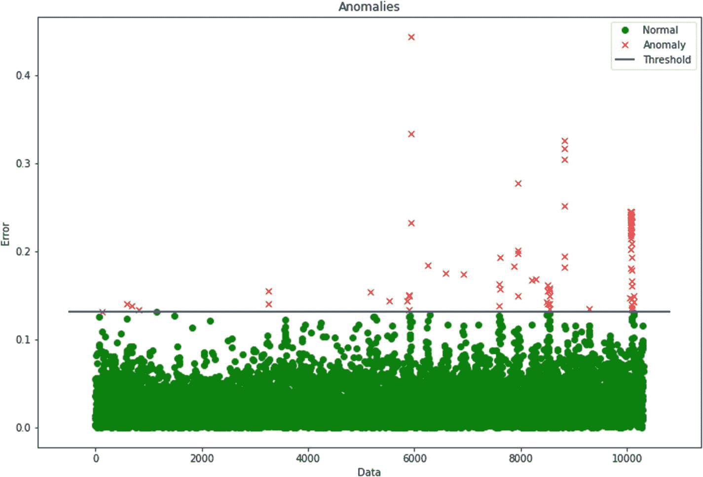

错误与数据的图表具有正常、异常和阈值的值。正常的图表密集。阈值的图表是一条水平线。异常的图表高于正常和阈值。

图 10-35

显示位于误差阈值之外的点的图表，因此被分类为异常

让我们创建一个异常预测数据框，以便更容易地绘制哪些点被确定为异常。参见图 10-36。


一组包含 a d f 和 error 函数以及 p d 点数据框、值和异常等变量的代码。

图 10-36

创建一个包含原始值以及观测预测误差和异常标志的数据框

输出应类似于表 10-2。

表 10-2

图 10-36 中的代码生成的数据框表

|   | 时间戳 | 观测值 | 误差 | 异常 |
| --- | --- | --- | --- | --- |
| **0** | 2014-07-01 00:00:00 | 10844 | 0.0 | 0 |
| **1** | 2014-07-01 00:30:00 | 8127 | 0.0 | 0 |
| **2** | 2014-07-01 01:00:00 | 6210 | 0.0 | 0 |
| **3** | 2014-07-01 01:30:00 | 4656 | 0.0 | 0 |
| **4** | 2014-07-01 02:00:00 | 3820 | 0.0 | 0 |

由于滚动窗口方法，我们对于前 `time_steps-1` 个数据点没有预测，这就是为什么它们被填充为零。现在让我们绘制最终的图表，以直观地显示异常。参见图 10-37 以查看此代码。

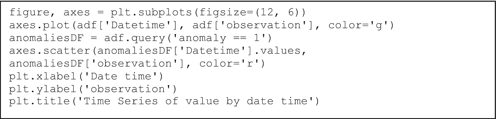

一组包含轴点图、轴点散点图、p l t 点 x 标签、p l t 点 y 标签和 p l t 点标题等变量的代码。

图 10-37

代码用于在原始时间序列序列上绘制异常点

结果看起来类似于图 10-38。

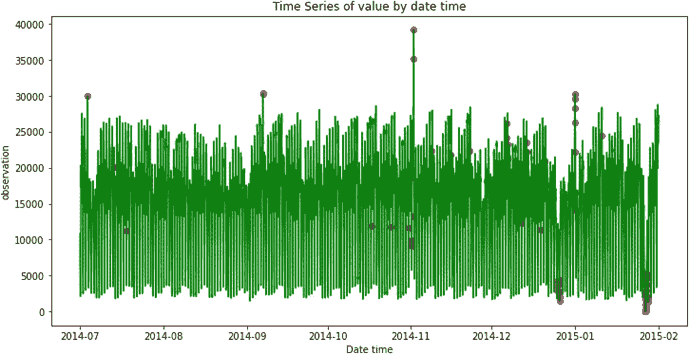

观测值与时间戳的图表具有密集波动曲线，有尖锐的高峰和几处在线上的点。

图 10-38

使用变压器预测识别的异常

图 10-38 显示，相当多的点被标记为异常。最重要的是，模型成功地将感恩节、圣诞节、除夕和类似暴风雪的天气异常预测为异常，以及其他一些点。尽管如此，还有一些点看起来不应该被标记为异常。Transformer 的一个问题是它确实倾向于过拟合，因为它具有很高的模型容量。然而，你可以调整 Transformer 模型的超参数，以及在你的训练循环中添加早期停止或其他机制，以查看你是否可以管理过拟合。

这是一个平衡行为，因为 Transformer 在训练过程中如何拟合训练数据将影响后续的异常检测算法。这是由于 Transformer 预测输出的时间序列的显著偏差将被标记为异常。但如果模型欠拟合训练数据，你可能会错过你应该注意到的异常。

总体来说，这是一个**无监督异常检测**的例子。我们取了原始序列的一部分，训练模型在给定滚动窗口的情况下输出预测，并通过计算一个阈值来识别异常。在这个过程中，没有任何步骤涉及到训练标签。

## 摘要

在本章中，我们讨论了 Transformer 网络，并考察了它们在应用于异常检测时的表现。

在第十一章中，我们将探讨异常检测在现实场景中的实际应用案例。
