# 11. 异常检测的实际用例和未来趋势

在本章中，你将了解异常检测如何在多个行业垂直领域中使用。你将探索如何使用异常检测技术来解决实际用例，并解决商业领域的现实问题。每个企业和用例都是不同的，我们无法简单地复制粘贴代码并在任何数据集中构建一个成功的模型来检测异常，因此本章涵盖了多个用例，以给你一个关于可能性以及思维过程背后的概念的想法。

简而言之，本章涵盖了以下主题：

+   什么是异常检测？

+   异常检测的实际应用案例

    +   电信

    +   银行

    +   环境

    +   医疗保健

    +   交通运输

    +   社交媒体

    +   金融和保险

    +   网络安全

    +   视频监控

    +   制造业

    +   智能家居

    +   零售

+   基于深度学习的异常检测实现

+   未来趋势

## 异常检测

异常检测涉及寻找不符合被认为是正常或预期行为模式的模式。企业可能会因为异常事件而损失数百万美元。消费者也可能损失数百万美元。事实上，每天都有许多情况，人们的生活和财产处于危险之中。如果你的银行账户被清空，那是个问题。如果你的水管破裂，导致地下室被淹，那也是个问题。如果机场的所有航班因为交通控制系统中的技术故障而延误，那也是个问题。如果你有一个被误诊或根本未诊断的健康问题，那是一个非常严重的问题，它直接影响到你的健康。

图 11-1 展示了一个异常的例子，一群皱眉的蓝色鱼中有一条微笑的彩虹色鱼。

一幅插图展示了 9 条鱼，排列成 3 行 3 列，中心是一条微笑着、彩虹色的鱼。

图 11-1

在一群皱眉的蓝色鱼中，有一条异常的彩虹色微笑的鱼

在商业用例中，一切都是以数据为中心，在这个背景下，异常检测就是识别异常数据点、事件或观察结果，因为这些结果与被认为是正常或典型数据有显著差异，引起了怀疑。许多这样的异常类型可能会对商业运营或底线产生重大影响，这就是为什么异常检测在行业中越来越受欢迎，许多企业都在大量投资于可以帮助他们在事情变得太晚之前识别异常行为的技术。这种主动的异常检测越来越明显，作为人工智能革命的一部分开发的新技术正在帮助更快地检测异常，以及以前从未可能的方式。

图 11-2 是旧金山金门大桥每天通过的汽车数量的一个例子。

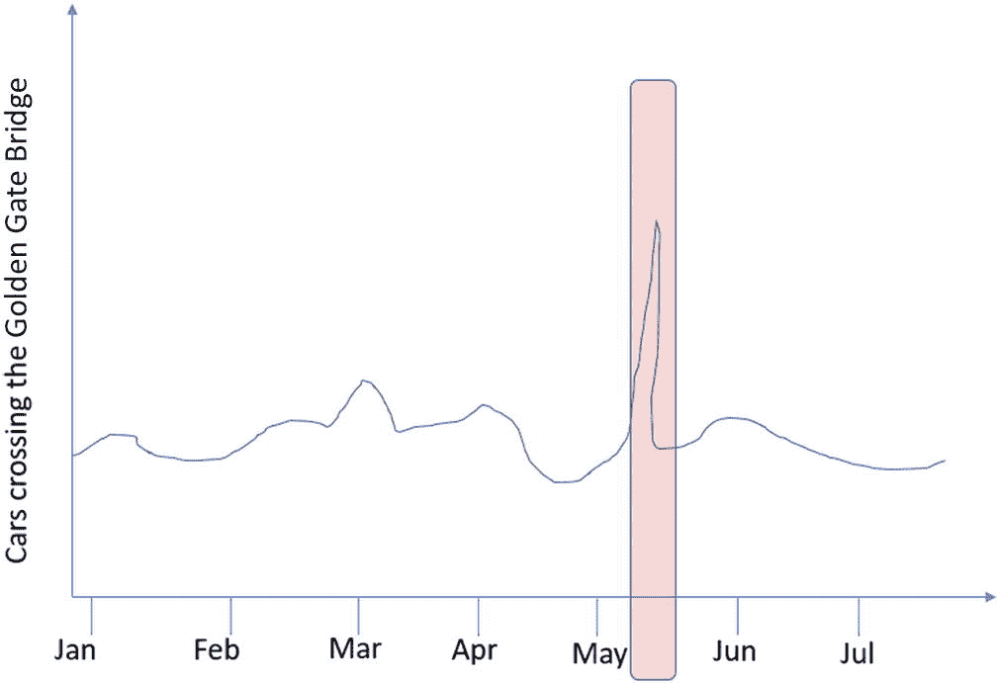

从一月到七月穿越金门大桥的汽车数量与月份的图表。图表有一个在五月和六月之间的波动曲线。

图 11-2

随时间推移穿越金门大桥的汽车每日计数。数据中的异常峰值被突出显示

能够帮助某些任意业务避免因异常而造成损失的类型检测，很大程度上取决于作为业务运营一部分收集的数据类型以及作为执行异常检测策略一部分使用的各种技术和算法。

对于在流入数据流上运行的实时异常检测器模型，其重要性也非常强。异常越早被发现，越好，因为如果它们能尽快处理，潜在的损害就可以减少。如果能在异常发生之前预见它们，那将是极好的，但到了这个阶段，它们就不再是异常，而是一种预期的模式。本质上，异常是不可预测和无法预见的。

在异常检测中，及时性在许多行业中至关重要。例如，在银行业，银行欺诈越早被发现，客户的资产就能越早得到保护。在制造业，考虑一下高速生产螺丝的生产设施。批次会被抽样并测试以确保质量，如果检测到的故障样本数量超过某个阈值，整个生产批次可能会被丢弃。延迟可能会造成损失，因此实时识别制造异常对于最小化对工厂生产力的干扰至关重要。

这些只是两个行业的例子。实时异常检测几乎应用于我们将在本章中涵盖的每个行业。对于涉及实时异常检测的任何用例，重点都是最小化损害，因为异常不可避免地会出现。

## 异常检测的实时用例

我们将探讨几个行业垂直领域和企业，以及如何使用异常检测。 

### 电信

在电信行业，异常检测的一些用例包括检测漫游滥用、收入欺诈和服务中断。

什么是 **漫游滥用**？ 漫游是指在没有支付意图的情况下，在覆盖区域之外使用移动服务（如通话和短信）的能力。漫游滥用是指欺诈性地使用漫游服务，而没有支付意图。那么我们如何在电信行业中检测 **漫游滥用**？ 通过查看蜂窝设备的位置，我们可以将任何特定时刻的蜂窝设备行为分类为正常或异常。这将帮助我们检测该时间段内蜂窝设备的使用情况。通过查看我们普遍了解的其他漫游活动信息，我们还可以检测该蜂窝设备的使用情况，以及是否存在任何漫游滥用行为。

更具体地说，关于漫游滥用检测，我们可以对时间序列位置数据进行建模，以检测异常的旅行模式。由于这些是序列，我们可以使用 LSTM、TCN 或变压器来建模它们。一个应用是模拟一个人的正常漫游历史，然后使用该模型来检测漫游模式的断裂。这是一个半监督异常检测的好例子。在类似的情况下，也可以实现自动编码器，需要注意的是，自动编码器的编码器和解码器部分本身也可以是序列模型，例如 LSTM。想法是通过重建损失来标记异常。

图 11-3 展示了您在全球旅行时手机漫游的工作方式。

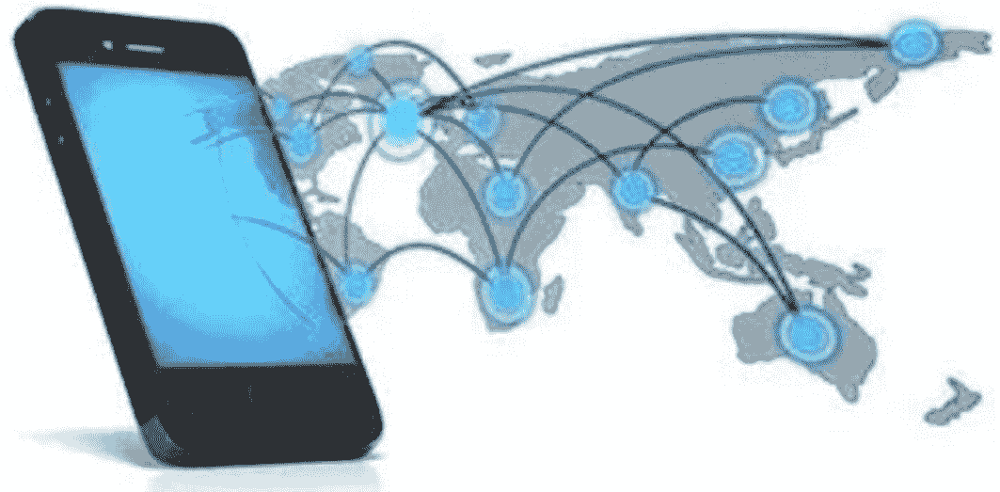

一个连接各国不同位置的全球网络的插图，其中一个附近的手机突出了相互关联性。

图 11-3

漫游。手机的位置历史可以在旅行过程中进行追踪。每次手机连接到蜂窝网络、连接到 Wi-Fi 等，位置都可以被追踪。

**服务中断** 是异常检测的另一个非常具有影响力的用例。蜂窝设备通过位于各处的蜂窝塔连接到蜂窝提供商的网络。您的手机连接到最近的塔以参与蜂窝网络。在涉及大量人群的事件中，例如音乐会或足球比赛，通常表现良好的蜂窝塔会变得严重过载，导致严重的服务中断，并在过载期间给客户带来非常糟糕的体验。

图 11-4 展示了美国西北部几个地区的手机服务中断情况。

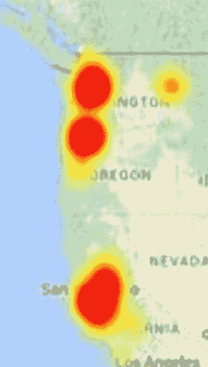

美国西北沿海地区的地图突出了四个手机服务中断的区域。

图 11-4

手机服务中断。中间较暗的区域表示服务中断频率较高

如果我们知道在某个时间段和长时间内手机基站及其相关设备的各种指标，以及我们关于基站周围典型活动性质的信息（例如，附近是否发生了音乐会或比赛，或者附近是否预期发生重大事件），那么我们可以使用时间序列作为表示所有此类活动的基础，并随后使用 TCN、LSTM 或 transformer 算法来检测与重大事件相关的异常，因为这些事件具有时间依赖性。这些信息可以帮助评估这些服务是如何被使用的，以及这些服务对特定手机基站的有效性如何。

现在，手机公司有了一种了解是否需要升级某些时段或建造更多基站的方法。例如，如果一座大型办公楼正在特定基站的附近建造，通过使用蜂窝网络拥有的所有基站的时间序列数据，可以检测到网络其他部分的异常，并将这些原则应用于即将受到新建办公楼影响的基站（这将增加数千个手机连接，可能导致基站过载并影响基站在未来一段时间内的使用）。

### 银行

在银行业务中，异常检测的一些用例包括标记异常高的交易、欺诈活动、钓鱼攻击等。信用卡几乎被世界上每个人使用，通常每个人使用信用卡的模式都与其他人不同。这种模式为使用信用卡的个人创建了一个隐含的档案，包括他们在哪里使用、何时使用、为什么使用以及他们使用信用卡的目的。每个信用卡公司都有大量消费者信用卡使用信息，因此他们可以使用异常检测来检测特定信用卡交易是否可能存在欺诈。

自编码器在异常检测这类用例中非常有用。在这种情况下，我们可以收集个人消费者的所有信用卡交易，并将这些特征转换为数值特征，以便我们可以根据各种因素以及一个指示器（交易是正常还是异常）为每张信用卡分配一定的分数。然后，使用自编码器，我们可以构建一个异常检测模型，该模型可以快速确定特定交易是正常还是异常，前提是我们知道客户所有其他交易的详细信息。自编码器不需要非常复杂。它只需要为编码器构建几个隐藏层，为解码器构建几个隐藏层，仍然可以相当不错地检测信用卡上的异常活动（也称为欺诈活动）。

同样，我们可以使用生成对抗网络（GANs）来模拟消费者正常的交易历史，并使用判别器来标记异常。在这里，生成器旨在生成类似于正常交易数据分布的合成数据，判别器学习预测任何看起来异常的数据点为假。欺诈交易会被标记为假。

交易历史也有时间成分。交易往往会随着时间的推移表现出模式。例如，季节性支出是一种常见的模式，通常涉及比消费者通常可能更高的支出量。时间序列模型会学习这些特定消费者的交易模式。例如，他们可能总是大额的生日支出者。然后，如果出现任何偏离常规的交易模式，这些模型会立即捕捉到并标记为异常。

图 11-5 是信用卡欺诈的描述。

一幅插图描绘了一个身穿黑色服装和面具的盗贼，部分从笔记本电脑屏幕中露出，指向信用卡。

图 11-5

描述信用卡欺诈，其中信用卡详细信息被某人（如黑客）获取，以便他们可以进行欺诈性购买

### 环境

当涉及到环境方面时，异常检测有几个适用的用例。无论是森林砍伐还是冰川融化，空气质量还是水质，异常检测都有助于识别异常活动。

图 11-6 是一张森林砍伐的照片。

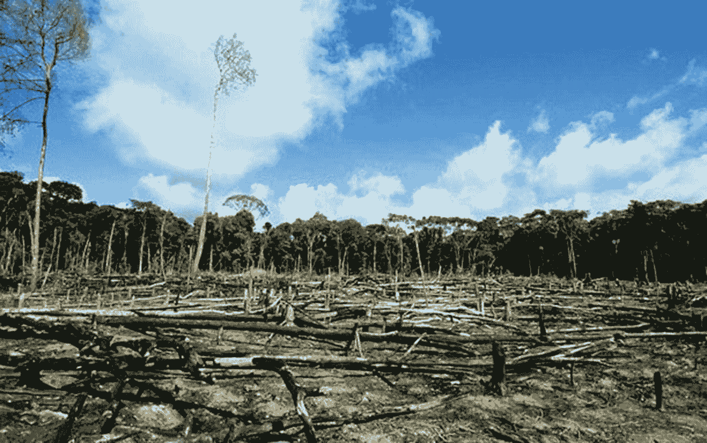

一张被烧焦和废弃的树木的照片，背景是未被触及的绿色植被。

图 11-6

大规模森林砍伐对环境有害，尤其是在亚马逊雨林中。（来源：commons.wikimedia.org）

让我们来看一个空气质量指数的例子。空气质量指数提供了一种对可呼吸空气质量的某种测量，这可以通过在监测区域内的不同位置放置各种传感器来实现。这些传感器测量并发送周期性数据到一个集中式系统，该系统收集来自所有传感器的数据。这些数据成为时间序列，每个测量值由几个属性或特征组成。由于每个时间点都有一定数量的特征，这些特征可以输入到自动编码器等神经网络中，我们可以构建一个异常检测器。当然，我们也可以使用 LSTM、TCN 或 transformer 来完成同样的任务。

图 11-7 展示了 2015 年首尔的空气质量指数。

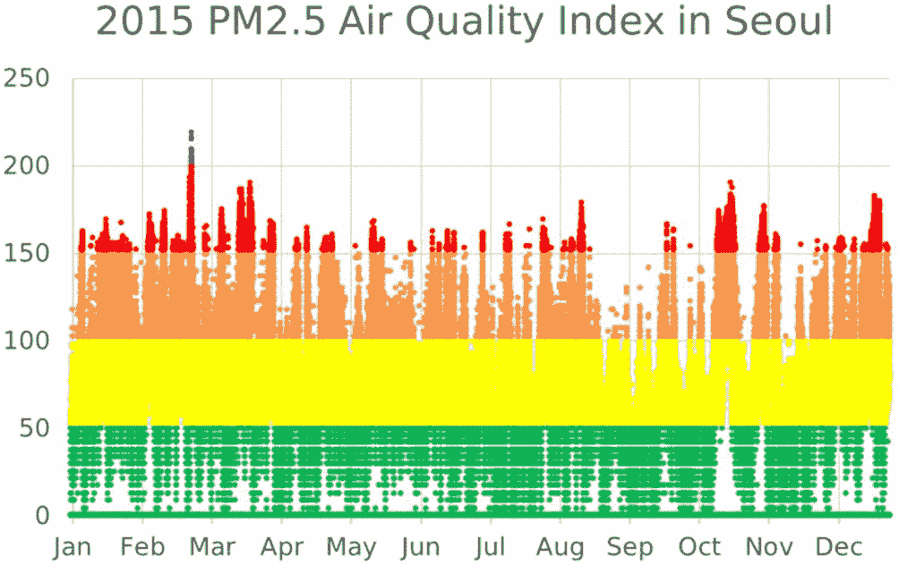

首尔一年中 PM 2.5 空气质量指数的图表。大多数月份的空气质量都处于不健康状态。

图 11-7

空气质量指数。绿色表示良好质量，而黄色表示中等质量。橙色对敏感群体（如过敏人群）存在一些问题，而红色表示不健康。任何高于红色的，如紫色，都是危险的，非常不健康。（来源：commons.wikimedia.org）

另一个环境用例是全年监测空气温度。由于全球平均气温持续上升，使用历史数据训练时间序列算法，每天进行评估，并将异常温度标记为与预测值显著偏离的结果，这很有帮助。然后可以收集这些异常并进行进一步研究，揭示特定的趋势或用于自动与气候变化预测模型进行比较，以了解现实中的变暖进展有多严重，与预测相比如何。

卫星图像是另一个可能使用异常检测算法的领域。检测异常事件，如湖泊水位下降、亚马逊森林砍伐、野火等等，都可以使用各种深度学习模型进行建模。由于图像是数据的主要媒介，因此卷积神经网络被大量使用。

卷积神经网络可以执行特征提取，输出原始图像的有效表示向量嵌入。这些嵌入可以被输入到自动编码器或 GAN 中，以无监督的方式确定图像中是否发生了异常事件，这使得它很容易扩展，因为不需要进行标记。

### 医疗保健

医疗保健是那些可以从异常检测中受益很大的领域之一，无论是为了预防欺诈、检测癌症或慢性疾病、改善门诊服务等等。

在医疗保健中，异常检测的最大用例之一是在出现任何显著症状可能表明癌症存在之前，从各种诊断报告中检测癌症。鉴于癌症对任何人的严重后果，这一点非常重要。在此背景下，可以使用的异常检测技术包括卷积神经网络与自编码器的结合。

卷积神经网络（CNNs）使用降维的概念，通过神经网络层将大量的特征/像素（具有颜色）降低到更低的维度点。通过将这种 CNN 与自编码器结合，我们可以使用自编码器来查看如 MRI 图像、乳腺 X 光片和医疗保健行业中诊断技术产生的其他图像。

图 11-8 显示了一组来自 CT 扫描的图像。

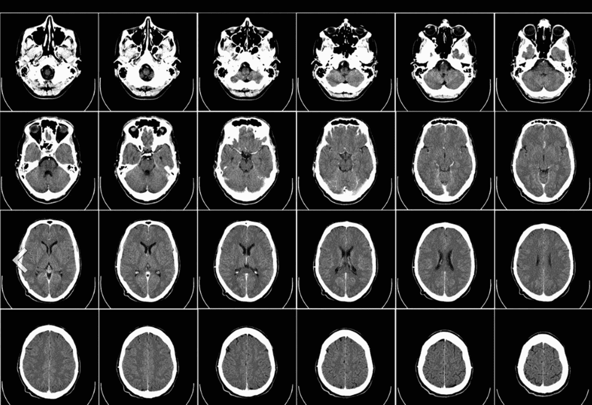

24 张头部 CT 扫描图像，分为 4 行 6 列。

图 11-8

某人头部 CT 扫描图像。（来源：commons.wikimedia.org）

让我们看看另一个用例，即检测特定社区居民的健康状况异常。通常，当地医院为特定社区的居民提供服务。当地医院收集并存储了所有访问医院的社区居民的各类健康指标，包括血液检测结果、血脂谱、血糖值、血压读数、心电图结果等。当与年龄、性别、健康状况等人口统计数据结合时，这些健康数据可以用来构建一个复杂的基于 AI 的异常检测模型。

图 11-9 显示了通过查看心电图结果观察到的不同健康问题。

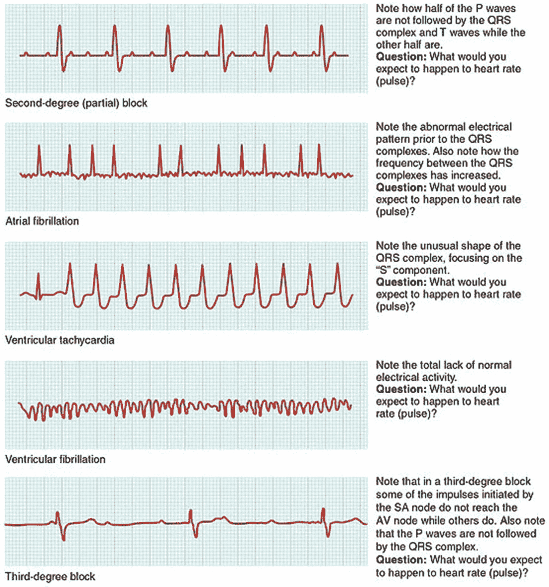

5 个心电图结果，曲线波动表示二度阻滞、心房颤动、室性心动过速、室性纤维颤动和三度阻滞。

图 11-9

测量某人心脏的心电图结果。（来源：commons.wikimedia.org）

在医疗保健领域，有许多不同的用例，可以使用不同的异常检测算法来实施预防措施。几乎我们在这本书（以及更广泛的内容）中提到的任何模型都可以应用于医疗保健环境，因为可用的数据种类繁多。

### 交通

在交通领域，异常检测可以用来确保道路和车辆的正常运行。通过收集道路上所有运行中的传感器（如收费站、交通信号灯、安全摄像头和 GPS 信号）的不同类型的事件，我们可以构建一个异常检测引擎，该引擎可以检测异常的交通模式。

异常检测还可以用来观察公共交通时刻表中的时间以及该类似交通区域的相关交通状况。我们还可以寻找关于燃料消耗、公共交通所支持的乘客数量、季节性趋势等方面的异常活动。

此外，可以通过在常规时间序列间隔上进行位置采样，创建交通模拟来描绘人们在空间和时间中的移动。可以通过对这些个人的正常交通模式数据进行训练，运行基于序列的异常检测方法来检测现实生活和模拟中的异常。模拟的保真度越高，对现实生活数据的异常检测就越准确。一种可能性是将异常检测算法与这些高保真模拟相结合，以便在规划道路建设时检测是否在各种情况下仍然会发生交通拥堵。

图 11-10 展示了由于高峰时间意外交通导致的交通拥堵的图像。

一张高速公路上车辆排队等待的照片。

图 11-10

交通拥堵

### 社交媒体

在像 Twitter、Facebook 和 Instagram 这样的社交媒体平台上，异常检测可以用来检测黑客账户向所有人发送垃圾邮件、虚假广告、虚假评论等。数十亿人广泛使用社交媒体平台，因此社交媒体平台上的活动量极高，并且一直在增长。为了确保使用社交媒体平台的个人的隐私和优质用户体验，社交媒体公司使用许多技术来增强其系统的能力。他们使用异常检测来检查每个个体的正常和异常行为。

类似地，任何广告平台的广告、任何个性化的朋友推荐、任何个人可能感兴趣的新闻文章，如选举等，都可以进行处理以检测异常或异常活动。如果异常检测能够检测到推文中的网络水军活动、宣传机器人、假新闻等，这将是一个很好的用例。异常检测还可以用来检测您的账户是否被接管，因为您的账户可能会突然发布大量推文、暂停推文然后继续，或者骚扰其他账户并垃圾邮件其他人。

用户参与度水平也可以进行建模，通过以抽象、概括的方式监控似乎吸引最多关注的内容，可以自动化识别趋势。一旦发现这种异常内容，可以通过推荐算法进一步推广，以吸引更多的用户参与（从而提高从定向广告中获得的利润），或者如果它被认为违反社区政策，则可以解决并隐藏。

图 11-11 显示了一篇发布在 Facebook 上的虚假新闻文章。

一篇标题为“Facebook 承认虚假新闻算法”，底部有马克·扎克伯格照片的新闻截图。

图 11-11

关于 Facebook 的虚假新闻文章

### 金融和保险

在金融和保险行业，异常检测可以用来检测欺诈索赔、欺诈交易、欺诈旅行费用、与特定政策或个人相关的风险等。金融和保险行业依赖于在处理金融和保险时能够针对正确的消费者并承担适当的风险的能力。例如，如果他们已经知道某个地区容易发生森林火灾或地震或非常频繁的洪水，那么为你的房屋提供保险的保险公司需要拥有他们能得到的所有工具来量化在为房屋所有者保险撰写保单时涉及的风险量。

在金融领域使用异常检测的一个例子是检测跨境大额资金转移的欺诈行为，使用多个不同的账户进行——考虑到每分钟发生的交易量巨大，这种活动对人类来说手动检测极其困难。AI 技术可以在大量数据上训练，以检测非常新颖和创新的跨境欺诈方式，这种检测超出了任何人类或许多已经存在数十年的统计技术的能力。

深度学习确实有助于解决金融和保险行业在异常检测方面这个非常大的难题，这主要是因为数据量巨大以及涉及的变量数量众多。随着图形处理单元（GPU）的出现，深度学习现在正在帮助解决许多难以破解的应用案例。异常检测和深度学习可以结合起来，以满足金融和保险行业的需求。

图 11-12 显示了随时间变化的抵押贷款欺诈报告。这里的异常是报告的贷款欺诈数量突然下降，与预测的相比。

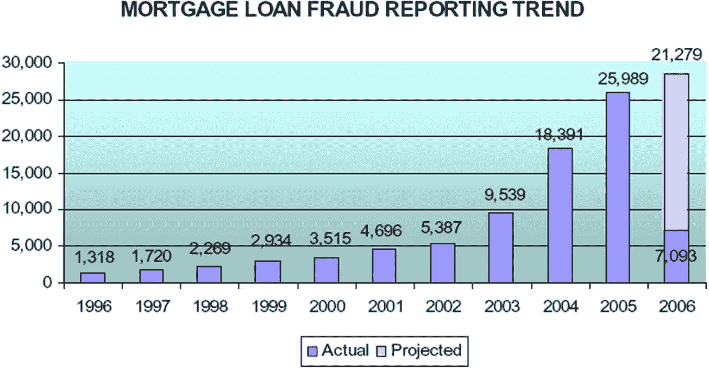

从 1996 年到 2006 年实际和预测的抵押贷款欺诈报告数量的堆叠条形图。报告的数字随着年份的增加而增加，从 1996 年的 1,318 增加到 2006 年的 21,279。

图 11-12

抵押贷款欺诈报告随时间变化的图表

### 网络安全

异常检测的另一个用例是在网络安全或网络中。事实上，几十年前，异常检测的第一个用例之一就是使用统计模型尝试检测网络中的任何入侵尝试。例如，异常检测用于检测非常普遍的拒绝服务（DoS）攻击。当针对公司网站或门户发起 DoS 攻击以干扰客户服务时，攻击者通常会动员大量机器同时对网站或门户进行并发连接和随机无用的交易（一个常见的目标是某种客户支付服务）。这种攻击的结果是门户无法响应用户，最终导致非常差的客户体验，并可能导致他们失去业务。

通过在收集了很长时间的数据上训练异常检测系统，系统可以检测到异常活动。这些数据包括典型的使用行为、支付模式、活跃用户数量、特定时间的支付金额，以及支付门户存在的季节性行为和其他趋势，例如每月第一天支付所有账单或在月底进行所有购物。当突然对公司的支付门户发起 DoS 攻击时，异常检测算法可以快速检测此类活动，并通知基础设施或运营团队，他们可以采取纠正措施，例如设置不同的防火墙规则或更好的路由规则，以尝试阻止恶意行为者发起攻击或延长对门户的攻击。

图 11-13 显示了异常监控网络流量的一个示例。

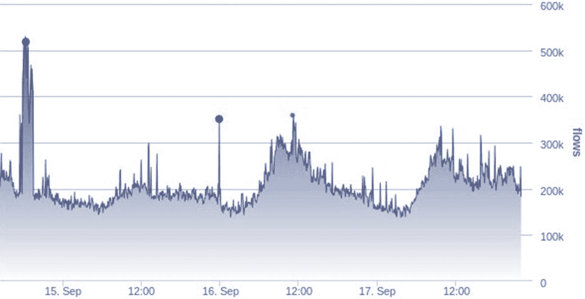

9 月 15 日至 18 日的网络流量图显示曲线波动，在 9 月 15 日之前达到峰值，并在 9 月 16 日经历另一次高峰。

图 11-13

示例异常监控网络流量。峰值表示网络流量非常高，这可以被认为是异常。

另一个例子是当黑客试图进入系统，因为他们设法设置了一个特洛伊木马以最初进入网络。通常，检测这种异常活动是一个涉及大量扫描的过程，例如端口或 IP 扫描，以查看在服务运行时网络中存在哪些机器。假设机器正在运行 SSH 和 telnet，后者更容易破解。黑客可以尝试发起多种不同类型的攻击，利用 telnet 或资产服务的漏洞。最终，如果目标机器之一响应，黑客就可以进入系统，并继续渗透内部网络，直到他们完成他们想要达成的目标。

通常，网络有一定的使用模式——有具有一致读写模式的数据库服务器，有某些流量模式的 Web 服务器，有工资系统，QA 系统，面向最终用户的面向系统等等，所有这些都有某种预期的使用模式。尽管在长时间内观察和预期机器的使用方式、网络的使用方式以及机器通过什么服务与其他机器通信等方面肯定会有很多变化，但通常在长时间内观察到的预期行为是众所周知的。

异常检测可以用来检测特定机器或机器上的特定端口或服务是否以异常速率连接或交易，这表明正在进行某种入侵活动。这对运维团队来说是非常有价值的信息，他们可以迅速召集网络安全专家，试图深入了解正在发生的事情，并采取预防或主动措施，而不是在损害发生后简单地做出反应。这种类型的异常检测可能是企业保持运营和关闭（至少暂时关闭）之间的区别。曾经有过单次网络安全入侵几乎使企业破产的例子，造成数亿美元损失。这就是为什么网络安全领域对深度学习非常感兴趣，所有可能涉及深度学习异常检测的用例都是当今网络安全和网络空间中的顶级用例。

图 11-14 显示了不同服务端口上 TCP 连接数量的异常情况

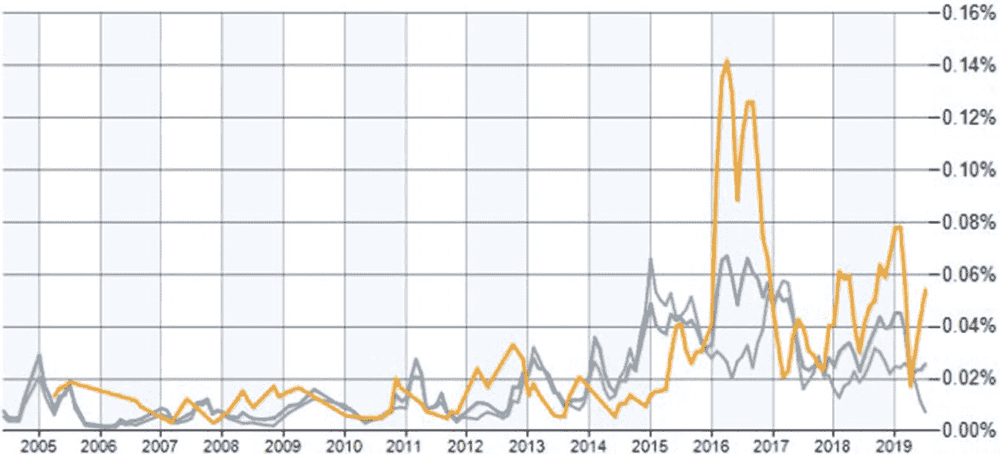

从 2006 年到 2019 年服务端口上 TCP 连接百分比的图表。图表有 3 条波动曲线，其峰值在 2016 年至 2017 年之间。

图 11-14

服务端口上的 TCP 连接

在网络安全或网络领域，并非所有用例都具有防御性质。我们还可以利用异常检测来确定是否需要升级系统，当前系统是否能够维持现在的流量并在未来维持，是否需要进行任何节点容量规划以使一切恢复正常，等等。这对于运维团队来说非常重要，因为他们需要了解一年前未曾预见而现在影响网络正常到异常行为的趋势。我们越早知道越好，这样我们就可以开始积极规划来处理这个问题。

### 视频监控

异常检测在视频监控领域也变得极其重要。如今，在许多地方，如商业场所、当地学校、当地公园、市中心街道和住宅中，都可以看到安全摄像头和视频监控系统。重点是，视频监控将一直存在，尤其是在智能应用程序和智能手机的所有新技术进步的背景下。事实上，我们应该期待未来有更多的视频监控。

在不久的将来，我们将看到更多智能汽车和自动驾驶汽车，它们依赖于使用实时分析和持续处理视频来检测各种物体。同时，它们还可以检测任何类型的异常。在严格的安全视频监控意义上，异常检测可以用来检测这个特定摄像头所观察的后院中的正常情况，以及当由于房屋附近发生的某种运动而检测到特定异常时。例如，某种动物或甚至入侵者正在草坪上行走。

您的家庭安全系统能够发现这并不正常。为了使摄像头能够有效地做到这一点，制造商训练了非常复杂的机器学习模型来实时评估视频信号。来自摄像头的输入被确定为正常或异常。例如，如果您在州际公路上驾驶自动驾驶汽车，汽车的视频将清楚地表明根据道路应该看起来如何，标志应该在何处，树木应该在何处，下一辆车应该在何处，目前是正常的。使用异常检测，自动驾驶汽车可以避免路径上发生的任何异常，并在任何不利事件发生之前采取纠正措施。

图 11-15 展示了一个目标检测视频监控系统。

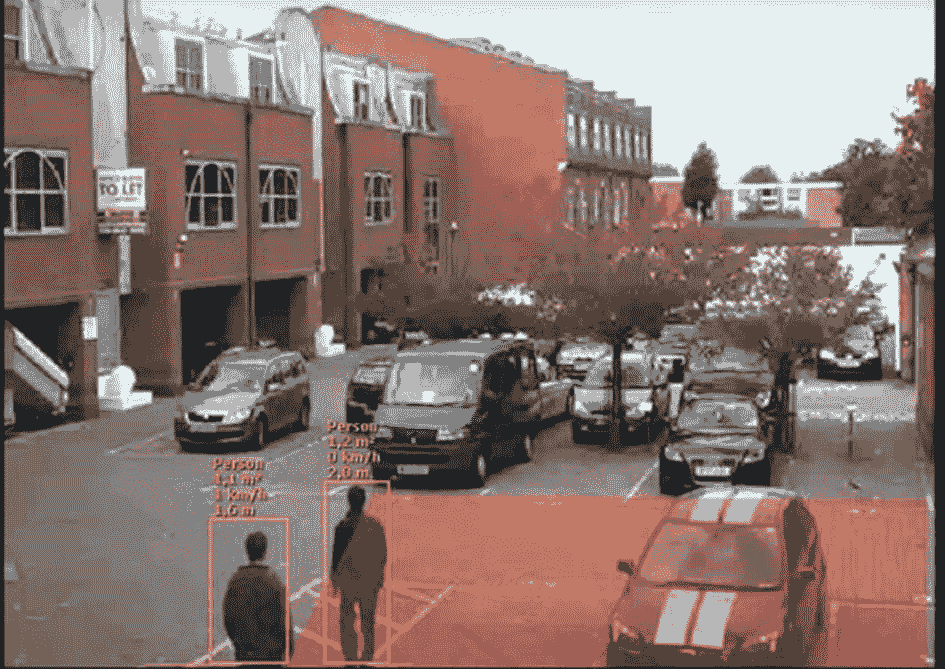

屏幕截图显示两个人，周围有突出显示的方框，以及附近停放的几辆汽车。

图 11-15

目标检测视频监控系统

### 制造业

异常检测在制造业中也得到了广泛的应用。具体来说，由于现在大多数制造业都涉及机器人和大量自动化，异常检测可以用来检测制造系统各部分的故障或即将发生的故障。

在制造业，由于正在发生的所有自动化，对各种类型的传感器和其他实时或近实时收集的指标非常重视。这些数据可以用来构建一个复杂的异常检测模型，试图检测工厂或制造周期中是否即将出现任何问题。

异常检测可以应用的另一个例子是石油和天然气平台的案例。一个石油和天然气平台通常有数千个组件，它们以各种方式相互连接，使工厂能够运行。所有这些组件都可以通过传感器进行监控，这些传感器对传感器所连接的组件的各种参数进行特定测量。所有这些传感器都可以是物联网（IoT）平台的一部分。收集所有数千个传感器在数千个组件上附着的传感器在长时间内的所有传感器输出，使得训练复杂的异常检测模型，如自动编码器、LSTMs、TCNs 和变压器成为可能。

图 11-16 展示了一个带有传感器读数的制造厂。

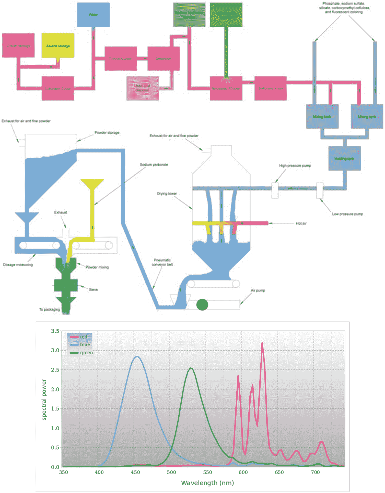

展示了 oleum 储存和 Alpine 储存经过多个阶段，到混合罐，再到锅炉，然后移动到粉末储存，在那里它与过硼酸钠结合，然后到包装。光谱功率与波长的图有两条正常曲线和一条波动曲线。

图 11-16

配有传感器读数的制造厂

### 智能家居

异常检测也应用于智能家居系统。智能家居拥有许多集成组件，例如智能恒温器、冰箱和互联设备，它们可以相互通信。例如，亚马逊 Alexa 可以与你的智能灯泡通信，这些灯泡使用智能灯泡。所有这些组件都可以通过智能手机上的应用程序与你的智能手机通信。甚至恒温器也是互联的。那么，我们如何在用例中使用异常检测呢？一个简单的例子就是监控你在所有天气条件下如何设置恒温器以达到最佳温度，并遵循某种推荐或建议的行为。因为恒温器在每户家庭中都有一定程度的个性化，一个非常好的深度学习算法可以持续寻找所有房屋中恒温器的使用情况，包括你的，然后能够检测到你正常使用时的使用方式。可检测的异常可能包括温度的突然上升/下降，这可能表明空调或加热器不工作。如今，冰箱上运行着计算机接口，甚至带有使用监控功能。异常检测的一个例子就是你的冰箱提醒你去购物，因为你已经两三周没有补货了——如果你每周这样做，这绝对是一个异常。

图 11-17 展示了一个智能家居的插图。

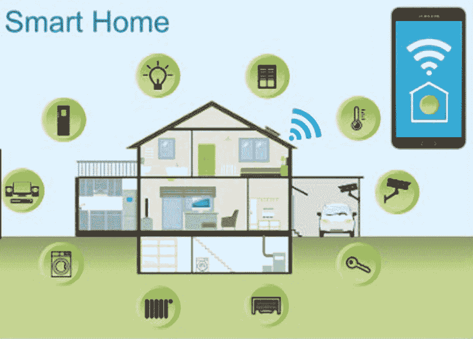

展示了一个智能家居的插图，其中连接了十个不同的智能设备到移动设备。

图 11-17

展示所有连接的智能设备的智能家居

### 零售

零售业使用异常检测算法用于各种用例，例如检测商品和服务分销效率中的异常。同样有趣的是，顾客经常发生的退货，因为有时退货商品很棘手，以清仓销售的方式出售它们比重新进货成本低。

从客户销售的角度来看，在收入生成和规划未来产品和销售策略方面都至关重要，尤其是在针对消费者方面。如果实际销售与预测销售（通过建模正常销售数据，这些数据可能或可能没有考虑到上升趋势）不匹配，那么了解这一点很重要，以便可以调整产品订单以避免供过于求或供不应求。

图 11-18 显示了产品的历史销售数据。

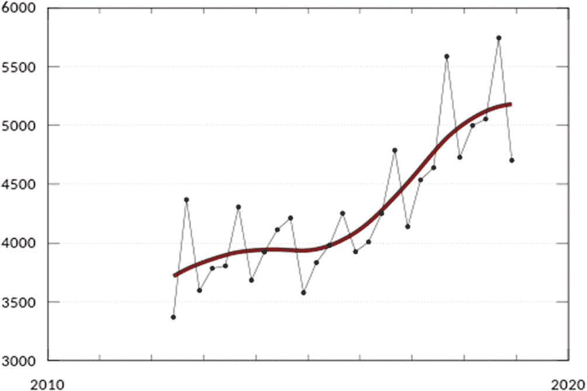

2010 年至 2020 年零售行业的数据图表呈现一条上升趋势线和一条从 2012 年开始波动并在 2019 年结束的曲线。

图 11-18

产品的历史销售数据

## 基于深度学习的异常检测实施

考虑到所有不同行业中的所有用例，其中一些在上一节中已介绍，在你的组织或业务中建立异常检测实践的关键步骤如下：

+   确定业务用例并就期望达成一致

+   定义可用的数据以及理解数据和数据本身的性质

+   建立消耗数据以进行处理的过程

+   确定要使用的模型类型

+   讨论模型的使用和执行策略

+   调查结果和反馈分析对其业务的影响

+   在日常业务活动中实施所使用的模型

尤其应该关注模型的构建方式和要使用哪种类型的模型。所使用的异常检测算法类型几乎影响你从异常检测策略中试图获得的一切。这反过来又取决于可用的数据类型，以及数据是否已经标记或识别。影响决定哪种类型的异常检测最适合特定用例的一个因素是它是否是点异常、上下文异常还是集体异常。另一个重要因素是数据是否是某个时间点的瞬时快照，或者是持续演变或不断变化的实时时间序列数据。数据的具体特征或属性是分类的或数值的、名义的、有序的、二元的、离散的还是连续的也非常重要。了解数据是否已经标记，或者是否提供了某种关于数据是什么的提示也很重要，因为这可能会引导你选择监督、半监督或无监督算法。

尽管有技术和算法可供使用，但基于深度学习的异常检测方法实施中存在几个关键挑战：

+   将人工智能集成到现有流程和系统中是困难的。

+   所需的技术和专业知识成本高昂。

+   领导层需要了解人工智能能做什么和不能做什么。

+   人工智能算法并非天生智能；相反，它们通过分析“优质”数据来学习。

+   在“文化”方面需要改变，尤其是在大型公司中，它们可能对采用新技术或投入实验、开发和集成深度学习异常检测模型所需的资源持谨慎态度。

## 未来趋势

由于深度学习技术的快速发展，异常检测领域正在迅速发展。此外，世界在将所有可能的事物相互连接方面似乎没有停止的迹象。数据收集和存储的速度和范围比以往任何时候都要高，深度学习模型的能力也在以前所未有的速度增长。以下是异常检测的一些最先进趋势：

+   **多模态** **异常检测**：异常检测算法正在同时训练多种数据源类型，例如在图像和文本数据上训练，在视听数据上训练，在人体姿态和声音上训练，等等。在金融领域的一个好例子是使用股价、新闻情绪和在线讨论的组合来训练异常检测算法以预测价格波动。其理念是模型可以更深入、更丰富地理解正常价格波动的样子。例如，假设一家顶级公司传出坏消息。立即，股价可能会因用户恐慌而下跌。模型可以学会理解这是正常行为，基于从新闻文章训练中获得的额外见解，增加了一层预测能力。当预测出现偏差时，它们一定是真实、意外的异常。

+   **边缘计算**：处理能力持续增长。如今的一些智能手机比十年前的电脑还要强大。已经有可以在移动设备上运行的深度学习模型。异常检测可能就会在源头本身实时进行。例如，可以是**恶意软件检测**（通过识别异常的应用行为），**用户检测**（手机可以通过分析各种行为和用法模式来检测谁在使用它，并个性化体验），**健康监测**（对于将医疗设备连接到手机的人，手机可以持续监测健康信号并检测可能的异常），**去中心化内容推荐**，等等。

    手机极其普遍，并且变得越来越强大。随着计算成本的增加和数据隐私对集中式数据收集的担忧加剧，边缘计算可能会更加普遍。也可能看到像序列建模算法这样的高级算法在移动设备上训练，从而允许进行个性化的时间序列预测，例如消费习惯、预算、设备使用等，这有助于检测异常。例如，警告用户使用手机远超平常，或者警告用户他们花费远超平常。

+   **少样本/零样本** **异常检测**：本书中介绍的一些异常检测算法相当“数据饥渴”，例如 GAN 和 transformer。然而，如果算法能够通过少样本或零样本学习学会用很少的数据检测异常呢？这是深度学习和异常检测领域的一个持续研究课题。

+   **大型语言模型（LLMs）** **用于异常检测**：LLMs 可以调整以执行各种语言建模任务，例如总结作品、生成文本、编码或发现文本中的其他模式。随着 LLMs 变得越来越强大，它们检测异常的潜力也在增加。

    例子包括自动和智能内容审核（词过滤器往往是一种极端的方法，具有高召回率但糟糕的精确度，并且弊大于利）、虚假用户评论检测，甚至编码错误检测器。几乎每个 NLP 任务现在都可以在超人类水平上执行，这得益于 LLMs 的强大功能和可扩展性。尽管它们在某些方面（如逻辑推理）存在不足，但 LLMs 在未来几年内肯定会在这些方面取得巨大进步。如果不是 LLMs 主导语言建模空间，那么一种新的模型类型将取而代之。

+   **生成式 AI**：深度伪造变得越来越逼真，几乎到了难以区分的程度，至少对大多数人类来说是这样。我们需要检测深度伪造的工具，无论是语音还是视频，这样我们才能保护人们及其身份，并对抗虚假信息。不幸的是，这可能会演变成一场军备竞赛，最终可能导致生成器获胜，因为一旦生成器完美地复制了现实，或者至少变得难以被鉴别器检测到（即，没有太多误报的情况下），鉴别器就无法再检测生成的深度伪造，而不会标记太多真实图像。话虽如此，这仍然是一个理论上的可能性，而且并不确定它有多容易实现，所以现在还有一些希望。

另一个潜在的应用场景是检测 AI 生成艺术中的版权艺术风格。最近的一个争议和法律行动的焦点是，用于训练某些 AI 艺术生成模型的数据是在未经创作者许可的情况下获得的。基本上，这些 AI 艺术生成器正在使用原始创作者的风格创作艺术，并且正在分发。虽然现在为时已晚，无法回头，但至少这些艺术作品可以被检测出来，以便采取可能的法律行动。

需要牢记的是，对未来进行推测几乎总是徒劳之举。有些情景发生的可能性比其他情景更大，但未来总是不确定的。据我们所知，有人可能会发现一类新的深度学习算法，它将超越所有尖端模型。当前的建模技术可能在未来一段时间内仍然是尖端技术。无论如何，深度学习和异常检测领域正以不断加快的速度持续发展，看到这些发展过程是非常令人兴奋的。

## 摘要

本章讨论了在商业环境中异常检测的实际应用案例。您已经看到异常检测如何被用来解决许多商业中的实际问题。正如章节引言中提到的，每个业务和用例都是不同的，我们无法复制粘贴代码并构建一个在任意数据集中检测异常的成功模型，因此本章涵盖了多个用例，以给您一个关于可能性以及思维过程背后概念的想法。

记住这是一个不断发展的领域，新的算法不断被发明，现有算法也在不断改进，这意味着未来的算法将不会看起来一样。就在几年前，RNN 是时间序列的最佳算法，但随后被 GRU 和 LSTM（第八章）以及在某些情况下 TCN（第九章）所取代。而在近年来，transformer（第十章）在各个自然语言处理任务中远远超过了 LSTM。谁知道未来会怎样呢？甚至自动编码器也发生了很大的变化；传统的自动编码器已经演变成了变分自动编码器（第六章）。在前一版本书中提到的受限玻尔兹曼机，现在已很少被使用了。
