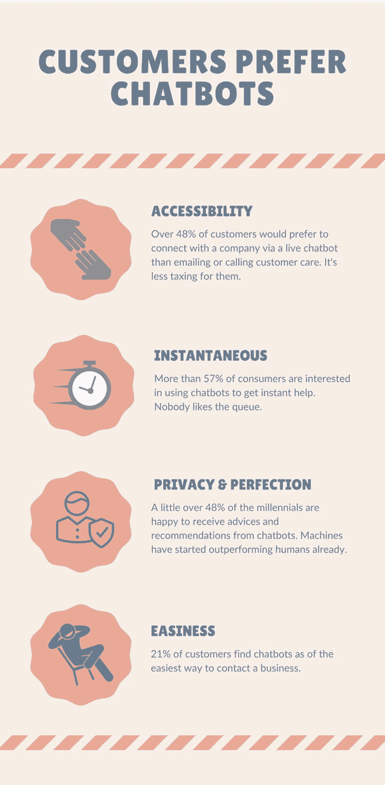

# 一、可爱的聊天机器人

当你开始构建聊天机器人时，了解聊天机器人做什么和它们看起来像什么是非常重要的。

你一定听说过 Siri，IBM Watson，Google Allo 等。这些机器人试图解决的基本问题是成为一个中介，帮助用户变得更有生产力。它们通过允许用户更少地担心如何检索信息以及获取特定数据可能需要的输入格式来做到这一点。随着机器人处理用户数据输入并从中获得更多见解，它们往往会变得越来越智能。聊天机器人之所以成功，是因为它们能给你想要的东西。

当您每次在不同的网站上必须输入相同的姓名、电子邮件 ID、地址和密码时，您是否感到恼火或沮丧？想象一下，一个单独的机器人来完成你的任务——比如，从不同的供应商那里订购食物，从各种电子商务公司在线购物，或者预订机票或火车票——并且你不必每次都提供相同的电子邮件 ID、送货地址或支付信息。机器人有能力知道这些信息，并且足够聪明，当你用自己的语言或计算机科学中称为自然语言的语言询问时，它可以检索到所需的信息。

聊天机器人的开发比几年前容易多了，但是聊天机器人在几十年前就已经存在了；然而，聊天机器人的受欢迎程度在过去几年里呈指数级增长。

如果你是一个技术人员，或者对 web 应用程序或移动应用程序的工作原理有所了解，那么你一定听说过术语 API。您今天需要的任何类型的数据都可以以不同服务提供商和机构提供的 API 的形式使用。如果你在寻找天气信息、订票、点餐、获取航班信息、将一种语言转换成另一种语言，或者在脸书或 Twitter 上发帖，所有这些都可以使用 API 来完成。基于 web 或移动设备的应用程序使用这些 API 来完成这些任务。聊天机器人也可以根据我们的请求使用这些 API 来完成相同的任务。

聊天机器人比传统的在线完成事情的方法更有优势的原因是你可以在聊天机器人的帮助下做多件事情。它不仅仅是一个聊天机器人，它就像你的虚拟私人助理。你可以在 booking.com 上预订一个酒店房间，也可以在酒店附近的餐厅预订一张桌子，但是你可以使用你的聊天机器人。聊天机器人满足了多用途的需求，因此节省了大量的时间和金钱。

在本书中，我们将学习如何使用机器人建立自然的对话体验，以及如何教机器人理解我们的自然语言，并让它从单一界面为我们完成任务。

一般来说，机器人只不过是一台足够智能的机器，可以理解你的请求，然后以其他软件系统可以理解的方式制定你的请求，以请求你需要的数据。

## 聊天机器人使用的普及程度

聊天机器人变得流行起来，就像最近的事情一样。让我们试着看一下图 1-1 ，图中描绘了聊天机器人的崛起，同时也试着理解为什么对构建聊天机器人有巨大的需求。


图 1-1

Y 轴上的数字表示相对于图表最高点的全球所有类别的搜索兴趣

想到的简单答案是，这不是一个复杂的软件，任何人都可以使用。当我们构建软件时，我们的目标是将使用它的受众，但是当它被其他任何人使用时，它就变得困难和不可用了。当我们开发聊天机器人时，我们牢记它将被所有年龄段的人使用。这种情况只发生在聊天机器人身上，这种软件试图表现得像一个哑巴(但它是智能的)，让用户做他或她自己。在所有其他软件中，你会发现你应该知道一些术语，或者逐渐知道如何最佳地利用它，但聊天机器人不是这样。如果你知道如何与人交谈，使用聊天机器人就不会有任何问题。

对聊天机器人的需求持续增长。然而，还没有太多的研究从经验上试图找出使用聊天机器人背后的动机。在最近的一项研究中，一份在线问卷调查了美国 16 至 55 岁的聊天机器人用户，询问他们在日常生活中使用聊天机器人的需求。调查显示“生产力”是使用聊天机器人的主要动机。

## Python 的禅以及为什么它适用于聊天机器人？

我记得 Python 的禅，它说，“简单比复杂好”，这适用于软件中的许多地方。

> Python 的禅是影响 Python 编程语言设计的 20 个软件原则的集合。
> 
> —蒂姆·彼得斯

想知道“*Python 的禅是什么？*"试试下面的步骤。

如果您的计算机上已经安装了 Python。只需进入您的 Python 解释器并`import this`:

```py
Python 2.7.15 (default, May  1 2018, 16:44:08)
[GCC 4.2.1 Compatible Apple LLVM 9.1.0 (clang-902.0.39.1)] on darwin
Type "help", "copyright", "credits" or "license" for more information.
>>> import this
The Zen of Python, by Tim Peters

Beautiful is better than ugly.
Explicit is better than implicit.
Simple is better than complex.
Complex is better than complicated.
Flat is better than nested.
Sparse is better than dense.
Readability counts.
Special cases aren't special enough to break the rules.
Although practicality beats purity.
Errors should never pass silently.
Unless explicitly silenced.
In the face of ambiguity, refuse the temptation to guess.
There should be one—and preferably only one—obvious way to do it.
Although that way may not be obvious at first unless you're Dutch.
Now is better than never.
Although never is often better than *right* now.
If the implementation is hard to explain, it's a bad idea.
If the implementation is easy to explain, it may be a good idea.
Namespaces are one honking great idea—let's do more of those!

```

你可能无法理解以上所有关于聊天机器人的观点，但你肯定能理解其中的大部分。

好吧，回到我们的话题，我记得当我来自 Orkut 背景时，开始使用脸书用户界面时遇到了困难。如果你从未使用过 Orkut，你不会理解它，但是试着想想你生活中的一个情景，你开始使用一些新的软件或应用程序，你很难掌握它的窍门。也许从 Windows 切换到 MacOS/Linux 或者相反？当你使用一个新的应用程序时，你需要学习一些东西，这需要时间来适应它，并知道它做什么和如何工作。有时，即使在使用了几年之后，您还是会知道这个应用程序的一些特性。如果你在 MacOS 上，试试 Shift + Option +音量调高/调低，看看会发生什么。如果这让你感到惊讶，如果你还不知道，请告诉我。

就聊天机器人而言，用户和服务器或后端系统之间的通信非常简单。这就像使用消息应用程序与其他人交谈一样。

你只需键入你想要的，机器人应该能够给你你想要的，或者应该指导你如何得到它。换句话说，它应该通过给你一个链接或文档来给你指出正确的信息。机器人甚至能够从文章和文档中挖掘信息并提供给用户的时代已经到来。

谷歌、脸书和 IBM 等公司以及亚马逊 Lex、wit.ai、api.ai、luis.ai、IBM Watson、亚马逊 Echo 等机器学习服务在人工智能方面取得了重大进展。导致了这种机器人的惊人增长和需求。

## 对聊天机器人的需求

现在，我们将尝试从两个不同的角度来看待聊天机器人在这个快速发展的信息创建和检索时代的需求:商业角度和开发者角度。因此，如果你是产品经理、销售经理，或者来自市场营销或任何直接推动业务的相关领域，那么你不应该跳过聊天机器人的业务视角。它将让您清楚地了解当今的企业需要采用这项技术来增加收入。

### 商业视角

我们将尝试从商业的角度来看待聊天机器人。对于一个企业来说，拥有一个聊天机器人或者将大量的工作转移到聊天机器人身上是好的吗？

企业将聊天机器人视为这一代营销工具之一的时机已经到来。

*   可访问性:它们很容易访问。消费者可以打开网站，开始提问或开始解决他们的疑问，而不必拨打号码，并遵循 IVR 中“按 1 这个，按 2 那个”的丑陋方式。他们只需要一组基本的信息就能很快抓住要点。

*   **效率:**顾客可以坐在办公室的办公桌前或客厅的沙发上观看比赛，并获得信用卡申请状态，查找食品订单状态，或对任何问题提出投诉。

如果你让客户变得高效和多产，他们就会开始喜欢你。机器人正是这样做的，并有助于促进业务。

*   **可用性** **:** 聊天机器人每周 7 天、每天 24 小时都可以使用。他们永远不会向你请假，也不会像人类员工一样累。他们每次都会以同样的效率和表现完成同样的任务或新任务。当一些客户服务电话号码说，“请在上午 9:00 到下午 6:00 之间打电话给我们”，只是为了一条信息时，你一定很沮丧。你的机器人永远不会这么说。

*   **可扩展性****:**One Bot =>100 万员工。你看到这个了吗？是的，如果你的机器人可以做客户需要的事情，它可以轻松地同时处理成千上万的客户查询，而不用担心。你不需要让你的客户排队等候，直到客户代表有空。

*   **成本** **:** 不用说，它为企业节省了大量成本。谁不喜欢省钱？当机器人为你做这些的时候，你没有理由不喜欢它们。

*   **洞察力** **:** 你的销售代表可能无法记住用户的行为，并为你提供关于消费者行为模式的独家见解，但你的机器人可以使用机器学习和数据科学的最新技术。

#### 聊天机器人带来收入

事实证明，聊天机器人成功地为企业带来了更多收入。与竞争对手相比，以聊天机器人支持或创建新的聊天机器人来支持客户查询开始的企业在市场上表现良好。

根据 stanfy.com 上的一篇博文，在引入脸书聊天机器人后的头两个月，1-800-Flowers.com 报告称，超过 70%的 Messenger 订单来自新客户。这些新客户也普遍比该公司的典型购物者年轻，因为他们已经熟悉 Facebook Messenger 应用程序。这大大增加了他们的年收入。

> 聊天机器人最大的附加值之一就是利用它们创造潜在客户。你可以在潜在客户关注的地方直接接触他们(信使)，并向他们展示你的最新产品、服务或商品。当客户想要购买产品/服务时，他/她可以在聊天机器人中进行购买，包括支付过程。1-800flowers.com、易贝和 Fynd 等机器人已经证明了这一点。
> 
> ——Julien Blancher，联合创始人@ Recast。人工智能

在 ChatbotsLife 的创始人 Stefan Kojouharov 的一篇文章中，他提到了不同的公司如何比没有聊天机器人的公司赚更多的钱。他说，

电子商务领域已经开始以多种方式使用聊天机器人，这迅速增加了他们的利润。让我们看看早期的成功案例:

*   **1–800-Flowers:**报告称，超过 70%的 Messenger 订单来自新客户！

*   丝芙兰:通过 Facebook Messenger 聊天机器人，她们的化妆预约增加了 11%。

*   Nitro Café: 通过他们的 Messenger chatbot，销售额增加了 20 %,该聊天机器人旨在方便订购、直接支付和即时双向交流。

*   **Sun 的足球:**聊天机器人通过特定的足球报道将近 50%的用户引回了他们的网站；43%的聊天机器人用户在其最好的时期点击进入。

*   Asos: 使用 Messenger 聊天机器人，订单增加了 300 %,获得了 250%的投资回报，同时接触到了 3.5 倍多的人。

图 1-2 试图让你了解为什么聊天机器人和收入之间有直接的关联。让我们看看图 1-2 来了解一下。


图 1-2

聊天机器人带来收入

#### 聊天机器人用法一瞥

我们将尝试看看聊天机器人因其可用性和效率对消费者有多大帮助。在这个炙手可热的 IT 时代，每个人都想在每件事上都快一点，使用聊天机器人让你的工作每天都变得更容易、更快。它是个性化的，不会重复显而易见的事情；这让我们重新思考软件的传统用法。图 1-3 提供了一个图解，应该可以让你对聊天机器人的使用有一个大致的了解。


图 1-3

消费者使用聊天机器人一瞥

#### 顾客更喜欢聊天机器人

聊天机器人不仅仅是现代的软件。聊天机器人就像我们的私人助理，理解我们，可以微配置。它们会记住我们的好恶，而且永远不会忘记我们已经教过它们的东西，这也是为什么每个人都喜欢聊天机器人的原因。下次你遇到一个人或者你的客户，不要忘记问他们是喜欢传统的软件还是新的尖端聊天机器人。让我们看一下图 1-4 来理解为什么相比其他人机交互软件系统，客户更喜欢聊天机器人。



图 1-4

顾客更喜欢聊天机器人

在本章的下一节，我们将讨论为什么聊天机器人是初露头角的开发者的下一件大事。无论您是新手、中级开发人员还是有经验的 SME，您都必须了解开发人员在构建聊天机器人时可以使用什么。

### 开发者的视角

当你为了使用新功能而不得不更新电脑、手机或任何其他应用程序的操作系统时，你有没有感到痛苦？如果没有太多需要每次更新 app 才能使用新功能怎么办？或者说，不是有多个应用程序，而是可以有一个应用程序来完成当前由多个应用程序完成的大部分事情？

开发人员创建机器人很有趣。这就像教你的孩子走路、说话、举止和做事。你喜欢让它变得更加智能和自给自足。从开发者的角度来看，聊天机器人是一个非常重要的话题。

#### 功能发布和错误修复

许多功能可以轻松地添加到聊天机器人中，而无需用户更新你的聊天机器人应用程序。如果你发布了一个有 bug 的应用程序版本，这可能是一件痛苦的事情，你必须修复它，并在 AppStore 中再次发布以获得批准，最重要的是，用户最终将不得不更新应用程序。如果他们不更新，那么客户会一直抱怨这个问题，这会导致每个人的生产力损失。在聊天机器人中，一切都是基于 API 的，因此您只需在后端修复问题，在生产中部署更改，然后就可以为您的用户解决问题，无需担心。您还可以从用户报告的错误中节省大量时间。

假设您构建了一个查找餐馆的机器人，然后您想添加搜索酒店、航班等的功能。用户可以很容易地请求这些信息，你的后台聊天系统会处理好一切。

假设你正在构建一个 Facebook Messenger 聊天机器人；你可以直接从你的后端控制几乎一切，包括用户在他的应用程序中看到的界面。在 Facebook Messenger 机器人中，你可以选择用户是点击一个按钮来说是/否，还是仅仅输入简单的文本。

#### 市场需求

2016 年，全球 54%的开发者首次开发聊天机器人。构建一个适用于公司的简单聊天机器人有着巨大的需求，他们正在寻找能够为他们构建聊天机器人的开发者。一旦你完成了这本书的第三章，我打赌你可以很容易地开始向公司推销你的服务。你也可以在你擅长的领域里通过引入聊天机器人来创业。能够建立一个端到端的聊天机器人是一项新技能，这就是为什么聊天机器人开发者的平均市场薪酬也非常高。

对聊天机器人日益增长的需求可以从脸书等开发者平台上开发的聊天机器人数量中看出。脸书的 Messenger 平台上每月有 10 万个活跃的机器人，而且还在增加。你会惊讶地知道，2015 年 4 月，Messenger 的用户有 6 亿，2016 年 6 月增长到 9 亿，2016 年 7 月 10 亿，2017 年 4 月 12 亿。

#### 学习曲线

无论你是来自前端/后端背景，还是对编程知之甚少，当你正在构建或学习构建聊天机器人时，有巨大的可能性去学习新的东西。在这个过程中你会学到很多东西。例如，你可以学到更多关于人机交互(HCI)的知识，它讨论计算机技术的设计和使用，重点是人和计算机之间的界面。您将学习如何构建或使用 API 或 web 服务，使用第三方 API，如 Google APIs、Twitter APIs、优步 API 等。你将有巨大的机会学习自然语言处理，机器学习，消费者行为，以及许多其他技术和非技术的东西。

## 受聊天机器人影响的行业

让我们快速浏览一下将从聊天机器人中受益最多的行业。Mindbowser 与 Chatbots Journal 联合进行的一项研究收集了 300 多名个人的数据，这些人来自广泛的行业，包括在线零售、航空、物流、供应链、电子商务、酒店、教育、技术、制造和营销&广告。如果我们看看图 1-5 中的图表，很明显电子商务、保险、医疗保健和零售是聊天机器人的最大受益行业。这些行业在很大程度上依赖于客户服务团队以节省时间的高效方式做出响应。鉴于聊天机器人在这方面的优势，很明显它将很快在这些行业大受欢迎。


图 1-5

从聊天机器人中受益最多的顶级行业

此时此刻，聊天机器人仍然以不同的形式在较新的领域受到关注。未来 5 到 10 年将是聊天机器人在没有聊天机器人工作经验的不同行业传播信息的关键时期。

## 聊天机器人的简要时间表

让我们看看聊天机器人是如何形成的时间线的简史。了解聊天机器人技术的来源和形成过程非常重要。聊天机器人最近当然越来越受欢迎，但这种努力是利用这项技术几十年的工作来进行的。聊天机器人的历史肯定会让你惊讶，自从我们开始以来，我们已经走了多远。

### One thousand nine hundred and fifty

图灵测试是由艾伦·图灵开发的。这是一项对机器表现出与人类同等或不可区分的智能行为的能力的测试。

### One thousand nine hundred and sixty-six

第一个聊天机器人伊莱扎(Eliza)是由约瑟夫·韦岑鲍姆(Joseph Weizenbaum)创建的，旨在成为一名治疗师。它过去通过使用“模式匹配”和替代方法来模拟对话，给用户一种理解机器人的错觉。

### One thousand nine hundred and seventy-two

精神病学家和斯坦福大学科学家肯尼斯·科尔比的计算机程序 Parry 模拟了偏执型精神分裂症患者的行为。

### One thousand nine hundred and eighty-one

贾巴沃克聊天机器人是由英国程序员罗洛·卡彭特创建的。它始于 1981 年，并于 1997 年在互联网上推出。

这个聊天机器人的目的是“以有趣、娱乐和幽默的方式模拟自然的人类聊天。”

### One thousand nine hundred and eighty-five

这款名为 Tomy Chatbot 的无线机器人玩具可以重复录制在磁带上的任何信息。

### One thousand nine hundred and ninety-two

Sbaitso 博士是由 Creative Labs 为 MS-DOS 开发的聊天机器人，它用数字化的声音与用户“对话”，就像一个心理学家一样。用户反复的咒骂和错误的输入导致斯拜索博士在它能够自我重置之前就“崩溃”在“奇偶校验错误”中。

### One thousand nine hundred and ninety-five

A.L.I.C.E(人工语言互联网计算机实体)是由诺贝尔奖获得者理查德·华莱士开发的。

### One thousand nine hundred and ninety-six

由 Jason Hutchens 开发的 Hex 以 Eliza 为原型，于 1996 年获得了 Loebner 奖。

### Two thousand and one

Smarterchild 是由 ActiveBuddy 开发的智能机器人，广泛分布在全球实例消息传递和 SMS 网络中。最初的实现很快发展到提供对新闻、天气、股票信息、电影时间、黄页列表、详细的体育数据以及各种工具(个人助理、计算器、翻译器等)的即时访问。).

### Two thousand and six

沃森的想法是在餐桌上创造出来的；它被设计用来参加电视节目《危险边缘》的比赛。在第一次测试中，它只能获得大约 15%的正确答案，但后来沃森能够定期击败人类参赛者。

### Two thousand and ten

智能个人助理 Siri 是作为 iPhone 应用程序推出的，然后集成为 iOS 的一部分。Siri 是 SRI 国际人工智能中心的副产品。它的语音识别引擎由 Nuance Communications 提供，Siri 使用先进的机器学习技术来运行。

### Two thousand and twelve

谷歌推出了 Google Now 聊天机器人。它最初的代号是“Majel ”,以 Majel Barrett 命名，Majel Barrett 是吉恩·罗登伯里的妻子，也是《星际迷航》系列中计算机系统的声音；它的代号也是“助手”

### Two thousand and fourteen

亚马逊发布了 Alexa。单词“Alexa”与 X 有一个硬辅音，因此可以更精确地识别它。这是亚马逊选择这个名字的主要原因。

### Two thousand and fifteen

微软打造的虚拟助手 Cortana。Cortana 可以设置提醒，识别自然语音，并使用来自 Bing 搜索引擎的信息回答问题。它是以《光环》电子游戏系列中一个虚构的人工智能角色命名的。

### Two thousand and sixteen

2016 年 4 月，脸书宣布了一个用于 Messenger 的机器人平台，包括用于构建聊天机器人与用户互动的 API。后来的增强包括机器人能够加入群体，预览屏幕，以及通过 Messenger 的摄像头功能将用户直接带到机器人面前的 QR 扫描功能。

2016 年 5 月，谷歌在该公司的开发者大会上发布了其亚马逊 Echo 竞争对手的语音机器人 Google Home。它使用户能够说出语音命令来与各种服务进行交互。

### Two thousand and seventeen

Woebot 是一个自动化的对话代理，可以帮助你监控情绪，了解自己，让你感觉更好。Woebot 使用 NLP 技术、心理学专业知识(**认知行为疗法**【CBT】)、优秀的写作和幽默感的组合来治疗抑郁症。

## 使用聊天机器人可以解决什么样的问题？

当你不知道你的机器人的范围或者不想限制它回答查询时，这个问题变得具有挑战性。

记住聊天机器人的能力是有限的，这一点非常重要。它总感觉我们在和一个很智能的类似人类的东西对话，但特定的 bot 是被设计和训练成以某种方式表现的，并且只解决特定的问题。它不能做所有的事情，至少目前是这样。前途肯定是光明的。

所以，我们来看看你的问题陈述是不是真的很好，你可以围绕它建立一个机器人。

如果这三个问题的答案都是肯定的，那么你就可以走了。

### 问题可以通过简单的问答或者来回的交流来解决吗？

在解决任何对你来说非常新的问题时，不要逞英雄，这真的很重要。你应该始终致力于限制问题的范围。构建基本功能，然后在此基础上进行添加。不要试图在第一次切割时就把它复杂化。它在软件中不起作用。

想象一下马克·扎克伯格从一开始就大胆思考并花时间构建脸书的所有功能。给朋友加标签、有喜欢按钮、喜欢用户评论、更好的消息传递、实时视频、对评论的反应等等。—即使脸书在平台上注册用户超过 100 万，这些功能也不存在。如果他先构建这些功能，然后推出平台，他真的会成功吗？

因此，我们应该总是尝试创建只在当前需要的功能，而不必过度设计。

现在，回到第一个问题，“问题可以通过简单的问答或来回沟通来解决吗？”

你只需要保持你的范围有限，你的答案将是肯定的。我们并没有把自己局限于解决复杂的问题，而是明确地把自己局限于一次性解决一个复杂的问题。

> “你必须让每个细节都尽善尽美。你必须限制细节的数量。”
> 
> —杰克·多西

### 它是否存在需要分析或获取数据的高度重复性问题？

这个问题很重要，因为无论是从商业的角度还是从开发者的角度来看，chatbot 所做的和被要求做的是让人们使用它变得高效和多产。你是怎么做到的？通过消除用户自己做重复事情的需要。

聊天机器人无疑更有能力自动化一些高度重复的东西，但你总是会发现大多数聊天机器人主要试图解决同一问题——无论是在监督下学习(阅读:“通过监督学习”)还是自学(阅读:“通过无监督学习”)。

### 你的机器人的任务可以自动化和固定吗？

除非你只是出于学习的目的而想建造一个聊天机器人，否则你应该确保你试图解决的问题可以自动化。机器已经开始自己学习和做事情，但这仍然是一个非常初级的阶段。你认为现在不能自动化的，几年后可能会自动化。

## QnA 机器人

QnA 机器人是构建聊天机器人的问题陈述的一个很好的例子。想象一下，一个经过训练的机器人能够理解用户提出的各种问题，这些问题的答案已经可以在网站的 FAQ 页面上找到。

如果你回过头去试着寻找前述三个问题的答案，答案会是肯定的。

见图 1-6 你会发现一个 FAQ 机器人在做什么。


图 1-6

常见问题聊天机器人示例

这些都是非常重复的问题，特定商店的顾客可能会打电话询问，或者试图通过访问网站并浏览页面来找到答案。

想象一下，当你有一个像这样的聊天机器人，它像人一样在几秒钟内回答你的问题，甚至做的比你想象的还要多。这只是聊天机器人能力的一小部分。

现在，我们试着以 QnA Bot 为例，分析一下前面提到的三个问题及其答案。

*   问题可以通过简单的问答或者来回沟通来解决吗？

    是的，FAQ 只不过是简单的常见问题及其相关答案。可能会有一个基于上下文的 FAQ，但是除非你正在使用聊天机器人解决一个多领域的问题，否则你不会有这个问题。可能会有两个或更多的问题看起来相似的情况，但是你总是可以设计机器人在有疑问的时候问用户一个问题。

*   它是否存在需要分析或获取数据的高度重复性问题？

    是的，常见问题要求我们从数据库中提取数据，并在网站上一次性显示出来，或者动态显示。但是用户必须一个接一个地浏览所有的问题来找到他/她正在寻找的问题，然后看到它的答案。在消费者真正得到答案之前，需要对用户界面进行大量的梳理...也可能不是。为什么不让我们的机器人替我们做呢？

*   你的机器人的任务可以自动化和固定吗？

    是的，FAQ 机器人需要获取问题，分析问题，从数据库中获取信息，并将其返回给用户。这里没有什么是使用编码做不到的。此外，它几乎固定的流程不会实时改变。

## 从聊天机器人开始

在构建聊天机器人之前，应该遵循三个步骤。我们将在这里简要讨论它们中的每一个。

1.  考虑你希望你的聊天机器人能够完成的所有场景或任务，并以不同的形式收集所有相关的问题来完成这些任务。你希望你的聊天机器人做的每一项任务都会定义一个**意图**。

2.  你列出的每个问题或意图都可以用多种方式来表达。就看用户怎么表达了。

    比如:Alexa，关灯。Alexa，你能把灯关掉吗？你能关掉灯吗？用户可以使用这些句子中的任何一句来指示机器人关灯。所有这些人都有同样的意图/任务去关灯，但是他们被要求用不同的**话语** / **差异**。

3.  在您认识到用户的意图后，编写所有的逻辑来保持用户与您选择的流程的联系。

    例如，假设您正在构建一个预约医生的机器人。然后你要求你的用户给一个电话号码，姓名，和专家，然后你显示插槽，然后预订它。

在这种情况下，你可以期望用户知道这些细节，而不是试图适应机器人本身的所有事情，就像一个耳朵问题的专家被称为耳鼻喉科。然而，这样做并不是什么大事。因此，这又回到决定你的机器人的范围，取决于你必须建立应用程序的时间和资源。

## 聊天机器人中的决策树

如果你知道[决策树](https://en.wikipedia.org/wiki/Decision_tree)，那很好，因为在设计聊天机器人的流程时，你会经常需要这些知识。但是如果你不知道决策树，那么谷歌搜索将帮助你学习这个在计算机科学中广泛使用的简单概念。

### 在聊天机器人中使用决策树

在聊天机器人的环境中，决策树只是帮助我们找到用户问题的准确答案。

> *决策树* *是一种决策支持工具，它使用决策及其可能后果的树状图形或模型，包括偶然事件结果、资源成本和效用。这是显示只包含条件控制语句的算法的一种方式。*
> 
> —维基百科

构建聊天机器人时最困难的部分是跟踪 if...else 代码块。要做的决策越多，如果...否则会出现在代码中。但同时需要这些块来编码复杂的对话流。如果问题很复杂，并且在现实生活中需要很多 if…else，那么这将需要代码以同样的方式进行调整。

### 决策树有什么帮助？

决策树的编写和理解都很简单，但它们是对问题解决方案的有力表示。他们继承了一种独特的能力来帮助我们理解很多事情。

*   有助于全面了解手头的问题。查看决策树，我们可以很容易地了解缺少什么或需要修改什么。

*   有助于更快地调试。决策树就像一本简短的圣经，或者说，软件需求规范文档的可视化表示，开发人员、产品经理或领导层可以参考它来解释预期的行为或在需要时进行任何更改。

*   人工智能仍然没有达到可以用大量数据训练并以 100%的准确率执行的阶段。它仍然需要通过编写业务逻辑和规则进行大量的手动操作。决策树在要求机器学习和做这件事变得有点困难的任何地方都有帮助。

让我们举一个简单的例子，并尝试理解它如何帮助构建聊天机器人。请看聊天机器人的示例图，该图以用户是在找 t 恤还是牛仔裤的问题开始，基于输入，图流通过询问更多的问题进一步给出与产品相关的选项。你不需要创建一个完全成熟的决策树，但在开始构建聊天机器人之前，你肯定应该在每一步都定义一个问题流。

假设你正在开发一个类似的聊天机器人，帮助人们在线购买服装。你要做的第一件事是做一个类似的决策树或流程图，帮助你的聊天机器人在正确的时间问适当的问题。这对于设定每个步骤的范围以及在该阶段需要做什么是非常必要的。当你真正编写你的第一个聊天机器人时，你将需要状态图或者简单的流程图。在创建如图 1-7 的图表时，切记不要过于严格；尽可能保持简单，以后再添加扩展功能。这种过程的好处是开发时间将会减少，以后功能将会松散耦合，并开始作为组件有意义。像示例中一样，在创建基本功能后，您还可以添加颜色选择、价格范围、评级和折扣选项。


图 1-7

一个服装聊天机器人的简单表示，用于在线购买服装

根据您的需求，肯定有更多的东西可以添加到早期的用例中。但是你必须确保不要让它对你自己和用户来说都太复杂。

决策树不仅可以帮助你将用户与流程联系在一起，也是一种非常有效的方式来识别下一个意图，这个意图可能是来自客户的一个问题。

所以，你的机器人会按照你建立的决策树问一系列问题。每个节点通过聊天机器人的意图缩小客户的目标。

假设您正在为一家金融机构——比如说一家银行——创建一个聊天机器人，它可以在身份验证后根据您的请求进行转账。在这种情况下，您的 bot 可能首先希望验证帐户详细信息，并要求用户确认金额，然后 bot 可能要求验证目标帐户名称、帐号、帐户类型等。您不能或不想调用 OTP(一次性密码)API，除非您已经验证了用户的帐户余额是否大于请求的金额。

这发生在我们所有人身上，也发生在顾客身上。当他们的问题没有得到正确回答时，他们会感到沮丧。在聊天机器人中使用决策树肯定会比不使用决策树给用户带来更好的体验。

很多时候，你会发现以编程方式解决一些意图的问题。所以，底线是，"*如果你不能通过编程来解决问题，那么就通过设计来解决它。"*

请看图 1-8 ，机器人正试图进行一项健康测试，并想知道抗生素是否对所有疾病都有效。


图 1-8

通过设计解决用例的例子

因为答案应该是一个布尔值(真/假)，所以您只给用户两个按钮来点击，而不是让他们键入并等待修复他们的错误。

这是通过设计来解决，而不是编写大量代码来处理意外的用户输入。在创建聊天机器人时，你会有很多场景，只要按下按钮，你就能很快知道用户的意图。理解这样的场景并提供按钮是很重要的，这既是为了你自己的方便，也是为了那些不需要输入明显的可选答案的用户。

## 最佳聊天机器人/机器人框架

*   [T2`https://woebot.io/`](https://woebot.io/)
    *   可以跟踪你的心情

    *   让你感觉更好

    *   通过观察你的情绪模式给你洞察力

    *   教你如何变得积极和精力充沛

*   [T2`https://qnamaker.ai/`](https://qnamaker.ai/)
    *   基于 FAQ、URL 和结构化文档，在几分钟内构建、训练和发布一个简单的问答机器人。

    *   使用熟悉的聊天界面测试和优化回复。

*   [T2`https://dialogflow.com/`](https://dialogflow.com/)
    *   原名 api.ai，在聊天机器人爱好者中广受欢迎。

    *   通过构建由人工智能支持的引人入胜的基于语音和文本的对话界面，为用户提供与您的产品交互的新方式。

    *   在 Google Assistant、Amazon Alexa、Facebook Messenger 和其他流行的平台和设备上与用户联系。

    *   分析并理解用户的意图，帮助你以最有用的方式做出回应。

*   [T2`https://core.rasa.ai`](https://core.rasa.ai)
    *   构建对话式软件的框架

    *   您可以用 Python 代码实现您的 bot 可以采取的操作。

    *   你的机器人的逻辑不是一堆 if…else 语句，而是基于在示例对话中训练的概率模型。

*   [T2`https://wit.ai`](https://wit.ai)
    *   Wit.ai 让开发者可以轻松构建你可以与之交谈或发短信的应用和设备。

    *   wit.ai 团队在推出后 21 个月内被脸书收购，为脸书在脸书开发自己的 NLP 引擎做出了贡献。

    *   你可以使用 wit.ai 来构建聊天机器人、家庭自动化等。

    *   Wit.ai 类似于 Dialogflow 的工作方式，但功能不如 Dialogflow 丰富。人们最初使用 wit.ai，因为它是免费的，而 Dialogflow 不是，但后来 Dialogflow 也变得免费了。

*   [T2`https://www.luis.ai/`](https://www.luis.ai/)
    *   基于机器学习的服务，将自然语言构建到应用程序、机器人和物联网设备中。

    *   快速创建可持续改进的企业级定制模型。

*   [T2`http://botkit.ai`](http://botkit.ai)
    *   可视对话生成器

    *   内置的统计数据和指标

    *   可以很容易地与脸书、微软、IBM Watson、Slack、Telegram 等集成。

## 聊天机器人的组件和使用的术语

聊天机器人系统的组件非常少。在这一节中，我们将简要讨论您将在后面章节中遇到的聊天机器人的组件。

在深入潜水之前，对任何系统有一个基本的理论了解总是有帮助的。在阅读完这一节之后，您应该对使用 Python 构建聊天机器人时使用的技术术语有一个大致的了解。当我们真正开始构建聊天机器人时，这些术语将在接下来的章节中频繁使用。

### 目的

当用户与聊天机器人交互时，他使用聊天机器人的意图是什么/他的要求是什么？

例如，当用户对聊天机器人说:“预订电影票”时，我们作为人类可以理解用户想要预订电影票。这是机器人的意图。可以命名为“*book _ movie*intent。

另一个例子是当用户说，“我想点餐”，或者“你能帮我点餐吗？”这些可以被命名为“*订单 _ 食品*”意图。同样，您可以定义任意多的意图。

### 实体

意图有关于意图的元数据，称为"**实体。**“在示例中，“预订电影票”，预订票可以是一个意图，并且实体是“**电影，**”，这也可以是其他的东西，如航班、音乐会等。

您可以将通用实体标记为在整个意图中使用。实体可以用数量、计数或体积来表示。意图也可以有多个实体。

比如:给我订一双 8 码的鞋。

这里可能有两个实体:

类别:鞋子

尺寸:8

### 言论

话语只不过是你的用户可能表现出的同一问题/意图的不同形式。

*   记得我们讨论过关掉灯的意图吗？这是一个用户如何使用不同的话语来表达相同意图的例子。

*   建议每个意图有最佳的 10 个话语，最少 5 个，但这不是限制性的。

### 训练机器人

训练本质上意味着建立一个模型，该模型将从已定义的意图/实体和话语的现有集合中学习如何对新的话语进行分类，并提供一个置信度得分。

当我们使用话语训练系统时，这被称为监督学习。我们很快会学到更多关于实际操作的知识。

### 置信度得分

每当你试图找出一个话语可能属于什么意图时，你的模型就会给出一个置信度得分。这个分数告诉你你的机器学习模型在识别用户意图方面有多自信。

这就是我们想在“聊天机器人简介”的第一章中介绍的全部内容你必须从商业角度和技术角度对聊天机器人有一个公平的想法。我们走过了属于聊天机器人的历史车道。聊天机器人的进化程度令人着迷。

我们了解了聊天机器人在一段时间内是如何发展的，以及为什么聊天机器人是一个企业在这场残酷的竞争中成长的必备工具。我们了解了不同的聊天机器人框架，并通过示例了解了聊天机器人的术语。我们将在接下来的章节中使用它们。你现在应该已经知道你想要构建什么样的聊天机器人，以及它在构建后会有什么样的表现。

如果需要的话，做好你所有的记录和决策树，在下一章我们学习了自然语言理解的基础知识之后，我们可以快速开始构建我们的聊天机器人。

即使你没有任何想法，也不要担心。我们将尝试用接下来几章学到的所有概念一步一步地构建一个很酷的聊天机器人。

下一章见。