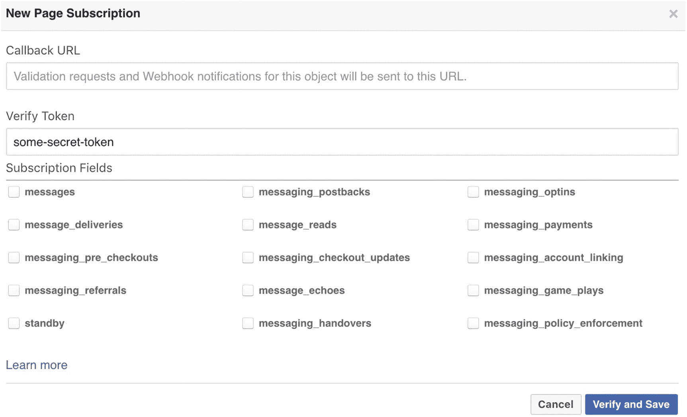

# 五、部署您的聊天机器人

在这一章中，我们将学习如何在网络上部署聊天机器人。人们可以通过各种方式和渠道向外界部署或公开他们的 chatbot web 应用程序。举个例子，我们可以在脸书和 Slack 上用 NLU 和对话模型来展示我们的星座机器人，因为他们已经为你提供了一个用户界面。您可能还想拥有自己的 web 应用程序，它完全运行在您自己的服务器上。在本章末尾，我们还将探索如何使用我们自己的用户界面在我们自己的服务器上部署聊天机器人。

## 第一步

第一步是创建一个你在第四章中创建的现有聊天机器人的副本，并制作一个新的副本，以便你有一个备份。因为，我们将通过添加一些新代码来做一些更改，所以让我们将两个项目分开。

于是，我创建了一个名为“**第五章**的新文件夹，并将我的`horoscope_bot`文件夹粘贴在那里。所以，现在我所有的模型文件、数据集和代码文件都被复制了，我可以直接使用它们进行部署。

## Rasa 的凭证管理

Rasa 提供了一种在一个地方管理您所有凭据的方法。你可能有一个单一的模型，但你可能希望它被部署在各种其他平台上，如脸书，Slack，Telegram 等。所有这些第三方平台都需要一些凭据才能在连接时使用。这些凭证存储在名为`credentials.yml`的 YAML 文件中。

让我们在我们的项目目录`horoscope_bot`文件夹中创建一个名为`credentials.yml` file 的文件，并在那里添加我们的脸书凭证。如果你不知道如何得到它，那么现在就创建这个文件，在本章的下一节你可以找到得到脸书证书的步骤。

`credentials.yml`的内容将如下所示:

```py
facebook:
  verify: "horoscope-bot"
  secret: "bfe5a34a8903e745e32asd18"
  page-access-token: "HPaCAbJJ1JmQ7qDedQKdjEAAbO4iJKr7H9nx4rEBAAuFk4Q3gPQcNT0wtD"

```

这些凭据是假凭据；令牌或密码的长度以及字符类型可能因您的脸书应用而异。

如果你正在做一个大项目，在这个项目中，你要在各种平台上集成你的聊天机器人，并且你想让这个项目更容易维护，那么最好使用`credentials.yml`。如果你是一家企业，并试图建立一个可以在各种平台上工作的机器人，如脸书、Slack、Twitter、Telegram 或你自己的网站，我强烈建议你维护一个`credentials.yml`。在这种情况下，管理密钥和秘密变得更加容易。

管理应用程序级密钥的一个好方法是将密钥存储为环境变量，并编写代码从操作系统环境本身读取密钥值或任何其他敏感信息。记住，在代码中保存任何类型的键都不是一个好主意。

您也可以创建一个点(。)env 文件，并从该文件中读取密钥，在您的代码存储库中没有对该文件进行跟踪。

为了简单起见，我们将在部署的独立脚本中使用访问密钥和秘密密钥。我们将使它变得简单易懂，这样你首先能够构建机器人，然后你可以尝试扩展它，最重要的是你可以考虑安全级别的问题。

如果您需要在多个平台上部署您的 bot，并希望使用 credentials.yml 来维护不同的凭证，那么您可以通过传递一个额外的参数来使用它。例如，在运行 rasa core 时使用上面名为`credentials.yml`的凭证文件，可以使用下面的命令。

```py
python -m rasa_core.run -d models/dialogue -u models/nlu/current   --port 5002 --credentials credentials.yml

```

对于更大的企业级聊天机器人开发来说，知道这一点很好，但是正如所讨论的，我们将在即将到来的示例中直接在我们的脚本中使用凭证。

## 在脸书部署聊天机器人

在本节中，我们首先将使用 Heroku 在云中部署我们的聊天机器人。Heroku 是一个平台即服务(PaaS ),使开发人员能够完全在云中构建、运行和操作应用程序。Heroku 的好处是，我们可以轻松地让我们的应用程序在 https 上运行，没有太多痛苦。在我们学习和测试聊天机器人的时候，我们不需要去购买 SSL 证书。之所以需要 https，是因为脸书等一些平台不允许开发者使用非 https 的 URL 作为回调 URL。

我们将按照一系列步骤一步一步地成功地将我们的聊天机器人部署为云中的 web 服务。一旦我们成功地做到了这一点，将它与不同的平台如 Slack、Telegram 等整合起来就容易多了。那么，我们开始吧。

### 在 Heroku 上创建应用程序

让我们开始吧:

在 Heroku 上注册，创建一个应用程序，并将其命名为 actions，因为这将是我们的 actions 服务器应用程序。看看图 5-1 中的截图，你可以给你的动作服务器一个唯一的名字，这个名字应该在 Heroku 上可以找到。一旦该名称可用，您就可以单击 Create app 按钮来创建 actions 服务器应用程序。

如果你的名字不可用，你可以随意给它取任何你想要的名字，但是要尽量取一些有意义的名字。


图 5-1

在 Heroku 上创建名为星座机器人 1212-动作的动作服务器应用程序

### 在本地系统上设置 Heroku

在本地操作系统上安装 Heroku CLI。参考此链接: [`https://devcenter.heroku.com/articles/heroku-cli`](https://devcenter.heroku.com/articles/heroku-cli) 。

如果您在 macOS 上，请使用以下命令:

```py
brew install heroku/brew/heroku

```

### 在脸书创建和设置应用程序

为了能够在脸书上部署我们的聊天机器人，首先我们需要有脸书应用程序的凭证。为了获得脸书证书，我们需要设置一个脸书应用程序和一个页面，就像我们在第三章中所做的那样。

1.  Go to [`https://developers.facebook.com/`](https://developers.facebook.com/) and create an app if you don’t have one already. We created one for our OnlineEatsBot; now we’ll create one for HoroscopeBot. Enter the details and click on Create App ID. Check Figure 5-2 to see how to enter the display name of your bot and your contact email.

    

    图 5-2

    为开发者在脸书上创建应用

2.  Once your app is created, go to Basic under Settings, and click on the Show button under App Secret. This is your `fb_secret`. Refer Figure 5-3 to see where exactly you will get your `fb_secret` key.

    

    图 5-3

    从脸书的应用程序中获取应用程序秘密

3.  Go to the dashboard for the app and scroll down to “Add a Product.” Click Add Product and then add Messenger (click on SetUp). Check Figure 5-4.

    

    图 5-4

    将 Messenger 作为产品添加到脸书应用程序

4.  Under settings for Messenger, when you scroll down to the Token Generation section you will get a link to create a new page for your app. If you don’t have a page already, then create it or choose a page from the “Select a page” dropdown. The “Page Access Token” is your `fb_access_token` here. Refer Figure 5-5.

    

    图 5-5

    为 Facebook Messenger 应用程序生成令牌

    您可以访问以下链接，为您的 bot 项目创建一个全新的页面:

    [`https://www.facebook.com/pages/creation/`](https://www.facebook.com/pages/creation/)

1.  Right after the Token Generation section, under Webhooks, click on “Setup Webhooks.” Refer Figure 5-6.

    

    图 5-6

    设置脸书 Webhooks

2.  Next, choose a verify token, which we’ll need to use later. The verify token can be any random string. This will be your `fb_verify`. Check Figure 5-7 to understand where to add the verification token in facebook app. Now, leave the callback URL section blank as it is. Don’t close the browser; just leave it—we’ll come back here again.

    

    图 5-7

    将验证令牌添加到脸书 webhook 设置中

3.  随身携带`fb_verify, fb_secret`和`fb_access_token`将你的机器人连接到脸书。

### 在 Heroku 上创建和部署 Rasa Actions 服务器应用程序

在这一步中，我们将使用我们的 actions Heroku 应用程序作为 Rasa action 的服务器。我们需要两个不同的应用程序，因为我们不能在一个 Heroku 应用程序中运行两个 web 应用程序。转到命令行，按照指示从项目目录中执行以下命令。

1.  创建一个名为 actions_app `and`的新文件夹，进入目录:

    mkdir actions_app

    光盘操作 _ 应用程序

2.  将您的 actions.py 从主项目目录复制到 actions_app 目录。

3.  用以下内容创建一个 requirements.txt 文件。会告诉 Heroku 应用程序安装软件包及其版本。

    rasa-core-sdk==0.11.0

    请求数==2.18.4

4.  用以下内容创建一个名为 Procfile 的文件。Procfile 是 Heroku 了解如何启动应用程序的文件。

    ```py
    web: python -m rasa_core_sdk.endpoint --actions actions --port $PORT

    ```

5.  运行下面的命令集:

    $ heroku 登录

    去吧，init

    $ heroku git:remote -a<your-heroku-app-name></your-heroku-app-name>

    $ heroku buildpacks:设定 heroku/python

    $ heroku config:设置端口=5055

    去给我。

    $ git commit -am "部署我的机器人"

    $ git 推出 heroku master

在最后一个命令之后，Heroku 将按照 requirements.txt 文件安装我们需要的所有包。如果您的应用程序成功部署，您应该会收到类似以下内容的日志:

```py
remote:
remote: -----> Discovering process types
remote:        Procfile declares types -> web
remote:
remote: -----> Compressing...
remote:        Done: 48.3M
remote: -----> Launching...
remote:        Released v4
remote:        https://horoscopebot1212-actions.herokuapp.com/ deployed to Heroku
remote:
remote: Verifying deploy... done.
To https://git.heroku.com/horoscopebot1212-actions.git
 * [new branch]      master -> master

```

此时，我们将验证我们的应用程序是否正在响应公共请求。为了做到这一点，让我们点击附加了“webhook”的应用程序 url

在我的例子中，应用程序 url 是 [`https://horoscopebot1212-actions.herokuapp.com/`](https://horoscopebot1212-actions.herokuapp.com/) ，因此我将检查我的操作的服务器是否有响应。

我访问这个网址 [`https://horoscopebot1212-actions.herokuapp.com/webhook`](https://horoscopebot1212-actions.herokuapp.com/webhook) ，不出所料，它返回说方法不允许，如图 5-8 所示，这完全没问题，意味着应用程序按照用户请求正确响应。


图 5-8

正在验证操作服务器端点

### 创建 Rasa 聊天机器人 API 应用程序

在这一步中，我们将遵循一些类似于我们刚才所做的步骤和命令，但这是一个我们将创建的新应用程序，它将成为我们用于对话管理的主要应用程序。所以，我们开始吧。首先回到主项目目录(即，在占星 _bot 中)并创建一个文件名( **Procfile)** 并向其中添加以下内容:

```py
web: python -m spacy download en && python facebook.py

```

### 为 Facebook Messenger 聊天机器人创建独立脚本

在同一个项目目录下创建一个文件名`facebook.py`。Python 文件的内容应该如下所示:

```py
from rasa_core.channels.facebook import FacebookInput
from rasa_core.agent import Agent
from rasa_core.interpreter import RasaNLUInterpreter
import os
from rasa_core.utils import EndpointConfig

# load your trained agent
interpreter = RasaNLUInterpreter("models/nlu/default/horoscopebot/")
MODEL_PATH = "models/dialog"
action_endpoint = EndpointConfig(url="https://horoscopebot1212-actions.herokuapp.com/webhook")

agent = Agent.load(MODEL_PATH, interpreter=interpreter)

input_channel = FacebookInput(
        fb_verify="YOUR_FB_VERIFY_TOKEN",
        # you need tell facebook this token, to confirm your URL
        fb_secret="YOUR_FB_SECRET",  # your app secret
        fb_access_token="YOUR_FB_ACCESS_TOKEN"
        # token for the page you subscribed to
)
# set serve_forever=False if you want to keep the server running
s = agent.handle_channels([input_channel], int(os.environ.get('PORT', 5004)), serve_forever=True)

```

确保用我们在步骤 3 中保留的值替换代码中的`fb_verify`、`fb_secret,`和`fb_access_token`变量值。

创建一个新的 requirements.txt 文件，并添加这个项目所需的所有包及其版本。我的 requirements.txt 看起来是这样的；对于您的项目，需求可能会有所不同，但是如果您遵循本章中的同一个 bot 示例，这些需求应该没问题。

```py
rasa-core==0.11.1
rasa-core-sdk==0.11.0
rasa-nlu==0.13.2
gunicorn==19.9.0
requests==2.18.4
spacy==2.0.11
sklearn-crfsuite==0.3.6

```

在服务器上安装我们的软件包。

现在，让我们像之前一样在 Heroku 中再次创建一个新的应用程序。转到 Heroku 仪表盘，创建一个新的应用程序，如图 5-9 所示。


图 5-9

在 Heroku 中创建对话管理应用程序

创建应用程序后，现在可以转到项目根目录，从项目文件夹中的命令行运行以下命令集:

```py
$ git init
$ heroku git:remote -a <your-heroku-app-name>
$ heroku buildpacks:set heroku/python
$ heroku config:set PORT=5004
$ git add .
$ git commit -am "deploy my bot"
$ git push heroku master

```

如果您在部署后得到一个运行时错误，它可能如下所示

ValueError:您可能试图用 Python 3 读取用 Python 2 生成的 joblib pickle。joblib 不支持此功能。

如果您使用的是 Python 2.x 版本，这种情况就会发生。Heroku 默认使用 Python 3.x 版本。因此，如果您想使用 Python 2.x，您需要执行以下步骤来解决上述错误。把 Python 3.6 改成 Python-2.7.15。来做这个。

在项目的根应用程序目录下创建一个文件 runtime.txt。打开 runtime.txt，添加下面一行 python-2.7.15，然后保存。Heroku 将只使用前面提到的 Python 版本来构建您的项目。

一旦成功完成部署，您将看到 Heroku 给出的一个 url，上面写着应用程序已部署到<url>。</url>

```py
remote: Compressing source files... done.
remote: Building source:
remote:
remote: -----> Python app detected
remote: -----> Installing requirements with pip
remote:
remote: -----> Discovering process types
remote:        Procfile declares types -> web
remote:
remote: -----> Compressing...
remote:        Done: 254M
remote: -----> Launching...
remote:        Released v17
remote:        https://horoscopebot1212.herokuapp.com/ deployed to Heroku
remote:
remote: Verifying deploy... done.
To https://git.heroku.com/horoscopebot1212.git
   cd3eb1b..c0e081d  master -> master

```

这个部署需要一点时间，所以尽可能耐心一点——您将会看到奇迹。如果您没有收到任何错误消息，那么您已经成功地将您的聊天机器人部署到 Heroku on cloud，使其能够与 Facebook Messenger 一起工作。我们来验证一下是否有效。

### 在 Heroku 上验证我们的对话管理应用程序的部署

为了验证我们的对话管理应用是否成功部署在 Heroku 上，我们将执行以下步骤。

1.  获取 Heroku 给出的 url，并将这个端点附加到它后面:`/webhooks/facebook/webhook?hub.verify_token=YOUR_FB_VERIFY_TOKEN&hub.challenge=successfully_verified`。确保使用您在脸书用于 webhooks 设置的正确验证令牌。对我来说，完整的网址如下: [`https://horoscopebot1212.herokuapp.com/webhooks/facebook/webhook?hub.verify_token=my-secret-verify-token&hub.challenge=success`](https://horoscopebot1212.herokuapp.com/webhooks/facebook/webhook%253Fhub.verify_token%253Dmy-secret-verify-token%2526hub.challenge%253Dsuccess) 。

2.  转到浏览器并粘贴整个 url，如果您的 hub.verify_token 正确，它应该会返回您的 hub.challenge 值。您的完整 url 将如下所示: [`https://horoscopebot1212.herokuapp.com/webhooks/facebook/webhook?hub.verify_token=YOUR_FB_VERIFY_TOKEN&hub.challenge=successsfully_verified`](https://horoscopebot1212.herokuapp.com/webhooks/facebook/webhook%253Fhub.verify_token%253DYOUR_FB_VERIFY_TOKEN%2526hub.challenge%253Dsuccesssfully_verified) 。如果您收到消息`successsfully_verif ied in the browser`，那么您的应用程序已成功部署并运行。

### 将 Webhook 与脸书集成

现在让我们回到我们的脸书应用程序配置。我们将回到我们在步骤 3 中停止的地方，添加我们的回调 URL。确保检查订阅字段中的**消息**。查看图 5-10 以供参考。


图 5-10

Facebook Messenger webhooks 配置

点击“验证并保存”脸书将使用上述 url 匹配验证令牌，即服务器，或者说我们的应用程序将只响应具有正确验证令牌的请求。一旦验证令牌匹配，我们的应用程序的 webhook 订阅将被激活。

接下来，在页面的 Webhooks 部分下，选择一个页面，您可以将 webhook 订阅到该页面事件。点击订阅(见图 5-11 )。


图 5-11

为 webhook 订阅脸书页面事件

全部完成！是时候在脸书测试我们的星座机器人了。

### 部署后验证:脸书聊天机器人

在正常的软件开发场景中，人们构建软件，测试软件，然后部署并进行 PDV(部署后验证)。我们也将做一些类似的事情，在 Facebook Messenger 上成功部署后，我们将为我们的聊天机器人做一个 PDV。这很重要，因为正如您所了解的，聊天机器人有一部分需要连接到动作服务器，以响应用户的一些意图请求。PDV 就像是一个健全性测试，以查看应用程序的健康状况总体良好。如果您正在构建一个使用 10 到 15 个不同供应商的 API 的 bot，那么必须检查您的 bot 访问动作服务器并使用 API 将数据返回给用户的所有场景。

所以，打开你的 messenger 应用程序或电脑浏览器中的脸书，搜索你的机器人开始说话。

数字 5-12.1 到 5-12.3 显示了我的星座机器人做了什么并告诉我。


图 5-12.3

horoscope _ bot facebook


图 5-12.2

horoscope _ bot facebook


图 5-12.1

horoscope _ bot facebook

瞧啊。我们的第一个内置聊天机器人应用程序部署在网络上，可以通过 Facebook Messenger 平台访问。所以，请与你的家人、朋友、同事和全世界分享吧。

## 在 Slack 上部署聊天机器人

在本节中，我们将把我们的聊天机器人部署到 Slack。Slack 是一个团队协作工具，在开发人员和企业中广受欢迎。如果你不是一个社交媒体人，那么你可能需要 Slack 的帮助来使用界面与你的聊天机器人交谈。因此，让我们开始构建我们的第一个内部 Slack 聊天机器人。

为了将我们的星座聊天机器人部署到 slack，我们将编写一个独立的脚本，就像我们在脸书的例子中所做的那样。

### 为 Slack 聊天机器人创建独立脚本

在项目目录中创建一个名为`slack.py`的新文件。文件`slack.py`的内容如下所示:

```py
from rasa_core.channels.slack import SlackInput
from rasa_core.agent import Agent
from rasa_core.interpreter import RasaNLUInterpreter
import os
from rasa_core.utils import EndpointConfig

# load your trained agent
interpreter = RasaNLUInterpreter("models/nlu/default/horoscopebot/")
MODEL_PATH = "models/dialogue"
action_endpoint = EndpointConfig(url="https://horoscopebot1212-actions.herokuapp.com/webhook")

agent = Agent.load(MODEL_PATH, interpreter=interpreter, action_endpoint=action_endpoint)

input_channel = SlackInput(
            slack_token="YOUR_SLACK_TOKEN",
            # this is the `bot_user_o_auth_access_token`
            slack_channel="YOUR_SLACK_CHANNEL"
            # the name of your channel to which the bot posts (optional)
    )
# set serve_forever=False if you want to keep the server running
s = agent.handle_channels([input_channel],  int(os.environ.get('PORT', 5004)), serve_forever=True)

```

`facebook.py`和`slack.py`的主要区别在于我们创建的`input_channel`对象。Rasa 提供了各种内置通道，如脸书、Slack、Mattermost、Telegram、Twilio、RocketChat 和 Microsoft Bot Framework，我们可以直接使用这些通道轻松地在各种通道上部署同一个 Bot。

如你所见，我们需要添加一个`slack_token`和`slack_channel`到我们的脚本中。由于我们必须在脸书的开发者平台上创建一个脸书应用程序，同样我们也必须在 Slack 上创建一个应用程序。

让我们一步一步来:

1.  Got to this url [`https://api.slack.com/slack-apps`](https://api.slack.com/slack-apps) and click on the button “Create App.” Refer Figure 5-13.

    

    图 5-13

    在 Slack 中创建应用程序

2.  The next step is to create a Bot User. To create a bot user, click on **Bots** under “Add features and functionality.” In the new page you will get an option to “Add a Bot User.”. Check Figure 5-14 to see how to add details and add a bot user.

    

    图 5-14

    在 Slack 上给你的机器人命名

3.  根据您正在构建的聊天机器人填写详细信息。显示名称可以是您喜欢的任何名称；默认用户名必须是唯一的；你可以顺其自然。切换最后一个选项“总是将我的机器人显示为在线”就是总是将机器人显示为用户可用。这就是聊天机器人的意义所在——人类不可能全天候可用，但聊天机器人可以，所以我们打开了这个功能。确保您点击保存更改。

4.  Go back to the “Basic Information” tab. Click “Install your app to your workspace.” The app will ask to confirm the identity. Please authorize it like you do for any other app. Check Figure 5-15 which shows how the authorization would look like.

    

    图 5-15

    授权您的 Slack 应用程序

你会在“添加特性和功能”下找到带有绿色勾号的“机器人和权限”选项卡，这意味着我们的机器人和应用程序集成良好。这是一个迹象，表明我们目前做得很好。

1.  转到 OAuth & Permissions 部分，复制 **Bot 用户 OAuth 访问令牌。**

2.  将复制的令牌粘贴到我们的 Python 脚本`slack.py`中。给一个你喜欢的频道名。如果你想让你的机器人发布到一个频道，那么你可以给一个频道名称。我已经给了@slackbot。如果不设置`slack_channel`关键字参数，消息将被传递回发送它们的用户。

### 编辑您的个人资料

在这一步中，我们不会创建任何新的 Procfile，因为我们使用的是相同的代码库。我们将对现有的 Procfile 进行如下修改，使其适用于我们的 slack bot。因此，我们只需将脚本文件的名称从`facebook.py`更改为`slack.py`，这样 Heroku 就可以使用给定的文件来启动应用程序。

```py
web: python -m spacy download en && python slack.py

```

### Slack Bot 在 Heroku 的最终部署

为了最终将我们的新 Slack bot 部署到 Heroku，我们将从命令行运行一组类似的 Heroku 命令来部署我们的应用程序。

```py
$ git init
$ heroku git:remote -a <your-heroku-app-name>
$ git add .
$ git commit -am "deploy my bot"
$ git push heroku master

```

### 订阅时差事件

现在，点击“**事件订阅**选项卡，通过切换屏幕上的按钮激活事件订阅功能。为 Slack 输入 Heroku 应用程序的 webhook url。

如果您的应用程序使用修改后的 Procfile 正确地部署在 Heroku 上，那么您的 Slack 的 webhook url 将是`app_url + /webhooks/slack/webhook`，如下所示:

[`https://horoscopebot1212.herokuapp.com/webhooks/slack/webhook`](https://horoscopebot1212.herokuapp.com/webhooks/slack/webhook)

在 Slack 向上述 URL 发送一个带有挑战参数的 HTTP POST 请求后，您将看到一个经过验证的勾号，我们的端点必须用挑战值进行响应。这类似于我们在构建脸书聊天机器人的秘密令牌时讨论的内容。查看图 5-16 了解更多信息。


图 5-16

为您的机器人激活事件订阅

### 订阅机器人事件

在这一步中，我们只需向下滚动事件订阅页面，转到“订阅 Bot 事件”部分，然后单击“添加 Bot 用户事件”参考图 5-17 了解导航位置。


图 5-17

订阅机器人事件

订阅机器人事件只不过是声明机器人必须回复的事件。这里我们只演示两种情况:第一，当有人提到机器人的名字时(即**app _ reference**)，第二，当有人直接向机器人发送消息时(即 **message.im** )。

现在，单击保存更改，您就完成了。是时候测试我们的 Slack 聊天机器人了，就像我们在上一节为脸书做的那样。

### 部署后验证:Slack Bot

让我们转到我们用来创建应用程序的工作区，在左侧的应用程序下，您会找到您的机器人。试着和它说话，看看它做得好不好。我的机器人做得很好，给了我今天的星座运势，读起来很不错。如果你到现在还不能来，那么检查图 5-18 看看我的 Slack 机器人如何响应。


图 5-18

测试 Slack 聊天机器人

所以，伙计们，我们完成了我们的松弛机器人。在下一节中，我们将把我们的机器人部署到我们自己的 UI 中。构建你自己的 UI 可能需要一些前端技能，但是不要担心——我们对此有计划。

## 自己部署聊天机器人

这个标题听起来很酷，不是吗？到目前为止，我们一直使用脸书或 Slack 在网上部署聊天机器人，或者我们可以使用 Telegram 等。，但现在是我们自己部署一切的时候了—我们自己的服务器、我们自己的数据，以及使用我们自己的用户界面的我们自己的配置模型。如果你是一个组织或一个崭露头角的企业家，你可能会在脸书、推特或 Slack 上有你的机器人创意，但你总是希望它也能在你自己的网站上工作，这样你的品牌价值就会随着用户群的增加而越来越大。

在这一节中，我们将使用我们迄今为止的所有辛勤工作，最终构建一个聊天机器人，它具有完整的功能，并且独立于任何第三方 API 调用或工具，如 Dialogflow、wit.ai、Watson 等。你将拥有世界上所有的控制权，以你想要的方式调整你的聊天机器人，最重要的是，以你想要的方式轻松地扩展到数百万人。

那么，我们开始吧。

第一步是确保我们在前面章节中部署的两个应用程序已经启动并运行。您已经知道如何进行基本的健全性检查。要在任何平台上使用 chatbot 模型，您始终需要运行您的对话管理器应用程序和操作应用程序。

现在，在我们创建 facebook.py 和 slack.py 的同一个项目目录中，我们将创建一个名为`myown_chatbot.py`的新文件。之前创建的脚本，如`facebook.py`和`slack.py`，是我们创建的独立脚本，这样我们就可以在命令中告诉 Heroku 运行哪个脚本来启动应用程序。现在，我们正在创建自己的脚本，它将通过 REST APIs 公开用户和聊天机器人之间的请求/响应。

部署你自己的聊天机器人有两个部分。在第一部分中，我们将编写一个脚本来创建一个定制通道，并将其作为 REST APIs 进行部署。在第二部分，我们需要自己的用户界面，因为到目前为止，我们一直在使用脸书和 Slack 的聊天屏幕进行对话。

### 为您自己的聊天机器人频道编写脚本

这个脚本类似于我们到目前为止所学习和编写的内容，但是它需要我们覆盖 rasa_core 的一些现有方法，以便我们可以为 API 身份验证定义自己的规则。我在下面的代码中完成了令牌验证的基本字符串检查。对于生产级系统，这是不建议的，所以如果您正在为更大的系统构建聊天机器人，请确保小心编写该部分。

创建一个名为 myown_chatbot.py 的新文件，并向其中添加以下内容:

```py
import os

from rasa_core.channels.rasa_chat import RasaChatInput
from rasa_core.agent import Agent
from rasa_core.interpreter import RasaNLUInterpreter
from rasa_core.utils import EndpointConfig

# load your trained agent
interpreter = RasaNLUInterpreter("models/nlu/default/horoscopebot/")
MODEL_PATH = "models/dialogue"
action_endpoint = EndpointConfig(url="https://horoscopebot1212-actions.herokuapp.com/webhook")

agent = Agent.load(MODEL_PATH, interpreter=interpreter, action_endpoint=action_endpoint)

class MyNewInput(RasaChatInput):
    def _check_token(self, token):
        if token == 'mysecret':
            return {'username': 1234}
        else:
            print("Failed to check token: {}.".format(token))
            return None

input_channel = MyNewInput(url='https://horoscopebot1212.herokuapp.com')
# set serve_forever=False if you want to keep the server running
s = agent.handle_channels([input_channel],  int(os.environ.get('PORT', 5004)), serve_forever=True)

```

这里需要注意几点:

*   `rasa_core`中的`_check_token`方法基本看起来如下，它进行 API 调用来获取用户对象。这主要完成用户级认证/验证的工作。在前面被覆盖的方法中，我们保持了它的简单性，以使它能够工作并理解它的用法。

    ```py
    def _check_token(self, token):
            url = "{}/users/me".format(self.base_url)
            headers = {"Authorization": token}
            logger.debug("Requesting user information from auth server {}."
                         "".format(url))
            result = requests.get(url,
                                  headers=headers,
                                  timeout=DEFAULT_REQUEST_TIMEOUT)

            if result.status_code == 200:
                return result.json()
            else:
                logger.info("Failed to check token: {}. "
                            "Content: {}".format(token, request.data))
                return None

    ```

*   使用 Rasa 自己的`_check_token`方法可能需要您编写一个 API 或 web 服务来接受请求并以指定的方式返回响应。

*   请确保将操作的服务器端点更改为您自己的 url。

*   请记住，代码中的`mysecret`字符串将在以后用于进行 API 调用。

### 编写概要文件并部署到

到目前为止，您一定非常熟悉为 Heroku 部署创建 Procfiles。我们将再次使用现有的 Procfile，并在那里进行修改，以将基于 API 的 chatbot 部署到 web 上。在创建现有 Procfile 的备份后，可以随意创建新的 proc file。

以下是我的 Procfile 内容的样子:

```py
web: python -m spacy download en && python myown_chatbot.py

```

完成后，只需执行我们在部署 Facebook Messenger 和 Slack Bot 时已经学习过的下一组命令。

```py
$ git init
$ heroku git:remote -a <your-heroku-app-name>
$ git add .
$ git commit -am "deploy my bot"
$ git push heroku master

```

在最后一个命令之后，你将从 Heroku 获得一些日志，这些日志与部署版本、对应用程序所做的更改等相关。

### 验证您的聊天机器人 API

在获得成功部署的消息后，让我们测试一下我们的 chatbot APIs 是否工作正常。为了快速进行健全性测试，请点击以下 url:

```py
<your-basic-app-url>+/webhooks/rasa/

```

**举例**:

[`https://horoscopebot1212.herokuapp.com/webhooks/rasa/`](https://horoscopebot1212.herokuapp.com/webhooks/rasa/)

在浏览器中打开这个 url 应该会得到如下的响应。如果它给你一个“ok”的状态，那么你就可以开始了——放松，坐下来，调试。

```py
{"status":"ok"}

```

有时，仅仅是这种验证可能还不够，所以让我们通过尝试检查聊天机器人是否正在识别意图并基于此给出响应来测试它。

我将使用 POSTMAN 工具(POSTMAN 是一个非常好的基于 GUI 的工具来进行 API 测试)。你可以使用任何你觉得舒服的工具。我们只是要测试我们的聊天机器人应该理解和响应的意图之一。我测试了问候的意图，它工作得非常好。机器人返回了预期的响应，如图 5-19 所示。


图 5-19

在 POSTMAN 中测试聊天机器人 API

### 创建聊天机器人用户界面

正如我们之前讨论的，作为第二步的一部分，我们需要有自己的 UI，为聊天机器人和用户之间的对话提供一个用户友好的场所。如果你是一个前端开发人员，或者你的团队中有一个前端开发人员，你可以很容易地给出我们构建到这一点的 chatbot APIs，前端团队应该可以很容易地将这与他们的 chatbot UI 集成。他们可以利用常规的 HTTP 调用来使用这些 API。Websockets 是一种更好的聊天机器人方式，但这不在本书的解释范围之内。

如果你不熟悉 HTML/CSS/Javascript 之类的前端技术，那么我确实推荐 *Pro HTML5 搭配 CSS、Javascript、多媒体* (Apress，2017)。

为了我们的读者——或者我应该说是学习者——的方便，我们创建了一个聊天机器人和用户对话所需的基本 UI。你可以在 github 或 Apress 的网站上找到完整的工作代码。我将告诉你使它为你的机器人工作所需要的配置。

一旦你下载了本章的代码，你会在主文件夹中找到一个名为`my_own_chatbot`的文件夹。进入这个文件夹，进入 assets - > js - > script.js 文件。

将下面一行 javascript 代码更改为您自己的端点 url。如果你的应用程序名称不同，那么下面的网址将是不同的。使用您自己的 url 和 javascript 代码中的标记，如下所示。

```py
var baseUrl = "https://horoscopebot1212.herokuapp.com/webhooks/rasa/webhook?token=YOUR-SECRET";

```

保存文件并在浏览器中打开`index.html`文件，你可以很容易地看到一个聊天机器人 UI 已经准备好了。但是从本地提供的简单 HTML 进行 API 调用会引发一个 CORS 问题。因此，为了避免这种情况，我们将对现有的`myown_chatbot.py`稍作修改，以服务于 Heroku 应用本身的 HTML。

将您的`myown_chatbot.py`更改为下面的，然后我们将讨论所做的更改。

```py
import os

from rasa_core.channels.rasa_chat import RasaChatInput
from rasa_core.channels.channel import CollectingOutputChannel, UserMessage
from rasa_core.agent import Agent
from rasa_core.interpreter import RasaNLUInterpreter
from rasa_core.utils import EndpointConfig
from rasa_core import utils

from flask import render_template, Blueprint, jsonify, request

# load your trained agent
interpreter = RasaNLUInterpreter("models/nlu/default/horoscopebot/")
MODEL_PATH = "models/dialogue"
action_endpoint = EndpointConfig(url="https://horoscopebot1212-actions.herokuapp.com/webhook")

agent = Agent.load(MODEL_PATH, interpreter=interpreter, action_endpoint=action_endpoint)

class MyNewInput(RasaChatInput):
    @classmethod
    def name(cls):
        return "rasa"

    def _check_token(self, token):
        if token == 'secret':
            return {'username': 1234}
        else:
            print("Failed to check token: {}.".format(token))
            return None

    def blueprint(self, on_new_message):
        templates_folder = os.path.join(os.path.dirname(os.path.abspath(__file__)), 'myown_chatbot')

        custom_webhook = Blueprint('custom_webhook', __name__, template_folder = templates_folder)

        @custom_webhook.route("/", methods=['GET'])
        def health():
            return jsonify({"status": "ok"})
        @custom_webhook.route("/chat", methods=['GET'])
        def chat():
            return render_template('index.html')

        @custom_webhook.route("/webhook", methods=['POST'])
        def receive():
            sender_id = self._extract_sender(request)
            text = self._extract_message(request)
            should_use_stream = utils.bool_arg("stream", default=False)

            if should_use_stream:
                return Response(
                        self.stream_response(on_new_message, text, sender_id),
                        content_type='text/event-stream')
            else:
                collector = CollectingOutputChannel()
                on_new_message(UserMessage(text, collector, sender_id))
                return jsonify(collector.messages)

        return custom_webhook

input_channel = MyNewInput(url='https://horoscopebot1212.herokuapp.com')
# set serve_forever=False if you want to keep the server running
s = agent.handle_channels([input_channel],  int(os.environ.get('PORT', 5004)), serve_forever=True)

```

以下是我们所做的更改:

*   在我们的类中覆盖现有的`name`和`blueprint`方法，这允许我们创建自己的端点，也给了我们定义它应该如何行为的自由。

*   我们创建了一个新的端点/聊天，并提供了 index.html 文件，这只是聊天机器人的用户界面。这将是我们聊天机器人的主页链接。

*   我们必须根据需要导入一些必要的类和方法，比如`utils, CollectingOutputChannel`和`UserMessage`来使事情正常运行。

保存文件，并使用以下命令将更改再次部署到我们的 Heroku 应用程序:

```py
$ git add .
$ git commit -am "deploy my bot"
$ git push heroku master

```

一旦部署成功，瞧！我们已经准备好与全世界分享我们的机器人，它使用两个 Heroku 应用程序工作:一个用于对话管理，一个用于动作。

在浏览器中打开以下 url，我们将在其中看到我们的自定义聊天机器人 UI:

[`https://horoscopebot1212.herokuapp.com/webhooks/rasa/chat`](https://horoscopebot1212.herokuapp.com/webhooks/rasa/chat)

图 5-20.1 和 5-20.2 显示了我自己的聊天机器人在对话过程中的样子。


图 5-20.2

在你自己的网站上定制聊天机器人


图 5-20.1

在你自己的网站上定制聊天机器人

使用 Heroku 的自定义域名功能，人们可以轻松地将同一个应用程序指向自己网站的名称，如`www.example.com`。当你觉得你的聊天机器人足够好，可以向全世界公开，无论是盈利还是非盈利，就这么做吧。

所以，这就是所有的乡亲！这就是使用自然语言处理和机器学习用 Python 构建聊天机器人的方式。我希望这一章和前几章对你有所帮助，你可以学习学习和构建聊天机器人的实用方法。

## 摘要

在本章中，我们学习了如何使用 Heroku 将我们自己的应用程序部署到我们自己的服务器上。我们学会了如何使用脸书的开发平台将我们的聊天机器人与脸书集成。我们还学习了为 Slack 应用程序创建自定义聊天机器人，并对其进行了测试。最后，正如在第三章末尾所承诺的，去除所有对任何社交媒体平台的依赖，我们创建了自己的 UI，并在 Heroku 上部署和测试了它。我们看到它非常有效——在训练它的时候它就起作用了。因为我们有了一个基本的模型，现在你可以处理 chatbot 不能很好工作的情况。确定是否是与数据或培训、操作服务器或自定义代码处理相关的问题。一旦您找到了根本原因，修复它，再次部署，并检查 chatbot 是否有所改进。我们从小做起，打造大软件。

我期待着收到你的来信，并且很想知道在看完这本书之后你制作了什么样的聊天机器人。如果您在任何概念、代码执行或部署方面遇到困难，我很乐意随时为您提供帮助。

谢谢，干杯。