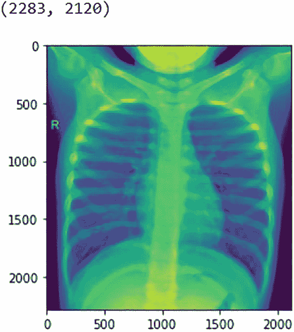
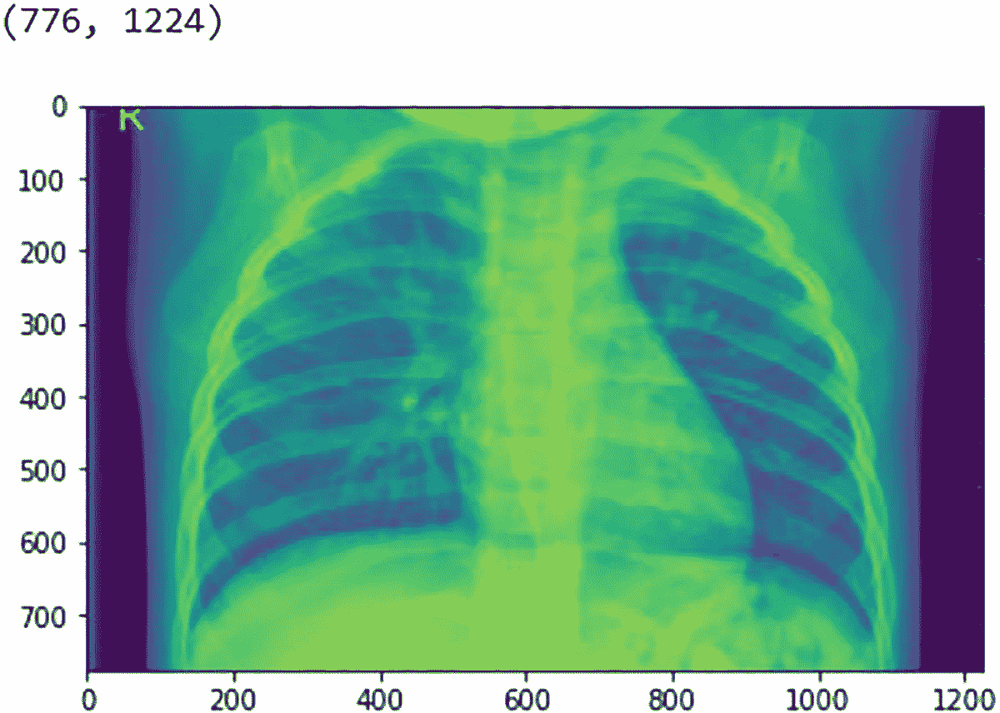
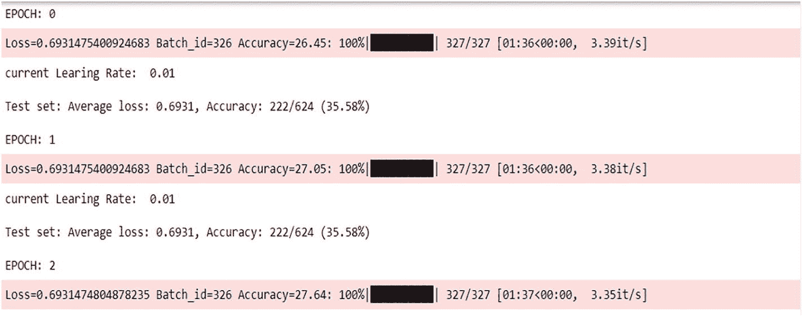
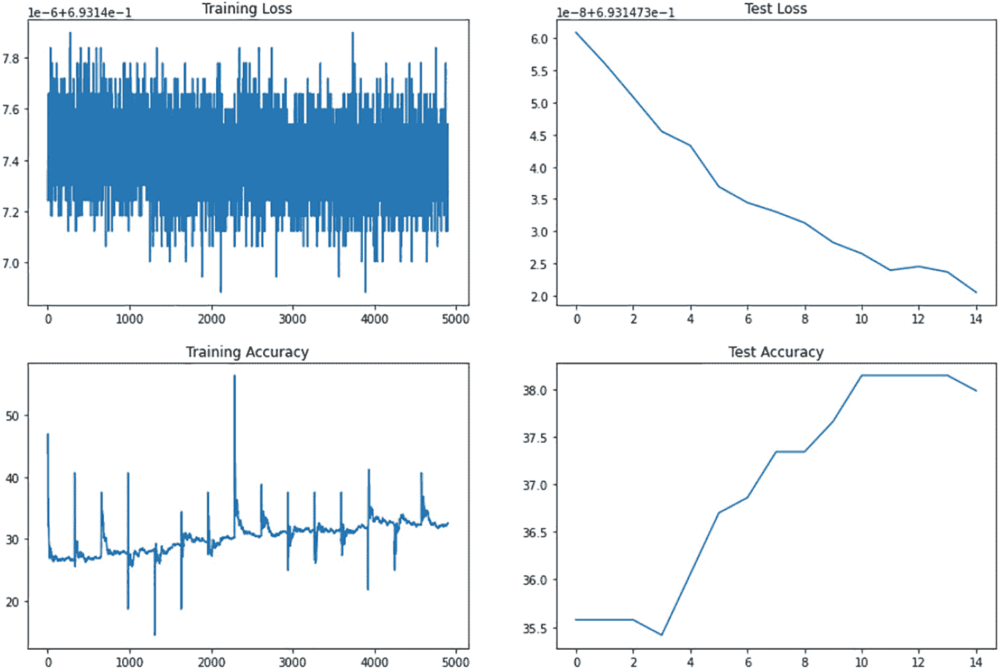
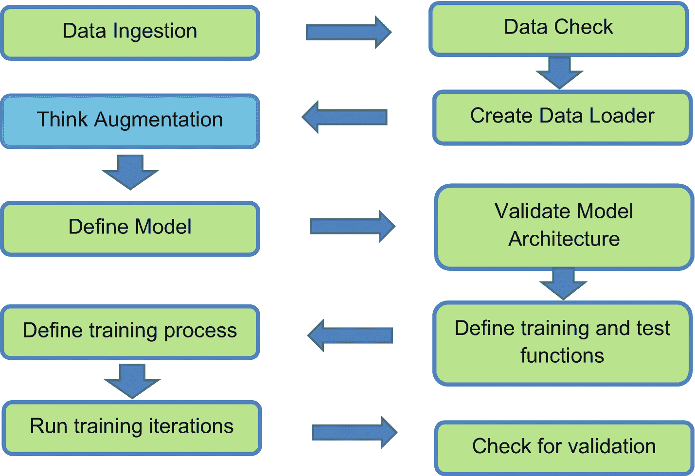
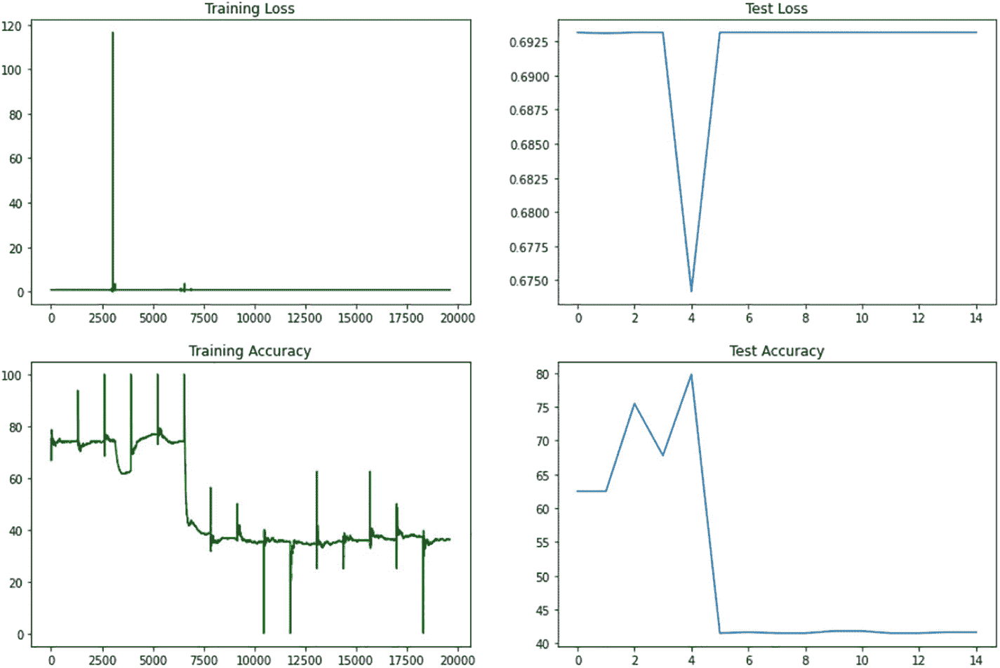
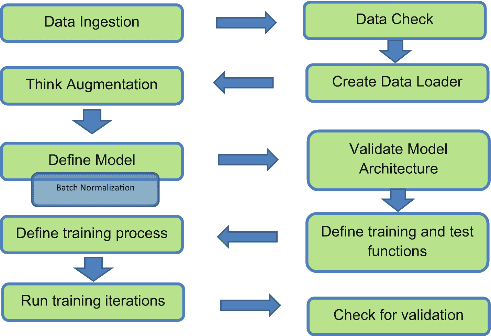
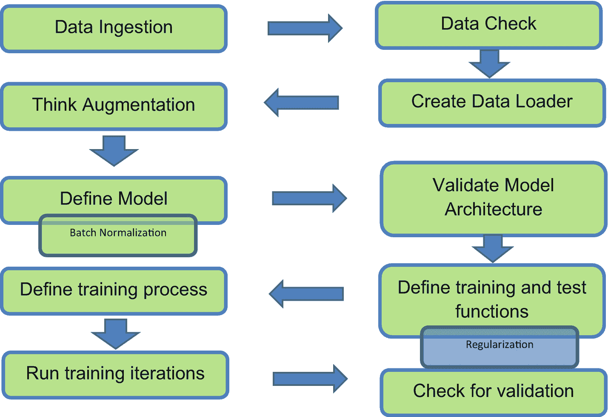
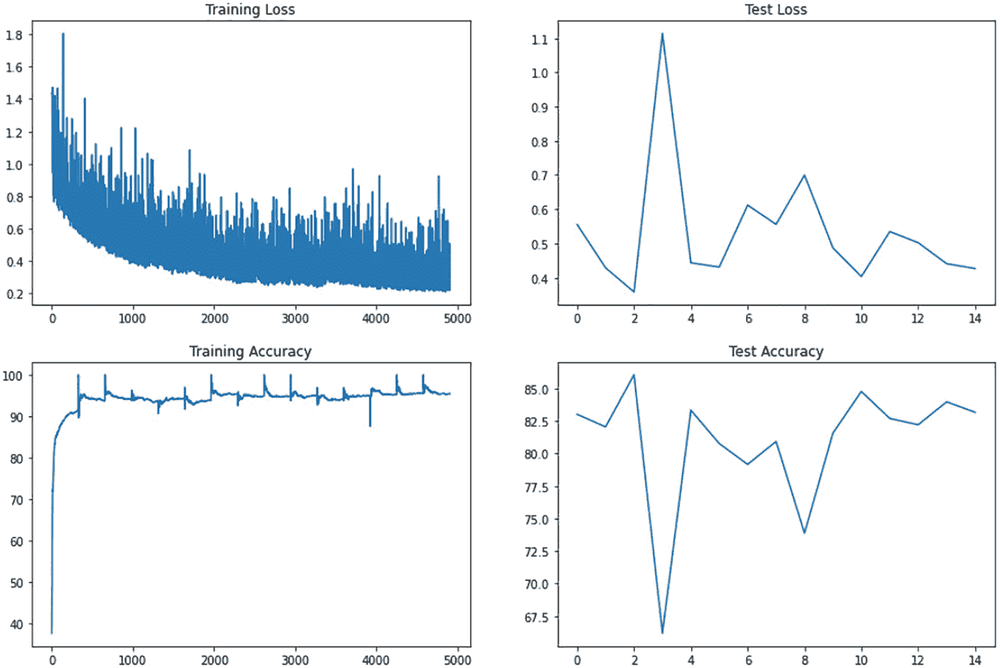

# 2. 图像分类

上一章讨论了计算机视觉中的几个重要概念。还讨论了一些计算机视觉领域的最佳实践，现在是时候将它们付诸实践了。本章为计算机视觉领域的多个应用奠定了基础。我们首先从基本解释开始，说明如何开始使用 Torch 组件来构建模型、定义损失函数并进行训练。

需要通过名称识别的对象涉及分类过程。我们在数据科学的所有方面都遇到过涉及分类需求的问题。它可以简单到对手机上的图像进行分类，判断它是山还是海的图片，或者是鸟还是狗。分类是最基本但也是最强大的概念之一。让我们看看计算机视觉模型是如何设置分类的：

1. 检测边缘
2. 检测梯度
3. 识别纹理
4. 识别模式
5. 形成对象的部件

模型需要将名称与图像中的特定对象关联起来。它通过遵循结构化的知识提取机制，然后为其决策过程重新生成输入来实现这一点。

## 涵盖主题

1. 数据准备方法
2. 数据增强技术
3. 使用批量归一化和丢弃法
4. 比较激活函数
5. 设置模型及其变体
6. 训练过程
7. 运行推理并比较模型结果

### 定义问题

我们将借助计算机视觉建模技术检查肺部 X 光图像，并将其分类为患有肺炎或正常。由于这是一个医疗保健问题，最好让模型过度预测。我们需要以最高的准确率进行预测，并且如果可能的话，应达到接近 100% 的召回率，同时也要有高精确率。我们需要确保诊断出任何可能的感染病例，并且不要因为微小的误差而将受感染的肺部错误分类为健康肺部。通常可以使用 Softmax 对数几率来确定预测，而不是由 Softmax 函数来决定类别。这是一个基于对数据的经验以及模型行为的关键决策。

困扰这类图像分类问题的一个主要问题是正确标注数据的可用性。通过卷积神经网络进行图像分类有助于处理多个下游任务。在某个数据上训练的模型可以用于微调其他类似数据，并用于预测目的。有多个开源图像存储库，但对于大多数工业用途而言，它们为我们提供了一个起点。我们还需要使用我们特定任务的图像。

# 方法概述

我们将使用卷积神经网络来解决分类问题。我们会尝试调整流程中的变量，以追求更高的准确率和稳定的结果。在此过程中，将大量运用第 1 章学到的概念。这严格来说是一项实验，我们仅为需要迭代的方法设定基线标准。

该方法包含以下步骤：

1. 从数据源下载数据并将其放置在根目录中。
2. 检查数据完整性、可配置信息，如图像的形状、大小和分布。
3. 初始化用于训练和测试的数据加载器功能。
4. 定义模型架构并进行验证。
5. 定义训练和测试函数。
6. 定义训练优化器及其他训练信息，如正则化器、周期、批次等。
7. 训练并检查损失和准确率模式，以了解架构和模型训练过程的稳定性。
8. 在多个改进或变更阶段中，决定选择哪一个进行进一步调优或投入生产。

该方法的图形概览如图 2-1 所示，可作为解决方案的参考。


流程图展示了图像分类的机制。数据流如下：数据摄取、数据检查、创建数据加载器、考虑数据增强、定义模型、验证模型架构、定义训练和测试函数、定义训练过程、运行训练迭代、检查验证结果。

**图 2-1** 图像分类流水线

# 创建图像分类流水线

处理一个简单的分类问题可以有多种方法。由于我们使用的是能够从空间模式中提取特征的深度学习模型，深入网络结构会有所帮助。我们还需要考虑其他策略，如学习率调节和正则化技术，以帮助模型。让我们看看在考虑问题复杂性时可以应用的策略：

1. 我们可以根据可用数据量和问题的复杂性来检查数据可用性，然后决定是否需要进行过采样。
2. 验证数据和获得的图像数据类型有助于我们制定数据增强策略。
3. 我们需要检查图像尺寸以及图像中目标的大小，以便更好地理解模型架构。
4. 我们需要围绕生产基础设施制定策略，包括模型运行的环境以及所需的延迟类型。
5. 模型策略还需要我们确定准确率目标，是需要更高的召回率还是更高的精确率。
6. 在构建模型时，还需要考虑训练时间和基础设施成本。

我们将尝试四种渐进式的方法来处理当前的图像分类问题。我们将逐步增加解决方案的复杂性，以观察各个过程的影响。让我们先看第一种策略。

## 第一个基础模型

### 数据

本用例基于一个包含肺炎患者和正常人的肺部 X 光图像数据集，创建一个图像分类器。我们将下载数据集并将其放置在本地的 Python 编译器可访问的目录中。如果您使用的是 Google Colab，则可以使用 Google Drive 作为存储，并将其挂载到 Colab 上。

在本问题集中，我们使用开源数据，可在[`https://www.kaggle.com/tolgadincer/labeled-chest-xray-images`](https://www.kaggle.com/tolgadincer/labeled-chest-xray-images)找到。

数据集分为测试集和训练集文件夹，每个文件夹又进一步分为`NORMAL`（正常）和`PNEUMONIA`（肺炎）类别。

- `NORMAL`类别中的训练样本数量为 1349。
- `PNEUMONIA`类别中的训练样本数量为 3883。
- `NORMAL`类别中的测试样本数量为 234。
- `PNEUMONIA`类别中的测试样本数量为 390。

让我们查看一张来自`NORMAL`文件夹的示例图像，以检查图像的质量和定位。图 2-2 显示了一张来自`NORMAL`训练文件夹的随机 2283x2120 图像。由于这是通过`mpimg`生成的，因此在 Jupyter notebook 中显示的颜色会有所不同。您也可以使用另一个命令`cv2.imshow()`来显示图像。



一张正常胸部的低辐射计算机断层扫描 X 光图像，尺寸为 776x1224。

**图 2-2** 来自正常肺部训练数据的示例图像

现在，让我们看一张来自`PNEUMONIA`训练文件夹的示例图像。图 2-3 显示了来自该类别的 776x1224 图像。



一张正常胸部的低辐射计算机断层扫描 X 光图像，尺寸为 2283x2120。

**图 2-3** 感染肺部的示例图像

让我们从基本的`import`开始编写代码。这些是整个流程运行所必需的。使用 GPU 可以加快训练过程，但 CPU 也能工作。

我们需要安装 PyTorch，如果使用本地 CUDA 核心进行训练，则需要支持 CUDA。我们需要小心处理放置在 CUDA 中进行处理的所有对象以及放置在 CPU 中进行处理的所有对象。除非特别指定，否则不支持在不同处理器类型之间混合使用数据。

我们需要为这些分类问题导入一些自定义库。让我们按顺序列出它们。

```python
import os
import numpy as np
import cv2
import matplotlib.pyplot as plt
import matplotlib.image as mpimg
%matplotlib inline
from PIL import Image
from IPython.display import display
import torch
import torch.nn as nn
from torch.utils.data import DataLoader
import torch.nn.functional as F
from torchvision import datasets, transforms, models
from torch.optim.lr_scheduler import StepLR
from torchsummary import summary
from tqdm import tqdm
```

导入所有必需的库后，我们可以开始从目录链接数据。我们首先将文件解压到文件夹中。如果在此过程中使用 Google Colab，可以使用以下命令将 Google Drive 挂载到 Colab 并使用存储在那里的数据。

```python
from google.colab import drive
drive.mount('/content/gdrive')
!unzip
```

这将把数据带到 Colab 位置，以便模型可以轻松使用。之后，无论我们使用什么系统，我们都为数据目录设置数据路径。

```python
data_path = '/content/chest_xray'
```

### 数据探索

现在我们将探索并检查数据的合理性。我们需要指定可在模型中使用的 `train` 和 `test` 文件夹。在图像分类中，没有针对单张图像的标注。如果图像已按文件夹分类，我们可以将文件夹名称用作类别名称。另一种情况是，所有图像都在一个文件夹中，然后需要指定每个图像路径属于哪个类别。

```python
class_name = ['NORMAL','PNEUMONIA']
def get_list_files(dirName):
    '''
    输入 - 目录位置
    输出 - 列出目录中的文件
    '''
    files_list = os.listdir(dirName)
    return files_list
files_list_normal_train = get_list_files(data_path+'/train/'+class_name[0])
files_list_pneu_train = get_list_files(data_path+'/train/'+class_name[1])
files_list_normal_test = get_list_files(data_path+'/test/'+class_name[0])
files_list_pneu_test = get_list_files(data_path+'/test/'+class_name[1])
```

由于文件夹是按此方式组织的，我们硬编码类别名称为 `NORMAL` 和 `PNEUMONIA`。

```python
print("Number of train samples in Normal category {}".format(len(files_list_normal_train)))
print("Number of train samples in Pneumonia category {}".format(len(files_list_pneu_train)))
print("Number of test samples in Normal category {}".format(len(files_list_normal_test)))
print("Number of test samples in Pneumonia category {}".format(len(files_list_pneu_test)))
```

输出:
```
Number of train samples in Normal category 1349
Number of train samples in Pneumonia category 3883
Number of test samples in Normal category 234
Number of test samples in Pneumonia category 390
```

现在我们已经提取了图像并定位了路径，让我们看看如何查看来自 `NORMAL` 和 `PNEUMONIA` 文件夹的样本图像。

```python
rand_img_no = np.random.randint(0,len(files_list_normal_train))
img = data_path + '/train/NORMAL/'+ files_list_normal_train[rand_img_no]
print(plt.imread(img).shape)
#display(Image.open(img,'r'),)
img = mpimg.imread(img)
imgplot = plt.imshow(img)
plt.show()
```

此处的输出是图 2-2 中显示的图像。

```python
img = data_path + '/train/PNEUMONIA/'+ files_list_pneu_train[np.random.randint(0,len(files_list_pneu_train))]
print(plt.imread(img).shape)
img = mpimg.imread(img)
imgplot = plt.imshow(img)
plt.show()
```

这种情况下的输出是图 2-3 中显示的图像。

### 数据加载器

既然我们已经探索了数据，现在让我们为训练目的设置数据加载器。在此变体中，我们将不使用数据增强来帮助训练正则化。我们只会将图像调整大小并裁剪为统一的 224x224 尺寸。这个图像的起始尺寸并非固定不变；如果需要，你可以使用不同的尺寸。

除了图像的尺寸和裁剪之外，我们还将考虑将图像转换为 PyTorch 框架所需的张量。我们将尝试使用均值和标准差对图像进行归一化。如果我们考虑每个图像有三个通道，那么我们需要为一个通道提供三个值。我们需要一组均值和标准差的组合。

代码如下：

```python
train_transform = transforms.Compose([
    transforms.Resize(224),
    transforms.CenterCrop(224),
    transforms.ToTensor(),
    transforms.Normalize([0.485, 0.456, 0.406],
                         [0.229, 0.224, 0.225])
test_transform = transforms.Compose([
    transforms.Resize(224),
    transforms.CenterCrop(224),
    transforms.ToTensor(),
    transforms.Normalize([0.485, 0.456, 0.406],
                         [0.229, 0.224, 0.225])])
train_data = datasets.ImageFolder(os.path.join(data_path, 'train'), transform= train_transform)
test_data = datasets.ImageFolder(os.path.join(data_path, 'test'), transform= test_transform)
train_loader = DataLoader(train_data,
                          batch_size= 16, shuffle= True, pin_memory= True)
test_loader = DataLoader(test_data,
                         batch_size= 1, shuffle= False, pin_memory= True)
class_names = train_data.classes
print(class_names)
print(f'Number of train images: {len(train_data)}')
print(f'Number of test images: {len(test_data)}')
```

输出:
```
['NORMAL', 'PNEUMONIA']
Training images available: 5232
Testing  images available: 624
```

我们使用的是 PyTorch 的默认数据加载器。我们将创建两组数据加载器，一组用于训练数据集，另一组用于测试集。批量大小在每种情况下都是可变的，具体取决于系统的 GPU 和 RAM。我们可以打乱训练数据，因为不需要特定的顺序。对于测试数据，需要关闭打乱功能。

`pin_memory` 参数有助于将先前加载到 CPU 的数据集传输到 GPU。启用固定内存时，该过程会更快。

我们使用数据加载器来转换数据中的功能，并在后续的训练函数中使用它们。当图像根据文件夹中的类别名称排列时，通常使用 `ImageFolder`。

### 定义模型

我们将使用卷积块定义模型架构，并采用`ReLU`作为激活层。基线模型包含 12 个卷积块，其中包括一个用于设置输入的卷积块和一个用于输出的卷积块。前三个卷积块各有一个最大池化函数，通过过滤信息将图像从高维度降至低维度。

模型定义如下：

```python
class Net(nn.Module):
    def __init__(self):
        super(Net, self).__init__()

        # Input Block
        self.convblock1 = nn.Sequential(
            nn.Conv2d(in_channels=3, out_channels=8, kernel_size=(3, 3),
                      padding=0, bias=False),
            nn.ReLU(),
            #nn.BatchNorm2d(4)
        )
        self.pool11 = nn.MaxPool2d(2, 2)

        # CONVOLUTION BLOCK
        self.convblock2 = nn.Sequential(
            nn.Conv2d(in_channels=8, out_channels=16, kernel_size=(3, 3),
                      padding=0, bias=False),
            nn.ReLU(),
            #nn.BatchNorm2d(16)
        )

        # TRANSITION BLOCK
        self.pool22 = nn.MaxPool2d(2, 2)
        self.convblock3 = nn.Sequential(
            nn.Conv2d(in_channels=16, out_channels=10, kernel_size=(1, 1), padding=0, bias=False),
            #nn.BatchNorm2d(10),
            nn.ReLU()
        )
        self.pool33 = nn.MaxPool2d(2, 2)

        # CONVOLUTION BLOCK
        self.convblock4 = nn.Sequential(
            nn.Conv2d(in_channels=10, out_channels=10, kernel_size=(3, 3), padding=0, bias=False),
            nn.ReLU(),
            #nn.BatchNorm2d(10)
        )
        self.convblock5 = nn.Sequential(
            nn.Conv2d(in_channels=10, out_channels=32, kernel_size=(1, 1), padding=0, bias=False),
            #nn.BatchNorm2d(32),
            nn.ReLU(),
        )
        self.convblock6 = nn.Sequential(
            nn.Conv2d(in_channels=32, out_channels=10, kernel_size=(1, 1), padding=0, bias=False),
            nn.ReLU(),
            #nn.BatchNorm2d(10),
        )
        self.convblock7 = nn.Sequential(
            nn.Conv2d(in_channels=10, out_channels=10, kernel_size=(3, 3), padding=0, bias=False),
            nn.ReLU(),
            #nn.BatchNorm2d(10)
        )
        self.convblock8 = nn.Sequential(
            nn.Conv2d(in_channels=10, out_channels=32, kernel_size=(1, 1), padding=0, bias=False),
            #nn.BatchNorm2d(32),
            nn.ReLU()
        )
        self.convblock9 = nn.Sequential(
            nn.Conv2d(in_channels=32, out_channels=10, kernel_size=(1, 1), padding=0, bias=False),
            nn.ReLU(),
            #nn.BatchNorm2d(10),
        )
        self.convblock10 = nn.Sequential(
            nn.Conv2d(in_channels=10, out_channels=14, kernel_size=(3, 3), padding=0, bias=False),
            nn.ReLU(),
            #nn.BatchNorm2d(14),
        )
        self.convblock11 = nn.Sequential(
            nn.Conv2d(in_channels=14, out_channels=16, kernel_size=(3, 3), padding=0, bias=False),
            nn.ReLU(),
            #nn.BatchNorm2d(16),
        )

        # OUTPUT BLOCK
        self.gap = nn.Sequential(
            nn.AvgPool2d(kernel_size=4)
        )
        self.convblockout = nn.Sequential(
            nn.Conv2d(in_channels=16, out_channels=2, kernel_size=(4, 4), padding=0, bias=False),
        )

    def forward(self, x):
        x = self.convblock1(x)
        x = self.pool11(x)
        x = self.convblock2(x)
        x = self.pool22(x)
        x = self.convblock3(x)
        x = self.pool33(x)
        x = self.convblock4(x)
        x = self.convblock5(x)
        x = self.convblock6(x)
        x = self.convblock7(x)
        x = self.convblock8(x)
        x = self.convblock9(x)
        x = self.convblock10(x)
        x = self.convblock11(x)
        x = self.gap(x)
        x = self.convblockout(x)
        x = x.view(-1, 2)
        return F.log_softmax(x, dim=-1)
```

在这种方法中，我们创建了一个`Net`类，它利用 Python 的`super`功能支持多重继承。我们从输入卷积块开始；输入通道数设为 3，输出通道数设为 8。这些参数可以调整，但应与架构和核心可用性保持一致。我们使用 3x3 卷积核，因为如前所述，这是最高效的卷积方式之一。在少数几个块中，我们还可以看到 1x1 卷积，它通过组合所有特征图来帮助减少 z 方向上的特征图数量。

以下是模型的详细解释：

1.  模型的输入块接收一个三通道的 224x224 输入，并使用 3x3 卷积生成 222x222 和八个通道。随后是`ReLU`激活层。此模型架构未使用填充。

2.  输入之后，我们调用最大池化函数将特征图尺寸减小到 111x111。

3.  池化函数处理特征图后，我们使用 3x3 卷积将特征图从 8 个通道卷积生成 16 个通道，并将特征图尺寸减小到 109x109。

4.  使用卷积块获得 16 个通道后，我们再次使用最大池化函数将特征图尺寸降至 54x54。

5.  然后，我们使用一个过渡块（网络中首次使用）将通道数从 16 减少到 10，随后再进行一次最大池化。

6.  完成最大池化且特征图尺寸变为 27x27 后，我们使用 3x3 卷积核进行卷积，并生成相同数量的特征图。

7.  第五和第六个卷积块是过渡层，我们将层数从 10 增加到 32，再回到 10。和往常一样，这里没有使用填充。

8.  第七个卷积块用于 3x3 卷积操作，但通道数保持不变。

9.  第八和第九个卷积块执行类似操作。通过过渡卷积操作，我们将通道数从 10 移动到 32，再回到 10。

10. 我们添加了一个 3x3 卷积块，这是第十个。我们将特征图数量从 10 增加到 14。

11. 架构的倒数第二个构建块使用 3x3 卷积核将通道数从 14 移动到 16。

12. 在输出块中，我们使用平均池化将 19x19 的特征图缩减为 2x2。这可用于二分类。在平均池化之后，我们使用一个与特征图尺寸相同卷积核的卷积块，将其缩减为单个单元用于输出。

13. 最后，我们使用对数`softmax`函数生成输出。这是一个缩放后的输出，我们使用`argmax`函数来确定每个批次元素的类别。

出于此架构设计的目的，我们将偏置的添加设置为`false`。这意味着网络中所有神经组件的计算都不会添加偏置。不过，我们可以尝试使用偏置。在大多数情况下，只要数据经过中心化和归一化，偏置对网络的影响不大。

让我们查看模型摘要功能输出的模型签名。如果 GPU 可用，我们也可以将模型放入 GPU 进行处理。

```python
use_cuda = torch.cuda.is_available()
device = torch.device("cuda" if use_cuda else "cpu")
print("Available processor {}".format(device))
model = Net().to(device)
summary(model, input_size=(3, 224, 224))
```

```
Available processor cuda
```

```text
Layer (type)               Output Shape         Param #
===============================================================
Conv2d-1          [-1, 8, 222, 222]             216
ReLU-2          [-1, 8, 222, 222]               0
MaxPool2d-3          [-1, 8, 111, 111]               0
Conv2d-4         [-1, 16, 109, 109]           1,152
ReLU-5         [-1, 16, 109, 109]               0
MaxPool2d-6           [-1, 16, 54, 54]               0
Conv2d-7           [-1, 10, 54, 54]             160
ReLU-8           [-1, 10, 54, 54]               0
MaxPool2d-9           [-1, 10, 27, 27]               0
Conv2d-10           [-1, 10, 25, 25]             900
ReLU-11           [-1, 10, 25, 25]               0
Conv2d-12           [-1, 32, 25, 25]             320
ReLU-13           [-1, 32, 25, 25]               0
Conv2d-14           [-1, 10, 25, 25]             320
ReLU-15           [-1, 10, 25, 25]               0
Conv2d-16           [-1, 10, 23, 23]             900
ReLU-17           [-1, 10, 23, 23]               0
Conv2d-18           [-1, 32, 23, 23]             320
ReLU-19           [-1, 32, 23, 23]               0
Conv2d-20           [-1, 10, 23, 23]             320
ReLU-21           [-1, 10, 23, 23]               0
Conv2d-22           [-1, 14, 21, 21]           1,260
ReLU-23           [-1, 14, 21, 21]               0
Conv2d-24           [-1, 16, 19, 19]           2,016
ReLU-25           [-1, 16, 19, 19]               0
AvgPool2d-26             [-1, 16, 4, 4]               0
Conv2d-27              [-1, 2, 1, 1]             512
===============================================================
Total params: 8,396
Trainable params: 8,396
Non-trainable params: 0

Input size (MB): 0.57
Forward/backward pass size (MB): 11.63
Params size (MB): 0.03
Estimated Total Size (MB): 12.23
```

这是根据模型设计创建的模型摘要。我们通过输入模型期望的输入维度来计算工作流程，并在此过程中对其进行验证。

我们需要关注模型的可训练参数和不可训练参数，这将是影响我们训练以及投入生产环境的权重量的一个因素。模型大小显示为 11.63MB。

### 训练过程

在定义模型和数据加载器之后，我们进入了训练环节。训练过程将包括以下重要步骤：

1.  为模型工作流程初始化梯度。

2.  根据模型当前的权重，从当前模型获取预测结果，即执行前向传播。初始时，权重会使用 Xavier 或 He 初始化方法从一个分布中随机分配。（对于使用 ReLU 激活函数的网络，使用 He 初始化；而对于使用 sigmoid 的网络，则使用 Xavier 初始化。）

3.  前向传播完成后，计算损失，以衡量预测值与实际值之间的差距。

4.  然后，根据累积的损失计算反向传播。

5.  反向传播损失计算完成后，我们进入优化器步骤，该步骤将使用学习率和其他参数来刷新和更新模型的权重。

以下是准备训练和测试数据的代码：

```python
train_losses = []
test_losses = []
train_acc = []
test_acc = []
def train(model, device, train_loader, optimizer, epoch):
    model.train()
    pbar = tqdm(train_loader)
    correct = 0
    processed = 0
    for batch_idx, (data, target) in enumerate(pbar):
        # 获取数据
        data, target = data.to(device), target.to(device)
        # 初始化梯度
        optimizer.zero_grad()
        # 在 PyTorch 中，梯度会在反向传播过程中累积，尽管这在 RNN 中常用，但通常不用于 CNN
        # 或特定需求
        ## 对数据进行预测
        y_pred = model(data)
        # 根据预测结果计算损失
        loss = F.nll_loss(y_pred, target)
        train_losses.append(loss)
        # 反向传播
        loss.backward()
        optimizer.step()
        # 获取对应最大值的对数概率的索引
        pred = y_pred.argmax(dim=1, keepdim=True)
        correct += pred.eq(target.view_as(pred)).sum().item()
        processed += len(data)
        pbar.set_description(desc= f'Loss={loss.item()} Batch_id={batch_idx} Accuracy={100*correct/processed:0.2f}')
        train_acc.append(100*correct/processed)

def test(model, device, test_loader):
    model.eval()
    test_loss = 0
    correct = 0
    with torch.no_grad():
        for data, target in test_loader:
            data, target = data.to(device), target.to(device)
            output = model(data)
            test_loss += F.nll_loss(output, target, reduction='sum').item()
            pred = output.argmax(dim=1, keepdim=True)
            correct += pred.eq(target.view_as(pred)).sum().item()
    test_loss /= len(test_loader.dataset)
    test_losses.append(test_loss)
    print('\nTest set: Average loss: {:.4f}, Accuracy: {}/{} ({:.2f}%)\n'.format(
        test_loss, correct, len(test_loader.dataset),
        100. * correct / len(test_loader.dataset)))
    test_acc.append(100. * correct / len(test_loader.dataset))
```

这段代码本质上创建了两个函数，可用于训练目的，并根据模型在测试数据上的运行效率对其进行评估。在训练过程中，该代码块还从训练和测试数据中创建了两组准确率和两组损失值。这有助于判断模型的表现如何，并衡量其鲁棒性。

让我们逐行解读这段代码并解析各个步骤：

1.  `train` 函数将模型设置为训练模式。

2.  如果模型在 GPU 上，我们将数据放到 GPU 上；如果模型在 CPU 上，则将数据放到 CPU 上。初始化设备可确保训练期间数据和模型位于同一设备上。

3.  每当新批次数据到来时，我们将梯度设置为 0，因为 PyTorch 默认会尝试累积梯度，而这对于卷积神经网络来说并不好。梯度累积过程可用于基于时间序列的模型和架构。

4.  我们使用数据加载器生成批量的图像，并将其传递给模型进行训练。

5.  我们从前向传播中计算出预测结果，并将其放入一个变量中。完成后，我们根据模型的预测结果计算损失。

6.  计算出的损失有助于反向传播，并帮助优化器根据最陡上升/下降的方向更新模型的权重。

7.  预测类别是通过对数`softmax`函数计算得出的，即取索引的最大值并据此计算相应的值。

8.  为了计算测试准确率和损失，我们执行相同的过程，但将模型置于评估模式下。

9.  在根据测试样本计算损失时，我们不会更新权重。

现在我们已经为损失计算、反向传播和权重计算了函数，可以初始化优化器和调度器来开始训练。以下是训练过程的代码：

```
model =  Net().to(device)
optimizer = torch.optim.SGD(model.parameters(), lr=0.01, momentum=0.9)
scheduler = StepLR(optimizer, step_size=6, gamma=0.5)
EPOCHS = 15
for epoch in range(EPOCHS):
print("EPOCH:", epoch)
train(model, device, train_loader, optimizer, epoch)
scheduler.step()
print('current Learning Rate: ', optimizer.state_dict()["param_groups"][0]["lr"])
test(model, device, test_loader)
```

我们使用带动量的随机梯度优化器来拟合模型。我们还使用调度器定期更改优化器的学习率。这可以间接帮助更快地收敛。迭代次数也取决于我们想要如何训练模型，以及计算时间是否符合我们的需求。在停止训练过程之前，我们会观察损失函数的饱和情况。

查看图 2-4 所示的输出片段。



输出截图显示了第 0、1 和 2 轮的损失值、批次标识号、准确率、当前学习率、测试集、平均损失和准确率。

**图 2-4**  

输出结果的快照

代码块的输出将生成训练信息，例如训练和测试损失，并显示准确率。我们记录下最高的准确率，并最终希望仅在该点保存模型权重。

这种方法可能没有给我们带来最佳结果，但它建立了一个工作流程，我们将利用这个流程逐步获得更好的准确率。在这个模型中，我们在测试数据集上获得了非常低的准确率，仅为 38%。让我们分析测试和训练数据的损失模式，以找出问题所在。

用于生成损失可视化的代码片段如下：

```
train_losses1 = [float(i.cpu().detach().numpy()) for i in train_losses]
train_acc1 = [i for i in train_accuracies]
test_losses1 = [i for i in test_losses]
test_acc1 = [i for i in test_accuracies]
fig, axs = plt.subplots(2,2,figsize=(16,10))
axs[0, 0].plot(train_losses1,color='green')
axs[0, 0].set_title("Training Loss")
axs[1, 0].plot(train_acc1,color='green')
axs[1, 0].set_title("Training Accuracy")
axs[0, 1].plot(test_losses1)
axs[0, 1].set_title("Test Loss")
axs[1, 1].plot(test_acc1)
axs[1, 1].set_title("Test Accuracy")
```

输出结果如图 2-5 所示。



四个趋势图显示了训练损失、训练准确率、测试损失和测试准确率。代表训练损失和训练准确率的线条在波动。测试损失用一条下降的线表示，测试准确率用一条上升的线表示。

**图 2-5**  

训练后的预期输出

从图 2-5 中，我们可以看到，尽管测试准确率随着迭代次数的增加而提高，损失也在持续下降，但尚未达到理想状态。训练损失表明模型在实时运行中非常不稳定。是时候重新思考这种方法，并在此工作流程的基础上进行改进了。

## 模型的第二种变体

让我们从数据增强开始，看看准确率是否有变化。有多种增强过程；我们应该选择最符合我们业务需求的那一种。我们需要小心，因为过多的增强可能会对优化产生影响。

让我们尝试一些基本的增强方法，例如：

*   使用颜色抖动来增强训练数据。

*   随机翻转训练数据。

*   随机旋转训练样本。

我们不会遍历整个代码示例，因为我们保持工作流程的主体部分不变，只更改选定的部分。



一个流程图展示了图像分类的机制。数据流程如下：数据摄取、数据检查、创建数据加载器、考虑增强、定义模型、验证模型架构、定义训练和测试函数、定义训练过程、运行训练迭代、检查验证。其中“考虑增强”被高亮显示。

**图 2-6**  

更新了增强功能的图像分类流程

到目前为止，我们已经实现了图 2-6 中绿色的模块。在这个变体中，我们重点关注以蓝色高亮显示的模块（考虑增强），这是我们特意保留的。这将有助于我们衡量增强技术的影响。

让我们看一下增强代码块：

```
train_transform = transforms.Compose([
transforms.Resize(224),
transforms.CenterCrop(224),
transforms.ColorJitter(brightness=0.10, contrast=0.1, saturation=0.10, hue=0.1),
transforms.RandomHorizontalFlip(),
transforms.RandomRotation(10),
transforms.ToTensor(),
transforms.Normalize([0.485, 0.456, 0.406],
[0.229, 0.224, 0.225])
])
test_transform = transforms.Compose([
transforms.Resize(224),
transforms.CenterCrop(224),
transforms.ToTensor(),
transforms.Normalize([0.485, 0.456, 0.406],
[0.229, 0.224, 0.225])
])
```

增强过程被整合在`Compose`函数本身中，因此我们不需要更改代码的数据加载器部分。我们将重用`Compose`函数中的确切代码过程，并在迭代中运行它。

通过数据增强，我们在第五轮达到了 80% 的准确率，但随后在训练过程中准确率下降了。这表明了训练过程的不稳定性。损失出现了一个峰值。训练准确率的图也显示了这些波动。这是由于数据中的增强以及模型无法有效识别这些变化所致。



四个趋势图显示了训练损失、训练准确率、测试损失和测试准确率。训练损失除了在 2700 处外均为零，训练准确率持续波动。测试损失在 4 处下降后恢复正常，测试准确率持续上升至 4 后下降。

**图 2-7**  

增强训练流程的输出

图 2-7 显示了这些高准确率下降到大约 42%。当我们将此工作流程的准确率与早期版本的结果进行比较时，我们发现该工作流程在数据增强下表现更好。

准确率在饱和时仍然很低，并且考虑到波动性，模型行为不能被认为是稳定的。我们需要进行进一步的更改，寻找一个更好、更稳定的模型。

### 模型的第三种变体

在本节中，我们将审视已建立的工作流程并对其进行改进。该模型架构运行着 11 个卷积块和 3 个最大池化层。各层之间可能存在分布变化，即所谓的内部协变量偏移。现在，我们可以尝试在网络架构中应用批归一化。

如前文所述，批归一化可调节层内传递输入的分布。这种分布变化会对所有后续层产生级联效应。

我们将在每个层定义之后，以及来自该块的所有通道上尝试使用批归一化。如果一个卷积块有 16 个输出通道，那就意味着我们需要对所有 16 个通道进行批归一化。到目前为止，我们已在计算机视觉分类器模型中实现了所有功能，如图 2-8 所示。我们将在此工作流程的顶部添加批归一化，并保留上一次迭代中的所有内容。图中的绿色块已经完成；我们将整合蓝色块（批归一化）的更改。



流程图展示了图像分类的机制：数据摄取、数据检查、创建数据加载器、考虑数据增强、定义模型、验证模型架构、定义训练和测试函数、定义训练过程、运行训练迭代以及检查验证结果。批归一化发生在定义模型阶段。

**图 2-8** 带有批归一化的图像分类流水线

让我们来看看该模型的代码块：

```python
class Net(nn.Module):
def __init__(self):
super(Net, self).__init__()

# 输入块
self.convblock1 = nn.Sequential(
nn.Conv2d(in_channels=3, out_channels=8, kernel_size=(3, 3),
padding=0, bias=False),
nn.ReLU(),
nn.BatchNorm2d(8)
)
self.pool11 = nn.MaxPool2d(2, 2)

# 卷积块 1
self.convblock2 = nn.Sequential(
nn.Conv2d(in_channels=8, out_channels=16, kernel_size=(3, 3),
padding=0, bias=False),
nn.ReLU(),
nn.BatchNorm2d(16)
)
self.pool22 = nn.MaxPool2d(2, 2)
self.convblock3 = nn.Sequential(
nn.Conv2d(in_channels=16, out_channels=10, kernel_size=(1, 1), padding=0, bias=False),
nn.ReLU(),
nn.BatchNorm2d(10),
)
self.pool33 = nn.MaxPool2d(2, 2)

# 卷积块 2
self.convblock4 = nn.Sequential(
nn.Conv2d(in_channels=10, out_channels=10, kernel_size=(3, 3), padding=0, bias=False),
nn.ReLU(),
nn.BatchNorm2d(10)
)
self.convblock5 = nn.Sequential(
nn.Conv2d(in_channels=10, out_channels=32, kernel_size=(1, 1), padding=0, bias=False),
nn.ReLU(),
nn.BatchNorm2d(32),
)
self.convblock6 = nn.Sequential(
nn.Conv2d(in_channels=32, out_channels=10, kernel_size=(1, 1), padding=0, bias=False),
nn.ReLU(),
nn.BatchNorm2d(10),
)
self.convblock7 = nn.Sequential(
nn.Conv2d(in_channels=10, out_channels=10, kernel_size=(3, 3), padding=0, bias=False),
nn.ReLU(),
nn.BatchNorm2d(10)
)
self.convblock8 = nn.Sequential(
nn.Conv2d(in_channels=10, out_channels=32, kernel_size=(1, 1), padding=0, bias=False),
nn.ReLU(),
nn.BatchNorm2d(32)
)
self.convblock9 = nn.Sequential(
nn.Conv2d(in_channels=32, out_channels=10, kernel_size=(1, 1), padding=0, bias=False),
nn.ReLU(),
nn.BatchNorm2d(10)
)
self.convblock10 = nn.Sequential(
nn.Conv2d(in_channels=10, out_channels=14, kernel_size=(3, 3), padding=0, bias=False),
nn.ReLU(),
nn.BatchNorm2d(14)
)
self.convblock11 = nn.Sequential(
nn.Conv2d(in_channels=14, out_channels=16, kernel_size=(3, 3), padding=0, bias=False),
nn.ReLU(),
nn.BatchNorm2d(16)
)

# 输出块
self.gap = nn.Sequential(
nn.AvgPool2d(kernel_size=4)
)
self.convblockout = nn.Sequential(
nn.Conv2d(in_channels=16, out_channels=2, kernel_size=(4, 4), padding=0, bias=False),
)
def forward(self, x):
x = self.convblock1(x)
x = self.pool11(x)
x = self.convblock2(x)
x = self.pool22(x)
x = self.convblock3(x)
x = self.pool33(x)
x = self.convblock4(x)
x = self.convblock5(x)
x = self.convblock6(x)
x = self.convblock7(x)
x = self.convblock8(x)
x = self.convblock9(x)
x = self.convblock10(x)
x = self.convblock11(x)
x = self.gap(x)
x = self.convblockout(x)
x = x.view(-1, 2)
return F.log_softmax(x, dim=-1)
```

一旦我们将批归一化添加到模型块中，准确率便随之提升。测试准确率在第十个 epoch 达到峰值，接近 90%。此后，准确率一直保持在 85%左右，直到第十五个 epoch。这对于理解不同类别之间的差异来说，是一个巨大的进步。

还有一点需要检查。对于相同的处理器，我们预计每个 epoch 的时间消耗会更高，但考虑到它所带来的准确率提升幅度，这种增加不应显著到足以造成麻烦。让我们来看看由`torch`的 summary 函数描述的模型定义。

### 模型的第四种变体

现在我们将尝试应用正则化，并观察测试集与训练集之间损失的差异。我们从基础模型开始，然后对训练集进行数据增强。在数据增强之后，我们尝试在此基础上运行批归一化，并取得了良好的效果。对于这种变体，我们沿用第三种变体的工作流程，并在其中附加正则化器。

图 2-10 展示了工作流程，其中已完成的任务用绿色表示，待处理的任务（正则化）用蓝色表示。



一个流程图展示了图像分类的机制，包括数据摄取、数据检查、创建数据加载器、考虑数据增强、定义模型、验证模型架构、定义训练和测试函数、定义训练过程、运行训练迭代以及检查验证结果。正则化发生在第七个过程中。

**图 2-10** 带有正则化的图像分类管道

正则化器的代码块需要放在训练函数内部，在计算损失之后。

```
loss = F.nll_loss(y_pred, target)
l1 = 0
for p in model.parameters():
l1=l1+p.abs().sum()
loss = loss+lambda1*l1
```

上述代码块描述了如何将正则化器参数附加到训练函数中，并完成训练设置。接下来，我们分析一下这种方法的结果。

图 2-10 展示了训练损失和测试损失的模式。如果将其与图 2-11 进行比较，我们会发现损失波动更小。该模式在第四个 epoch 的测试损失处出现了一次较大的偏移，但除此之外，整体是稳定的。我们可以根据需要调整正则化强度，并进行实验。



四个趋势图分别展示了训练损失、训练准确率、测试损失和测试准确率。训练损失除在 2700 处外均为零，训练准确率持续波动。测试损失在第 4 处下降后恢复正常，测试准确率持续上升至第 4 处后下降。

**图 2-11** 使用正则化的分类管道输出结果

## 总结

在本章中，我们从定义基础模型并对数据进行迭代开始。我们介绍了一些基本的数据增强技术，这些技术有助于创建与未来测试数据可能呈现的分布相似的分布。这有助于构建和训练鲁棒的模型。我们探索了归一化和正则化，以提高模型的准确率和稳定性。

在下一章中，我们将研究基于本章所学概念的目标检测框架。图像分类网络构成了各种目标检测网络的基础。