# 5. 基于图像的搜索与推荐系统

为了留住和获取新客户，尤其是在电子商务领域，客户服务必须做到一流。目前已有数千个电商平台，未来数量只会更多。拥有卓越客户体验的平台才能长期生存。

问题在于，我们如何提供优质的客户服务？提升客户体验的方法有很多。让搜索引擎达到最先进水平，不仅能令客户满意，还能通过交叉销售增加销售额。

利用自然语言处理、深度学习等方法构建搜索引擎和推荐引擎的方式有很多。最新的方向是图像处理。我们可以利用图像处理、深度学习以及预训练模型的力量，创建能够产生出色结果的基于图像的搜索和推荐系统。

## 问题陈述

用户在电商平台搜索时，通常会搜索产品名称和描述。假设你正在寻找一件蓝色 T 恤。你可以使用基本的搜索短语来获取相关结果。但是，假设你喜欢一件在派对上看到某人穿的 T 恤，它是蓝色的，带有白色条纹，黑色花卉图案和红色领口。这是一个很难搜索的短语，结果也会不尽人意。这正是基于图像的搜索和推荐系统发挥作用的地方。

我们可以不依赖用户的产品描述来提供即时推荐，而是基于图像给出推荐。与文本描述相比，这将捕捉到产品更多的细节，尤其是在时尚品类中。

## 方法与途径

要搜索图像，我们首先需要了解机器如何分析这些图像。我们需要将这些图像转换为数字/向量。一旦完成这一步，解决这个问题就只是时间问题了。

图像可以使用预训练模型以向量或嵌入数据的形式表示。我们可以使用来自 `PyTorch` 的 `ResNet18` 模型，它将图像转换为嵌入信息或向量，用于本项目。

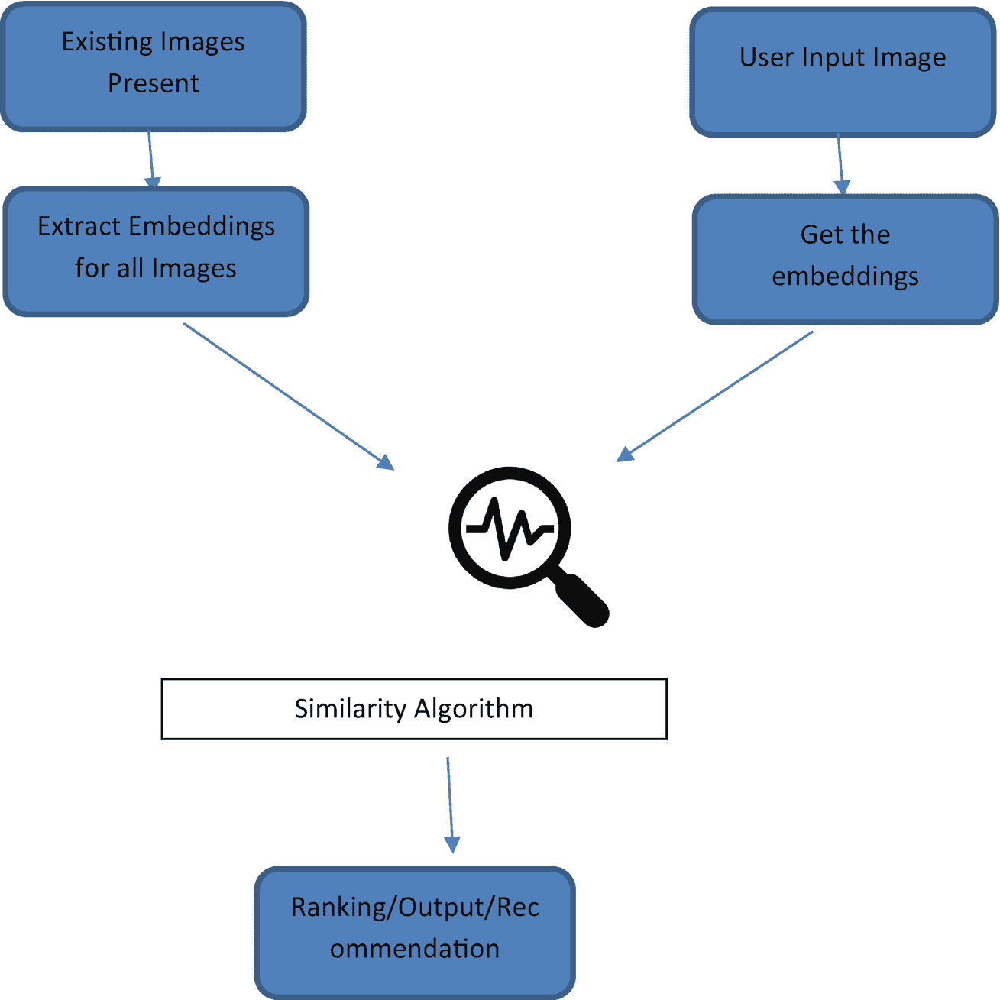

图像搜索过程示意图。用户输入一张图像，系统将获取其嵌入向量，同时数据库中已有的图像也会提取其嵌入向量。算法寻找两者之间的相似性，并给出排名、输出或推荐。

**图 5-1** 图像相似性管道流程图

我们的目标是基于输入找到相似的图像。为此，我们需要执行以下步骤，如图 5-1 所示：

1.  **导入现有图像和搜索图像。**

    第一步是将图像加载到工作环境中。我们将使用 `OpenCV` 的功能来实现。

2.  **将图像向量化。**

    加载图像后，它们处于 `JPG` 格式，Python 无法直接读取。无法基于 `JPG` 图像执行任何任务。因此，为了使图像可理解并适用于我们的算法，我们需要将它们转换为向量或嵌入。为了将图像转换为嵌入，我们使用来自 `PyTorch` 的 `ResNet`。

3.  **计算相似度分数。**

    有了图像的嵌入格式，我们可以对数据集应用余弦相似度。这将返回一个介于 0 和 1 之间的分数，用于确定两张图像的相似程度。接近 1 的值表示图像非常相似，而接近 0 的值表示图像不相似。

4.  **推荐。**

    基于余弦相似度矩阵，我们对用户提供的索引或输入图像的相似度分数进行排序，并返回前六个或前十个相似项目。

## 实现

现在我们了解了问题是什么以及如何解决它，让我们进入实现环节。

### 数据集

我们将为此用例使用一个著名的 Kaggle 数据集。以下是下载数据集的链接：[`https://www.kaggle.com/paramaggarwal/fashion-product-images-small`](https://www.kaggle.com/paramaggarwal/fashion-product-images-small)

数据集的结构如下：

*   一个名为 `images` 的文件夹，其中包含数据集中所有可用物品的图像。图像名称的格式为 `[id].jpg`，其中 `[id]` 是 CSV 文件中提供的物品 ID。

*   一个名为 `styles.csv` 的 CSV 文件，包含十列。

`styles.csv` 中的十列定义如下：

*   `id`：分配给该特定物品的唯一编号

*   `gender`：性别（不必要的偏见，应避免）

*   `masterCategory`：物品所属的主要类别

*   `subCategory`：物品所属的子类别

*   `articleType`：产品类型

*   `baseColor`：产品的基础颜色

*   `season`：适合的季节

*   `year`：物品上传的年份

*   `usage`：物品的使用场景

*   `productDisplayName`：网页上的显示名称

### 安装与导入库

我们将使用 `OpenCV` 和 `PyTorch vision` 来解决此问题。现在开始安装它们。

```
!pip install swifter
!pip install torchvision
!pip install opencv-python

# 导入 matplotlib 用于绘图
import matplotlib.pyplot as plt

# 导入 numpy 用于数值运算
import numpy as np

# 导入 pandas 用于预处理
import pandas as pd

# 导入 joblib 用于转储和加载嵌入数据框
import joblib

# 导入 cv2 用于读取图像
import cv2

# 导入 cosine_similarity 用于查找图像间的相似度
from sklearn.metrics.pairwise import cosine_similarity

# 从 pandas 导入 flatten 用于展平二维数组
from pandas.core.common import flatten

# 导入以下库用于模型构建
#import torch
import torch
import torch.nn as nn

# 导入 cv 模型
import torchvision.models as models
import torchvision.transforms as transforms
from torch.autograd import Variable

# 导入图像处理库
from PIL import Image
import warnings
warnings.filterwarnings("ignore")
```

### 导入与理解数据

现在我们将导入数据并尝试理解其含义。我们需要导入两项内容。

*   图像的元数据
*   图像本身

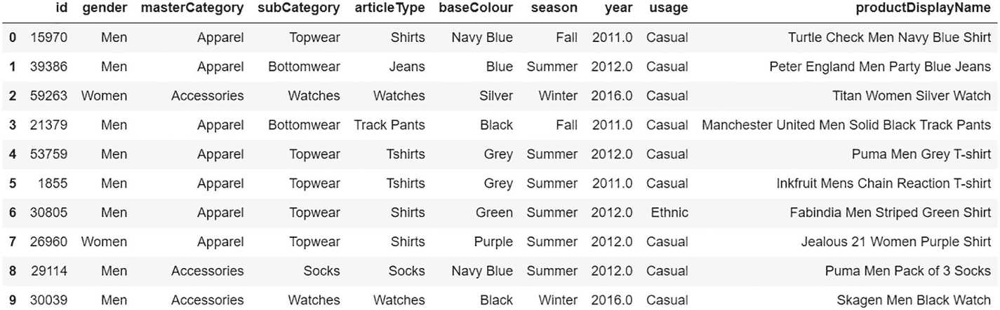

一个包含 11 列和 10 行的表格。表格列出了标识号、性别、主类别、子类别、商品类型、底色、季节、年份、用途和产品展示名称。行标题从 0 到 9。

图 5-2

输入数据快照

```

# 导入元数据
df = pd.read_csv('../fashion-product-images-small/styles.csv',error_bad_lines=False,warn_bad_lines=False)

# 显示前 10 行
df.head(10)
```

如图 5-2 所示，第一列是图像的 ID。这是元数据，其中保存了图像 ID 以及关于图像的任何信息。

让我们查看不同的 `articleType`（商品类型）及其出现频率。

```

# 设置样式
plt.style.use('ggplot')

# 理解数据：统计有多少种不同的 articleType 并了解其频率
plt.figure(figsize=(7,28))
df.articleType.value_counts().sort_values().plot(kind='barh')
```

图 5-3 显示了输出结果。`tshirts`（T 恤）和 `shirts`（衬衫）类别的数量最多。

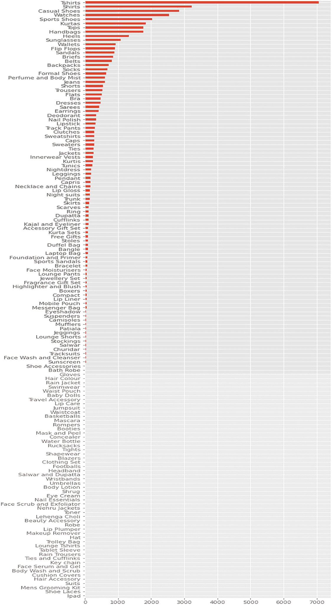

一个水平条形图展示了不同类型商品的图像搜索频率结果。T 恤以巨大优势位居榜首，衬衫紧随其后。根据现有数据，眼影、洗面奶和洁面乳等商品的频率最低。

图 5-3

类别分布

让我们创建一个名为 `image` 的新列，用于存储与该商品 ID 对应的图像文件名。

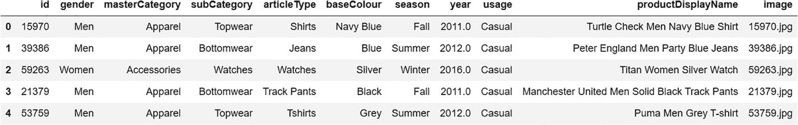

一个包含 12 列和 5 行的表格。列标题为：标识号、性别、主类别、子类别、商品类型、底色、季节、年份、用途、产品展示名称和图像。行标题从 0 到 4。

图 5-4

数据快照

```

# 创建列以存储图像位置 ID
df['image'] = df.apply(lambda row: str(row['id']) + ".jpgs, axis=1)

# 重置索引
df = df.reset_index(drop=True)
df.head()
```

如图 5-4 所示，数据集中增加了一个额外的列（`image`），其中存储了图像的名称。我们将在代码的下一部分创建一个函数，该函数将帮助我们轻松获取每张图像的路径。

```

# 图像路径
def image_location(img):
return '../input/fashion-product-images-small/images/'  + img

# 加载图像的函数
def import_img(image):
image = cv2.imread(image_location(image))
return image
```

这些函数将帮助我们使用 `cv2` 加载图像。我们再创建一个函数，用于根据给定的行和列名称显示图像。

```
def show_images(images, rows = 1, cols=1,figsize=(12, 12)):

# 定义图形
fig, axes = plt.subplots(ncols=cols, nrows=rows,figsize=figsize)

# 循环处理图像
for index,name in enumerate(images):
axes.ravel()[index].imshow(cv2.cvtColor(images[name], cv2.COLOR_BGR2RGB))
axes.ravel()[index].set_title(name)
axes.ravel()[index].set_axis_off()

# 绘图
plt.tight_layout()

# 生成 {索引, 图像} 字典
figures = {'im'+str(i): import_img(row.image) for i, row in df.sample(6).iterrows()}

# 在图形中绘制图像，设置 2 行 3 列
show_images(figures, 2, 3)
```

图 5-5 显示了 `row = 2` 和 `column = 3` 时的图像。

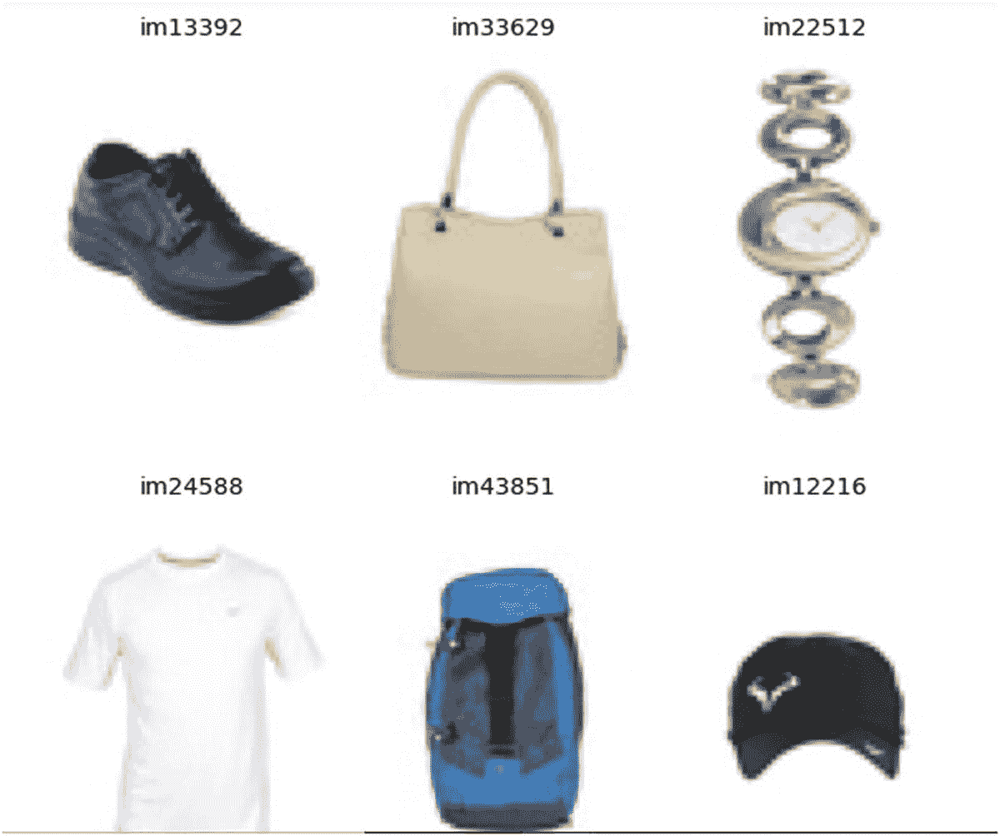

一组带有标签的日常用品图像。展示了一只标有 im 13392 的鞋子、一个标有 im 33629 的手提包、一块标有 im 22512 的手表、一件标有 im 24588 的 T 恤、一个标有 im 43851 的登山包和一顶标有 im 12216 的帽子。

图 5-5

图像输出

### 特征工程

绘制图像是为了更好地理解，但正如我们多次讨论过的，我们需要使用像素将图像转换为数字。图像需要转换为嵌入向量。我们可以训练自己的嵌入向量，也可以使用预训练的图像模型以获得更好的性能。在本例中，我们使用 `ResNet18` PyTorch 模型将图像转换为特征向量。

首先，让我们花些时间来理解 `ResNet` 的作用。

### ResNet18

`ResNet18` 是一种卷积神经网络（CNN）。顾名思义，它包含 18 个层。该网络在从 `ImageNet` 数据集中提取的数百万张图像上进行了训练，能够对超过 1000 种物体类型进行分类。图 5-6 展示了 `ResNet18` 论文中的原始架构。

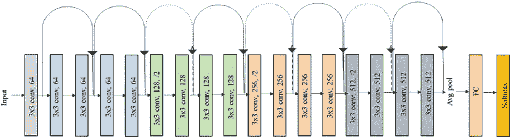

`ResNet18` 原始架构示意图。输入到达 `3x3 conv 64` 层，可以继续进入另一个 `3x3 conv 64` 层，或者跳跃到更远的层。此过程重复进行，直到到达 `3x3 conv 512` 层，之后是平均池化层。数据随后进入 `FC` 层，最后到达 `Softmax` 层。

**图 5-6**  
`ResNet18` 的原始架构

让我们从实现开始。

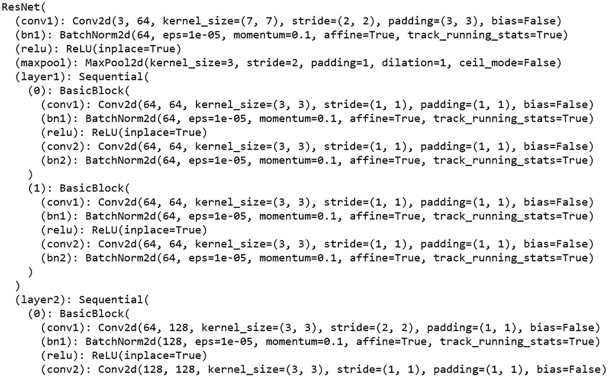

一张表示模型架构中卷积块的代码行图像。代码从 `ResNet` 开始，然后是 `conv1`、`bn1`、`relu`、`maxpool`、`Sequential layer 1` 及其子层 `0` 和 `1 Basic Blocks`，以及 `Sequential layer 2` 及其子层 `0 Basic Block`。

**图 5-7**  
卷积块

```

# Defining the input shape
width = 224
height = 224

# Loading the pretrained model
resnetmodel = models.resnet18(pretrained=True)

# selecting the layer
layer = resnetmodel._modules.get('avgpool')

# evaluation
resnetmodel.eval()
```

图 5-7 展示了模型的架构。现在，让我们提取图像的嵌入向量并将其保存到一个对象中。

```

# scaling the data
s_data = transforms.Scale((224, 224))

# normalizing
standardize = transforms.standardize(mean=[0.7, 0.6, 0.3],
                                     std=[0.2, 0.3, 0.1])

# converting to tensor
convert_tensor = transforms.ToTensor()

# creating the missing image object
missing_img = []

# function to get embeddings
def vector_extraction(resnetmodel, image_id):
    # exception handling to ignore missing images
    try:
        img = Image.open(image_location(image_id)).convert('RGB')
        t_img = Variable(standardize(convert_tensor(s_data(img))).unsqueeze(0))
        embeddings = torch.zeros(512)
        def select_d(m, i, o):
            embeddings.copy_(o.data.reshape(o.data.size(1)))
        hlayer = layer.register_forward_hlayer(select_d)
        resnetmodel(t_img)
        hlayer.remove()
        emb = embeddings
        return embeddings
    # If file not found
    except FileNotFoundError:
        # Store the index of such entries in missing_img list and drop them later
        missed_img = df[df['image'] == image_id].index
        print(missed_img)
        missing_img.append(missed_img)
```

此函数将加载图像，将其重塑为 `224*224`，并转换为数组，随后该数组将经过 `ResNet` 模型。这将返回一个包含 512 个值的数组，即该特定图像的 512 个特征向量。

让我们将此函数应用于一个示例图像并查看输出。

```

# Testing if our vector_extraction function works well on sample image
sample_embedding_0 = vector_extraction(resnetmodel, df.iloc[0].image)

# Plotting the sample image and its embeddings
img_array = import_img(df.iloc[0].image)
plt.imshow(cv2.cvtColor(img_array, cv2.COLOR_BGR2RGB))
print(img_array.shape)
print(sample_embedding_0)
```

图 5-8 和 5-9 展示了数据集中随机样本的示例图像及其向量。

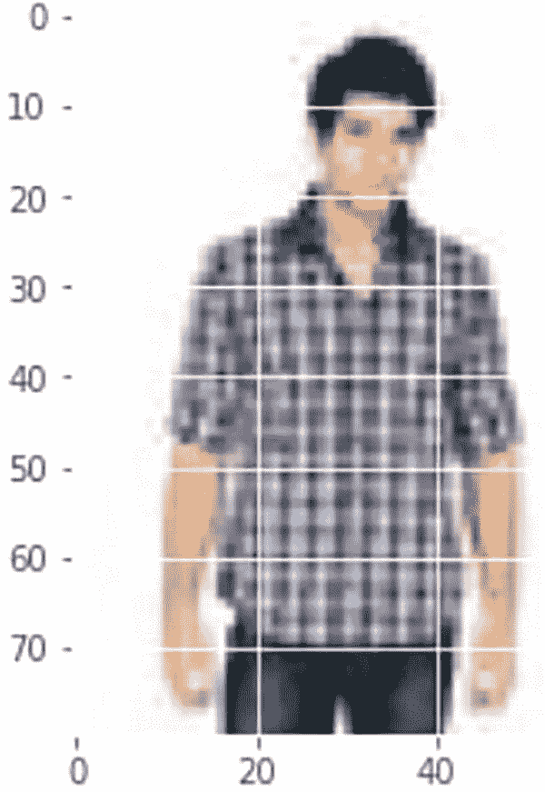

一张用于向量提取的编号网格，覆盖在一张穿着格子衬衫的男士照片上。

**图 5-9**  
示例图像

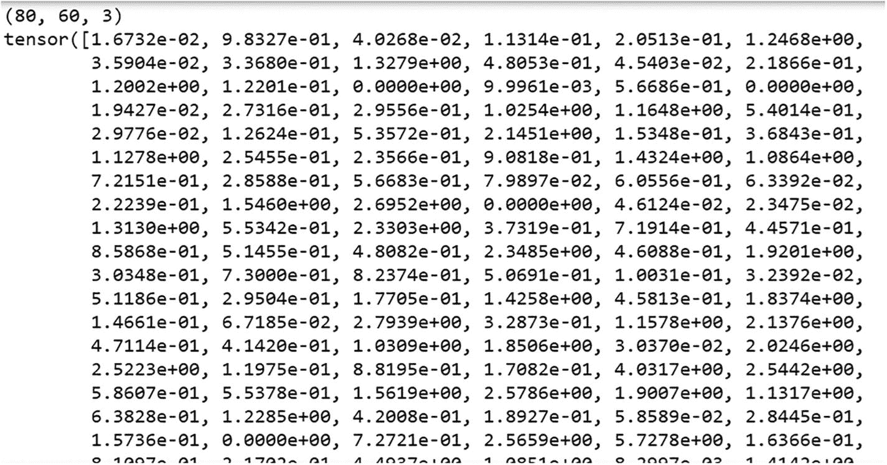

从所用示例图像中提取的输出张量图像。图像上显示了 108 个可观察到的特征向量，上方括号内标有数字 80、60 和 3。

**图 5-8**  
从图像中提取的输出张量

```

# Testing if our vector_extraction function works well on sample image
sample_embedding_1 = vector_extraction(resnetmodel, df.iloc[1000].image)

# Plotting the sample image and its embeddings
img_array = import_img(df.iloc[1000].image)
plt.imshow(cv2.cvtColor(img_array, cv2.COLOR_BGR2RGB))
print(img_array.shape)
print(sample_embedding_1)
```

图 5-10 展示了数据集中另一个随机样本的示例图像及其向量。当我们打印 `emb0` 和 `emb1` 时，会得到包含 512 个值的数组。这些就是特征向量。我们可以看到图像也与这些向量相对应。

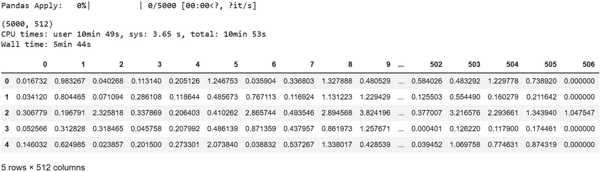

一个包含 17 列和 5 行的表格。列标题为 0、1、2、3、4、5、6、7、8、9、省略号、502、503、504、505、506。行标题为 0 到 4。用户态 CPU 时间为 10 分 49 秒，系统态为 3.65 秒，总计 10 分 53 秒。挂钟时间为 5 分 44 秒。

**图 5-11**  
嵌入快照

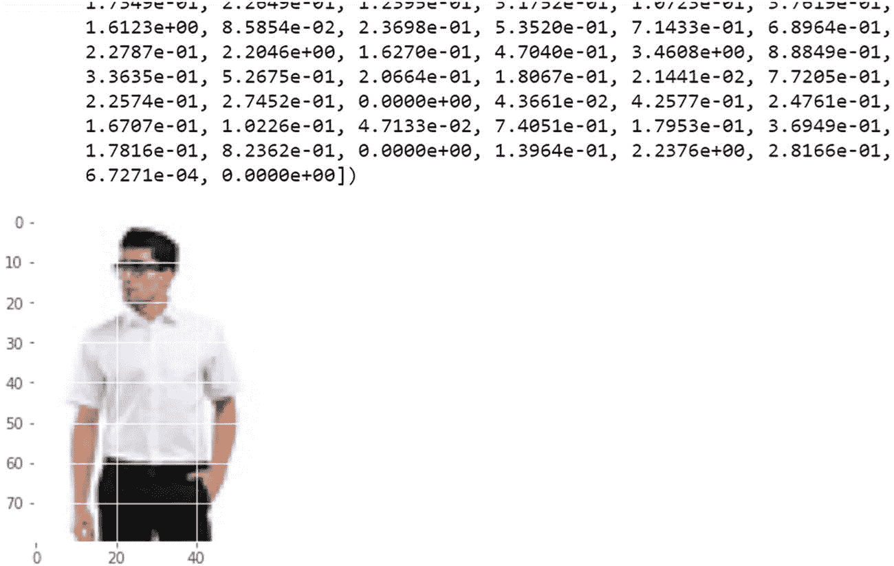

一张输出张量图像和编号网格，覆盖在一张穿着素色衬衫、戴着太阳镜的男士图像上。显示了 44 个可观察到的特征向量。

**图 5-10**  
输出张量

现在，让我们获取这些嵌入向量，并使用余弦相似度计算它们之间的距离。这将帮助我们根据数值确定项目的相似程度。

```

# Finding the similarity between those two images
cos_sim = cosine_similarity(sample_embedding_0.unsqueeze(0),
                            sample_embedding_1.unsqueeze(0))
print('\nCosine similarity: {0}\n'.format(cos_sim))

# output
Cosine similarity: [[0.8811257]]
```

这两张图像之间的相似度为 0.88，这意味着它们几乎相同。观察图像，两件衬衫尺寸相同。这就是相似度高的原因。

我们仅为两张图像提取了嵌入向量。现在，让我们编写一个循环，为数据集中所有图像提取向量。

```
%%time
import swifter

# Applying embeddings on subset of this huge dataset
df_embeddings = df[:5000]  # We can apply on entire df, like: df_embeddings = df

# looping through images to get embeddings
map_embeddings = df_embeddings['image'].swifter.apply(lambda img: vector_extraction(resnetmodel, img))

# convert to series
df_embs = map_embeddings.apply(pd.Series)
print(df_embs.shape)
df_embs.head()
```

我们获得了前 5000 张图像的特征向量。获取这些特征向量花费了很长时间。为了节省时间，我们将把这些嵌入向量保存到本地系统中，以便将来使用时导入。

有多种保存方式：

*   使用 pandas 的 `df.to_csv()` 函数
*   使用 joblib 的 `joblib.dump()` 函数

```

# export the embeddings
df_embs.to_csv('df_embs.csv')

# importing the embeddings
df_embs = pd.read_csv('df_embs.csv')
df_embs.drop(['Unnamed: 0', 'index'], axis=1, inplace=True)
df_embs.dropna(inplace=True)

# exporting as pkl
joblib.dump(df_embs, 'df_embs.pkl', 9)

# importing the pkl
df_embs = joblib.load('df_embs.pkl')
```

### 计算相似度与排序

现在我们已经为每张图像生成了向量，接下来可以计算它们之间的相似度分数，然后进行排序以获取推荐结果。

两个向量之间的余弦相似度计算公式如图 5-12 所示。

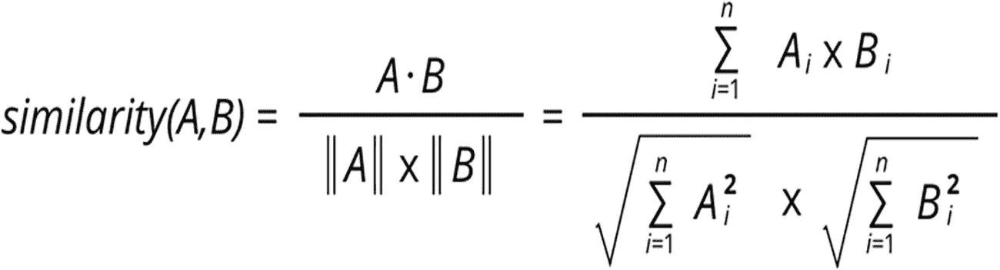

`余弦相似度 = (A · B) / (||A|| * ||B||) = (Σ(A_i * B_i)) / (√(Σ(A_i²)) * √(Σ(B_i²)))`

**图 5-12** 余弦相似度计算公式

```

# 计算图像之间的相似度（使用嵌入值）
cosine_sim = cosine_similarity(df_embs)

# 预览前 4 行和前 4 列的相似度，以检查 cosine_sim 的结构
cosine_sim[:4, :4]
#输出
array([[1.0000007 , 0.76683545, 0.5455518 , 0.779508  ],
[0.76683545, 1.0000002 , 0.49617064, 0.88492715],
[0.5455518 , 0.49617064, 0.9999991 , 0.52310663],
[0.779508  , 0.88492715, 0.52310663, 1.000001  ]], dtype=float32)
```

现在我们有了相似度矩阵，接下来定义一个基于余弦相似度分数给出推荐结果的函数。我们需要将以下三项内容作为函数的输入参数，以获取所需的推荐结果：

*   图像 ID
*   元数据集名称
*   所需推荐数量

```

# 将索引值存储在一个序列 index_vales 中，用于推荐
index_vales = pd.Series(range(len(df)), index=df.index)
index_vales

# 定义一个基于余弦相似度分数给出推荐结果的函数
def recommend_images(ImId, df, top_n = 6):

# 将参考图像的索引赋值给 sim_ImId
sim_ImId    = index_vales[ImId]

# 将所有其他图像与用户请求图像的余弦相似度存储为列表 sml_scr
sml_scr = list(enumerate(cosine_sim[sim_ImId]))

# 对 sml_scr 列表进行排序
sml_scr = sorted(sml_scr, key=lambda x: x[1], reverse=True)

# 从 sml_scr 中提取前 n 个值
sml_scr = sml_scr[1:top_n+1]

# ImId_rec 将返回相似图像的索引
ImId_rec    = [i[0] for i in sml_scr]

# ImId_sim 将返回相似度分数的值
ImId_sim    = [i[1] for i in sml_scr]
return index_vales.iloc[ImId_rec].index, ImId_sim
```

我们创建了一个函数，该函数接受三个参数：要查找相似图像的图像索引、数据框以及一个整数，该整数决定了要推荐的图像数量。

当我们向此函数传递这三个参数时，它会返回前 *n* 个相似图像的索引及其相似度分数。

```

# 示例如下
recommend_images(3810, df, top_n = 5)
#输出
(Int64Index([2400, 3899, 3678, 4818, 2354], dtype='int64'),
[0.9632292, 0.9571406, 0.95574236, 0.9539639, 0.95376974])
```

仅返回索引值和相似度分数是不够的；因此，我们还需要通过绘制推荐索引中的图像来可视化推荐结果。

### 可视化推荐结果

我们来到了整章中最有趣的部分——结果展示。让我们创建一个函数来可视化这些推荐结果，然后对其进行评估。

```
def Rec_viz_image(input_imageid):

# 获取推荐结果
idx_rec, idx_sim = recommend_images(input_imageid, df, top_n = 6)

# 打印相似度分数
print (idx_sim)

# 绘制用户请求的图像
plt.imshow(cv2.cvtColor(import_img(df.iloc[input_imageid].image), cv2.COLOR_BGR2RGB))

# 生成一个 { 索引, 图像 } 的字典
figures = {'im'+str(i): import_img(row.image) for i, row in df.loc[idx_rec].iterrows()}

# 在图形中绘制相似图像，布局为 2 行 3 列
show_images(figures, 2, 3)
```

可视化函数将调用 `recommend_images` 函数，并存储返回的索引和分数。利用这些索引，将使用 `plot_figures` 函数绘制存储的图像。

让我们看一些示例。第一张图像是索引为 3810 的图像，后面是前六个相似项。

```
Rec_viz_image(3810)
[0.9632292, 0.9571406, 0.95574236, 0.9539639, 0.95376974, 0.9536929]
```

图 5-13 展示了输入图像。

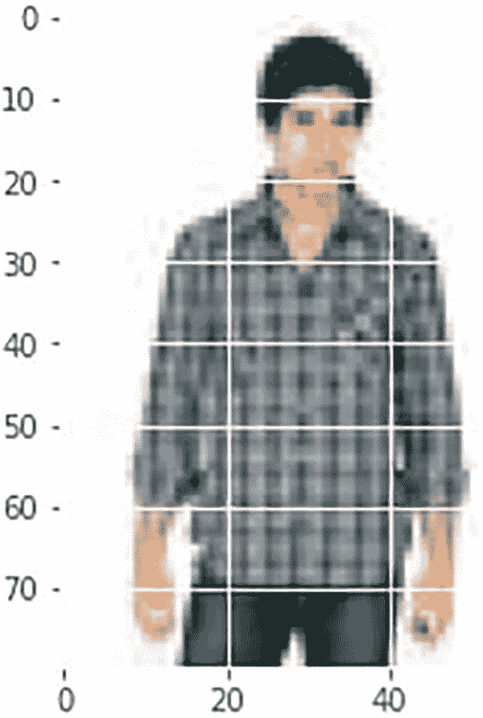

一张穿着格子衬衫的男士照片上覆盖着用于向量提取的编号网格。

**图 5-13** 输入图像

图 5-14 展示了针对输入图像的推荐结果。正如我们所见，输入图像是一件衬衫，我们得到的推荐结果也是衬衫。它们都具有相同的图案，但颜色不同。这些结果非常出色且符合实际。

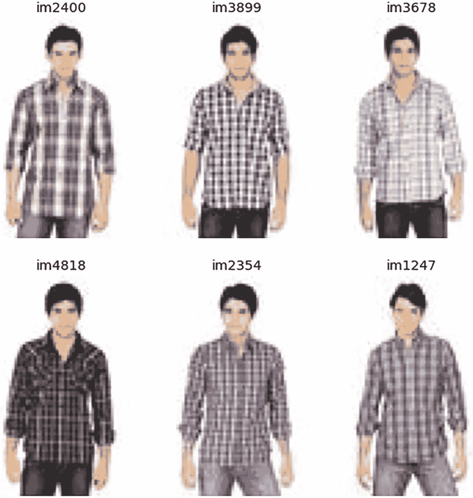

一组来自搜索结果的穿着不同格子衬衫的男士图像。显示的标签为 `im2400`、`im3899`、`im3678`、`im4818`、`im2354` 和 `im1247`。

**图 5-14** 输出图像

对于下一个示例，我们选择了一条领带。图 5-15 展示了我们函数的输出结果，其中显示了六张领带图像，相似度分数均超过 90%。

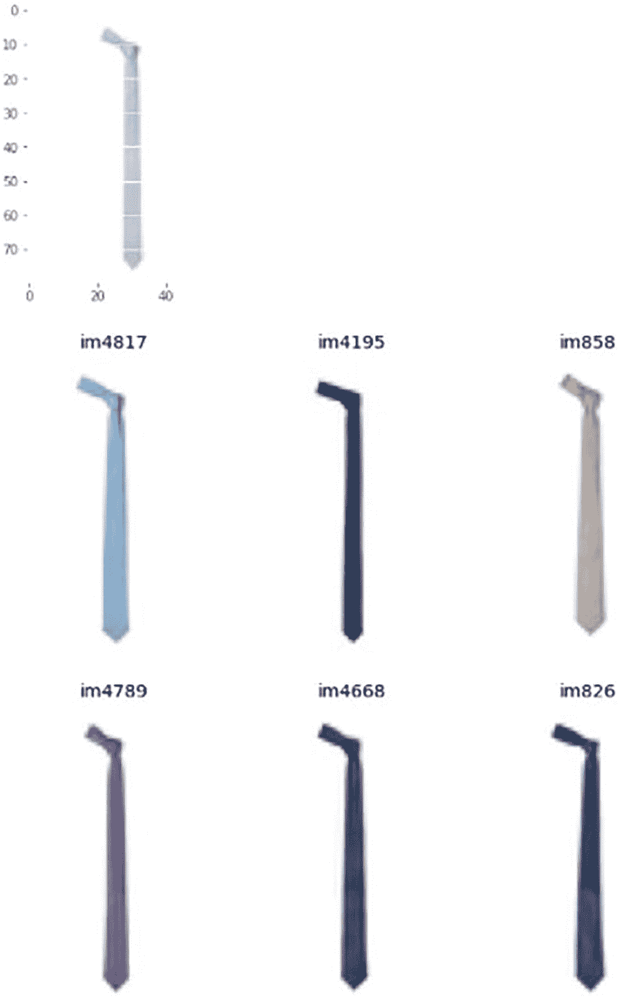

一组用于领带图像搜索测试的照片。一张带有编号网格的领带图像，下方是六种领带变体，标签分别为 `im4817`、`im4195`、`im858`、`im4789`、`im4668` 和 `im826`。

**图 5-15** 样本输出图像

```
Rec_viz_image(2518)
[0.9506557, 0.931319, 0.928721, 0.9247011, 0.9215533, 0.917436]
```

到目前为止，我们测试的都是数据集中已有的图像。接下来，我们将接收用户输入的图像，并尝试找到与其图像相似的项目。

### 从用户处获取图像输入并推荐相似产品

在此功能中，我们将从用户提供的路径加载图像，并使用`ResNet50`模型获取其特征向量。接着，我们将计算用户图像与数据集中其余特征向量之间的余弦相似度。

随后，我们将对余弦相似度分数进行排序，并选出最高的十个。我们将提取相似度分数以及前十张图像的索引。相似度分数将被打印出来，以便用户查看项目，而索引则用于绘制图像。此处，我们推荐前十项，因此图像以两行五列的形式排列。

让我们构建这个函数。

```
def recm_user_input(image_id):

# 加载图像并调整其大小
img = Image.open('../input/testset-for-image-similarity/' + image_id).convert('RGB')
t_img = Variable(standardize(convert_tensor(s_data(img))).unsqueeze(0))
embeddings = torch.zeros(512)
def select_d(m, i, o):
embeddings.copy_(o.data.reshape(o.data.size(1)))
hlayer = layer.register_forward_hlayer(select_d)
resnetmodel(t_img)
hlayer.remove()
emb = embeddings

# 计算余弦相似度
cs = cosine_similarity(emb.unsqueeze(0),df_embs)
cs_list = list(flatten(cs))
cs_df = pd.DataFrame(cs_list,columns=['Score'])
cs_df = cs_df.sort_values(by=['Score'],ascending=False)

# 打印余弦相似度
print(cs_df['Score'][:10])

# 提取前 10 个相似项目/图像的索引
top10 = cs_df[:10].index
top10 = list(flatten(top10))
images_list = []
for i in top10:
image_id = df[df.index==i]['image']
images_list.append(image_id)
images_list = list(flatten(images_list))

# 绘制用户请求项目的图像
img_print = Image.open('../input/testset-for-image-similarity/' + image_id)
plt.imshow(img_print)

# 生成一个字典 { 索引, 图像 }
figures = {'im'+str(i): Image.open('../input/fashion-product-images-small/images/' + i) for i in images_list}

# 在图形中绘制相似图像，2 行 5 列
fig, axes = plt.subplots(2, 5, figsize = (8,8) )
for index,name in enumerate(figures):
axes.ravel()[index].imshow(figures[name])
axes.ravel()[index].set_title(name)
axes.ravel()[index].set_axis_off()
plt.tight_layout()
```

让我们从谷歌下载一张图像并将其作为输入。

```
recm_user_input('test5.jpg')
4036    0.824246
954     0.810449
3268    0.808926
4528    0.808186
3299    0.807687
295     0.806027
1978    0.805003
2900    0.803676
3688    0.800311
1229    0.800130
Name: Score, dtype: float64
```

在图 5-16 的顶部是一张手表的示例图像，该图像从谷歌下载，不属于数据集的一部分。接着，我们将这块手表作为输入图像，推荐结果均为手表。此外，我们可以凭人类感官判断，其中有六七款手表与示例手表一样更具女性化风格。同时，相似度分数接近 70%。因此，输出结果看起来不错。

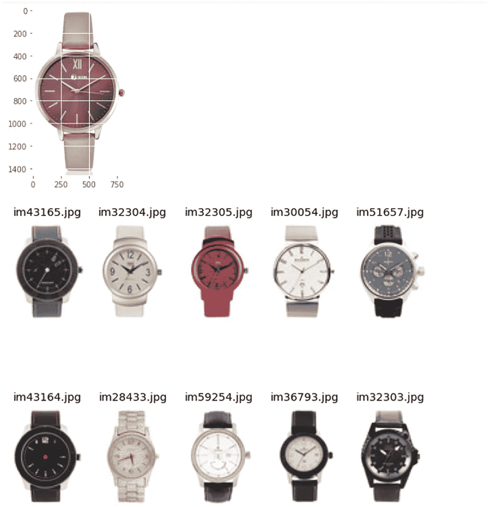

一组用于手表图像搜索测试的照片。一张正面女性手表的图像展示在十款被认为偏男性或女性风格的手表混合图之上。这些手表的标签（jpg 格式）分别为`im 43165`、`im 32304`、`im 32305`、`im 30054`、`im 51657`、`im 43164`、`im 28433`、`im59254`、`im36793`和`im32303`。

图 5-16

示例输出图像

让我们再试一张图像，这次是一双鞋。图 5-17 显示了结果。

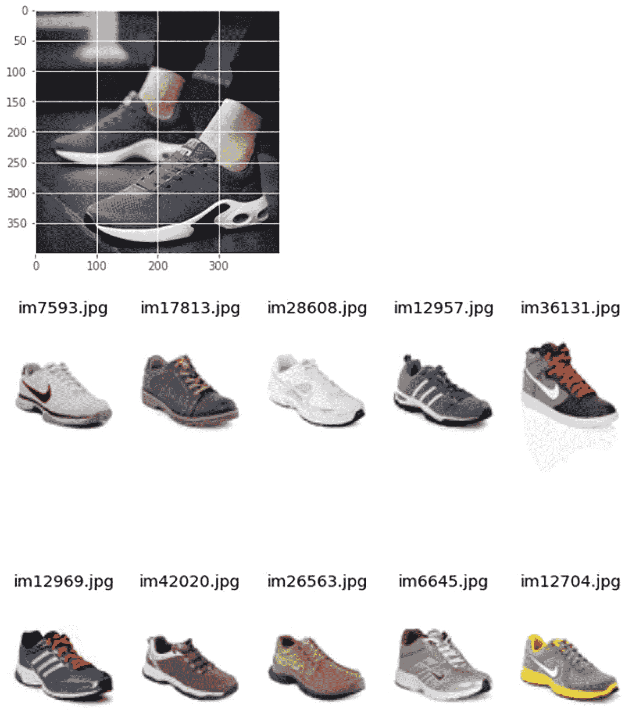

一组用于鞋子图像搜索测试的照片。一张坐着的人所穿鞋子的特写镜头展示在从正装鞋到跑鞋的不同类型鞋子之上。这十双鞋的标签（jpg 格式）分别为`im7593`、`im 17813`、`im28608`、`im 12957`、`im 36131`、`im 12969`、`im 42020`、`im 26563`、`im 6645`和`im 12704`。

图 5-17

模型对鞋子的推荐结果

```
Recm_user_input(‘test14.jpg’)
```

## 总结

我们将预训练的`ResNet18`模型应用于我们的数据集，以进行推荐和图像搜索。结果看起来相当不错。

我们尝试基于以下内容推荐项目：

*   数据集中已有的图像
*   用户提供的自定义图像

进一步的改进空间：

*   基于`styles.csv`数据集中的`articleType`、`masterCategory`和`subCategory`特征推荐项目。
*   尝试其他各种预训练模型，如`ResNet`，并观察准确率是否提升。
*   鉴于我们有标记数据，始终可以采用监督训练或迁移学习的方法。

在下一章中，我们将把图像特征检测的概念应用于*姿态检测*领域。

