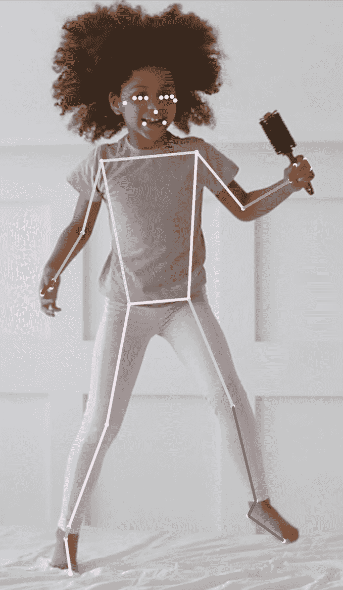
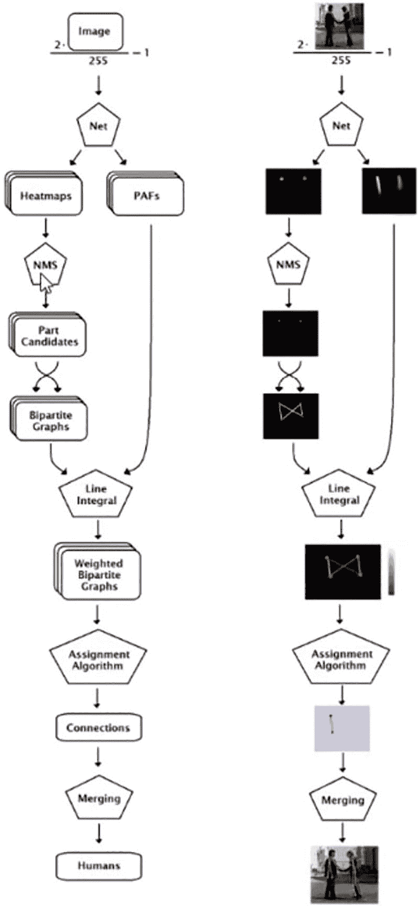
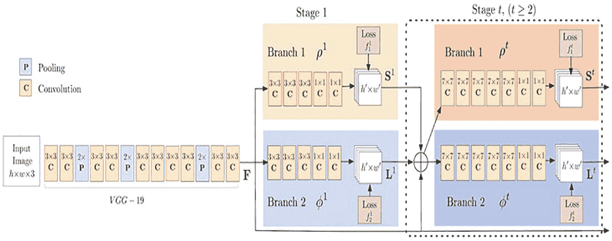
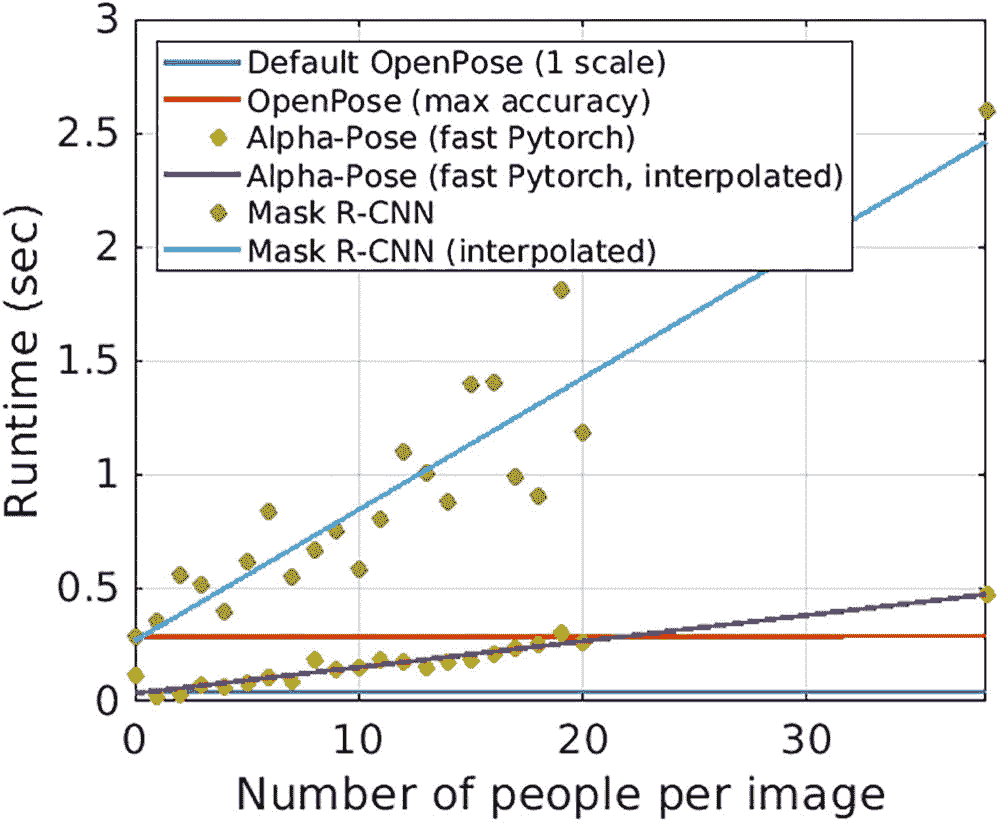
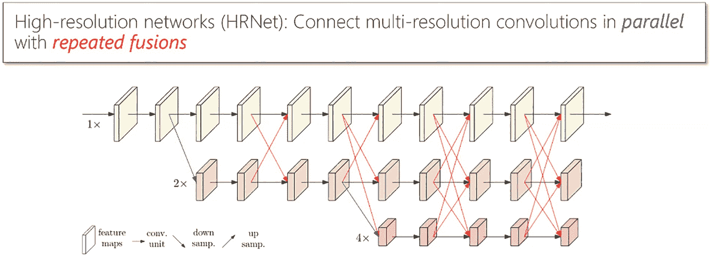
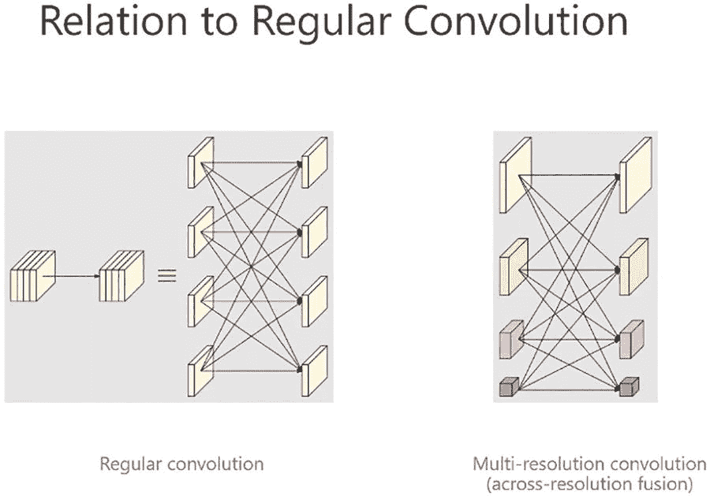
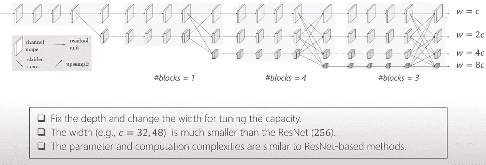
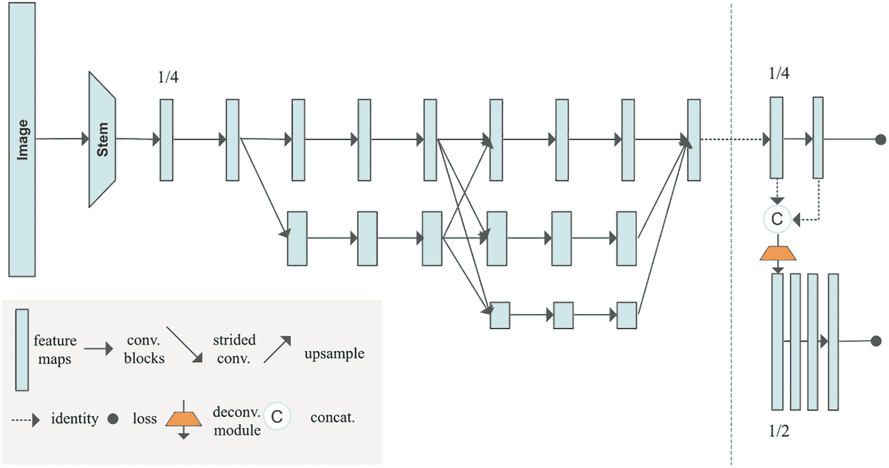

# 6. 姿态估计

人体姿态估计（HPE）是一项计算机视觉任务，通过估计给定帧/视频中的主要关键点（如眼睛、耳朵、手和腿）来检测人体姿态。图 6-1 展示了一个实际的人体姿态估计示例。



一位非裔美国女孩左手拿着一把发刷站立。一个计算机生成的轮廓勾勒出她的手、腿、躯干、眼睛、鼻子和嘴巴。

图 6-1

HPE 示例

人体姿态检测有助于追踪人体部位和关节。人体中需要识别的一些关键点包括手臂、腿、眼睛、耳朵、鼻子等，这可以帮助我们追踪运动。

HPE 广泛应用于机器人技术、理解人类活动和行为、体育分析等领域。

深度学习概念，特别是 CNN 架构，是为 HPE 量身定制和设计的。

解决此问题有两种方法：

*   自上而下方法

*   自下而上方法

## 自上而下方法

使用此方法，首先通过为每个人绘制一个估计的边界框来识别人类。第二步，在每个边界框内为该特定人物识别人体关键点。此方法的缺点是我们需要一个单独的模型来进行人体识别，然后必须在所有边界框内识别关键点。这增加了计算时间和复杂度。此模型的优点是网络将识别帧中的所有人类。

## 自下而上方法

使用此方法，首先在给定帧中识别所有人体关键点。在第二阶段，将这些关键点连接起来形成类似人体的骨架。此方法的缺点是，由于图像中的尺度变化，它可能无法识别较小尺度的人类。此方法的优点是相比自上而下方法，计算时间减少。

以下是目前更常用的 HPE 模型：

*   `OpenPose`：2019 年

*   `HRNet`：2019 年

*   `Higher HRNet`：2020 年

*   `AlphaPose`：2018 年

*   `Mask R-CNN`：2018 年

*   `Dense pose`：2018 年

*   `DeepCut`：2016 年

*   `DeepPose`：2014 年

*   `Pose Net`：2015 年

## OpenPose

`OpenPose`是一种实时的、多人、多阶段的姿态估计算法，以`VGG19`作为其骨干网络。该算法遵循自下而上的方法。输入图像被送入`VGG-19`网络以提取特征图。提取的特征图被传递到多阶段 CNN。每个阶段包含两个并行运行的分支。

### 分支-1

该分支为要检测的关键点创建热图/置信图。为所有关键点生成单独的热图。

### 分支-2

该分支生成部位亲和场（PAFs）。PAFs 能够识别关键点之间的连接关系。

来自两个分支的输出通过线积分进行映射，以识别正确的连接。在预测结果（热力图、PAF）与真实值（热力图、PAF）之间计算 `L2` 损失。使用了两个 `L2` 损失函数——每个分支的末端各有一个。在训练过程中，总损失计算为这两个损失函数之和。

阶段 1 的输出被传递到阶段 2，以改进结果。通过增加阶段数量，模型的深度也随之增加。由于图像中可能存在多个人，因此使用加权二分图来连接同一个人的各个部位。连接后的配对会被合并，形成人体骨架。该模型可以在单张图像上检测多达 135 个关键点。图 6-2 和图 6-3 展示了 OpenPose 的架构和流程图。



OpenPose 的两个流程图。步骤如下：图像、网络、热力图和 PAFs。热力图的步骤如下：非极大值抑制（NMS）、部位候选、二分图、线积分、加权二分图、分配算法、连接、合并以及人体。PAFs 指向线积分。图表 2 用图像替换了图表 1 中的部分步骤。

图 6-3 OpenPose 流程图



池化和卷积阶段的示意图。从左到右：一个输入图像框，VGG-19（由 13 个框组成的系列）；顶部的阶段 1 是一个名为分支 1 的框，它有 5 个小框连接到一个标记为 `h` 乘以 `w` 的框，其下方是一个名为分支 2 的框，它有 5 个小框连接到一个标记为 `h` 乘以 `w` 的框。

图 6-2 OpenPose 架构

图 6-4 展示了 OpenPose 与其他模型运行时的对比。默认 OpenPose 和最大精度 OpenPose 承诺提供更好的性能。



一张图表描绘了：默认 OpenPose 的运行时（秒）在 0 处，OpenPose 线从 0.25 到 0.24，AlphaPose 线从 0 到 0.5，Mask RCNN 线从 0.25 到 2.5。AlphaPose 的点位于 Mask RCNN 线 0.25 到 1.5 的运行时区域内，Mask RCNN 的点位于 AlphaPose 线 0 到 0.25 的区域内。数值为近似值。

图 6-4 OpenPose 流程及与其他模型的运行时对比

## HRNet（高分辨率网络）

这是一种自顶向下的方法。它首先使用 Faster-RCNN 识别图像中的人体，并在其周围设置边界框。然后利用 HRNet 架构生成高质量的特征图。最后在每个边界框内识别关键点。

**动机：**

1.  以往所有模型（AlexNet、GoogleNet、ResNet 和 DenseNet）都是基于图像分类卷积架构开发的，导致输出分辨率低且对位置不敏感。在这些架构中，可以通过使用空洞卷积来提高低分辨率，但这会增加计算时间。

2.  上采样是解决此问题的另一种方法。U-Net、SegNet、DeConvNet 和 Hourglass 模型都使用了上采样技术。在该技术中，阶段 1 的输入图像被转换为低分辨率以进行分类。在阶段 2，通过顺序连接的卷积从低分辨率恢复高分辨率图像。但是，从低分辨率完全恢复高分辨率是不可能的，并且表示的位置敏感性较弱。

HRNet 是一种用于视觉识别的通用架构。其架构不基于任何使用串联卷积的分类网络。在 HRNet 架构中，多个分辨率的卷积通过使用上采样和下采样技术进行重复融合，以并行方式连接。该网络从头到尾都保持高分辨率表示。各分辨率之间的重复融合增强了高分辨率和低分辨率表示。高分辨率卷积通过一种称为“步长卷积”的下采样技术转换为低分辨率卷积。低分辨率卷积通过“双线性上采样”技术转换为高分辨率卷积。高分辨率分支保留空间信息，低分辨率分支保留上下文信息。图 6-5、6-6 和 6-7 展示了 HRNet 的详细架构。



一个包含三行的示意图。从上到下，从左到右：第一行有一个标记为 `1x` 的箭头，旁边是由右箭头连接的 11 个直立块。第二行以 `2x` 开始，其后是由箭头连接的 9 个直立块。第三行以 `4x` 开始，其后是由右箭头连接的 5 个直立块。

图 6-5 HRNet 架构，第一部分

**主要观察：**

*   在分类中，卷积是串联放置的。但在 HRNet 中，卷积是并行放置的。

*   对于上采样，使用双线性函数而不是卷积（由于时间复杂性）。

*   使用步长卷积对高分辨率图像进行下采样（以避免信息丢失）。

阶段 2、3 和 4 中的块数分别为 1、4 和 3。这些数字（根据作者的说法）并未得到充分优化。由于 HRNet 中通道数减少，其参数和计算复杂度并不高于 ResNet。由于该架构是一个多分辨率网络，输出在所有分辨率（高、中、低）下都会产生。对于人体姿态估计（HPE），仅使用高分辨率通道的输出。对于语义分割和人脸对齐，则使用所有分辨率的输出。



两个并排的示意图，分别标记为常规卷积和多分辨率卷积。从左到右：图 1 有 2 组由右箭头连接的 4 个连接块，一个三杠等号，以及一个由箭头互连的两列四行块系列；图 2 有一个带箭头的两列四行块系列。

图 6-7 HRNet 架构，第三部分



一个分为 4 段的示意图，从左到右依次为：段 1，一行 5 个块；段 2，两行，每行 5 个块；段 3，三行，每行 5 个块，以及第四行 1 个块；段 4，四行，每行 5 个块。块之间由箭头连接。这些块代表通道图，箭头代表残差单元。

图 6-6 HRNet 架构，第二部分

# Higher HRNet

这是一种自底向上的方法，与原始的 HRNet 模型不同。以往自底向上方法的主要问题在于处理尺度变化（例如儿童或远处的人）。Higher HRNet 模型通过使用 HR 特征图（来自 HRNet）和 HR 热力图（使用反卷积步骤）解决了这个问题。

该网络以 HRNet 架构作为主干网络构建。输入图像首先传递到一个主干模块（包含两个卷积块，将分辨率降至 1/4）。随后，图像通过 HRNet 架构生成 HR 特征图。这些 HR 特征图被输入到反卷积块中。这些反卷积块（以 HRNet 的特征图和预测热力图为输入）将生成两个 HR 热力图，接着通过四个残差块（批归一化 + ReLU）对特征图进行上采样。该模型采用高分辨率监督技术进行训练。真实关键点被转换到所有分辨率的热力图上，以生成真实热力图。预测的热力图与真实热力图进行比对，以计算损失（均方误差）。图 6-8 展示了架构图。



一个从左到右的流程图，第一行包含：一个标记为“图像”的竖条，一个右箭头，一个标记为“主干”的梯形，9 个由箭头连接的方块，以及第二和第三个带有箭头的方块。右侧面板从上到下包含：两个连接到 C 的方块，一个橙色梯形，以及四个竖条。橙色梯形是反卷积模块。

图 6-8 Higher HRNet 架构

从理论研究来看，Higher HRNet 在解决计算时间（使用自底向上方法）和尺度变化问题（使用多分辨率）方面显示出有前景的结果。

# PoseNet

PoseNet 是一个基于 `tensorflow.js` 构建、可在移动设备上运行的姿态估计器。它通过检测人体关键点（如眼睛、鼻子、嘴巴、手腕、肘部、髋部、膝盖等）来估计人体姿态，并通过连接这些关键点形成类似骨架的姿态结构。

它适用于单人和多人姿态检测。

## PoseNet 如何工作？

PoseNet 使用 ResNet 和 MobileNet 模型进行训练。ResNet 模型精度更高，但体积大、层数多，导致速度较慢。因此，选择专为移动设备设计的 MobileNet 模型更为合适。姿态估计分两个阶段进行：

- 将输入的 RGB 图像送入卷积神经网络。

- 使用单人姿态或多人姿态算法，从模型输出中获取关键点（坐标）及其置信度分数。

PoseNet 模型的输出是一个姿态对象，其中包含每个检测到的人物的关键点列表和置信度分数。图 6-9 展示了姿态与关键点置信度的对比。


一张足球场上球员的照片，前景中，球员 1 上半身侧转，正在踢球，他身后是球员 2，正在奔跑。在照片 1 中，球员 1 的置信度为 0.8，球员 2 为 0.7。在照片 2 中，球员 1 的左肘置信度为 0.9，右肩置信度为 0.6。

图 6-9 姿态与关键点置信度对比示意图

### 单人姿态估计

这是指输入图像或视频中仅有一人位于中心的情况。单人姿态估计算法的输入如下：

- **输入图像元素：** 程序将为其预测姿态的输入图像元素。

- **图像缩放因子：** 一个介于 0.2 到 1 之间的数字。默认设置为 0.5。

- **水平翻转：** 默认设置为 false。如果姿态需要水平/垂直翻转，则需将此设置为 true。当视频默认水平翻转时，姿态会被恢复到正确的方向。

- **输出步长：** 应为 32、16 或 8。默认设置为 16。此变量影响神经网络的宽度和高度层。输出步长值越低，精度越高，但速度越慢，反之亦然。

单人姿态估计的输出是一个姿态，包含姿态置信度分数和一个包含 17 个关键点的数组。每个关键点包含一个关键点位置（x 和 y 坐标）和一个关键点置信度分数。

图 6-10、6-11 和 6-12 展示了 PoseNet 的流程图。


一个分为三部分的图表，从左到右：第 1 部分是一张双臂向两侧伸展的男人的照片，标记为“输入图像”；第 2 部分是一列三个网格，标记为 32、16 和 8，以及一列三张照片，与第一张图像相同，但叠加了圆点；第 3 部分是两个垂直的双向箭头，分别标记为“较慢”和“较高精度”。

图 6-12 PoseNet 流程图，第 3 部分


PoseNet 估计算法的流程图。左侧一张男人的图像标记为“关键点热力图”。突出显示其肘部和鼻子的图像分别标记为“左肘热力图”和“鼻子热力图”。其肘部和鼻子的放大图像分别标记为“左肘关键点的偏移向量”和“鼻子关键点的偏移向量”。

图 6-11 PoseNet 流程图，第 2 部分


单人姿态检测算法的流程图。从一张站在露台上的男人的图像开始，标记为“图像”，指向 MobileNet，再指向关键点热力图和偏移向量，两者共同指向计算机生成的、标记为“姿态估计”的线条人物图。

图 6-10 PoseNet 流程图

### 多人姿态估计

该算法可以估计图像中的多个姿态/人物。它比单人姿态算法稍复杂且稍慢。但其主要优势在于，如果图片中有多人，他们的关键点不太可能被错误关联。因此，即使需求是检测单人的姿态，该算法也可能更可取。这些算法的输入如下：

- 输入图像元素

- 图像缩放因子

- 水平翻转

- 输出步长

- 最大姿态检测数：最多可检测五个姿态

- 姿态置信度阈值

- 非极大值抑制（NMS）半径：控制返回姿态之间的最小距离。默认值为 20。

该算法的输出是一个姿态数组。每个姿态包含 17 个关键点以及每个关键点的分数。

### PoseNet 的优缺点

考虑 PoseNet 的以下优缺点：

- 由于是轻量级模型，可用于移动/边缘设备。

- 如果图片中有多于一个人，单人姿态估计算法会将关键点关联到错误的人身上。

### 姿态估计的应用

以下是姿态估计的常见应用：

- 人类活动识别

- 人体跌倒检测

- 游戏机动作追踪

- 训练机器人

### 零售店视频测试案例

**案例 1：** 使用 1080p 分辨率、帧率为 2 fps 的一小时视频测试 PoseNet 模型。结果：

- CPU 利用率：80-90%

- 内存：1.2 至 1.5GB

- FPS：15

- 一小时视频的处理时间和数据库插入时间：20 至 25 分钟

**案例 2：** 使用 720p 和 480p 分辨率、帧率为 2 fps 的一小时视频测试 PoseNet 模型。结果：

- 对于 720p，一小时视频的处理时间和数据库插入时间：8 至 10 分钟，帧率为 16 fps

- 对于 480p，一小时视频的处理时间和数据库插入时间：4 至 5 分钟，帧率为 25 fps

# 实现

在了解了部分理论方面和模型之后，现在我们进入实现环节，将使用其中一种方法和预训练模型。以下是使用 `PyTorch` 对单张图像进行人体姿态检测的分步指南。

我们将使用“基于特征金字塔网络的 ResNet-50 架构的 Keypoint-RCNN”解决方案进行人体姿态和关键点检测。为便于理解，代码被分为七个模块。步骤如下：

1.  确定要追踪的人体关键点列表。

2.  确定关键点之间可能的连接关系。

3.  从 `PyTorch` 库加载预训练模型。

4.  输入图像预处理与建模。

5.  构建自定义函数以绘制输出（关键点和骨架）。

6.  在输入图像上绘制输出结果。

首先，导入所需的库：

```python
#导入库
import os
import numpy as np
#用于导入关键点 RCNN 预训练模型和图像预处理
import torchvision
import torch
#用于读取图像
import cv2
#用于可视化
import matplotlib.pyplot as plt
#挂载谷歌云盘
#将目录更改为包含图像文件夹的相应文件夹
from google.colab import drive
drive.mount('/content/drive')
%cd '/content/drive/MyDrive/Colab Notebooks/Bodypose'
```

### 步骤 1：确定要追踪的人体关键点列表

人体关键点列表如图 6-13 所示。这些关键点是深度学习模型中的目标实体，将在步骤 3 中讨论。


一幅由线条和点组成的人体轮廓示意图，关键点从 0 到 16 编号，分别代表：躯干底部、左髋、左膝、左脚、右髋、右膝、右脚、躯干中心、躯干上部、颈根、头部中心、右肩、右肘、右手、左肩、左肘和左手。

图 6-13 – 人体关键点示意图

图 6-13 展示了人体关键点的示意图。

```python
# 人体关键点列表（共 17 个）
human_keypoints = ['nose','left_eye','right_eye','left_ear','right_ear','left_shoulder','right_shoulder','left_elbow',
'right_elbow','left_wrist','right_wrist','left_hip','right_hip','left_knee', 'right_knee', 'left_ankle','right_ankle']
print(human_keypoints)
#输出
['nose', 'left_eye', 'right_eye', 'left_ear', 'right_ear', 'left_shoulder', 'right_shoulder', 'left_elbow', 'right_elbow', 'left_wrist', 'right_wrist', 'left_hip', 'right_hip', 'left_knee', 'right_knee', 'left_ankle', 'right_ankle']
```

### 步骤 2：确定关键点之间可能的连接关系

现在确定关键点之间可能的连接关系。例如，左耳与左眼相连。所有可能的连接关系可在以下代码片段中找到。

```python
# 人体关键点之间可能的连接关系，以形成结构
def possible_keypoint_connections(keypoints):
    connections = [
        [keypoints.index('right_eye'), keypoints.index('nose')],
        [keypoints.index('right_eye'), keypoints.index('right_ear')],
        [keypoints.index('left_eye'), keypoints.index('nose')],
        [keypoints.index('left_eye'), keypoints.index('left_ear')],
        [keypoints.index('right_shoulder'), keypoints.index('right_elbow')],
        [keypoints.index('right_elbow'), keypoints.index('right_wrist')],
        [keypoints.index('left_shoulder'), keypoints.index('left_elbow')],
        [keypoints.index('left_elbow'), keypoints.index('left_wrist')],
        [keypoints.index('right_hip'), keypoints.index('right_knee')],
        [keypoints.index('right_knee'), keypoints.index('right_ankle')],
        [keypoints.index('left_hip'), keypoints.index('left_knee')],
        [keypoints.index('left_knee'), keypoints.index('left_ankle')],
        [keypoints.index('right_shoulder'), keypoints.index('left_shoulder')],
        [keypoints.index('right_hip'), keypoints.index('left_hip')],
        [keypoints.index('right_shoulder'), keypoints.index('right_hip')],
        [keypoints.index('left_shoulder'), keypoints.index('left_hip')]
    ]
    return connections

connections = possible_keypoint_connections(human_keypoints)
```

### 步骤 3：从 PyTorch 库加载预训练模型

在本博客中，我们使用 `PyTorch` 的预训练模型 `keypoint-RCNN with ResNet50 architecture` 进行关键点检测。使用参数 `(pretrained= True)` 加载模型。

```python
# 从预训练的 keypointrcnn_resnet50_fpn 类创建模型
pretrained_model = torchvision.models.detection.keypointrcnn_resnet50_fpn(pretrained=True)

# 调用 eval() 方法使模型进入推理模式
pretrained_model.eval()
#输出
Downloading: "https://download.pytorch.org/models/keypointrcnn_resnet50_fpn_coco-fc266e95.pth" to /root/.cache/torch/hub/checkpoints/keypointrcnn_resnet50_fpn_coco-fc266e95.pth
100%
226M/226M [00:04<00:00, 15.1MB/s]
KeypointRCNN(
(transform): GeneralizedRCNNTransform(
Normalize(mean=[0.485, 0.456, 0.406], std=[0.229, 0.224, 0.225])
Resize(min_size=(640, 672, 704, 736, 768, 800), max_size=1333, mode='bilinear')
)
```

### 步骤 4：输入图像预处理与建模

原始图像在输入模型前需要进行归一化处理。归一化使用 `TorchVision` 的 `transforms` 模块中的 `transforms.Compose()` 和 `transforms.ToTensor()` 类完成。将输入图像放入当前工作目录的 `images` 文件夹中。

```python
# 导入 transforms 模块
from torchvision import transforms as T

# 使用 opencv 读取图像
img_path = "images/image1.JPG"
img = cv2.imread(img_path)

# 预处理输入图像
transform = T.Compose([T.ToTensor()])
img_tensor = transform(img)

# 前向传播模型
output = pretrained_model([img_tensor])[0]
print(output.keys())
#输出
dict_keys(['boxes', 'labels', 'scores', 'keypoints', 'keypoints_scores'])
```

图 6-14 是我们用作输入的图像。


一张男子在田径椭圆形跑道上呈跑步姿态的照片。他的右臂弯曲肘部向后伸展，左臂弯曲肘部向前伸展，右腿弯曲膝盖向前伸展，左腿向后伸展。

**图 6-14** – 输入图像

### 第 5 步：构建自定义函数以绘制输出

构建自定义函数，用于绘制预测的关键点以及身体骨架（通过连接关键点实现）。

```python
#Functions to plot keypoints and skeleton of input image
def plot_keypoints(img, all_keypoints, all_scores, confs, keypoint_threshold=2, conf_threshold=0.9):
    # initialize a set of colors from the rainbow spectrum
    cmap = plt.get_cmap('rainbow')
    # create a copy of the image
    img_copy = img.copy()
    # pick a set of N color-ids from the spectrum
    color_id = np.arange(1,255, 255//len(all_keypoints)).tolist()[::-1]
    # iterate for every person detected
    for person_id in range(len(all_keypoints)):
        # check the confidence score of the detected person
        if confs[person_id]>conf_threshold:
            # grab the keypoint-locations for the detected person
            keypoints = all_keypoints[person_id, ...]
            # grab the keypoint-scores for the keypoints
            scores = all_scores[person_id, ...]
            # iterate for every keypoint-score
            for kp in range(len(scores)):
                # check the confidence score of detected keypoint
                if scores[kp]>keypoint_threshold:
                    # convert the keypoint float-array to a python-list of intergers
                    keypoint = tuple(map(int, keypoints[kp, :2].detach().numpy().tolist()))
                    # pick the color at the specific color-id
                    color = tuple(np.asarray(cmap(color_id[person_id])[:-1])*255)
                    # draw a cirle over the keypoint location
                    cv2.circle(img_copy, keypoint, 30, color, -1)
    return img_copy

def plot_skeleton(img, all_keypoints, all_scores, confs, keypoint_threshold=2, conf_threshold=0.9):
    # initialize a set of colors from the rainbow spectrum
    cmap = plt.get_cmap('rainbow')
    # create a copy of the image
    img_copy = img.copy()
    # check if the keypoints are detected
    if len(output["keypoints"])>0:
        # pick a set of N color-ids from the spectrum
        colors = np.arange(1,255, 255//len(all_keypoints)).tolist()[::-1]
        # iterate for every person detected
        for person_id in range(len(all_keypoints)):
            # check the confidence score of the detected person
            if confs[person_id]>conf_threshold:
                # grab the keypoint-locations for the detected person
                keypoints = all_keypoints[person_id, ...]
                # iterate for every limb
                for conn_id in range(len(connections)):
                    # pick the start-point of the limb
                    limb_loc1 = keypoints[connections[conn_id][0], :2].detach().numpy().astype(np.int32)
                    # pick the start-point of the limb
                    limb_loc2 = keypoints[connections[conn_id][1], :2].detach().numpy().astype(np.int32)
                    # consider limb-confidence score as the minimum keypoint score among the two keypoint scores
                    limb_score = min(all_scores[person_id, connections[conn_id][0]], all_scores[person_id, connections[conn_id][1]])
                    # check if limb-score is greater than threshold
                    if limb_score> keypoint_threshold:
                        # pick the color at a specific color-id
                        color = tuple(np.asarray(cmap(colors[person_id])[:-1])*255)
                        # draw the line for the limb
                        cv2.line(img_copy, tuple(limb_loc1), tuple(limb_loc2), color, 25)
    return img_copy
```

### 第 6 步：在输入图像上绘制输出

使用第 5 步中的自定义函数，将预测的关键点和骨架绘制到原始图像上。

```python
#Key points
keypoints_img = plot_keypoints(img, output["keypoints"], output["keypoints_scores"], output["scores"],keypoint_threshold=2)
cv2.imwrite("output/keypoints-img.jpg", keypoints_img)
plt.figure(figsize=(8, 8))
plt.imshow(keypoints_img[:, :, ::-1])
plt.show()
#Output
```

图 6-15 展示了带有关键点的图像。


一张照片，拍摄了一名男子在田径椭圆形跑道上摆出跑步姿势。在以下身体部位上绘制了圆点：头部、面部、颈部、左肩、左肘、左腕、右肩、右肘、右腕、下躯干、右大腿、右膝、右踝、左膝和左踝。

**图 6-15** 带有关键点的图像

```python
#Skeleton
skeleton_img = plot_skeleton(img, output["keypoints"], output["keypoints_scores"], output["scores"],keypoint_threshold=2)
cv2.imwrite("output/skeleton-img.jpg", skeleton_img)
plt.figure(figsize=(8, 8))
plt.imshow(skeleton_img[:, :, ::-1])
plt.show()
#plot
```

图 6-16 展示了以骨架形式呈现的图像。


一张照片，拍摄了一名男子在田径椭圆形跑道上摆出跑步姿势。在以下身体部位上绘制了线条：头部、面部、颈部、左肩、左肘、左腕、右肩、右肘、右腕、下躯干、右大腿、右膝、右踝、左膝和左踝。

**图 6-16** 以骨架形式呈现的图像

以下是我们尝试的其他包含多人的图像结果。您也可以在本书的 Git 链接中找到这些结果。


一名男子和一名女子在健身房做俯卧撑和旋转动作。他们身体的主要关键点被着色。

**图 6-18** 以骨架形式呈现的图像


一名男子和一名女子在健身房做俯卧撑和旋转动作。他们身体的主要关键点用圆点突出显示。

**图 6-17** 带有关键点的图像

## 总结

本章探讨了开发姿态估计模型所需的架构和代码详解。该模型在工业界应用广泛。

现在，您是否有信心构建一个充当“虚拟健身教练”的应用程序？鉴于许多人希望拥有家庭健身房，这值得一试。在下一章中，我们将探讨如何对图像进行异常检测。