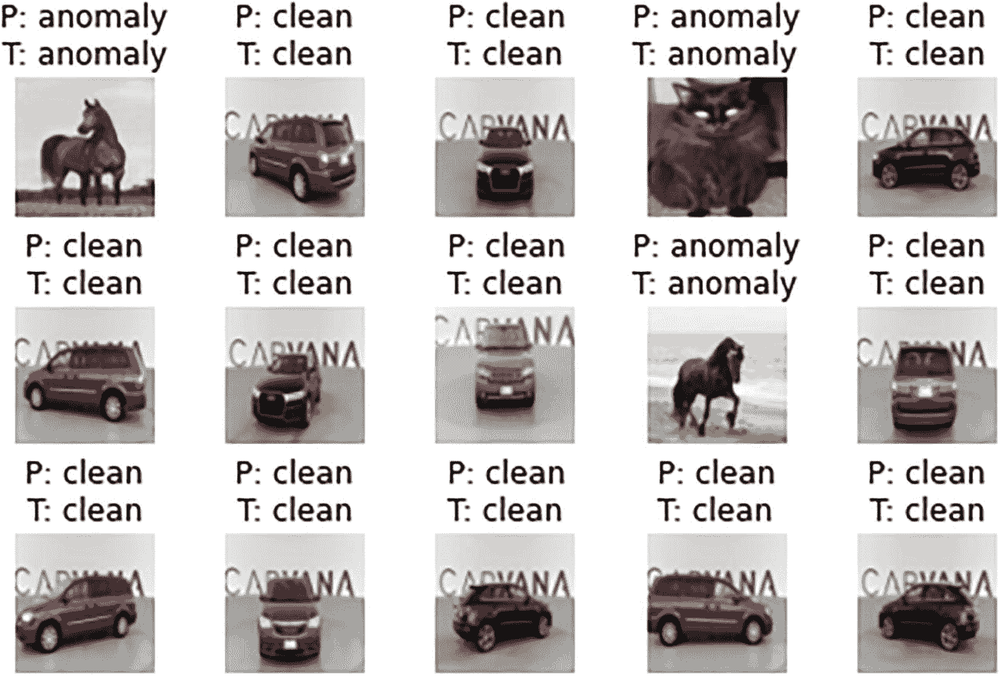
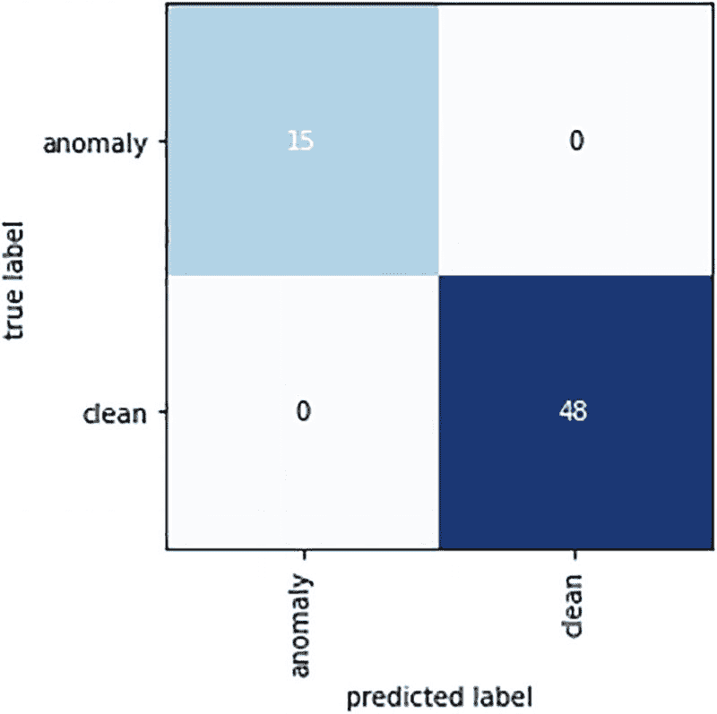
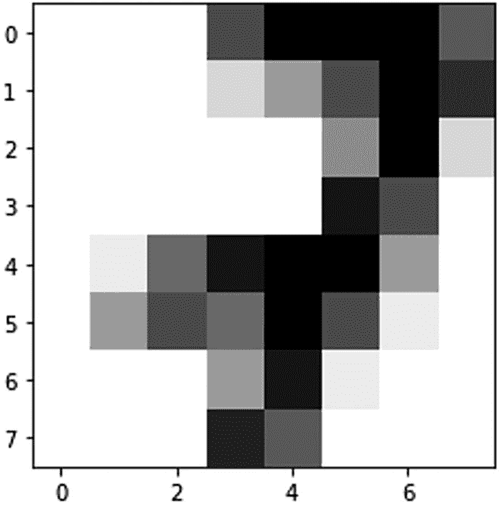

# 7. 图像异常检测

机器学习的研究使我们走上了研究各种模式和行为的道路。它使我们能够构建可以研究封闭环境的模型。预测能力通常伴随着模型训练过程而来。这是我们在训练模型时需要经常思考的一个重要问题。还有另一个问题需要解答——需要多少数据才能帮助模型理解数据分布，从而获得良好的表示？本章将通过一个示例和相关概念来探讨这些重要问题。我们讨论的是计算机视觉中的异常检测。

我们有一个机器学习模型，它学习数据分布，并最终可用于对未知数据集进行预测。学习过程受限于我们用于训练的数据所代表的分布。训练过程结束后，少数样本可能会与大多数行为相矛盾。我们必须注意，检测异常取决于视角，例如分布需要有多宽松。例如，一块抛光钢板可能带有机器留下的成排直线。可能会有轻微的划痕，但这些可能仍不被视为缺陷（异常）。在其他场景中，这些划痕或突兀之处可能被视为异常。因此，对于所有场景，异常都需要一个阈值。

异常检测在图像中有很多应用，例如，在建筑工地检测金属板中的异常。异常检测可用于发现传送带上的异常情况。

## 异常检测

与所有其他领域一样，视觉分析中的异常检测可分为两大类型：

- **新颖性检测：** 在训练过程中，模型会接触到由标准事件分布产生的数据。当对未知样本进行测试或预测时，算法应能发现异常数据。在此过程中，假设数据不包含任何非标准数据。这是半监督学习方法的一个例子。

- **离群点检测：** 在这种情况下，算法会同时接触到标准数据和非标准数据。由于原则上标准数据会集中分布，算法会学习它并忽略离群点。我们可以以决策树为例，其分支在分裂过程中总是会尽早尝试分离离群点。这种方法中的数据被标准数据和非标准数据污染。算法会找出哪些数据点是内点，哪些是离群点。这是一种无监督的训练方式。

我们有多种方法来检测离群点或新颖性。我们可以使用统计方法，例如总体均值和标准差来寻找离群点。然而，在这些场景中，必须了解数据的分布情况。在机器学习方法中，有一些算法可以帮助我们进行异常检测。

- **局部离群因子：** 该算法计算一个量化局部密度偏差的值。它试图定位那些与邻近样本相比密度较低的样本。

- **孤立森林：** 存在一些基于决策进行迭代分裂的方法，可用于确定样本中的离群点。如果我们能够利用基于决策树集成或随机森林的算法，就很容易得出结论：落在随机森林较短路径上的样本即为异常点。

- **单类支持向量机：** 这可以被视为支持向量机类的一个扩展，在确定阈值后，可以检查概率分布的支持度，从而在此过程中分离出离群点。

让我们看看计算机视觉领域的一些应用。

- **无监督密度估计：** 该算法试图估计特征或训练图像的概率分布。一旦模型知道了分布，对于所有未知样本，它会尝试确定该样本与分布之间的差异。

- **无监督图像重建：** 训练编码器-解码器架构的一般过程。它让网络学习向量化的潜在特征，并以一定的损失重建原始图像。与异常图像相比，正常图像的重建损失会更小。

- **单类异常检测：** 这种方法类似于前面讨论的单类支持向量机。该算法试图估计一个决策边界，以将正常类与异常类分开。

生成类算法可用于检测异常，并且已被多位研究人员证实。现在我们已经了解了一些基本概念，让我们来看一个异常检测的例子。

一些方法包括以下内容：

- 使用预训练模型，并对最后几层进行训练以进行异常分类

- 编码和解码方法

- 异常图像分类以及使用特征图定位图像中的异常

### 方法 1：使用预训练分类模型

从给定的图像数据集中找出异常图像可以被视为一个二值图像分类任务，即根据训练数据集判断图像是否为异常。这里使用一种名为`VGG-16`的成熟架构来训练最后几层。

`VGG-16`架构包含 16 层，其中 13 个是卷积层，最后三个是全连接层。该网络经过训练，可以从总共 1,000 个类别中预测输入的类别。

在当前方法中，前十个卷积层使用预训练权重。最后几层用于对自定义数据集进行模型训练。输出被分类为两个类别之一。图 7-1 中突出显示的框用于训练自定义数据集。


`VGG-16`架构图像异常检测预训练分类模型`VGG-16`架构图。从左到右的水平图从输入开始，依次进入卷积层：`Convi 1-1`、`Convi 1-2`、池化层，然后按顺序模式进入`Convi 2-1`、`Convi 2-2`。全连接层被标识为密集层。

**图 7-1** `VGG-16`架构

#### 步骤 1：导入所需库

```python
#import torch
import torch
import torchvision
import matplotlib.pyplot as plt
#import time,os etc
import time
import os
import numpy as np
import random
from distutils.version import LooseVersion as Version
from itertools import product
```

#### 步骤 2：创建种子和确定性函数

这些函数有助于为所有迭代生成相同的随机数。

```python
def seed_setting(sd):
    os.environ["PL_GLOBAL_SEED"] = str(sd)
    random.seed(sd)
    np.random.seed(sd)
    torch.manual_seed(sd)
    torch.cuda.manual_seed_all(sd)

def fn_det_setting():
    #check if cuda is available
    if torch.cuda.is_available():
        torch.backends.cudnn.benchmark = False
        torch.backends.cudnn.deterministic = True
    #check torch version
    if torch.__version__ <= Version("1.7"):
        torch.fn_det_setting(True)
    else:
        torch.use_deterministic_algorithms(True)
```

#### 步骤 3：设置超参数

```python
#set seed, batch size
RNDM_SEED = 245
btch_input_sz = 128
epch_nmbr = 25
DEVICE = torch.device('cuda:1' if torch.cuda.is_available() else 'cpu')
seed_setting(RNDM_SEED)
#fn_det_setting() This may not work on Gpu because some algorithms are not deterministic on Gpu.
```

#### 步骤 4：导入数据集

以下是训练数据：

```python
tr_ds_path = "/content/drive/MyDrive/car_img/tr" #Training Images
```

以下是验证数据：

```python
vd_ds_path = "/content/drive/MyDrive/car_img/vds" #Validation Images
```

以下是测试数据：

```python
ts_ds_path = "/content/drive/MyDrive/car_img/ts" #Test Images
```

#### 第 5 步：图像预处理阶段

图像变换包括以下步骤：

- **图像缩放**：保持训练集、测试集和验证集中图像尺寸一致

- **图像裁剪**：裁剪图像边缘

- **图像转张量**：用于 PyTorch 实现

- **图像归一化**：加速损失收敛

```python
import torch.utils.data as data
tr_data_trans = torchvision.transforms.Compose([
    torchvision.transforms.Resize((70, 70)),
    torchvision.transforms.RandomCrop((64, 64)),
    torchvision.transforms.ToTensor(), #it converts data in the range 0-255 to 0-1.
    torchvision.transforms.Normalize((0.485, 0.456, 0.406), (0.229, 0.224, 0.225))])
validation_data_trans = torchvision.transforms.Compose([
    torchvision.transforms.Resize((70, 70)),
    torchvision.transforms.CenterCrop((64, 64)),
    torchvision.transforms.ToTensor(),
    torchvision.transforms.Normalize((0.485, 0.456, 0.406), (0.229, 0.224, 0.225))])
tst_data_transform = torchvision.transforms.Compose([
    torchvision.transforms.Resize((70, 70)),
    torchvision.transforms.CenterCrop((64, 64)),
    torchvision.transforms.ToTensor(),
    torchvision.transforms.Normalize((0.485, 0.456, 0.406), (0.229, 0.224, 0.225))])
```

`DataLoader`函数通过并行传递数据来加速数据加载过程。

```python
train_ds_cln = torchvision.datasets.ImageFolder(root=tr_ds_path, transform=tr_data_trans)
train_loader_cln = data.DataLoader(train_ds_cln, btch_input_sz=206, shuffle=True)
test_ds_cln = torchvision.datasets.ImageFolder(root=ts_ds_path, transform=tst_data_transform)
test_loader_cln = data.DataLoader(test_ds_cln, btch_input_sz=206, shuffle=True)
valid_ds_cln = torchvision.datasets.ImageFolder(root=vd_ds_path, transform=validation_data_trans)
valid_loader_cln = data.DataLoader(valid_ds_cln, btch_input_sz=63, shuffle=True)

# Checking the dataset
for images, labels in train_loader_cln:
    print('Image batch dimensions:', images.shape)
    print('Image label dimensions:', labels.shape)
    print('Class labels of 10 examples:', labels[:10])
    break
```

输出如下：

```
Image batch dimensions: torch.Size([206, 3, 64, 64])
Image label dimensions: torch.Size([206])
Class labels of 10 examples: tensor([1, 0, 0, 1, 0, 0, 1, 1, 1, 1])
```

以下是训练数据集：

```python
for images, labels in train_loader_cln:
    print('Image batch dimensions:', images.shape)
    print('Image label dimensions:', labels.shape)
    print('Class labels of 10 examples:', labels[:10])
    break
```

输出如下：

```
Image batch dimensions: torch.Size([206, 3, 64, 64])
Image label dimensions: torch.Size([206])
Class labels of 10 examples: tensor([0, 1, 0, 1, 1, 1, 1, 1, 0, 1])
tr_ds = images
tr_ds.shape
```

输出如下：

```
torch.Size([206, 3, 64, 64])
tr_label = labels
tr_label.shape
```

输出如下：

```
torch.Size([206])
```

以下是验证数据集：

```python
for images, labels in valid_loader_cln:
    print('Image batch dimensions:', images.shape)
    print('Image label dimensions:', labels.shape)
    print('Class labels of 10 examples:', labels[:10])
    break
```

输出如下：

```
Image batch dimensions: torch.Size([63, 3, 64, 64])
Image label dimensions: torch.Size([63])
Class labels of 10 examples: tensor([1, 1, 0, 0, 1, 0, 1, 1, 1, 1])
vd_ds = images
vd_ds.shape
```

输出如下：

```
torch.Size([63, 3, 64, 64])
```

以下是测试数据集：

```python
for images, labels in test_loader_cln:
    print('Image batch dimensions:', images.shape)
    print('Image label dimensions:', labels.shape)
    print('Class labels of 10 examples:', labels[:10])
    break
```

输出如下：

```
Image batch dimensions: torch.Size([63, 3, 64, 64])
Image label dimensions: torch.Size([63])
Class labels of 10 examples: tensor([1, 1, 1, 1, 1, 0, 1, 1, 1, 0])
```

#### 第 6 步：加载预训练模型

```python
model = torchvision.models.vgg16(pretrained=True)
model
```

输出如下：

```
VGG(
  (features): Sequential(
    (0): Conv2d(3, 64, kernel_size=(3, 3), stride=(1, 1), padding=(1, 1))
    (1): ReLU(inplace=True)
    (2): Conv2d(64, 64, kernel_size=(3, 3), stride=(1, 1), padding=(1, 1))
    (3): ReLU(inplace=True)
    (4): MaxPool2d(kernel_size=2, stride=2, padding=0, dilation=1, ceil_mode=False)
    (5): Conv2d(64, 128, kernel_size=(3, 3), stride=(1, 1), padding=(1, 1))
    (6): ReLU(inplace=True)
    (7): Conv2d(128, 128, kernel_size=(3, 3), stride=(1, 1), padding=(1, 1))
    (8): ReLU(inplace=True)
    (9): MaxPool2d(kernel_size=2, stride=2, padding=0, dilation=1, ceil_mode=False)
    (10): Conv2d(128, 256, kernel_size=(3, 3), stride=(1, 1), padding=(1, 1))
    (11): ReLU(inplace=True)
    (12): Conv2d(256, 256, kernel_size=(3, 3), stride=(1, 1), padding=(1, 1))
    (13): ReLU(inplace=True)
    (14): Conv2d(256, 256, kernel_size=(3, 3), stride=(1, 1), padding=(1, 1))
    (15): ReLU(inplace=True)
    (16): MaxPool2d(kernel_size=2, stride=2, padding=0, dilation=1, ceil_mode=False)
    (17): Conv2d(256, 512, kernel_size=(3, 3), stride=(1, 1), padding=(1, 1))
    (18): ReLU(inplace=True)
    (19): Conv2d(512, 512, kernel_size=(3, 3), stride=(1, 1), padding=(1, 1))
    (20): ReLU(inplace=True)
    (21): Conv2d(512, 512, kernel_size=(3, 3), stride=(1, 1), padding=(1, 1))
    (22): ReLU(inplace=True)
    (23): MaxPool2d(kernel_size=2, stride=2, padding=0, dilation=1, ceil_mode=False)
    (24): Conv2d(512, 512, kernel_size=(3, 3), stride=(1, 1), padding=(1, 1))
    (25): ReLU(inplace=True)
    (26): Conv2d(512, 512, kernel_size=(3, 3), stride=(1, 1), padding=(1, 1))
    (27): ReLU(inplace=True)
    (28): Conv2d(512, 512, kernel_size=(3, 3), stride=(1, 1), padding=(1, 1))
    (29): ReLU(inplace=True)
    (30): MaxPool2d(kernel_size=2, stride=2, padding=0, dilation=1, ceil_mode=False)
  )
  (avgpool): AdaptiveAvgPool2d(output_size=(7, 7))
  (classifier): Sequential(
    (0): Linear(in_features=25088, out_features=4096, bias=True)
    (1): ReLU(inplace=True)
    (2): Dropout(p=0.5, inplace=False)
    (3): Linear(in_features=4096, out_features=4096, bias=True)
    (4): ReLU(inplace=True)
    (5): Dropout(p=0.5, inplace=False)
    (6): Linear(in_features=4096, out_features=1000, bias=True)
  )
)
```

### 第 7 步：冻结模型

这里，自适应平均池化层是卷积层和线性层之间的桥梁。我们只打算训练线性层。最简单的方法是先冻结整个模型。因此，我们遍历模型中的所有参数。

假设我们要微调（训练）最后三层：

```python
for param in model.parameters():
    param.requires_grad = False
```

现在，我们仍然可以运行模型的前向和反向传播，但不会更新参数。在接下来的步骤中，我们将微调最后三层。

```python
model.classifier[1].requires_grad = True
model.classifier[3].requires_grad = True
```

对于最后一层，由于类别标签数量与 ImageNet 不同，我们将输出层替换为自定义的输出层：

```python
model.classifier[6] = torch.nn.Linear(4096, 2)
```

### 第 8 步：训练模型

以下是训练过程：

```python
def find_acc_metric(input_model, input_data_ldr, dvc):
    with torch.no_grad():
        correct_pred, num_examples = 0, 0
        for i, (features, targets) in enumerate(input_data_ldr):
            features = features.to(dvc)
            targets = targets.float().to(dvc)
            preds = input_model(features)
            _, predicted_labels = torch.max(preds, 1)
            num_examples += targets.size(0)
            correct_pred += (predicted_labels == targets).sum()
        return correct_pred.float()/num_examples * 100

def mdl_training(model, epch_nmbr, train_loader,
                 valid_loader, test_loader, optimizer,
                 device, logging_interval=50,
                 scheduler=None,
                 scheduler_on='valid_acc'):
    tme_strt = time.time()
    list_from_loss, accuracy_train, accuracy_validation = [], [], []
    for epoch in range(epch_nmbr):
        model.train()
        for batch_idx, (features, targets) in enumerate(train_loader):
            features = features.to(device)
            targets = targets.to(device)
            preds = model(features)
            loss = torch.nn.functional.cross_entropy(preds, targets)
            optimizer.zero_grad()
            loss.backward()
            optimizer.step()
            list_from_loss.append(loss.item())
            if not batch_idx % logging_interval:
                print(f'Epoch: {epoch+1:03d}/{epch_nmbr:03d} '
                      f'| Batch {batch_idx:04d}/{len(train_loader):04d} '
                      f'| Loss: {loss:.4f}')
        model.eval()
        with torch.no_grad():
            train_acc = find_acc_metric(model, train_loader, device=device)
            valid_acc = find_acc_metric(model, valid_loader, device=device)
            print(f'Epoch: {epoch+1:03d}/{epch_nmbr:03d} '
                  f'| Train: {train_acc :.2f}% '
                  f'| Validation: {valid_acc :.2f}%')
            accuracy_train.append(train_acc.item())
            accuracy_validation.append(valid_acc.item())
        tr_time = (time.time() - tme_strt)/60
        print(f'Time tr_time: {tr_time:.2f} min')
        if scheduler is not None:
            if scheduler_on == 'valid_acc':
                scheduler.step(accuracy_validation[-1])
            elif scheduler_on == 'minibatch_loss':
                scheduler.step(list_from_loss[-1])
            else:
                raise ValueError(f'Invalid `scheduler_on` choice.')
    tr_time = (time.time() - tme_strt)/60
    print(f'Final Training Time: {tr_time:.2f} min')
    test_acc = find_acc_metric(model, test_loader, device=device)
    print(f'Test accuracy {test_acc :.2f}%')
    return list_from_loss, accuracy_train, accuracy_validation
```

### 第 9 步：评估模型

```python
def Viz_acc(acc_training, val_acc, loc_res):
    epch_nmbr = len(acc_training)
    plt.plot(np.arange(1, epch_nmbr+1),
             acc_training, label='Training')
    plt.plot(np.arange(1, epch_nmbr+1),
             val_acc, label='Validation')
    plt.xlabel('# of Epoch')
    plt.ylabel('Accuracy')
    plt.legend()
    plt.tight_layout()
    if loc_res is not None:
        image_path = os.path.join(
            loc_res, 'plot_acc_training_validation.pdf')
        plt.savefig(image_path)

DEVICE = "cuda" if torch.cuda.is_available() else "cpu"
model = model.to(DEVICE)
optimizer = torch.optim.SGD(model.parameters(), momentum=0.9, lr=0.01)
scheduler = torch.optim.lr_scheduler.ReduceLROnPlateau(optimizer,
                                                       factor=0.1,
                                                       mode='max',
                                                       verbose=True)
list_from_loss, accuracy_train, accuracy_validation = mdl_training(
    model=model,
    epch_nmbr=5,
    train_loader=train_loader_cln,
    valid_loader=valid_loader_cln,
    test_loader=test_loader_cln,
    optimizer=optimizer,
    device=DEVICE,
    scheduler=scheduler,
    scheduler_on='valid_acc',
    logging_interval=100)
```

以下是输出结果：

```
Epoch: 001/005 | Batch 0000/0001 | Loss: 1.4587
Epoch: 001/005 | Train: 79.13% | Validation: 76.21%
Time elapsed: 0.34 min
Epoch: 002/005 | Batch 0000/0001 | Loss: 0.8952
Epoch: 002/005 | Train: 92.72% | Validation: 90.29%
Time elapsed: 0.67 min
Epoch: 003/005 | Batch 0000/0001 | Loss: 0.3280
Epoch: 003/005 | Train: 97.57% | Validation: 96.60%
Time elapsed: 0.99 min
Epoch: 004/005 | Batch 0000/0001 | Loss: 0.1774
Epoch: 004/005 | Train: 99.03% | Validation: 96.60%
Time elapsed: 1.32 min
Epoch: 005/005 | Batch 0000/0001 | Loss: 0.0581
Epoch: 005/005 | Train: 99.51% | Validation: 98.06%
Time elapsed: 1.66 min
Total Training Time: 1.66 min
Test accuracy 100.00%
```

训练与验证的可视化：

```python
Viz_acc(accuracy_train=accuracy_train,
        accuracy_validation=accuracy_validation,
        results_dir=None)
plt.ylim([60, 100])
plt.show()
```

输出结果如图 7-2 所示。


输出训练与验证准确率的折线图，用于图像异常检测的预训练分类模型。Y 轴表示准确率，X 轴表示轮次。图例中蓝色代表训练准确率，橙色代表验证准确率，用于识别波长。波长从 75 和 80 开始，直至 100。

**图 7-2** 输出训练与验证准确率对比


# 张量：归一化图像。

```python
def example_sample(model, data_loader, unnormalizer=None, class_dict=None):
    for batch_idx, (features, targets) in enumerate(data_loader):
        with torch.no_grad():
            features = features
            targets = targets
            preds = model(features)
            predictions = torch.argmax(preds, dim=1)
        break
    fig, axes = plt.subplots(nrows=3, ncols=5,
                             sharex=True, sharey=True)
    if unnormalizer is not None:
        for idx in range(features.shape[0]):
            features[idx] = unnormalizer(features[idx])
        nhwc_img = np.transpose(features, axes=(0, 2, 3, 1))
        if nhwc_img.shape[-1] == 1:
            nhw_img = np.squeeze(nhwc_img.numpy(), axis=3)
        for idx, ax in enumerate(axes.ravel()):
            ax.imshow(nhw_img[idx], cmap='binary')
            if class_dict is not None:
                ax.title.set_text(f'P: {class_dict[predictions[idx].item()]}'
                                  f'\nT: {class_dict[targets[idx].item()]}')
            else:
                ax.title.set_text(f'P: {predictions[idx]} | T: {targets[idx]}')
            ax.axison = False
    else:
        for idx, ax in enumerate(axes.ravel()):
            ax.imshow(nhwc_img[idx])
            if class_dict is not None:
                ax.title.set_text(f'P: {class_dict[predictions[idx].item()]}'
                                  f'\nT: {class_dict[targets[idx].item()]}')
            else:
                ax.title.set_text(f'P: {predictions[idx]} | T: {targets[idx]}')
            ax.axison = False
    plt.tight_layout()
    plt.show()

class UnNormalize(object):
    def __init__(self, mean, std):
        self.mean = mean
        self.std = std

    def __call__(self, tensor):
        """
        Parameters:
        tensor (Tensor): Tensor image of size (C, H, W) to be normalized.
        Returns:
        """
```

```python
for t, m, s in zip(tensor, self.mean, self.std):
    t.mul_(s).add_(m)
return tensor
```

`model.cpu()`

`unnormalizer = UnNormalize((0.485, 0.456, 0.406), (0.229, 0.224, 0.2255))`

`class_dict = {0: 'anomaly', 1: 'clean'}`

`example_sample(model=model, data_loader=test_loader_cln, unnormalizer=unnormalizer, class_dict=class_dict)`

输出结果如图 7-3 所示。



输出异常检测分类模型的图像集合。第一行中的五张图像分别是：一匹棕色的马、一辆红色的汽车、一辆黑色的汽车、一只黑色的猫，以及另一辆黑色的汽车。这些图像顶部都有标签，依次为：`P: anomaly T: anomaly`；`P: clean T: clean`，后续图像也遵循相同的顺序。

**图 7-3** 输出图像

混淆矩阵如下所示：

```python
def conf_matrix(model, input_data_ldr, input_dvc):
    trgt_data, pred_data = [], []
    with torch.no_grad():
        for i, (features, targets) in enumerate(input_data_ldr):
            features = features.to(input_dvc)
            targets = targets
            preds = model(features)
            _, predicted_labels = torch.max(preds, 1)
            trgt_data.extend(targets.to('cpu'))
            pred_data.extend(predicted_labels.to('cpu'))
    pred_data = pred_data
    pred_data = np.array(pred_data)
    trgt_data = np.array(trgt_data)
    lable_values = np.unique(np.concatenate((trgt_data, pred_data)))
    if lable_values.shape[0] == 1:
        if lable_values[0] != 0:
            lable_values = np.array([0, lable_values[0]])
        else:
            lable_values = np.array([lable_values[0], 1])
    n_labels = lable_values.shape[0]
    lst = []
    z = list(zip(trgt_data, pred_data))
    for combi in product(lable_values, repeat=2):
        lst.append(z.count(combi))
    mat = np.asarray(lst)[:, None].reshape(n_labels, n_labels)
    return mat

def plot_confusion_matrix(conf_mat,
                          hide_spines=False,
                          hide_ticks=False,
                          figsize=None,
                          cmap=None,
                          colorbar=False,
                          show_absolute=True,
                          show_normed=False,
                          class_names=None):
    if not (show_absolute or show_normed):
        raise AssertionError('Both show_absolute and show_normed are False')
    if class_names is not None and len(class_names) != len(conf_mat):
        raise AssertionError('len(class_names) should be equal to number of'
                             'classes in the dataset')
    total_samples = conf_mat.sum(axis=1)[:, np.newaxis]
    normed_conf_mat = conf_mat.astype('float') / total_samples
    fig, ax = plt.subplots(figsize=figsize)
    ax.grid(False)
    if cmap is None:
        cmap = plt.cm.Blues
    if figsize is None:
        figsize = (len(conf_mat)*1.25, len(conf_mat)*1.25)
    if show_normed:
        matshow = ax.matshow(normed_conf_mat, cmap=cmap)
    else:
        matshow = ax.matshow(conf_mat, cmap=cmap)
    if colorbar:
        fig.colorbar(matshow)
    for i in range(conf_mat.shape[0]):
        for j in range(conf_mat.shape[1]):
            cell_text = ""
            if show_absolute:
                cell_text += format(conf_mat[i, j], 'd')
            if show_normed:
                cell_text += "\n" + '('
                cell_text += format(normed_conf_mat[i, j], '.2f') + ')'
            else:
                cell_text += format(normed_conf_mat[i, j], '.2f')
            ax.text(x=j,
                    y=i,
                    s=cell_text,
                    va='center',
                    ha='center',
                    color="white" if normed_conf_mat[i, j] > 0.5 else "black")
    if class_names is not None:
        tick_marks = np.arange(len(class_names))
        plt.xticks(tick_marks, class_names, rotation=90)
        plt.yticks(tick_marks, class_names)
    if hide_spines:
        ax.spines['right'].set_visible(False)
        ax.spines['top'].set_visible(False)
        ax.spines['left'].set_visible(False)
        ax.spines['bottom'].set_visible(False)
    ax.yaxis.set_ticks_position('left')
    ax.xaxis.set_ticks_position('bottom')
    if hide_ticks:
        ax.axes.get_yaxis().set_ticks([])
        ax.axes.get_xaxis().set_ticks([])
    plt.xlabel('predicted label')
    plt.ylabel('true label')
    return fig, ax

mat = conf_matrix(model=model, data_loader=test_loader_cln, device=torch.device('cpu'))
plot_confusion_matrix(mat, class_names=class_dict.values())
plt.show()
```

输出结果如图 7-4 所示。



该图展示了混淆矩阵。x 轴标记为“预测标签”，y 轴标记为“真实标签”。两个轴上的值分别为“异常”和“干净”。按顺时针方向的值依次为：15、0、48 和 0。

**图 7-4** 混淆矩阵

## 方法 2：使用自编码器

构建一个自编码器训练网络，该网络包含以下部分：

*   **编码器**：对原始图像进行编码（基于像素值）。

*   **解码器**：根据编码器的输出重建图像。

评估原始图像与重建图像之间的模型。基于误差度量分数，检测出最异常的图像。

以下是五个实现步骤：

1.  步骤 1：准备数据集对象。

2.  步骤 2：构建自编码器网络。

3.  步骤 3：训练自编码器网络。

4.  步骤 4：基于原始数据计算重建损失。

5.  步骤 5：基于误差度量分数选择最异常的图像。

### 步骤 1：准备数据集对象

加载 `input.csv` 文件。`input.csv` 文件中的每条记录包含 65 个值。前 64 个值表示手写数字的灰度像素值。最后一个值表示数字的原始类别，其范围在 0 到 9 之间。

将 CSV 数据记录转换为张量。之后，对像素值和原始类别数据进行归一化。

```python
# 步骤 1

# 准备数据集对象
print("\n 加载 CSV 数据，转换为归一化张量数据 ")

# 加载包含 65 个值的 .csv 数据集

# 前 64 个值表示 64 个灰度格式的像素值

# 最后 1 个值表示实际数字（范围在 0 到 9 之间）
csv_data = "hand_written_digits.txt"

# 使用辅助函数 "tensor_converter" 将 CSV 格式转换为归一化张量
tensor_data = tensor_converter(csv_data)
```

### 步骤 2：构建自编码器网络

这里我们构建自编码器网络，该网络包含编码器和解码器架构。

*   编码器将原始数字像素值转换为更低维度的空间。（例如，它将 64 个灰度像素值转换为 8 个值。）

*   解码器从低维度重建原始数字。（例如，它使用 8 个值重建 64 像素的灰度图像。）

在此问题陈述中，编码和解码过程均使用全连接层。编码网络使用三个全连接（FC）层构建，其中第一个 FC 层将 65 个值（64+1）转换为 48 个，第二个层将 48 个值转换为 32 个。最后一层将 32 个值转换为 8 个。编码过程 ——> 65–48-32-8。

解码网络使用三个全连接层构建，其中第一个层将 8 个值转换为 32 个，第二个 FC 层将 32 个值转换为 48 个。最后一层将 48 个值转换为 65 个。解码过程 ——> 8-32-48-65。

```python
def __init__(self):
    super(Autoencoder, self).__init__()
    self.fc1 = T.nn.Linear(65, 48)
    self.fc2 = T.nn.Linear(48, 32)
    self.fc3 = T.nn.Linear(32, 8)
    self.fc4 = T.nn.Linear(8, 32)
    self.fc5 = T.nn.Linear(32, 48)
    self.fc6 = T.nn.Linear(48, 65)

def encode(self, x):
    # 65-48-32-8
    z = T.tanh(self.fc1(x))
    z = T.tanh(self.fc2(z))
    z = T.tanh(self.fc3(z))
    return z

def decode(self, x):
    # 8-32-48-65
    z = T.tanh(self.fc4(x))
    z = T.tanh(self.fc5(z))
    z = T.sigmoid(self.fc6(z))
    return z
```

### 步骤 3：训练自编码器网络


使用超参数（如学习率、周期数、批次大小、损失度量和损失优化器）训练自编码器网络。训练时，一个辅助函数会接收自编码器网络、张量数据以及之前指定的所有其他超参数。

```
# 步骤 3. 训练自编码器模型
batch_size = 10
max_epochs = 200
log_interval = 8
learning_rate = 0.002
train(autoenc, tensor_data, batch_size, max_epochs, log_interval, learning_rate)
```

### 第 4 步：基于原始数据计算重建损失

通过比较原始手写数字与重建数字来评估训练好的模型。计算并存储图像重建损失：

```
# 设置自编码器为评估模式
autoenc.eval()

# 存储重建的 MSE 损失
MSE_list = make_err_list(autoenc, tensor_data)

# 根据 MSE 损失从高到低对列表进行排序
MSE_list.sort(key=lambda x: x[1], reverse=True)
```

### 第 5 步：基于误差度量分数选择最异常的数字

基于最高的 MSE 损失，我们需要找出数据集中属于异常的数字。

```
# 第 5 步：显示数据集中最异常的手写数字
print("数据集中基于最高 MSE 给出的异常数字：")
(idx, MSE) = MSE_list[0]
print(" 索引 : %4d , MSE : %0.4f" % (idx, MSE))
display_digit(tensor_data, idx)
```

### 输出

```
数据集中基于最高 MSE 给出的异常数字：
索引 :  486 , MSE : 0.1360
```

输出结果如图 7-5 所示。



一张带有数值块的图表。Y 轴表示从 0 到 7 的数字，而 X 轴表示数值 0、2、4 和 6。数值为近似值。该数据集呈现上升趋势。

**图 7-5** 异常输出

```
digit =  7
```

## 总结

我们使用了 VGG 架构来确定样本图像数据集中的异常。我们逐步讲解了代码，并开发了一个端到端的流程。该模型只需极少的改动即可应用于工业级问题。

现在我们已经了解了异常检测，下一章将讨论最前沿的用例，即“图像超分辨率”。我们见过许多提升图像质量和分辨率的应用。你能通过在`PyTorch`中构建模型来自行实现吗？让我们在下一章中一探究竟。