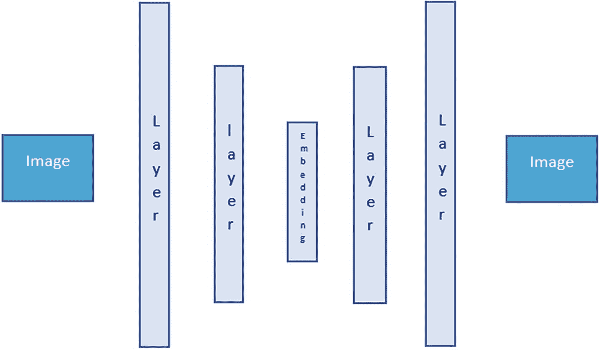
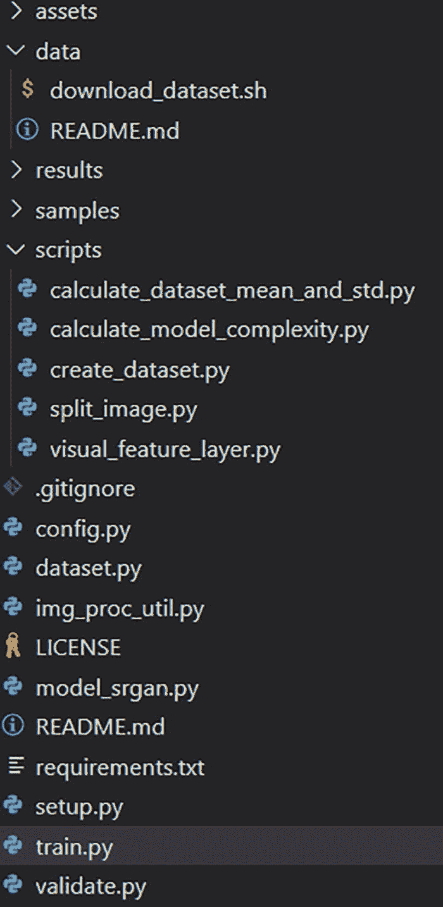

# 8. 图像超分辨率

随着高分辨率图像采集设备的出现，图像中捕获的信息量变得巨大。技术已从超高清发展到 4K 和 8K 分辨率。如今电影都在使用高分辨率帧；然而，也存在需要将低分辨率图像增强为高分辨率图像的情况。想象一个场景，电影主角正试图从一张超速汽车的照片中确定车牌号码。超分辨率技术现在可以帮助我们在不扭曲图像的情况下，将图像放大到很高的程度。业界已经取得了一些有趣的进展，我们将通过一些示例来讨论这些进展。

图像中已有的信息无法从初始状态增加。在计算机科学中，有“垃圾进，垃圾出”的说法，这是一个类似的概念。我们不能期望找到图像中原本不存在的东西。因此，从某种意义上说，超分辨率似乎有些牵强，并且受到信息论的严格限制。即便如此，活跃的研究表明这个问题是可以解决的。

让我们深入探讨手头的问题。到目前为止，我们处理的是监督学习形式，其中总是存在一个与真实值相关的损失函数。模型从定义的输入（`X`）和期望输出（`Y`）中学习。训练模型的全部意义在于帮助将输入映射到输出。但这在无监督学习中不会发生。无监督方式帮助模型学习输入数据中的模式，而无需映射输出。模型学习数据中的模式，并围绕其调整权重，然后识别数据中的相似性和差异性。与监督学习方法不同，无监督学习没有纠正措施。缺少真实值这一方面，但优化的概念仍然存在。

让我们深入探讨判别模型和生成模型的概念。在生成模型中，学习的是输入和输出的联合概率。学习数据的分布，这通常是训练模型的一种更通用的方式。这些模型能够在输入空间中生成合成数据点。另一方面，判别模型专门用于创建从输入空间到输出的映射函数。生成模型的例子包括线性判别分析、朴素贝叶斯和高斯模型。

我们为什么要介绍生成模型并讨论学习数据分布的思想？让我们回顾一下逻辑，这可以帮助我们理解超分辨率。

-   使用最近邻概念放大图像
-   双线性插值/双三次插值
-   傅里叶变换
-   神经网络

我们将详细探讨所有这些可能的方法。但在此之前，让我们先探索用于放大低分辨率图像的基本技术，从最近邻缩放开始。图 8-1a 显示了一个可以调整为更大图像的基本图像（见图 8-1b），但请记住，图像中的信息保持不变。改变的只是表示形式。


一个 6x6 方格块的示意图。

**图 8-1b** 一个 3x3 图像扩展为 6x6


一个 3x3 方格块的示意图。

**图 8-1a** 一个 3x3 图像

## 使用最近邻概念进行放大

需要更快分辨率变化的问题也需要更快的操作。我们知道，使用卷积神经网络或任何接近神经网络的方法都需要大量的计算，所以现在是时候采用一些简单的技术了。如果我们需要更快的技术，使用最近邻概念放大图像是首选方法之一。

图 8-2a 显示了一个需要放大到 8x8 图像的 4x4 图像，如图 8-2b 所示。我们最初在整个图像中有 16 个像素，然后当它被拉伸到 64 个像素时，我们留下了 48 个需要填充的空缺。最近邻的概念可以通过一个直线单位来理解。考虑一条从 0 开始到 4 结束的直线数轴。如果我们把它分成四个相等的部分，或者在这种情况下是像素，每个部分获得 25%的信息。现在，如果同一条线被拉伸到长度为 8，单位长度保持不变，但每个单位的权重变为 12.5%。然而，图像中携带的信息是相同的。


一个方框的示意图，内部有一个 4x4 的方格块，方格之间有一定距离。最右上角和最左下角的区域各有三个方格，分别带有两种不同的阴影。

**图 8-2b** 正在被放大的示例图像


一个 4x4 方格块的示意图，每个方格都有指定的对角线阴影。最右上角和最左下角的区域各占据三个方格，并带有各自的阴影。

**图 8-2a** 示例图像

同样的概念可以用于使用以下公式通过最近邻填充空缺：


该公式为我们提供了放大后图像像素的坐标值。

## 理解双线性上采样

要理解双线性图像上采样的概念，我们首先需要了解线性插值。插值可以看作是上采样在一维空间中的延伸。设想一个场景：一条直线由两个端点处的值——`x[1]` 和 `x[2]`——标记，并且这两个值已知。如果我们需要在这两个端点之间插值出第三个值，该如何操作？

该算法表明，我们可以利用加权平均的概念来插值出未知值。权重可以通过点 `x[1]` 和 `x[2]` 之间的比例距离来确定。当我们在二维空间中对图像进行缩放时，也可以运用这一逻辑。

为了在（`宽度`，`高度`）维度上获取某个坐标的值，我们可以在每个维度上分别进行线性插值。这本质上将有助于在二维空间中进行图像缩放。

接下来，我们进入图像上采样领域最受期待的概念——神经网络。上采样的方法可能看起来非常粗糙和生硬，毫无精细可言。使用一些经过反复验证的公式来生成值的逻辑早已存在，并且被反复使用。这种重复在某些情况下可以产生奇效，但在此过程中并没有发生任何变化或学习。因此，我们步入了神经网络的学习部分。在编写代码和使用模型架构之前，我们需要讨论其基础模块——VAE 和 GAN。

## 变分自编码器

深度学习领域最具革命性的进步之一就是编码器-解码器架构。神经网络能够提取图像中存在的信息，并根据其理解重新创建图像。自编码器架构是一种神经网络架构，它可以学习数据中的模式，并将其降维到更小的维度。这些维度又可以再次用于将图像重建回原始图像。需要注意的是，理论上我们可以创建一种无损架构，实现图像的绝对重建。但在现实中，这种情况非常罕见。

神经网络的代表性架构如图 8-3 所示，它展示了一种情况：图像由相互连接的层理解，并转换为嵌入。这个嵌入是根据已建立的模型架构，从图像中提取的信息表示。



变分自编码器神经网络代表性架构示意图。两个标有“图像”的方框位于两端，而两侧各有两个尺寸递减的细长垂直矩形，分别标有“层”和“嵌入”，位于中间空白区域。

**图 8-3** — 编码器-解码器架构

网络的初始部分，通常被称为*编码器*，学习输入图像中的数据分布或模式。它不仅需要自我理解，配对的解码器架构也需要能够解码嵌入。因此，特征提取和理解必须使得解码器能够以极小的损失从嵌入中解读出原始图像。

另一方面，解码器部分从嵌入层之后开始，试图以最小的信息损失将嵌入层转换回原始图像。这种由神经网络进行的信息压缩和图像再生成，就是自编码器网络的概念。

当信息传输时，传输的带宽会影响图像的分辨率。压缩有助于将低分辨率图像传递到目的地。一旦图像到达目的地，解码器层就会启动，进行上采样，并恢复出原始图像。

压缩和解压缩的概念可以进一步应用于图像上采样。现在我们已经探讨了编码器-解码器架构的基础知识，接下来将进入一个有趣的概念，称为*变分编码器*。

正如我们目前所见，传统的自编码器架构会利用输入的表示信息创建一个潜在空间，以便解码器网络能够生成输出。但想象一下，如果单个属性贡献了一个离散值，那么在重建时它将被限制为仅这一个值。这种限制将无法帮助模型从分布中生成新的内容，而只会重复。如果我们希望潜在空间中的表示是一个分布，而不是一个离散值，该怎么办？我们可以做到这一点，但会出现两个不同的特性：

-   随机过程
-   确定性过程

通过多个深度学习概念已经确定，每当网络进行训练时，它需要拥有一组能够学习和适应损失的过程。在给定模型参数的情况下，会有前向传播来计算损失（实际值与输出值之间的差异）。同时也会有反向传播，它会根据预期输出与真实值之间的差异所产生的损失来调整权重。因此，本质上，我们只能在网络是确定性的情况下对其进行训练。变分自编码器如图 8-4 所示。

## VAE 表示


一张 VAE 表示的示意图。上方的先验分布 `P(Z)` 和下方的训练数据分别将数据释放到 Z 空间和 X 空间，随后这些数据在编码器 `Q(Z|X)` 和解码器 `P(X|Z)` 中循环。

**图 8-4** VAE 表示

从图 8-4 所示的表示图像中，我们可以看到变分自编码器如何尝试将数据分布映射到潜在空间。训练数据被参数化为 `φ` 的编码器网络使用，以学习从训练数据或 X 空间到潜在空间或 Z 空间的随机映射。

编码器或推理模型学习数据中的模式。可以证明，X 空间的经验分布是复杂的，但潜在空间是简单的。参数化为 `θ` 的生成网络学习由 `P(X|Z)` 给出的分布。解码器部分从先验分布（通常是标准高斯分布）和确定性过程中学习。为了阐明与自编码器的区别，这里增加了一个额外的随机过程。图 8-5 展示了变分自编码器网络的表示。它显示了在现有自编码器架构中添加的随机性。


一张 VAE 网络表示的示意图。左右两侧各放置了一个标记为“图像”的方框。每侧两个尺寸递减的细长垂直矩形标记为“层”，与中间的嵌入层共同占据空间，其中两个水平矩形标记为“均值”和“标准差”位于附近。

**图 8-5** VAE 网络表示

因此，虽然之前我们更侧重于寻找潜在空间的向量或离散值的嵌入，但现在我们将寻找一个均值和标准差的向量空间。

潜在分布赋予了我们过程的随机性。最终，我们将不得不通过反向传播来训练模型。为了克服这个训练问题，我们将均值视为一个固定向量。为了在模型中保持随机性并维持注入的先验分布，我们将标准差视为一个受高斯先验分布中随机常数影响的固定向量。这个采样过程并不像看起来那么简单，因为我们的损失函数将包括重构损失和另一个正则化损失。我们使用一个重参数化技巧，其中 `€` 从先验的标准高斯分布中采样，然后通过潜在分布的均值进行平移，再通过标准差进行缩放。公式如下：

`Z = mean + std * €` ----- (i)

从标准随机节点，我们得到这个方程：

`Z = Q(Z|X)` 参数化为 `φ` ---------- (ii)

我们也可以以图形方式可视化这个技巧，以理清重参数化的概念，并将学习路径中的随机过程转换为确定性节点。

图 8-6a 展示了反向传播或模型学习潜在空间时出现的问题。图 8-6b 展示了重参数化的过程，其中反向传播可以通过实线箭头通道进行。所示的虚线箭头是随机过程，它不会阻碍训练过程，也不直接参与反向传播。它不学习任何东西，也没有权重根据损失函数进行调整。值得注意的是，通过将随机过程移出反向传播路径，Z 空间中的过程类型是如何变化的。


一张 VAE 中重参数化过程的示意图。编码器到达确定性节点（均值和标准差），这些节点再经过另一个确定性节点 Z 到达解码器。其技巧在于，一个随机节点（欧元符号）也经过该确定性节点。

**图 8-6b** 重参数化技巧


一张 VAE 中存在问题的示意图。编码器到达确定性节点（均值和标准差），这些节点再经过随机节点 Z 到达解码器。

**图 8-6a** VAE 问题

方程 (i) 可以视为图 8-6b 的粗略估计，而方程 (ii) 是图 8-6a 的估计。

至此，我们已经建立了变分自编码器的概念，它具有多种用途。这个小小的随机过程有助于生成来自同一概率分布的相似图像。它在图像*重建*或图像*生成*中很有用，并且这两种类型都始终有需求。采样过程使生成器模型或解码器模型能够从同一分布中重新创建具有细微变化的图像。在某些情况下，它有助于对信号或图像进行插值。这种插值概念可用于调整图像大小。现在我们已经简要介绍了变分自编码器，在深入图像大小调整代码之前，让我们看看另一种生成式算法形式，即*生成对抗网络*。

## 生成对抗网络

生成对抗网络由 Ian Goodfellow 于 2014 年引入深度学习领域。该网络能够创建与原始样本非常接近的新样本。它们也被广泛用于图像的风格迁移。

该网络是两种模型的组合——生成器模型和判别器模型。这些模型组合在一起形成了一种监督学习形式。

-   **生成器：** 该模型尝试基于某个领域或问题集生成样本。这些样本最好来自一个固定分布。生成器接收随机输入（在大多数情况下，使用高斯分布来帮助其输入）。在训练过程中，这些随机或无意义的点将被视为来自领域分布。生成器应该能够从输入数据分布中生成表示。正如我们之前所见，数据分布是复杂的，编码器尝试将其映射到一个更简单但高度压缩的信息块。这个空间通常被称为*潜在空间*，自编码器的生成器模块从中生成输出。模型可以理解数据分布的复杂性并创建一个表示，然后从中采样。这能够并且应该能够欺骗判别器或分类器。

-   **判别器：** 一旦生成器模型创建了它认为与原始数据分布非常相似的假样本，这些样本就会被传递给判别器模型进行验证和分类。它本质上是一个分类模型。它的工作是分类生成器生成的图像是假的还是真的。分类器区分真实图像和虚假图像。

我们已经确定生成器和判别器必须同时训练。这被称为生成对抗网络，因为生成模型和判别模型彼此对抗。它们在一个零和博弈中试图超越对方。理论上，一方不会击败另一方。我们有生成器网络试图尽可能逼真地创建假图像，使得判别器无法将其识别为假。另一方面，判别器模型正在努力训练，以便能够捕捉到图像中任何异常之处。在理想情况下，生成器最终生成的图像使得判别器无法识别其真假（50% 真假概率）。最终，生成器从网络中移除并用于其他目的。

## 模型代码

我们已经讨论了生成对抗网络背后的基本概念。这引出了它的众多应用之一：超分辨率。超分辨率技术有多种应用场景，包括风格迁移、图像生成和超分辨率重建等。处理超分辨率问题的模型是`SRGAN`。它的前身之一`SRResNet`在`SSIM`和`PSNR`指标上取得了不错的结果。

让我们来看看超分辨率问题中通常使用的评估指标：

-   **结构相似性指数（SSIM）：** 该指标旨在量化因源图像到目标图像变化而导致的退化程度。它检查图像各部分之间的感知相似性，基于所选窗口的平均值和标准差。

-   **峰值信噪比：** 这是另一个重要指标，用于衡量图像或经过变换的图像与原始图像之间的重建损失。它最好通过均方误差计算来定义，可以通过以 10 为底的对数尺度来表示。

-   **平均意见得分（MOS）：** 该指标由一个序数尺度上的单一数字定义，范围从 1 到 5。1 表示最低感知质量，5 表示最高感知质量。

现在我们已经了解了用于定义和衡量差异的指标，接下来看看我们将要开发代码所基于的数据。

我们将使用`DIV2K`数据集，该数据集包含 1000 张高清图像，按 800-100-100 的比例划分为训练集、验证集和测试集。这些数据可以从 2017 年 CVPR 会议上发表的原始论文中下载，网址为[`https://data.vision.ee.ethz.ch/cvl/DIV2K/`](https://data.vision.ee.ethz.ch/cvl/DIV2K/)。

代码的搭建需要遵循应用程序的标准构建流程。通常这意味着需要有一个模型文件、一些实用脚本、一个训练文件和一个验证文件。在某些情况下，这个模型需要作为托管在服务器上的应用程序，因此还需要一个设置文件。我们一步一步来，先从模型文件开始。

### 模型开发

代码库包含一个生成模型块、一个判别模型块、一个残差块和一个内容损失计算块。

#### 导入

整个代码块将使用`Torch`框架。如果在本地环境中进行开发，我们必须确保环境中已安装`Torch`及其依赖项并能正常工作。`Torch`和`TorchVision`是需要设置的两个重要包。如果配备有支持 CUDA 核心的 GPU，我们应该安装最新的 CUDA 包，以帮助`PyTorch`利用并行 GPU 核心进行计算。对于模型脚本，我们导入与`Torch`和`TorchVision`相关的函数。

```python
import torch
import torch.nn as nn
import torch.nn.functional as F
import torchvision.models as models
from torch import Tensor
```

接下来，我们定义生成器类以帮助重建图像。

```python
class Generator(nn.Module):
    """定义生成器模型"""
    def __init__(self) -> None:
        """初始化顺序网络 - 期望输入为 64x3"""
        super(Generator, self).__init__()
        self.convolutional_block1 = nn.Sequential(
            nn.Conv2d(3, 64, (9, 9), (1, 1), (4, 4)),
            nn.PReLU()
        )
        # 添加 16 个残差卷积块
        res_trunk = []
        for _ in range(16):
            res_trunk.append(ResidualConvBlock(64))
        self.res_trunk = nn.Sequential(*res_trunk)
        self.convolutional_block2 = nn.Sequential(
            nn.Conv2d(64, 64, (3, 3), (1, 1), (1, 1), bias=False),
            nn.BatchNorm2d(64)
        )
        self.upsampling = nn.Sequential(
            nn.Conv2d(64, 256, (3, 3), (1, 1), (1, 1)),
            nn.PixelShuffle(2),
            nn.PReLU(),
            nn.Conv2d(64, 256, (3, 3), (1, 1), (1, 1)),
            nn.PixelShuffle(2),
            nn.PReLU()
        )
        self.convolutional_block3 = nn.Conv2d(64, 3, (9, 9), (1, 1), (4, 4))
        self._initialize_weights()

    def forward(self, x: Tensor) -> Tensor:
        return self._forward_impl(x)

    def _forward_impl(self, x: Tensor) -> Tensor:
        """定义前向传播 -> 3 个卷积块"""
        out1 = self.convolutional_block1(x)
        out = self.res_trunk(out1)
        out2 = self.convolutional_block2(out)
        output = out1 + out2
        output = self.upsampling(output)
        output = self.convolutional_block3(output)
        return output

    def _initialize_weights(self) -> None:
        """初始化权重，为批归一化添加支持"""
        for m in self.modules():
            if isinstance(m, nn.Conv2d):
                nn.init.kaiming_normal_(m.weight)
                if m.bias is not None:
                    nn.init.constant_(m.bias, 0)
                m.weight.data *= 0.1
            elif isinstance(m, nn.BatchNorm2d):
                nn.init.constant_(m.weight, 1)
                m.weight.data *= 0.1
```

这段代码定义了能够重建图像的卷积块类。重要的是，该代码块包含三个卷积块和一个上采样块。第一个卷积块之后是一个残差块，它充当整个生成器网络的主干。接着是第二个卷积块。上采样块由一对卷积层和随后的像素洗牌层组成。最后，添加最终的卷积块以生成输出。该块配备了批归一化层和 3x3 卷积层的组合。

前向传播在`forward`函数的实现中构建了顺序模型。还有一个用于初始化权重的函数。在介绍了基本的生成器类之后，我们将进入下一个判别器类。

判别器模块扩展了标准的`nn.Module`，包含八层卷积。它们在每一层之后都使用批归一化以进行深层训练。模型结构使用带泄露的 ReLU 作为激活函数。模型以一个`torch.flatten`层结束，这有助于它进行分类。

```python
class Discriminator(nn.Module):
    """定义判别器"""
    def __init__(self) -> None:
        super(Discriminator, self).__init__()
        self.features = nn.Sequential(
            nn.Conv2d(3, 64, (3, 3), (1, 1), (1, 1), bias=True),
            nn.LeakyReLU(0.2, True),
            nn.Conv2d(64, 64, (3, 3), (2, 2), (1, 1), bias=False),
            nn.BatchNorm2d(64),
            nn.LeakyReLU(0.2, True),
            nn.Conv2d(64, 128, (3, 3), (1, 1), (1, 1), bias=False),
            nn.BatchNorm2d(128),
            nn.LeakyReLU(0.2, True),
            nn.Conv2d(128, 128, (3, 3), (2, 2), (1, 1), bias=False),
            nn.BatchNorm2d(128),
            nn.LeakyReLU(0.2, True),
            nn.Conv2d(128, 256, (3, 3), (1, 1), (1, 1), bias=False),
            nn.BatchNorm2d(256),
            nn.LeakyReLU(0.2, True),
            nn.Conv2d(256, 256, (3, 3), (2, 2), (1, 1), bias=False),
            nn.BatchNorm2d(256),
            nn.LeakyReLU(0.2, True),
            nn.Conv2d(256, 512, (3, 3), (1, 1), (1, 1), bias=False),
            nn.BatchNorm2d(512),
            nn.LeakyReLU(0.2, True),
            nn.Conv2d(512, 512, (3, 3), (2, 2), (1, 1), bias=False),
            nn.BatchNorm2d(512),
            nn.LeakyReLU(0.2, True)
        )
        self.classifier = nn.Sequential(
            nn.Linear(512 * 6 * 6, 1024),
            nn.LeakyReLU(0.2, True),
            nn.Linear(1024, 1),
            nn.Sigmoid()
        )

    def forward(self, x: Tensor) -> Tensor:
        """定义前向传播"""
        output = self.features(x)
        output = torch.flatten(output, 1)
        output = self.classifier(output)
        return output
```

该模型在架构中建立了判别器类。接下来，我们来看一下`ContentLoss`类。

```python
class ContentLoss(nn.Module):
    """定义内容损失类，特征提取器 - 至第 36 层"""
    def __init__(self) -> None:
        super(ContentLoss, self).__init__()
        # 使用预训练的 VGG 模型提取特征
        vgg19_model = models.vgg19(pretrained=True, num_classes=1000).eval()
        self.feature_extractor = nn.Sequential(*list(vgg19_model.features.children())[:36])
        for parameters in self.feature_extractor.parameters():
            parameters.requires_grad = False
        self.register_buffer("std", torch.Tensor([0.229, 0.224, 0.225]).view(1, 3, 1, 1))
        self.register_buffer("mean", torch.Tensor([0.485, 0.456, 0.406]).view(1, 3, 1, 1))

    def forward(self, sr: Tensor, hr: Tensor) -> Tensor:
        hr = (hr - self.mean) / self.std
        sr = (sr - self.mean) / self.std
        mse_loss = F.mse_loss(self.feature_extractor(sr), self.feature_extractor(hr))
        return mse_loss
```

该类使用预训练的 VGG 网络提取特征，以计算内容损失。接下来，我们来看一个残差卷积块。

```python
class ResidualConvBlock(nn.Module):
    """获取残差块"""
    def __init__(self, channels: int) -> None:
        super(ResidualConvBlock, self).__init__()
        self.rc_block = nn.Sequential(
            nn.Conv2d(channels, channels, (3, 3), (1, 1), (1, 1), bias=False),
            nn.BatchNorm2d(channels),
            nn.PReLU(),
            nn.Conv2d(channels, channels, (3, 3), (1, 1), (1, 1), bias=False),
            nn.BatchNorm2d(channels)
        )

    def forward(self, x: Tensor) -> Tensor:
        identity = x
        output = self.rc_block(x)
        output = output + identity
        return output
```

至此，模型脚本部分结束。之后，我们来看几个辅助函数，首先从创建数据集开始。

```python
def main():
    r""" 训练与测试 """
    image_list = os.listdir(os.path.join("train", "input"))
    test_img_list = random.sample(image_list,
                                   int(len(image_list) / 10))
    # 遍历测试文件
    for test_img_file in test_img_list:
        filename = os.path.join("train", "input", test_img_file)
        logger.info(f"处理: `{filename}`.")
        shutil.move(os.path.join("train", "input", test_img_file),
                    os.path.join("test", "input", test_img_file))
        shutil.move(os.path.join("train", "target", test_img_file),
                    os.path.join("test", "target", test_img_file))
```

该函数有助于定义训练集与测试集的划分，并定位文件以便训练任务执行。另一个重要的函数是裁剪函数，我们可以接下来查看。它用于返回裁剪后的图像。

```python
def crop_image(img, crop_sizes: int):
    assert img.size[0] == img.size[1]
    crop_num = img.size[0] // crop_sizes
    box_list = []
    for width_index in range(0, crop_num):
        for height_index in range(0, crop_num):
            box_info = ( (height_index + 0)*crop_sizes,(width_index + 0) * crop_sizes,
                        (height_index + 1)*crop_sizes,(width_index + 1) * crop_sizes)
            box_list.append(box_info)
    cropped_images = [img.crop(box_info) for box_info in box_list]
    return cropped_images
```

接下来需要处理的一个重要函数是数据集类。数据集类根据配置和可用性，向训练函数提供批次信息。

```python
class BaseDataset(Dataset):
    """基础数据集类，继承自 PyTorch 的 Dataset 类。
    应用随机裁剪、旋转、水平翻转和张量转换等增强技术。
    同时使用调整大小和中心裁剪，最终转换为张量。
    """
    def __init__(self, dataroot: str, image_size: int, upscale_factor: int, mode: str) -> None:
        super(BaseDataset, self).__init__()
        self.filenames = [os.path.join(dataroot, x) for x in os.listdir(dataroot)]
        lr_img_size = (image_size // upscale_factor, image_size // upscale_factor)
        hr_img_size = (image_size, image_size)
        if mode == "train":
            self.hr_transforms = transforms.Compose([
                transforms.RandomCrop(hr_img_size),
                transforms.RandomRotation(90),
                transforms.RandomHorizontalFlip(0.5),
                transforms.ToTensor()
            ])
        else:
            self.hr_transforms = transforms.Compose([
                transforms.CenterCrop(hr_img_size),
                transforms.ToTensor()
            ])
        self.lr_transforms = transforms.Compose([
            transforms.ToPILImage(),
            transforms.Resize(lr_img_size, interpolation=IMode.BICUBIC),
            transforms.ToTensor()
        ])

    def __getitem__(self, index) -> Tuple[Tensor, Tensor]:
        hr = Image.open(self.filenames[index])
        temp_lr = self.lr_transforms(hr)
        temp_hr = self.hr_transforms(hr)
```

数据集基类提供了随机裁剪、中心裁剪、随机旋转、水平翻转和调整大小等增强函数。最终，它将数据转换为 PyTorch 框架所需的张量。该类还包含`__len__`和`__getitem__`函数。

在开发所需的所有重要函数之后，我们进入训练序列。训练序列用于训练生成器。代码如下：

# 训练生成器与对抗网络

## 训练生成器

```python
def train_generator(train_dataloader, epochs) -> None:
    ## 开始训练生成器
    ## 定义数据加载器
    ## 定义损失函数
    batch_count = len(train_dataloader)
    ## 开始训练生成器模块
    generator.train()
    for index, (lr, hr) in enumerate(train_dataloader):
        ## 将 hr 移至 cuda 或 cpu
        hr = hr.to(device)
        ## 将 lr 移至 cuda 或 cpu
        lr = lr.to(device)
        ## 将生成器梯度初始化为零，以避免梯度累积
        ## 仅在基于时间模型的情况下建议使用累积
        generator.zero_grad()
        sr = generator(lr)
        ## 定义像素损失
        pixel_losses = pixel_criterion(sr, hr)
        ## 从优化器中获取步进函数
        pixel_losses.backward()
        ## 生成器的 Adam 优化器
        p_optimizer.step()
        iteration = index + epochs * batch_count + 1
        writer.add_scalar(" 计算训练生成器损失", pixel_losses.item(), iteration)
```

## 训练对抗模块

类似地，对抗模块的训练如下所示。

```python
def train_adversarial(train_dataloader, epoch) -> None:
    ## 用于训练对抗网络
    batches = len(train_dataloader)
    ## 训练判别器和生成器
    discriminator.train()
    generator.train()
    for index, (lr, hr) in enumerate(train_dataloader):
        hr = hr.to(device)
        lr = lr.to(device)
        label_size = lr.size(0)
        fake_label = torch.full([label_size, 1], 0.0, dtype=lr.dtype, device=device)
        real_label = torch.full([label_size, 1], 1.0, dtype=lr.dtype, device=device)
        ## 初始化零梯度，因为我们希望避免梯度累积
        discriminator.zero_grad()
        output_dis = discriminator(hr)
        dis_loss_hr = adversarial_criterion(output_dis, real_label)
        dis_loss_hr.backward()
        dis_hr = output_dis.mean().item()
        sr = generator(lr)
        output_dis = discriminator(sr.detach())
        dis_loss_sr = adversarial_criterion(output_dis, fake_label)
        dis_loss_sr.backward()
        dis_sr1 = output_dis.mean().item()
        dis_loss = dis_loss_hr + dis_loss_sr
        d_optimizer.step()
        generator.zero_grad()
        output = discriminator(sr)
        pixel_loss = pixel_weight * pixel_criterion(sr, hr.detach())
        perceptual_loss = content_weight * content_criterion(sr, hr.detach())
        adversarial_loss = adversarial_weight * adversarial_criterion(output, real_label)
        gen_loss = pixel_loss + perceptual_loss + adversarial_loss
        gen_loss.backward()
        g_optimizer.step()
        dis_sr2 = output.mean().item()
        iteration = index + epoch * batches + 1
        writer.add_scalar("Train_Adversarial/D_Loss", dis_loss.item(), iteration)
        writer.add_scalar("Train_Adversarial/G_Loss", gen_loss.item(), iteration)
        writer.add_scalar("Train_Adversarial/D_HR", dis_hr, iteration)
        writer.add_scalar("Train_Adversarial/D_SR1", dis_sr1, iteration)
        writer.add_scalar("Train_Adversarial/D_SR2", dis_sr2, iteration)
```

## 主函数与训练序列

最终，我们将处理一个验证模块，将生成器和对抗网络整合在一起。

以下代码将所有内容整合到主函数中，并运行整个训练序列：

```python
def main() -> None:
    ## 创建目录
    ## 构建训练和验证数据集路径
    ## 检查训练条件
    ## 检查是否可恢复训练
    if not os.path.exists(exp_dir1):
        os.makedirs(exp_dir1)
    if not os.path.exists(exp_dir2):
        os.makedirs(exp_dir2)
    train_dataset = BaseDataset(train_dir, image_size, upscale_factor, "train")
    train_dataloader = DataLoader(train_dataset, batch_size, True, pin_memory=True)
    valid_dataset = BaseDataset(valid_dir, image_size, upscale_factor, "valid")
    valid_dataloader = DataLoader(valid_dataset, batch_size, False, pin_memory=True)
    if resume:
        ## 用于恢复训练
        if resume_p_weight != "":
            generator.load_state_dict(torch.load(resume_p_weight))
        else:
            discriminator.load_state_dict(torch.load(resume_d_weight))
            generator.load_state_dict(torch.load(resume_g_weight))
    best_psnr_val = 0.0
    for epoch in range(start_p_epoch, p_epochs):
        train_generator(train_dataloader, epoch)
        psnr_val = validate(valid_dataloader, epoch, "generator")
        best_condition = psnr_val > best_psnr_val
        best_psnr_val = max(psnr_val, best_psnr_val)
        torch.save(generator.state_dict(), os.path.join(exp_dir1, f"p_epoch{epoch + 1}.pth"))
        if best_condition:
            torch.save(generator.state_dict(), os.path.join(exp_dir2, "p-best.pth"))
        ## 保存最佳模型
        torch.save(generator.state_dict(), os.path.join(exp_dir2, "p-last.pth"))
    best_psnr_val = 0.0
    generator.load_state_dict(torch.load(os.path.join(exp_dir2, "p-best.pth")))
    for epoch in range(start_epoch, epochs):
        train_adversarial(train_dataloader, epoch)
        psnr_val = validate(valid_dataloader, epoch, "adversarial")
        best_condition = psnr_val > best_psnr_val
        best_psnr_val = max(psnr_val, best_psnr_val)
        torch.save(discriminator.state_dict(), os.path.join(exp_dir1, f"d_epoch{epoch + 1}.pth"))
        torch.save(generator.state_dict(), os.path.join(exp_dir1, f"g_epoch{epoch + 1}.pth"))
        if best_condition:
            torch.save(discriminator.state_dict(), os.path.join(exp_dir2, "d-best.pth"))
            torch.save(generator.state_dict(), os.path.join(exp_dir2, "g-best.pth"))
        d_scheduler.step()
        g_scheduler.step()
    torch.save(discriminator.state_dict(), os.path.join(exp_dir2, "d-last.pth"))
    torch.save(generator.state_dict(), os.path.join(exp_dir2, "g-last.pth"))
```

至此，我们完成了代码部分，接下来可以了解如何运行它。代码块应如图 8-7 所示。完成后，我们将进入下一节，介绍如何运行应用程序。



代码开发模板示意图。主要部分包括 `assets`、`data`、`results`、`scripts`、`.gitignore`、`config.py`、`dataset.py`、`image_proc_util.py`、`LICENSE`、`model_srgan.py`、`README.md`、`requirements.txt`、`setup.py`、`train.py` 和 `validate.py`。其中 `train.py` 被高亮显示。

**图 8-7** 代码开发模板

## 运行应用程序

要运行应用程序，我们首先需要将数据集下载到相应目录，或通过配置脚本将数据目录映射到训练函数。配置脚本非常重要，因为它将所有脚本和路径绑定在一起，帮助应用程序理解所需内容。

要下载数据，我们可以使用 `bash` 运行下载脚本。

```bash
! bash ./data/download_dataset.sh
```

安装完成后，我们只需运行训练脚本。

```bash
! python train.py
```

生成器训练完成后，对抗训练将自动开始。我们可以快速查看训练轮次的大致情况。


```text
Train Epoch0016/0020 Loss: 0.008974.
Train Epoch0016/0020 Loss: 0.009684.
Train Epoch0016/0020 Loss: 0.004455.
Train Epoch0016/0020 Loss: 0.008851.
Train Epoch0016/0020 Loss: 0.008883.
Valid stage: generator Epoch[0016] avg PSNR: 21.19.
Train Epoch0017/0020 Loss: 0.005397.
Train Epoch0017/0020 Loss: 0.006351.
Train Epoch0017/0020 Loss: 0.007704.
Train Epoch0017/0020 Loss: 0.007926.
Train Epoch0017/0020 Loss: 0.005559.
Valid stage: generator Epoch[0017] avg PSNR: 21.37.
Train Epoch0018/0020 Loss: 0.006054.
Train Epoch0018/0020 Loss: 0.008028.
Train Epoch0018/0020 Loss: 0.006164.
Train Epoch0018/0020 Loss: 0.006737.
Train Epoch0018/0020 Loss: 0.007716.
Valid stage: generator Epoch[0018] avg PSNR: 21.36.
Train Epoch0019/0020 Loss: 0.009527.
Train Epoch0019/0020 Loss: 0.004672.
Train Epoch0019/0020 Loss: 0.004574.
Train Epoch0019/0020 Loss: 0.005196.
Train Epoch0019/0020 Loss: 0.007712.
Valid stage: generator Epoch[0019] avg PSNR: 21.64.
Train Epoch0020/0020 Loss: 0.006843.
Train Epoch0020/0020 Loss: 0.007701.
Train Epoch0020/0020 Loss: 0.005366.
Train Epoch0020/0020 Loss: 0.004797.
Train Epoch0020/0020 Loss: 0.008607.
Valid stage: generator Epoch[0020] avg PSNR: 21.53.
Train stage: adversarial Epoch0001/0005 D Loss: 0.051520 G Loss: 0.574723 D(HR): 0.970196 D(SR1)/D(SR2): 0.019971/0.003046.
Train stage: adversarial Epoch0001/0005 D Loss: 0.001356 G Loss: 0.528222 D(HR): 0.998656 D(SR1)/D(SR2): 0.000007/0.000005.
Train stage: adversarial Epoch0001/0005 D Loss: 0.004768 G Loss: 0.574079 D(HR): 0.999959 D(SR1)/D(SR2): 0.004646/0.000619.
Train stage: adversarial Epoch0001/0005 D Loss: 0.000339 G Loss: 0.557449 D(HR): 0.999820 D(SR1)/D(SR2): 0.000159/0.000527.
Train stage: adversarial Epoch0001/0005 D Loss: 0.009615 G Loss: 0.531170 D(HR): 0.990858 D(SR1)/D(SR2): 0.000000/0.000000.
Valid stage: adversarial Epoch[0001] avg PSNR: 11.47.
Train stage: adversarial Epoch0002/0005 D Loss: 0.000002 G Loss: 0.488294 D(HR): 0.999998 D(SR1)/D(SR2): 0.000000/0.000000.
Train stage: adversarial Epoch0002/0005 D Loss: 0.114398 G Loss: 0.568630 D(HR): 0.947419 D(SR1)/D(SR2): 0.000000/0.000000.
Train stage: adversarial Epoch0002/0005 D Loss: 3.704494 G Loss: 0.580344 D(HR): 0.230086 D(SR1)/D(SR2): 0.000000/0.000000.
Train stage: adversarial Epoch0002/0005 D Loss: 0.000804 G Loss: 0.557581 D(HR): 0.999662 D(SR1)/D(SR2): 0.000464/0.000324.
Train stage: adversarial Epoch0002/0005 D Loss: 0.001132 G Loss: 0.459117 D(HR): 0.999191 D(SR1)/D(SR2): 0.000317/0.000301.
Valid stage: adversarial Epoch[0002] avg PSNR: 12.48.
Train stage: adversarial Epoch0003/0005 D Loss: 0.000187 G Loss: 0.488436 D(HR): 0.999847 D(SR1)/D(SR2): 0.000033/0.000032.
Train stage: adversarial Epoch0003/0005 D Loss: 0.001537 G Loss: 0.444651 D(HR): 0.999899 D(SR1)/D(SR2): 0.001425/0.001385.
Train stage: adversarial Epoch0003/0005 D Loss: 0.000169 G Loss: 0.493448 D(HR): 0.999877 D(SR1)/D(SR2): 0.000046/0.000041.
Train stage: adversarial Epoch0003/0005 D Loss: 0.000285 G Loss: 0.465992 D(HR): 0.999925 D(SR1)/D(SR2): 0.000210/0.000202.
Train stage: adversarial Epoch0003/0005 D Loss: 0.000720 G Loss: 0.567912 D(HR): 0.999978 D(SR1)/D(SR2): 0.000695/0.000668.
Valid stage: adversarial Epoch[0003] avg PSNR: 13.09.
Train stage: adversarial Epoch0004/0005 D Loss: 0.000293 G Loss: 0.479247 D(HR): 0.999786 D(SR1)/D(SR2): 0.000079/0.000076.
Train stage: adversarial Epoch0004/0005 D Loss: 0.000064 G Loss: 0.492225 D(HR): 0.999978 D(SR1)/D(SR2): 0.000042/0.000041.
Train stage: adversarial Epoch0004/0005 D Loss: 0.000030 G Loss: 0.444387 D(HR): 0.999984 D(SR1)/D(SR2): 0.000014/0.000014.
Train stage: adversarial Epoch0004/0005 D Loss: 0.000108 G Loss: 0.387137 D(HR): 0.999918 D(SR1)/D(SR2): 0.000025/0.000025.
Train stage: adversarial Epoch0004/0005 D Loss: 0.000224 G Loss: 0.513328 D(HR): 0.999825 D(SR1)/D(SR2): 0.000049/0.000048.
Valid stage: adversarial Epoch[0004] avg PSNR: 13.29.
```

在这个训练集上，我们使用了可配置的轮次和其他训练参数，这些都可以在配置文件中找到。一旦模型准备好下载，我们就可以用它来将图像放大四倍。我们可以在训练过程中配置放大倍数。至此，我们的训练过程就结束了。

## 总结

本章从图像放大的相关问题入手，讨论了如何进行放大。我们探讨了各种方法的优势以及当前可用的建模技术。讨论并实现了诸如 `SRGAN` 等最先进的算法。我们还经历了训练过程并搭建了项目。本章讨论了如何结合生成模型，使用卷积模型将图像放大一定倍数。超分辨率是一个不断发展的领域，应用广泛，例如从交通摄像头中检测车牌或增强老照片。这是计算机视觉中一个非常重要的领域，并且拥有多年的研究价值。

在下一章中，我们将从静态图像的概念转向动态图像，也就是视频。
