# 9. 视频分析

机器学习之旅始于很久以前的结构化数据，并发展到提取有意义的预测的过程。随着数据的增长，机器学习也开始探索其他数据类型。如今，可以处理的数据类型已没有限制。

从结构化数据开始，我们开始分析文本数据。我们开始理解文本，并利用文本中的特征进行预测。然后我们也转向了图像。尽管这个过程有时充满挑战，但得益于 GPU 和 TPU 处理能力的进步，一切开始步入正轨。

接下来是音频处理。这包括使用频率处理音频，或者将音频转换为文本，然后进行预测。

所有这些概念的结合被称为*视频分析*。

现有的视频数据量是巨大的。世界每时每刻都在创造视频内容。娱乐和体育产业依赖视频运行，安全摄像头也在捕捉每一个动作。如图 9-1 所示，仅 YouTube 就有超过 20 亿用户。想想从视频中产生的数据量。随着我们看到更多的数据，更多的问题将会浮现，人工智能将被用来解决这些问题。

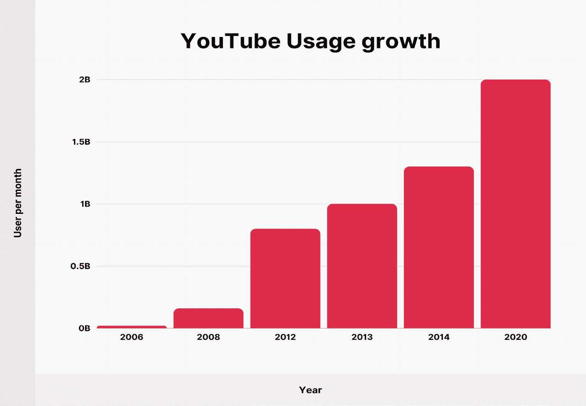

一个条形图显示了 2006 年至 2020 年每月的 YouTube 使用量。随着时间的推移，YouTube 的使用量在增加。2020 年的月活跃用户数最高，达到 20 亿。2006 年的用户数最低，甚至不到 10 亿。

图 9-1

YouTube

视频内容分析，也称为视频分析，是自动分析视频以检测和确定时空事件的能力。

## 问题陈述

在讨论问题陈述之前，我们先列举一些视频分析可能的数据来源。

- YouTube

- 社交媒体

- 体育赛事

- 娱乐行业

- 安防摄像头

- 教学平台

- 手机录像

在当前阶段，视频处理的需求至关重要。面对如此庞大的数据量，人工审核来自监控摄像头等各种来源的视频片段是不可能的。

每个行业都有可以通过视频解决的问题。下面我们来讨论其中的一些用途。


一张桌面和一台平板电脑的照片，正在播放一场足球比赛。视频中有一个足球场、一个球网和球员。在桌面上，足球视频位于软件中央。在平板电脑上，体育视频旁边是软件中的另一组任务。

图 9-2 体育视频分析

- 统计商场、零售店等场所的人数

- 识别视频中个人的年龄和性别等人口统计特征

- 库存规划，用于货架补货提醒

- 利用运动检测进行商店安保和监控

- 停车场用例

- 人脸识别

- 行为检测

- 人员追踪

- 人群检测

- 人数统计/人员存在检测

- 时间管理

- 区域管理与分析/边界检测

- 交通控制系统

- 安保/监控

- 运动检测

- 排队管理

- 居家监控

- [自动车牌识别](https://viso.ai/deep-learning/automatic-number-plate-recognition-anpr/)

- 交通监控

- 车辆计数

- 体育分析，如图 9-2 所示

我们从列表中挑选了几个用例并加以实现。我们将使用 `PyTorch` 实现以下用例。

- 统计零售店的顾客数量

- 识别零售店的热点区域

- 利用运动检测管理安保和监控

- 识别人口统计特征（年龄和性别）

### 方法

我们将视频作为算法的输入。视频基本上包含两个组成部分：

- 视觉内容或一系列图像

- 音频

我们需要从视频中提取这些子组件，以便进行处理并解决用例。本项目我们只关注第一个组成部分。一旦根据用例提取出一系列图像，我们就可以使用算法或预训练模型。图 9-3 展示了视频分析的解决方案方法。

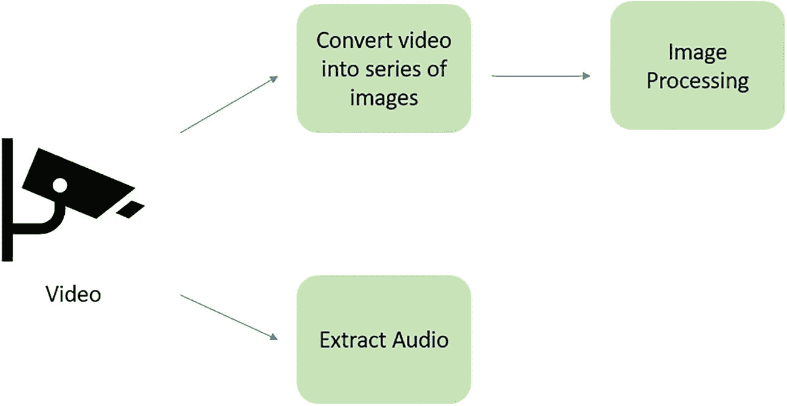

一个包含两个主要步骤的视频分析解决方案方法示意图：将视频转换为一系列图像和提取音频。另一方面，在视频转换为一系列图像之后，还有一个额外的步骤，即图像处理。

图 9-3 解决方案方法

最后一个部分，即图像处理，可以包含与视频分析相关的各种任务。

- **图像分类：** 对从视频中提取的图像进行分类。例如，识别视频中人物的性别。

- **目标检测：** 检测图像中的目标。例如，检测停车场中的汽车。

- **目标跟踪：** 检测到目标后，识别目标的运动轨迹。

- **分割：** 生成边界框以识别图像中的各种目标。

### 实现

让我们看看如何实现这些用例。首先需要安装克隆库。我们使用一个基于 `SFNet` 架构的预训练模型。它包含一个基于编码器-解码器的卷积神经网络和带有注意力机制的双路径多尺度融合网络。图 9-4 展示了人群样本和热力图。

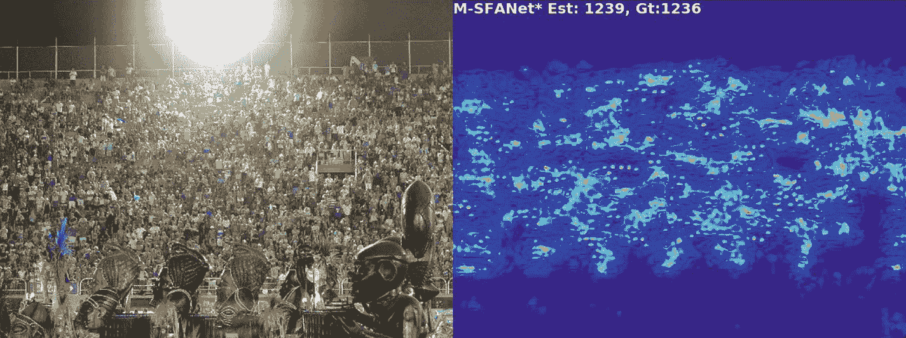

一张人群照片及其热力图。第一张图片中，人群分散在一个高台上。他们面前是各种非洲半身像。高台后面是一排屏幕栏杆和一盏巨大的灯。第二张图片中，有一个巨大的不规则形状。该形状内部有不同色调的小块区域。

图 9-4 人群与热力图

我们还使用 `FaceLib` 库进行人脸检测，这样我们就可以尝试预测年龄和性别。对于图像处理和其他任何操作，我们使用 `OpenCV`。

```python
# 安装所需包
!pip install git+https://github.com/sajjjadayobi/FaceLib.git
!git clone https://github.com/Pongpisit-Thanasutives/Variations-of-SFANet-for-Crowd-Counting #仅模型

# 导入包
import cv2
from PIL import Image
import pandas as pd
import numpy as np
%pylab inline
import matplotlib.pyplot as plt
import matplotlib.image as mpimg
import glob
#import torch
import torch
from torchvision import transforms
#import model
import os
os.chdir('/content/Variations-of-SFANet-for-Crowd-Counting')
from models import M_SFANet_UCF_QNRF
#import facelib
from facelib import FaceDetector, AgeGenderEstimator
```

#### 数据

我们使用来自 YouTube 的几个视频。下载这些视频并保存在本地。

1.  这是一个零售店的视频链接。

    [`https://www.youtube.com/watch?v=KMJS66jBtVQ`](https://www.youtube.com/watch%253Fv%253DKMJS66jBtVQ)

2.  这是一个停车场的视频链接。

    [`https://www.youtube.com/watch?v=eE2ME4BtXrk`](https://www.youtube.com/watch%253Fv%253DeE2ME4BtXrk)

下载这些视频，然后我们将它们上传到 Google Colab 以进行进一步分析。

#### 将所需视频上传到 Google Colab

下一步，我们需要将视频上传到 Google Colab。

```python
# 上传视频
from google.colab import files
#上传
files.upload()
files.upload()
```

我们还需要上传一个模型权重文件，稍后将用到它。从以下链接下载：[`https://drive.google.com/file/d/1oaXIBVg-dgyqRvEXsYDiJh5GNzP35vO-/view`](https://drive.google.com/file/d/1oaXIBVg-dgyqRvEXsYDiJh5GNzP35vO-/view)

将此模型的权重文件上传到 Colab：

```python
print('Upload model weights')
files.upload()
```

#### 将视频转换为一系列图像

如前所述，视频分析的核心就是从视频生成帧。其余步骤与图像处理相同。

让我们构建一个函数，输入视频后生成图像。

```python
#生成图像的函数
def video_to_image(path, folder):
global exp_fld

# 导入视频
vidcap=cv2.VideoCapture(path)
exp_fld=folder

# 错误处理
try:
if not os.path.exists(exp_fld):
os.makedirs(exp_fld)
except OSError:
print ('Error: Creating directory of data')
Count = 0
sec = 0
frameRate = 1 # 视频的秒数
while(True):
vidcap.set(cv2.CAP_PROP_POS_MSEC,sec*1000)
hasFrames,image = vidcap.read()
sec = sec + frameRate
sec = round(sec, 2)

# 导出图像
if hasFrames:
name='./' + exp_fld +'/frame'+str(Count) + '.jpg'
cv2.imwrite(name, image)     # 将帧保存为 JPG 文件
Count +=1
else:
break
return print("Image Exported")
```

#### 图像提取

现在，使用我们之前创建的函数为视频生成帧。我们对两个视频都执行此操作。

```python
#设置路径
os.chdir('/content')

# 为第一个视频提取并存储图像
video_to_image('HD CCTV Camera video 3MP 4MP iProx CCTV HDCCTVCameras.net retail store.mp4', 'crowd')

# 为停车场视频提取图像
video_to_image('AI Security Camera with IR Night Vision (Bullet IP Camera).mp4', 'movement')
Image Exported
Image Exported
```

#### 数据准备

现在，让我们执行一些快速的数据准备步骤。与结构化数据相比，在进行图像处理时，准备和清理数据更为简单。这里的关键步骤是调整图像大小。原始图像可以是任意尺寸或像素，但模型总是在特定尺寸上进行训练。因此，我们需要调整输入图像的大小以匹配模型。

以下是调整图像大小的函数。

```python
# 调整图像大小
def img_re_sizing(dnst_mp, image):

# 归一化
dnst_mp = 255*dnst_mp/np.max(dnst_mp)
dnst_mp= dnst_mp[0][0]
image= image[0]

# 创建空图像
result_img = np.zeros((dnst_mp.shape[0]*2, dnst_mp.shape[1]*2))

# 遍历每张图像
for i in range(result_img.shape[0]):
for j in range(result_img.shape[1]):
result_img[i][j] = dnst_mp[int(i / 2)][int(j / 2)] / 4
result_img  = result_img.astype(np.uint8, copy=False)

# 输出
return result_img
```

现在我们已经完成了视频采集、图像提取和尺寸调整，接下来让我们解决实际用例。

首先，我们来统计顾客数量并生成热力图。我们需要统计这家零售店的顾客数量（见图 9-5）。

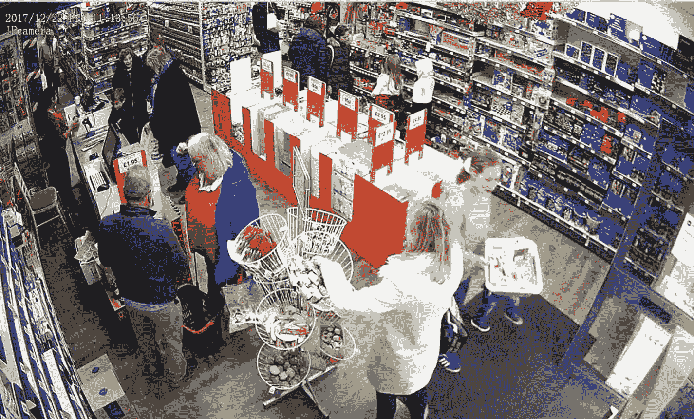

一张从安防摄像头拍摄的零售店俯视图。店内设有产品货架。一名女性员工站在收银台后面。一位女士正要离开门口。一位老先生和老太太在收银台附近讨论着什么。一位女士双手扶着门边装有商品的购物篮。

图 9-5

零售店

店铺的收入取决于有多少人光顾。显而易见，人流量越大，购买的可能性就越高。这就是为什么店铺想要了解访客数量，以便预测销售额。许多决策都基于这一信息，例如店铺规模、库存规划等。

#### 识别零售店的热点区域

合理摆放库存以最大化购买量至关重要。我们可以利用店内的热点区域来做出这一决策。我们还可以利用这些信息识别热门商品。通过热力图概念，我们可以获取这类信息。热力图会生成顾客停留时间最长的区域，这有助于判断该区域商品的需求量。图 9-6 展示了一个热力图示例。

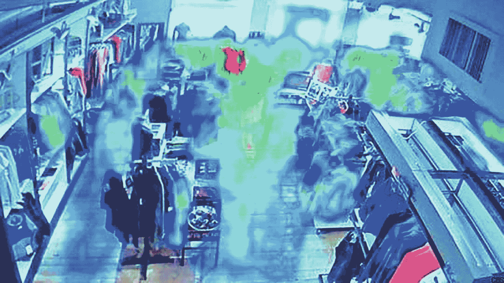

一张零售店热力图的截图。左右两侧各有一排服装货架，中间有两排。服装以不同色块散布在店内。部分色块呈人形。在绿色色块中混杂着一小片红色区域。

图 9-6

热力图

让我们编写几个函数来生成热力图并统计人数。以下函数将接收图像并生成热力图。

```python
# 生成热力图的函数
def generate_dstys_map(o, dsty, cc, image_location):

# 定义图形
fgr_im=plt.fgr_imure()

# 定义尺寸
col = 2
rws = 1
X = o

# 求和
add = int(np.sum(dsty))
dsty = image_re_sizing(dsty, o)

# 添加原始图像和新生成的热力图图像
for i in range(1, col*rws +1):

# 生成原始图像
if i == 1:
image = X
fgr_im.add_subplot(rws, col, i)

# 设置坐标轴
plt.gca().set_axis_off()
plt.margins(0,0)

# 定位器
plt.gca().xaxis.set_major_locator(plt.NullLocator())
plt.gca().yaxis.set_major_locator(plt.NullLocator())

# 调整子图
plt.subplots_adjust(top = 1, bottom = 0, right = 1, left = 0, hspace = 0, wspace = 0)

# 显示图像
plt.imshow(image)

# 生成密度图像
if i == 2:
image = dsty
fgr_im.add_subplot(rws, col, i)

# 设置坐标轴
plt.gca().set_axis_off()
plt.margins(0,0)

# 定位器
plt.gca().xaxis.set_major_locator(plt.NullLocator())
plt.gca().yaxis.set_major_locator(plt.NullLocator())

# 调整子图
plt.subplots_adjust(top = 1, bottom = 0, right = 1, left = 0, hspace = 0, wspace = 0)

# 添加计数
plt.text(1, 80, 'M-SegNet* 估计值: '+str(add)+', 真实值:'+str(cc), fontsize=7, weight="bold", color = 'w')

# 显示图像
plt.imshow(image)#, cmap=CM.jet)

# 带位置信息的图像名称
image_nm = image_location.split('/')[-1]
image_nm = image_nm.replace('.jpg', '_heatpmap.png')

# 保存图像
plt.savefgr_im(image_location.split(image_nm)[0]+'seg_'+image_nm, transparent=True, bbox_inches='tight', pad_inches=0.0, dpi=200)
```

以下函数将接收图像作为输入并统计人数。它还会触发我们刚刚创建的热力图函数。最后，它会输出人数、图像密度以及密度图。

```python
# 统计人数
def get_count_people(image):

# 简单预处理。
trans = transforms.Compose([transforms.ToTensor(),
transforms.Normalize([0.485, 0.456, 0.406], [0.229, 0.224, 0.225])
])

# 获取图像的高度和宽度
img = Image.open(image).convert('RGB')
height, width = img.size[1], img.size[0]
height = round(height / 16) * 16
width = round(width / 16) * 16

# 调整图像大小
img_den = cv2.resize(np.array(img), (width,height), cv2.INTER_CUBIC)

# 变换
img = trans(Image.fromarray(img_den))[None, :]

# 定义模型
model = M_SFANet_UCF_QNRF.Model()

# 加载模型
model.load_state_dict(torch.load('/content/best_M-SFANet__UCF_QNRF.pth',
map_location = torch.device('cpu')))

# 评估模型
model.eval()
dnst_mp = model(img)

# 最终计数
count = torch.sum(dnst_mp).item()

# 返回计数、密度和密度图
return count,img_den,dnst_mp
```

至此，我们已经创建了用于统计人数和生成热力图的函数。接下来，让我们将这些函数应用于从视频中提取的图像上。

在此之前，我们先导入图像。

#### 导入图像

# 从路径中获取所有图像
```python
image_location = []
path_sets = ['/content/crowd']

# 加载所有图像
for path in path_sets:
    for img_path in glob.glob(os.path.join(path, '*.jpg')):
        image_location.append(img_path)
image_location[:3]
```
输出：
```
['/content/crowd/frame91.jpg',
'/content/crowd/frame12.jpg',
'/content/crowd/frame26.jpg']
```

### 获取人群计数

让我们遍历之前通过函数导入的每一张图像。最后，我们将计数和图像 ID 附加起来，创建一个作为输出的数据框。

```python
# 获取每张图像中的人数

# 定义空列表
list_df = []

# 遍历每张图像
for i in image_location :
    count, img_den, dnst_mp = get_count_people(i)
    generate_dens_map(img_den, dnst_mp.cpu().detach().numpy(), 0, i)
    list_df = list_df + [[i,count]]

# 创建包含图像 ID 和计数的数据框
df = pd.DataFrame(list_df,columns=['image','count'])

# 排序并显示
df.sort_values(['image']).head()
```

图 9-7a 展示了模型的输出。它给出了每一帧中的顾客数量。这让我们了解到每天有多少顾客光顾。让我们对这个预测结果进行一些基本的统计分析。

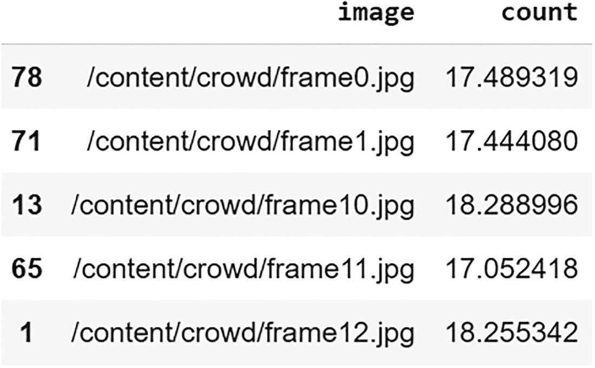

模型输出的表格。它提供了每帧的顾客数量。表格有两列五行。列标题为图像和计数。行条目分别为 78、71、13、65 和 1。

```python
df.describe()
```

```python
import seaborn as sns
sns.histplot(data=df['count'])
```

从图 9-7b 和 9-7c 中我们可以观察到，平均而言，任何时候店内都有 15 名顾客。

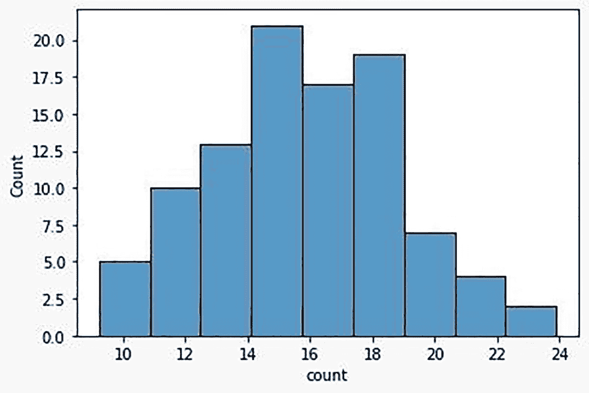

一张柱状图描绘了不同帧中的顾客数量。水平轴标记为计数，数值从 10 到 24，步长为 2。垂直轴标记为计数，数值从 0.0 到 20.0，步长为 2.5。在 14 到 16 之间的帧中，顾客数量最高，为 20.0。最低值在 22 到 24 之间，为 2.0。

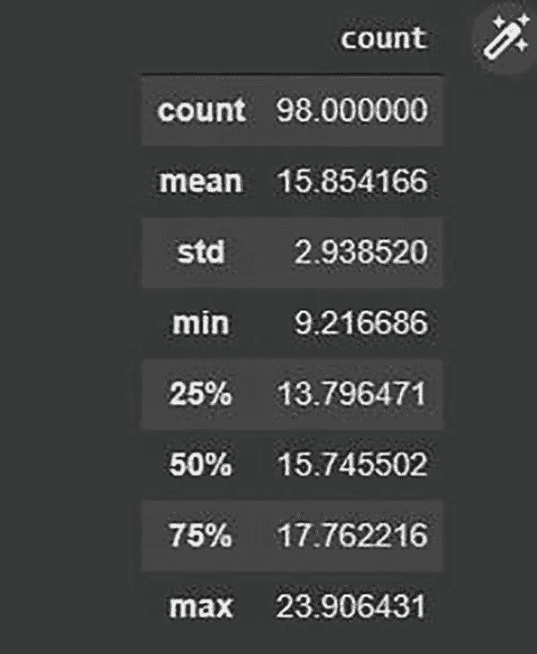

一个用于统计任意时刻顾客数量的软件输出截图。数据如下：计数 - 98.000000，平均值 - 15.854166，标准差 - 2.938520，最小值 - 9.216686，25%分位数 - 13.796471，50%分位数 - 15.745502，75%分位数 - 17.762216，最大值 - 23.906431。

让我们也看看生成的一些热力图。图 9-8 和 9-9 展示了特定时间点的热力图。左侧是原始图像，右侧是热力图。白色和黄色的斑块表示该特定区域的顾客密度。利用这些信息，我们可以轻松识别店内的热点区域。


一张商店的照片及其热力图。商店内部两侧和中间都有过道商品。一些人在浏览商品。一位女士站在柜台前，另外两位女士站在她面前。两位男士站在收银台附近。右侧的热力图中，平面的左上方散布着不同色调的小斑块。


一张商店的照片及其热力图。左侧图像中，商店两侧和中间有过道商品，前面有几个人。一位女士站在柜台前，另一位女士站在她面前。一位女士站在门边，向外张望。右侧图像中，到处都有不同色调的斑块。

这是一个我们看到了计数和密度图的例子。在下一个用例中，让我们看看如何使用相同的概念进行安保和监控。

### 安保与监控

在本世纪，安全已成为一个重大问题。视频监控已经存在多年，但其实现方式正在发生变化。这其中有很多自动化的空间。借助人工智能，这正在成为现实。见图 9-10。


一张男子进行人工监控的照片。该男子穿着一件连体衣，背上印有“SECURITY”字样。他坐在三台电脑前，电脑播放着不同地点不同角度的监控录像。

我们可以通过视频处理检测人的移动，来分析受限或敏感区域是否有任何动静。这样，真人就不必 24*7 地持续盯着监控画面。一旦有任何移动，系统就可以向负责安保的人员发出警报。

可以训练模型来预测不良事件。使用此类软件持续监控事件将节省大量人力工时，并降低安全风险。

让我们看看我们上传的第二个视频，并检测其中的移动。

```python
# 从路径中获取所有图像
image_location = []
path_sets = ['/content/movement']

# 加载停车场视频的所有图像
for path in path_sets:
    for img_path in glob.glob(os.path.join(path, '*.jpg')):
        image_location.append(img_path)
image_location[:3]

# 获取每张图像中的人数
list_df = []
```

现在所有图像都已加载，下一步是遍历每张图像，查看禁入区域中是否有人。

让我们将这个“是否有人”的信息捕获到数据框的一个新列中，命名为 `movement`。

```python
# 检查视频的每一帧是否有任何移动
for i in image_location :
    count, img_den, dnst_mp = get_count_people(i)
    generate_dens_map(img_den, dnst_mp.cpu().detach().numpy(), 0, i)
    list_df = list_df + [[i,count]]

# 将数据保存到数据框
detected_df = pd.DataFrame(list_df,columns=['image','count'])
detected_df['movement'] = np.where(detected_df['count'] > 3 ,'yes','no')
detected_df.filter(items = [45,56,53], axis=0)
```

图 9-11 展示了输出结果。正如我们观察到的，`frame33` 在 `movement` 列中报告了 `yes`，这意味着在该特定秒数内有人存在。

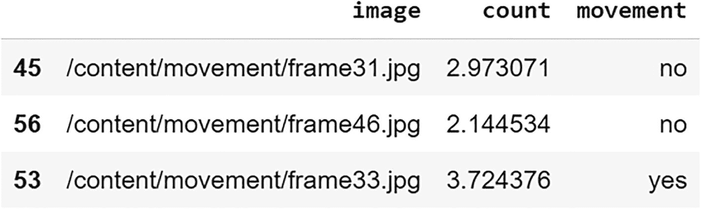

一个输出表格，描绘了在特定帧是否观察到移动。表格有 4 列 3 行。列标题为图像、计数和移动。行索引为 45、56 和 53。在第 3 行，3.724376 秒处，观察到了移动。

一旦 `movement` 变量变为 `yes`，我们就可以提醒系统触发相应的权限部门。

让我们看几个观察到移动的例子。

```python
# 打印移动为‘yes’的图像
image = '/content/movement/frame25.jpg'
Image.open(image)
```

```python
image = '/content/movement/frame27.jpg'
Image.open(image)
```

图 9-12 和 9-13 展示了帧中有人且成功检测到移动的图像。在下一节中，我们将看到如何在示例视频中检测年龄/性别。

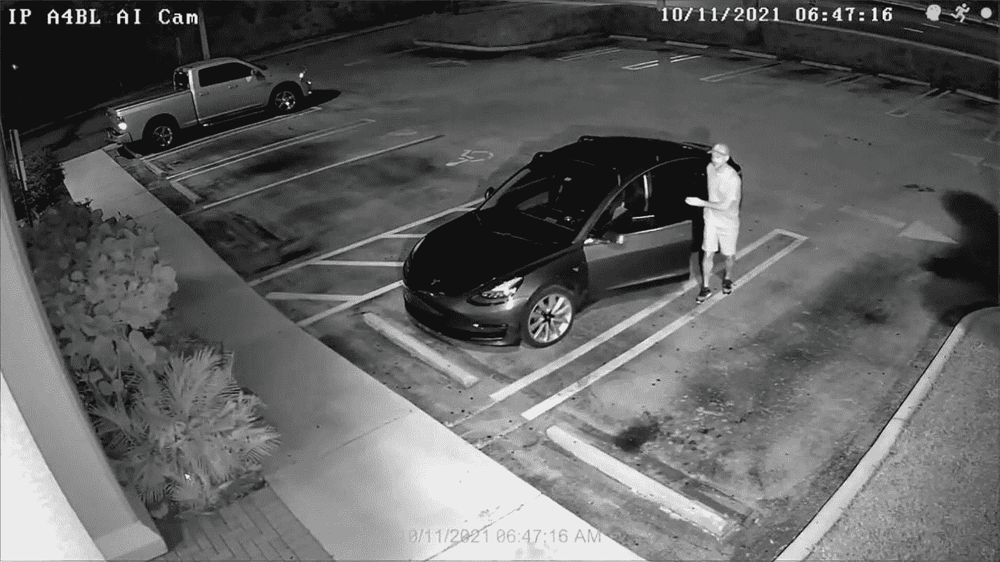

一张来自监控摄像头的停车场截图。在方形停车场内有两辆车：最左边一辆皮卡，中心附近停着一辆 SUV。SUV 旁边有一个穿着 T 恤、戴着帽子、穿着短裤的男人，他的手放在半开的驾驶座车门上。

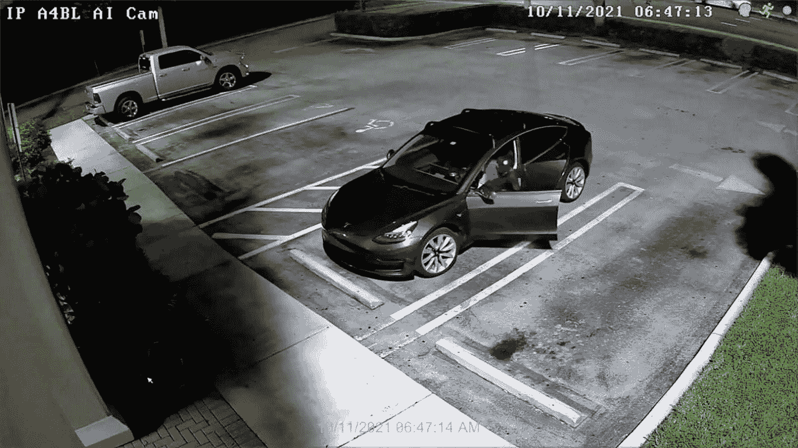

一张来自监控摄像头的停车场区域截图。停车场是一个方形区域，四周有灌木丛。里面停着两辆车：最左边一辆皮卡，中心附近一辆 SUV。SUV 内有一个男人正在打开车门，从车上下来。

### 识别人口统计特征（年龄与性别）

大多数营销活动都依赖于目标客户的人口统计特征。如果我们能从商场中的实时视频中确定年龄和性别，就可以利用这些信息来定位合适的营销活动。

让我们尝试使用之前提取的图像来检测年龄和性别。

```python
# 导入函数
face_detector = FaceDetector()
age_gender_detector = AgeGenderEstimator()

# 读取图像
img = '/content/movement/frame0.jpg'
image = cv2.imread(img, cv2.IMREAD_UNCHANGED)
Image.open(img)
```

图 9-14 展示了将用于检测性别和年龄的示例图像。

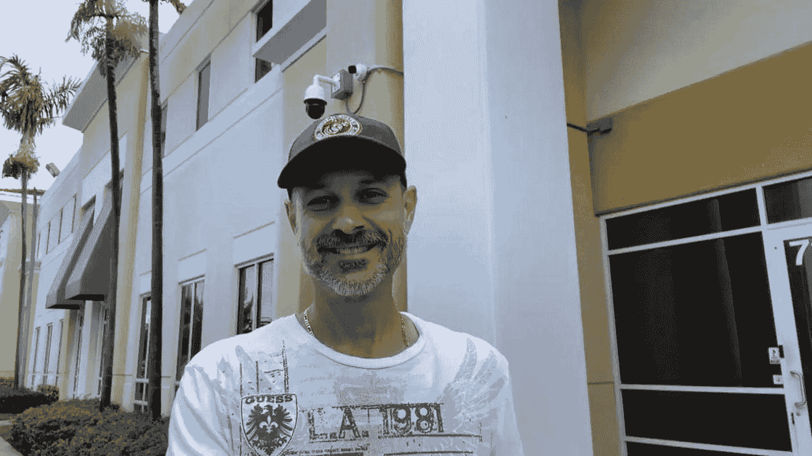

一位中年男性的正面半身照。该男子面带微笑，头戴蓝色帽子，身穿白色衬衫。

```python
# 检查性别
faces, boxes, scores, landmarks = face_detector.detect_align(image)
genders, ages = age_gender_detector.detect(faces)
print(genders, ages)
```
输出：
```
['Male'] [32]
```

模型预测了此图像中人物的年龄和性别：
- 年龄为 32 岁
- 性别为男性

## 总结

我们探索了视频分析的多种用例，并挑选了四个用例进行实现。文中讨论了解决方案，以及用于实现该方案的库。

一个关键方面是将视频转换为图像，然后对这些信息执行传统的图像处理。主要挑战在于视频会生成海量图像，处理这些图像需要时间和资源。在许多情况下，为了充分利用预测结果，所有处理都需要实时完成。

我们讨论了一些基本用例，但还有海量的用例有待探索、学习和实现。同时，也存在许多处于研究阶段的技术挑战有待解决。既然我们已经为不同的应用学习并构建了一些计算机视觉模型，下一章将深入探讨计算机视觉模型的输出，并讨论计算机视觉的可解释人工智能。