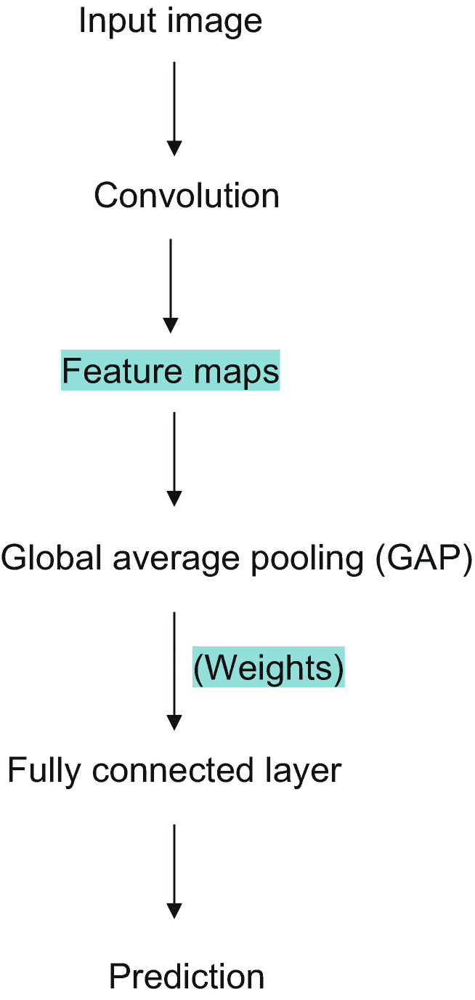
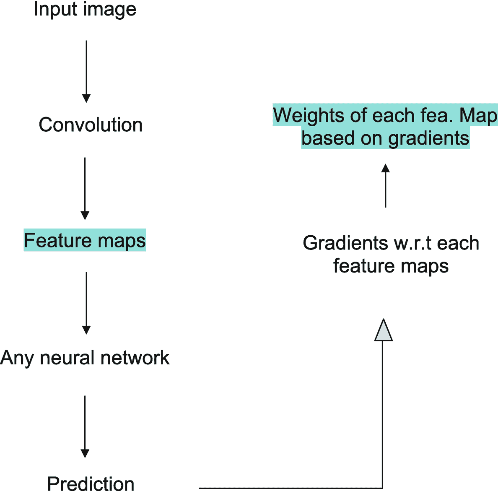
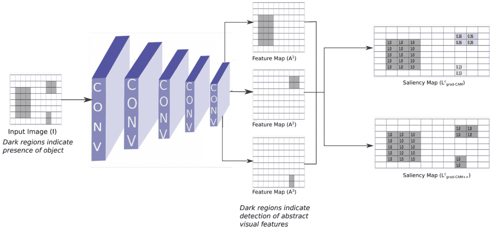
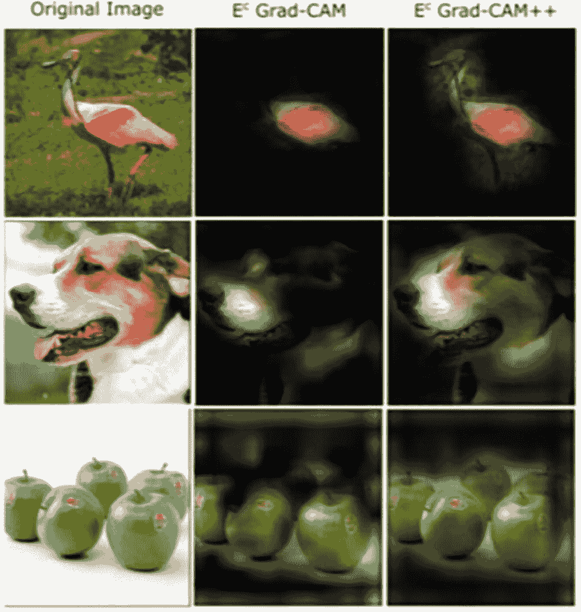
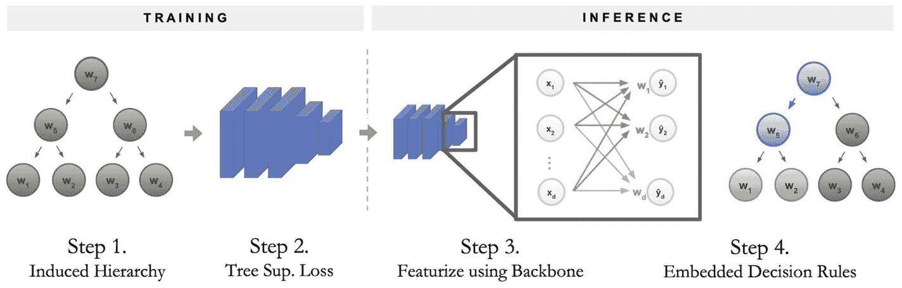
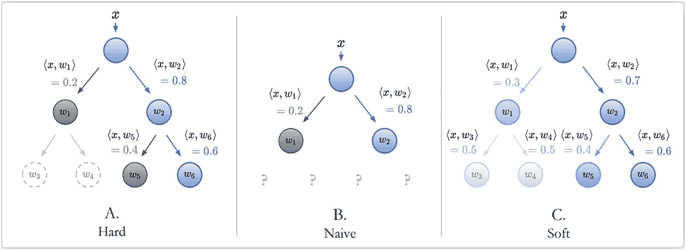
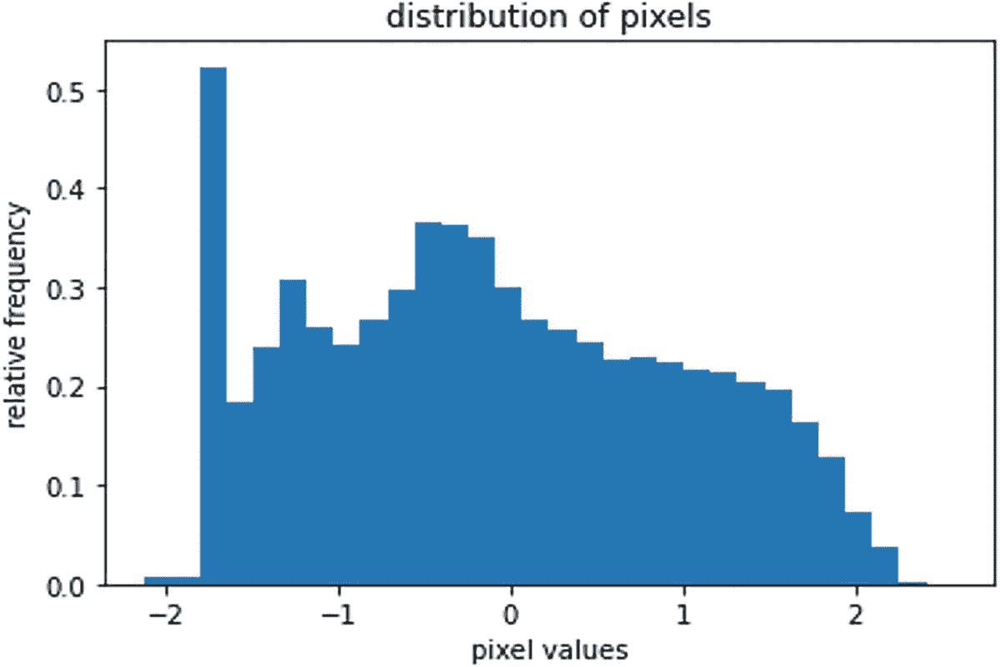
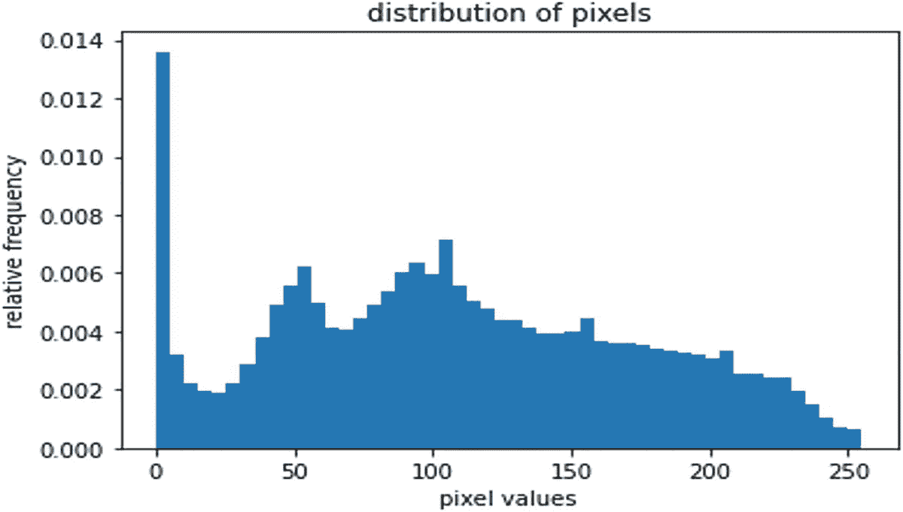
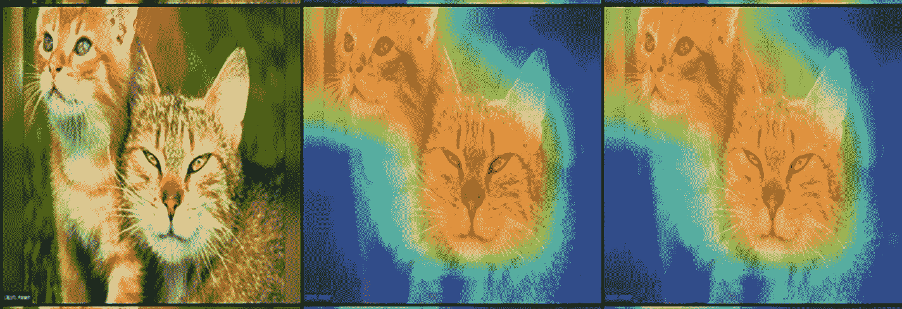

# 10. 计算机视觉的可解释人工智能

大多数机器学习和深度学习模型缺乏解释和解读结果的方法。由于深度学习模型的动态特性以及不断涌现的最先进模型，当前的模型评估主要基于准确率分数。这使得机器学习和深度学习成为黑盒模型。这导致在应用模型时缺乏信心，并且对生成的结果缺乏信任。有多个库可以帮助我们解释结构化数据的模型，例如 `SHAP` 和 `LIME`。本章将解释计算机视觉模型的输出。

以下是近年来为计算机视觉提出的一些白盒算法：

- `CAM`
- `Grad-CAM`
- `Grad-CAM++`
- 逐层相关性传播（`LRP`）
- `SmoothGRAD`
- `RISE`
- 基于神经网络的决策树（`NBDT`）

本章重点介绍 `Grad-CAM`、`Grad-CAM++` 和 `NBDT`。在继续实现之前，我们先深入探讨以下概念。

## Grad-CAM

类别激活映射（`CAM`）是一种提取热力图的技术，该热力图突出显示影响结果的空间信息。`CAM` 架构如图 10-1a 和 10-1b 所示。



`CAM` 架构的流程图。步骤如下：输入图像，卷积，特征图，带权重的全局平均池化，全连接层，预测。权重和特征图被突出显示。

图 10-1a

`CAM` 架构

生成的特征图通过全局平均池化来提取权重。权重再通过全连接层输出分类结果。

架构中突出显示的部分，即特征图和权重，用于生成预测类别的热力图。

特征图的加权和 = ∑k (wk *Ak^(class))

其中 `k` 代表最后一个卷积层的特征图。

`Grad-CAM` 在特征图生成步骤之前与 `CAM` 类似。在此步骤之后，可以添加任何神经网络（例如 `VGG`、`ResNet` 等），这些网络必须是可微分的，以便获取梯度。根据预测结果，计算每个特征图对应的梯度。使用梯度在特征图维度（`i`，`j`）的宽度和深度上的“全局平均池化”，计算每个特征图的神经元重要性（alpha 值/权重）。`Grad-CAM` 架构如图 10-1b 所示。突出显示的组件相乘以生成热力图。



`CAM` 架构的流程图。步骤如下：输入图像，卷积特征图，任意神经网络，预测到每个特征图的梯度，基于梯度的每个特征图的权重。

图 10-1b

`CAM` 架构

## Grad-CAM++

这与 `Grad-CAM` 算法类似，但在反向传播步骤上有所不同。简单来说，`Grad-CAM` 在反向传播过程中使用一阶梯度。而在 `Grad-CAM++` 中，使用二阶梯度，因此过程更加复杂。

在 `Grad-CAM` 中，与具有高空间信息的特征图相比，空间信息较少的特征图在最终热力图中不被重视。包含多个对象或单个对象的图像无法在热力图中被检测到，导致准确率和可解释性降低。

在 `Grad-CAM++` 中，通过在最终热力图中赋予所有特征图重要性来解决此问题。图 10-2 展示了整体架构。



`Grad-CAM++` 架构的流程图。步骤如下：输入图像（深色区域表示对象存在）；卷积层堆叠；特征图 `A` 到第一次方，`A` 的平方和 `A` 的立方（深色区域表示检测到抽象视觉特征）；两组显著性图 `L` 到下标为 `C` 的 `grad-cam`。

图 10-2

`Grad-CAM++` 架构

图 10-3 展示了 `Grad-CAM` 和 `Grad-CAM++` 输出结果的差异。



一张由九张图像组成的拼贴图，分别代表一只鸟、一只狗和几个青苹果各三张图像。这些图像按原始图像、`E` 到 `C` `grad-cam` 和 `E` 到 `C` `grad-cam++` 分组。在 `grad-cam` 中，图像的部分区域可见。在 `grad-cam++` 中，图像的大部分区域可见。

图 10-3

`Grad-CAM` 和 `Grad-CAM++` 的输出结果

## NBDT

NBDT 代表基于神经网络的决策树。许多算法都是为了模型的可解释性而提出的，但结果的可解释性概念却被忽略了。

-   **可解释性（Explainability）：** 理解模型的内部机制，即其内部工作原理。
-   **可解释性（Interpretability）：** 理解结果上的因果关系，即特定结果是基于什么依据生成的。

决策树是白盒模型，因为它们易于理解节点是如何分裂的。这使得决策树具有可解释性（Explainable）。同时，也很容易知道输入变化对预测输出的影响。这使得决策树具有可解释性（Interpretable）。

与深度学习模型相比，决策树的短板在于模型精度。NBDT 内置了决策树（用于可解释性和可解释性）和神经网络（用于精度）的组合。图 10-4 展示了 NBDT 的流程。



NBDT 的流程图。步骤如下：步骤 1：诱导层次结构。步骤 2：树监督损失。步骤 3：使用主干网络提取特征。步骤 4：嵌入决策规则。步骤 1 和 2 归为训练阶段。步骤 3 和 4 归为推理阶段。

图 10-4: NBDT 流程

### 步骤 1

此步骤训练一个用于图像分类的 CNN 模型。提取每个类别预测的权重（`w1`、`w2`……），其中 `w1` 代表用于预测类别 1 的隐藏权重向量。

最近的向量（也称为叶子节点）被聚类以形成中间节点。这些中间节点被不断聚类，直到达到根节点。这种层次结构被称为*诱导层次结构*。之后，我们将神经网络转换为决策树。

中间节点的名称基于 `WordNet` 模块提取。（例如，狗和猫是叶子节点。一个中间节点可能是“动物”，这是从 `WordNet` 中提取的。）

### 步骤 2

此步骤计算分类损失并微调模型。分类损失可以通过两种模式计算。

-   硬模式
-   软模式

这两种模式的区别如图 10-5 所示。



三个标记为 a 到 c 的层次结构图。A 标题为硬模式，有 7 个节点，x 为顶层节点，w1 和 w2 为第二层节点。B 标题为朴素模式，有 3 个节点，x 为顶层节点，w1 和 w2 为第二层节点，底层有 4 个问号节点。C 标题为软模式，有 7 个节点，x 为顶层节点，w1 和 w2 为第二层节点。

图 10-5: 硬模式与软模式的区别

`损失（总） = 损失（原始） + 损失（硬或软）`

将硬模式或软模式的损失添加到原始损失（来自 CNN）中，以得到最终损失。

### 步骤 3 和 4

根据计算出的最终损失，对模型进行微调，并更新决策树（层次结构）。

## Grad-CAM 和 Grad-CAM++ 实现

首先我们讨论在单张图像上实现 Grad-CAM 和 Grad-CAM++，然后介绍在单张图像上实现 NBDT。

### 在单张图像上实现 Grad-CAM 和 Grad-CAM++

步骤 1：对输入图像执行图像变换（见图 10-6）。


一张草地上两只棕色猫的照片，它们有着黄色的眼睛和黄色的皮毛。

图 10-6: 对输入图像执行图像变换

这包括：



一个右偏的区域，相对频率与像素值的关系图展示了像素的分布。最高和最低频率分别为 0.6 和 0.0。数值为估计值。

图 10-8: 变换后



一个右偏的区域，相对频率与像素值的关系图展示了像素的分布。最高和最低频率分别为 0.0013 和 0.001。数值为估计值。

图 10-7: 变换前

-   根据步骤 2 中的架构调整图像大小。
-   将调整大小后的图像转换为张量，以便使用 PyTorch 进行更快的计算。
-   对图像进行归一化，以在训练过程中加快收敛速度。见图 10-7 和 10-8。

```
#Transform input Image- Resize before passing to the model
resized_torch_img = transforms.Compose([transforms.Resize((224, 224)),transforms.ToTensor()])(pil_img).to(device)
#Image normalization
normalized_torch_img = transforms.Normalize([0.485, 0.456, 0.406], [0.229, 0.224, 0.225])(resized_torch_img)[None]
```

步骤 2：加载神经网络架构（本例中使用预训练权重）。测试了以下预训练模型以比较其结果：

-   `AlexNet`
-   `VGG16`
-   `ResNet101`
-   `DenseNet161`
-   `SqueezeNet`

```
#Supported architectures in pytorch-gradcam library
model_alexnet = models.alexnet(pretrained=True)
model_vgg = models.vgg16(pretrained=True)
model_resnet = models.resnet101(pretrained=True)
model_densenet = models.densenet161(pretrained=True)
model_squeezenet = models.squeezenet1_1(pretrained=True)
```

步骤 3：选择神经网络中的反馈层以反向传播梯度。选择首选层用于反向传播梯度。

```
#Storing the models as dictionary item with the respective layers where gradients will be taken
loaded_configs = [
dict(model_type='alexnet', arch=model_alexnet, layer_name='features_11'),
dict(model_type='vgg', arch=model_vgg, layer_name='features_29'),
dict(model_type='resnet', arch=model_resnet, layer_name='layer4'),
dict(model_type='densenet', arch=model_densenet, layer_name='features_norm5'),
dict(model_type='squeezenet', arch=model_squeezenet, layer_name='features_12_expand3x3_activation')]
```

步骤 4：加载 Grad-CAM 和 Grad-CAM++ 模型。

两个模型都从 `pytorch-gradcam` 库中加载。

```

# Load the config to the "Grad CAM" and "Grad CAM ++"

# Only "Grad CAM" and "Grad CAM ++" available in this library
for model_config in loaded_configs:
model_config['arch'].to(device).eval()
#Save "Grad CAM" and "Grad CAM ++" instances for all available architectures(loaded_configs)
cams = [[cls.from_config(**model_config) for cls in (GradCAM, GradCAMpp)] for model_config in loaded_configs]
```

步骤 5：传入变换后的输入图像并生成热力图。

将变换后的图像传入两个模型，并以热力图的形式生成结果。这些热力图将突出显示图像中的关键区域。

```
#Load the normalized image to the "gradcam , gradcam ++" function under each architecture to produce heatmaps and result
images = []
for gradcam, gradcam_pp in cams:
mask, _ = gradcam(normalized_torch_img)
heatmap, result = visualize_cam(mask, resized_torch_img)
mask_pp, _ = gradcam_pp(normalized_torch_img)
heatmap_pp, result_pp = visualize_cam(mask_pp, resized_torch_img)
images.extend([resized_torch_img.cpu(),result,result_pp])
#Grid the original image, result from gradcam, result from gradcam++
grid_image = make_grid(images, nrow=3)
```

步骤 6：结合输入图像和热力图，可视化分类所选择的重要特征。

将输出张量转换为 Python 可读的图像以可视化结果。以下输出是使用 DenseNet 预训练权重生成的。

输入图像 >> Grad-CAM 输出 >> Grad-CAM++ 输出



一张草地上两只棕色猫的照片，它们有着黄色的眼睛和黄色的皮毛。第一张是自然照片。第二张和第三张像是猫脸的热力图。

图 10-9: 输出

### 单张图像上的 NBDT 实现

**步骤 1：** 对输入图像执行图像变换，类似于 Grad-CAM。

```python

# 加载图像并执行图像变换（调整大小、中心裁剪、转换为张量、归一化）的函数
def load_image():
    assert len(sys.argv) > 1
    im = load_image_from_path("image_path")
    transform = transforms.Compose([
        transforms.Resize(32),
        transforms.CenterCrop(32),
        transforms.ToTensor(),
        transforms.Normalize((0.4914, 0.4822, 0.4465), (0.2023, 0.1994, 0.2010)),
    ])
    x = transform(im)[None]
    return x
```

**步骤 2：** 使用预训练模型加载 NBDT 模型。为了找到模型层次结构，使用了 `wordnet` 库。

```python

# 加载带有预训练权重的 NBDT 模型的函数
def load_model():
    model = wrn28_10_cifar10()
    model = HardNBDT(
        pretrained=True,
        dataset='CIFAR10',
        arch='wrn28_10_cifar10',
        model=model)
    return model
```

**步骤 3：** 从 HardNBDT 模型预测输出。将预测结果和层次结构转换为已知类别。

```python

# 输出分类结果和层次结构的函数
def hierarchy_output(outputs, decisions):
    _, predicted = outputs.max(1)
    predicted_class = DATASET_TO_CLASSES['CIFAR10'][predicted[0]]
    print('预测类别:', predicted_class,
          '\n\n 层次结构:',
          ', '.join(['\n{} ({:.2f}%)'.format(info['name'], info['prob'] * 100)
                     for info in decisions[0]][1:]))
```

**步骤 4：** 从决策树输出预测类别和层次结构。

```python
def main():
    model = load_model()
    x = load_image()
    outputs, decisions = model.forward_with_decisions(x)
    hierarchy_output(outputs, decisions)

if __name__ == '__main__':
    main()
```

结果如下：

```
预测类别: horse
层次结构:
animal (99.52%),
ungulate (98.52%),
horse (99.71%)
```

## 总结

可解释性在未来扮演着重要角色，因为每个人都想了解幕后发生了什么。业务领导者将很难信任 AI 模型。如果无法解释结果，所有 AI 解决方案都是不完整的，计算机视觉领域也不例外。

考虑到这一点，我们在本章中介绍了各种可解释性库。我们学习了 CAM、Grad-CAM 和 Grad-CAM++ 的概念。与此同时，我们使用预训练模型和预测实现了可解释性。这是对可解释性的一个简单介绍；还有很多东西需要学习和实现。

