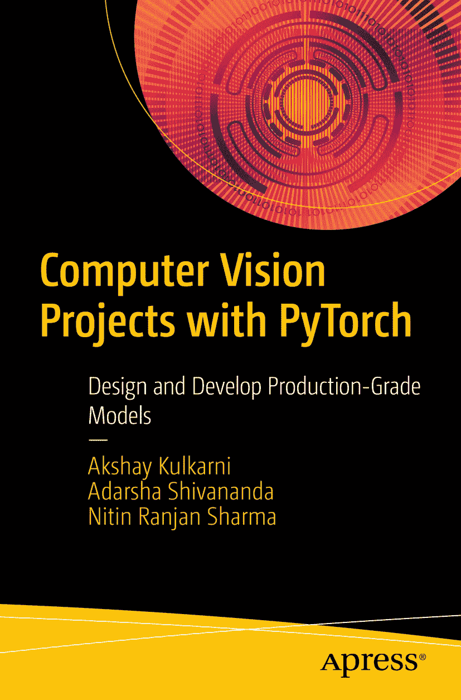

ISBN 978-1-4842-8272-4 e-ISBN 978-1-4842-8273-1 [`doi.org/10.1007/978-1-4842-8273-1`](https://doi.org/10.1007/978-1-4842-8273-1) © Akshay Kulkarni, Adarsha Shivananda, and Nitin Ranjan Sharma 2022 Apress Standard 本出版物中使用的通用描述性名称、注册商标名称、商标、服务标记等，即使未作特别声明，也不意味着这些名称不受相关保护性法律和法规的约束，因此可供一般性使用。出版商、作者和编辑假定本书在出版之日所包含的建议和信息是真实且准确的。出版商、作者或编辑均不对本书所含材料或可能存在的任何错误或遗漏提供明示或暗示的担保。出版商对已出版地图中的管辖权主张和机构归属保持中立。

本 Apress 印记由注册公司 APress Media, LLC（Springer Nature 旗下）出版。

注册公司地址为：1 New York Plaza, New York, NY 10004, U.S.A.

*献给我们家人。*

## 引言

本书探讨了计算机视觉领域的多种流行方法，旨在揭开其神秘面纱。我们使用`PyTorch`框架，因为它被研究人员、开发者和初学者广泛用于利用深度学习的力量。本书探讨了多个计算机视觉问题，并向您展示如何解决它们。您将了解到一些最关键的挑战，并附有适合初级和中级 Python 用户的`PyTorch`实践代码，以及用于解决这些业务问题的各种方法。

与我们在本书中介绍的重要概念相关的生产级代码将帮助您快速上手。这些代码片段可以在本地系统上运行，无论是否配备 GPU（图形处理器），也可以在云平台上运行。

我们将分阶段向您介绍图像处理的概念，从第一章的计算机视觉基础概念开始。我们还将深入深度学习领域，并解释如何为视觉相关任务开发模型。您将快速了解`PyTorch`，为本书后续章节中介绍的示例业务挑战做好准备。我们探讨了革命性的卷积神经网络的概念，以及诸如`VGG`、`ResNet`、`YOLO`、`Inception`、`R-CNN`等架构。

本书深入探讨了与图像分类、目标检测和分割相关的业务问题。我们探索了超分辨率和 GAN 架构的概念，这些概念在许多行业中得到应用。您将学习图像相似度和姿态估计，这有助于处理无监督问题集。还有与视频分析相关的主题，这将帮助您培养利用基于图像和时间的帧概念进行思考的思维方式。此外，本书最后讨论了如何向业务合作伙伴解释这些深度学习模型。本书旨在成为那些致力于解决计算机视觉业务问题的人士的完整指南。

## 关于作者 关于技术审校

