# 1. 计算机视觉的构建模块

几个世纪以来，人类一直处于自然进化模式之中。根据弗林效应，现代出生的普通人的智商高于上世纪出生的普通人。人类智能使我们能够学习、决策，并根据所学做出新的决定。我们使用智商分数来量化人类智能，但机器呢？机器也是这场进化旅程的一部分。我们是如何将焦点转向机器，并使其变得像今天这样智能的呢？让我们快速回顾一下这段历史。

20 世纪 40 年代，可编程数字计算机的出现带来了突破，随后出现了*图灵测试*的概念，它可以衡量机器的智能。*感知机*的概念可以追溯到 1958 年，当时它被引入作为一种强大的逻辑单元，能够学习和预测。感知机相当于帮助人类运作的生物神经元。20 世纪 70 年代，人工智能领域迅速发展，此后呈指数级增长。

人工智能是机器展现出的智能，更多时候是在它根据历史事件进行训练之后。人类一生都在接受训练和条件反射。例如，我们知道离火太近会被烧伤，这很痛苦且对皮肤有害。同样，系统可以根据特征或历史证据进行训练，以区分火和水。人类智能正在被机器复制，这催生了我们所知的人工智能。

人工智能包含机器学习和深度学习。机器学习可以被视为帮助算法从数据/历史事件中学习并制定决策过程的数学模型。机器学习数据的模式，使算法能够创建一个自我维持的系统。其性能可能存在局限性，例如在处理海量复杂数据时，这时深度学习就应运而生了。深度学习是人工智能的另一个子集。它利用感知机的概念，将其扩展到神经网络，并帮助算法从各种复杂数据中学习。尽管我们有许多建模技术可供使用，但正如*奥卡姆剃刀*（最简单的答案往往是最好的）所述，最好从最简单的技术中找到良好且可解释的结果。

现在我们已经探索了一些历史，让我们浏览一下应用领域。有两个领域——自然语言处理（NLP）和计算机视觉（CV）——大量使用深度学习技术来帮助解决问题。NLP 处理由我们的语言定义的问题集，语言本质上是最重要的交流方式之一。另一方面，CV 处理与视觉相关的问题。世界充满了人类可以通过感官解读的数据。这包括来自眼睛的视觉、来自鼻子的嗅觉、来自耳朵的声波、来自舌头的味觉以及来自皮肤的触觉。利用这些感官输入，我们大脑中连接的神经元解析和处理信息，以决定如何反应。计算机视觉是解决机器学习问题中视觉方面的一个领域。

本书将带您了解基础知识，并为您提供计算机视觉的实用知识。

## 什么是计算机视觉

计算机视觉处理依赖于图像和视频的特定问题集。它试图解读图像/视频中的信息，以便做出有意义的决策。就像人类解析图像或一系列顺序排列的图像并做出决策一样，CV 帮助机器解释和理解视觉数据。这包括目标检测、图像分类、图像恢复、场景到文本生成、超分辨率、视频分析和图像跟踪。每个问题都有其自身的重要性。在并行计算能力出现之后，研究视觉相关问题获得了极大的关注。

### 应用

计算机视觉的应用因所讨论的行业而异。以下各节将介绍其中的一些任务。


### 分类

涉及决策过程的图像相关问题的最简单形式是一种称为*分类*的监督技术。分类简单来说就是将类别分配给不同的图像。这个过程可以简单到一张图像只有一个类别，也可以更复杂，例如同一张图像中存在多个类别。见图 1-1 和 1-2。

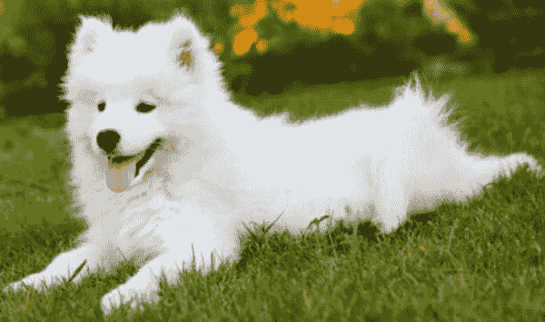

一张毛茸茸的狗趴在草地上，张着嘴，舌头伸在外面的照片。这张照片展示了本例中的类别，即狗。

**图 1-2**  
本例中的类别是狗

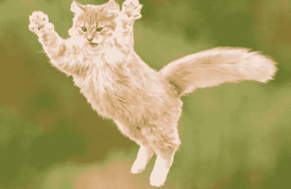

一张猫跳跃后悬在空中的照片。它的爪子向外伸展。

**图 1-1**  
本例中的类别是猫

我们可以根据这些图像中是否包含猫或狗的图像来区分它们的内容。这是我们眼睛感知差异的一个例子。我们试图分类的对象的背景并不重要，因此我们需要确保在算法中背景也同样不重要。例如，如果我们在所有狗的图像前都加上某个汽车公司的标志，图像分类器网络可能会学习根据该标志来对狗进行分类，并将其用作捷径。我们稍后将详细描述如何将这些信息纳入模型。分类可用于识别制造单元生产线中的物体。

### 目标检测与定位

一个经常遇到的有趣问题是需要在一张图像中定位另一张特定图像，甚至检测它可能是什么。假设有一群人，有些人戴着口罩，有些人没戴。我们可以使用视觉算法来学习口罩的特征，然后利用这些信息在图像中定位口罩并检测出口罩。见图 1-3 和 1-4。

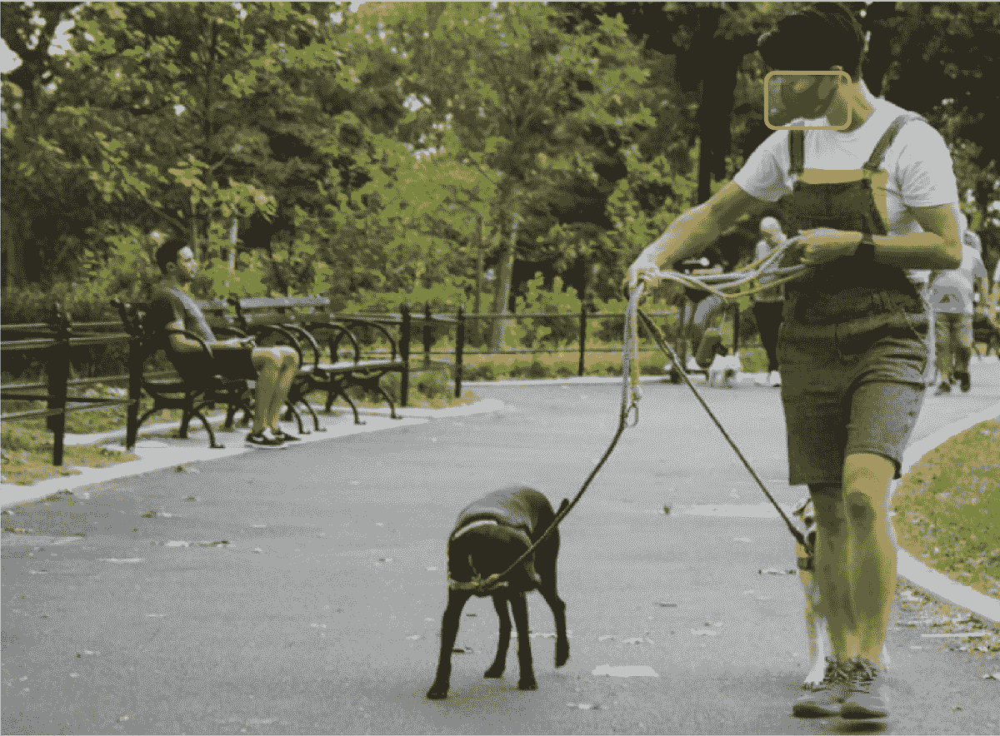

一张公园里人们的照片。前景中一个人用牵引绳牵着两只狗，背景中另一个人坐在公园长椅上。背景中还有其他人在，但被第一个人遮挡了。前景中的人戴着口罩，一个矩形框高亮显示了他们的脸部。

**图 1-4**  
类别：图像中检测到口罩


一张男人跪在草地上，手握着狗脖子上的项圈的照片。狗坐在男人面前。男人手指指向一个方向，狗也盯着同一个方向。

**图 1-3**  
类别：未检测到口罩

这种分析有助于从交通摄像头中检测行驶车辆的牌照。有时，由于摄像头分辨率和车辆移动，图像质量并不理想。超分辨率是一种有时用于增强图像质量并帮助识别牌照号码的技术。

#### 图像分割

此过程用于确定放置在一起的相似物体的边缘、曲线和梯度，以便分离图像中的不同物体。这里可以使用经典的无监督技术，无需担心寻找高质量、带标签的数据。处理后的数据可以进一步用作目标检测器的输入。见图 1-5。

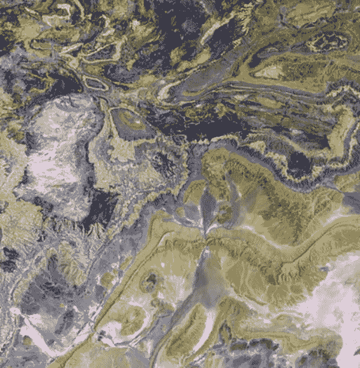

一张地形图的航拍照片，显示了不同的地形和其他地貌，以及它们的分隔和布局设计。陆地面积比水体面积更丰富。可以看到狭窄的水体在陆地形态之间穿过。

**图 1-5**  
在地形图中分离地形

#### 异常检测

另一种经典的无监督变化检测方法是将图像与某些训练数据中的常规、预期模式进行比较。例如，异常检测可用于确定钢管与训练数据相比是否存在瑕疵。如果机器发现异常，它将检测到异常并通知生产线工程师进行处理。见图 1-6a 和 1-6b。

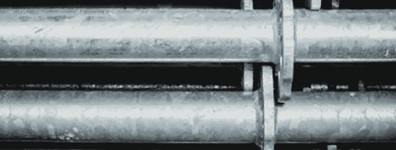

一张钢管放大视图的照片。钢管水平放置，一根叠在另一根之上。可以观察到钢管表面的异常。钢管的一端存在垂直的棱纹。

**图 1-6b**  
钢管上出现的异常

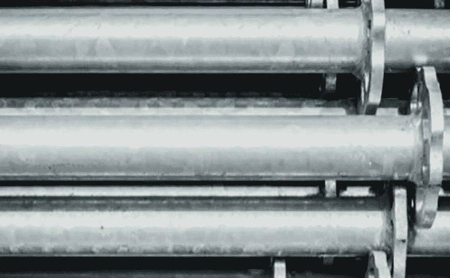

一张几根钢管水平放置、一根叠在另一根之上的照片。每根钢管的一端都有向外突出的棱纹。

**图 1-6a**  
钢管的完美示例

#### 视频分析

视频或图像序列有很多应用场景。对连续图像进行目标检测的任务可以帮助分析闭路电视监控录像。它也可以用于检测视频每帧画面中的异常情况。

我们将在接下来的章节中详细介绍所有这些应用。在此之前，让我们先了解一些为深入理解计算机视觉奠定基础的内在概念。


### 通道

计算机视觉中最基本且最核心的概念之一就是`通道`。想象一下用多种乐器演奏音乐的场景：我们听到的是所有乐器合奏的声音，这本质上构成了立体声（见图 1-7）。如果我们将音乐分解成单个组成部分，就可以将声波拆解为来自电吉他、原声吉他、钢琴和人声的独立声音。将音乐分解后，我们可以调节每个组成部分以获得理想的音乐效果。如果我们掌握了所有的音乐调制方法，就可以创造出无数种组合。

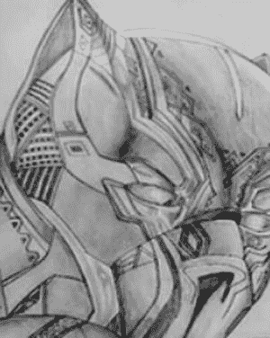

一张计算机视觉通道的示例素描照片。它就像一幅抽象壁画。可以观察到这幅素描由铅笔线条和阴影构成。

**图 1-8d** 单通道表示的示例素描

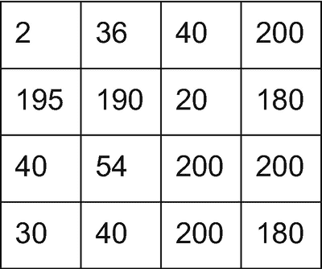

一个 4 列 4 行的表格。从第 1 行从左到右，数值分别为 2、36、40 和 200。第 2 行为 195、190、20 和 180。第 3 行为 40、54、200 和 200。第 4 行为 30、40、200 和 180。该表格展示了与素描对应的代表性像素值。

**图 1-8c** 与素描对应的代表性像素值

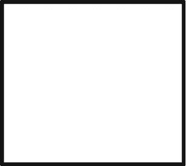

一张没有任何内容的空白方块图像。这张图片展示了一个示例白页。

**图 1-8b** 示例白页

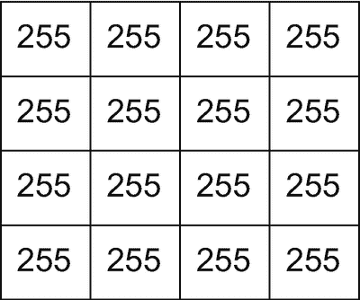

一个 4 列 4 行的表格。所有列和行都由尺寸相同的方形单元格组成。每个单元格内都写有数字 255。该表格表示与白色图片对应的像素值。

**图 1-8a** 与白色图片对应的像素值

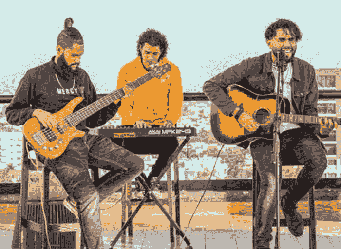

一张 3 个人坐着的照片。两侧的两个人各拿着一把吉他，中间的人正在弹奏键盘。这张图片描绘了演奏中的音乐家。

**图 1-7** 演奏中的音乐家

计算机视觉中最基本且最核心的概念之一就是`通道`。

我们可以将这些概念推广到图像上，图像可以被分解为颜色的组成部分。像素是颜色的最小容器。如果我们放大任何数字图像，就会看到构成图像的小方块（像素）。任何像素在通道强度方面的一般范围是 0-255，这也是由八位定义的范围。以图 1-8b 为例。我们有一张白页。如果将该页面转换为数组，就会得到一个全部为 255 像素的矩阵，如图 1-8a 所示。另一方面，图 1-8d 在转换为矩阵时，也只有一个通道，其强度由 0-255 范围内的数字定义，如图 1-8c 所示。数值越接近 0 表示黑色，越接近 255 表示白色。

让我们考虑一张彩色图像。我们可以将任何全彩图像分解为三种主要成分（通道）的组合——红色、绿色和蓝色。我们可以将任何彩色图像分解为红色、绿色和蓝色的某种确定组合。因此，RGB（红、绿、蓝）就成为了彩色图像的通道。

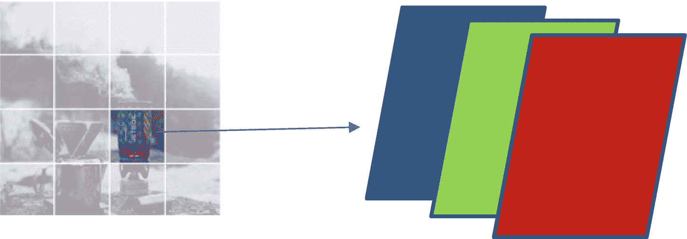

一张模糊的冒烟饮料和咖啡机的拼图图像，从图中伸出一个水平箭头，指向三个垂直排列的矩形，分别位于左侧、中间和右侧，每个矩形具有不同的色调。

**图 1-9** 示例图像对应蓝色（左）=0、绿色（中）=1、红色（右）=2

图 1-9 中的图像可以拆分为 RGB，第一个通道是蓝色，然后是绿色，最后是红色。图像中的每个像素都可以是 RGB 的某种组合。

我们并不局限于使用 RGB 作为颜色通道。还有 HSV（色调、饱和度、明度）、LAB 格式和 CMYK（青色、品红、黄色、黑色），这些都是图像通道的几种表示形式。颜色是一种特征，其容器就是通道，因此每幅图像都由边缘和渐变构成。仅凭边缘和渐变，我们就可以创造出世界上任何图像。如果你放大一个小圆圈，它看起来应该像是多个边缘和直线的组合。

总而言之，通道可以被视为特征的容器。特征可以是图像中最小的个体特性。颜色通道是通道的一个具体例子。由于边缘可以是特征，那么仅处理边缘的通道也可以是一个通道。值得思考的是——如果你要创建一个识别猫或狗的模型，动物的颜色对模型行为的影响是否与边缘和渐变一样大？


### 卷积神经网络

你现在已经知道图像具有特征，并且需要提取这些特征以更好地理解数据。如果我们考虑一个像素矩阵，像素在四个方向上都是相互关联的。如何高效地进行提取？传统的机器学习或深度学习方法会有帮助吗？让我们来看几个问题：

1.  图像的尺寸可能非常巨大。例如，一张 200 万像素的图像，如果允许拍摄 1600x1200 的图像，那么每张图像将包含 190 万个像素。
2.  如果我们通过图像捕获数据，数据并不总是居中对齐的。例如，一只猫可能在一张图像的角落里，而在下一张图像中，它可能位于中心。模型应该能够捕捉到信息中的空间变化。
3.  图像中的猫可以沿垂直方向或水平方向旋转，但它仍然是一只猫。因此，我们需要一个稳健的解决方案来捕捉这些差异。

我们需要对我们常规的表格数据处理方法进行重大升级。如果我们能把一个问题分解成更小、更易于管理的部分，那么任何问题都可以解决。在此，我们使用*卷积神经网络*。我们尝试通过卷积核将图像分解成多个特征图，并依次使用它们来构建一个模型，该模型随后可用于任何下游或前置任务。

卷积核是特征提取器。特征可以是边缘、梯度、模式，或本章前面讨论过的任何微小特征。通常使用一个方阵来对第一步的图像和第二步的特征图执行卷积操作。由卷积核执行的卷积任务可以被视为点积中最简单的任务。见图 1-10a 和 1-10b。

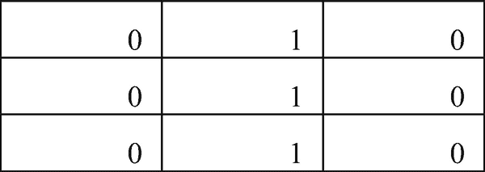

一个 3 列 3 行的表格。第 1 行有 0, 1, 0。第 2 行有 0, 1, 0。第 3 行有 0, 1, 0。数字位于每个单元格的右下角。它描绘了卷积神经网络中的一个 3x3 卷积核。

**图 1-10b** 3x3 卷积核

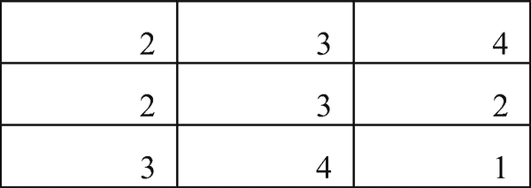

一个 3 列 3 行的表格。第 1 行有 2, 3, 4。第 2 行有 2, 3, 2。第 3 行有 3, 4, 1。数字位于每个单元格的右下角。它描绘了特征图的 3x3 矩阵。

**图 1-10a** 特征图的 3x3 矩阵

图 1-10a 是图像或特征图，图 1-10b 是卷积核。卷积核是特征提取器，因此它将对特征图进行点积运算，得到值 10。这是我们卷积的第一步。图像或特征图会很大，因此卷积核可能不仅仅在一个 3x3 矩阵上操作，它会向前移动一个步长来计算下一个卷积操作。让我们来看一个关于这个想法的外推示例。

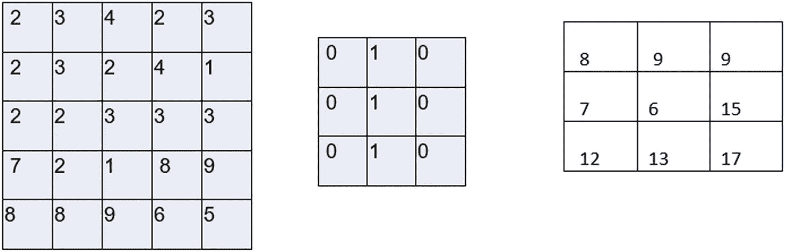

表 1 有 5 列 5 行。第 1 行的值为 2, 3, 4, 2, 3。第 2 行为 2, 3, 2, 4, 1。第 3 行为 2, 2, 3, 3, 3。第 4 行为 7, 2, 1, 8, 9。第 5 行为 8, 8, 9, 6, 5。表 2 有 2 列 2 行。第 1、2、3 行均为 0, 1, 0。表 3 有 3 列 3 行。第 1 行的值为 8, 9, 9。第 2 行为 7, 6, 15。第 3 行为 12, 13, 17。

**图 1-11** 特征图、卷积核及输出结果

如图 1-11 所示，一个 5x5 的特征图被一个 3x3 的卷积核卷积，结果得到一个 3x3 的特征图。该特征图将再次被卷积或转换为某些特征，用于下游任务。

卷积过程还包含一个*步长*的概念，这是一个超参数，告诉卷积核如何在特征图上移动。在我们的卷积神经网络中，步长为 1。步长大于 1 可能会导致特征图中出现棋盘格问题，即某些像素比其他像素获得更多关注。根据我们的业务需求，我们可能希望或不希望这种效果。较高的步长值也可用于降低特征图的维度。

这种卷积存在一个固有问题。当进行卷积操作时，维度会不断缩小。这在某些意义上或特定用例中可能是可取的，但在某些用例中，我们可能希望保留原始维度。我们可以使用填充的概念来处理图像或后续的特征图，以避免维度缩减的问题。填充是另一个超参数。我们在图像或特征图周围添加层。

图 1-12b 展示了填充如何有效地增加空间，并允许卷积核更好地注意到边缘像素值。卷积过程将不止一次地处理边缘值，因此信息会以更大的影响力被传递到下一个特征图。在边缘具有像素值的情况下，无论当时的步长值是多少，卷积核的卷积操作只会取该值一次。

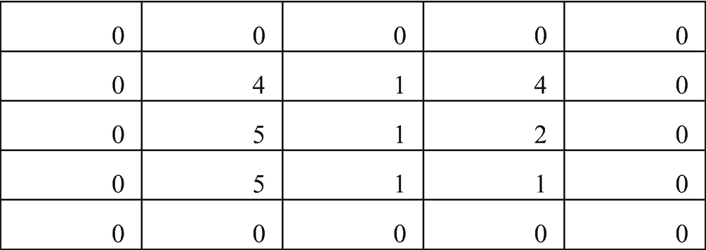

一个 5 列 5 行的表格。第 1 行有 6 个 0。第 2 行有 0, 4, 1, 4, 0。第 3 行有 0, 5, 1, 2, 0。第 4 行有 0, 5, 1, 1, 0。第 6 行全是 0。数值位于每个单元格的右下角。这描绘了一个零填充的特征图。

**图 1-12b** 一个零填充的特征图

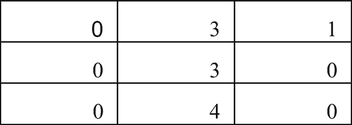

一个 3 列 3 行的表格。第 1 行有 0, 3, 1。第 2 行有 0, 3, 0。第 3 行有 0, 4, 0。数字位于每个单元格的右下角。它描绘了一个边缘检测器。

**图 1-12a** 一个边缘检测器

简单的填充就能改变卷积核对边缘的识别，这非常有趣。如果我们假设特征图角落附近有一个重要的边缘，并且没有对其进行填充，那么这些边缘将无法被检测到。这是因为，要检测一条线或一个边缘，卷积核或特征提取器需要有一个相似的模式。以图 1-12a 中的卷积核为例，它是一个边缘检测器，它需要找到一个合适的梯度来检测实际的边缘。正是由于从 0 到 4、0 到 5 和 0 到 5 的梯度，它现在才能检测到边缘。如果没有填充，这个梯度就不存在，卷积核就会错过一个重要的部分。


### 感受野

在探讨卷积概念时，我们涉及了特征图和卷积核步长。卷积核在空间中提取特征，以便模型能够轻松解读信息。现在，我们以一个单通道的 `56x56` 图像为例（也可写作 `56x56x1`）。如果试图将整张图像转换为特征，就需要读取所有像素点。让我们通过一个图形示例来理清这个概念。

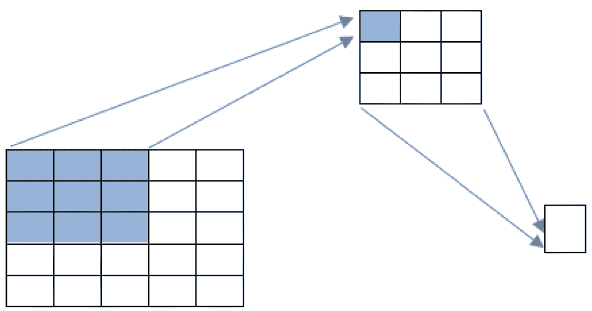

一张示意图展示了卷积操作。一个包含五行五列的表格中，前三行前三列的单元格被高亮显示。两个箭头从该区域指向另一个三行三列的表格，其第一个单元格被高亮。两个箭头又从该表格指向第三个仅有一个单元格且未被高亮的表格。

**图 1-13** 卷积操作示意图

图 1-13 展示了一个普通的 `5x5` 特征图与另一个 `3x3` 卷积核进行卷积，假设无填充且步长为 `1`，结果得到一个 `3x3` 特征图。此步骤中向前传递的信息，是从特征图的第一个区块传递到下一个区块。这意味着，图 1-13 中 `3x3` 特征图最左侧的像素值，仅包含了原始特征图最左侧高亮角落的像素信息。这引发了一个问题：如果我们只有一层网络且使用 `3x3` 卷积核，那么在该层中，一个像素的感受野本质上就是 `3x3`。有趣的是，在下一层中，如果我们再次使用步长为 `1`、零填充的 `3x3` 卷积核，对于图 1-13 而言，该层的感受野仍然是 `3x3`，但这个 `3x3` 区域已经“看”过了整张原始图像。因此，它承载了原始图像的全部信息。这个概念被称为局部感受野和全局感受野。

### 局部感受野

它是指在该步骤中，卷积核通过卷积操作向前传递的逐层信息强度。在图 1-13 所示的例子中，我们有一个 `3x3` 的卷积核，即九个像素。它仅取决于当前步骤，而非整个过程。

### 全局感受野

这是累积传递到模型最后一层的信息。通常，为了简化，我们希望将图像信息平均化，最终只得到一个值。如果我们要预测猫或狗，最终只得到一个值会比得到一个矩阵更容易。最后一个值（`1x1xn`）或像素，本质上应该“看”到图像起始的所有像素，才能完美地解读信息。

在图 1-13 的例子中，特征图先被 `3x3` 卷积核卷积，再被另一个 `3x3` 卷积核卷积，最终得到 `1x1` 的结果。此时，这个 `1x1` 像素已经“看”过了 `3x3` 的特征图，而那个 `3x3` 特征图又“看”过了 `5x5` 的原始特征图。这是一个传递接力棒的过程，而卷积核在其中起到了帮助作用。这里的全局感受野是 `5x5`。

### 池化

卷积神经网络的一个初始优势在于其并行处理能力。一个全连接层即使对于像（`5x5x1`）这样小的图像，也需要处理一个 `25` 维的输入向量。尽管 CNN 通过在空间域上工作解决了这个问题，但高维度仍然可能导致 CNN 架构拥有大量的参数。池化试图通过提供一种降维技术和信息过滤方法来解决这个问题。

在 CNN 中仅应用卷积层存在一个固有问题。空间特征由卷积核捕获，但输入特征图的微小变化会对输出特征图产生巨大影响。为了避免这个挑战，我们可以使用池化。根据我们执行的下游任务，我们可以使用最大池化、平均池化或全局平均池化。

池化可以被认为与卷积层应用于特征图的方式类似。然而，池化不是进行卷积运算，而是计算区域内所有值的平均值或最大值。它可以被视为一个函数。池化部分没有需要学习的参数。它只是纯粹而简单的空间降维。建议在维度较高的特征图（至少需要大于 `10x10`）上使用 `2x2` 的池化。原因是，在 CNN 的这个层级，信息集中度已经很高，通过池化快速降维可能会导致巨大的信息损失。

#### 最大池化

特征图包含从图像中空间分布的信息。如果我们考虑一个只需要边缘信息的下游任务，我们可以尝试最大化边缘，使得后续的特征图能够聚焦于经过过滤的信息。当选择最大池化时，显著的特征被过滤并传递到下一层。当步长在像素区域中移动时，它会选择值最大的那个，因此得名“最大”。

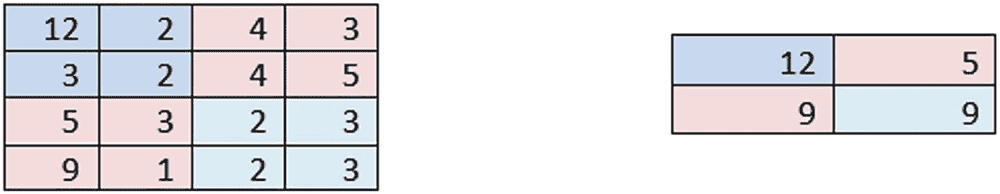

左侧的表格 1 有 4 列 4 行。第 1 行的值为 12、2、4 和 3。第 2 行的值为 3、2、4 和 5。第 3 行的值为 5、3、2 和 3。第 4 行的值为 9、1、2 和 3。右侧的表格 2 有 2 列 2 行。第 1 行的值为 12 和 5。第 2 行的值为 9 和 9。这些表格被用作最大池化的示例。

**图 1-14** 最大池化示例

图 1-14 左侧显示了一个特征图；我们尝试使用步长为 `2` 进行最大池化。结果特征图从 `4x4` 缩小为 `2x2`，仅传递了显著特征。从某种程度上说，如果图像或特征图中存在某些边缘或梯度，它们将优先于其他任何信息被保留。

在分类等任务中，我们通常遵循最大池化的流程，因为我们需要重要的边缘和梯度信息得以保留，而不希望其他无关特征干扰架构。有趣的是，颜色在大多数分类任务中并不起作用。例如，猫可以是任何颜色，模型必须在不考虑颜色的情况下理解它是一只猫。

#### 平均池化

我们已经确立了池化的基本概念。它提供了一种过滤过程，而无需增加任何可学习参数的数量。对于 `2x2` 且步长为 `2x2` 的平均池化，步长每次处理一个 `2x2` 的区块，计算整个区块的平均值，并在此基础上求出均值。这个均值被传递到特征图的下一个部分。

对于分类任务，通常不建议使用平均池化。然而，当图像较暗并且您想提取从黑到白的过渡时，可以使用它。

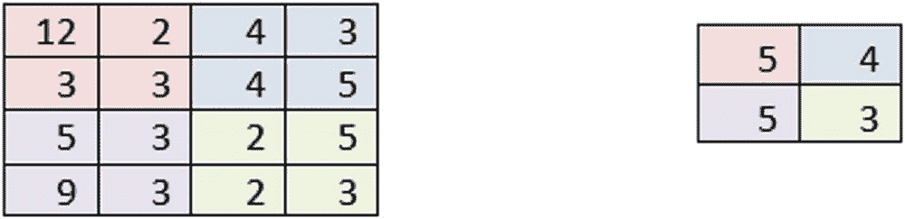

左侧的表格 1 有 4 列 4 行。第 1 行的值为 12、2、4 和 3。第 2 行的值为 3、3、4 和 5。第 3 行的值为 5、3、2 和 5。第 4 行的值为 9、3、2 和 3。右侧的表格 2 有 2 列 2 行。第 1 行的值为 5 和 4。第 2 行的值为 5 和 3。

**图 1-15** 平均池化示例

图 1-15 显示了一个特征图被 `2x2` 区块、步长为 `2` 进行池化。池化区域的平均值反映在左侧特征图中每个 `2x2` 区块映射到右侧的一个像素点上。


### 全局平均池化

全局平均池化有时用于 CNN 架构的末端，将特征图汇总为一个值。假设你有一个 5x5 的特征图，并带有一定深度（z 方向上的通道数，假设 x 和 y 是特征图的高度和宽度），你可以将这些值展平，并使用全连接网络将这些类似的特征映射起来，从而得到一个模型。这是一个可行的方案，但处理 5x5 的尺寸时，我们需要将 25 个特征输入全连接网络，这会占用大量参数。相反，你可以在此步骤之后尝试使用全局平均池化层，将其变为 1x1，从而有效管理所有重要特征并进行组合。通过不使用全连接网络节省下来的模型参数，可以用于添加卷积层。这可能会带来更高的准确率。

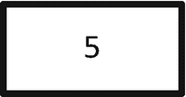

一张纯色矩形的照片，中心刻有数字 5。这是经过 GAP 后得到的结果。

**图 1-16b** GAP 后的结果

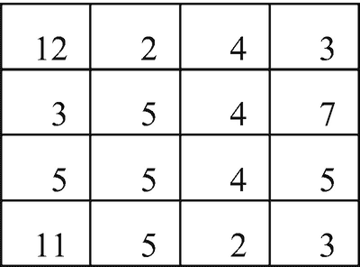

左侧的表格 1 有 4 列 4 行。第 1 行的值为 12、2、4 和 3。第 2 行的值为 3、3、4 和 5。第 3 行的值为 5、3、2 和 5。第 4 行的值为 9、3、2 和 3。该表格展示了一个示例特征图。

**图 1-16a** 示例特征图

图 1-16a 展示了一个 4x4 维度的特征图。经过池化后，我们得到一个单一值，如图 1-16b 所示。在所有情况下，我们都会有一个深度，其值将基于相应的池化和特征图来确定。

### 计算：特征图与感受野

计算是本课程的一个重要方面。我们将用它来构建我们的模型并进行各种实验。输出特征图的维度取决于多个因素，例如步长、卷积核大小、池化、填充、输入和输出。让我们深入了解细节。

#### 卷积核

卷积核是从特征图或图像中提取特征的提取器。它在第一次前向传播时被初始化，但其权重会通过反向传播进行学习和调整，以使其成为更好的特征提取器。一旦训练开始，权重会向更高值方向移动。这可能意味着它提取的特征对代价函数以及权重本身很重要。我们用`K`表示卷积核的维度。

#### 步长

卷积核在特征图上移动的步长称为步长。我们用`S`表示其值。

#### 池化

传统卷积神经网络架构中的池化块并不进行卷积操作，而是旨在从空间特征图中捕获某种信息，并快速降低特征图的维度以供下一步使用。我们用`mp`表示它。

#### 填充

填充允许我们在卷积过程完成后保持维度不变。我们用`P`表示它。

#### 输入与输出

我们按原样表示输入和输出，其中输入指的是第一步的特征图，输出指的是生成的特征图。

为图像构建架构的第一步是获取图像的大小，并确定我们希望网络构建的深度，使得最后一层或输出的感受野等于图像的大小。换句话说，它应该已经看到了图像中的内容，以便回答关于图像的任何问题。如果我们有一个大小为 56x56x3 的图像，那么使用的卷积核可以是 3x3x**3**x16。这意味着 3x3 的卷积核有三组不同的初始化，并与输入或前一层的通道数相匹配。这是因为它必须知道如何混合需要提取并在网络中使用的特征。公式变为：

`HxWxC > KxKxCxC[next]`

这里`H`、`W`、`C`分别是输入图像/特征图的高度、宽度和通道数。

`K`是卷积核大小，`C[next]`是下一步的通道数或批次大小。当使用 CUDA 分数来训练 CNN 时，我们需要推动卷积核大小等于由`2^n`定义的某个数字。例如，如果我们使用 17 作为卷积核数量，它最终仍会使用 32，而不是最接近的`2^n`数，即 16。

给定所有值和概念，让我们计算特征图输出：

```
输出 = [输入 + 2P - K] / S + 1
```

给定，`输入 = 12x12`，`P = 0`，`K = 3x3`，`S = 1`

```
输出 = [12 + 2*0 - 3] / 1 + 1
```

`输出 = 10` 或 `10x10`

#### 感受野的计算

第`n`层的感受野计算将由一个综合公式给出，如下所示：

```
感受野 = sum_{i=1}^{n} (K_i - 1) * prod_{j=0}^{i-1} S_j
```

假设我们正在计算第二层的感受野。那么`K[1]`、`K[2] = 3`。两次的卷积核步长均为 1，感受野结果为 5。

### 理解 CNN 架构类型

#### 理解架构类型

#### AlexNet

ILSVRC 是一个致力于计算机视觉研究的竞赛，其著名的 ImageNet 数据集被用于评估该领域的模型和研究。最早的获胜者之一是 AlexNet，它在 2010 年和 2012 年取得了很高的准确率。与该网络相关的论文揭示了卷积网络的使用，并采用了基本的构建模块。

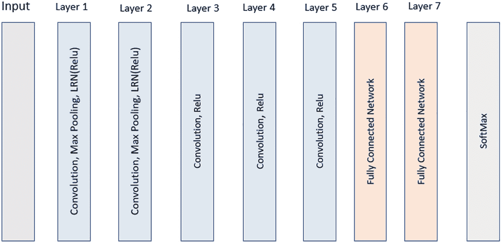

AlexNet 架构示意图。它由 9 个垂直矩形条组成，分别标记为输入、第 1 层到第 7 层以及 softmax。第 1 层和第 2 层包括卷积、最大池化和 LRN ReLU，第 3、4、5 层包括卷积、ReLU，第 6 层和第 7 层包括全连接网络，最后一层包括 softmax。

**图 1-17** AlexNet 架构

图 1-17 展示了 AlexNet 中使用的总体架构。采用的图像大小为 224x224x3，通过一个 11x11x3x96 的卷积（步长为 4）将其降为 55x55x96。使用了 3x3 滤波器且步长为 2 的最大池化。前两个卷积层使用了 LRN 和池化。接下来的三层仅使用了卷积层和激活层，随后是两个全连接网络块。然后将分数传递给 softmax 以对 1000 个类别进行分类。

该模型架构中最有趣的发明是 LRN（局部响应归一化）。当时，sigmoid 和 tanh 通常被用作激活函数，但 AlexNet 使用了 ReLU。Sigmoid 和 tanh 在极端值处会出现饱和问题，并且数据必须始终居中并归一化，才能在反向传播过程中传递梯度。局部响应归一化可以看作是一种亮度归一化器，并且它位于 ReLU 激活函数之后。

AlexNet 尝试使用多个 GPU 来并行化训练过程，从而提高准确率。该网络有两个部分相互并行，并在某些部分交叉连接。


### VGG

图 1-18 展示了`conv 1`、`conv 2`、`conv 3`、`conv 4`和`conv 5`——一个带有`ReLU`激活函数的卷积块。每个块之后是一个最大池化层，然后是`FC 6`、`FC 7`和`FC 8`——一个全连接网络。

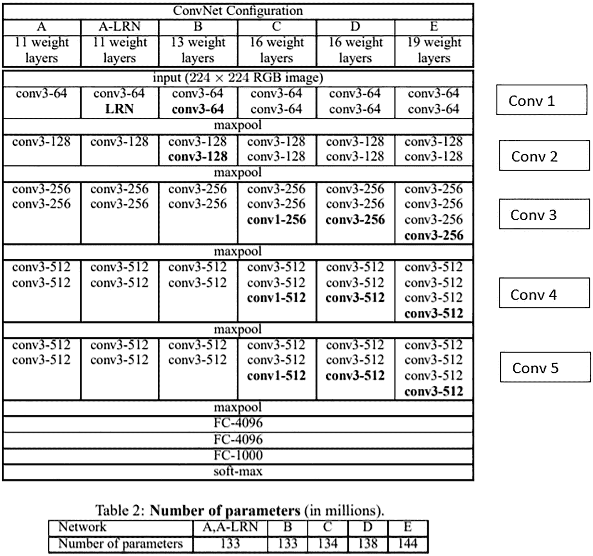

表 A 是卷积网络配置，有 6 列和 1 行。列标题为 A、A L R N、B、C、D 和 E。表 B 是输入，224×224 的 RGB 图像，包含 5 个卷积，共 6 列和 1 行。最后一个表是参数数量，有 5 列和 1 行，列标题为 A A L R N、B、C、D 和 E。

**图 1-19** VGG 堆叠的逐层描述

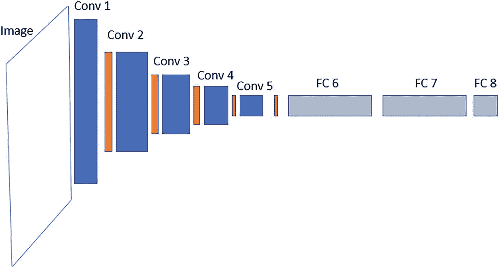

VGG 架构示意图。从左到右依次是：由一个斜矩形表示的图像，然后是`Conv 1`、`Conv 2`、`Conv 3`、`Conv 4`、`Conv 5`、`FC 6`、`FC 7`，最后是`FC 8`。`conv 1`到`conv 5`块的高度逐渐减小，`FC 6`和`FC 7`是水平对齐的矩形，`FC 8`由一个正方形表示。

**图 1-18** VGG 架构

该架构开启了一种以基本开发风格进行深度应用的长期实践。在该架构提出时，尚未使用批归一化，因此网络存在内部协变量偏移和梯度中途消失的问题。该架构结合使用了 3×3 和 1×1 卷积。堆叠三个 3×3 卷积优于一个 7×7 卷积的原因在于参数数量：如果有 C 个通道，则 3×3 卷积有 27C² 个参数，而 7×7 卷积则有 49C² 个参数。然而，三个 3×3 堆叠的感受野等于一个 7×7 卷积，并且具有更多自适应函数在特征图上进行卷积。参见图 1-19。

该模型架构遵循卷积块式架构，使用了现代架构中定义良好的优先级。我们有五个卷积块，当特征图尺寸减小时，这能最小化信息损失。每个块的通道数都会增加。每个卷积块之后是最大池化，用于降低特征图的维度。此外，还增加了 1×1 卷积，它充当了来自前一层特征图所有特征的混合器。这种卷积起到 z 轴降维技术的作用。虽然连续使用 3×3 或 5×5 卷积会增加特征图的通道数，但在某个时刻，需要使用适当的技术来减少通道数，同时保持信息损失最小。出于所有目的，1×1 卷积被用作跨通道池化。它也可以用来增加通道数，但在实践中并不这样做。由于它在特征图上进行逐元素乘法，因此可以轻松地汇总内容。

VGG 是对传统 CNN 架构的重大改进，并且是 2015 年发布的最先进的算法。

### ResNet

`ResNet`是一种用于图像下游任务的高级架构，它通过在 2015 年赢得 ILSVRC 竞赛而隆重进入计算机视觉领域。它也是像`YOLO`和`Faster RCNN`等一些最先进目标检测算法的骨干网络。该论文由微软的一个团队提出。他们借助残差学习框架成功训练了更深的网络。

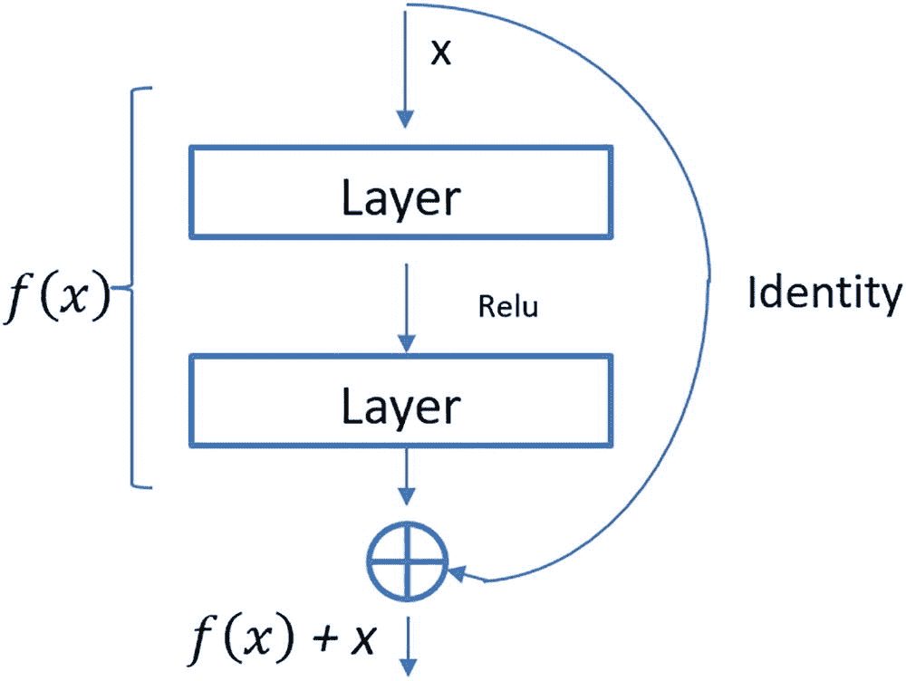

一个 2 层残差结构的示意图，两者都封装在`f`、`x`和恒等映射中，结果为`f(x) + x`。顶层接收输入`x`，并通过`ReLU`指向底层，底层指向一个被分成 4 段的圆，该圆产生结果`f(x) + x`。从`x`出发的恒等映射被传递到该圆。

**图 1-20** 残差结构

图 1-20 展示了残差框架的基本结构。前一层的输出可以视为`X`；它被传递给残差函数以及一个恒等函数。因此，如果残差函数由`f(x)`给出，我们可以调用`f(x) + x`的结果。

该结构试图解决的问题是准确率的退化。实验表明，更深的网络在增加层数后准确率会饱和，并最终下降。这些下降并非来自过拟合，而是由于问题本身难以优化。在深度神经网络中，一个常见的线性问题可能难以训练。例如，如果我们想构建一个仅对两个数字进行线性相加的模型，并希望结果是它们的和，那么非线性对应部分通常更容易优化，比如给数字加上指数函数再得到结果。

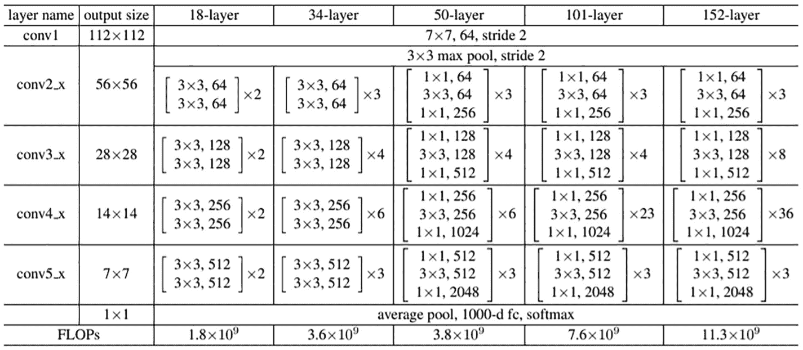

一个包含 7 列和 5 行的表格。第三到第七列的列标题有一个共同的标签，即 7×7、64、步长 2 和 3×3 最大池化、步长 2。最后一行是 FLOPs。该表描述了 ResNet 的逐层卷积信息。

**图 1-22** ResNet 逐层卷积信息

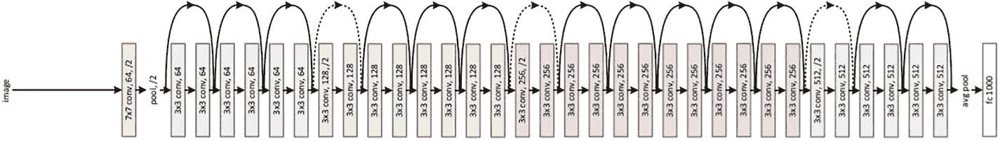

一个由 32 个相互连接的输入组成的示意图。从左到右，从图像开始，经过 7×7 卷积、64 个输出、步长 2，最后以`FC 1000`结束，描绘了 ResNet 的基本架构。每个组件由一个水平对齐的矩形表示。

**图 1-21** ResNet 基本架构

跳过残差网络产生的恒等层，除了从残差网络获得的局部感受野之外，还提供了第二组可用的局部感受野。这些通常被称为跳跃连接或高速公路网络，它们为深层网络提供图像的副本。跳跃连接和残差网络的输出需要具有相同的维度。因此，在输出上会进行投影以匹配维度，然后再将其添加到残差函数中。图 1-21 描绘了`ResNet-34`架构，可以参考图 1-22 中的表格。该架构使用了 3、4、6、3 的堆叠，以及 64、128、256 和 512 的网络块堆叠。有两种类型的跳跃连接——一种用实线表示，另一种用虚线表示。在大多数情况下，如果输入维度与残差输出的维度匹配，则直接添加输入。这由实线表示。在虚线的情况下，如果维度不匹配，则通过填充以及步长为 2 的 1×1 卷积来控制。无论哪种方式，都没有为模型学习添加额外的参数。

另一个需要注意的重要点是，该模型使用带动量的随机梯度下降作为优化器。带动量的`SGD`是许多其他最先进模型中使用的另一种经过验证的方法。


