# Inception 架构

自 2014 年以来，Inception 已发布了多个版本。`GoogLeNet`（通常与 `InceptionV1` 相关联）是 `ILSVRC` 的获胜者。它经历了多次迭代；让我们来看看 Inception 架构。

为了增强卷积块内的局部表示能力，该方案提出了分解卷积。实际上，它建议在 `1x1` 卷积之后使用 `3x3` 卷积，以降低激活强度并减少相关性。他们采用了一种方法，将较大的卷积核分解为较小的卷积核，以期达到相同的效果。例如，一个 `5x5` 卷积需要 `25C²` 个参数，但可以将其分解为两组 `3x3` 卷积，仍然只需要 `18C²` 个参数。参见图 1-23。根据研究，`5x5` 卷积在单次卷积中能够获取更多像素点，因此可能具有更好的表达能力。因此，与 `3x3` 卷积相比，它具有更好的全局视野。然而，该架构声称，在构建计算机视觉模型时，我们需要关注平移不变性，而较小的卷积核将有助于实现这一点。

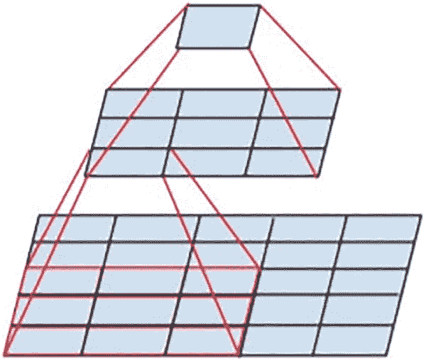

卷积全局视野示意图。一个方形单元的四个角连接到 3x3 网格的四个角，而该 3x3 网格又连接到作为 5x5 网格一部分的 3x3 网格。

**图 1-23** 卷积的全局视野

这种分解进一步发展为非对称卷积。`3x3` 卷积仍然可以分解为 `3x1` 卷积，然后是 `1x3` 卷积，从而至少节省 `9/6` 的计算量。这种方法也可以用于更高层的卷积，并在图 1-24 中进行了通用展示。

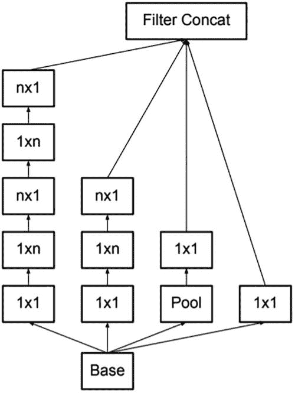

`Filter Concat` 的非对称卷积示意图。输入是 2 个 `n x 1` 和 2 个 `1 by 1`，它们通向基础层。第一列 `n x 1` 从上到下依次由 `1 x n`、`n x 1`、`1 x n` 和 `1 by 1` 组成。第二列 `n x 1` 从上到下依次由 `1 x n` 和 `1 by 1` 组成。

**图 1-24** 非对称卷积

模型架构的另一个重要补充是辅助分类器。它们旨在解决深度神经网络的梯度消失问题。除了使用的批量归一化和 Dropout 之外，网络的这一部分还充当了模型的正则化器。与没有此类分支的网络相比，辅助分类器有助于模型在训练后期提高准确性。图 1-25 展示了一个分支出去的辅助网络。

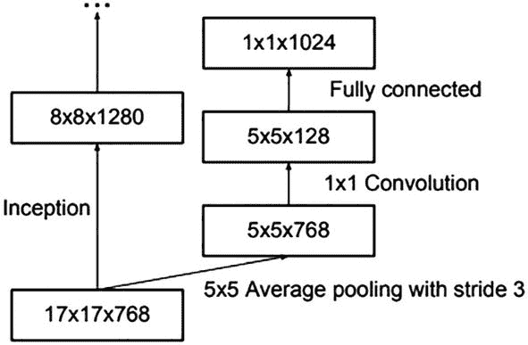

辅助网络示意图。`17 by 17 by 768` 通过 Inception 模块形成 `8 by 8 by 1280`，后者进而形成一个由 3 个点组成的输出；同时，`17 by 17 by 768` 通过步长为 3 的 `5 by 5` 平均池化形成 `5 by 5 by 768`。`5 by 5 by 768` 通过 `1 by 1` 卷积形成 `5 by 5 by 128`，后者再通过全连接层形成 `1 by 1 by 1024`。

**图 1-25** 辅助网络

当对带有通道的信息网格应用池化时，建议根据我们期望的缩减比例来增加特征图的数量。由于信息在空间上是分布的，我们可能希望固定信息的体积，而不是将其截断。想象一个半固态的长方体会有所帮助。如果我们要减小其面，就必须在一个方向上拉长。在我们的例子中，这个方向就是深度。图 1-26 展示了 Inception 架构中使用的网格缩减技术。这种并行架构设想将池化和卷积并行使用，然后将它们拼接起来。

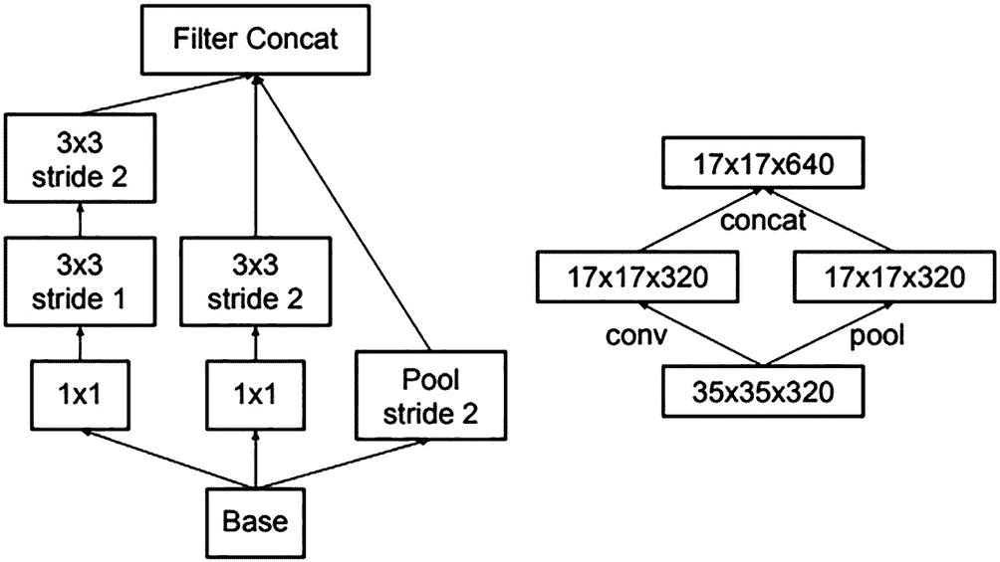

第一个示意图由一个基础层分支到 2 个 `1 by 1` 网格和步长为 2 的池化组成。`1 by 1` 网格形成步长为 1 和步长为 2 的 `3 by 3` 卷积，最终通过滤波器拼接形成输出。第二个示意图由 `35 by 35 by 320` 经过汇聚和池化形成 `17 by 17 by 320`，再通过拼接汇聚形成 `17 by 17 by 640`。

**图 1-26** Inception 架构快照

Inception 架构最初使用带动量的随机梯度下降法进行训练，但后来改用 `RMSProp` 来训练模型，从而获得了更好的准确率。

## 深度学习模型技术实践

到目前为止，我们已经介绍了广泛使用的基于 CNN 的模型。对于通用计算机视觉任务，有多种建模架构的方法。现在，让我们讨论几个重要的概念，这些概念在后续章节中我们将动手探索多个问题时将会很有用。

### 批量归一化

训练深度神经网络时会出现一个固有问题。在训练过程中，由于输入流经各层，这些层的输入分布会受到一定程度的影响，从而呈现出不同的分布。梯度会影响权重，而这些权重又会级联地影响分布。这种现象被称为*内部协变量偏移*。为了使用 `SGD` 训练深度神经网络，通常使用小批量梯度下降法。这个过程在某一层面降低了计算需求，并且由于小批量代表了原始输入，训练水平是良好的。

批量归一化通常在卷积操作之后使用。它可以在 `ReLU` 激活层之后或之前使用，但绝不能用在架构的最后一层之后。它增强了每一层之后提取的特征。让我们看一个例子。考虑一个任意层，该层有 64 个通道，一个批次中有 16 张图像。在这种情况下，我们将使用这 16 张图像来归一化 64 个通道中的每一个，从而得到我们的输出。

在批量归一化的第一步，我们尝试用批次的均值来平移数据，然后用批次的标准差来缩放数据，这里的均值和标准差对应于批次中的通道。在第二步，我们将结果乘以 `γ`，并加上另一个参数 `β`。这些参数帮助神经网络确定是否需要批量归一化，以及这些特征在后续层中的重要程度。这有助于梯度的流动，并最终有助于训练。

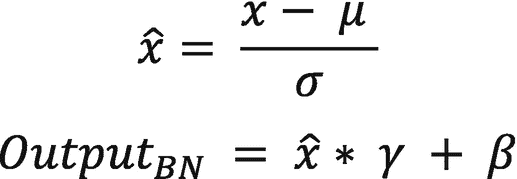

两个数学公式。第一个：`x_caret = (x - mu) / sigma`。第二个：`Output_BN = x_caret * gamma + beta`。

- `x` – 原始输入
- `μ` - 小批量的均值 – 不可训练参数
- `σ` – 小批量的标准差 – 不可训练参数
- `γ`, `β` – 归一化效果的参数 – 可训练参数

因此，批量归一化将额外的可训练参数纳入了模型架构。

幽灵批量归一化是与批量归一化相关的最新发展。当我们使用单个 GPU 进行训练，并且该单个 GPU 恰好填满一个批次时，这个概念是合理的。如果使用多个 GPU，训练可能会出现问题。幽灵批量归一化在这种情况下会有所帮助。它将 GPU 作为枢轴，并计算样本均值和标准差来进行归一化。鉴于它是在较小的样本量上工作，这也能对数据进行正则化。由于使用多个 GPU 导致的图像分布随机性，会在一定程度上改变损失函数。批量归一化已被证明是使模型能够更深层次发展的绝佳机制；它为现代架构带来了多方面的好处。


#### 丢弃法

丢弃法通常用于一维网络。在卷积神经网络中，部分模型确实会使用丢弃法，并且可以在除最后几层之外的每个卷积层之后应用。最后几层的维度较小，图像特征已经得到表示。丢弃法可以起到正则化作用。

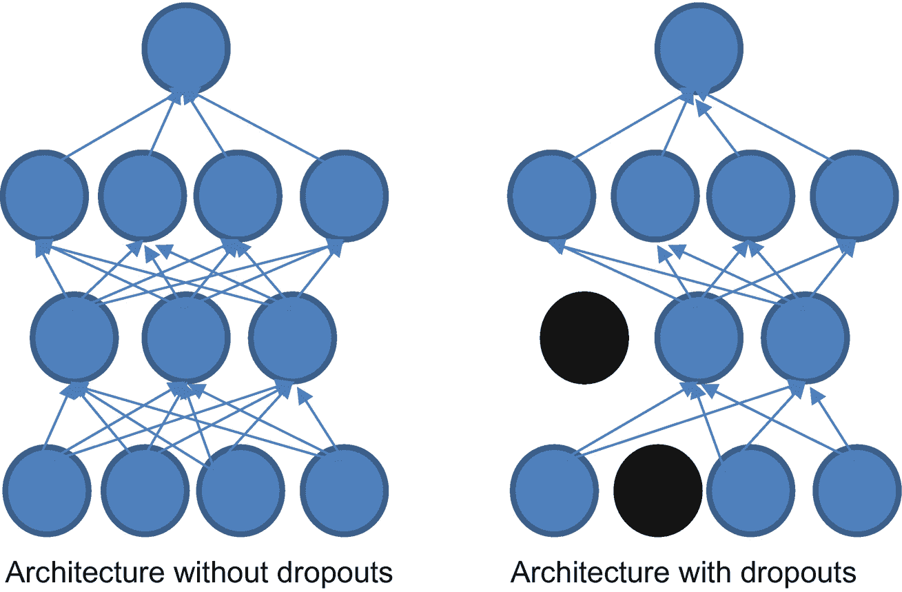

全连接网络中丢弃法示例的示意图。在没有丢弃法的架构中，由圆圈组成的各层从底层开始排列，连接到顶层，最终汇聚到最顶层的一个圆圈。而在丢弃法中，存在一些没有连接的圆圈。

**图 1-27** 全连接网络中的丢弃法示例

图 1-27 展示了丢弃法的应用。图像左侧是一个普通的神经网络，右侧则展示了除最后一层外所有层都应用丢弃法的情况。

#### 数据增强技术

深度学习架构需要大量数据才能在成本函数上实现良好的泛化。在现实场景中，往往无法获得足够的数据。数据增强用于在不影响图像实际标签或基本可区分特征的情况下生成数据点。例如，如果我们想增强一张猫的图片，就不能只向分类器提供尾巴的图像。尾巴可能是同一物种内的可区分特征，但也可能属于其他物体。

训练数据需要能够代表整体样本。图像可能存在大量变化、平移和亮度变化。以下列出几种数据增强技术：

*   **平移：** 图像可以在水平或垂直轴上进行平移。
*   **白化：** 用于增强已经可区分的特征。CNN 试图捕捉边缘和梯度，因此这会有帮助。
*   **缩放：** 对图像像素值进行缩放的过程。
*   **随机裁剪：** 随机裁剪图像的一部分，可以作为丢弃法的替代方案，因为图像的特定部分不会获得优先权。
*   **颜色偏移：** 我们可以使用色调和饱和度值进行偏移，也可以进行 RGB 通道偏移。
*   **弹性变形：** 我们可以尝试计算位移插值，在垂直和水平轴上移动一些点。
*   **混合：** 在某些分类模型场景中，我们可以使用此技术创建两个类别的混合，从而使 CNN 具备线性区分能力。
*   **高斯块：** 该技术向图像中的选定块添加随机噪声，从而增强模型的鲁棒性。
*   **基于增强的强化学习：** 我们可以创建模型并决定增强策略。这是一个成本高昂的过程，应谨慎使用。

数据增强技术有多种，其中大多数取决于我们期望的鲁棒性类型以及测试数据的需求。这是任何基于深度学习的建模中的一个重要方面。

### PyTorch 简介

深度学习建模需要高计算能力和定义良好的框架来进行优化。现有一些在研究界和开发者社区中非常流行的框架。所有这些框架都确保提供了有用且常用的函数。框架本质上建立了包和函数，帮助开发者轻松创建端到端的深度学习模型。

PyTorch 是一个用 C++ 和 Python 开发的框架，因此它经过优化且速度更快。它在其大部分开发中使用张量。它还支持在不同处理器架构中操作张量。它支持并行处理和在 CUDA 核心中进行处理，从而加速计算机视觉模型的训练。

以下部分讨论如何使用 PyTorch。

#### 安装

访问 `pytorch.org` 并选择要安装 PyTorch 的系统。例如，如果你想通过 `conda` 或 `pip` 安装该包，最好安装 CUDA 并加以利用。

```
/  install pytorch/torch 
```


### 基础入门

```python
import numpy as np
import torch
print(torch.__version__)
>> 1.9.0+cu102
```

以下是关于从 NumPy 转换为张量的基本操作。

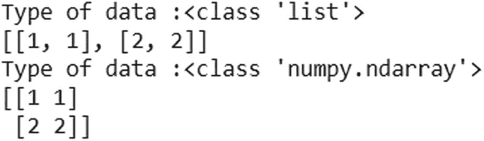

将 numpy 转换为 tensor py 操作的程序。该程序的数据类型为列表类，括号内为 1, 1 和 2, 2。数据类型为 numpy 类，n 维数组，括号内为 1, 1 和 2, 2。

**图 1-28a** 将 NumPy 转换为张量

```python
x1 = [[1,1],[2,2]]
print("Type of data :{}".format(type(x1)))
print(x1)
x1 = np.array(x1)
print("Type of data :{}".format(type(x1)))
print(x1)
```

这里，我们创建了一个列表并将其转换为 NumPy 数组。

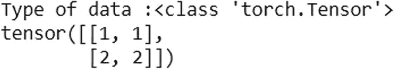

从数组生成张量的示例程序。该程序的数据类型为 torch 张量类。张量括号内为 1, 1 和 1, 2。

**图 1-28b** 将列表转换为张量

```python
x_tensor = torch.tensor(x1)
print("Type of data :{}".format(type(x_tensor)))
print(x_tensor)
```

这里，我们使用 `torch.tensor` 将 NumPy 数据转换为张量。

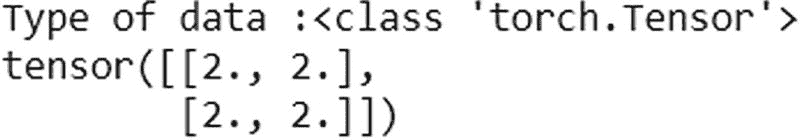

从数组生成张量的示例程序。该程序的数据类型为 torch 张量类。张量括号内为 1, 1 和 2, 2。

**图 1-28c** 从数组生成张量的示例

```python
x1 =np.array([[2,2],[2,2]])
x_tensor = torch.Tensor(x1)
print("Type of data :{}".format(type(x_tensor)))
print(x_tensor)
```

接下来，我们使用 `torch.Tensor` 将 NumPy 数组转换为 Torch 张量，这是一个构造函数，用于将现有数据转换为张量或创建一个未初始化的数据张量（`torch.empty`）。

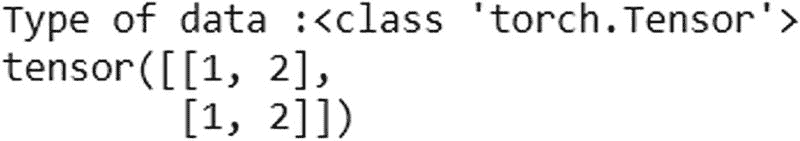

从数组生成张量的示例程序。该程序的数据类型为 torch 张量类。张量括号内为 1, 2 和 1, 2。

**图 1-28d** 从数组生成张量的示例

```python
x1 =np.array([[1,2],[1,2]])
x_tensor = torch.from_numpy(x1)
print("Type of data :{}".format(type(x_tensor)))
print(x_tensor)
```

此函数也用于从 NumPy 数组创建张量。现在让我们看看矩阵乘法中的一些函数：

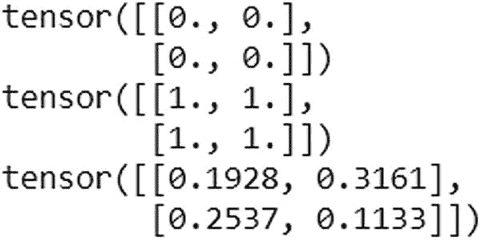

几个张量生成器的示例程序。程序输出为张量 (0, 0), (0, 0)；张量 (1, 1), (1, 1)；张量 (0.1928, 0.3161), (0.2537, 0.1133)。

**图 1-28e** 几个张量生成器的示例

```python
zero_t = torch.zeros((2,2))
print(zero_t)
one_t = torch.ones((2,2))
print(one_t)
rand_t = torch.rand(2,2)
print(rand_t)
```

我们正在创建一个全零、全一和另一个随机值的 Torch 张量。我们可以将其用于基本的线性代数运算。

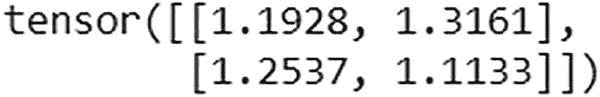

通过 PyTorch 操作进行张量加法的示例程序。程序输出为张量 (0.1928, 0.3161), (0.2537, 0.1133)。

**图 1-28f** 张量加法示例

```python
print(one_t + rand_t)
```

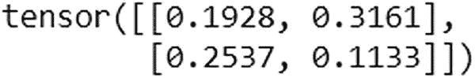

通过 PyTorch 操作进行张量乘法的示例程序。程序输出为张量 (0.1928, 0.3161), (0.2537, 0.1133)。

**图 1-28g** 张量乘法示例

```python
print(one_t*rand_t)
```

结果显示了两个矩阵的加法和乘法，详细展示了矩阵运算。

```python
array1 = torch.tensor([1,2,4])
array2 = torch.tensor([2,3,4])
print(torch.dot(array1,array2))
>> tensor(24)
```

`torch.dot` 函数计算两个一维张量的点积。

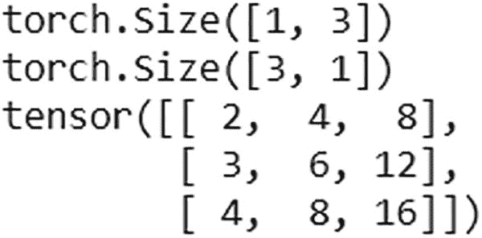

张量点积的示例程序。程序输出为 torch 大小 (1, 3)，torch 大小 (3, 1)。张量 (2 4 8, 3 6 12, 4 8 6)。

**图 1-28h** 张量点积示例

```python
array1 = torch.tensor([1,2,4]).reshape(1,-1)
print(array1.shape)
array2 = torch.tensor([2,3,4]).reshape(-1,1)
print(array2.shape)
print(torch.matmul(array2,array1))
```

## 总结

本章解释了进行点积和矩阵乘法的基本方法。我们可以将通道和输入视为三维张量。建模框架在计算机视觉模型中使用点积、逐元素乘法和其他线性代数运算。在接下来的章节中，我们将更深入地探讨使用 Torch 进行建模。

我们学习了卷积神经网络的基础知识以及它们如何帮助理解图像。

至此，我们结束了对计算机视觉概念的讨论。下一章我们将开始介绍应用和项目。

