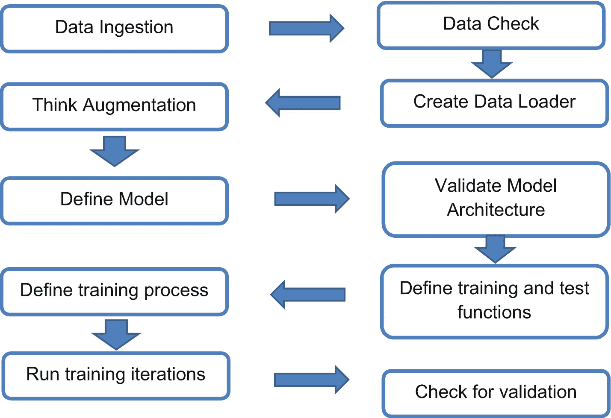

# 方法概述

我们将使用卷积神经网络来解决分类问题。我们会尝试调整流程中的变量，以追求更高的准确率和稳定的结果。在此过程中，将大量运用第 1 章学到的概念。这严格来说是一项实验，我们仅为需要迭代的方法设定基线标准。

该方法包含以下步骤：

1.  从数据源下载数据并将其放置在根目录中。
2.  检查数据完整性、可配置信息，如图像的形状、大小和分布。
3.  初始化用于训练和测试的数据加载器功能。
4.  定义模型架构并进行验证。
5.  定义训练和测试函数。
6.  定义训练优化器及其他训练信息，如正则化器、周期、批次等。
7.  训练并检查损失和准确率模式，以了解架构和模型训练过程的稳定性。
8.  在多个改进或变更阶段中，决定选择哪一个进行进一步调优或投入生产。

该方法的图形概览如图 2-1 所示，可作为解决方案的参考。

流程图展示了图像分类的机制。数据流如下：数据摄取、数据检查、创建数据加载器、考虑数据增强、定义模型、验证模型架构、定义训练和测试函数、定义训练过程、运行训练迭代、检查验证结果。

**图 2-1** 图像分类流水线

