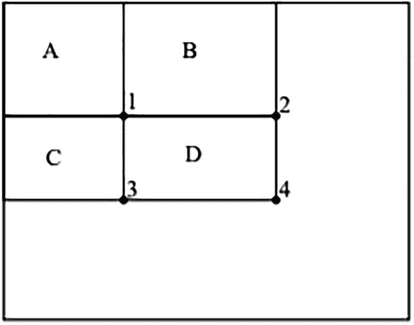
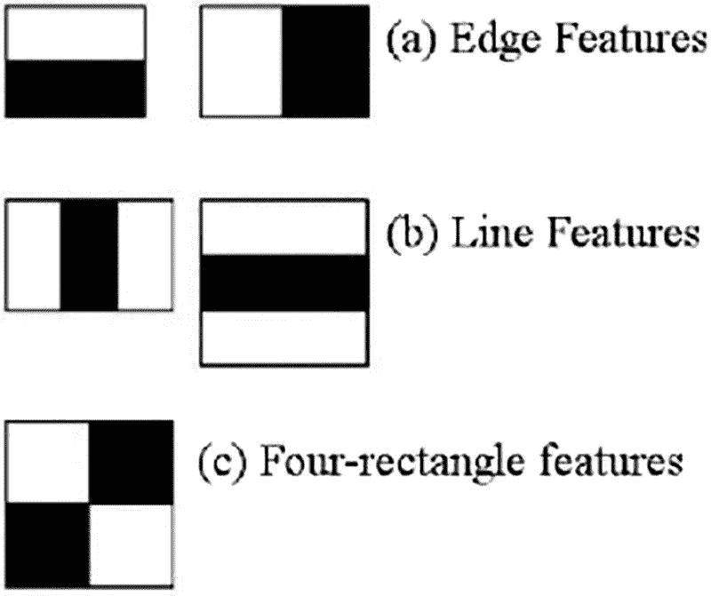

# 3. 构建目标检测模型

目标检测是当下最受欢迎的技能之一。一张图像可能包含多个类别。此外，对物体进行分类只解决了问题的一部分，另一部分在于物体的定位。目标检测有助于通过边界框识别图像中类别的具体位置。边界框可以进一步处理以完成各种子任务。例如，想象一下交通摄像头需要检测并识别车辆。

交通摄像头需要检测车辆和车牌，然后读取车牌上的号码以识别车主。这不是一个简单的问题。我们需要带标注的注册数据。一个简单的分类卷积神经网络模型无法胜任。我们需要获取车牌的边界框，并通过一系列数据清洗、去噪和超分辨率步骤来搜索字母数字字符。

近年来，目标检测领域取得了巨大进步。在众多目标检测方法中，我们可以将其历程划分为 2012 年前（或 AlexNet 前）时代和 2012 年后时代。2012 年前时代包括多种目标检测算法，如 HOG、Haar 级联、SIFT 的某些变体、SURF 等。2012 年后时代包括 RCNN、Fast RCNN、Faster RCNN、YOLO、单次检测器（SSD）等。

我们将简要回顾 2012 年前时代的 Haar 级联，以建立基于机器学习的目标检测技术的背景。要开始使用 Haar 级联，我们需要使用图像中的特征，而不是更细粒度的像素。Haar 级联于 2001 年提出，尽管年代久远，但它仍然是目前最快的算法之一。

## 使用提升级联进行目标检测

提升级联最初是为检测人脸而构建的，但它也可用于其他目标检测任务。它包含三个部分：积分图像、用于选择特征的提升算法以及级联分类器。

首先，输入图像需要转换为所谓的积分图像。积分图像可以通过简单的计算得到。



一个水平矩形的示意图。内部左上角是一个被分成 4 个部分的矩形，按顺时针方向标记为 A、B、C 和 D。线条分割的交点标记为 1、2、3 和 4。

图 3-2 中间步骤



四边形状的示意图，分为标记的边缘特征、标记的线特征和标记的四矩形特征。在 a 中，有两个矩形，一个被等分为两个水平部分，另一个被等分为两个垂直部分；在 b 中，一个被等分为三个水平部分，另一个被等分为三个垂直部分；在 c 中，一个正方形被等分为四个相等的部分。

图 3-1 特征提取器示例

图 3-1 中的图像展示了三种主要类型的特征提取器。第一种是边缘提取器，其次是线和矩形特征提取器。使用这些提取器，需要选择特征，而提升算法有助于选择必要的特征。自适应提升算法提供了一组重要特征，有助于更快地进行人脸识别。

积分图像是进行特征提取的中间步骤；它通过计算像素值计算点上方和左侧所有像素的总和来实现，如图 3-2 所示。

积分图像的计算如下：

*   位置 1 = A 矩形内的像素总和（考虑左侧和上方）
*   位置 2 = 像素总和 A + B
*   位置 3 = 像素总和 A（上方）+ C（左侧）
*   位置 4 = 像素总和 (4 + 1) – 总和 (2 + 3)

提取的特征与正样本和负样本进行比对，最终选出最佳特征。用于正负图像集的训练分类器由较弱的分类器构成。对于人脸检测，从多达 16 万个特征中，一系列弱分类器的提升算法有助于识别出 6000 个有用的特征。最终，级联分类器帮助检测类别。

所谓的*注意力级联*有助于减少计算时间并提高检测器的效率。图像被分割成多个子窗口，顺序的弱分类器对这些子窗口进行处理。每个分类器使用选定的特征，尝试检查目标是否存在。如果在任何一点分类器失败，所有后续分类器都会停止，序列移动到下一个子窗口，依此类推。如果所有分类器都能对所需目标的存在进行投票并得到边界框，则检测成功。

让我们通过一系列 Python 代码来使用现有模型检测人脸和眼睛。

按如下方式导入包：

```
import cv2
import gc
```

以下函数将从摄像头获取输入帧，并将其缩放以适应模型。由于彩色图像不会产生差异，因此考虑使用灰度图像。首先检测人脸，然后针对每张人脸，借助另一个眼睛检测器定位眼睛。

以下是处理人脸和眼睛级联的函数：

```
def detect_face_eye(frame):
## 归一化并将颜色转换为灰度
frame_to_gray = cv2.equalizeHist(cv2.cvtColor(frame, cv2.COLOR_BGR2GRAY))
## 应用程序应能处理不同尺度的图像
detected_faces = face_cascade.detectMultiScale(frame_to_gray)
for (x,y,w,h) in detected_faces:
center_face = (x + w//2, y + h//2)
## 绘制椭圆
frame = cv2.ellipse(frame, center_face, (w//2, h//2), 0, 0, 360, (125, 125, 125), 6)
face_regionofinterest = frame_to_gray[y:y+h,x:x+w]
#检测眼睛 - 针对每张检测到的人脸
## 类似的多尺度操作
detected_eyes = eyes_cascade.detectMultiScale(face_regionofinterest)
for (x2,y2,w2,h2) in detected_eyes:
center_eye = (x + x2 + w2//2, y + y2 + h2//2)
radius = int(round((w2 + h2)*0.25))
## 绘制圆形
frame = cv2.circle(frame, center_eye, radius, (255, 255, 255 ), 4)
cv2.imshow('--人脸检测--', frame)
```

这些模型可以在`open-cv`维护者提供的 GitHub 仓库中找到，地址为[`https://github.com/opencv/opencv/tree/master/data/haarcascades`](https://github.com/opencv/opencv/tree/master/data/haarcascades)。这段代码使用了两个模型，一个用于检测人脸，另一个用于检测眼睛。不过，仓库中还有其他模型，你可以进行尝试。该函数还将访问连接到系统的摄像头外设，并使用它们扫描人脸。

运行该函数以启用人脸和眼睛感知过程：

```
## 保存的 xml 路径
face_cascade_name = r' ..\chapter 3\frontal_face_alt.xml'
eyes_cascade_name = r' ..\chapter 3\eye_cascade_model.xml'
## 初始化用于检测的级联
face_cascade = cv2.CascadeClassifier()
eyes_cascade = cv2.CascadeClassifier()
## 加载级联，先加载人脸，后加载眼睛
face_cascade.load(cv2.samples.findFile(face_cascade_name))
eyes_cascade.load(cv2.samples.findFile(eyes_cascade_name))
camera_device = 0
## 启用视频处理
capture_cam_img = cv2.VideoCapture(camera_device)
## 启用分类器对人脸进行操作
if capture_cam_img.isOpened :
while True:
ret, frame = capture_cam_img.read()
detect_face_eye(frame)
## 按下 ESC 键关闭 CV 视频感知
if cv2.waitKey(10) == 27:
cv2.destroyAllWindows()
gc.collect()
break
```

现在我们对结构化目标检测有了一些了解，可以转向另一种先进的目标检测技术，称为 R-CNN。


