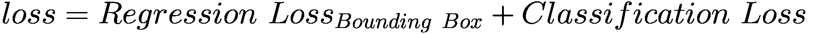

# R-CNN

长期以来，物体都是通过图像分割来分离的。最终，图像的层次性给开发者带来了瓶颈。试想一下，如果我们试图在车流中定位一辆汽车里的人。可以使用穷举搜索机制来扫描每辆车，以精确找到人的位置，但所需的计算量过高，难以实用。

面对这些问题，一篇题为《用于目标识别的选择性搜索》的论文试图解决生成目标位置的问题。它结合了分割和穷举搜索这两者的优点。以下步骤展示了选择性搜索机制的工作原理。

该算法的工作原理如下：

1.  该算法使用高效的基于图的分割来生成初始区域。
2.  第二阶段尝试对相似区域进行分组，以在输入图像中生成片段。对于所有已创建的区域，会计算所有相邻元素之间的相似度得分。两个最相似的区域被合并在一起，并重新计算得分。此过程重复进行，直到整个图像都被这些操作覆盖。
3.  选择过程是复杂的。它使用多种策略将相似区域聚合在一起。如果两个区域被合并，这些区域的特征可以通过层级结构进行传播。
4.  选择标准依赖于互补的颜色空间，它在多种空间中采用层次分组算法，包括寻找互补的颜色空间。总体而言，四种快速高效的策略为该算法提供了支持。

该算法的主要目标是在其策略下，找到多样且互补的特征来对区域进行分组。

目标检测领域的先驱是`HOG`（方向梯度直方图）和`SIFT`。当视觉任务的复杂性被认识到后，一种不同的方法被开发出来。

## 区域提议网络

图 3-3 描述了区域提议网络中目标检测的各个步骤。让我们来看一下重要的步骤：

1.  生成分割和多个候选区域。
2.  使用贪婪学习算法递归地将相似区域合并成更大的区域。
3.  将带有提议的图像发送到用于分类目标的卷积神经网络架构中。
4.  在标准 R-CNN 中使用的`AlexNET`的情况下，使用`227 x 227`作为图像的形状。
5.  大约 2000 个区域被发送到`AlexNET`，并传递 4096 个向量。
6.  提取的特征会与针对特定类别训练的`SVM`进行评估。
7.  在所有区域被评分后，对分类后的区域执行非极大值抑制。它会消除`IOU`低于阈值的区域，为覆盖范围更大且高于阈值的区域铺平道路。


左侧是一个标记为“输入图像”的方框示意图，右侧从上到下依次是：一个包含两个方框（对象 1、对象 2）和一个未标记方框的矩形，其下方是“区域提议”，一个标记为“输入图像”的方框，一个内部包含连接方框的矩形（CNN 特征），并通过箭头连接到两个方框（对象 1 和对象 2）。

图 3-3

通过区域提议进行目标检测

图

有趣的是，当算法定位到 2000 个感兴趣区域时，它会从提议的区域生成扭曲的图像内容。由于卷积块需要固定的尺寸，信息会在空间上被扭曲并传递。

然后，这些区域中的每一个都由支持向量机进行分类。此外，该算法将执行回归，以修正或预测最初预测的边界框的任何偏移。在进入下一步之前，让我们回顾两个重要的概念，它们将在后续内容中多次使用。

-   **非极大值抑制。** 在目标检测算法中，经常会出现多个边界框重叠在单个对象周围的情况。分类器通常需要为不同大小的感兴趣区域生成概率分数。为了解决选择一个最佳边界框的问题，该算法使用分类信息和对象上的覆盖百分比。
-   **交并比（IoU）。** 用于选择与真实值最相似的边界框。在处理图像分类时，我们试图将图像映射到它们各自的类别。同样，对于目标检测，需要手动绘制边界框来定位不同的对象和类别。该公式给出了交集与并集的比率。

`IoU`的公式如下：

```
IoU = (边界框 1 ∩ 边界框 2) / (边界框 1 ∪ 边界框 2)
```

图 3-4a 显示了一个包含两个重叠边界框的图像，一个是真实框，另一个是预测框。图 3-4b 显示了由两者聚合的区域。这两个方面相互平衡，以获得真实值的最大覆盖范围。


一个水平方框的示意图。内部有两个不同颜色的水平矩形。两者都被着色，并且它们的两个角连接在一起形成一个正方形。形成的正方形也被着色。

图 3-4b

边界框并集


一个水平方框的示意图。内部有两个不同颜色的水平矩形。它们的两个角连接在一起形成一个正方形。形成的正方形被着色。

图 3-4a

边界框交集

总的来说，该算法能够处理许多与目标检测相关的问题，并且在发布时是最具革命性的算法之一。但它并非没有缺陷。现在让我们深入探讨它的一些明显缺陷：

-   借助复杂的图像处理技术，模型将生成 2000 个感兴趣区域。所有这些区域都需要由支持向量机进行分类。这个过程涉及巨大的计算量。
-   大多数算法在预测时，分类和处理图像需要花费大量时间。如果我们要处理实时解决方案，几乎不可能将此模型用作算法。
-   训练发生在卷积部分；分类器和回归正在修正边界框参数。
-   在算法的初始部分，使用选择性搜索机制来分割相似区域并共同生成感兴趣区域。整个过程基于复杂图像处理技术的搭配。该过程中不涉及学习，因此改进的空间很小。

尽管 R-CNN 解决了目标检测中的诸多问题，但它也留下了一系列需要解决的问题。随后出现了一种基于区域的目标检测网络的改进版本，称为快速区域卷积网络。


### 快速区域卷积神经网络

为了设定背景，假设有一张需要执行目标检测的图像，根据简单的区域卷积神经网络，它会在简单图像的基础上生成感兴趣区域。组合数量会非常庞大。但如果我们能将图像在（`x`，`y`）维度上缩小到更小的尺寸，我们仍然能获取到包含正确目标信息的图像部分。最终，这归结为我们如何将信息传递给后续层以及损失函数。快速 R-CNN 实现了更快的运算。

图 3-5 描绘了基于一个感兴趣区域的工作流程。该架构表明，对输入数据执行了卷积操作，从而减少了计算量。


一张示意图，从左到右依次为：一个名为“输入图像”的方框，两个分别名为“CNN”和“ROI”的右向箭头，它们下方是“投影”，右侧是一个名为“卷积特征图”的直立长方体，一个向下的箭头，一个名为“ROI 池化层”的直立长方体，一系列名为“全连接层”的条形，以及两个名为“SoftMax”和“B BOX 回归器”的条形。

图 3-5

快速 R-CNN 架构

基于区域的快速目标检测所涉及的过程如下：

1.  通过多次卷积和池化操作创建特征图。
2.  由于全连接网络需要固定维度的向量，感兴趣区域的池化层会提取一个固定长度的向量。
3.  这些特征向量中的每一个都被输入到全连接网络中，该网络再次连接到输出层。
4.  第一个连接层包含 softmax 概率估计的计算，涵盖 *n* 个目标类别以及一个额外的背景或未知类别。
5.  第二个输出层为每个目标类别预测四个实数。每组数值定义了该类别修正后的边界框值。

我们介绍的每一种架构都使用选择性搜索算法来寻找感兴趣区域。这存在两个问题。首先，复杂的计算机视觉过程无法学习数据中的任何变化，因为它有一套关于如何识别区域的固定指令集。其次，选择性搜索是一个缓慢且耗时的过程。这些问题在算法的升级版本（称为更快的 R-CNN）中得到了解决。

### 区域提议网络的工作原理

随后出现了一个扩展思路，该思路不仅被提出，而且得到了实现。它使用神经网络来预测区域提议，而无需选择性搜索机制。区域提议网络的出现有助于识别图像中的边界框，然后将相同的块发送给卷积神经网络以生成特征图。

最终，损失函数在特征图上进行训练，并调整网络权重以适应训练。让我们逐步了解这个过程：

1.  第一步，将输入图像传递到卷积块以生成卷积特征图。
2.  区域提议网络在特征图的每个位置使用一个滑动窗口。
3.  对于每个位置，使用九个锚点框，它们具有三种不同的尺度和三种宽高比（1:1、1:2、2:1），这有助于生成区域提议。
4.  分类层输出锚点框中是否存在目标。
5.  回归层指示锚点框的坐标。
6.  锚点框被传递到快速 R-CNN 架构的感兴趣区域池化层。

我们使用神经网络来学习区域提议的位置以及如何根据数据进行调整。这也使得该过程比我们之前了解的方法快得多。图 3-6 展示了来自更快的 R-CNN 原始研究论文的架构。


一张示意图，从下到上依次为：一张部分被覆盖的照片，名为“图像”，其上方是一个名为“卷积层”的长方体，一个向上的箭头，一个名为“特征图”的平行四边形，区域提议网络，一个向上的箭头，一个名为“提议”的平行四边形，向上的箭头，ROI 池化，一个名为“分类器”的平行四边形，一个向上的箭头。

图 3-6

更快的 R-CNN 总结

该网络有一个新颖的想法，即区域提议网络，它可以学习边界框并对其进行泛化。它主要有三种类型的网络：

*   **头部：** 可以是 ResNet 架构，用于生成特征图。
*   **区域提议网络：** 为分类器和回归器生成感兴趣区域。
*   **分类网络/回归网络：** 处理目标分类和目标性，或边界框坐标的正确性。

图 3-7 描绘了更快的 R-CNN 的基本层。让我们深入了解细节，这将有助于层的开发。


一个流程图。流程如下：锚点生成层到区域提议层到 ROI 池化层，一个向下的箭头，以及分类层。

图 3-7

更快的 R-CNN 流程图

### 锚点生成层

该层生成一系列具有不同尺寸和宽高比的边界框，以覆盖大部分图像区域。这些边界框或锚点框将包含图像及其目标。然而，这些框将与内容无关且始终保持一致，最终区域提议网络将对它们进行处理，并识别出哪个是更好的边界框。微小的调整将带来更好的边界框。

由于预测这些坐标存在一些问题，另一种方法是将一个参考框作为边界框的标准。以一个参考框（`X[中心]`、`Y[中心]`、宽度和高度）作为基准，然后尝试预测并修正偏移值，使其更贴合。偏移值针对所有四个参数。

### 区域提议层

区域提议网络负责改变锚点框的位置、宽度和高度，以更好地贴合目标。该层可以被视为区域提议网络、提议层、锚点目标层和提议目标层的组合。

*   **区域提议网络：** 该层使用特征图并将其输入到卷积神经网络。然后将输出传递到两个 1x1 卷积层，以生成对应于边界框的回归系数、类别分数和概率。
*   **提议层：** 该层接收大量的锚点框，并借助基于前景分数的非极大值抑制，将其减少到适当的数量。它还使用区域提议网络生成的系数来更改边界框的坐标。
*   **锚点目标层：** 这有助于选择那些帮助 RPN 区分前景和背景的锚点框。

RPN 的损失函数是分类损失和回归损失的组合。



总体而言，更快的 R-CNN 具有基于卷积神经网络的图像特征提取器和用于生成感兴趣区域的区域提议网络。我们使用 ROI 池化将图像调整为后续层所需的固定维度，最后进入分类和回归层。这有助于锚点框更好地贴合，并足以区分前景和背景。


