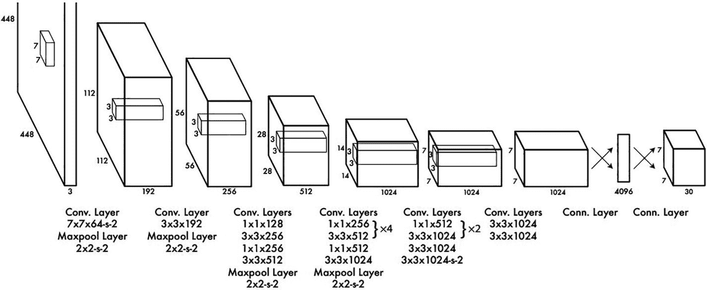
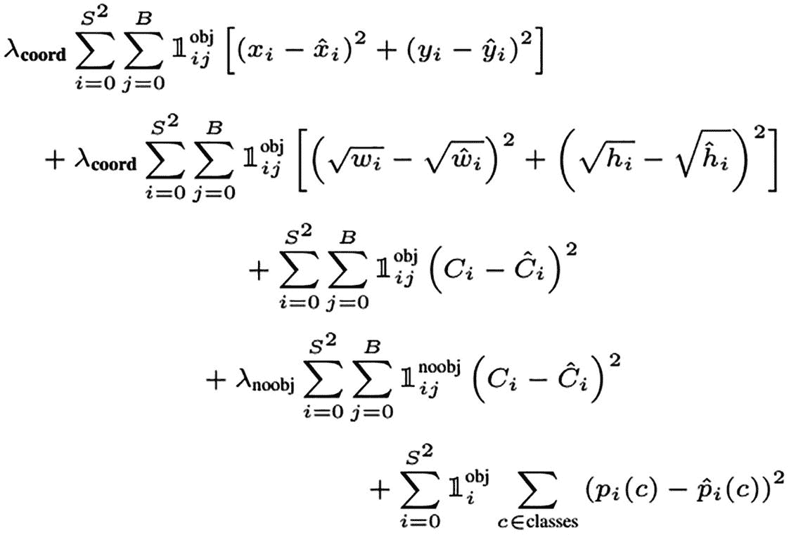
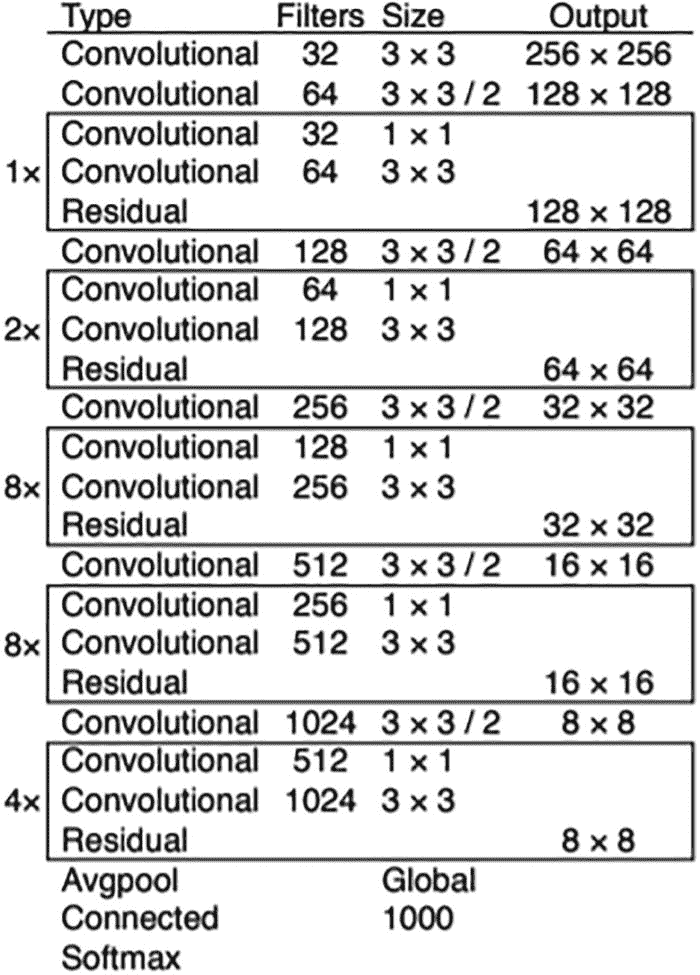
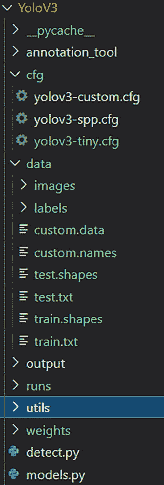
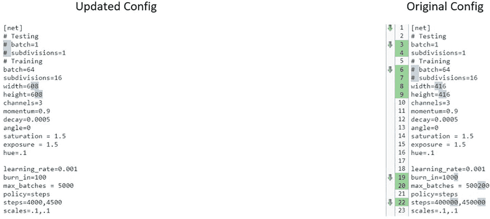
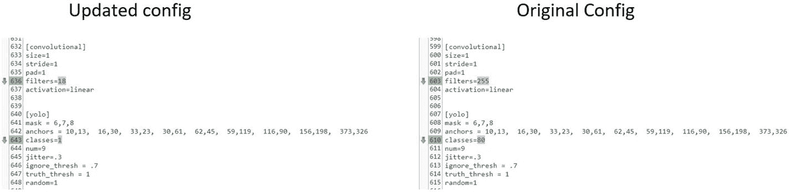

# Mask R-CNN

在 Faster R-CNN 已有成果的基础上，Mask R-CNN 进一步扩展，能够预测检测对象上的掩码。在 ROI 池化层之后，又增加了两个卷积神经网络来生成掩码。该方法还确立了 `ROI Align`，有助于更好地将提取的特征与输入对齐，并避免 Faster R-CNN 中曾出现的变形问题。它使用双线性插值来获取输入区域的精确或近乎完美的值。

所有这些目标检测方法中产生的一个重要步骤是锚点框的使用。`YOLO` 在此基础上进行了一些额外的改进，我们将在下文探讨。

## 前提条件


一张两只鸟在飞行的照片。两只鸟都被一个框标记出来。

图 3-8：带有标注的鸟类图像

- **标注。** 在分类问题中，图像需要按照其所属类别进行排序或整理。类似地，在目标检测问题中，图像需要用适当的边界框（通常称为真实标注）进行标记。边界框的作用是提供对象坐标以及所包含类别的信息。图 3-8 展示了一个已标注图像的实例，用于训练一个定位鸟类的分类器。通常，标注是手动完成的，有时会进行多次，以获得无偏的真实标注。然而，如果像现在这样只是为了练习，我们可以使用任何开源数据进行实验。

- **首选 GPU。** 在执行需要训练和运行推理的计算机视觉任务时，建议使用支持 CUDA 的 GPU 核心以加快处理速度。

- **安装支持 CUDA 的 Torch 框架。** 我们还需要在系统上安装 `PyTorch`，如前一章所述。

## YOLO

对于能够帮助实现实时推理的目标检测算法，一直存在巨大的需求。Faster R-CNN 已经非常接近这一目标，它处理了 2000 个边界框预测并超越了传统的计算机视觉方法。与之前的算法相比，它有了显著的改进，但仍有提升空间。

随后出现了革命性的算法 `YOLO`，它能够以每秒 45 帧的速度（在 TITAN X 上）检测对象。早期的模型在训练和预测的不同阶段（如锚点生成层、区域提议层、分类和边界框修正）花费了太多时间。而 `YOLO` 则试图通过一个卷积神经网络块来同时预测边界框和类别，从而减少计算时间。它采用了一种更通用的训练方式，并从整个图像中考虑信息，而不是将信息拼凑起来。最终，它超越了其他试图实现相同目标的前代算法。

图 3-9 展示了 `YOLO` 的架构，该架构受用于图像分类的 `GoogleNet` 架构启发。输入层的维度为 448x448x3。该网络包含 24 个卷积层和批量最大池化层，以及两个全连接层。



一张示意图，从左到右依次为：一个内部有 7x7 立方体的层，一系列尺寸分别为 112x112、56x56、28x28、14x14、7x7 和 7x7 的 6 个层，2 个箭头，竖线，箭头，以及一个尺寸为 7x7 的立方体。方框下方是对应的卷积层维度。只有前 4 个层有最大池化层。

图 3-9：YOLO 架构

训练过程相当昂贵，因此从头开始训练一个目标检测模型需要良好的管理。该给定架构的训练通过两种方式进行。首先，模型在 `ImageNet` 数据上进行训练，使用前 20 个卷积层，并通过平均池化来匹配全连接网络的维度。这个模块训练了一周，达到了 88% 的准确率。

在这个预训练网络的基础上，添加了四个卷积层和两个全连接层，以得到最终的检测对象。输入维度也从 224x224 增加到 448x448，这有助于提升检测能力。最后一层预测分类分数和边界框坐标。边界框的宽度和高度被归一化。

图 3-10 展示了用于优化分类和回归的损失函数。对于五个锚点框中的每一个，都有一个目标性分数、四个对应于归一化边界框的坐标，以及最高的类别概率或分数。这些改进效果不错，但还需要进一步优化。让我们看看第二个版本的更新以及版本 3，它曾是最流行的模型之一。



一个方程图示：lambda 下标坐标，S 上标 2 求和，B 求和，i 等于 0，j 等于 0，1 对象上标 i j，括号，x 下标 i 减去 x 下标 i，上标 2，加 y 下标 i，减去 y 下标 2，上标 2，括号，以及后续方程。

图 3-10：YOLO 损失函数


## YOLO V2/V3

YOLO 的改进非常显著，第二个版本将方法微调到了更高效的层面。以下是第二版中解决的一些关键点：

-   卷积层深度较大，因此始终存在梯度消失或梯度爆炸的风险。添加了批归一化以帮助解决学习过程中的内部协变量偏移。
-   它为每个锚框预测类别和物体置信度。
-   网络还预测五个边界框以及每个边界框的五个坐标。
-   一个重大的架构变化是移除了全连接层，并用锚框来预测边界框。
-   这些锚框是通过对真实边界框进行聚类来确定的。

即使在多次修改之后，研究人员发现还可以进行一些更改来提高准确率。他们进行了必要的修改，并将此版本命名为 YOLO V3。它可以说是最受欢迎的目标检测架构之一。YOLO 使用 `softmax` 层来获取最终的分类分数，而 YOLO V3 则采用对输入进行独立的逻辑回归或多标签分类。有趣的是，它还移除了池化层，转而使用步长为 `2` 的 `3x3` 卷积来降低维度。

该架构还对损失函数进行了修改，产生了三个主要的预测输出——边界框的坐标、物体置信度值和类别分数。YOLO V3 架构中最流行的骨干网络是 `Darnet-53`，这是一个由卷积块组成的 53 层架构，如图 3-11 所示。它使用带有 `3x3` 和 `1x1` 卷积层的残差实现来获取用于检测和分类的特征。总体而言，这些更改对架构的准确率和优化产生了巨大影响。



一个表格有 4 个表头：类型、过滤器、尺寸和输出。行包含框起来的条目，并标记为 1 X、2 X、8 X、8 X 和 4 X。框起来的区域包括 2 种卷积类型的过滤器和尺寸的条目，以及一个残差输出尺寸。类型下的最后 3 个条目是平均池化、全连接和 Soft Max。

**图 3-11** Darknet 53 架构

让我们看一些使用已保存模型并针对自定义数据集进行微调的代码。为什么我们不从头开始训练呢？这些都是重量级模型，我们并不总是有足够的 GPU 能力从头开始训练。其次，使用预训练权重并相应地修改它们是一种学习体验。我们将反复提到的一个术语是*迁移学习*。

## 项目代码片段

该代码片段改编自 YOLO 的原始创建者，所有源代码归功于 Joseph Redmon 和 Ali Farhadi。尽管从头开始训练相当复杂，但我们可以尝试使用现有的开源模型对这些数据进行迁移学习。如果原始模型训练的类别与我们使用的类别非常相似，我们也可以使用现有模型对我们的数据进行推理。

文件夹设置需要遵循原始创建者的方式，因为我们将使用保存的模型来自定义训练我们的数据。如图 3-12 所示，对于任何变化，路径应根据配置文件在 `data` 目录下进行修正。



代码显示为：倒 V，Yolo V r，小于 下划线 p y 缓存 下划线，小于 注释 工具，倒 V，c f g，设置图标，Yolo v3，自定义 点 c f g，设置图标，Yolo v3，s p p 点 c f g，设置图标，Yolo v3，s p p tiny 点 c f g，倒 V，data，小于 images。下方，小于 utils 被框起来。

**图 3-12** YOLO 的文件夹结构

### 步骤 1：获取标注数据

当我们想要训练自定义数据时，图像标注是目标检测算法最重要的先决条件之一。它们帮助模型处理分类和回归损失函数。它们包含了手动解析的真实值。有多个开源位置可以让我们标注图像。该工具通常有一个标记器，可以帮助在图像上绘制某种形状的边界框。该程序允许以 JSON、CSV 或 VOC/COCO 格式下载标注，具体取决于所使用的模型。训练数据和自定义数据应该保持一致。

标注正确且对标注者真实至关重要。由于这是一项手动且重复的任务，因此需要尽可能做到最好。最终，生成的文件应被下载并放置在 `data` 文件夹中。例如，每张图像可能看起来像这样：

- `0 0.41833333333333333 0.2112676056338028 0.2011111111111111 0.2007042253521127`
- `2 0.43777777777777777 0.3970070422535211 0.11555555555555555 0.15669014084507044`
- `1 0.38722222222222225 0.6813380281690141 0.47 0.4119718309859155`

一旦我们汇总了新文件，我们就可以看到如何更改数据文件。在图 3-12 中，`data` 下的文件夹主要是 `labels` 和 `images`。`images` 包含与标注图像同名的原始图像。文本文件需要包含标注信息并放置在 `labels` 中。这可以是文本文件或 JSON。

完成后，我们将检查文件的自定义数据文件，该文件需要更新信息，例如训练和测试文件信息的存储位置。我们需要在此处提供两种信息——标签和图像的路径以及实际图像。自定义数据文件将如下所示：

- `classes=4`
- `train=data/train.txt`
- `valid=data/test.txt`
- `names=data/custom.names`

这提供了关于数据及其位置的相关信息。完成后，我们需要在 `custom.names` 文件中提供类别名称。它将如下所示：

- `hardhat`
- `vest`
- `mask`
- `boots`

此文件将类别名称与前面链接的数字对应起来。如前所述，我们需要包含图像路径的 `train.txt` 和 `test.txt` 文件。这些文件应包含运行训练函数的相对路径。

还有其他文件，例如训练和测试形状（`train.shapes` 和 `test.shapes`），它们包含所有文件的形状，我们可以根据输入数据进行更改。

完成所有这些后，我们必须从来源和原始研究人员处下载保存的权重，网址为 [`https://pjreddie.com/darknet/yolo/`](https://pjreddie.com/darknet/yolo/)。根据项目工作者的 GPU 性能，有多种选项可供选择。权重和配置文件是相互关联的。因此，请务必下载与权重对应的配置文件。通过这些主要步骤，初始设置就完成了。现在我们进入下一个流程。


### 步骤 2：修复配置文件与训练

另一项重要任务是根据需求和资源修改配置文件。图 3-13 展示了训练和测试配置中的首批改动。其中提供了修改 `batch`（批次大小）、`width`（宽度）、`height`（高度）、`channels`（通道数）、`momentum`（动量）和 `decay`（衰减）等参数的设置项。



表格包含两个表头：更新后的配置和原始配置。在第一列中，`batch` 和 `subdivisions` 之前的哈希键被高亮显示，`width` 和 `height` 之后的数字 `08` 也同样被高亮。在下一列中，左侧面板上的数字 `3`、`4`、`6`、`7`、`8`、`9`、`19`、`20` 和 `22` 被着色，以指示右侧的高亮数字。

**图 3-13** – 训练/测试配置文件的改动

诸如 `learning rates`（学习率）和 `burn-in`（预热）等重要参数也已提供。除了这些改动之外，还有关于 `classes`（类别数）和最终层的修改。由于我们将针对包含 80 个类别的原始训练方法进行自定义训练，因此具体情况可能会有所不同。图 3-14 展示了一些必要的改动。如果训练可以在默认的 `coco` 数据集上进行，则可以使用原始的配置文件。



展示了训练流程的更新后配置和原始配置。

**图 3-14** – 训练/推理流程配置所需的改动

配置文件中所有 `classes` 和 `filters` 的实例都需要更改。我们需要将 YOLO 层之前的实例中的 `[filters=255]` 更改为 `filters=(类别数 + 5)x3`，如第 640 行所示。

完成这些更改后，我们就可以进入训练部分了。只需要运行一个任务。

```
!python train.py --data $PATH/custom.data --batch $num_batches --cache --epochs $num_epochs –nosave
$num_batches = 批次数量
$num_epochs = 训练的轮数（请记住这是迁移学习，并且我们已经在使用保存的权重）
$path = 自定义数据的路径。
```

如果内存不足，我们可以尝试通过使用更小的已保存模型进行训练来减少模型参数，或者减小批次大小或图像分辨率。选择哪种方法，只要觉得简单且合适即可。

该项目依赖项过多，建议直接参考并使用优化后的代码版本，以节省时间。训练代码、模型代码和配置代码是相互关联的。配置文件直接影响训练过程和模型设置。让我们看看研究人员使用的源代码中用于模型定义的 Python 代码。

### 模型文件

代码中多次使用了 `torchvision` 和 `torch` 函数的标准导入。`parse` 包用于获取命令行参数。模型文件中出现的第一个函数是 `create_modules` 函数。让我们了解一些重要步骤，以防出现“从头开始训练”的情况。

```
def create_modules(module_defs, img_size):
# 根据 module_defs 中的模块配置构建层块的模块列表
img_size = [img_size] * 2 if isinstance(img_size, int) else img_size  # 如有必要则展开
_ = module_defs.pop(0)  # 配置训练超参数（未使用）
output_filters = [3]  # 输入通道数
module_list = nn.ModuleList()
routs = []  # 路由到更深层的层列表
yolo_index = -1
for i, mdef in enumerate(module_defs):
modules = nn.Sequential()
if mdef['type'] == 'convolutional':
bn = mdef['batch_normalize']
filters = mdef['filters']
k = mdef['size']  # 卷积核大小
stride = mdef['stride'] if 'stride' in mdef else (mdef['stride_y'], mdef['stride_x'])
if isinstance(k, int):  # 单尺寸卷积
modules.add_module('Conv2d', nn.Conv2d(in_channels=output_filters[-1],
out_channels=filters,
kernel_size=k,
stride=stride,
padding=k // 2 if mdef['pad'] else 0,
groups=mdef['groups'] if 'groups' in mdef else 1,
bias=not bn))
else:  # 多尺寸卷积
modules.add_module('MixConv2d', MixConv2d(in_ch=output_filters[-1],
out_ch=filters,
k=k,
stride=stride,
bias=not bn))
if bn:
modules.add_module('BatchNorm2d', nn.BatchNorm2d(filters, momentum=0.03, eps=1E-4))
else:
routs.append(i)  # 检测输出（进入 YOLO 层）
if mdef['activation'] == 'leaky':  # 激活函数研究 https://github.com/ultralytics/yolov3/issues/441
modules.add_module('activation', nn.LeakyReLU(0.1, inplace=True))
# modules.add_module('activation', nn.PReLU(num_parameters=1, init=0.10))
elif mdef['activation'] == 'swish':
modules.add_module('activation', Swish())
elif mdef['type'] == 'BatchNorm2d':
filters = output_filters[-1]
modules = nn.BatchNorm2d(filters, momentum=0.03, eps=1E-4)
if i == 0 and filters == 3:  # 标准化 RGB 图像
# imagenet 均值和方差 https://pytorch.org/docs/stable/torchvision/models.html#classification
modules.running_mean = torch.tensor([0.485, 0.456, 0.406])
modules.running_var = torch.tensor([0.0524, 0.0502, 0.0506])
elif mdef['type'] == 'maxpool':
k = mdef['size']  # 卷积核大小
stride = mdef['stride']
maxpool = nn.MaxPool2d(kernel_size=k, stride=stride, padding=(k - 1) // 2)
if k == 2 and stride == 1:  # yolov3-tiny
modules.add_module('ZeroPad2d', nn.ZeroPad2d((0, 1, 0, 1)))
modules.add_module('MaxPool2d', maxpool)
else:
modules = maxpool
elif mdef['type'] == 'upsample':
if ONNX_EXPORT:  # 明确指定大小，避免使用 scale_factor
g = (yolo_index + 1) * 2 / 32  # 增益
modules = nn.Upsample(size=tuple(int(x * g) for x in img_size))  # img_size = (320, 192)
else:
modules = nn.Upsample(scale_factor=mdef['stride'])
elif mdef['type'] == 'route':  # 'route' 层的 nn.Sequential() 占位符
layers = mdef['layers']
filters = sum([output_filters[l + 1 if l > 0 else l] for l in layers])
routs.extend([i + l if l < 0 else l for l in layers])
modules = FeatureConcat(layers=layers)
elif mdef['type'] == 'shortcut':  # 'shortcut' 层的 nn.Sequential() 占位符
layers = mdef['from']
filters = output_filters[-1]
routs.extend([i + l if l < 0 else l for l in layers])
modules = WeightedFeatureFusion(layers=layers, weight='weights_type' in mdef)
elif mdef['type'] == 'reorg3d':  # yolov3-spp-pan-scale
pass
elif mdef['type'] == 'yolo':
yolo_index += 1
stride = [32, 16, 8, 4, 2][yolo_index]  # P3-P7 步长
layers = mdef['from'] if 'from' in mdef else []
modules = YOLOLayer(anchors=mdef['anchors'][mdef['mask']],  # 锚点列表
nc=mdef['classes'],  # 类别数
img_size=img_size,  # (416, 416)
yolo_index=yolo_index,  # 0, 1, 2...
layers=layers,  # 输出层
stride=stride)
# 初始化前面的 Conv2d() 偏置 (https://arxiv.org/pdf/1708.02002.pdf 第 3.3 节)
try:
j = layers[yolo_index] if 'from' in mdef else -1
bias_ = module_list[j][0].bias  # shape(255,)
bias = bias_[:modules.no * modules.na].view(modules.na, -1)  # shape(3,85)
bias[:, 4] += -4.5  # 目标
bias[:, 5:] += math.log(0.6 / (modules.nc - 0.99))  # 类别 (sigmoid(p) = 1/nc)
module_list[j][0].bias = torch.nn.Parameter(bias_, requires_grad=bias_.requires_grad)
except:
print('警告：智能偏置初始化失败。')
else:
print('警告：无法识别的层类型：' + mdef['type'])
# 注册模块列表和输出过滤器数量
module_list.append(modules)
output_filters.append(filters)
routs_binary = [False] * (i + 1)
for i in routs:
routs_binary[i] = True
return module_list, routs_binary
```


该代码中的关键步骤如下：

1.  初始化一个顺序模型，该模型设置了模型块的上下文。
2.  模型从命令行接收参数，并获取与批归一化、滤波器、激活函数和卷积相关的变量。
3.  可以选择将模型保存为 ONNX 版本。

在初始模型定义之后，我们有了 `YOLOLayer` 类，它使用函数根据接收到的配置来定义模型。让我们看看源研究提供的代码。

```python
class YOLOLayer(nn.Module):
    def __init__(self, anchors, nc, img_size, yolo_index, layers, stride):
        super(YOLOLayer, self).__init__()
        self.anchors = torch.Tensor(anchors)
        self.index = yolo_index  # 该层在 layers 中的索引
        self.layers = layers  # 模型输出层索引
        self.stride = stride  # 层步长
        self.nl = len(layers)  # 输出层数量 (3)
        self.na = len(anchors)  # 锚框数量 (3)
        self.nc = nc  # 类别数量 (80)
        self.no = nc + 5  # 输出数量 (85)
        self.nx, self.ny, self.ng = 0, 0, 0  # 初始化 x, y 网格点数
        self.anchor_vec = self.anchors / self.stride
        self.anchor_wh = self.anchor_vec.view(1, self.na, 1, 1, 2)
        if ONNX_EXPORT:
            self.training = False
            self.create_grids((img_size[1] // stride, img_size[0] // stride))  # x, y 网格点数

    def create_grids(self, ng=(13, 13), device='cpu'):
        self.nx, self.ny = ng  # x 和 y 网格大小
        self.ng = torch.tensor(ng)
        # 构建 xy 偏移量
        if not self.training:
            yv, xv = torch.meshgrid([torch.arange(self.ny, device=device), torch.arange(self.nx, device=device)])
            self.grid = torch.stack((xv, yv), 2).view((1, 1, self.ny, self.nx, 2)).float()
        if self.anchor_vec.device != device:
            self.anchor_vec = self.anchor_vec.to(device)
            self.anchor_wh = self.anchor_wh.to(device)

    def forward(self, p, out):
        ASFF = False  # https://arxiv.org/abs/1911.09516
        if ASFF:
            i, n = self.index, self.nl  # layers 中的索引，层数
            p = out[self.layers[i]]
            bs, _, ny, nx = p.shape  # bs, 255, 13, 13
            if (self.nx, self.ny) != (nx, ny):
                self.create_grids((nx, ny), p.device)
            # 输出和权重
            # w = F.softmax(p[:, -n:], 1)  # 归一化权重
            w = torch.sigmoid(p[:, -n:]) * (2 / n)  # sigmoid 权重 (更快)
            # w = w / w.sum(1).unsqueeze(1)  # 沿层维度归一化
            # 加权 ASFF 求和
            p = out[self.layers[i]][:, :-n] * w[:, i:i + 1]
            for j in range(n):
                if j != i:
                    p += w[:, j:j + 1] * \
                         F.interpolate(out[self.layers[j]][:, :-n], size=[ny, nx], mode='bilinear', align_corners=False)
        elif ONNX_EXPORT:
            bs = 1  # 批次大小
        else:
            bs, _, ny, nx = p.shape  # bs, 255, 13, 13
            if (self.nx, self.ny) != (nx, ny):
                self.create_grids((nx, ny), p.device)
        # p.view(bs, 255, 13, 13) --> (bs, 3, 13, 13, 85)  # (bs, anchors, grid, grid, classes + xywh)
        p = p.view(bs, self.na, self.no, self.ny, self.nx).permute(0, 1, 3, 4, 2).contiguous()  # 预测
        if self.training:
            return p
        elif ONNX_EXPORT:
            # 避免 ANE 操作的广播
            m = self.na * self.nx * self.ny
            ng = 1 / self.ng.repeat((m, 1))
            grid = self.grid.repeat((1, self.na, 1, 1, 1)).view(m, 2)
            anchor_wh = self.anchor_wh.repeat((1, 1, self.nx, self.ny, 1)).view(m, 2) * ng
            p = p.view(m, self.no)
            xy = torch.sigmoid(p[:, 0:2]) + grid  # x, y
            wh = torch.exp(p[:, 2:4]) * anchor_wh  # 宽度, 高度
            p_cls = torch.sigmoid(p[:, 4:5]) if self.nc == 1 else \
                torch.sigmoid(p[:, 5:self.no]) * torch.sigmoid(p[:, 4:5])  # 置信度
            return p_cls, xy * ng, wh
        else:  # 推理
            io = p.clone()  # 推理输出
            io[..., :2] = torch.sigmoid(io[..., :2]) + self.grid  # xy
            io[..., 2:4] = torch.exp(io[..., 2:4]) * self.anchor_wh  # wh yolo 方法
            io[..., :4] *= self.stride
            torch.sigmoid_(io[..., 4:])
            return io.view(bs, -1, self.no), p  # 将 [1, 3, 13, 13, 85] 视为 [1, 507, 85]
```

这段代码定义了 YOLO 层，使用了初始化，并完美地为训练做好了所有设置。代码的重要部分如下：

1.  `YOLOLayer` 使用有用信息进行配置，例如锚框数量、类别数量、输出数量和类别数量。
2.  代码还在图像上设置了网格，这是锚框所必需的。它还设置了前向传播的参数。
3.  它还提供了一个设置 ONNX 模型的条款。

最后，放置了检测模型代码，它使用 `Darknet` 框架为对象检测创建了一个高度优化的工作流程。


```python
class Darknet(nn.Module):
    # YOLOv3 目标检测模型
    def __init__(self, cfg, img_size=(416, 416), verbose=False):
        super(Darknet, self).__init__()
        self.module_defs = parse_model_cfg(cfg)
        self.module_list, self.routs = create_modules(self.module_defs, img_size)
        self.yolo_layers = get_yolo_layers(self)
        # torch_utils.initialize_weights(self)
        # Darknet 头部信息 https://github.com/AlexeyAB/darknet/issues/2914#issuecomment-496675346
        self.version = np.array([0, 2, 5], dtype=np.int32)  # (int32) 版本信息：主版本号、次版本号、修订号
        self.seen = np.array([0], dtype=np.int64)  # (int64) 训练期间已处理的图像数量
        self.info(verbose) if not ONNX_EXPORT else None  # 打印模型描述

    def forward(self, x, augment=False, verbose=False):
        if not augment:
            return self.forward_once(x)
        else:  # 图像增强（仅用于推理和测试）https://github.com/ultralytics/yolov3/issues/931
            img_size = x.shape[-2:]  # 高度，宽度
            s = [0.83, 0.67]  # 缩放比例
            y = []
            for i, xi in enumerate((x,
                                    torch_utils.scale_img(x.flip(3), s[0], same_shape=False),  # 水平翻转并缩放
                                    torch_utils.scale_img(x, s[1], same_shape=False),  # 缩放
                                    )):
                # cv2.imwrite('img%g.jpg' % i, 255 * xi[0].numpy().transpose((1, 2, 0))[:, :, ::-1])
                y.append(self.forward_once(xi)[0])

            y[1][..., :4] /= s[0]  # 缩放
            y[1][..., 0] = img_size[1] - y[1][..., 0]  # 水平翻转
            y[2][..., :4] /= s[1]  # 缩放
            # for i, yi in enumerate(y):  # coco small, medium, large =  32\. ** 2).float()
            #     y[i] = yi
            y = torch.cat(y, 1)
            return y, None

    def forward_once(self, x, augment=False, verbose=False):
        img_size = x.shape[-2:]  # 高度，宽度
        yolo_out, out = [], []
        if verbose:
            print('0', x.shape)
        str = ''
        # 图像增强（仅用于推理和测试）
        if augment:  # https://github.com/ultralytics/yolov3/issues/931
            nb = x.shape[0]  # 批次大小
            s = [0.83, 0.67]  # 缩放比例
            x = torch.cat((x,
                           torch_utils.scale_img(x.flip(3), s[0]),  # 水平翻转并缩放
                           torch_utils.scale_img(x, s[1]),  # 缩放
                           ), 0)

        for i, module in enumerate(self.module_list):
            name = module.__class__.__name__
            if name in ['WeightedFeatureFusion', 'FeatureConcat']:  # 求和，拼接
                if verbose:
                    l = [i - 1] + module.layers  # 层
                    sh = [list(x.shape)] + [list(out[i].shape) for i in module.layers]  # 形状
                    str = ' >> ' + ' + '.join(['layer %g %s' % x for x in zip(l, sh)])
                x = module(x, out)  # WeightedFeatureFusion(), FeatureConcat()
            elif name == 'YOLOLayer':
                yolo_out.append(module(x, out))
            else:  # 直接运行模块，例如 mtype = 'convolutional', 'upsample', 'maxpool', 'batchnorm2d' 等
                x = module(x)
                out.append(x if self.routs[i] else [])
            if verbose:
                print('%g/%g %s -' % (i, len(self.module_list), name), list(x.shape), str)
                str = ''

        if self.training:  # 训练
            return yolo_out
        elif ONNX_EXPORT:  # 导出
            x = [torch.cat(x, 0) for x in zip(*yolo_out)]
            return x[0], torch.cat(x[1:3], 1)  # 分数，边界框：3780x80, 3780x4
        else:  # 推理或测试
            x, p = zip(*yolo_out)  # 推理输出，训练输出
            x = torch.cat(x, 1)  # 拼接 yolo 输出
            if augment:  # 反增强结果
                x = torch.split(x, nb, dim=0)
                x[1][..., :4] /= s[0]  # 缩放
                x[1][..., 0] = img_size[1] - x[1][..., 0]  # 水平翻转
                x[2][..., :4] /= s[1]  # 缩放
                x = torch.cat(x, 1)
            return x, p

    def fuse(self):
        # 融合整个模型中的 Conv2d + BatchNorm2d 层
        print('正在融合层...')
        fused_list = nn.ModuleList()
        for a in list(self.children())[0]:
            if isinstance(a, nn.Sequential):
                for i, b in enumerate(a):
                    if isinstance(b, nn.modules.batchnorm.BatchNorm2d):
                        # 将此 bn 层与之前的 conv2d 层融合
                        conv = a[i - 1]
                        fused = torch_utils.fuse_conv_and_bn(conv, b)
                        a = nn.Sequential(fused, *list(a.children())[i + 1:])
                        break
            fused_list.append(a)
        self.module_list = fused_list
        self.info() if not ONNX_EXPORT else None  # yolov3-spp 从 225 层减少到 152 层

    def info(self, verbose=False):
        torch_utils.model_info(self, verbose)
```

这些步骤使用了 `Darknet` 框架，该框架可在 [`https://pjreddie.com/darknet/`](https://pjreddie.com/darknet/) 获取。它速度快，并且针对计算机视觉问题进行了高度优化。除此之外，模型文件包含配置细节，用于寻找现有权重及其他信息。训练文件包含大部分可配置的细节，包括处理数据路径、配置文件路径以及其他架构细节的设置。它还设置并冻结了已经完成训练的权重，并且只训练那些需要训练和更新的层。至此，我们完成了 YOLO 的训练过程。

## 总结

目标检测是一个困难的过程，需要同时解决多个任务。它需要针对实时使用进行优化。在本章中，我们探讨了允许模型学习目标分类和定位的机制。

这一切都归结为一个事实：如果允许，机器可以发挥强大的能力来学习约束条件。目标检测算法可以用于日常工作中，包括自动驾驶汽车、交通摄像头、安全无人机以及更多应用场景。

在下一章中，我们将探讨图像分割，这与我们之前讨论的过程类似。图像分割和目标检测经常在相似的场景中使用。

