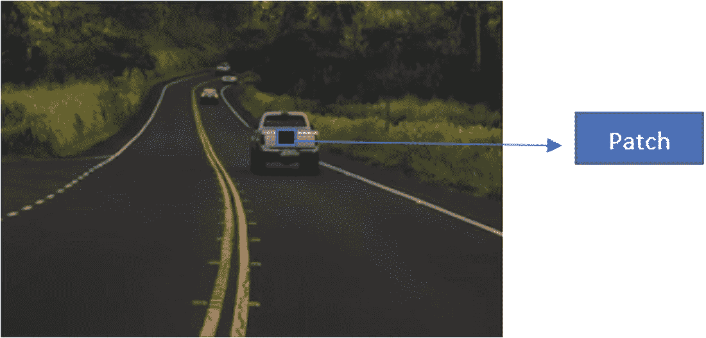
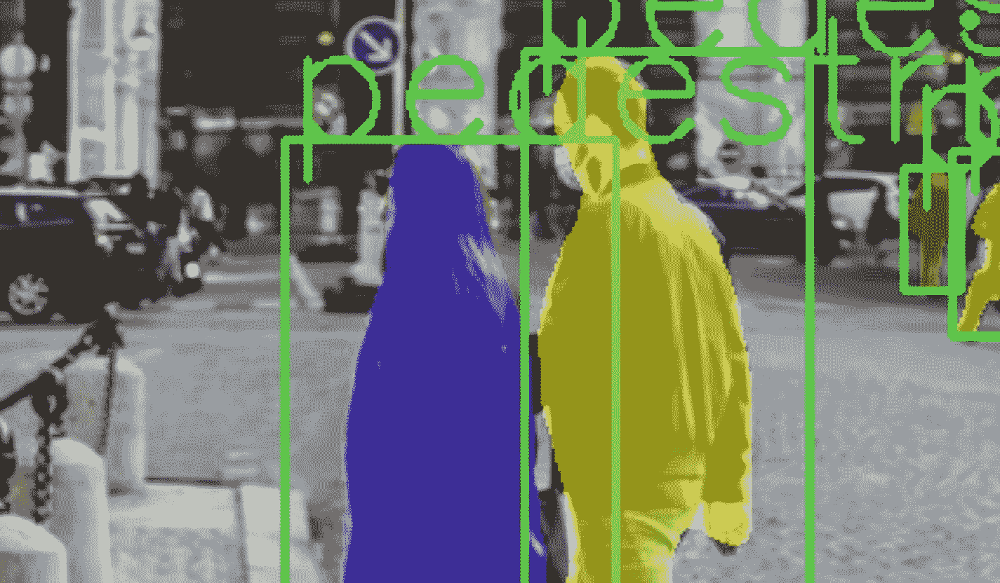
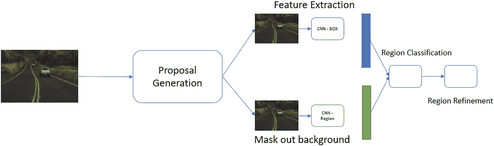

# 图像分割

分割的主观性取决于我们所处理的领域类型。分割主要分为两种：语义分割和实例分割。在进行语义分割时，来自相似物体的像素被视为同一类别，但物体内部没有区分。想象一个实时场景：当高速公路的图像中有多辆汽车时，分割会将所有汽车归为一组，并将这些组与路边或风景区分开来。

让我们看一个例子。图 4-1a 展示了一条有汽车的高速公路。除了多辆汽车，高速公路旁还有草地和一些树木。


一张长路段的照片，前景有一辆皮卡，后方还有另外三辆汽车。道路两旁长满了草地和树木。

图 4-1a

原始输入图像

现在，考虑从原始输入中提取一个像素块，并将其传递给一个能够对输入中的物体进行分类的卷积神经网络（见图 4-1b）。这将给我们一个输出，比如图中属于汽车的像素块。接下来，我们尝试将中心像素映射到汽车，并像这样遍历整个图像。这将为我们提供图像中的语义分割分离。它将把汽车与树木和道路分开。这里需要注意的重要一点是，所有汽车都属于同一类别。



一张长路段的照片，前景有一辆皮卡，后方还有另外三辆汽车。道路两旁长满了草地和树木。在皮卡的后端有一个蓝色轮廓的黑色方块，旁边有一个指向右侧的箭头，上面写着“像素块”。

图 4-1b

从输入中提取像素块

解决这类问题的另一种方法是运行一个没有下采样的卷积神经网络分类器，并用它来对每个像素进行分类，从而将相似的物体聚类在一起。

这些方法在需要区分不同类别时效果很好。例如，假设有多辆汽车，我们想对每辆汽车单独分类。在这种情况下，就需要用到实例分割，其中每个像素都被映射到特定的类别，并通过用适当的类别标记像素来分离物体。语义分割的概念可以追溯到图像处理中使用的非学习技术，而实例分割则是一个相对较新的概念。

当我们开始研究实例分割时，出现的基本方法之一几乎就是 R-CNN 方法的翻版。但我们预测的是分割区域，而不是区域。

请看图 4-2 中的流程图。图像被传递到一个分割提议网络，该网络生成图像的分割区域。一方面，这些分割区域可以形成一个边界框，并传递给边界框卷积神经网络以生成特征。另一方面，分割区域被接收并应用背景掩码变换。它只取图像的均值，并将物体的背景转换为黑色。一旦分割区域被掩码，它就会被传递给区域卷积神经网络以获取另一组特征。



一张照片，显示一位男士和一位女士在人行道上，背景是建筑物。男士和女士的身体分别被紫色和黄色的轮廓覆盖。两个人物都被绿色框框住。框的上方写着“行人”字样。

图 4-3

自定义数据上的输出



一个流程图从左到右描述如下：一张照片，一个右箭头，一个标有“提议生成”的框，通过箭头连接到“特征提取”（其中包含一张照片和一个标有“CNN 边界框”的框）以及“背景掩码”（其中包含一张照片和一个标有“CNN 区域”的框）。右侧是“区域分类”和“区域细化”。

图 4-2

实例分割流程

这里我们得到的是边界框图像和网络提取的区域特征的组合。这些特征将被合并，然后根据它们包含的物体实例进行进一步分类。在此之后，还有一个额外的步骤，即细化分割区域。

这些仅仅是实验性的分割技术设置。其他方法上的改进也已经实现，包括级联网络（类似于 Faster R-CNN）、超列等。

语义分割和实例分割之间存在多个差异。

语义分割：

*   对所有像素进行分类。
*   使用全卷积模型。
*   在各种方法中使用下采样，然后使用可学习的上采样技术来重建图像。
*   如果使用类似 ResNet 的架构，则会使用跳跃连接。

实例分割：

*   不仅对每个像素进行分类，还检测实例。
*   其过程几乎遵循目标检测架构。

## PyTorch 的预训练支持

PyTorch 的发展速度远超其他任何框架。它拥有大量的模块和类。由于它接近 Python，因此更容易适应这个框架。在深度学习领域，普遍倾向于选择 PyTorch 框架，并利用其丰富的资源来产生有影响力的变革。

与目标检测一样，分割也属于架构中计算量较大的部分。从头开始训练这些模型并不总是容易或理想的。在 CPU 上训练时间相当长，即使 GPU 能有所帮助，提升也有限。由于所有这些训练过程的限制，我们可能会选择迁移学习技术。这有助于我们利用已经提取到的丰富信息来开展工作。这些模型在多样化的数据集上训练，并且已经泛化，能够处理我们遇到的大多数问题中的变化。让我们深入了解 `torch` 库中一些出色的模型。


### 语义分割

- **全卷积神经网络。** 如论文所述，全卷积网络在语义分割任务上进行端到端训练。它是一个卷积神经网络模块，后接逐像素预测。
- **使用空洞卷积进行语义分割（DeepLabV3）。** 在该架构中，通过改变感受野，使用并行的空洞卷积堆叠来捕获多尺度上下文信息。
- **轻量级缩减版空洞空间金字塔池化（LR-ASPP）。** 这是 `MobileNetV3` 的进阶版本，借助 NAS（神经架构搜索）技术创建而成。

我们将使用一个预训练模型来评估我们的图像。该模型参数众多，因此在 CPU 或低配置基础设施上运行推理会较慢。如果使用 Colab，我们可以切换到 GPU 作为基础设施支持来运行代码。

让我们从配置所需的基本 `import` 开始。该模型是预训练的，并放置在 Torchvision 中。我们也将导入该模型。

```python
import numpy as np
import torch
import matplotlib.pyplot as plt
## torchvision related imports
import torchvision.transforms.functional as F
from torchvision.io import read_image
from torchvision.utils import draw_bounding_boxes
from torchvision.utils import make_grid
## models and transforms
from torchvision.transforms.functional import convert_image_dtype
from torchvision.models.segmentation import fcn_resnet50
```

到目前为止，我们导入了 Torch 和 Torchvision 相关的函数。我们需要构建所有可在整个代码中重复使用的工具函数。这是重构代码并消除不必要重复的有效方法。在本例中，我们需要显示图像，因此可以使用一个图像可视化工具。

```python
## utilities for multiple images
def img_show(images):
if not isinstance(images, list):
## generalise cast images to list
images = [images]
fig, axis = plt.subplots(ncols=len(images), squeeze=False)
for i, image in enumerate(images):
image = image.detach() # detached from current DAG, no gradient
image = F.to_pil_image(image)
axis[0, i].imshow(np.asarray(image))
axis[0, i].set(xticklabels=[], yticklabels=[], xticks=[], yticks=[])
```

这段代码接受多张图像或单张图像。它会检查对象是否为列表，如果不是，则将其转换为列表。根据图像的可迭代对象分配坐标轴。图像会从计算图中分离，并且不会为这些变量计算梯度。

在工具函数之后，让我们获取一张示例图像，并将其配置为用于分割过程。

```python
## get an image on which segmentation needs to be done
img1 = read_image("/content/semantic_example_highway.jpg")
box_car = torch.tensor([ [170, 70, 220, 120]], dtype=torch.float) ## (xmin,ymin,xmax,ymax)
colors = ["blue"]
check_box = draw_bounding_boxes(img1, box_car, colors=colors, width=2)
img_show(check_box)
## batch for images
batch_imgs = torch.stack([img1])
batch_torch = convert_image_dtype(batch_imgs, dtype=torch.float)
```

需要上传图像并将其放置在可访问的位置。图像中包含多辆汽车，目前我们用一个边界框（`X[min]`、`Y[min]`、`X[max]` 和 `Y[max]`）标记其中一辆。这些值需要调整，以便全卷积网络能够理解物体的存在。最终，图像批次在堆叠输入模型之前会被转换为张量。

现在，让我们加载模型并准备进行评估。

```python
model = fcn_resnet50(pretrained=True, progress=False)
## switching on eval mode
model = model.eval()
# standard normalizing based on train config
normalized_batch_torch = F.normalize(batch_torch, mean=(0.485, 0.456, 0.406), std=(0.229, 0.224, 0.225))
result = model(normalized_batch_torch)['out']
```

如前所述，`fcn_resnet50` 从仓库中下载，并且已经过训练。模型被设置为评估模式。之前步骤中创建的批次，现在根据训练好的模型配置进行归一化。

现在是时候将我们的图像输入模型了。

```python
classes = [
'__background__', 'aeroplane', 'bicycle', 'bird', 'boat', 'bottle', 'bus',
'car', 'cat', 'chair', 'cow', 'diningtable', 'dog', 'horse', 'motorbike',
'person', 'pottedplant', 'sheep', 'sofa', 'train', ’tvmonitor’
]
class_to_idx = {cls: idx for (idx, cls) in enumerate(classes)}
normalized_out_masks = torch.nn.functional.softmax(result, dim=1)
car_mask = [
normalized_out_masks[img_idx, class_to_idx[cls]]
for img_idx in range(batch_torch.shape[0])
for cls in ('car', 'pottedplant','bus')
]
img_show(car_mask)
```

我们定义了包含所有可能类别的列表，并将批次图像结果通过 softmax 层。然后绘制掩码。这个示例展示了我们之前讨论的语义分割的处理流程。它说明了如何获取任意数据并根据模型进行准备。我们加载一个模型，在其上运行推理以获取掩码。

### 实例分割

我们之前处理语义分割是为了生成物体的掩码，然后将它们叠加到原始图像上。但是，实例分割呢？现在我们将了解一些可用于生成掩码的预训练模型。

用于检测和掩码的模型：

- **Faster R-CNN。** 这项研究引入了一个区域提议网络，该网络能同时预测物体边界框和与边界框对应的物体性核心分数。它解决了早期论文中存在的瓶颈问题。
- **Mask R-CNN。** 该过程扩展了 Faster R-CNN，并在图像上执行物体检测和生成掩码。
- **RetinaNet。** 这篇论文在准确性和速度方面对两阶段检测器进行了一些惊人的改进。它利用*焦点损失*这一新概念来处理所有这些问题。
- **单次检测器（SSD）。** 该论文解释了如何为默认边界框生成物体性分数，并根据物体对其进行优化。

这些模型主要基于 COCO 数据集进行训练，能够处理预测任务。

对于 Faster R-CNN：

```python
x = [torch.rand(3, 300, 400), torch.rand(3, 500, 400)]
faster_rcnn_model = torchvision.models.detection.fasterrcnn_resnet50_fpn(pretrained=True)
faster_rcnn_model.eval()
result = faster_rcnn_model (x)
```

对于 MobileNet：

```python
x = [torch.rand(3, 300, 400), torch.rand(3, 500, 400)]
mobilenet_model = torchvision.models.detection.fasterrcnn_mobilenet_v3_large_fpn(pretrained=True)
mobilenet_model.eval()
result = mobilenet_model(x)
```

对于 RetinaNet：

```python
x = [torch.rand(3, 300, 400), torch.rand(3, 500, 400)]
retinanet_model = torchvision.models.detection.retinanet_resnet50_fpn(pretrained=True)
retinanet_model.eval()
result = retinanet_model(x)
```

对于单次检测器（SSD）：

```python
x = [torch.rand(3, 300, 400), torch.rand(3, 500, 400)]
ssd_model = torchvision.models.detection.ssd300_vgg16(pretrained=True)
ssd_model.eval()
result = ssd_model(x)
```

对于所有这些实例，我们都是从 PyTorch 仓库中提取模型，并使用它来运行推理。


