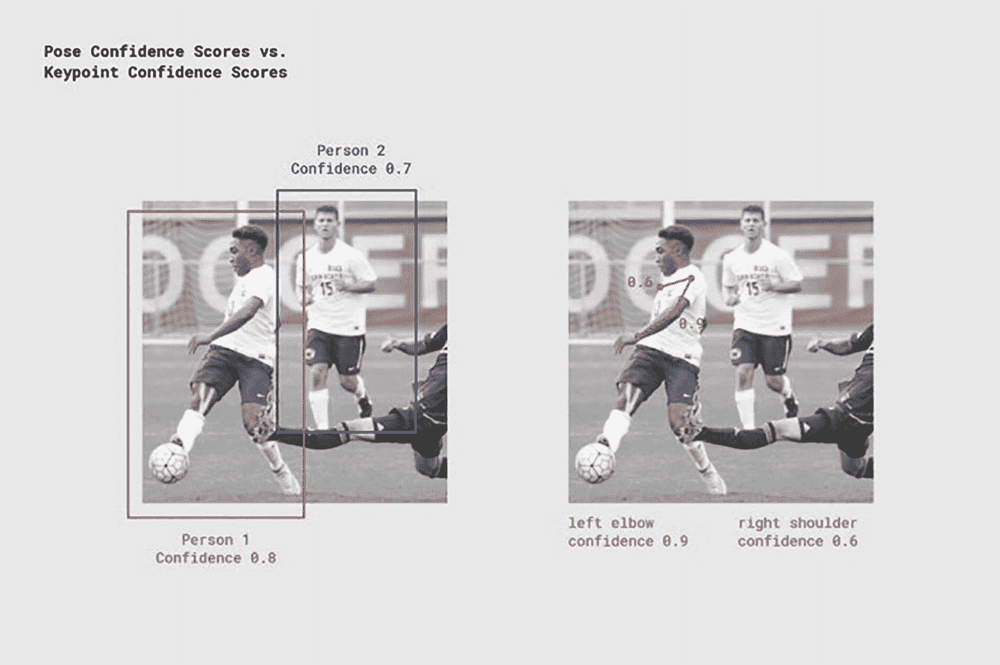
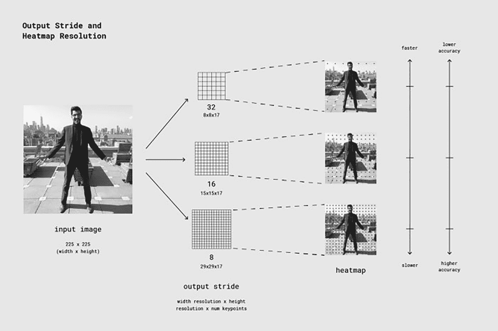
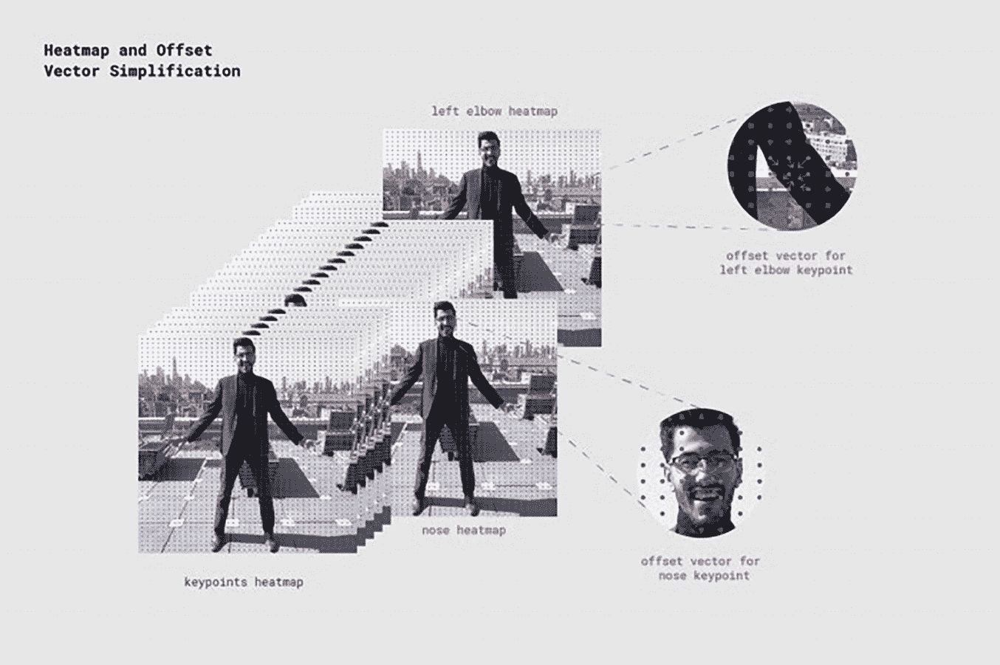
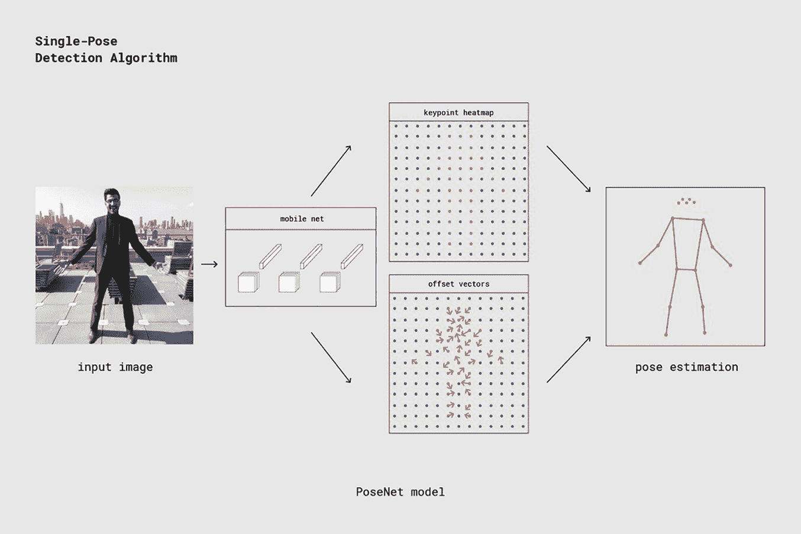

# PoseNet

PoseNet 是一个基于 `tensorflow.js` 构建、可在移动设备上运行的姿态估计器。它通过检测人体关键点（如眼睛、鼻子、嘴巴、手腕、肘部、髋部、膝盖等）来估计人体姿态，并通过连接这些关键点形成类似骨架的姿态结构。

它适用于单人和多人姿态检测。

## PoseNet 如何工作？

PoseNet 使用 ResNet 和 MobileNet 模型进行训练。ResNet 模型精度更高，但体积大、层数多，导致速度较慢。因此，选择专为移动设备设计的 MobileNet 模型更为合适。姿态估计分两个阶段进行：

- 将输入的 RGB 图像送入卷积神经网络。
- 使用单人姿态或多人姿态算法，从模型输出中获取关键点（坐标）及其置信度分数。

PoseNet 模型的输出是一个姿态对象，其中包含每个检测到的人物的关键点列表和置信度分数。图 6-9 展示了姿态与关键点置信度的对比。

一张足球场上球员的照片，前景中，球员 1 上半身侧转，正在踢球，他身后是球员 2，正在奔跑。在照片 1 中，球员 1 的置信度为 0.8，球员 2 为 0.7。在照片 2 中，球员 1 的左肘置信度为 0.9，右肩置信度为 0.6。

**图 6-9** 姿态与关键点置信度对比示意图

### 单人姿态估计

这是指输入图像或视频中仅有一人位于中心的情况。单人姿态估计算法的输入如下：

- **输入图像元素：** 程序将为其预测姿态的输入图像元素。
- **图像缩放因子：** 一个介于 0.2 到 1 之间的数字。默认设置为 0.5。
- **水平翻转：** 默认设置为 false。如果姿态需要水平/垂直翻转，则需将此设置为 true。当视频默认水平翻转时，姿态会被恢复到正确的方向。
- **输出步长：** 应为 32、16 或 8。默认设置为 16。此变量影响神经网络的宽度和高度层。输出步长值越低，精度越高，但速度越慢，反之亦然。

单人姿态估计的输出是一个姿态，包含姿态置信度分数和一个包含 17 个关键点的数组。每个关键点包含一个关键点位置（x 和 y 坐标）和一个关键点置信度分数。

图 6-10、6-11 和 6-12 展示了 PoseNet 的流程图。

一个分为三部分的图表，从左到右：第 1 部分是一张双臂向两侧伸展的男人的照片，标记为“输入图像”；第 2 部分是一列三个网格，标记为 32、16 和 8，以及一列三张照片，与第一张图像相同，但叠加了圆点；第 3 部分是两个垂直的双向箭头，分别标记为“较慢”和“较高精度”。

**图 6-12** PoseNet 流程图，第 3 部分

PoseNet 估计算法的流程图。左侧一张男人的图像标记为“关键点热力图”。突出显示其肘部和鼻子的图像分别标记为“左肘热力图”和“鼻子热力图”。其肘部和鼻子的放大图像分别标记为“左肘关键点的偏移向量”和“鼻子关键点的偏移向量”。

**图 6-11** PoseNet 流程图，第 2 部分

单人姿态检测算法的流程图。从一张站在露台上的男人的图像开始，标记为“图像”，指向 MobileNet，再指向关键点热力图和偏移向量，两者共同指向计算机生成的、标记为“姿态估计”的线条人物图。

**图 6-10** PoseNet 流程图

### 多人姿态估计

该算法可以估计图像中的多个姿态/人物。它比单人姿态算法稍复杂且稍慢。但其主要优势在于，如果图片中有多人，他们的关键点不太可能被错误关联。因此，即使需求是检测单人的姿态，该算法也可能更可取。这些算法的输入如下：

- 输入图像元素
- 图像缩放因子
- 水平翻转
- 输出步长
- 最大姿态检测数：最多可检测五个姿态
- 姿态置信度阈值
- 非极大值抑制（NMS）半径：控制返回姿态之间的最小距离。默认值为 20。

该算法的输出是一个姿态数组。每个姿态包含 17 个关键点以及每个关键点的分数。

### PoseNet 的优缺点

考虑 PoseNet 的以下优缺点：

- 由于是轻量级模型，可用于移动/边缘设备。
- 如果图片中有多于一个人，单人姿态估计算法会将关键点关联到错误的人身上。

### 姿态估计的应用

以下是姿态估计的常见应用：

- 人类活动识别
- 人体跌倒检测
- 游戏机动作追踪
- 训练机器人

### 零售店视频测试案例

**案例 1：** 使用 1080p 分辨率、帧率为 2 fps 的一小时视频测试 PoseNet 模型。结果：

- CPU 利用率：80-90%
- 内存：1.2 至 1.5GB
- FPS：15
- 一小时视频的处理时间和数据库插入时间：20 至 25 分钟

**案例 2：** 使用 720p 和 480p 分辨率、帧率为 2 fps 的一小时视频测试 PoseNet 模型。结果：

- 对于 720p，一小时视频的处理时间和数据库插入时间：8 至 10 分钟，帧率为 16 fps
- 对于 480p，一小时视频的处理时间和数据库插入时间：4 至 5 分钟，帧率为 25 fps

