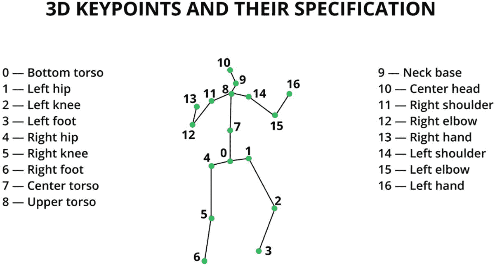
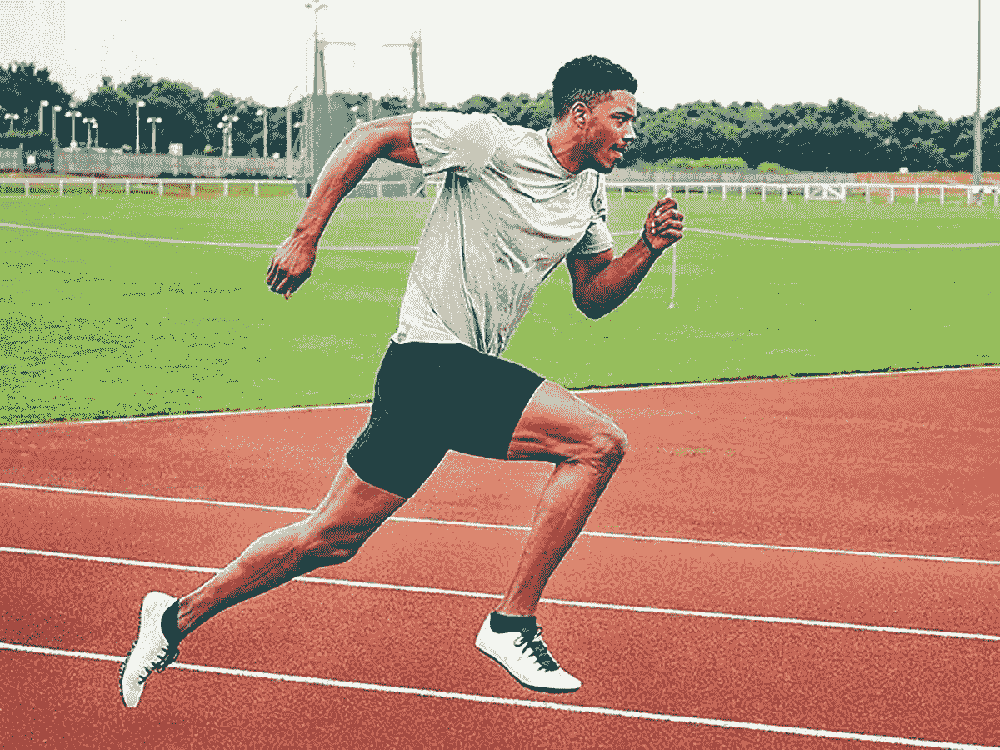
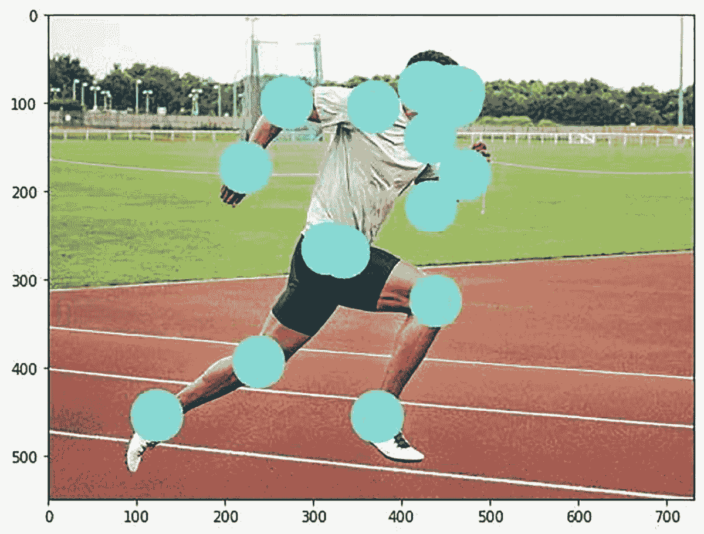
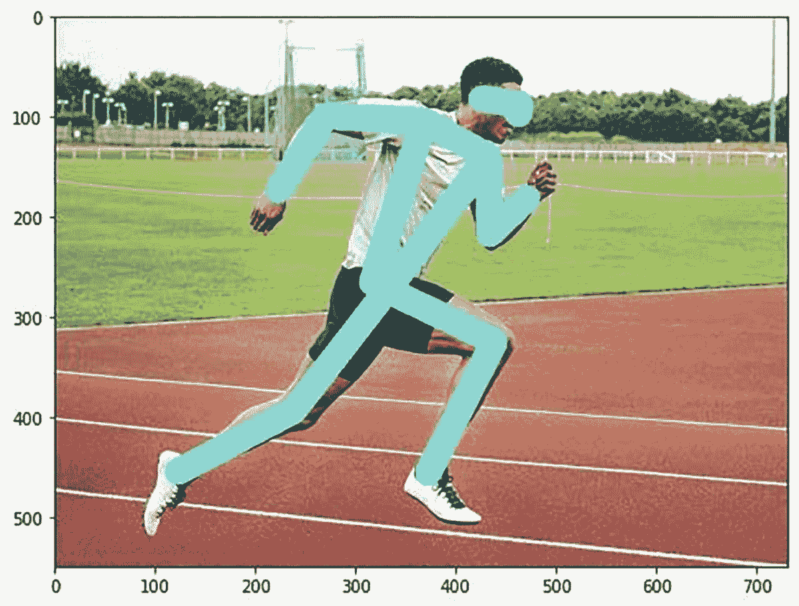
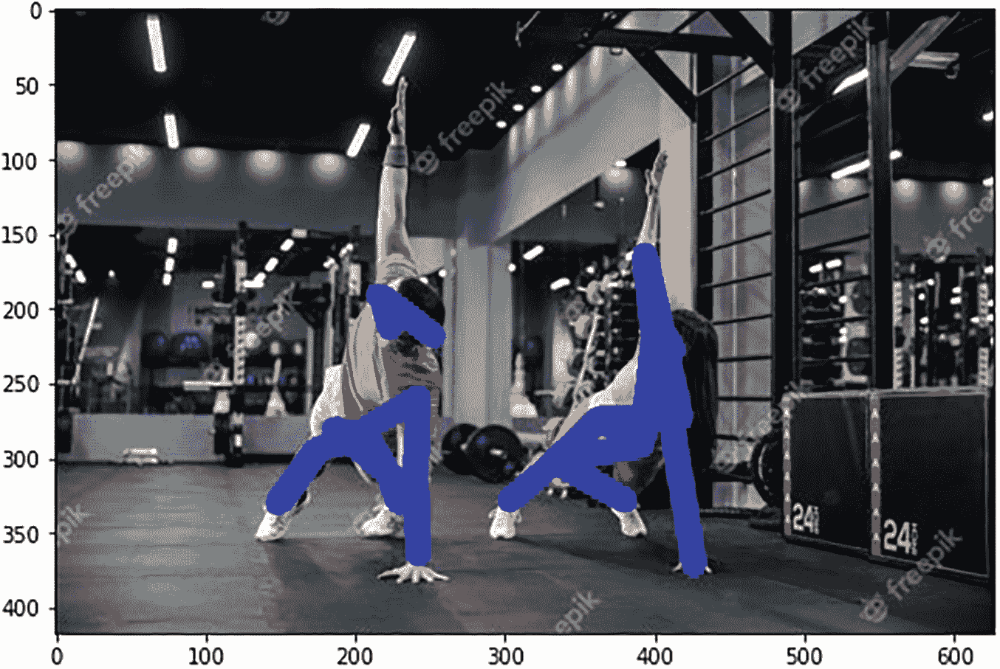
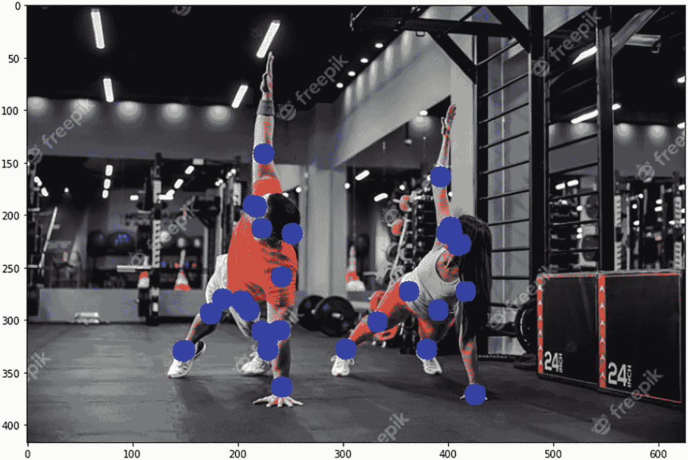

# 实现

在了解了部分理论方面和模型之后，现在我们进入实现环节，将使用其中一种方法和预训练模型。以下是使用 `PyTorch` 对单张图像进行人体姿态检测的分步指南。

我们将使用“基于特征金字塔网络的 ResNet-50 架构的 Keypoint-RCNN”解决方案进行人体姿态和关键点检测。为便于理解，代码被分为七个模块。步骤如下：

1.  确定要追踪的人体关键点列表。
2.  确定关键点之间可能的连接关系。
3.  从 `PyTorch` 库加载预训练模型。
4.  输入图像预处理与建模。
5.  构建自定义函数以绘制输出（关键点和骨架）。
6.  在输入图像上绘制输出结果。

首先，导入所需的库：

```
#导入库
import os
import numpy as np
#用于导入关键点 RCNN 预训练模型和图像预处理
import torchvision
import torch
#用于读取图像
import cv2
#用于可视化
import matplotlib.pyplot as plt
#挂载谷歌云盘
#将目录更改为包含图像文件夹的相应文件夹
from google.colab import drive
drive.mount('/content/drive')
%cd '/content/drive/MyDrive/Colab Notebooks/Bodypose'
```

### 步骤 1：确定要追踪的人体关键点列表

人体关键点列表如图 6-13 所示。这些关键点是深度学习模型中的目标实体，将在步骤 3 中讨论。



一幅由线条和点组成的人体轮廓示意图，关键点从 0 到 16 编号，分别代表：躯干底部、左髋、左膝、左脚、右髋、右膝、右脚、躯干中心、躯干上部、颈根、头部中心、右肩、右肘、右手、左肩、左肘和左手。

**图 6-13** – 人体关键点示意图

图 6-13 展示了人体关键点的示意图。

```
# 人体关键点列表（共 17 个）
human_keypoints = ['nose','left_eye','right_eye','left_ear','right_ear','left_shoulder','right_shoulder','left_elbow',
'right_elbow','left_wrist','right_wrist','left_hip','right_hip','left_knee', 'right_knee', 'left_ankle','right_ankle']
print(human_keypoints)
#输出
['nose', 'left_eye', 'right_eye', 'left_ear', 'right_ear', 'left_shoulder', 'right_shoulder', 'left_elbow', 'right_elbow', 'left_wrist', 'right_wrist', 'left_hip', 'right_hip', 'left_knee', 'right_knee', 'left_ankle', 'right_ankle']
```

### 步骤 2：确定关键点之间可能的连接关系

现在确定关键点之间可能的连接关系。例如，左耳与左眼相连。所有可能的连接关系可在以下代码片段中找到。

```
# 人体关键点之间可能的连接关系，以形成结构
def possible_keypoint_connections(keypoints):
connections = [
[keypoints.index('right_eye'), keypoints.index('nose')],
[keypoints.index('right_eye'), keypoints.index('right_ear')],
[keypoints.index('left_eye'), keypoints.index('nose')],
[keypoints.index('left_eye'), keypoints.index('left_ear')],
[keypoints.index('right_shoulder'), keypoints.index('right_elbow')],
[keypoints.index('right_elbow'), keypoints.index('right_wrist')],
[keypoints.index('left_shoulder'), keypoints.index('left_elbow')],
[keypoints.index('left_elbow'), keypoints.index('left_wrist')],
[keypoints.index('right_hip'), keypoints.index('right_knee')],
[keypoints.index('right_knee'), keypoints.index('right_ankle')],
[keypoints.index('left_hip'), keypoints.index('left_knee')],
[keypoints.index('left_knee'), keypoints.index('left_ankle')],
[keypoints.index('right_shoulder'), keypoints.index('left_shoulder')],
[keypoints.index('right_hip'), keypoints.index('left_hip')],
[keypoints.index('right_shoulder'), keypoints.index('right_hip')],
[keypoints.index('left_shoulder'), keypoints.index('left_hip')]
]
return connections
connections = possible_keypoint_connections(human_keypoints)
```

### 步骤 3：从 PyTorch 库加载预训练模型

在本博客中，我们使用 `PyTorch` 的预训练模型 `keypoint-RCNN with ResNet50 architecture` 进行关键点检测。使用参数 `(pretrained= True)` 加载模型。

```
# 从预训练的 keypointrcnn_resnet50_fpn 类创建模型
pretrained_model = torchvision.models.detection.keypointrcnn_resnet50_fpn(pretrained=True)
# 调用 eval() 方法使模型进入推理模式
pretrained_model.eval()
#输出
Downloading: "https://download.pytorch.org/models/keypointrcnn_resnet50_fpn_coco-fc266e95.pth" to /root/.cache/torch/hub/checkpoints/keypointrcnn_resnet50_fpn_coco-fc266e95.pth
100%
226M/226M [00:04<00:00, 15.1MB/s]
KeypointRCNN(
(transform): GeneralizedRCNNTransform(
Normalize(mean=[0.485, 0.456, 0.406], std=[0.229, 0.224, 0.225])
Resize(min_size=(640, 672, 704, 736, 768, 800), max_size=1333, mode='bilinear')
)
```

### 步骤 4：输入图像预处理与建模

原始图像在输入模型前需要进行归一化处理。归一化使用 `TorchVision` 的 `transforms` 模块中的 `transforms.Compose()` 和 `transforms.ToTensor()` 类完成。将输入图像放入当前工作目录的 `images` 文件夹中。

```
# 导入 transforms 模块
from torchvision import transforms as T
# 使用 opencv 读取图像
img_path = "images/image1.JPG"
img = cv2.imread(img_path)
# 预处理输入图像
transform = T.Compose([T.ToTensor()])
img_tensor = transform(img)
# 前向传播模型
output = pretrained_model([img_tensor])[0]
print(output.keys())
#输出
dict_keys(['boxes', 'labels', 'scores', 'keypoints', 'keypoints_scores'])
```

图 6-14 是我们用作输入的图像。



一张男子在田径椭圆形跑道上呈跑步姿态的照片。他的右臂弯曲肘部向后伸展，左臂弯曲肘部向前伸展，右腿弯曲膝盖向前伸展，左腿向后伸展。

**图 6-14** – 输入图像


### 第 5 步：构建自定义函数以绘制输出

构建自定义函数，用于绘制预测的关键点以及身体骨架（通过连接关键点实现）。

```python
#Functions to plot keypoints and skeleton of input image
def plot_keypoints(img, all_keypoints, all_scores, confs, keypoint_threshold=2, conf_threshold=0.9):
    # initialize a set of colors from the rainbow spectrum
    cmap = plt.get_cmap('rainbow')
    # create a copy of the image
    img_copy = img.copy()
    # pick a set of N color-ids from the spectrum
    color_id = np.arange(1,255, 255//len(all_keypoints)).tolist()[::-1]
    # iterate for every person detected
    for person_id in range(len(all_keypoints)):
        # check the confidence score of the detected person
        if confs[person_id]>conf_threshold:
            # grab the keypoint-locations for the detected person
            keypoints = all_keypoints[person_id, ...]
            # grab the keypoint-scores for the keypoints
            scores = all_scores[person_id, ...]
            # iterate for every keypoint-score
            for kp in range(len(scores)):
                # check the confidence score of detected keypoint
                if scores[kp]>keypoint_threshold:
                    # convert the keypoint float-array to a python-list of intergers
                    keypoint = tuple(map(int, keypoints[kp, :2].detach().numpy().tolist()))
                    # pick the color at the specific color-id
                    color = tuple(np.asarray(cmap(color_id[person_id])[:-1])*255)
                    # draw a cirle over the keypoint location
                    cv2.circle(img_copy, keypoint, 30, color, -1)
    return img_copy

def plot_skeleton(img, all_keypoints, all_scores, confs, keypoint_threshold=2, conf_threshold=0.9):
    # initialize a set of colors from the rainbow spectrum
    cmap = plt.get_cmap('rainbow')
    # create a copy of the image
    img_copy = img.copy()
    # check if the keypoints are detected
    if len(output["keypoints"])>0:
        # pick a set of N color-ids from the spectrum
        colors = np.arange(1,255, 255//len(all_keypoints)).tolist()[::-1]
        # iterate for every person detected
        for person_id in range(len(all_keypoints)):
            # check the confidence score of the detected person
            if confs[person_id]>conf_threshold:
                # grab the keypoint-locations for the detected person
                keypoints = all_keypoints[person_id, ...]
                # iterate for every limb
                for conn_id in range(len(connections)):
                    # pick the start-point of the limb
                    limb_loc1 = keypoints[connections[conn_id][0], :2].detach().numpy().astype(np.int32)
                    # pick the start-point of the limb
                    limb_loc2 = keypoints[connections[conn_id][1], :2].detach().numpy().astype(np.int32)
                    # consider limb-confidence score as the minimum keypoint score among the two keypoint scores
                    limb_score = min(all_scores[person_id, connections[conn_id][0]], all_scores[person_id, connections[conn_id][1]])
                    # check if limb-score is greater than threshold
                    if limb_score> keypoint_threshold:
                        # pick the color at a specific color-id
                        color = tuple(np.asarray(cmap(colors[person_id])[:-1])*255)
                        # draw the line for the limb
                        cv2.line(img_copy, tuple(limb_loc1), tuple(limb_loc2), color, 25)
    return img_copy
```

### 第 6 步：在输入图像上绘制输出

使用第 5 步中的自定义函数，将预测的关键点和骨架绘制到原始图像上。

```python
#Key points
keypoints_img = plot_keypoints(img, output["keypoints"], output["keypoints_scores"], output["scores"],keypoint_threshold=2)
cv2.imwrite("output/keypoints-img.jpg", keypoints_img)
plt.figure(figsize=(8, 8))
plt.imshow(keypoints_img[:, :, ::-1])
plt.show()
#Output
```

图 6-15 展示了带有关键点的图像。



一张照片，拍摄了一名男子在田径椭圆形跑道上摆出跑步姿势。在以下身体部位上绘制了圆点：头部、面部、颈部、左肩、左肘、左腕、右肩、右肘、右腕、下躯干、右大腿、右膝、右踝、左膝和左踝。

**图 6-15** 带有关键点的图像

```python
#Skeleton
skeleton_img = plot_skeleton(img, output["keypoints"], output["keypoints_scores"], output["scores"],keypoint_threshold=2)
cv2.imwrite("output/skeleton-img.jpg", skeleton_img)
plt.figure(figsize=(8, 8))
plt.imshow(skeleton_img[:, :, ::-1])
plt.show()
#plot
```

图 6-16 展示了以骨架形式呈现的图像。



一张照片，拍摄了一名男子在田径椭圆形跑道上摆出跑步姿势。在以下身体部位上绘制了线条：头部、面部、颈部、左肩、左肘、左腕、右肩、右肘、右腕、下躯干、右大腿、右膝、右踝、左膝和左踝。

**图 6-16** 以骨架形式呈现的图像

以下是我们尝试的其他包含多人的图像结果。您也可以在本书的 Git 链接中找到这些结果。



一名男子和一名女子在健身房做俯卧撑和旋转动作。他们身体的主要关键点被着色。

**图 6-18** 以骨架形式呈现的图像



一名男子和一名女子在健身房做俯卧撑和旋转动作。他们身体的主要关键点用圆点突出显示。

**图 6-17** 带有关键点的图像

## 总结

本章探讨了开发姿态估计模型所需的架构和代码详解。该模型在工业界应用广泛。

现在，您是否有信心构建一个充当“虚拟健身教练”的应用程序？鉴于许多人希望拥有家庭健身房，这值得一试。在下一章中，我们将探讨如何对图像进行异常检测。

