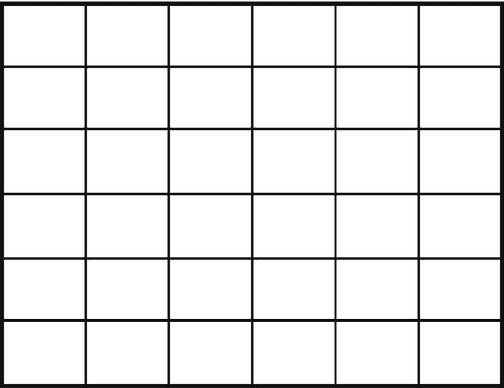
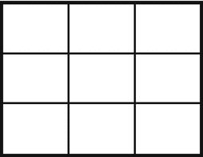
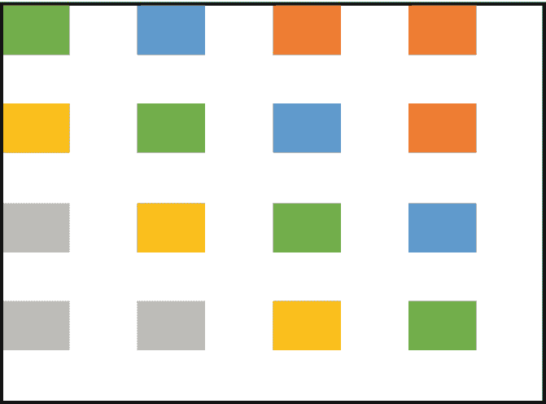
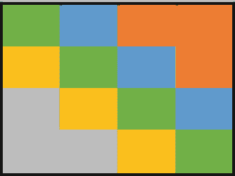
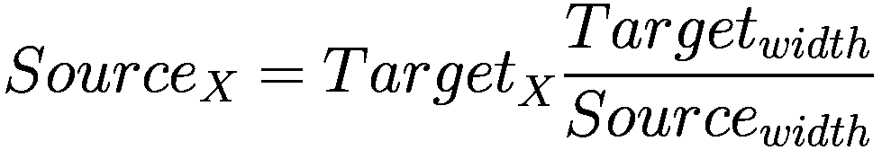
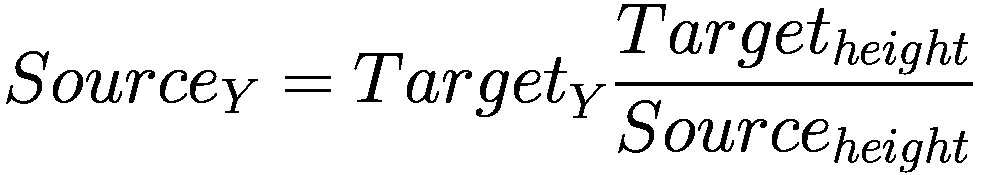

# 8. 图像超分辨率

随着高分辨率图像采集设备的出现，图像中捕获的信息量变得巨大。技术已从超高清发展到 4K 和 8K 分辨率。如今电影都在使用高分辨率帧；然而，也存在需要将低分辨率图像增强为高分辨率图像的情况。想象一个场景，电影主角正试图从一张超速汽车的照片中确定车牌号码。超分辨率技术现在可以帮助我们在不扭曲图像的情况下，将图像放大到很高的程度。业界已经取得了一些有趣的进展，我们将通过一些示例来讨论这些进展。

图像中已有的信息无法从初始状态增加。在计算机科学中，有“垃圾进，垃圾出”的说法，这是一个类似的概念。我们不能期望找到图像中原本不存在的东西。因此，从某种意义上说，超分辨率似乎有些牵强，并且受到信息论的严格限制。即便如此，活跃的研究表明这个问题是可以解决的。

让我们深入探讨手头的问题。到目前为止，我们处理的是监督学习形式，其中总是存在一个与真实值相关的损失函数。模型从定义的输入（`X`）和期望输出（`Y`）中学习。训练模型的全部意义在于帮助将输入映射到输出。但这在无监督学习中不会发生。无监督方式帮助模型学习输入数据中的模式，而无需映射输出。模型学习数据中的模式，并围绕其调整权重，然后识别数据中的相似性和差异性。与监督学习方法不同，无监督学习没有纠正措施。缺少真实值这一方面，但优化的概念仍然存在。

让我们深入探讨判别模型和生成模型的概念。在生成模型中，学习的是输入和输出的联合概率。学习数据的分布，这通常是训练模型的一种更通用的方式。这些模型能够在输入空间中生成合成数据点。另一方面，判别模型专门用于创建从输入空间到输出的映射函数。生成模型的例子包括线性判别分析、朴素贝叶斯和高斯模型。

我们为什么要介绍生成模型并讨论学习数据分布的思想？让我们回顾一下逻辑，这可以帮助我们理解超分辨率。

-   使用最近邻概念放大图像
-   双线性插值/双三次插值
-   傅里叶变换
-   神经网络

我们将详细探讨所有这些可能的方法。但在此之前，让我们先探索用于放大低分辨率图像的基本技术，从最近邻缩放开始。图 8-1a 显示了一个可以调整为更大图像的基本图像（见图 8-1b），但请记住，图像中的信息保持不变。改变的只是表示形式。

一个 6x6 方格块的示意图。

**图 8-1b** 一个 3x3 图像扩展为 6x6

一个 3x3 方格块的示意图。

**图 8-1a** 一个 3x3 图像

## 使用最近邻概念进行放大

需要更快分辨率变化的问题也需要更快的操作。我们知道，使用卷积神经网络或任何接近神经网络的方法都需要大量的计算，所以现在是时候采用一些简单的技术了。如果我们需要更快的技术，使用最近邻概念放大图像是首选方法之一。

图 8-2a 显示了一个需要放大到 8x8 图像的 4x4 图像，如图 8-2b 所示。我们最初在整个图像中有 16 个像素，然后当它被拉伸到 64 个像素时，我们留下了 48 个需要填充的空缺。最近邻的概念可以通过一个直线单位来理解。考虑一条从 0 开始到 4 结束的直线数轴。如果我们把它分成四个相等的部分，或者在这种情况下是像素，每个部分获得 25%的信息。现在，如果同一条线被拉伸到长度为 8，单位长度保持不变，但每个单位的权重变为 12.5%。然而，图像中携带的信息是相同的。

一个方框的示意图，内部有一个 4x4 的方格块，方格之间有一定距离。最右上角和最左下角的区域各有三个方格，分别带有两种不同的阴影。

**图 8-2b** 正在被放大的示例图像

一个 4x4 方格块的示意图，每个方格都有指定的对角线阴影。最右上角和最左下角的区域各占据三个方格，并带有各自的阴影。

**图 8-2a** 示例图像

同样的概念可以用于使用以下公式通过最近邻填充空缺：

该公式为我们提供了放大后图像像素的坐标值。

