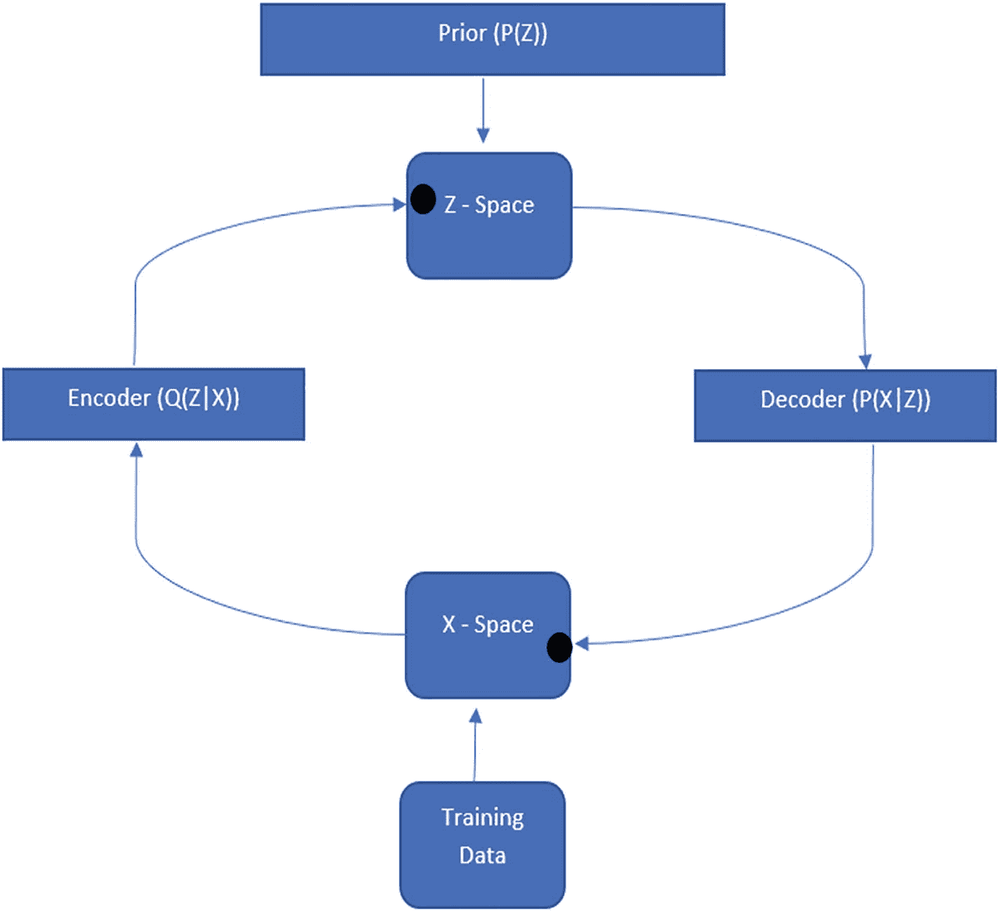
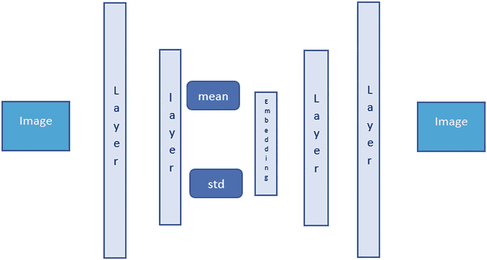
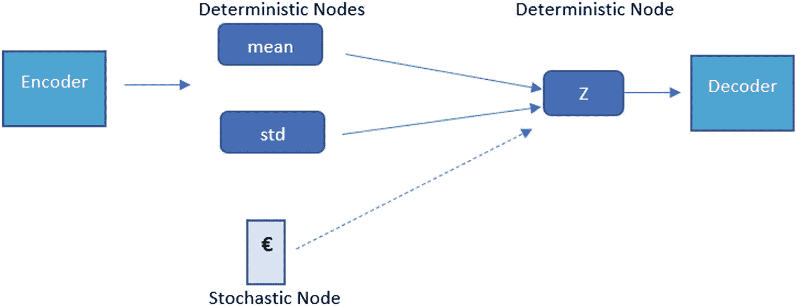
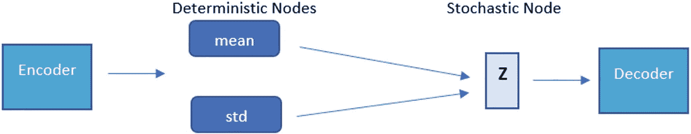

# VAE 表示

一张 VAE 表示的示意图。上方的先验分布 `P(Z)` 和下方的训练数据分别将数据释放到 Z 空间和 X 空间，随后这些数据在编码器 `Q(Z|X)` 和解码器 `P(X|Z)` 中循环。

**图 8-4** VAE 表示

从图 8-4 所示的表示图像中，我们可以看到变分自编码器如何尝试将数据分布映射到潜在空间。训练数据被参数化为 `φ` 的编码器网络使用，以学习从训练数据或 X 空间到潜在空间或 Z 空间的随机映射。

编码器或推理模型学习数据中的模式。可以证明，X 空间的经验分布是复杂的，但潜在空间是简单的。参数化为 `θ` 的生成网络学习由 `P(X|Z)` 给出的分布。解码器部分从先验分布（通常是标准高斯分布）和确定性过程中学习。为了阐明与自编码器的区别，这里增加了一个额外的随机过程。图 8-5 展示了变分自编码器网络的表示。它显示了在现有自编码器架构中添加的随机性。

一张 VAE 网络表示的示意图。左右两侧各放置了一个标记为“图像”的方框。每侧两个尺寸递减的细长垂直矩形标记为“层”，与中间的嵌入层共同占据空间，其中两个水平矩形标记为“均值”和“标准差”位于附近。

**图 8-5** VAE 网络表示

因此，虽然之前我们更侧重于寻找潜在空间的向量或离散值的嵌入，但现在我们将寻找一个均值和标准差的向量空间。

潜在分布赋予了我们过程的随机性。最终，我们将不得不通过反向传播来训练模型。为了克服这个训练问题，我们将均值视为一个固定向量。为了在模型中保持随机性并维持注入的先验分布，我们将标准差视为一个受高斯先验分布中随机常数影响的固定向量。这个采样过程并不像看起来那么简单，因为我们的损失函数将包括重构损失和另一个正则化损失。我们使用一个重参数化技巧，其中 `€` 从先验的标准高斯分布中采样，然后通过潜在分布的均值进行平移，再通过标准差进行缩放。公式如下：

`Z = mean + std * €` ----- (i)

从标准随机节点，我们得到这个方程：

`Z = Q(Z|X)` 参数化为 `φ` ---------- (ii)

我们也可以以图形方式可视化这个技巧，以理清重参数化的概念，并将学习路径中的随机过程转换为确定性节点。

图 8-6a 展示了反向传播或模型学习潜在空间时出现的问题。图 8-6b 展示了重参数化的过程，其中反向传播可以通过实线箭头通道进行。所示的虚线箭头是随机过程，它不会阻碍训练过程，也不直接参与反向传播。它不学习任何东西，也没有权重根据损失函数进行调整。值得注意的是，通过将随机过程移出反向传播路径，Z 空间中的过程类型是如何变化的。

一张 VAE 中重参数化过程的示意图。编码器到达确定性节点（均值和标准差），这些节点再经过另一个确定性节点 Z 到达解码器。其技巧在于，一个随机节点（欧元符号）也经过该确定性节点。

**图 8-6b** 重参数化技巧

一张 VAE 中存在问题的示意图。编码器到达确定性节点（均值和标准差），这些节点再经过随机节点 Z 到达解码器。

**图 8-6a** VAE 问题

方程 (i) 可以视为图 8-6b 的粗略估计，而方程 (ii) 是图 8-6a 的估计。

至此，我们已经建立了变分自编码器的概念，它具有多种用途。这个小小的随机过程有助于生成来自同一概率分布的相似图像。它在图像*重建*或图像*生成*中很有用，并且这两种类型都始终有需求。采样过程使生成器模型或解码器模型能够从同一分布中重新创建具有细微变化的图像。在某些情况下，它有助于对信号或图像进行插值。这种插值概念可用于调整图像大小。现在我们已经简要介绍了变分自编码器，在深入图像大小调整代码之前，让我们看看另一种生成式算法形式，即*生成对抗网络*。

## 生成对抗网络

生成对抗网络由 Ian Goodfellow 于 2014 年引入深度学习领域。该网络能够创建与原始样本非常接近的新样本。它们也被广泛用于图像的风格迁移。

该网络是两种模型的组合——生成器模型和判别器模型。这些模型组合在一起形成了一种监督学习形式。

- **生成器：** 该模型尝试基于某个领域或问题集生成样本。这些样本最好来自一个固定分布。生成器接收随机输入（在大多数情况下，使用高斯分布来帮助其输入）。在训练过程中，这些随机或无意义的点将被视为来自领域分布。生成器应该能够从输入数据分布中生成表示。正如我们之前所见，数据分布是复杂的，编码器尝试将其映射到一个更简单但高度压缩的信息块。这个空间通常被称为*潜在空间*，自编码器的生成器模块从中生成输出。模型可以理解数据分布的复杂性并创建一个表示，然后从中采样。这能够并且应该能够欺骗判别器或分类器。

- **判别器：** 一旦生成器模型创建了它认为与原始数据分布非常相似的假样本，这些样本就会被传递给判别器模型进行验证和分类。它本质上是一个分类模型。它的工作是分类生成器生成的图像是假的还是真的。分类器区分真实图像和虚假图像。

我们已经确定生成器和判别器必须同时训练。这被称为生成对抗网络，因为生成模型和判别模型彼此对抗。它们在一个零和博弈中试图超越对方。理论上，一方不会击败另一方。我们有生成器网络试图尽可能逼真地创建假图像，使得判别器无法将其识别为假。另一方面，判别器模型正在努力训练，以便能够捕捉到图像中任何异常之处。在理想情况下，生成器最终生成的图像使得判别器无法识别其真假（50% 真假概率）。最终，生成器从网络中移除并用于其他目的。

