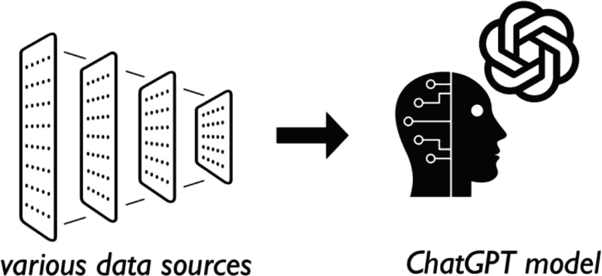
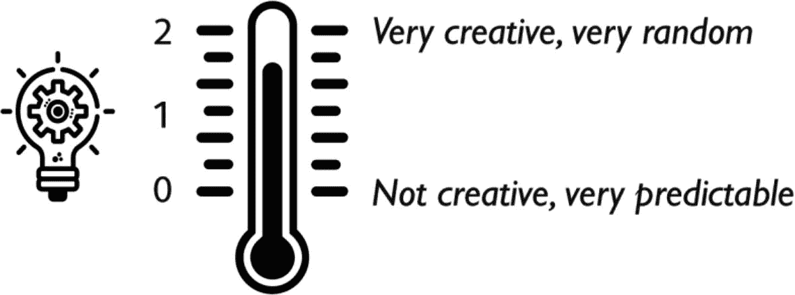
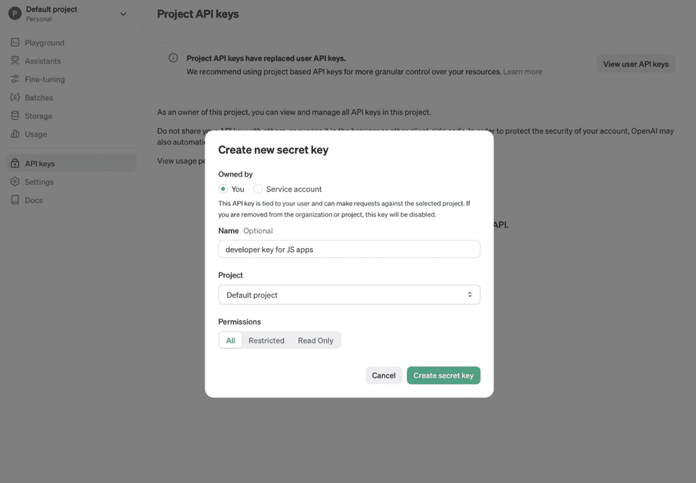
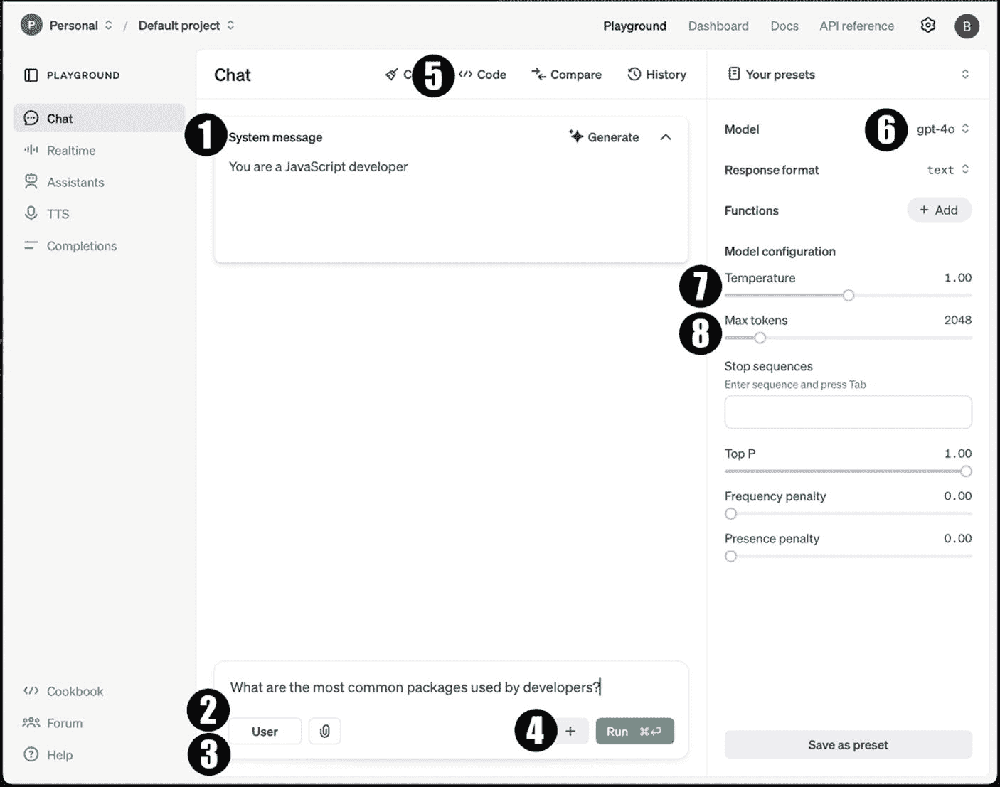
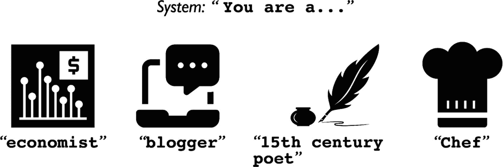

# 正则表达式 vs. ChatGPT——对决！

**注意：** 如果你已经知道正则表达式无法进行自然语言理解或情感分析，可以随意跳过本节。

我深信，每个程序员在职业生涯的某个阶段都曾遇到过*某个*精通正则表达式的人。正则表达式之所以强大，是因为它们能够以编程方式解析大量文本，从而在文本中查找模式。

*然而*，正则表达式最大的缺点之一是，一旦编写完成，它们就极难阅读（在我看来，即使是原始开发者本人也难以读懂）。

那么，让我们看看正则表达式在面对具备自然语言处理（NLP）和自然语言理解（NLU）能力的 ChatGPT 时表现如何。

清单 1-3 讲述了一个不切实际的悲伤故事。然而，它清楚地说明了一个观点：尽管正则表达式可用于在文本中查找单词和短语，但它无法提供任何类型的 NLU。

```
在美国黄油镇牛奶女工街上，住着三个朋友：马里昂·酸奶、珍妮尔·德·克索和史蒂夫·切斯沃斯三世。在一个炎热的夏日，他们听到了冰淇淋车的音乐，决定去买点吃的。
马里昂喜欢草莓味，珍妮尔偏爱巧克力味，而史蒂夫有乳糖不耐症。那天，只有两个孩子吃了冰淇淋，其中一个还买了一瓶常温的水。冰淇淋车备齐了各种经典口味。
清单 1-3
Sadstory.txt – 一个关于没吃冰淇淋的孩子的悲伤故事
```

## 分析问题 #1：谁没吃到冰淇淋？为什么？

现在，让我们稍微分析一下这个故事，并问自己几个问题。首先，谁没吃到冰淇淋？为什么？显而易见的答案是，史蒂夫因为乳糖不耐症没吃冰淇淋。然而，由于故事没有直接说史蒂夫没买冰淇淋，正则表达式无法匹配到故事中的任何文本模式。

正则表达式可以查找诸如“没吃”、“没有冰淇淋”或孩子们的名字等关键词。但它只能根据这些模式是否存在来提供响应。例如，如果正则表达式将“没吃”或“没有冰淇淋”的模式与史蒂夫的名字匹配上，它可以向你展示该文本模式的结果。然而，它肯定无法解释为什么史蒂夫是那个没吃冰淇淋的人，也无法提供任何特定于上下文的推理。

现在，让我们把同样的故事提供给 ChatGPT，并提问：“谁没吃到冰淇淋？”下面的清单 1-4 将我们的问题和上面的故事组合在一起，作为一个提示。

```
根据下面故事中的信息，谁没吃到冰淇淋？为什么？
###
在美国黄油镇牛奶女工街上，住着三个朋友：马里昂·酸奶、珍妮尔·德·克索和史蒂夫·切斯沃斯三世。在一个炎热的夏日，他们听到了冰淇淋车的音乐，决定去买点吃的。
马里昂喜欢草莓味，珍妮尔偏爱巧克力味，而史蒂夫有乳糖不耐症。那天，只有两个孩子吃了冰淇淋，其中一个还买了一瓶常温的水。冰淇淋车备齐了各种经典口味。
清单 1-4
提示。将悲伤故事放入提示中
```

请注意，在创建提示（如上所示）时，将指令和数据放在一起，提供某种分隔符（本例中为 `###`）是一种最佳实践。稍后，当我们开始使用 Playground 或 JavaScript 以编程方式调用 ChatGPT API 时，你会看到有更好的方法来实现这种分隔。

因此，发送提示后，ChatGPT 会提供一个答案，如清单 1-5 所示：

```
一个几何形状的、交织的图案，类似于一个结，由黑色线条组成，在白色背景上形成对称的圆形设计。
根据所给信息，史蒂夫有乳糖不耐症，因此不能吃冰淇淋。所以，史蒂夫是那个没吃到冰淇淋的人。
清单 1-5
响应。ChatGPT 对分析问题 #1 的回答
```

如你所见，ChatGPT 能够利用 NLP 和 NLU，因此它可以（以人工智能的方式）理解场景的上下文。它可以解读孩子们之间的关系、他们的偏好以及史蒂夫的乳糖不耐症。它能够理解孩子们的姓氏、街道名称和城市名称都是乳制品的名称，但这些显然与当前问题无关。

## 分析问题 #2：哪个孩子可能留下了悲伤？

为了进一步证明正则表达式无法提供任何类型的 NLP 或 NLU，现在让我们引入一个新术语：**情感分析**。那么，冰淇淋车开走后，哪个孩子留下了悲伤？

由于故事中没有提及任何孩子的感受或情绪，因此没有任何文本模式能让正则表达式返回匹配结果。

然而，如果你向 ChatGPT 提出同样的问题，它会返回一个类似清单 1-6 所示的响应：

```
一个黑白相间的几何标志，由六个形状组成的连锁图案，形成对称设计。
由于史蒂夫有乳糖不耐症，不能吃冰淇淋，他会是那个留下悲伤的孩子，因为他无法像马里昂和珍妮尔一样享受冰淇淋。
清单 1-6
响应。ChatGPT 对分析问题 #2 的回答
```

因此，ChatGPT 能够理解场景，推理信息，并提供正确答案以及该答案的解释。

## 为了更深入了解 ChatGPT API，让我们先忘掉一些词汇

首先，在开始使用 ChatGPT 和 OpenAI API 之前，你需要先熟悉一些词汇和术语；否则，事情可能不会完全说得通。所以，让我们确保大家都清楚在以编程方式使用 ChatGPT 时，`模型`、`提示`、`令牌`和`温度`的定义。


### 模型。模型？模型！！！

作为一名 JavaScript 开发者，当你听到“模型”这个词时，可能立刻会想到 JavaScript 应用中现实世界实体的表示，对吧？例如，想想“对象模型”这个词。此外，如果你曾经使用过任何类型的数据库，那么“模型”这个词可能还会让你联想到数据库中数据及其关系的表示。例如，想想“数据模型”这个词。

然而，在使用 ChatGPT API（以及广义上的人工智能）时，你需要忘记这两种定义，因为它们并不适用。在人工智能领域，“模型”是一个预训练的**神经网络**。

请记住，正如我之前提到的，阅读本书并不需要机器学习博士学位。那么什么是神经网络？简单来说，神经网络是人工智能系统的基本组成部分，因为它通过使用相互连接的人工神经元层来处理和分析数据，旨在模拟人脑的工作方式。这些网络可以在大量数据上进行训练，以学习模式、关系并做出预测。



图示说明了数据输入 ChatGPT 模型的过程。左侧显示了多张标有“各种数据源”的纸张，代表多样化的数据输入。一个箭头指向右侧，指向一个带有电路图案的人头剪影，象征着 ChatGPT 模型。头部上方是 OpenAI 标志。

**图 1-1** — AI 模型在大量数据上进行训练

在 AI 的语境中，“预训练模型”指的是一个神经网络，它在被提供给开发者使用之前，已经在特定任务或数据集上进行了训练。这个训练过程包括将模型暴露于大量已标记和分类（也称为“注释”）的数据，并调整其内部参数以优化其在给定任务上的性能。

让我们看看 OpenAI 为开发者提供的一些模型，以便为其应用程序赋能 AI。

| 模型 | 描述 |
| --- | --- |
| `o1` | `o1` 系列大型语言模型通过强化学习进行训练，以处理复杂的推理任务。`o1` 模型在回答前会进行深度思考，在响应用户之前生成长篇的内部推理链。这些模型生成响应所需的时间比其他模型长得多。一些可用的 `o1` 模型包括 `o1` 和 `o1-mini`。 |
| `GPT-4` | `GPT-4` 是 OpenAI 最新一代 GPT 模型之一。GPT 代表生成式预训练变换器，这些模型经过训练，能够理解自然语言以及多种编程语言。`GPT-4` 模型将文本和图像作为输入提示，并输出文本。一些可用的 `GPT-4` 模型包括 `gpt-4o`、`gpt-4o-mini`、`gpt-4o-realtime` 和 `gpt-4o-audio`。 |
| `GPT-3.5` | `GPT-3.x` 是 OpenAI 上一代 GPT 模型。2022 年 11 月向公众发布的原始 ChatGPT 使用了 GPT 3。一些可用的 `GPT-3` 模型包括 `gpt-3.5-turbo` 和 `gpt-3.5-turbo-16k`。 |
| `DALL·E` | `DALL·E` 模型可以根据自然语言提示生成和编辑图像。在本书后面的第 5 章中，我们将使用 `DALL·E` 模型来可视化你最喜欢的播客剧集中讨论的内容，这会很有趣。一些可用的 `DALL·E` 模型包括 `dall-e-3` 和 `dall-e-2`。 |
| `TTS` | `TTS` 模型将文本转换为音频，效果出奇地好。在大多数情况下，音频几乎与人类声音无法区分。一些可用的 `TTS` 模型包括 `tts-1` 和 `tts-1-hd`。 |
| `Whisper` | 简单来说，`Whisper` 模型将音频转换为文本。在本书中，我们将使用 `Whisper` 模型在播客剧集中搜索文本。 |
| `Embeddings` | `Embeddings` 模型可以将大量文本转换为数值表示，表示文本中字符串之间的关联方式。那么这有什么用呢？`Embeddings` 允许开发者使用自定义数据集执行特定任务。是的，这意味着你可以在与你的应用程序相关的特定数据上训练 `embeddings` 模型。这使你能够执行诸如以下操作：在你自己的文本中进行搜索、对数据进行聚类以便按相似性对文本字符串进行分组、获取推荐（推荐具有相关文本字符串的项目）、检测异常（识别相关性较低的离群值）、衡量多样性（分析相似性分布）以及对数据进行分类（根据最相似的标签对文本字符串进行分类）。 |
| `Moderation` | `moderation` 模型是经过微调的模型，可以检测文本是否敏感或不安全。这些模型可以分析文本内容，并根据以下类别进行分类：仇恨、仇恨/威胁、骚扰、骚扰/威胁、自残、自残/意图、自残/指示、色情、色情/未成年人、暴力、暴力/图形。可用的 `moderation` 模型包括 `text-moderation-latest` 和 `text-moderation-stable`。 |
| 旧版和已弃用 | 自 ChatGPT 首次亮相以来，OpenAI 一直继续支持其较旧的 AI 模型，但它们已被标记为“旧版”或“已弃用”模型。这些模型仍然存在；然而，他们已经发布了其他更准确、更快且使用成本更低的模型。 |

> **注意**  
> 这绝不是 OpenAI 为开发者提供的可用模型的详尽列表！随着新模型的发布，旧模型将被标记为旧版或已弃用。因此，通过查看 OpenAI 文档模型列表来保持最新状态非常重要：  
> [`platform.openai.com/docs/models`](https://platform.openai.com/docs/models)

### 当我们谈论 Token 时，不要想到访问令牌

当使用第三方 API（例如外部 REST 服务）时，你可能会将“token”理解为访问令牌，它通常是一个 UUID，用于标识你自己并与服务保持会话。好吧，现在请忘记这个定义。相反，在使用 OpenAI API 时，**token** 是一个大约 4 个字符长的文本块。仅此而已——没有其他特别之处。

那么，如果 token 是一个大约 4 个字符的文本块，我们为什么要在意它呢？

在使用 OpenAI 文本模型时，开发者需要注意 token 限制，因为它们会影响 API 调用的成本和性能。例如，`gpt-4o` 和 `o1` 模型都支持 128,000 个 token（大约相当于一本 300 页小说的篇幅）作为你的提示输入。这些输入 token 也称为**上下文窗口**。相比之下，`gpt-4o` 的最大输出 token 为 16,384，而 `o1` 模型的最大输出 token 为 32,768。

因此，开发者需要考虑作为模型输入和输出的提示长度，确保它们符合模型的 token 约束。

表 1-1 列出了一些最新的模型及其 token 限制和定价。

**表 1-1** — 模型列表及其 Token 限制和每 Token 成本

| 模型 | 上下文窗口 | 输入 Token 成本 | 输出 Token 成本 |
| --- | --- | --- | --- |
| `gpt-4o` | 128,000 | $2.50 / 1M tokens | $10.00 / 1M tokens |
| `gpt-4o-mini` | 128,000 | $0.15 / 1M tokens | $0.60 / 1M tokens |
| `o1` | 128,000 | $15.00 / 1M tokens | $60.00 / 1M tokens |
| `o1-mini` | 128,000 | $3.00 / 1M tokens | $12.00 / 1M tokens |


### 温度关乎创造力

当然，ChatGPT 并非有感知能力，因此它无法像我们人类一样思考。然而，通过调整发送给 ChatGPT API 的提示中的 `temperature` 设置，你可以让回复更具创造力。如果你想充分利用其潜力，了解它所理解的内容至关重要。



一张创造力标尺的示意图，配有一个温度计，刻度从 0 到 2。0 级标记为“无创造力，非常可预测”，2 级标记为“非常有创造力，非常随机”。温度计旁边显示了一个内含齿轮的灯泡，象征着创造力和创新。

**图 1-2** – 修改 `Temperature` 以获得更具（或更少）创造性的回复

现在，是时候把我们目前学到的概念付诸实践了！但是，我们需要按部就班，因此你需要拥有一个 OpenAI 的开发者账户并创建一个 API 密钥。

请前往以下网址创建你的开发者账户和 API 密钥：

[`https://platform.openai.com/account/api-keys`](https://platform.openai.com/account/api-keys)

从下图可以看出，你可以随意命名你的 API 密钥。

## OpenAI Playground 入门

现在，是时候把我们目前学到的概念付诸实践了！但是，我们需要按部就班，因此你需要拥有一个 OpenAI 的开发者账户并创建一个 API 密钥。

请前往以下网址创建你的开发者账户和 API 密钥：

[`https://platform.openai.com/account/api-keys`](https://platform.openai.com/account/api-keys)

从图 1-3 可以看出，你可以随意命名你的 API 密钥。



一个在项目管理仪表板内创建新的秘密 API 密钥的用户界面。该界面包括选择“你”或“服务账户”作为所有者的选项，并附有关于密钥使用的说明。一个标记为“名称”的文本字段中填写了“developer key for JS apps”。“项目”下拉菜单显示“Default project”。权限选项包括“全部”、“受限”和“只读”，其中“全部”被选中。底部有“取消”和“创建密钥”按钮。背景显示了一个侧边栏，包含“Playground”、“Assistants”和“API keys”等菜单项。

**图 1-3** – 在访问 Playground 或进行 API 调用之前，你需要拥有一个 API 密钥

你应该知道，创建 API 密钥的一个要求是，你需要向 OpenAI 提供一张信用卡，以便根据模型使用量向你收费。

现在你已经有了 API 密钥，让我们直接前往以下网址的 Chat Playground：

[`https://platform.openai.com/playground`](https://platform.openai.com/playground)

图 1-4 描绘了 Chat Playground，其中某些部分已编号以便于识别。



一个用于基于聊天的交互的 AI Playground 界面截图。主聊天区域显示一条系统消息：“You are a JavaScript developer.” 下方，一个用户输入框包含问题“What are the most common packages used by developers?”，旁边有一个“Run”按钮。右侧面板显示模型设置，包括选定的模型 `gpt-4o`，以及可调参数，如 `Temperature` 设置为 1.00，`Max tokens` 设置为 2048。界面左侧边栏包含“Realtime”、“Assistants”和“Completions”等导航选项。

**图 1-4** – Chat Playground 乍一看可能有点令人生畏

### 1. 系统消息

如你所见，Chat Playground 的用户界面比其他人使用的 ChatGPT 网站要复杂得多。那么，我们来谈谈 `System Message`（系统消息）字段（见图 1-4，项目 1）。

在我们看来，ChatGPT 可以被描述为“一种极其强大的人工智能……但患有失忆症”。因此，当你以编程方式使用 ChatGPT 时，你需要告知系统它在对话中扮演的角色！

下面的图 1-5 让你一窥 ChatGPT 在对话中可以扮演的数千种不同角色。



一张图形，文字为“System: 'You are a...'”，后面跟着四个代表不同职业的图标。第一个图标显示一个带有美元符号的图表，标记为“economist”。第二个图标是一台带有对话气泡的电脑，标记为“blogger”。第三个图标是一个羽毛笔和墨水瓶，标记为“15th century poet”。第四个图标是一顶厨师帽，标记为“Chef”。

**图 1-5** – Chat Playground 中的 `System Message` 字段允许你设置 ChatGPT 在对话中扮演的角色

### 2. 用户

Chat Playground 中的 `User`（用户）字段（图 1-4，项目 2）是你向 ChatGPT 输入提示的地方，可以是任何你想要的内容，例如，“开发者最常用的包有哪些？”

### 3. 助手（可选）

当你初次加载 Chat Playground 时，`Assistant`（助手）字段（图 1-4，项目 3）是不可见的。要使其显示，你需要执行以下操作：

*   输入一条用户消息。
*   点击“+”按钮将消息添加到对话中。
*   点击用户按钮，将消息类型从“用户”切换为“助手”。

现在，你可能会问自己：“为什么需要这个字段？”嗯，这是个好问题。如果你希望 ChatGPT 记住它在之前对话中已经告诉过你的内容，那么你需要将你认为相关的、它已经告诉过你的任何内容输入到 `Assistant` 字段中，以便继续对话。记住，它是一个极其强大的人工智能，但它患有失忆症！

### 4. +（可选）

“`+`”按钮（图 1-4，项目 4）是你点击以向对话添加一条 `Assistant` 消息或另一条 `User` 消息的地方。现在，你可能会问：“既然我可以在上面的原始用户字段中输入我想要的内容，那么向对话中添加另一条用户消息有什么意义呢？”好问题。

如果你想将你的命令与数据分开，那么你可以为此使用一条单独的 `User` 消息。

你还记得本章前面的代码清单 1-4 中，我们不得不使用“###”来分隔给 ChatGPT 的命令和我们希望它分析的数据吗？现在不再需要这样做了，因为命令将是第一条 `User` 消息，而数据将是第二条 `User` 消息。

### 5. 代码（可选）

在你使用 Playground 提交提示后，你可以点击 `Code`（代码）按钮（图 1-4，项目 5），以查看使用其支持的任何语言发送相同提示所需的代码。

### 6. 模型（可选）

在本章前面，我们讨论了可供开发者使用的各种模型。点击模型字段以查看可用模型列表。

你可能还会注意到，某些模型的名称带有月份和日期，这仅仅是该模型的一个快照。以编程方式选择快照使开发者能够在一定程度上预测他们将收到的来自 ChatGPT 的回复，因为当前的模型总是在更新。

### 7. 温度（可选）

正如本章前面所述，温度选择器的范围在 0 到 2 之间，允许你选择回复的“随机性”。


### 8. 最大令牌数（可选）

你还记得本章前面关于令牌的讨论吗？通过为此项选择范围内的任意值，你可以调整响应中的令牌数量（这直接影响字数）。

## 立即尝试！体验“系统”角色

现在我们已经熟悉了聊天游乐场的几个功能，让我们使用上述讨论的设置发送第一个提示。下面的代码清单 1-7 和 1-8 使用了相同的提示，要求 ChatGPT 写几段关于远程医疗的文字，但系统角色却截然不同。

```
系统：你是一位观点鲜明的健康博主，总是分享亲身经历的故事
用户：写三段关于远程医疗利弊的文字
代码清单 1-8
提示：以观点鲜明的健康博主身份写远程医疗的利弊
```

```
系统：你是一位严格基于事实的研究员
用户：写三段关于远程医疗利弊的文字
代码清单 1-7
提示：以研究员身份写远程医疗的利弊
```

我们鼓励你亲自尝试这两个提示，看看响应结果。调整温度和令牌长度的设置，熟悉这些参数如何影响输出结果。

## 结论

你刚刚了解了更多关于开发者如何使用 ChatGPT 的知识。我们介绍了聊天游乐场的一些基础知识，这是一个供开发者与 ChatGPT API 交互的 Web 界面。

我们讨论了如何在聊天游乐场中设置系统、用户和助手角色，以及如何调整温度和最大输出长度等设置。

你学习了一些使用聊天游乐场所需的参数和术语，例如模型、温度和令牌。熟悉聊天游乐场的参数对于了解如何使用 REST API 至关重要，因为游乐场是 REST API 所提供功能的一个子集。

在下一章中，我们将学习如何将 ChatGPT 用作你的“结对编程伙伴”，并创建一个生产力应用程序，为我们提供天气和上班到达时间。

