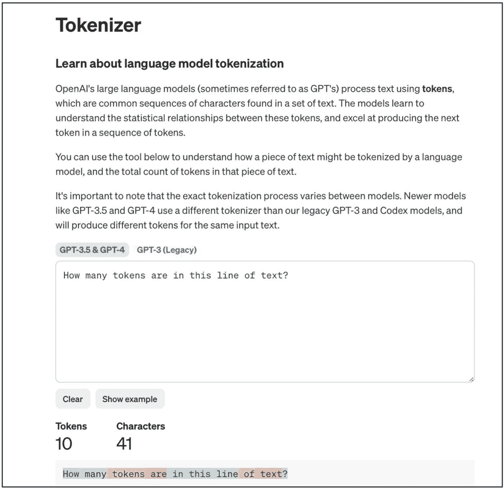
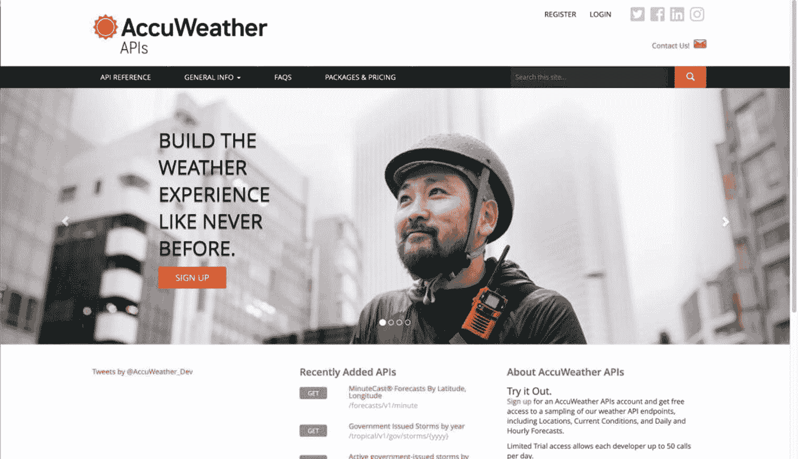
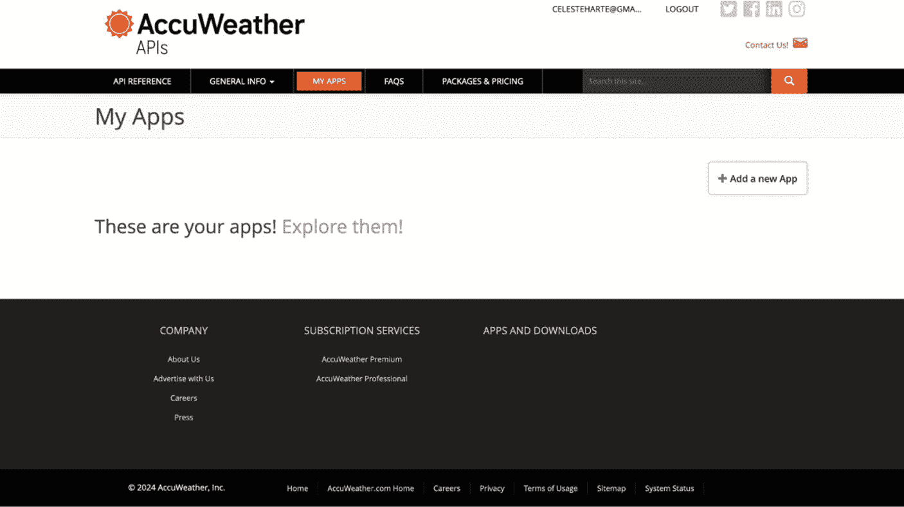
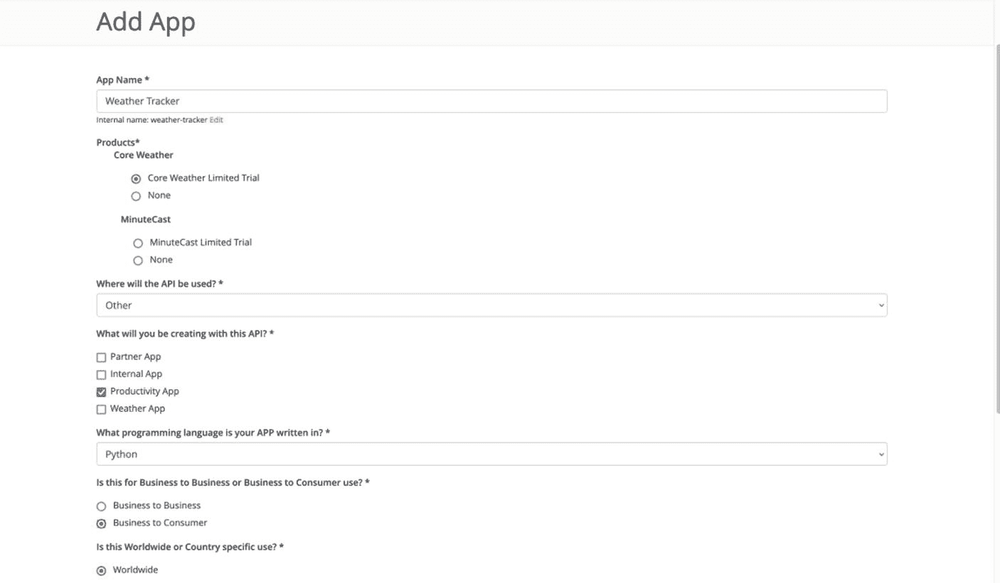
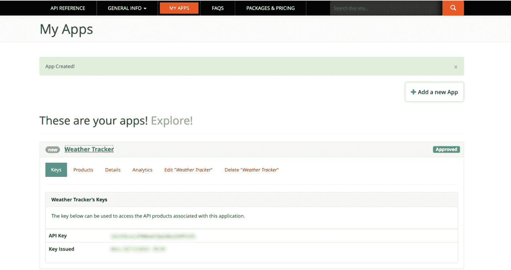
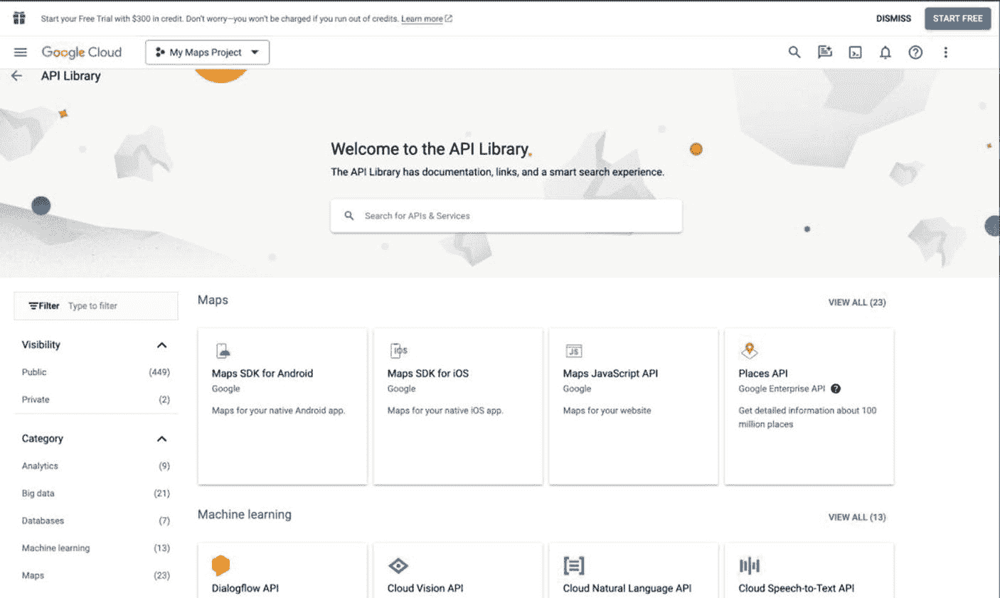
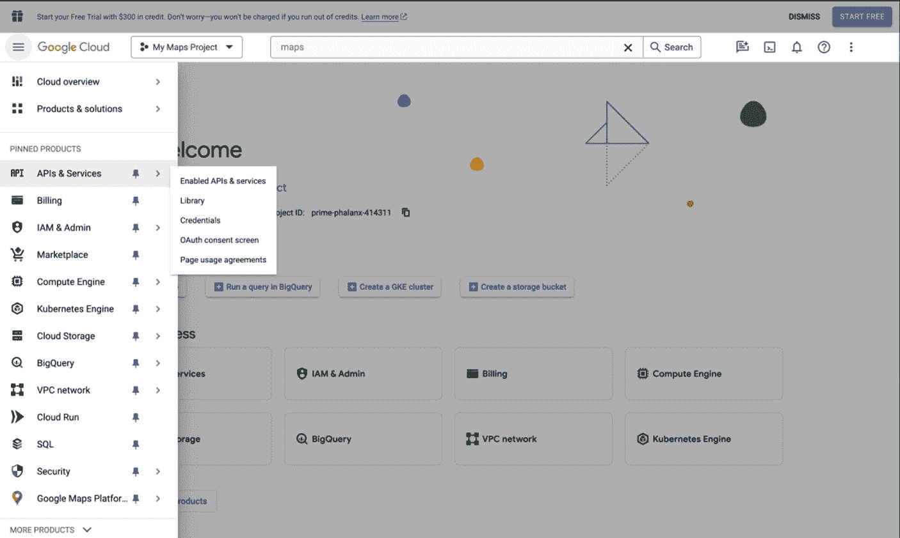
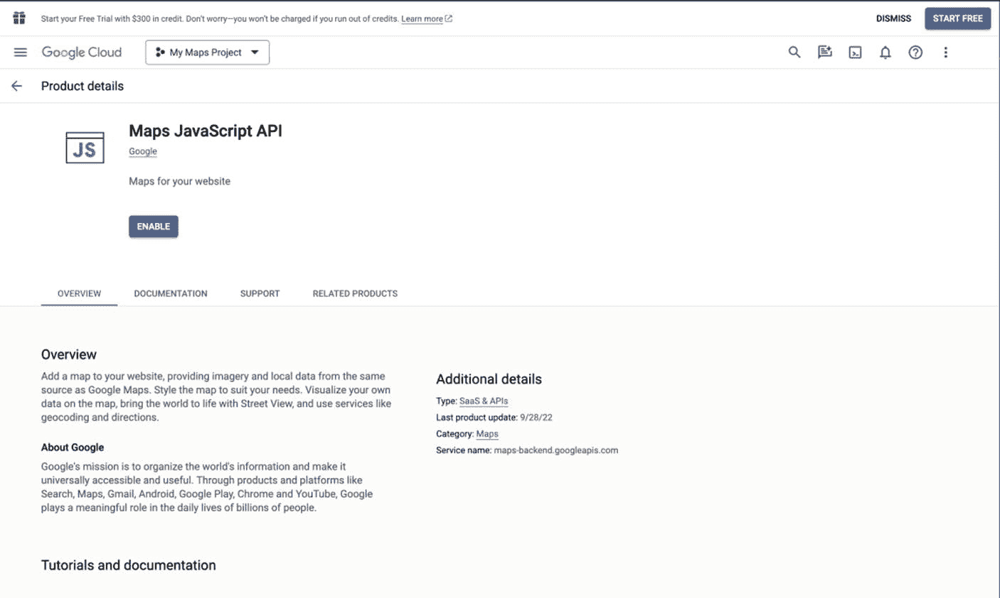
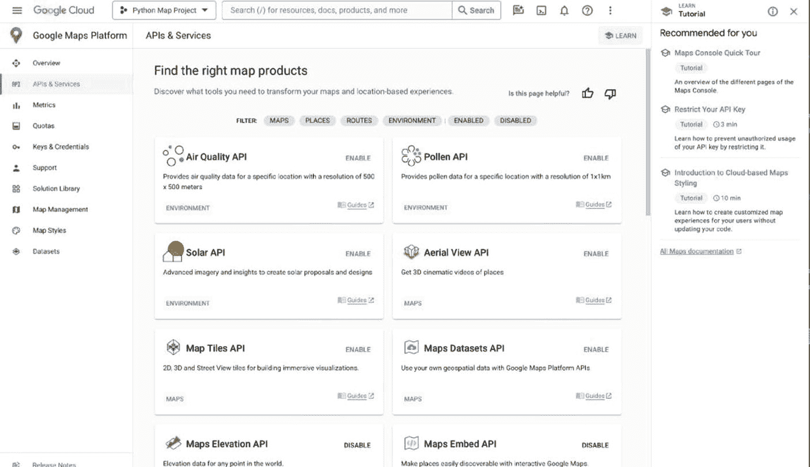
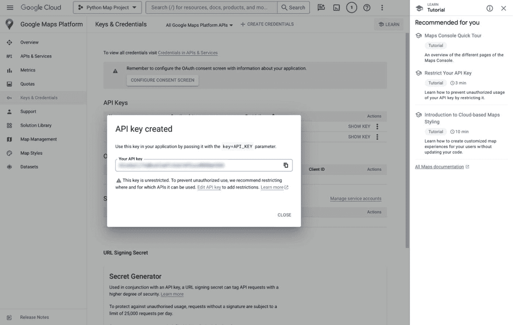

# 2. 使用 ChatGPT 作为你的 JavaScript 结对编程伙伴

我非常喜欢 XP（极限编程）的一些实践，尤其是结对编程。无论你喜欢哪种风格的结对编程，它都涉及两名工程师坐在同一台屏幕前，共同解决同一个问题。你获得的最大好处之一就是为问题带来全新的视角，当然，现在有两名工程师“接触”过代码库，而不是只有一名。有时，你可以让一名工程师编写代码，另一名编写测试和注释。无论你如何划分，这都是好事。

## 章节概述

本章将引导你获取并测试你的 API 密钥，让你熟悉如何调用 OpenAI 的 ChatGPT JavaScript API，并介绍如何使用其他模型完成任务。此外，我们将使用 ChatGPT 作为结对编程伙伴，创建一个应用程序，允许我们输入城市名称和期望的上班到达时间，然后根据当前交通状况提供天气和预计到达时间！听起来很兴奋？那我们就开始吧。

## 你已经安装了 Node.js，对吧？

显而易见，如果电脑上没有安装 Node.js，你在本书中能做的工作非常有限。因此，要检查你拥有的 Node 版本，只需打开一个终端窗口并执行：

```
node - v
```

如果命令输出显示了一个版本号，那么你就准备好了！

现在，执行上述命令后，如果你看到错误消息，那么你需要为你的特定操作系统安装 Node.js。如果是这种情况，请使用 ChatGPT 或谷歌搜索根据你的操作系统获取安装说明，然后打开一个新的终端窗口并执行上述命令以查看你拥有的版本。

## 使用 npm 安装（或更新）OpenAI Node.js 库

为了使用 JavaScript 的 OpenAI 库，兼容的最低 Node 版本是 18，尽管代码示例是在版本 20 下测试的。现在你已经具备了所有先决条件，是时候安装 OpenAI Node.js 库本身了。回到你的终端窗口，执行以下命令：

```
npm install openai
```

如果 OpenAI 库尚不存在，上述命令将为你安装它；如果已存在，则会将其更新到最新版本。

## 设置 API 密钥的三种方法

在设置 OpenAI API 的 API 密钥时，有多种方法可供选择，每种方法都针对特定的项目需求和安全考虑而设计。

### 选项 #1：设置系统级环境变量

环境变量方法为 API 密钥存储建立一个系统级环境变量。这为密钥管理提供了一个中心点，简化了跨不同项目的部署。

让我们看看如何执行此操作的步骤。

#### 对于 Mac OS

首先，打开终端。你可以在应用程序文件夹中找到它，或使用聚焦搜索（Command + Space）进行搜索。

接下来，编辑你的 bash 配置文件。对于较旧的 MacOS 版本，你会使用命令 `nano ~/.bash_profile`。较新 MacOS 版本的用户需要使用 `nano ~/.zshrc`。这将在文本编辑器中打开配置文件。

现在让我们添加你的环境变量。在编辑器中，添加下面一行，将“your-api-key-here”替换为你的实际 API 密钥，不要带单引号。

```
export OPENAI_API_KEY='your-api-key-here'
```

让我们保存并退出，按 `Ctrl+O` 写入更改，然后按 `Ctrl+X` 关闭编辑器。

现在，你将使用 `source ~/.bash_profile`（适用于较旧的 Mac OS 版本）和 `source ~/.zshrc`（适用于较新的 Mac OS 版本）来加载你的配置文件。这将加载更新后的配置文件。

最后，我们将验证一切是否正确完成。在终端中，输入 `echo $OPENAI_API_KEY`。如果一切顺利，你应该会看到你的 API 密钥的值。

```
echo $OPENAI_API_KEY
```

#### 对于 Windows

首先打开命令提示符。你可以通过在开始/Windows 菜单中搜索“cmd”来找到它。

现在，我们将使用以下命令在当前会话中设置环境变量，将“your-api-key-here”替换为你的实际 API 密钥。此命令为当前会话设置 `OPENAI_API_KEY`。

```
setx OPENAI_API_KEY 'your-api-key-here'
```

你可以通过系统属性添加变量来使设置永久生效：

*   右键单击“此电脑”或“我的电脑”，然后选择“属性”。
*   点击“高级系统设置”。
*   点击“环境变量”按钮。
*   在“系统变量”部分，点击“新建...”，然后输入 `OPENAI_API_KEY` 作为变量名，你的 API 密钥作为变量值。

为确保一切正常工作，请重新打开命令提示符并输入以下命令来验证设置。它应该会显示你的 API 密钥。

```
echo %OPENAI_API_KEY%
```


#### 针对 Linux 系统

要为当前会话设置环境变量，请打开终端窗口并使用 `export` 命令。将 `“your-api-key-here”` 替换为你的实际 API 密钥。

```
export OPENAI_API_KEY='your-api-key-here'
清单 2-1
在 Linux 硬盘上添加环境变量
```

要使环境变量在会话间持久化，你可以将其添加到 shell 的配置文件中，例如 Bash 的 `~/.bashrc`。具体操作如下：

在文本编辑器中打开配置文件。例如：

```
nano ~/.bashrc
```

在文件末尾添加以下行：

```
export OPENAI_API_KEY='your-api-key-here'
```

保存文件并退出文本编辑器。

要立即应用更改，你可以关闭并重新打开终端，或者运行：

```
source ~/.bashrc
```

要验证环境变量是否设置正确，你可以在终端中 `echo` 其值。此命令应显示你的 API 密钥：

```
echo $OPENAI_API_KEY
```

### 选项 #2：创建 .env 文件

使用系统级环境变量非常适合让机器上运行的任何应用程序或脚本都能访问 API 密钥。但是，如果你的用例更简单一些，我们可以简单地创建一个仅在特定程序或脚本范围内可访问的局部变量。这在不同项目需要不同密钥的情况下也很有用，因此可以防止密钥使用冲突。让我们直接开始吧！

我们将首先创建一个本地的 `.env` 文件。此文件将保存你的 API 密钥，确保它仅被指定的项目使用。导航到你打算创建 `.env` 文件的项目文件夹。

**注意**

为防止你的 `.env` 文件通过版本控制被意外共享，请在项目的根目录中创建一个 `.gitignore` 文件。添加一行 `.env` 以确保你的 API 密钥和其他敏感信息的机密性。

接下来，使用终端或 IDE 创建 `.gitignore` 和 `.env` 文件。复制你的 API 密钥，并将 `“your-api-key-here”` 替换为你的实际 API 密钥（不带单引号）。

此时，你的 `.env` 文件应如下所示：

```
OPENAI_API_KEY='your-api-key-here'
```

最后，你可以使用以下代码片段将 API 密钥导入到你的 Node.js 代码中：

```
import OpenAI from "openai";
import "dotenv/config";
// 创建一个新的 OpenAI 客户端
const openai = new OpenAI({
apiKey: process.env["OPENAI_API_KEY"],
});
清单 2-2
将 .env 文件导入到你的 Node.js 应用程序中
```

当然，如果你还没有安装 `dotenv` 包，你需要安装它。只需执行：

```
npm install dotenv
```

### 选项 #3：在应用程序中直接硬编码 API 密钥（请谨慎使用）

出于安全原因，不推荐长期使用最后这种方法。但是，为了了解其工作原理，我们将介绍如何将 API 密钥硬编码到你的应用程序中，以便快速测试你的 API 密钥是否正常工作。

首先，你需要在 JavaScript 代码中将 API 密钥赋值给一个变量。将 `“YOUR_API_KEY”` 替换为你从 OpenAI 收到的实际 API 密钥。确保此 API 密钥保持安全，不要公开共享。

接下来，你需要在 Node.js 脚本中初始化 OpenAI 客户端。这是通过实例化 `OpenAI` 类并将 `api_key` 参数设置为 API 密钥来完成的。通过在初始化时提供 API 密钥，你可以使 OpenAI 客户端能够访问 OpenAI API 提供的服务。此步骤确保你的 Node.js 脚本可以使用指定的 API 密钥与 OpenAI API 进行通信。

```
import OpenAI from "openai";
import "dotenv/config";
const API_KEY = "YOUR_API_KEY";
const openai = new OpenAI({
apiKey: API_KEY,
});
清单 2-3
将 API 密钥直接编码到你的应用程序中
```

现在，让我们使用 OpenAI API 创建我们的第一个应用程序，并通过获取 OpenAI API 中可用模型的列表来同时测试密钥。

**注意**

从现在开始，代码示例将通过本地的 `.env` 文件访问我们的 API 密钥。

## 创建你的第一个 JavaScript ChatGPT 应用程序：list-models

实际上，我们将在这里同时完成两项任务。我们将使用 OpenAI API 创建一个基本的 Node.js 脚本，并在此过程中验证我们是否已正确获取 API 密钥。所以，不言而喻，如果你还没有这样做，请按照第 1 章的说明创建你的 OpenAI 开发者帐户并获取你的 API 密钥。接下来，本书中的所有代码示例都需要一个有效的 API 密钥。

## 使用 `openai.models.list()` 获取可用模型列表

最基本（但也至关重要）的功能之一是我们能够获取可用模型的列表。你可能会问，为什么？ChatGPT 网站只公开了少数几个可用模型，而 Playground 则增加了更多可供使用的模型。然而，通过调用 `openai.models.list()`，你会得到一个指定了每个模型名称的列表，而且有很多可供选择！

### 处理响应

**注意**

由于对象可以包含数组（这很难在表格中表示），我们使用以下符号 “↳” 来表示数组的元素。从表 2-1 中可以看出，`“id”`、`“object”`、`“created”` 和 `“owned_by”` 都是响应中 `“data”` 数组的元素。

**表 2-1**

模型对象的结构

| 字段 | 类型 | 描述 |
| --- | --- | --- |
| `object` | 字符串 | 始终返回字面量 `“list”` |
| `data` | 数组 | OpenAI 提供的 AI 模型数组 |
| `↳ id` | 字符串 | AI 模型的唯一 ID，本质上是模型的完整名称 |
| `↳ object` | 字符串 | 始终返回字面量 `“model”` |
| `↳ created` | 整数 | 模型的创建日期 |
| `↳ owned_by` | 字符串 | 拥有该模型的组织名称 |

现在我们有了模型对象的详细信息，让我们讨论一下如何测试我们在第一章中获得的 API 密钥。实际上有几种方法可以做到这一点。


## 使用 API 密钥通过 OpenAI API 获取可用模型列表

在本地 `.env` 文件中配置好 API 密钥后，我们将使用以下代码获取 OpenAI API 中可用的模型列表，并将其打印到终端中。

```javascript
import OpenAI from "openai";
import "dotenv/config";
// 创建 openai 客户端
const openai = new OpenAI({
apiKey: process.env["OPENAI_API_KEY"],
});
async function main() {
// 从 openai 客户端获取模型列表
const model_list = await openai.models.list();
// 将模型名称保存到变量中
const model_names_list = model_list.data.map((model) => model.id);
// 遍历名称并打印它们
for (const name of model_names_list) {
console.log(name);
}
}
main();
```

运行清单 2-4 中的代码后，清单 2-5 显示了所有可供我们使用的模型：

```
o1
o1-mini
dall-e-3
gpt-4o-mini
text-embedding-3-large
text-embedding-3-small
gpt-4-0125-preview
text-embedding-ada-002
dall-e-2
tts-1
tts-1-hd-1106
tts-1-1106
tts-1-hd
gpt-4
babbage-002
gpt-4-turbo-preview
gpt-4o-2024-08-06
gpt-3.5-turbo
gpt-4o
gpt-3.5-turbo-1106
whisper-1
gpt-3.5-turbo-16k
gpt-3.5-turbo-instruct-0914
gpt-3.5-turbo-0125
gpt-4-0613
gpt-3.5-turbo-instruct
gpt-4-1106-preview
chatgpt-4o-latest
gpt-4-turbo-2024-04-09
davinci-002
gpt-4-turbo
gpt-4o-2024-05-13
gpt-4o-mini-2024-07-18
```

从上面的列表中可以看到，作为开发者，我们拥有更多可用的 AI 模型，其中一些甚至没有向任何使用 Chat Playground 的用户开放！

现在，我们已经能够使用 API 密钥以编程方式调用 OpenAI API。在本章的剩余部分，我们将了解如何将 ChatGPT 用作结对编程助手，以便快速构建 JavaScript 应用程序。

不过，我们首先需要认真思考一下需要向 ChatGPT 提供的提示词。

## 等等，我的提示词中有多少个 Token？

在某个时候，你会开始思考计划发送给 ChatGPT 的提示词，并仔细考虑要使用的模型的 Token 限制（以及成本）。如果你忘记了，请务必参考表 1-1，其中列出了模型及其 Token 价格。此外，OpenAI 还创建了一个易于使用的网站，可以让你查看提示词中有多少个 Token，如图 2-1 所示。



ChatGPT Token 计数器可以快速统计提示词中的 Token 数量

*ChatGPT Token 计数器*

[`platform.openai.com/tokenizer`](https://platform.openai.com/tokenizer)

## 使用 ChatGPT 作为结对编程助手构建天气应用程序

现在我们已经确认 API 密钥可以正常工作，是时候开始用 ChatGPT 编写第一个项目了。这是激动人心的部分！我们将使用 ChatGPT 帮助我们创建一个 JavaScript 应用程序，该程序将提供天气信息以及从家到工作地点的通勤时间。听起来很厉害，对吧？

### 设置提示词

让我们询问 ChatGPT 应该如何开始。现在是练习提示工程的好时机。我们将向 ChatGPT 解释我们的需求，看看它会给出什么结果。清单 2-6 显示了我们使用的提示词。

```
我需要一个简单的 node.js 应用程序，它允许我在控制台中输入城市名称，并使用 Accuweather API 获取该城市的天气信息
```

这是我们在响应中得到的代码（清单 2-7）：

```
一个黑白几何标志，由六个形状组成互锁图案，形成对称的圆形设计。
当然！以下是创建简单 Node.js 应用程序的分步指南，该应用程序可从 AccuWeather API 获取指定城市的天气数据。
### 步骤 1：设置 Node.js 项目
1\. **初始化一个新的 Node.js 项目：**
```bash
mkdir weather-app
cd weather-app
npm init -y
```
2\. **安装必要的包：**
```bash
npm install axios readline-sync dotenv
```
### 步骤 2：设置 AccuWeather API
1\. **注册 AccuWeather API 密钥：**
前往 [AccuWeather 开发者门户](https://developer.accuweather.com/) 注册并获取 API 密钥。
2\. **在项目根目录创建 `.env` 文件以存储 API 密钥：**
```plaintext
ACCUWEATHER_API_KEY=你的 API 密钥
```
### 步骤 3：编写应用程序代码
在项目根目录创建名为 `index.js` 的文件，并添加以下代码：
```javascript
const axios = require("axios");
const readlineSync = require("readline-sync");
require("dotenv").config();
const apiKey = process.env.ACCUWEATHER_API_KEY;
const baseUrl = "http://dataservice.accuweather.com";
async function getCityKey(city) {
const url = `${baseUrl}/locations/v1/cities/search`;
try {
const response = await axios.get(url, {
params: {
apikey: apiKey,
q: city,
},
});
if (response.data && response.data.length > 0) {
return response.data[0].Key;
} else {
console.log("未找到城市。");
process.exit(1);
}
} catch (error) {
console.error("获取城市密钥时出错：", error);
process.exit(1);
}
}
async function getWeather(cityKey) {
const url = `${baseUrl}/currentconditions/v1/${cityKey}`;
try {
const response = await axios.get(url, {
params: {
apikey: apiKey,
},
});
if (response.data && response.data.length > 0) {
return response.data[0];
} else {
console.log("未找到天气数据。");
process.exit(1);
}
} catch (error) {
console.error("获取天气数据时出错：", error);
process.exit(1);
}
}
async function main() {
const city = readlineSync.question("输入你的城市：");
const cityKey = await getCityKey(city);
const weather = await getWeather(cityKey);
console.log(`城市 ${city} 的天气：`);
console.log(
`温度：${weather.Temperature.Metric.Value}°${weather.Temperature.Metric.Unit}`
);
console.log(`天气描述：${weather.WeatherText}`);
}
main();
```
### 步骤 4：运行应用程序
1\. **运行你的应用程序：**
```bash
node index.js
```
2\. **在提示时输入你的城市：**
```plaintext
输入你的城市：[你的城市名称]
```
你应该会看到输入城市的当前天气状况。
### 总结
这个简单的 Node.js 应用程序使用 AccuWeather API 获取并显示指定城市的当前天气。它使用 `axios` 发送 HTTP 请求，使用 `readline-sync` 从控制台获取用户输入，并使用 `dotenv` 安全地管理环境变量。
```

这太棒了，而且非常详尽！那么，让我们按照响应中提供的步骤操作，稍后我们可以继续对话，对代码进行一些修改。


### 使用 AccuWeather API 创建天气应用

按照说明，我们首先需要在 AccuWeather 上注册一个账户。访问 [`https://developer.accuweather.com/`](https://developer.accuweather.com/) 并点击 **注册** 链接进行注册（图 2-2）。



AccuWeather API 网页，展示了一位戴头盔的男子在城市环境中仰望天空。文字写着“打造前所未有的天气体验”。下方有一个红色按钮，写着“注册”。导航栏包含 API 参考、常规信息、常见问题以及套餐与定价等链接。右上角有 Twitter、Facebook、LinkedIn 和 Instagram 的社交媒体图标。页面还突出显示了“最近添加的 API”和“关于 AccuWeather API”部分。

图 2-2

AccuWeather 开发者主页

登录后，导航到 **我的应用**（图 2-3）。


AccuWeather API 网页头部，包含导航菜单，选项有：API 参考、常规信息、我的应用、常见问题以及套餐与定价。背景是一张雪天卡车的模糊图片。

图 2-3

导航到 AccuWeather 开发者门户的“我的应用”选项卡

进入 **我的应用** 选项卡后，你需要 **添加一个新应用**，以便获取一个 API 密钥，用于我们的应用程序（图 2-4）。



图片显示的是 AccuWeather API 网站的“我的应用”页面。它有一个导航栏，包含 API 参考、常规信息、我的应用、常见问题以及套餐与定价等选项。主体部分邀请用户探索他们的应用，提示语为“这些是你的应用！探索它们吧！”右侧有一个标有“添加新应用”的按钮。页脚包含公司、订阅服务以及应用与下载等类别下的链接，选项包括关于我们、AccuWeather Premium 和 AccuWeather Professional。顶部有社交媒体图标和联系方式。

图 2-4

使用 AccuWeather 创建新应用

在设置过程中，你需要为应用命名，并回答一些简单的问题，例如 API 的使用地点以及你打算用 API 做什么。如图 2-5 所示，我们将 AccuWeather 应用命名为“天气追踪器”。



一个标题为“添加应用”的表单界面，用于创建名为“天气追踪器”的新应用。表单包含选择产品的字段，选项有“核心天气有限试用”和“分钟预报有限试用”。API 使用位置设置为“其他”。该应用被归类为“生产力应用”和“天气应用”，使用“Python”编写。其用途为“企业对消费者”，并面向“全球”可用。

图 2-5

为我们的 AccuWeather 应用添加规格说明

这里最重要的配置是，当系统要求你指定打算使用的产品时，**请务必启用核心天气有限试用**。

你的应用可能需要一些时间才能获得批准，但通常这个过程非常快。完成后，你会在 **我的应用** 页面上看到你的新应用，其中包含你的 API 密钥！任务完成（图 2-6）。



图片显示了一个标题为“我的应用”的网页，绿色横幅中有一条通知，显示“应用已创建！”。下方有一个列出应用的区域，其中有一个名为“天气追踪器”的新应用，标记为已批准。选项包括查看密钥、产品、详情、分析，以及编辑或删除应用。右侧有一个标有“+ 添加新应用”的按钮。“天气追踪器的密钥”部分显示了模糊的 API 密钥信息。

图 2-6

在 AccuWeather 开发者门户上查看你新创建的应用

### 通过提示工程优化我们的提示

现在，一切准备就绪，当你运行代码时，应用程序会要求你输入城市名称。

```
输入你的城市：
```

一旦你输入一个有效的城市名称，你会发现一切运行顺畅，并且会得到类似如下的响应（显然，预报会根据你输入的城市以及运行当天的天气情况而变化）。

```
纽约的天气：
温度：23.3°C
天气描述：多云
清单 2-8
使用 ChatGPT 作为我们的结对编程伙伴，我们在几分钟内构建了一个功能齐全的天气应用
```

通过运行代码，我们得到了纽约市天气的一个不错的基本描述，但还有一些地方可以改进。

AccuWeather 为各种天气状况提供了图标。目前，我们可以看到纽约的天气是多云，但我们也可以获得更长的描述，说明当天剩余时间的天气。此外，对于居住在美国的用户来说，用华氏度显示温度更合理。那么，让 ChatGPT 帮我们进行这些修改吧。

由于 ChatGPT 可以保留上下文，我们将在与清单 2-9 相同的聊天对话中向 ChatGPT 发出提示：

```
谢谢。我想对这段代码做一些修改。
•    不要使用摄氏度，而是获取华氏度的温度
•    进行一次 API 调用，获取图标编号和图标 URL，以便在响应中打印
•    进行一次 API 调用，获取响应中的天气描述
清单 2-9
提示 ChatGPT 修改代码，以从 AccuWeather API 获取更详细的响应
```

这是我们从 ChatGPT 得到的回答（清单 2-10）。


## 排版后的内容

一个黑白几何标志，采用互锁对称设计，六个环形成圆形图案。

让我们修改代码以包含以下更改：
1. 检索华氏温度而非摄氏温度。
2. 获取图标编号和图标 URL 以在响应中打印。
3. 在响应中包含天气描述。

### 更新后的代码

以下是更新后的`index.js`：

```javascript
const axios = require("axios");
const readlineSync = require("readline-sync");
require("dotenv").config();
const apiKey = process.env.ACCUWEATHER_API_KEY;
const baseUrl = "http://dataservice.accuweather.com";
const iconBaseUrl = "https://developer.accuweather.com/sites/default/files";
async function getCityKey(city) {
const url = `${baseUrl}/locations/v1/cities/search`;
try {
const response = await axios.get(url, {
params: {
apikey: apiKey,
q: city,
},
});
if (response.data && response.data.length > 0) {
return response.data[0].Key;
} else {
console.log("City not found.");
process.exit(1);
}
} catch (error) {
console.error("Error fetching city key:", error);
process.exit(1);
}
}
async function getWeather(cityKey) {
const url = `${baseUrl}/currentconditions/v1/${cityKey}`;
try {
const response = await axios.get(url, {
params: {
apikey: apiKey,
},
});
if (response.data && response.data.length > 0) {
return response.data[0];
} else {
console.log("Weather data not found.");
process.exit(1);
}
} catch (error) {
console.error("Error fetching weather data:", error);
process.exit(1);
}
}
function getIconUrl(iconNumber) {
const iconNumberString = iconNumber.toString().padStart(2, "0");
return `${iconBaseUrl}/${iconNumberString}-s.png`;
}
async function main() {
const city = readlineSync.question("Enter your city: ");
const cityKey = await getCityKey(city);
const weather = await getWeather(cityKey);
const temperatureF = weather.Temperature.Imperial.Value;
const weatherText = weather.WeatherText;
const iconNumber = weather.WeatherIcon;
const iconUrl = getIconUrl(iconNumber);
console.log(`Weather in ${city}:`);
console.log(`Temperature: ${temperatureF}°F`);
console.log(`Weather Description: ${weatherText}`);
console.log(`Icon URL: ${iconUrl}`);
}
main();
```

#### 更改说明

1. **华氏温度**：使用`Temperature.Imperial.Value`获取华氏温度。
2. **图标编号和 URL**：创建辅助函数`getIconUrl`来格式化图标编号并构建图标图像的 URL。
3. **天气描述**：使用`WeatherText`字段包含天气描述。

#### 运行应用程序

进行这些更改后，使用相同的命令运行应用程序：

```bash
node index.js
```

在提示时输入您的城市，您将获得当前天气状况、华氏温度、天气描述和图标 URL。

此更新后的代码确保控制台中显示所有所需信息，包括天气图标 URL。

**清单 2-10**：ChatGPT 对修改天气应用程序代码的响应

当我们运行此代码时，我们得到了预期的结果。我们再次输入一个有效的城市名称（本例中为纽约市），得到以下响应（清单 2-11）：

```
Enter your city: New York
Weather in New York:
Temperature: 63°F
Weather Description: Mostly cloudy
Icon URL: https://developer.accuweather.com/sites/default/files/38-s.png
```

**清单 2-11**：运行修改后代码后来自 AccuWeather API 的响应

现在我们的代码完全按照预期工作，让我们尝试另一个示例。

## 使用 ChatGPT 作为结对编程伙伴构建估算距离和到达时间的应用程序

接下来我们要做的是开始构建一个应用程序，该应用程序可以估算从一个地点到另一个地点的预计到达时间和距离，例如从家到办公室。让我们使用 Google Maps API 来实现这一点。


### 使用 Google Maps Platform API 创建项目

大多数人已经拥有 Gmail 账户，但万一你没有，请务必在继续之前创建一个。

Google 拥有大量 API，几乎涵盖你能想到的所有领域。然而，由于我们需要完成需要地理定位数据的任务，因此需要直接访问 Google Maps 的 API（如图 2-7 所示），其地址为 [`https://developers.google.com/maps/documentation`](https://developers.google.com/maps/documentation)。


Google Maps Platform 网页，标题为“利用 Google 对现实世界的认知，构建出色的应用”。下方有“开始使用”和“阅读文档”按钮。该页面推广使用地图、路线和地点功能创建实时体验。底部区域通过图片突出显示热门主题，包括一张彩色图形、一张城市景观图、一张带有位置标记的地图以及一张详细的地图布局。导航栏包含指向概览、产品、定价、文档、博客和社区的链接。

图 2-7

Google Maps Platform 主页

在 Google Maps Platform 页面上，点击**开始使用**来设置你的账户以使用 API。按照 Google 提供的步骤操作后，你将进入图 2-7 所示的页面，在这里你可以看到 Google Maps Platform 提供的各种 API。但首先引起你注意的可能是，你还需要**完成账户设置**。

完成账户设置（见图 2-8）需要输入信用卡信息，以便开始免费试用，该试用将提供价值 200 美元的额度，这完全足够我们测试使用。


Google Maps Platform 界面，展示了用于定制基于位置的体验的功能。主要部分突出显示了带有地图标记图标的“Locator Plus”，提供将客户引导至营业地点的工具。选项包括显示理想的营业地点、简化地址输入以及在地图上可视化数据。侧边栏列出了规划路线和以 3D 方式探索区域等功能。顶部横幅提示用户完成账户设置。

图 2-8

完成 Google Maps Platform 账户设置

正确设置账户后，你将看到一个欢迎页面。在左侧，你会找到一个菜单图标，点击它可以显示你有权访问的服务列表。你需要导航到**应用与服务**，然后点击**库**（如图 2-9 和 2-10 所示）。



Google Cloud API 库界面，显示欢迎消息和用于搜索 API 和服务的搜索栏。该页面包含“地图”和“机器学习”API 部分。“地图”部分包括 Android 版 Maps SDK、iOS 版 Maps SDK、Maps JavaScript API 和 Places API 等选项。“机器学习”部分列出了 Dialogflow、Cloud Vision、Cloud Natural Language 和 Cloud Speech-to-Text 等 API。左侧有可见性和类别过滤器，提供公共和私有 API 选项，以及分析和大数据等类别。顶部横幅提供价值 300 美元额度的免费试用。

图 2-10

API 库页面



Google Cloud Platform 仪表盘界面，显示一个名为“My Maps Project”的项目。搜索栏中包含单词“maps”。“固定产品”下的下拉菜单列出了 API 和服务、结算以及 IAM 和管理等选项。可以看到“在 BigQuery 中运行查询”和“创建存储桶”等操作按钮。顶部横幅提供价值 300 美元额度的免费试用。

图 2-9

导航到 Google Maps Platform 上的 API 和服务选项卡

你需要点击 **Maps JavaScript API**，然后**启用**它，如图 2-11 所示。



Google Cloud 界面，显示 Maps JavaScript API 产品详情。该页面包含一个“启用”按钮，以及概览、文档、支持和相关产品选项卡。概览部分描述了如何使用 Google Maps 数据将地图添加到网站。其他详细信息提到产品类型为 SaaS 和 API，最后更新于 2022 年 9 月 28 日，归类于地图。服务名称为 `maps-backend.googleapis.com`。

图 2-11

启用 JavaScript API

启用 JavaScript API 后，返回两次并再次打开菜单，然后点击 **Google Maps Platform** 以查看 Google Maps 的仪表盘。

从这里，我们将查看另一个侧边菜单，它看起来与之前的类似，但这次我们将再次点击**应用与服务**以查看不同的页面。在这里，你可以点击**路线**来启用它，如图 2-12 所示。



Google Cloud 界面，在“查找合适的地图产品”下显示各种与地图相关的 API。选项包括空气质量 API、花粉 API、太阳能 API、空中视角 API、地图瓦片 API、地图数据集 API、地图高程 API 和地图嵌入 API。每个 API 都有简要说明和一个“启用”或“禁用”按钮。侧边栏建议了“地图控制台快速导览”和“限制你的 API 密钥”等教程。

图 2-12

启用路线 API

启用我们需要的 API 后，导航到**密钥和凭据**选项卡，然后**创建新的 API 密钥**（图 2-13）。



该图片显示了 Google Cloud Platform 中用于管理 Google Maps Platform 内 API 密钥的界面。一个弹出窗口显示了一个新创建的 API 密钥，并带有警告信息，提示该密钥未受限制，建议用户限制其使用以确保安全。背景包括概览、API 和配额等导航选项。右侧有一个标题为“为你推荐”的侧边栏，列出了“地图控制台快速导览”和“限制你的 API 密钥”等教程。

图 2-13

Google Maps Platform 上的密钥和凭据页面

现在我们有了 Google Maps API 密钥，我们可以再次利用 ChatGPT 作为我们的结对编程伙伴。我们的最终目标是拥有一个能够告诉我们目的地有多远以及到达那里需要多长时间的应用程序。顺便说一句，这里有一个有趣的事实——当你请求预计行程时间时，Google Maps 路线 API 会考虑道路上的实时交通拥堵数据，这使得我们的应用程序非常适合提高生产力！

现在，为了展示 ChatGPT 作为结对编程伙伴的灵活性，让我们采用两种不同的方法来实现同一个目标。


### 方法一：利用 ChatGPT 将 cURL 命令转换为 JavaScript

在第一种方法中，我们不会去阅读 Google Maps Platform 的文档，而是直接切入正题，将调用所需 API 的 `cURL` 命令交给 ChatGPT，并展示如何利用 ChatGPT 将其转换为 JavaScript 代码。不用客气。

清单 2-12 是来自 Google Maps Platform 文档的 `cURL` 命令：

```
curl -X POST -d '{
"origin":{
"location":{
"latLng":{
"latitude": 37.419734,
"longitude": -122.0827784
}
}
},
"destination":{
"location":{
"latLng":{
"latitude": 37.417670,
"longitude": -122.079595
}
}
},
"travelMode": "DRIVE",
"routingPreference": "TRAFFIC_AWARE",
"departureTime": "2023-10-15T15:01:23.045123456Z",
"computeAlternativeRoutes": false,
"routeModifiers": {
"avoidTolls": false,
"avoidHighways": false,
"avoidFerries": false
},
"languageCode": "en-US",
"units": "IMPERIAL"
}' \
-H 'Content-Type: application/json' -H 'X-Goog-Api-Key: YOUR_API_KEY' \
-H 'X-Goog-FieldMask: routes.duration,routes.distanceMeters,routes.polyline.encodedPolyline' \
'https://routes.googleapis.com/directions/v2:computeRoutes'
清单 2-12
用于调用 Google Maps Routes API 的 cURL 命令
```

请记住，最佳实践是使用三个井号（`###`）将指令与内容分开，以获得最佳效果。清单 2-13 是我们提供给 ChatGPT 的完整提示词：

```
我正在用 JavaScript 编码，试图构建一个应用程序，该应用程序向 Google Maps API 发出请求，并获取从一个地点到另一个地点所需的时间。以下是可以实现该目标的 cURL 代码。请帮我将其转换为可以在 JavaScript 中使用的代码：
###
curl -X POST -d '{ "origin":{ "location":{ "latLng":{ "latitude": 37.419734, "longitude": -122.0827784 } } }, "destination":{ "location":{ "latLng":{ "latitude": 37.417670, "longitude": -122.079595 } } }, "travelMode": "DRIVE", "routingPreference": "TRAFFIC_AWARE", "departureTime": "2023-10-15T15:01:23.045123456Z", "computeAlternativeRoutes": false, "routeModifiers": { "avoidTolls": false, "avoidHighways": false, "avoidFerries": false }, "languageCode": "en-US", "units": "IMPERIAL" }'
-H 'Content-Type: application/json' -H 'X-Goog-Api-Key: YOUR_API_KEY'
-H 'X-Goog-FieldMask: routes.duration,routes.distanceMeters,routes.polyline.encodedPolyline'
'https://routes.googleapis.com/directions/v2:computeRoutes
清单 2-13
提示词。要求 ChatGPT 将 cURL 转换为 JavaScript
```

这是我们从 ChatGPT 的回复中得到的代码（清单 2-14）：

```
一个黑白几何标志，采用交织的对称设计，类似于一个结或六瓣花。
要将提供的 cURL 命令转换为 JavaScript，你可以使用 `fetch` API。以下是具体方法：
```javascript
const apiKey = "YOUR_API_KEY"; // 替换为你的实际 API 密钥
const url = "https://routes.googleapis.com/directions/v2:computeRoutes";
const requestBody = {
origin: {
location: {
latLng: {
latitude: 37.419734,
longitude: -122.0827784,
},
},
},
destination: {
location: {
latLng: {
latitude: 37.41767,
longitude: -122.079595,
},
},
},
travelMode: "DRIVE",
routingPreference: "TRAFFIC_AWARE",
departureTime: "2023-10-15T15:01:23.045123456Z",
computeAlternativeRoutes: false,
routeModifiers: {
avoidTolls: false,
avoidHighways: false,
avoidFerries: false,
},
languageCode: "en-US",
units: "IMPERIAL",
};
const requestOptions = {
method: "POST",
headers: {
"Content-Type": "application/json",
"X-Goog-Api-Key": apiKey,
"X-Goog-FieldMask":
"routes.duration,routes.distanceMeters,routes.polyline.encodedPolyline",
},
body: JSON.stringify(requestBody),
};
fetch(url, requestOptions)
.then((response) => response.json())
.then((data) => {
// 在此处处理数据
console.log(data);
})
.catch((error) => {
console.error("错误:", error);
});
```
#### 说明：
1. **API 密钥：** 确保将 `'YOUR_API_KEY'` 替换为你实际的 Google Maps API 密钥。
2. **URL：** Google Maps Directions API 端点的 URL 保持不变。
3. **请求体：** 请求体被定义为一个 JavaScript 对象，然后使用 `JSON.stringify()` 转换为 JSON 字符串。
4. **请求选项：**
   - `method: 'POST'` 表示我们正在发起一个 POST 请求。
   - `headers` 包含内容类型、API 密钥和字段掩码。
   - `body` 是请求体的 JSON 字符串。
5. **fetch：** 这会发起 HTTP 请求并返回一个 promise。
   - `.then(response => response.json())` 将响应处理为 JSON。
   - `.then(data => { ... })` 处理返回的数据。
   - `.catch(error => { ... })` 处理 fetch 过程中发生的任何错误。

此代码将向 Google Maps API 发送一个 POST 请求，并将响应数据记录到控制台。调整 `.then(data => { ... })` 块内的处理逻辑，以满足你应用程序的需求。

清单 2-14
响应。从 ChatGPT 获取包含可用 JavaScript 代码的响应
```

**注意**

为了使此代码能够运行，你必须在 `"DEPARTURE-TIME"` 参数中设置一个晚于你运行代码时间的日期和时间。换句话说，出发时间不能设置为过去的时间。在此示例中，日期设置为 2023 年的一个特定时间，因为那是原始请求中的时间戳。因此，你需要调整 `"DEPARTURE-TIME"` 参数中的代码，以便你的代码按预期运行。

调整时间戳并运行代码后，你应该会得到类似于清单 2-15 的响应：

```
{'routes': [{'distanceMeters': 773, 'duration': '158s', 'polyline': {'encodedPolyline': 'ipkcFjichVzQ@d@gU{E?'}}]}
清单 2-15
运行 ChatGPT 代码后的成功响应
```

### 方法二：利用 ChatGPT 避免阅读大量文档

如前所述，Google Maps Platform 有*大量*文档需要阅读。如果你粗略浏览一下 Routes API 中可用的其他功能，你会看到可以请求各种类型信息的功能，例如空气质量、花粉计数、航拍视图（就像你使用 Google Maps 时看到的那样），以及你可能认为理所当然的许多其他 Google Maps 功能。你知道什么是地理编码吗？好吧，如果你自己通读文档，你可能会费一番功夫才能弄明白。

阅读文档很烦人，尤其是当我们只想要某个 API 或服务中的少数几个功能时。在理想情况下，我们甚至不*需要*知道什么是地理编码，就能让我们的代码在不同于 Google 示例代码提供的场景下工作。

我们可能并非生活在理想世界，但*不必*知道什么是地理编码，至少现在不用了。我们可以简单地使用 ChatGPT 来跳过我们不想阅读的文档。

清单 2-16 展示了给 ChatGPT 的提示词，这样你就不必阅读任何 Google Maps Route API 文档来获取可工作的代码：

```
我需要使用 Google Maps Platform 的 Routes API 来获取从一个目的地到另一个目的地所需的时间，以及两点之间的距离信息。如何在 JavaScript 中发起 HTTP 请求来获取我正在寻找的信息？
清单 2-16
提示词。要求 ChatGPT 避免阅读文档
```

清单 2-17 展示了 ChatGPT 的响应：


## 一个黑白几何标志，采用交织对称设计，形似带有六个环的结或花朵。

要在 Node.js 中使用 Google Maps Platform 的 Routes API 获取两点之间的行程时间和距离，你需要向 API 端点发起 HTTP 请求。以下是帮助你入门的步骤和示例代码片段：

1. **获取 API 密钥**：确保你拥有来自 Google Cloud Console 且有权访问 Google Maps Platform 的 API 密钥。
2. **安装 Axios**：我们将使用 `axios` 库来发起 HTTP 请求。如果尚未安装，可以通过运行以下命令进行安装：

```sh
npm install axios
```

3. **发起 HTTP 请求**：创建一个 Node.js 脚本，向 Routes API 端点发起 HTTP 请求。

以下是实现此功能的示例脚本：

```javascript
const axios = require("axios");
// 替换为你的 API 密钥
const apiKey = "YOUR_GOOGLE_MAPS_API_KEY";
// 获取两点之间行程时间和距离的函数
async function getTravelInfo(origin, destination) {
const url = `https://maps.googleapis.com/maps/api/directions/json?origin=${encodeURIComponent(
origin
)}&destination=${encodeURIComponent(destination)}&key=${apiKey}`;
try {
const response = await axios.get(url);
const data = response.data;
if (data.status === "OK") {
const route = data.routes[0];
const leg = route.legs[0];
const travelTime = leg.duration.text;
const distance = leg.distance.text;
console.log(`行程时间: ${travelTime}`);
console.log(`距离: ${distance}`);
} else {
console.error(`错误: ${data.status}`);
}
} catch (error) {
console.error("发起请求时出错", error);
}
}
// 替换为你的起点和终点
const origin = "纽约, 纽约州";
const destination = "洛杉矶, 加利福尼亚州";
// 调用函数
getTravelInfo(origin, destination);
```

### 说明

- **API 端点**：Directions API 端点的 URL 是 `https://maps.googleapis.com/maps/api/directions/json`。
- **参数**：
  - `origin`：路线的起点。
  - `destination`：路线的终点。
  - `key`：你的 API 密钥。
- **Axios**：用于发起 HTTP GET 请求。
- **响应处理**：响应包含一个 `status` 字段和一个 `routes` 数组。第一条路线的第一个路段包含 `duration` 和 `distance`。

将 `'YOUR_GOOGLE_MAPS_API_KEY'` 替换为你的实际 API 密钥，并根据需要更新 `origin` 和 `destination`。

### 运行脚本

1. 将脚本保存到文件，例如 `getTravelInfo.js`。
2. 使用 Node.js 运行脚本：

```sh
node getTravelInfo.js
```

这将在控制台打印指定起点和终点之间的行程时间和距离。

**清单 2-17** 从 ChatGPT 获取响应以避免阅读文档

如果你运行此代码，应该会得到这个非常清晰、非常简单的响应：

```
距离: 2,789 英里, 时长: 1 天 17 小时
```

## 结论

让我们破除一个常见的误解并澄清事实：ChatGPT 并不是什么能读心的巫师！作为一种 AI 工具，它无法取代开发人员和架构师的专业知识。然而，它可以补充开发人员的编程技能，并在编码时为你节省一些时间和精力。

如你所见，将 ChatGPT 用作结对编程伙伴的最大好处之一是，它可以将你的自然语言请求转换为可运行的代码。但是，我们不要忘记，在实践 AI（不仅仅是 ChatGPT）时，人类判断的关键作用。最终，由人类来决定是使用、调整还是完全抛弃结果。

