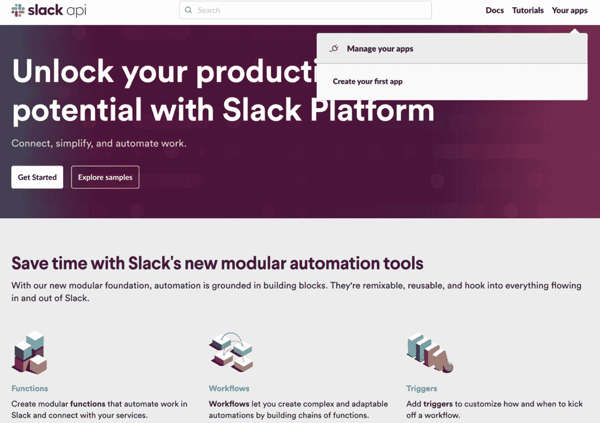
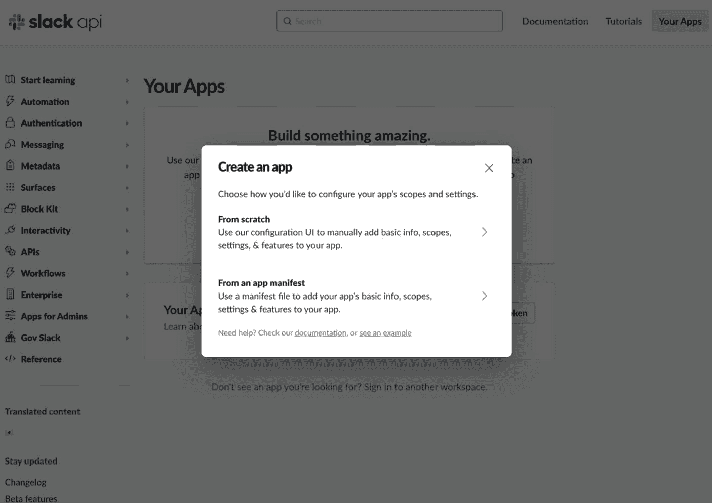
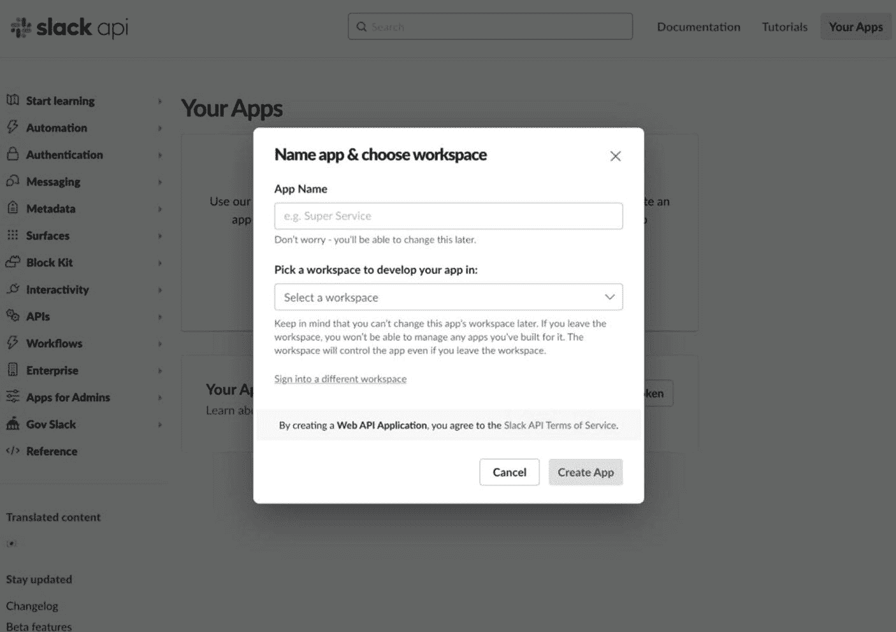
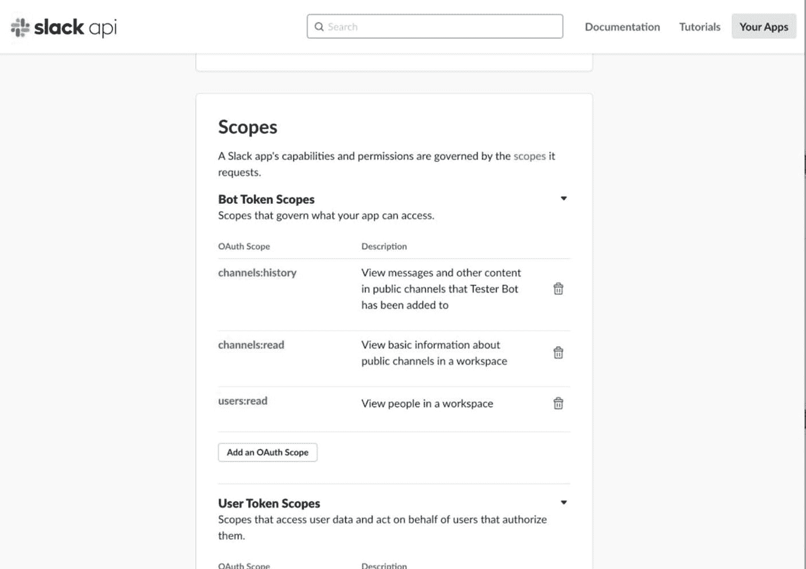
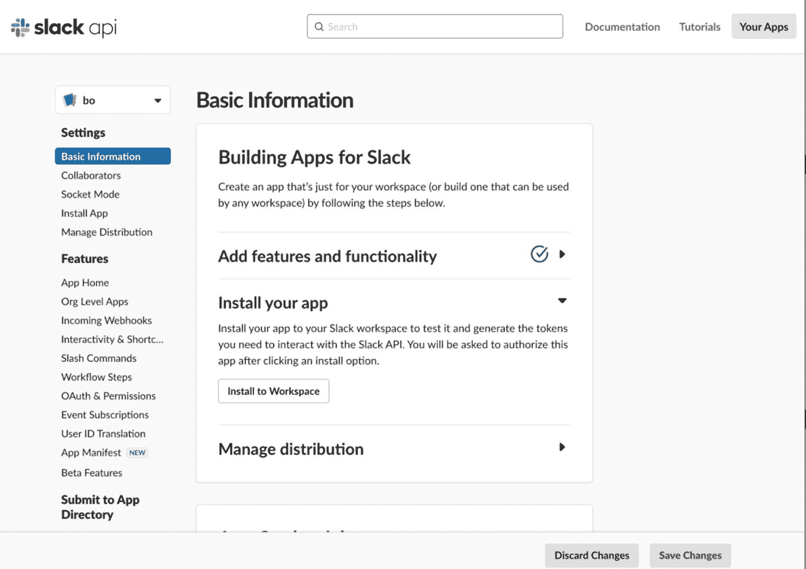
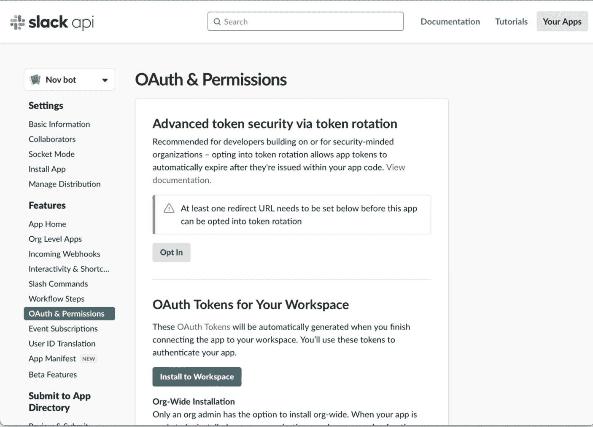
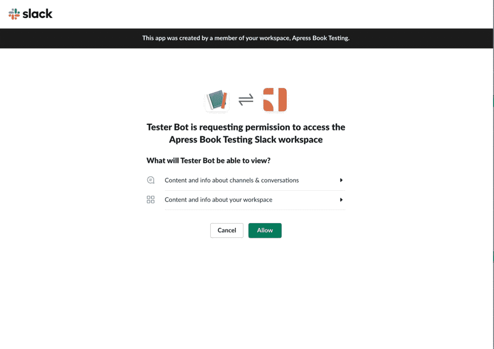
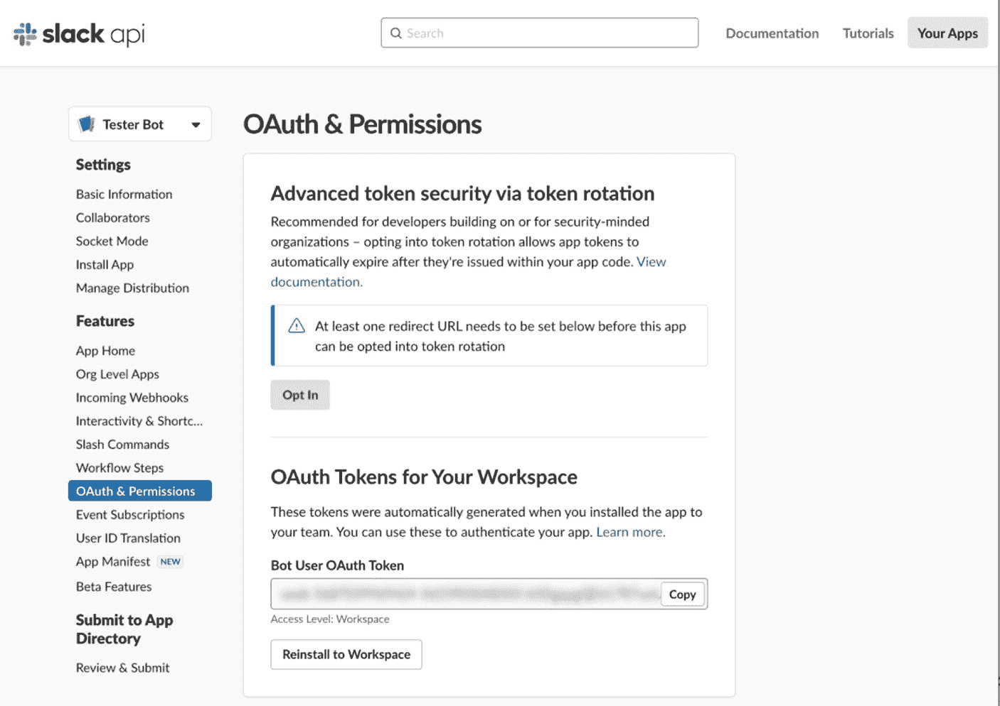
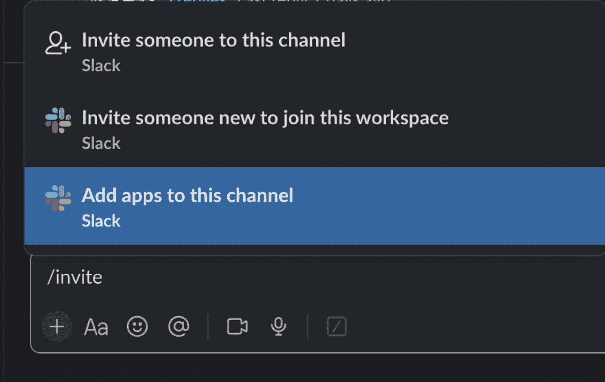

# 4. 在企业中应用 AI！为 Slack 消息创建文本摘要器

在当今的企业界，公司使用 Slack（或 Microsoft Teams）来组织内部沟通，并将其作为全公司信息交流的中心，这已经非常普遍。如果你曾经使用过 Slack，我想你应该知道，一个频道很容易因为公司内部或世界上**某个地方**发生了**某些**重要事情而被大量消息淹没。

当然，你在公司承担的责任越多（例如经理、团队领导、架构师等），你需要参与的频道就越多。在我看来，Slack 是一把双刃剑。你需要用它来完成工作，但作为开发者，你肯定不能在每日站会上说：“昨天，呃，我花了一整天读 Slack。没有遇到阻碍。”

此外，如果你为一家客户遍布不同时区的公司工作（这在当今很常见），早上打开 Slack 看到大量在你离开键盘期间发布的消息，会让人感到相当沮丧。

因此，在本章中，我们将把 AI 应用到企业中，让 Slack 变得更有用。我们将利用上一章的代码，用 JavaScript 创建一个 Slack 机器人，用于总结 Slack 频道中的重要对话。我们将利用 ChatGPT 的文本摘要能力，并更多地关注**提示工程**。

## 那么，什么是提示工程？

简单来说，提示工程就是精心设计和优化提示词及输入参数，以指导和引导 ChatGPT 及其他 AI 模型行为的过程。这基本上是行业内用来描述“创建正确输入以获得期望结果”的术语。

## ChatGPT 会抢走所有人的饭碗（其实不然）

我们谦逊地认为，世界上每家公司都坐拥一座未开发的信息金矿。如果你正在使用任何记录员工之间交流日志的系统、存储客户支持请求的数据库，或任何大型文本库（是的，这包括你的电子邮件、Microsoft Exchange 和企业版 Gmail），那么你就拥有一个等待被利用的大型非结构化文本库。

因此，ChatGPT 的最佳用途并非取代任何人的工作。它应该被用来增强和扩展公司团队成员已经在做的事情。正如我们在第 2 章中所见，作为一名软件开发者，ChatGPT 可以作为一个非常有效的结对编程伙伴。它也非常擅长高效快速地执行某些困难任务。因此，本章的项目涉及一个实际示例，展示如何利用大型非结构化文本源。

你可以使用在第 3 章中创建的 ChatGPT 客户端来运行本章后面列出的提示工程示例，也可以使用我们在第 1 章中讨论过的 Playground 模式。无论哪种方式，让我们直接开始吧。

## 审视一个现实问题：软件公司的客户支持

让我们看看软件开发中最艰巨的任务之一：提供技术支持。想象一下，整天接听来自可能感到沮丧、困惑或只是需要解决方案的用户电话和消息的“乐趣”。以下是客户支持为何如此棘手的一些原因：

*   你的最终用户和客户在解释软件问题时通常非常糟糕。

*   一级技术人员通常是第一道防线，他们处理最基本的问题或用户错误。但当问题变得更复杂时，用户会被升级到二级。

*   中级是一个棘手的位置，因为他们比一级技术支持人员拥有更多的知识和经验；然而，他们没有机会直接从最终用户那里获得答案。

*   真正糟糕的问题会被升级到三级；然而，这些是最昂贵的技术支持人员，因为他们拥有最多的知识和经验。他们对代码以及服务器和基础设施都有实践经验。

那么，让我们来看一个现实世界的例子：Slack 中一个典型技术支持频道里的典型对话。以下是一个虚构公司中团队成员及其角色的列表：

*   Fatima（客户服务代表）

*   John（软件工程师）

*   Dave（项目经理）

*   Keith（首席技术官）

代码清单 4-1 提供了一个软件初创公司团队成员之间对话的示例。客户服务代表 Fatima 告知团队，他们的应用在启动后立即崩溃（这可不是什么好问题）。首席技术官 Keith 立即介入并升级了该问题。

```
Fatima [16:00 | 02/08/2019]: 大家好，我有个紧急问题需要讨论。我刚和一位客户通完电话，他们的应用一加载就崩溃。客户非常沮丧。我们能尽快解决这个问题吗？一个黑白表情符号，皱眉、嘴角下弯，表达沮丧或不悦。
Keith [16:01 | 02/08/2019]: 感谢你提醒我们，Fatima。我们马上处理。@John，由于我们的架构师今天生病请假，你能牵头调查这个问题吗？
John [16:02 | 02/08/2019]: 没问题，Keith。我会深入代码库，看看能否找到导致崩溃的潜在原因。
John [16:02 | 02/08/2019]: Fatima，你能从客户那里收集一些额外信息吗？询问他们具体的设备型号、操作系统，以及最近是否安装了任何更新。
Fatima [16:03 | 02/08/2019]: 当然可以，John。我马上联系客户收集这些细节。一有消息就通知大家。
Dave [16:04 | 02/08/2019]: 我理解情况的紧迫性。我们一定要让客户了解我们的进展，Fatima。在排查过程中，不能让他们感到被蒙在鼓里。
Fatima [16:04 | 02/08/2019]: 当然，Dave。我会定期向客户更新情况，告知他们我们发现的任何相关信息。
John [16:20 | 02/08/2019]: 我检查了代码库，目前没有发现明显问题。应用在加载时崩溃很奇怪。会不会是内存相关的问题？Keith，我们最近有收到内存泄漏或内存使用率过高的报告吗？
Keith [16:22 | 02/08/2019]: 我会调取监控日志，John，检查最近的版本中是否有内存相关的异常。我查完再回复你。
Fatima [17:01 | 02/08/2019]: 快速更新一下，各位。客户使用的是运行 iOS 15.1 的 iPhone X。他们提到问题是在几天前更新应用后出现的。
Keith [17:05 | 02/08/2019]: 感谢更新，Fatima。这是很有用的信息。John，我们重点在装有 iOS 15.1 的 iPhone X 模拟器上测试最新的应用更新，看看能否复现这个问题。
John [17:06 | 02/08/2019]: 好主意，Keith。我马上设置模拟器并运行一些测试。
Keith [17:30 | 02/08/2019]: John，在模拟器上复现问题有进展吗？
John [17:32 | 02/08/2019]: 有的，Keith。我成功在模拟器上复现了崩溃。似乎是与 iOS 15.1 的兼容性问题有关。我怀疑是由于调用了一个已弃用的方法。我会修复它，并运行更多测试来确认。
John [18:03 | 02/08/2019]: 修复了已弃用方法的问题，应用加载时不再崩溃。看来我们已经找到并解决了问题。我会准备一个补丁发给你，Keith，供你审查和部署。
Keith [18:04 | 02/08/2019]: 谢谢，请尽快把补丁发给我。我审查完后，我们就将修复程序部署到应用商店。
Dave [18:06 | 02/08/2019]: 干得好，团队！John，请向客户通报进展，并告知他们我们已准备好在下一次应用更新中提供修复。有人能确保发布说明中反映这一点吗？
John [18:07 | 02/08/2019]: 好的，Dave。我会通知客户，确保他们知晓即将到来的修复。
Keith [18:27 | 02/08/2019]: 补丁已审查并批准，John。请继续更新商店中的应用。争取在一小时内完成。
John [18:26 | 02/08/2019]: 明白，Keith。我正在上传中。
Fatima [18:38 | 02/08/2019]: 我刚通知了客户修复的情况。他们松了一口气，并对我们的迅速响应表示感谢。感谢大家的协作和快速行动。与如此能干的团队共事非常愉快！
Dave [18:40 | 02/08/2019]: 做得好，团队！非常感谢大家的努力。我们以创纪录的速度解决了这个紧急问题。让我们继续保持！
列表 4-1
Slack 频道中试图分析客户问题的团队成员
```

## 提示工程 101：文本摘要

所以，不用说，没人愿意整天在 Slack 频道里滚动阅读各种燃眉之急的问题。我们将利用 ChatGPT 的文本摘要能力。为简单起见，我们尝试几个提示，将整个聊天消息列表发送给 ChatGPT，以便它为我们生成所有事件的可用的摘要。

**注意**

请注意，ChatGPT 是非确定性的。这仅仅意味着，即使你多次使用相同的设置执行相同的提示，也不一定会得到与本章列表中逐字相同的响应。不过，它们应该会非常相似。

### 提示 #1：“tl;dr”

这个提示简短、精炼且切中要点。如果你不熟悉它，这是一个在网络上常用的术语，用于简要总结一篇长文章。它字面意思是“太长；没读”，这也是我工作繁忙时对 Slack 上许多对话的感受。方便的是，ChatGPT 能够理解这个简单的术语（我不一定称它为一个词）作为提示，并且结果相当令人印象深刻。

```
系统：你是一个乐于助人的助手
用户： Fatima [16:00 | 02/08/2019]: 大家好，我有个紧急...
用户： Tl;dr
模型： gpt-4o
温度： 1
最大长度： 360
Top P： 1
频率惩罚： 0
存在惩罚： 0
列表 4-2
提示。要求对较长的对话进行摘要
```

注意，令牌数量保持较小，为 360，这最终有助于 ChatGPT 生成简短的响应。同时可以看到温度保持为 1（默认值），但 Top P 增加到了最大值（即 1）。因此，调整温度和其他设置以控制 ChatGPT 响应的语气和多样性非常重要。

列表 4-3 显示了 ChatGPT 对列表 4-1 中对话的摘要。

```
团队迅速响应客户应用崩溃的问题。John 调查代码库，同时 Fatima 从客户处收集信息。他们发现了与 iOS 15.1 的兼容性问题，John 修复了它。补丁经过审查和批准，应用已在商店中更新。客户已被告知，并对快速解决表示感谢。团队因协作和迅速行动而受到表扬。
列表 4-3
响应。获取超长对话的摘要版本
```

太棒了！它将那段超长的对话缩减为仅 68 个单词的简单摘要。如你所见，ChatGPT 并非要取代某个工作岗位；但它无疑会让一些人更高效。现在，让我们再尝试几个提示，好吗？

### 提示 #2：“用三句话以内解释清楚”

因此，如果 `tl;dr` 提供的解释对你来说还不够简洁，我们可以让 `ChatGPT` 把事情变得更简单。`ChatGPT` 在处理参数方面表现良好，所以让我们指定解释内容不应超过三句话（列表 4-4）。

```
System: You are a helpful assistant
User:  Fatima [16:00 | 02/08/2019]: Hey everyone, I have an urgent ...
User: Explain this in 3 sentences or less.
Model: gpt-4o
Temperature: 1
Maximum length: 250
Top P: 0
Frequency penalty: 0
Presence penalty: 0
Listing 4-4
PROMPT. 要求对较长的对话进行简短概括
```

你可能已经注意到，在这个例子中，`temperature` 被设置为 `0.82`。我们确实希望 `ChatGPT` 在这里给出一个简洁的答案，所以“越干巴巴”越好。

```
A black and white geometric logo featuring an interwoven, symmetrical design resembling a knot or a stylized flower.
A customer reported an urgent issue of app crashes to the team. John investigates the issue and asks Fatima to gather additional information from the client. They discover that the issue is related to a compatibility problem with iOS 15.1. John fixes the problem and Keith approves the deployment of the fix to the client's production environment.
Listing 4-5
RESPONSE. 获得一个三句话的摘要
```

### 提示 #3：“我是经理。向我解释发生了什么”

当你不想成为那个唯一听不懂的人时，`ChatGPT` 能够重新表述已经说过的话，并将其分解，直到变得非常简单。

```
System: You are a helpful assistant
User:  Fatima [16:00 | 02/08/2019]: Hey everyone, I have an urgent ...
User: Summarize this conversation and explain it to me like I'm a manager with little technical experience.
Model: gpt-4o
Temperature: 0.82
Maximum length: 750
Top P: 1
Frequency penalty: 0
Presence penalty: 0
Listing 4-6
PROMPT. 要求对更复杂的对话进行简化解释
```

同样，`temperature` 被设置在 `1.0` 以下，以便 `ChatGPT` 能够保持答案简洁易懂。我们增加了 token 长度，以便 `ChatGPT` 有足够的时间来解释一些可能的技术概念。

# 注册一个 Slack 机器人应用

现在我们已经了解了 ChatGPT 为我们总结大量文本的各种方法，让我们看看在 JavaScript 中创建一个简单的机器人需要什么，该机器人将以编程方式从 Slack 实例中的频道抓取所有消息。

**注意**

为了完成这些步骤，你需要拥有对 Slack 工作区的管理权限。大多数开发者**不会**拥有这些级别的权限；因此，为了充分进行实验，我建议你创建自己的个人 Slack 工作区用于测试目的。这样，你将拥有安装 Slack 机器人的所有权利和权限。

但是，一步一步来。首先，我们将创建我们的 Slack 机器人应用，所以前往 Slack API 网站：

[`https://api.slack.com/`](https://api.slack.com/)



**图 4-1** 要创建 Slack 机器人，请前往 Slack API 网站

当然，你需要有一个 Slack 账户才能使其工作，所以如果你没有，你需要先创建一个。

登录后，转到页面右上角，导航到“**你的应用 ➤ 创建你的第一个应用**”，如上图 4-1 所示。在 Slack 术语中，“机器人”就是一个“应用”，并且机器人不允许在 Slack 实例上运行，除非它们已先在 Slack 注册。



**图 4-2** 为 Slack 创建一个新的机器人应用

如上图 4-2 所示，你将被带到**你的应用**页面，在那里你可以管理你的 Slack 应用。你会立即在屏幕中央看到一个弹出窗口，上面有**创建应用**按钮。

选择**从头开始**创建你的应用的选项。这是因为我们希望能够自己操作应用的所有细节，而不被一堆默认设置弄得过于复杂。

之后，系统会提示你为你的机器人指定一个名称，并选择你希望机器人有权访问的工作区，如图 4-3 所示。

点击**创建应用**按钮继续。



**图 4-3** 为 Slack 创建一个新的机器人应用

## 通过设置范围来指定你的机器人能（和不能）做什么

现在，你将看到一个屏幕，上面有大量针对 Slack 工作区机器人的选项。然而，你需要做的第一件事是从左侧边栏点击 **OAuth 与权限**。

我们的机器人将非常简单；它只需要读取频道中的消息，以便为我们提供所讨论内容的摘要。除了读取消息，我们还需要知道 Slack 工作区中人员的姓名；否则，我们将得到人员的 UUID 表示而不是他们的名字，这对我们来说毫无意义。

所以，向下滚动并确保为你的 Slack 机器人添加以下 OAuth 范围，如图 4-4 所示。



**图 4-4** 为 Slack 机器人应用添加范围

*   `channels:history`

*   `channels:read`

*   `users:read`

## 确认你的设置

为你的机器人添加了适当的范围后，向上滚动并从左侧边栏点击**基本信息**。

在接下来的页面上，你会看到“添加特性和功能”旁边现在有一个绿色对勾，这确认了你已正确添加了范围，如图 4-5 所示。



**图 4-5** 确认你的设置

## 查看 OAuth 与权限页面

如图 4-6 所示，导航至 `OAuth & Permissions` 页面，并点击“安装到工作区”按钮。



**图 4-6** OAuth 与权限界面

## 将 Slack 机器人应用安装到你的工作区

既然所有权限都已请求完毕，现在可以将你的机器人安装到工作区了。在安装过程中，你应该会看到如图 4-7 所示的界面。



Slack 权限请求界面，请求“Tester Bot”访问“Apress Book Testing”工作区。该机器人请求查看频道、对话和工作区内容及信息的权限。提供了“取消”或“允许”选项。顶部横幅显示该应用由工作区成员创建。

图 4-7

“安装”一个新的 Slack 机器人应用

点击 `Allow` 按钮以授权机器人，并允许你在上一步中分配的权限。

**注意**

理解此处“安装”的含义非常重要。在传统的 JavaScript 语境中，安装应用意味着将你的代码和依赖项复制到另一台机器上并执行。但这里的情况并非如此。

在这里，当你“安装”一个机器人应用时，你是在允许你的 Slack 工作区让一个应用加入该工作区——仅此而已。你的机器人代码将在你自己的机器上运行，而不是在 Slack 的服务器上。

### 获取你的 Slack 机器人（访问）令牌

这次，“令牌”实际上指的是访问令牌！为了以编程方式连接到 Slack API 并访问消息和用户信息，你需要一个为你的 Slack 机器人生成的特定 OAuth 令牌。



Slack API 界面展示了“OAuth 与权限”部分。页面突出显示了“通过令牌轮换实现高级令牌安全”，建议开发者选择加入以增强安全性。一条警告指出，在启用令牌轮换之前，必须至少设置一个重定向 URL。页面上有一个“选择加入”按钮。下方，“你的工作区的 OAuth 令牌”区域显示了一个模糊处理的机器人用户 OAuth 令牌，并提供了复制令牌或重新安装到工作区的选项。左侧边栏包含基本设置、协作者和事件订阅等设置和功能。

图 4-8

为你的 Slack 机器人应用复制 OAuth 令牌

回到 `OAuth & Permissions` 页面，请务必从此页面复制机器人令牌（通常以 `xoxb-` 开头），如图 4-8 所示。

### 将你的机器人邀请到频道中

接下来，你需要进入想要用来测试机器人的频道，并在该频道中输入以下命令。

```
/invite
```

选择“将应用添加到此频道”选项，然后选择你之前在 Slack 注册机器人时指定的 Slack 机器人名称。



Slack 界面显示了命令“/invite”的搜索结果。下拉菜单提供了三个选项：“邀请某人加入此频道”、“邀请新成员加入此工作区”和“将应用添加到此频道”，最后一个选项以蓝色高亮显示。

图 4-9

将你的 Slack 机器人添加到频道

恭喜！你现在已成功向 Slack 注册了一个 Slack 机器人应用，使其能够读取你工作区中的消息，并将该 Slack 机器人添加到了一个频道中。在我们编写 JavaScript 代码来访问工作区中的频道之前，我们需要知道 Slack 为我们的频道使用的内部 ID。

## 查找你频道的频道 ID

好的，这一步很简单。在 Slack 中，右键点击你的频道名称，然后选择“查看频道详情”选项。弹出窗口的底部就是你的频道 ID。复制该编号并保存以备后用。你的 JavaScript 应用将需要它来加入 Slack 工作区中的正确频道。

## 使用你的 Slack 机器人应用自动抓取频道中的消息

好了，既然我们已经完成了所有准备工作，并且知道了频道的 ID，那么让我们开始编写 JavaScript 代码，用于访问特定 Slack 频道中的所有消息。

### 以编程方式从 Slack 读取消息

首先，你需要安装官方的 JavaScript Slack 库。以下是安装所有必要依赖项的 `npm` 命令：

```
npm install @slack/web-api @slack/events-api dotenv
```

清单 4-10 是一个简单的 JavaScript Slack 机器人，它可以获取指定频道中每条帖子的用户名、时间戳和消息内容。

```
import { WebClient } from "@slack/web-api";
import "dotenv/config";
const token = process.env.SLACK_API_TOKEN;
const channel_id = process.env.SLACK_CHANNEL_ID;
async function main() {
const web = new WebClient(token);
// 存储对话历史
let conversationHistory;
// 你想要获取历史记录的频道 ID
try {
// 使用 WebClient 调用 conversations.history 方法
const result = await web.conversations.history({
channel: channel_id,
limit: 50,
});
// 按发送顺序获取消息
conversationHistory = result.messages.reverse();
// 打印结果
for (const message of conversationHistory) {
const userInfo = await web.users.info({ user: message.user });
// 将时间戳转换为日期
const timestamp = new Date(parseFloat(message.ts) * 1000);
if (userInfo.ok) {
console.log(userInfo.user.name + "[" + timestamp + "]" + message.text);
console.log("\n");
}
}
} catch (error) {
console.error(error);
}
}
main();
清单 4-10
我们的 JavaScript Slack 机器人
```

让我们一起来解读这段代码。

首先，我们导入与 Slack API 交互和加载环境变量所需的基本依赖项。

接下来，我们定义两个关键变量：从环境变量 `SLACK_API_TOKEN` 中获取的 `token`，以及从 `SLACK_CHANNEL_ID` 中获取的 `channel_id`。这些变量对于向 Slack API 进行身份验证以及指定我们要检索的 Slack 频道历史记录是必需的。

然后，我们定义一个异步的 `main` 函数，脚本的核心逻辑就在其中。在此函数中，我们使用 Slack API 令牌初始化 `WebClient`，以便能够进行 API 调用。我们还声明了一个变量 `conversationHistory`，用于存储从频道检索到的消息。

脚本的原理很简单；它通过调用 Slack API 的 `conversations.history()` 方法，从 Slack 频道中检索最新的 50 条消息。

成功获取消息后，脚本使用 `.reverse()` 方法反转消息的顺序，以确保按从旧到新的顺序处理，然后打印每条消息。

清单 4-11 显示了运行 Slack 机器人脚本的结果。

```
Fatima [2023-08-11T09:04:20] : 大家好，我有一个紧急问题需要讨论。我刚和一位客户通完电话，他们的应用一加载就崩溃。他们非常沮丧。我们能尽快解决这个问题吗？:tired_face:
Keith [2023-08-11T09:04:35] : 感谢你提醒我们，Fatima。我们马上处理这个问题。John，既然我们的架构师今天生病请假了，你能带头调查这个问题吗？
John [2023-08-11T09:04:52] : 没问题，Keith。我会深入代码库，看看能否找到导致崩溃的潜在原因。
John [2023-08-11T09:05:30] : Fatima，你能从客户那里收集一些额外信息吗？询问他们具体的设备、操作系统以及最近可能安装的任何更新。
...
清单 4-11
执行我们的频道读取 Slack 机器人的输出
```

## 留给读者的练习

显然，这里还有一些额外的事情可以做，这些步骤将留给你（读者）来完成，例如：

*   将读取 Slack 消息的代码连接到上一章的 ChatGPT 客户端，这样抓取消息并获取摘要就变成了一个步骤。

*   为 Slack 机器人本身添加更多功能，例如添加命令，以便频道中的任何人都可以请求摘要。在当前状态下，机器人不会在频道中发布任何内容。然而，机器人的“用户界面”就是频道本身；因此，用户应该能够通过输入命令（例如请求摘要）来与 Slack 机器人交互。

*   确保机器人不会让糟糕的情况变得更糟。每当机器人提供摘要时，它不应该在频道本身中发布，因为这可能会给已经嘈杂的情况增加很多噪音。最佳实践是让机器人向请求摘要（或你创建的任何新命令）的人发送一条私密消息。

## 结论

在本章中，我们讨论了当今人工智能在企业中实际应用的多种方式之一。我们探讨了什么是真正的“提示工程”，指出提示工程不能仅仅通过向 ChatGPT 输入文本来完成。为了正确且有效地进行提示工程，你绝对需要理解 ChatGPT API 所有输入参数的影响。

利用我们学到的关于提示工程的知识，我们成功地获得了提供给我们的任何大段文本的摘要。最后，我们看到了运行一个自动机器人所需的代码，该机器人可以以编程方式从任何 Slack 频道抓取消息。

在本章（以及上一章）中，我们专门使用了 OpenAI API 的聊天补全端点。在下一章中，我们将通过尝试 Whisper 和 DALL-E 端点来突破可能性的边界。