# 使用 Discord 和 JavaScript 创建自动化社区管理机器人

当你发布一个应用或服务时，建立并维护自己的社区至关重要。以下是健康用户社区的典型标志：

-   成员参与有意义的讨论，分享见解、反馈和支持。
-   存在分歧或辩论，但会以建设性的方式处理，不会诉诸人身攻击或使用贬损性语言。
-   存在相互尊重的氛围，成员们互相倾听并承认不同意见。
-   新老成员混合积极参与，确保社区保持活力，不会停滞不前。
-   用户贡献多样化的内容，从回答问题到分享资源，丰富了社区的知识库。
-   在索取与给予之间取得平衡；寻求帮助或信息的成员也会向他人提供帮助。
-   新成员频繁加入，通常由现有成员推荐，这表明社区被视为积极且值得推荐的。
-   用户经常成为社区或平台的倡导者，在直接社区空间之外（例如社交媒体或其他论坛）进行推广。
-   社区通过为功能和特性提供新想法，帮助塑造应用或服务。

无论我们创建何种类型的应用或服务，我们都希望我们的用户社区能够体现上述各项！

## 选择 Discord 作为你的社区平台

在过去几年中，Discord 作为社区管理工具，在热衷于社区的人群中人气飙升。部分原因在于其跨平台兼容性，允许成员无论是在桌面端、移动设备还是网页浏览器上都能保持联系。然而，其最突出的特点之一是基于邀请的社区系统，这有助于社区管理者控制增长并防止垃圾信息。这种模式不仅为成员提供了量身定制的体验，还增强了安全性，因为社区管理者有权决定是否授予访问权限。

Discord 不仅支持文本消息，还支持语音聊天和视频流。与 Slack 非常相似，Discord 允许社区管理者将内容分隔到不同的频道中，以组织讨论、简化信息流，并帮助用户看到他们感兴趣的内容。

## 创建比我们的 Slack 机器人更高级的机器人

现在，如果你成功完成了第 4 章中关于 Slack 机器人的步骤，那么本章的步骤会让你感到熟悉。在第 4 章中，我们创建了一个 Slack 机器人，用于在特定时间段内读取单个频道并获取所讨论内容的摘要。那个 Slack 机器人并非社区管理者，而更像一个有用的助手。

在本书的剩余部分，我们将执行所有必要的步骤，为 Discord 创建强大的机器人，这些机器人将利用 AI 来实际帮助管理社区。

## 创建比任何典型 Discord 机器人更高级的机器人

如果你曾经有过使用 Discord 机器人的经验，那么你可能知道与它们交互的最常见方式是使用所谓的“/命令”。这使得典型的机器人（即非智能机器人）基本上只有在接收到非常具体的操作或命令时才能工作。如果没有提供“/命令”，机器人就会保持沉默，什么也不做。本质上，它体现了“不问你就不说话”这句话。

然而，我们正在创建一个具有人工智能的 Discord 机器人，因此它将比任何典型的 Discord 机器人先进得多。我们将创建能够读取并查看 Discord 服务器中所有消息，并且足够智能以做出正确响应的机器人。

## 理解机器人的角色

那么，让我们探讨一个场景，使其变得真实。我们正在创建一个公共 Discord 服务器，以便与移动银行应用的用户进行互动。我们的最终目标是让用 JavaScript 编写的机器人处理以下场景：

-   **问答**：监控特定频道，并自动回答用户关于如何使用银行应用的问题。为此，机器人需要接受关于应用如何工作的训练。
-   **禁止招揽**：对于任何商业社区来说，确保社区参与者不被不道德的人盯上非常重要。例如，如果你正在创建一个银行应用，你希望你的客户被任何用户名为“B4nk Admin”的人联系吗？
-   **禁止有害内容**：对于任何社区来说，保护成员免受仇恨言论等有害内容的侵害非常重要。

## 我们的示例银行：克鲁克银行

出于本示例的目的，我们决定使用一个虚构的银行名称，该名称与真实银行名称重合的可能性极低。因此，在本示例中，“克鲁克银行”正在为其银行客户推出一款新的移动应用。他们希望有一个由机器人监控的频道来回答应用用户的问题，并且他们还希望确保没有人向他们的应用用户进行招揽，或在他们的 Discord 服务器中发布伤害性或有害的内容。


智能手机屏幕上显示一个有趣的插图，上面写着“欢迎来到克鲁克银行！”一个打扮成小偷的卡通角色，戴着面罩和毛线帽，拿着一个带有美元符号的钱袋。背景是色彩缤纷的抽象气泡和几何形状，营造出一种异想天开和幽默的氛围。

**图 6-1** 这家假银行的假应用存在真问题


## 首要任务：创建你自己的 Discord 服务器

在制作 AI 版 Discord 机器人之前，我们显然需要先有一个 Discord 服务器供机器人使用。你可以使用 Discord 应用程序或访问 Discord 网站（当然要先登录），然后开始添加/创建新服务器的流程。

开始流程后，请选择标注为“**创建我的服务器**”的选项，如图 6-2 所示。

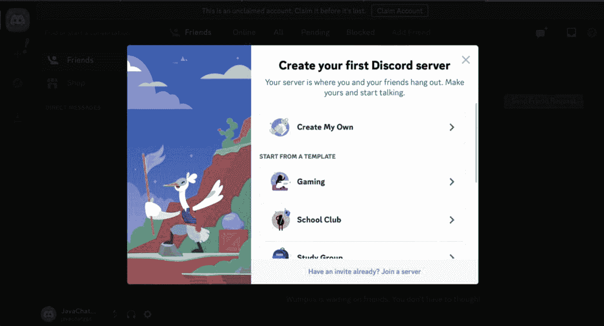

Discord 弹窗提示用户“创建你的第一个 Discord 服务器”。选项包括“创建我的服务器”、“游戏”、“学校社团”和“学习小组”。左侧是一幅彩色插画，描绘了一只小鸟在悬崖上举着旗帜。背景是蓝天白云和远处的船只。

图 6-2

创建你自己的 Discord 服务器

接下来，系统会提示你指定服务器的更多信息。继续完成创建流程，直到系统提示你为服务器提供名称和图标，如图 6-3 所示。

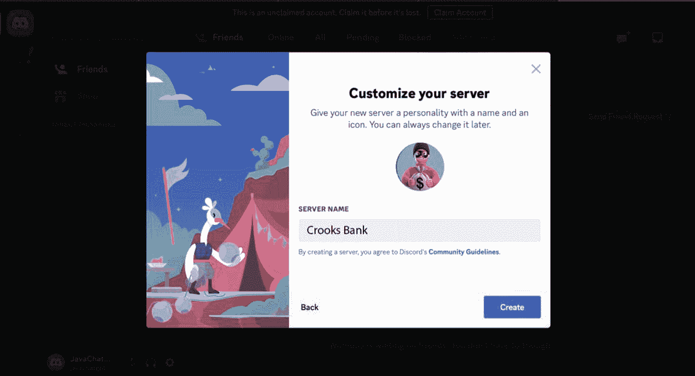

Discord 界面显示“自定义你的服务器”弹窗。弹窗提示为服务器命名并设置图标，示例图标是一个卡通角色。输入的服务器名称为“Crooks Bank”。可以看到 Discord 社区准则的链接。背景是一幅彩色插画，描绘了悬崖上的小鸟角色。底部有“返回”或“创建”服务器的选项。

图 6-3

为你的 Discord 服务器命名

指定服务器名称，并可选择上传服务器图标（如果有的话）。

### 创建问答频道

默认情况下，每个 Discord 服务器都有一个“通用”频道，但我们希望有一个专门用于问答的频道。根据你创建服务器的方式，系统会显示图 6-4 和图 6-5 来指导你创建新频道。

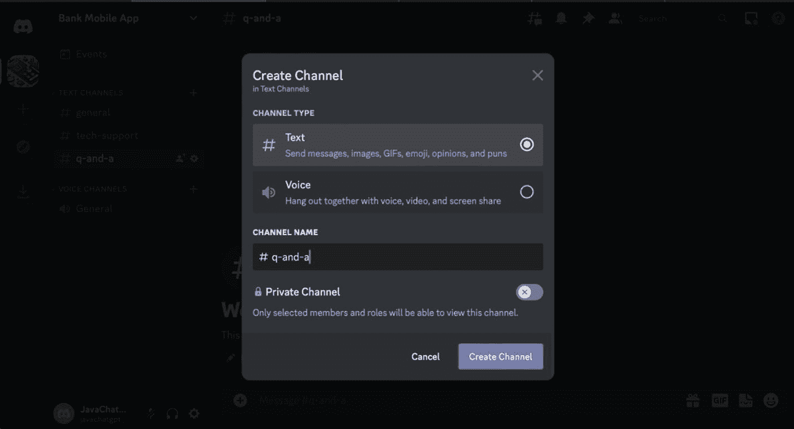

深色界面上显示一个标题为“创建频道”的对话框。它显示了频道类型的选项，其中“文字”被选中，允许发送消息、GIF、表情符号、观点和双关语。频道名称设置为“q-and-a”。有一个复选框用于将其设为私密频道，表示只有选定的成员和角色可以查看。底部有“取消”和“创建频道”按钮。

图 6-5

使用 Discord 应用程序创建频道

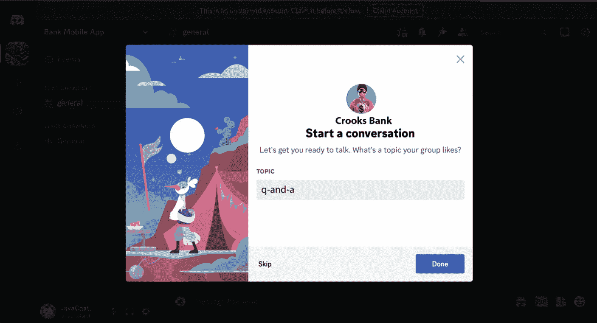

聊天应用程序弹窗显示来自“Crooks Bank”的提示，要求开始对话。它询问群组喜欢的主题，主题字段中已输入“q-and-a”。有“跳过”或点击“完成”的选项。背景是一幅彩色插画，描绘了一个巫师般的角色在帐篷旁，天空明亮。

图 6-4

使用网页界面创建频道

## 向 Discord 注册新的机器人应用

现在我们已经创建了带有适当频道的 Discord 服务器，是时候注册机器人本身了——或者更确切地说，在我们的案例中，是注册多个机器人。为了保持代码整洁且易于管理，我们实际上会为 Discord 服务器设置多个机器人。第一个机器人将专门用于在“q-and-a”频道中回答问题。第二个机器人将监控所有频道，以检测有害内容或广告推销等不良信息。

要创建机器人，请前往 Discord 开发者网站：

[**https://discord.com/developers**](https://discord.com/developers)

在页面右上角，点击“**新建应用**”按钮，如图 6-6 所示。

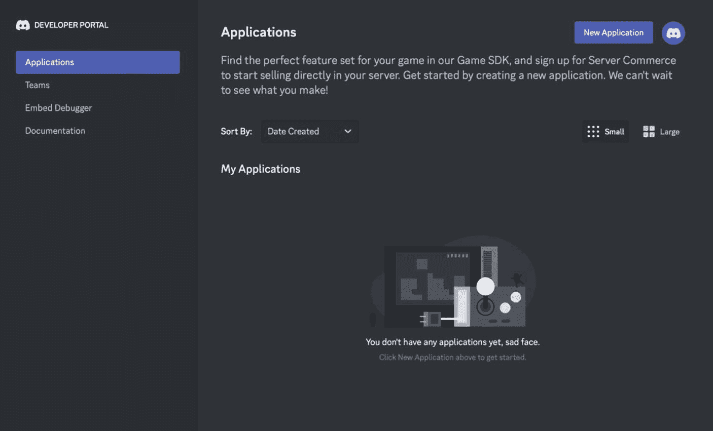

开发者门户界面显示“应用”部分。侧边栏包括应用、团队、嵌入调试器和文档等选项。主区域鼓励用户使用游戏 SDK 创建新应用以进行服务器商务。下拉菜单允许按“创建日期”排序。一条消息显示当前没有应用，并提示点击“新建应用”开始。显示了一个带有抽象形状的图形，蓝色高亮显示“新建应用”按钮。

图 6-6

要创建 Discord 机器人，请访问 Discord 开发者网站

在 Discord 和 Slack 的术语中，“机器人”就是“应用”，并且机器人必须先向 Discord 注册，才能被允许在 Discord 服务器上运行。

为机器人指定一个名称，然后点击“**创建**”按钮，如图 6-7 所示。

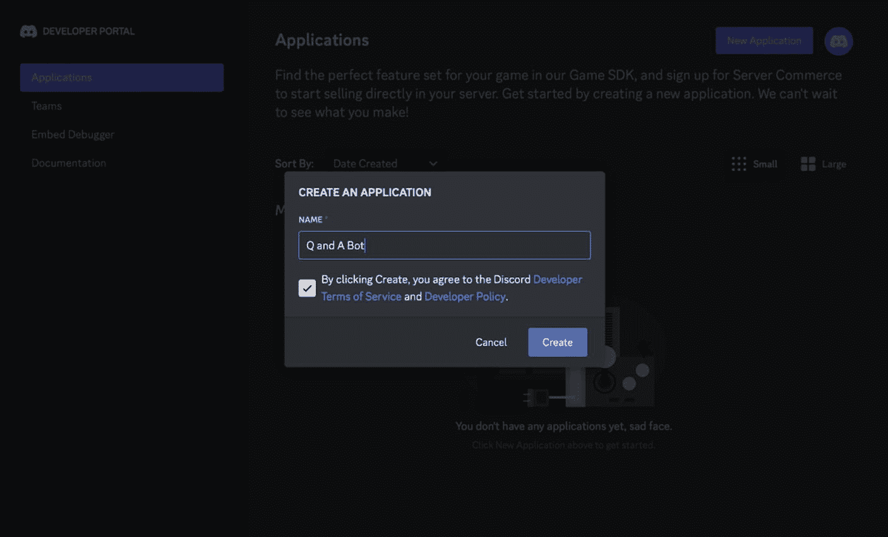

Discord 开发者门户截图显示了创建新应用的过程。“创建应用”对话框已打开，名称字段填写为“Q and A Bot”。一个复选框已勾选，表示同意 Discord 开发者服务条款和开发者政策。“创建”按钮已高亮显示，准备点击。背景显示的是“应用”部分，带有按创建日期排序的选项。

图 6-7

为 Discord 创建/注册机器人

### 指定机器人的常规信息

之后，你将进入一个页面，可以在其中指定机器人的常规信息，如图 6-8 所示。

请务必熟悉页面左侧的导航菜单。如你所见，我们有多个设置类别需要为机器人配置。默认情况下，我们位于“**常规信息**”页面，在此指定机器人的基本信息。如果你已为机器人准备好图标，可以在此处上传。

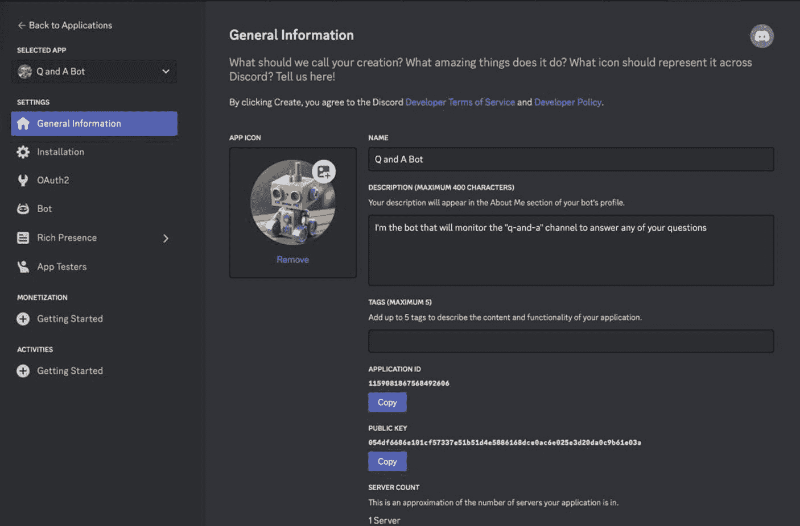

Discord 开发者门户界面显示名为“Q and A Bot”的机器人的“常规信息”部分。应用图标是一个机器人图像。描述说明该机器人将监控“q-and-a”频道以回答问题。界面包括标签、应用 ID、公钥和服务器数量等字段，并提供复制 ID 和密钥的选项。左侧边栏列出了安装、OAuth2 和机器人等设置。

图 6-8

我们决定给机器人一个可爱的小机器人图标


### 为机器人指定 OAuth2 参数

现在需要为我们的机器人指定作用域和权限。如果你按照第 4 章中创建 Slack 机器人的步骤操作过，那么（如前所述）这个过程会让你感到熟悉。机器人不能也不应该具备执行任何操作的能力——它们只应被允许执行其设计时预设的一系列操作。

在左侧的设置导航菜单中，导航至“**OAuth2 ➤ URL 生成器**”以继续。

以下是我们需要的作用域：

* 作用域
  * 机器人

如图 6-9 所示。

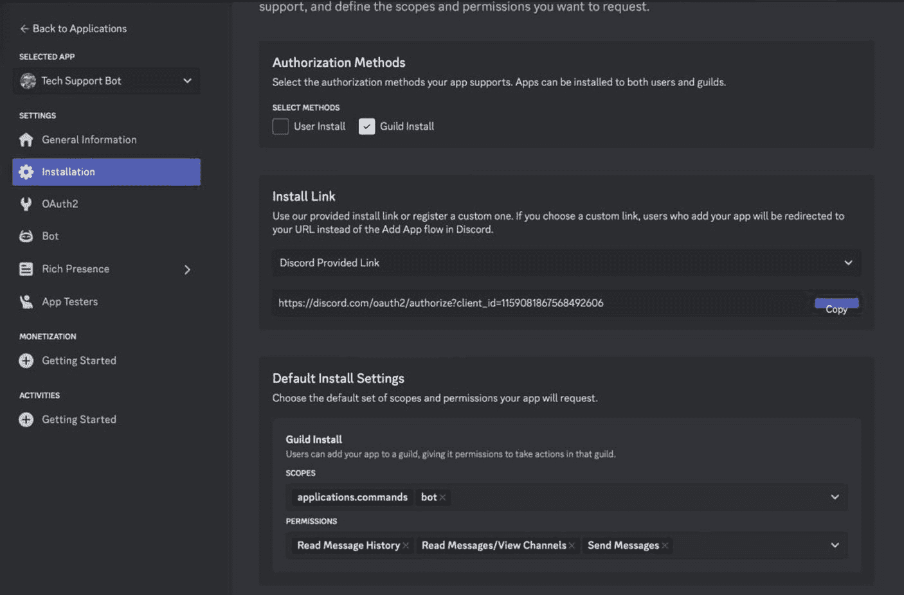

该图片展示了一个名为“技术支持机器人”的 Discord 应用设置界面。左侧边栏中高亮显示了“安装”部分。主面板显示“授权方法”，包含“用户安装”和“服务器安装”选项。下方是“安装链接”部分，包含一个 Discord 提供的 URL 和“复制”按钮。“默认安装设置”部分概述了作用域和权限，包括 `applications.commands` 和 `bot`，以及读取消息历史和发送消息的权限。

**图 6-9** – 选择作用域

选择机器人的作用域后，我们会看到所有仅适用于机器人的权限，按字母顺序排列。

根据你赋予的权限，机器人可以变得相当强大。有些权限允许机器人像普通人类管理员一样行事，例如管理服务器、角色和频道。拥有这些权限的机器人还可以踢出和封禁成员。

我们现在要为机器人启用的权限，是允许机器人在文本频道中发送和接收消息的权限。这正是我们所需要的。虽然目前我们不会处理音频相关功能，但我们可以启用语音权限，让机器人能够参与语音频道。很简单，对吧？

为机器人选择以下权限：

* 机器人权限
  * 读取消息历史
  * 读取消息/查看频道
  * 发送消息

虽然你还没有编写任何 JavaScript 代码，但现在是将机器人邀请到你的服务器的时候了。

## 将机器人邀请到你的服务器

如图 6-9 所示，选择适当的权限后，Discord 会为你生成一个动态 URL，用于将机器人邀请到你的服务器。

复制该 URL 并粘贴到你已登录 Discord 的网页浏览器中。结果如图 6-10 所示。

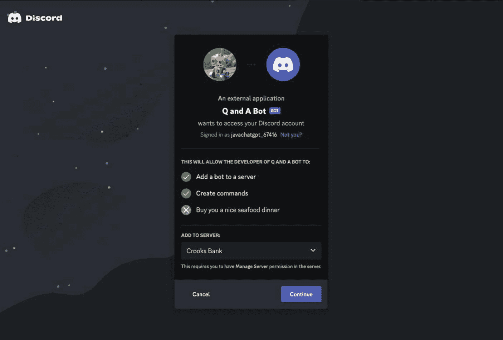

Discord 外部应用“问答机器人”的授权界面。该机器人请求访问以“javachatgpt_67416”身份登录的 Discord 账户。权限包括将机器人添加到服务器和创建命令，但不包括购买海鲜晚餐。选择的服务器是“Crooks Bank”，需要管理服务器权限。提供取消或继续选项。

**图 6-10** – 如果你仔细阅读此屏幕，会发现 Discord 颇具幽默感

点击“**继续**”按钮，将机器人添加到你的服务器。

接下来，你会看到一个与上一页面非常相似的页面，但主要区别在于它会汇总机器人的所有权限和能力。通常，如果你要将机器人添加到一个**不是你创建**的服务器，这个功能会非常有用。不过，既然这个机器人是我们自己创建的，这仅仅是对我们之前已指定设置的确认（图 6-11）。

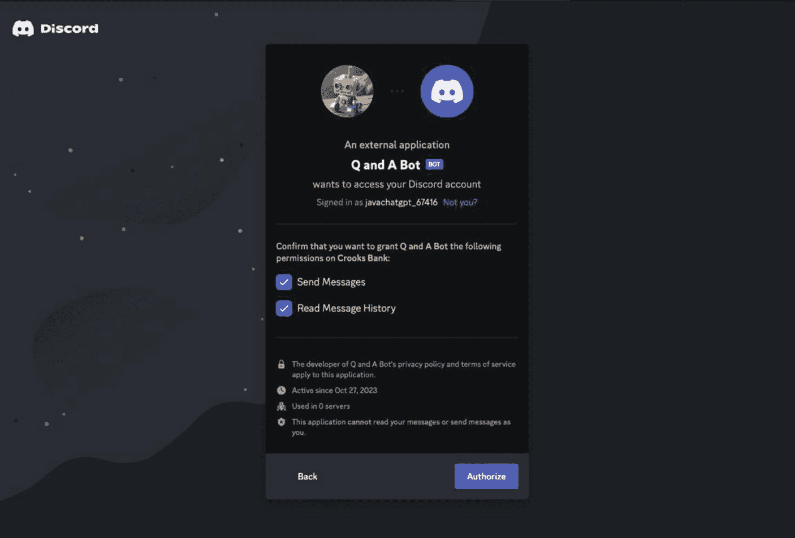

Discord 外部应用“问答机器人”的授权界面。该机器人请求访问一个 Discord 账户，权限包括在“Crooks Bank”上发送消息和读取消息历史。用户以“javachatgpt_67416”身份登录。屏幕包含返回或授权请求的选项。该应用自 2023 年 10 月 27 日起处于活跃状态，未在任何服务器中使用。

**图 6-11** – 确认机器人的能力

点击“**授权**”按钮，授予机器人在你的服务器上运行的权限。

如果一切顺利，你应该会在服务器的“常规”频道中看到一条自动消息，表明该过程已成功完成。

#### 获取机器人的 Discord ID 令牌并设置网关意图

现在需要获取机器人的 Discord ID 令牌，你将在代码中使用它来以编程方式验证你的机器人。

> **注意**  
> 出于显而易见的原因，在这里使用“令牌”一词让我有些紧张，因为根据上下文，这个词在本书中有两种不同的含义，但这里快速回顾一下其含义：
> * 使用 Discord 和 Slack API 时，“令牌”指的是身份验证令牌。
> * 使用 OpenAI API 时，“令牌”指的是单词的一部分。

返回 Discord 开发者网站，点击设置导航菜单中的“**机器人**”类别以继续。

虽然你还没有看到你的令牌，但你需要点击“重置令牌”按钮，如图 6-12 所示。

请务必将 ID 令牌复制并保存到安全的地方。你将在本章后面介绍的 JavaScript 代码中用到此令牌。

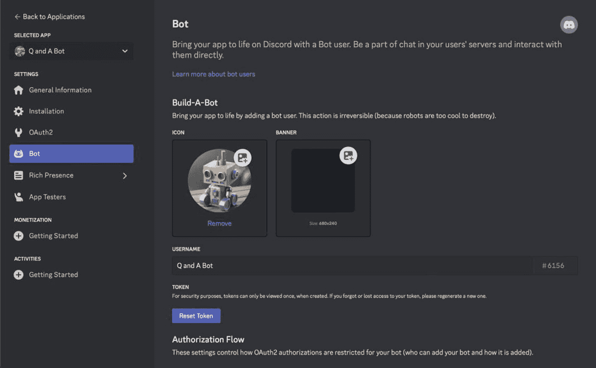

Discord 机器人设置界面，显示“机器人”部分。屏幕包括为机器人添加图标和横幅的选项，已选择一个图标。机器人的用户名为“问答机器人”，带有唯一标识符。出于安全目的，有一个“重置令牌”按钮。侧边栏菜单包括常规信息、安装、OAuth2 等部分。

**图 6-12** – 点击“重置令牌”按钮查看你的 ID 令牌

向下滚动页面至名为“**特权网关意图**”的部分，并启用名为“**消息内容意图**”的选项。

> **注意**  
> 让我们放慢节奏，讨论一下意图。究竟什么是“意图”，为什么需要它？就 Discord API 而言，你需要明确指定你希望 Discord 以编程方式通知你的每一种信息类型。否则，Discord 会不断向你发送与你或你的机器人无关的事件。例如，就我们的目的而言，我们不关心人们何时加入或离开服务器。但是，如果你想向首次加入服务器的任何人发送服务器规则列表，那么你肯定需要启用“**服务器成员意图**”。当我们深入代码时，你会看到更多关于意图的信息。

请务必点击绿色按钮“**保存更改**”以保存你的更改。结果如图 6-13 所示。

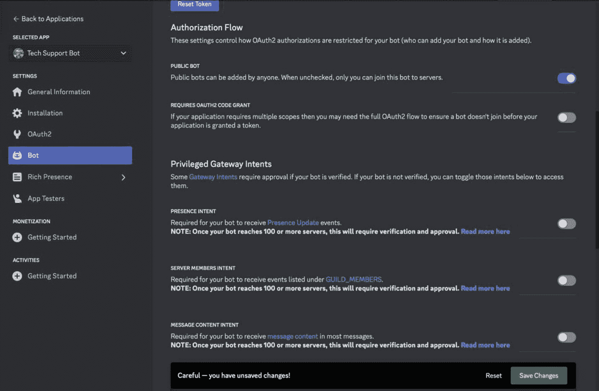

该图片显示了一个名为“技术支持机器人”的机器人应用设置界面。左侧边栏包括常规信息、安装、OAuth2 和机器人等选项，其中机器人部分高亮显示。主面板显示授权流程和特权网关意图的设置。选项包括公共机器人、OAuth2 代码授权、在线状态意图、服务器成员意图和消息内容意图的开关。底部有一条通知警告：“注意——您有未保存的更改！”并带有重置和保存更改按钮。

**图 6-13** – 启用名为“消息内容意图”的选项


## 用 JavaScript 创建问答机器人应用，从频道中回答问题

当然，既然我们已经完成了所有必要的准备工作，并且知道了要监控用户提问的频道名称，接下来就让我们编写 JavaScript 代码，让机器人加入我们的服务器并访问特定 Discord 频道中的所有消息。

这是本章中我们要创建的两个 Discord 机器人中的第一个。这个机器人将负责监控我们 Discord 服务器中 `q-and-a` 频道内的消息。

在本章稍后的部分，我们将创建另一个机器人，负责审核 Discord 服务器中（包括 `q-and-a` 频道）所有不当内容。这样做的目的是遵循“关注点分离”的架构模式。我们不会创建一个庞大的、能处理 Discord 服务器所有审核需求的 JavaScript 机器人，而是将功能拆分成两个不同的应用。

我们还将循序渐进，将本章的重点放在攻克 JavaScript 中 Discord 功能的学习曲线上。在本书的最后几章中，我们将使用 OpenAI API 来增强这两个机器人，让它们具备人工智能。

代码清单 6-1 展示了创建一个基础 Discord 机器人所需的代码，该机器人可以监控单个频道中发布的所有消息并提供回答。

```
// 引入必要的 discord.js 类
const { Client, Events, GatewayIntentBits } = require("discord.js");
require("dotenv").config();
// 配置变量
const CHANNEL_NAME = "q-and-a";
const CUSTOM_STATUS = "Ready to answer your questions";
// 创建一个新的客户端实例
const client = new Client({
intents: [
GatewayIntentBits.MessageContent,
GatewayIntentBits.GuildMessages,
GatewayIntentBits.Guilds,
],
});
client.once(Events.ClientReady, (readyClient) => {
console.log(`准备就绪！已登录为 ${readyClient.user.tag}`);
// 设置自定义状态
client.user.setActivity(CUSTOM_STATUS);
});
client.on(Events.MessageCreate, async (message) => {
if (client.user.username === message.author.username) return;
if (message.channel.name !== CHANNEL_NAME) return;
console.log("用户是：", message.author.globalName || message.author.username);
console.log("消息内容是：", message.content);
const reply = `${mention(message.author)}, 我可以帮你解决这个问题！`;
await message.channel.send(reply);
});
function mention(author) {
return ``;
}
// 使用你的客户端令牌登录 Discord
client.login(process.env.DISCORD_BOT_API_TOKEN);
代码清单 6-1
我们简化的技术支持机器人
```

现在，让我们深入分析代码清单 6-1 中的代码，了解我们简化的技术支持机器人是如何工作的。这个机器人旨在监控你 Discord 服务器中 `q-and-a` 频道的消息，并对用户的问题做出回应。

**注意：** 由于某些原因，Discord 自身的术语有时会将 Discord 服务器称为“公会”。但从我们的角度来看，公会就是一个 Discord 服务器。

### 创建 Discord 客户端

用几行代码创建一个 Discord 客户端非常简单：

```
// 创建一个新的客户端实例
const client = new Client({
intents: [
GatewayIntentBits.MessageContent,
GatewayIntentBits.GuildMessages,
GatewayIntentBits.Guilds,
],
});
```

在这里，我们实例化了一个新的 Discord 客户端，并提供了一个 `intents` 数组，告诉 Discord 我们希望机器人接收哪些事件，即：

- `MessageContent`：允许机器人读取消息内容
- `GuildMessages`：使机器人能够接收来自 Discord 服务器的消息
- `Guilds`：允许机器人接收关于其所属 Discord 服务器的更新

### 监听首选 Discord 频道中的新消息

显然，我们的机器人中最重要的功能是 `client.on()` 事件监听器，我们用它来监控 Discord 服务器中发布的每一条新消息。

```
client.on(Events.MessageCreate, async (message) => {
if (client.user.username === message.author.username) return;
if (message.channel.name !== CHANNEL_NAME) return;
console.log("用户是：", message.author.globalName || message.author.username);
console.log("消息内容是：", message.content);
const reply = `${mention(message.author)}, 我可以帮你解决这个问题！`;
await message.channel.send(reply);
});
```

如果消息来自 `q-and-a` 频道，我们的机器人会向发送者发送一条友好的（尽管目前还不太有用）回复。作为一个小巧思，回复中会@提及作者，这样他们就能在回复发布时收到通知。

### 成功！运行你的第一个 Discord 机器人

现在让我们运行我们的 JavaScript Discord 机器人。执行脚本后，请务必返回你的 Discord 服务器，并尝试在你为问答设置的频道中输入一个问题。图 6-14 展示了针对问题“这个机器人会回答我关于这个应用的问题吗？”的回复。

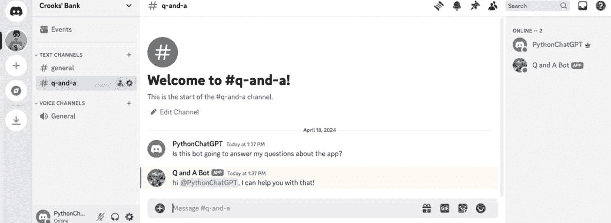

一个 Discord 界面，显示了一个名为“Crook's Bank”的服务器中的 `q-and-a` 文本频道。主要区域用“欢迎来到 #q-and-a！这是 #q-and-a 频道的开始。”的消息欢迎用户。下方可见一段对话，其中“PythonChatGPT”询问机器人是否能回答关于应用的问题，“Q and A Bot”给出了肯定回复。侧边栏列出了文本频道 `general` 和 `q-and-a`，以及语音频道 `General`。两名用户“PythonChatGPT”和“Q and A Bot”处于在线状态。

**图 6-14** 在 Discord 中成功运行问答机器人

当你仔细查看图 6-14 时，你会看到一些关键特性，例如：

- 在右侧，你会看到机器人处于在线状态，并带有绿色状态指示器。
- 机器人还有一个自定义状态，让你知道它将在频道中做什么。
- 在频道中提问后，机器人会直接@提及你。

## 简化注册下一个 Discord 机器人应用的流程

既然我们已经成功完成了所有步骤，创建了一个可运行的 Discord 机器人，那么创建第二个机器人就易如反掌了！所以，让我们简要地重复一下上述所有步骤，以便创建我们的第二个 Discord 机器人。我们会明确指出哪些项目需要更改或增强，因为第二个机器人将作为审核员工作，而不是回答我们 Discord 服务器用户的问题。

### 向 Discord 注册一个新的机器人应用

执行与上述相同的步骤；不过，明智的做法是给机器人起一个不同的名字。就我们而言，这第二个机器人将被命名为“内容审核机器人”。

### 指定机器人的常规信息

我们决定为内容审核机器人使用不同的图标，因此在这里进行了指定（图 6-15）。

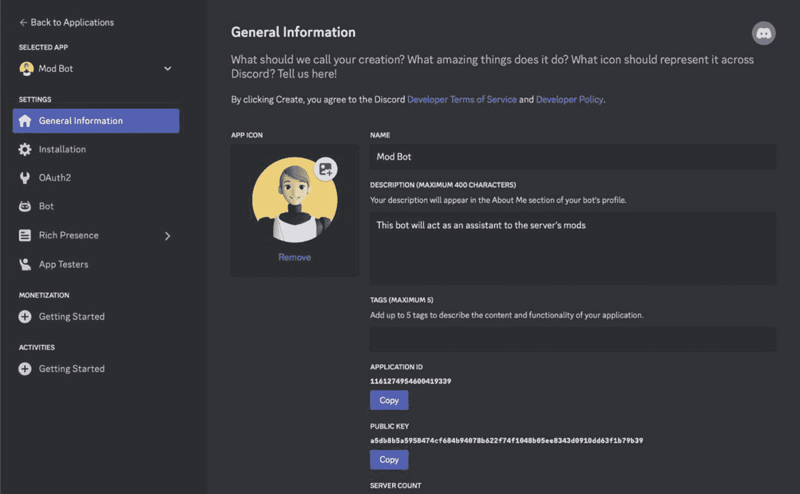

Discord 应用程序设置界面，显示了一个名为“Mod Bot”的机器人。屏幕显示“常规信息”部分，展示了一个卡通人物应用图标、应用名称“Mod Bot”以及描述“此机器人将作为服务器管理员的助手。”。还有用于添加标签的字段，以及复制应用程序 ID 和公钥的按钮。左侧边栏包括“安装”、“OAuth2”和“机器人”等导航选项。

**图 6-15** 为第二个机器人提供名称和图标

### 为机器人指定 OAuth2 参数

第二个机器人需要更多权限才能执行更多任务。以下是我们想要的作用域：

- 机器人
  - 踢出成员
  - 封禁成员
  - 发送消息
  - 管理消息
  - 读取消息历史

### 邀请你的机器人加入你的服务器

重复与第一个机器人相同的步骤。


#### 获取机器人的 Discord ID 令牌并设置网关意图

同样，请按照上述步骤获取 Discord ID 令牌。然后向下滚动页面至名为“特权网关意图”的部分，并启用“服务器成员意图”和“消息内容意图”选项。

### 创建下一个 Discord 机器人：内容审核员

内容审核员的职责是确保 Discord 服务器中不会发布不当内容。与我们本章前面创建的机器人一样，这个机器人（目前）还不具备人工智能。在当前状态下，它会不加区分地删除服务器中任何包含“puppies”一词的消息。

这并不是因为“puppies”本身有什么问题。不过，它们确实有在无人看管时毁掉你最爱鞋子的倾向。老实说，我们只是需要一些东西来测试机器人在 Discord 中运行时的代码。

清单 6-2 是这个简化版内容审核机器人的代码。

```
// Require the necessary discord.js classes
const { Client, Events, GatewayIntentBits } = require("discord.js");
require("dotenv").config();
// Create a new client instance
const client = new Client({
intents: [
GatewayIntentBits.MessageContent,
GatewayIntentBits.GuildMessages,
GatewayIntentBits.Guilds,
],
});
const BANNED_WORD = "puppies";
client.once(Events.ClientReady, (readyClient) => {
console.log(`Ready! Logged in as ${readyClient.user.tag}`);
});
client.on(Events.MessageCreate, async (message) => {
if (client.user.username === message.author.username) return;
if (message.content.includes(BANNED_WORD)) {
if (!(await message.delete())) {
console.log("Failed to delete message");
} else {
const authorMention = `${mention(message.author)}`;
const reply = `${authorMention} This comment was deemed inappropriate for this channel.\nIf you believe this to be in error, please contact one of the human server moderators.`;
await message.channel.send(reply);
}
}
});
function mention(author) {
return ``;
}
client.login(process.env.DISCORD_BOT_API_TOKEN);
清单 6-2
我们的简化版内容审核机器人
```

#### 处理发送到 Discord 服务器的消息

再次，让我们将注意力集中在 `client.on()` 事件监听函数上，因为每当有消息发布到 Discord 服务器时，它都会被异步调用。如你所见，如果发布到服务器的消息包含违禁词，我们会删除该消息，并在发布违规消息的同一频道中，通过 `@mention` 消息向发送者发出警告。

#### 再次成功！运行你的第二个 Discord 机器人：内容审核员

现在让我们运行第二个 JavaScript Discord 机器人。执行应用程序后，请务必返回你的 Discord 服务器，并在任意频道中输入一条包含违禁词的消息。图 6-16 展示了机器人的运行效果。

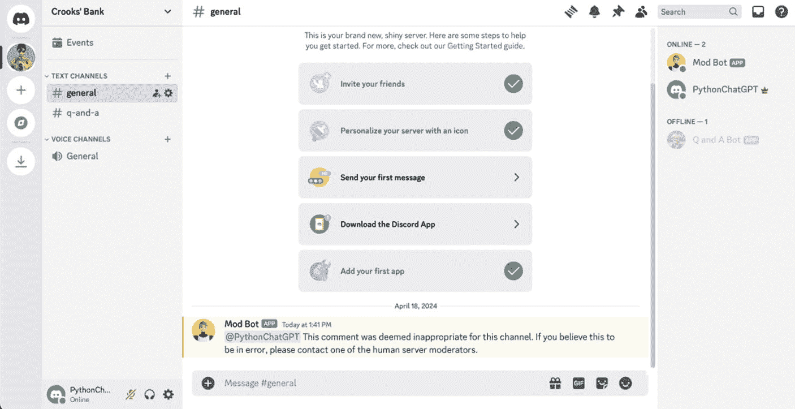

显示了一个名为“Crooks' Bank”的 Discord 服务器界面。主要部分显示了一个设置新服务器的清单，包括邀请好友、个性化服务器、发送消息、下载 Discord 应用和添加应用等任务。大多数任务已用绿色勾号标记为完成。来自“Mod Bot”的一条消息警告“PythonChatGPT”其评论不当，并建议如有错误请联系管理员。左侧边栏列出了文本和语音频道，右侧边栏显示在线和离线用户，包括“Mod Bot”和“Q and A Bot”。

图 6-16

这个机器人对讨论“Puppies”有严格规定；然而，讨论“Kittens”则完全没问题

## 结论

我们刚刚完成了用 JavaScript 创建两个可运行 Discord 机器人所需的所有步骤。对于那些不熟悉创建 Discord 服务器流程的人，我们展示了如何设置一个服务器来管理我们的社区。

如你所见，我们采用的方法与第 4 章中 Slack 机器人的方法截然不同！我们创建的 Slack 机器人主要关注工作场所的用户生产力。而这两个 Discord 机器人则真正专注于社区管理。我们已经为这些机器人借助 OpenAI 的 API 实现人工智能做好了所有准备。这一切将在最后两章中完成。

## 留给读者的练习

在接下来的章节中，我们将让我们的“笨”机器人变得智能，但至少有一件事我们现在就可以做。与其使用命令行报告状态消息，不如让机器人拥有一个专门用于状态报告的频道。这样，当机器人启动、关闭或有任何重要信息需要通知管理员时，所有信息都会记录并保存在一个中心位置。

