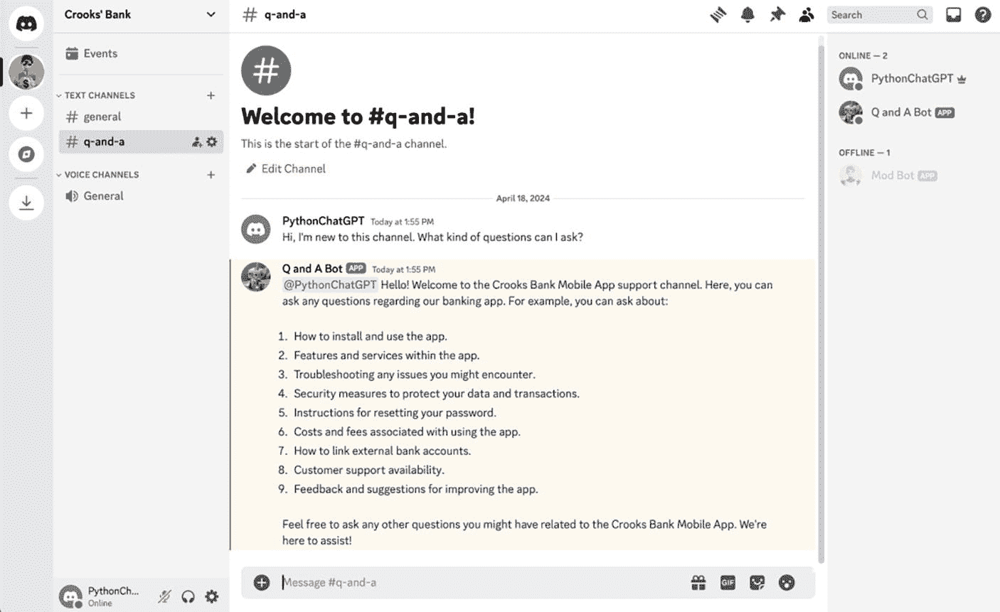

# 7. 为我们的 Discord 机器人添加智能，第 1 部分：改进我们的问答机器人

至此，我们已经具备了所有结构，可以使我们在上一章中创建的两个 Discord 机器人功能完备并具备人工智能。在本书的最后两章中，我们将遵循所有必要的步骤，使这两个机器人具备人工智能。在本章中，我们将从技术支持机器人开始。以下是我们要做的两个主要更改：

- 改进我们调用 OpenAI API 的脚本，并创建一个可由 Discord 机器人实例化的类。这样，Discord 机器人就可以针对我们提供的特定信息提出问题。这个类将在本章中用于问答目的，并且也将在本书的最后一章中使用。

- 修改我们的技术支持 Discord 机器人，使其能够加载一个包含常见问题及其答案的外部文本文件。然后，该脚本将把文本文件的内容提供给 `ChatGPTClient` 类，该类负责创建提示词，当然也负责调用 ChatGPT。


## 让我们的技术支持机器人更智能

清单 7-1 包含了虚构的客户支持团队根据新推出的移动银行应用用户提交的支持工单所创建的常见问题解答的完整内容。

```
1. 什么是克鲁克斯银行移动应用？
克鲁克斯银行移动应用是一款尖端的移动银行应用，让您能够方便地通过移动设备管理财务、进行交易以及访问广泛的银行服务。
2. 如何下载克鲁克斯银行移动应用？
您可以从 iOS 设备的 App Store 和 Android 设备的 Google Play 下载克鲁克斯银行移动应用。只需搜索“克鲁克斯银行移动应用”并点击“安装”按钮即可。
3. 克鲁克斯银行移动应用安全可靠吗？
是的，克鲁克斯银行移动应用将您的安全放在首位。我们使用最先进的加密和安全协议来保护您的数据和交易。您的信息在我们这里很安全。
4. 克鲁克斯银行移动应用提供哪些功能？
克鲁克斯银行移动应用提供多种功能，包括：
•  账户管理：查看账户余额、交易历史等。
•  转账：轻松在您的账户之间或向其他银行账户转账。
•  账单支付：支付账单并管理定期付款。
•  存入支票：拍摄支票照片进行远程存款。
•  ATM 定位器：查找附近的 ATM 和分行。
•  通知：接收账户活动和重要更新的提醒。
5. 我可以将外部账户关联到克鲁克斯银行移动应用吗？
是的，克鲁克斯银行移动应用支持关联其他金融机构的外部账户。您可以在一处监控和管理来自不同银行的账户。
6. 如果我忘记密码，如何重置？
如果您忘记密码，只需点击登录屏幕上的“忘记密码”选项。您将收到关于如何重置密码的说明。
7. 克鲁克斯银行移动应用有哪些相关费用？
克鲁克斯银行移动应用力求费用透明。您可以在应用内的“费用”部分或我们的网站上找到关于账户费用、交易手续费和其他成本的信息。
8. 我可以通过克鲁克斯银行移动应用获得客户支持吗？
当然可以！我们通过应用内的消息功能提供客户支持。您也可以在我们的网站上找到我们的客户服务联系方式。
9. 克鲁克斯银行移动应用适用于企业账户吗？
克鲁克斯银行移动应用主要满足个人银行需求。不过，我们计划在未来推出企业银行服务。
10. 我如何为克鲁克斯银行移动应用提供反馈或建议？
我们欢迎您的反馈！您可以通过应用内或我们网站上的“联系我们”部分提交建议和反馈。
清单 7-1
FAQ.txt
```

正如你在清单 7-1 的常见问题解答文本文件中看到的，这里没有任何魔法。它只是一个问题和答案的列表。现在，让我们看看修改后的技术支持 Discord 机器人。这在清单 7-2 中展示。

```
// 引入必要的 discord.js 类
const { Client, Events, GatewayIntentBits } = require("discord.js");
const { ChatGPTClient } = require("./chatGPTClient");
const fs = require("node:fs");
require("dotenv").config();
const systemMessage =
"你是一个为克鲁克斯银行应用提供支持的虚拟助手。";
const faqContents = fs.readFileSync("./FAQ.txt", "utf8");
const chatGPTClient = new ChatGPTClient(systemMessage, faqContents);
// 配置变量
const CHANNEL_NAME = "q-and-a";
const CUSTOM_STATUS = "准备回答您的问题";
// 创建一个新的 Discord 客户端实例
const discordClient = new Client({
intents: [
GatewayIntentBits.MessageContent,
GatewayIntentBits.GuildMessages,
GatewayIntentBits.Guilds,
],
});
discordClient.once(Events.ClientReady, (readyClient) => {
console.log(`就绪！已登录为 ${readyClient.user.tag}`);
// 设置自定义状态
discordClient.user.setActivity(CUSTOM_STATUS);
});
discordClient.on(Events.MessageCreate, async (message) => {
if (discordClient.user.username === message.author.username) return;
if (message.channel.name != CHANNEL_NAME) return;
console.log("用户是:", message.author.globalName);
console.log("消息是:", message.content);
await message.channel.sendTyping();
const chatGPTResponse = await chatGPTClient.sendMessageFromDiscord(
message.content
);
const reply = `${mention(message.author)} ${chatGPTResponse}`;
await message.channel.send(reply);
});
function mention(author) {
return ``;
}
// 使用您的客户端令牌登录 Discord
discordClient.login(process.env.DISCORD_BOT_API_TOKEN);
清单 7-2
我们更智能的技术支持 Discord 机器人
```

### 与之前版本技术支持机器人相比的重要变化

让我们简要分析一下我们更新后的技术支持机器人，并讨论所做的更改。如您所见，我们同时在做几件事。

首先，这个脚本将同时作为 Discord 和 ChatGPT 的客户端，因此使用一个名为`client`的单一常量会有些令人困惑。因此，用于与 ChatGPT 进行任何 AI 操作的客户端被命名为`chatGPTClient`：

```
const systemMessage =
"你是一个为克鲁克斯银行应用提供支持的虚拟助手。";
const faqContents = fs.readFileSync("./FAQ.txt", "utf8");
const chatGPTClient = new ChatGPTClient(systemMessage, faqContents);
```

请记住本书前几章的内容，您可以通过在提示中向系统本身提供特定消息来显著设定与 ChatGPT 对话的基调。因此，我们创建了一个常量来保存系统消息。此外，我们定义了一个保存常见问题解答文件内容的常量。定义了系统消息和 FAQ 内容后，我们就能实例化我们的`ChatGPTClient`类（稍后会详细介绍）。

这个机器人的全部目的是将 Discord 用户的任何消息发送给 ChatGPT 并显示响应。因此，让我们看看对`client.on()`所做的更改，它已被重命名为`discordClient.on()`。

#### 对新命名函数 `discordClient.on()` 的更新

每当有消息发布到 Discord 服务器时，`discordClient.on()`函数会被异步调用。出于明显的性能原因，实例化`chatGPTClient`类（包括从`FAQ.txt`文件加载内容的过程）的代码不在此函数中。我们已经在脚本的早期执行了这些步骤，因为它们只需要执行一次。

当在我们监控的频道中收到消息时，请务必注意以下代码行：

```
await message.channel.sendTyping();
const chatGPTResponse = await chatGPTClient.sendMessageFromDiscord(
message.content
);
const reply = `${mention(message.author)} ${chatGPTResponse}`;
await message.channel.send(reply);
});
```

在这里，我们提供了良好的用户体验，向用户显示机器人正在“输入”，而用户的问题实际上正在被发送到 ChatGPT。当响应返回时，我们将回复发送给用户。

现在让我们看看处理所有 ChatGPT 功能的辅助类：`chatGPTClient.js`。


## 分析我们的 ChatGPT 客户端：`chatGPTClient.js`

我们有一个名为 `chatGPTClient.js` 的类，它与我们之前使用过的类非常相似。`chatGPTClient.js` 的完整源代码如代码清单 7-3 所示。

```
const { OpenAI } = require("openai");
require("dotenv").config();
class ChatGPTClient {
constructor(systemMessage, initialInstructionsToChatGPT) {
this.systemMessage = systemMessage;
this.initialInstructionsToChatGPT = initialInstructionsToChatGPT;
this.client = new OpenAI({
apiKey: process.env["OPENAI_API_KEY"],
});
}
async sendMessageFromDiscord(userMessage) {
const chatCompletion = await this.client.chat.completions.create({
messages: [
{
role: "system",
content: this.systemMessage,
},
{
role: "user",
content: this.initialInstructionsToChatGPT,
},
{
role: "user",
content: userMessage,
},
],
model: "gpt-4",
temperature: 0.85,
top_p: 1,
max_tokens: 1921,
frequency_penalty: 0,
presence_penalty: 0,
});
const result = chatCompletion.choices[0].message.content;
return result;
}
}
module.exports = { ChatGPTClient };
代码清单 7-3
chatGPTClient.js
```

最需要注意的一点是，在构造函数中，我们发送了常见问题解答内容的完整字符串，以及我们将要提供给系统本身的消息。

这样，在构建了 `ChatGPTClient` 类之后，我们就可以重用已构建的对象，以便回答用户提出的各个问题。

每当我们的 Discord 频道上有人发布问题时，我们的机器人就会从 `chatGPTClient.js` 中调用 `sendMessageFromDiscord()` 方法。在此方法中，我们将执行所有必要的常规操作，以便以编程方式调用 ChatGPT。

## 运行我们的智能问答机器人

现在，让我们运行这个全新改进的问答 Discord 机器人。执行应用程序后，请务必返回你的 Discord 服务器并开始提问。图 7-1 展示了机器人的运行情况。



Crooks Bank 服务器下名为 "q-and-a" 的 Discord 频道截图。主要消息来自 "Q and A Bot"，欢迎用户来到 Crooks Bank 移动应用支持频道。它列出了用户可以询问的主题，包括应用安装、功能、故障排除、安全措施、密码重置说明、费用、关联外部账户、客户支持和反馈。左侧边栏显示了文本频道和语音频道，其中 "q-and-a" 被高亮显示。右侧边栏显示在线用户，包括 "PythonChatGPT" 和 "Q and A Bot"，以及一名离线用户 "Mod Bot"。

图 7-1

与我们的智能 DISCORD 问答机器人进行讨论

代码清单 7-4 展示了我们与 Discord 机器人之间的对话。

1.  ```
    如何安装和使用该应用。
    ```

2.  ```
    应用内的功能和服务。
    ```

3.  ```
    解决你可能遇到的任何问题。
    ```

4.  ```
    保护你的数据和交易的安全措施。
    ```

5.  ```
    重置密码的说明。
    ```

6.  ```
    使用该应用相关的费用和收费。
    ```

7.  ```
    如何关联外部银行账户。
    ```

8.  ```
    客户支持的可用性。
    ```

9.  ```
    改进应用的反馈和建议。
    ```

```
我：你好，我是这个频道的新用户。我可以问哪些问题？
问答机器人：你好！欢迎来到 Crooks Bank 移动应用支持频道。在这里，你可以询问任何关于我们银行应用的问题。例如，你可以询问：
代码清单 7-4
我们与智能问答 Discord 机器人的首次对话
```

```
请随时提出任何其他与 Crooks Bank 移动应用相关的问题。我们随时准备提供帮助！
我：我有一部旧的黑莓手机，这个应用支持我的设备吗？
问答机器人：很抱歉给您带来不便，但目前 Crooks Bank 移动应用仅适用于 iOS 和 Android 设备。它不支持黑莓或其他操作系统。您仍然可以通过手机浏览器访问我们的网站来管理您的银行账户。
我：我是 iPhone 用户。我可以用面容 ID 或触控 ID 登录应用吗？
问答机器人：当然可以，以下是在您的 iPhone 上设置 Crooks Bank 移动应用的方法：
1. 打开 iPhone 上的 App Store。
2. 在顶部的搜索栏中输入 "Crooks Bank Mobile App"，然后点击 "搜索"。
3. 在搜索结果中看到该应用后，只需点击 "获取" 按钮即可下载。
4. 应用下载完成后，点击 "打开"。
5. 首次启动时，您需要同意我们的条款和条件。
6. 如果您是 Crooks Bank 的现有会员，可以使用您的网上银行用户 ID 和密码登录。如果您是新会员，则需要注册一个账户。
7. 登录后，您可以设置触控 ID 或面容 ID，以便将来更快、更安全地登录。
8. 现在，您可以开始使用 Crooks Bank 移动应用来管理您的财务、支付账单、进行交易等！
请确保定期更新应用，以获取新功能和改进。如果在设置过程中遇到任何问题，请通过应用的支持功能联系我们，或致电我们的客户服务。
```

## 我们取得了里程碑式的成就……但有一个小缺陷

好吧，如果你退后一步，审视一下我们到目前为止所取得的成就，你应该会意识到，我们看到的无疑是一个里程碑式的成就。我们拥有以下成果：

*   一个由几个脚本组成的系统，允许用户输入问题，并获得关于如何使用我们移动应用的答案。
*   使用一个简单的文本文件，我们可以教会机器人如何回答用户的问题。公司里的任何人都可以编辑这个文件，并且可以将其用作知识库，日复一日地帮助提高机器人的智能水平。这真是太棒了。
*   该系统允许客户使用自然语言输入问题，机器人会向他们提供智能答案。你猜怎么着？客户不喜欢阅读常见问题解答——尤其是那些非常长的。然而，使用这个系统，他们根本不需要阅读！他们只需提出与自己相关的问题即可。

那么，在我们取得了所有这些成就之后，有一个我们无法忽视的巨大缺陷。在代码清单 7-4 中，机器人对用户说：

```
登录后，您可以设置触控 ID 或面容 ID，以便将来更快、更安全地登录。
```

不，不，不！坏机器人！如果你没有完整阅读常见问题解答文件，请允许我解释一下这里出了什么问题：

1.  代码清单 7-1 中的 `FAQ.txt` 文件明确指出 Crooks Bank 移动应用是一个移动应用。目前，触控 ID 只能用于苹果台式机和笔记本电脑。所以这根本说不通。
2.  `FAQ.txt` 文件中完全没有提到使用面容 ID 进行移动应用身份验证。

因此，不幸的是，ChatGPT 在编造一些根本不真实的事情，并假设存在某些并不存在的功能。所以，就真正的技术支持而言，这是绝对不可接受的。

那么，我们该如何解决这个问题呢？在阅读下一节之前，请先思考一下你如何能解决这个问题。


## 更新 ChatGPT 的系统消息，再试一次

你想出解决方案了吗？解决此问题的一种方法是更新系统消息。请参考上方清单 7-2 中的以下代码行：

```
const systemMessage =
"You are a virtual assistant that provides support for the Crooks Bank banking app.";
```

请记住，系统消息向 ChatGPT 指示了它在聊天对话中的角色。目前，它被设定为一个乐于助人的助手，因此它擅自猜测移动应用程序中存在某些功能。现在，让我们确保 ChatGPT 不会提供任何假设。将系统消息更新为如下所示：

```
const systemMessage = "You are a virtual assistant that provides support for the Crooks Bank banking app. You will be provided Information about the application, and users will ask you questions about the application. Your role is to answer questions explicitly from the training information. If you were not given an answer to a question, then provide an apologetic message to the user explaining that you do not know the answer.";
```

就是这样。`FAQ.txt` 文件与之前完全相同，我们只需要更新系统消息，让 ChatGPT 知道它在对话中的角色。清单 7-5 展示了我们与 Discord 机器人的新对话。

```
Me: How are you today?
Q and A Bot: As a virtual assistant, I don't have feelings or emotions, but I'm here and ready to assist you. How may I help you with the Crooks Bank Mobile App today?
Me: I have an old Blackberry phone, is the app supported on my device?
Q and A Bot: I'm sorry, but from the information provided, the Crooks Bank Mobile App can only be downloaded from the App Store for iOS devices and Google Play for Android devices. BlackBerry devices are not mentioned, therefore I cannot confirm that it would be compatible.
Me: So, if I use an iPhone, how do I setup the app?
Q and A Bot: To set up the Crooks Bank Mobile App on your iPhone, you can download it from the App Store. Simply search for "Crooks Bank Mobile App" and click the "Install" button. After the installation is finished, open the app and follow the prompts to set up your account. If you already have an account, use your login information to access your account through the app.
清单 7-5
我们与智能问答 Discord 机器人的第二次且更成功的对话
```

现在好多了！我们的技术支持机器人“遵循脚本”，不允许编造或假设任何内容。

## 结论

在本章中，我们收获颇丰！我们拥有一个功能齐全的 Discord 机器人，任何人都可以无需 AI、NLP 或机器学习经验，仅通过一个简单的文本文件来训练它。我们了解到，一个“乐于助人的助手”有时可能会变得“过于乐于助人”，并假设不真实的事实。然而，我们也重申了系统消息的概念和价值，这是提示工程的重要组成部分。

既然我们已经让问答 Discord 机器人变得智能，现在让我们看看如何让我们的内容审核机器人也变得智能！

