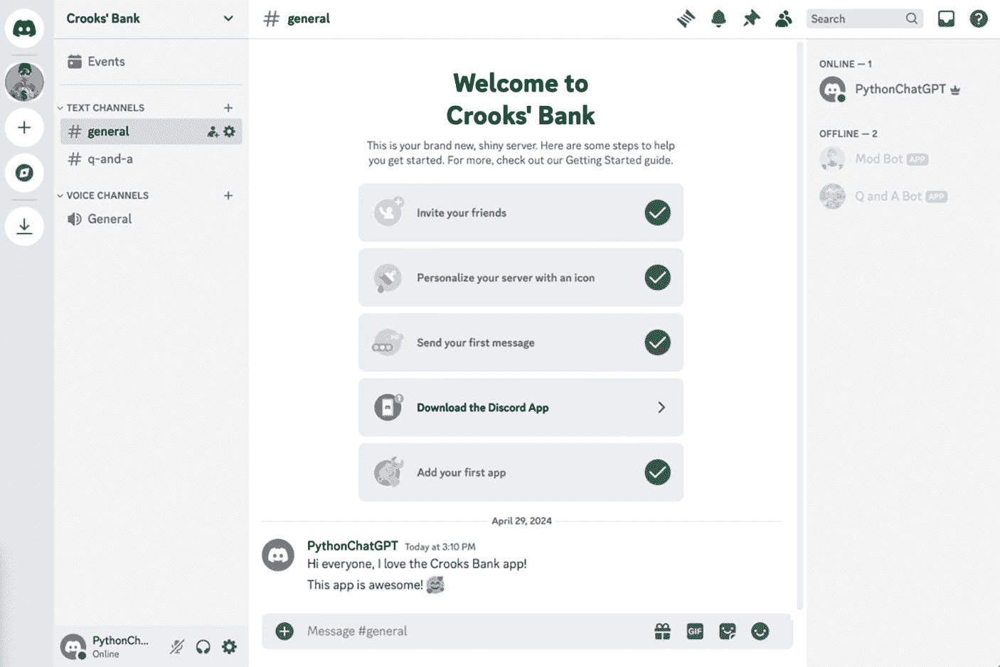

# 8. 为我们的 Discord 机器人增加智能，第 2 部分：改进我们的审核机器人

在本章中，我们将采取必要的步骤，使我们的内容审核 Discord 机器人具备人工智能。以下是我们将要进行的更改类型。

首先，我们将创建一个新脚本来调用其中一个**审核**模型。审核模型是一类特殊的模型，允许我们在任何文本内容符合以下任何类别时发出警报：

- 仇恨
- 仇恨/威胁
- 骚扰
- 骚扰/威胁
- 自残
- 自残/意图
- 自残/指示
- 色情
- 色情/未成年人
- 暴力
- 暴力/血腥

接下来，我们将重用上一章中的 `chatGPTClient.js` 脚本。在第 7 章中，它用于使用 `client.chat.completions.create()` 方法调用聊天模型，以回答用户的问题。在本章中，它将再次用于调用聊天模型，但这次是为了审核目的。

当然，我们将更新 `chatGPTClient.js` 脚本，使其能够调用审核模型。

最后，我们将修改内容审核 Discord 机器人，使其能够调用 `chatGPTClient.js` 中的聊天模型和审核模型。如果任一模型指示在 Discord 频道中输入的内容令人反感，则从该 Discord 频道中删除该消息。请记住，此机器人监视 Discord 服务器所有频道中的所有内容！

**注意**

现在，此时，您可能会问自己，如果审核模型已经知道如何标记任何有害内容，那么为什么我们还需要使用任何聊天模型呢？问得好。

是的，审核模型将让我们了解有害内容，但它**不会**告知我们场景中任何其他类型的不需要的内容，例如当不道德的人试图引诱我们的用户陷入骗局时。请记住，这是一个银行应用程序的 Discord 服务器，因此诈骗者肯定会喜欢针对此 Discord 服务器的所有成员，因为它是一个充满银行用户的中心位置！

因此，在最后一章中，我们将在 `chatGPTClient.js` 中同时调用聊天模型和审核模型。

## 使用 `OpenAI.moderations.create()` 调用审核模型

任何审核模型都允许开发者提交一个文本字符串，并随后了解它是否包含暴力、仇恨、威胁或任何形式的骚扰。

表 8-1 描述了调用 `OpenAI.moderations.create()` 方法主体所需参数的格式。该方法使用起来非常简单，因为只需要一个参数即可正确调用服务。

**表 8-1** 审核方法的请求主体

| 字段 | 类型 | 是否必需 | 描述 |
| --- | --- | --- | --- |
| `input` | 字符串或数组 | 必需 | 需要分类的文本 |
| `model` | 字符串 默认值：`"omni-moderation-latest"` | 可选 | 有多种内容审核模型可供使用，例如：`"omni-moderation-latest"`、`"text-moderation-stable"`、`"text-moderation-latest"`。默认情况下，此值设置为 `"omni-moderation-latest"`。它会随着时间的推移自动升级，这确保您始终使用最准确的模型。如果您决定使用任何基于文本的审核模型，那么您只能提交文本进行评估。然而，全能审核模型能够评估文本和图像内容。因此，请选择最适合您用例的模型。 |

### 创建审核（JSON）

### 处理 JSON 响应

成功调用审核模型后，API 将提供一个 JSON 响应，其结构如表 8-2 所示。

**表 8-2** 审核 JSON 对象的结构

| 字段 | 类型 | 描述 |
| --- | --- | --- |
| `id` | 字符串 | 审核请求的唯一标识符 |
| `model` | 字符串 | 用于执行审核请求的模型 |
| `results` | 数组 | 审核对象列表 |
| `↳ flagged` | 布尔值 | 标记内容是否违反 OpenAI 的使用政策 |
| `↳ categories` | 数组 | 类别列表及其是否被标记 |
| `↳↳ hate` | 布尔值 | 指示给定文本是否表达、煽动或宣扬基于种族、性别、宗教、民族、国籍、残疾状况、性取向或种姓的仇恨 |
| `↳↳ hate/threatening` | 布尔值 | 指示给定文本是否包含仇恨内容，并基于上述偏见对目标群体威胁暴力或严重伤害 |
| `↳↳ harassment` | 布尔值 | 指示给定文本是否包含表达、煽动或宣扬针对任何目标的骚扰性语言 |
| `↳↳ harassment/threatening` | 布尔值 | 指示给定文本是否包含骚扰内容，并威胁对任何目标实施暴力或严重伤害 |
| `↳↳ self-harm` | 布尔值 | 指示给定文本是否包含宣扬、鼓励或描述自残行为的内容，例如自杀、割伤和饮食失调 |
| `↳↳ self-harm/intent` | 布尔值 | 指示给定文本是否包含说话者表示正在或意图进行自残行为的内容，例如自杀、割伤和饮食失调 |
| `↳↳ self-harm/instructions` | 布尔值 | 指示给定文本是否包含鼓励进行自残行为的内容，例如自杀、割伤和饮食失调。这包括提供如何实施此类行为的指导或建议的内容 |
| `↳↳ sexual` | 布尔值 | 指示给定文本是否包含旨在引起性兴奋的内容，例如对性行为的描述。这包括宣扬性服务的内容；但不包括性教育和健康等主题 |
| `↳↳ sexual/minors` | 布尔值 | 指示给定文本是否包含涉及 18 岁以下个人的内容 |
| `↳↳ violence` | 布尔值 | 指示给定文本是否包含描述死亡、暴力或身体伤害的内容 |
| `↳↳ violence/graphic` | 布尔值 | 指示给定文本是否包含详细描述死亡、暴力或身体伤害的内容 |
| `↳ category_scores` | 数组 | 类别列表及其对应的模型评分 |
| `↳↳ hate` | 数字 | “hate”类别的评分 |
| `↳↳ hate/threatening` | 数字 | “hate/threatening”类别的评分 |
| `↳↳ harassment` | 数字 | “harassment”类别的评分 |
| `↳↳ harassment/threatening` | 数字 | “harassment/threatening”类别的评分 |
| `↳↳ self-harm` | 数字 | “self-harm”类别的评分 |
| `↳↳ self-harm/intent` | 数字 | “self-harm/intent”类别的评分 |
| `↳↳ self-harm/instructions` | 数字 | “self-harm/instructions”类别的评分 |
| `↳↳ sexual` | 数字 | “sexual”类别的评分 |
| `↳↳ violence` | 数字 | “violence”类别的评分 |
| `↳↳ violence/graphic` | 数字 | “violence/graphic”类别的评分 |

### 审核（JSON）

下面的代码清单是调用审核模型后 JSON 响应的示例。表 8-2 看起来有点复杂，但正如你所见，如果任何类别被标记为“true”，那么 `results.flagged` 节点也会被标记为“true”。

请查看清单 8-1，了解审核对象的实际示例。

```
一个黑白几何标志，采用相互锁定的对称设计，类似于结或编织图案。
{
"id": "modr-XXXXX",
"model": "text-moderation-005",
"results": [
{
"flagged": true,
"categories": {
"sexual": false,
"hate": false,
"harassment": false,
"self-harm": false,
"sexual/minors": false,
"hate/threatening": false,
"violence/graphic": false,
"self-harm/intent": false,
"self-harm/instructions": false,
"harassment/threatening": true,
"violence": true,
},
"category_scores": {
"sexual": 1.2282071e-06,
"hate": 0.010696256,
"harassment": 0.29842457,
"self-harm": 1.5236925e-08,
"sexual/minors": 5.7246268e-08,
"hate/threatening": 0.0060676364,
"violence/graphic": 4.435014e-06,
"self-harm/intent": 8.098441e-10,
"self-harm/instructions": 2.8498655e-11,
"harassment/threatening": 0.63055265,
"violence": 0.99011886,
}
}
]
}
清单 8-1
审核对象响应
```

## 创建我们的内容审核客户端

清单 8-2 是我们更新后的 `chatGPTClient.js` 脚本，它是在前一章的基础上修改的，允许我们同时调用聊天模型和审核模型。请查看它，然后我们将讨论其中的重要部分。

```
const { OpenAI } = require("openai");
require("dotenv").config();
class ChatGPTClient {
constructor(systemMessage, initialInstructionsToChatGPT) {
this.systemMessage = systemMessage;
this.initialInstructionsToChatGPT = initialInstructionsToChatGPT;
this.client = new OpenAI({
apiKey: process.env["OPENAI_API_KEY"],
});
}
async sendMessageFromDiscord(userMessage) {
const chatCompletion = await this.client.chat.completions.create({
messages: [
{
role: "system",
content: this.systemMessage,
},
{
role: "user",
content: this.initialInstructionsToChatGPT,
},
{
role: "user",
content: userMessage,
},
],
model: "gpt-4",
temperature: 0.85,
top_p: 1,
max_tokens: 1000,
frequency_penalty: 0,
presence_penalty: 0,
});
const result = chatCompletion.choices[0].message.content;
return result;
}
async isFlagged(message) {
const response = await this.client.moderations.create({
input: message,
});
return response.results[0].flagged;
}
}
module.exports = { ChatGPTClient };
清单 8-2
更新后的 chatgptclient.js
```

如果你还记得上一章中这个脚本的工作原理，我们定义了一个类，其构造函数用于执行只需一次的操作，即指定系统消息和给 ChatGPT 的初始指令。这些与上一章相比没有任何变化。

`sendMessageFromDiscord()` 函数也是如此。我们使用它通过 Discord 频道中输入的文本来调用我们选择的聊天模型。正如你将在本章后面看到的，初始指令将与上一章不同，但代码的工作方式仍然相同。

然而，让我们分析一下添加到脚本中的以下异步函数：

```
async isFlagged(message) {
const response = await this.client.moderations.create({
input: message,
});
return response.results[0].flagged;
}
```

如你所见，通过这几行代码，我们能够通过调用 `OpenAI.moderations.create()` 来调用审核模型，并判断内容是否被标记为不适当。

## 让我们的内容审核机器人更智能

现在我们已经有了一个改进版的 `chatGPTClient.js` 脚本，它能够同时使用聊天模型和审核模型来审核内容，接下来让我们看看为内容审核功能对 Discord 机器人所做的修改。

代码清单 8-3 是我们智能 Discord 审核机器人的完整源代码。

```javascript
// 引入必要的 discord.js 类
const { Client, Events, GatewayIntentBits } = require("discord.js");
const { ChatGPTClient } = require("./chatGPTClient");
const fs = require("node:fs");
require("dotenv").config();
const systemMessage = `
你是 Discord 服务器的自动审核助手。
请检查每条消息是否存在以下违规行为：
1\. 敏感信息
2\. 辱骂
3\. 不当评论
4\. 垃圾信息，例如：全大写字母的消息、重复相同的短语或词语、超过 3 个感叹号或问号。
5\. 广告
6\. 外部链接
7\. 政治消息或辩论
8\. 宗教消息或辩论
如果检测到任何违规行为，请回复 "FLAG"（大写，不含引号）。如果消息符合规则，请回复 "SAFE"（大写，不含引号）。
`;
const instructions = "分析以下消息是否存在违规行为：";
const chatGPTClient = new ChatGPTClient(systemMessage, instructions);
// 创建一个新的客户端实例
const discordClient = new Client({
intents: [
GatewayIntentBits.MessageContent,
GatewayIntentBits.GuildMessages,
GatewayIntentBits.Guilds,
],
});
discordClient.once(Events.ClientReady, (readyClient) => {
console.log(`就绪！已登录为 ${readyClient.user.tag}`);
});
discordClient.on(Events.MessageCreate, async (message) => {
if (discordClient.user.username === message.author.username) return;
console.log("用户是：", message.author.globalName);
console.log("消息是：", message.content);
const chatGPTResponse = await chatGPTClient.sendMessageFromDiscord(
message.content
);
const isFlagged = await chatGPTClient.isFlagged(message.content);
if (chatGPTResponse === "FLAG" || isFlagged) {
if (!(await message.delete())) {
console.log("删除消息失败");
} else {
const authorMention = `${mention(message.author)}`;
const reply = `${authorMention} 此评论被认为不适合本频道。\n 如果您认为这是误判，请联系人工服务器管理员。`;
await message.channel.send(reply);
}
}
});
function mention(author) {
return ``;
}
// 使用您的客户端令牌登录 Discord
discordClient.login(process.env.DISCORD_BOT_API_TOKEN);
```

*代码清单 8-3：我们改进后的内容审核机器人*

### 与之前版本内容审核机器人的重要变化对比

让我们简要回顾一下代码清单 8-3 中的内容审核 Discord 机器人，并讨论所做的更改。下面的代码片段包含了类定义部分的一部分。

```javascript
const systemMessage = `
你是 Discord 服务器的自动审核助手。
请检查每条消息是否存在以下违规行为：
1\. 敏感信息
2\. 辱骂
3\. 不当评论
4\. 垃圾信息，例如：全大写字母的消息、重复相同的短语或词语、超过 3 个感叹号或问号。
5\. 广告
6\. 外部链接
7\. 政治消息或辩论
8\. 宗教消息或辩论
如果检测到任何违规行为，请回复 "FLAG"（大写，不含引号）。如果消息符合规则，请回复 "SAFE"（大写，不含引号）。
`;
const instructions = "分析以下消息是否存在违规行为：";
const chatGPTClient = new ChatGPTClient(systemMessage, instructions);
```

正如我们之前在这本书中所说，正确的提示工程要求你使用多个参数，包括向系统本身发送的“系统消息”。在这里，我们告诉聊天模型所有我们不希望发布在 Discord 服务器中的信息类型。

我们希望你能理解为什么我们的 Discord 审核机器人需要同时使用 OpenAI 的聊天模型和审核模型。审核模型在“开箱即用”的情况下对于基本内容审核效果不错；然而，由于我们的用例是针对银行的，我们希望采取额外的预防措施，以防止我们的客户通过 Discord 服务器成为不法分子的目标。

### 对 `discordClient.on()` 函数的更新

当 Discord 服务器中任何频道收到消息后，`discordClient.on()` 函数会被调用。以下是最重要的变化：

```javascript
discordClient.on(Events.MessageCreate, async (message) => {
...
const chatGPTResponse = await chatGPTClient.sendMessageFromDiscord(
message.content
);
const isFlagged = await chatGPTClient.isFlagged(message.content);
if (chatGPTResponse === "FLAG" || isFlagged) {
if (!(await message.delete())) {
console.log("删除消息失败");
} else {
const authorMention = `${mention(message.author)}`;
const reply = `${authorMention} 此评论被认为不适合本频道。\n 如果您认为这是误判，请联系人工服务器管理员。`;
await message.channel.send(reply);
}
}
});
```

在这里，我们获取发布在 Discord 服务器中的每条消息，并使用聊天模型和审核模型进行检查。如果任一模型告知我们该消息被标记，那么我们就删除频道中的消息，并通知用户他们的消息违反了规则。

现在我们的内容审核 Discord 机器人已经变得智能了，让我们来试试吧！

## 运行我们的智能内容审核机器人

现在让我们运行我们全新改进的内容审核 Discord 机器人。执行应用程序后，请务必返回你的 Discord 服务器并开始提问。图 8-1 展示了机器人的运行情况。



*图 8-1：与我们的智能 DISCORD 内容审核机器人进行讨论*

代码清单 8-4 展示了我们与 Discord 机器人之间的一段对话，用于测试其功能。

```
我：大家好，我喜欢 Crooks 银行应用！
我：这个应用太棒了！一个黑白线条画的笑脸，带有心形眼睛，传达出喜爱或钦佩的感觉。
我：来我的网站！http://www.google.com
内容审核机器人：@JSChatGPT 此评论被认为不适合本频道。如果您认为这是误判，请联系人工服务器管理员。
我：对不起，我违反了规则。我现在已经改过自新了
我：但我有个坏消息要告诉你们
我：我想给 A black and white skull and crossbones symbol, often associated with danger or warning of toxic substances. 所有人
内容审核机器人：@JSChatGPT 此评论被认为不适合本频道。如果您认为这是误判，请联系人工服务器管理员。
```

*代码清单 8-4：我们与智能审核 Discord 机器人的违规对话*

在这两种情况下，当不当内容发布到 Discord 服务器的任何频道时，不仅违规用户被点名，而且不良消息也被删除了。好机器人！

你注意到审核模型和聊天模型也能读取表情符号了吗？

## 结论

在本章中，我们为整个 Discord 服务器创建了一个功能完备的内容审核机器人！我们同时利用了 OpenAI 的 `Moderation` 和 `Chat` 模型，构建了一个自定义的内容审核器，它不仅能标记仇恨言论和威胁信息等不安全内容，还能防止 Discord 服务器的用户受到不必要的骚扰。

## 留给读者的练习

尽管我们在本章（以及本书中！）取得了不少成果，但代码仍有改进空间。

例如，我们创建的各个 Discord 机器人已经知道不回应自己发送的消息。然而，这些机器人目前还不知道它们不应该回应**其他机器人**发送的消息。

这意味着，如果你同时运行两个机器人，并且有人在“问答”频道发布了不良信息，内容审核机器人（当然）会删除该消息并通知所有人消息已被删除。但是，由于技术支持机器人不知道它不应该回应其他机器人，它会尝试生成一个回复。当然，机器人之间不应该互相交谈。

## 索引

A, B

`Accuweather` 添加规格 创建主页 导航新应用

`Annotated data`

`ASR` 参见 `Automatic Speech Recognition (ASR)`

`Assistant Message` 格式化结构

`Audiosplitte r` 应用

`Automatic Speech Recognition (ASR)`

C

`ChatCompletion` 结构 消息类型

`ChatCompletionMessage`

`ChatCompletion Object Response`

`ChatGPT` 提示 设置提示词

`ChatGPT APIs` 数据 温度设置 令牌

`ChatGPT client` JavaScript 网络应用

`ChatGPT`，结对编程助手

`Accuweather` 另请参阅 `Accuweather`

`cURL` 命令 文档

`Google Maps` 提示 设置提示词

`Chat model`

`Chat Playground`

`Assistant` 字段

`Code` 按钮 模型列表 最大令牌数

`System Message` 温度

`User` 字段

`User message`

`Content moderator`

`Content Moderator bot`

`Content Moderator Discord Bot` 实际应用 修改代码 智能化

`Context window`

`conversations.history()` 方法

`Crooks Bank Mobile App` 企业银行服务 客户支持 定义 下载 外部账户 功能 反馈 费用 iPhone 重置密码 安全

D, E

`DALL·E` 模型 创建图像 创建提示词 描述梦境 `GPT-4o-mini` 图像类型 播客

`Discord` 人工智能能力 机器人客户端 社区管理 内容审核器 创建频道 创建用户 创建/注册 Crook’s Bank 开发者网站 通用信息 ID 令牌 邀请机器人到服务器 JavaScript 命名 新消息 强大的机器人 提供通用信息 Q&A 机器人应用 注册机器人 运行 运行第二个 JavaScript 选择权限 选择作用域 幽默感 简化文本消息

`discordClient.on()` 函数

`Discord Moderator Bot`

`eXtreme Programming (XP)`

F

`FFmpeg`

`ffmpeg.ffprobe()` 函数

G

`Generative AI` 模型

`Google Maps` 账户设置 主页 JavaScript API 密钥和凭据 导航 API

H

`Human intelligence`

I

`Investigative journalism`

J, K

`JavaScript` 浏览器兼容性 客户端处理 社区/资源 不断发展的框架 交互性 JSON 库 实时反馈 多功能性

`JavaScript developers`

`Module pattern`

`Observer pattern`

`Singleton pattern`

`JavaScript Object Notation (JSON)`

`JSON` 参见 `JavaScript Object Notation (JSON)`

L

`Language models`

M

`Memory-related anomalies`

`models.list()` 函数

`Moderation models` 异步函数 `chatgptclient.js` 创建 定义 JSON 对象 JSON 响应对象 响应

`Module pattern`

N

`Natural Language Processing (NLP)`

`Natural Language Understanding (NLU)`

`Neural network`

`NLP` 参见 `Natural Language Processing (NLP)`

`NLU` 参见 `Natural Language Understanding (NLU)`

O

`OAuth Scope`

`Observer pattern`

`OpenAI API`

`ChatGPT` `.env` 文件 `dotenv` 包 `Node.js` 应用 环境变量 Linux MacOS Windows 硬编码 可用模型列表 `Node.js` 脚本 `openai.models.list()` 提示词

`OpenAI.audio.transcriptions.create()` 方法

`OpenAI.chat.completions.create()` 方法

`OpenAI.images.generate()` 方法 创建图像 端点 图像 JSON 对象

`openai.models.list()`

`OpenAI.moderations.create()` 方法

`OpenAI textual models`

`Output tokens`

P, Q

`Pair-Programmer`

`Podcast Visualizer`，步骤

`Pre-trained model`

`Prompt Engineering`

`ChatGPT` 客户支持 虚构公司 问题升级 后续步骤 简化版 简化版 软件开发 tl;dr 带订阅计划的网站

R

`Regular expressions`

`results.flagged` 节点

S

`sendMessageFromDiscord()` 函数

`Sentiment analysis`

`Singleton pattern`

`Slack` 时区 使用 Slack 机器人应用 API 网站 频道 ID 确认设置 conversationHistory 创建环境变量 获取令牌 安装 邀请到频道 JavaScript 代码 消息内容 npm 命令 OAuth & Permissions 页面 OAuth Scope 输出

`Speech recognition` 口音 同音词 名称 标点符号

`splitMP3()` 函数

`System Message` 格式化结构

T

`Tech Support Discord bot`

`chatGPTClient`

`chatGPTClient.js`

`FAQ` 消息已发布 修改 里程碑式成就 Q&A 回复用户

`Text pattern`

`Text summarization`

`Token limitations`

`Tool Message` 定义 结构

U, V

`User community`

`User Message` 格式化结构

W, X, Y, Z

`Whisper model` 将音频转换为文本 创建音频转录 MP3 文件 部分转录 请求体 将语音转换为文本 转录端点