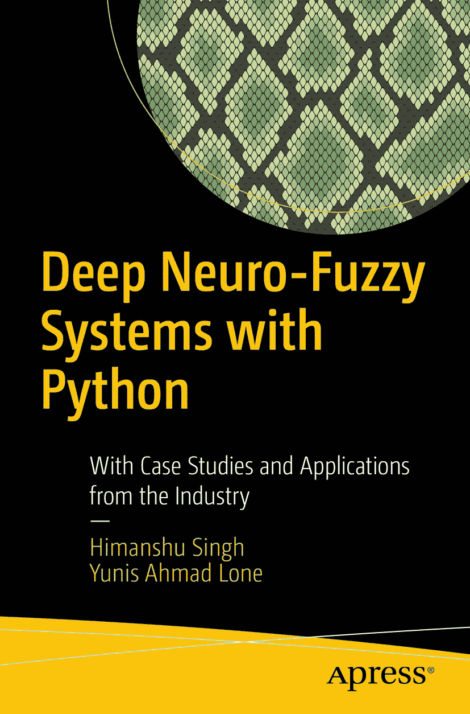

ISBN 978-1-4842-5360-1 电子书 ISBN 978-1-4842-5361-8 [`doi.org/10.1007/978-1-4842-5361-8`](https://doi.org/10.1007/978-1-4842-5361-8) © Himanshu Singh, Yunis Ahmad Lone 2020 Apress 标准商标名称、徽标和图像可能出现在本书中。我们并非在每次出现商标名称、徽标或图像时都使用商标符号，而是仅以编辑方式使用这些名称、徽标和图像，以维护商标所有者的利益，且无意侵犯商标权。本出版物中使用的商品名称、商标、服务标志及类似术语，即使未明确标识，也不应被视为对其是否受专有权利保护的表达意见。尽管本书中的建议和信息在出版时被认为是真实准确的，但作者、编辑和出版商均不对可能出现的任何错误或遗漏承担法律责任。出版商对本书所含内容不作任何明示或暗示的保证。本书通过 Springer Science+Business Media New York 向全球图书贸易发行，地址：233 Spring Street, 6th Floor, New York, NY 10013。电话：1-800-SPRINGER，传真：(201) 348-4505，电子邮件：orders-ny@springer-sbm.com，或访问 www.springeronline.com。Apress Media, LLC 是一家加利福尼亚有限责任公司，其唯一成员（所有者）是 Springer Science + Business Media Finance Inc (SSBM Finance Inc)。SSBM Finance Inc 是一家特拉华州公司。

## 引言

本书是一本面向希望了解模糊网络及其在 Python 中应用的学生和专业人士的教材。我们力求通过易于读者理解的示例来解释各个主题，并使概念与现实场景相关联。本书前半部分介绍了模糊网络、逻辑和推理系统。后半部分主要探讨深度学习与模糊逻辑的融合，并探索了当前业界使用的架构。

我们尽量将数学难度保持在最低水平，以便读者能够轻松理解概念。具有数学背景和机器学习知识的读者会更容易理解，但本书的结构也使得没有这些背景知识的读者不会感到过于困难。

我们从第 1 章介绍模糊集开始。第 2 章介绍模糊规则和推理的概念，并解释隶属函数。在第 3 章中，我们讨论主要用于构建模糊控制系统的模糊推理系统。

在第 4 章和第 5 章中，我们讨论机器学习和神经网络的概念，这将帮助您理解后续的模糊网络概念。我们还涵盖了优化和参数调优。在第 6 章中，我们开始讨论模糊神经网络及其不同架构，最后，在第 7 章中，我们讨论与深度模糊网络相关的一些高级概念。

总体而言，本书旨在让读者轻松理解模糊网络的概念，不仅理解其背后的数学原理，还能掌握其在 Python 中的实际实现。

## 致谢

首先，我要感谢我的合著者 Yunis 先生。正是因为他，我才有机会研究神经模糊推理。在他的领导下，我使用 ANFIS 为客户完成了一个工作原型。这给了我启动本书的动力，并让读者了解这一领域。我还要感谢 Sadhan Reddy 先生，他在本书的技术方面提供了帮助。感谢 Shivani、Praveen 和 Rajeev（我的学生），他们帮助填补了本书中的许多空白。

我要感谢 Apress 的协调编辑 Aditee，她一直与我保持联系，并指导我解决各种疑问。没有她，我总会落后于计划。我还要感谢 Celestin John 先生，他为我提供了撰写这个主题书籍的机会。

最后，我要感谢我的妻子 Shikha。没有她，我永远不会有动力和激励继续撰写这本书。

### 关于作者与技术审稿人

### 关于作者

### 关于技术审稿人

