# 1. 模糊集理论导论

本章为本书其余部分奠定基础。您将了解软计算和模糊系统。您将学习经典集与模糊集及其区别。然后，您将了解不同集合的性质，并学习如何对它们执行不同操作。本章还包含对隶属函数的基本介绍，这些内容将在下一章中详细解释。在需要的地方，提供了用于执行的 Python 代码。


## 软计算与模糊系统

当你拥有定义清晰、精确且易于理解的数据时，应用硬计算是完美的选择。硬计算基于二进制逻辑、经典集合、精确系统与软件、基础数值分析等。但当你试图将同样的方法应用于包含不精确数据的现实问题时——比如数据集部分为真、包含大量近似值等——硬计算就会失效。应对这种情况的最佳方法是采用软计算方法。

一个非常基础的例子是 `2+2`。在这种情况下，你可以使用硬计算得出 `4`。但当方程变为 `2+x`，其中 `x` 的取值范围是 `0` 到 `5` 时，软计算总能给出更好的结果。在继续深入了解软计算究竟是什么之前，请先研究图 1-1 中的流程图。它展示了硬计算与软计算在解决问题时的区别。

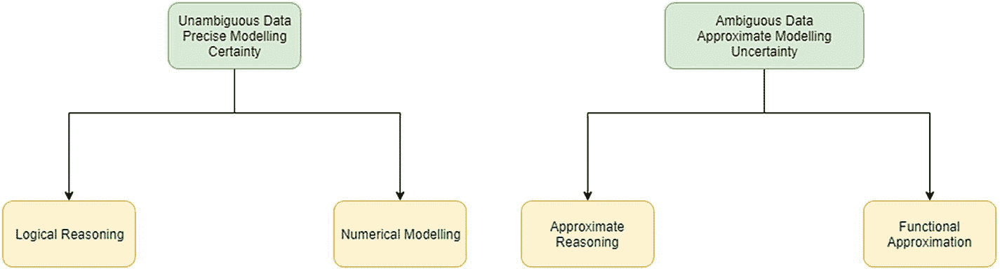

图 1-1

硬计算与软计算对比

软计算试图模仿人脑来进行决策。这些模型具有认知能力，包括：

*   思考能力
*   推理能力
*   组织能力
*   记忆能力
*   识别能力
*   处理能力

当你的数据是*不精确的*（包含部分真实性和大量近似值）时，软计算是最佳方法。以下是基于软计算的问题解决方法的特点：

*   受生物启发
*   容错性强
*   充满优化
*   有助于制造更明智、更智能的机器
*   有助于实现鲁棒性、易处理性和低成本
*   计算量大
*   目标驱动

表 1-1 列出了软计算方法的基本组成部分。

表 1-1

软计算的基本组成部分

| 组成部分 | 优势 |
| --- | --- |
| 神经网络 | 基于数据的不确定性进行学习和适应 |
| 模糊集合论 | 知识表示 |
| 遗传算法 | 用于高效搜索 |
| 传统人工智能 | 使用数学方法 |

现在你已经了解了软计算的基础知识，请将注意力转向理解模糊系统。模糊系统是软计算的核心部分之一，因此你需要理解它们。模糊系统与软计算共同为推理系统奠定了非常坚实的基础，该系统也称为*自适应神经模糊推理系统*，本书后续将对此进行讨论。

模糊系统由模糊集合组成，而非普通的经典集合。在这些系统中，你尝试遵循模糊逻辑，因为传统逻辑无法应用于现实世界的应用。让我们通过一个例子来了解模糊系统。

当你驾驶汽车时，这是踩油门和踩刹车的组合。每当你加速时，你就踩油门；每当你想要减速时，你就踩刹车。假设你在谈论自动驾驶汽车。在这种情况下，两个系统应该同时管理，无需任何人工干预。

如果你考虑传统逻辑，它遵循经典集合（称为*清晰集合*）。在这些集合中，值等于 `0` 或 `1`。假设功能定义如表 1-2 所示。

表 1-2

使用清晰集合表示的刹车操作

| 功能 | 集合编码 |
| --- | --- |
| 踩油门 | 1 |
| 松开油门 | 0 |
| 踩刹车 | 1 |
| 松开刹车 | 0 |

这种编码的问题在于，`1` 表示完全踩下，`0` 表示完全松开。没有中间响应。假设一辆车在你车前转弯。在这种情况下，`1` 编码将被激活，并施加全力刹车。如果那辆车加速并离你更远，则会完全松开刹车并完全踩下油门（编码 `0` 和 `1` 将被激活）。

## 经典集合

经典集合，也称为*清晰集合*，是对象的集合。对象可以是现实世界中的任何事物，有时也包含领域之外的事物。例如：

```
汽车 = {奥迪, 宝马, 奔驰, 保时捷}
```

这个集合展示了一系列高档汽车。你使用花括号 `{}` 来表示一个集合。

一旦你有效地定义了不同的集合，你也可以将它们可视化。*维恩图*是一种可视化表示集合及其相互关系的图形方式。图 1-2 显示了一个普通的维恩图。

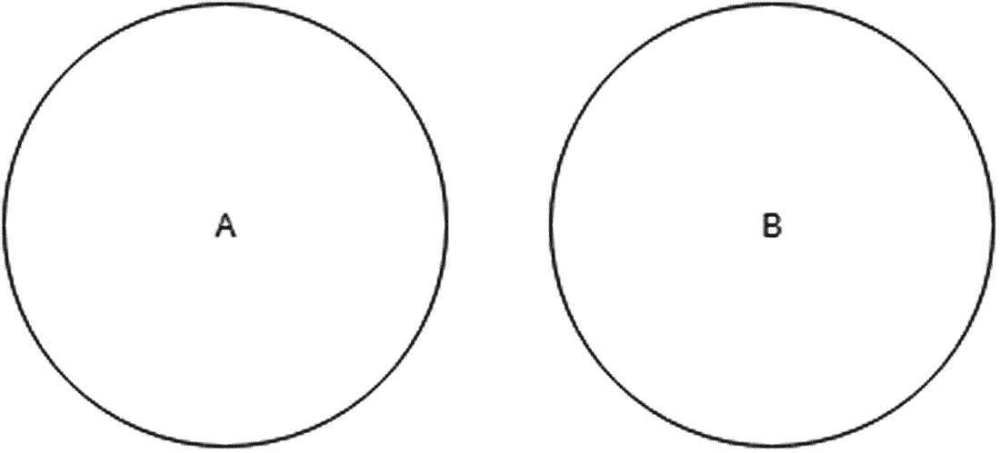

图 1-2

简单的维恩图

图 1-2 中的圆圈代表两个集合，A 和 B。属于集合 A 的所有元素将出现在圆圈 A 中，而属于集合 B 的所有元素将出现在圆圈 B 中。这些圆圈被称为集合 A 和集合 B 的维恩图。

### 论域

所有可能共享一个领域或具有相似特征的元素都包含在一个集合中。这些元素的集合称为*论域*。一旦你有了这个集合，你也可以形成各种子集。正式地说，论域可以定义如下：

*“在每一个论述中，无论是心灵与自身思想的对话，还是个体与他人的交流，都存在一个假定或明确表达的界限，其操作的对象被限制在这个界限之内。……现在，无论我们论述的所有对象所在的领域范围如何，该领域都可以恰当地称为论域。（Boole 1854/1958, p. 42）”*

通过以下示例来看论域：

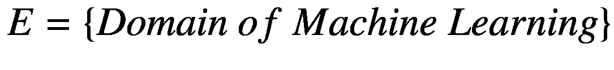

设集合 E 为论域。它包含了机器学习的完整领域。那么，可能属于 E 的集合有：

*   机器学习算法集合
*   基本统计方法集合
*   神经网络集合等

## 经典集合的性质

本节解释经典集合的各种性质。这些性质包括：

*   元素的隶属关系
*   集合的基数
*   集合族
*   空集
*   单元素集
*   子集
*   超集
*   幂集
*   可数集
*   不可数集

### 元素的隶属关系

如果一个元素是一个集合的一部分，则称其为该集合的*成员*。用 `X ε A` 表示，这意味着元素 X 是集合 A 的成员。


在从 1 到 5 的整数集合中，每个数字都称为集合 A 的成员。

### 集合的基数

在一个集合中，如果你计算存在的元素总数，这个数字称为该集合的*基数*。它可以用 `n(A)` 或 `|A|` 或 `#A` 表示。

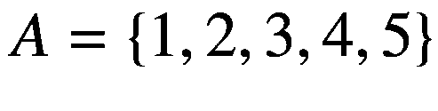

这个集合的基数为 5。


### 集合族

一个集合可以包含任何东西。但如果一个集合包含的是多个不同集合的集合，那么这个集合就被称为集合的*族*。例如：

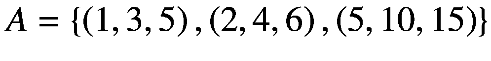

这里，`(1, 3, 5)`、`(2, 4, 6)` 和 `(5, 10, 15)` 是包含在集合 `A` 中的各个独立集合。因此，集合 `A` 就是一个集合族，如图 1-3 所示。

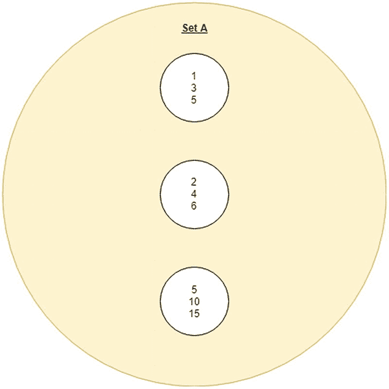

图 1-3

集合族 `A` 包含多个不同的集合

### 空集

如果一个集合的基数为 0，则称之为*空集*。这意味着它内部没有任何元素。

`A = {}` 是一个空集。

### 单元素集

如果一个集合的基数为 1，则称之为*单元素集*。这意味着它内部只有一个元素。

`A = {1}` 是一个单元素集。

### 子集

假设有两个集合 `A` 和 `X`。如果 `X` 中的所有元素都是 `A` 的一部分，那么 `X` 被称为 `A` 的*子集*。用 `X⊂A` 表示。图 1-4 展示了一个包含子集 `X` 的超集 `A` 的维恩图。

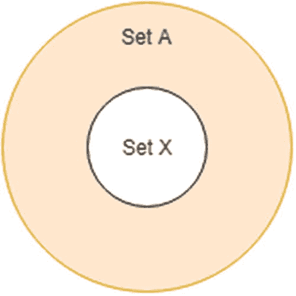

图 1-4

表示超集 `A` 和子集 `X` 的维恩图

### 超集

假设有两个集合 `A` 和 `X`。如果 `X` 中的所有元素都是 `A` 的一部分，那么 `A` 被称为 `X` 的*超集*。用 `A⊃X` 表示。在图 1-4 中，`A` 是 `X` 的超集。

### 幂集

假设有一个集合 `A`。一个包含 `A` 所有可能子集（包括空集）的集合被称为*幂集*。用 `P(A)` 表示。`A` 的幂集的基数为 `2|A|`。

例如：

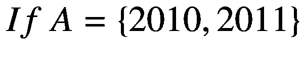

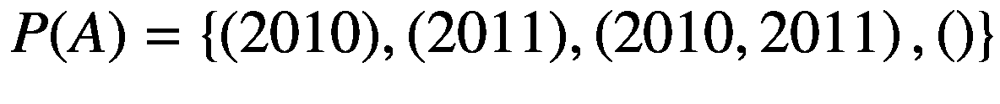

如你所见，`|A| = 2`，而 `|P(A)| = 4`。

### 可数集

*可数集*是指其中的每个元素都可以被标记上一个唯一的自然数。并且，当你完成元素标记时，要么还有剩余的自然数标签，要么你已经用完了所有自然数。因此，无限集也可能是可数的，但并非总是如此。

### 不可数集

*不可数集*是指对于其中的每个元素，你无法标记上一个唯一的自然数。这意味着，当你完成标签分配时，自然数列表已经用完了。例如，当你处理实数时，在完成实数集的标记之前，自然数列表早就用完了。

## 经典集合运算

本节介绍一些可以应用于经典集合的运算：

*   并集
*   交集
*   补集
*   差集

### 并集

两个集合的*并集*将两个集合中的值合并成一个单一的集合。

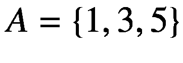

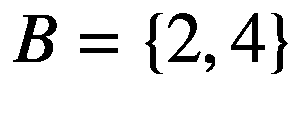

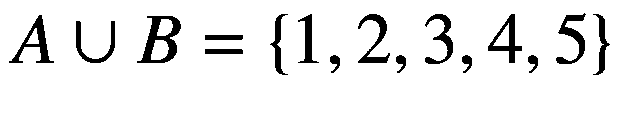

图 1-5 展示了集合 `A` 和 `B` 之间的并集。阴影区域表示并集部分。

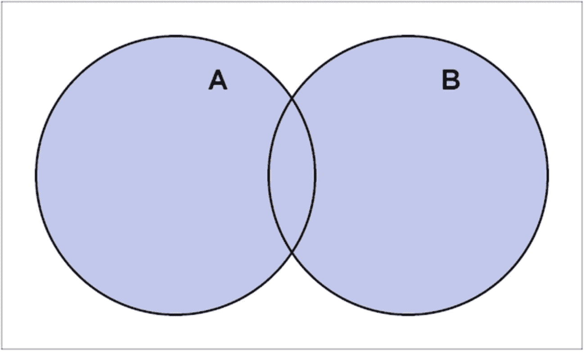

图 1-5

集合 `A` 和 `B` 的并集

### 交集

两个集合的*交集*找出两个集合中都存在的共同值，并将它们组成一个单一的集合。


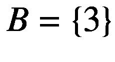

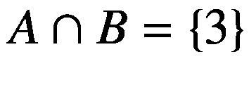

图 1-6 展示了集合 `A` 和 `B` 之间的交集。阴影区域表示交集部分。

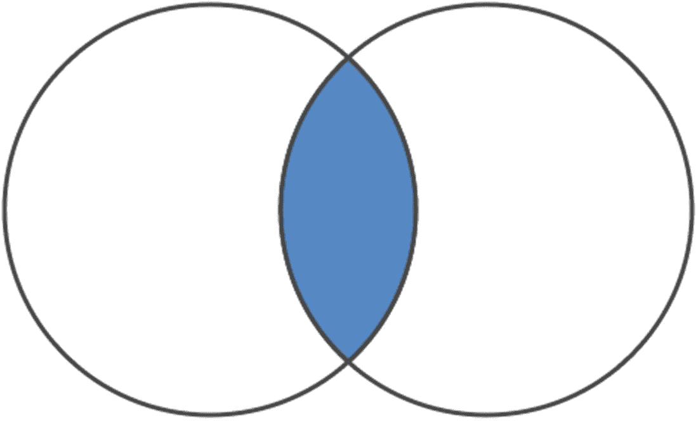

图 1-6

集合 `A` 和 `B` 的交集

### 补集

一个集合的*补集*是论域中除了该集合自身元素之外的所有值。


如果 `A` 是 `B` 的论域，那么 `A^c` 将是除了现有元素之外的所有值。即：


图 1-7 展示了集合 `A` 的补集。如果 `U` 是论域，那么阴影区域表示 `A` 的补集。

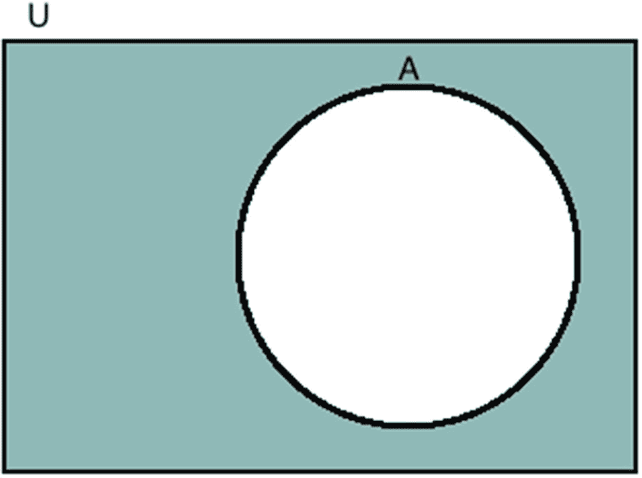

图 1-7

集合 `A` 的补集

### 差集

假设有两个集合 `A` 和 `B`，你需要找出它们之间的差集。所有不属于两个集合共同部分的那些值构成一个集合。这意味着集合 `A` 和 `B` 的差集是由那些只存在于 `A` 中但不在 `B` 中的元素组成的集合。


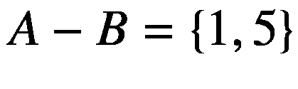

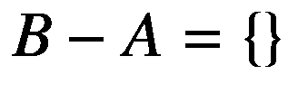

图 1-8 展示了一个表示集合 `A` 和 `B` 之间差集的维恩图。

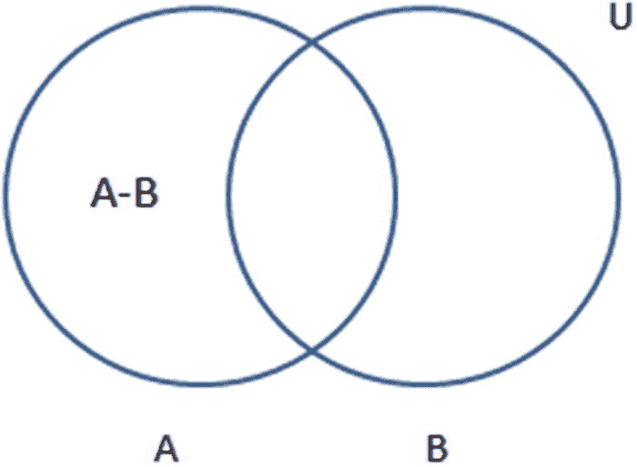

图 1-8

集合 `A` 和 `B` 的差集

以下是 Python 实现：

```
## 示例集合
A = {0, 2, 4, 6, 8}
B = {1, 2, 3, 4, 5}
### 上述集合的并集
print("并集 :", A | B)
### 上述集合的交集
print("交集 :", A & B)
### 上述集合的差集
print("差集 :", A - B)
```

## 经典集合的性质

本节讨论经典/清晰集合的以下性质：

*   交换律
*   结合律
*   分配律
*   幂等律
*   同一律
*   吸收律
*   对合律
*   传递律
*   排中律
*   矛盾律
*   德摩根定律

### 交换律

两个集合的并集或交集，无论你先列出哪个集合，结果都相同。这意味着你可以先取 `A` 或先取 `B`，但结果总是相同的。

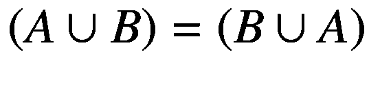

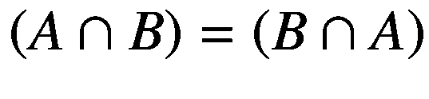

### 结合律

如果你有三个集合，结合律指出：前两个集合与第三个集合的并集或交集，等于后两个集合与第一个集合的并集或交集。

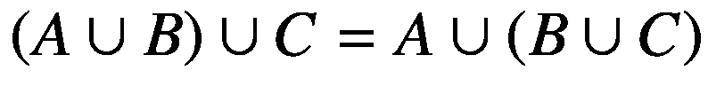


### 分配律

分配律指出，第一个集合与后两个集合交集的并集，等于第一个集合与第二个集合的并集、第一个集合与第三个集合的并集，然后再取这两个结果的交集。当交换并集和交集运算时，此规则同样适用。

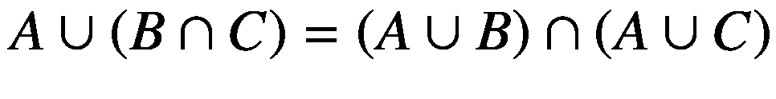

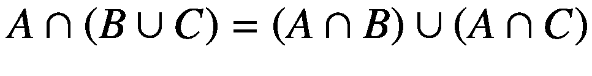

### 幂等律

幂等律指出，一个集合与自身进行交集或并集运算，结果仍是该集合本身。

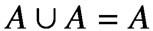

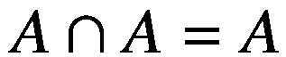

### 同一律

如果 `Φ` 是空集，`E` 是论域，那么同一律指出：

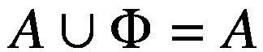

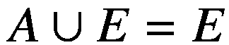

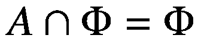

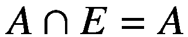

换句话说：

- 一个集合与空集的并集得到该集合本身
- 一个集合与空集的交集得到空集
- 一个集合与论域的并集得到论域
- 一个集合与论域的交集得到该集合本身

### 吸收律

如果 `A` 是 `B` 的子集，那么：

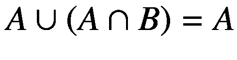

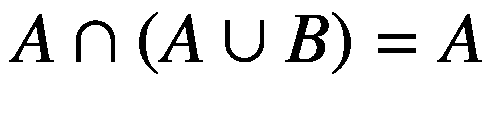

这意味着一个集合与其和另一个集合的交集进行并集运算，结果仍是该集合本身，反之亦然。

### 对合律

对合律指出，一个集合的双重补集等于该集合本身：

`(A^c)^c = A`

### 传递律

传递律指出，如果 `A` 是 `B` 的子集，且 `B` 是 `C` 的子集，那么 `A` 将是 `C` 的子集。

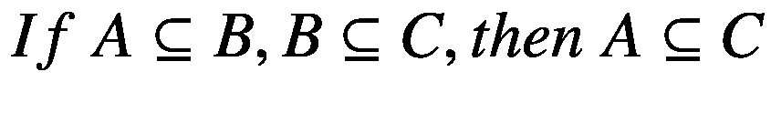

### 排中律

排中律指出，一个集合与其补集的并集等于其论域。

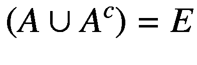

### 矛盾律

矛盾律指出，一个集合与其补集的交集是空集。

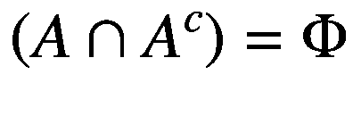

### 德摩根定律

如果有两个集合，求它们并集的补集，则等于这两个集合各自补集的交集。类似地，如果求这两个集合交集的补集，则等于这两个集合各自补集的并集。此规则称为德摩根定律。


## 模糊集合

经典集合涉及精确定义的值。这意味着论域被分为两组——成员和非成员。因此，你不能说任何成员具有部分隶属度。例如，当你踩刹车或松开刹车时，这些过程可以用 `1` 或 `0` 表示。

另一方面，对于模糊集合，你也可以有介于两者之间的值。因此，可以说模糊集合的隶属度介于 `0` 和 `1` 之间。例如，你可以有像 `{0, 0.3, 0.5, 0.7, 1}` 这样的值。`1` 表示完全刹车，`0.7` 表示稍微轻一点的刹车，`0.5` 表示一半压力，`0.3` 表示非常小的压力，`0` 表示没有压力。在现实世界中，你很少看到经典集合在起作用。你处理的是由模糊集合表示的值。

模糊集合有几个相关性质。接下来的章节将解释它们：

- 交换律
- 结合律
- 分配律
- 幂等律
- 同一律
- 对合律
- 传递律
- 德摩根定律

### 交换律

两个集合的并集或交集产生相同的结果，无论你先列出哪个集合。这意味着你可以先取 `A` 或先取 `B`，但结果总是相同的。

`(A ∪ B) = (B ∪ A)`

`(A ∩ B) = (B ∩ A)`

### 结合律

假设你有三个集合。结合律指出，前两个集合与第三个集合的并集或交集，等于后两个集合与第一个集合的并集或交集。

`(A ∪ B) ∪ C = A ∪ (B ∪ C)`

`(A ∩ B) ∩ C = A ∩ (B ∩ C)`

### 分配律

分配律指出，第一个集合与后两个集合交集的并集，等于第一个集合与第二个集合的并集、第一个集合与第三个集合的并集，然后再取这两个结果的交集。当交换并集和交集运算时，此规则同样适用。

`A ∪ (B ∩ C) = (A ∪ B) ∩ (A ∪ C)`

`A ∩ (B ∪ C) = (A ∩ B) ∪ (A ∩ C)`

### 幂等律

幂等律指出，一个集合与自身进行交集或并集运算，结果仍是该集合本身。

`A ∪ A = A`

`A ∩ A = A`

### 同一律

如果 `Φ` 是空集，`E` 是论域，那么同一律指出：

`A ∪ Φ = A`

`A ∪ E = E`

`A ∩ Φ = Φ`

`A ∩ E = A`

换句话说：

- 一个集合与空集的并集得到该集合本身
- 一个集合与空集的交集得到空集
- 一个集合与论域的并集得到论域
- 一个集合与论域的交集得到该集合本身

### 对合律

对合律指出，一个集合的双重补集得到该集合本身：

`(A^c)^c = A`

### 传递律

传递律指出，如果 `A` 是 `B` 的子集，且 `B` 是 `C` 的子集，那么 `A` 将是 `C` 的子集。

`If A ⊆ B, B ⊆ C, then A ⊆ C`

### 德摩根定律

如果有两个集合，求它们并集的补集，则等于这两个集合各自补集的交集。类似地，如果求这两个集合交集的补集，则等于这两个集合各自补集的并集。此规则称为德摩根定律。

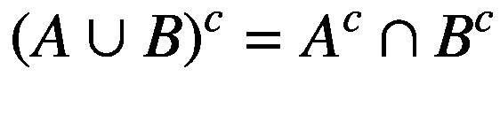

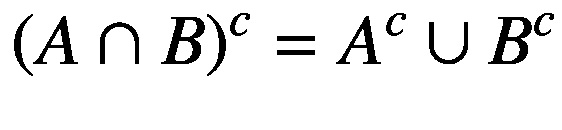

现在，在学习可以应用于模糊集合的运算之前，你需要理解隶属函数的概念。


## 隶属函数简介

在上一节中，你了解到每个元素可以映射到 0 到 1 之间的值，而不是只有 0 和 1 的清晰值。每个值被称为隶属*度*，并由一条曲线表示，该曲线描绘了一个称为*隶属函数*的函数。这个值被称为*隶属度值*。在图 1-9 中，你可以看到清晰集合与模糊集合之间的区别。

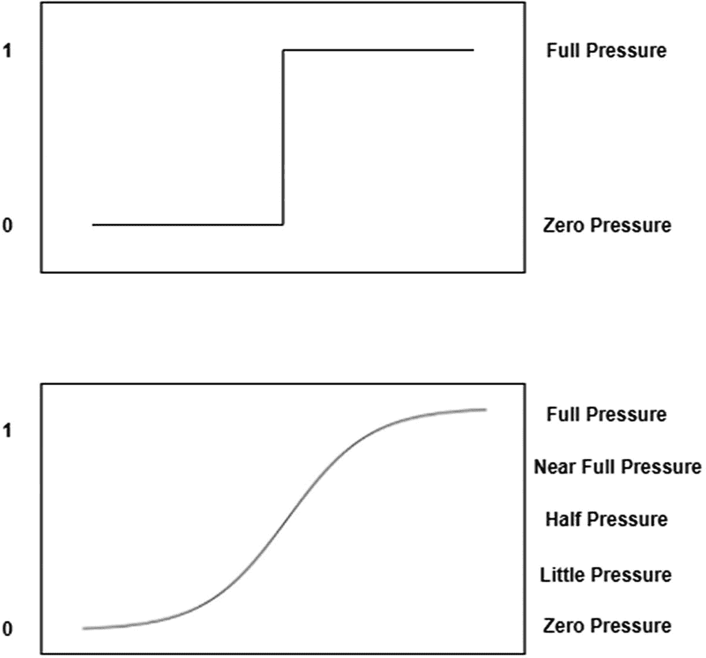

图 1-9

模糊集合与清晰集合表示法的区别

在清晰集合中，你只有两个值，用 0 和 1 表示，但在模糊集合中，存在一系列值，这些值取决于施加刹车的压力。表示这一范围的曲线就是隶属函数曲线。不同的压力会产生不同的隶属度值，这可以在隶属函数曲线中表示出来。

让我们更深入地了解一下隶属函数及其相关概念。

模糊集合是对经典集合的一种扩展和粗略简化。如果 `X` 是论域，其元素用 `x` 表示，那么 `X` 上的一个模糊集合 `A` 被定义为一组有序对。

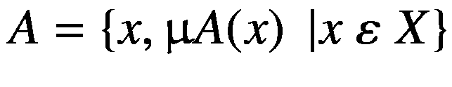

`μA` 被称为 `x` 在 `A` 中的隶属函数。隶属函数将 `X` 中的每个元素映射到 0 到 1 之间的一个隶属度值。隶属函数有多种类型，下一章将详细介绍。现在，我们先列出其中一些类型，并观察它们所代表的曲线。本示例使用了 `Scikit Fuzzy` 包，它包含多种方法和类，以便你有效地应用基本的模糊运算。你可以使用以下命令在 Python 环境中安装 `Scikit Fuzzy` 包：

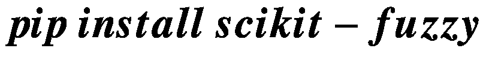

图 1-10 到 1-14 展示了不同类型的隶属函数及其所代表的曲线。

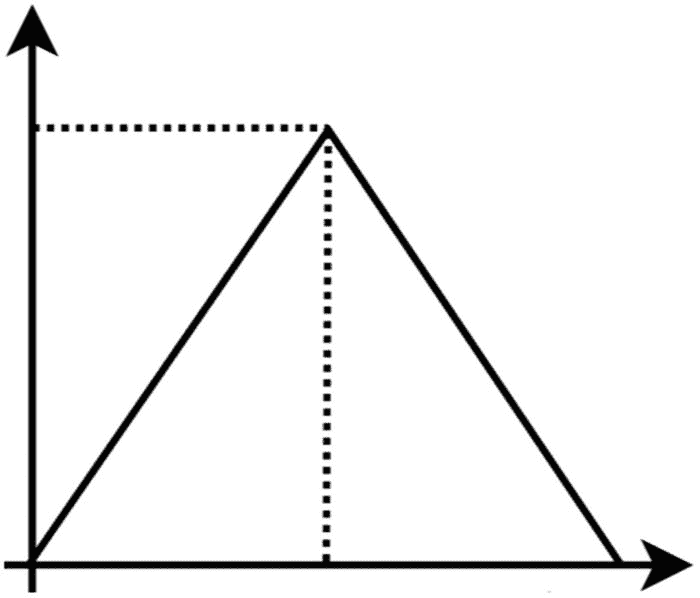

图 1-10

三角形隶属函数

图 1-10 中的图形表示一个三角形隶属函数，你可以使用 `skfuzzy` 包中的 `trimf` 方法来查找并绘制这些点。

以下是示例代码。下一章将详细讨论这个函数。

以下代码以一个例子为例，一个人走进餐厅并给服务员小费。为了给小费，服务质量从 0 到 10 进行评级。本示例目前只考虑服务质量，稍后将讨论实际的小费问题。

```
import numpy as np
import skfuzzy as sk
#定义小费质量的 Numpy 数组
x_qual = np.arange(0, 11, 1)
#定义三角形隶属函数的 Numpy 数组
qual_lo = sk.trimf(x_qual, [0, 0, 5])
```

图 1-11 中的图形表示一个梯形隶属函数，你可以使用 `skfuzzy` 包中的 `trapmf` 方法来查找并绘制这些点。

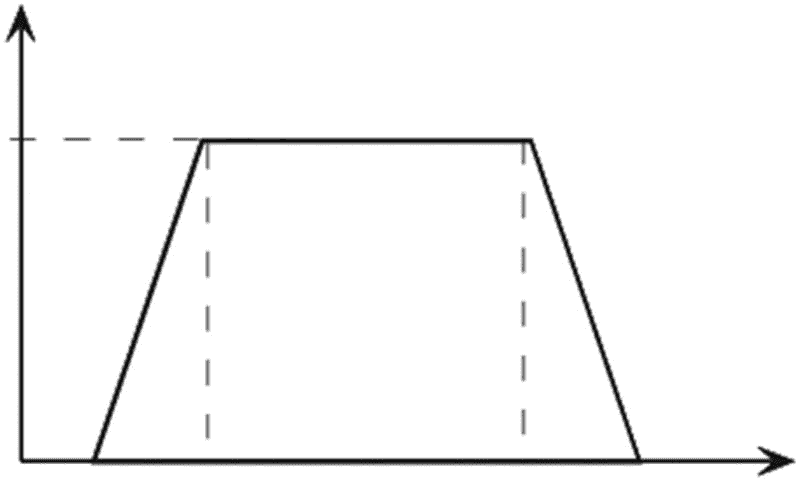

图 1-11

梯形隶属函数

以下是示例代码。

```
import numpy as np
import skfuzzy as sk
#定义小费质量的 Numpy 数组
x_qual = np.arange(0, 11, 1)
#定义梯形隶属函数的 Numpy 数组
qual_lo = sk.trapmf(x_qual, [0, 0, 5,5])
```

图 1-12 中的图形表示一个高斯隶属函数，你可以使用 `skfuzzy` 包中的 `gaussmf` 方法来查找并绘制这些点。

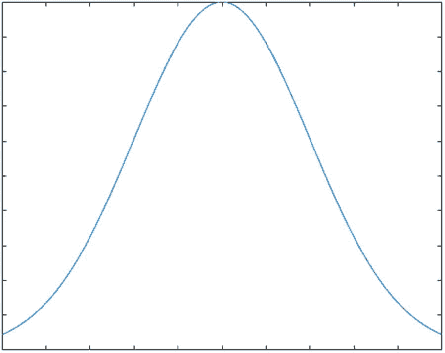

图 1-12

高斯隶属函数

以下是示例代码。

```
import numpy as np
import skfuzzy as sk
#定义小费质量的 Numpy 数组
x_qual = np.arange(0, 11, 1)
#定义高斯隶属函数的 Numpy 数组
qual_lo = sk.gaussmf(x_qual, np.mean(x_qual), np.std(x_qual))
```

图 1-13 中的图形表示一个广义钟形隶属函数，你可以使用 `skfuzzy` 包中的 `gbellmf` 方法来查找并绘制这些点。

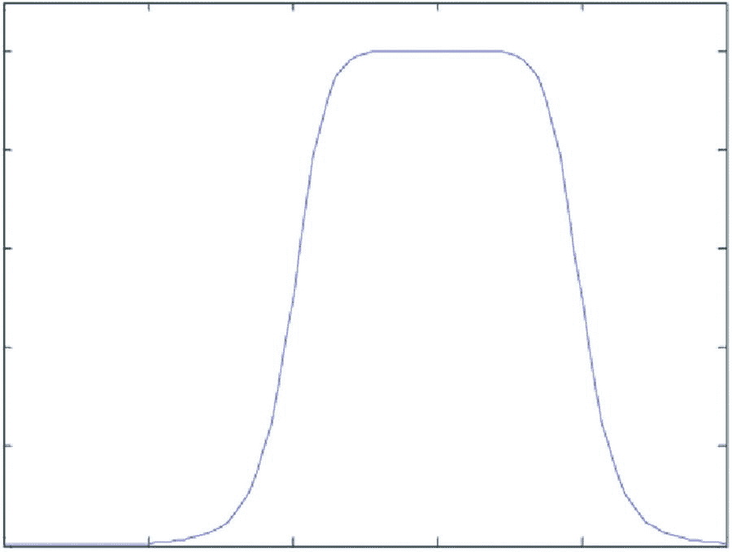

图 1-13

广义钟形隶属函数

以下是示例代码。

```
import numpy as np
import skfuzzy as sk
#定义小费质量的 Numpy 数组
x_qual = np.arange(0, 11, 1)
#定义广义钟形隶属函数的 Numpy 数组
qual_lo = sk.gbellmf(x_qual, 0.5, 0.5, 0.5)
```

图 1-14 中的图形表示一个 S 形隶属函数，你可以使用 `skfuzzy` 包中的 `sigmf` 方法来查找并绘制这些点。

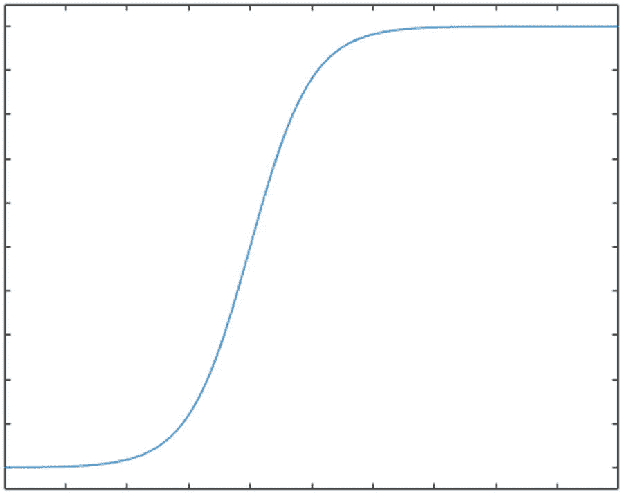

图 1-14

S 形隶属函数

以下是示例代码。

```
import numpy as np
import skfuzzy as sk
#定义小费质量的 Numpy 数组
x_qual = np.arange(0, 11, 1)
#定义 S 形隶属函数的 Numpy 数组
qual_lo = sk.sigmf(x_qual, 0.5,0.5)
```

后续章节将更详细地介绍所有这些函数。

## 模糊集合运算

现在你已经了解了隶属函数的概念，是时候看看可以对模糊集合进行的一些运算了。本节将讨论以下运算：

*   并集
*   交集
*   补集
*   乘积
*   相等
*   幂
*   差集
*   析取和

假设有两个模糊集合 `A` 和 `B`，其隶属度值分别为 `μA` 和 `μB`，其中 `X` 是论域。基于此信息，以下各节将详细讨论每个运算。

### 并集

两个模糊集合 `A` 和 `B` 的并集是一个新的模糊集合 `A ∪ B`，同样在 `X` 上，其隶属函数定义如下：

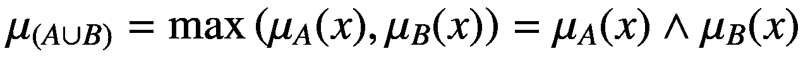

`∧` 被称为*最大值算子*。

以下是 Python 实现：

```
import skfuzzy as sk
import numpy as np
#定义小费质量的 Numpy 数组
x_qual = np.arange(0, 11, 1)
#定义两个隶属函数（三角形）的 Numpy 数组
qual_lo = sk.trimf(x_qual, [0, 0, 5])
qual_md = sk.trimf(x_qual, [0, 5, 10])
#求最大值（模糊或）
sk.fuzzy_or(x_qual,qual_lo,x_qual,qual_hi)
```

### 交集

模糊集合 `A` 和 `B` 的交集是一个新的模糊集合 `A ∩ B`，同样在 `X` 上，其隶属函数定义如下：

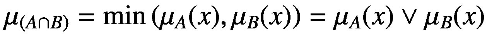

`∨` 被称为最小值算子。

以下是 Python 实现：

```
import skfuzzy as sk
import numpy as np
#定义小费质量的 Numpy 数组
x_qual = np.arange(0, 11, 1)
#定义两个隶属函数（三角形）的 Numpy 数组
qual_lo = sk.trimf(x_qual, [0, 0, 5])
qual_md = sk.trimf(x_qual, [0, 5, 10])
#求最小值（模糊与）
sk.fuzzy_and(x_qual,qual_lo,x_qual,qual_hi)
```


### 补集

模糊集合 `A` 的补集是一个新的模糊集合，其隶属度函数如下：

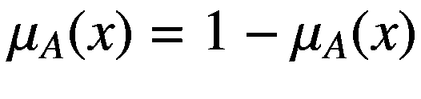

以下是 Python 实现：

```
import skfuzzy as sk
import numpy as np
#Defining the Numpy array for Tip Quality
x_qual = np.arange(0, 11, 1)
#Defining the Numpy array for two membership functions (Triangular)
qual_lo = sk.trimf(x_qual, [0, 0, 5])
qual_md = sk.trimf(x_qual, [0, 5, 10])
#Finding the Complement (Fuzzy NOT)
sk.fuzzy_not(qual_lo)
```

### 积

两个模糊集合 `A` 和 `B` 的积是一个新的模糊集合 `A.B`，其隶属度函数如下：

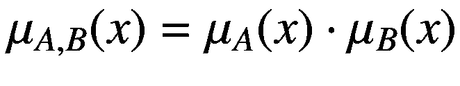

以下是 Python 实现：

```
import skfuzzy as sk
import numpy as np
#Defining the Numpy array for Tip Quality
x_qual = np.arange(0, 11, 1)
#Defining the Numpy array for two membership functions (Triangular)
qual_lo = sk.trimf(x_qual, [0, 0, 5])
qual_md = sk.trimf(x_qual, [0, 5, 10])
#Finding the Product (Fuzzy Cartesian)
sk.cartprod(qual_lo, qual_hi)
```

### 差

两个模糊集合 `A` 和 `B` 的差是一个新的模糊集合 `A-B`，定义如下：


以下是 Python 实现：

```
import skfuzzy as sk
import numpy as np
#Defining the Numpy array for Tip Quality
x_qual = np.arange(0, 11, 1)
#Defining the Numpy array for two membership functions (Triangular)
qual_lo = sk.trimf(x_qual, [0, 0, 5])
qual_md = sk.trimf(x_qual, [0, 5, 10])
#Finding the Difference (Fuzzy Subtract)
sk.fuzzy_sub(x_qual,qual_lo,x_qual,qual_hi)
```

### 对称差

对称差是一个新的模糊集合，定义如下：


### 幂

模糊集合 `A` 的 α 次幂是一个新的模糊集合 `Aα`，其隶属度函数如下：

![$$ {\mu_A}^{\alpha }(x)={\left[{\mu}_A(x)\right]}^{\alpha } $$](images/479940_1_En_1_Chapter/479940_1_En_1_Chapter_TeX_Equaw.png)

## 总结

本章讨论了经典/分明集合与模糊集合。你了解了它们之间的区别及其性质。你还了解了可以在模糊集合上执行的一些运算，以及 Python 实现。为了理解这些运算，你学习了隶属度函数的基础知识。

下一章将详细讨论模糊逻辑，并解释隶属度函数及其应用。

