# 2. 模糊规则与推理

前一章讨论了不同类型的集合，以及它们的性质和可以在其上执行的运算。你还了解了其中一些运算及其在 Python 中的应用。那一章最后简要介绍了不同类型的隶属度函数及其 Python 应用。

本章将详细讨论隶属度函数及其应用。你将了解它们多样的性质和运算。在理解它们的作用后，你将转向模糊关系。你将学习什么是模糊关系以及影响它的性质。

当你掌握了所有必要的基础知识后，最终将进入模糊逻辑的核心——模糊规则与推理。你将了解不同类型的规则及其适用方式。你将学习如何组合不同类型的规则，这将构成模糊推理。你还将看到这些概念在 Python 中的应用。

## 隶属度函数

隶属度函数表示一个元素在已定义的模糊集合中的真实程度。它们是曲线，定义了输入空间中的每个点如何映射到介于 0 和 1 之间的隶属度。通过一个例子，你可能会更好地理解这一点。

假设你想评价某家餐厅的服务。你可能会按以下方式评价服务：

*   极好
*   一般
*   最差

在经典集合中，这可以表示如下：


这可以被编码并表示为 `X = {}`，其中 `2` 代表*极好*，`1` 代表*一般*，`0` 代表*最差*。

但你可能不想只用这三种方式来评价餐厅。你需要不同的方式让顾客表达他们的感受。因此，你可以添加这些评价等级：

*   极好
*   很棒
*   好
*   一般
*   还行
*   差
*   最差

如果你再次使用经典集合，它将包含大量代码。相反，你可以定义一个函数，其中每个评价等级都有一个特定的值。这个函数将允许你超越这些等级。这个函数有一个上限和一个下限。例如，考虑 sigmoid 函数（你将在本章后面详细了解所有隶属度函数）。sigmoid 函数的上限为 1，下限为 0。这意味着所有评价类别都将有一个值，该值将落在该曲线上的某个点（见图 2-1）。

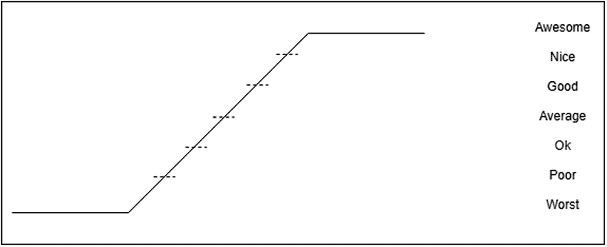

图 2-1

显示所有评价点作为特定值的曲线

观察这条曲线，你可以将分明集合重新定义为一个值介于 0 和 1 之间的模糊集合。现在，如果一个人给出一个评价，该评价的值（隶属度值）可以从曲线中获取。这就是我们所说的隶属度函数表示一个元素的真实程度。你可以在这个例子中看到，每个评价都有一个值，该值说明了它的真实程度。

### 隶属度函数的正式定义

你可以使用模糊符号为所有评价示例写出一个正式定义。

假设你有一个包含三个元素的模糊集合 `A`：

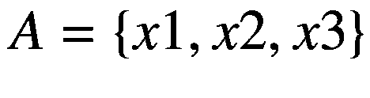

所有三个元素都将有一个与之关联的隶属度函数值，该值将定义它们的真实程度。它可以如下表示：

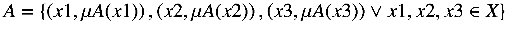

隶属度值越高，元素在集合中的归属程度或真实程度就越高。模糊集合中每个元素都获得一个与之关联的隶属度值的过程称为*模糊化*。现在你可以扩展隶属度函数值的正式表示法。

如果 `μA` 是元素的隶属度值，并且如果 `μA` 等于 `1`，我们说 `x` 完全存在于模糊集合 `A` 中，或者它具有完全隶属关系。如果 `μA` 等于 `0`，则它不是 `A` 的一部分，或者它没有隶属关系。介于 `0` 和 `1` 之间的任何值都定义了其隶属度，这可以称为部分隶属关系。

### 与模糊隶属度函数相关的术语

为了更详细地理解模糊隶属度函数，你必须首先了解一些与之相关的术语。这份术语列表将帮助你更好地理解隶属度函数的应用。

*   支撑集
*   核
*   边界
*   交叉点
*   正态性
*   模糊单点集
*   `α`– 截集
*   强 `α`– 截集
*   凸性
*   带宽
*   对称性
*   左开
*   右开
*   闭集


#### 支撑集

模糊集隶属函数的支撑集定义为论域中属于集合 A 且隶属度非零的区域。它是所有隶属度值大于 0 的点的集合，如图 2-2 所示。数学上可表示为：

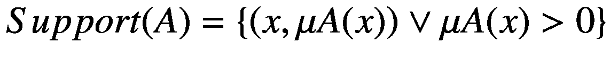

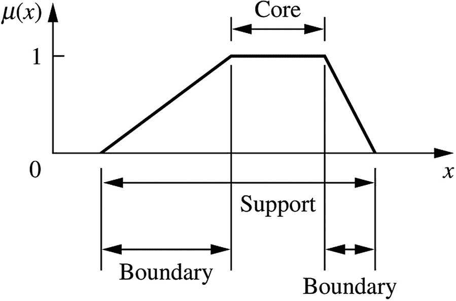

图 2-2

支撑集、核与边界

#### 核

模糊集隶属函数的核定义为论域中完全且彻底属于集合 A 的区域。它是所有隶属度值等于 1 的点的集合，如图 2-2 所示。数学上可表示为：

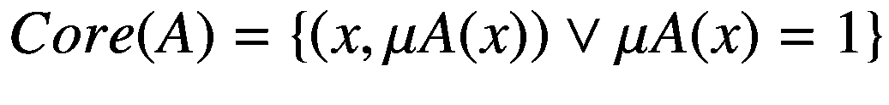

#### 边界

模糊集隶属函数的边界定义为论域中元素隶属度非零但不完全属于集合 A 的区域。它是所有隶属度值大于 0 但小于 1 的点的集合，如图 2-2 所示。数学上可表示为：

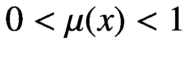

#### 交叉点

隶属函数的交叉点定义为论域中模糊集隶属度值等于 0.5 的元素。所有隶属度值等于 0.5 的点的集合称为模糊集 A 的交叉点：

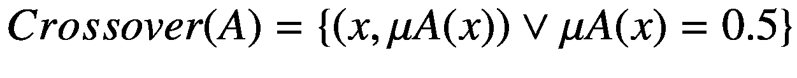

#### 正态性

一个正态模糊集是指其隶属函数在论域中至少存在一个元素`x`，其隶属度值为 1（见图 2-3）。换句话说，如果找到某个集合的核且该核非空，则称该模糊集 A 是正态的：

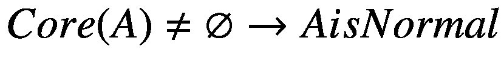

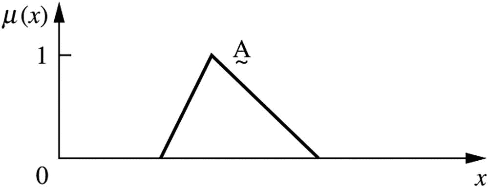

图 2-3

模糊集的正态性

#### 模糊单点集

如果一个模糊集仅有一个点，且其隶属度值为 1，则称之为模糊单点集：

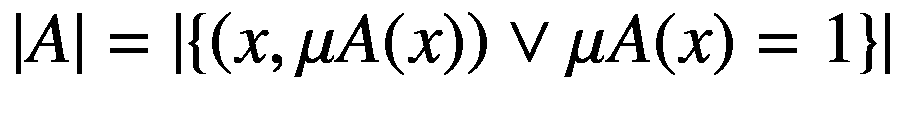

#### *α*– 截集

模糊集 A 的 alpha 截集是包含所有隶属度值大于或等于 alpha 的值的集合：

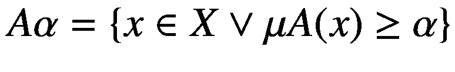

#### 强 *α*– 截集

模糊集 A 的强 alpha 截集是包含所有隶属度值大于 alpha 的值的集合：

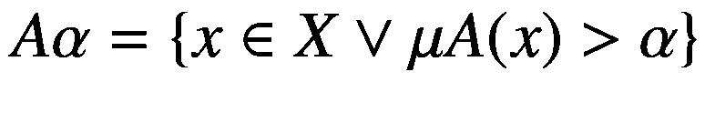

#### 凸性

一个凸模糊集由其隶属函数描述，该隶属函数的值要么严格单调递增，要么严格单调递减，要么先严格单调递增后严格单调递减，且随着论域中元素值的增加而变化。简而言之，当且仅当一个模糊集满足以下规则时，它被称为凸集：

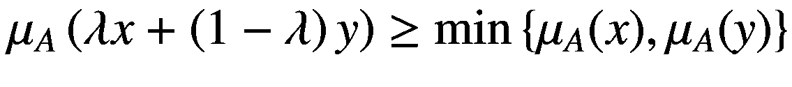

#### 带宽

如果有一个集合 A 是正态且凸的，并且找到其交叉点集并选取两个不同的点，则这两点之间的距离称为带宽集。简单来说，对于一个正态且凸的模糊集，带宽定义为两个不同交叉点之间的距离：

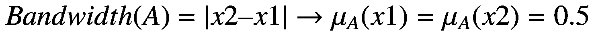

#### 对称性

如果模糊集 A 的隶属函数在点 c 处满足以下条件，则称其为对称集（见图 2-4）。

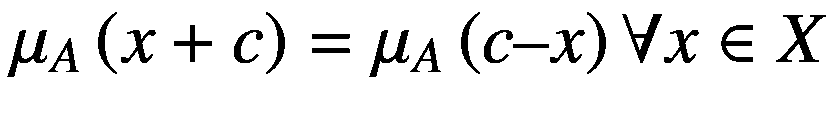

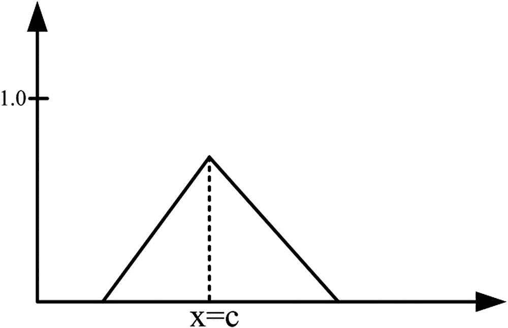

图 2-4

模糊集的对称性

#### 左开

如果一个模糊集满足以下条件，则它是左开的（见图 2-5）：

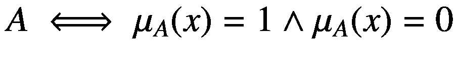

#### 右开

如果一个模糊集满足以下条件，则它是右开的（见图 2-5）：

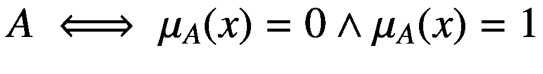

#### 闭集

如果一个模糊集满足以下条件，则它是闭集（见图 2-5）：

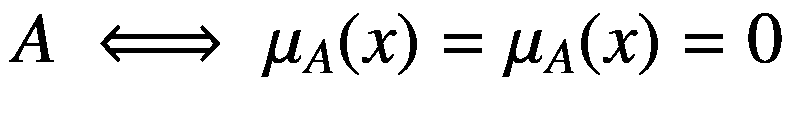

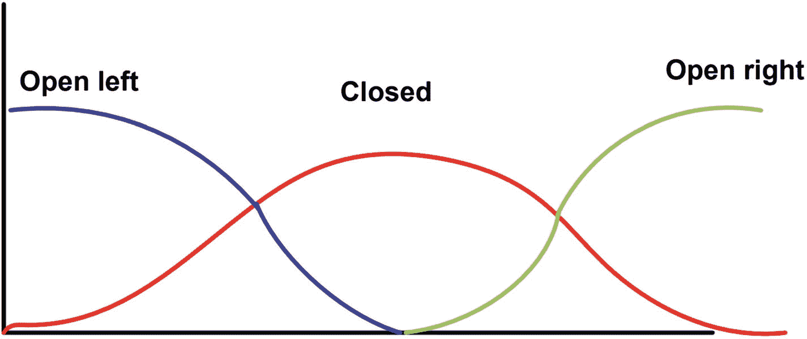

图 2-5

左开集、闭集与右开集

## 隶属函数的类型

第一章简要介绍了不同类型的隶属函数。本节将详细讨论它们。隶属函数用于定义问题陈述中存在的模糊性。这意味着不必用离散数字来表示样本空间中的所有值。有时一个成员可以是一个小数，代表其隶属程度。

例如，考虑足球中的点球概念。用离散术语来说，踢球可以是 1（全力踢）或 0（不踢）。在现实生活中，情况并非如此。踢球的速度不仅取决于射门者的心态，还取决于对守门员移动方向的预判。

在这种情况下，射门者决定踢球的速度以及瞄准的方向。速度也不能仅由 0 和 1 这两个离散值来定义。速度范围从 0 到 1；0 表示无速度，1 表示全速。假设射门者想要瞄准球门柱的右上角。在这种情况下，主要的决策是找到最准确的速度，使球能够完美地旋转。太快球会飞出球门柱，而太慢则可能帮助守门员预判方向或阻止球正常旋转。因此，射门者可能不会选择 1，而是从模糊集中选择 0.7，他认为这是踢球的最佳速度。模糊集中的这个概念由隶属函数来表示。

下一节将讨论所使用的不同类型的隶属函数。


### 三角形隶属函数

正如三角形有三个顶点，三角形隶属函数也有三个参数：`a`、`b` 和 `c`。

- `a` 是下边界
- `b` 是中心点
- `c` 是上边界

以下公式描述了三角形隶属函数：

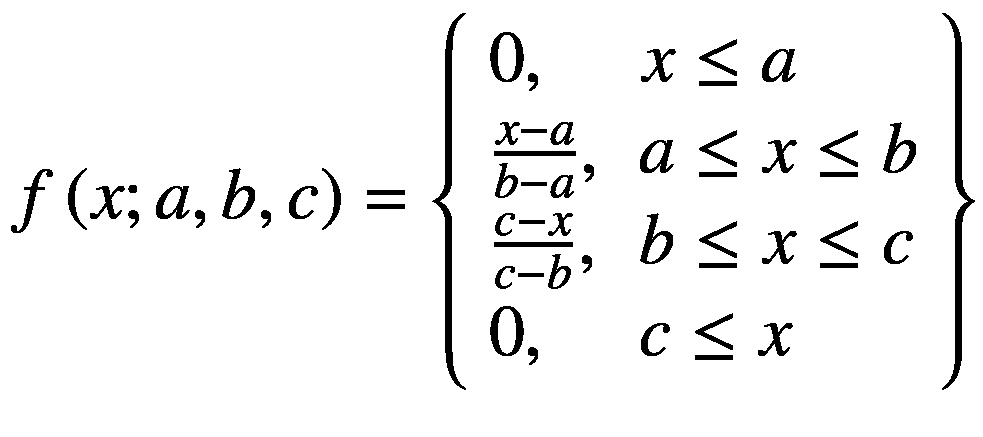

或者，也可以表示为：

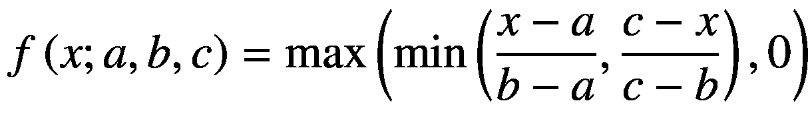

你可以通过一个例子来理解三角形隶属函数。这个例子将三角形隶属函数应用于足球场景。假设射手可以踢四种点球：

- 全速直线球
- 中速弧线球
- 慢速直线球
- 中速左侧球

平均而言，射手踢点球的最高速度为 80 英里/小时。因此，你无法说这个速度是慢的。所以，你给 80 英里/小时分配 0% 的隶属度。类似地，60 英里/小时的速度可以被认为是 70% 的快和 30% 的中等。同样，你可以为不同的速度分配不同的隶属度。

如果你使用三角形隶属函数，它包含三个界限：下界、全隶属界和上界。下界和上界的隶属度为 0%，而全隶属界的值为 100%。其余的值呈线性变化。你可以为这些类别分配以下三角形隶属函数：

- 全速为 `[60, 80, 80]`
- 中速为 `[40, 50, 70]`
- 慢速为 `[20, 20, 45]`
- 中速左侧为 `[50, 60, 80]`

例如，如果你将“中速”的三角形隶属函数定义为 `[40, 50, 70]`，那么在 40 英里/小时时隶属度为 0%，在 50 英里/小时时线性增加到 100%，然后在 70 英里/小时时线性下降到 0%。以下 Python 代码展示了这些三角形隶属函数的执行过程。图 2-6 显示了结果。

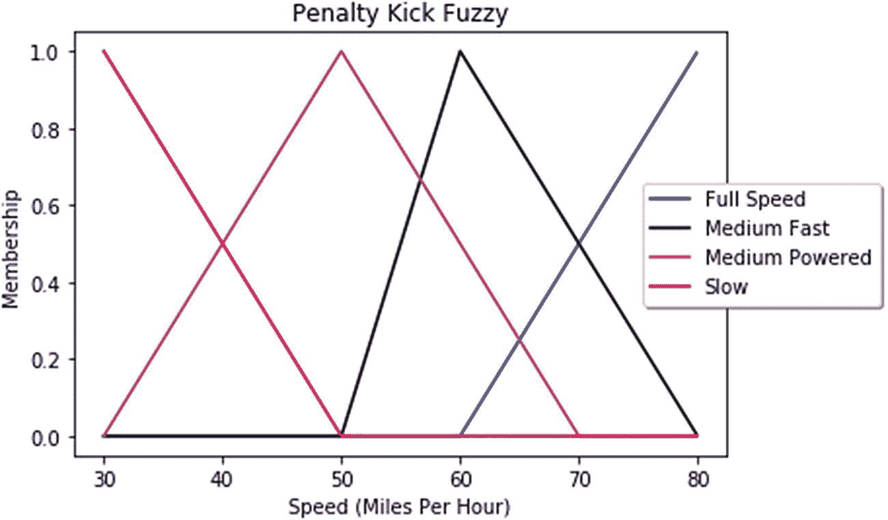

**图 2-6** 足球示例的三角形隶属度

```
#Importing Necessary Packages
import numpy as np
import skfuzzy as fuzz
import matplotlib.pyplot as plt
%matplotlib inline
#Defining the Fuzzy Range from a speed of 30 to 90
x = np.arange(30, 80, 0.1)
#Defining the triangular membership functions
slow = fuzz.trimf(x, [30, 30, 50])
medium = fuzz.trimf(x, [30, 50, 70])
medium_fast = fuzz.trimf(x, [50, 60, 80])
full_speed = fuzz.trimf(x, [60, 80, 80])
#Plotting the Membership Functions Defined
plt.figure()
plt.plot(x, full_speed, 'b', linewidth=1.5, label='Full Speed')
plt.plot(x, medium_fast, 'k', linewidth=1.5, label='Medium Fast')
plt.plot(x, medium, 'm', linewidth=1.5, label='Medium Powered')
plt.plot(x, slow, 'r', linewidth=1.5, label="Slow")
plt.title('Penalty Kick Fuzzy')
plt.ylabel('Membership')
plt.xlabel("Speed (Miles Per Hour)")
plt.legend(loc='center right', bbox_to_anchor=(1.25, 0.5), ncol=1, fancybox=True, shadow=True)
```

### 梯形隶属函数

梯形有四个顶点，因此隶属函数也有四个坐标值：`a`、`b`、`c` 和 `d`，对应一个清晰值 `x`。但是，请记住这条规则：

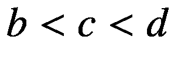

你可以用以下公式描述该函数：

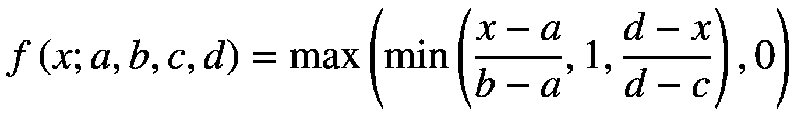

这个公式可以用多个分界点展开：

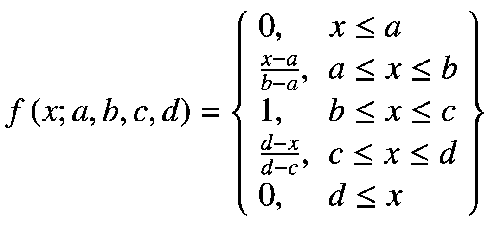

在梯形隶属函数中，你需要提供四个点。以足球示例来说，你需要根据特定类别提供一个范围。在这个隶属函数中，隶属度从 0% 在中心区域达到 100%，然后再次下降到 0%。与三角形隶属函数的三个点不同，这里有四个点。这将对足球示例应用梯形隶属函数，其类别定义如下：

- 全速为 `[60, 80, 80, 90]`
- 中速为 `[30, 50, 50, 70]`
- 慢速为 `[20, 30, 30, 50]`
- 中速左侧为 `[50, 60, 60, 80]`

以下是 Python 实现；结果如图 2-7 所示。

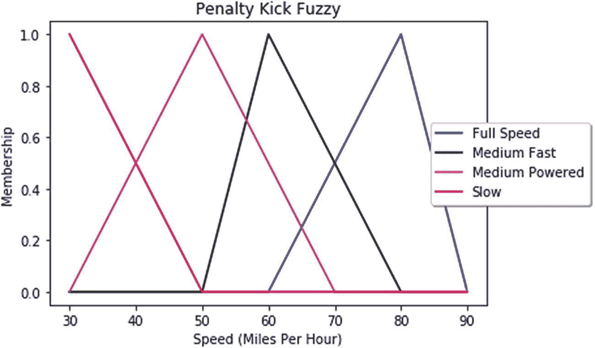

**图 2-7** 足球示例的梯形隶属度

```
#Importing Necessary Packages
import numpy as np
import skfuzzy as fuzz
import matplotlib.pyplot as plt
%matplotlib inline
#Defining the Fuzzy Range from a speed of 30 to 90
x = np.arange(30, 90, 0.1)
#Defining the trapezoidal membership functions
slow = fuzz.trapmf(x, [20, 30, 30, 50])
medium = fuzz.trapmf(x, [30, 50, 50, 70])
medium_fast = fuzz.trapmf(x, [50, 60, 60, 80])
full_speed = fuzz.trapmf(x, [60, 80, 80, 90])
#Plotting the Membership Functions Defined
plt.figure()
plt.plot(x, full_speed, 'b', linewidth=1.5, label='Full Speed')
plt.plot(x, medium_fast, 'k', linewidth=1.5, label='Medium Fast')
plt.plot(x, medium, 'm', linewidth=1.5, label='Medium Powered')
plt.plot(x, slow, 'r', linewidth=1.5, label="Slow")
plt.title('Penalty Kick Fuzzy')
plt.ylabel('Membership')
plt.xlabel("Speed (Miles Per Hour)")
plt.legend(loc='center right', bbox_to_anchor=(1.25, 0.5), ncol=1, fancybox=True, shadow=True)
```


### 高斯隶属函数

当你已知清晰值的均值和标准差，并且希望同时考虑可自定义的模糊化因子时，可以使用高斯隶属函数。它们可以用以下方程表示：

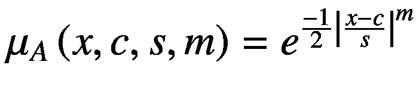

其中，`c` 和 `s` 分别代表均值和标准差，`m` 代表模糊化因子。

将高斯隶属函数应用于足球示例时，你会发现数值的表示效果更好，且插值曲线平滑。你可以按如下方式定义各类别的高斯隶属度：

-   全速的均值为 80 英里/小时，标准差为 4
-   中速的均值为 50 英里/小时，标准差为 4
-   慢速的均值为 30 英里/小时，标准差为 4
-   中高速的均值为 60 英里/小时，标准差为 4

你可以随时调整标准差。以下是使用高斯隶属函数的足球示例的 Python 实现。图 2-8 展示了结果。

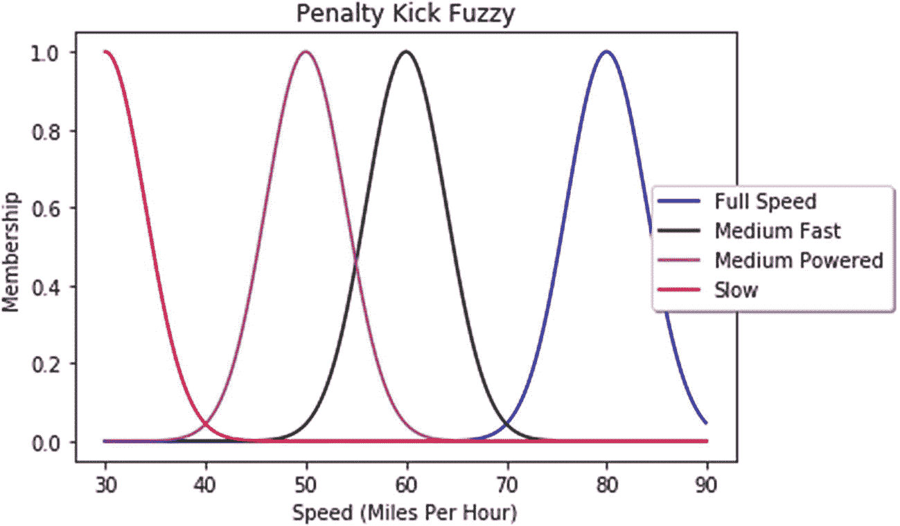

**图 2-8** 足球示例的高斯隶属度

```
#Importing Necessary Packages
import numpy as np
import skfuzzy as fuzz
import matplotlib.pyplot as plt
%matplotlib inline
#Defining the Fuzzy Range from a speed of 30 to 90
x = np.arange(30, 90, 0.1)
#Defining the gaussian membership functions
full_speed = fuzz.gaussmf(x, 80, 4)
medium_fast = fuzz.gaussmf(x, 60, 4)
medium = fuzz.gaussmf(x, 50, 4)
slow = fuzz.gaussmf(x, 30, 4)
#Plotting the Membership Functions Defined
plt.figure()
plt.plot(x, full_speed, 'b', linewidth=1.5, label='Full Speed')
plt.plot(x, medium_fast, 'k', linewidth=1.5, label='Medium Fast')
plt.plot(x, medium, 'm', linewidth=1.5, label='Medium Powered')
plt.plot(x, slow, 'r', linewidth=1.5, label="Slow")
plt.title('Penalty Kick Fuzzy')
plt.ylabel('Membership')
plt.xlabel("Speed (Miles Per Hour)")
plt.legend(loc='center right', bbox_to_anchor=(1.25, 0.5), ncol=1, fancybox=True, shadow=True)
```

### 广义钟形隶属函数

广义钟形隶属函数考虑了三个参数：

-   斜率
-   中心
-   曲线的宽度

它由以下方程表示：

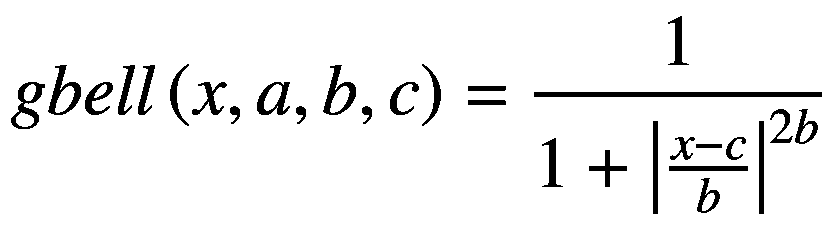

其中，`a` 代表宽度，`b` 代表斜率，`c` 代表中心。

如果用广义钟形函数解决足球示例，你将得到以下隶属函数：

-   全速的中心为 80 英里/小时，宽度和斜率分别为 8 和 4
-   中速的中心为 50 英里/小时，宽度和斜率分别为 8 和 4
-   慢速的中心为 30 英里/小时，宽度和斜率分别为 8 和 4
-   中高速的中心为 60 英里/小时，宽度和斜率分别为 8 和 4

```
#Importing Necessary Packages
import numpy as np
import skfuzzy as fuzz
import matplotlib.pyplot as plt
%matplotlib inline
#Defining the Fuzzy Range from a speed of 30 to 90
x = np.arange(30, 90, 0.1)
#Defining the generalized bell membership functions
full_speed = fuzz.gbellmf(x, 8,4,80)
medium_fast = fuzz.gbellmf(x, 8,4,60)
medium = fuzz.gbellmf(x, 8,4,50)
slow = fuzz.gbellmf(x, 8,4,30)
#Plotting the Membership Functions Defined
plt.figure()
plt.plot(x, full_speed, 'b', linewidth=1.5, label='Full Speed')
plt.plot(x, medium_fast, 'k', linewidth=1.5, label='Medium Fast')
plt.plot(x, medium, 'm', linewidth=1.5, label='Medium Powered')
plt.plot(x, slow, 'r', linewidth=1.5, label="Slow")
plt.title('Penalty Kick Fuzzy')
plt.ylabel('Membership')
plt.xlabel("Speed (Miles Per Hour)")
plt.legend(loc='center right', bbox_to_anchor=(1.25, 0.5), ncol=1, fancybox=True, shadow=True)
```

图 2-9 展示了结果。

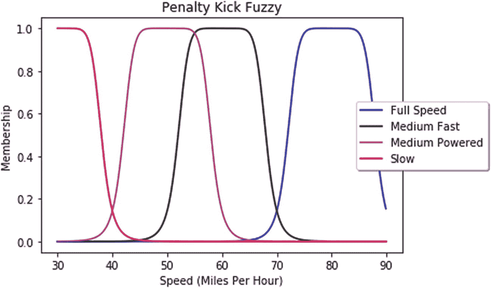

**图 2-9** 足球示例的广义钟形隶属度

### S 形隶属函数

这是最广泛使用的隶属函数之一，尤其在神经网络领域。其公式如下：

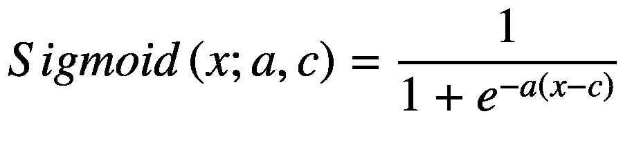

其中，`a` 代表斜率，`c` 代表交叉点。

当你遇到需要处理极高或极低值的特定情况时，可以使用 S 形隶属函数作为目标函数。

你必须提供两个点，其中最重要的点是 `c` 点（交叉点），它代表中心。因此，对于足球示例，使用 S 形隶属函数重新定义类别如下：

-   全速的交叉点为 80 英里/小时，斜率为 2
-   中速的交叉点为 50 英里/小时，斜率为 2
-   慢速的交叉点为 30 英里/小时，斜率为 2
-   中高速的交叉点为 60 英里/小时，斜率为 2

以下是 Python 实现。

```
#Importing Necessary Packages
import numpy as np
import skfuzzy as fuzz
import matplotlib.pyplot as plt
%matplotlib inline
#Defining the Fuzzy Range from a speed of 30 to 90
x = np.arange(30, 90, 0.1)
#Defining the sigmoidal membership functions
full_speed = fuzz.sigmf(x, 80,2)
medium_fast = fuzz.sigmf(x, 60,2)
medium = fuzz.sigmf(x, 50,2)
slow = fuzz.sigmf(x, 30,2)
#Plotting the Membership Functions Defined
plt.figure()
plt.plot(x, full_speed, 'b', linewidth=1.5, label='Full Speed')
plt.plot(x, medium_fast, 'k', linewidth=1.5, label='Medium Fast')
plt.plot(x, medium, 'm', linewidth=1.5, label='Medium Powered')
plt.plot(x, slow, 'r', linewidth=1.5, label="Slow")
plt.title('Penalty Kick Fuzzy')
plt.ylabel('Membership')
plt.xlabel("Speed (Miles Per Hour)")
plt.legend(loc='center right', bbox_to_anchor=(1.25, 0.5), ncol=1, fancybox=True, shadow=True)
```

图 2-10 展示了结果。

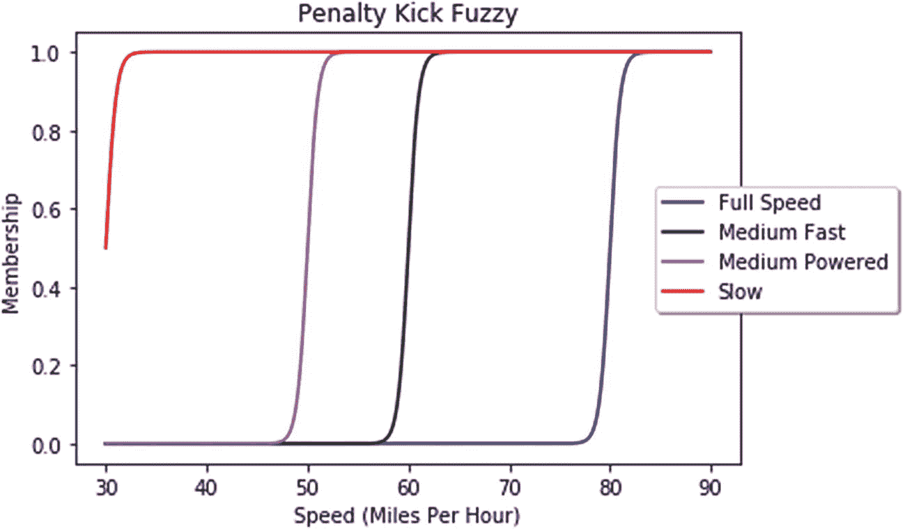

**图 2-10** 足球示例的 S 形隶属度

关于使用哪种隶属函数，一直存在争议。没有唯一的最佳答案，但你可以采用以下方法之一：

-   观察数据的分布，例如借助直方图。如果无法从可视化中推断出模式，最好使用三角形或梯形隶属函数。否则，根据分布形状使用其他函数。
-   从简单的隶属函数（如三角形或梯形）开始解决问题。如果它们能提供良好的结果，那就万事大吉。否则，转向其他函数，尤其是高斯函数。大多数情况下，高斯隶属函数会给你带来最佳结果。
-   在你想要比较的隶属函数上训练模型。之后，使用诸如 MAPE（平均绝对百分比误差）之类的指标比较结果。误差最低的方法就是最佳模型。

### 多项式隶属函数

多项式隶属函数主要由三种类型构成：

-   Z 形
-   S 形
-   Π 形

这些函数根据其曲线形状命名。它们也被称为基于样条的隶属函数。所有三种隶属函数的方程将在以下章节中解释。


### Z 形

在此隶属函数中，点 `a` 和 `b` 代表曲线的极端部分。它是一个向左开口的非对称多项式曲线。图 2-11 展示了一个 Z 形隶属函数，其后是其方程。

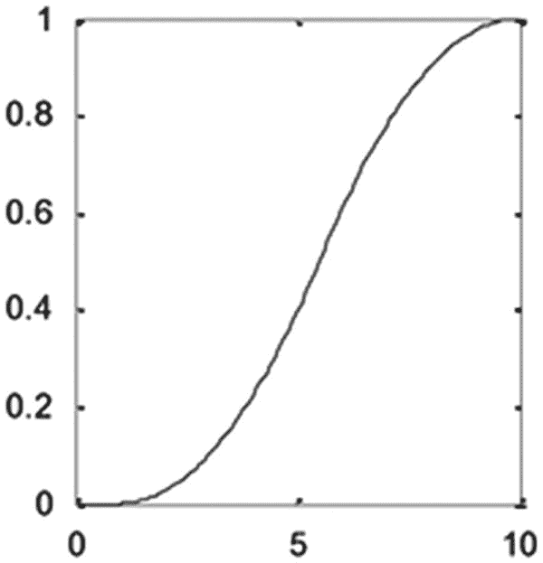

图 2-11

Z 形隶属函数

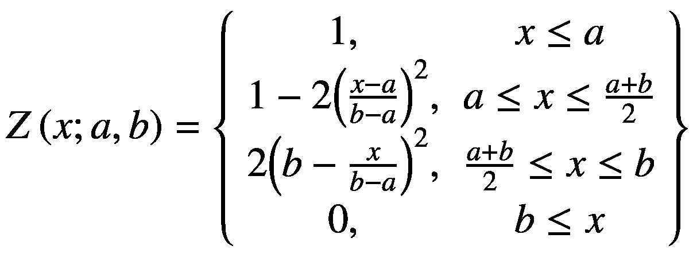

继续以足球为例，将为 Z 形隶属函数定义以下类别（见图 2-12）：

- 全速在 80 英里/小时处开始下降，直至 60 英里/小时
- 中快速在 60 英里/小时处开始下降，直至 50 英里/小时
- 中速在 50 英里/小时处开始下降，直至 30 英里/小时
- 慢速在 30 英里/小时处开始下降，直至 20 英里/小时

Python 代码如下：


图 2-12

足球示例的 Z 形隶属函数

```
#Importing Necessary Packages
import numpy as np
import skfuzzy as fuzz
import matplotlib.pyplot as plt
%matplotlib inline
#Defining the Fuzzy Range from a speed of 30 to 90
x = np.arange(30, 90, 0.1)
#Defining the z-shaped membership functions
full_speed = fuzz.smf(x, 60,80)
medium_fast = fuzz.smf(x, 50,60)
medium = fuzz.smf(x, 30,50)
slow = fuzz.smf(x, 20,30)
#Plotting the Membership Functions Defined
plt.figure()
plt.plot(x, full_speed, 'b', linewidth=1.5, label='Full Speed')
plt.plot(x, medium_fast, 'k', linewidth=1.5, label='Medium Fast')
plt.plot(x, medium, 'm', linewidth=1.5, label='Medium Powered')
plt.plot(x, slow, 'r', linewidth=1.5, label="Slow")
plt.title('Penalty Kick Fuzzy')
plt.ylabel('Membership')
plt.xlabel("Speed (Miles Per Hour)")
plt.legend(loc='center right', bbox_to_anchor=(1.25, 0.5), ncol=1, fancybox=True, shadow=True)
```

### S 形

在此隶属函数中，点 `a` 和 `b` 代表曲线的极端部分。它是 Z 形隶属函数的镜像，向右开口。图 2-13 展示了一个 S 形隶属函数，其后是其方程。

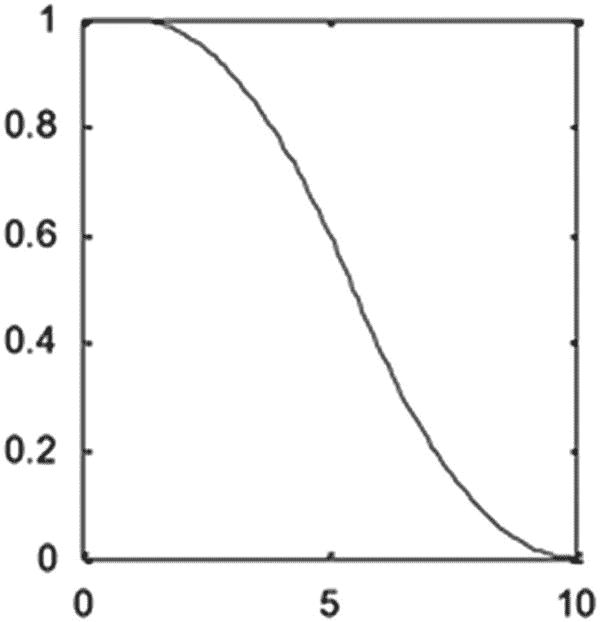

图 2-13

S 形隶属函数

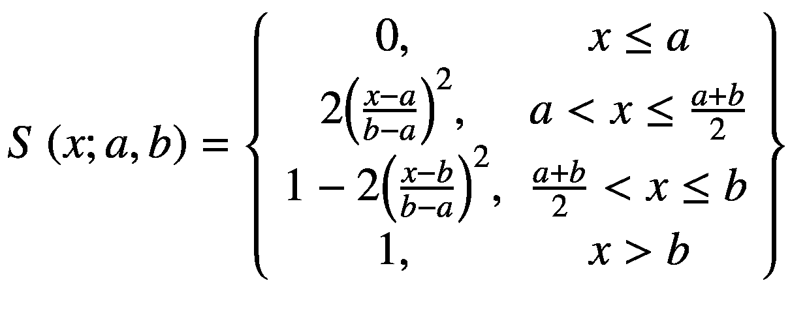

在足球示例中，将为 S 形隶属函数定义以下类别（见图 2-14）：

- 全速在 60 英里/小时处开始上升，直至 80 英里/小时
- 中快速在 50 英里/小时处开始上升，直至 60 英里/小时
- 中速在 30 英里/小时处开始上升，直至 50 英里/小时
- 慢速在 20 英里/小时处开始上升，直至 30 英里/小时

Python 代码如下：

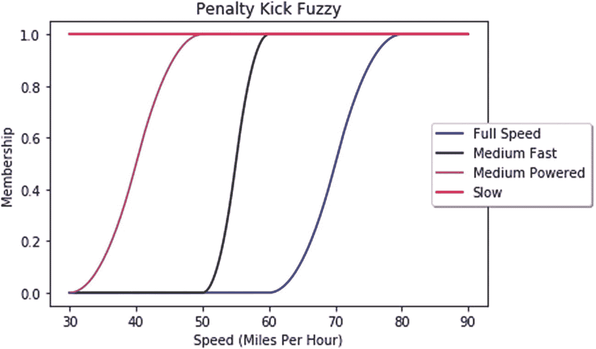

图 2-14

足球示例的 S 形隶属函数

```
#Importing Necessary Packages
import numpy as np
import skfuzzy as fuzz
import matplotlib.pyplot as plt
%matplotlib inline
#Defining the Fuzzy Range from a speed of 30 to 90
x = np.arange(30, 90, 0.1)
#Defining the s-shaped membership functions
full_speed = fuzz.zmf(x, 60,80)
medium_fast = fuzz.zmf(x, 50,60)
medium = fuzz.zmf(x, 30,50)
slow = fuzz.zmf(x, 20,30)
#Plotting the Membership Functions Defined
plt.figure()
plt.plot(x, full_speed, 'b', linewidth=1.5, label='Full Speed')
plt.plot(x, medium_fast, 'k', linewidth=1.5, label='Medium Fast')
plt.plot(x, medium, 'm', linewidth=1.5, label='Medium Powered')
plt.plot(x, slow, 'r', linewidth=1.5, label="Slow")
plt.title('Penalty Kick Fuzzy')
plt.ylabel('Membership')
plt.xlabel("Speed (Miles Per Hour)")
plt.legend(loc='center right', bbox_to_anchor=(1.25, 0.5), ncol=1, fancybox=True, shadow=True)
```

### Π 形

Π 形曲线有四个参数。参数 `a` 和 `d` 表示曲线的底部，而 `b` 和 `c` 表示肩部。该曲线可以定义为 Z 形和 S 形隶属函数的乘积。它在两端具有零值，中间部分上升。图 2-15 展示了一个 Π 形隶属函数，其后是其方程。

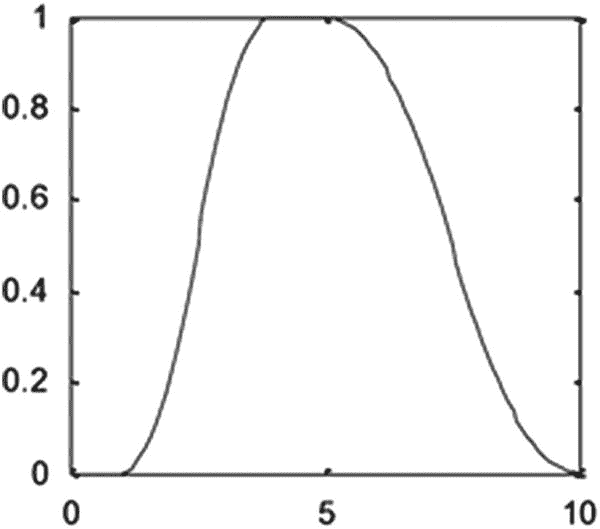

图 2-15

Π 形隶属函数


将为 Z 形隶属函数定义以下类别（见图 2-16）：

- 全速的底部点定义为 [60mph, 100mph]，肩部点定义为 [70mph, 80mph]
- 中快速的底部点定义为 [50mph, 80mph]，肩部点定义为 [55mph, 60mph]
- 中速的底部点定义为 [30mph, 60mph]，肩部点定义为 [45mph, 50mph]
- 慢速的底部点定义为 [60mph, 100mph]，肩部点定义为 [70mph, 80mph]

Python 代码如下：

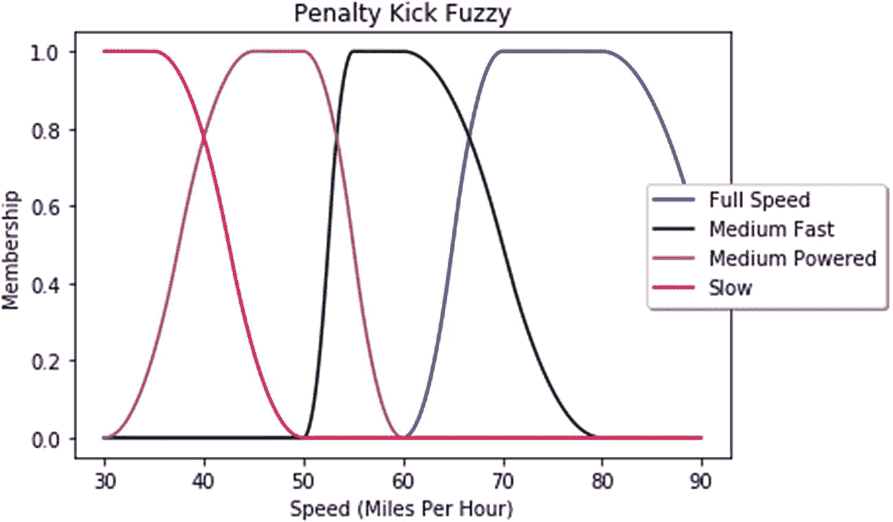

图 2-16

足球示例的 Π 形隶属函数

```
#Importing Necessary Packages
import numpy as np
import skfuzzy as fuzz
import matplotlib.pyplot as plt
%matplotlib inline
#Defining the Fuzzy Range from a speed of 30 to 90
x = np.arange(30, 90, 0.1)
#Defining the pi-shaped membership functions
full_speed = fuzz.pimf(x, 60,70,80,100)
medium_fast = fuzz.pimf(x, 50,55,60,80)
medium = fuzz.pimf(x, 30,45,50,60)
slow = fuzz.pimf(x, 20,25,35,50)
#Plotting the Membership Functions Defined
plt.figure()
plt.plot(x, full_speed, 'b', linewidth=1.5, label='Full Speed')
plt.plot(x, medium_fast, 'k', linewidth=1.5, label='Medium Fast')
plt.plot(x, medium, 'm', linewidth=1.5, label='Medium Powered')
plt.plot(x, slow, 'r', linewidth=1.5, label="Slow")
plt.title('Penalty Kick Fuzzy')
plt.ylabel('Membership')
plt.xlabel("Speed (Miles Per Hour)")
plt.legend(loc='center right', bbox_to_anchor=(1.25, 0.5), ncol=1, fancybox=True, shadow=True)
```


## 复合与非复合隶属函数

模糊集的投影与柱状扩展是当你想要将一维隶属函数扩展为二维隶属函数时所使用的概念。这些概念将在下一节关于模糊关系的部分中讨论。应用这些概念之一后，你会得到一个二维隶属函数。该隶属函数可分为两种类型：

- 复合隶属函数
- 非复合隶属函数

一个二维隶属函数，如果能够分解为两个单一隶属函数，则称为复合隶属函数。否则，称为非复合隶属函数。

例如，假设你有一个如下定义的隶属函数：

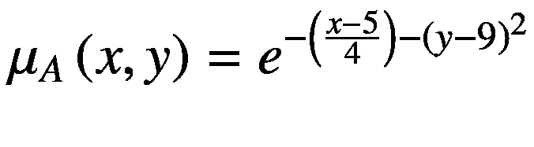

这个方程可以分解为两部分：

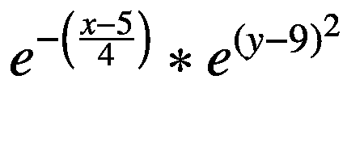

仔细观察，它们不过是两个高斯隶属函数。因此，你可以将它们重写如下：

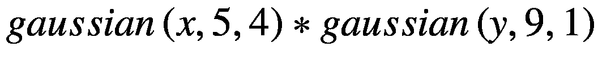

由于你已成功将二维隶属函数分解为一维隶属函数，因此这是一个复合隶属函数。

但考虑以下方程：

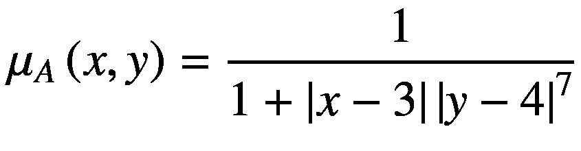

在这种情况下，你将无法分解它。因此，它是一个非复合隶属函数。

## 模糊关系

正如你在上一章所学，存在不同类型的集合——清晰集和模糊集。当你试图确定两个或多个集合之间的关系时，所使用的术语是*关系*，具体到模糊集，这被称为*模糊关系*。

假设有两个模糊集 *X*、*Y*，它们都属于实数域，并且是论域的一部分。

模糊关系 *X* × *Y* 将具有由该集合定义的关系：

R = {(*x*, *y*), *μ*[*R*] ∨ (*x*, *y*) ∈ *X* × *Y*}

为了以矩阵格式表示这种关系，请考虑以下示例。

假设：

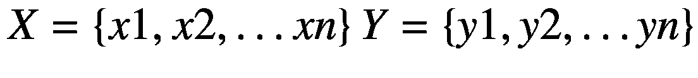

模糊关系 R 将由以下矩阵表示：


让我们通过一个例子来理解这个概念。

假设：

*X* = {1, 2, 3} 且 *Y* = {1, 2}

如果两者之间的隶属函数由下式给出：

*μR*(*x*, *y*) = 1/1+ e^(-(x-y))

使用这两个公式，你可以将关系 R 定义为：

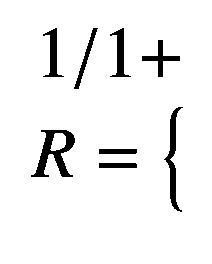e^(-(1-1))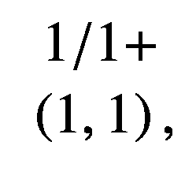e^(-(1-2))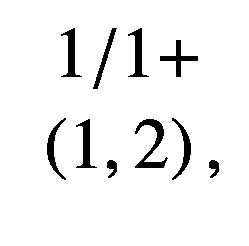e^(-(2-1))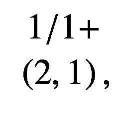e^(-(2-2))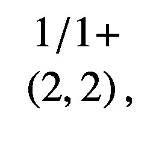 e^(-(3-1))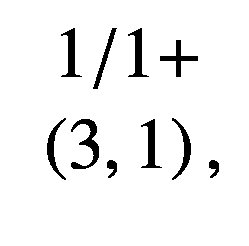e^(-(3-2))(3, 2)}

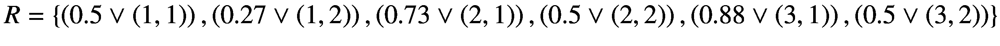

如果你想用矩阵格式表示这个关系，你会得到以下矩阵：

![$$ \left[\mathrm{0.500.270.730.500.880.50}\right] $$](images/479940_1_En_2_Chapter/479940_1_En_2_Chapter_TeX_Equai.png)

现在你知道了什么是模糊关系。下一节将探讨它的一些性质。

### 模糊关系的性质

本节讨论模糊关系的以下性质：

- 投影
- 柱状扩展
- 自反关系
- 反自反关系
- 对称关系
- 反对称关系
- 传递关系
- 相似关系
- 反相似关系
- 弱相似关系
- 序关系
- 预序关系
- 半序关系

#### 模糊关系的投影

由于清晰关系定义在两个或多个集合的乘积空间中，因此提出了*投影*的概念。假设你有一个由以下矩阵表示的模糊关系：

R = [0.10.20.40.20.40.80.40.81]

这与你在上一节中得到的矩阵相同，其中列代表 X 集合的元素，行代表 Y 集合的元素。单个值是隶属函数的值。现在，如果你想将这个关系投影到 X 或 Y 上，可以定义如下：


当你将两个投影应用于此矩阵时，会得到以下结果：

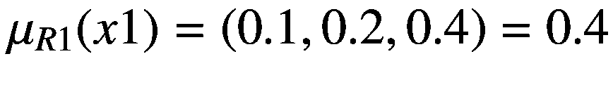

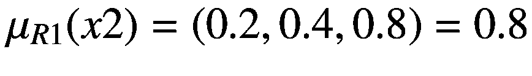

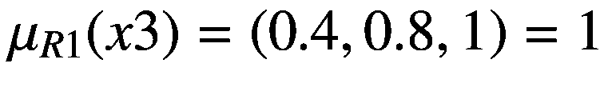

因此，R[1] 变为：

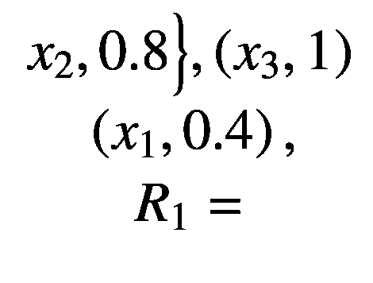

类似地，你可以得到 R2 的值如下：

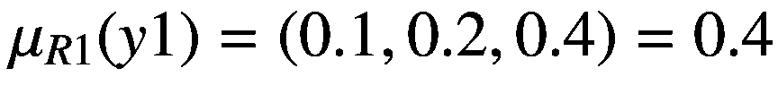

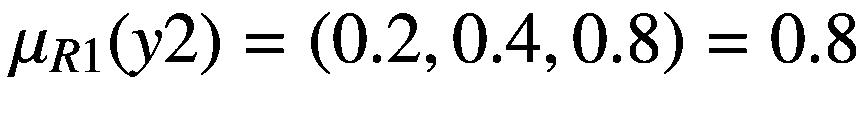

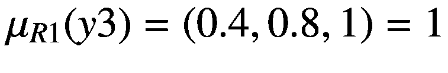

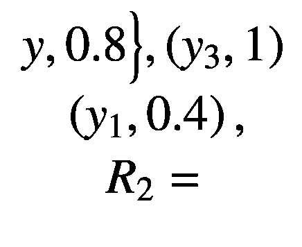

请记住，对于投影到 X 上，你进行逐行比较。但对于投影到 Y 上，你进行逐列比较。


### 模糊关系的柱状扩展

一旦你得到了关系在两个集合上的投影，你就可以直接用隶属度值重新填充原始矩阵的值。这被称为模糊关系的柱状扩展。其表示如下：

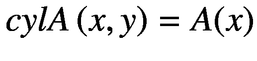

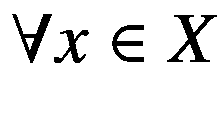

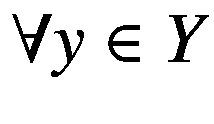

通过扩展前面的例子，你可以更好地理解这一点。

你已经得到了 `R[1]` 和 `R[2]` 的值。现在，你只需用组合后的值重新定义矩阵：

`R[1]` = ![$$ \left[\begin{array}{c}\mathrm{0.40.4}\\ {}\mathrm{0.80.8}\\ {}11\end{array}\right] $$](images/479940_1_En_2_Chapter/479940_1_En_2_Chapter_TeX_IEq7.png)

`R[2]` = ![$$ \left[\begin{array}{c}\mathrm{0.40.4}\\ {}\mathrm{0.80.8}\\ {}11\end{array}\right] $$](images/479940_1_En_2_Chapter/479940_1_En_2_Chapter_TeX_IEq8.png)

### 自反关系

如果两个相同集合之间的模糊关系是 `R`，并且对于每个相同值的组合，其隶属度函数值都为 1，那么这种关系被称为*自反关系*。因此，如果 `R` 是一个模糊关系，当满足以下条件时，它就是自反的：

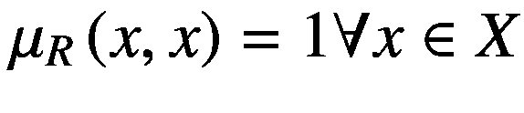

例如，如果 `X = {1,2,3,4}`，那么关系 `R` 将等于：

`R` = ![$$ \left[\begin{array}{c}\mathrm{10.90.60.2}\\ {}\mathrm{0.910.70.3}\\ {}\mathrm{0.60.710.9}\\ {}\mathrm{0.20.30.91}\end{array}\right] $$](images/479940_1_En_2_Chapter/479940_1_En_2_Chapter_TeX_IEq9.png)

如你所见，这个矩阵的对角线都是 1，证明它是一个自反关系。

### 反自反关系

如果两个相同集合之间的模糊关系是 `R`，并且对于每个相同值的组合，其隶属度函数值都为 0，那么这种关系被称为*反自反关系*。其表示如下：

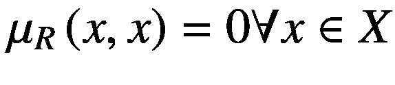

例如，如果 `X = {1,2,3}`，那么关系 `R` 将等于：

`R` = ![$$ \left[\begin{array}{c}000.6\\ {}0.300\\ {}00.30\end{array}\right] $$](images/479940_1_En_2_Chapter/479940_1_En_2_Chapter_TeX_IEq10.png)

如你所见，这个矩阵的对角线都是 0，证明它是一个反自反关系。

### 对称关系

如果你有一个模糊集合的两个或多个成员 `x`、`y` 属于同一个集合 `X`，并且 `x` 和 `y` 之间关系的隶属度函数值与 `y` 和 `x` 之间关系的隶属度函数值相同，那么这种关系被称为对称关系。

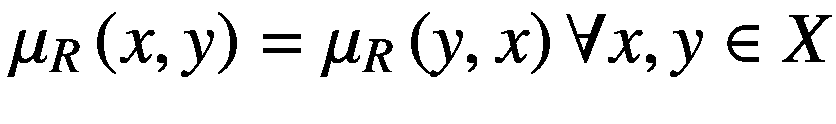

例如，如果 `X = {1,2,3}`，那么：

如果 `R` = ![$$ \left[\begin{array}{c}\mathrm{0.80.10.7}\\ {}\mathrm{0.110.6}\\ {}\mathrm{0.70.60.5}\end{array}\right] $$](images/479940_1_En_2_Chapter/479940_1_En_2_Chapter_TeX_IEq11.png)

这是一个对称关系，因为 `μR(x, y)` 和 `μR(y, x)` 具有相同的值。

### 反对称关系

如果你有一个模糊集合的两个或多个成员 `x`、`y` 属于同一个集合 `X`，并且 `x` 和 `y` 之间关系的隶属度函数值大于 0，而 `y` 和 `x` 之间关系的隶属度函数值为 0，那么这种关系被称为反对称关系。

如果 `μR(x, y) > 0`，则 `μR(y, x) = 0`，`∀x, y ∈ X`，且 `x ≠ y`。

例如：

如果 `R` = ![$$ \left[\begin{array}{c}000.7\\ {}0.100\\ {}00.60\end{array}\right] $$](images/479940_1_En_2_Chapter/479940_1_En_2_Chapter_TeX_IEq12.png)

这是一个反对称关系，因为当 `μR(x, y) > 0` 时，`μR(y, x) = 0`。

### 传递关系

一个模糊关系是传递的，如果满足：

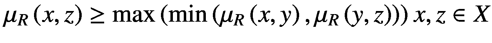

这意味着你首先需要使用最大-最小方法求出 `R²` 的值，然后检查它是否并不总是小于或等于 `R` 的原始隶属度矩阵。如果它不满足，则该等式是传递的。

假设你有一个如下的关系矩阵：

`R` = ![$$ \left[\begin{array}{c}\mathrm{0.70.90.4}\\ {}\mathrm{0.10.30.5}\\ {}\mathrm{0.20.10}\end{array}\right] $$](images/479940_1_En_2_Chapter/479940_1_En_2_Chapter_TeX_IEq13.png)

第一步是求出 `R²` 的值。为此，你需要使用以下步骤：

`R.R` = ![$$ \left[\begin{array}{c}\mathrm{0.70.90.4}\\ {}\mathrm{0.10.30.5}\\ {}\mathrm{0.20.10}\end{array}\right]\bullet \left[\begin{array}{c}\mathrm{0.70.90.4}\\ {}\mathrm{0.10.30.5}\\ {}\mathrm{0.20.10}\end{array}\right] $$](images/479940_1_En_2_Chapter/479940_1_En_2_Chapter_TeX_IEq14.png)

= ![$$ \left[\begin{array}{c}\mathit{\max}\left\{\mathit{\min}\left(0.7,0.7\right)\mathit{\min}\left(0.9,0.1\right)\mathit{\min}\left(0.4,0.2\right)\right\}\mathit{\max}\left\{\mathit{\min}\left(0.7,0.9\right)\mathit{\min}\left(0.9,0.3\right)\mathit{\min}\left(0.4,0.1\right)\right\}\mathit{\max}\left\{\mathit{\min}\left(0.7,0.4\right)\mathit{\min}\left(0.9,0.5\right)\mathit{\min}\left(0.4,0\right)\right\}\\ {}\mathit{\max}\left\{\mathit{\min}\left(0.1,0.7\right)\mathit{\min}\left(0.3,0.1\right)\mathit{\min}\left(0.5,0.2\right)\right\}\mathit{\max}\left\{\mathit{\min}\left(0.1,0.9\right)\mathit{\min}\left(0.3,0.3\right)\mathit{\min}\left(0.5,0.1\right)\right\}\mathit{\max}\left\{\mathit{\min}\left(0.1,0.4\right)\mathit{\min}\left(0.3,0.5\right)\mathit{\min}\left(0.5,0\right)\right\}\\ {}\mathit{\max}\left\{\mathit{\min}\left(0.2,0.7\right)\mathit{\min}\left(0.1,0.1\right)\mathit{\min}\left(0,0.2\right)\right\}\mathit{\max}\left\{\mathit{\min}\left(0.2,0.9\right)\mathit{\min}\left(0.1,0.3\right)\mathit{\min}\left(0,0.1\right)\right\}\mathit{\max}\left\{\mathit{\min}\left(0.2,0.4\right)\mathit{\min}\left(0.1,0.5\right)\mathit{\min}\left(0,0\right)\right\}\end{array}\right] $$](images/479940_1_En_2_Chapter/479940_1_En_2_Chapter_TeX_IEq15.png)

应用最大-最小合成，你得到以下矩阵：

`R²` = ![$$ \left[\begin{array}{c}\mathrm{0.70.70.5}\\ {}\mathrm{0.10.30.5}\\ {}\mathrm{0.20.10}\end{array}\right] $$](images/479940_1_En_2_Chapter/479940_1_En_2_Chapter_TeX_IEq16.png)

你可以看到，这些值有时大于原始矩阵。因此，该矩阵不是传递的。

### 相似关系

如果有两个模糊集合，它们同时满足自反、对称和传递关系，那么这种关系就是*相似关系*。

`R` = ![$$ \left[\begin{array}{c}\mathrm{10.210.60.20.6}\\ {}\mathrm{0.210.20.20.80.2}\\ {}\mathrm{10.210.60.20.6}\\ {}\mathrm{0.60.20.610.20.8}\\ {}\mathrm{0.20.80.20.210.2}\\ {}\mathrm{0.60.20.60.80.21}\end{array}\right] $$](images/479940_1_En_2_Chapter/479940_1_En_2_Chapter_TeX_IEq17.png)

这个关系是一个相似关系，因为：

- `μR(x, x) = 1`

这证明了该关系是自反的。

- `μR(x, y) = μR(y, x)`

这证明了该关系是对称的。

- `μR(x, z) ≥ ((μR(x, y), μR(y, z)))`, `x, y, z ∈ X`

这证明了该关系是传递的。

由于它遵循所有这些原则，因此它是一个相似关系。


### 反相似关系

相似关系的补集即为反相似关系。因此，可以将其表示为：

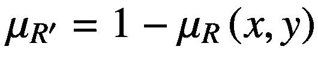

假设：

如果 `R` = ![$$ \left[\begin{array}{c}\mathrm{10.10.7}\\ {}\mathrm{0.110.7}\\ {}\mathrm{0.70.71}\end{array}\right] $$](images/479940_1_En_2_Chapter/479940_1_En_2_Chapter_TeX_IEq18.png)

![$$ {\mu}_{R^{\prime }}\left(x,y\right)=1-\left[\begin{array}{c}\mathrm{10.10.7}\\ {}\mathrm{0.110.7}\\ {}\mathrm{0.70.71}\end{array}\right] $$](images/479940_1_En_2_Chapter/479940_1_En_2_Chapter_TeX_Equ2.png)

这等于以下矩阵：

![$$ \left[\begin{array}{c}\mathrm{00.90.3}\\ {}\mathrm{0.900.3}\\ {}\mathrm{0.30.30}\end{array}\right] $$](images/479940_1_En_2_Chapter/479940_1_En_2_Chapter_TeX_Equba.png)

可以说该关系是反自反、对称且传递的。因此，`R` 是一个反相似关系。

### 弱相似关系

如果一个关系是自反且对称的，但不具有传递性，则该关系称为弱相似关系。

如果 `R` = ![$$ \left[\begin{array}{c}\mathrm{10.10.80.20.30.1}\\ {}\mathrm{100.310.80}\\ {}\mathrm{10.700.20.30.7}\\ {}\mathrm{10.60.3100.61}\end{array}\right] $$](images/479940_1_En_2_Chapter/479940_1_En_2_Chapter_TeX_IEq19.png)

当你应用自反、对称和传递关系的规则时，可以发现它满足前两条，但不满足传递关系性质。因此，可以说它是一个弱相似关系。

### 半序关系

在讨论半序关系之前，必须先了解弱反对称关系的含义。这种模糊关系遵循以下规则：

如果

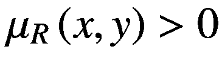

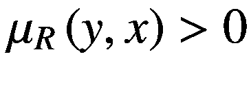

那么

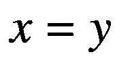

现在你了解了这一点，半序关系既是自反的，也是弱对称的。例如，如果

`R` = ![$$ \left[\begin{array}{c}\mathrm{10.80.20.60.60.4}\\ {}01000.60\\ {}00100.50\\ {}\mathrm{00010.60.4}\\ {}000010\\ {}000001\end{array}\right] $$](images/479940_1_En_2_Chapter/479940_1_En_2_Chapter_TeX_IEq20.png)

那么该关系遵循半序关系的性质。

## 模糊规则

在模糊逻辑中，如果要引入条件语句，就需要使用模糊规则（见图 2-17）。最重要的是理解模糊 If-Then 规则。一个简单的模糊规则示例如下：

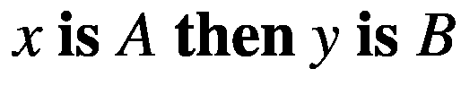

在这个语句中，`A` 和 `B` 被称为语言值。这些值假定来源于统计研究、数学模型等。例如，它们可以是分类值（好、一般或最好）、概率值（0.1、0.3 或 0.9），或实验中的任何其他部分。这些值可以是模糊集合的一部分，而模糊集合又可以是论域 `X` 和 `Y` 中的成员。

如果将上述语句分成两部分：

- `x` 是 `A`
- `y` 是 `B`

第一部分称为*前件*或*前提*，第二部分称为*后件*或*结论*（见图 2-2）。

例如，考虑以下规则：

- 如果路况好，那么车况好
- 如果公司好，那么员工满意
- 如果服务好，那么小费一般

如前所述，`A` 和 `B` 是模糊集合，因此它们的值在 0 到 1 之间。这意味着你提供一个介于 0 和 1 之间的值作为前件，并得到一个介于 0 和 1 之间的值作为后件。因此，在上例中，“好”可以被赋予一个介于 0 和 1 之间的数字，你将得到一个介于 0 和 1 之间的响应，该响应将根据问题陈述代表“好”、“一般”或“满意”。

当你应用 If-Then 规则时，输入被设置为介于 0 和 1 之间的值，但输出是一个完整的模糊集合。之后，你需要应用一种称为解模糊化的模糊运算，它会给你一个介于 0 和 1 之间的清晰输出值。

If-Then 规则的处理过程包括：

1.  读取前件
2.  将输入转换为模糊集合
3.  应用必要的模糊算子
4.  将结果应用于后件
5.  得到一个模糊集合作为输出
6.  解模糊化以获得清晰答案

这些示例是二元的。前件和后件都可以有多个部分。例如：

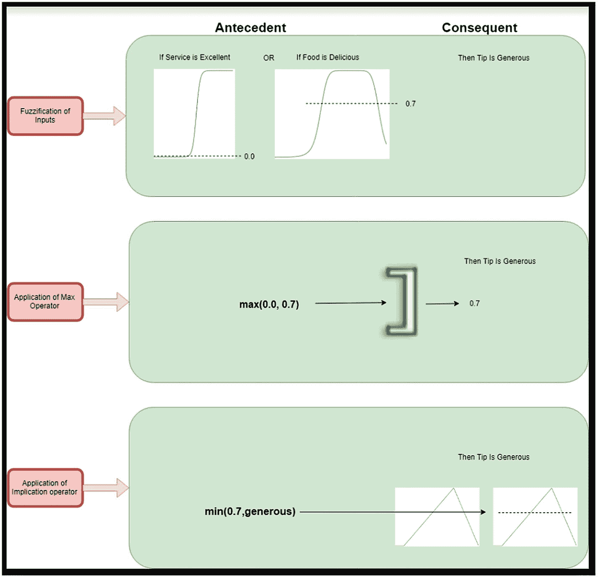

图 2-17

服务示例中的模糊规则

- **如果**天空是灰色的**并且**风很大**并且**气压计在下降，**那么** ...
- 如果温度低，那么热水阀打开且冷水阀关闭

根据这种逻辑，规则可以分为两部分：

- *模糊映射规则。* 该规则首先对前件输入（本例中为服务和食物）进行模糊化，然后应用最大值算子。这给出了需要发送到后件的最终清晰值。
- *模糊蕴含规则。* 在该规则中，后件接收来自前件的清晰输入，然后决定模糊集合的外观。此步骤之后，你将得到一个模糊集合作为输出。

一旦你了解了模糊推理系统，你就会理解将输出模糊集合解模糊化为清晰集合的过程。

## 模糊推理：近似推理理论

假设你知道一些与一个称为 `A` 的前件模糊集合和一个称为 `C` 的后件模糊集合相关的模糊规则。再假设你知道一个事实，该事实不过是模糊集合 `A` 中的一个成员。利用这些规则，你可以通过近似推理从模糊集合 `C` 中得到一个结论。考虑以下示例。

假设你有三条模糊 If-Then 规则：

- 如果服务好，那么小费一般
- 如果服务最差，那么小费很少
- 如果服务最好，那么小费很多

如果你知道服务好，通过近似推理，你可以说小费是一般水平。以下是这个想法的正式表示。

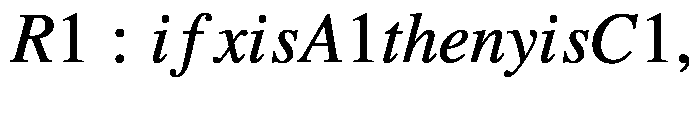

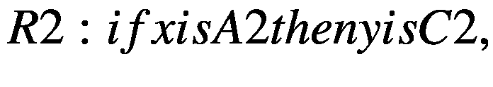


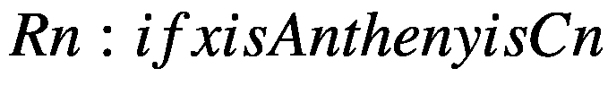

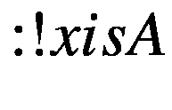

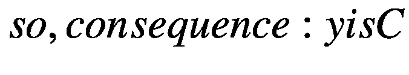

现在你已经了解了基础知识，让我们看看一些与模糊推理相关的正式定义：

- 蕴含规则
- 合取规则
- 析取规则
- 投影规则
- 否定规则
- 广义假言推理
- 广义拒取式推理

### 蕴含规则

如果你知道服务很差，而“很差”是“糟糕”的子集，那么你可以说服务是糟糕的。这被称为蕴含规则，表示为：

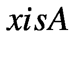

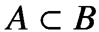

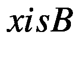


### 合取规则

这也可以称为“与”规则。如果服务不是很好，并且服务也不是很差，你可以说服务既不是很好也不是很差。这被称为合取规则，其表示如下：

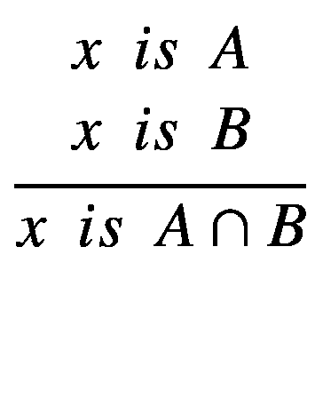

### 析取规则

这也可以称为“或”规则。如果服务不是很好，或者服务也不是很差，你可以说服务不是很好或不是很差。这被称为析取规则，其表示如下：

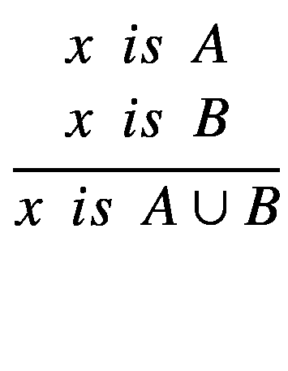

### 投影规则

如果你有模糊集 *X* ∧ *Y* 的两个成员：分别为 *x* 和 *y*，并且它们之间存在关系 *R*，那么你可以定义它们之间的投影规则。

如果你说 (*x*, *y*) 接近 (4, 5)，那么你可以得出结论：*x* 接近 4，且 *y* 接近 5。

### 否定规则

如果你说 *x* 是 *高* 的，但某个事实通过说 *非*(*x 是高的*) 来反驳它，那么你可以使用否定规则得出结论：*x* 是 *不高* 的。这可以表示为：

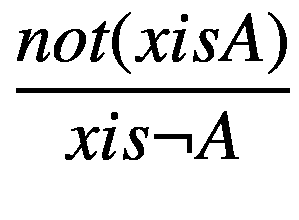

### 广义假言推理

你知道如果服务差，小费就少。同时，你也知道一个事实：服务很好。考虑到这两种情况，你可以说小费很好，这里“好”是“差”的补集，“好”也是“差”的补集。这就是广义假言推理（GMP）的含义。其表示形式如下：

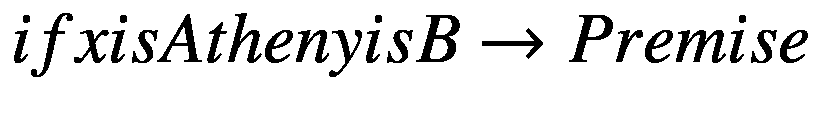

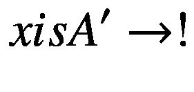

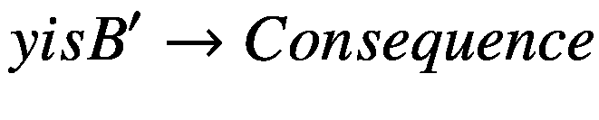

GMP 需要遵循一些性质。

基本性质：


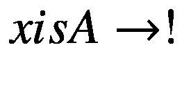


完全不确定性性质：


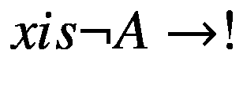

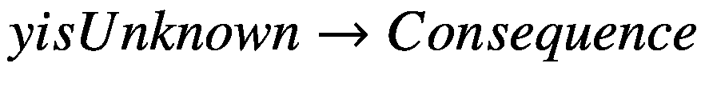

子集性质：

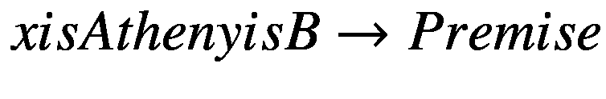

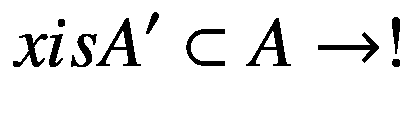

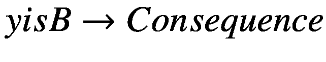

超集性质：


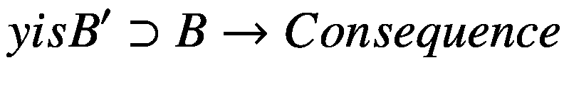

### 广义拒取式

同样，如果你知道服务很好，这意味着小费很好。同时，你也知道一个事实：小费很差。考虑到这两种情况，你可以说服务很差，这里“差”是“好”的补集，“差”也是“好”的补集。这就是广义拒取式的含义：


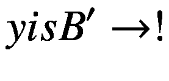

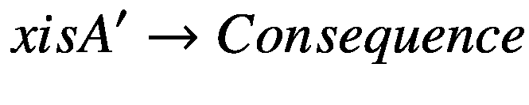

### 模糊系统建模中的聚合

在了解聚合之前，你必须知道任何模糊推理过程所需的步骤：

1.  无论输入是什么，都必须将每条规则与之匹配。
2.  将每条规则的输出确定为一个模糊集。
3.  聚合所有规则的输出，以获得整个模糊系统的输出模糊集。
4.  基于输出的模糊集执行操作。

本节考虑的是第三点：输出规则的聚合。你可以将此操作表示如下：

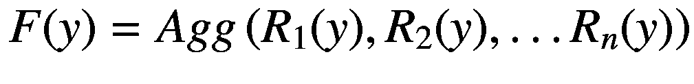

在上面的等式中，`Agg` 代表聚合算子。算子内部的所有参数都是针对模糊集 `Y` 中每个 `y` 值的输出规则的隶属度。

对于聚合操作，需要满足以下三个条件：

-   交换性
-   单调性
-   固定恒等性

#### 交换性

将要执行聚合操作的所有元素可以是无序的，并且可以包含重复值。这意味着索引在这里不起作用。所以 `R1` 可以出现在 `R45` 之后，而 `R45` 又可以出现在 `R2` 之后。

#### 单调性

假设有两个元素，`y1` 和 `y2`。你知道 `R(y1)` 和 `R(y2)` 代表隶属度。这告诉你 `y1` 是正确解相对于 `y2` 是正确解的概率。如果应用于 `y1` 和 `y2` 的所有规则都表明 `R(y1) ≥ R(y2)`，那么整个系统将优先选择 `y1` 而非 `y2`。这可以用单调性条件来表示：

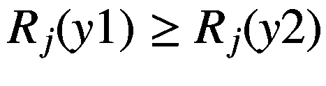

这意味着，对于所有 `j` 值，`y1` 的隶属度将大于或等于 `y2` 的隶属度。

#### 固定恒等性

假设有少数规则无法确保输出。在这种情况下，这些规则不会影响所有其他能够确定潜在输出的规则的输出。这就是固定恒等性的性质。

当你将这三个条件结合起来时，这种聚合被称为单调恒等交换聚合（MICA）。以下是 MICA 算子的列表：

-   三角范数
-   三角余范数
-   平均与补偿算子


### 三角范数

两个模糊集合的交集可以用三角范数（又称 T-范数，如图 2-18 所示）来表示。如果你有两个模糊集合`A`和`B`，它们的交集可以定义为：

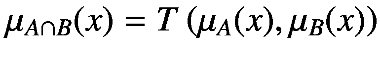

该交集算子具有以下特性：

-   边界性
-   单调性
-   交换性
-   结合性

边界性：

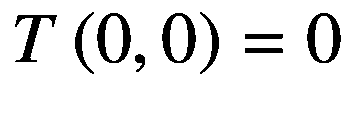

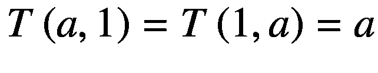

单调性：

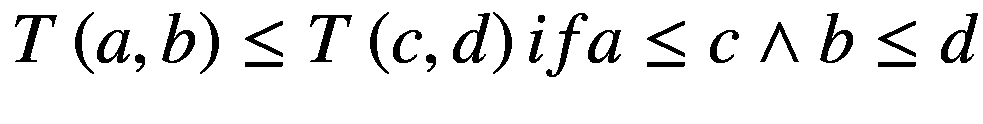

交换性：

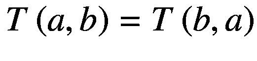

结合性：

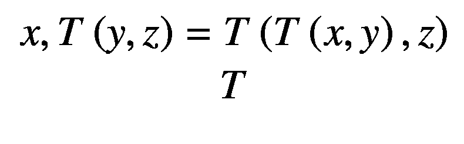

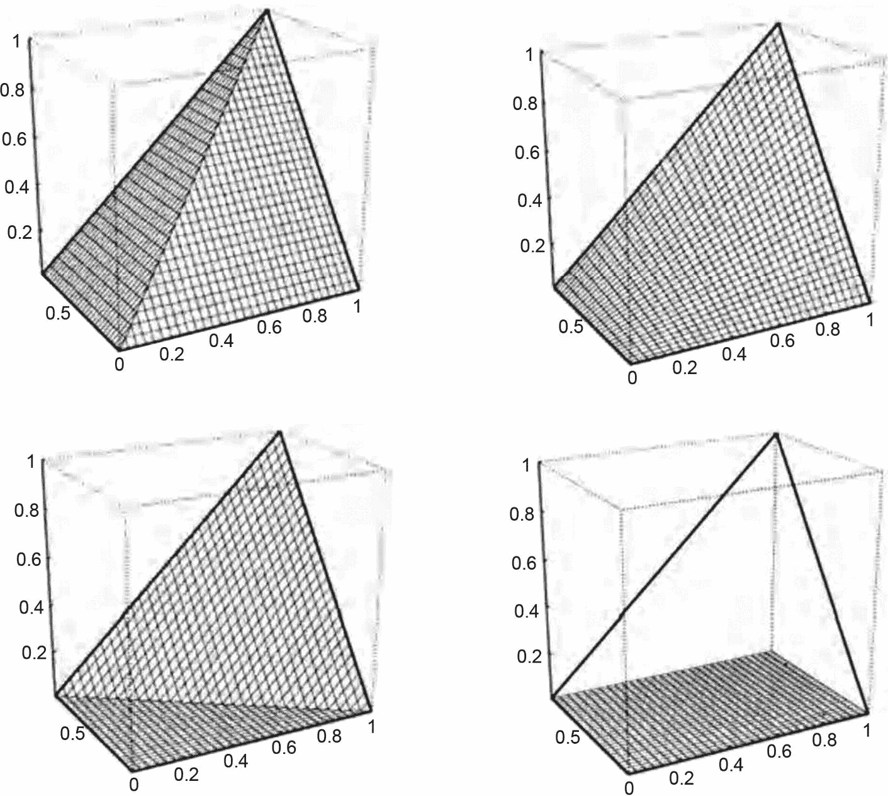

**图 2-18** 最小值、乘积、卢卡西维茨和极端乘积 T-范数

在不同的应用中使用着不同类型的三角范数。其中一些包括：

最小值 T-范数：

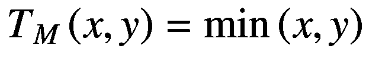

乘积 T-范数：

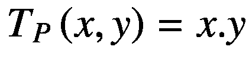

卢卡西维茨 T-范数：

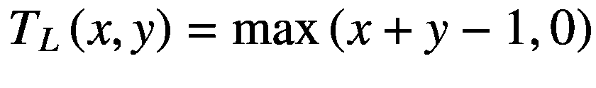

极端乘积 T-范数（最弱 t-范数）：

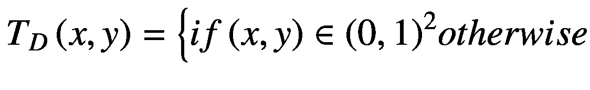

在所有三角范数中，极端乘积 T-范数被认为是最小的，而最小值 T-范数被认为是最大的。最小值 T-范数将每个成员视为幂等元素。乘积 T-范数被认为是严格的 T-范数，而卢卡西维茨 T-范数被认为是幂零 t-范数。以下代码展示了这些三角范数的 Python 实现。它计算了之前定义的两个模糊集合——全速和慢速——的三角范数。

```python
import numpy as np
#Defining the T-Norm Function
def t_norm(mfx,mfy):
tnorm = np.fmin(mfx, mfy)
return tnorm
#Defining sigmoidal membership function
full_speed = fuzz.sigmf(x, 80,2)
slow = fuzz.sigmf(x, 30,2)
#Finding the Intersection
t_norm(full_speed,slow)
```

你已经了解了 T-范数的不同性质及其类型。后续章节将介绍它们的应用。目前，需要明确的一点是，当你需要求两个模糊集合的交集时，会用到 T-范数。

### 三角余范数

两个模糊集合的并集可以用三角余范数（又称 T-余范数，如图 2-19 所示）来表示。如果你有两个模糊集合`A`和`B`，它们的并集可以定义为：

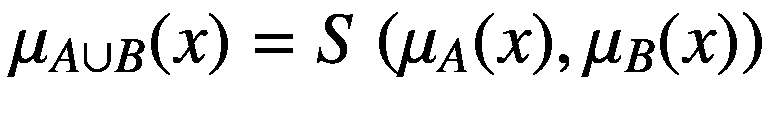

该并集算子具有以下特性：

-   边界性
-   单调性
-   交换性
-   结合性

边界性：

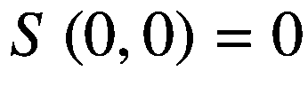

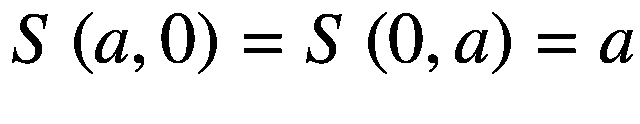

单调性：

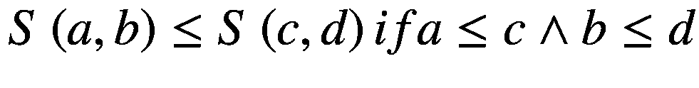

交换性：

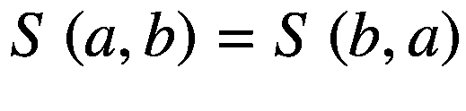

结合性：

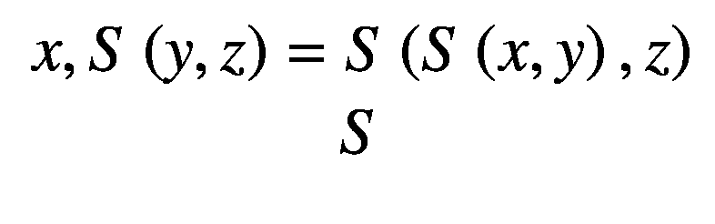

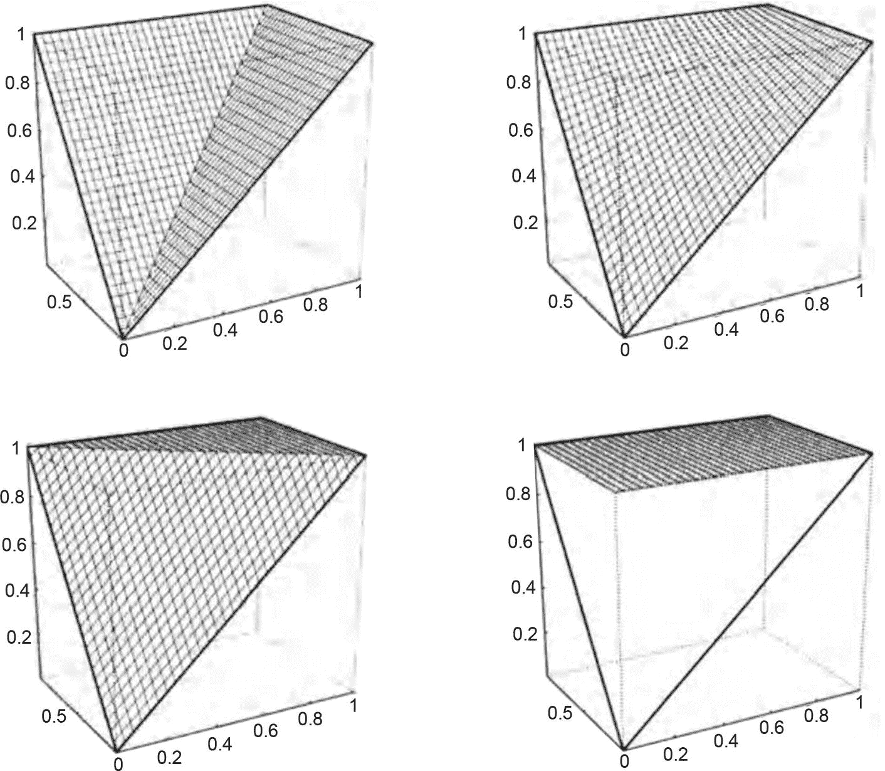

**图 2-19** 最大值、概率和、卢卡西维茨和有界和极端 T-余范数

在不同的应用中使用着不同类型的三角余范数。其中一些包括：

最大值 T-余范数：

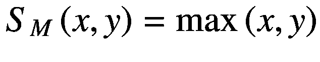

概率和 T-余范数：

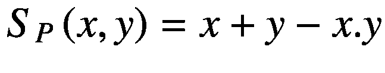

卢卡西维茨 T-余范数：

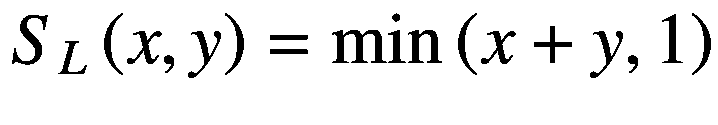

有界和极端 T-余范数（最强 T-余范数）：

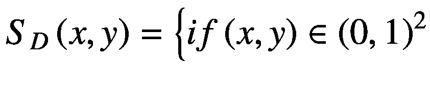

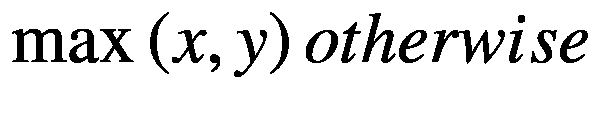

以下代码展示了这些三角余范数的 Python 实现。它计算了之前定义的两个模糊集合——全速和慢速——的三角余范数。

```python
import numpy as np
#Defining the T-Conorm Function
def t_conorm(mfx,mfy):
tnorm = np.fmax(mfx, mfy)
return tnorm
#Defining sigmoidal membership function
full_speed = fuzz.sigmf(x, 80,2)
slow = fuzz.sigmf(x, 30,2)
#Finding the Intersection
t_conorm(full_speed,slow)
```

## 总结

本章详细解释了隶属函数。它涵盖了不同类型的隶属函数，并解释了它们的使用方法。由于有时确定使用哪种隶属函数比较棘手，本章讨论了几种方法。本章还使用 Python 实现了每一种隶属函数。接着，本章转向模糊规则，并解释了如何应用它们。最后，本章通过解释模糊 T-范数和 T-余范数算子作为结尾。

下一章将详细讨论模糊推理系统。该章将讨论所有这些过程是如何被使用的，以及它们如何形成一个完整的结构。

