# 3. 模糊推理系统

前两章解释了与模糊逻辑相关的核心概念。它们讨论了模糊集合以及它们与经典/清晰集合的区别。你还学习了可以在其上进行的各种运算及其性质。然后你学习了隶属函数，它定义了模糊集合中每个元素的隶属度值。你学习了不同类型的隶属函数。之后，你学习了模糊规则和推理方法，这些方法利用隶属函数的概念来提供各种模糊解。

本章将审视你目前所学所有概念的实际应用。本章涵盖了不同类型的模糊推理系统，工业界通过它们来解决各种实际问题。要理解这些系统，你首先需要理解模糊化和去模糊化的过程。在前一章中，当你找到集合中每个元素的隶属函数值以使其成为模糊集合的成员时，你已经看到了模糊化过程。本章从去模糊化的概念开始，然后转向不同的模糊推理系统。


## 去模糊化

`去模糊化`是将模糊集合转换为清晰集合的过程。在大多数应用中，由于人们的意见从来都不是清晰的，因此你必须使用模糊集合。但是，当你整合这些模糊值并需要做出决策时，就必须将模糊输出转换为清晰值。因此，`去模糊化`有助于将模糊集合给出的输出转换为清晰值。如果控制系统的功能依赖于输入，那么`去模糊化`过程决定了在提供输入后具体需要做什么。图 3-1 展示了模糊系统的一般过程，`去模糊化`是该过程的一部分。

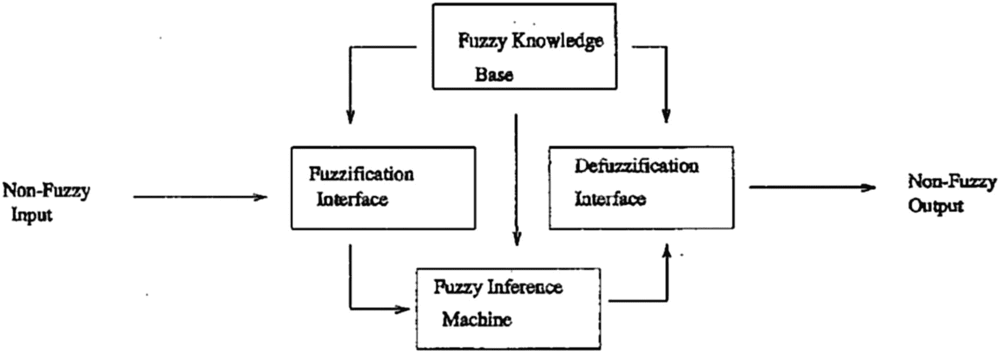

图 3-1

模糊推理系统的过程

正式地，你可以将`去模糊化`过程定义如下：

> *“一种在特定参考集 V 上的去模糊化方法，是从 V 的模糊子集类到 V 的映射。一个非限制性的连贯条件是，关联点必须属于原始模糊子集的支撑集。”*

存在不同类型的`去模糊化`方法。最常见的方法如图 3-2 所示。

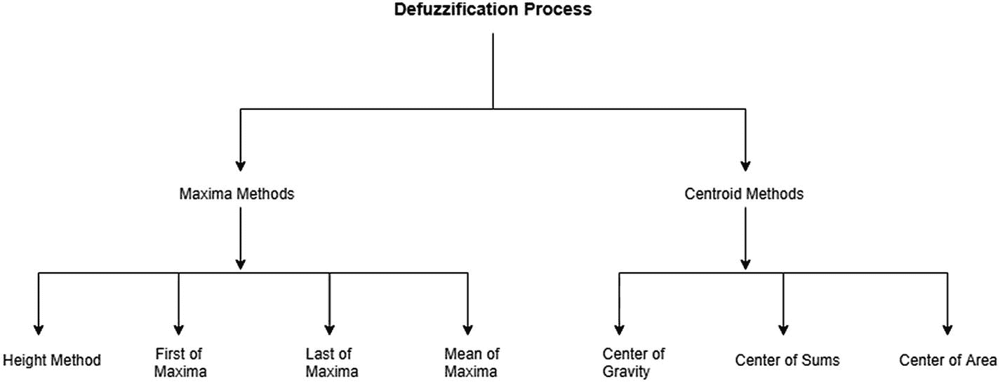

图 3-2

去模糊化器的类型

以下各节将讨论不同类型的`去模糊化`方法。

### λ 截集法

假设你有一个由下式给出的模糊集合：

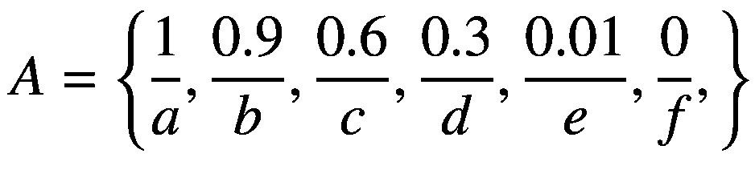

它可以表示为一个离散图，如图 3-3 至 3-9 所示。

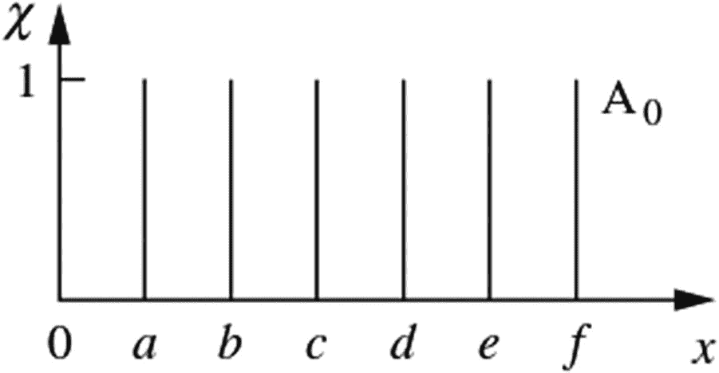

图 3-9

模糊集合 `A[0]` 的离散表示

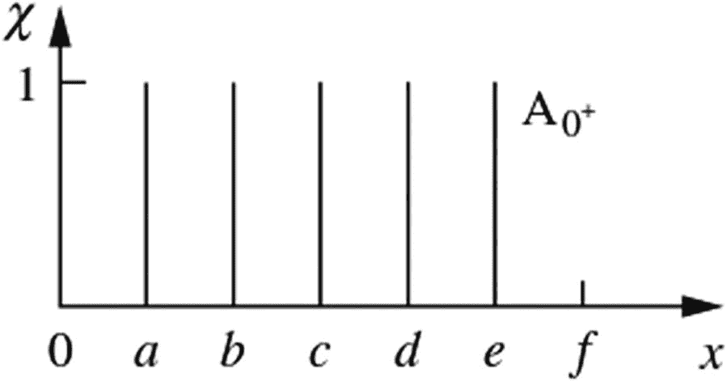

图 3-8

模糊集合 `A[0+]` 的离散表示

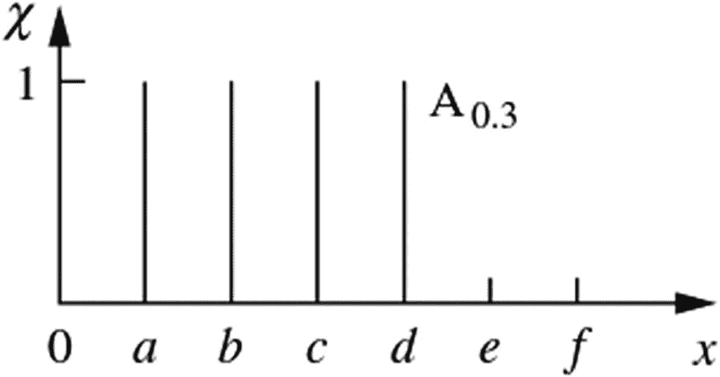

图 3-7

模糊集合 `A[0.3]` 的离散表示

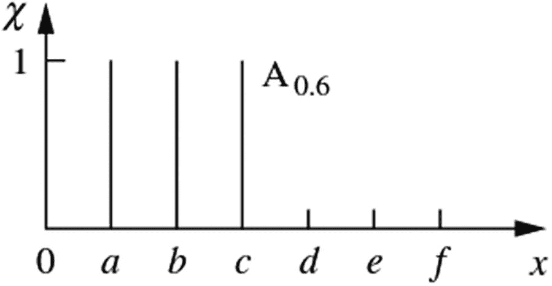

图 3-6

模糊集合 `A[0.6]` 的离散表示

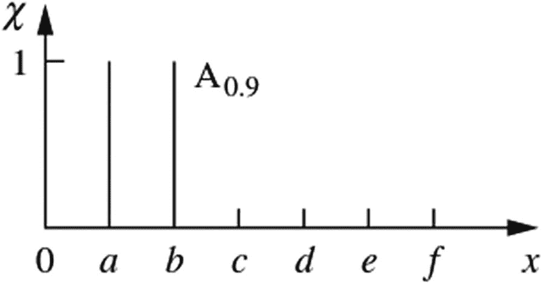

图 3-5

模糊集合 `A[0.9]` 的离散表示

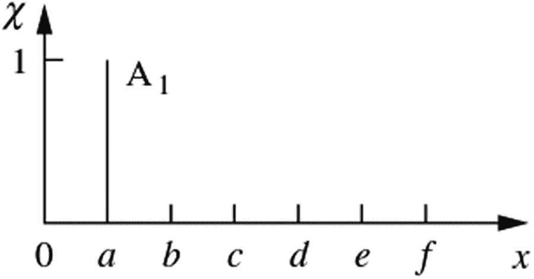

图 3-4

模糊集合 `A[1]` 的离散表示

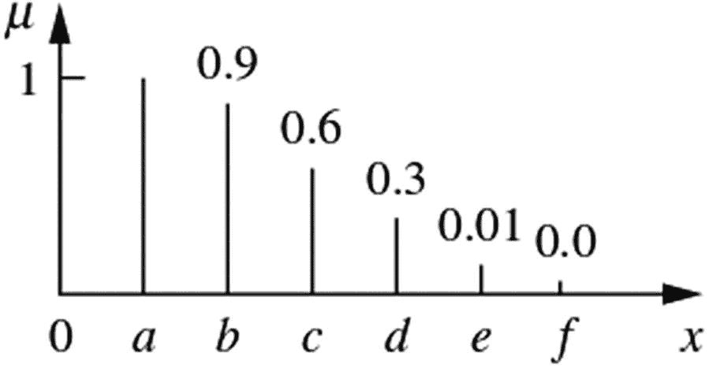

图 3-3

模糊集合 `A` 的离散表示

你可以从不同的 lambda 值（`1`、`0.9`、`0.6`、`0.3`、`0^+`、`0`）推导出不同的清晰集合：

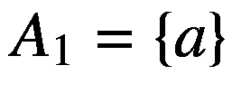

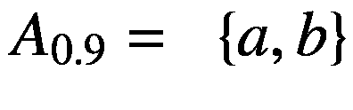

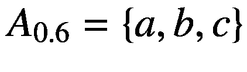

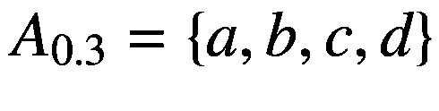

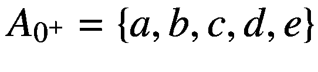

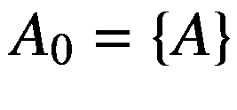

如果你使用模糊集合符号定义 `λ`-截集，你会得到类似这样的结果：

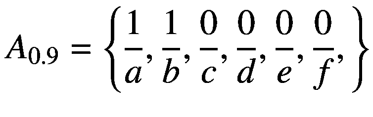

考虑 `λ`-截集的性质：

*   4. `A[α] ⊆ A[λ]`，其中 `λ ≤ α ∣ 0 ≤ α ≤ 1 ∣ A[0] = X`
*   3. `(A_)_λ ≠ A_λ`，除了 `λ` 值为 `0.5` 的情况
*   2. `(A ∩ B)_λ = A_λ ∩ B_λ`
*   1. `(A ∪ B)_λ = A_λ ∪ B_λ`

如果你使用 Sigmoid 隶属函数将其可视化，你会得到图 3-10 和 3-11 中的图表。

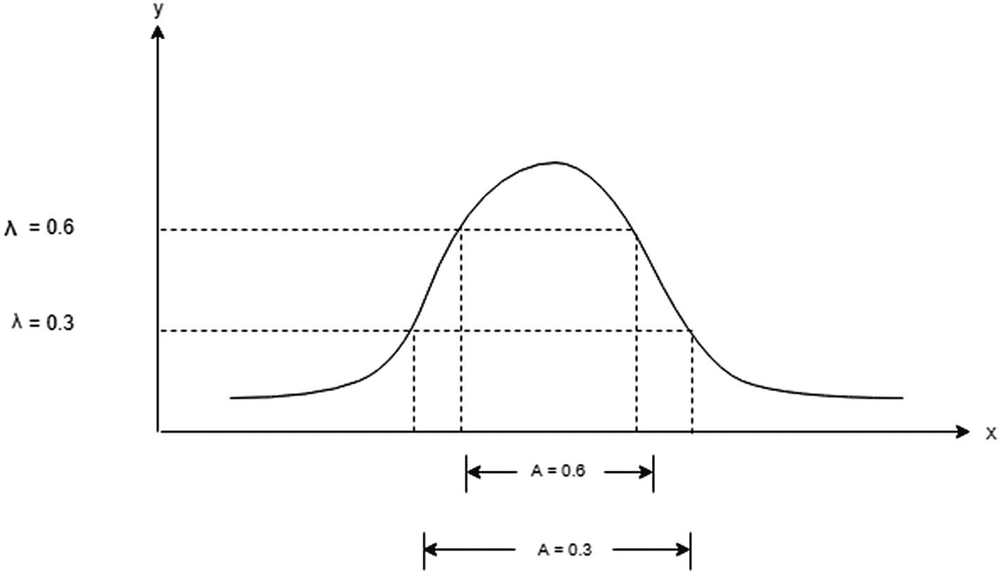

图 3-11

高斯隶属函数

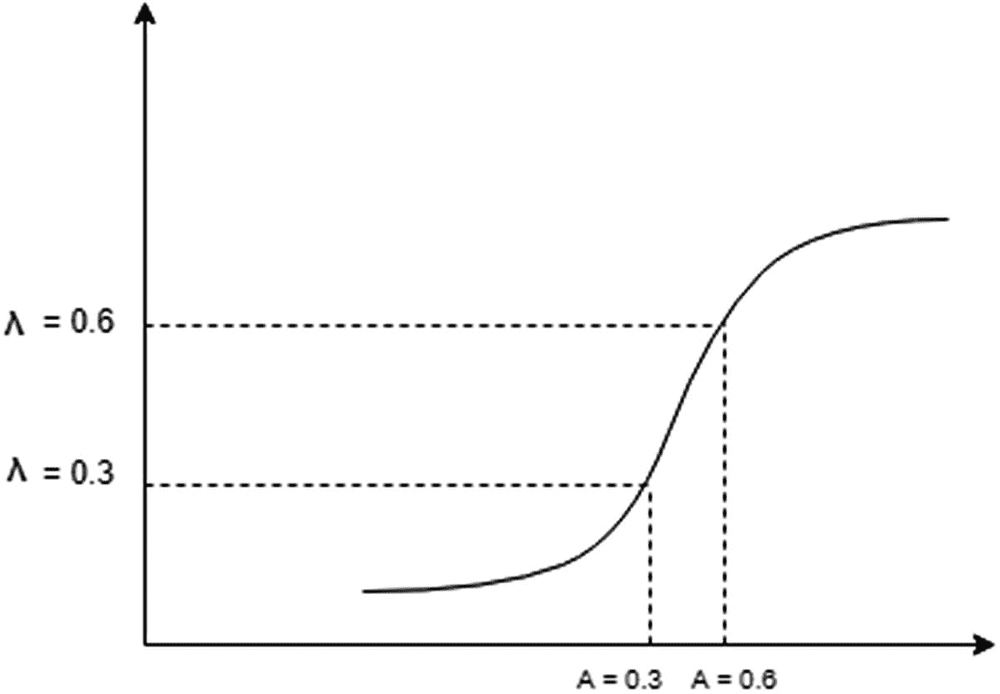

图 3-10

Sigmoid 隶属函数

考虑另一个例子：

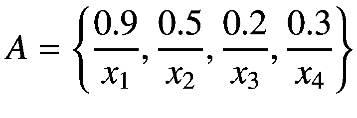

基于之前的计算，你会得到 `A[0.6]` 为：

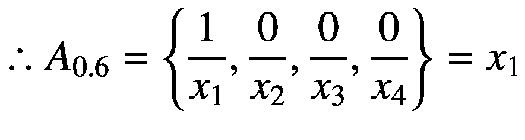

### 最大隶属度原则/高度法

此方法仅在输出隶属函数具有峰值时使用（例如，三角形隶属函数）。

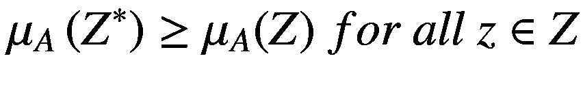

正式地，它通过 `C′[i]` 的高度 `h[i]`，将 `C[i]` 的所有代表点 `z[i]` 的加权平均值作为 `Z[0]`。这可以用数学表示为：

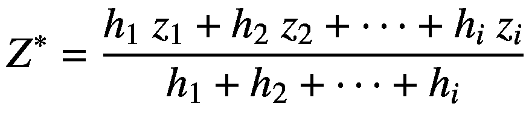

`Z^∗` 是去模糊化后的值，也称为模糊集合 `A` 的输出。重要的一点是，在此方法中高度应被视为唯一的（见图 3-12）。

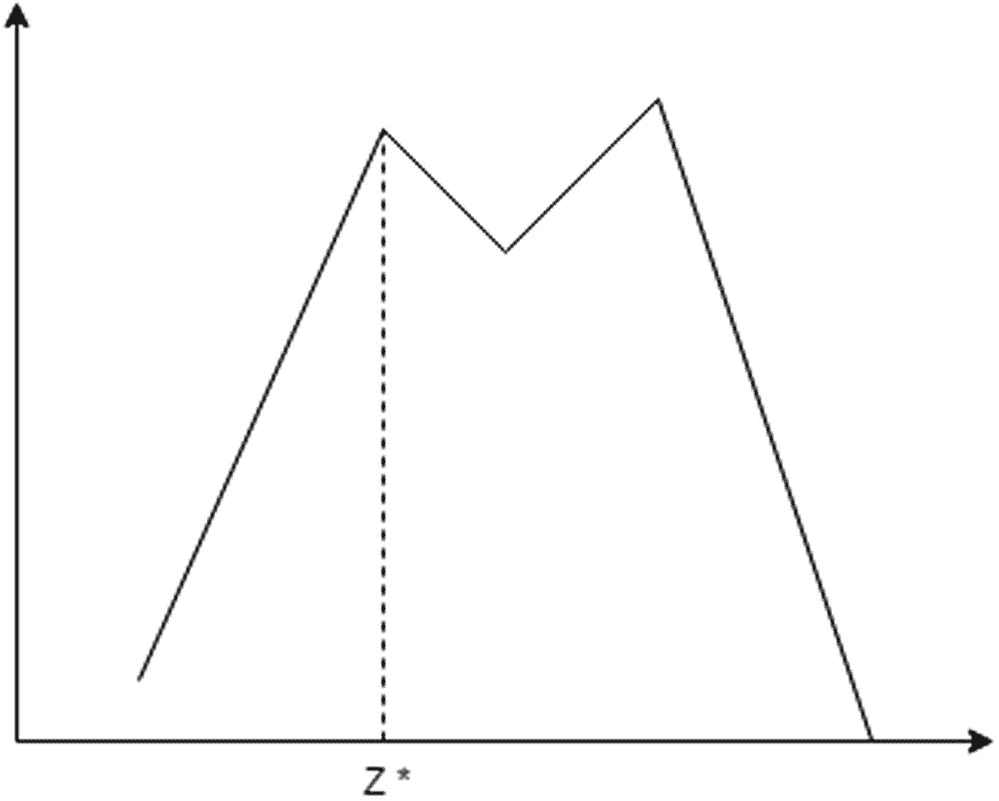

图 3-12

高度法

### 最大值的最小/最大/均值法

此方法取所有可能的模糊输出的并集，并找到具有最大隶属度的最小值。

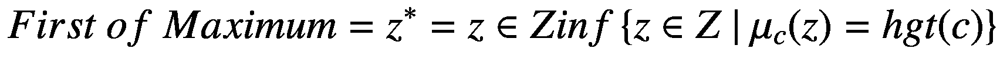

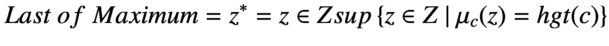

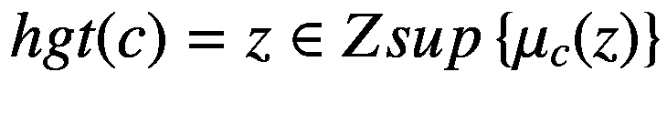

在前面的方程中，`hgt(c)` 表示并集图中存在的最高高度。你可以通过一个例子更好地理解这一点。假设输出隶属函数看起来像图 3-13 中的图形。

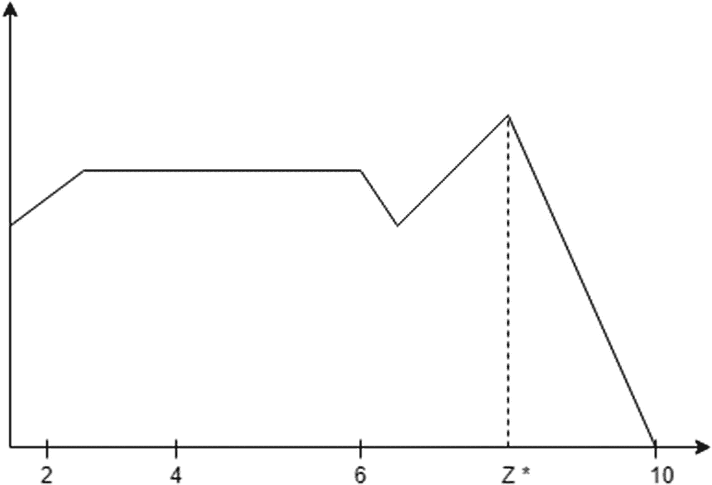

图 3-13

最大值中的最大值法

现在，基于这些方程，你可以看到最高峰值出现在 `8`。它要么是最大值中的最小值法，要么是最大值中的最大值法。


### 重心法（质心法）

该方法考虑整个模糊输出，并找到其质心，从而得到解模糊化输出。这可以用以下公式表示：

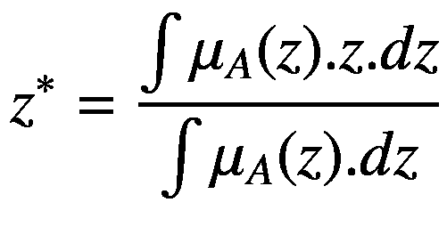

对于一组离散值，公式修订如下：

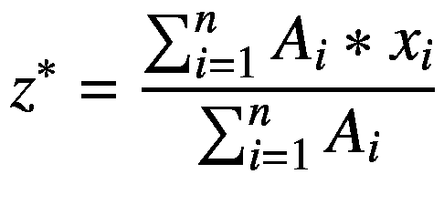

其中 `A` 代表子区域，`x` 代表质心。

你可以借助图 3-14 更好地理解这个概念。

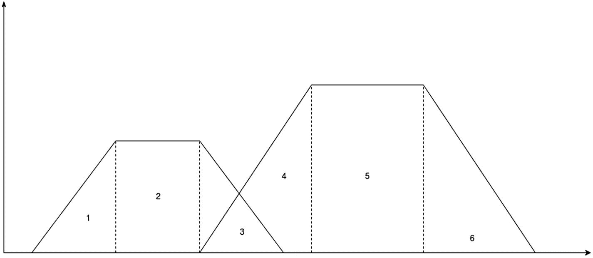

**图 3-14** 重心法

你可以在图 3-14 的图表中看到，隶属函数可以被划分为六个独立的区域。当使用重心法时，你需要确定每个特定子区域的质心和面积。首先确定面积：

*   子区域 6 的总面积为 `½ ∗ 2 ∗ 0.5 = 0.5`
*   子区域 5 的总面积为 `(7-3) ∗ 0.5 = 4 ∗ 0.5 = 2`
*   子区域 4 的总面积为 `½ ∗ (7.5-7) ∗ 0.2 = 0.5 ∗ 0.5 ∗ 0.2 = .05`
*   子区域 3 的总面积为 `0.5 ∗ 0.3 = .15`
*   子区域 2 的总面积为 `0.5 ∗ 0.3 = .15`
*   子区域 1 的总面积为 `½ ∗ 1 ∗ 0.3 = .15`

第二步是确定质心：

*   子区域 6 的质心为 `(1+3+3)/3 = 7/3 = 2.333`
*   子区域 5 的质心为 `(7+3)/2 = 10/2 = 5`
*   子区域 4 的质心为 `(7+7+7.5)/3 = 21.5/3 = 7.166`
*   子区域 3 的质心为 `(7+7.5)/2 = 14.5/2 = 7.25`
*   子区域 2 的质心为 `(7.5+8)/2 = 15.5/2 = 7.75`
*   子区域 1 的质心为 `(8+8+9)/3 = 25/3 = 8.333`

现在，使用你已经学过的公式，可以得到解模糊化值如下：

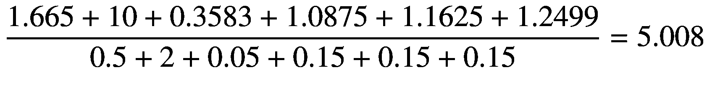

因此，`z`^*`=5.008`。

### 加权平均法

该方法计算速度更快，主要用于 Sugeno 和 Tsukamoto 模糊推理系统。它由以下公式表示：

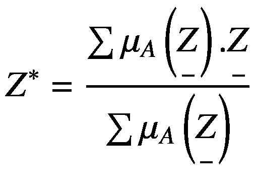

图 3-15 展示了这种解模糊化方法。

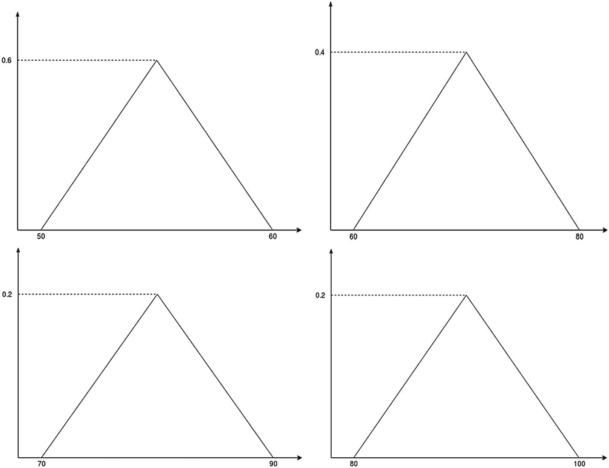

**图 3-15** 加权平均法

图 3-15 中的图表展示了四个具有不同隶属度值的三角形模糊集。你需要使用加权平均法将它们解模糊化为一个清晰值。为此，你使用离散加权平均解模糊化公式：


其中 `x` 代表具有最大隶属函数的元素。应用该公式将得到以下结果：

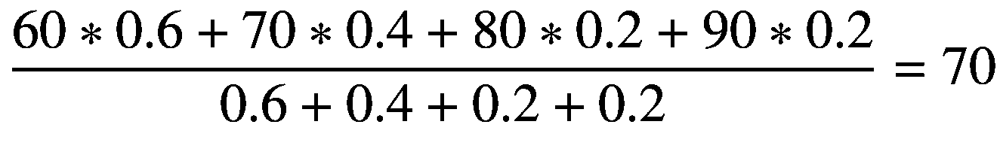

### 求和中心法

求和中心法具有以下特性：

*   它是最快的解模糊化方法之一。
*   与其他方法不同，它不限于对称隶属函数。它同样可以应用于非对称隶属函数。

该方法可以用以下公式表示：

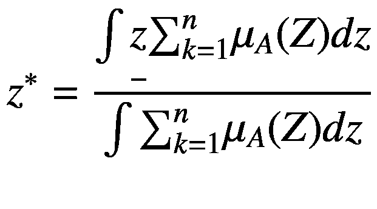

`Z` 是每个隶属函数质心的距离。

当考虑离散元素时，解模糊化值由以下公式给出：

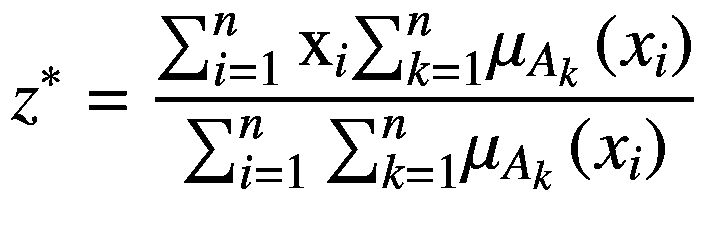

例如，你可以使用与重心法相同的例子（见图 3-16）。

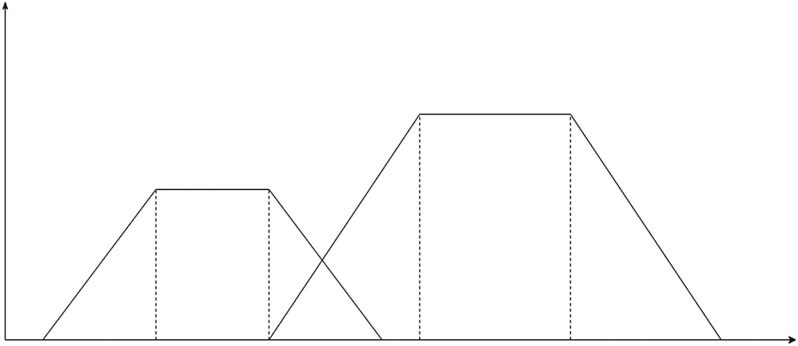

**图 3-16** 求和中心法

你有两个模糊隶属函数，因此需要考虑两个区域。

![$$ {A}_1=\frac{1}{2}\ast \left[\left(9-3\right)+\left(8-4\right)\right]\ast 0.3=\frac{3}{2}=1.5 $$](images/479940_1_En_3_Chapter/479940_1_En_3_Chapter_TeX_Equz.png)

![$$ {A}_2=\frac{1}{2}\ast \left[\left(8-1\right)+\left(7-3\right)\right]\ast 0.5=\frac{55}{20}=2.75 $$](images/479940_1_En_3_Chapter/479940_1_En_3_Chapter_TeX_Equaa.png)

因此，解模糊化值将为：

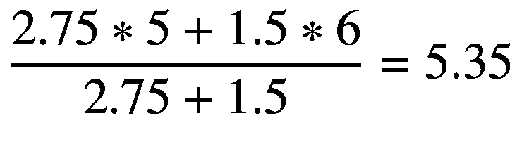

本节并未涵盖所有可用的解模糊器。下一节将从模糊推理系统开始。你将在该节中看到不同模糊器的 Python 应用。

## 模糊推理系统

当你需要设计一个不确定性很高的系统时，最佳方法之一是使用模糊推理系统。当你有一套固定的规则并需要基于此创建系统时，会使用模糊逻辑。但是，当你在过程中加入不确定性时，就需要从现有数据中对过程进行某种推理。使用模糊推理系统就是推断这些过程的方法。

模糊推理系统（FIS）提供了一种使用模糊逻辑将输入空间映射到输出空间的方法。FIS 试图模仿人类使用推理来解决任何问题陈述的过程。FIS 通过使用模糊逻辑，特别是模糊 If-Then 规则来实现这一点。图 3-17 展示了模糊推理系统的结构。

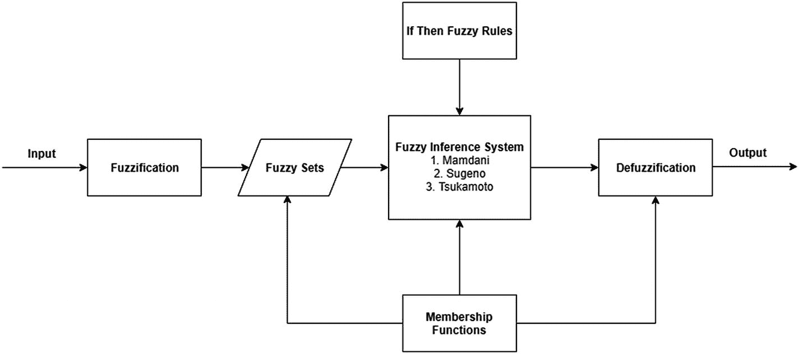

**图 3-17** 模糊推理系统过程

图 3-17 图表中的所有模块解释如下：

*   描述系统的所有模糊 If-Then 规则的数据库
*   隶属函数数据库
*   对模糊规则进行推理操作
*   将模糊结果解模糊化为清晰输出

当你将所有规则和隶属函数数据库结合起来时，它被称为*知识库*。

现在你已经了解了模糊推理系统的基本结构，可以看看它的一些类型。模糊推理系统可以分为三种类型：

*   Mamdani 模型
*   Takagi-Sugeno 模型
*   Tsukamoto 模型


### Mamdani 模糊推理系统

Mamdani 方法是应用最广泛的模糊推理系统。由于其结构简单，常用于解决各类通用决策问题。Mamdani FIS 遵循以下通用步骤：

1. 步骤 1：对输入进行模糊化。
2. 步骤 2：查找并评估每条规则的前件。
3. 步骤 3：查找每条规则的后件。
4. 步骤 4：聚合后件。
5. 步骤 5：对结果进行去模糊化。

首先，将清晰输入转换为模糊集（即*模糊化*）。对于每个输入，尝试找到其隶属度值。假设前件包含多个部分。在这种情况下，需要使用 T-范数或 T-余范数等聚合运算来获得单个隶属度值。

通过一个示例可以更好地理解这一点。假设规则库如下：

* “如果产品评价优秀或产品外观精美。”

你可以将产品评价和产品外观按 1 到 5 的等级进行划分。评价为 1 表示差，评价为 5 表示优秀。对于产品外观，1 表示设计糟糕，5 表示设计出色。现在你已经定义了基本概念，可以来看第一部分：模糊化。

如果使用 S 型隶属函数，其图形将如图 3-18 所示。

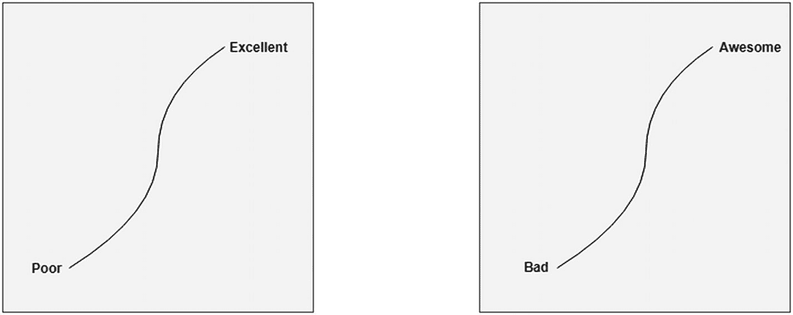

图 3-18 S 型表示

假设你获得的评价输入为 1，设计输入为 4。如果对这些项应用隶属函数，你可能会在评价的 S 型曲线上得到 0.0，在产品外观的 S 型曲线上得到 0.7，如图 3-19 所示。

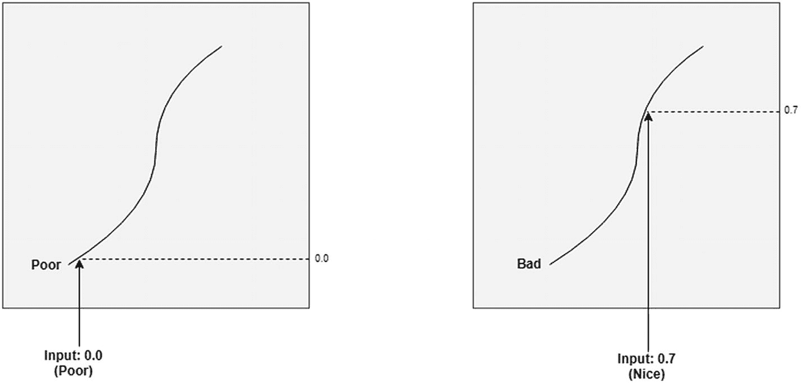

图 3-19 模糊化

由于中间存在 OR 条件，这意味着必须在此处应用 T-余范数算子，这也意味着要应用 `MAX` 算子。

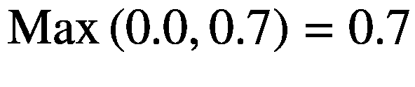

这是输入部分的最终隶属度值。假设后件的隶属函数同样是 S 型，并且规则规定：

* “如果前件为真，则推荐该产品。”

图 3-20 显示了该曲线。

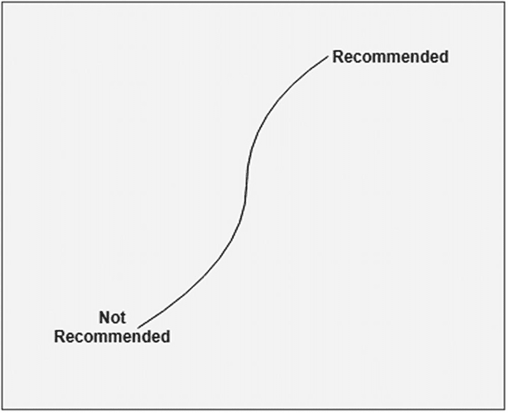

图 3-20 输出隶属函数

你可以应用其中一个蕴含算子来截断后件隶属函数。此示例使用 `MIN` 算子。得到输出后，下一步是将其聚合为单个模糊集。这可以使用模糊聚合算子来完成（见图 3-21）。

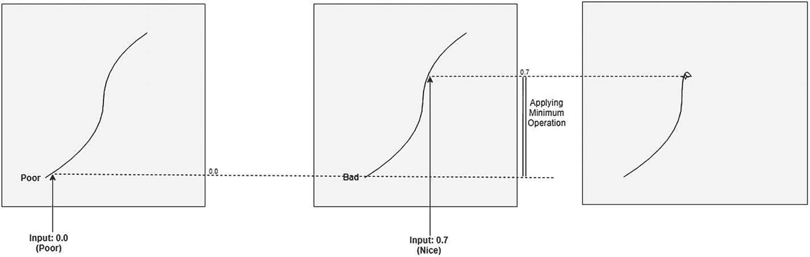

图 3-21 聚合

通过一些示例，你可能会更好地理解这一点，只是这次将使用三角形隶属函数作为输出。假设在规则库中，有三条模糊 If-Then 规则：

* 如果产品评价优秀或产品外观精美，则推荐该产品。
* 如果产品评价良好或产品外观不错，则在一定程度上推荐该产品。
* 如果产品评价差或产品外观难看，则不推荐该产品。

假设你得到的输入与上一个示例相同：评价 = 1，设计 = 4。

图 3-22 展示了整个过程。

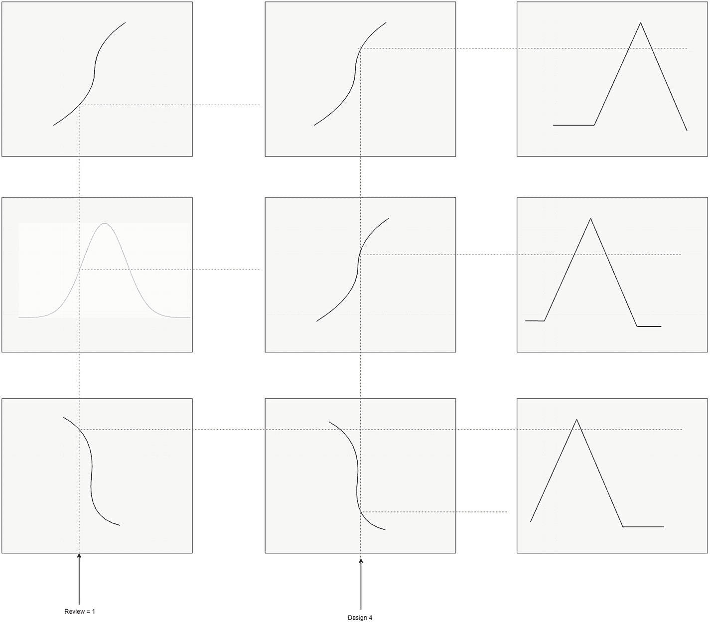

图 3-22 规则库

现在你有了一个聚合后的模糊集，接下来需要的是清晰输出（见图 3-23）。这可以通过去模糊化方法实现。如前所述，去模糊化方法有很多种，但这里使用的是`质心`法。因此，需要找到聚合结果的质心，即面积中心。使用此方法，找到面积最大的区域，然后返回该区域的重心。

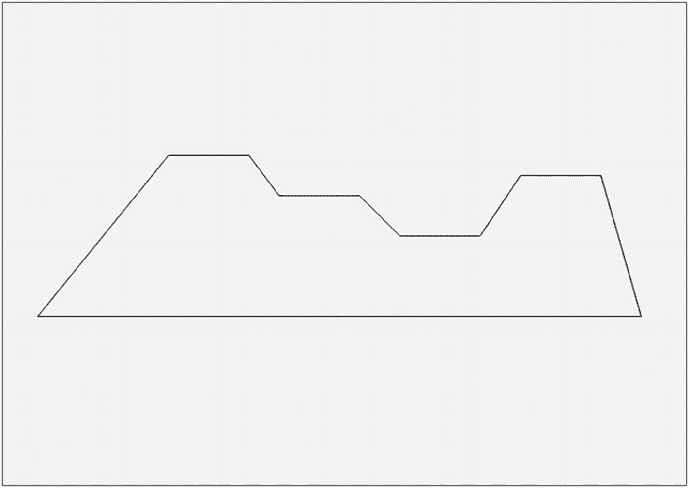

图 3-23 输出聚合模糊集

可以看到 `c[1]` 的面积最大。因此，你将找到合适的 `x'`（重心）。

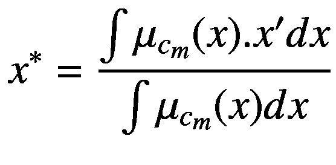

使用此公式，得到的答案为 13.7%。

使用 Mamdani 方法的主要优点如下：

* 直观
* 被广泛接受
* 非常适合人类输入

除了优点之外，Mamdani 方法也存在自身的一系列问题。Mamdani 方法的一些缺点如下：

* 如果前件中的变量数量增加，规则数量会呈指数级增长。
* 构建的规则越多，就越难判断它们是否适用于你的问题。
* 如果前件中的变量数量过多，可能难以找到前件与后件之间的关系。

为了克服这些缺点，可以使用另一种方法，称为 Takagi-Sugeno-Kang (TSK) 方法。

要在 Python 中创建模糊推理系统，可以使用名为 `FuzzyLite` 的库。要在你的系统上安装此包，请执行以下命令：

```
pip install pyfuzzylite
```

`Fuzzylite` 是一个免费开源的模糊逻辑控制库，使用 C++ 编写，支持多平台（例如 Windows、Linux、Mac 和 iOS）。`FuzzyLite` 库的目标是遵循面向对象编程模型，在不依赖外部库的情况下，轻松设计并高效运行模糊逻辑控制器。要详细了解此库，请克隆 GitHub 页面：

[`https://github.com/fuzzylite/pyfuzzylite.git`](https://github.com/fuzzylite/pyfuzzylite.git)

你可以通过此包查看 Mamdani FIS 在 Python 中的应用。


```python
import fuzzylite as fl
#### 声明并初始化模糊引擎
engine = fl.Engine(
name="SimpleDimmer",
description="基于光照条件调节灯光亮度的简易调光器模糊系统"
)
#### 定义输入变量（模糊化）
engine.input_variables = [
fl.InputVariable(
name="Ambient",
description="",
enabled=True,
minimum=0.000,
maximum=1.000,
lock_range=False,
terms=[
fl.Triangle("DARK", 0.000, 0.250, 0.500), # 定义“暗”的三角形隶属函数
fl.Triangle("MEDIUM", 0.250, 0.500, 0.750), # 定义“中等”的三角形隶属函数
fl.Triangle("BRIGHT", 0.500, 0.750, 1.000) # 定义“亮”的三角形隶属函数
]
)
]
#### 定义输出变量（去模糊化）
engine.output_variables = [
fl.OutputVariable(
name="Power",
description="",
enabled=True,
minimum=0.000,
maximum=1.000,
lock_range=False,
aggregation=fl.Maximum(),
defuzzifier=fl.Centroid(200),
lock_previous=False,
terms=[
fl.Triangle("LOW", 0.000, 0.250, 0.500), # 定义“低亮度”的三角形隶属函数
fl.Triangle("MEDIUM", 0.250, 0.500, 0.750), # 定义“中等亮度”的三角形隶属函数
fl.Triangle("HIGH", 0.500, 0.750, 1.000) # 定义“高亮度”的三角形隶属函数
]
)
]
#### 创建模糊规则库
engine.rule_blocks = [
fl.RuleBlock(
name="",
description="",
enabled=True,
conjunction=None,
disjunction=None,
implication=fl.Minimum(),
activation=fl.General(),
rules=[
fl.Rule.create("if Ambient is DARK then Power is HIGH", engine),
fl.Rule.create("if Ambient is MEDIUM then Power is MEDIUM", engine),
fl.Rule.create("if Ambient is BRIGHT then Power is LOW", engine)
]
)
]
```

在这段代码中，可以看到去模糊器被称为 `Centroid`。`FuzzyLite` 提供了多种不同的去模糊器，如下所列。你只需在前面的代码中替换它们即可：

*   `fl.Centroid()`
*   `fl.LargestOfMaximum()`
*   `fl.MeanOfMaximum()`
*   `fl.SmallestOfMaximum()`
*   `fl.WeightedAverage()`
*   `fl.Weighted Sum()`

### Takagi-Sugeno-Kang 模糊推理系统

Takagi-Sugeno-Kang 模糊推理系统用于对复杂的非线性系统进行建模。应用模糊算子然后对输入进行模糊化的整个过程与 Mamdani 方法相同。唯一的变化在于输出隶属函数，它要么是线性的，要么是常数。本节将介绍 TSK 方法。

无论你得到什么样的输出隶属函数，都可以应用加权平均去模糊化方法，得到最终的清晰输出。如你所见，存在不同的蕴含算子——Mamdani 方法或 Sugeno 方法。以下是不同算子的组成：

*   对于规则库中的 AND 运算，使用 T-范数
*   对于规则库中的 OR 运算，使用 T-余范数
*   对于蕴含运算，使用 T-范数
*   对于聚合运算，使用 T-余范数

使用你在 Mamdani FIS 中看到的同一个示例，你可以了解 TSK 方法是如何工作的（见图 3-24）。

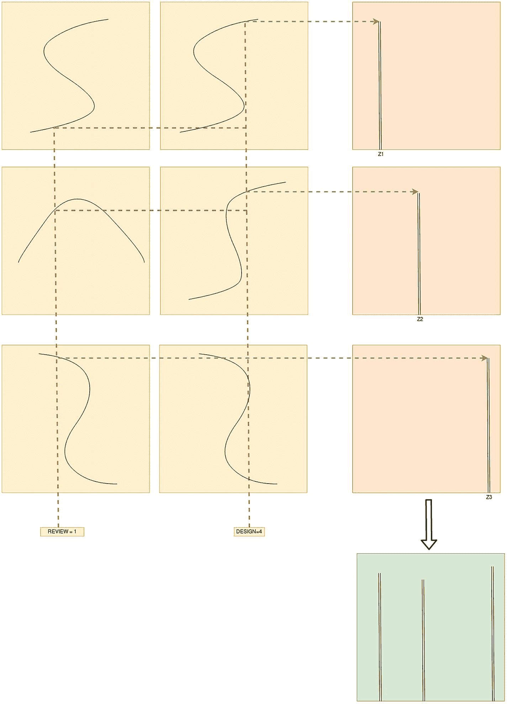

图 3-24

TSK 方法

图 3-24 中的图表表示了你之前在 Mamdani 中看到的相同的模糊 If-Then 规则：

*   如果产品评价极好或产品外观精美，则推荐该产品。
*   如果产品评价良好或产品外观不错，则在一定程度上推荐该产品。
*   如果产品评价较差或产品外观难看，则不推荐该产品。

如前所述，TSK 方法使用加权平均方法来找到去模糊化后的清晰输出。因此，使用以下公式：

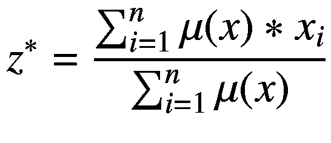

你得到最终结果为 13.3%。

你可以使用 `FuzzyLite` 包来查看 TSK 的应用：

```python
import fuzzylite as fl
#### 声明并初始化模糊引擎
engine = fl.Engine(
name="SimpleDimmer",
description="基于光照条件调节灯光亮度的简易调光器模糊系统"
)
#### 定义输入变量（模糊化）
engine.input_variables = [
fl.InputVariable(
name="Ambient",
description="",
enabled=True,
minimum=0.000,
maximum=1.000,
lock_range=False,
terms=[
fl.Triangle("DARK", 0.000, 0.250, 0.500), # 定义“暗”的三角形隶属函数
fl.Triangle("MEDIUM", 0.250, 0.500, 0.750), # 定义“中等”的三角形隶属函数
fl.Triangle("BRIGHT", 0.500, 0.750, 1.000) # 定义“亮”的三角形隶属函数
]
)
]
#### 定义输出变量（去模糊化）
engine.output_variables = [
fl.OutputVariable(
name="Power",
description="",
enabled=True,
minimum=0.000,
maximum=1.000,
lock_range=False,
aggregation=None,
defuzzifier=fl.WeightedAverage("TakagiSugeno"),
lock_previous=False,
terms=[
fl.Constant("LOW", 0.250), # 定义“低”的常数隶属函数
fl.Constant("MEDIUM", 0.500), # 定义“中等”的常数隶属函数
fl.Constant("HIGH", 0.750) # 定义“高”的常数隶属函数
]
)
]
#### 创建模糊规则库
engine.rule_blocks = [
fl.RuleBlock(
name="",
description="",
enabled=True,
conjunction=None,
disjunction=None,
implication=None,
activation=fl.General(),
rules=[
fl.Rule.create("if Ambient is DARK then Power is HIGH", engine),
fl.Rule.create("if Ambient is MEDIUM then Power is MEDIUM", engine),
fl.Rule.create("if Ambient is BRIGHT then Power is LOW", engine)
]
)
]
```


