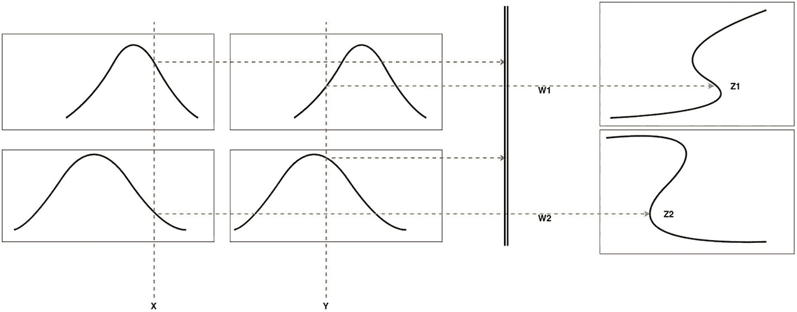
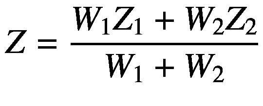

# 塚本模糊推理系统

在塚本模糊推理系统中，输出模糊隶属函数并非常数或线性函数，而是采用单调隶属函数，并通过加权平均法进行去模糊化。图 3-25 展示了塚本模糊推理系统的流程。



图 3-25

塚本法

如图所示，流程保持不变，但去模糊化过程发生了变化。因此，该输出的最终结果由以下公式给出：



由于采用加权平均法，该过程非常快速，因此不会在详细的去模糊化过程中浪费时间。无论输入类型如何，塚本模糊推理系统的输出始终是清晰的。

以下示例代码展示了如何在 Python 中使用 `FuzzyLite` 包实现塚本模糊推理系统：

```
import fuzzylite as fl
#声明并初始化模糊引擎
engine = fl.Engine(
name="SimpleDimmer",
description="基于光照条件调节灯光亮度的简单调光模糊系统"
)
#定义输入变量（模糊化）
engine.input_variables = [
fl.InputVariable(
name="Ambient",
description="",
enabled=True,
minimum=0.000,
maximum=1.000,
lock_range=False,
terms=[
fl.Bell("Dark", -10.000, 5.000, 3.000), #定义“暗”的广义钟形隶属函数
fl.Bell("medium", 0.000, 5.000, 3.000), #定义“中”的广义钟形隶属函数
fl.Bell("Bright", 10.000, 5.000, 3.000) #定义“亮”的广义钟形隶属函数
]
)
]
#定义输出变量（去模糊化）
engine.output_variables = [
fl.OutputVariable(
name="Power",
description="",
enabled=True,
minimum=0.000,
maximum=1.000,
lock_range=False,
aggregation=fl.Maximum(),
defuzzifier=fl.Centroid(200),
lock_previous=False,
terms=[
fl.Sigmoid("LOW", 0.500, -30.000), #定义“低光”的 S 形隶属函数
fl.Sigmoid("MEDIUM", 0.130, 30.000), #定义“中光”的 S 形隶属函数
fl.Sigmoid("HIGH", 0.830, 30.000) #定义“高光”的 S 形隶属函数
fl.Triangle("HIGH", 0.500, 0.750, 1.000)
]
)
]
#创建模糊规则库
engine.rule_blocks = [
fl.RuleBlock(
name="",
description="",
enabled=True,
conjunction=None,
disjunction=None,
implication=None,
activation=fl.General(),
rules=[
fl.Rule.create("if Ambient is DARK then Power is HIGH", engine),
fl.Rule.create("if Ambient is MEDIUM then Power is MEDIUM", engine),
fl.Rule.create("if Ambient is BRIGHT then Power is LOW", engine)
]
)
]
```

### Mamdani 与 TSK 模糊推理系统的对比分析

以下列表对两种系统进行了比较：

- Mamdani 系统无法适应其他算法，而 TSK 系统具有适应性。
- Mamdani 系统使用去模糊化方法评估输出，而 TSK 系统使用加权平均法。
- 在完美控制系统方面，Mamdani 系统比 TSK 系统表现更好。
- 与 TSK 系统相比，Mamdani 系统参数过多。

## 总结

本章详细讨论了模糊推理系统。首先通过示例回顾了不同类型的去模糊化器。随后，本章介绍了三种模糊推理系统：Mamdani、TSK 和塚本模糊推理系统。您学习了如何使用 `Fuzzylite` 包在 Python 中应用所有这些推理系统。

下一章将奠定机器学习的基础，这将作为理解后续章节中模糊神经网络概念的基础。

