# 4. 机器学习简介

前一章讨论了用于构建各种实际控制系统的不同模糊推理系统。但这些系统是静态的，这意味着模糊化过程、去模糊化过程、定义隶属函数等都需要手动完成。对于智能系统而言，最好能从数据中学习大部分内容，而不是直接进行硬编码。在模糊推理系统中，大部分参数都是通过学习获得的。这种结合神经网络的方法被称为模糊神经网络。

本章将奠定机器学习的基础。您将学习机器学习的不同概念，这些概念将帮助您理解本书后续章节中模糊神经网络的核心概念。

本章首先介绍机器学习。您将了解机器学习可以解决的不同类型问题，以及如何衡量各种模型的有效性。本章还涵盖了数据在机器学习中的表示和划分方式，以及进行这些划分的优势。

机器学习是人工智能的一个分支，它涉及从数据中学习、从经验中持续学习的能力，而无需显式地编程参数。机器学习通过应用不同的统计和数学方法，从提供给它的数据中学习。机器学习试图发现数据中隐藏的模式。基于这些模式，当提供新数据时，模型会尝试预测某些结果。

## 机器学习

图 4-1 展示了机器学习的分类。当输出是分类变量时，分类机器学习模型可以帮助您解决问题。分类输出包括名义变量或有序变量。例如，根据某些特定特征，您让模型判断某家公司的股价在未来几个月是上涨还是下跌。这是一个分类问题。

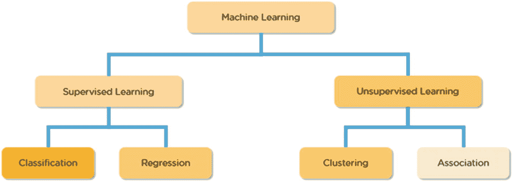

图 4-1

机器学习算法

类似地，如果您提供一张图片，并希望机器学习模型将其分类为人或动物，这同样是一个分类问题。相反，如果您不要求机器学习模型对数据进行分类，而是直接预测数值形式的输出，这被称为回归问题。例如，预测股票下个月的价格，或根据提供的图片预测一个人的年龄。这是一个回归问题。

如前所述，当机器学习模型尝试根据数据预测类别时，这就是分类问题。机器学习模型可以将数据分为两类或多类。当数据被分为两类时，该机器学习问题被称为二分类问题（见图 4-2）。如果类别超过两类，则称为多分类问题。

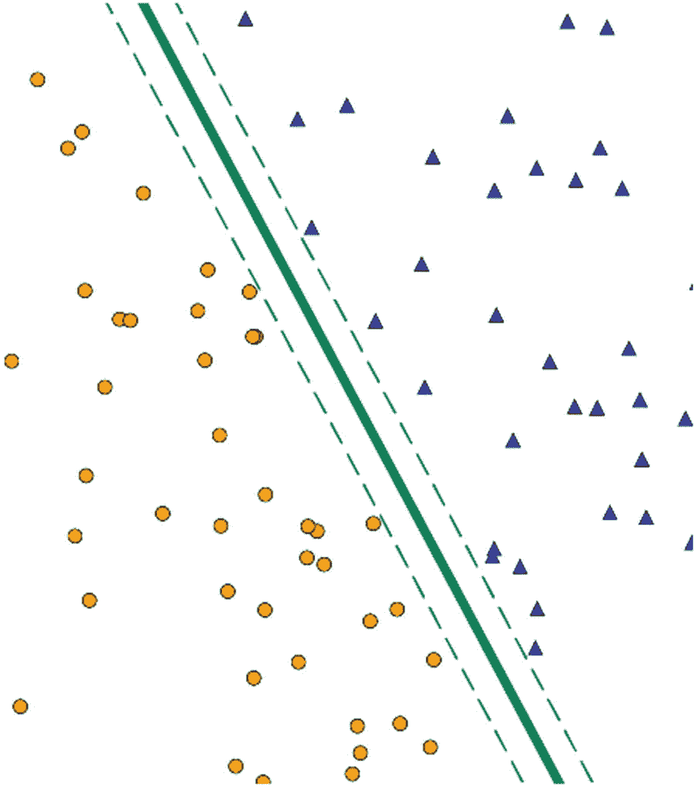

图 4-2

二分类

## 分类机器学习问题

以下是二分类和多分类问题的一些示例：

- 给定一张图片，判断它是猫还是狗——二分类
- 判断一个人是否有能力偿还贷款——二分类
- 将心电图信号分类为 13 种健康问题之一——多分类
- 聊天机器人根据提出的问题将问题发送到不同部门——多分类
- 对不同类型的驾驶员分心行为进行分类——多分类


## 回归机器学习问题

试图根据数据预测实际数值的机器学习模型属于回归机器学习问题的范畴（见图 4-3）。以下是一些回归问题的示例：

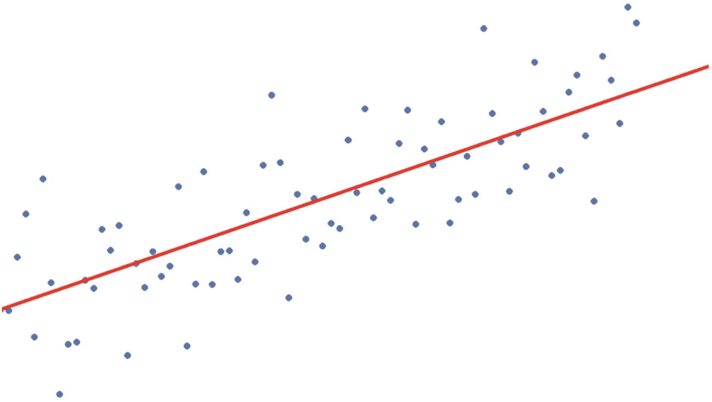

图 4-3

回归

* 预测股票市场价格
* 预测公司下一季度的收入
* 寻找自动驾驶汽车的最佳速度

无论是分类问题还是回归问题，机器学习模型总是从经验中学习。下一节将解释*经验*的确切含义。

## 经验

对于机器学习模型而言，经验就是你提供给它的数据，模型从中学习隐藏的模式，然后解决问题。提供给模型的数据与你期望模型解决的问题类型相关。当谈到从数据中学习与分类和回归问题相关的内容时，数据中除了你想要预测或分类的特征外，还包含不同的特征。例如，如果你想预测股票价格或对股票价格走势进行分类，你可能会拥有包含不同特征的数据，例如某只特定股票的最高价、最低价、开盘价和收盘价信息。还会提供该股票过去的价格走势或历史价格信息。因此，模型会查看整个数据集，然后查看该特定时间点的实际值。基于此，它学习所有变量之间的关系。一旦学习过程完成，并且你提供了新数据，模型就会查看所有新特征，理解它们之间的关系，然后尝试预测或分类新数据。

你正在预测或分类的这个值被称为*目标变量*或*因变量*（例如，`Y`）。所有其他变量被称为*自变量*（例如，`x`）。可以说，目标变量是所有自变量的函数，如下所示。该函数可以是线性的或非线性的。图 4-4 展示了梯度下降图，这是一种学习算法。

`Y = f(X)`

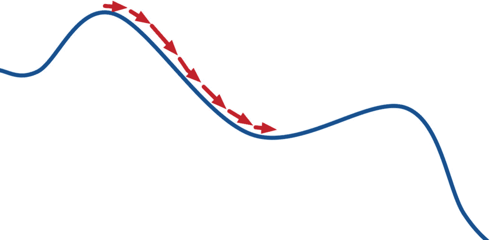

图 4-4

学习图（梯度下降）

在分类和回归问题中，数据总是包含一个因变量，即你想要预测或分类的变量。机器学习中有一个领域不提供因变量。这些问题属于聚类或关联类型。因此，根据可用的数据，机器学习方法分为两个领域：

* 监督学习
* 无监督学习

### 监督学习与无监督学习

如果你在别人的搀扶下过马路，这可以称为监督方法。但是，如果你开始在没有他人帮助的情况下过马路，这就是无监督方法。从这个例子中可以得到启示，可以说监督学习方法包含含有因变量的数据。这时模型会查看输入和输出变量，并尝试学习它们之间的关系。

在无监督学习中，数据不包含目标变量（`Y`，如监督学习中所述）。它必须查看数据集，然后找出它们之间的相似性/差异性/模式。基于此，你可以采用不同的无监督学习方法。你已经了解了监督学习方法，即分类和回归。无监督学习方法包括聚类、分解和关联。图 4-5 直观地展示了这两种问题陈述。

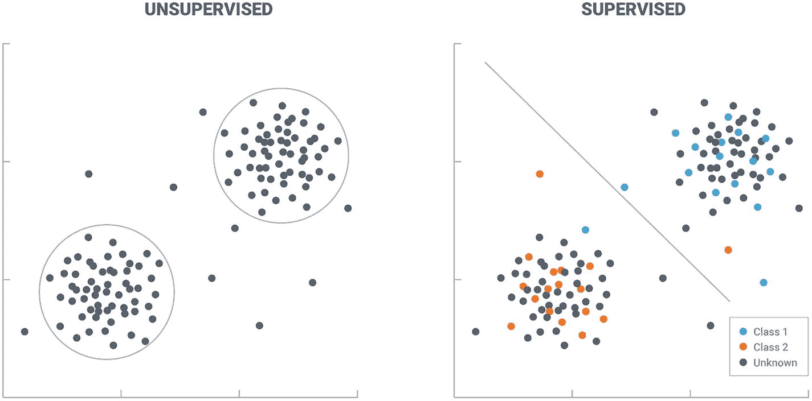

图 4-5

监督学习与无监督学习

以下算法使用监督学习方法：

* 线性/逻辑回归
* K-近邻
* 朴素贝叶斯定理
* 决策树
* 集成树
* 支持向量机
* 神经网络

以下算法使用无监督学习方法：

* 层次聚类
* K-均值聚类
* Apriori 规则
* 神经网络

一旦你决定了机器学习模型需要解决哪种问题，并从这些列表中选择了一个算法，就进入了下一个阶段，即评估模型的性能。

## 性能度量

模型准备好后，就需要确保能得到准确的结果。为此，你需要根据模型试图解决的问题（分类或回归）来衡量模型的性能。

对于分类问题，以下是常用的一些度量指标：

* 准确率
* 精确率
* 召回率或灵敏度
* F1 分数
* 混淆矩阵

对于回归问题，以下是常用的一些指标：

* 均方根误差
* AIC
* R2 分数

接下来的章节将使用泰坦尼克号和房价数据集来讨论这些度量和指标。


## 理解泰坦尼克号与房价数据集

本节将利用公共领域中的两个数据集——泰坦尼克号数据集和房价数据集——来解释准确率度量指标。你将使用泰坦尼克号数据集学习分类度量指标，并使用房价数据集学习回归度量指标。你可以从 Kaggle 下载这两个数据集。以下是可供下载的链接：

[`https://www.kaggle.com/c/titanic/data`](https://www.kaggle.com/c/titanic/data)

[`https://www.kaggle.com/alphaepsilon/housing-prices-dataset`](https://www.kaggle.com/alphaepsilon/housing-prices-dataset)

请记住，你需要先在 `kaggle.com` 上注册才能使用这些数据集。

假设数据集已下载完毕，你将开始用 Python 理解和探索泰坦尼克号数据集。泰坦尼克号数据集包含了泰坦尼克号沉没事故中幸存者和遇难者的信息。该数据集的主要目的是根据你提供的关于某人的信息（例如年龄、性别、购买的船票等级等）来帮助判断其生还的可能性。让我们通过将其加载到 Python 中来查看该数据集中的特征。

```
#读取数据
import pandas as pd
data = pd.read_csv("train.csv")
data.head()
```

执行这段代码后，你将得到整个数据集的前五行，如图 4-6 所示。

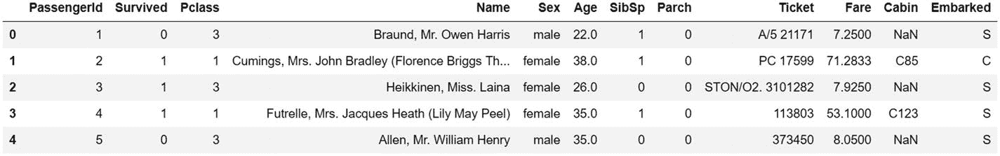

图 4-6

泰坦尼克号数据集

该数据集总共有 11 列。（整个数据库的一个子集被称为*数据集*。）以下是各列的解释：

*   `Survived`：1 表示该人幸存，0 表示该人未能幸存
*   `Pclass`：乘客的舱位等级
*   `Name`：乘客姓名
*   `Sex`：乘客性别
*   `Age`：乘客年龄
*   `SibSp`：同行的兄弟姐妹/配偶人数
*   `Parch`：同行的父母/子女人数
*   `Ticket`：船票号码
*   `Fare`：支付的票款金额
*   `Cabin`：客舱号
*   `Embarked`：登船港口

由于该数据集对一个人是否在事故中幸存进行了分类，因此 `Survived` 是因变量。其他变量是自变量。你将在下一节的所有分类度量指标中使用此数据集。接下来，我们来看房价数据集。

使用房价数据集（见图 4-7），你可以根据不同的特征预测房屋价格。该数据集包含 81 列，其中 `SalePrice` 是因变量。你可以使用以下 Python 语句来探索该数据集：

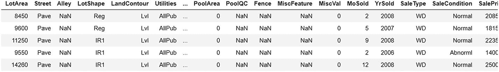

图 4-7

房价数据集

```
#读取数据
import pandas as pd
data = pd.read_csv("train_hp.csv")
data.head()
```

此示例使用 80 个特征列来预测目标变量 `SalePrice`。在讨论度量指标之前，你还必须了解数据的不同划分类型。

### 数据的不同类型（数据集）

机器学习通常有三种类型的数据集（见图 4-8）：

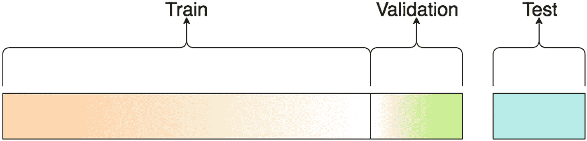

图 4-8

数据集划分

*   训练集
*   验证集
*   测试集

你将获得整个数据库作为一个单独的文件。它可以是任何格式，包括 CSV、XLSX、SQL 等。此示例将数据分为三部分。训练集包含用于模型学习的数据。验证集用于测试模型的性能。主数据也被分成两部分。第一部分包含大部分数据，称为训练集，剩余数据是验证集。测试集是完全未见过的数据。这是你接受或拒绝模型的地方。这与验证集类似，但数据不是训练集的一部分。它是从新来源获得的全新数据集。

下一节将讨论不同类型的性能度量指标。后续章节将进一步讨论这些数据集。

## 分类问题：度量指标

### 混淆矩阵

将模型应用于测试数据后，你会得到混淆矩阵，通过它可以确定模型的性能。在泰坦尼克号数据集中，你面临的是一个二分类问题，即你想判断一个人是幸存还是未能幸存。该情况下的混淆矩阵将如图 4-9 所示。

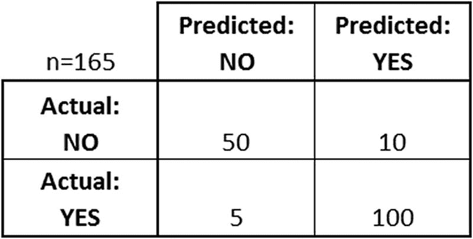

图 4-9

混淆矩阵

在一个二分类混淆矩阵中，你有两行两列。行包含测试数据中的实际值，而列包含模型的预测值。然后你可以确定模型预测正确结果的次数以及预测错误结果的次数。

有 50 个实例预测为“否”，实际值也是“否”。有 100 个实例预测为“是”，实际数据也是“是”。但也有 10 个实例预测为“是”，而实际数据是“否”，以及 5 个实例预测为“否”，而实际数据是“是”。因此，你可以说大多数情况下模型给出了准确的结果，但存在出错的可能。如果你对这个表格进行量化，就会得到不同的准确率度量指标。但是，在讨论这些指标之前，你首先需要理解与混淆矩阵相关的不同术语。

*   真正例：如果实际为“是”，模型预测为“是”的频率。
*   真负例：如果实际为“否”，模型预测为“否”的频率。
*   假正例（第一类错误）：如果实际为“否”，模型预测为“是”的频率。
*   假负例（第二类错误）：如果实际为“是”，模型预测为“否”的频率。

### 准确率

这是模型的整体准确率。它通过以下公式确定：

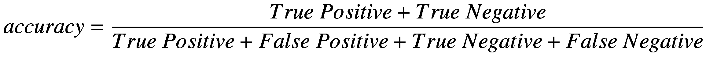

#### 真负例率

TNR 表示被正确分类的负例。它也被称为模型的特异性。你可以通过以下公式获得模型的真负例率：

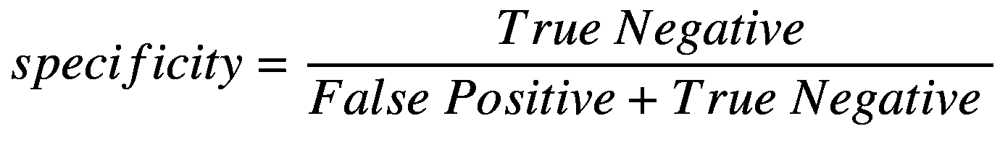

#### 召回率或真正例率

如果你想知道有多少实例被错误地分类为假负例，那么你关注的就是召回率。它也被称为真正例率或灵敏度。你可以通过以下公式获得模型的召回率：

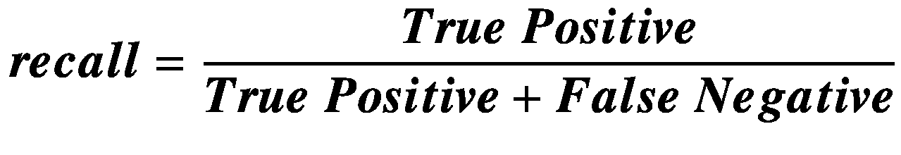

#### 精确率

如果你想知道有多少实例被错误地分类为假正例，那么你关注的就是精确率。你可以通过以下公式获得模型的精确率：

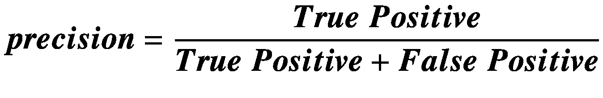


### F1 分数

当对召回率和精确率取加权平均值时，就得到了 F1 分数。它综合考虑了精确率和召回率，反映了模型的准确度。

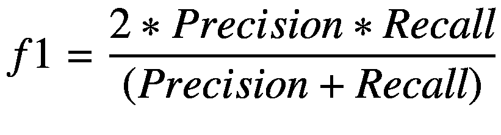

### ROC 曲线

当以假正率为横轴、真正率为纵轴绘制模型曲线，以便对模型进行可视化总结时，这条曲线被称为 ROC 曲线（见图 4-10）。

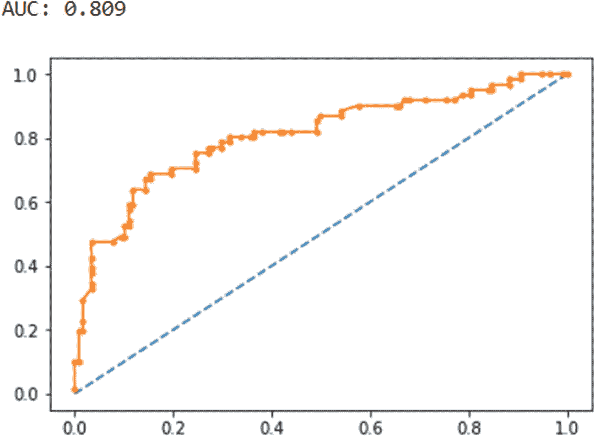

图 4-10

ROC 曲线

你可以在不同的分类阈值下绘制此图。曲线下面积越大，模型性能越好。为了更好地理解所有这些概念，让我们将它们应用到泰坦尼克号数据集上。本示例使用逻辑回归作为示例模型来测试准确度。

```
#Reading data
import pandas as pd
data = pd.read_csv("train_hp.csv")
#Splitting Data into Categorical and Numerical Dataframes
import numpy as np
data_cat = data.select_dtypes(include=[object])
data_num = data.select_dtypes(include=np.number)
#Checking the number of null values
data_cat.isnull().sum()
```

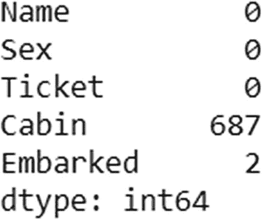

```
data_num.isnull().sum()
```

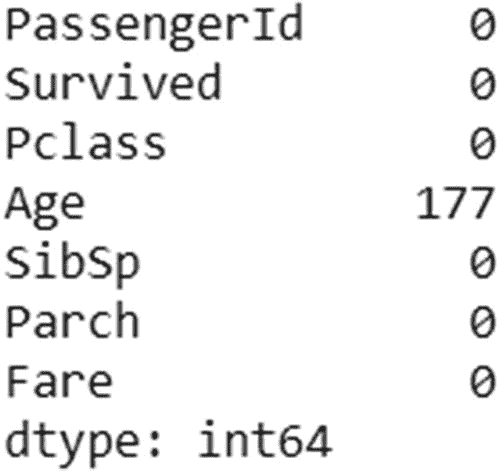

```
#Dropping the Columns having null values and columns which are not important
data_cat.drop(["Cabin","Embarked","Name","Ticket"], axis=1, inplace=True)
data_num.drop(["Age","PassengerId"], axis=1, inplace=True)
#Checking the null values again
data_cat.isnull().sum()
```

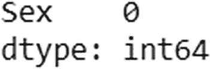

```
data_num.isnull().sum()
```

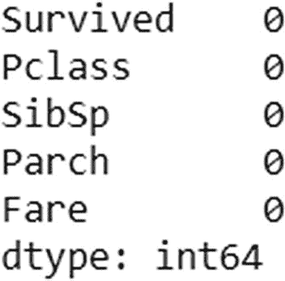

```
#Converting categorical variables into numbers
from sklearn.preprocessing import LabelEncoder
le = LabelEncoder()
data_cat = data_cat.apply(le.fit_transform)
#Combining both dataframes
data = pd.concat([data_cat,data_num], axis=1)
#Defining dependent and independent variables
X = data.drop(["Survived"], axis=1)
Y = pd.DataFrame(data[["Survived"]])
#Defining data into train and test set
from sklearn.model_selection import train_test_split
X_train, X_test, y_train, y_test = train_test_split(X, Y, test_size=0.20)
#Applying Logistic Regression
from sklearn.linear_model import LogisticRegression
lr = LogisticRegression()
lr.fit(X_train,y_train)
#Predicting Values
pred = lr.predict(X_test)
#Finding different classification measures
from sklearn.metrics import confusion_matrix, accuracy_score, recall_score, precision_score, f1_score
confusion_matrix(pred,y_test)
```

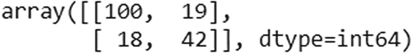

```
accuracy_score(pred,y_test)
```

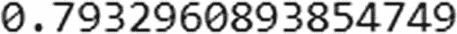

```
recall_score(pred,y_test)
```

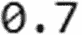

```
precision_score(pred,y_test)
```

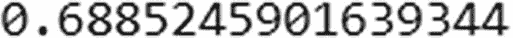

```
f1_score(pred,y_test)
```

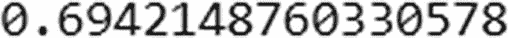

```
from sklearn.metrics import roc_auc_score, roc_curve
from matplotlib import pyplot
#### predict probabilities
probs = lr.predict_proba(X_test)
#### keep probabilities for the positive outcome only
probs = probs[:, 1]
#### calculate AUC
auc = roc_auc_score(y_test, probs)
print('AUC: %.3f' % auc)
#### calculate roc curve
fpr, tpr, thresholds = roc_curve(y_test, probs)
#### plot no skill
pyplot.plot([0, 1], [0, 1], linestyle="--")
#### plot the roc curve for the model
pyplot.plot(fpr, tpr, marker='.')
#### show the plot
pyplot.show()
```

因此，从代码中可以看出：

*   准确率为 79%
*   精确率为 68.8%
*   召回率为 70%
*   F1 分数为 69%
*   曲线下面积为 80.9%

现在，你可以尝试其他机器学习算法，看看它们是否能比逻辑回归取得更好的结果。

## 回归问题

现在你已经了解了分类模型的评估指标，接下来我们来看看回归模型的性能指标。

### 均方根误差

均方根误差由以下公式给出：

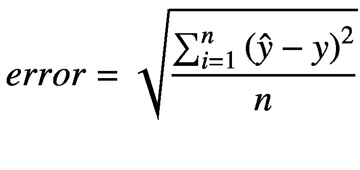

使用此公式，你可以得到模型的误差。误差越小，模型越好。`ŷ` 是预测值，`y` 是原始值。`n` 是观测值总数。

### R 平方摘要

该指标表示数据与预测回归线的接近程度。该模型解释了因变量的变异。此信息由 R 平方摘要给出。它可以用以下公式表示：

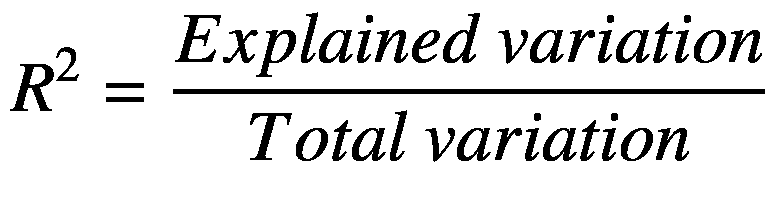

数学上，`R²` 可以表示如下：

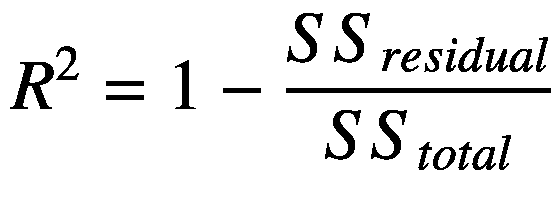

其中：

`SS_residual = Σᵢ eᵢ²` 且 `SS_total = Σᵢ (yᵢ - ȳ)²`

R 平方的值始终介于 0% 和 100% 之间：

*   0% 表示模型无法解释数据中的任何方差。
*   100% 表示模型能够解释数据中的所有方差。

### 调整后的 R 平方摘要

`R²` 分数有一个缺陷，即它假设每个自变量都会影响因变量。在现实生活中，情况可能并非如此。因此，调整后的 `R²` 只考虑那些对因变量实际有影响的变量。它由以下公式表示：

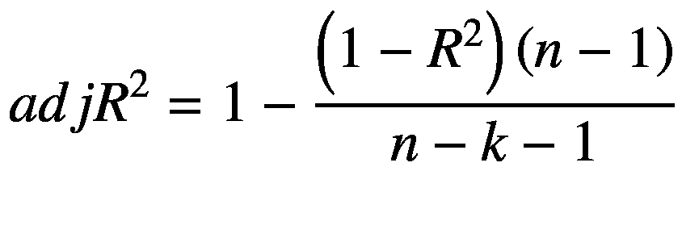

### 赤池信息准则

如果你知道模型的均方根误差，对其求平方即可得到均方误差。利用它，你可以找到模型的 AIC，如下所示：

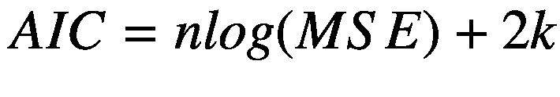

其中 `MSE` 是均方误差，`n` 是观测值总数，`k` 是回归系数的数量，也可称为自变量。

人们使用 AIC 分数是因为，有时当你尝试在模型内添加新参数时，过拟合的可能性会增加。AIC 通过引入对模型内参数数量的惩罚项来尝试解决这个问题。


### 贝叶斯信息准则

贝叶斯信息准则（`BIC`）与`AIC`类似，但其惩罚力度更大。它可以用以下公式表示：

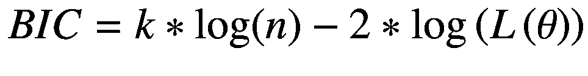

`L(θ)` 表示被测试模型的似然函数。

现在，我们将所有这些度量指标应用于房价数据集。本示例使用线性回归来理解这些应用。

```
#Reading Data
import pandas as pd
house_price = pd.read_csv("train_hp.csv")
#Partition into Categorical and Numerical Variables
import numpy as np
cat = house_price.select_dtypes(include=[object])
num = house_price.select_dtypes(include=[np.number])
#Checking Null Values
cat.isnull().sum()
num.isnull().sum()
#Removing unnecessary columns
cat.drop(["Alley", "PoolQC", "Fence", "MiscFeature"], axis=1, inplace=True)
#Removing Categorical Null Values with Mode
cat.BsmtCond.value_counts().idxmax() cat.BsmtCond.fillna(cat.BsmtCond.value_counts().idxmax(),inplace=True)
cat.BsmtQual.fillna(cat.BsmtQual.value_counts().idxmax(),inplace=True)
cat.BsmtExposure.fillna(cat.BsmtExposure.value_counts().idxmax(),inplace=True)
cat.BsmtFinType1.fillna(cat.BsmtFinType1.value_counts().idxmax(),inplace=True)
cat.BsmtFinType2.fillna(cat.BsmtFinType2.value_counts().idxmax(),inplace=True)
cat.FireplaceQu.fillna(cat.FireplaceQu.value_counts().idxmax(),inplace=True)
cat.GarageCond.fillna(cat.GarageCond.value_counts().idxmax(),inplace=True)
cat.GarageFinish.fillna(cat.GarageFinish.value_counts().idxmax(),inplace=True)
cat.GarageQual.fillna(cat.GarageQual.value_counts().idxmax(),inplace=True)
cat.GarageType.fillna(cat.GarageType.value_counts().idxmax(),inplace=True)
cat.Electrical.fillna(cat.Electrical.value_counts().idxmax(),inplace=True)
cat.MasVnrType.fillna(cat.MasVnrType.value_counts().idxmax(),inplace=True)
#Removing Numerical Null Values with Mean
num.LotFrontage.fillna(num.LotFrontage.mean(),inplace=True)
num.GarageYrBlt.fillna(num.GarageYrBlt.mean(),inplace=True)
num.MasVnrArea.fillna(num.MasVnrArea.mean(),inplace=True)
#Converting words to Integers
from sklearn.preprocessing import LabelEncoder
le = LabelEncoder()
cat1 = cat.apply(le.fit_transform)
#Combining two dataframes
house_price2 = pd.concat([cat1, num], axis=1)
#Getting Dependent and Independent Variables
X = house_price2.drop(["SalePrice"], axis=1)
Y = pd.DataFrame(house_price2["SalePrice"])
#Getting Train and Test Set
from sklearn.model_selection import train_test_split
X_train, X_test, Y_train, Y_test = train_test_split(X, Y, test_size=0.20)
#Applying Linear Regression
import statsmodels.api as sm
est = sm.OLS(Y_train, X_train)
est2 = est.fit()
est2.summary()
```

如图 4-11 所示，通过`summary()`函数，你可以看到所有度量指标。还有其他各种 Python 包也明确提供了这些度量指标。

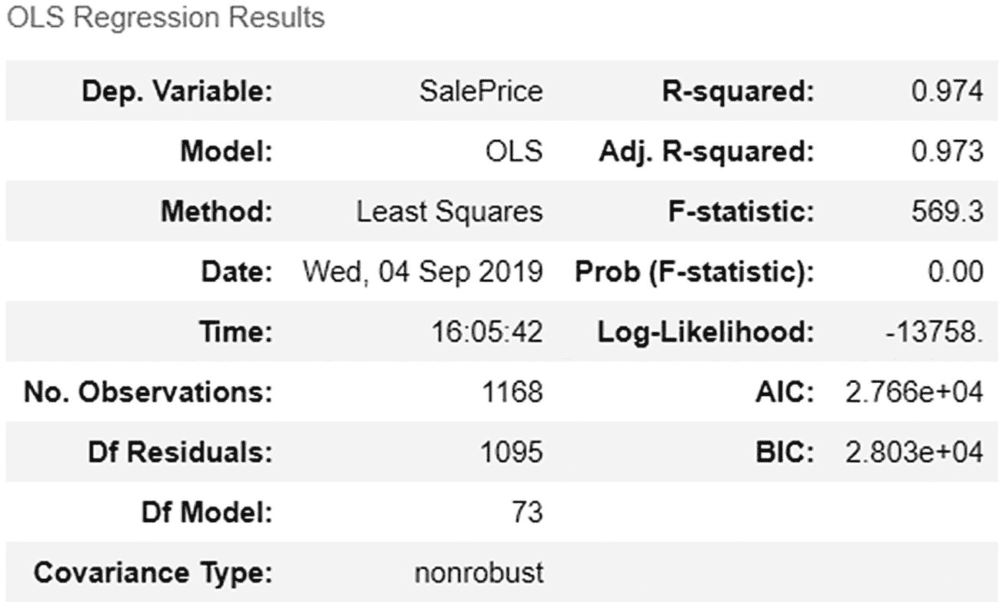

图 4-11

数值度量指标

### 过拟合与欠拟合

下一章将介绍其中一些机器学习方法，但在此之前，你必须能够判断模型性能不佳的原因。这可能是由于数据的*过拟合*或*欠拟合*导致的。

你用来构建模型的数据只是宇宙中所有数据的一个样本。可以说，这些数据是不完整且有噪声的。因此，当训练模型时，它会尝试学习如何很好地泛化到新数据。换句话说，模型所学到的内容能否成功应用于新数据，这被称为*泛化*。

如果模型对数据拟合得过于完美，则称为*过拟合问题*。有时数据中包含过多的细节以及大量不必要的信息。如果模型从这些高度具体的数据（尤其是细节和额外噪声）中学习，就可能导致过拟合。这会对性能产生负面影响。在欠拟合中，模型无法从数据中学习，因此无法在未见过的数据上表现良好。

当数据集不平衡时，就会发生欠拟合和过拟合。假设对于一个二分类问题，90% 的数据来自一个类别，其余来自另一个类别。在这种情况下，模型将学习到大部分与第一类相关的内容，而与第二类相关的内容则很少。如果你训练模型过于激烈或向模型添加参数，也可能发生这种情况。

当训练模型的时间过长时，会发生过拟合；而当模型训练时间不足时，会发生欠拟合。换句话说，如果你将模型训练到误差开始增加的程度，就可能发生过拟合。但是，如果在误差仍然很高且可以进一步降低时就停止训练模型，则可能发生欠拟合。

解决这个问题的最佳方法是在过拟合和欠拟合之间找到完美的平衡点。图 4-12 展示了这种最佳方法。这个概念被称为*偏差-方差权衡*，将在下一节中解释。

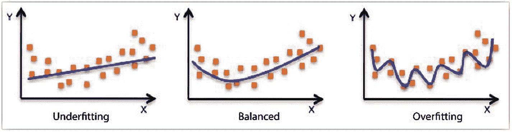

图 4-12

过拟合与欠拟合

### 偏差与方差

当模型在训练时对训练数据关注甚少，那么它就会成为一个有偏差的模型。在这种情况下，预测值与原始值之间的差异会变得相当大。换句话说，误差很大。

当模型发生过拟合时，即对数据（包括噪声和细节）给予了过多关注，模型的方差会变得很高。因此，在这种情况下，模型在训练数据上表现非常好，但在未见过的数据上表现不佳。

为了解决这些问题，我们使用*偏差-方差权衡*的概念。在这种情况下，我们试图找到一种折中方法，使得偏差和方差都不高。换句话说，我们试图避免数据出现过拟合和欠拟合。图 4-13 展示了偏差和方差如何与过拟合和欠拟合的概念相关联。

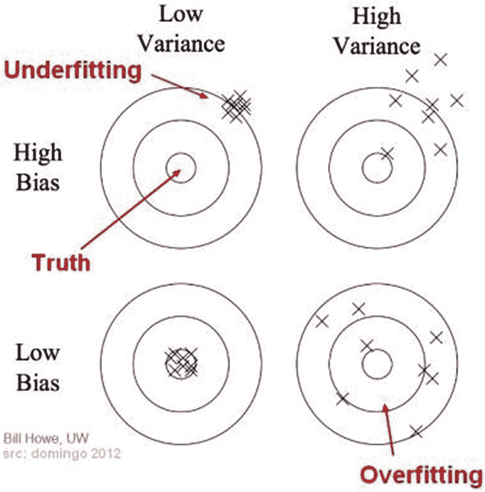

图 4-13

偏差与方差

以下是一些可用于解决过拟合问题的方法。

*   添加交叉验证
*   使用更多数据进行训练
*   移除特征
*   提前停止训练
*   添加正则化
*   使用集成学习的概念

你可以通过以下方法解决欠拟合问题：

*   添加特征
*   使用更多数据进行训练
*   增加训练时间
*   移除正则化

## 总结

本章介绍了理解机器学习以及模糊神经网络架构所需的基础知识。我们讨论了监督学习和无监督学习方法，以及机器学习在分类和回归问题中的应用。本章还讨论了针对这两种问题的不同准确性度量指标，以及如何在 Python 中应用它们。

下一章将详细讨论其中一些机器学习算法。你将学习如何应用本章讨论的大部分概念。


