# 5. 人工神经网络

前一章讨论了与机器学习相关的各种术语，以及用于检验模型准确性的一些指标。本章将讨论神经网络的概念。

本章首先解释人工神经网络及其组成部分。它会详细讲解其中一些组件，比如激活函数、层等。接着，本章将介绍一些高级的神经网络架构，例如卷积神经网络、循环神经网络、长短期记忆网络和门控循环单元。同时，也会展示这些概念在 Python 中的一些应用。

## 人工神经网络入门

人工神经网络（ANNs）的灵感来源于生物神经元的功能。核心机器学习算法使用统计概念来学习数据中存在的不同模式。ANNs 则试图尽可能地模仿人脑和神经元来学习模式。通过使用线性代数和微积分的数学技术，ANNs 从数据中学习并试图发现模式。

一个 ANN 由以下几层组成：

- 输入层
- 隐藏层
- 输出层

输入层包含你想要用来训练网络的样本。你拥有的所有用于让系统学习的数据，都提供给输入层。训练网络意味着机器试图找出数据中存在的所有可能模式，然后学习它们。训练的好处在于，当你提供一组新数据时，机器会尝试将学到的模式应用于这组新数据。如果模式匹配，就会根据训练数据中遵循此模式的处理方式做出决策。

隐藏层试图查看输入层的不同组合，并决定哪些组合是重要的，以及应该给予它们多大的重要性。它们借助权重来完成这项工作。因此，可以说隐藏层接收的是加权输入。

一旦所有处理完成，输出层就会计算程序的所有输出并提供结果。图 5-1 展示了所有这三层的基本表示。

神经网络通过应用前向传播和反向传播的概念来运作。因此，在详细讨论 ANN 架构之前，理解这些概念是至关重要的。

图 5-1 中的图形也称为计算图。图中的每个节点用一个圆圈表示，代表一个变量。这个变量可以是标量、向量或张量。有时它也可以是另一个变量。每个节点都是通过对前一个节点应用某种操作计算得出的。因此，在图 5-1 中，隐藏节点由输入节点计算得出，输出节点由隐藏节点计算得出。这种通过前一个节点的操作来计算输出节点，并且信息从输入节点传递到输出节点的过程，称为*前向传播*。

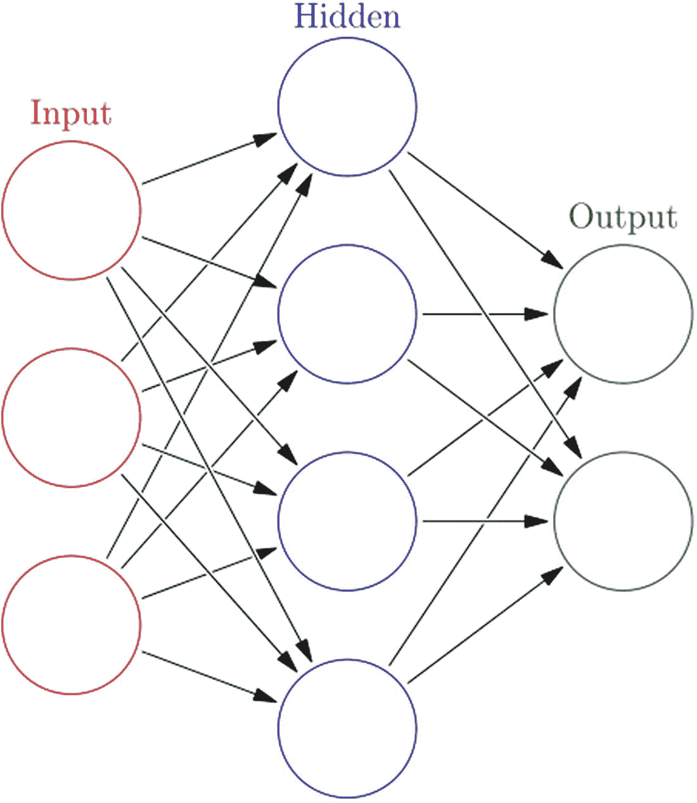

图 5-1

ANNs 的计算图

一旦创建了输出节点并使用前向传播方法计算了它们的值，就需要计算梯度，这要求信息从输出节点反向流向输入节点。这个概念称为*反向传播*。在神经网络中，使用反向传播方法计算梯度变得非常重要，因为它有助于最小化代价函数，从而得到更好、更准确的预测。

从数学上讲，反向传播过程可以表示为：

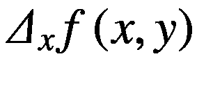

你可以计算函数 `f()` 的梯度，其中 `x` 是需要求导的变量集合，`y` 是不需要求导的变量（例如，输入节点）。在像神经网络这样的学习算法中，这个输出函数被称为*代价函数*，表示为：

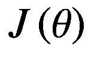

对于二分类问题，损失函数 `J(θ)` 可以定义如下：

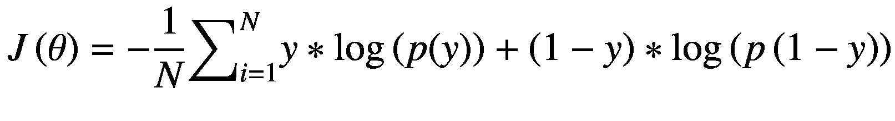

因此，这个方程对输入节点进行微分，直到损失值达到最小。这个最小值是通过在梯度下降过程中达到一个称为全局最小值的点来确定的。图 5-2 展示了梯度下降过程。

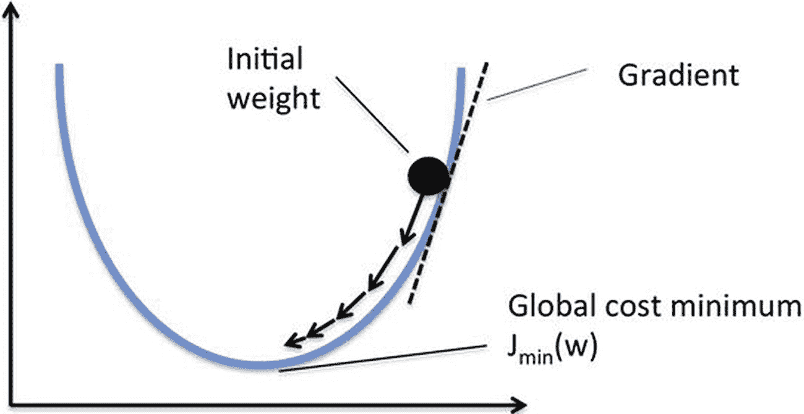

图 5-2

梯度下降

每次你对代价函数求导以找到梯度时，你都会沿着图 5-2 所示的抛物线曲线向下移动。反向传播的目标是到达曲线底部的一个点，在该点损失函数的值最小。当值达到最小时，你就找到了产生该值的变量值。在神经网络的情况下，这些变量被称为*权重*和*偏置*。你使用这些变量来预测测试集中的下一组值。

牢记这些概念，现在是时候更深入地研究 ANNs 了。ANNs 可以分为两种类型：

- 感知机
- 多层 ANNs

接下来的部分将解释这两种 ANNs，然后本章将继续介绍一些用于计算机视觉和自然语言处理领域的复杂神经网络架构。

## 感知机

*感知机*是一种单层神经网络，这意味着它只有输入层。通过使用不同的参数，你可以得到输出。其架构可能如图 5-3 所示。

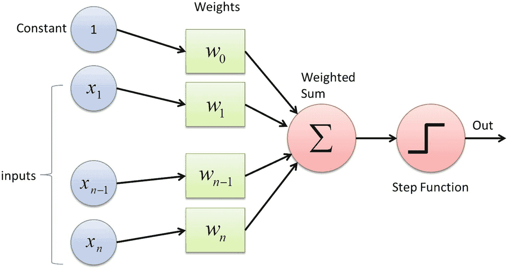

图 5-3

典型的感知机架构

感知机主要用作线性（二分类）分类器。二分类器将输入仅分为两个类别。如图 5-3 所示，感知机由以下部分组成：

- 输入层
- 权重和偏置参数
- 加权输入求和
- 对加权和施加激活/阶跃函数以得到输出

因此，在感知机中，所有输入都与学习到的权重（`w`）相乘。这些权重是通过反向传播过程学习到的。对加权输入进行求和，然后将输出传递给激活函数，激活函数提供最终输出。激活函数有多种类型，它们根据公式给出不同的输出。为了进行二分类，你可以使用 sigmoid 或 ReLU 激活函数。在进一步讨论多层感知机之前，先来看一下激活函数。


### 激活函数

隐藏层或输出层中的每个神经元都有其自身的激活函数。这有助于判断特定神经元的输出是否重要。系统已学习到的权重会与输入神经元的值相乘。然后，会加上一个偏置值。输出值基于激活函数，该函数决定了重要性。当输出层中有一个激活函数时，它会接收所有先前应用了激活函数的神经元的输出，并通过执行加权求和来给出最终答案。激活函数有多种类型，其中一些包括：

*   Sigmoid
*   Tanh
*   Softmax
*   ReLU
*   Leaky ReLU

### Sigmoid 激活函数

Sigmoid 激活函数具有 S 形曲线。其取值范围在 0 到 1 之间。由于其上下限分别为 0 和 1，它最广泛地用于二分类问题。以下是 Sigmoid 激活函数的公式和曲线（见图 5-4），以及 Python 实现。

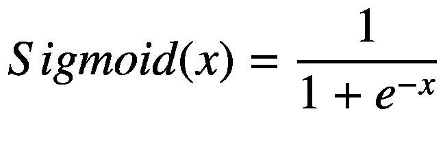

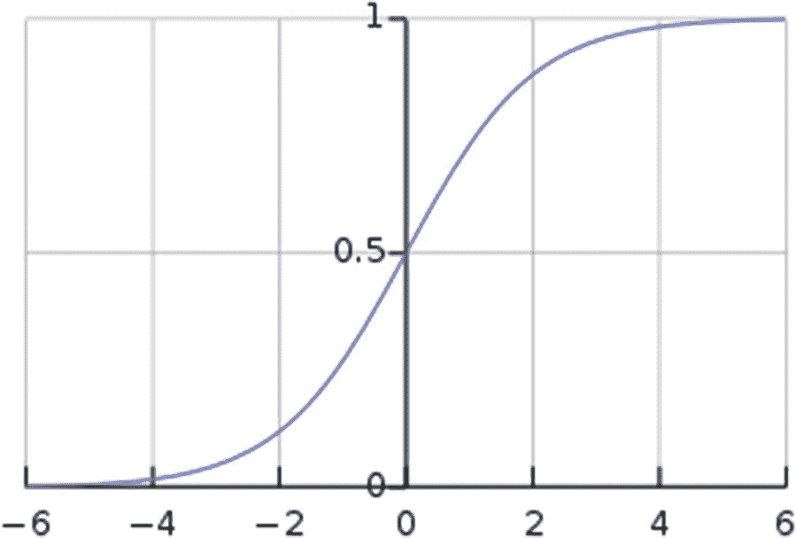

图 5-4 Sigmoid 激活函数

```
import numpy as np
def sigmoid(x):
return 1 / (1 + np.exp(-x))
```

### Tanh 激活函数

`Tanh` 也被称为双曲正切函数。该函数的形状也像字母 S，但其取值范围是从 -1 到 +1。当您需要考虑负输出时，会使用此函数。通常，建议在隐藏层中使用 `Tanh`，因为它允许不同层的输出也能给出负值。输出层的输出可以传递给 Sigmoid 函数以获得正值，但在中间层，应该从数据中捕获更多信息，而 `Tanh` 为您提供了一种实现方式。以下是 `Tanh` 激活函数的公式和曲线（见图 5-5），以及 Python 实现。

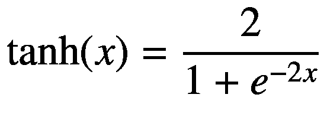

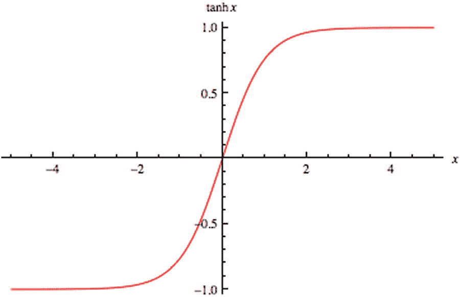

图 5-5 Tanh 激活函数

```
import numpy as np
def tanh(x):
return np.tanh(x)
```

### Softmax 激活函数

当处理二分类问题时，您会使用 Sigmoid 函数。但如果您有多个类别，则应改用 Softmax 激活函数。Softmax 函数的输出是每个类别相对于所有类别的概率。具有最大概率的类别被认为是预测类别。以下是 Softmax 函数的公式和曲线（见图 5-6），以及 Python 实现。

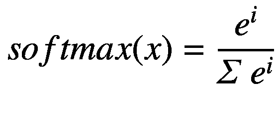

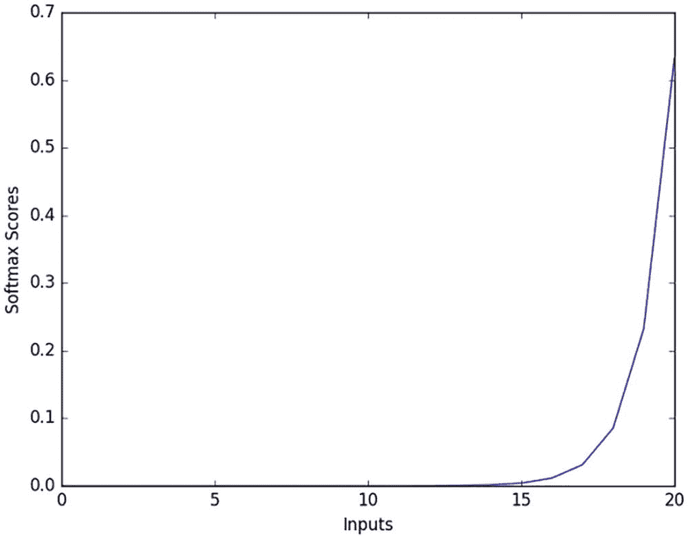

图 5-6 Softmax 激活函数

```
import numpy as np
def softmax(x):
exps = np.exp(x)
return exps / np.sum(exps, axis=1).reshape(-1,1)
```

### 修正线性单元 (ReLU) 激活函数

`ReLU` 激活函数的下限为 0，但没有上限。这意味着如果加权和是整数或自然数，则输出将返回确切的值。但如果输出小于 0，则输出将被转换为 0。它可以用以下公式和图 5-7 中的曲线表示。

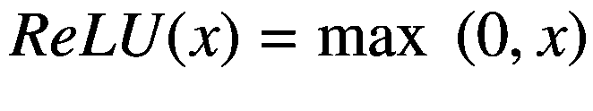

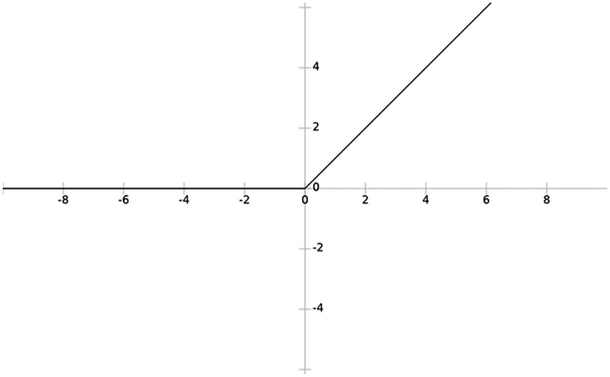

图 5-7 ReLU 激活函数

以下是 Python 实现。

```
import numpy as np
def relu(x):
return 1.0*(x>0)
```

### Leaky ReLU 激活函数

这与 `ReLU` 完全相同，但它的下限并非严格为 0，值可以小于 0，以便解决“神经元坏死问题”（接下来讨论）。您取一个值 *α* 并将其乘以原始值，这样新值就可以小于 0。以下是 Leaky `ReLU` 的公式和曲线（见图 5-8），以及 Python 实现。

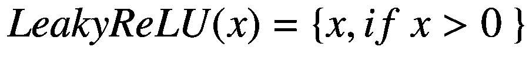

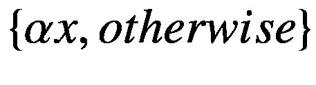

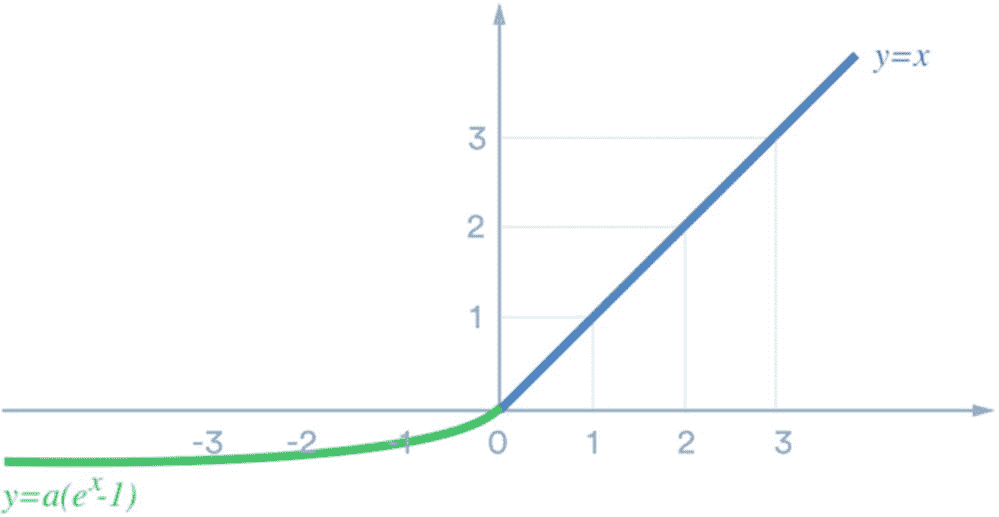

图 5-8 Leaky ReLU 激活函数

```
import numpy as np
def leaky_relu(x, leaky_slope):
d=np.zeros_like(x)
d[X0]=1
return d
```

以下是这些 Python 方法的应用：

```
import numpy as np
#定义 x 的虚拟值
x = np.linspace(-np.pi, np.pi, 12)
#计算激活函数输出
sigmoid_output = sigmoid(x)
tanh_output = tanh(x)
softmax_output = softmax(x)
relu_output = relu(x)
leaky_relu_output = leaky_relu(x)
#打印输出
print(sigmoid_output)
print(tanh_output)
print(softmax_output)
print(relu_output)
print(leaky_relu_output)
```

#### 什么是神经元坏死问题？

一旦系统学习了每个神经元的权重和偏置，并且您将 `ReLU` 作为激活函数，它通常会输出与输入相同的值。但由于任何小于 0 的值都会被转换为 0，神经元可能无法区分不同的输入。这个问题被称为神经元坏死问题。

这会使神经元实际上处于死亡状态。即使是负值的斜率也为零。如果您继续前进而不注意这个问题，最终神经网络的大部分将变得毫无作用。这个问题通常发生在学习率过高时。通过降低学习率或更改激活函数（例如改为 Leaky-`ReLU`），您可以解决这个问题。

## 多层人工神经网络

有多种不同类型的多层人工神经网络。本章讨论最相关的几种。多层人工神经网络的通用架构如图 5-9 所示。

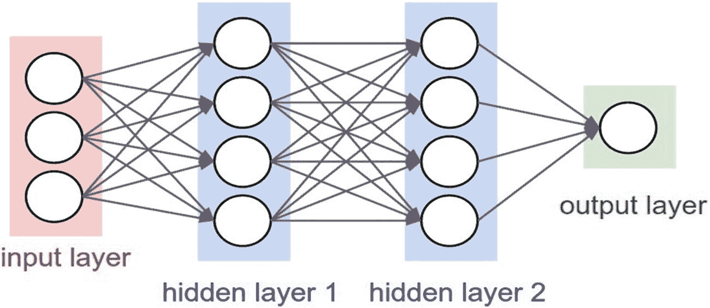

图 5-9 典型的多层人工神经网络架构

以下各节将回顾这些人工神经网络：

*   卷积神经网络
*   循环神经网络
*   长短期记忆网络
*   门控循环单元


## 卷积神经网络

卷积神经网络应用于图像识别、图像分类、目标检测、人脸识别等领域。在了解 CNN 的架构和流程之前，你首先需要理解计算机是如何“看”和理解图像的。

计算机将图像分解为像素矩阵，并为每个像素存储颜色代码，如图 5-10 所示。

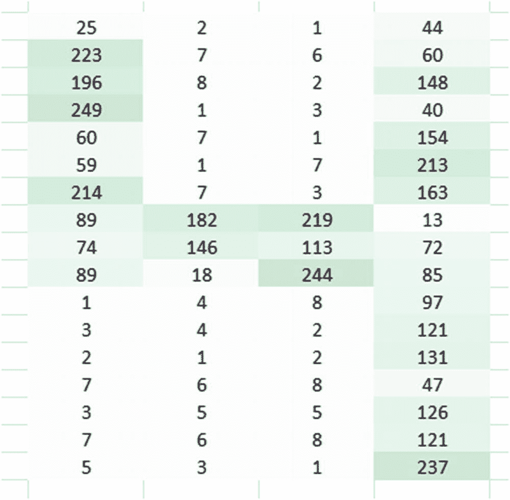

图 5-10

像素矩阵

在图 5-10 的图像中，1 代表白色，256 代表最深色。在处理图像时，不建议使用普通的神经网络。像素越多，权重就越多。这意味着，如果你有一张 64x64 的 RGB 图像，像素数量将达到 12,288，因此权重数量也将是 12,288。而有些图像甚至超过 1000x800。因此，即使经过大量计算，你也无法获得良好的准确率。解决这个问题的方法是 CNN。CNN 不是分析整个输入，而是只观察其中的一小部分。

CNN 图像分类接收输入图像（此处为动物图像），对其进行处理，并将其归类到特定类别（例如狗、猫或老虎）。定义基本卷积网络有四个基本组件。

* 卷积层
* 激活函数层
* 池化层
* 输出层

我们来更详细地了解每一个组件。

### 卷积层

卷积层是卷积神经网络的主要构建模块。卷积层用于理解图像中存在的模式，并从中提取有趣的特征。卷积层的总数定义了你想从图像中提取的特征总数。例如，五个卷积层意味着从图像中学习五个特征。这些特征可能是可解读的，比如寻找边缘或阈值图像等，也可能过于复杂而让人类难以理解。因此，这是负责学习特征的主要层，例如包含人的图像具有哪些独特特征，以及这些特征与动物图像中的特征有何不同。所有滤波器的值都是可学习的，这意味着你必须向 CNN 提供矩阵维度，它将自动学习卷积的最佳值。这个卷积矩阵也称为核或滤波器。

从数学上讲，每个核操作都以图 5-11 所示的方式进行。

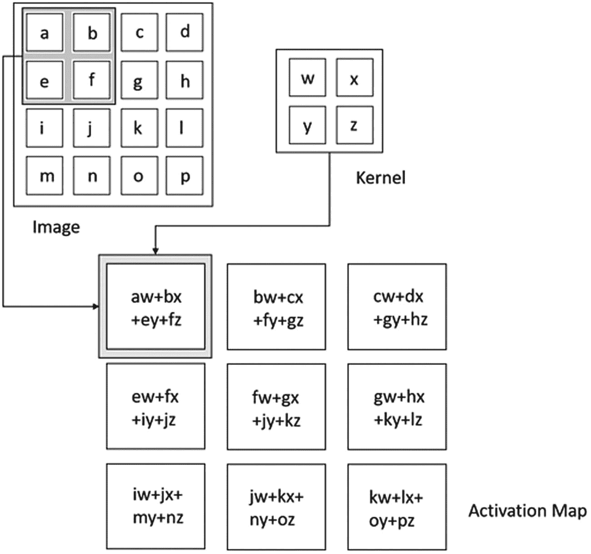

图 5-11

通过滤波器进行卷积的过程

根据核矩阵的大小，在图像的特定部分进行矩阵点积运算。此操作持续进行，直到核覆盖整个图像。与原始图像相比，这会生成一个维度更小的新图像，但图像的深度更高。输出称为激活图，该过程称为步长。

### 填充

滤波器可能完美地适配图像内部。但如果不适配，你可以使用填充的概念。在此过程中，你在输入图像中添加一些额外的值，以便滤波器能够良好适配。最常用的值是 0（称为零填充）。或者，你也可以丢弃滤波器不适配的图像部分。

### 激活函数

分类的实际决策是在这一层做出的。CNN 中最常用的激活函数是 ReLU，即修正线性单元。这有助于神经元对所有正值输出精确的像素值，但对于所有负值，输出始终为零。这会导致生成稀疏矩阵，从而意味着更少的计算时间和更好的学习效果。通常，像素值为正，因此 ReLU 死亡问题并不适用。

### 池化层

如果图像来自数码单反相机，分辨率会非常高。由于分辨率高，像素数量也会很多。即使你使用维度小于输入图像的滤波器，计算时间仍然会很长。因此，为了解决这个问题，你可以使用池化。它用于减小输入图像的尺寸，以及卷积结果的尺寸。正因如此，需要分析的参数数量更少，从而计算时间减少。该层独立地对每个特征图（单个卷积的结果）进行操作。

池化，也称为子采样或下采样，可以分为不同类型：

* 最大池化
* 平均池化
* 求和池化

最常见的池化方法是*最大池化*。最大池化从卷积矩阵中取最大元素。如果不是取最大值，而是求平均值，则称为平均池化。对卷积矩阵中的所有元素求和则称为求和池化。

最大池化操作的示例如图 5-12 所示。

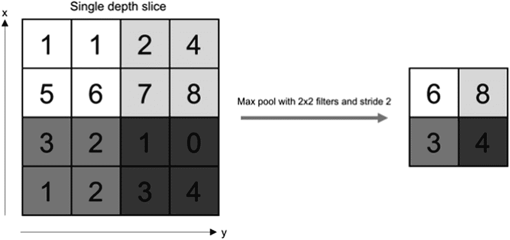

图 5-12

最大池化操作


### 输出层

在池化和卷积过程完成后，最后一层操作开始，这一层被称为输出层。输出层是一个全连接层网络，这意味着前一层中的所有神经元都与输出层中的所有神经元相连。在输出层中，神经网络的常规操作开始。

这意味着，一旦通过卷积和池化操作从多张图像中学习并提取了所有特征，这些学习到的特征就会被传递到一个常规神经网络，该网络最终利用这些信息对图像进行分类。

图 5-13 展示了卷积神经网络的完整操作。

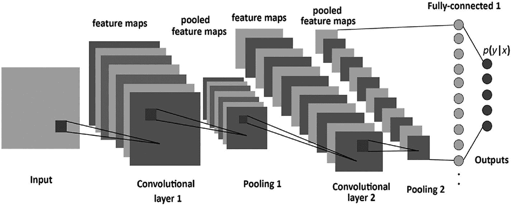

图 5-13

CNN 的典型架构

以下是在 MNIST 数据集上实现 CNN 进行数字识别的代码。你可以在 GitHub 仓库中找到此代码的分离版本。

```python
from keras.datasets import mnist
import matplotlib.pyplot as plt
from keras.models import Sequential
from keras.layers import Dense, Conv2D, Flatten
from keras.utils import to_categorical
#download mnist data and split into train and test sets
(X_train, y_train), (X_test, y_test) = mnist.load_data()
f1 = plt.figure(1)
plt.imshow(X_train[0])
f2 = plt.figure(2)
plt.imshow(X_train[1])
plt.show()
#check image shape and data count
print(X_train[0].shape, len(X_train))
print(X_train[0].shape, len(X_test))
#reshape data to fit model
X_train = X_train.reshape(len(X_train),28,28,1)
X_test = X_test.reshape(len(X_test),28,28,1)
#One-hot encode target column
y_train = to_categorical(y_train)
y_test = to_categorical(y_test)
y_train[0]
#Create model
model = Sequential()
#Add Input CNN Layer
model.add(Conv2D(64, kernel_size=3, activation="relu", input_shape=(28,28,1)))
#Add second CNN Layer
model.add(Conv2D(32, kernel_size=3, activation="relu"))
#Add the fully connected layer
model.add(Flatten())
model.add(Dense(10, activation="softmax"))
#Compile model using accuracy to measure model performance
model.compile(optimizer='adam', loss="categorical_crossentropy", metrics=['accuracy'])
#Train the model
model.fit(X_train, y_train, validation_data=(X_test, y_test), epochs=3)
#predict first 6 images in the test set
model.predict(X_test[:6])
#actual results for first 6 images in the test set
y_test[:6]
```

## 循环神经网络

循环神经网络用于序列数据的分析和预测，尤其在金融、视频分析和音频分析领域。它们能够理解数据的上下文并保留信息。大多数传统的机器学习问题假设输入的过去值是不相关且独立的。但如果你观察上述领域，你会发现变量与其过去值之间存在关系。当前的股票价格与前一天或前一个月的股票价格相关。句子中的当前单词依赖于前面的单词。

这类数据被称为*时间序列数据*。RNN 提供了一种有效计算方法，可以根据当前提供的序列预测下一个序列。

图 5-14 和 5-15 展示了一个简单的 RNN 结构。

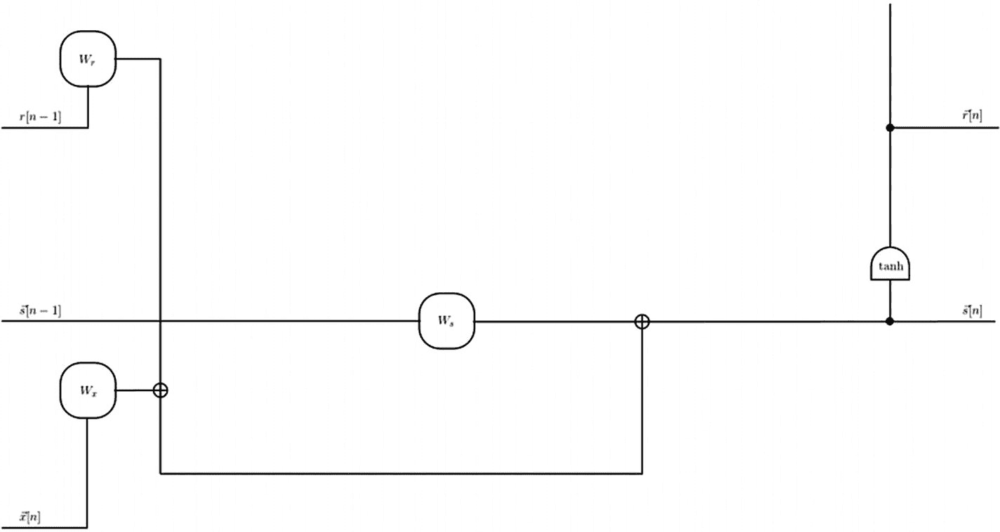

图 5-15

单个 RNN 单元 (arXiv:1808.03314v4 [cs.LG] 4 Nov 2018)

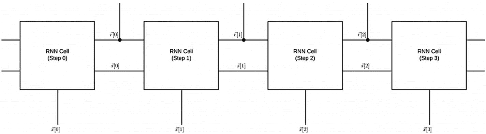

图 5-14

RNN 单元序列 (arXiv:1808.03314v4 [cs.LG] 4 Nov 2018)

以下是前面图表中使用的 RNN 符号说明：

*   `S` 是隐藏状态
*   `x` 是输入向量
*   `W` 是权重
*   `r` 是激活后的输出

现在让我们看看 RNN 单元的完整过程。在时间步 `t`，RNN 单元接收一个输入 `x`。它还接收来自前一个 RNN 单元的隐藏状态值。这有助于 RNN 考虑先前的上下文并理解新的输入。在这个 RNN 中，通过对先前状态和输入应用 `Tanh` 激活函数来计算新的（隐藏）状态。在所有组合的 RNN 单元中，权重矩阵 `W` 在整个过程中是共享的。

```python
import pandas as pd
import numpy as np
import matplotlib.pyplot as plt
from keras.models import Sequential
from keras.layers import Dense, SimpleRNN
#Generating Random Data
t=np.arange(0,1000)
x=np.sin(0.02∗t)+2∗np.random.rand(1000)
df = pd.DataFrame(x)
df.head()
#Splitting into Train and Test set
values=df.values
train, test = values[0:800,:], values[800:1000,:]
### convert dataset into matrix
def convertToMatrix(data, step=4):
X, Y =[], []
for i in range(len(data)-step):
d=i+step
X.append(data[i:d,])
Y.append(data[d,])
return np.array(X), np.array(Y)
trainX,trainY =convertToMatrix(train,6)
testX,testY =convertToMatrix(test,6)
trainX = np.reshape(trainX, (trainX.shape[0], 1, trainX.shape[1]))
testX = np.reshape(testX, (testX.shape[0], 1, testX.shape[1]))
#Making the RNN Structure
model = Sequential()
model.add(SimpleRNN(units=32, input_shape=(1,6), activation="relu"))
model.add(Dense(8, activation="relu"))
model.add(Dense(1))
#Compiling the Code
model.compile(loss='mean_squared_error', optimizer="rmsprop")
model.summary()
#Training the Model
model.fit(trainX,trainY, epochs=1, batch_size=500, verbose=2)
#Predicting with the Model
trainPredict = model.predict(trainX)
testPredict= model.predict(testX)
predicted=np.concatenate((trainPredict,testPredict),axis=0)
```

RNN 的问题在于它们会遭受梯度消失和梯度爆炸的困扰。你已经知道 RNN 最适合处理时间序列数据。但想象一篇由多个段落组成的文本。在第一段中，作者告诉读者她在谈论英格兰。在随后的所有段落中，她都在谈论同一个国家，但没有提及该国家的名称。作为人类读者，我们明白这个感兴趣的国家是英格兰，但对于 RNN 来说，这种模糊性可能会引发问题。

神经网络通过反向传播的概念进行学习。该过程从神经网络的最后一层开始，可以一直向前移动到第一层。为了向后从一层移动到另一层，你需要使用矩阵乘法和线性代数的概念。如果当前值太大或太小，这就会导致问题。如果值 <1，你不断向后移动，值会不断缩小直至消失。这使得无法从数据中学习，这个问题被称为*梯度消失问题*。类似地，如果值太大，它们会不断变大，直到模型崩溃。这个问题被称为*梯度爆炸问题*。

为了克服这些问题，你可以使用 LSTM（长短期记忆网络）和 GRU（门控循环单元）。接下来的部分将先介绍 LSTM，然后是 GRU。


## 长短期记忆网络

如前所述，RNN 常常难以回忆起很久之前的信息。考虑以下文本：

*“Shreya 从小就对舞蹈着迷。她懂得许多不同的舞蹈风格。她主要跳霹雳舞，但现在她在企业工作。她从事深度学习方面的工作。”*

Shreya 会跳哪种舞蹈风格？

这就是循环神经网络可能失效的地方！其背后的原因是梯度消失问题。一旦输入大量词语，这些信息就会在某处丢失。这个问题可以通过使用 RNN 的一个略微修改的版本来解决，即 LSTM（长短期记忆网络）。

LSTM 由以下组件组成：

- 细胞
- 细胞状态
- 隐藏状态
- 门

一个*细胞*是一个存储信息的记忆单元。细胞也有能力决定存储什么以及何时允许读取。因此，这赋予了 LSTM 选择性记忆或遗忘的能力。

为了使细胞运用这种决策能力，它们接收两种状态：细胞状态和隐藏状态。整个遗忘和记忆机制在 LSTM 中是通过称为*门*的东西来完成的。门类似于神经网络节点，它们要么阻止信息，要么让信息通过。它们通过从作为输入给出的信息中学习权重和偏置参数来实现这一点。权重使用反向传播方法学习。图 5-16 展示了 LSTM 的架构。让我们更详细地看看 LSTM 的组件。

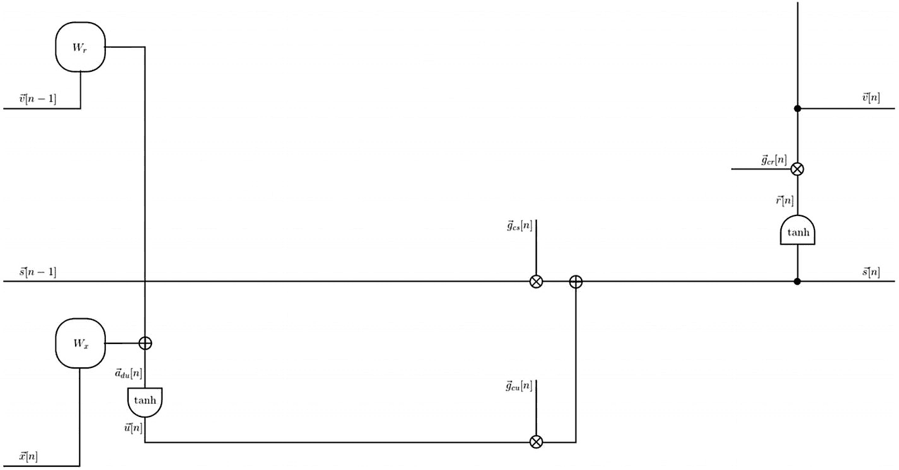

图 5-16 简单的 LSTM 细胞（arXiv:1808.03314v4 [cs.LG] 2018 年 11 月 4 日）

图 5-16 中穿过中心的水平线 *s* 被认为是细胞状态。细胞状态的值可以使用以下门来改变：

- 遗忘门
- 输入门
- 输出门

### 遗忘门

顾名思义，如果你想从细胞状态中移除一些不必要的信息，你就使用这个门。这个决定是通过将过去的细胞状态和当前输入传递给一个 sigmoid 函数来做出的。输出要么是 0，要么是 1。值为 0 意味着遗忘该输出，值为 1 意味着保留它。因此，无论哪里值为 0，该数字都会从细胞状态矩阵中被移除。这个细胞中的数学运算可以表示为：

![$$ {f}_t=\sigma \left({W}_f.\left[{h}_{t-1},{x}_t\right]+{b}_f\right) $$](images/479940_1_En_5_Chapter/479940_1_En_5_Chapter_TeX_Equj.png)

图 5-17 展示了这些运算。

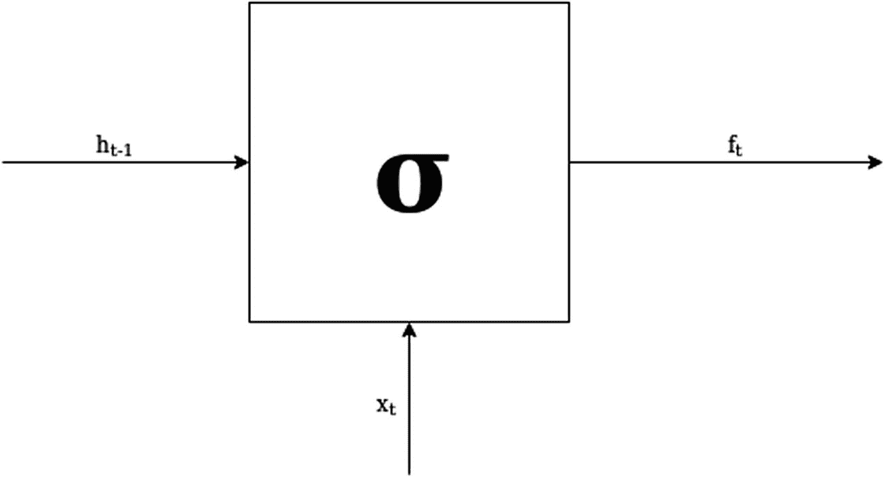

图 5-17 遗忘门

下一步是决定你将要在细胞状态中存储什么新信息。这有两个部分。首先，一个称为输入门层的 sigmoid 层决定你将更新哪些值。接着，一个 Tanh 层创建一个新的候选值向量 `Ct`，这些值可以被添加到状态中。在下一步中，你将这两者结合起来，以创建对状态的更新。

### 输入门

一旦你移除了琐碎的信息，下一步就是添加新信息。首先，使用一个 sigmoid 函数，你将过去的细胞状态和当前输入传递给它。这会给出一个 0 或 1 的输出。无论哪里得到 1，该信息都将被传递到新的细胞状态。接着，你将相同的两个输入传递给一个 Tanh 函数。这有助于你获取所有可能被添加到细胞状态的信息。最后，Tanh 和 sigmoid 的输出将被相乘（使用 Hadamard 乘积），最终输出将被添加到细胞状态。这个过程由以下数学运算表示：

![$$ {i}_t=\sigma \left({W}_i.\left[{h}_{t-1},{x}_t\right]+{b}_i\right) $$](images/479940_1_En_5_Chapter/479940_1_En_5_Chapter_TeX_Equk.png)

![$$ {\underset{\_}{C}}_t=\tanh \left({W}_c.\left[{h}_{t-1},{x}_t\right]+{b}_c\right) $$](images/479940_1_En_5_Chapter/479940_1_En_5_Chapter_TeX_Equl.png)

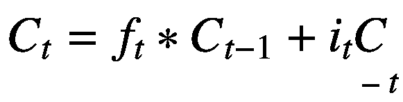

图 5-18 展示了所有运算。

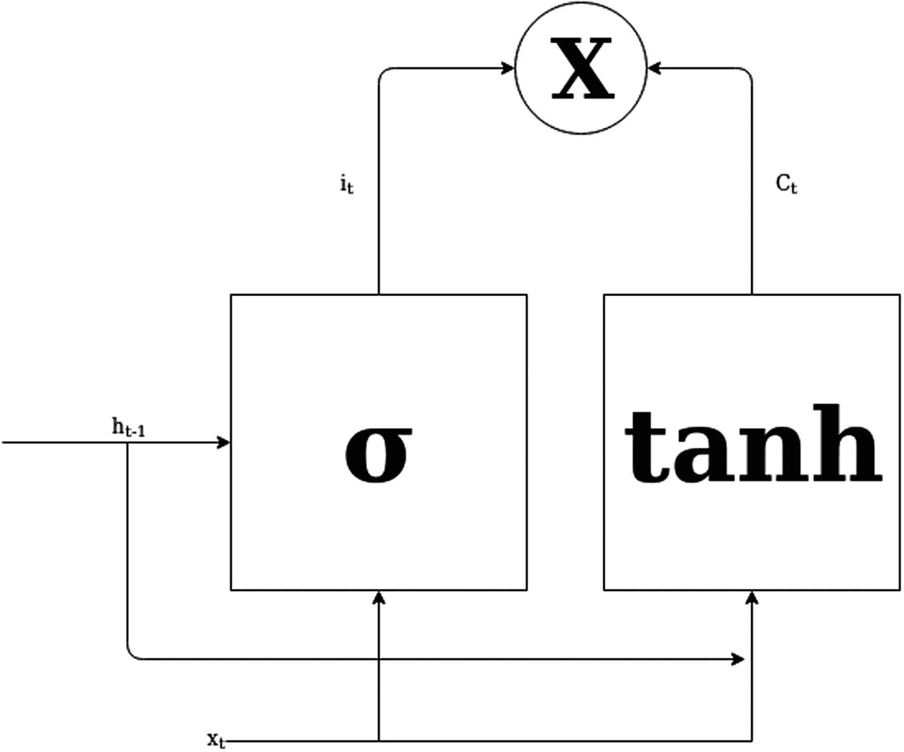

图 5-18 输入门

### 输出门

在这个门中，你首先将细胞状态的值缩放到 -1 和 +1 之间。这是通过将当前状态传递给一个 Tanh 函数来完成的。接着，你使用与遗忘门相同的 sigmoid 过滤器，并将其应用到这里。这有助于确定哪些值需要被输出。两者的结合将给出最终输出以及下一个 LSTM 细胞的细胞状态输入。数学上如下所示：

![$$ {o}_t=\sigma \left({W}_o.\left[{h}_{t-1},{x}_t\right]+{b}_0\right) $$](images/479940_1_En_5_Chapter/479940_1_En_5_Chapter_TeX_Equn.png)

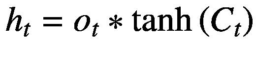

图 5-19 展示了输出门的运算。

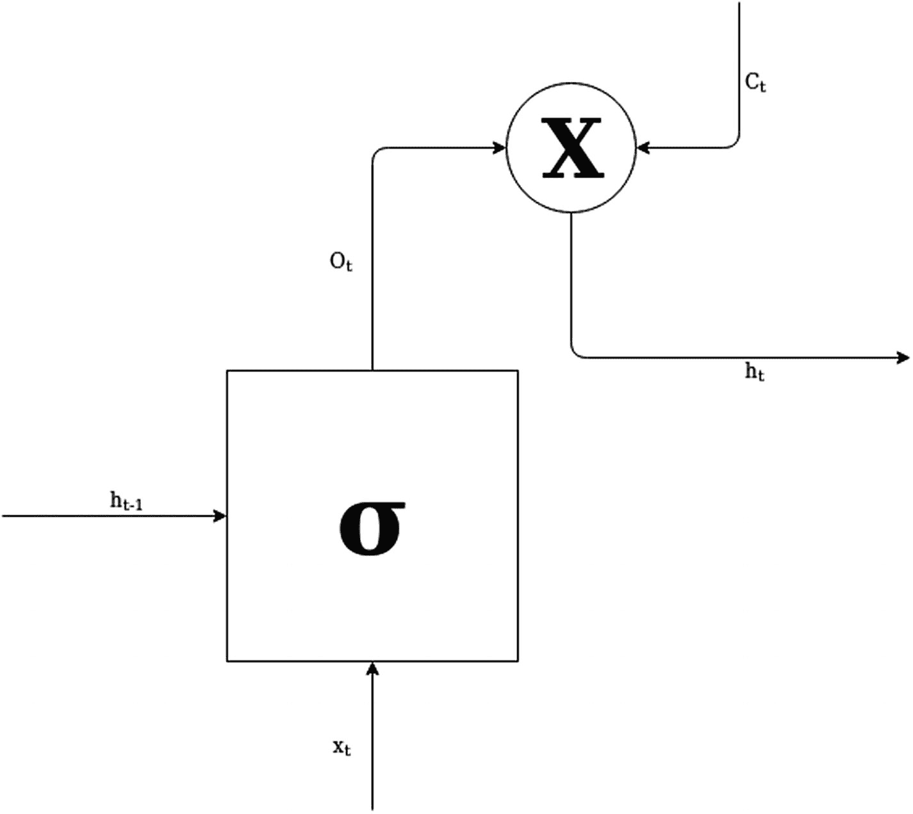

图 5-19 输出门

以下是 RNN 中相同示例的实现，但这次使用的是 LSTM。

```
import pandas as pd
import numpy as np
import matplotlib.pyplot as plt
from keras.models import Sequential
from keras.layers import Dense, LSTM
#Generating Random Data
t=np.arange(0,1000)
x=np.sin(0.02∗t)+2∗np.random.rand(1000)
df = pd.DataFrame(x)
df.head()
#Splitting into Train and Test set
values=df.values
train, test = values[0:800,:], values[800:1000,:]
### convert dataset into matrix
def convertToMatrix(data, step=4):
X, Y =[], []
for i in range(len(data)-step):
d=i+step
X.append(data[i:d,])
Y.append(data[d,])
return np.array(X), np.array(Y)
trainX,trainY =convertToMatrix(train,6)
testX,testY =convertToMatrix(test,6)
trainX = np.reshape(trainX, (trainX.shape[0], 1, trainX.shape[1]))
testX = np.reshape(testX, (testX.shape[0], 1, testX.shape[1]))
#Making the LSTM Structure
model = Sequential()
model.add(LSTM(units=4, input_shape=(1,6), activation="relu"))
model.add(Dense(8, activation="relu"))
model.add(Dense(1))
#Compiling the Code
model.compile(loss='mean_squared_error', optimizer="rmsprop")
model.summary()
#Training the Model
model.fit(trainX,trainY, epochs=1, batch_size=500, verbose=2)
#Predicting with the Model
trainPredict = model.predict(trainX)
testPredict= model.predict(testX)
predicted=np.concatenate((trainPredict,testPredict),axis=0)
```

另一种解决梯度消失和梯度爆炸问题的 RNN 变体称为门控循环单元（GRU）。下一节将详细讨论这种架构。

## 门控循环单元

与 LSTM 类似，门控循环单元也通过门来运作，这有助于它们克服 RNN 面临的问题。图 5-20 展示了一个 GRU 细胞的简单结构。

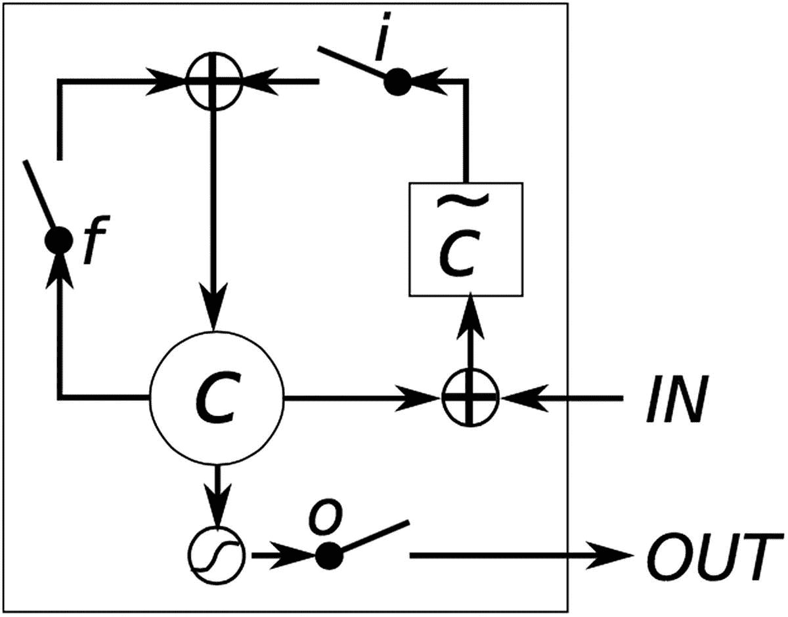

图 5-20 单个 GRU 细胞（LSTM 门控。Chung, Junyoung 等人。“基于门控的循环神经网络在序列建模上的实证评估。”(2014)）

与 LSTM 相比，GRU 只有两个门。这些门是：

- 重置门
- 更新门

与 LSTM 一样，这些门也决定哪些信息需要被传递到输出。接下来的几节将介绍 GRU 细胞中每个门的操作。


### 更新门

该门的输出范围是 0 到 1。它帮助模型决定将多少过去的信息传递到未来。如果模型愿意，它可以决定复制前一个时间步中的所有信息，从而消除梯度消失的风险。以下是该门执行的计算操作：

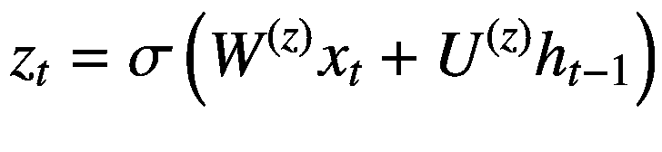

图 5-21 展示了更新门的操作。

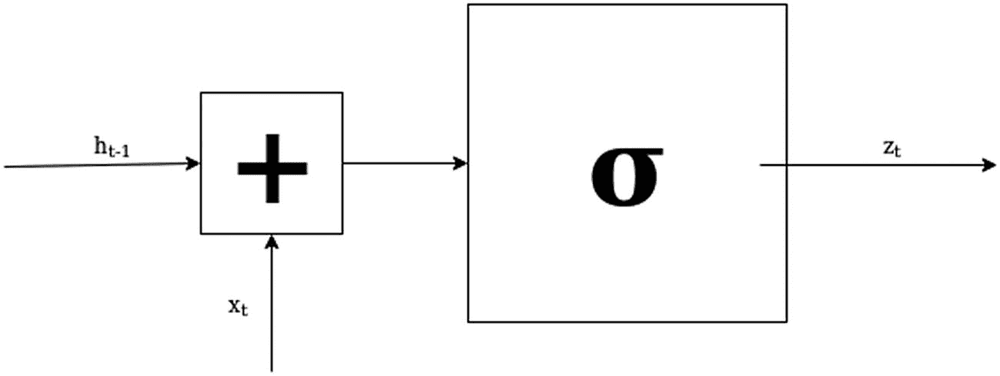

图 5-21

更新门

### 重置门

重置门的结构与更新门完全相同，如图 5-21 所示。该门告诉模型哪些过去的信息需要被遗忘。此操作通过以下数学公式执行：

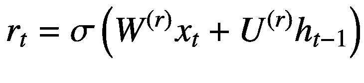

图 5-22 展示了重置门的操作。

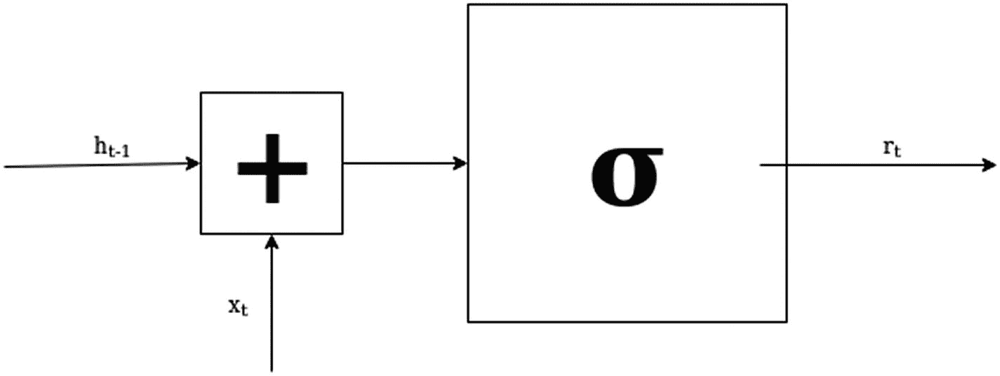

图 5-22

重置门

在 GRU 单元中，重置门用于遗忘过去的信息。所有相关信息通过以下公式存储在记忆中（见图 5-23）。

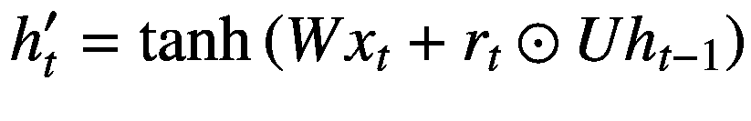

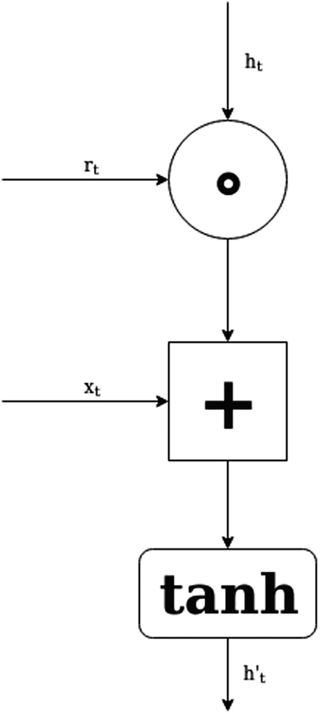

图 5-23

遗忘信息

更新门应用于输出，以确定需要从当前记忆中收集哪些信息。这可以通过以下数学公式实现：

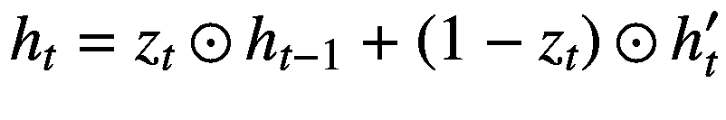

这是传递到下一个 GRU 单元的最终输出。以下是 GRU 在 Python 中的应用。

```python
import pandas as pd
import numpy as np
import matplotlib.pyplot as plt
from keras.models import Sequential
from keras.layers import Dense, GRU
#Generating Random Data
t=np.arange(0,1000)
x=np.sin(0.02∗t)+2∗np.random.rand(1000)
df = pd.DataFrame(x)
df.head()
#Splitting into Train and Test set
values=df.values
train, test = values[0:800,:], values[800:1000,:]
### convert dataset into matrix
def convertToMatrix(data, step=4):
X, Y =[], []
for i in range(len(data)-step):
d=i+step
X.append(data[i:d,])
Y.append(data[d,])
return np.array(X), np.array(Y)
trainX,trainY =convertToMatrix(train,6)
testX,testY =convertToMatrix(test,6)
trainX = np.reshape(trainX, (trainX.shape[0], 1, trainX.shape[1]))
testX = np.reshape(testX, (testX.shape[0], 1, testX.shape[1]))
#Making the GRU Structure
model = Sequential()
model.add(GRU(units=4, input_shape=(1,6), activation="relu"))
model.add(Dense(8, activation="relu"))
model.add(Dense(1))
#Compiling the Code
model.compile(loss='mean_squared_error', optimizer="rmsprop")
model.summary()
#Training the Model
model.fit(trainX,trainY, epochs=10, batch_size=500, verbose=1)
#Predicting with the Model
trainPredict = model.predict(trainX)
testPredict= model.predict(testX)
predicted=np.concatenate((trainPredict,testPredict),axis=0)
```

至此，基本深度学习架构的讨论结束。在进入下一章之前，先看一个 LSTM 和 GRU 的实际应用案例。该示例使用它们来预测股票（Carriage Services Inc.）的收盘价。代码应用于 Carriage Services Inc.股票价格数据集，你可以从 [`https://finance.yahoo.com/quote/CSV/history?p=CSV`](https://finance.yahoo.com/quote/CSV/history%253Fp%253DCSV) 链接下载。

```python
import numpy
import pandas as pd
from keras.models import Sequential
from keras.layers import Dense, LSTM, GRU
from sklearn.preprocessing import StandardScaler
from sklearn.metrics import mean_squared_error
import math
### convert an array of values into a dataset matrix
def create_dataset(dataset, step=1):
dataX, dataY = [], []
for i in range(len(dataset)-step-1):
a = dataset[i:(i+step), 0]
dataX.append(a)
dataY.append(dataset[i + step, 0])
return numpy.array(dataX), numpy.array(dataY)
### load the dataset
dataframe = pd.read_csv('carriage.csv', usecols=[1])
dataset = dataframe.values
dataset = dataset.astype('float32')
### standardize the dataset
scaler = StandardScaler()
dataset = scaler.fit_transform(dataset)
### split into train and test sets
train_size = int(len(dataset) ∗ 0.90)
test_size = len(dataset) - train_size
train, test = dataset[0:train_size,:], dataset[train_size:len(dataset),:]
### Reshaping Data for the model
step = 1
train_X, train_Y = create_dataset(train, step)
test_X, test_Y = create_dataset(test, step)
train_X = numpy.reshape(train_X, (train_X.shape[0], 1, train_X.shape[1]))
test_X = numpy.reshape(test_X, (test_X.shape[0], 1, test_X.shape[1]))
### create and fit the LSTM network
model = Sequential()
model.add(LSTM(10, input_shape=(1, step)))
model.add(Dense(1))
model.compile(loss='mean_squared_error', optimizer="adam")
model.summary()
model.fit(train_X, train_Y, epochs=10, batch_size=50, verbose=1)
### create and fit the GRU network
model1 = Sequential()
model1.add(GRU(10, input_shape=(1, step)))
model1.add(Dense(1))
model1.compile(loss='mean_squared_error', optimizer="adam")
model1.summary()
model1.fit(train_X, train_Y, epochs=10, batch_size=50, verbose=1)
### make predictions from LSTM
trainPredict = model.predict(train_X)
testPredict = model.predict(test_X)
### make predictions from GRU
trainPredict1 = model1.predict(train_X)
testPredict1 = model1.predict(test_X)
### invert predictions from LSTM
trainPredict = scaler.inverse_transform(trainPredict)
train_Y = scaler.inverse_transform([train_Y])
testPredict = scaler.inverse_transform(testPredict)
test_Y = scaler.inverse_transform([test_Y])
### invert predictions from GRU
trainPredict1 = scaler.inverse_transform(trainPredict1)
testPredict1 = scaler.inverse_transform(testPredict1)
### calculate root mean squared error for LSTM
print("∗∗∗∗∗Results for LSTMs∗∗∗∗∗")
trainScore = math.sqrt(mean_squared_error(train_Y[0], trainPredict[:,0]))
print('Error in Training data is: %.2f RMSE' % (trainScore))
testScore = math.sqrt(mean_squared_error(test_Y[0], testPredict[:,0]))
print('Error in Testing data is: %.2f RMSE' % (testScore))
### calculate root mean squared error for GRU
print("∗∗∗∗∗Results for GRUs∗∗∗∗∗")
trainScore1 = math.sqrt(mean_squared_error(train_Y[0], trainPredict1[:,0]))
print('Error in Training data is: %.2f RMSE' % (trainScore1))
testScore1 = math.sqrt(mean_squared_error(test_Y[0], testPredict1[:,0]))
print('Error in Testing data is: %.2f RMSE' % (testScore1))
```

## 总结

本章讨论了人工神经网络。要理解模糊神经网络的概念，神经网络的基础知识是必要的。本章奠定了这个基础。你学习了典型的 ANN 如何运作，以及反向传播和前向传播在学习模式中的作用。然后，你通过卷积神经网络了解了神经网络在计算机视觉中的具体应用，并通过循环神经网络了解了其在自然语言处理中的应用。最后，你了解了 RNN 遇到的一些缺点，以及 LSTM 和 GRU 如何尝试解决这些问题。你通过 Python 实践了所有这些架构。

下一章将详细介绍其中一些模糊神经网络及相关算法。


