# 6. 模糊神经网络

在前几章中，你看到了基于清晰输入、权重、参数等的神经网络。但在实际应用中，你并不总能获得相同类型的输入。神经网络中的*模糊性*会导致网络出现模糊信号、模糊权重等情况，此时你处理的就是*模糊神经网络*。本章将探讨模糊神经网络的不同架构及其组成要素。之后你将学习自适应神经模糊架构及其不同版本。

模糊神经网络用于通过神经网络从给定数据中学习，从而找到与模糊系统相关的参数。这些参数可以是模糊集、模糊规则、模糊隶属函数等。简单的模糊神经网络具有以下特性：

- 模糊神经网络基于数据驱动的方法，采用神经网络的技术路线。
- 模糊神经网络可以在事先了解或不了解模糊规则的情况下构建，因为这些规则可以通过神经网络并行地从数据中学习。
- 即使参数在过程中被学习，底层模糊系统的属性始终保持不变。
- 一个模糊系统可以表示为具有多个节点，如图 6-1 所示。

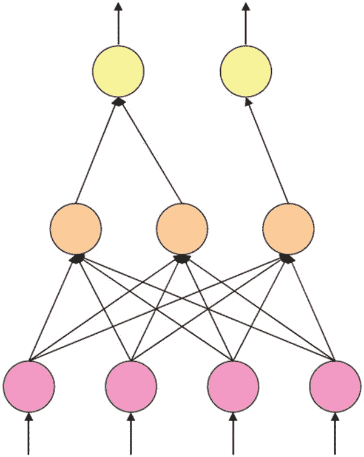

图 6-1

模糊神经系统

1. 第一层是输入层
2. 第二层表示模糊规则
3. 第三层包含输出节点

如果你有普通的神经网络，并对它们应用一些模糊集算子（如最大值和最小值，即 T-范数和 S-范数），它们就是一种扩展，被称为*混合神经网络*。你将在下一节学习混合神经网络。

既然模糊系统能够完成任务，为什么还要使用模糊神经网络呢？模糊系统用于寻找输入域和输出域之间的关系。这由一组规则（模糊规则）来定义。但如果你无法捕捉系统中可能存在的所有规则，该怎么办？为了解决这个问题，你可以采用基于神经网络的系统，在其中根据隶属函数学习不同的规则，然后构建整个架构。

简而言之，可以说如果你有数据，就可以利用模糊神经网络从中找出神经模糊系统。此外，如果你已经有一个模糊系统，也可以用同样的方法对其进行增强和优化。让我们从介绍模糊神经元及其架构开始本章的内容。

## 模糊神经元

前一章讨论了普通的神经网络。神经元是人工神经网络的核心组件，用于执行某些运算。它们将一些值作为输入，然后对这些值执行某种运算，以给出处理后的输出。

图 6-2 展示了一个执行基本运算的简单神经元。在图中，你可以看到有两个输入，基于这两个输入，我们定义了一个输出，称为 `y`。`w1` 和 `w2` 是我们学习的权重，基于这些权重，我们取加权和作为输出。

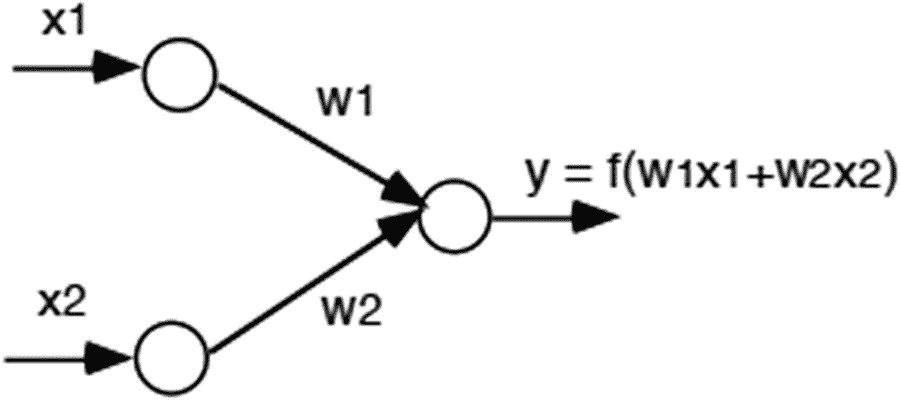

图 6-2

模糊神经元

这个图没有神经网络架构的任何核心组件，如隐藏层或激活函数，但它仍然可以被视为一个简单的神经网络。因此，输出可以表示为：

```
y = f(w1 * x1 + w2 * x2)
```

函数 `f` 可以是任何类型。它可以为空，或者你可以添加一个激活函数，如 Sigmoid 或 Relu。注意，我们使用的是普通的数学运算，如加法。如果你使用加法、减法等运算符，或 Sigmoid、Relu 等激活函数，这个神经网络被称为*常规神经网络*。但相反，如果你应用模糊算子，如 T-范数或 S-范数，它就被称为*混合神经网络*。它是一种模糊架构，并以经典集合的形式拥有不同的信号、权重和函数。之后你可以对输入和权重应用 T-范数和 T-余范数的不同运算。混合神经网络的一个处理单元被称为*模糊神经元*。

让我们看看混合神经网络架构中不同类型的模糊神经元。图 6-3 和 6-4 展示了这些专门针对 T-范数和 T-余范数运算的神经元。

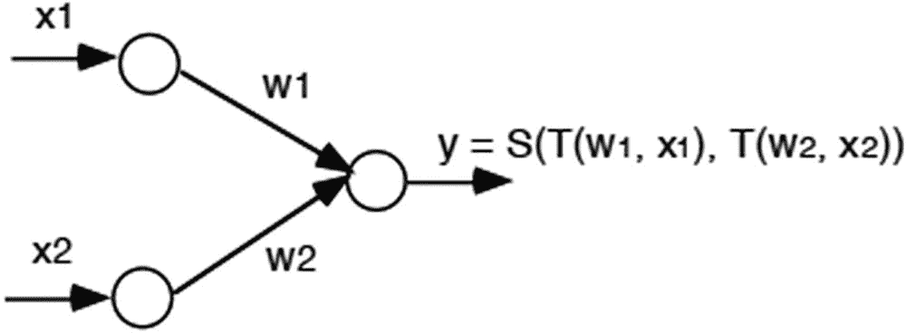

图 6-4

T-余范数运算

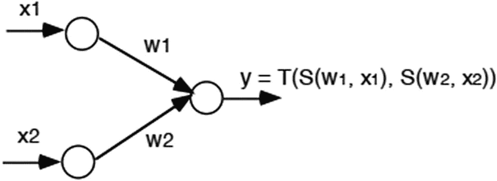

图 6-3

T-范数运算

在图 6-3 中，你可以看到它先执行 T-余范数运算，然后执行 T-范数运算。图 6-4 则正好相反。这种将一个连续函数的输出应用于另一个连续函数的特定运算属于*模糊神经元*的范畴。因此，第一个图（图 6-3）表示一个*与-模糊神经元*，第二个图（图 6-4）是一个*或-模糊神经元*，其中：

```
Y_AND = T(S(w1, x1), S(w2, x2), ..., S(wn, xn))
```

```
Y_OR = S(T(w1, x1), T(w2, x2), ..., T(wn, xn))
```

你在前几章已经看到，模糊系统由隶属函数组成。与-或或-模糊神经元基本上是对从隶属函数获得的隶属度值进行运算。由于你必须学习图中 `w1` 和 `w2` 的值，它们将直接与系统的输出相关。这意味着，如果权重非常高，那么在或神经元的情况下，输入将强烈影响输出。在与神经元的情况下，输入将微弱影响输出。以下是模糊神经网络中使用的其他一些神经元：

- 蕴含-或神经元
- 关和蔡的神经元
  - 关蔡的最大神经元
  - 关蔡的最小神经元


让我们回顾一下这些神经元是如何运作的。图 6-5 展示了一个蕴含-或神经元。该神经元在输入 `x` 和权重 `w` 之间应用了蕴含算子。之后，它在输出上应用了三角余模算子。

在图 6-5 所示的神经元中，你得到了一个蕴含运算。

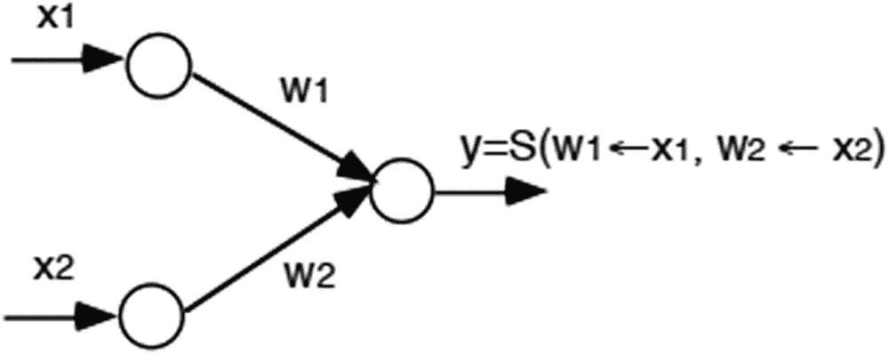

图 6-5

蕴含-或神经元

接下来是一系列 K&C 神经元（见图 6-6）。

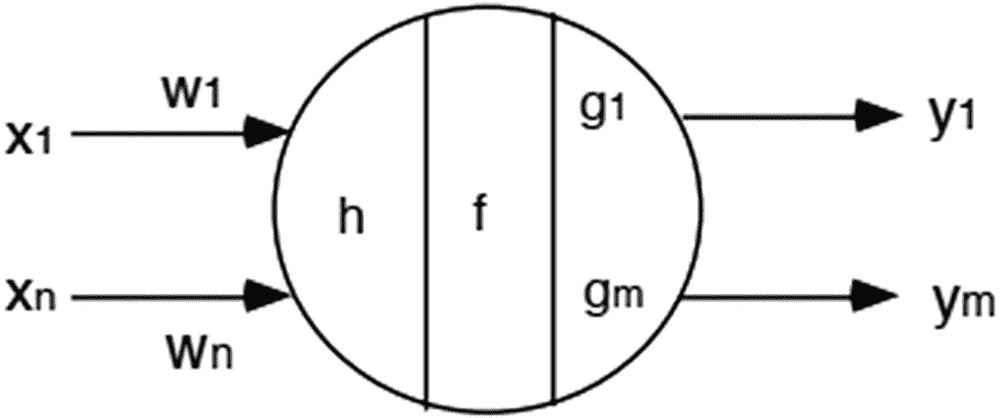

图 6-6

K&C 神经元

关和蔡的模糊神经元结构有些复杂。首先，对于每个输入 `x`，我们将其乘以学习到的权重 `w`。对所有输入节点执行此操作后，将它们聚合起来并转换为单个输入。接下来，找到该输入的状态，可以用以下公式表示：

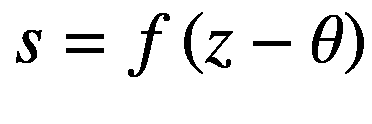

在这个公式中，你使用 `f` 作为选定的激活函数，而 `θ` 代表激活阈值。最后，通过对状态应用一个函数来得到输出。让我们将这个概念应用于两种类型的 K&C 模糊神经元：K&C 最大神经元（见图 6-7）和最小神经元（见图 6-8）。

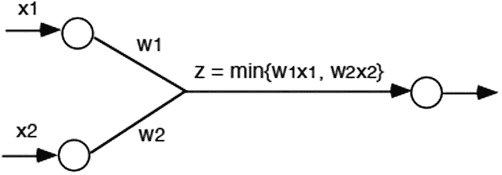

图 6-8

K&C 最小神经元

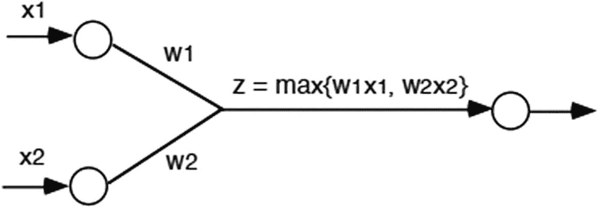

图 6-7

K&C 最大神经元

K&C 最大神经元使用 T-余模运算，而 K&C 最小神经元使用 T-模运算。

你将在本章中继续学习关于模糊神经元的知识。

## 模糊推理神经网络

仅从名称上，你就可以说，如果将模糊推理系统和神经网络的概念结合起来，就诞生了 FINN（模糊推理神经网络）。在详细分析 FINN 之前，你需要先了解它们的类型。基本上，FINN 可以分为以下几类：

*   协作式 FINN
*   并发式 FINN
*   集成/融合式 FINN

当你拥有训练数据，并使用神经网络来寻找隶属函数和模糊规则时，这属于协作式 FINN 的范畴（见图 6-9）。

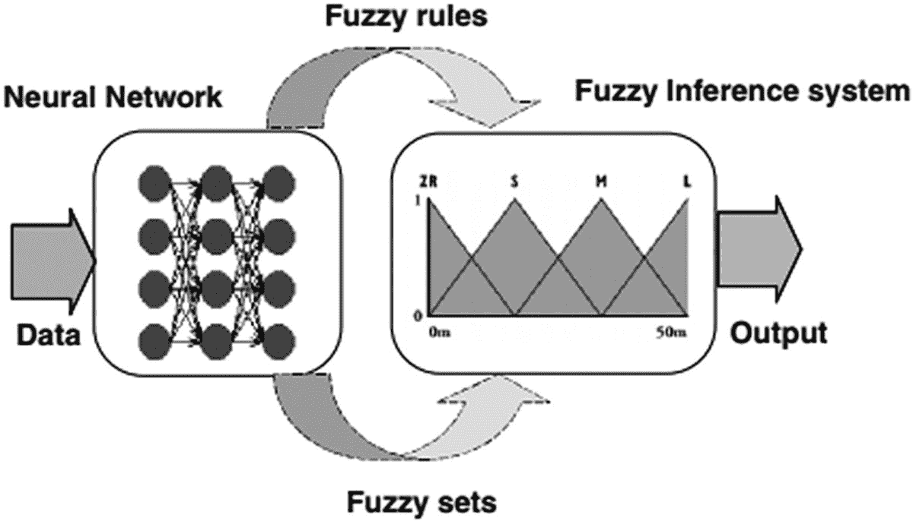

图 6-9

协作式 FINN

当你无法直接测量输入变量时，则使用并发式 FINN 而非协作式 FINN。在这个过程中，神经网络持续帮助 FIS，以使最终系统始终处于最佳状态。图 6-10 展示了一个并发式 FINN，其中输入数据被馈送到神经网络，该网络有助于确定最佳的隶属函数，以便后续由模糊系统处理。将神经网络与模糊系统结合并不会优化模糊系统，但会提高系统的整体性能。

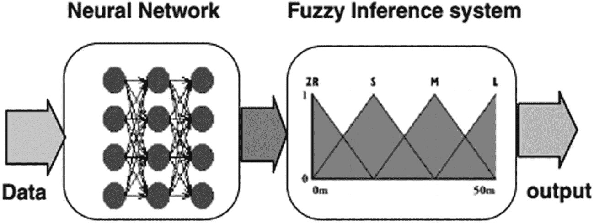

图 6-10

并发式 FINN

集成式 FINN 用于寻找 FIS 的参数。假设你有一个共享的公共数据库，用于存储知识表示和数据结构。这个数据库在神经网络和模糊推理系统之间共享。神经网络和模糊推理系统各自都有一些缺点。但是，当你将这两个概念结合起来时，就得到了集成式 FINN，从而产生效率更高的架构。

现在你已经了解了模糊推理神经网络的类别，是时候看看该领域中使用的一些最流行的 FINN 了。我们将讨论以下架构：

*   模糊联想记忆
*   曼达尼集成式 FINN
*   高木-菅野集成式 FINN

## 模糊联想记忆

在学习模糊联想记忆之前，你必须先了解*联想记忆*这个名称的含义。任何联想记忆的主要任务是存储输入和输出模式，以及它们之间的关系和映射。其主要任务是在提供不完整或有噪声的输入模式时，找到输出模式。

联想记忆可以用以下公式表示：

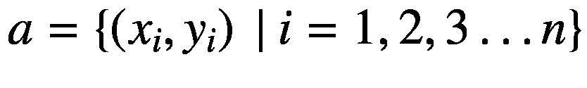

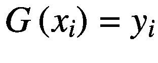

在前面的公式中，`a` 表示一个有限的关联集合，其中 `x` 是输入模式，`y` 是输出模式。`G(x)` 是一个定义 `x` 和 `y` 之间映射的函数。与联想记忆相关的一些术语如下：

*   基本记忆集
*   基本记忆
*   自联想记忆
*   异联想记忆
*   记录阶段
*   联想映射
*   神经联想记忆
*   模糊联想记忆

所有存在的关联，即 `a = {(x[i], y[i]) | i = 1,2,3…n}`，被称为*基本记忆集*，而每个关联 `(x[i] 和 y[i])` 被称为*基本记忆*。当关联与自身相关时，称为*自联想记忆*，但如果不同，则称为*异联想记忆*。因此，`a = {(x[i], x[i]) | i = 1,2,3…n}` 是自联想记忆，而 `a = {(x[i], y[i]) | i = 1,2,3…n}` 是异联想记忆。

寻找函数 `G(x)` 的过程称为*记录阶段*，而 `G` 称为*联想映射*。当联想映射是一个神经网络时，称为*神经联想记忆*；当它是一个模糊神经网络时，称为*模糊联想记忆*。在模糊联想记忆中，输入和输出模式是模糊集。

通常，模糊联想记忆（FAM）是一种在系统中存储规则的模糊推理神经网络。这条规则是一个具有以下格式的模糊规则：

*   “如果 x 是 `x[k]`，那么 y 是 `y[k]`”

模糊联想记忆可以分为两种类型：

*   最大-最小模糊联想记忆
*   最大-乘积模糊联想记忆

由于模糊联想记忆是一种模糊神经网络，其主要组成部分是模糊神经元。这两种 FAM 的区别在于神经元的类型。如果一个 FAM 包含一个 Max-C[M] 神经元，则称为最大-最小 FAM；但如果它包含一个 Max-C[P] 神经元，则称为最大-乘积 FAM。一个 Max-C 模糊神经元可以用以下公式表示：

![$$ y=\left[{\bigvee}_{j=1}^nC\left({w}_j,{x}_j\right)\right]\vee \theta $$](images/479940_1_En_6_Chapter/479940_1_En_6_Chapter_TeX_Equg.png)

在前面的公式中，`C` 代表模糊合取运算，而 `θ` 表示偏置。如果该神经元应用了最大值运算，则称为 Max-C[M] 神经元；而如果应用了乘积运算，则称为 Max-C[P] 神经元。


## Mamdani 集成 FINN

Mamdani 集成 FINN（也称为 Mamdani 集成神经模糊系统）使用反向传播方法来学习隶属函数的参数。在这种方法中，你通过最小化成本函数来寻找参数的最佳值。回顾一下，第 5 章讨论了反向传播方法。由于该方法利用了反向传播的概念，因此它属于监督学习方法的范畴。

图 6-11 展示了 Mamdani 集成 FINN 的结构。

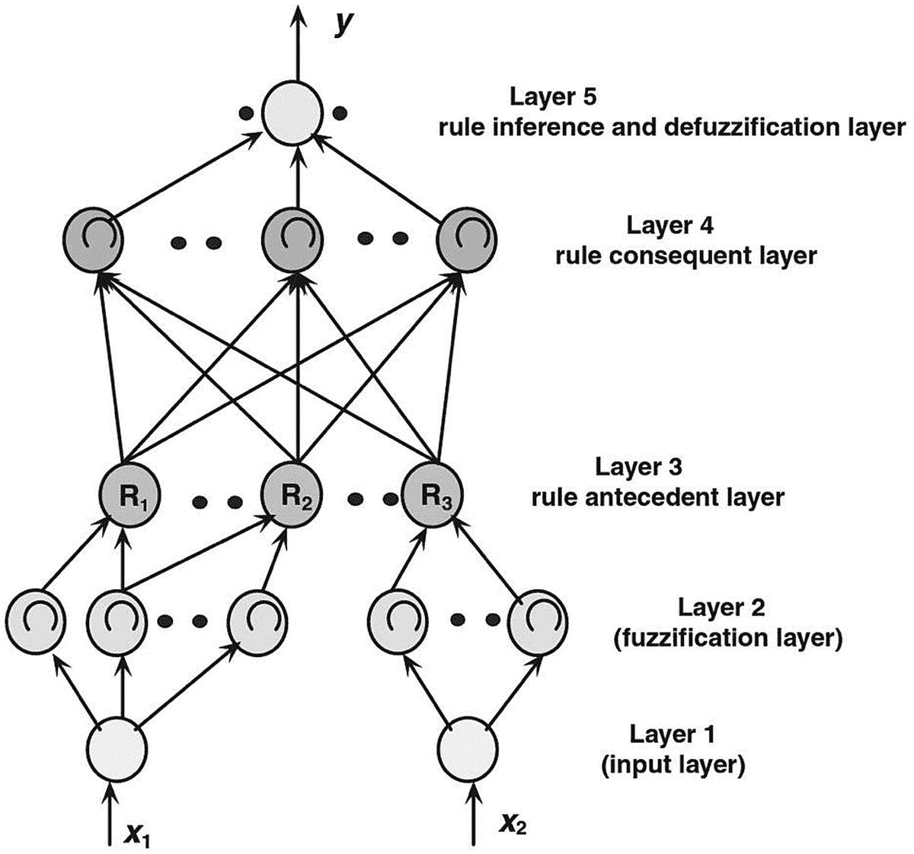

图 6-11

Mamdani 集成 FINN

Mamdani 集成 FINN 的架构由五层组成：

-   **第 1 层：** 该层由直接输入组成，因此被称为*输入层*。该层中的每个节点都包含直接传递到下一层节点的各个输入。
-   **第 2 层：** 这也被称为*模糊化层*。在这里，你将来自输入层的清晰输入转换为模糊集。它试图找到每个输入值在模糊集中的隶属度。使用模糊聚类方法来定义每个输入变量的隶属函数的数量和类型。在整个反向传播过程中，隶属函数的数量和类型将不断变化，以微调整个系统。
-   **第 3 层：** 该层用于定义规则库的前件。因此，该层被称为*规则前件层*。该层中的每个节点都使用 T-范数运算。该层的输出是相应模糊规则的触发强度。
-   **第 4 层：** 该层被称为*规则后件层*。顾名思义，它用于确定每个规则前件的后件。它有助于定义每个前件对输出值的隶属度。该层中的节点数量等于前一层中的规则数量。
-   **第 5 层：** 这是最终的*去模糊化层*。在这一层中，所有规则后件使用 T-协范数运算进行组合，然后使用去模糊化方法将其转换为清晰输出。

## Takagi Sugeno 集成 FINN

在这种方法中，传播分两步进行。这两个步骤需要结合反向传播和最小均方估计。第一种方法用于微调隶属函数，而第二种方法用于寻找参数。图 6-12 展示了 Takagi Sugeno FINN 的示意图。

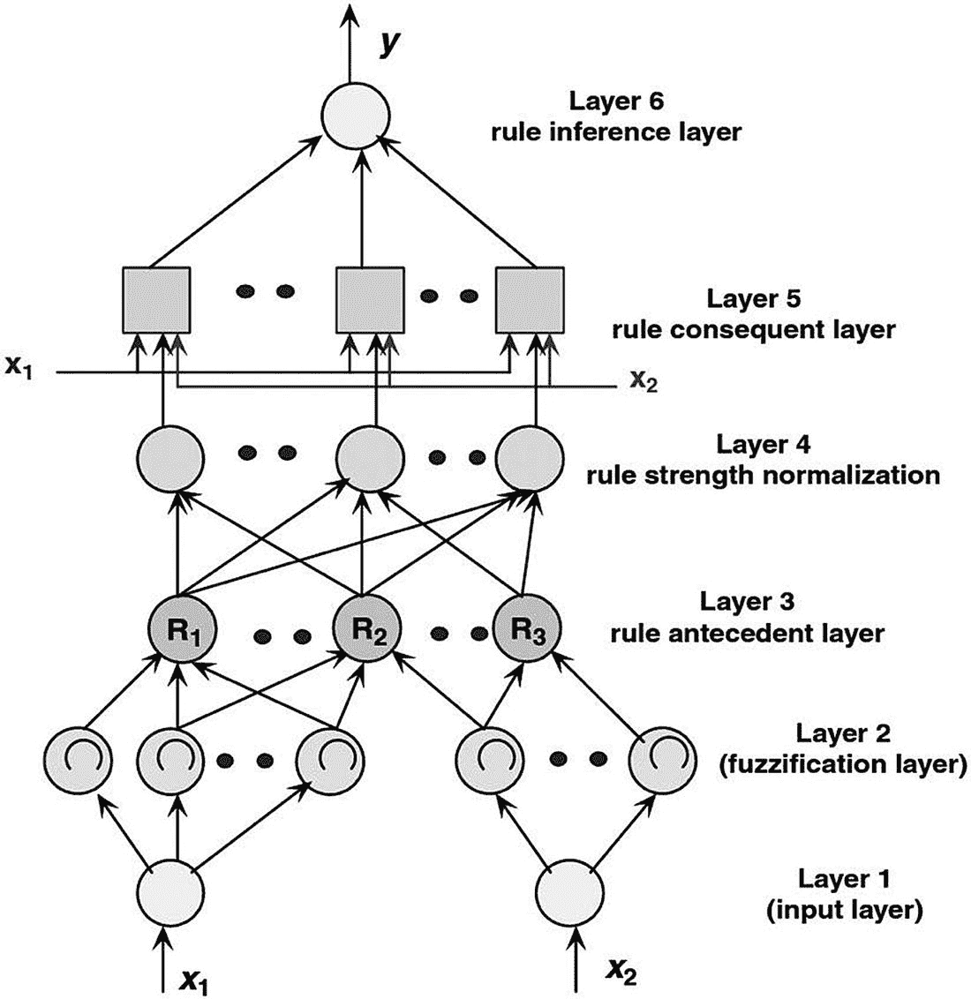

图 6-12

Takagi Sugeno 集成 FINN

第 1 层是输入层。它将清晰输入直接传递到第二层。第 2 层将接收到的清晰输入转换为模糊集。第 3 层寻找模糊规则的前件。这三层的工作方式与 Mamdani FINN 完全相同。

第 4 层用于确定每条规则的触发强度，然后对其进行归一化。这是通过找到每条规则的触发强度，然后将其除以所有规则触发强度之和来完成的。这可以用以下公式表示：

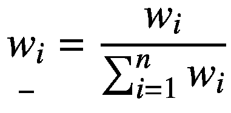

第 5 层用于使用最小二乘法确定规则的后件。这是通过以下公式完成的：

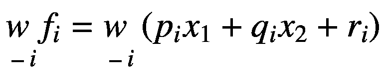

在这个方程中，`p`、`q`、`i` 代表参数集。

第 6 层用于聚合来自前一层的所有输出。这可以表示为：

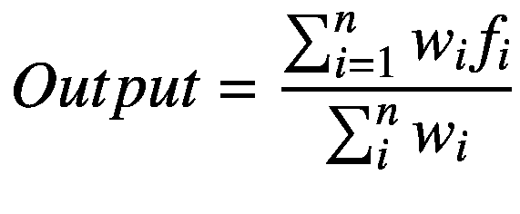

## 自适应神经模糊推理系统

第 4 章讨论了 Sugeno 和 Tsukamoto 模糊推理系统。使用自适应神经模糊推理系统（ANFIS），你可以表示 Sugeno 和 Tsukamoto 两种系统。这就是为什么它被称为*自适应网络*，因为通过一个网络，你可以通过微小的更改来表示多个网络。

你也可以使用 ANFIS 表示 Mamdani FIS，但这需要复杂的数学方法，超出了本书的范围。本章讨论使用 ANFIS 的 Sugeno 和 Tsukamoto 方法。为了便于理解，示例将使用一个具有两个输入和一个输出的系统。


### 表示 Sugeno FIS 的 ANFIS

如先前章节所述，Sugeno 模糊推理系统（FIS）的规则采用以下格式：

- 如果 `x` 是 `A1` 且 `y` 是 `B1`，则 `f1 = p1x+q1y+r1`
- 如果 `x` 是 `A2` 且 `y` 是 `B2`，则 `f2 = p2x+q2y+r2`

图 6-13 是使用 Sugeno 方法对这两条规则进行图形化表示的结果。第 3 章详细讨论了这一概念。

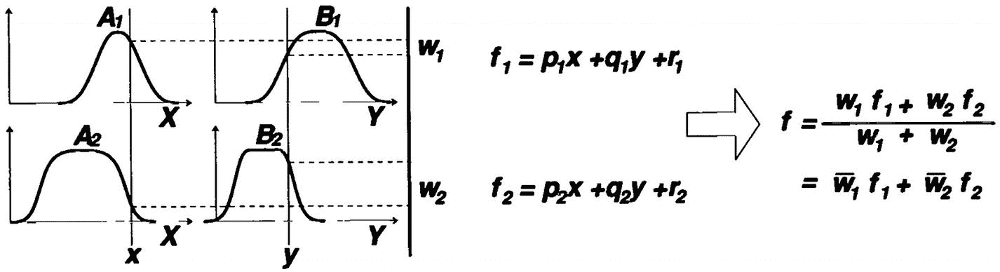

图 6-13：Sugeno 解模糊化

图 6-14 展示了表示相同 Sugeno 架构的 ANFIS 结构。

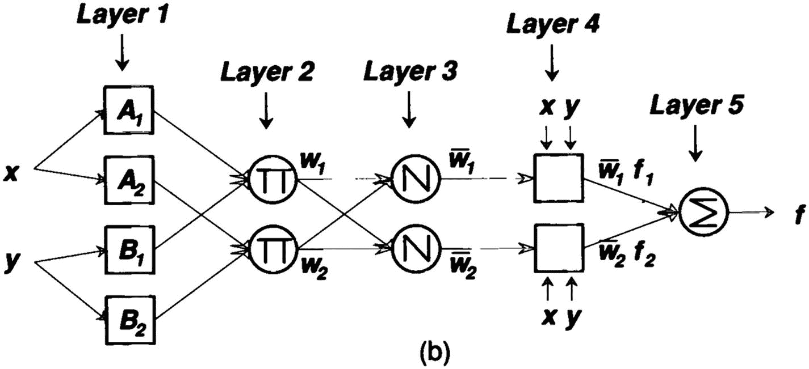

图 6-14：基于 Sugeno 的 ANFIS

我们将在以下各节中逐层介绍此架构。

#### 第 1 层：隶属函数层

该层是每个输入的隶属函数的组合。查看规则可知，输入 `x` 和 `y` 由隶属函数 `A1`、`A2`、`B1` 和 `B2` 定义。这些函数可以表示为：

- `A1 = μA1`
- `A2 = μA2`
- `B1 = μB1`
- `B2 = μB2`

#### 第 2 层：前件层

在该层中，您需要定义规则的前件。所有到达该层的信号通过求其乘积来生成输出。这可以表示为：

- `w[1] = μA1 * μB1`
- `w[2] = μA2 * μB2`

在该层中，您需要使用 T-Norm 算子。

#### 第 3 层：归一化层

在此处，您需要对前件层的输出进行归一化，这也可以称为*归一化触发强度*。为了归一化上一层的输出，您需要将其除以总触发强度。这可以表示如下：

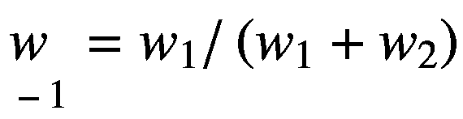

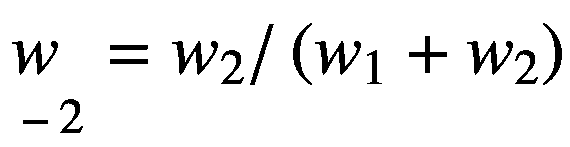

#### 第 4 层：后件层

在该层中，您需要处理规则的后件。在 Sugeno 中，您已经看到了规则的后件。在该层中，您必须生成类似的输出。

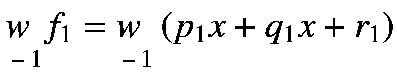

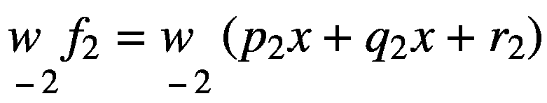

在前面的等式中，`p`、`q`、`r` 表示参数集。

#### 第 5 层：聚合层

一旦您获得了包含不同参数集的后件层输出，在该层中，您需要找到上一层所有输出的聚合。此操作可以用以下等式表示：

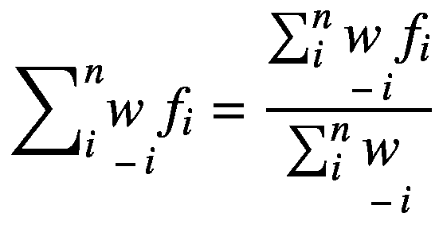

### 表示 Tsukamoto FIS 的 ANFIS

在 Tsukamoto FIS 中，您得到如下后件：

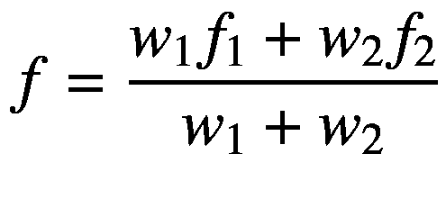

图 6-15 和 6-16 展示了表示 Tsukamoto FIS 及其对应 ANFIS 解模糊化过程的示意图。

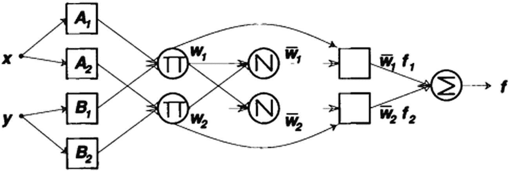

图 6-16：基于 Tsukamoto 的 ANFIS

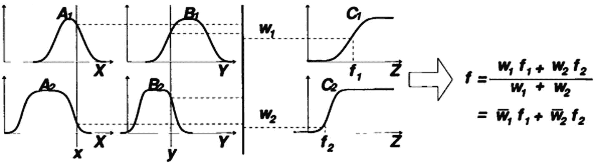

图 6-15：Tsukamoto 解模糊化

如图 6-16 所示，该系统与基于 Sugeno 的 ANFIS 类似，区别仅在于它使用加权隶属函数而非线性隶属函数。因此，所有层与基于 Sugeno 的示例完全相同，但在最后一层，解模糊化方程发生了变化。

让我们看看如何使用 Python 应用 ANFIS。在 Python 中，有一个名为 `anfis` 的包，您可以用它来应用 ANFIS 的概念。数据集包含三列。前两列定义了清晰输入，最后一列定义了它们的模糊化值。此示例使用 ANFIS 来预测这些模糊化值，并检查模型的误差。您可以通过编写以下命令来安装 `anfis` 包：

```
pip install anfis
```

以下是应用于虚拟数据集的代码：

```
#### 导入必要的库
import anfis
from anfis.membership import membershipfunction, mfDerivs
import numpy
training_data = numpy.loadtxt("training.txt", usecols=[1,2,3])
X = training_data [:,0:2]
Y = training_data [:,2]
#### 定义隶属函数
mf = [[['gaussmf',{'mean':0.,'sigma':1.}],['gaussmf',{'mean':-1.,'sigma':2.}],['gaussmf',{'mean':-4.,'sigma':10.}],['gaussmf',{'mean':-7.,'sigma':7.}]], [['gaussmf',{'mean':1.,'sigma':2.}],['gaussmf',{'mean':2.,'sigma':3.}],['gaussmf',{'mean':-2.,'sigma':10.}],['gaussmf',{'mean':-10.5,'sigma':5.}]]]
#### 使用隶属函数更新模型
mfc = membershipfunction.MemFuncs(mf)
#### 创建 ANFIS 模型对象
anf = anfis.ANFIS(X, Y, mfc)
#### 拟合 ANFIS 模型
anf.trainHybridJangOffLine(epochs=20)
#### 打印输出
print(round(anf.consequents[-1][0],6))
print(round(anf.consequents[-2][0],6))
print(round(anf.fittedValues[9][0],6))
#### 绘制模型性能图
anf.plotErrors()
anf.plotResults()
```

图 6-17 展示了在每次迭代中如何定义更好的隶属函数，这意味着每次迭代的误差都在减小。

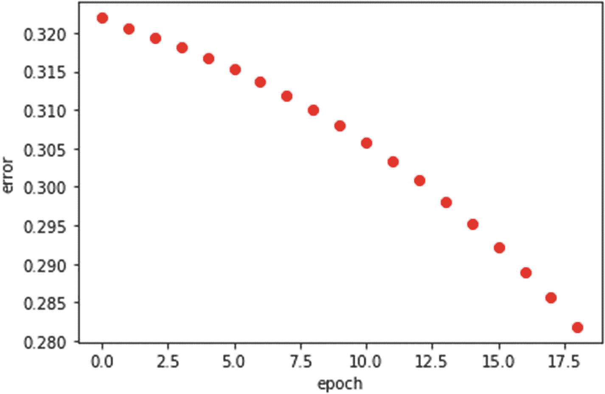

图 6-17：每个 epoch 的误差减少

图 6-18 展示了预测值与实际数据的对比情况。

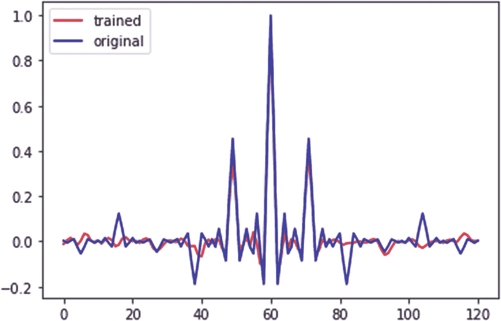

图 6-18：拟合线

## 总结

本章探讨了模糊神经网络的一些架构。您了解了简单的 FINN 如何由模糊神经元组成，然后探索了各种类型的神经元。接着，您探索了各种 FINN 架构，从模糊联想记忆到 Sugeno 集成 FINN。最后，您了解了自适应神经模糊推理系统（ANFIS）的工作原理，并查看了其使用 Python 的应用。

下一章将探讨与模糊神经网络相关的一些高级概念。

