# 7. 高级模糊网络

本章将探讨一些高级模糊网络。图 7-1 展示了一个经典的神经模糊系统。但在深入之前，了解构建这些系统所用的一些核心组件非常重要。本章首先讨论模糊聚类方法。然后转向遗传算法，最后回顾属于高级模糊网络领域的最常用架构。

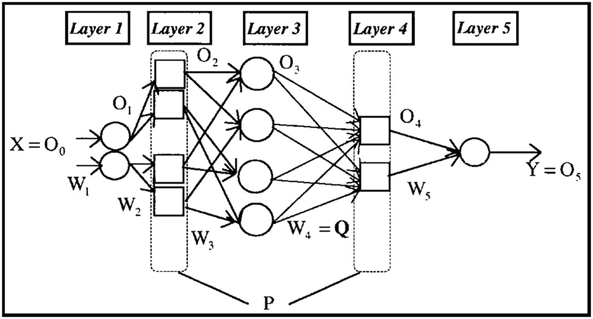

图 7-1：神经模糊推理系统

本章首先讨论模糊聚类——其需求及其应用。


## 模糊聚类

聚类是一种根据数据中存在的相似性，将数据分组到几个类别中的方法。这些类别被称为*簇*（见图 7-2）。

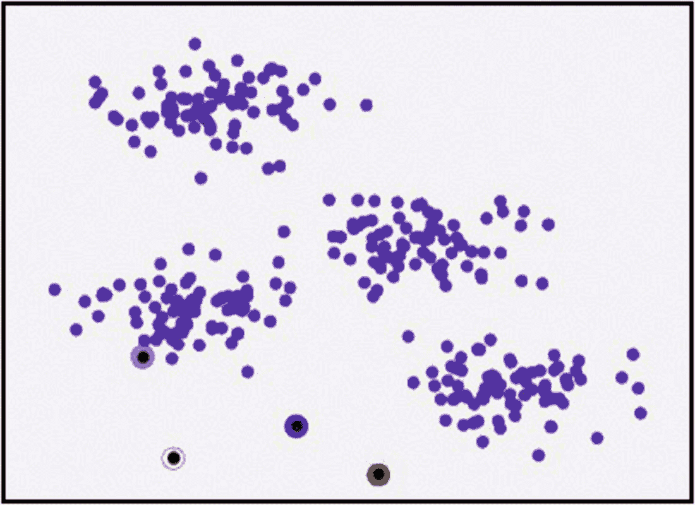

图 7-2 聚类

机器学习使用不同的聚类方法，例如 K-Means 聚类、层次聚类、DBScan 等。类似地，当我们谈论模糊网络时，也有诸如模糊 C-Means 聚类、高斯应用寻找聚类等方法。本章将详细讨论模糊 C-Means 聚类。

### 模糊 C-Means 聚类

假设我有一组数据点 `X`，我想根据某些相似性度量将它们放入 `k` 个簇中。以集合的形式，假设数据如下所示：

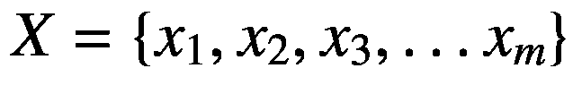

要使用 C-Means 聚类方法将它们分成 `k` 个簇，首先要做的是从数据中随机选取 `k` 个点。假设这 `k` 个点是质心（见图 7-3）。

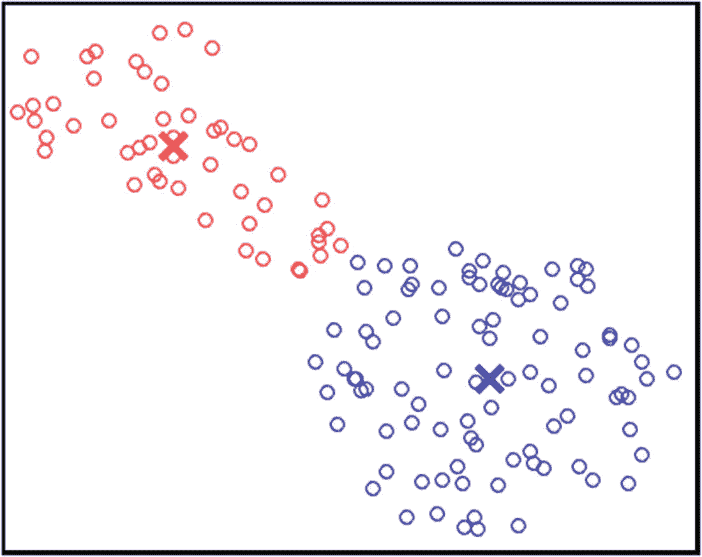

图 7-3 C-Means 聚类

然后，使用曼哈顿距离或欧几里得距离，你会发现所有剩余的点都更接近某个簇的质心点。这样你就得到了第一组分配给 `k` 个簇的数据。但你是通过随机选择 `k` 个点并称它们为*质心*开始的。实际上，它们并非真正的质心。因此，你需要继续这个过程来纠正这个假设。

#### 欧几里得距离

任意两点之间的标准直线距离称为*欧几里得距离*。要计算这个距离，可以使用以下公式：

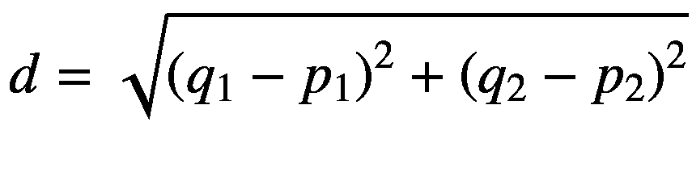

下一步，你需要找到你所定义簇的实际质心。一旦找到，一些点可能会失去其原始簇的归属。与它们最初所属的簇相比，它们现在可能更接近另一个簇。因此，你需要根据新的质心重新分配这些点。这将帮助你获得一个包含新成员点的修订后的 `k` 个簇。然后，再次找到新的质心并重复这个过程。你不断重复这个过程，直到新的簇不再导致点从一个簇移动到另一个簇。

让我们从数学角度审视整个算法：

1.  定义需要聚类的 `N` 个数据点：

    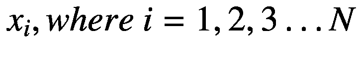

2.  假设要创建的簇的数量由 `C` 表示，其中 2 ≤ `C` ≤ `N`

3.  定义由 `f` 表示的簇模糊度，其中 `f` > 1

4.  定义一个维度为 `N` × `C` × `M` 的隶属度矩阵 `U`。该矩阵应按照以下条件随机定义：
    1.  `U`[`ijm`] ∈ [0,1]，并且
    2.  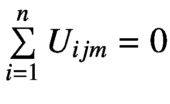 对于每个 `i` 和固定的 `m` 值。

5.  确定簇中心。这可以通过使用以下公式完成：

    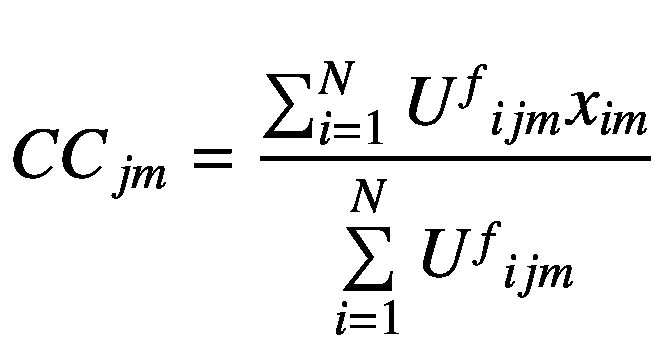

    其中 `j` 代表簇，`m` 代表维度。

6.  计算欧几里得距离。你可以通过以下公式找到这个距离：

    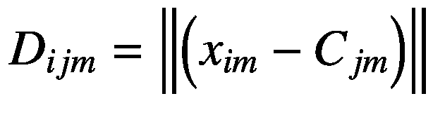

    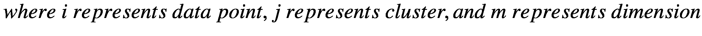

7.  找到欧几里得距离后，你需要用新值更新步骤 4 中定义的隶属度矩阵。这可以通过使用以下公式完成：

    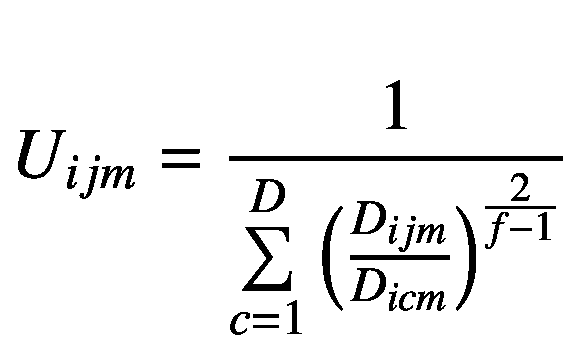

    

8.  重复步骤 1 到 5，直到 `U` 的值 < ∈，其中 ∈ 是终止标准。

#### 模糊 C-Means 聚类的应用

你可以将模糊 C-Means 聚类用于以下用例和领域：

*   图像处理时，特别是对图像内部的对象进行聚类。也用于基于图像的分割。
*   与群体智能结合使用。
*   与遥感结合使用。

#### 模糊 C-Means 的 Python 实现

以下代码包含两组数据——训练数据和测试数据。借助训练数据，你可以找到簇的最终质心，之后应使用测试数据来检查新数据点被分配到哪个簇。此示例使用名为 `fuzzycmeans` 的 Python 包。你可以使用以下命令安装它：

```
pip install fuzzycmeans
```

如果该包在执行时出现问题，你可以克隆 GitHub 仓库，然后将两个 Python 文件——`fuzzy_clustering.py` 和 `visualization.py`——复制到你的主目录，然后运行代码。在运行代码之前，请确保安装了 `bokeh` 包，因为它是此模糊 C-Means 包的依赖项。你可以通过编写以下命令来安装它：

```
pip install bokeh
```

此包是对 James C. Bezdek、Robert Ehrlich 和 William Full 的论文“FCM: The Fuzzy C-Means Clustering Algorithm”的实现。你也可以通过访问 GitHub 仓库 [`https://github.com/oeg-upm/fuzzy-c-means.git`](https://github.com/oeg-upm/fuzzy-c-means.git) 来查看和克隆源代码。

此示例使用 `AirlinesCluster` 数据集。你可以在本书的 GitHub 仓库中找到此数据集。或者，你也可以从 Kaggle 网站下载它。该示例仅使用两列——`Balance` 和 `BonusMiles`——来开始聚类。如果你愿意，可以使用所有列并可视化输出。

```
import pandas as pd
import numpy as np
import numpy as np
import logging
from fuzzy_clustering import FCM
from visualization import draw_model_2d
from sklearn import preprocessing
dataset = pd.read_csv("AirlinesCluster.csv") #Importing the airlines data
dataset1 = dataset.copy() #Making a copy so that original data remains unaffected
dataset1 = dataset1[["Balance", "BonusMiles"]][:500] #Selecting only first 500 rows for faster computation
dataset1_standardized = preprocessing.scale(dataset1) #Standardizing the data to scale it between the upper and lower limit of 1 and 0
dataset1_standardized = pd.DataFrame(dataset1_standardized)
fcm.set_logger(tostdout=False) #Telling the package class to stop the unnecessary output
fcm = FCM(n_clusters=5) #Defining k=5
fcm.fit(dataset1_standardized) #Training on data
predicted_membership = fcm.predict(np.array(dataset1_standardized)) #Testing on same data
draw_model_2d(fcm, data=np.array(dataset1_standardized), membership=predicted_membership) #Visualizing the data
```


## 模糊自适应共振理论

在模糊 C 均值聚类（Fuzzy C-Means Clustering）中，你看到基于点之间的距离可以将它们分组到簇中。但如果你能控制一个簇中点之间的相似度呢？模糊自适应共振理论（Fuzzy Adaptive Resonance Theory，`Fuzzy ART`）提供了控制簇内数据点之间相似度的能力。因此，`Fuzzy ART`是通过控制簇之间的相似度来寻找最佳簇的另一种方法。

大量数据被输入到`Fuzzy ART`模型中。这些数据包含许多模式，`Fuzzy ART`试图从中提取相似性。它基于训练模型的数据，从新数据中找到最佳的自适应簇。在这个模型中需要注意的一点是，尽管你在输入数据上训练它，但它不像其他模糊架构那样包含任何隐藏层。

一个`Fuzzy ART`架构主要包含两个组件：

*   注意力（Attention）
*   定向（Orientation）

*注意力*帮助`Fuzzy ART`根据数据定义它认为最佳的簇或类别。*定向*帮助它确定所有找到的簇是否有效。这意味着它帮助`Fuzzy ART`接受或拒绝由注意力定义的类别。这就是为什么它被称为*自适应架构*。自适应这个名称的另一个原因是它适应新数据的能力。无论从训练数据中学到了什么模式，新数据都可以被分配到任何一个簇中。但如果新数据与任何现有簇都不相似，`Fuzzy ART`有能力创建一个与现有簇完全不同的新簇。

`Fuzzy ART`用于聚类和分类问题，它接受的输入数据可以是离散的或连续的。与`Fuzzy ART`架构相关的一些特性是：

*   整个架构只有一个权重。因此，它更易于管理和更新。
*   它可以处理二进制和非二进制数据。
*   它包含以下重要的超参数：
    *   *警戒阈值（Vigilance threshold）*：
        这个阈值通常决定`Fuzzy ART`的记忆。它有助于确定最终的簇数量。它用于执行注意力操作。
    *   *选择参数（Choice parameter）*：
        用于确定保留哪个簇以及不应验证哪个簇。如果超过阈值，则选择该簇；否则，它被拒绝。它用于执行定向操作。
    *   *学习率（Learning rate）*：
        用于确定输入数据中的模式。

图 7-4 展示了基本的`Fuzzy ART`架构。

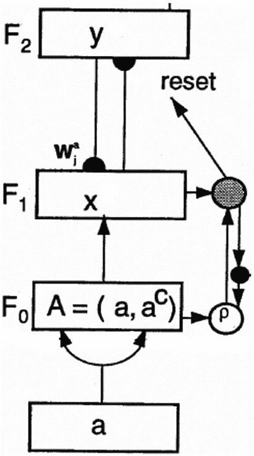

**图 7-4**  
`Fuzzy ART`

如你所见，`Fuzzy ART`中有三个层。最后一层被称为*输出层*，它与第二层全连接。正如你可能从早期关于神经网络的章节中回忆的那样，全连接层是指每个节点都与前一层或后一层中的所有节点相连的层。因此，在`Fuzzy ART`中，`F2`层和`F1`层是全连接的。在第一层中，你接收`m`维输入，并在将其传递到下一层之前，将其与其补码相乘。这使得`F1`层中的节点数量变为`2m`维。最后，输出层持续与第二层通信，以决定形成的簇是否有效。如果有效，结果为`1`；否则，结果为`0`。

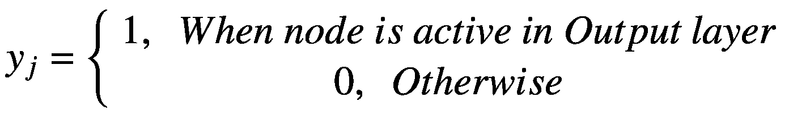

接下来的部分将更详细地介绍每一层的操作。

### 第 1 层：`F[0]`（定向层）

这一层接收输入的模糊模式，找到其补码，然后将原始输入和补码输入都传递到下一层。此操作可以用以下方程概括：

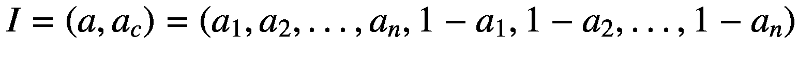

这一层中还存在一个重置节点（Reset node），它接收来自所有层的输入，并帮助转换接收到的输入模式。

### 第 2 层：`F[1]`和`F[2]`（注意力层）

由于补码输入也被传递到`F[1]`层，因此存在的节点数量是输入层的两倍，由`2n`个节点表示。`F[2]`层包含`m`个节点。这两层通过连接权重连接，由`W[i]`和`w[j]`表示。`W[i]`表示从`F[1]`到`F[2]`的连接，而`w[j]`表示从`F[2]`到`F[1]`的连接。这些权重可以用以下数学方程表示：

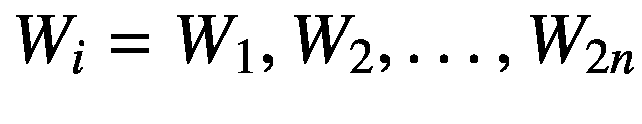

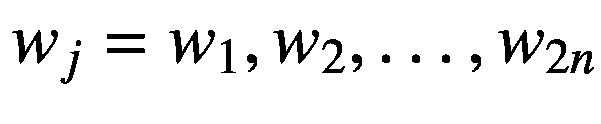

在`F[2]`层中有两种节点：已提交节点（committed）和未提交节点（uncommitted）。*已提交节点*是指权重矩阵的值应为`1`的节点；否则，它被称为未提交节点。这可以用以下方程表示：

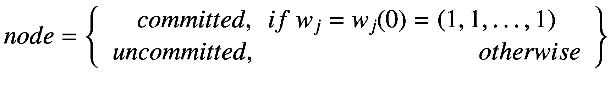

`F[2]`层的输入可以定义为：


`Fuzzy ARTMAP`（见图 7-5）是`Fuzzy ART`的高级应用。它是一种监督学习方法，可用于不同的应用。它包含两个`Fuzzy ART`组件，称为`Fuzzy ART[x]`和`Fuzzy ART[y]`，而第三个组件包含`ART`间关系。介绍`Fuzzy ARTMAP`超出了本书的范围，图 7-5 展示了`Fuzzy ARTMAP`的架构供你参考。

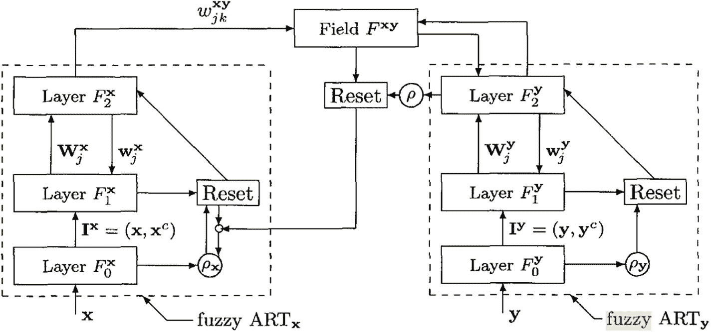

**图 7-5**  
`Fuzzy ARTMAP`

### `Fuzzy ART`的应用

*   用于寻找模式识别
*   用于处理时间序列数据
*   用于监控产品质量

### `Fuzzy ART`的 Python 实现

`IRIS`是由 Edgar Anderson 收集的数据集。它量化了鸢尾花的形态变异。根据它们的变异，这些花被分为三类。本示例使用`Fuzzy ART`来查看形态数据，并根据相似性对鸢尾花进行聚类。

该算法相当复杂，因此在代码仓库中，你可以找到`FuzzyART.py`文件。只需将其上传到你的`home`文件夹中，然后运行以下代码。

```python
from functools import partial
import numpy as np
import FuzzyART as f
import sklearn.datasets as ds
l1_norm = partial(np.linalg.norm, ord=1, axis=-1)#Used for regularization so that we can penalize the parameters that are not important
if __name__ == '__main__':
iris = ds.load_iris()#load the dataset in the python environment
data = iris['data'] / np.max(iris['data'], axis=0)#standardize the dataset
net = f.FuzzyART(alpha=0.5, rho=0.5) #Initialize the FuzzyART Hyperparameters
net.train(data, epochs=100) #Train on the data
print(net.test(data).astype(int)) #Print the Cluster Results
print(iris['target']) #Match the cluster results
```


## 遗传算法

*遗传算法*是一类遵循生物自然选择及其遗传学过程的搜索算法。自然选择的一般原理指出，最适应的个体（通过生存）被选中以产生下一代的子代。

当你定义一个搜索问题时，首先要确定几个用于做出搜索决策的变量。这些变量被称为*决策变量*。第一步涉及找到这些变量，然后将它们编码为有限长度的字母字符串。

一旦你将这些变量表示为编码字符串的格式，它们就被称为*染色体*。字符串中的单个字母被称为*基因*，而它们存储的值被称为*等位基因*。例如，假设一个人想从一个地方去另一个地方。他可以走的不同路线就是决策变量。他可以用字符串对它们进行编码，然后这些路线可能被称为*染色体*。沿途的各个城市可能被称为*基因*。

一旦你需要找出不同类型的解，你可以将它们表示为一个集合。这个集合被称为*候选解*集。它是不同染色体的集合。当你拥有所有这些解后，下一步是决定哪些是最好的，哪些应该避免。遗传算法使用不同的数学模型和计算机模拟来区分好的和坏的染色体。

在一个候选解集中存在一个理想的染色体数量。如果数量太少，你会得到一个不合格的解。但如果数量太多，可能会导致不必要的计算。图 7-6 展示了基于遗传算法的搜索过程的流程图。

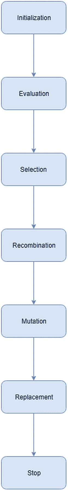

图 7-6

遗传算法步骤

*初始化*步骤涉及随机生成一个候选解集。在第二步，*评估*中，你尝试为每个染色体找到一个适应度值，然后将其分配给确定的值。接下来的四个步骤用于使用不同方法在候选解集中生成更多染色体。当你选择具有高适应度值的染色体并复制它们时，这就是*选择*步骤。当你组合多个染色体以获得更好的染色体时，这个步骤被称为*重组*。当你尝试修改当前候选解的属性时，这被称为*变异*。最后，当新解替换旧解时，这被称为*替换*。你将重复这个过程，直到达到特定的阈值。

### 选择

选择中最著名的方法之一是*锦标赛方法*。一旦你有了一个候选解集，你从中选择`k`个成员，并在它们之间进行一场锦标赛。锦标赛后最适应的成员被认为是被选中的。这个过程会重复多次以获得最佳成员。个体参与锦标赛的机会被称为*选择压力*。锦标赛方法的完整算法如图 7-7 所示，并可通过以下几点总结：

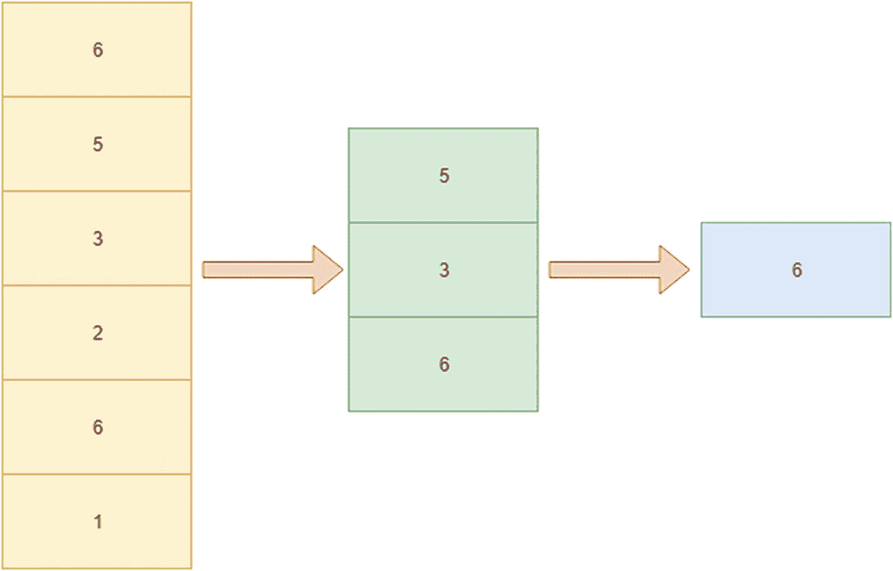

图 7-7

锦标赛选择

1. 从种群中选择`k`个个体，并在它们之间进行一场锦标赛。
2. 从这`k`个个体中选择最佳个体。
3. 重复步骤 1 和 2，直到获得所需的种群规模。

### 重组

在重组中，你使用*交叉方法*来找到最适应的成员。使用*单点交叉*方法（见图 7-8），你首先选择两个染色体。你随机选择两个染色体中的任意一点，然后交换该点之后的基因。*两点交叉*（见图 7-9）涉及随机选择两个染色体中的两个点。随后交换这两个点之间的部分。

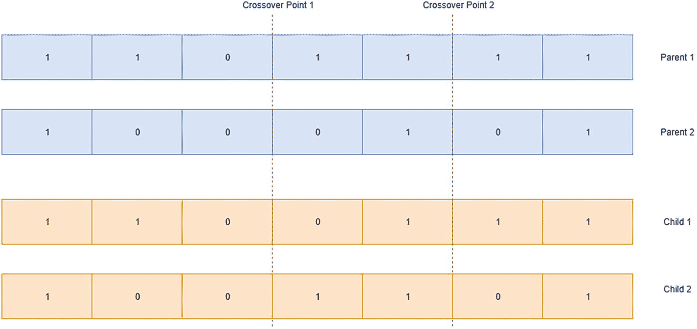

图 7-9

两点交叉

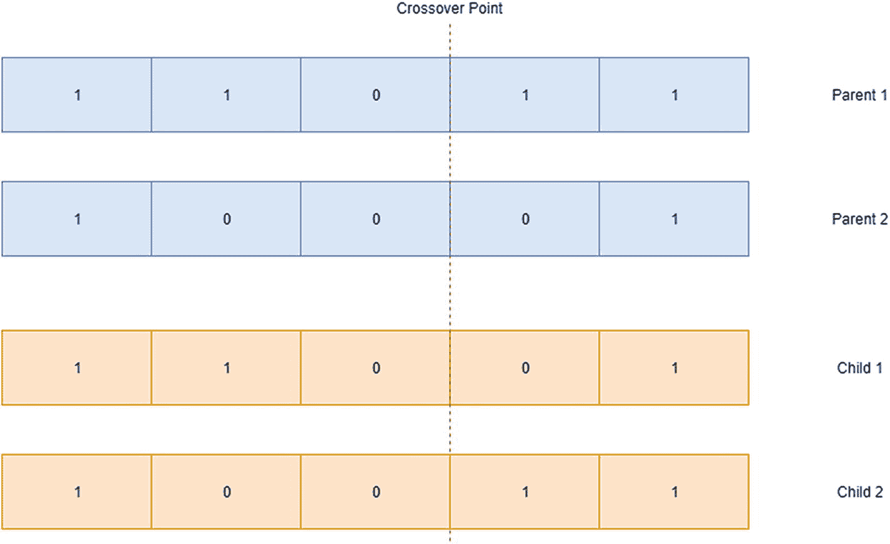

图 7-8

单点交叉

除了这两种方法，还有均匀交叉和算术交叉。在均匀交叉中，两个父代之间的组合是随机的。这意味着任何特征都可以随机地从任一父代中选择。在算术交叉中，可以对两个父代应用任何数学运算来产生子代。图 7-10 和 7-11 展示了具有二元运算的均匀交叉和算术交叉。

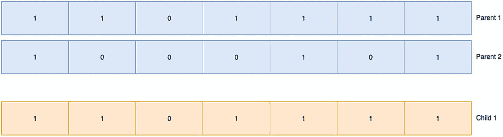

图 7-11

算术交叉

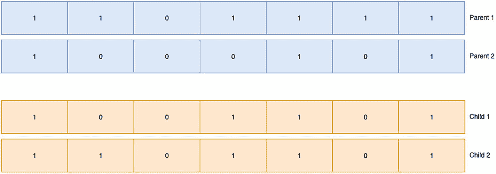

图 7-10

均匀交叉

### 变异

如前所述，在变异中，你尝试改变染色体的属性以检查它们是否变得更适应。在*翻转*（*位翻转变异*）方法中，基因被改变为其相反值。如果一个染色体包含 0 和 1，那么 0 被翻转为 1，反之亦然。第二种方法是*互换*（*交换变异*），你在一个染色体中选择任意两个点，然后交换这些位置上的基因。在*反转*（*倒位变异*）中，你选择一个随机点，该点之后的基因被反转，就像翻转方法一样。如果从整个染色体中，选择一个基因子集然后随机打乱，这被称为*混洗变异*。图 7-12 到 7-15 说明了这些变异的概念。

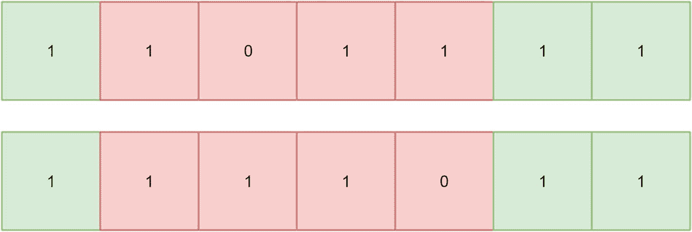

图 7-15

混洗变异

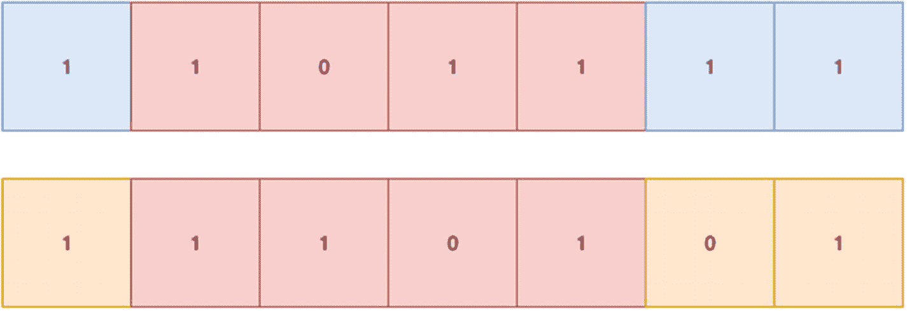

图 7-14

倒位变异

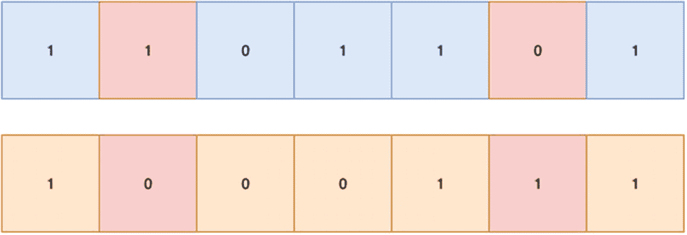

图 7-13

交换变异

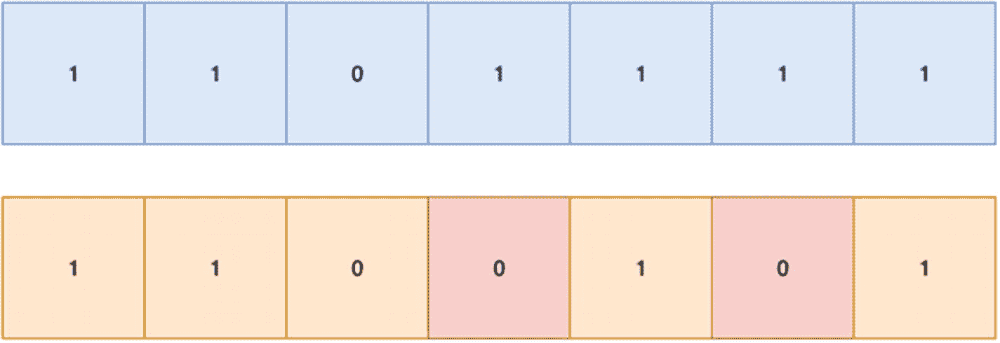

图 7-12

位翻转变异

### 替换

如果子代更适应，你随机选择种群中两个较不适应的父代，并用子代替换它们。这被称为*随机替换*。这可以细分为*弱父代替换*和*双亲替换*。在弱父代替换中，只替换较弱的父代，而在后一种方法中，两个父代都被替换。

### 停止

最后，当涉及到停止遗传算法时，你可以使用几种方法。当生成的子代数量超过阈值时，你可以停止该过程。你也可以基于经过的时间阈值来停止。最退化的过程是基于适应度值停止。这意味着只有当子代的适应度没有发生任何重大变化时，算法才会停止。

现在你已经学习了讨论高级模糊架构所需的基础知识，让我们继续本章，讨论第一个架构——模糊自适应学习控制网络（FALCON）。


## 模糊自适应学习控制网络（FALCON）

你在前一章学习了自适应神经模糊推理系统。它利用神经网络的优势，基于模糊输入来预测模糊输出。`FALCON` 则利用遗传算法和模糊聚类的强大能力，从输入中学习模式，然后预测输出。

为了自动构建一个 `FALCON` 网络，你需要使用一种混合算法，它被称为 `FALCON-GA`（FALCON 遗传算法）。要构建该网络，`FALCON-GA` 需要以下步骤：

- 模糊聚类
- 遗传算法
- 反向传播

本节使用模糊聚类方法，通过训练数据在输入和输出空间中寻找聚类。然后，它使用遗传算法，通过分析第一步中找到的输入和输出聚类之间的关联，来寻找模糊规则。最后，反向传播方法将对输入和输出变量的隶属函数进行微调。图 7-16 展示了一个使用 `FALCON-GA` 生成的 `FALCON` 网络。

图 7-16 展示了林正坚和林清灯（1997）论文中提出的一个 `FALCON` 架构。该架构由五层组成。第一层是输入层。第二层定义了来自前一层的输入节点的隶属函数。第三层包含一个基于前两层推导出的模糊规则库。第四层有助于推导模糊规则的后件。

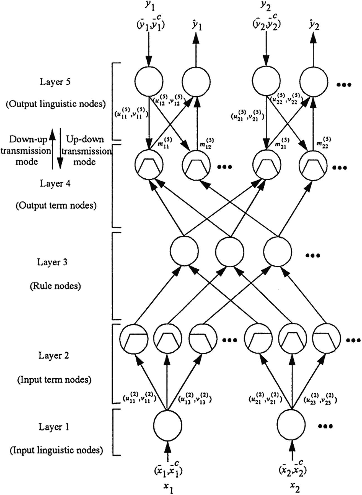

图 7-16

提出的 `FALCON`（林正坚 & 林清灯. (1997)，一种基于 ART 的模糊自适应学习控制网络。IEEE 模糊系统汇刊，5(4)，477–496. doi:10.1109/91.649900）

最后，在第五层，你得到输出，然后将其与期望输出进行比较，并反馈回去。

## 用于数据分类的神经模糊系统（NEFCLASS）

`NEFCLASS` 是模糊感知器的一个特殊类别。它总共有三层。层与层之间是权重传递发生的地方。这些权重是模糊集，而在隐藏层中，每个节点代表一个模糊规则。输出层解释类别的模式。

模型在输入数据上进行训练，以找到将相似模式分离到多个类别中的规则。因此，`NEFCLASS` 是一种监督学习方法，通过反向传播来最小化误差。

`NEFCLASS` 规则库遵循以下结构：

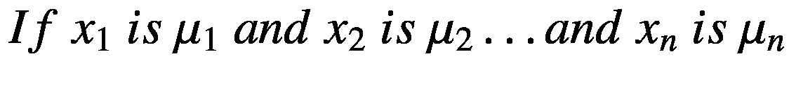

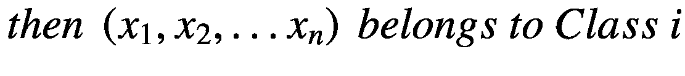

`NEFCLASS` 可用于从训练数据中学习这些规则的结构，然后学习其隶属函数的形状。对于每个输入 `x[i]`，可以有 `q[i]` 个模糊集和 `k` 条规则。`NEFCLASS` 的输出可以表示为：

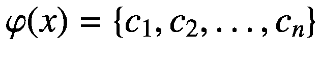

图 7-17 提供了一个 `NEFCLASS` 结构的示例。它借助五条模糊规则将两个输入划分为两个输出类别。

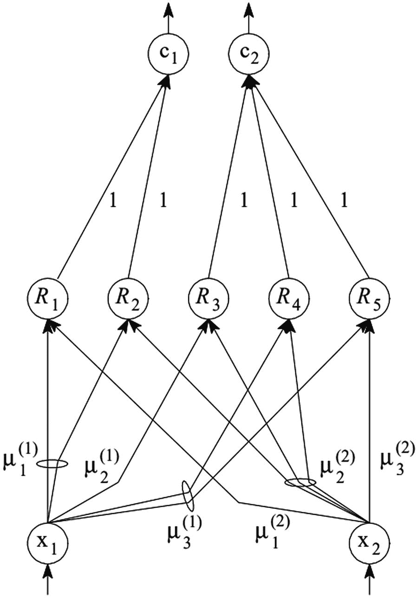

图 7-17

一个 `NEFCLASS` 结构示例

## 模糊推理软件（FINEST）

`FINEST` 工具用于构建基于模糊知识的系统，由国际模糊工程实验室（LIFE）开发。`FINEST` 包含一个称为 `单元` 的小型处理组件（见图 7-18）。单元用于表示知识。它们的主要任务是接收输入，以特定方式处理输入，并产生一些输出。以下是 `FINEST` 中基于用途的单元列表：

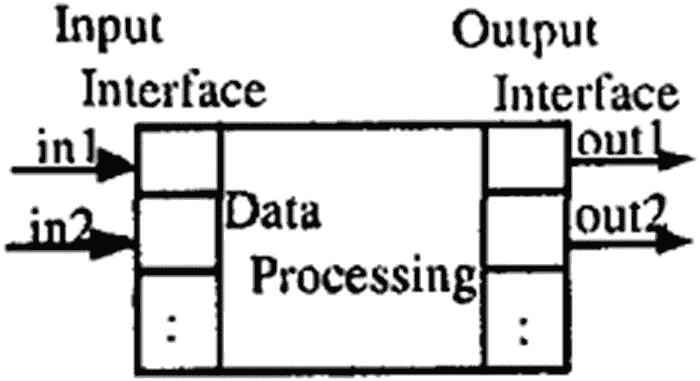

图 7-18

一个 `单元` 的视图

- 规则单元
- 函数单元
- 外部单元
- 内存单元
- 复合单元

### 规则单元

规则单元包含一条或多条模糊规则。它们用于对输入数据进行推理。结果通过规则单元的输出推理进行输出。

### 函数单元

该单元使用 `LISP` 进行处理。它接收输入数据，对其进行评估，然后输出评估值。它有一些可配置的参数用于微调任务。函数单元的主要用途是用于去模糊化过程。

### 外部单元

该单元是一个可执行的 `UNIX` 文件。它是一个不可配置的组件。所执行的计算以 `UNIX` 进程的形式进行。

### 内存单元

该单元用于存储系统的状态。它也用于存储中间结果。不同的单元与该单元通信并提取数值。

### 复合单元

当多个单元组合在一起时，它们被称为 `复合单元`（见图 7-19）。它们用于构建一个完整的层次化系统。

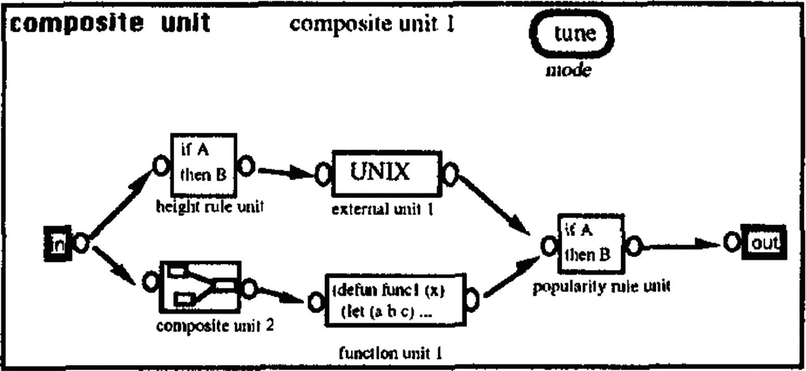

图 7-19

一个 `复合单元` 的结构（Tano, S., Miyoshi, T., Kato, Y., Oyama, T., Arnould, T., Bastian, A., & Umano, M. (n.d.). 模糊推理软件-FINEST：概述与应用示例，doi:10.1109/fuzzy.1995.409810）

`FINEST` 可以解决的一些问题如下：

- 有时规则可能表达模糊的含义。
- 找到最佳且合适的蕴涵算子很困难。
- 组合不同过程的推理结果很困难。
- 自动进行调优很困难。

`FINEST` 可用于开发模糊系统，或用于量化句子的模糊含义。

## 总结

本章探讨了模糊神经网络的一些高级应用。讨论了一些当前研究领域正在进行的工作。还研究了遗传算法，它与模糊神经网络相结合，构建出了一些非常优秀的模型。本章还介绍了这些算法在 Python 中的一些应用。

## 索引

### A

自适应神经模糊推理系统（ANFIS） Sugeno FIS 聚合 前件 架构 后件 去模糊化 隶属函数 归一化 规则 Tsukamoto FIS 自适应共振理论（ART） 应用 架构 注意力 分类问题 F [1] 和 F [2]（注意力层） 方向 输出层 Python 实现 警戒阈值 赤池信息准则（AIC） 近似推理 参见推理 人工神经网络（ANN） 激活函数 泄露 ReLU ReLU 函数 Sigmoid Softmax 函数 Tanh 反向传播 计算图 概念 代价函数 前向传播 梯度下降过程 隐藏层 输入层 层 LSTM 多层架构 卷积神经网络 循环神经网络 输出层 感知器 权重和偏置 自联想记忆

### B

贝叶斯信息准则（BIC）


### C

- **重心法/质心法**
- **求和重心法**
- **经典集合**：集合的基数、可数集、清晰集（参见`清晰集`）、集合族、元素隶属关系、空集、运算（补集、差集、交集、并集、幂集）、性质、单元素集、子集、超集、不可数集、论域、文氏图
- **聚类**：`ART`（参见`自适应共振理论（ART）`）、类别、`C-均值`（参见`C-均值聚类方法`）、`FALCON`网络、`FINEST`、`NEFCLASS`
- **C-均值聚类方法**：应用、定义、欧几里得距离、模糊 C 均值、Python 实现
- **复合与非复合隶属函数**
- **卷积神经网络**：组件（卷积层、填充、激活函数、输出层、池化层、零填充、像素矩阵）
- **清晰集**：`德摩根定律`、幂等律、同一律、`对合律`、`吸收律`、`结合律`、`交换律`、`矛盾律`、`分配律`、`排中律`、`传递律`、性质

### D, E

- **数据集**
- **去模糊化方法**：重心法/质心法、求和重心法、最大值首/末/均值法、`FIS`（参见`模糊推理系统（FIS）`）、λ截集法、最大原则/高度法、过程、加权平均法

### F

- **基础记忆集**
- **模糊自适应学习控制网络（FALCON）**
- **模糊推理神经网络（FINN）**：架构、类别、并发式、协作式
- **模糊推理软件（FINEST）**：复合单元、可执行 UNIX 文件、功能单元、列表、内存单元、规则单元
- **模糊推理系统（FIS）**：比较分析、`Mamdani 方法`（参见`Mamdani 方法`）、过程、`Takagi-Sugeno-Kang`、`Tsukamoto`
- **模糊集合**：`德摩根定律`、`幂等律`、同一律、对合律、`结合律`、`交换律`、`分配律`、`传递律`、成员与非成员、运算（补集、差集、析取和、交集、幂、积、并集）、性质

### G

- **门控循环单元（GRU）**
- **高斯隶属函数**
- **广义钟形隶属函数**
- **广义假言推理（GMP）**
- **遗传算法**：算术交叉、位翻转变异、候选解、染色体、决策变量、流程图表示、初始化步骤、逆序变异、变异、单点交叉、重组、替换、混洗变异、选择、终止、交换变异、锦标赛选择、均匀交叉

### H, I, J, K

- **异联想记忆**
- **混合神经网络**

### L

- **长短期记忆网络（LSTM）**：组件（遗忘门、门控循环单元、输入门、输出门、重置门、更新门）

### M

- **机器学习（ML）模型**：准确率、召回率/真正率、真负率、算法、偏差与方差、二分类、分类、混淆矩阵、数据集类型、经验、`F1 分数`、房价数据集、过拟合 *vs.* 欠拟合、精确率、回归模型（调整后的`R 平方`摘要、`AIC`模型、`BIC`、`RMS`误差、`R 平方`公式、`ROC`曲线）、监督学习 *vs.* 无监督学习、泰坦尼克号数据集
- **Mamdani 集成 FINN**：架构、反向传播方法、后件层、去模糊化层、模糊化层、输入层、规则前件层、`Takagi Sugeno`
- **Mamdani 方法**：优点、聚合、清晰输出、缺点、模糊化、`If-Then`规则、输出隶属函数、Python 代码、规则库、Sigmoid 表示、步骤、`TSK`方法
- **最大池化操作**
- **隶属函数**：清晰集表示、定义、形式化定义、`高斯函数`（`gaussmf`方法）、广义钟形函数、平均评分、`Scikit Fuzzy`包、S 形函数、Sigmoid 函数、术语（α–截集、带宽、边界、闭集、凸性、核、交叉点、正态性、左开、右开、单点集、强α–截集、支撑集、对称集、梯形函数、三角形）、类型（复合与非复合函数、定义、`高斯函数`、广义钟形函数、多项式隶属函数、S 形函数、梯形、三角形函数）

### N, O

- **神经联想记忆**
- **神经网络**：`ANFIS`（参见`自适应神经模糊推理系统（ANFIS）`）、联想记忆、`FINN`（参见`模糊推理神经网络（FINN）`）、混合神经网络、`Mamdani 集成 FINN`、神经元、性质、表示
- **神经模糊系统**
- **用于数据分类的神经模糊系统（NEFCLASS）**
- **神经元**：混合神经网络的`与/或`组件、蕴含-或神经元、`Kwan and Cai (K&C)`神经元、常规神经网络、`T-余范数`运算、`T-范数`运算

### P, Q

- **Π形隶属函数**
- **多项式隶属函数**：Π形、S 形、Z 形

### R

- **推理**：聚合运算、交换律、`余范数`三角形、固定同一性、单调性、三角范数、合取规则、定义、析取规则、蕴含规则、形式化符号、`GMP`、否定、投影规则、拒取式
- **修正线性单元（ReLU）激活函数**：死亡问题、公式、带泄露的`ReLU`、Python 实现
- **循环神经网络**：单元过程、图示、梯度爆炸问题、结构、时间序列数据、梯度消失问题
- **关系**：反自反、反相似、反对称关系、柱状扩展、定义、半序、投影、性质、自反、相似、对称关系、传递、弱相似
- **均方根（RMS）**
- **规则**：后件/结论、蕴含与映射、语言值、过程、服务

### S

- **混洗变异**
- **Sigmoid 激活函数**
- **S 形隶属函数**
- **软计算**：认知能力、组成要素、清晰集、定义、*vs.* 硬计算、推理系统、问题求解方法
- **Softmax 激活函数**
- **S 形隶属函数**
- **Sugeno 模糊推理系统（FIS）**：聚合、前件、架构、后件、去模糊化、隶属函数、归一化、规则
- **监督学习与无监督学习**

### T, U, V

- **Takagi-Sugeno-Kang（TSK）方法**
- **Tanh 激活函数**
- **锦标赛方法**
- **梯形隶属函数**
- **三角形隶属函数**
- **真负率（TNR）**
- **Tsukamoto 模糊推理系统**
- **Tsukamoto 方法**

### W, X, Y

- **加权平均法**

### Z

- **Z 形隶属函数**
