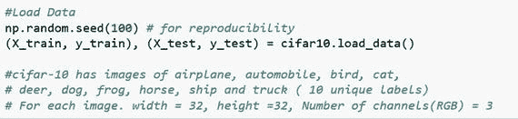
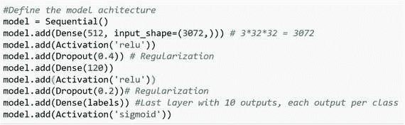
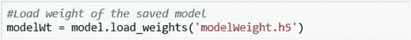

# 2.了解和使用 Keras

Keras 是一个简洁易学的深度学习高级 Python 库，可以运行在 TensorFlow(或者 Theano 或者 CNTK)之上。它允许开发人员专注于深度学习的主要概念，例如为神经网络创建层，同时关注张量的本质细节、形状和数学细节。TensorFlow(或 Theano 或 CNTK)必须是 Keras 的后端。可以使用 Keras 进行深度学习应用，而不需要与相对复杂的 TensorFlow(或者 Theano 或者 CNTK)进行交互。有两种主要的框架:顺序 API 和功能 API。顺序 API 基于一系列层的思想；这是 Keras 最常见的用法，也是 Keras 最容易的部分。顺序模型可以被认为是层的线性堆叠。

简而言之，您可以创建一个顺序模型，在这个模型中，您可以轻松地添加层，并且每个层都可以有卷积、最大池化、激活、退出和批处理规范化。让我们来看看在 Keras 中开发深度学习模型的主要步骤。

## 深度学习模型的主要步骤

Keras 中深度学习模型的四个核心部分如下:

1.  定义模型。在这里，您创建一个顺序模型并添加层。每一层可以包含一个或多个卷积、汇集、批量标准化和激活功能。
2.  编译模型。在这里，您在模型上调用`compile()`函数之前应用损失函数和优化器。
3.  用训练数据拟合模型。在这里，您通过调用模型上的`fit()`函数来训练测试数据上的模型。
4.  做预测。在这里，您通过调用函数(如`evaluate()`和`predict()`)来使用模型生成对新数据的预测。

Keras 的深度学习流程有八个步骤:

1.  加载数据。
2.  预处理数据。
3.  定义模型。
4.  编译模型。
5.  符合模型。
6.  评估模型。
7.  做出预测。
8.  保存模型。

### 加载数据

以下是加载数据的方式:




### 预处理数据

以下是预处理数据的方法:


### 定义模型

Keras 中的顺序模型被定义为一系列层。创建一个顺序模型，然后添加层。您需要确保输入图层具有正确的输入数量。假设你有 3072 个输入变量；然后你需要创建第一个有 512 个节点/神经元的隐藏层。在第二个隐藏层，你有 120 个节点/神经元。最后，输出层中有十个节点。例如，一幅图像映射到十个节点上，显示了被标记为 1(飞机)、2(汽车)、3(猫)、…、10(卡车)的概率。概率最高的节点是预测的类别/标签。



一幅图像有三个通道(RGB)，在每个通道中，图像有 32×32 = 1024 个像素。因此，每个图像有 3×1024 = 3072 个像素(特征/X/输入)。

在 3072 个特征的帮助下，你需要预测标签 1(数字 0)、标签 2(数字 1)等等的概率。这意味着模型预测十个输出(数字 0-9)，其中每个输出代表相应标签的概率。最后一个激活函数(sigmoid，如前所示)为 9 个输出提供 0，仅为 1 个输出提供 1。该标签是图像的预测类别(图 [2-1](#Fig1) )。

例如，3072 功能➤ 512 节点➤ 120 节点➤ 10 节点。


图 2-1

Defining the model

下一个问题是，你如何知道要使用的层数和它们的类型？没有人有确切的答案。对于评估指标来说，最好的是确定最佳层数以及每层中的参数和步骤。还使用了启发式方法。通过反复试验的过程找到最佳的网络结构。一般来说，你需要一个足够大的网络来捕捉问题的结构。

在本例中，您将使用三层全连接网络结构。密集类定义完全连接的层。

在这种情况下，将网络权重初始化为从均匀分布(均匀)生成的小随机数(在这种情况下介于 0 和 0.05 之间)，因为这是 Keras 中默认的均匀权重初始化。另一个传统的选择是从高斯分布产生的小随机数的常态。您可以使用或捕捉任一类的硬分类，默认阈值为 0.5。你可以通过添加每一层把它们拼凑在一起。

### 编译模型

按照层定义了模型之后，您需要声明损失函数、优化器和评估指标。当提出模型时，初始权重和偏差值被假定为 0 或 1、随机正态分布数或任何其他方便的数。但是初始值并不是模型的最佳值。这意味着权重和偏差的初始值不能解释预测值(x)方面的目标/标签。所以，你想得到模型的最优值。从初始值到最优值的旅程需要一个动机，这个动机将最小化成本函数/损失函数。旅程需要一个路径(每次迭代中的变化)，这是优化器建议的。这个旅程也需要一个评估测量，或者评估度量。


流行的损失函数是二元交叉熵、分类交叉熵、均方对数误差和铰链损失。流行的优化器是随机梯度下降(SGD)、RMSProp、adam、adagrad 和 adadelta。流行的评估指标是准确性、召回率和 F1 分数。

简而言之，这一步的目的是基于损失函数，通过基于优化器的迭代来调整权重和偏差，优化器由诸如准确性之类的度量来评估。

### 符合模型

定义并编译了模型之后，您需要通过对一些数据执行模型来做出预测。这里您需要指定纪元；这些是训练过程运行数据集的迭代次数和批量大小，批量大小是在权重更新之前评估的实例数量。对于这个问题，该程序将运行少量的时段(10)，并且在每个时段中，它将完成 50 次(=50，000/1，000)迭代，其中批量大小为 1，000，训练数据集具有 50，000 个实例/图像。同样，没有选择批量大小的硬性规定。但是它不应该非常小，并且应该比训练数据集的大小小得多，以消耗更少的内存。


### 评估模型

在训练数据集上训练了神经网络之后，您需要评估网络的性能。请注意，这只能让您了解对数据集建模的效果(例如，训练精度)，但您不知道该算法对新数据的执行效果如何。这是为了简单起见，但理想情况下，您可以将数据分为训练和测试数据集，用于模型的训练和评估。您可以使用模型上的`evaluation()`函数在您的训练数据集上评估您的模型，并将用于训练模型的相同输入和输出传递给它。这将为每个输入和输出对生成一个预测，并收集分数，包括平均损失和您已配置的任何度量，如准确性。


### 预报

一旦建立并评估了模型，就需要对未知数据进行预测。


### 保存并重新加载模型

这是最后一步:




### 可选:总结模型

现在来看如何总结模型。


## 改进 Keras 模型的其他步骤

以下是改进模型的更多步骤:

1.  Sometimes, the model building process does not complete because of a vanishing or exploding gradient. If this is the case, you should do the following:

    

2.  对输出形状建模。

    ```py
    #Shape of the n-dim array (output of the model at the current position)

      model.output_shape

    ```

3.  对摘要表示进行建模。

    ```py
    model.summary()

    ```

4.  对配置建模。

    ```py
    model.get_config()

    ```

5.  列出模型中所有的重量张量。

    ```py
    model.get_weights()

    ```

在这里，我分享了 Keras 模型的完整代码。你能试着解释一下吗？


## 使用 TensorFlow 很难

Keras 通过利用 TensorFlow/Theano 之上强大而清晰的深度学习库来提供高级神经网络。Keras 是 TensorFlow 的一个很好的补充，因为它的层和模型与纯 TensorFlow 张量兼容。此外，它可以与其他 TensorFlow 库一起使用。

以下是将 Keras 用于 TensorFlow 的步骤:

1.  首先创建一个 TensorFlow 会话，并将其注册到 Keras。这意味着 Keras 将使用您注册的会话来初始化它在内部创建的所有变量。

    ```py
    import TensorFlow as tf

    sess = tf.Session()

    from keras import backend as K

    K.set_session(sess)

    ```

2.  Keras 模块(如模型、层和激活)用于构建模型。Keras 引擎自动将这些模块转换成等价于 TensorFlow 的脚本。
3.  除了 TensorFlow，Theano 和 CNTK 可以用作 Keras 的后端。
4.  TensorFlow 后端具有按照深度、高度、宽度顺序制作输入形状(到网络的第一层)的惯例，其中深度可以表示通道的数量。
5.  您需要正确配置`keras.json`文件，以便它使用 TensorFlow 后端。它应该是这样的:

    ```py
    {

           "backend": "theano",

           "epsilon": 1e-07,

           "image_data_format": "channels_first",

           "floatx": "float32"

    }

    ```

在接下来的章节中，您将学习如何利用 Keras 在 CNN、RNN、LSTM 和其他深度学习活动中工作。