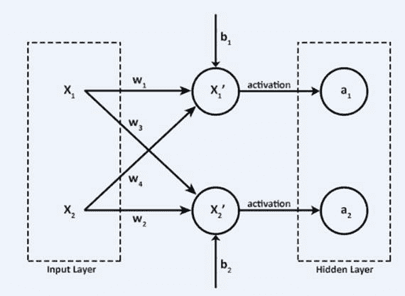
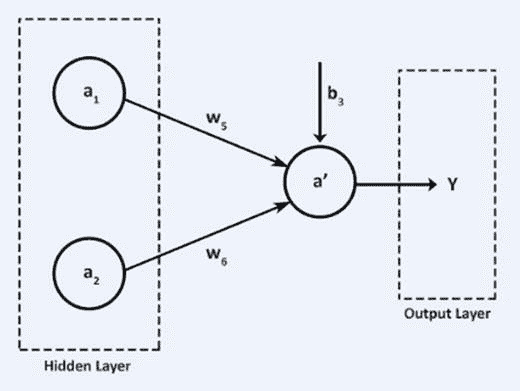

# 三、多层感知器

在开始学习多层感知器之前，你需要对人工神经网络有一个大致的了解。这就是我在这一章要开始讲的。

## 人工神经网络

人工神经网络(ANN)是一种受生物神经网络启发的计算网络(节点和节点之间的互连系统)，生物神经网络是人脑中神经元的复杂网络(见图 [3-1](#Fig1) )。人工神经网络中创建的节点应该被编程为像实际神经元一样的行为，因此它们是人工神经元。图 [3-1](#Fig1) 显示了构成人工神经网络的节点(人工神经元)的网络。

图 3-1

Artificial neural network

层数和每层的神经元/节点数可以是人工神经网络的主要结构组成部分。最初，权重(代表互连)和偏差不足以做出决定(分类等)。).它就像一个没有任何经验的婴儿的大脑。婴儿从经验中学习，以便成为一个好的决策者(分类者)。经验/数据(标记)帮助大脑的神经网络调整(神经)权重和偏差。人工神经网络经历相同的过程。每次迭代调整权重以创建好的分类器。由于手动调整数千个神经元的权重非常耗时，因此需要使用算法来完成这些任务。

调整权重的过程被称为学习或训练。这和人类日常所做的是一样的。我们试图让计算机像人类一样工作。

让我们开始探索最简单的人工神经网络模型。

典型的神经网络包含大量被称为单元的人工神经元，这些单元排列在一系列不同的层中:输入层、隐藏层和输出层(图 [3-2](#Fig2) )。

图 3-2

Neural network

神经网络是连接的，这意味着隐藏层中的每个神经元都与前一个输入层中的每个神经元以及下一个输出层完全连接。神经网络通过反复调整每层中的权重和偏差来学习，以获得最佳结果。

## 单层感知器

单层感知器是一个简单的线性二元分类器。它获取输入和相关权重，并将它们组合起来以产生用于分类的输出。它没有隐藏层。逻辑回归是单层感知器。

## 多层感知器

多层感知器(MLP)是反馈人工神经网络的一个简单例子。除了输入层和输出层之外，MLP 至少包含一个隐藏节点层。除输入层之外的层的每个节点被称为神经元，其使用诸如 sigmoid 或 ReLU 的非线性激活函数。MLP 使用一种称为反向传播的监督学习技术进行训练，同时最小化损失函数，如交叉熵。它使用优化器来调整参数(权重和偏差)。它的多层和非线性激活将 MLP 与线性感知器区分开来。

多层感知器是深度神经网络的基本形式。

在学习 MLPs 之前，我们先来看看线性模型和逻辑模型。你可以体会到线性、逻辑和 MLP 模型在复杂性方面的细微差别。

图 [3-3](#Fig3) 显示了一个输入(X)和一个输出(Y)的线性模型。

图 3-3

Single-input vector

单输入模型有一个权重为 W、偏差为 b 的向量 X。输出 Y 是 WX + b，这是线性模型。

图 [3-4](#Fig4) 显示了多个输入(X1 和 X2)和一个输出(Y)。

图 3-4

Linear model

此线性模型有两个输入要素:X1 和 X2，每个输入要素的对应权重为 W1、W2 和偏差 b。输出 Y 为 W1X1 + W2X2 + b

## 逻辑回归模型

图 [3-5](#Fig5) 显示了当二进制分类问题的输出标签 Y 为 0 或 1 时使用的学习算法。给定一个输入特征向量 X，你想要的是给定输入特征 X，Y = 1 的概率，这也被称为浅层神经网络或单层(无隐层；只有和输出层)神经网络。输出图层 Y 是σ (Z)，其中 Z 是 WX + b，σ是 sigmoid 函数。

图 3-5

One input (X) and one output (Y)

图 [3-6](#Fig6) 显示了当二进制分类问题的输出标签 Y 为 0 或 1 时使用的学习算法。

图 3-6

Multiple inputs (X1 and X1) and one output (Y)

给定输入要素向量 X1 和 X2，您需要给定输入要素 Y = 1 的概率。这也被称为感知器。输出层 Y 为σ (Z)，其中 Z 为 WX + b.

![$$ \left[\begin{array}{c}X1\\ {}X2\end{array}\right]\to \left[\begin{array}{cc}W1& W2\\ {}W3& W4\end{array}\right]\left[\begin{array}{c}X1\\ {}X2\end{array}\right]+\left[\begin{array}{c}b1\\ {}b2\end{array}\right]\to \sigma \left(\left[\begin{array}{c}W1\ast X1+W2\ast X2+b1\\ {}W3\ast X1+W4\ast X2+b2\end{array}\right]\right) $$](A456157_1_En_3_Chapter_Equa.gif)

图 [3-7](#Fig7) 是一个两层的神经网络，有一个隐含层和一个输出层。考虑你有两个输入特征向量 X1 和 X2 连接到两个神经元，X1’和 X2’。从输入层到隐藏层的相关参数(权重)是 w1，w2，w3，w4，b1，b2。

图 3-7

Two-layer neural network

X1 '和 X2 '计算线性组合(图 [3-8](#Fig8) )。【T2![$$ \left[\begin{array}{c}X{1}^{\hbox{'}}\\ {}X{2}^{\hbox{'}}\end{array}\right]=\left[\begin{array}{cc}w1& w2\\ {}w3& w4\end{array}\right]\left[\begin{array}{c}X1\\ {}X2\end{array}\right]+\left[\begin{array}{c}b1\\ {}b2\end{array}\right] $$](A456157_1_En_3_Chapter_Equb.gif)

(2×1)(2×2)(2×1)(2×1)是输入层和隐藏层的维数。

图 3-8

Computation in the neural network

线性输入 X1’和 X2’通过隐藏层中的激活单元 a1 和 a2。

a1 是σ (X1 ')，a2 是σ(X2 ')，那么你也可以把方程写成:

![$$ \left[\begin{array}{c}a1\\ {}a2\end{array}\right]=\sigma \left[\begin{array}{c}X{1}^{\hbox{'}}\\ {}X{2}^{\hbox{'}}\end{array}\right] $$](A456157_1_En_3_Chapter_Equc.gif)

该值从隐藏层向前传播到输出层。输入 a1 和 a2 以及参数 w5、w6 和 b3 通过输出层 a’(图 [3-9](#Fig9) )。

图 3-9

Forward propagation

![$$ {\mathrm{a}}^{\hbox{'}}=\left[w5\kern0.5em w6\right]\left[\begin{array}{c}a1\\ {}a2\end{array}\right]+\left[b3\right] $$](A456157_1_En_3_Chapter_IEq1.gif)创建(w5*a1 + w6*a2) + b3 的线性组合，该组合将通过非线性 sigmoid 函数到达最终输出层 Y.

假设一维的初始模型结构为 Y = w*X + b，其中参数 w 和 b 为权重和偏差。

对于参数 w = 1 和 b = 1 的初始值，考虑损失函数 L(w，b) = 0.9。你得到这样的输出:y = 1*X+1 & L(w，b) = 0.9。

目标是通过调整参数 w 和 b 来最小化损失。误差将从输出层反向传播到隐藏层，再到输入层，以通过学习率和优化器来调整参数。最后，我们想建立一个模型(回归量)，可以用 x 来解释 Y。

为了开始建立模型的过程，我们初始化权重和偏差。为方便起见，w = 1，b = 1(初始值)，(优化器)带学习率的随机梯度下降(α = 0.01)。

下面是第一步:Y = 1 * X + 1。

1.20               0.35

参数调整为 w = 1.20，b = 0.35。

下面是第二步:Y1 = 1.20*X + 0.35。

1.24               0.31

参数调整为 w = 1.24，b = 0.31。

下面是第三步:Y1 = 1.24*X + 0.31。

1.25               0.30

经过一些迭代后，权重和偏差变得稳定。如您所见，在调优时，初始变化很大。经过一些迭代后，变化并不显著。

当 w = 1.26 且 b = 0.29 时，L(w，b)最小；因此，最终模型如下所示:

Y = 1.26 * X + 0.29

同样，在二维中，可以考虑参数，权重矩阵和偏置向量。

让我们假设初始权重矩阵和偏差向量为![$$ \mathrm{W}=\left[\begin{array}{cc}1& 1\\ {}1& 1\end{array}\right] $$](A456157_1_En_3_Chapter_IEq2.gif)和![$$ \mathrm{B}=\left[\begin{array}{c}1\\ {}1\end{array}\right] $$](A456157_1_En_3_Chapter_IEq3.gif)。

你迭代并反向传播误差来调整 w 和 b。

![$$ \mathrm{Y}=\mathrm{W}=\left[\begin{array}{cc}1& 1\\ {}1& 1\end{array}\right]\ast \left[X\right]+\left[\begin{array}{c}1\\ {}1\end{array}\right] $$](A456157_1_En_3_Chapter_IEq4.gif)是初始模型。权重矩阵(2x2)和偏差矩阵(2x1)在每次迭代中进行调整。因此，我们可以看到权重和偏差矩阵的变化

下面是第一步:

![$$ W=\left[\begin{array}{cc}0.7& 0.8\\ {}0.6& 1.2\end{array}\right],B=\left[\begin{array}{c}2.4\\ {}3.2\end{array}\right] $$](A456157_1_En_3_Chapter_Eque.gif)

下面是第二步:![$$ \left[\begin{array}{cc}0.7& 0.8\\ {}0.6& 1.2\end{array}\right]\kern0.50em \left[\begin{array}{c}2.4\\ {}3.2\end{array}\right] $$](A456157_1_En_3_Chapter_IEq5.gif)

![$$ W=\left[\begin{array}{cc}0.6& 0.7\\ {}0.4& 1.3\end{array}\right],B=\left[\begin{array}{c}2.8\\ {}3.8\end{array}\right] $$](A456157_1_En_3_Chapter_Equf.gif)

下面是步骤 3: ![$$ \left[\begin{array}{cc}0.6& 0.7\\ {}0.4& 1.3\end{array}\right]\kern0.50em \left[\begin{array}{c}2.8\\ {}3.8\end{array}\right] $$](A456157_1_En_3_Chapter_IEq6.gif)你可以注意到迭代中权重矩阵(2x2)和偏差矩阵(2x1)的变化。

![$$ W=\left[\begin{array}{cc}0.5& 0.6\\ {}0.3& 1.3\end{array}\right],B=\left[\begin{array}{c}2.9\\ {}4.0\end{array}\right] $$](A456157_1_En_3_Chapter_Equg.gif)

You can notice change in weight matrix(2x2) and bias matrix(2x1) in the iteration.

调整 w 和 b 后的最终模型如下:

![$$ \mathrm{Y}=\left[\begin{array}{cc}0.4& 0.5\\ {}0.2& 1.3\end{array}\right]\ast \left[X\right]+\left[\begin{array}{c}3.0\\ {}4.0\end{array}\right] $$](A456157_1_En_3_Chapter_Equh.gif)

在本章中，您学习了如何在每次迭代中调整权重和偏差，同时保持损失函数最小化的目标。这是在优化器如随机梯度下降的帮助下完成的。

在这一章中，我们已经理解了人工神经网络和 MLP 作为基本的深度学习模型。在这里，我们可以看到 MLP 作为线性和逻辑回归的自然进展。我们已经看到在反向传播的每次迭代中权重和偏差是如何调整的。不用深入反向传播的细节，我们已经看到了反向传播的作用/结果。在接下来的两章中，我们将学习如何在 TensorFlow 和 keras 中建立 MLP 模型。