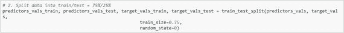

# 四、TensorFlow 中的 MLP 回归

长期以来，人们一直在使用回归和分类器。现在是时候切换到神经网络的话题了。多层感知器(MLP)是一个简单的神经网络模型，您可以在输入和输出层之间添加一个或多个隐藏层。

在本章中，您将看到 TensorFlow 如何帮助您构建模型。您将从最基本的模型开始，这是一个线性模型。本章还讨论了逻辑斯蒂和 MLP 模型。

## TensorFlow 构建模型的步骤

在这一节中，我将讨论在 TensorFlow 中建立模型的步骤。我将带您完成这里的步骤，然后您将看到贯穿本章的代码:

1.  加载数据。
2.  将数据拆分到训练和测试中。
3.  如果需要，进行标准化。
4.  初始化包含预测值和目标值的占位符。
5.  创建将被调整的变量(权重和偏差)。
6.  声明模型操作。
7.  声明损失函数和优化器。
8.  初始化变量和会话。
9.  通过使用训练循环来拟合模型。
10.  用测试数据检查并显示结果。

## TensorFlow 中的线性回归

首先你需要理解 TensorFlow 中线性回归的代码。图 4-1 显示了一个基本的线性模型。

图 4-1

Basic linear model

如图 4-1 所示，调整重量(W)和偏差(b)以获得正确的重量和偏差值。所以，权重(W)和偏差(b)是 TensorFlow 代码中的变量；您将在每次迭代中调整/修改它们，直到获得稳定(正确)的值。

您需要为 x 创建占位符。占位符具有特定的形状并包含特定的类型。

当你有一个以上的特性时，你会有一个类似于图 4-2 的工作模型。

图 4-2

Linear model with multiple inputs

在下面的代码中，您将使用 Seaborn 的 Iris 数据集，它有五个属性。您将把萼片长度作为输入，花瓣长度作为输出值。这个回归模型的主要目的是在给定萼片长度值的情况下预测花瓣长度。x 是萼片长度，Y 是花瓣长度。

利用 TensorFlow 对虹膜数据进行线性回归

如果您运行代码，您将看到如图 4-3 所示的输出。

图 4-3

Weights, bias, and loss at each step

图 4-4 显示了花瓣长度预测值的曲线图。

图 4-4

Petal length versus sepal length

## 逻辑回归模型

对于分类，最简单的方法是逻辑回归。在本节中，您将了解如何在 TensorFlow 中执行逻辑回归。在这里，您将权重和偏差创建为变量，以便每次迭代都有调整/更改它们的范围。创建占位符是为了包含 x。您需要为 x 创建占位符。占位符具有特定的形状，包含特定的类型，如图 4-5 所示。

图 4-5

Chart of logistic regression model

在下面的代码中，您将使用 Iris 数据集，它有五个属性。第五个是目标阶层。您将把萼片长度和萼片宽度视为预测属性，将花的种类视为目标值。这个逻辑回归模型的主要目的是在给定萼片长度和萼片宽度值的情况下预测物种的种类。

创建一个 Python 文件并导入所有需要的库。

如果你运行前面的代码，每个时期的交叉熵损失图如图 4-6 所示。

图 4-6

Plot for cross entropy loss per epoch

## TensorFlow 中的多层感知器

多层感知器(MLP)是反馈人工神经网络的一个简单例子。除了输入层和输出层之外，MLP 至少包含一个隐藏节点层。除输入层之外的层的每个节点被称为神经元，其使用诸如 sigmoid 或 ReLU 的非线性激活函数。MLP 使用一种称为反向传播的监督学习技术进行训练，同时最小化交叉熵等损失函数，并使用优化器来调整参数(权重和偏差)。它的多层和非线性激活将 MLP 与线性感知器区分开来。

TensorFlow 非常适合构建 MLP 模型。在 MLP 中，您需要调整每次迭代的权重和偏差。这意味着权重和偏差保持变化，直到它们变得稳定，同时最小化损失函数。因此，您可以在 TensorFlow 中将权重和偏差创建为变量。我倾向于给它们初始值(全 0 或者全 1 或者一些随机的正态分布值)。占位符应该具有特定类型的值和定义的形状，如图 4-7 所示。

图 4-7

Flowchart for MLP

导入所有需要的库。在 TensorFlow 中实现 MLP。

如果您运行这段代码，您将得到如图 4-8 所示的曲线图。

图 4-8

Plot for loss while training and testing

在本章中，我讨论了如何在 TensorFlow 中系统地构建线性、逻辑和 MLP 模型。