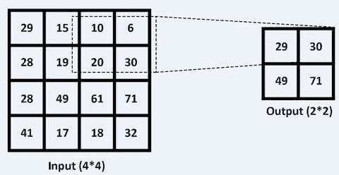

# 6.卷积神经网络

卷积神经网络(CNN)是一种深度前馈人工神经网络，其中神经网络通过学习内部特征表示并概括常见图像问题(如对象识别和其他计算机视觉问题)中的特征来保留分层结构。它不限于图像；它还在自然语言处理问题和语音识别方面取得了最先进的成果。

## CNN 中的不同层

一个 CNN 由多层组成，如图 [6-1](#Fig1) 所示。

图 6-1

Layers in a convolution neural network

卷积层由滤镜和图像贴图组成。假设灰度输入图像的大小为 5×5，这是一个 25 像素值的矩阵。图像数据表示为宽×高×通道的三维矩阵。

Note

图像映射是与特定图像相关的坐标列表。

卷积旨在从输入图像中提取特征，因此它通过使用输入数据的小方块学习图像特征来保持像素之间的空间关系。可以预期旋转不变性、平移不变性和比例不变性。例如，由于卷积步骤，CNN 可以容易地识别旋转的 cat 图像或重新缩放的 cat 图像。在原始图像(此处为 1 个像素)上滑动滤镜(方形矩阵)，在每个给定位置，计算元素级乘法(滤镜和原始图像的矩阵之间),并将乘法输出相加，以获得形成输出矩阵元素的最终整数。

子采样是简单的平均池，每个特征图具有可学习的权重，如图 [6-2](#Fig2) 所示。

图 6-2

Subsampling

如图 [6-2](#Fig2) 所示，滤波器有输入权值，产生一个输出神经元。假设您定义了一个卷积层，它有六个过滤器和接收域，宽 2 像素，高 2 像素，默认步长为 1，默认填充设置为 0。每个滤波器从图像的 2×2 像素部分接收输入。换句话说，就是一次 4 个像素。因此，您可以说它将需要 4 + 1(偏差)输入权重。

输入体积为 5×5×3(宽×高×通道数)，有 6 个 2×2 大小的滤波器，步长为 1，pad 为 0。因此，对于每个滤波器，该层中的参数数量为 2*2*3 + 1 = 13 个参数(对于偏差加上+ 1)。因为有六个过滤器，所以有 13*6 = 78 个参数。

图 6-3

Input volume

这里有一个总结:

*   输入体积的大小为 W1 × H1 × D1。
*   该模型需要超参数:滤波器的数量(f)、步距(S)、零填充量(P)。
*   这产生尺寸为 W2 × H2 × D2 的体积。
*   W2 = (W1-f+ 2P) /S + 1 = 4。
*   H2 = (H1-f+2P)/S +1 = 4。
*   D2 =过滤器数量= f = 6。

池层减少了先前层的激活映射。接下来是一个或多个卷积层，整合了前几层激活图中的所有特性。这减少了训练数据的过度拟合，并概括了网络所表示的特征。感受野大小几乎总是设置为 2×2，并使用 1 或 2(或更高)的步幅以确保没有重叠。您将对每个感受野使用最大操作，以便激活为最大输入值。在这里，每四个数字映射到一个数字。于是，这一步像素数下降到原来的四分之一(图 [6-4](#Fig4) )。

图 6-4

Maxpooling-reducing the number of pixels

全连接层是前馈人工神经网络层。这些层具有非线性激活函数来输出类别预测概率。在所有特征被卷积层识别和提取并且已经被网络中的汇集层合并之后，它们被用于最后。这里，隐藏层和输出层是完全连接的层。

## CNN 架构

CNN 是一种前馈深度神经网络架构，由几个卷积层组成，每个卷积层后面都有一个池层、激活函数和可选的批量标准化。它还包括完全连接的层。当图像在网络中移动时，它会变小，这主要是因为 max pooling。最后一层输出类别概率预测。

图 6-5

CNN Architecture for Classification

在过去的几年中，已经开发了许多架构，这些架构在图像分类领域取得了巨大的进步。屡获殊荣的预训练网络(VGG16、VGG19、ResNet50、Inception V3 和 Xception)已被用于各种图像分类挑战，包括医学成像。迁移学习是一种除了几层之外还使用预训练模型的实践。它可以用来解决图像分类在各个领域的挑战。