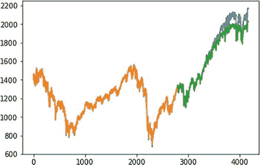

# 9.RNN 和 LSTM

本章将讨论递归神经网络(RNNs)的概念及其修改版本，长短期记忆(LSTM)。LSTM 主要用于序列预测。您将了解各种序列预测，然后学习如何借助 LSTM 模型进行时间序列预测。

## RNNs 的概念

递归神经网络是一种人工神经网络，最适合于识别数据序列中的模式，如文本、视频、语音、语言、基因组和时序数据。RNN 是一种非常强大的算法，可以对数据进行分类、聚类和预测，尤其是时间序列和文本。

RNN 可以看作是一个 MLP 网络，只是在体系结构上增加了环路。在图 [9-1](#Fig1) 中，可以看到有一个输入层(节点为 x1、x2 等)、一个隐藏层(节点为 h1、h2 等)、一个输出层(节点为 y1、y2 等)。这类似于 MLP 的建筑。不同之处在于隐藏层的节点是相互连接的。在普通(基本)RNN/LSTM 中，节点单向连接。这意味着 h2 依赖于 h1(和 x2)，h3 依赖于 h2(和 x3)。隐藏层中的节点由隐藏层中的前一个节点决定。


图 9-1

An RNN

这种架构确保 t=n 时的输出取决于 t=n、t=n-1、…、t=1 时的输入。换句话说，输出取决于数据的顺序而不是单个数据(图 [9-2](#Fig2) )。


图 9-2

The sequence

图 [9-3](#Fig3) 显示了隐藏层的节点如何连接到输入层的节点。


图 9-3

The connections

在 RNN 中，如果序列很长，则在训练(反向传播)期间计算梯度(这对调整权重和偏差很重要)。它们要么消失(许多小于 1 的小值相乘)，要么爆炸(许多大于 1 的大值相乘)，导致模型训练非常缓慢。

## LSTM 的概念

长短期记忆是一种改进的 RNN 体系结构，它解决了消失和爆炸梯度的问题，并解决了长序列训练和保持记忆的问题。所有的 rnn 在循环层都有反馈回路。反馈回路有助于将信息长时间保存在“记忆”中。但是，很难训练标准的 rnn 来解决需要学习长期时间依赖性的问题。由于损失函数的梯度随时间呈指数衰减(这种现象称为消失梯度问题)，因此很难训练典型的 rnn。这就是为什么 RNN 被修改为包括一个可以在存储器中长时间保存信息的存储单元。改良后的 RNN 更为人所知的名字是 LSTM。在 LSTM，一组门用于控制信息何时进入内存，这解决了消失或爆炸梯度问题。

循环连接给网络增加了状态或记忆，并允许它学习和利用输入序列中观察值的有序性质。内部存储器意味着网络的输出取决于输入序列中的最近上下文，而不是刚刚作为网络输入呈现的内容。

## LSTM 模式

LSTM 可以有以下模式之一:

*   一对一模型
*   一对多模型
*   多对一模型
*   多对多模型

除了这些模式之外，同步的多对多模型也正在被使用，尤其是对于视频分类。

图 [9-4](#Fig4) 显示了多对一的 LSTM。这意味着在这个模型中许多输入产生一个输出。


图 9-4

Many-to-one LSTM

## 序列预测

LSTM 最适合序列数据。LSTM 可以预测、分类和生成序列数据。序列意味着一个观察顺序，而不是一组观察。序列的一个例子是测试系列，其中时间戳和值按照序列的顺序(按时间顺序)排列。另一个例子是视频，它可以被认为是图像序列或音频剪辑序列。

基于数据序列的预测称为序列预测。序列预测据说有四种类型。

*   序列数值预测
*   序列分类
*   序列生成
*   序列间预测

### 序列数值预测

序列数值预测是预测给定序列的下一个值。它的用例是股票市场预测和天气预报。这里有一个例子:


*   输入顺序:3，5，8，12
*   产量:17

### 序列分类

序列分类预测给定序列的类别标签。其用例是欺诈检测(使用交易序列作为输入来分类/预测账户是否被黑客攻击)和基于表现的学生分类(按时间顺序排列的过去六个月的考试分数序列)。这里有一个例子:


*   输入顺序:2，4，6，8
*   产出:“增加”

### 序列生成

序列生成是指生成一个新的输出序列，它与输入语料库中的输入序列具有相同的属性。它的用例是文本生成(给定博客的 100 行，生成博客的下一行)和音乐生成(给定音乐示例，生成新的音乐作品)。这里有一个例子:


*   输入序列:[3，5，8，12]，[4，6，9，13]
*   输出:[5，7，10，14]

### 序列间预测

序列间预测是指预测给定序列的下一个序列。它的用例是文档摘要和多步时间序列预测(预测一个数字序列)。这里有一个例子:


*   输入顺序:[3，5，8，12，17]
*   输出:[23，30，38]

如前所述，LSTM 用于商业中的时间序列预测。

让我们来看一个 LSTM 模型。假设给出了一个 CSV 文件，其中第一列是时间戳，第二列是值。它可以表示传感器(IoT)数据。

给定时间序列数据，你必须预测未来的值。

## 用 LSTM 模型进行时间序列预测

以下是 LSTM 时间序列预测的完整示例:

```py
# Simple LSTM for a time series data
import numpy as np
import matplotlib.pyplot as plt
from pandas import read_csv
import math
from keras.models import Sequential
from keras.layers import Dense
from keras.layers import LSTM
from sklearn.preprocessing import StandardScaler
from sklearn.metrics import mean_squared_error
import pylab

# convert an array of values into a timeseries data
def create_timeseries(series, ts_lag=1):
    dataX = []
    dataY = []
    n_rows = len(series)-ts_lag
    for i in range(n_rows-1):
        a = series[i:(i+ts_lag), 0]
        dataX.append(a)
        dataY.append(series[i + ts_lag, 0])

    X, Y = np.array(dataX), np.array(dataY)
    return X, Y
# fix random seed for reproducibility
np.random.seed(230)
# load dataset
dataframe = read_csv('sp500.csv', usecols=[0])
plt.plot(dataframe)
plt.show()

```

图 [9-5](#Fig5) 显示了数据的曲线图。


图 9-5

Plot of the data

下面是更多的代码:

```py
# Changing datatype to float32 type
series = dataframe.values.astype('float32')

# Normalize the dataset
scaler = StandardScaler()
series = scaler.fit_transform(series)

# split the datasets into train and test sets
train_size = int(len(series) * 0.75)
test_size = len(series) - train_size
train, test = series[0:train_size,:], series[train_size:len(series),:]

# reshape the train and test dataset into X=t and Y=t+1
ts_lag = 1
trainX, trainY = create_timeseries(train, ts_lag)
testX, testY = create_timeseries(test, ts_lag)

# reshape input data to be [samples, time steps, features]
trainX = np.reshape(trainX, (trainX.shape[0], 1, trainX.shape[1]))
testX = np.reshape(testX, (testX.shape[0], 1, testX.shape[1]))

# Define the LSTM model
model = Sequential()
model.add(LSTM(10, input_shape=(1, ts_lag)))
model.add(Dense(1))
model.compile(loss='mean_squared_logarithmic_error', optimizer="adagrad")

# fit the model
model.fit(trainX, trainY, epochs=500, batch_size=30)
# make predictions
trainPredict = model.predict(trainX)
testPredict = model.predict(testX)

# rescale predicted values
trainPredict = scaler.inverse_transform(trainPredict)
trainY = scaler.inverse_transform([trainY])
testPredict = scaler.inverse_transform(testPredict)
testY = scaler.inverse_transform([testY])

# calculate root mean squared error
trainScore = math.sqrt(mean_squared_error(trainY[0], trainPredict[:,0]))
print('Train Score: %.2f RMSE' % (trainScore))
testScore = math.sqrt(mean_squared_error(testY[0], testPredict[:,0]))
print('Test Score: %.2f RMSE' % (testScore))

# plot baseline and predictions
pylab.plot(trainPredictPlot)
pylab.plot(testPredictPlot)
pylab.show()

```

在图 [9-6](#Fig6) 中，您可以看到实际时间序列与预测时间序列的关系图。橙色部分是训练数据，蓝色部分是测试数据，绿色部分是预测输出。



图 9-6

Plot of actual versus predicted time series

到目前为止，我们已经学习了 RNN、LSTM 和 LSTM 模型时间序列预测的概念。

LSTM 已被用于文本分类。我们使用 LSTM(香草 LSTM 或双向 LSTM)来构建文本分类器。首先，通过使用 word2vec 或 glove 等单词(语义)嵌入将文本语料库转换为数字。然后，通过 LSTM 进行序列分类。这种方法提供了比典型的单词包或 tf-idf 后跟 ML 分类器(如 SVM、随机森林)更高的准确性。在第十一章中，我们可以看到 LSTM 是如何被用作量词的。