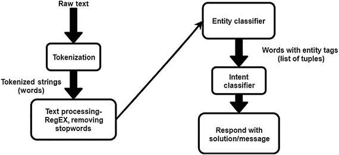
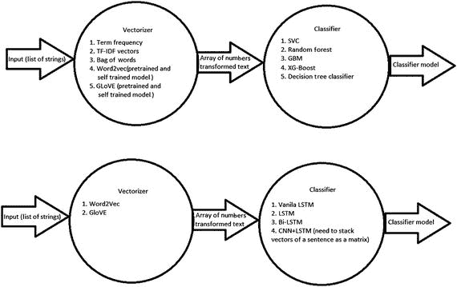

# 十一、开发聊天机器人

通过文本或语音作为人机交互界面的人工智能系统被称为聊天机器人。

与聊天机器人的交互可能简单，也可能复杂。直接互动的一个例子是询问最新的新闻报道。比如说，在对你的 Android 手机进行故障诊断时，交互会变得更加复杂。聊天机器人这个词在过去的一年里非常流行，已经成为用户互动和参与的最受欢迎的平台。机器人是聊天机器人的高级形式，有助于自动执行“用户执行的”任务。

关于聊天机器人的这一章将作为一个全面的指南，介绍聊天机器人的内容、方式、地点、时间和原因！

具体来说，我将介绍以下内容:

*   为什么你会想使用聊天机器人
*   聊天机器人的设计和功能
*   构建聊天机器人的步骤
*   使用 API 开发聊天机器人
*   聊天机器人的最佳实践

## 为什么是聊天机器人？

对于聊天机器人来说，理解用户在寻找什么信息，也就是所谓的意图，是非常重要的。假设一个用户想知道最近的素食餐馆；用户可以用许多可能的方式来问这个问题。聊天机器人(特别是聊天机器人内部的意图分类器)必须能够理解用户的意图，因为用户想要得到正确的答案。事实上，为了给出正确的答案，聊天机器人必须能够理解上下文、意图、实体和情感。聊天机器人甚至必须考虑会话中讨论的任何内容。例如，用户可能会问这样的问题“那里的鸡肉价格是多少？”尽管用户已经询问了价格，但是聊天引擎可能会误解并认为用户正在寻找一家餐馆。因此，作为响应，聊天机器人可以提供餐馆的名称。

## 聊天机器人的设计和功能

聊天机器人通过应用人工智能来刺激与人类的智能对话。

对话发生的界面通过口头或书面文本来实现。Facebook Messenger、Slack 和 Telegram 利用聊天机器人消息平台。它们有很多用途，包括网上订购产品、投资理财等等。聊天机器人的一个重要方面是它们使上下文对话成为可能。聊天机器人与用户交谈的方式类似于人类在日常生活中的交谈方式。尽管聊天机器人有可能根据上下文进行对话，但在根据上下文与任何事物进行交流方面，它们还有很长的路要走。但是聊天界面正在利用语言将机器与人连接起来，通过以上下文的方式提供信息，帮助人们以方便的方式完成事情。

此外，聊天机器人正在重新定义企业的经营方式。从接触消费者，到欢迎他们加入商业生态系统，再到向消费者提供各种产品及其功能的信息，聊天机器人都在提供帮助。它们正在成为及时和令人满意地与消费者打交道的最方便的方式。

## 构建聊天机器人的步骤

聊天机器人是为了与用户交流而构建的，让用户感觉他们是在与人交流，而不是与机器人交流。但是当用户输入时，通常他们不会以正确的方式输入。换句话说，他们可能会输入不必要的标点符号，或者可能会有不同的方式来问同一个问题。

例如，对于“我附近的餐馆？”用户可以输入“我旁边的餐馆？”或者“找一家附近的餐馆。”

因此，您需要对数据进行预处理，以便聊天机器人引擎能够轻松理解它。图 11-1 显示了该过程，这将在以下章节中详细描述。



图 11-1

A flowchart to show how a chatbot engine processes an input string and gives a valid reply.

### 预处理文本和消息

文本和消息的预处理包括几个步骤，下面将介绍。

#### 标记化

将句子分割成单个单词(称为标记)称为标记化。在 Python 中，通常字符串被标记化并存储在列表中。

*   例如，“人工智能就是应用数学”这句话变成了下面这句话:
*   【“人工”、“智能”、“是”、“所有”、“关于”、“应用”、“数学”】
*   以下是示例代码:

```py
from nltk.tokenize import TreebankWordTokenizer
l = "Artificial intelligence is all about applying mathematics"
token = TreebankWordTokenizer().tokenize(l)
print(token)

```

#### 删除标点符号

也可以去掉句子中不必要的标点符号。

*   例如，句子“我能得到送货上门的餐馆名单吗？”变成如下:
*   "我能得到送货上门的餐馆名单吗？"
*   以下是示例代码:

```py
from nltk.tokenize import TreebankWordTokenizer
from nltk.corpus import stopwords
l = "Artificial intelligence is all about applying mathematics!"
token = TreebankWordTokenizer().tokenize(l)
output = []
output = [k for k in token if k.isalpha()]
print(output)

```

#### 删除停用词

停用词是存在于一个句子中的词，如果去掉，不会有太大的区别。尽管句子的格式改变了，但这对自然语言理解很有帮助(NLU)。

*   比如那句“人工智能可以改变人民的生活方式。”删除停用词后，变为以下内容:
*   “人工智能改变人们的生活方式。”

以下是示例代码:

```py
from nltk.tokenize import TreebankWordTokenizer
from nltk.corpus import stopwords
l = "Artificial intelligence is all about applying mathematics"
token = TreebankWordTokenizer().tokenize(l)
stop_words = set(stopwords.words('english'))
output= []
for k in token:
    if k not in stop_words:
        output.append(k)
print(output)

```

哪些词被认为是停用词可以有所不同。自然语言工具包(NLTK)、Google 等提供了一些预定义的停用词集。

#### 命名实体识别

命名实体识别(NER)，也称为实体识别，是将文本中的实体分类到预定义的类别(如国家名称、人名等)中的任务。您也可以定义自己的类。

*   例如，将 NER 应用于句子“今天的印度对澳大利亚板球比赛棒极了。”为您提供以下输出:
*   [今天的]时间[印度]国家对[澳大利亚]国家[板球]比赛太精彩了。

要运行 NER 的代码，您需要下载并导入必要的包，如下面的代码所示。

##### 使用斯坦福 NER

要运行代码，下载`english.all.3class.distsim.crf.ser.gz`和`stanford-ner.jar`文件。

```py
from nltk.tag import StanfordNERTagger
from nltk.tokenize import word_tokenize

StanfordNERTagger("stanford-ner/classifiers/english.all.3class.distsim.crf.ser.gz",
"stanford-ner/stanford-ner.jar")

text = "Ron was the founder of Ron Institute at New york"
text = word_tokenize(text)
ner_tags = ner_tagger.tag(text)

print(ner_tags)

```

##### 使用米蒂 NER(预训练)

下载 MITIE 的`ner_model.dat`文件运行代码。

```py
from mitie.mitie import *
from nltk.tokenize import word_tokenize

print("loading NER model...")
ner = named_entity_extractor("mitie/MITIE-models/english/ner_model.dat".encode("utf8"))

text = "Ron was the founder of Ron Institute at New york".encode("utf-8")
text = word_tokenize(text)

ner_tags = ner.extract_entities(text)
print("\nEntities found:", ner_tags)

for e in ner_tags:
       range = e[0]
       tag = e[1]
       entity_text = " ".join(text[i].decode() for i in range)

       print( str(tag) + " : " + entity_text)

```

##### 使用米铁 NER(自学)

下载米铁( [`https://github.com/mit-nlp/MITIE`](https://github.com/mit-nlp/MITIE) )的`total_word_feature_extractor.dat`文件运行代码。

```py
from mitie.mitie import *

sample = ner_training_instance([b"Ron", b"was", b"the", b"founder", b"of", b"Ron", b"Institute", b"at", b"New", b"York", b"."])

sample.add_entity(range(0, 1), "person".encode("utf-8"))
sample.add_entity(range(5, 7), "organization".encode("utf-8"))
sample.add_entity(range(8, 10), "Location".encode("utf-8"))

trainer = ner_trainer("mitie/MITIE-models/english/total_word_feature_extractor.dat".encode("utf-8"))

trainer.add(sample)

ner = trainer.train()

tokens = [b"John", b"was", b"the", b"founder", b"of", b"John", b"University", b"."]
entities = ner.extract_entities(tokens)
print ("\nEntities found:", entities)
for e in entities:
      range = e[0]
      tag = e[1]
      entity_text = " ".join(str(tokens[i]) for i in range)

      print ("    " + str(tag) + ": " + entity_text)

```

#### 意图分类

意图分类是 NLU 的一个步骤，在这里你试图理解用户想要什么。以下是聊天机器人查找附近地点的两个输入示例:

*   "我需要买些杂货。":目的是寻找附近的杂货店。
*   “我想吃素食。”:目的是寻找附近的餐馆，最好是素食餐馆。

基本上，你需要理解用户在寻找什么，并相应地将请求归类到特定的意图类别中(图 11-2 )。



图 11-2

General flow of intent classification, from sentences to vectors to a model

要做到这一点，你需要训练一个模型来使用算法将请求分类成意图，从句子到向量再到模型。

##### 单词嵌入

单词嵌入是将文本转换成数字的技术。在文本中很难应用任何算法。因此，你必须把它转换成数字。

以下是不同类型的单词嵌入技术。

###### 计数向量

假设您有三个文档(D1、D2 和 D3 ),文档组中有 N 个唯一的单词。您创建了一个(D×N)矩阵，称为 C，这就是众所周知的计数向量。矩阵的每个条目都是该文档中唯一单词的频率。

*   让我们看一个例子。
*   D1: Pooja 非常懒。
*   D2:但是她很聪明。
*   她几乎不来上课。

这里，D=3，N=12。

独特的词很难，懒惰，但，Pooja，她，聪明，来，非常，类，是。

因此，计数向量 C 将如下:

<colgroup><col align="left"> <col align="left"> <col align="left"> <col align="left"> <col align="left"> <col align="left"> <col align="left"> <col align="left"> <col align="left"> <col align="left"> <col align="left"> <col align="left"></colgroup> 
|   | 几乎不 | 懒惰的 | 但是 | 到 | 礼拜 | 她 | 聪明的 | 来 | 很 | 班级 | 存在 |
| :-- | :-- | :-- | :-- | :-- | :-- | :-- | :-- | :-- | :-- | :-- | :-- |
| D1 | Zero | one | Zero | Zero | one | Zero | Zero | Zero | one | Zero | one |
| D2 | Zero | Zero | one | Zero | Zero | one | one | Zero | Zero | Zero | one |
| D3 | one | Zero | Zero | one | Zero | one | Zero | one | Zero | one | Zero |

###### 术语频率-逆文档频率(TF-IDF)

对于这种技术，根据单词在句子中出现的次数以及文档，为句子中的每个单词指定一个数字。在句子中出现多次而在文档中不出现多次的单词将具有高值。

例如，考虑一组句子:

*   “我是男生。”
*   “我是女生。”
*   “你住在哪里？”

TF-IDF 转换前面句子的特征集，如下所示:

<colgroup><col align="left"> <col align="left"> <col align="left"> <col align="left"> <col align="left"> <col align="left"> <col align="left"> <col align="left"></colgroup> 
|   | 是 | 男孩 | 女孩 | 在哪里 | 做 | 你们 | 活着 |
| :-- | :-- | :-- | :-- | :-- | :-- | :-- | :-- |
| 1. | Zero point six | Zero point eight | Zero | Zero | Zero | Zero | Zero |
| 2. | Zero point six | Zero | Zero point eight | Zero | Zero | Zero | Zero |
| 3. | Zero | Zero | Zero | Zero point five | Zero point five | Zero point five | Zero point five |

您可以导入 TFIDF 包并使用它来创建此表。

现在让我们看一些样本代码。您可以在请求字符串的 TF-IDF 转换特征上使用支持向量分类器。

```py
#import required packages
import pandas as pd
from random import sample
from sklearn.preprocessing import LabelEncoder
from sklearn.feature_extraction.text import TfidfVectorizer
from sklearn.svm import SVC
from sklearn.model_selection import train_test_split
from sklearn.metrics import f1_score, accuracy_score
# read csv file
data = pd.read_csv("intent1.csv")
print(data.sample(6))

```

在继续编写代码之前，这里有一个数据集示例:

<colgroup><col align="left"> <col align="left"></colgroup> 
| 描述(消息) | 意图 _ 标签(目标) |
| :-- | :-- |
| 我附近有一家不错的非蔬菜餐馆 | Zero |
| 我正在找医院 | one |
| 心脏手术的好医院 | one |
| 国际儿童学校 | Two |
| 我周围的非素食餐馆 | Zero |
| 小孩子的学校 | Two |

在本例中，这些是要使用的值:

*   0 表示寻找餐厅。
*   1 表示找医院。
*   2 表示找学校。

现在让我们处理数据集。

```py
# split dataset into train and test.
X_train, X_test, Y_train, Y_test = train_test_split(data["Description"], data["intent_label"], test_size=3)
print(X_train.shape, X_test.shape, Y_train.shape, Y_test.shape)

# vectorize the input using tfidf values.
tfidf = TfidfVectorizer()
tfidf = tfidf.fit(X_train)
X_train = tfidf.transform(X_train)
X_test = tfidf.transform(X_test)

# label encoding for different categories of intents
le = LabelEncoder().fit(Y_train)
Y_train = le.transform(Y_train)
Y_test = le.transform(Y_test)

# other models like GBM, Random Forest may also be used

model = SVC()
model = model.fit(X_train, Y_train)
p = model.predict(X_test)
# calculate the f1_score. average="micro" since we want to calculate score for multiclass.
# Each instance(rather than class(search for macro average)) contribute equally towards the scoring.
print("f1_score:", f1_score( Y_test, p, average="micro"))
print("accuracy_score:",accuracy_score(Y_test, p))

```

##### Word2Vec

有不同的方法来获得一个句子的单词向量，但是所有技术背后的主要理论是给相似的单词一个相似的向量表示。所以，像男人，男孩和女孩这样的词会有相似的向量。可以设置每个向量的长度。Word2vec 技术的例子包括 GloVe 和 CBOW(有或没有 skip grams 的 n-gram)。

您可以通过为自己的数据集训练 Word2vec 来使用它(如果您有足够的数据来解决问题)，或者您可以使用预训练的数据。Word2vec 在网上有售。经过预训练的模型已经在维基百科数据、推文等大型文档上接受了训练，它们几乎总是对问题有好处。

可以用来训练意图分类器的一些技术的一个例子是，对句子中的单词的单词向量使用 1D-CNN，附加在每个句子的列表中。

```py
# import required packages
from gensim.models import Word2Vec
import pandas as pd
import numpy as np
from keras.preprocessing.text import Tokenizer
from keras.preprocessing.sequence import pad_sequences
from keras.utils.np_utils import to_categorical
from keras.layers import Dense, Input, Flatten
from keras.layers import Conv1D, MaxPooling1D, Embedding, Dropout
from keras.models import Model

from sklearn.preprocessing import LabelEncoder
from sklearn.model_selection import train_test_split
from sklearn.metrics import f1_score, accuracy_score
# read data
data = pd.read_csv("intent1.csv")

# split data into test and train
X_train, X_test, Y_train, Y_test = train_test_split(data["Description"], data["intent_label"], test_size=6)

# label encoding for different categories of intents
le = LabelEncoder().fit(Y_train)
Y_train = le.transform(Y_train)
Y_test = le.transform(Y_test)

# get word_vectors for words in training set
X_train = [sent for sent in X_train]
X_test = [sent for sent in X_test]
# by default genism.Word2Vec uses CBOW, to train word vecs. We can also use skipgram with it
# by setting the "sg" attribute to number of skips we want.
# CBOW and Skip gram for the sentence "Hi Ron how was your day?" becomes:
# Continuos bag of words: 3-grams {"Hi Ron how", "Ron how was", "how was your" ...}
# Skip-gram 1-skip 3-grams: {"Hi Ron how", "Hi Ron was", "Hi how was", "Ron how
# your", ...}

# See how: "Hi Ron was" skips over "how".
# Skip-gram 2-skip 3-grams: {"Hi Ron how", "Hi Ron was", "Hi Ron your", "Hi was
# your", ...}
# See how: "Hi Ron your" skips over "how was".
# Those are the general meaning of CBOW and skip gram.              
word_vecs = Word2Vec(X_train)
print("Word vectors trained")

# prune each sentence to maximum of 20 words.
max_sent_len = 20

# tokenize input strings
tokenizer = Tokenizer()
tokenizer.fit_on_texts(X_train)
sequences = tokenizer.texts_to_sequences(X_train)
sequences_test = tokenizer.texts_to_sequences(X_test)
word_index = tokenizer.word_index
vocab_size = len(word_index)

# sentences with less than 20 words, will be padded with zeroes to make it of length 20
# sentences with more than 20 words, will be pruned to 20.
x = pad_sequences(sequences, maxlen=max_sent_len)
X_test = pad_sequences(sequences_test, maxlen=max_sent_len)

# 100 is the size of wordvec.
embedding_matrix = np.zeros((vocab_size + 1, 100))

# make matrix of each word with its word_vectors for the CNN model.
# so each row of a matrix will represent one word. There will be a row for each word in
# the training set

for word, i in word_index.items():
        try:
            embedding_vector = word_vecs[word]
        except:
            embedding_vector = None
            if embedding_vector is not None:
                embedding_matrix[i] = embedding_vector
print("Embeddings done")
vocab_size = len(embedding_matrix)

# CNN model requires multiclass labels to be converted into one hot ecoding.
# i.e. each column represents a label, and will be marked one for corresponding label.
y = to_categorical(np.asarray(Y_train))

embedding_layer = Embedding(vocab_size,
                                100,
                                weights=[embedding_matrix],
                                input_length=max_sent_len,
                                trainable=True)
sequence_input = Input(shape=(max_sent_len,), dtype="int32")

# stack each word of a sentence in a matrix. So each matrix represents a sentence.
# Each row in a matrix is a word(Word Vector) of a sentence.
embedded_sequences = embedding_layer(sequence_input)

# build the Convolutional model.
l_cov1 = Conv1D(128, 4, activation="relu")(embedded_sequences)
l_pool1 = MaxPooling1D(4)(l_cov1)
l_flat = Flatten()(l_pool1)
hidden = Dense(100, activation="relu")(l_flat)
preds = Dense(len(y[0]), activation="softmax")(hidden)
model = Model(sequence_input, preds)
model.compile(loss='binary_crossentropy',optimizer='Adam')

print("model fitting - simplified convolutional neural network")
model.summary()

# train the model
model.fit(x, y, epochs=10, batch_size=128)

#get scores and predictions.
p = model.predict(X_test)
p = [np.argmax(i) for i in p]
score_cnn = f1_score(Y_test, p, average="micro")
print("accuracy_score:",accuracy_score(Y_test, p))
print("f1_score:", score_cnn)

```

模型拟合是一个简化的卷积神经网络，如下所示:

<colgroup><col align="left"> <col align="left"> <col align="left"></colgroup> 
| 层(类型) | 输出形状 | 参数# |
| :-- | :-- | :-- |
| 输入 _20(输入层) | (无，20) | Zero |
| 嵌入 _20(嵌入) | (无，20，100) | Two thousand eight hundred |
| conv1d_19 (Conv1D) | (无，17，128) | Fifty-one thousand three hundred and twenty-eight |
| max_pooling1d_19(最大池) | (无，4，128) | Zero |
| 扁平化 _19(扁平化) | (无，512) | Zero |
| 密集 _35(密集) | (无，100) | Fifty-one thousand three hundred |
| 密集 _36(密集) | (无，3) | Three hundred and three |

以下是参数的数量:

*   总参数:105731
*   可训练参数:105，731
*   不可训练的参数:0

下面是使用 Gensim 包的 Word2vec 的一些重要功能:

*   这就是你如何导入 Gensim 并加载预训练模型:

    ```py
    import genism
    #loading the pre-trained model
    model = gensim.models.KeyedVectors.load_word2vec_format('GoogleNews-vectors-negative300.bin', binary=True)

    ```

    这是谷歌为英语语言提供的预训练模型，它有 300 个维度。
*   这是如何从一个预先训练好的模型中找到一个单词的单词向量:

    ```py
    # getting word vectors of a word
    lion = model['lion']
    print(len(lion))

    ```

*   这是如何找到两个词之间的相似指数:

    ```py
    #Calculating similarity index
    print(model.similarity('King', 'Queen'))

    ```

*   这就是如何从一组单词中找出一个奇怪的单词:

    ```py
    #Choose odd one out
    print(model.doesnt_match("Mango Grape Tiger Banana Strawberry".split()))

    ```

*   这是如何找到最相似的单词:

    ```py
    print(model.most_similar(positive=[Prince, Girl], negative=[Boy]))

    ```

    word 2 vec 的一个独特的特点是，你可以得到向量，从其他向量使用向量运算。例如，“王子”的向量减去“男孩”的向量加上“女孩”的向量将几乎等于“公主”的向量。因此，当你计算这个的时候，你会得到一个“公主”的向量

    ```py
    Vec ("Prince") – Vec("boy") + Vec("girl") ≈ Vec("Princess")

    ```

    这只是一个例子。这种情况在许多其他情况下都是有效的。这是 Word2vec 的一个特点，在估计相似词、下一个词、自然语言生成(NLG)等方面非常有用。

表 11-1 显示了其他参数的预训练模型。

表 11-1

Different Pretrained Models with Other Parameters

<colgroup><col align="left"> <col align="left"> <col align="left"> <col align="left"> <col align="left"> <col align="left"> <col align="left"></colgroup> 
| 模型文件 | 维度数量 | 语料库规模 | 词汇量 | 体系结构 | 上下文窗口大小 | 作者 |
| :-- | :-- | :-- | :-- | :-- | :-- | :-- |
| 谷歌新闻 | Three hundred | 100B | 3M | Word2Vec | 弓，~5 | 谷歌 |
| 免费基本 id | One thousand | 100B | 1.4 米 | Word2Vec，Skip-gram | 弓，~10 | 谷歌 |
| 免费基础名称 | One thousand | 100B | 1.4 米 | Word2Vec，Skip-gram | 弓，~10 | 谷歌 |
| 维基百科+ Gigaword 5 | Fifty | 6B | Four hundred thousand | 手套 | 10+10 | 手套 |
| 维基百科+ Gigaword 5 | One hundred | 6B | Four hundred thousand | 手套 | 10+10 | 手套 |
| 维基百科+ Gigaword 5 | Two hundred | 6B | Four hundred thousand | 手套 | 10+10 | 手套 |
| 维基百科+ Gigaword 5 | Three hundred | 6B | Four hundred thousand | 手套 | 10+10 | 手套 |
| 普通爬行器 42B | Three hundred | 42B | 1.9 米 | 手套 | 阿达格拉德 | 手套 |
| 公共爬行器 840B | Three hundred | 840B | 2.2 米 | 手套 | 阿达格拉德 | 手套 |
| 维基百科依赖性 | Three hundred | - | One hundred and seventy-four thousand | Word2Vec | 句法依赖 | 利维-戈德堡公司 |
| DBPedia 载体(wiki2vec) | One thousand | - | - | Word2Vec | 弓，10 | 白痴 |

#### 构建响应

回复是聊天机器人的另一个重要部分。根据聊天机器人的回答，用户可能会被它吸引。无论何时制造聊天机器人，都应该记住一件事，那就是它的用户。你需要知道谁将使用它，以及它将用于什么目的。例如，一个餐馆网站的聊天机器人将只被询问餐馆和食物。所以，你或多或少知道会被问到什么问题。因此，对于每个意图，您存储多个答案，这些答案可以在识别意图后使用，这样用户就不会重复得到相同的答案。对于任何断章取义的问题，你也可以有一个意图；该意图可以有多个答案，并且随机选择，聊天机器人可以回复。

例如，如果意图是“你好”，你可以有多个回复，如“你好！你好吗？”和“你好！你过得怎么样？”和“嗨！有什么可以帮你的吗？”

聊天机器人可以随机选择任何一个来回答。

在下面的示例代码中，您从用户那里获取输入，但是在最初的聊天机器人中，意图是由聊天机器人根据用户提出的任何问题来定义的。

```py
import random
intent = input()
output = ["Hello! How are you","Hello! How are you doing","Hii! How can I help you","Hey! There","Hiiii","Hello! How can I assist you?","Hey! What's up?"]
if(intent == "Hii"):
 print(random.choice(output))

```

### 使用 API 开发聊天机器人

创建聊天机器人不是一件容易的事情。你需要一双关注细节的眼睛和敏锐的思维来构建一个可以很好使用的聊天机器人。构建聊天机器人有两种方法。

*   基于规则的方法
*   一种机器学习方法，通过简化数据使系统自行学习

一些聊天机器人本质上是基础的，而另一些则是更高级的人工智能大脑。能够理解自然语言并做出反应的聊天机器人使用人工智能大脑，技术爱好者正在利用 Api.ai 等各种资源来创建这种人工智能丰富的聊天机器人。

程序员正在利用以下服务来构建机器人:

*   微软机器人框架
*   Wit.ai
*   Api.ai
*   IBM 的沃森

其他编程技能有限或没有编程技能的 bot 构建爱好者正在利用如下 bot 开发平台来构建聊天机器人:

*   聊天燃料
*   Texit.in
*   辛烷 AI
*   Motion.ai

有不同的 API 来分析文本。三大巨头如下:

*   微软 Azure 的认知服务
*   亚马逊 Lex
*   沃森机器人

#### 微软 Azure 的认知服务

先说微软 Azure。

*   语言理解智能服务(LUIS):这提供了简单的工具，使您能够构建自己的语言模型(意图/实体)，允许任何应用程序/机器人理解您的命令并相应地采取行动。
*   文本分析 API:它评估情感和主题，以了解用户想要什么。
*   Translator Text API:自动识别语言，然后实时将其翻译成另一种语言。
*   Web 语言模型 API:这将自动在缺少空格的字符串中插入空格。
*   Bing 拼写检查 API:这使用户能够纠正拼写错误；认识名字、品牌名称和俚语之间的区别；并且在他们打字的时候理解同音字。
*   语言分析 API:这允许您使用词性标记来识别文本中的概念和动作，并使用自然语言解析器来查找短语和概念。这对于挖掘客户反馈非常有用。

#### 亚马逊 Lex

Amazon Lex 是一项为任何使用语音和文本的应用程序构建对话界面的服务。不幸的是，没有同义词选项，也没有适当的实体提取和意图分类。

以下是使用 Amazon Lex 的一些重要好处:

*   很简单。它指导你创建聊天机器人。
*   它有深度学习算法。聊天机器人实现了 NLU 和自然语言处理等算法。Amazon 已经将这一功能集中起来，以便于使用。
*   它具有易于部署和扩展的特性。
*   它内置了与 AWS 平台的集成。
*   这是有成本效益的。

#### 沃森机器人

IBM 提供了 IBM Watson API 来快速构建您自己的聊天机器人。在实现中，接近旅程和旅程本身一样重要。通过沃森对话式人工智能学习对话式设计的企业基础知识及其对您业务的影响，对于制定成功的行动计划至关重要。这种准备工作将使您能够交流、学习和对照标准进行监控，从而使您的企业能够构建一个客户就绪的成功项目。

对话式设计是构建聊天机器人最重要的部分。首先要明白的是，用户是谁，想达到什么目的。

IBM Watson 有很多技术，你可以很容易地集成到你的聊天机器人中；其中一些是沃森对话，沃森声调分析器，语音到文本，等等。

## 聊天机器人开发的最佳实践

在构建聊天机器人时，了解可以利用某些最佳实践是很重要的。这将有助于创建一个成功的用户友好的机器人，它可以实现与用户进行无缝对话的目的。

在这种关系中，最重要的事情之一是充分了解目标受众。接下来是其他的事情，比如识别用例场景，设定聊天的基调，以及识别消息传递平台。

通过遵循以下最佳实践，确保与用户无缝对话的愿望可以成为现实。

### 了解潜在用户

彻底了解目标受众是构建成功 bot 的第一步。下一步是了解创建机器人的目的。

以下是需要记住的几点:

*   知道具体 bot 的目的是什么。它可以是一个娱乐观众、方便用户交易、提供新闻或作为客户服务渠道的机器人。
*   通过了解客户的产品，使机器人对客户更加友好。

### 阅读用户情感，让机器人在情感上更加丰富

聊天机器人应该像人类一样热情友好，这样才能让对话成为一次美好的经历。它必须聪明地阅读并理解用户的情绪，以推广能够提示用户继续对话的内容块。如果第一次的体验是丰富的，用户将被鼓励再次访问。

以下是需要记住的几点:

*   推广你的产品或利用积极情绪将用户转化为品牌大使。
*   迅速处理负面评论，以便在对话游戏中保持活力。
*   只要有可能，使用友好的语言，让用户感觉他们在和一个熟悉的人交流。
*   通过重复输入让用户感到舒服，并确保他们能够理解所讨论的一切。