# 十二、人脸检测和识别

人脸检测是在图像或视频中检测人脸的过程。

人脸识别是检测图像中的人脸，然后使用算法来识别人脸属于谁的过程。因此，人脸识别是一种身份识别形式。

你首先需要从图像中提取特征，用于训练机器学习分类器识别图像中的人脸。这些系统不仅是非主观的，而且是自动的——不需要手动标记面部特征。您只需从面部提取特征，训练您的分类器，然后使用它来识别后续的面部。

因为对于人脸识别，首先需要从图像中检测人脸，所以可以将人脸识别视为两个阶段。

*   阶段 1:使用诸如 Haar cascades、HOG +线性 SVM、深度学习或任何其他可以定位人脸的算法来检测图像或视频流中的人脸的存在。
*   第二阶段:取定位阶段检测到的每一张脸，了解这张脸属于谁——这是你实际上给一张脸命名的地方。

## 人脸检测、人脸识别和人脸分析

人脸检测、人脸识别和人脸分析是有区别的。

*   人脸检测:这是一种在图像中找到所有人脸的技术。
*   人脸识别:这是人脸检测之后的下一步。在人脸识别中，您可以使用现有的图像库来识别哪张脸属于哪个人。
*   面部分析:检查一张脸，从中推断出年龄、肤色等等。

## 开放计算机视觉

OpenCV 提供了三种人脸识别方法(见图 [12-1](#Fig1) ):

*   特征脸
*   局部二元模式直方图
*   鱼脸

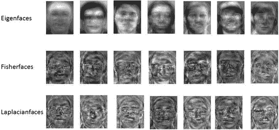

图 12-1

Applying OpenCV methods to faces

这三种方法都是通过将人脸与一些已知人脸的训练集进行比较来识别人脸的。为了训练，你给算法提供人脸，并用他们所属的人给他们贴上标签。当你使用该算法来识别某个未知人脸时，它使用在训练集上训练的模型来进行识别。上述三种方法中的每一种使用的训练集都略有不同。

拉普拉斯人脸可以是识别人脸的另一种方式。

### 特征脸

eigenfaces 算法使用主成分分析来构建人脸图像的低维表示，您将使用它作为相应人脸图像的特征(图 [12-2](#Fig2) )。

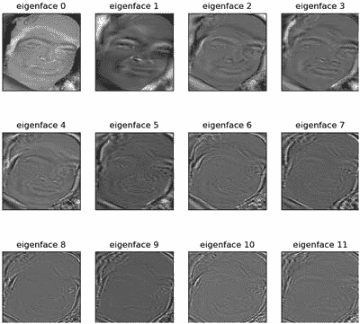

图 12-2

Applying Eigenvalue decomposition and extracting 11 eigenfaces with the largest magnitude

为此，您可以收集一个人脸数据集，其中包含您想要识别的每个人的多张人脸图像，这就像您想要在图像分类中标记的一个图像类有多个训练样本一样。有了这个面部图像的数据集，假定它们具有相同的宽度和高度，并且理想情况下它们的眼睛和面部结构在相同的(x，y)坐标上对齐，您可以应用数据集的特征值分解，保留具有最大相应特征值的特征向量。

给定这些特征向量，人脸就可以表示为 Kirby 和 Sirovich 所说的特征脸的线性组合。特征脸算法查看整个数据集。

### LBPH 值

您可以在 [LBPH](http://en.wikipedia.org/wiki/Local_binary_patterns) 中独立分析每张图像。LBPH 方法稍微简单一些，因为您可以在本地描述数据集中每个图像的特征；当提供新的未知图像时，您对其执行相同的分析，并将结果与数据集中的每个图像进行比较。分析图像的方法是描述图像中每个位置的局部模式。

本征脸算法依靠 PCA 来构建人脸图像的低维表示，而局部二进制模式(LBP)方法，顾名思义，依靠特征提取。

Ahonen 等人在 2006 年的论文“使用局部二进制模式进行人脸识别”中首次介绍了这种方法，该方法建议将人脸图像划分为 7×7 大小相等的网格(图 [12-3](#Fig3) )。

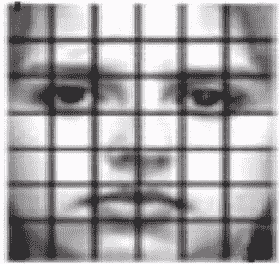

图 12-3

Applying LBPH for face recognition starts by dividing the face image into a 7x7 grid of equally sized cells

然后，从 49 个单元中的每一个提取局部二进制模式直方图。通过将图像划分为单元，您将局部性引入到最终的特征向量中。此外，中心的单元具有更大的权重，因此它们对整体表示的贡献更大。与网格中心的细胞(包含眼睛、鼻子和嘴唇结构)相比，角落的细胞携带的识别面部信息较少。最后，您连接来自 49 个单元的加权 LBP 直方图，以形成您的最终特征向量。

### 鱼脸

主成分分析(PCA)是本征脸方法的核心，它寻找使数据的总方差最大化的特征的线性组合。虽然这显然是表示数据的一种强有力的方法，但它没有考虑任何类，因此在丢弃组件时可能会丢失许多有区别的信息。想象一种情况，你的数据中的差异是由外部来源产生的，让它成为光。由 PCA 识别的成分不一定包含任何区别信息，因此投影的样本被涂抹在一起，分类变得不可能。

线性判别分析执行特定类别的维度缩减，由伟大的统计学家 R. A. Fisher 爵士发明。分类问题中多重测量的使用。为了找到在类之间分离得最好的特征组合，线性判别分析最大化类间与类内分散的比率，而不是最大化整体分散。这个想法很简单:相同的类应该紧密地聚集在一起，而不同的类在低维表示中彼此尽可能地远离。

## 检测人脸

执行人脸识别所需的第一个功能是检测当前图像中人脸出现的位置。在 Python 中，您可以使用 OpenCV 库的 Haar 级联过滤器来有效地做到这一点。

对于这里展示的实现，我将 Anaconda 与 Python 3.5、OpenCV 3.1.0 和 dlib 19.1.0 一起使用。要使用以下代码，请确保您拥有这些(或更新的)版本。

要进行面部检测，必须进行一些初始化，如下所示:

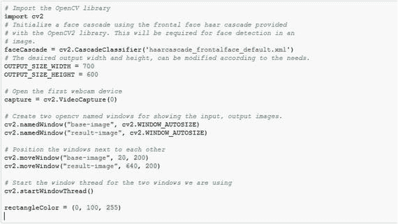

剩下的代码将是一个无限循环，不断从网络摄像头获取最新的图像，检测检索到的图像中的所有人脸，在检测到的最大人脸周围绘制一个矩形，然后最终在一个窗口中显示输入、输出图像(图 [12-4](#Fig4) )。

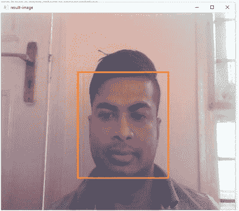

图 12-4

A sample output showing detected face

您可以在无限循环中使用以下代码来实现这一点:

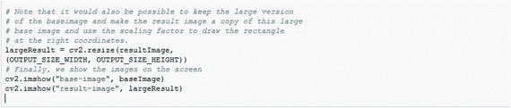

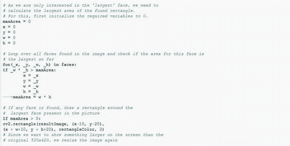

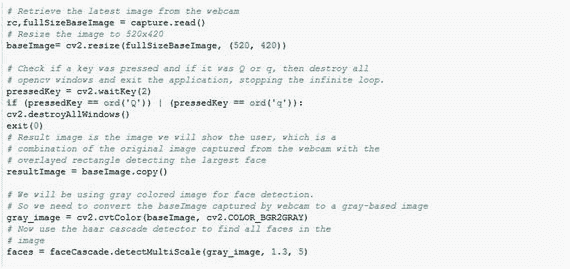

## 跟踪面部

以前的人脸检测代码有一些缺点。

*   该代码可能计算量很大。
*   如果被检测的人稍微转头，哈尔级联可能检测不到面部。
*   很难在帧间跟踪一张脸。

更好的方法是检测一次人脸，然后利用优秀的 dlib 库中的相关跟踪器来逐帧跟踪人脸。

为此，您需要导入另一个库并初始化其他变量。

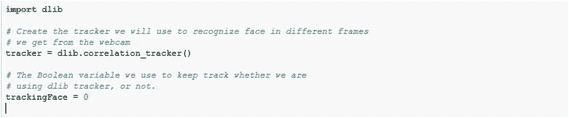

在无限`for`循环中，您现在将确定 dlib 关联跟踪器当前是否正在跟踪图像中的一个区域。如果不是这种情况，您将使用与前面类似的代码来查找最大的面，但不是绘制矩形，而是使用找到的坐标来初始化相关性跟踪器。

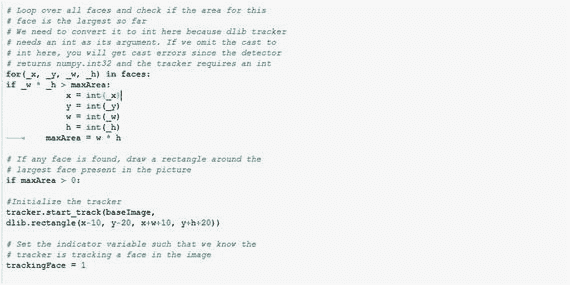

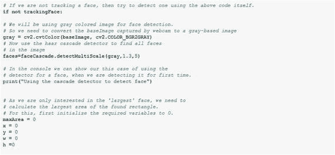

现在，无限循环中的最后一点是再次检查相关性跟踪器是否正在主动跟踪人脸(即，它是否刚刚检测到具有先前代码的人脸，`trankingFace=1?`)。如果追踪器正在积极追踪图像中的人脸，您将更新追踪器。根据更新的质量(例如，追踪器对是否仍在追踪同一张脸有多大把握)，您可以在追踪器指示的区域周围画一个矩形，或者指示您不再追踪一张脸。

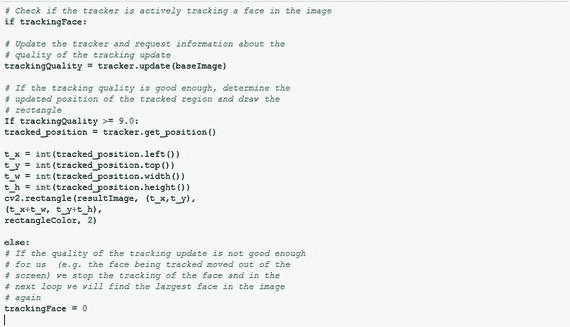

从代码中可以看出，每次再次使用检测器时，都会向控制台打印一条消息。如果您在运行该应用程序时查看控制台的输出，您会注意到，即使您在屏幕上移动了相当多的距离，追踪器也会很好地跟踪检测到的人脸。

## 人脸识别

人脸识别系统通过将每帧视频中的人脸与训练图像进行匹配来识别视频帧中出现的人的姓名，如果帧中的人脸匹配成功，则返回标签(并写入 CSV 文件中)。现在你将看到如何一步一步地创建一个人脸识别系统。

首先，导入所有需要的库。face_recognition 是一个简单的库，使用 [dlib](http://dlib.net/) 最先进的人脸识别技术构建，也是通过深度学习构建的。

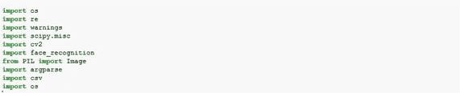

Argparse 是一个 Python 库，允许您向文件中添加自己的参数；然后，它可以用于在执行时输入任何图像目录或文件路径。

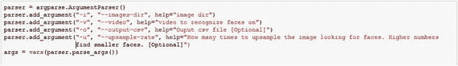

在前面的代码中，在运行这个 Python 文件时，您必须指定以下内容:训练输入图像目录、我们将用作数据集的视频文件，以及用于在每个时间帧写入输出的输出 CSV 文件。

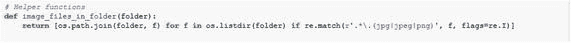

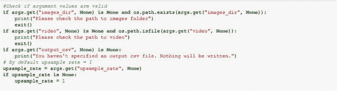

通过使用上述功能，可以读取指定文件夹中的所有图像文件。

以下函数使用已知的训练图像测试输入帧:

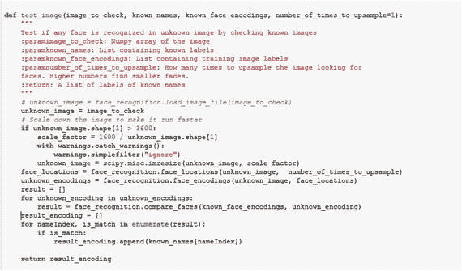

现在您定义函数来提取匹配的已知图像的标签。

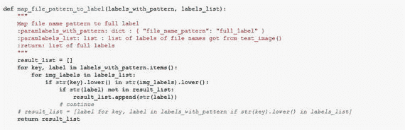

读取输入视频以提取测试帧。

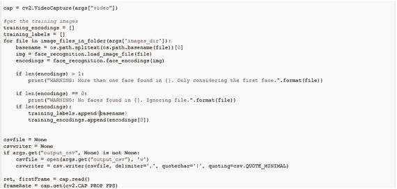

现在定义训练集的标签。然后匹配从给定输入视频中提取的帧，以获得所需的结果。

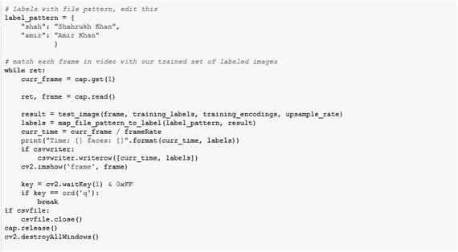

## 基于深度学习的人脸识别

导入必要的包。

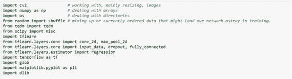

初始化变量。

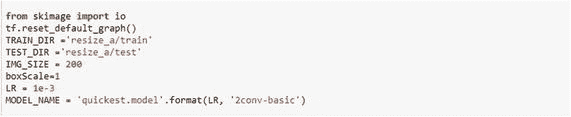

`label_img()`函数用于创建标签数组，`detect_faces()`函数检测图像中的人脸部分。

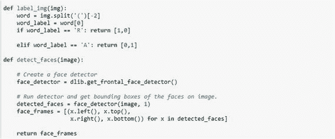

`create_train_data()`函数用于预处理训练数据。

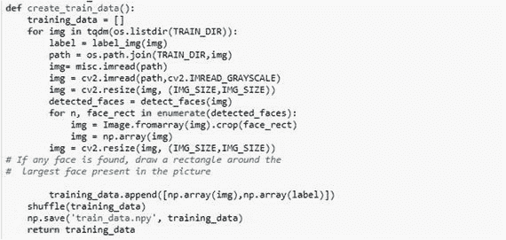

`process_test_data()`函数用于对测试数据进行预处理。

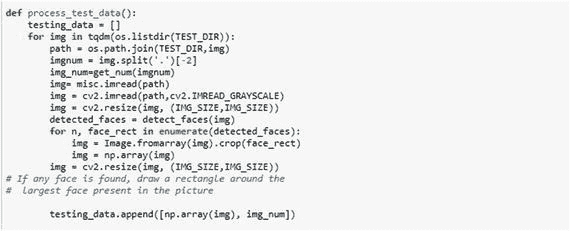

然后创建模型，并在模型中拟合训练数据。

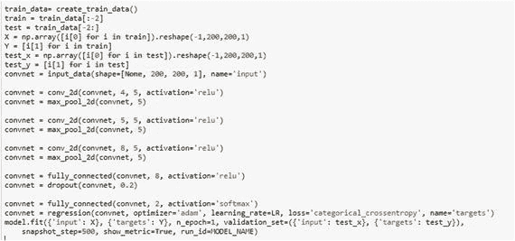

最后，您准备测试数据并预测输出。

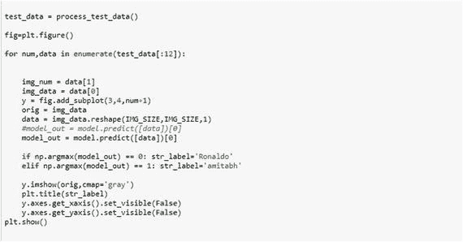

## 迁移学习

迁移学习利用在解决一个问题时获得的知识，并将其应用于另一个不同但相关的问题。

在这里，您将看到如何使用名为 Inception v3 模型的预训练深度神经网络对图像进行分类。

Inception 模型能够从图像中提取有用的信息。

### 为什么要转学？

众所周知，卷积网络需要大量的数据和资源来训练。

使用迁移学习和微调(也就是说，将在以前的项目(如 ImageNet)中训练的网络权重转移到新的任务中)已经成为研究人员和实践者的规范。

您可以采取两种方法。

*   迁移学习:你可以拿一个已经在 ImageNet 上预先训练好的 CNN，去掉最后一个完全连接的层，然后把 CNN 的其余部分当作新数据集的特征提取器。一旦提取了所有图像的特征，就可以为新的数据集训练一个分类器。
*   微调:您可以在 CNN 上替换和重新训练分类器，还可以通过反向传播微调预训练网络的权重。

### 迁移学习示例

在这个例子中，首先您将尝试通过直接加载 Inception v3 模型来对图像进行分类。

导入所有需要的库。

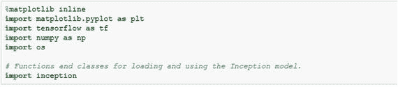

现在为模型定义存储目录，然后下载 Inception v3 模型。

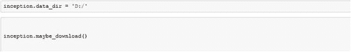

加载预训练的模型并定义函数来对任何给定的图像进行分类。

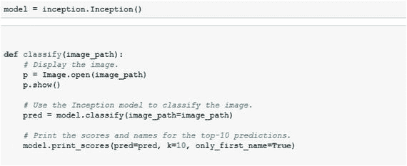

现在模型已经定义好了，让我们检查一些图片。

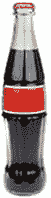

这给出了 91.11%的正确结果，但是现在如果你检查某个人，你会得到这样的结果:

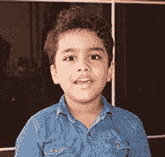

是 48.50%的网球！

不幸的是，盗梦空间模型似乎无法对人的图像进行分类。这样做的原因是用于训练初始模型的数据集，它对于类有一些令人困惑的文本标签。

相反，您可以重用预训练的初始模型，仅仅替换最终分类的层。这就是所谓的迁移学习。

首先，您使用 Inception 模型输入并处理一个图像。就在初始模型的最终分类层之前，您将所谓的转移值保存到一个缓存文件中。

使用缓存文件的原因是，使用 Inception 模型处理图像需要很长时间。当新数据集中的所有图像都已经通过初始模型进行了处理，并且所得到的传递值被保存到缓存文件中时，那么您可以使用这些传递值作为另一个神经网络的输入。然后，您将使用新数据集中的类来训练第二个神经网络，以便网络学习如何基于来自初始模型的转移值来对图像进行分类。

这样，初始模型用于从图像中提取有用的信息，然后另一个神经网络用于实际的分类。

### 计算转移价值

从初始文件中导入`transfer_value_cache`函数。

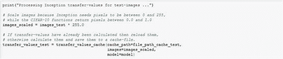

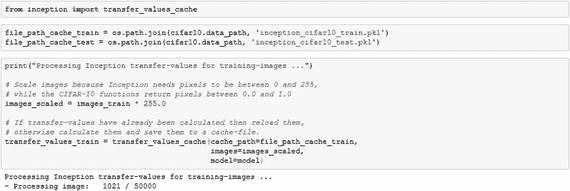

到目前为止，传输值存储在缓存文件中。现在您将创建一个新的神经网络。

定义网络。

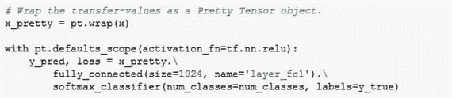

下面是优化方法:

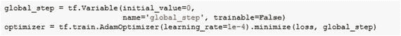

下面是分类精度:

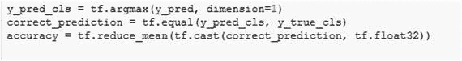

下面是 TensorFlow 运行:

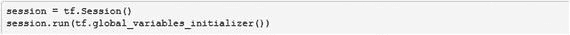

下面是执行批量训练的帮助器函数:

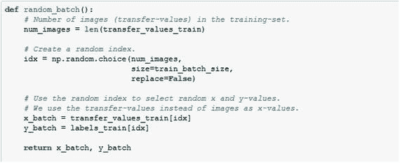

为了优化，下面是代码:

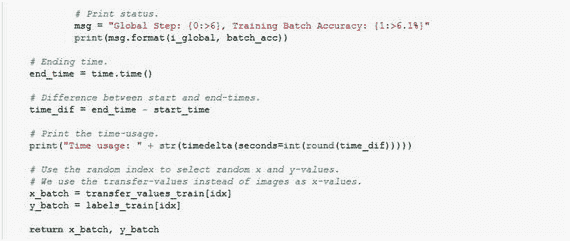

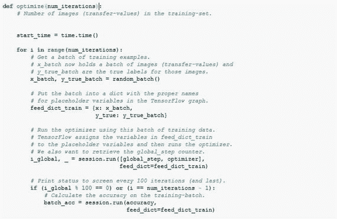

为了绘制混淆矩阵，下面是代码:

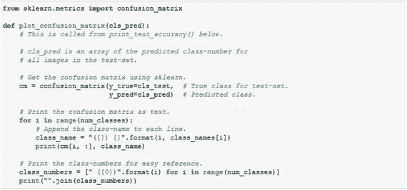

以下是计算分类的辅助函数:

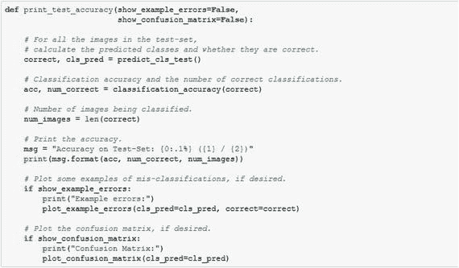

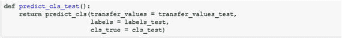

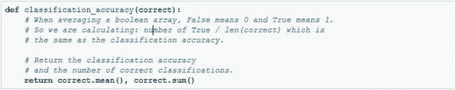

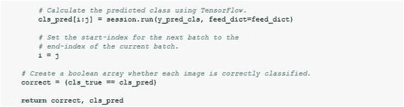

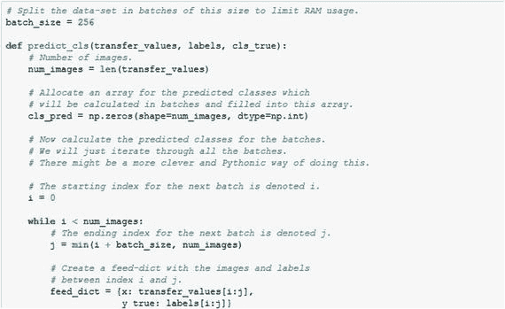

现在让我们运行它。

```py
from datetime import timedelta

optimize(num_iterations=1000)

Global Step:  13100, Training Batch Accuracy: 100.0%
Global Step:  13200, Training Batch Accuracy: 100.0%
Global Step:  13300, Training Batch Accuracy: 100.0%
Global Step:  13400, Training Batch Accuracy: 100.0%
Global Step:  13500, Training Batch Accuracy: 100.0%
Global Step:  13600, Training Batch Accuracy: 100.0%
Global Step:  13700, Training Batch Accuracy: 100.0%
Global Step:  13800, Training Batch Accuracy: 100.0%
Global Step:  13900, Training Batch Accuracy: 100.0%
Global Step:  14000, Training Batch Accuracy: 100.0%
Time usage: 0:00:36

print_test_accuracy(show_example_errors=True,
show_confusion_matrix=True)

Accuracy on Test-Set: 83.2% (277 / 333)
Example errors:
Confusion Matrix:
[108 3 5] (0) Aamir Khan
[0 83 22] (1) Salman Khan
[4 22 86] (2) Shahrukh Khan
 (0) (1) (2)

```

## 蜜蜂

许多易于使用的 API 也可用于人脸检测和人脸识别任务。

以下是面部检测 API 的一些示例:

*   piclab
*   Trueface.ai
*   决定的吉时
*   微软计算机视觉

以下是面部识别 API 的一些示例:

*   Face++
*   拉姆达实验室
*   KeyLemon
*   piclab

如果你想从一个提供商那里获得人脸检测、人脸识别和人脸分析，目前有三大巨头在这方面领先。

*   亚马逊的亚马逊识别 API
*   微软 Azure 的 Face API
*   IBM Watson 的视觉识别 API

亚马逊的亚马逊识别 API 可以做四种类型的识别。

*   对象和场景检测:识别识别各种有趣的对象，如车辆、宠物或家具，并提供置信度得分。
*   面部分析:您可以在图像中定位面部并分析面部属性，如面部是否微笑或眼睛是否睁开，并具有一定的置信度。
*   面部对比:亚马逊的亚马逊识别 API 可以让你测量两张图片中的面部是同一个人的可能性。不幸的是，同一个人的两张脸的相似性度量取决于照片拍摄时的年龄。此外，面部照明的局部增加会改变面部比较的结果。
*   面部识别:API 使用私有存储库识别给定图像中的人。它又快又准。

微软 Azure 的 Face API 将返回一个置信度分数，以确定这两张脸属于一个人的可能性有多大。微软还有其他 API，如下所示:

*   计算机视觉 API:这个特性返回图像中可视内容的信息。它可以使用标记、描述和特定于领域的模型来识别内容并满怀信心地对其进行标记。
*   内容审核 API:这可以检测潜在的攻击性或不需要的图像、各种语言的文本和视频内容。
*   Emotion API:它分析人脸来检测一系列的感觉，并个性化你的应用程序的响应。
*   视频 API:这产生稳定的视频输出，检测运动，创建智能缩略图，检测和跟踪人脸。
*   视频索引器:这可以在视频中发现一些见解，例如语音实体、语音的情感极性和音频时间轴。
*   定制视觉服务:这将根据内置模型或通过您提供的训练数据集构建的模型来标记新图像。

IBM Watson 的视觉识别 API 可以进行一些特定的检测，例如:

*   它可以确定人的年龄。
*   它可以确定人的性别。
*   它可以确定一个面周围的边界框的位置。
*   它可以返回在图像中检测到的名人的信息。(未检测到名人时不返回此信息。)