# 第一部分

开始学习人工智能

# 1. 人工智能简介

智力可以以多种方式定义，从处理新情况的能力到根据某些标准做出正确决策的能力，例如（Bengio，2010）。在某种程度上，标准计算机甚至基本计算器可以被认为是智能的，因为它们可以根据人类编写的规则计算出结果。计算机在处理日常操作，如算术计算方面极为有用，它们解决这些问题的速度和规模随着时间的推移而大大增加。

然而，许多人类天生就会做的任务——例如感知和控制任务——对于编写机器执行的形式规则或程序来说极为困难。通常很难将信息处理和决策背后的所有知识和思维过程形式化地编码到一个机器可以据此行动的正式程序中。另一方面，人类在其一生中可以通过观察和经验收集大量数据，这使人类能够达到这种水平的智力、抽象思维和决策能力。

人工智能（AI）是一个广泛的研究领域，包括复杂问题解决以及类似人类的感知、行动和推理能力。人工智能的一个目标可以是创建能够像人类一样思考和行动的智能机器，它们能够通过类似人类推理的过程来模拟智能和做出决策。这个领域包括从为以前仅由智能生物执行的任务（例如，算术计算器）制定规范性、不可变算法的方法，到使机器能够学习、响应反馈并参与抽象思维的各种尝试。

人工智能正在以前所未有的速度改变我们周围的世界，包括个性化体验、智能手机等设备中的智能个人助理、语音到语音翻译、自动支持代理、精准医疗和能够识别物体并做出适当反应的自动驾驶汽车，仅举几例。即使是通过搜索或 Microsoft Office 365 等产品，人工智能也对大多数人的日常生活产生了有益的影响。与互联网的早期相比，技术在人类与计算机互动方面已经取得了长足的进步。人们越来越期望以智能的方式获取信息，能够以自然的方式与掌握信息访问权限的设备互动。创造这些类型的体验通常需要某种类型的人工智能。

> 人工智能将颠覆每一个商业应用——无论是银行、零售和医疗保健等垂直行业，还是销售、营销和客户支持等横向业务流程。 ——哈里·舒姆，微软执行副总裁，人工智能和研发

当然，随着 AI 和智能系统的兴起，也带来了潜在的缺点和担忧。尽管基于 AI 的潜在变革性体验和解决方案，但 AI 的创造者和使用者都需要认识到重要的伦理问题。技术将继续像过去一样塑造劳动力市场和经济发展，AI 自动化一些任务，在其他任务中增强人类能力（Brynjolfsson & Mitchell, 2017）。媒体描绘往往将人与机器对立起来，这种对立通过计算机玩游戏的故事被加剧，尤其是与人类玩游戏。几十年来，计算机已经在诸如国际象棋等游戏中击败了人类，但随着最近 AI 的进步，计算机也能在更复杂的游戏中超越人类能力，在这些游戏中，蛮力计算能力并不实用，例如抽象棋类游戏围棋或街机游戏《吃豆人》（Silver et al., 2016; van Seijen, 2017）。

然而，我们认为讨论不应该以人与机器的二分法来框架。开发增强人类能力的 AI 非常重要，因为人类拥有“创造力、同理心、情感、身体和洞察力”，这些可以与 AI 和机器的力量相结合，快速在大数据上推理，解决社会的一些重大问题（Nadella, 2016）。毕竟，今天世界上有大量的信息可供我们学习，但我们受限于人类在时间限制内吸收这些信息的能力。AI 可以帮助我们在有限的时间内取得更多成就。

当然，需要建立安全措施，因为算法并不总是能给出正确的答案。然后还有关于“正确”含义的争论。尽管人们认为计算机是中立的，因此体现了包容和尊重每个人的价值观，但数据中可能存在隐藏的偏见，以及编程到 AI 系统中的代码，这可能导致不公平和不准确的推断。在 AI 系统开发和改进过程中，也需要解决数据和隐私问题。因此，用于 AI 开发的平台需要内置对隐私、透明度和安全性的保护。尽管我们离通用人工智能还很远，也远离了流行文化和科幻作品中关于超级智能计算机导致 AI 系统失控的许多描绘，但这些 AI 的法律和伦理影响仍然是至关重要的。

我们仍然处于 AI 融入我们生活的早期阶段，但一场大规模的变革已经开始。特别是在过去几年中的进步以及像微软 AI 平台这样的平台的出现，人们可以轻松地构建 AI 应用，我们将看到许多创新和变化即将到来。最终，这种变化将意味着人类和机器将以更加无缝的方式共同工作。想象一下，当我们致力于使用 AI 来解决世界上一些最大的挑战，如疾病、贫困和气候变化时，会是什么样子（Nadella, 2017）。

## 微软与 AI

AI 是微软战略的核心，“构建最佳平台和生产力服务，以实现人工智能（AI）注入的智能云和智能边缘”（微软 10-K 表格，2017）。尽管这个声明是新的，但 AI 对微软来说并不陌生。创始人比尔·盖茨相信，有一天计算机将能够看到、听到并理解人类及其环境。微软研究部成立于 1991 年，旨在解决一些基础 AI 挑战；许多原始解决方案现在已嵌入到 Office 365、Skype、Cortana、Bing 和 Xbox 中。这些都是微软产品中融入了许多不同 AI 应用的例子。即使在 1997 年，拥有自动垃圾邮件过滤功能的 Hotmail 也是基于一种 AI 系统，其分类随着时间的推移而改进。

让我们今天仅看看几个具体的例子。一个可用于 PowerPoint 的插件，称为演示翻译器，可以在您用超过 60 种支持的语言中的任何一种说话时直接在 PowerPoint 演示文稿上显示字幕；您还可以直接翻译幻灯片上的文本，从而将您的演示文稿保存为另一种语言的版本，这得益于语音识别和自然语言处理技术（微软翻译器，2017）。SwiftKey 是一款智能键盘，被超过 3 亿部 Android 和 iOS 设备使用，它从您想要输入的下一个单词的 10 万亿次按键中学习，并节省了 10 万年时间（微软新闻，2017）。

Bing——由 AI 驱动，具备智能搜索和智能回答功能——在美国的 PC 搜索量中占据了超过三分之一的份额。持续的发展，例如视觉图像搜索以及与 Reddit 合作将 Reddit 对话带到 Bing 回答中，不断将智能注入搜索中（Bing, 2017b）。个人 AI 助手 Cortana 帮助回答了超过 180 亿个问题，拥有超过 1.48 亿活跃用户，遍布 13 个国家（Linn, 2017）。 Seeing AI 被推出，旨在帮助盲人和低视力社区，通过自动描述人们的周围视觉区域、物体和文本。

尽管这些技术已经融入了许多产品和应用程序中，但微软还旨在使人工智能技术民主化，以便其他人可以在他们的服务和平台上构建智能解决方案。微软的研究和 AI 团队在 2016 年成立，旨在汇集工程师和研究人员，推进人工智能的前沿，并将人工智能应用程序和服务推向市场。微软正采取如图 1-1 所示的四项措施：

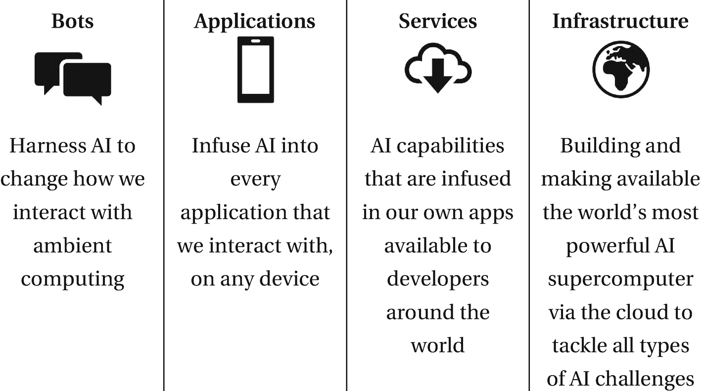

图 1-1

微软使人工智能民主化的四项措施

1.  允许我们与人工智能互动的代理，如 Cortana 和通过微软 Bot 框架启用的机器人。

1.  混合了人工智能的应用，例如 PowerPoint 翻译器。

1.  允许开发者利用这种人工智能的服务，例如认知服务手写识别应用程序编程接口（API）。

1.  允许数据科学家和开发者构建定制 AI 解决方案的基础设施，包括用于加快开发过程的专用工具和软件。

因此，Azure 云的庞大基础设施以及微软和更广泛的开源社区中使用的 AI 技术现在正被提供给希望构建自己智能应用的机构。Azure 上的微软 AI 平台是一个开放、灵活的企业级云计算平台，在第四章中进行了更详细的讨论。4。作为一个简单的例子，2016 年，微软 FPGA 纱线的一个节点能够在 2.5 秒内将小说《战争与和平》的所有 1,440 页从俄语翻译成英语。然后，使用整个能力而不是单个节点，整个维基百科可以在不到十分之一秒的时间内被翻译（微软新闻，2017）。微软专注于创建注入人工智能的代理和应用程序，并通过服务和基础设施提供这项相同的技术。我们正处于人工智能可能性的冰山一角，通过这些人工智能技术的民主化，全球将解决许多挑战。

> 我们追求人工智能，以便我们可以赋予每个人和每个人建立的人工智能工具，使他们能够继续解决我们社会和经济的最紧迫问题。 ——萨蒂亚·纳德拉，微软首席执行官

## 机器学习

尽管人工智能有许多子领域和应用，但机器学习（ML）已经成为今天许多人工智能应用中的一种实用工具，并且是本书的重点。机器学习是计算机科学的一个分支，其中计算机通过访问数据来学习处理信息和做出决策。关于这个主题有许多优秀的参考资料，但它们超出了本书的范围。典型的机器学习任务包括分类、回归、推荐、排序和聚类等。因此，人工智能是一个比机器学习更广泛的概念，因为机器学习是人工智能中的一个研究领域，它围绕机器一旦获得正确类型的数据就能自行学习的理念（Marr，2016）。

在传统的机器学习方法中，已经建立了利用数据点作为有用特征或表示本身的方法，例如捕获年龄、性别、在线点击次数或温度传感器读数等数据点。计算机学习如何模拟这些输入特征集与它们试图预测的输出之间的关系；人类选择的算法限制了计算机能够学习的模型类型。人类还手动构建数据的表示，这一步骤通常被称为特征工程，并将这些表示输入到机器学习模型中进行学习。最常见的机器学习类型是监督机器学习，其中模型具有标签，这些标签应该代表与学习相关的真实情况。计算机学习模型内参数的过程通常被称为训练。

例如，假设电信公司旨在解决客户流失问题。他们使用传统的监督机器学习技术来解决这个问题的方法在此描述。他们希望识别可能流失的客户，以便他们可以主动联系并给予他们激励以留住他们。为了构建这个模型，他们首先会收集相关的原始输入数据，例如客户的用法模式和如图 1-1 所示的人口统计数据。

表 1-1

示例：从电信公司收集的客户信息原始表格，这些信息需要在输入机器学习模型之前进行处理

| 客户信息 | 电话记录 |
| :-- | :-- |
| 姓名 | 性别 | 注册日期 | 姓名 | 通话时长 | 日期 |
| Mary | F | 29.01.2011 | Mary | 12 | 30.01.2011 |
| Thomas | M | 20.06.2013 | Mary | 1 | 01.02.2011 |
| Danielle | F | 05.05.2014 | Mary | 3 | 01.02.2011 |
| Wee Hyong | M | 01.09.2012 | … | … | … |
| Mathew | M | 15.11.2012 | Thomas | 22 | 21.06.2012 |
| Ilia | M | 19.02.2013 | … | … | … |
| … | … | … |   |   |   |

在原始输入数据上完成了一些预处理，例如通过时间的一些度量来结构化数据，根据需要聚合数据点，以及将与客户是否流失相关的不同表连接起来。这之后是特征工程，以创建这些客户数据的表示，以便输入到模型中，例如创建一个表示与电信公司服务期限的特征，这个特征是基于客户注册服务日期找到的。创建相关数据表示对于机器学习模型能够识别数据中的模式非常重要，通常会受到领域知识的强烈指导，如图 1-2 所示，例如。

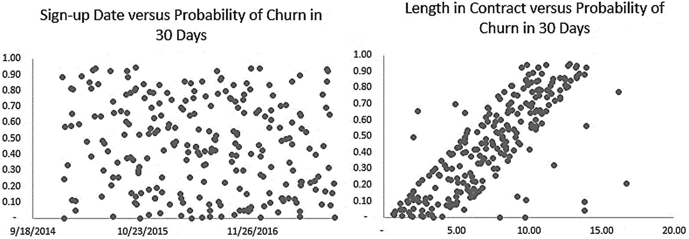

图 1-2

数据表示非常重要；例如，检查任何给定时间点的注册日期可能对 30 天内流失的概率关系不大，但检查该时间点的合同期限可能揭示出强烈的关联，即如果个人在合同中待的时间更长，他们更有可能在 30 天内流失。

然后，将历史结果，即客户在一定时间内是否流失的标签，与这些数据匹配，并用于监督机器学习算法的训练过程，如表 1-2 所示。将训练好的模型应用于保留的测试数据集，以了解它将如何推广到新客户，模型将根据其预测历史流失结果的好坏进行评估。在迭代预处理、特征工程和模型选择过程，尝试不同的模型以找到最佳流程后，然后将此应用于新的原始客户电信数据，以预测哪些客户未来可能流失。

表 1-2

下 30 天简单特征工程和匹配到客户流失标签的示例输出

| 姓名 | 月份 | 总通话分钟数 | 使用电信公司月份数 | 下 30 天流失 |
| :-- | :-- | :-- | :-- | :-- |
| 玛丽 | 2.2011 | 44 | 0 | 0 |
| 玛丽 | 3.2011 | 51 | 1 | 0 |
| … | … | … | … | … |
| 托马斯 | 6.2013 | 152 | 0 | 0 |
| 托马斯 | 7.2013 | 201 | 1 | 0 |
| 托马斯 | 8.2013 | 120 | 2 | 1 |

注释

在这种情况下，0 表示个人没有流失，1 表示个人已经流失。

这种在图 1-3 中总结的传统、监督式机器学习方法适用于许多问题，并且在许多行业中得到了广泛的应用。在运营和人力资源管理中，机器学习被用于预测性维护解决方案和智能楼宇管理，以及增强供应链管理。例如，罗克韦尔公司通过监测海上钻井平台泵的健康状况的预测性维护解决方案，每天能节省高达 30 万美元（微软，2015 年）。在市场营销和客户关系场景中，机器学习被用于创建个性化体验，提供产品推荐，以及更好地预测客户获取和流失。在金融领域，欺诈检测解决方案和财务预测通常得益于机器学习支持下的解决方案。

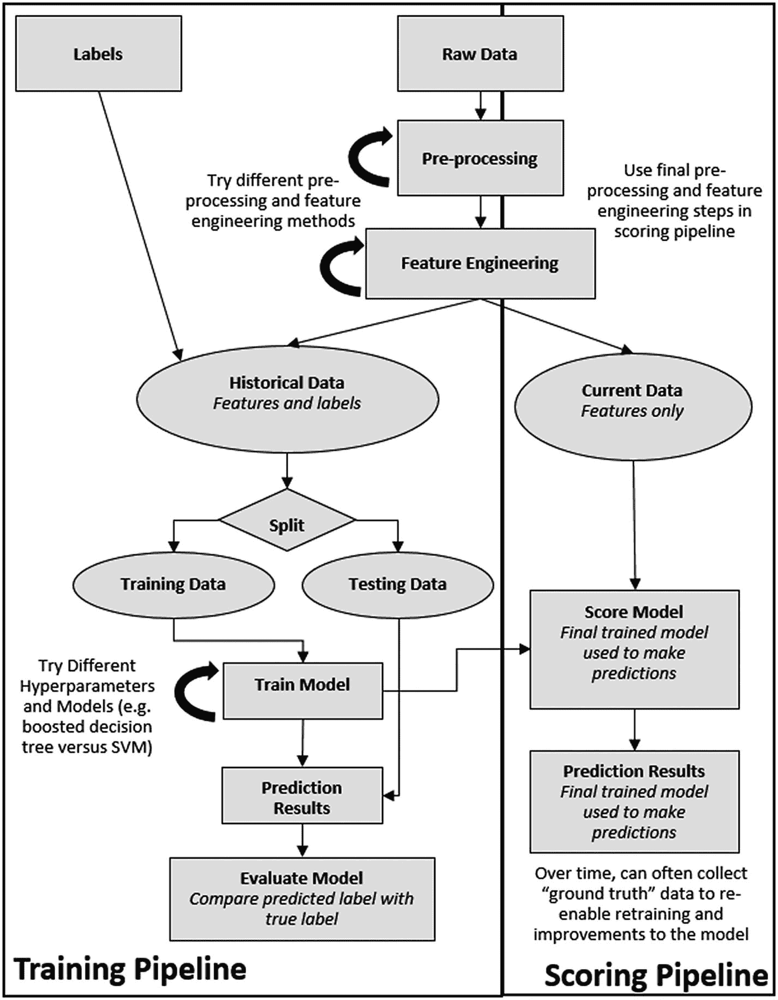

图 1-3

经典、监督式机器学习解决方案的方法

## 深度学习

尽管如前所述，传统的机器学习方法在许多场景中表现良好，但世界上许多事物都是以没有易于提取语义的表示形式量化的，例如音频片段或图像中的像素。

例如，编程计算机以识别图 1-4 中每张图像中是否有火烈鸟将极其困难。这些图像被表示为从 0 到 255 的像素值矩阵。标准彩色图像有三个通道：红色、绿色和蓝色，因此图像可以表示为三个二维矩阵。甚至定义哪种数值组合代表粉红色都很难，更不用说处理它们以识别火烈鸟了。即使采用传统的机器学习方法并手工制作识别图像部分（如喙、羽毛和腿）的特征，也需要非常专业的知识和大量的时间来从大量图像中构建足够好的不同表示，然后计算机可以从这些图像中学习。

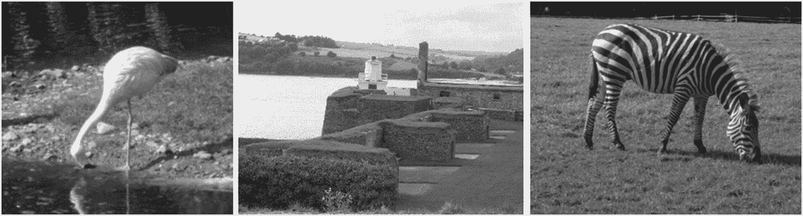

图 1-4

以下是一些示例图像，在这些图像中，一个配备人工智能的机器可能需要回答需要它处理、理解和推理的问题。例如，是否每张图像中都有火烈鸟，为传统机器学习方法手工制作特征非常困难且耗时。

同样，传统的自然语言处理需要复杂且耗时的特定任务特征工程。对于语音处理，不同的语言、语调、环境和噪音造成了细微的差异，这使得制作相关特征变得极其困难。

深度学习，本书的重点，是人工智能和机器学习的一个进一步子领域，它在处理如图像、音频和文本数据等不易提取语义的问题上特别显示出潜力（Goodfellow, Bengio, & Courville, 2016）。深度学习方法中，多层深度神经网络（DNN）模型被应用于大量数据。深度学习模型通常拥有数百万个参数；因此，它们需要极其庞大的训练集以避免过拟合。模型的目标是将输入映射到输出（例如，图像中的像素映射到对图像为火烈鸟的分类；音频片段映射到转录文本）。原始输入通过一系列函数进行处理。基本思想是，监督式深度学习模型通过检查大量数据并逐渐纠正自身，将预测结果与真实标签数据进行比较，从而学习到将输入数据映射到输出分类的函数的最优权重。

这些模型和概念的早期变体可以追溯到 20 世纪 50 年代，它们松散地基于人类大脑可能如何处理信息的想法，被称为人工神经网络。模型通过学习模式来处理数据。首先是简单的模式，如边缘和简单的形状，然后通过模型的许多层组合成更复杂的模式。当前模型通常包含许多层——一些变体甚至宣称超过一百层——因此得名深度。因此，模型通过处理信息的层次性自动学习高级抽象。

尽管数据仍然需要被处理和调整以适应深度学习模型，但不再需要手动制作特征，因为原始输入（例如，图像中的像素值）直接输入到模型中。模型会自动学习输入数据的特征（属性）。因此，不再需要代表图片子部分的特征，例如之前提到的火烈鸟例子中的喙和腿。深度学习方法显示出在输入数据中学习模式的潜力，能够直接根据原始输入进行分类，而不是手动构建特征。相反，通常花费更多的时间来选择网络的架构，也称为网络架构，以及调整超参数，这些参数是在学习过程开始之前在模型中设置的。这导致了网络架构工程是新的特征工程（Merity，2016）的想法。深度学习在机器学习的几个领域也显示出潜力，在这些领域中，传统方法也工作得很好，例如预测时间序列中的未来值和旨在预测用户对给定物品偏好的推荐系统。关于特定类型的深度学习模型以及深度学习的最新趋势的更多详细信息分别在第二章 2 和第三章 3 中介绍。

### 深度学习的兴起

深度学习背后的基本思想和算法已经存在了几十年，但深度学习在消费和工业应用中的大规模使用仅在最近几年才出现。有两个因素特别推动了人工智能应用，尤其是深度学习解决方案的近期增长：云计算加速的计算能力的提升以及数字数据的增长。

深度学习模型需要大量的实验，并且通常在大量的训练数据上运行，因此需要大量的计算资源，特别是比传统 CPU 在深度神经网络计算中效率高许多的硬件，如 GPU 和 FPGA。云计算——通过互联网在数据中心远程运行工作负载，利用共享资源——提供了更便宜的硬件和计算能力。资源可以根据需求启动，不再使用时暂停，以节省成本，无需投资新的硬件。

随着互联网和连接设备的普及，我们的世界正日益数字化，大量数据正在被收集。当然，理解如何组织和利用这些信息对于推进人工智能应用至关重要。改变人工智能研究的一个数据收集项目是 2009 年最初发布的 ImageNet 数据集，它演变成了每年对人工智能算法的竞赛，比如哪个算法能够以最低的错误率对图像进行对象分类（Russakovsky et al., 2015）。深度学习最近作为一种强大的技术出现，这在很大程度上归功于这个 ImageNet 数据集的收集。“事实上，如果我们今天看到的人工智能繁荣可以归因于一个单一事件，那将是 2012 年 ImageNet 挑战赛结果的公布”（Gershgorn, 2017）。

具体来说，在 2012 年，一个深度学习解决方案在分类对象方面显著优于前一年的结果，如图 1-5 所示。这个解决方案改变了计算机视觉研究的发展方向，并加速了深度学习在自然语言处理和语音识别等其他领域的应用研究。在继续进行更高级的深度学习研究的过程中，2015 年，微软研究院提交了一个名为 ResNet 的 152 层架构的参赛作品，这是第一次有算法超越了人类的分类能力（He, Zhang, Ren, & Sun, 2015）。

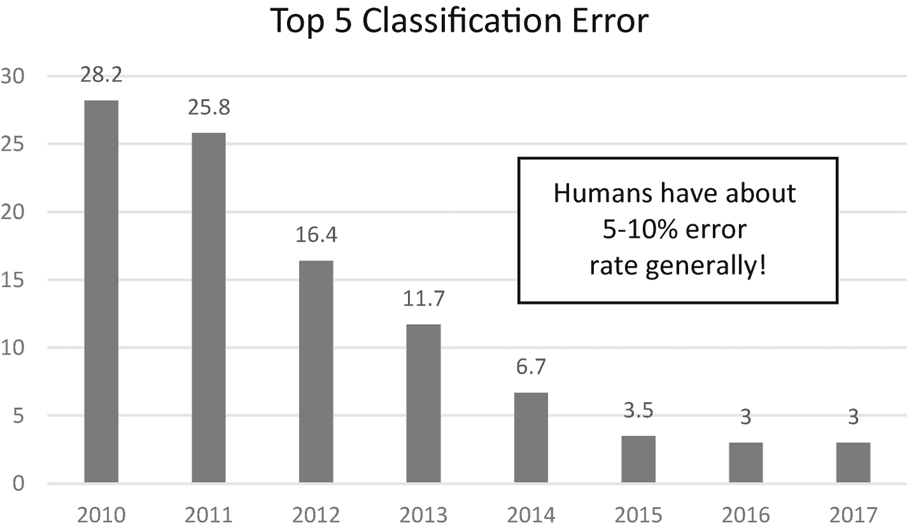

图 1-5

ILSVRC 中图像分类的 ImageNet 数据集上年度获胜解决方案的前五名分类错误率（Russakovsky et al., 2015）

这个 ImageNet 数据集和竞赛绝非纯粹是学术练习。在这个竞赛中使用的许多架构在工业界中经常被使用，许多在 ImageNet 数据集上预训练的模型对公众开放，许多深度学习计算机视觉应用都是由此工作引发的。这对于迁移学习方法尤其如此，这在第二章中讨论得更为详细。

> ImageNet 在人工智能领域改变的一件事是，人们突然意识到制作数据集的无功之劳是人工智能研究的核心。人们真正认识到数据集在研究中的重要性，与算法一样突出。（Gershgorn, 2017）——李飞飞

当然，正如人们可以从过去几年 ImageNet 结果的显著改进以及微软对 ResNet-152 架构的讨论中推断出的那样，支持深度学习解决方案的算法和创建这些解决方案的工具也取得了最近的进展。因此，云计算加速的计算能力、数据的增长（尤其是公开的标注数据集）以及高级算法和网络架构共同极大地改变了过去几年人工智能所能实现的事情。

深度学习技术在图像识别方面不仅能够超越人类，还在推动其他领域的发展，例如在语音识别方面接近人类水平。实际上，深度学习的一些最初突破就发生在语音识别领域（Dahl, Yu, Deng, & Acero, 2011）。然后在 2016 年 10 月，微软在 Switchboard 数据集上达到了人类水平的词错误率，这个数据集是记录电话对话的语料库，自 25 年前以来一直被用来作为评估 AI 系统的基准（Xiong et al., 2016）。这类创新是为什么在过去的几年中，个人设备和计算机上的语音识别系统有了如此巨大的改进。

类似地，对于自然语言处理，在 2018 年 1 月 3 日，微软在 SQuAD 机器阅读理解数据集上达到了 82.6%的分数，这个数据集由维基百科文章组成。使用这些数据，计算机阅读文档并回答问题，发现其答案优于人类（人类的表现大约为 82.3%；Linn, 2017；Rajpurkar, Zhang, Lopyrev, & Liang, 2016）。

然而，重要的是要注意，这些成就仅针对特定的问题或应用，并不代表一个能够泛化到新任务的 AI 系统。也可以相对容易地创建出计算机无法处理的例子，即所谓的对抗性例子（Jia & Liang, 2017）。此外，即使原始任务仅略有修改，系统的性能也可能急剧下降。例如，尽管计算机现在可能比人类更好地对图像进行分类，如前所述的 ImageNet 数据所示，但对于图像问题的开放式回答仍然远远达不到人类水平；截至 2017 年 6 月，在视觉问答（VQA）1.0 数据集上的准确率差异超过 10%（AI Index, 2017）。

此外，深度学习作为一种通用方法仍然存在许多限制，例如无法推理和理解。在某些情况下，调整深度学习系统可能比调整传统系统更困难，例如当它在某个方面表现不佳时，在某些情况下，这可能比在具有较少参数的传统机器学习模型中更容易解释。其他机器学习和人工智能研究领域存在，并且比基于深度学习的方法更准确地解决其他类型的问题。深度学习与其他人工智能研究领域的结合，如强化学习，也具有很大的潜力。关于最近进展、趋势和限制的更多细节将在第三章中讨论。

在这本书中，我们主要关注人工智能中的深度学习方法以及智能技术可以使用深度学习来创造解决方案的应用，这些解决方案能够赋予人们和企业力量。这些解决方案包括提高与客户的互动、产品的转型以及运营的优化等。深度学习应用通常可以开发成这样的方式，即随着收集到更多数据，它们会随着时间的推移学习和改进，并常常创造出以更无缝的方式连接人与技术的体验。这本书旨在作为如何使用微软人工智能平台开发深度学习解决方案的入门指南。对于更全面的深度学习概述，包括更多关于理论和高级主题的内容，强烈推荐 Bengio、Goodfellow 和 Courville（2016）所著的书籍。

### 深度学习的应用

使用深度学习可以解决的经典计算机视觉问题如图 1-6 所示，例如能够对图像进行分类并在图像中找到物体。这些常见的专业技术问题构成了许多不同的最终用户应用的基础。例如，像微软的 Photo App 这样的照片搜索应用允许用户输入对象的描述（例如，“汽车”）或概念（例如，“拥抱”），并返回相关结果，通过使用深度神经网络（DNNs）提供了有用的功能。

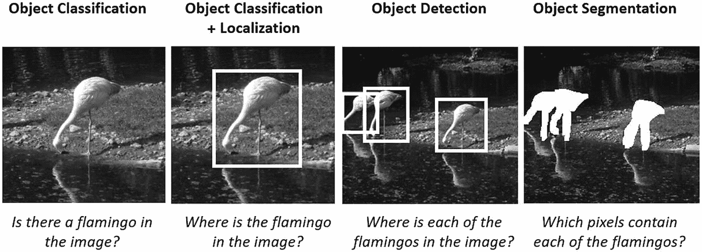

图 1-6

示例计算机视觉问题

许多计算机视觉的深度学习应用都与医疗保健和医学领域相关，这些领域是医生通常通过视觉检查患者或测试结果的地方，例如在皮肤病学、放射学和眼科。想象一下，放射科医生可以检查成千上万的扫描，但计算机可以展示并从数百万的扫描中学习。全球人类将从这些服务的民主化中受益，随着时间的推移，这些服务将变得更加准确和高效。Project InnerEye 是一个例子，它是微软的一个研究项目，旨在为自动、定量分析三维放射学图像构建创新工具，以协助专家医疗从业者。

制造业和公用事业领域也有许多类似的应用实例。以挪威的电力和公用事业公司 eSmarts 为例，它提供自动化的能源管理系统。他们使用无人机收集输电线路的图像，然后使用深度神经网络（DNNs）进行分析，以自动检测故障（Nehme, 2016）。具体来说，eSmarts 对图像进行目标检测，以检测圆盘，然后预测它们是否损坏。他们将真实图像与创建的合成图像混合，以创建足够大的数据集，从而能够进行预测。同样，Jabil 是领先的解决方案提供商之一，通过分析其电路板组装线的图像来自动检测缺陷（Bunting, 2017）。这样做可以减少操作员手动检查的电路板数量，并提高他们的吞吐量。

分析自然语言数据是深度学习的另一种常见用途。这些应用的总体目标是让计算机处理自然语言，对文本进行分类，回答问题，总结文档，以及在不同语言之间进行翻译，例如。自然语言处理通常需要多个处理层次，从词语和语义的语言层面到词性、实体，到如图 1-7 所示的最终用户应用类型（Goldberg, 2016）。

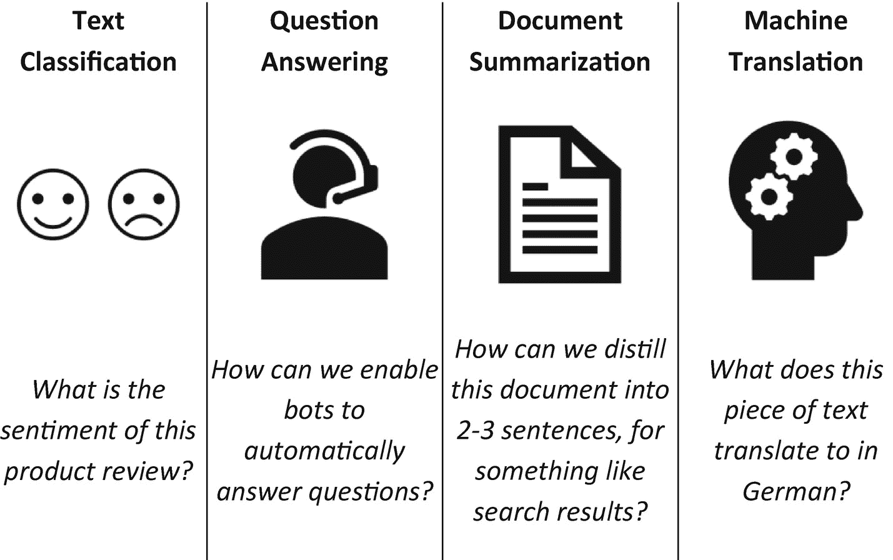

图 1-7

文本的自然语言处理应用实例

将音频数据转换为文本是深度学习应用的另一种常见用途。例如，Starship Commander 是 Human Interact 开发的一款新的虚拟现实（VR）游戏，它利用深度学习进行语音识别。在这个游戏中，玩家是科幻宇宙中的活跃参与者（Microsoft Customer Stories, 2017）。Human Interact 正在围绕人类语音构建游戏中的逼真体验，使用户可以通过声音影响游戏的故事情节和方向。为了实现这一点，游戏需要识别语音并根据用户的潜在意图理解语音的意义。微软的定制语音服务允许开发者构建一个基于深度学习的语音识别系统，该系统能够克服诸如说话风格和背景噪音等障碍。开发者甚至可以使用定制脚本进行训练，以识别游戏中的关键词和短语，从而比从头开始构建更快速、更简单地建立一个真正的定制语音识别系统。

这只是识别所说话语的第一步——游戏随后需要理解用户的意图。想象一下，用户正在下达启动船只引擎的命令。有很多人可以给出这样的命令。微软的语言理解服务可以推断用户的潜在意图，在游戏识别的语音和用户实际意图之间进行翻译。

> 我们能够构建这样的产品，唯一的理由是我们正在利用微软在深度学习和语音识别方面的专业知识，以提供一场革命性的娱乐体验。 ——亚历山大·梅西亚，所有者和创意总监，人机互动

当然，这些只是一些简单的例子，展示了深度学习如何为企业消费者应用带来价值。深度学习在语音、文本、视觉、预测和推荐等领域的应用展现出巨大的潜力（例如，见图 1-8），我们预计未来在许多行业中深度学习的应用将更加广泛，应用也将更多。

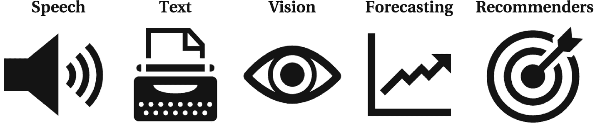

图 1-8

深度学习解决方案表现出卓越性能的示例领域

通过语音和文本与更多应用程序交互，而不是通过菜单，在公司网站或人力资源页面上与机器人聊天以快速解决常规问题，创新的照片应用程序允许自然搜索和操作，以及从文档中快速找到相关信息，这些都是深度学习将为企业消费者带来价值的示例场景。

## 概述

本章介绍了 AI、ML 和深度学习的概念，如图 1-9 所示。基于本章简要提到的数十年的研究和技术创新，微软现在提供服务和基础设施，通过建立在云计算平台 Azure 之上的 Microsoft AI 平台，使其他人能够构建智能应用——包括本书中讨论的强大深度学习应用。

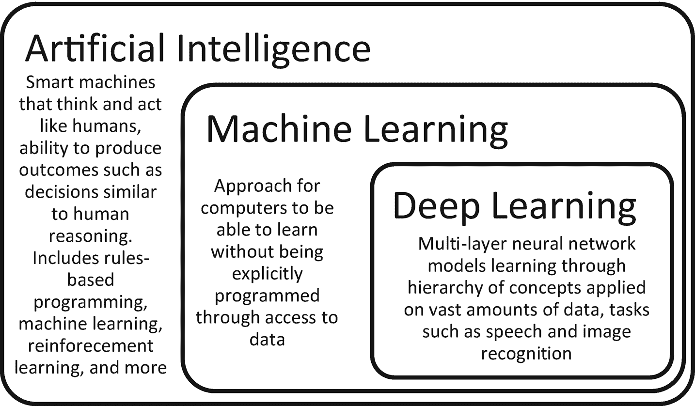

图 1-9

人工智能、机器学习和深度学习之间关系的可视化

本章还讨论了深度学习近期兴起的原因，例如计算能力的提升和数据集规模的增加，特别是对于 ImageNet 等标记数据的增加，这些数据已经公开提供。这些推动了计算机视觉、自然语言处理、语音识别和时间序列分析等领域的研究。我们还在医疗保健、制造和公用事业等领域看到了基于深度学习的许多有价值的应用。我们相信这一趋势将持续下去，但其他 AI 研究领域在未来也将有用。

在下一章中，我们将介绍开始深度学习所需的常见深度学习模型和方面。在第三章[A463582_1_En_3_Chapter.html]中，我们将更详细地讨论深度学习和 AI 的一些新兴趋势，以及本章简要提到的法律和伦理影响。

# 2. 深度学习概述

在第一章中，我们概述了人工智能和深度学习背后的基本思想。我们讨论了深度学习——应用具有大量层的人工神经网络模型——在图像分类、目标检测、语音识别和自然语言处理等研究领域取得了最先进的结果。

深度学习在许多领域的应用中也显示出了潜力，如医疗保健、制造业和零售业。例如，在 2017 年，一个 AI 系统在识别皮肤癌方面与皮肤科医生的表现相当，一个模型可以从单导心电图（ECG）信号中比心脏病专家更好地诊断不规则的心律（Esteva 等人，2017；Rajpurkar，Hannun，Haghpanahi，Bourn 和 Ng，2017）。我们相信这一趋势将持续下去：深度学习将为许多行业中的更多场景带来价值，向改善人工智能体验的进步将继续加速。

在本章中，我们简要介绍了现在常用的一些网络类型的基础知识。我们还描述了深度学习项目的数据科学工作流程，包括对一些流行工具和技术的描述，这些工具和技术是数据科学家和开发人员在开始深度学习项目时需要使用的。本章还提供了开始深度学习项目的实用技术，而无需花费大量时间从头开始使用像 ImageNet 这样的大型数据集训练卷积神经网络。

本章仅仅是对深度学习和开发基于深度学习的解决方案的构建块进行概述。本书的第三部分，这些基本概念被用于更详细地介绍几种常见的网络模型。这些后续章节（例如，第六章）提供了可以遵循的示例代码。尽管本章也涵盖了训练和评分深度学习模型的基本思想，但我们将在本书的第四部分讨论更多具体内容，包括在 Azure 上进行训练和评分的示例代码。

## 常见网络结构

人工神经网络模型有许多变体，包括卷积神经网络（CNNs）、循环神经网络（RNNs）、生成对抗网络（GANs）和自编码器，例如，如表 2-1 所示。今天，大多数问题都需要数据科学家为特定问题选择合适的网络类型和网络结构。数据科学家花费时间尝试不同的问题表述和探索不同的超参数（例如，网络结构类型），并查看哪些适用于他们特定的问题。在接下来的部分中，我们将简要描述这些网络结构类型中的每一种。

表 2-1

常见网络结构和常见应用

| CNNs | RNNs | GANs | Autoencoders |
| :-- | :-- | :-- | :-- |
| 图像分类、目标检测 | 自然语言处理、时间序列分析 | 文本到图像创建、图像到图像翻译 | 维度约简、异常检测、推荐系统 |

### 卷积神经网络

CNNs 是简单地利用至少一个层中的卷积算子的神经网络。CNNs 是前馈神经网络模型，特别适用于计算机视觉问题。前馈意味着信息总是以一个方向在网络中流动，网络结构中没有循环。CNNs 也被用于其他领域，如语音识别和自然语言处理，用于某些任务。

CNNs 基于平移不变性的原则；对于图像，这建立在图像中的对象即使移动了也是同一个对象的想法之上，如图 2-1 所示。这很重要，因为网络不需要在每个图像位置重新学习每个对象是什么。这需要显著更少的数据来训练，并且可以更好地泛化到学习如何处理图像，而不是如果我们必须分别学习在每个位置识别对象，就像在多层感知器（MLP）中那样所必需的。

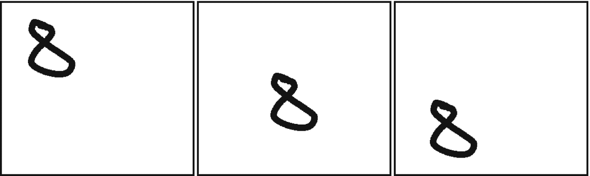

图 2-1

CNNs 允许平移方差；例如，手写数字“8”即使在图像内部移动后仍然是“8”。这个概念帮助网络更有效地学习如何处理图像，而不是简单地应用具有隐藏层的普通神经网络模型。

例如，如果我们想让模型能够学会识别图像中的猫是什么，无论猫在图像中的位置如何，它都具有模型应该学习的相同特征：如何识别毛发、猫耳朵、尾巴等。

在卷积神经网络（CNNs）中，输入图像通过通常被称为滤波器或核的部分，这部分在网络中充当特征检测器。你可以将这些特征检测器想象成试图学习图像中的边缘、形状或模式等特征。这是通过将特征检测器应用于图像的一个区域，通过滑动窗口的方式逐个区域应用，并将这个卷积操作的结果保存到所谓的卷积图像或特征图中完成的。CNNs 具有前面提到的平移不变性属性，因为滤波器共享应用于每个图像块相同的权重，这些权重在应用后形成卷积图像。神经网络中卷积层的深度对应于该层使用的滤波器数量。

通过使用池化层进行的一种下采样形式用于减少通过的数据大小，并移除网络在该阶段已经学会反应的潜在冗余方面。例如，“最大池化”层简单地从每个图像窗口的卷积图像输出中取最大值，如图 2-2 所示，其中步长表示窗口跳动的像素数。卷积和池化层以多种组合使用，将输入图像转换为一个数组，然后输入至少一个全连接层，该层将预测输出类别，如图 2-3 所示。全连接层简单地作为分类器来预测输出类别。

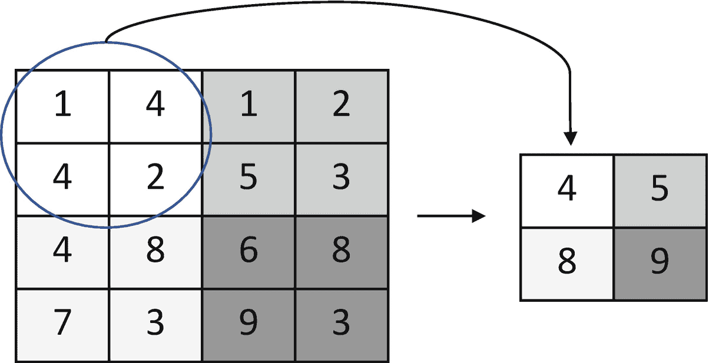

图 2-2

使用 2x2 滤波器和步长为二的池化操作

换句话说，卷积神经网络（CNNs）可以从概念上分为两个主要部分，这两个部分是共同优化的：

1.  自动特征提取器创建隐藏特征状态——代表对分类相关的图像方面的特征——由卷积层和池化层等层组成。

1.  分类器是一个由至少一层组成的全连接神经网络，用于对隐藏特征状态进行分类。

CNNs 的自动特征提取部分使网络能够学习图像的边缘和形状等特征，而无需显式编程网络来计算这些特征，如使用尺度不变特征变换（SIFT）等算法所做的那样。

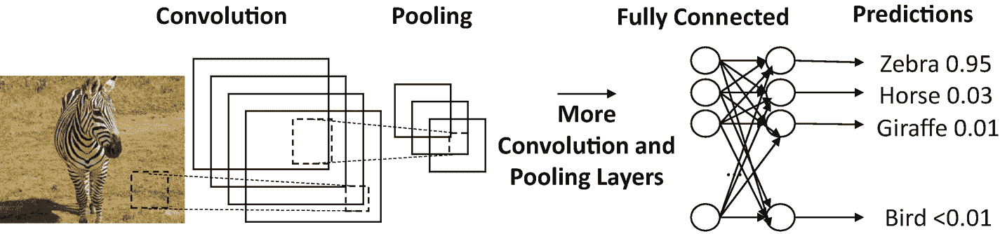

图 2-3

卷积神经网络（CNNs）的基本构建块

重要的是，CNNs 通过使用称为反向传播的概念，在大量标记数据上训练网络以自动学习滤波器的值（“特征检测器”），并持续改进网络中的权重，直到分类误差最小化。在网络的前几层，网络通常创建看起来像是在识别图像的边缘、基本形状和颜色等特征的滤波器。随着层级的深入，网络学习越来越复杂的模式，直到所有这些模式组合起来可以帮助网络学习输入的分类。

有许多方法可以组合卷积层、池化层和全连接层等 CNN 的基本构建块，以及其他方面，如步长（过滤器在图像上滑动的像素数）、dropout（用于减少过拟合）以及引入非线性到网络并处理每一层输出的激活函数类型。还有许多方法来训练和制定网络，大量研究集中在如何设计层、连接以及深度与宽度等方面。更多细节和示例代码可以在第六章中找到，因此我们只简要描述了概述深度学习所需的基本知识，以及理解第三章中将要讨论的一些与 CNN 相关的趋势。

### 循环神经网络

RNN 直接利用序列信息。传递给网络的序列可以在输入、输出，甚至两者都是。RNN 通过所谓的“状态”或“记忆”处理数据序列。与 CNN 不同，CNN 是前馈网络，RNN 在网络结构中包含循环，如图 2-4 和图 2-5 所示。然而，请注意，CNN 越来越多地被证明在分析序列信息方面也很有用，这在第七章中将有更详细的说明。

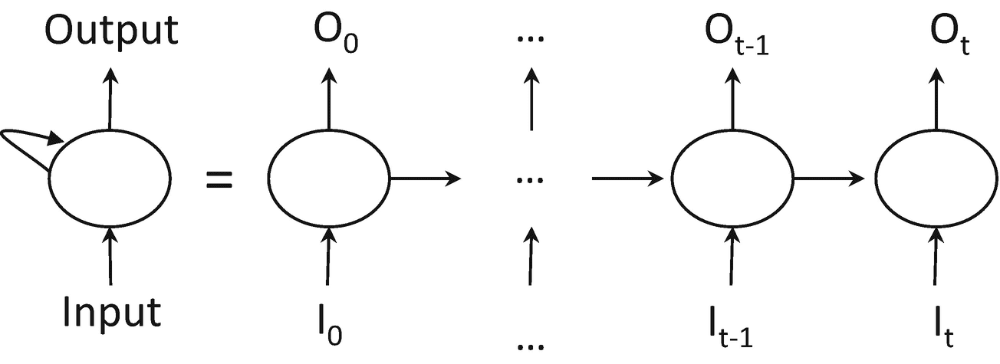

图 2-5

RNN 在序列上处理信息。通常这个序列代表时间上的信息，因此 RNN 中的循环可以被“展开”，以看到在给定时间点的输出是之前时间点输入的函数。

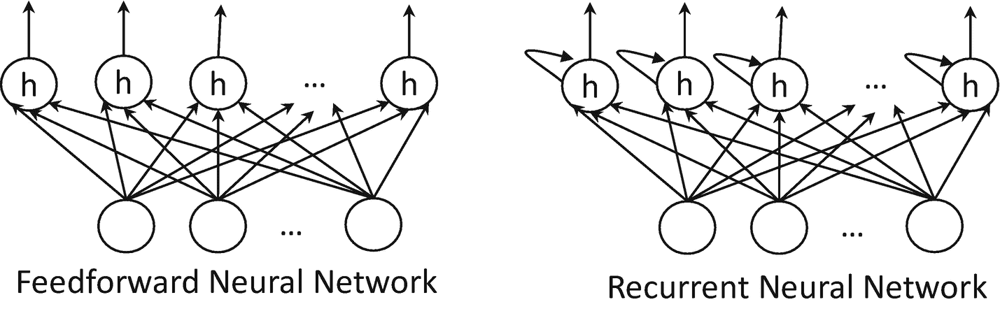

图 2-4

循环神经网络在网络结构中有一个循环，并处理序列数据

RNN 在许多自然语言处理任务中取得了成功，因为句子中一个词的意义取决于它周围的词。RNN 在其他应用中也很有用，如时间序列预测、语音识别和手写识别。

一个“香草”循环神经网络（RNN）通过在每个步骤应用递归公式，使用单个“隐藏”向量处理一系列向量。这个公式同时考虑了当前向量和之前的状态。已经提出了 RNN 的变体，它们能够更好地处理更长的序列，例如长短期记忆网络（LSTMs）。关于 RNN 的更多细节以及示例代码可以在第七章中找到。

在图 2-6 中，展示了 CNN 和 RNN 在自动生成 PowerPoint 文件中粘贴的图像的 alt 文本中的图像描述的示例应用。CNN 用于分类图像中的对象，而 RNN 用于根据这些对象生成句子描述。

图 2-6

通过使用 CNN 和 RNN，自动为 PowerPoint 中的图像创建描述。

### 生成对抗网络

GANs（生成对抗网络）是深度学习领域的一项较新进展，它实际上通过训练两个相互竞争的独立网络模型来解决给定问题（Goodfellow et al., 2014）。近年来，GANs 展现出巨大的潜力，并在各种场景中得到应用，从图像合成、提升图像质量（超分辨率）、图像到图像的翻译，到文本到图像的生成，以及更多。此外，GANs 是 AI 在艺术、音乐和创造力等领域应用进步的基础（例如，音乐生成、音乐伴奏、诗歌生成等）。

GANs 正在成为无监督学习和半监督学习的有力技术。一个基本的 GAN 包括以下内容：

+   生成模型（即生成器）生成一个物体。生成器对真实物体一无所知，通过与判别器交互来学习。例如，生成器可以生成图像。

+   判别模型（即判别器）确定一个物体是真实的（通常表示为接近 1 的值）还是虚假的（表示为接近 0 的值）。

+   判别器向生成器提供对抗性损失（或错误信号），使得生成器能够生成尽可能接近真实对象的物体。

关于 GANs 的更多细节和示例代码包含在第八章中。

我们预计，在未来几年中，GANs 将变得更加流行，即使在创意应用之外，因为它们有潜力解决如何创建无监督学习方法，这将极大地扩展机器学习应用的范围。如今，这些类型的模型训练时间很长，而且调优难度很大，我们预计研究将继续推进这些网络在实际应用中的实用性。随着这类技术在现实世界中的应用越来越多，质量得到提升，并扩展到更多媒介，如视频，我们相信将会有更多关于它们使用的争议出现。例如，无法区分真实内容与虚假内容的后果非常深远，媒体中已经有一些例子被突出报道，如将几乎逼真的虚假文字插入到政治家讲话的视频中（Metz & Collins, 2018）。

### 自动编码器

自动编码器是另一种前馈网络类型，并被用于诸如降维、异常检测和学习生成模型等应用。这些神经网络模型包含一个输入层、一个输出层，以及至少一个位于两者之间的隐藏层。重要的是，自动编码器的输入层和输出层拥有相同数量的单元，因此其目的是重建输入层的原始值。当然，这些设计成不会完全复制输入数据，而是受到限制，只能近似学习，例如，其维度比输入数据小，例如。因此，自动编码器学习与重建输入数据最相关的属性。因此，它们在无监督学习应用中非常有用，在这些应用中，没有预测的目标值或用于输入到另一个算法的特征学习。它们在许多应用中显示出希望，例如推荐系统（Kuchaiev & Ginsburg, 2017）。

## 深度学习工作流程

对于许多人工智能项目，深度学习技术通常被用作构建从图像分类和目标检测到图像分割、图像相似性和文本分析（例如，情感分析、关键词提取）等创新解决方案的基石。通常，人们会问，“我如何在我的团队中开始使用深度学习？”要开始使用深度学习，了解深度学习项目中使用的工具和技术以及构建解决方案的工作流程是非常重要的。

对于一个创新解决方案的商业需求，数据科学家需要将其映射到一个或多个深度学习任务。例如，假设一家零售业务希望为移动设备创建一个端到端客户购物体验，客户可以拍摄衬衫或连衣裙的照片，然后运行在移动设备上的应用程序可以将其与购物目录中的衬衫和连衣裙相匹配。为了实现这一点，数据科学家将其映射到一个图像相似性问题：取一个新的输入图像，并将其与目录中的所有衬衫和连衣裙进行匹配。前 N 个图像将被返回到移动应用程序。在与应用程序开发者合作的过程中，还需要解决其他要求，例如识别和裁剪图像，仅保留穿着衬衫或连衣裙的人，例如。这需要使用目标检测和图像分类。

一旦确定了深度学习任务，典型的深度学习工作流程将包括以下步骤：

1.  确定相关数据集。

1.  预处理数据集。

1.  训练模型。

1.  检查模型的性能。

1.  调整模型。

1.  部署模型。

1.  迭代并收集更多数据以实现重新训练。

### 寻找相关数据集。

大多数想要开始深度学习项目的公司通常在尝试找到他们可以用于为特定业务场景训练深度学习模型的相应数据集时遇到困难。此外，数据集还需要进行标记。例如，为了训练一个卷积神经网络（CNN）来识别服装类型（例如，Polo 衫、T 恤、连衣裙、牛仔裤），需要一个包含服装图像的数据集，其中标签表示图像是衬衫、连衣裙、T 恤还是牛仔裤。这些图像可以来自现有的产品目录、公共图像数据集（例如，来自 ImageNet、CIFAR-10、Deep Fashion 的多样化图像集）以及从各种网站上抓取。

如果数据尚未可用，数据科学家通常会使用搜索引擎（图 2-7）来对特定类别（例如，牛仔裤）进行图像搜索，其中图像所有者已将图像标记为可用于商业用途。

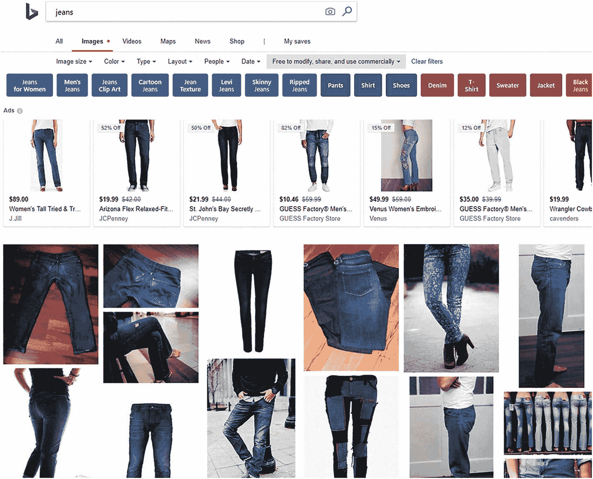

图 2-7

使用 Bing 进行图像搜索返回的结果

### 数据集预处理

在数据科学家获取相关图像数据集后，他们需要为训练准备这些数据。通常，许多现实世界的图像数据集是不平衡的（通常称为少数类问题）。这意味着可能存在更多特定类别的图像（例如，Polo 衫），而另一类别的图像（例如，T 恤）则较少。为了解决不平衡数据集问题，数据科学家会应用各种技巧来增加少数类别的图像数量或从更频繁的类别中进行下采样，直到达到平衡。

另一种常用的预处理技术是数据增强，以帮助模型在多种条件下泛化，提高其对旋转、平移和缩放等方面的不变性。这包括对图像应用各种变换，如缩放、旋转、随机裁剪图像、翻转图像、调整亮度和对比度等。不同的深度学习框架支持各种数据增强功能。

### 训练模型

在数据集预处理和准备完成后，数据科学家准备开始设计深度学习模型架构并训练模型。使深度学习模型建模和训练有效的关键要素是（1）选择深度学习工具包，以及（2）使用如 GPU 等硬件进行训练。这一点将在本章下一节中更详细地讨论。

根据数据集的大小，模型可以在本地机器（例如，笔记本电脑、PC、Mac）上训练，或者使用公共云中可用的基础设施，如 Microsoft Azure。Azure 提供了带有 Nvidia GPU 的 NC 系列虚拟机（VM），以及一个名为 Azure Batch AI 的托管服务，它使您能够轻松地扩展和缩减深度学习作业所需的 GPU。这将在第四章和第九章中更详细地介绍。

### 验证和调整模型

在深度神经网络的训练过程中，有几个关键指标可以提供关于每个 epoch 的学习效率和模型质量的信息。epoch 指的是训练数据集的完整遍历。两个常用的指标是：(1) 损失函数，以及(2) 训练和验证准确率。

通过在每个 epoch 评估损失函数，可以评估每个 epoch 结束时模型的质量。较低的损失是一个更好的模型的良好指标。在学习过程开始之前就设置了多个超参数——学习率是一个重要的超参数，它可以对模型的结果产生重大影响。通过绘制损失（y 轴）和 epoch（x 轴），可以了解学习率是否设置得当：一个好的学习率可以在较短的时间内导致较低的损失。通常，学习率会跟踪训练和验证数据集。然而，确保模型没有过拟合训练数据也很重要。图 2-8 展示了不同学习率的示例。在实际应用中，学习率曲线通常不是平滑的，并且可以根据需要修改训练过程中的学习率。这仅仅是训练深度学习模型过程中所需验证和调整类型的一个例子。

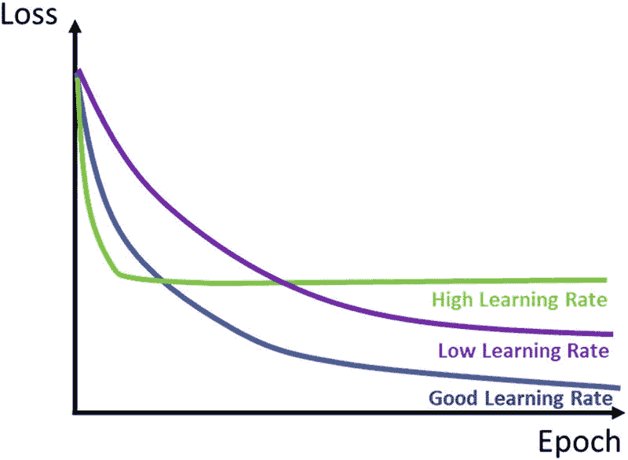

图 2-8

不同的学习率。插图灵感来源于斯坦福 cs231n 课程，可在[`http://bit.ly/StanfordCS231n`](http://bit.ly/StanfordCS231n)找到。

常见的第二个指标是训练和验证准确率。通过绘制准确率（y 轴）和 epoch（x 轴），可以了解模型是否过拟合了训练数据集。如果训练和验证准确率曲线彼此接近，则几乎没有过拟合发生。如果训练和验证曲线相距较远，则发生了过拟合，重要的是要重新审视模型，因为它如预期的那样不能推广到新数据。图 2-9 展示了如何通过查看训练和验证数据集的准确率曲线来识别过拟合。

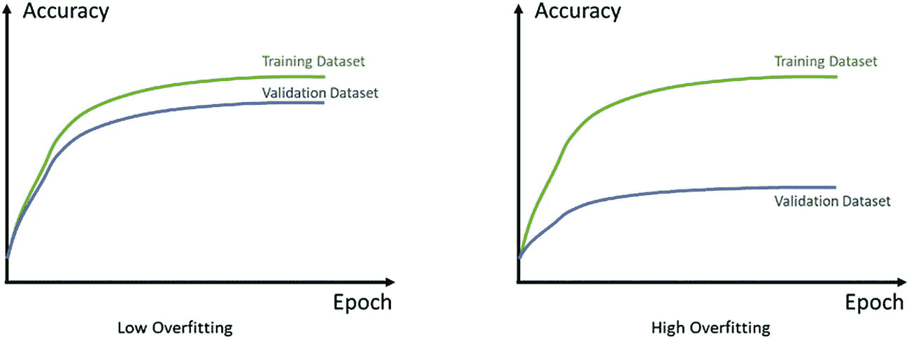

图 2-9

使用训练和验证准确率识别过拟合

### 部署模型

一旦模型的质量达到了解决方案的要求，下一步就是部署它。如今，深度学习模型可以部署到云端作为 REST API，按预定时间表批量运行，部署到移动设备（例如，iPhone、Android 手机、iPad 等）或边缘设备（例如，物联网[IoT]网关）。这取决于你如何考虑使用训练好的深度学习模型。例如，如果你正在开发一个 Web 应用程序，并使用 AI 来丰富它，那么将你的深度学习模型作为 REST API 进行操作是有意义的，这样 Web 应用程序可以轻松地消费它。如果你正在开发一个移动应用程序，你应该考虑连接和断开连接的场景，以及延迟要求。你可以在移动设备上离线运行模型，或者有一个混合模型，其中既有在设备上运行的模型组合，也有在云端提供更强大功能的 REST API。

要将深度学习模型部署为 REST API，有几种选择。你可以利用 Azure 机器学习操作服务（本书后续章节将详细介绍）在 docker 容器中托管模型，并公开一个或多个 REST 端点，或者你可以构建自己的托管堆栈（例如，使用 Flask，由高性能的 Web 服务器如 NGINX 支持）。你同样可以轻松地将这个托管堆栈部署在 Microsoft Azure 上。根据场景的不同，你可能需要在预定的时间表上在大批量数据上以批处理模式运行模型。硬件类型，如 GPU，也是一个需要考虑的相关因素。更多细节将在第十章中讨论。

关于一般数据科学工作流程的考虑，包括深度学习项目，我们建议使用 Microsoft Team Data Science Process，可在[`http://bit.ly/MSFT_TDSP`](http://bit.ly/MSFT_TDSP)找到。这包括数据科学生命周期的概述，建议的标准项目结构和基础设施，以及数据科学项目的资源。

### 深度学习框架与计算

如前所述，进行深度学习训练的两个关键要素是（1）使用深度学习框架，以及（2）使用 GPU 进行训练。通过 CUDA 和 OpenCL 等框架，特别是通过矩阵乘法的有效使用，通用计算在 GPU 上得到了加速。这些框架使得在 CUDA 之上构建深度神经网络的高级库，如 cuDNN 成为可能；cuDNN 是流行深度学习库的基础。

现在有 Tensorflow、PyTorch、CNTK、MXNet 和 Caffe2 等许多流行的深度学习框架，以及流行的更高级 API，如 Keras 和 Gluon。深度学习工具包的选择取决于许多因素，包括良好的教程和现有模型架构和预训练模型的实现，公司中 AI 人才的技能组合，工具包在表达复杂深度神经网络方面的灵活性，内置辅助功能的可用性（例如，丰富的数据增强和转换 API 集），有效利用 CPU 和 GPU 的能力，以及执行分布式训练的能力。

我们推荐在[`http://bit.ly/DLComparisons`](http://bit.ly/DLComparisons)上可用的深度学习比较仓库，以了解在几个常见场景中不同深度学习框架之间的差异，示例框架如图 2-10 所示。此仓库有几个明确的目标：

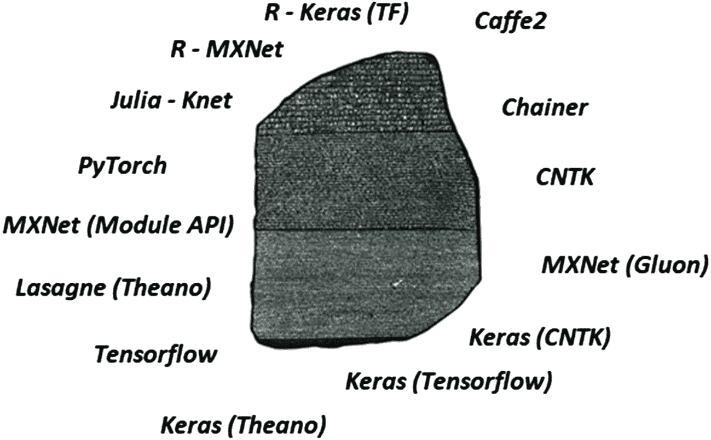

图 2-10

我们推荐 GitHub 上可用的深度学习框架“罗塞塔石碑”[`http://bit.ly/DLComparisons`](http://bit.ly/DLComparisons)，其中提供了用于运行深度学习代码的不同版本的 Azure GPU VM 的计时信息。

1.  深度学习框架的“罗塞塔石碑”，允许数据科学家轻松地将他们的专业知识从一个框架转移到另一个框架。

1.  使用最新最高级 API 优化的 GPU 代码。

1.  在不同 GPU（可能包括 CUDA 版本和精度）之间进行比较的常见设置。

1.  在不同语言（Python、Julia、R）之间进行比较的常见设置。

1.  验证自己安装的预期性能的可能性。

1.  不同开源社区之间的合作。

仓库中的比较并不旨在暗示不同框架的整体性能，因为它们省略了重要比较，例如仅以预训练模型为例的可用性。然而，它们提供了一个很好的起点，用于比较许多常见场景中的许多流行框架。

注意

Keras 正成为流行的深度学习库，这得益于其提供高级抽象以建模深度神经网络的能力，以及选择不同后端（例如，TensorFlow、CNTK、Theano）的灵活性。

2017 年，Facebook 和 Microsoft 宣布了 ONNX 开源格式，用于深度学习模型，以使数据科学家能够在一个框架中训练模型，但在另一个框架中部署它，例如。自宣布以来，其他公司和流行框架的开发者已加入这一开源互操作性标准努力，以在框架之间传输深度学习模型。还有一些包允许直接从一种框架转换为另一种框架，例如 MMdnn，它帮助用户直接在不同框架之间转换，并可视化模型架构。

许多深度学习库也包含各种机器学习算法。大多数深度学习库支持分布式训练，这对于大规模进行深度学习非常有帮助。大多数深度学习库都有 Python 包装器。如果你是 R 用户，你也可以使用一些深度学习库的 R 接口（例如，TensorFlow、Microsoft Cognitive Toolkit [CNTK]、Keras 等）。在这本书中，我们专注于使用这些库来建模深度神经网络。图 2-11 展示了几个深度学习库，以及 GitHub 上的代码活动。

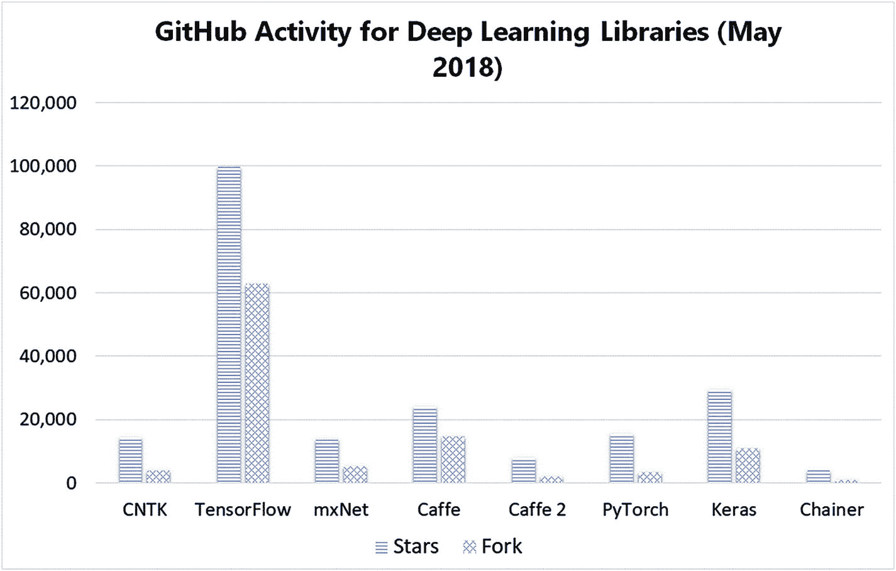

图 2-11

深度学习库的 GitHub Stars/Fork

虽然这本书中的大多数示例都使用了 TensorFlow，但 Microsoft AI 平台支持任何开源框架。此外，我们还包含了一些使用其他框架的示例，例如在第九章中，我们提供了一个教学示例，展示了如何使用 Microsoft Batch AI 服务通过许多不同的深度学习框架训练 CNN 模型。

GPU 使得在合理的时间内训练深度学习模型成为可能。近年来，算法创新和更快 GPU 的可用性使得深度学习模型的训练可以快速完成。例如，使用公开可用的 ImageNet 数据集训练 ResNet-50 这样的 CNN 模型，在 2017 年之前需要 14 天或更长时间。在 2017 年几个月内，训练 ResNet-50 所需的时间显著减少，从一小时减少到大约 15 分钟。例如，Preferred Network 在 2017 年 11 月使用 1,024 个 P100 GPU 在 15 分钟内用 ChainerMN 训练了 ResNet-50 CNN 模型。

### 快速入门深度学习：迁移学习和领域自适应

为了快速启动深度学习解决方案，一个主要趋势是将先验知识构建到模型开发中，使其不仅仅从当前问题的数据中学习。这种做法通常通过计算机视觉中的迁移学习概念和自然语言处理中主要使用词嵌入的领域自适应来实现。

迁移学习在计算机视觉任务中特别有用，例如图像分类和目标检测。基本思想是我们希望能够将我们的学习从一个应用迁移到另一个应用。迁移学习使数据科学家能够快速适应现有的预训练模型（例如，AlexNet、ResNet-50、InceptionV3 等）以适应新的领域。例如，一个 CNN 可以在包含数百万个示例的大 ImageNet 数据集上训练。这个 CNN 随后内部持有如何处理图像的良好表示，例如如何检测边缘、形状和模式以区分对象。因此，我们希望能够使用这种知识，即网络权重中捕获的知识，在数据量显著较少的分类场景中使用，例如在零售网站上区分衬衫的类型，或者通过在制造装配线拍摄的图像区分缺陷和非缺陷等。

因此，为了启动计算机视觉中的深度学习项目，我们建议数据科学家利用使用公开数据集（如 ImageNet、CIFAR-10 和 COCO）训练的预训练模型。这些数据集包含数百万张图像（来自不同的领域），并且由各自的研究实验室（通常通过众包努力）精心整理，并标注了类别标签。

预训练模型用于启动图像分类、目标检测和图像分割问题。这些在大图像数据集上训练的预训练模型被用作新图像的特征化器，或者进一步微调以适应特定领域的图像（例如，医学 X 射线图像、PCB 电路板图像等），以提高预测质量。表 2-2 显示了不同类型的迁移学习。表 2-3 显示了每种迁移学习类型所需的输入和输出初始化。

表 2-3

使用迁移学习初始化深度学习模型的输入和输出

| 类型 | 如何初始化特征化层 | 输出层初始化 |
| :-- | :-- | :-- |
| 标准 DNN | 随机 | 随机 |
| 无头 DNN | 使用另一个任务学习 | 分离的机器学习算法 |
| 微调 DNN | 使用另一个任务学习 | 随机 |
| 多任务 DNN | 随机 | 随机 |

表 2-2

不同类型的迁移学习

| 类型 | 迁移学习如何使用？ | 如何训练？ |
| :-- | :-- | :-- |
| 标准 DNN | 无 | 联合训练特征化和输出 |
| 无头 DNN | 使用相关任务学习 | 使用单独的机器学习算法 |
| 微调 DNN | 在相关任务上学习和微调特征 | 使用小学习率联合重新训练特征化和输出 |
| 多任务 DNN | 需要解决许多相关任务的特征 | 在两个任务之间共享特征化网络 |

预训练模型也加速了自然语言处理的发展，但在此情况下，通常是在训练深度学习模型中称为词嵌入的词语表示的过程中。退一步说，在自然语言处理中，词语通常通过 one-hot 编码来表示，其中每个词语由一个与词汇表大小相等的向量表示；所有值都是零，除了对应于词汇表中该词语位置的值，其值为 1。模型需要每次从手头的问题数据中从头开始学习，以了解如何处理词语以及它们在特定自然语言处理任务中的含义。相比之下，词嵌入是低维向量，编码了词语的语义意义，在嵌入向量空间中将语义相关的词语编码得彼此靠近。

重要的是，词嵌入可以在大量未标记的数据上进行训练，并且许多预训练的词嵌入模型可供其他自然语言处理任务使用。通过使用预训练的词嵌入，例如在 Google 新闻上训练的词嵌入，关于词语之间相互关系的知识就被嵌入到使用它们的模型中。

使用所谓的 word2vec 算法（如 Skip-Gram 和 CBOW）学习词嵌入向量。这些是简单的神经网络模型，旨在预测每个词语周围窗口中的词语。其概念是语义相关的词语将在相似语境中出现，从而获得相似的向量表示。当然，特定领域的词嵌入可能有助于更好地在模型中表示词语，并且最近的研究也集中在如何允许自然语言处理应用之间更好的领域自适应上。

### 模型库

许多深度学习库都提供了预训练的深度神经网络。例如，微软的 CNTK 和 TensorFlow 为多个最先进的卷积神经网络（AlexNet、GoogLeNet、ResNet 和 VGG）提供了预训练模型。Caffe 的模型库提供了 40 个以上最先进的卷积神经网络（ResNet、Inception、VGG 等）的丰富预训练模型，并支持各种场景（例如，汽车型号识别、识别不同的地标和地点、场景识别等）。Google Word2Vec 是一个流行的预训练词嵌入模型，有许多可用的教程。

您可以使用这些预训练模型来快速启动您的深度学习项目，或者进一步微调网络以适应您的业务场景。这通常会在一个多样化的数据集上训练基础模型时节省大量的时间。

更多信息

了解更多关于示例预训练模型的信息：

CNTK 预训练图像模型：[`bit.ly/CNTKModels`](http://bit.ly/CNTKModels)

TensorFlow 官方模型：[`bit.ly/TensorflowModels`](http://bit.ly/TensorflowModels)

Caffe 模型库：[`bit.ly/CaffeModels`](http://bit.ly/CaffeModels)

Tensorflow Word2Vec: [Tensorflow Word2Vec](http://bit.ly/TensorflowWord2Vec)

## 摘要

本章简要介绍了几种常见的神经网络类型，包括 CNN、RNN 和 GAN，这些将在后面的章节中详细讨论，并附有示例代码。我们还讨论了深度学习的工作流程，启动深度学习项目的细节以及可以用于开发和训练深度神经网络的库。为了帮助快速启动深度学习项目，数据科学家和开发者可以利用预训练模型作为特征化的基础，或者使用它们来进一步定制和微调以适应您的业务领域。在下一章中，我们将讨论深度学习领域的一些趋势以及这种建模方法的局限性。

# 3. 深度学习趋势

本章讨论了深度学习及相关领域的一些趋势。我们具体讨论了哪些趋势可能对哪些任务有用，以及讨论了一些可能具有深远影响但尚未应用于许多现实世界问题的方法和想法。我们最后简要介绍了深度学习的当前局限性以及一些似乎对未来人工智能应用有希望的 AI 领域，并简要讨论了深度学习应用的伦理和法律影响。

## 网络架构的变体

深度学习领域的第一个趋势之一是构建具有更多层的更深层网络来解决日益复杂的问题。然而，训练这样的深层网络是困难的，因为它们更难优化，准确率可能会下降而不是提高。正如第一章中提到的，微软在 2015 年发布了一种基于残差学习概念的网络结构，称为 ResNet（He, Zhang, Ren, & Sun, 2015）。这种结构不是试图学习网络中输入和输出之间底层关系的直接映射，而是学习两者之间的差异或残差。有了这个概念，网络的训练深度可以比之前使用的深度大得多，一个 152 层的网络在 2015 年 ImageNet 数据集的 ILSVRC 竞赛中获胜。另一类称为 Inception 的网络则侧重于宽架构，其中并非所有层都是简单地顺序堆叠，旨在提高神经网络模型的表现力和计算效率（Szegedy, Liu, et al., 2014）。

注意

为了加速开发，从业者应利用研究社区中的网络架构，如 Resnet-152，而不是从头开始构建和训练 CNN。

### 残差网络及其变体

近年来已经提出了许多网络架构，并且这种趋势继续导致更多的网络架构选择。许多架构依赖于对 ResNets 的修改，例如 ResNeXt、MultiResNet 和 PolyNet（Abdi & Nahavandi, 2017；Xie, Girshick, Dollár, Zhuowen, & He, 2017；Zhang, Li, Loy, & Lin, 2017）。同时，也考虑了结合不同类型的方法，例如 Inception-ResNet（Szegedy, Ioffe, & Vanhoucke, 2016）。相比之下，FractalNet 是一个深度非常深的架构，它不依赖于残差（Larsson, Maire, & Shakhnarovi, 2017）。

### DenseNet

DenseNet 是另一种流行的网络结构，其中每一层都连接到所有其他层；它的流行之处在于它通过特征重用允许显著减少参数数量，同时缓解了与网络训练相关的问题，即梯度消失（G. Huang, Liu, van der Maaten, & Weinberger, 2018）。

### 小型模型，参数更少

与 DenseNet 中参数数量的减少相关，CNN 中的另一个趋势是创建更多基于较少参数和更小模型尺寸的更高效网络。一般来说，更大的网络能够实现更准确的预测，但有一些巧妙的方法可以创建架构和进行模型压缩，以实现接近或与较大网络相当的性能。因此，这些网络可以运行得更快，并且需要更少的处理能力，这在计算能力和存储空间有限的嵌入式和移动设备上尤其有用。

SqueezeNet，由 Iandola 等人（2016）提出，其描述为具有与 AlexNet 相似的准确度，但参数数量减少了 50 倍，模型尺寸小于 0.5 MB，使用深度可分离卷积来减少参数数量。MobileNet 是另一个专为移动和嵌入式视觉应用设计的例子（Howard 等人，2017），最近已经扩展到 MobileNetV2。除了设计高效的较小网络外，还可以考虑从现有的深度网络中剪枝权重、剪枝滤波器以及在网络中量化权重（Mittal, Bhardwaj, Khapra, & Ravindran, 2018）。例如，通过剪枝 VGG16 架构中的某些连接，可以将尺寸减少 49 倍，而不会修改模型的预测（Han, Mao, & Dally, 2016）。

在实践中，我们建议数据科学家尝试许多基于当前研究而提供的网络结构，这些结构通常通过模型动物园和不同的深度学习框架获得，正如第二章所述。数据科学家必须尝试不同的选项，并考虑特定数据集和问题所需的训练容易程度和模型评分速度之间的权衡。

### 胶囊网络

卷积神经网络（CNNs）是一种出色的架构，也是神经网络复兴的关键原因之一。正如之前提到的，CNNs 基于平移不变性的原理工作。然而，这种平移不变性是有限的，并且它们存在一些显著的缺点，这源于它们没有很好地处理其他平移，例如输入的大小、光照和旋转，如图 3-1 所示。通常，这可以通过提供许多示例、通过添加平移和一般修改的示例来增强数据，以及如前所述，使用池化层来克服。

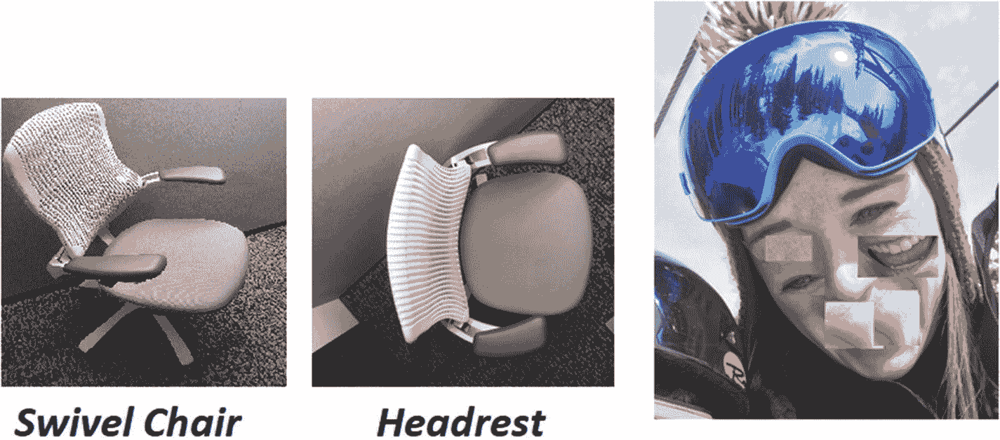

图 3-1

CNNs 不构建对象的内部表示，因此在从不同角度观察对象时难以理解对象，并且当对象的部分顺序出错时可能会被欺骗。在这种情况下，模型认为从上方看相同的椅子是不同的对象，即使脸部的某些部分被移动，它也会认为脸部是人的脸。胶囊网络旨在使用逆图形的思想以更自然的方式解决此问题。

通常，CNNs 并不内在地关注图像中项目之间的空间和方向关系；它们只关心这些特征是否存在。高级特征仅仅是低级特征的组合。此外，CNNs 使用减少数据空间维度的方法，从而实际上增加了感受野，即高级节点的视野。这使得节点能够在输入图像的更大区域内检测高级特征。实现这一目标的一种方法是最大池化，我们在第二章节中解释了这种方法。然而，通过使用最大池化，CNNs 会失去空间上的锐度。因此，Hinton 将最大池化视为一种禁忌，因此他试图设计一种新的架构，即胶囊网络（Sabour, Frosst, & Hinton, 2017）。

胶囊网络受到逆图形思想的启发。在传统图形中，我们描述一个对象及其姿态参数，并通过渲染过程，在屏幕上显示该对象。在逆图形中，我们希望观察一个场景，并从中推断出对象及其姿态。

胶囊网络中的胶囊试图预测场景中特定位置特定对象的呈现和属性。胶囊输出向量而不是标量，向量的长度编码了在该特定位置存在该对象的估计概率，而方向编码了对象的姿态参数。

线性网络也使用了一种在层之间传递信息的新方法，称为动态路由。这意味着路由不是事先固定的，而是在执行过程中动态确定的。Sabour、Frosst 和 Hinton（2017）提出实现这一方法的方法被称为基于协议的路由。胶囊网络的架构与 CNN 的架构非常相似：胶囊层依次排列，较低级别的胶囊检测到较低级别的特征，而高级胶囊将这些特征组合起来以创建高级特征。在基于协议的路由中，较低级别的胶囊输出 n 维向量，其长度编码了对象检测的概率及其在 n 维空间中的方向。随后的胶囊层接收所有这些胶囊的输入，然后通过迭代过程确定输入的权重。本质上，每一层的姿态参数估计与下一层的姿态参数相匹配。匹配越接近，后续胶囊之间的权重就越高。向量的标量积被用作相似度的度量。这意味着胶囊之间的权重不是静态的，而是根据现有的胶囊向量而变化。

胶囊网络已经展示了最先进的结果，并且由于它们的姿态不变性，比 CNN 需要更少的训练示例。然而，由于动态路由的迭代性质，它们的训练仍然缓慢，并且它们仍然需要在目前由 CNN 主导的所有计算机视觉领域证明自己。

### 目标检测

深度学习中的另一个趋势是使用元架构，在先前解决方案的基础上构建以解决其他类型的问题。例如，在分析图像时，CNN 的思想和部分被用作图像分类问题之外的骨干，以解决目标检测和图像分割等问题。例如，目标检测中的一个基础模型是 R-CNN 模型，它简单地提出使用区域提议方法（如选择性搜索）将每个图像外部裁剪到模型中，然后基于 CNN 模型从每个裁剪图像中提取特征，最后使用支持向量机模型（SVMs；Girshick, Donahue, Darrell, & Malik, 2013）对每个裁剪图像进行分类。在目标检测中，趋势是使用最新的网络架构作为特征提取器，同时也出现了改进的元架构以及改进的性能方法。例如，Faster R-CNN 和 R-FCN 是替代元架构，它们也基于标准 CNN 构建，但在训练期间使用“锚点”预测边界框，这些锚点是覆盖在图像不同位置、尺寸和宽高比上的框（Ren, He, Girshick, & Sun, 2015; Dai, He, & Sun, 2016）。

YOLO 方法（只看一次：统一实时目标检测；见图 3-2）使用了一个简单的 CNN，将其应用于整个图像（Redmon, Divvala, Girshick, & Farhadi, 2015）。YOLO 是第一个将实时目标检测作为回归问题而不是分类问题（带有边界框）来处理的方法，从而使得实时目标检测成为可能。YOLO 通过将目标检测视为边界框和关联类概率的回归问题，而不是分类问题，实现了实时目标检测的实用化。最近还发布了其他相关方法，如 SSD、MultiBox 和 YoloV2，这些方法在提供运行速度更快的模型的同时，旨在保持良好的准确率水平（Liu et al., 2015; Redmon & Farhadi, 2016; Szegedy, Reed, Erhan, Anguelov, & Ioffe, 2014）。

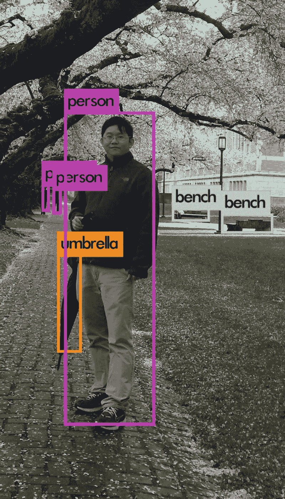

图 3-2

使用 YOLO 将预训练的目标检测模型应用于寻找对象

在实践中，根据应用是否需要实时性能等要求，可能需要在设置解决方案以获得结果准确性或推理速度之间做出权衡。不同的元架构、训练期间做出的选择，如用作特征提取器的 CNN 架构、图像分辨率、硬件和软件，使得对理想方法的广泛概括变得困难（J. Huang et al., 2017）。

### 目标分割

许多最近的研究探讨了如何减少目标检测中对边界框的需求，并探讨了如 LinkNet 等分割神经网络模型，以及用于其他视觉任务（如 CortexNet 用于识别图像中的动作而不是对单帧进行分类）的更专业化的网络（Culurciello, 2017）。Mask R-CNN 和密集目标检测的 focal loss 是目标检测领域的其他最近趋势，Facebook AI Research 在名为 Detectron 的软件系统中开源了这些技术，因此可以在 Microsoft AI 平台上运行（He, Gkioxari, Dollar, & Girshick, 2017; Lin, Goyal, Girshick, He, & Dollar, 2017）。这标志着目标分割领域真正令人兴奋的进步！

### 更复杂的网络

本章讨论的网络类型只是深度学习广泛空间中的一些例子。还有许多方法可以制定深度神经网络，以及将它们与其他方法结合到更广泛的解决方案中。例如，在语音翻译领域，微软研究院最近在 2014 年的一个大型基准数据集上取得了最先进的结果，即英语-法语翻译活动，该活动可在[`http://bit.ly/2EzMeRY`](http://bit.ly/2EzMeRY)找到，使用了一种被称为“审议网络”的方法（Tian, 2017）。这个网络建立在简单的 LSTM 架构之上，结合了受人类审议过程启发的双学习。前提很简单：第一次解码器对句子进行初步处理，类似于创作草稿，而第二次解码器则将原始输入和草稿作为输入，以得到最终解决方案。这只是其中一个例子，还有许多其他将深度学习技术与其他方法结合或作为更大解决方案一部分的例子。

与卷积神经网络（CNNs）和循环神经网络（RNNs）类似，生成对抗网络（GANs）的类型和用途也经历了大幅增长。GANs 也已经有很多商业应用。例如，微软与 Getty Images 合作，后者提供股票照片，探索图像到图像的翻译，例如将阳光沙滩照片转换为阴天沙滩照片，为顾客提供更多选择（Liakhovich, Barraza, & Lanzetta, 2017）。微软研究院还基于 GANs 开发了一个“绘图机器人”，它能够根据仅有的文字描述创建图像，这些图像仅基于计算机的“想象力”（Roach, 2018）。为此目的提出的 AttnGAN 模型在 2018 年初能够超越之前最先进的模型，在行业标准测试中为文本到图像生成提供了近三倍的图像质量提升（Xu et al., 2017）。

### 自动化机器学习

近年来，机器学习（ML）领域引起人们兴趣的另一个领域是自动机器学习和智能超参数调整（Bergstra, Yamins, & Cox, 2013; Domhan, Springenberg, & Hutter, 2015; Fusi & Elibol, 2017; Golovin et al., 2017; Li, Jamieson, DeSalvo, Rostamizadeh, & Talwalkar, 2016）。这两个研究领域都试图利用历史信息、优化和元学习来自动或半自动地达到最优的机器学习流程、神经网络拓扑结构等。

另一项这样的工作集中在使用强化学习和 LSTMs 来创建新的神经网络架构（Zoph & Le, 2016）。强化学习（RL）是人工智能的一个子领域，旨在通过奖励反馈过程让软件代理自动确定最优行为以最大化性能。它是一种自动学习机制。到 2017 年底，由此产生的 CNN 架构 NASNet 在 CIFAR10 数据集上实现了最先进的成果，比之前的最佳模型快 1.05 倍。其他人最近专注于更有效的搜索机制，例如利用当前网络和重用训练好的网络权重（Cai, Chen, Zhang, Yu, & Wang, 2017）。随着计算速度的进一步加快和云计算基础设施的全面实现，我们预计未来在这个领域将看到更多的努力。

与架构搜索相关，神经进化领域最近在研究和工业界获得了更多的关注。这是人工智能的一个子领域，旨在理解和调用一个类似于在计算机中产生人类大脑中智能形式的进化过程。而 NASNet 和相关研究领域专注于尝试自动化网络的创建，而今天大多数深度学习应用都需要人类指定神经网络的架构。神经进化领域的学者们研究的是学习本身的过程，而不是有一个固定的网络架构是我们试图优化的目标。

神经进化研究人员已经发现了有趣的结果，我们相信这些结果将更强烈地影响未来人工智能的应用。神经进化中的一个例子是新颖性搜索的概念，即优化新颖性可能比优化直接结果提供更好的结果。Stanley（2017）通过尝试为机器人找到一个学习如何行走模型的例子来说明这一概念。人们可能会猜测，获得一个出色的行走机器人的最佳方法是将前一代最佳行走者的模型人工地结合起来。然而，第一代擅长行走的机器人可能只是不稳定地向前蹒跚。相比之下，尝试以规律模式摆动腿的机器人会立即跌倒，但可能在未来实现更稳健的行走，因此仅仅基于过去最佳者进行繁殖可能对未来的发展并不利。这个领域也极大地受益于今天可用的计算能力的提升，我们预计将看到更多在深度学习领域的进步和直接影响。

最近，从神经进化领域推导人工智能的算法和过程已被应用于深度学习架构搜索问题，并与导致 NASNet 的强化学习类型方法进行了比较。Real、Aggarwal、Huang 和 Le（2018）发现，在早期搜索阶段，正则化进化方法比强化学习表现更好，并且通常发现它们在不重新调整参数的情况下产生了相似或更高的准确度结果。从这个进化搜索过程产生的新架构称为 AmoebaNets，在 2018 年初为几个图像分类任务实现了最先进的结果。

## 硬件

深度神经网络涉及大量的计算，通常使用非常大的数据集来计算一个参数极其密集的模型的组成。最初设计用于在计算机上渲染图形的计算的 GPU，通过在 GPU 卡内实现高度并行性，加速了深度学习的使用。与 CPU 相比，GPU 可以为某些类别的应用提供更高的吞吐量和效率，包括深度学习训练和推理所需的计算类型。GPU 具有定义良好的指令集和固定的数据宽度（特定的精度整数和浮点值）。

如第二章所述，GPU 随着时间的推移变得越来越强大。例如，2017 年 5 月发布的 NVIDIA Tesla V100 声称比一年前发布的 P100 快 2.4 倍训练 ResNet-50 DNN（Durant、Giroux、Harris 和 Stam，2017）。此外，最近还有关于混合精度训练的研究，这允许减少内存消耗，从而缩短训练或推理时间（Micikevicius，2017）。

### 更专业化的硬件

硬件在向更专业化的方向发展，这体现在现场可编程门阵列（FPGAs）和应用特定集成电路（ASICs）在神经网络建模方面的专业化，正朝着更高效的专业化硬件发展，如图 3-3 所示。FPGAs 是集成电路，它们不像 GPU 那样具有预定义的指令集或固定的数据宽度。FPGA 加速通过让 FPGA 处理那些设计为通过硬件加速的极其计算密集型任务来实现，而 CPU 则处理其他操作。它们通过优化推理的数值精度来提供超低延迟计算的可能性，以及向新的机器学习应用领域演化的潜力。它们可以使用更少的电力运行低精度工作负载，从而比 GPU 运行成本低得多。

由于 FPGA 的可重构性和其对硬件和软件级别的访问，FPGA 技术的日益普及在 AI 领域是一个特别有希望的趋势。这对于其灵活性和专业化的折衷潜力尤其有希望。ASIC 对于它们设计的应用性能更好，但它们对通用计算没有用，因为它们在制造后不能重新配置。

换句话说，FPGA 比 ASIC 更灵活，因为它们可以被用于和重新用于除了深度学习和 AI 应用之外的工作负载，例如图分析、数据库加速和数据加密等。编程 FPGA 需要来自专用编译器的支持，而且比用于传统处理器的编译器要困难得多。

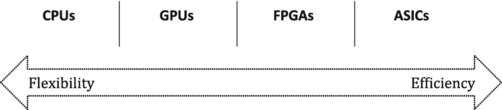

图 3-3

处理深度学习模型中计算任务的替代方案

### Azure 上的硬件

微软一直在投资专门硬件，用于他们自己的产品以及通过他们的 Azure 云计算平台供他人使用。例如，为了加速 Bing 的搜索排名算法，FPGA 被编程用于这一特定目的，结果在仅增加 10%功率的情况下实现了两倍的吞吐量（Feldman，2016）。2016 年，当微软准备发布作为第三方提供的功能时，在当时的每个 Azure 云服务器数据中心都安装了 Altera FPGA。2018 年初宣布的可以使用 FPGA 进行深度学习推理的能力在第十章中详细说明。

### 量子计算

随着像更先进的 GPU 和 FPGA 这样的硬件不断进步和专业化，以支持深度学习，由于在量子计算等领域的持续研究，计算的未来在更长远的未来可能会发生显著变化。量子计算与今天的计算机相比是一种根本不同的计算方式。量子计算不是基于今天计算机中比特的基础构建块，而是建立在量子比特（qubits）之上，这些量子比特在特定时间点以混合状态存在，并且可以一次性被操控。目前尚不清楚哪些类型的问题最适合量子计算，尽管有一些明确的应用，如密码学。不幸的是，构建量子计算机极其困难，它们的使用和扩展也非常困难。到目前为止，它们只能用于有限的计算任务。量子比特对周围环境极其敏感，干扰会导致计算错误。微软正在开发更通用的量子计算机，通过研究“拓扑量子比特”来帮助解决今天的难题，这种研究有可能通过开辟全新的计算潜力，彻底改变人工智能。

> 我们正在用量子计算机解决的问题，是今天需要宇宙年龄时间尺度的问题。……其中一些问题实际上需要数十亿甚至数十亿年的时间来解决。在最近的一些研究中，我们展示在量子计算机上，你可以用几周、几天、几小时、几秒钟的时间解决这些问题。 —— 克里斯塔·斯沃尔，微软研究院

尽管这是一个活跃的研究领域，但微软已经发布了量子计算开发工具和编程语言，用于量子算法的开发。其他研究领域包括近似计算，使用较低的精度以及允许随机的小错误，这些错误可以在一段时间内相互抵消，以节省能源并提高计算效率。许多人认为量子计算有很大的潜力加速人工智能的开发和应用，但其全部力量和潜力还有待观察。

## 深度学习的局限性

深度学习在人工智能应用的领域带来了许多令人难以置信的进步。深度神经网络通过将输入向量转换为输出向量来工作，这种复杂的转换是通过一系列简单的转换简单实现的。有了大量的数据和计算能力，相对简单的神经网络模型概念可以有效地映射许多输入和输出，例如从音频片段中识别语音。我们相信深度学习将继续在人工智能应用的进步中扮演重要角色，但我们需要了解其局限性和能力，以便在正确的场景和适当的方式下应用这项技术。

### 谨防炒作

事实上，我们应谨慎不要高估深度学习模型的能力。它们不会学习抽象概念或以与人类相关的方式“理解”。从很小的时候起，人类就能够推理并保持世界的抽象模型，考虑假设情况，并通过批判性思维做出决策。这些神经网络重要的一点是不能以这种方式进行推理或进行长期规划，并且它们本身并不代表任何类型的通用智能。毕竟，即使一个算法可以预测一个物体是什么，这并不意味着该算法实际上理解了物体的属性，它如何与环境互动，它的用途，或它的来源。因此，尽管计算机可以从大量数据中学习，以比人类更好地区分不同类型的鸟类，例如，但在外推、解释和推理方面，如理解复杂场景，人类仍然远远优于计算机。

类似地，在自然语言处理中，人类能够理解诸如词语顺序和上下文等方面的细微差别，而神经网络模型在理解更广泛的抽象概念和有助于理解语言的语言上下文信息方面则显得力不从心。例如，当有人说，“沙发太大，无法通过门”，对人类来说很明显，“它”指的是沙发，因为我们理解沙发和门的概念，如果“它”指的是门，这个陈述就没有意义了。尽管在语言模型中使用词语序列和词语之间更广泛的关联方面已经取得了许多进展，但它们仍然没有像人类那样学习。

注意

深度学习是一种极其强大的技术，但我们相信它本身并不能直接导致通用人工智能的出现。深度学习也存在局限性——例如无法理解高级概念——这是 AI 应用开发者应该意识到的。

### 通用能力限制

如 Chollet（2017）所述，“模型只能进行局部泛化，适应与过去数据非常接近的新情况，而人类的认知能力则能够进行极端泛化，快速适应根本新颖的情况，或为长期未来情况做出规划。”事实上，模型准确性的原因可能远不如我们实际归因于它们的那么多；例如，Ribeiro、Singh 和 Guestrin（2016）发现，模型能够区分狼和狗，是因为狼图像背景中的白色雪地，而不是因为它实际上理解了它们之间的区别。Jo 和 Bengio（2017）也提供了定量证据，表明深度 CNN 没有学习高级抽象概念，而是学习表面统计规律。他们展示了使用一类傅里叶图像统计训练的 CNN，在验证不同类型的傅里叶图像统计时，准确率出现了高达 28%的差距，尽管在人类感知上，它们与原始未过滤数据集并不远。

深度学习模型在理解概念的抽象或完全实现的表现形式方面的局限性，在最近深度学习领域的一个趋势中得到了很好的说明，这个趋势既包括创建对抗样本，也包括防御对抗样本，这些样本是通过以特定方式修改输入图像创建的，使得模型有很高的信心认为图像属于另一个类别，如图 3-4 所示。创建对人类眼睛不可检测到的对抗样本非常简单——这相当于仅对计算机而言的视觉错觉。最近已经进行了大量关于防御对抗样本的研究，试图使模型或算法变得鲁棒，这样这些类型的扰动就不会欺骗模型。截至 2018 年初，仍然没有针对对抗攻击的鲁棒防御措施，研究仅展示了对抗攻击可以多么鲁棒，甚至在物理世界中也是如此。例如，一些对抗样本甚至可以打印在标准纸张上，用智能手机拍照，并继续欺骗模型（Kurakin, Goodfellow, & Bengio, 2016）。

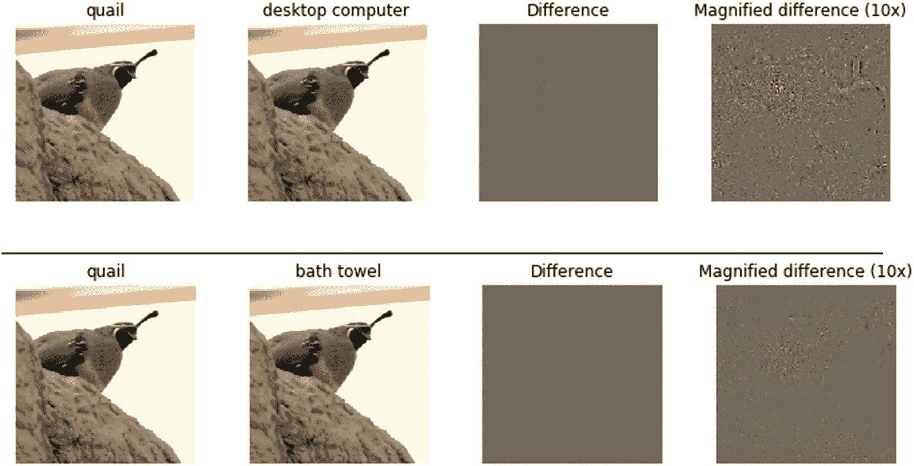

图 3-4

示例对抗样本。通过轻微改变像素值（通常对人类眼睛来说不易察觉），模型可以被欺骗错误地将鹌鹑分类为其他物体，例如台式电脑或浴巾。

### 数据饥渴模型，尤其是标签

深度学习模型还受到训练网络所需的大量数据的限制。这尤其因为需要高质量、精心挑选的标签，模型可以从这些标签中学习。尽管如前所述的迁移学习和词嵌入等技术能够在某些情况下在一定程度上缓解这个问题，但深度学习无法从显式定义中学习，也无法完成许多不是简单输入输出配对的任务。尽管深度学习非常强大，但很明显，深度学习本身并不是人工通用智能的解决方案。作为另一个例子，深度学习甚至难以表示一个基本的排序算法。

深度学习的许多局限性实际上是机器学习算法的一般局限性，例如无法本质上区分相关性和因果关系。毕竟，深度学习仅仅是一种在优化从输入到输出的映射方面表现优异的统计技术。然而，与一些更简单的方法不同，解释深度神经网络解决方案可能非常困难。根据需要构建网络也可能相当困难，例如在出现问题时尝试调试或当想要调整建模结果的具体方面时。尽管深度学习有许多局限性，并且只是众多可用工具之一，但我们相信，深度学习将作为通往人工智能未来许多进步的垫脚石，正如我们稍后讨论的那样。

### 可重复性研究和基础理论

随着深度学习的普及，每年研究论文的数量急剧增加。最近，研究人员开始对这些论文的可重复性提出更多担忧，例如，当代码没有发布或未包含重现结果所需的具体细节时。此外，由于缺乏关于如何最佳地开发这些类型网络以及优化它们的理论理解，以及该领域许多论文需要大量计算资源来重现，这一问题更加严重。在实践中，过拟合很常见，并且根据评估方法和数据分割的不同，可以得到非常不同的结果。

Rahimi 最近在他的 2017 年 12 月 NIPS 演讲“机器学习已成为炼金术”中提出了缺乏理论基础的这个问题。他的观点是，我们缺乏关于为什么深度学习有效以及如何理解它何时无效的明确理论解释，这通常被称为黑盒问题。一个例外是信息瓶颈的概念，它认为网络通过瓶颈挤压信息来去除噪声和无关的细节，只保留与一般概念相关的特征（Tishby & Zaslavsky，2015）。其他人也警告说，理论通常落后于实证结果，过于谨慎的风险可能导致另一个“人工智能寒冬”，¹，而持续研究如何使用模型解决实际问题可以推动我们向前发展。

尽管如此，很明显，深度学习在许多实际应用中都是有效的，并且是实践者的有用工具，我们需要了解它的有用性和弱点，以便人工智能在未来能够继续为社会带来更多价值。我们相信，如果社区在发布与研究相关的代码以及可能的情况下发布数据方面更加开放，这将更有助于该领域向前发展。

## 展望未来：我们能从深度学习中期待什么？

尽管承认深度神经网络是一种具有许多局限性的统计方法，但我们乐观地认为，随着时间推移，深度神经网络将越来越多地被用作更复杂方法的基础构建块。例如，动态网络的使用，它使用深度神经网络，但允许网络随着时间输入到模型中的数据动态变化，最近已经兴起。² 将深度神经网络嵌入到强化学习系统中，也解决了越来越复杂的问题。LeCun (2018) 建议“可微编程”应该成为深度学习的重新命名，以标志着向一种新型软件的转变，这种软件是可微和可优化的。Karpathy (2017) 建议“[n]eural networks are not just another classifier, they represent the beginning of a fundamental shift in how we write software … they are Software 2.0.”。

我们预计研究将继续推动深度学习的实用性，例如在优化神经网络架构方面的潜在突破，正如之前所讨论的。一些研究领域仍然在很大程度上尚未解决，例如从未标记数据中学习的能力，也称为无监督学习，在这方面有很大的创新空间。此外，我们预计更多的工作将集中在程序综合和图网络，以及对抗网络的更多应用。

### 伦理与法规

最后，很明显，在偏见、安全、隐私以及深度学习和 AI 技术的适当使用等方面存在伦理问题。随着法律和法规的制定来限制这些系统的影响，这些伦理考量将开始越来越多地影响 AI 系统的发展。例如，正如之前提到的，现在的深度学习系统容易受到对抗性样本的影响，甚至在物理世界中也是如此，这构成了安全风险。除了安全影响之外，还有关于偏见的伦理考量。

在 AI 和机器学习算法中，偏见通常用统计偏见来描述和研究，这是一种数学结构，用于描述估计参数的预期值与真实值之间的差异。根据模型类型，偏见可以通过不同的方式引入。但即使一个系统在数学上没有偏见，它也可能在流行文化的词语解释中存在偏见。

流行文化中对偏见的定义通常与对某一特定群体的某种形式的偏见或优先对待有关。这通常被认为是不公平的。应该注意的是，公平性是文化定义的，并且随着历史的发展而变化。因此，不公平性实际上是在应用偏见。这个棘手的部分在于，人们通常认为计算机将是无偏见的，并且由数学模型产生的结果将比人类产生的结果更公平。然而，从本质上讲，深度学习模型将显示出某种偏见，因为推动它们的是构建这些模型的真实世界数据。不幸的是，这些真实的历史数据本身就带有偏见。

对于某些深度学习的应用，如招聘或贷款申请等高风险结果，很明显这可能会产生非常有害的影响。以表示单词在低维空间中的嵌入为例。很明显，单词嵌入是有偏见的，例如在谷歌新闻文章上训练的单词嵌入。这些单词嵌入具有嵌入的单词关系，这些关系可以很容易地提取出来，例如“男人是程序员，女人是家庭主妇”（Bolukbasi，Chang，Zou，Saligrama 和 Kalai，2016）。如果在应用深度学习时没有考虑到这些问题，这可能会对单词嵌入的应用产生有害的影响。例如，招聘人员越来越多地使用算法来自动将简历与职位空缺相匹配。然而，如果在这一过程中盲目地应用单词嵌入，并且历史数据倾向于“成功”的人在这个角色中大多是男性，那么这个过程的结果可能会被认为是有害的。O’Neil（2016）在她的著作《数学破坏武器》中概述了许多算法在大数据时代可能产生有害影响的方式，因此重要的是要意识到潜在的危害。

不幸的是，偏见可能很难检测和消除。以 2015 年为例，一个照片应用错误地将一位深色皮肤的人标记为“大猩猩”，这促使该公司迅速发表了道歉。如果公司当时意识到这一点，他们肯定不会部署这项技术。然而，与传统的软件应用相比，AI 和 ML 预测模型本身更难以测试。毕竟，在经典的软件系统中，输入将产生一个已知的输出，但这种情况并不适用于基于 AI 的系统。基于 AI 的系统是根据其统计结果进行评估的，而这些结果往往可以从一次数据运行变化到下一次。除非为基于 AI 的系统开发出足够的测试方法，否则部署基于 AI 的系统可能会遇到部署的重大障碍。

不仅存在伦理和文化问题，还有一系列的法律影响。幸运的是，机器学习应用中的偏差问题在研究和行业社区中越来越受到关注。然而，重要的是要认识到，仅靠技术进步并不能解决这个问题；没有一种适合所有情况的解决方案。对 AI 模型进行测试和开发公平的系统无疑需要跨学科的方法来实现构建安全、广泛分布的 AI 的目标。

## 摘要

本章讨论了深度学习领域的一些趋势，例如在准确性和速度方面寻找最佳网络架构。我们还回顾了计算机视觉领域神经网络的两个最近令人兴奋的发展，第一个是通过胶囊网络解决 CNN 的限制，另一个是使用神经网络尝试通过自动化机器学习技术以最小的人为干预定义最佳架构。

我们还讨论了深度学习的其他几个趋势，包括更专业的硬件以及使用预训练模型以比从头开始构建深度学习解决方案所需的数据更少的数据来播种解决方案。我们最后讨论了一些深度学习的局限性，开发者应该意识到，例如这些模型无法理解抽象概念，以及一些法律和伦理问题，包括对抗性示例和基于它们构建的基础数据中的偏差。

下一章 4 描述了您如何使用 Microsoft AI 平台上的工具、基础设施和服务来管理您的深度学习项目和模型的发展生命周期，进行大规模训练，并快速将其作为 Web API 进行部署。

脚注 1

Lighthill 于 1973 年发布了一份报告，建议人工智能是一个失败，过于肤浅以至于无法用于实践，导致对该领域兴趣的大幅减少。

2

诸如 MXNet/Gluon、PyTorch 和 Chainer 等框架支持这些类型的网络，我们预计这一趋势将持续下去。
